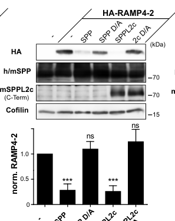

## Question

# Gene Research for Functional Annotation

## ⚠️ CRITICAL: Gene/Protein Identification Context

**BEFORE YOU BEGIN RESEARCH:** You MUST verify you are researching the CORRECT gene/protein. Gene symbols can be ambiguous, especially for less well-characterized genes from non-model organisms.

### Target Gene/Protein Identity (from UniProt):
- **UniProt Accession:** Q8N6R1
- **Protein Description:** RecName: Full=Stress-associated endoplasmic reticulum protein 2; AltName: Full=Ribosome-associated membrane protein RAMP4-2;
- **Gene Information:** Name=SERP2; Synonyms=C13orf21;
- **Organism (full):** Homo sapiens (Human).
- **Protein Family:** Belongs to the RAMP4 family. .
- **Key Domains:** ER_stress-assoc. (IPR010580); RAMP4 (PF06624)

### MANDATORY VERIFICATION STEPS:

1. **Check if the gene symbol "SERP2" matches the protein description above**
2. **Verify the organism is correct:** Homo sapiens (Human).
3. **Check if protein family/domains align with what you find in literature**
4. **If you find literature for a DIFFERENT gene with the same or similar symbol, STOP**

### If Gene Symbol is Ambiguous or You Cannot Find Relevant Literature:

**DO NOT PROCEED WITH RESEARCH ON A DIFFERENT GENE.** Instead:
- State clearly: "The gene symbol 'SERP2' is ambiguous or literature is limited for this specific protein"
- Explain what you found (e.g., "Found extensive literature on a different gene with the same symbol in a different organism")
- Describe the protein based ONLY on the UniProt information provided above
- Suggest that the protein function can be inferred from domain/family information

### Research Target:

Please provide a comprehensive research report on the gene **SERP2** (gene ID: SERP2, UniProt: Q8N6R1) in human.

The research report should be a detailed narrative explaining the function, biological processes, and localization of the gene product. Citations should be given for all claims.

You should prioritize authoritative reviews and primary scientific literature when conducting research. You can supplement
this with annotations you find in gene/protein databases, but these can be outdated or inaccurate.

We are specifically interested in the primary function of the gene - for enzymes, what reaction is catalyzed, and what is the substrate specificity? For transporters, what is the substrate? For structural proteins or adapters, what is the broader structural role? For signaling molecules, what is the role in the pathway.

We are interested in where in or outside the cell the gene product carries out its function.

We are also interested in the signaling or biochemical pathways in which the gene functions. We are less interested in broad pleiotropic effects, except where these elucidate the precise role.

Include evidence where possible. We are interested in both experimental evidence as well as inference from structure, evolution, or bioinformatic analysis. Precise studies should be prioritized over high-throughput, where available.

## Output

Question: You are an expert researcher providing comprehensive, well-cited information.

Provide detailed information focusing on:
1. Key concepts and definitions with current understanding
2. Recent developments and latest research (prioritize 2023-2024 sources)
3. Current applications and real-world implementations
4. Expert opinions and analysis from authoritative sources
5. Relevant statistics and data from recent studies

Format as a comprehensive research report with proper citations. Include URLs and publication dates where available.
Always prioritize recent, authoritative sources and provide specific citations for all major claims.

# Gene Research for Functional Annotation

## ⚠️ CRITICAL: Gene/Protein Identification Context

**BEFORE YOU BEGIN RESEARCH:** You MUST verify you are researching the CORRECT gene/protein. Gene symbols can be ambiguous, especially for less well-characterized genes from non-model organisms.

### Target Gene/Protein Identity (from UniProt):
- **UniProt Accession:** Q8N6R1
- **Protein Description:** RecName: Full=Stress-associated endoplasmic reticulum protein 2; AltName: Full=Ribosome-associated membrane protein RAMP4-2;
- **Gene Information:** Name=SERP2; Synonyms=C13orf21;
- **Organism (full):** Homo sapiens (Human).
- **Protein Family:** Belongs to the RAMP4 family. .
- **Key Domains:** ER_stress-assoc. (IPR010580); RAMP4 (PF06624)

### MANDATORY VERIFICATION STEPS:

1. **Check if the gene symbol "SERP2" matches the protein description above**
2. **Verify the organism is correct:** Homo sapiens (Human).
3. **Check if protein family/domains align with what you find in literature**
4. **If you find literature for a DIFFERENT gene with the same or similar symbol, STOP**

### If Gene Symbol is Ambiguous or You Cannot Find Relevant Literature:

**DO NOT PROCEED WITH RESEARCH ON A DIFFERENT GENE.** Instead:
- State clearly: "The gene symbol 'SERP2' is ambiguous or literature is limited for this specific protein"
- Explain what you found (e.g., "Found extensive literature on a different gene with the same symbol in a different organism")
- Describe the protein based ONLY on the UniProt information provided above
- Suggest that the protein function can be inferred from domain/family information

### Research Target:

Please provide a comprehensive research report on the gene **SERP2** (gene ID: SERP2, UniProt: Q8N6R1) in human.

The research report should be a detailed narrative explaining the function, biological processes, and localization of the gene product. Citations should be given for all claims.

You should prioritize authoritative reviews and primary scientific literature when conducting research. You can supplement
this with annotations you find in gene/protein databases, but these can be outdated or inaccurate.

We are specifically interested in the primary function of the gene - for enzymes, what reaction is catalyzed, and what is the substrate specificity? For transporters, what is the substrate? For structural proteins or adapters, what is the broader structural role? For signaling molecules, what is the role in the pathway.

We are interested in where in or outside the cell the gene product carries out its function.

We are also interested in the signaling or biochemical pathways in which the gene functions. We are less interested in broad pleiotropic effects, except where these elucidate the precise role.

Include evidence where possible. We are interested in both experimental evidence as well as inference from structure, evolution, or bioinformatic analysis. Precise studies should be prioritized over high-throughput, where available.

## Research report: Human **SERP2** (UniProt **Q8N6R1**) — Stress-associated endoplasmic reticulum protein 2 / RAMP4-2

### Executive summary
Human **SERP2** (UniProt **Q8N6R1**) is annotated (per the user-provided UniProt identity) as a **RAMP4-family** small ER-associated membrane protein (“Stress-associated endoplasmic reticulum protein 2”; alternative name “Ribosome-associated membrane protein RAMP4-2”). In the accessible literature retrieved here, **direct, SERP2/Q8N6R1-labeled mechanistic studies are limited**; most mechanistic evidence concerns the closely named protein **RAMP4-2** without explicit gene/UniProt mapping in-text, and broader **RAMP4/SERP1** family context from translocon biology. The best-supported functional picture is that the RAMP4 family are **ER membrane proteins enriched at ribosome–translocon complexes**, and that **RAMP4-2 behaves as a tail-anchored ER substrate for intramembrane proteases** (SPP/SPPL2c), implying a role in **ER proteostasis and membrane-protein biogenesis** (niemeyer2019theintramembraneprotease pages 3-4, niemeyer2019theintramembraneprotease pages 5-6, vismpas2024rampingupknowledge pages 2-3, gemmer2020aclearerpicture pages 2-3, niemeyer2019theintramembraneprotease media d5029e8f).

A 2023 human genetics study explicitly names **SERP2** as “Stress-Associated Endoplasmic Reticulum Protein 2” and reports **female-specific association of an intergenic SNP near SERP2 with asthma**; however, this evidence does not establish molecular mechanism (odimba2023identificationofsexspecific pages 10-11).

### 1) Key concepts and definitions (current understanding)

#### 1.1 Endoplasmic reticulum (ER) protein biogenesis and the translocon
Secretory and membrane proteins are inserted into or translocated across the ER membrane primarily via the **Sec61 translocon**, often while the ribosome is actively translating (co-translational insertion). Accessory proteins (e.g., TRAP, TRAM1, and ribosome-associated membrane proteins) can modulate signal peptide handling, lateral-gate opening, and client specificity. Recent structural work emphasizes that the translocon is a **dynamic assembly**, with accessory factors associating transiently depending on the substrate (vismpas2024rampingupknowledge pages 2-3, gemmer2020aclearerpicture pages 2-3).

#### 1.2 RAMP proteins (ribosome-associated membrane proteins)
RAMP proteins were originally identified biochemically as **ribosome-associated components** of rough ER membrane fractions. A review of ER translocon composition notes that **RAMP4** was among RAMPs isolated from pancreatic microsomes; recovery depended on detergent/salt conditions, and RAMP4 was one of the most detergent- and salt-resistant proteins isolated alongside translocon components, although early studies could not determine which proteins are stoichiometric translocon subunits (gemmer2020aclearerpicture pages 2-3).

#### 1.3 Tail-anchored (TA) proteins and intramembrane proteolysis
**Tail-anchored proteins** are membrane proteins with a single hydrophobic helix near the C-terminus, inserted post-translationally into membranes. A key proteostasis mechanism for certain TA proteins is **intramembrane proteolysis** by aspartyl proteases such as **SPP (signal peptide peptidase)** and SPP-like proteases (SPPL family), which cleave within the transmembrane region and regulate stability/turnover of specific membrane proteins (niemeyer2019theintramembraneprotease pages 3-4, niemeyer2019theintramembraneprotease pages 5-6).

### 2) SERP2 identity verification and ambiguity control (critical)
The symbol “SERP2” can be confused with unrelated “SERP-2” entities in other biological contexts (e.g., viral serpins in poxvirus literature). Within the retrieved human genetics literature, **SERP2 is explicitly referred to as “Stress-Associated Endoplasmic Reticulum Protein 2”** (odimba2023identificationofsexspecific pages 10-11). Mechanistic ER-translocon literature often refers to **RAMP4** (and **RAMP4-2**) but, in the retrieved excerpts, does **not** explicitly map these names to **SERP2/C13orf21/Q8N6R1**; therefore, interpretations below separate (i) direct SERP2-locus human genetics evidence from (ii) RAMP4-family mechanistic inference, and note where evidence is **family-level** rather than SERP2-specific.

### 3) Molecular function and localization: what is supported by experimental evidence

#### 3.1 RAMP4 family localization at the ER translocon (structural biology context)
A 2024 eLife “Insight” discussing advanced cryo-EM of stalled ribosome–translocon complexes reports that **RAMP4 localizes at the Sec61 lateral gate** and relays a mechanistic proposal that RAMP4 can act as a **“fourth subunit” of Sec61**, helping keep the channel open and tether the complex to ribosomes during insertion of membrane proteins (vismpas2024rampingupknowledge pages 2-3). The same Insight indicates RAMP4 may be **transiently displaced** during insertion of transmembrane domains and may **dissociate when other factors (PAT chaperone complex) are recruited**, reinforcing a dynamic, substrate-dependent model (vismpas2024rampingupknowledge pages 2-3).

A 2020 review similarly places RAMP4 (renamed SERP1 in that context) among proteins isolated with ER translocon fractions and emphasizes how difficult integral membrane accessory proteins are to visualize in some cryo-ET approaches (gemmer2020aclearerpicture pages 2-3). 

Interpretation for SERP2/Q8N6R1: because UniProt places SERP2 in the **RAMP4 family**, the most conservative inference is that SERP2 is likely an **ER membrane protein** participating in (or proximal to) **ribosome–translocon complexes**, but these specific structural statements are **directly about RAMP4 (often equated to SERP1 in the literature)** rather than explicitly about SERP2 (vismpas2024rampingupknowledge pages 2-3, gemmer2020aclearerpicture pages 2-3).

#### 3.2 RAMP4-2 as a tail-anchored ER protein and substrate of SPPL2c/SPP (direct experimental evidence)
A primary mechanistic study of the intramembrane protease **SPPL2c** tested multiple TA proteins including **RAMP4-2**. The authors describe **RAMP4 and RAMP4-2 as stress-associated ER-associated proteins** and treat RAMP4-2 as a **tail-anchored (TA) protein** in their assays (niemeyer2019theintramembraneprotease pages 3-4, niemeyer2019theintramembraneprotease pages 5-6). In HEK293/HeLa overexpression experiments, the study reports:

- Cytochrome b5, **RAMP4**, and **RAMP4-2** were proteolyzed by **SPP**.
- Of those candidates, **RAMP4-2 was the only one cleaved efficiently by SPPL2c**, leading to near-complete depletion of the substrate under the experimental conditions (niemeyer2019theintramembraneprotease pages 3-4, niemeyer2019theintramembraneprotease pages 5-6).
- The paper also uses inhibitor experiments and densitometric quantification to support differential processing of **HA-RAMP4-2** by SPP vs SPPL2c (niemeyer2019theintramembraneprotease pages 5-6, niemeyer2019theintramembraneprotease media d5029e8f).

These data provide the strongest functional clue relevant to the UniProt-described SERP2 protein *if* the RAMP4-2 substrate corresponds to SERP2/Q8N6R1: SERP2 would be expected to be **ER-localized**, **tail-anchored**, and potentially regulated by **SPPL2c/SPP-mediated intramembrane proteolysis** (niemeyer2019theintramembraneprotease pages 3-4, niemeyer2019theintramembraneprotease pages 5-6, niemeyer2019theintramembraneprotease media d5029e8f). However, in the retrieved excerpt, RAMP4-2 is not explicitly mapped to SERP2/C13orf21/Q8N6R1, so this remains an inference that must be verified via sequence/accession mapping in the full text or databases.

#### 3.3 2023: RAMP4-2 used as an SPPL2c activity readout and named as stress-associated ER protein family member 2
A 2023 mechanistic paper on regulation of SPPL2c uses **HA-RAMP4-2 cleavage as a readout assay** and explicitly refers to **RAMP4-2 as “stress-associated endoplasmic reticulum protein family member 2 (RAMP4-2)”** (contreras2023thetransmembranedomain pages 1-3, contreras2023thetransmembranedomain pages 4-7, contreras2023thetransmembranedomain pages 7-9). This supports the concept that RAMP4-2 is an ER stress-associated family member and that it is experimentally tractable as an intramembrane-protease substrate (contreras2023thetransmembranedomain pages 1-3).

### 4) Pathways and biological processes most plausibly linked to SERP2

Given the evidence available in this run, the best-supported pathway context for SERP2/Q8N6R1 is:

1. **ER membrane protein biogenesis / ribosome–translocon biology**: RAMP4-family proteins are positioned near Sec61’s lateral gate and implicated in keeping the translocon in an insertion-competent state in structural models (vismpas2024rampingupknowledge pages 2-3). 
2. **ER proteostasis / protein quality control via intramembrane proteolysis**: RAMP4-2 is a TA substrate cleaved by SPPL2c/SPP, suggesting regulated turnover as part of proteostasis in ER membranes (niemeyer2019theintramembraneprotease pages 3-4, niemeyer2019theintramembraneprotease pages 5-6, niemeyer2019theintramembraneprotease media d5029e8f).

These two contexts are coherent: proteins that transiently associate with the translocon and integrate into ER membranes are often subject to quality control and regulated turnover, including intramembrane proteolysis.

### 5) Recent developments (prioritizing 2023–2024)

#### 5.1 2024: cryo-EM-driven mechanistic model for RAMP4 at Sec61
The 2024 eLife Insight highlights that cryo-EM intermediates place **RAMP4 at the Sec61 lateral gate** and argue it may act as a **functional subunit** of Sec61 in certain translocon states, with possible **dynamic association/dissociation** during multi-pass insertion (vismpas2024rampingupknowledge pages 2-3). This represents a substantial conceptual development in how small accessory ER membrane proteins may regulate translocon conformational states.

#### 5.2 2023: SPPL2c regulation studies keep RAMP4-2 as a central biochemical substrate
The 2023 CMLS paper uses **RAMP4-2 cleavage assays** to mechanistically dissect regulation of SPPL2c (via Frey1 motifs), reinforcing RAMP4-2 as a key experimental substrate for this intramembrane protease system (contreras2023thetransmembranedomain pages 4-7, contreras2023thetransmembranedomain pages 7-9).

#### 5.3 2023: human genetics implicates SERP2 locus in female-specific asthma association
In a 2023 genome-wide SNP-by-sex interaction analysis (CLSA; n=23,323), the authors report that an intergenic SNP **rs9525931 near SERP2** had a **female-specific association with asthma** after Bonferroni correction (odimba2023identificationofsexspecific pages 10-11). They further note that variants near SERP2 had been reported in prior GWAS for lung function measures (FEV1 and FEV1/FVC) and that SERP2-mapped CpGs/SNPs had been associated with Alzheimer’s disease in females (odimba2023identificationofsexspecific pages 10-11). This is “gene-level” support for clinical relevance but does not resolve molecular mechanism.

### 6) Current applications and real-world implementations

1. **Mechanistic cell biology tool substrate**: RAMP4-2 is used as a **biochemical substrate/readout** for SPPL2c activity and regulation in cell-based assays (niemeyer2019theintramembraneprotease pages 5-6, contreras2023thetransmembranedomain pages 4-7).
2. **Human genetics/biomarker hypothesis generation**: SERP2-locus associations (e.g., rs9525931 near SERP2) provide candidates for **sex-specific asthma susceptibility genetics** and motivate follow-up functional genomics (odimba2023identificationofsexspecific pages 10-11).
3. **Translocon structural biology and drug target context (indirect)**: While not SERP2-specific, the emerging view of small membrane accessory proteins (like RAMP4-family members) controlling Sec61 gating states informs the broader agenda of targeting ER protein biogenesis machinery in disease, although direct SERP2 targeting applications are not established in the retrieved set (vismpas2024rampingupknowledge pages 2-3, gemmer2020aclearerpicture pages 2-3).

### 7) Expert opinions / authoritative analysis (from reviews and insights)

- The 2020 translocon review emphasizes that early biochemical isolation cannot fully resolve which RAMPs are stoichiometric translocon parts and underscores technical limitations in visualizing small integral membrane partners by cryo-ET, implying that mechanistic claims for these proteins must be evaluated in light of method constraints (gemmer2020aclearerpicture pages 2-3).
- The 2024 eLife Insight interprets new structural intermediates to propose a more concrete role for RAMP4 as a lateral-gate-adjacent factor that may keep Sec61 open and tethered, but also suggests it may dissociate as other factors bind—highlighting an emerging consensus that “translocon composition is dynamic” rather than fixed (vismpas2024rampingupknowledge pages 2-3).

### 8) Key statistics and quantitative findings

- **Human asthma GWAS**: 23,323 individuals; 416,562 SNPs after QC; 49 SNPs with interaction p < 10^-5 screened; **rs9525931 near SERP2** showed female-specific association with asthma after Bonferroni correction (odimba2023identificationofsexspecific pages 10-11).
- **SPPL2c substrate screen (mouse testis proteomics)**: in SPPL2c knockout testis membrane fractions, tail-anchored candidates **STX8** and **PLN** were enriched with ratios ~1.34 and ~1.59 (KO/WT), respectively, illustrating the quantitative framework used for identifying TA substrates of SPPL2c in vivo (niemeyer2019theintramembraneprotease pages 8-10). While not SERP2 itself, this supports the same mechanistic system in which RAMP4-2 is studied.
- **RAMP4-2 proteolysis**: RAMP4-2 is described as the only one among tested TA candidates efficiently cleaved by SPPL2c in the cell-based substrate panel, with near-complete depletion under assay conditions; inhibitor and densitometric quantification data are presented in the figure panels retrieved (niemeyer2019theintramembraneprotease pages 3-4, niemeyer2019theintramembraneprotease pages 5-6, niemeyer2019theintramembraneprotease media d5029e8f).

### 9) Evidence table
The table below distinguishes direct SERP2 evidence from RAMP4-family context and RAMP4-2 mechanistic data.

| Evidence type | What was shown | System/assay | Key quantitative findings (numbers) | Interpretation for SERP2 function/localization | Source (paper, year, URL) |
|---|---|---|---|---|---|
| Genetic association | Human **SERP2** was explicitly named **Stress-Associated Endoplasmic Reticulum Protein 2**; an intergenic SNP near SERP2 showed a female-specific asthma association, and the paper also noted prior associations of SERP2-region variants with lung function/COPD and female Alzheimer’s disease signals. | SNP-by-sex interaction GWAS and sex-stratified analysis in 23,323 Canadian adults from CLSA | 23,323 individuals analyzed; 49 SNPs with interaction *p* < 10^-5 screened; **3 female-specific SNPs** passed Bonferroni correction, including **rs9525931 near SERP2** (odimba2023identificationofsexspecific pages 10-11) | Confirms the existence of human SERP2 as a distinct gene; current direct evidence is genetic/association-based rather than mechanistic, with the name implying ER association but not proving biochemical function. | Odimba et al., 2023, *Journal of Asthma and Allergy*, https://doi.org/10.2147/JAA.S404670 (odimba2023identificationofsexspecific pages 10-11) |
| Structural/translocon (family context) | In recent cryo-EM interpretation, **RAMP4** localizes near the **Sec61 lateral gate** and was proposed to behave like a **fourth Sec61 subunit**, helping keep the channel open and tether the complex to ribosomes during membrane protein insertion. | Cryo-EM/structural interpretation of stalled ribosome–translocon intermediates, reviewed in eLife Insight | No explicit stoichiometric number beyond the proposal of a **"fourth subunit"**; structural intermediates captured open-gate states (vismpas2024rampingupknowledge pages 2-3) | Supports a plausible **ER translocon-associated** role for the UniProt-defined SERP2/RAMP4-family protein, but this evidence is for **RAMP4 family context** and does **not explicitly map the studied RAMP4 species to SERP2/Q8N6R1**. | Vismpas & Förster, 2024, *eLife*, https://doi.org/10.7554/eLife.98548 (vismpas2024rampingupknowledge pages 2-3) |
| Structural/translocon (family context) | Earlier translocon review summarized that **RAMP4/SERP1** was originally isolated among ribosome-associated membrane proteins and was unusually resistant to detergent/salt extraction with Sec61-associated material, but its exact stoichiometry/position was unresolved in older preparations. | Review of biochemical isolation and cryo-ET literature on mammalian ER translocons | No direct SERP2-specific numbers; key point is **detergent- and salt-resistant recovery** with translocon fractions (gemmer2020aclearerpicture pages 2-3) | Reinforces the inference that RAMP4-family proteins are **ER membrane/ribosome-translocon associated**; however, this remains **family-level context**, not direct evidence for human SERP2 specifically. | Gemmer & Förster, 2020, *Journal of Cell Science*, https://doi.org/10.1242/jcs.231340 (gemmer2020aclearerpicture pages 2-3) |
| Intramembrane proteolysis | **RAMP4-2** was experimentally tested as a **tail-anchored (TA) protein** and was the **only one among tested TA candidates** efficiently cleaved by **SPPL2c**; it also overlapped with SPPL2c in the ER. | HEK293/HeLa overexpression, Western blot cleavage assays, immunofluorescence colocalization | In the tested panel, **RAMP4-2** was the only candidate efficiently cleaved by SPPL2c; near-complete depletion was reported under assay conditions (niemeyer2019theintramembraneprotease pages 3-4, niemeyer2019theintramembraneprotease pages 5-6) | Provides the strongest functional/localization clue linked to the UniProt identity: if **RAMP4-2 corresponds to SERP2/Q8N6R1**, then SERP2 is likely an **ER-localized TA membrane protein** and a potential **SPPL2c/SPP substrate**. The limitation is that the retrieved paper text did **not explicitly map RAMP4-2 to SERP2/C13orf21/Q8N6R1**. | Niemeyer et al., 2019, *EMBO Reports*, https://doi.org/10.15252/embr.201846449 (niemeyer2019theintramembraneprotease pages 3-4, niemeyer2019theintramembraneprotease pages 5-6) |
| Intramembrane proteolysis / regulatory assay | **HA-RAMP4-2** was used as the readout substrate in SPPL2c inhibition studies; the paper explicitly referred to **RAMP4-2 as “stress-associated endoplasmic reticulum protein family member 2.”** | HEK-cell SPPL2c inhibition and co-immunoprecipitation assays using HA-RAMP4-2 substrate | Multiple assays quantified inhibition of **RAMP4-2** cleavage; exact effect sizes varied by mutant, but RAMP4-2 was the central substrate readout (contreras2023thetransmembranedomain pages 1-3, contreras2023thetransmembranedomain pages 4-7, contreras2023thetransmembranedomain pages 7-9) | Supports the designation of **RAMP4-2 as an ER stress-associated family member 2**, consistent with the UniProt annotation for SERP2; still, the paper excerpt did **not** provide the direct human gene symbol/UniProt mapping. | Contreras et al., 2023, *Cellular and Molecular Life Sciences*, https://doi.org/10.1007/s00018-023-04823-7 (contreras2023thetransmembranedomain pages 1-3, contreras2023thetransmembranedomain pages 4-7, contreras2023thetransmembranedomain pages 7-9) |
| Overall evidence quality / ambiguity | Retrieved literature repeatedly showed that **SERP2 is ambiguous** in the wider literature (e.g., viral/invertebrate “SERP-2” entries), while direct human SERP2 mechanistic studies were sparse; most mechanistic data came from **RAMP4/RAMP4-2 family literature** lacking explicit accession mapping. | Cross-literature verification across retrieved genetics, translocon, and protease papers | No direct number; key result is **absence of explicit SERP2↔RAMP4-2/Q8N6R1 mapping in retrieved primary texts** (odimba2023identificationofsexspecific pages 10-11, vismpas2024rampingupknowledge pages 2-3, niemeyer2019theintramembraneprotease pages 5-6, contreras2023thetransmembranedomain pages 1-3) | Best-supported conclusion is cautious: human **SERP2/Q8N6R1** is likely an **ER-associated RAMP4-family membrane protein**, probably **tail-anchored** and potentially linked to **translocon biology and intramembrane proteolysis**, but the direct literature base is limited. | Synthesis from retrieved evidence (odimba2023identificationofsexspecific pages 10-11, vismpas2024rampingupknowledge pages 2-3, niemeyer2019theintramembraneprotease pages 5-6, contreras2023thetransmembranedomain pages 1-3) |

*Table: This table summarizes the strongest retrieved evidence relevant to human SERP2/Q8N6R1 and separates direct human SERP2 findings from indirect RAMP4/RAMP4-2 family context. It is useful because the literature is sparse and symbol ambiguity makes careful evidence tracking essential.*

### 10) Limitations and what remains unknown specifically for SERP2/Q8N6R1

1. **Direct SERP2/Q8N6R1 mechanistic studies**: In the retrieved corpus, there were no excerpts explicitly stating “SERP2 (C13orf21; Q8N6R1) = RAMP4-2” in the methods/construct definitions; thus, direct mapping of RAMP4-2 experimental substrate to UniProt Q8N6R1 remains unconfirmed in-text here.
2. **Biochemical function**: No enzymatic or transporter activity is suggested; rather, the plausible function is **structural/regulatory** as an ER membrane accessory factor and/or a proteostasis substrate.
3. **Cellular localization**: The best mechanistic evidence supports ER localization for RAMP4-2 in co-localization experiments, and translocon-associated localization for RAMP4 in cryo-EM models; SERP2-specific localization in human cells is not directly demonstrated in the retrieved excerpts.

### 11) Cited key sources (with dates and URLs)
- Odimba U, Senthilselvan A, Farrell J, Gao Z. **Identification of Sex-Specific Genetic Polymorphisms Associated with Asthma…** *Journal of Asthma and Allergy* (May **2023**). https://doi.org/10.2147/JAA.S404670 (odimba2023identificationofsexspecific pages 10-11)
- Vismpas D, Förster F. **RAMPing up knowledge of the translocon** *eLife* (May **2024**). https://doi.org/10.7554/eLife.98548 (vismpas2024rampingupknowledge pages 2-3)
- Gemmer M, Förster F. **A clearer picture of the ER translocon complex** *Journal of Cell Science* (Feb **2020**). https://doi.org/10.1242/jcs.231340 (gemmer2020aclearerpicture pages 2-3)
- Niemeyer J et al. **The intramembrane protease SPPL2c promotes male germ cell development by cleaving phospholamban** *EMBO reports* (published online Feb 2019; issue year **2019**). https://doi.org/10.15252/embr.201846449 (niemeyer2019theintramembraneprotease pages 3-4, niemeyer2019theintramembraneprotease pages 5-6, niemeyer2019theintramembraneprotease media d5029e8f)
- Contreras W, Bazan JF, Mentrup T. **The transmembrane domain of Frey1 harbors a transplantable inhibitory motif for intramembrane proteases** *Cellular and Molecular Life Sciences* (Jun **2023**). https://doi.org/10.1007/s00018-023-04823-7 (contreras2023thetransmembranedomain pages 1-3, contreras2023thetransmembranedomain pages 4-7, contreras2023thetransmembranedomain pages 7-9)

### Figure-based evidence (key)
Niemeyer et al. Figure 2 panels show **differential cleavage of HA-RAMP4-2** by SPPL2c vs SPP and inhibitor effects (niemeyer2019theintramembraneprotease media d5029e8f, niemeyer2019theintramembraneprotease media 721c9236, niemeyer2019theintramembraneprotease media da4109d7).

References

1. (niemeyer2019theintramembraneprotease pages 3-4): Johannes Niemeyer, Torben Mentrup, Ronny Heidasch, Stephan A Müller, Uddipta Biswas, Rieke Meyer, Alkmini A Papadopoulou, Verena Dederer, Martina Haug‐Kröper, Vivian Adamski, Renate Lüllmann‐Rauch, Martin Bergmann, Artur Mayerhofer, Paul Saftig, Gunther Wennemuth, Rolf Jessberger, Regina Fluhrer, Stefan F Lichtenthaler, Marius K Lemberg, and Bernd Schröder. The intramembrane protease sppl2c promotes male germ cell development by cleaving phospholamban. EMBO reports, Mar 2019. URL: https://doi.org/10.15252/embr.201846449, doi:10.15252/embr.201846449. This article has 47 citations and is from a highest quality peer-reviewed journal.

2. (niemeyer2019theintramembraneprotease pages 5-6): Johannes Niemeyer, Torben Mentrup, Ronny Heidasch, Stephan A Müller, Uddipta Biswas, Rieke Meyer, Alkmini A Papadopoulou, Verena Dederer, Martina Haug‐Kröper, Vivian Adamski, Renate Lüllmann‐Rauch, Martin Bergmann, Artur Mayerhofer, Paul Saftig, Gunther Wennemuth, Rolf Jessberger, Regina Fluhrer, Stefan F Lichtenthaler, Marius K Lemberg, and Bernd Schröder. The intramembrane protease sppl2c promotes male germ cell development by cleaving phospholamban. EMBO reports, Mar 2019. URL: https://doi.org/10.15252/embr.201846449, doi:10.15252/embr.201846449. This article has 47 citations and is from a highest quality peer-reviewed journal.

3. (vismpas2024rampingupknowledge pages 2-3): Dimitrios Vismpas and Friedrich Förster. Ramping up knowledge of the translocon. eLife, May 2024. URL: https://doi.org/10.7554/elife.98548, doi:10.7554/elife.98548. This article has 2 citations and is from a domain leading peer-reviewed journal.

4. (gemmer2020aclearerpicture pages 2-3): Max Gemmer and Friedrich Förster. A clearer picture of the er translocon complex. Journal of Cell Science, Feb 2020. URL: https://doi.org/10.1242/jcs.231340, doi:10.1242/jcs.231340. This article has 144 citations and is from a domain leading peer-reviewed journal.

5. (niemeyer2019theintramembraneprotease media d5029e8f): Johannes Niemeyer, Torben Mentrup, Ronny Heidasch, Stephan A Müller, Uddipta Biswas, Rieke Meyer, Alkmini A Papadopoulou, Verena Dederer, Martina Haug‐Kröper, Vivian Adamski, Renate Lüllmann‐Rauch, Martin Bergmann, Artur Mayerhofer, Paul Saftig, Gunther Wennemuth, Rolf Jessberger, Regina Fluhrer, Stefan F Lichtenthaler, Marius K Lemberg, and Bernd Schröder. The intramembrane protease sppl2c promotes male germ cell development by cleaving phospholamban. EMBO reports, Mar 2019. URL: https://doi.org/10.15252/embr.201846449, doi:10.15252/embr.201846449. This article has 47 citations and is from a highest quality peer-reviewed journal.

6. (odimba2023identificationofsexspecific pages 10-11): Ugochukwu Odimba, Ambikaipakan Senthilselvan, Jamie Farrell, and Zhiwei Gao. Identification of sex-specific genetic polymorphisms associated with asthma in middle-aged and older canadian adults: an analysis of clsa data. Journal of Asthma and Allergy, 16:553-566, May 2023. URL: https://doi.org/10.2147/jaa.s404670, doi:10.2147/jaa.s404670. This article has 5 citations and is from a peer-reviewed journal.

7. (contreras2023thetransmembranedomain pages 1-3): Whendy Contreras, J. Fernando Bazan, and Torben Mentrup. The transmembrane domain of frey1 harbors a transplantable inhibitory motif for intramembrane proteases. Cellular and Molecular Life Sciences: CMLS, Jun 2023. URL: https://doi.org/10.1007/s00018-023-04823-7, doi:10.1007/s00018-023-04823-7. This article has 3 citations.

8. (contreras2023thetransmembranedomain pages 4-7): Whendy Contreras, J. Fernando Bazan, and Torben Mentrup. The transmembrane domain of frey1 harbors a transplantable inhibitory motif for intramembrane proteases. Cellular and Molecular Life Sciences: CMLS, Jun 2023. URL: https://doi.org/10.1007/s00018-023-04823-7, doi:10.1007/s00018-023-04823-7. This article has 3 citations.

9. (contreras2023thetransmembranedomain pages 7-9): Whendy Contreras, J. Fernando Bazan, and Torben Mentrup. The transmembrane domain of frey1 harbors a transplantable inhibitory motif for intramembrane proteases. Cellular and Molecular Life Sciences: CMLS, Jun 2023. URL: https://doi.org/10.1007/s00018-023-04823-7, doi:10.1007/s00018-023-04823-7. This article has 3 citations.

10. (niemeyer2019theintramembraneprotease pages 8-10): Johannes Niemeyer, Torben Mentrup, Ronny Heidasch, Stephan A Müller, Uddipta Biswas, Rieke Meyer, Alkmini A Papadopoulou, Verena Dederer, Martina Haug‐Kröper, Vivian Adamski, Renate Lüllmann‐Rauch, Martin Bergmann, Artur Mayerhofer, Paul Saftig, Gunther Wennemuth, Rolf Jessberger, Regina Fluhrer, Stefan F Lichtenthaler, Marius K Lemberg, and Bernd Schröder. The intramembrane protease sppl2c promotes male germ cell development by cleaving phospholamban. EMBO reports, Mar 2019. URL: https://doi.org/10.15252/embr.201846449, doi:10.15252/embr.201846449. This article has 47 citations and is from a highest quality peer-reviewed journal.

11. (niemeyer2019theintramembraneprotease media 721c9236): Johannes Niemeyer, Torben Mentrup, Ronny Heidasch, Stephan A Müller, Uddipta Biswas, Rieke Meyer, Alkmini A Papadopoulou, Verena Dederer, Martina Haug‐Kröper, Vivian Adamski, Renate Lüllmann‐Rauch, Martin Bergmann, Artur Mayerhofer, Paul Saftig, Gunther Wennemuth, Rolf Jessberger, Regina Fluhrer, Stefan F Lichtenthaler, Marius K Lemberg, and Bernd Schröder. The intramembrane protease sppl2c promotes male germ cell development by cleaving phospholamban. EMBO reports, Mar 2019. URL: https://doi.org/10.15252/embr.201846449, doi:10.15252/embr.201846449. This article has 47 citations and is from a highest quality peer-reviewed journal.

12. (niemeyer2019theintramembraneprotease media da4109d7): Johannes Niemeyer, Torben Mentrup, Ronny Heidasch, Stephan A Müller, Uddipta Biswas, Rieke Meyer, Alkmini A Papadopoulou, Verena Dederer, Martina Haug‐Kröper, Vivian Adamski, Renate Lüllmann‐Rauch, Martin Bergmann, Artur Mayerhofer, Paul Saftig, Gunther Wennemuth, Rolf Jessberger, Regina Fluhrer, Stefan F Lichtenthaler, Marius K Lemberg, and Bernd Schröder. The intramembrane protease sppl2c promotes male germ cell development by cleaving phospholamban. EMBO reports, Mar 2019. URL: https://doi.org/10.15252/embr.201846449, doi:10.15252/embr.201846449. This article has 47 citations and is from a highest quality peer-reviewed journal.

## Artifacts

- [Edison artifact artifact-00](SERP2-deep-research-falcon_artifacts/artifact-00.md)

## Citations

1. odimba2023identificationofsexspecific pages 10-11
2. gemmer2020aclearerpicture pages 2-3
3. vismpas2024rampingupknowledge pages 2-3
4. contreras2023thetransmembranedomain pages 1-3
5. niemeyer2019theintramembraneprotease pages 8-10
6. niemeyer2019theintramembraneprotease pages 3-4
7. niemeyer2019theintramembraneprotease pages 5-6
8. contreras2023thetransmembranedomain pages 4-7
9. contreras2023thetransmembranedomain pages 7-9
10. https://doi.org/10.2147/JAA.S404670
11. https://doi.org/10.7554/eLife.98548
12. https://doi.org/10.1242/jcs.231340
13. https://doi.org/10.15252/embr.201846449
14. https://doi.org/10.1007/s00018-023-04823-7
15. https://doi.org/10.15252/embr.201846449,
16. https://doi.org/10.7554/elife.98548,
17. https://doi.org/10.1242/jcs.231340,
18. https://doi.org/10.2147/jaa.s404670,
19. https://doi.org/10.1007/s00018-023-04823-7,