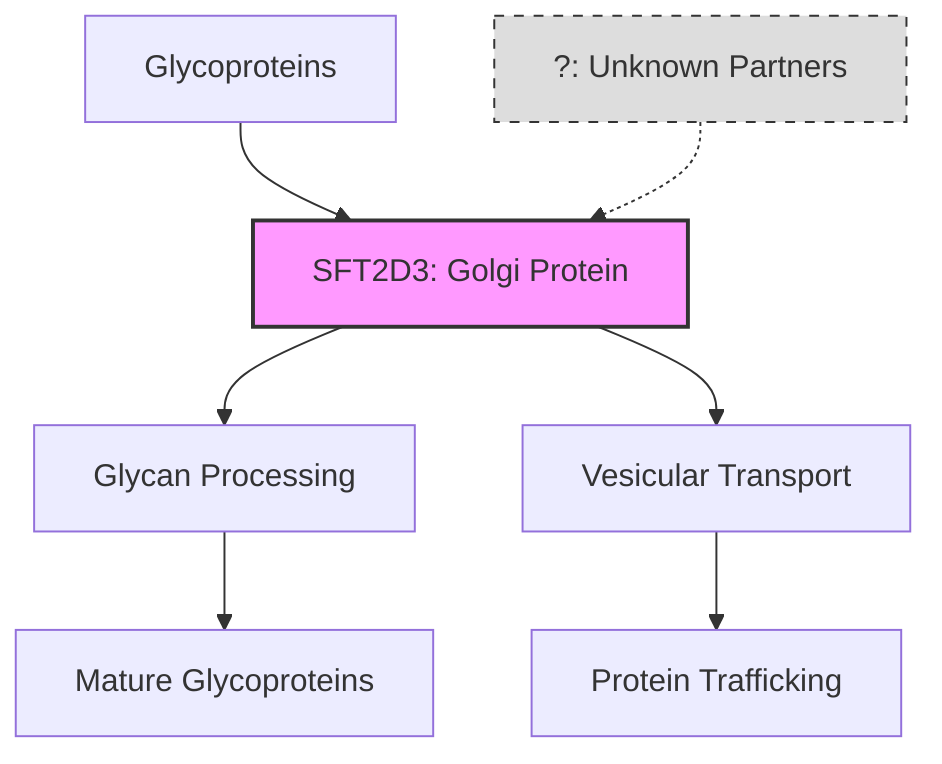

# Pathway Summary for SFT2D3

## Overview
SFT2D3 (SFT2 Domain Containing 3) is a Golgi-localized protein involved in protein glycosylation and trafficking. While its exact molecular function remains to be fully characterized, it likely participates in the regulation of glycoprotein processing and vesicular transport within the secretory pathway.

## Core Pathways

### Protein Glycosylation
SFT2D3 potentially regulates:
- N-glycan processing in Golgi
- Glycoprotein quality control
- Carbohydrate modifications
- Glycan maturation

### Vesicular Trafficking
Involvement in secretory pathway:
- Golgi-to-ER retrograde transport
- Protein sorting and packaging
- Vesicle formation or fusion
- Membrane dynamics

## Pathway Diagram

## Molecular Function
- **Localization**: Golgi apparatus
- **Domain structure**: SFT2 domain
- **Conservation**: Conserved in eukaryotes
- **Function**: Putative role in glycosylation/trafficking

## Research Status
- Limited functional characterization
- Potential disease associations under investigation
- Further studies needed to define specific pathways
