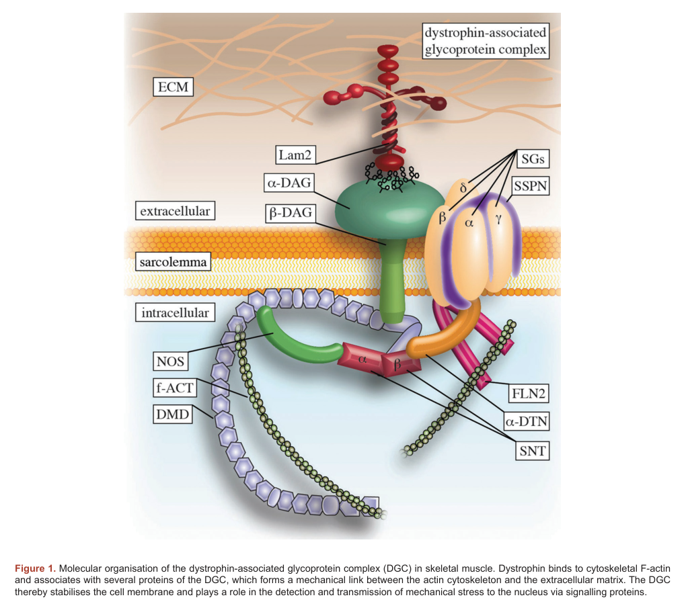

## Question

# Gene Research for Functional Annotation

## ⚠️ CRITICAL: Gene/Protein Identification Context

**BEFORE YOU BEGIN RESEARCH:** You MUST verify you are researching the CORRECT gene/protein. Gene symbols can be ambiguous, especially for less well-characterized genes from non-model organisms.

### Target Gene/Protein Identity (from UniProt):
- **UniProt Accession:** Q16586
- **Protein Description:** RecName: Full=Alpha-sarcoglycan; Short=Alpha-SG; AltName: Full=50 kDa dystrophin-associated glycoprotein; Short=50DAG; AltName: Full=Adhalin; AltName: Full=Dystroglycan-2; Flags: Precursor;
- **Gene Information:** Name=SGCA; Synonyms=ADL, DAG2;
- **Organism (full):** Homo sapiens (Human).
- **Protein Family:** Belongs to the sarcoglycan alpha/epsilon family.
- **Key Domains:** Cadg. (IPR006644); Cadherin-like_sf. (IPR015919); Sarcoglycan_alpha/epsilon. (IPR008908); Sarcoglycan_C. (IPR048347); Sarcoglycan_N. (IPR048346)

### MANDATORY VERIFICATION STEPS:

1. **Check if the gene symbol "SGCA" matches the protein description above**
2. **Verify the organism is correct:** Homo sapiens (Human).
3. **Check if protein family/domains align with what you find in literature**
4. **If you find literature for a DIFFERENT gene with the same or similar symbol, STOP**

### If Gene Symbol is Ambiguous or You Cannot Find Relevant Literature:

**DO NOT PROCEED WITH RESEARCH ON A DIFFERENT GENE.** Instead:
- State clearly: "The gene symbol 'SGCA' is ambiguous or literature is limited for this specific protein"
- Explain what you found (e.g., "Found extensive literature on a different gene with the same symbol in a different organism")
- Describe the protein based ONLY on the UniProt information provided above
- Suggest that the protein function can be inferred from domain/family information

### Research Target:

Please provide a comprehensive research report on the gene **SGCA** (gene ID: SGCA, UniProt: Q16586) in human.

The research report should be a detailed narrative explaining the function, biological processes, and localization of the gene product. Citations should be given for all claims.

You should prioritize authoritative reviews and primary scientific literature when conducting research. You can supplement
this with annotations you find in gene/protein databases, but these can be outdated or inaccurate.

We are specifically interested in the primary function of the gene - for enzymes, what reaction is catalyzed, and what is the substrate specificity? For transporters, what is the substrate? For structural proteins or adapters, what is the broader structural role? For signaling molecules, what is the role in the pathway.

We are interested in where in or outside the cell the gene product carries out its function.

We are also interested in the signaling or biochemical pathways in which the gene functions. We are less interested in broad pleiotropic effects, except where these elucidate the precise role.

Include evidence where possible. We are interested in both experimental evidence as well as inference from structure, evolution, or bioinformatic analysis. Precise studies should be prioritized over high-throughput, where available.

## Output

Question: You are an expert researcher providing comprehensive, well-cited information.

Provide detailed information focusing on:
1. Key concepts and definitions with current understanding
2. Recent developments and latest research (prioritize 2023-2024 sources)
3. Current applications and real-world implementations
4. Expert opinions and analysis from authoritative sources
5. Relevant statistics and data from recent studies

Format as a comprehensive research report with proper citations. Include URLs and publication dates where available.
Always prioritize recent, authoritative sources and provide specific citations for all major claims.

# Gene Research for Functional Annotation

## ⚠️ CRITICAL: Gene/Protein Identification Context

**BEFORE YOU BEGIN RESEARCH:** You MUST verify you are researching the CORRECT gene/protein. Gene symbols can be ambiguous, especially for less well-characterized genes from non-model organisms.

### Target Gene/Protein Identity (from UniProt):
- **UniProt Accession:** Q16586
- **Protein Description:** RecName: Full=Alpha-sarcoglycan; Short=Alpha-SG; AltName: Full=50 kDa dystrophin-associated glycoprotein; Short=50DAG; AltName: Full=Adhalin; AltName: Full=Dystroglycan-2; Flags: Precursor;
- **Gene Information:** Name=SGCA; Synonyms=ADL, DAG2;
- **Organism (full):** Homo sapiens (Human).
- **Protein Family:** Belongs to the sarcoglycan alpha/epsilon family.
- **Key Domains:** Cadg. (IPR006644); Cadherin-like_sf. (IPR015919); Sarcoglycan_alpha/epsilon. (IPR008908); Sarcoglycan_C. (IPR048347); Sarcoglycan_N. (IPR048346)

### MANDATORY VERIFICATION STEPS:

1. **Check if the gene symbol "SGCA" matches the protein description above**
2. **Verify the organism is correct:** Homo sapiens (Human).
3. **Check if protein family/domains align with what you find in literature**
4. **If you find literature for a DIFFERENT gene with the same or similar symbol, STOP**

### If Gene Symbol is Ambiguous or You Cannot Find Relevant Literature:

**DO NOT PROCEED WITH RESEARCH ON A DIFFERENT GENE.** Instead:
- State clearly: "The gene symbol 'SGCA' is ambiguous or literature is limited for this specific protein"
- Explain what you found (e.g., "Found extensive literature on a different gene with the same symbol in a different organism")
- Describe the protein based ONLY on the UniProt information provided above
- Suggest that the protein function can be inferred from domain/family information

### Research Target:

Please provide a comprehensive research report on the gene **SGCA** (gene ID: SGCA, UniProt: Q16586) in human.

The research report should be a detailed narrative explaining the function, biological processes, and localization of the gene product. Citations should be given for all claims.

You should prioritize authoritative reviews and primary scientific literature when conducting research. You can supplement
this with annotations you find in gene/protein databases, but these can be outdated or inaccurate.

We are specifically interested in the primary function of the gene - for enzymes, what reaction is catalyzed, and what is the substrate specificity? For transporters, what is the substrate? For structural proteins or adapters, what is the broader structural role? For signaling molecules, what is the role in the pathway.

We are interested in where in or outside the cell the gene product carries out its function.

We are also interested in the signaling or biochemical pathways in which the gene functions. We are less interested in broad pleiotropic effects, except where these elucidate the precise role.

Include evidence where possible. We are interested in both experimental evidence as well as inference from structure, evolution, or bioinformatic analysis. Precise studies should be prioritized over high-throughput, where available.

## Research report: Human **SGCA** (alpha-sarcoglycan; UniProt **Q16586**) — functional annotation

### 0) Target verification (identity and scope)
The UniProt accession **Q16586** corresponds to **human SGCA (sarcoglycan alpha)**, whose protein product is **alpha-sarcoglycan (α-sarcoglycan; α-SG; adhalin; “50 kDa dystrophin-associated glycoprotein”)** and is implicated in **autosomal recessive limb-girdle muscular dystrophy** under both legacy and updated naming (**LGMD2D** = **LGMDR3**). (tarakci2016thesarcoglycancomplex pages 3-4, marsolier20171stinternationalworkshop pages 24-28, sun2025recentinsightsinto pages 5-7)

### 1) Key concepts and definitions (current understanding)

#### 1.1 Dystrophin-associated glycoprotein complex (DGC) and the sarcoglycan complex
α-SG is one of four core **transmembrane glycoproteins** (**α, β, γ, δ**) that form a **tetrameric sarcoglycan complex** embedded in the **DGC** at the **skeletal muscle sarcolemma**; the DGC links intracellular cytoskeleton (via dystrophin) to the extracellular matrix and stabilizes the sarcolemma during contraction. (tarakci2016thesarcoglycancomplex pages 3-4, griffin2021preclinicalsystemicdelivery pages 1-3, tarakci2016thesarcoglycancomplex pages 1-3)

A schematic depiction of the DGC with the sarcoglycan complex at the sarcolemma is shown in Tarakci & Berger (2016), supporting the standard “structural linkage” model of SGCA function. (tarakci2016thesarcoglycancomplex media 15da8d54, tarakci2016thesarcoglycancomplex media 2d2dc6da)

#### 1.2 Protein type, topology, and localization
α-SG is described as a **single-pass transmembrane protein** with an extracellularly oriented domain and is targeted to the **plasma membrane (sarcolemma)** after maturation through the **ER→Golgi** secretory pathway. (panicucci2022…progressionin pages 11-16, marsolier20171stinternationalworkshop pages 24-28)

#### 1.3 Disease definition and nomenclature
In the revised ENMC-derived LGMD nomenclature, **SGCA** mutations cause **LGMDR3**, historically called **LGMD2D**. (wicklund2025limbgirdlemusculardystrophy pages 2-3, sun2025recentinsightsinto pages 5-7)

### 2) Molecular function, mechanism, and pathway context

#### 2.1 Primary function: membrane stabilization and mechanobiology
The dominant functional model is that α-SG is a **structural/mechanoprotective component** of the DGC: the sarcoglycan complex strengthens the dystrophin–dystroglycan axis and helps protect the sarcolemma from contraction-induced injury; it is also discussed as contributing to mechanotransduction (“mechanosensor” role in disease tables). (tarakci2016thesarcoglycancomplex pages 3-4, griffin2021preclinicalsystemicdelivery pages 1-3, tarakci2016thesarcoglycancomplex pages 1-3, sun2025recentinsightsinto pages 5-7)

#### 2.2 Complex assembly and trafficking (ER quality control as a key mechanism)
Assembly of the sarcoglycan tetramer occurs during **ER biosynthesis**, with evidence that a **β/δ core** forms early and recruits the other sarcoglycans; the complex traffics through the Golgi and integrates into the sarcolemma together with sarcospan and dystroglycan. (tarakci2016thesarcoglycancomplex pages 3-4, tarakci2016thesarcoglycancomplex pages 1-3)

A key mechanistic theme in SGCA-related disease is **protein folding/quality control**: many pathogenic **missense** SGCA variants lead to **misfolding**, **ER retention**, and **premature degradation** (e.g., via proteasome/ER-associated degradation), preventing normal sarcolemmal delivery and causing **secondary loss** of other sarcoglycan complex members at the membrane. (tarakci2016thesarcoglycancomplex pages 3-4, panicucci2022…progressionin pages 16-22, panicucci2022…progressionin pages 11-16)

#### 2.3 Reported biochemical activity (specialized literature)
Some literature additionally reports an **extracellular ATP-binding domain** and **Ca2+/Mg2+-dependent ecto-ATPase activity** associated with α-SG; this enzymatic-like activity is not the primary framing in most modern functional summaries (which emphasize structural DGC roles), but it remains a recurring observation in authoritative reviews/workshop material. (tarakci2016thesarcoglycancomplex pages 4-5, marsolier20171stinternationalworkshop pages 24-28)

### 3) Consequences of loss-of-function: pathogenesis in LGMDR3 / LGMD2D

#### 3.1 Cellular/tissue pathology
Loss or severe reduction of sarcolemmal α-SG destabilizes the sarcoglycan complex and disrupts DGC organization, producing **sarcolemmal instability** and a dystrophic cascade (membrane damage, necrosis, inflammation, fibrosis, reduced force). (tarakci2016thesarcoglycancomplex pages 3-4, panicucci2022…progressionin pages 16-22, panicucci2022…progressionin pages 11-16)

#### 3.2 In vivo model evidence
In the **sgca-null mouse model**, lack of α-SG causes typical dystrophic features (necrosis/fibrosis, elevated serum CK, reduced muscle force, impaired locomotion). Restoration of α-SG at the sarcolemma is associated with histologic and functional improvement, supporting a causal mechanistic role of α-SG in membrane stability. (griffin2021preclinicalsystemicdelivery pages 1-3)

#### 3.3 Genotype–phenotype principles supported by mechanistic evidence
Disease severity is linked to the extent of **residual protein** and mutation class, with review-level summaries indicating **nonsense/null variants** tend to be more severe than some missense variants, consistent with a dosage/trafficking model. (tarakci2016thesarcoglycancomplex pages 3-4, panicucci2022…progressionin pages 11-16)

### 4) Recent developments (prioritizing 2023–2024 sources)

#### 4.1 Trial readiness and endpoints (2024)
A major 2024 development relevant to SGCA clinical translation is the **GRASP-LGMD** effort to standardize/validate outcome measures across multiple LGMD genotypes including **SGCA (LGMDR3)**, enabling more efficient trial design and cross-subtype comparisons. (Doody et al., 2024; URL: https://doi.org/10.1186/s12883-024-03588-1; published Mar 2024) (doody2024definingclinicalendpoints pages 1-2)

#### 4.2 Therapeutic landscape reviews (2023)
A 2023 LGMD therapy review summarizes active strategies across LGMDs and specifically highlights prior α-SG gene delivery work, noting sustained expression in an early phase I trial context; it also frames the broader pipeline (gene delivery and other approaches) as moving from symptom management toward disease-root therapies. (Bouchard & Tremblay, 2023; URL: https://doi.org/10.3390/jcm12144769; published Jul 2023) (bouchard2023limb–girdlemusculardystrophies pages 8-9)

#### 4.3 Updated disease classification used in contemporary literature
Recent reviews explicitly map **R3 (2D)** to **SGCA (α-sarcoglycan)** and describe phenotype tables where the encoded protein is framed as part of a mechanosensing/adhesion system. (sun2025recentinsightsinto pages 5-7)

### 5) Current applications and real-world implementations

#### 5.1 Clinical and molecular diagnosis
Real-world diagnosis for SGCA-related disease leverages the mechanistic hallmark that pathogenic SGCA variants often lead to **loss of sarcolemmal sarcoglycan staining** (and sometimes secondary loss of other sarcoglycans). This “membrane localization” principle is used operationally in diagnostic pathology workflows and is also used as a pharmacodynamic biomarker concept in early therapeutic studies. (tarakci2016thesarcoglycancomplex pages 3-4, doody2024definingclinicalendpoints pages 1-2)

#### 5.2 Gene therapy and translational implementation
Preclinical systemic AAV delivery of SGCA demonstrates robust **sarcolemmal α-SG expression** and multi-domain functional improvement in sgca-null mice, establishing feasibility for systemic gene replacement paradigms. (Griffin et al., 2021; URL: https://doi.org/10.1089/hum.2019.199; published Apr 2021) (griffin2021preclinicalsystemicdelivery pages 1-3)

In the clinical development landscape, authoritative reviews document intramuscular **AAV-mediated α-sarcoglycan gene transfer** as a historical proof-of-concept step for sarcoglycanopathies, with sustained expression at 6 months post-treatment reported in the cited phase I experience. (Bouchard & Tremblay, 2023; URL: https://doi.org/10.3390/jcm12144769; published Jul 2023) (bouchard2023limb–girdlemusculardystrophies pages 8-9)

#### 5.3 Proteostasis/pharmacologic rescue approaches (mutation-specific, mechanism-based)
Because a substantial fraction of SGCA pathogenicity is trafficking/quality-control driven, pharmacologic “proteostasis modulation” is a rational application: mechanistic summaries and experimental work support that rescuing folding/trafficking can restore sarcolemmal localization of the sarcoglycan complex and reduce membrane fragility in human disease models. (panicucci2022…progressionin pages 16-22, marsolier20171stinternationalworkshop pages 24-28)

### 6) Expert opinions and analysis (authoritative synthesis)

#### 6.1 Consensus mechanistic view (structural complex + trafficking bottleneck)
Across mechanistic reviews and translational studies, the prevailing expert view is that **SGCA is not primarily an enzyme or transporter**, but rather a **membrane complex component** whose biological effect is mediated through **(i) assembly of a multiprotein complex** and **(ii) correct delivery to the sarcolemma**; ER quality control is a major determinant of whether missense variants cause loss-of-function. (tarakci2016thesarcoglycancomplex pages 3-4, panicucci2022…progressionin pages 16-22, panicucci2022…progressionin pages 11-16)

#### 6.2 Therapeutic implication
This mechanistic framing yields two complementary therapeutic logics:
1) **Gene addition** (AAV) to restore protein at the membrane, and
2) **Mutation-directed rescue** (folding/trafficking/proteostasis strategies) for missense variants that encode potentially functional but misprocessed α-SG.
Both are supported by preclinical efficacy evidence and are repeatedly emphasized in reviews as plausible routes toward disease-modifying therapies. (griffin2021preclinicalsystemicdelivery pages 1-3, bouchard2023limb–girdlemusculardystrophies pages 8-9)

### 7) Relevant statistics and quantitative data (recent sources)

* **LGMD global burden (meta-analysis cited in 2024 endpoints paper):** incidence **0.7 per 100,000** and prevalence **3 per 100,000**, corresponding to an estimated **~10,050 affected individuals in the US**. (Doody et al., 2024; published Mar 2024; URL: https://doi.org/10.1186/s12883-024-03588-1) (doody2024definingclinicalendpoints pages 1-2)
* **Proportion of tested LGMD cases attributed to SGCA in a 2006 US distribution (as cited in 2024 endpoints paper):** **15%** were SGCA (LGMDR3). (doody2024definingclinicalendpoints pages 1-2)
* **Phenotypic ranges relevant to sarcoglycanopathies including SGCA:** onset reported from **1–45 years** (commonly childhood) and CK elevations ranging from **~4× ULN** up to **~180× ULN**; severe disease courses can include early loss of ambulation (often around ages **12–16** in severe sarcoglycanopathies). (wicklund2025limbgirdlemusculardystrophy pages 2-3, sun2025recentinsightsinto pages 5-7)

### 8) Database-based disease association (supporting, not definitive)
Open Targets lists SGCA as strongly associated with limb-girdle muscular dystrophy entities (including autosomal recessive LGMD and LGMD2D terms), reflecting curated genetic evidence and supporting that the biomedical community’s consensus links SGCA to these disorders. (OpenTargets Search: Limb-girdle muscular dystrophy-SGCA)

---

### Summary evidence map (functional annotation at a glance)
| Aspect | Summary | Key quantitative details | Evidence |
|---|---|---|---|
| Identity / verified target | **SGCA** encodes **alpha-sarcoglycan (α-SG; adhalin)**, corresponding to **UniProt Q16586**, a muscle sarcolemmal sarcoglycan-family protein implicated in recessive LGMD. | Human target: **SGCA / α-sarcoglycan**; associated with **LGMDR3 (formerly LGMD2D)**. | (tarakci2016thesarcoglycancomplex pages 3-4, marsolier20171stinternationalworkshop pages 24-28, sun2025recentinsightsinto pages 5-7) |
| Protein type, domains, topology | α-SG is a **single-pass transmembrane glycoprotein** of the sarcoglycan alpha/epsilon family with a large extracellular region; reviews describe extracellular cadherin/EGF-like features and Ca²⁺-binding motifs, consistent with a membrane receptor/adhesion-support role rather than a classic enzyme. | Approx. **387 aa** protein with **17-aa signal peptide** and **1 transmembrane domain**. | (panicucci2022…progressionin pages 11-16, tarakci2016thesarcoglycancomplex pages 4-5) |
| Subcellular localization | Localizes primarily to the **skeletal muscle sarcolemma** as part of the dystrophin-associated protein/glycoprotein complex; maturation begins in the **ER**, followed by Golgi trafficking to the plasma membrane. | Highest functional relevance in **striated skeletal muscle**; lower cardiac expression reported in review literature. | (tarakci2016thesarcoglycancomplex pages 3-4, panicucci2022…progressionin pages 11-16, marsolier20171stinternationalworkshop pages 24-28, tarakci2016thesarcoglycancomplex media 15da8d54) |
| Complex membership / partners | α-SG is one of four core sarcoglycans (**α, β, γ, δ**) in the **sarcoglycan complex**, associated with **sarcospan**, **dystroglycan**, **dystrophin**, and adaptor/signaling proteins such as **α-dystrobrevin/syntrophin/nNOS** within the DGC. | Functional complex requires coordinated presence of **all four sarcoglycans**; β/δ form an early assembly core. | (tarakci2016thesarcoglycancomplex pages 3-4, griffin2021preclinicalsystemicdelivery pages 1-3, tarakci2016thesarcoglycancomplex pages 1-3, tarakci2016thesarcoglycancomplex media 15da8d54) |
| Primary biological role | SGCA’s main role is **structural/mechanoprotective**: it helps stabilize the sarcolemma during contraction by reinforcing the DGC link between the intracellular cytoskeleton and extracellular matrix; it is also discussed as contributing to mechanosignaling. | Loss of α-SG leads to membrane fragility, contraction-induced injury, necrosis, fibrosis, and reduced force generation in models. | (tarakci2016thesarcoglycancomplex pages 3-4, griffin2021preclinicalsystemicdelivery pages 1-3, tarakci2016thesarcoglycancomplex pages 1-3, sun2025recentinsightsinto pages 5-7) |
| Disease association | Biallelic pathogenic SGCA variants cause **LGMDR3 / LGMD2D (alpha-sarcoglycanopathy)**, a recessive sarcoglycanopathy characterized by progressive proximal weakness and dystrophic muscle pathology. | Reported onset spans **1–45 years**, but is commonly **childhood** and often **within the first decade**. | (panicucci2022…progressionin pages 138-138, wicklund2025limbgirdlemusculardystrophy pages 2-3, sun2025recentinsightsinto pages 5-7) |
| Assembly / trafficking / ER quality control | Many pathogenic **missense** SGCA variants produce proteins that are potentially functional but **misfolded**, retained in the **ER**, and targeted to degradation via **ER quality control / ERAD / proteasome**, preventing sarcolemmal delivery and secondarily depleting the entire sarcoglycan complex. | Residual α-SG level correlates with severity; **nonsense/null** variants are generally more severe than some missense variants. | (tarakci2016thesarcoglycancomplex pages 3-4, panicucci2022…progressionin pages 16-22, panicucci2022…progressionin pages 11-16, tarakci2016thesarcoglycancomplex pages 4-5) |
| Functional rescue evidence | Restoring α-SG to the sarcolemma by **AAV gene transfer** or by **proteostasis/folding-corrector** approaches can reconstitute sarcoglycan-complex localization and improve membrane stability and muscle pathology in preclinical systems and patient-derived cells. | In sgca-null mice, AAV-mediated restoration improved histology, force, eccentric contraction resistance, locomotion, and reduced serum CK. | (panicucci2022…progressionin pages 16-22, griffin2021preclinicalsystemicdelivery pages 1-3, bouchard2023limb–girdlemusculardystrophies pages 8-9) |
| Reported biochemical activity | Some older studies/reviews report **extracellular ATP-binding / ecto-ATPase activity** for α-SG, Ca²⁺/Mg²⁺ dependent, but this remains a more specialized/less universally emphasized aspect than its structural DGC role. | Reported as **ecto-ATPase** activity associated with extracellular α-SG. | (tarakci2016thesarcoglycancomplex pages 4-5, marsolier20171stinternationalworkshop pages 24-28) |
| Epidemiology / burden | Recent LGMD trial-readiness literature places SGCA among recognized LGMD genotypes and provides aggregate LGMD burden estimates. | Meta-analysis cited in Doody 2024: **incidence 0.7/100,000**, **prevalence 3/100,000**, about **10,050 affected individuals in the US**; a 2006 US distribution study found **15%** of tested LGMD cases were **SGCA/LGMDR3**. | (doody2024definingclinicalendpoints pages 1-2) |
| Clinical severity metrics | Sarcoglycanopathy workshop analysis highlights broad biochemical and phenotypic severity ranges relevant to SGCA. | CK elevations reported from about **4× ULN to 180× ULN**; loss of ambulation can occur in a high proportion depending on subtype, often around **12–16 years** in severe sarcoglycanopathies. | (wicklund2025limbgirdlemusculardystrophy pages 2-3) |
| 2023–2024 developments: clinical endpoints / trial readiness | The **GRASP-LGMD** study includes **SGCA/LGMDR3** and is designed to validate outcome measures for future therapeutic trials, directly improving SGCA trial readiness. | **188** LGMD participants planned in a **12-month**, multicenter prospective study; ClinicalTrials.gov **NCT03981289**. | (doody2024definingclinicalendpoints pages 1-2) |
| 2023–2024 developments: therapeutic landscape | Contemporary reviews emphasize SGCA as part of the active **AAV gene-replacement** landscape for sarcoglycanopathies, building on earlier phase 1 intramuscular α-SG transfer and newer systemic vector development; broader modalities include stem/cell therapy and mutation-specific rescue strategies. | Earlier SGCA phase 1 trial **NCT00494195** enrolled **6** participants; 2023 review notes sustained α-SG expression at **6 months** post-treatment in that study. | (bouchard2023limb–girdlemusculardystrophies pages 8-9) |

*Table: This table summarizes core functional annotation for human SGCA/alpha-sarcoglycan, including molecular role, localization, disease relevance, mechanisms, and recent trial-readiness and therapeutic developments. It is useful as a compact evidence map for interpreting SGCA biology and current translational status.*

### Key visual evidence
A canonical DGC schematic explicitly positioning the sarcoglycan complex (including α-SG) at the sarcolemma is provided in Tarakci & Berger (2016). (tarakci2016thesarcoglycancomplex media 15da8d54, tarakci2016thesarcoglycancomplex media 2d2dc6da)

### Notes on evidence limitations
The retrieved 2023–2024 literature provided strong updates on **trial readiness/outcome measures** and a broad **therapeutic landscape**, but did not yield a large SGCA-specific 2023–2024 primary clinical natural-history dataset. Mechanistic function and therapeutic rationale are nevertheless well-supported by authoritative reviews and experimental model work. (tarakci2016thesarcoglycancomplex pages 3-4, griffin2021preclinicalsystemicdelivery pages 1-3, doody2024definingclinicalendpoints pages 1-2, bouchard2023limb–girdlemusculardystrophies pages 8-9)

References

1. (tarakci2016thesarcoglycancomplex pages 3-4): Hakan Tarakci and Joachim Berger. The sarcoglycan complex in skeletal muscle. Frontiers in bioscience, 21:744-56, Jan 2016. URL: https://doi.org/10.2741/4418, doi:10.2741/4418. This article has 76 citations and is from a peer-reviewed journal.

2. (marsolier20171stinternationalworkshop pages 24-28): Justine Marsolier, Pascal Laforet, Elena Pegoraro, John Vissing, Isabelle Richard, Christine Barnerias, Robert-Yves Carlier, Jordi Díaz-Manera, Abdallah Fayssoil, Anne Galy, Elisabetta Gazzerro, Dariusz Górecki, Michela Guglieri, Jean-Yves Hogrel, David Israeli, France Leturcq, Helene Moussu, Helene Prigent, Dorianna Sandona, Benedikt Schoser, Claudio Semplicini, Beril Talim, Giorgio Tasca, Andoni Urtizberea, and Bjarne Udd. 1st international workshop on clinical trial readiness for sarcoglycanopathies 15–16 november 2016, evry, france. Jul 2017. URL: https://doi.org/10.1016/j.nmd.2017.02.011, doi:10.1016/j.nmd.2017.02.011. This article has 15 citations and is from a peer-reviewed journal.

3. (sun2025recentinsightsinto pages 5-7): Chen-Chen Sun, Jiang-Ling Xiao, Zhe Zhao, Heng-Yuan Liu, and Chang-Fa Tang. Recent insights into limb-girdle muscular dystrophy: impacts, therapy, and challenges. Histology and histopathology, pages 18929, Apr 2025. URL: https://doi.org/10.14670/hh-18-929, doi:10.14670/hh-18-929. This article has 2 citations and is from a peer-reviewed journal.

4. (griffin2021preclinicalsystemicdelivery pages 1-3): Danielle A. Griffin, Eric R. Pozsgai, Kristin N. Heller, Rachael A. Potter, Ellyn L. Peterson, and Louise R. Rodino-Klapac. Preclinical systemic delivery of adeno-associated α-sarcoglycan gene transfer for limb-girdle muscular dystrophy. Apr 2021. URL: https://doi.org/10.1089/hum.2019.199, doi:10.1089/hum.2019.199. This article has 26 citations and is from a peer-reviewed journal.

5. (tarakci2016thesarcoglycancomplex pages 1-3): Hakan Tarakci and Joachim Berger. The sarcoglycan complex in skeletal muscle. Frontiers in bioscience, 21:744-56, Jan 2016. URL: https://doi.org/10.2741/4418, doi:10.2741/4418. This article has 76 citations and is from a peer-reviewed journal.

6. (tarakci2016thesarcoglycancomplex media 15da8d54): Hakan Tarakci and Joachim Berger. The sarcoglycan complex in skeletal muscle. Frontiers in bioscience, 21:744-56, Jan 2016. URL: https://doi.org/10.2741/4418, doi:10.2741/4418. This article has 76 citations and is from a peer-reviewed journal.

7. (tarakci2016thesarcoglycancomplex media 2d2dc6da): Hakan Tarakci and Joachim Berger. The sarcoglycan complex in skeletal muscle. Frontiers in bioscience, 21:744-56, Jan 2016. URL: https://doi.org/10.2741/4418, doi:10.2741/4418. This article has 76 citations and is from a peer-reviewed journal.

8. (panicucci2022…progressionin pages 11-16): C Panicucci. … progression in alpha-sarcoglycan-related limb girdle muscular dystrophy (lgmdr3): new insights from human histological analysis and in vivo studies on sgca-null …. Unknown journal, 2022.

9. (wicklund2025limbgirdlemusculardystrophy pages 2-3): Matthew P. Wicklund, Lindsay N. Alfano, Nicholas E. Johnson, Peter B. Kang, Peter Marks, Katherine D. Mathews, Jerry R. Mendell, Louise Rodino-Klapac, Douglas Sproule, Nicole Verdun, and Kathryn Bryant. Limb-girdle muscular dystrophy scientific workshop: a multistakeholder discussion focused on charting the path forward for drug development. Neurology. Clinical practice, 15 5:e200496, Oct 2025. URL: https://doi.org/10.1212/cpj.0000000000200496, doi:10.1212/cpj.0000000000200496. This article has 1 citations.

10. (panicucci2022…progressionin pages 16-22): C Panicucci. … progression in alpha-sarcoglycan-related limb girdle muscular dystrophy (lgmdr3): new insights from human histological analysis and in vivo studies on sgca-null …. Unknown journal, 2022.

11. (tarakci2016thesarcoglycancomplex pages 4-5): Hakan Tarakci and Joachim Berger. The sarcoglycan complex in skeletal muscle. Frontiers in bioscience, 21:744-56, Jan 2016. URL: https://doi.org/10.2741/4418, doi:10.2741/4418. This article has 76 citations and is from a peer-reviewed journal.

12. (doody2024definingclinicalendpoints pages 1-2): Amy Doody, Lindsay N. Alfano, Jordi Díaz-Manera, Linda P Lowes, T. Mozaffar, Kathy Mathews, Conrad C. Weihl, Matthew Wicklund, Man Hung, J. Statland, Nicholas E. Johnson, Kathy Doris Peter Urvi John Carla Stacy Mathews Leung Kang Desai Vissing Zingariello Dixon, Kathy Mathews, Doris Leung, Peter Kang, Urvi Desai, J. Vissing, Carla Zingariello, and Stacy Dixon. Defining clinical endpoints in limb girdle muscular dystrophy: a grasp-lgmd study. BMC Neurology, Mar 2024. URL: https://doi.org/10.1186/s12883-024-03588-1, doi:10.1186/s12883-024-03588-1. This article has 10 citations and is from a peer-reviewed journal.

13. (bouchard2023limb–girdlemusculardystrophies pages 8-9): Camille Bouchard and Jacques P. Tremblay. Limb–girdle muscular dystrophies classification and therapies. Journal of Clinical Medicine, 12:4769, Jul 2023. URL: https://doi.org/10.3390/jcm12144769, doi:10.3390/jcm12144769. This article has 70 citations.

14. (OpenTargets Search: Limb-girdle muscular dystrophy-SGCA): Open Targets Query (Limb-girdle muscular dystrophy-SGCA, 5 results). Buniello, A. et al. (2025). Open Targets Platform: facilitating therapeutic hypotheses building in drug discovery. Nucleic Acids Research.

15. (panicucci2022…progressionin pages 138-138): C Panicucci. … progression in alpha-sarcoglycan-related limb girdle muscular dystrophy (lgmdr3): new insights from human histological analysis and in vivo studies on sgca-null …. Unknown journal, 2022.

## Artifacts

- [Edison artifact artifact-00](SGCA-deep-research-falcon_artifacts/artifact-00.md)

## Citations

1. griffin2021preclinicalsystemicdelivery pages 1-3
2. doody2024definingclinicalendpoints pages 1-2
3. sun2025recentinsightsinto pages 5-7
4. wicklund2025limbgirdlemusculardystrophy pages 2-3
5. tarakci2016thesarcoglycancomplex pages 3-4
6. tarakci2016thesarcoglycancomplex pages 1-3
7. tarakci2016thesarcoglycancomplex pages 4-5
8. https://doi.org/10.1186/s12883-024-03588-1;
9. https://doi.org/10.3390/jcm12144769;
10. https://doi.org/10.1089/hum.2019.199;
11. https://doi.org/10.1186/s12883-024-03588-1
12. https://doi.org/10.2741/4418,
13. https://doi.org/10.1016/j.nmd.2017.02.011,
14. https://doi.org/10.14670/hh-18-929,
15. https://doi.org/10.1089/hum.2019.199,
16. https://doi.org/10.1212/cpj.0000000000200496,
17. https://doi.org/10.1186/s12883-024-03588-1,
18. https://doi.org/10.3390/jcm12144769,