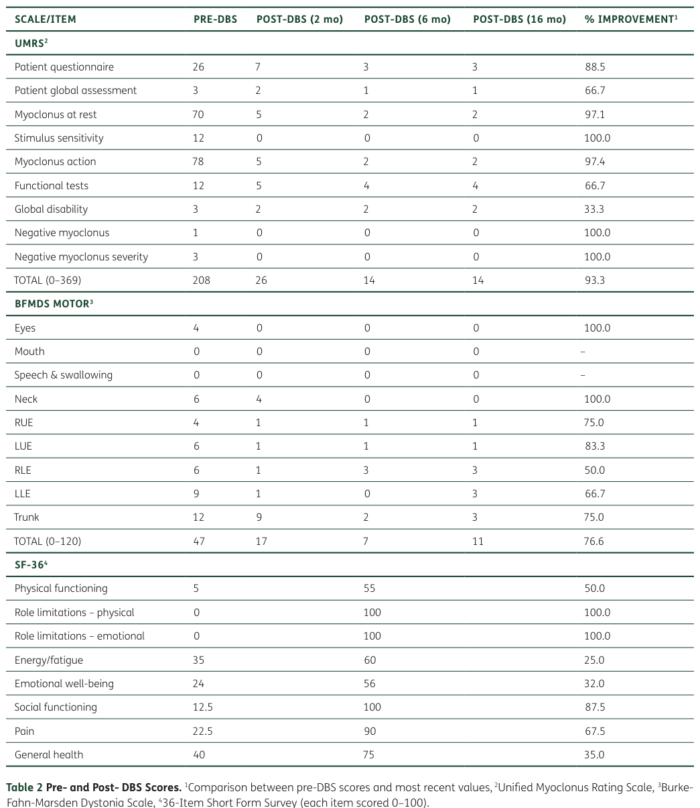

## Question

# Gene Research for Functional Annotation

## ⚠️ CRITICAL: Gene/Protein Identification Context

**BEFORE YOU BEGIN RESEARCH:** You MUST verify you are researching the CORRECT gene/protein. Gene symbols can be ambiguous, especially for less well-characterized genes from non-model organisms.

### Target Gene/Protein Identity (from UniProt):
- **UniProt Accession:** O43556
- **Protein Description:** RecName: Full=Epsilon-sarcoglycan; Short=Epsilon-SG;
- **Gene Information:** Name=SGCE; Synonyms=ESG; ORFNames=UNQ433/PRO840;
- **Organism (full):** Homo sapiens (Human).
- **Protein Family:** Belongs to the sarcoglycan alpha/epsilon family.
- **Key Domains:** Cadg. (IPR006644); Sarcoglycan_alpha/epsilon. (IPR008908); Sarcoglycan_C. (IPR048347); Sarcoglycan_N. (IPR048346); Sarcoglycan_2 (PF05510)

### MANDATORY VERIFICATION STEPS:

1. **Check if the gene symbol "SGCE" matches the protein description above**
2. **Verify the organism is correct:** Homo sapiens (Human).
3. **Check if protein family/domains align with what you find in literature**
4. **If you find literature for a DIFFERENT gene with the same or similar symbol, STOP**

### If Gene Symbol is Ambiguous or You Cannot Find Relevant Literature:

**DO NOT PROCEED WITH RESEARCH ON A DIFFERENT GENE.** Instead:
- State clearly: "The gene symbol 'SGCE' is ambiguous or literature is limited for this specific protein"
- Explain what you found (e.g., "Found extensive literature on a different gene with the same symbol in a different organism")
- Describe the protein based ONLY on the UniProt information provided above
- Suggest that the protein function can be inferred from domain/family information

### Research Target:

Please provide a comprehensive research report on the gene **SGCE** (gene ID: SGCE, UniProt: O43556) in human.

The research report should be a detailed narrative explaining the function, biological processes, and localization of the gene product. Citations should be given for all claims.

You should prioritize authoritative reviews and primary scientific literature when conducting research. You can supplement
this with annotations you find in gene/protein databases, but these can be outdated or inaccurate.

We are specifically interested in the primary function of the gene - for enzymes, what reaction is catalyzed, and what is the substrate specificity? For transporters, what is the substrate? For structural proteins or adapters, what is the broader structural role? For signaling molecules, what is the role in the pathway.

We are interested in where in or outside the cell the gene product carries out its function.

We are also interested in the signaling or biochemical pathways in which the gene functions. We are less interested in broad pleiotropic effects, except where these elucidate the precise role.

Include evidence where possible. We are interested in both experimental evidence as well as inference from structure, evolution, or bioinformatic analysis. Precise studies should be prioritized over high-throughput, where available.

## Output

Question: You are an expert researcher providing comprehensive, well-cited information.

Provide detailed information focusing on:
1. Key concepts and definitions with current understanding
2. Recent developments and latest research (prioritize 2023-2024 sources)
3. Current applications and real-world implementations
4. Expert opinions and analysis from authoritative sources
5. Relevant statistics and data from recent studies

Format as a comprehensive research report with proper citations. Include URLs and publication dates where available.
Always prioritize recent, authoritative sources and provide specific citations for all major claims.

# Gene Research for Functional Annotation

## ⚠️ CRITICAL: Gene/Protein Identification Context

**BEFORE YOU BEGIN RESEARCH:** You MUST verify you are researching the CORRECT gene/protein. Gene symbols can be ambiguous, especially for less well-characterized genes from non-model organisms.

### Target Gene/Protein Identity (from UniProt):
- **UniProt Accession:** O43556
- **Protein Description:** RecName: Full=Epsilon-sarcoglycan; Short=Epsilon-SG;
- **Gene Information:** Name=SGCE; Synonyms=ESG; ORFNames=UNQ433/PRO840;
- **Organism (full):** Homo sapiens (Human).
- **Protein Family:** Belongs to the sarcoglycan alpha/epsilon family.
- **Key Domains:** Cadg. (IPR006644); Sarcoglycan_alpha/epsilon. (IPR008908); Sarcoglycan_C. (IPR048347); Sarcoglycan_N. (IPR048346); Sarcoglycan_2 (PF05510)

### MANDATORY VERIFICATION STEPS:

1. **Check if the gene symbol "SGCE" matches the protein description above**
2. **Verify the organism is correct:** Homo sapiens (Human).
3. **Check if protein family/domains align with what you find in literature**
4. **If you find literature for a DIFFERENT gene with the same or similar symbol, STOP**

### If Gene Symbol is Ambiguous or You Cannot Find Relevant Literature:

**DO NOT PROCEED WITH RESEARCH ON A DIFFERENT GENE.** Instead:
- State clearly: "The gene symbol 'SGCE' is ambiguous or literature is limited for this specific protein"
- Explain what you found (e.g., "Found extensive literature on a different gene with the same symbol in a different organism")
- Describe the protein based ONLY on the UniProt information provided above
- Suggest that the protein function can be inferred from domain/family information

### Research Target:

Please provide a comprehensive research report on the gene **SGCE** (gene ID: SGCE, UniProt: O43556) in human.

The research report should be a detailed narrative explaining the function, biological processes, and localization of the gene product. Citations should be given for all claims.

You should prioritize authoritative reviews and primary scientific literature when conducting research. You can supplement
this with annotations you find in gene/protein databases, but these can be outdated or inaccurate.

We are specifically interested in the primary function of the gene - for enzymes, what reaction is catalyzed, and what is the substrate specificity? For transporters, what is the substrate? For structural proteins or adapters, what is the broader structural role? For signaling molecules, what is the role in the pathway.

We are interested in where in or outside the cell the gene product carries out its function.

We are also interested in the signaling or biochemical pathways in which the gene functions. We are less interested in broad pleiotropic effects, except where these elucidate the precise role.

Include evidence where possible. We are interested in both experimental evidence as well as inference from structure, evolution, or bioinformatic analysis. Precise studies should be prioritized over high-throughput, where available.

## Research Report: Human **SGCE** (ε-sarcoglycan; UniProt **O43556**)—Functional Annotation, Mechanisms, and Applications

### 0) Target verification (mandatory)
The requested target is **human SGCE**, encoding **ε-sarcoglycan (epsilon-sarcoglycan; ε-SG)** with UniProt accession **O43556**. The literature summarized below explicitly describes **SGCE/ε-sarcoglycan** as a **sarcoglycan-family**, **single-pass transmembrane** protein associated with **dystrophin-associated glycoprotein complex (DGC)/sarcoglycan complexes**, matching the identity and family/domain context in the prompt. (cazurrogutierrez2021εsarcoglycanunravelingthe pages 2-4, menozzi2019twentyyearson pages 3-4, li2024decipheringthepathophysiological pages 3-5)

### 1) Key concepts and definitions (current understanding)

#### 1.1 What is ε-sarcoglycan?
ε-Sarcoglycan is a **sarcoglycan-family membrane glycoprotein** encoded by **SGCE**, and it is best understood as a **membrane-associated structural/signaling component** of dystrophin-associated assemblies rather than an enzyme or transporter. (cazurrogutierrez2021εsarcoglycanunravelingthe pages 2-4, menozzi2019twentyyearson pages 3-4)

#### 1.2 Protein architecture (topology; domains)
Canonical descriptions indicate SGCE encodes a **single-pass transmembrane protein** of ~**437 amino acids** (~47 kDa) with an **extracellular N-terminus**, a single **transmembrane helix**, and a **cytoplasmic C-terminal tail**; one review provides residue-level topology (extracellular **1–317**, transmembrane **318–338**, intracellular **339–437**). (cazurrogutierrez2021εsarcoglycanunravelingthe pages 2-4)

Domain-level annotations reported in the literature include an **N-terminal Ig-like/cadherin-like domain** and putative **calcium-binding features** (“calcium-binding pockets”) characteristic of sarcoglycan-family members. (cazurrogutierrez2021εsarcoglycanunravelingthe pages 2-4, menozzi2019twentyyearson pages 3-4)

#### 1.3 Sarcoglycan complex and DGC (concept)
Sarcoglycans are classically described as forming **subcomplexes within the dystrophin-associated glycoprotein complex (DGC)**, which stabilizes the plasma membrane and links the cytoskeleton to the extracellular matrix in muscle; SGCE is recognized as part of **DGC-like complexes** in the nervous system as well. (cazurrogutierrez2021εsarcoglycanunravelingthe pages 4-6, menozzi2019twentyyearson pages 8-10)

#### 1.4 Major biological role (functional annotation)
Current evidence supports SGCE as a **membrane scaffolding/organizing protein** whose key functional consequence is **correct assembly/localization of DGC/sarcoglycan complexes** and, in neurons, potentially **synaptic membrane specialization** and associated signaling homeostasis rather than catalysis. This interpretation is supported by (i) DGC association, (ii) neuronal isoform specialization, and (iii) pathogenic variants disrupting membrane trafficking and surface localization. (cazurrogutierrez2021εsarcoglycanunravelingthe pages 4-6, cazurrogutierrez2021εsarcoglycanunravelingthe pages 13-14, grutz2023investigatingthemolecular pages 1-2)

### 2) Expression, isoforms, and subcellular localization

#### 2.1 Tissue and brain-region expression
SGCE is widely expressed, with strong emphasis on CNS expression in the literature. High SGCE expression is reported across neuronal regions including **olfactory bulb, hippocampus, cortex, and cerebellum**; brain-enriched transcripts are noted in the **cerebellum**, including Purkinje-cell-associated expression patterns for brain-specific isoforms. (cazurrogutierrez2021εsarcoglycanunravelingthe pages 4-6, li2024decipheringthepathophysiological pages 3-5)

#### 2.2 Isoform diversity and brain-specific isoforms
SGCE shows extensive alternative splicing in humans, including **>40 protein-coding isoforms** reported in one review. Two commonly discussed isoforms are a ubiquitous **ε-SG1** and a brain-specific **ε-SG2** (with additional isoforms such as ε-SG3 described). Incorporation of **exon 11b** is highlighted as brain-enriched (reported at ~**30%** of SGCE brain transcripts). (cazurrogutierrez2021εsarcoglycanunravelingthe pages 4-6, cazurrogutierrez2021εsarcoglycanunravelingthe pages 2-4)

Functional motifs in brain-specific isoforms are proposed to enable synaptic interactions: ε-SG2 is described as having a **PDZ-binding motif** in its cytoplasmic region and a kinase consensus phosphorylation site, consistent with regulated protein–protein interactions. (cazurrogutierrez2021εsarcoglycanunravelingthe pages 4-6)

#### 2.3 Subcellular localization
Multiple lines of evidence support **plasma-membrane localization** (consistent with sarcoglycans and DGC membership). In iPSC-derived neurons, brain-specific ε-sarcoglycan was detected in the **membrane fraction** and at the **cell surface** (cell-surface biotinylation) in control neurons, while disease variants impaired surface localization. (grutz2023investigatingthemolecular pages 1-2)

Subcellular fractionation in brain is also described as suggesting isoform-dependent synaptic enrichment: ε-SG1 enriched postsynaptically and ε-SG2 presynaptically (interpretation based on fractionation patterns). (cazurrogutierrez2021εsarcoglycanunravelingthe pages 4-6)

### 3) Pathways, complexes, and interaction partners

#### 3.1 DGC/sarcoglycan complexes in brain
In neuronal contexts, SGCE is discussed as participating in **DGC-like complexes** rather than the canonical muscle sarcolemma DGC alone. A 2024 review summarizes that brain complexes may include **β-, δ-, ε-, and ζ-sarcoglycans**, with proposed roles spanning synapse-associated organization (including GABAergic synapse biology) and astrocyte/BBB-related functions (e.g., aquaporin-4 localization). (li2024decipheringthepathophysiological pages 3-5)

#### 3.2 Mechanistic hypotheses for neuronal dysfunction
A mechanistic synthesis in expert reviews proposes that loss of ε-sarcoglycan function may disturb neuronal membrane stability and **calcium homeostasis** with downstream consequences for **dopaminergic signaling**, contributing to myoclonus-dystonia pathophysiology. (menozzi2019twentyyearson pages 8-10, menozzi2019twentyyearson pages 3-4)

### 4) Human genetics and disease association (core: myoclonus-dystonia)

#### 4.1 Disease definition and epidemiology
SGCE is a major genetic cause of **myoclonus-dystonia (M-D)**, a childhood-onset movement disorder typically featuring upper-body myoclonic jerks and dystonia, often accompanied by psychiatric symptoms. (cazurrogutierrez2021εsarcoglycanunravelingthe pages 1-2, menozzi2019twentyyearson pages 3-4)

A review reports an estimated prevalence of ~**2 per 1,000,000** in Europe. (cazurrogutierrez2021εsarcoglycanunravelingthe pages 1-2)

#### 4.2 Variant spectrum and diagnostic yield
More than **100** pathogenic SGCE variants are described in the literature; one review reports overall SGCE variant detection rates ranging **21–80%** across cohorts, and **>90%** detection in children meeting diagnostic criteria. (cazurrogutierrez2021εsarcoglycanunravelingthe pages 1-2)

The recurrent truncating variant **c.304C>T** is reported in at least **14** individuals in one review. (cazurrogutierrez2021εsarcoglycanunravelingthe pages 1-2)

A 2024 Neurology Genetics case report underscores ongoing discovery of rare/de novo variants, describing a **de novo** SGCE missense variant (T173C causing **F58S**) in a 23-year-old with childhood-onset myoclonus-dystonia, and detailing clinical workup and treatment attempts. (Published April 2024; URL: https://doi.org/10.1212/nxg.0000000000200128) (klinman2024novelsgcemutation pages 1-2, klinman2024novelsgcemutation pages 2-3)

#### 4.3 Molecular mechanisms of pathogenicity
Evidence synthesized across reviews supports two major molecular mechanisms:
1) **Truncating/LOF variants** often lead to **nonsense-mediated mRNA decay** and loss of ε-sarcoglycan. (cazurrogutierrez2021εsarcoglycanunravelingthe pages 1-2, li2024decipheringthepathophysiological pages 3-5)
2) **Missense variants** frequently produce misfolded proteins that are **retained intracellularly**, undergo **ubiquitination**, and are cleared by the **proteasome**, impairing proper trafficking to the plasma membrane. (cazurrogutierrez2021εsarcoglycanunravelingthe pages 1-2)

In iPSC-derived cortical neurons, a missense variant produced ε-sarcoglycan detectable in whole-cell lysates but not at the cell surface; proteasome inhibition increased total protein but did not restore surface localization, consistent with a **trafficking/processing defect** rather than simple loss of abundance. (grutz2023investigatingthemolecular pages 1-2)

### 5) Genomic imprinting (critical concept for SGCE)

SGCE is a canonical example of a disease gene where **parent-of-origin effects** strongly influence penetrance. Multiple recent and authoritative sources describe SGCE as **maternally imprinted** (maternal allele typically silenced), producing predominant paternal transmission and reduced penetrance with maternal transmission. (menozzi2019twentyyearson pages 3-4, li2024decipheringthepathophysiological pages 3-5)

A 2023 counseling-focused report states maternal imprinting occurs in ~**95%** of cases, and gives a concrete counseling calculation: an affected mother has a 1/2 chance to transmit the variant, but only ~5% of maternally inherited pathogenic alleles are expressed, yielding ~**2.5%** per-child probability of expressing the phenotype (1/2 × 1/20 = 1/40). (Published Aug 2023; URL: https://doi.org/10.5334/tohm.783) (higinbotham2023ageneticspearl pages 1-2)

A 2024 clinical case report similarly emphasizes maternal allele silencing and notes that maternally inherited mutations are observed in **<5%** of cases, consistent with imprinting-driven reduced penetrance. (Published Apr 2024; URL: https://doi.org/10.1212/nxg.0000000000200128) (klinman2024novelsgcemutation pages 1-2)

### 6) Recent developments (prioritizing 2023–2024)

#### 6.1 2023: DBS in mUPD7-associated myoclonus-dystonia (real-world implementation)
A 2023 open-access case report describes bilateral **GPi deep brain stimulation** in a patient with myoclonus-dystonia associated with **maternal uniparental disomy of chromosome 7 (mUPD7)** and Russell–Silver syndrome features. The report documents substantial and durable improvement, with outcomes quantified by standard scales: **UMRS total improved from 208 pre-DBS to 14 at 16 months** (reported as **93.3% improvement**) and **BFMDS motor score improved from 47 to 11** (**76.6% improvement**); quality-of-life metrics (SF-36 subscales) also improved. (Published Oct 30, 2023; URL: https://doi.org/10.5334/tohm.782) (shpiner2023deepbrainstimulation pages 5-6, shpiner2023deepbrainstimulation pages 1-3)

DBS programming parameters and trajectory details are also described (e.g., **130 Hz** stimulation, pulse width **90 µs** initially then **60 µs**, amplitude increased from **2 mA** bilaterally to **4.3 mA**). (shpiner2023deepbrainstimulation pages 3-5, shpiner2023deepbrainstimulation pages 5-6)

#### 6.2 2024: Stem-cell/iPSC disease modeling emphasis
A 2024 review highlights pluripotent stem cell-derived models as a key strategy to investigate SGCE myoclonus-dystonia mechanisms. It reiterates imprinting via CpG methylation at promoter/exon 1, the importance of isoform/exon-specific expression in brain, and the concept that SGCE participates in heterotetrameric sarcoglycan assemblies in brain. (Published Sep 2024; URL: https://doi.org/10.3390/cells13181520) (li2024decipheringthepathophysiological pages 3-5)

#### 6.3 2024: Novel/de novo SGCE variant case expands clinical/variant interpretation knowledge
The 2024 Neurology Genetics case report demonstrates the utility of trio whole-exome sequencing in atypical or sporadic cases and provides mechanistic interpretation that the identified F58S substitution likely affects protein stability/structure based on the region’s secondary structure context and nearby destabilizing variants. (Published Apr 2024; URL: https://doi.org/10.1212/nxg.0000000000200128) (klinman2024novelsgcemutation pages 2-3)

#### 6.4 2023: Noncanonical SGCE biology in cancer (context-dependent nuclear function)
A 2023 Journal of Biological Chemistry study reports a noncanonical role for SGCE in **triple-negative breast cancer (TNBC)** stemness. The authors report that SGCE can translocate to the **nucleus**, interact with **Sp1**, and promote transcription of **FGF-BP1**, which then activates **FGF–FGFR signaling** to promote stemness-associated phenotypes. Pharmacologic inhibition of FGFR with **infigratinib (1 µM, 48 h)** reduced SGCE/FGF-BP1-induced signaling and stem-cell phenotypes in TNBC models. The paper also reports a survival analysis in **995 TNBC patients** linking high FGF-BP1 and Sp1 expression with poorer overall survival, and describes use of **30** breast cancer specimens for experimental work. (Published Nov 2023; URL: https://doi.org/10.1016/j.jbc.2023.105351) (qiu2023sgcepromotesbreast pages 2-5, qiu2023sgcepromotesbreast pages 5-7, qiu2023sgcepromotesbreast pages 10-11)

### 7) Current applications and real-world implementations

#### 7.1 Clinical genetic testing and counseling
Because SGCE myoclonus-dystonia can lack an obvious family history due to imprinting, **sequencing-based diagnosis** (gene panels or exome sequencing) and **parent-of-origin-aware counseling** are essential. The 2023 counseling report provides a concrete risk calculation (2.5% expressed-risk per child for affected mothers under typical imprinting assumptions), and the 2024 case report illustrates the role of exome sequencing for identifying de novo variants in sporadic disease. (higinbotham2023ageneticspearl pages 1-2, klinman2024novelsgcemutation pages 1-2)

#### 7.2 Neuromodulation (DBS)
DBS is a widely implemented symptomatic therapy in medically refractory cases. A major expert review summarizes DBS effectiveness with mean improvements reported for myoclonus and dystonia (e.g., mean amelioration **72.6%** for myoclonus and **52.6%** for dystonia, reported in ~**88%** of patients in the reviewed literature), and a 2023 case report provides detailed scale-based outcomes and programming settings. (menozzi2019twentyyearson pages 3-4, shpiner2023deepbrainstimulation pages 5-6)

#### 7.3 Disease modeling and therapeutic hypothesis testing (iPSC-derived neurons)
iPSC-derived neuronal models provide a platform to test whether pathogenic missense variants disrupt cell-surface localization, and to probe compensatory responses of DGC components. In one iPSC neuron study, SGCE missense protein was not restored to the membrane by proteasome inhibition, suggesting that therapeutics may need to correct trafficking/processing rather than simply inhibit degradation. (grutz2023investigatingthemolecular pages 1-2)

#### 7.4 Oncology (emerging translational angle)
The JBC 2023 findings propose SGCE-positive TNBC contexts may benefit from targeting downstream **FGFR** signaling, supported by in vitro inhibitor experiments (infigratinib) and an association of pathway components with outcomes in a large TNBC dataset. (qiu2023sgcepromotesbreast pages 2-5, qiu2023sgcepromotesbreast pages 5-7)

### 8) Expert opinions and interpretive synthesis (authoritative analyses)

Expert reviews converge on the view that SGCE-related myoclonus-dystonia is not primarily a “gross neurodegeneration” but rather a disorder of neuronal circuit function and membrane/synaptic biology. Isoform-specific neuronal expression, strong response to neuromodulation, and trafficking-defect mechanisms support a model in which disrupted membrane complexes and downstream signaling (including calcium homeostasis and dopaminergic signaling changes) contribute to phenotype. (menozzi2019twentyyearson pages 8-10, menozzi2019twentyyearson pages 3-4, cazurrogutierrez2021εsarcoglycanunravelingthe pages 12-13)

### 9) Relevant statistics and data (recent and/or authoritative)
Key quantitative findings consolidated from the evidence base include:
- Prevalence estimate in Europe: ~**2 per 1,000,000**. (cazurrogutierrez2021εsarcoglycanunravelingthe pages 1-2)
- Maternal imprinting frequency: ~**95%** (strongly reducing penetrance on maternal transmission). (higinbotham2023ageneticspearl pages 1-2)
- Variant spectrum: **>100** pathogenic SGCE variants; diagnostic yield **21–80%** across cohorts, **>90%** in children meeting criteria. (cazurrogutierrez2021εsarcoglycanunravelingthe pages 1-2)
- DBS outcomes: 2023 case UMRS **208→14** and BFMDS **47→11** at 16 months; programming included **130 Hz** and amplitude up to **4.3 mA**. (shpiner2023deepbrainstimulation pages 5-6, shpiner2023deepbrainstimulation pages 3-5)
- iPSC neuron transcriptome compensation signals: SGCD fold-change **20.96** (p=**7.64×10⁻6**) and SGCZ fold-change **14.67** (p=**5.05×10⁻4**), though qPCR validation suggested smaller changes. (grutz2023investigatingthemolecular pages 1-2)
- TNBC study cohorts: **30** breast cancer specimens and **995** TNBC patients in survival association analysis; FGFR inhibitor **infigratinib 1 µM** used for **48 h** in cell models. (qiu2023sgcepromotesbreast pages 10-11, qiu2023sgcepromotesbreast pages 2-5, qiu2023sgcepromotesbreast pages 5-7)

### 10) Evidence summary table
The following table consolidates the functional annotation, mechanisms, and translational relevance in a structured format.

| Aspect | Key points | Evidence (study + year) | Quantitative/statistic (if available) | URL |
|---|---|---|---|---|
| Identity/topology/domains | Human **SGCE** matches UniProt **O43556** and encodes **epsilon-sarcoglycan (ε-SG)**, a **single-pass transmembrane** sarcoglycan-family protein. Reported topology: **extracellular residues 1–317**, **transmembrane 318–338**, **intracellular 339–437**; contains an **N-terminal Ig-like/cadherin-like domain**, calcium-binding features, and a consensus **N-glycosylation** site. (cazurrogutierrez2021εsarcoglycanunravelingthe pages 2-4, menozzi2019twentyyearson pages 3-4) | Cazurro-Gutiérrez et al., 2021; Menozzi et al., 2019 | **437 aa** (~47 kDa) major isoform; additional isoforms **451 aa** and **462 aa** reported | https://doi.org/10.1007/s12035-021-02391-0 ; https://doi.org/10.1002/mds.27822 |
| Localization | SGCE is broadly expressed but enriched in the CNS, especially **olfactory bulb, hippocampus, cortex, cerebellum**; brain-enriched expression is noted in **Purkinje cells**, dentate nucleus neurons, basal ganglia, and hippocampus. In neurons, brain-specific ε-SG is detected at the **plasma membrane**; fractionation suggests ε-SG1 is more **postsynaptic** and ε-SG2 more **presynaptic**. (cazurrogutierrez2021εsarcoglycanunravelingthe pages 4-6, li2024decipheringthepathophysiological pages 3-5, grutz2023investigatingthemolecular pages 1-2) | Cazurro-Gutiérrez et al., 2021; Li et al., 2024; Grütz et al., 2023 | Single-cell data: highest transcripts in **oligodendrocyte precursors, oligodendrocytes, excitatory neurons**; control iPSC neurons showed surface-localized brain-specific ε-SG | https://doi.org/10.1007/s12035-021-02391-0 ; https://doi.org/10.3390/cells13181520 |
| Complex membership | ε-Sarcoglycan is part of the **sarcoglycan subcomplex** within **dystrophin-associated glycoprotein complex (DGC)** or DGC-like complexes. In brain, complexes are proposed to include **β-, δ-, ε-, and ζ-sarcoglycans**, with possible roles in neuronal membrane organization, GABAergic synapse biology, astrocyte/AQP4 localization, and BBB-related functions. (cazurrogutierrez2021εsarcoglycanunravelingthe pages 4-6, menozzi2019twentyyearson pages 8-10, li2024decipheringthepathophysiological pages 3-5) | Cazurro-Gutiérrez et al., 2021; Menozzi et al., 2019; Li et al., 2024 | Brain complexes specifically noted as **β/δ/ε/ζ** sarcoglycan assemblies | https://doi.org/10.1007/s12035-021-02391-0 ; https://doi.org/10.1002/mds.27822 ; https://doi.org/10.3390/cells13181520 |
| Neuronal isoforms | SGCE undergoes extensive alternative splicing; two major isoforms are **ubiquitous ε-SG1** and **brain-specific ε-SG2** (plus ε-SG3 described). ε-SG2 contains **exon 11b**, is enriched in cerebellum/Purkinje cells, and carries a **PDZ-binding motif** and a **C-terminal kinase consensus phosphorylation site**, consistent with specialized neuronal/synaptic interactions. (cazurrogutierrez2021εsarcoglycanunravelingthe pages 4-6, cazurrogutierrez2021εsarcoglycanunravelingthe pages 2-4) | Cazurro-Gutiérrez et al., 2021 | **>40 human isoforms** reported; **exon 11b** present in ~**30%** of SGCE brain transcripts | https://doi.org/10.1007/s12035-021-02391-0 |
| Imprinting genetics | SGCE-related myoclonus-dystonia is **autosomal dominant** with **maternal imprinting**: the maternal allele is silenced in most cases, so disease usually follows **paternal transmission**. The imprinting control involves methylation around promoter/exon 1. This is critical for counseling because an affected mother’s child may inherit the variant but often not express disease. (li2024decipheringthepathophysiological pages 3-5, cazurrogutierrez2021εsarcoglycanunravelingthe pages 1-2, higinbotham2023ageneticspearl pages 1-2, klinman2024novelsgcemutation pages 1-2) | Li et al., 2024; Cazurro-Gutiérrez et al., 2021; Higinbotham et al., 2023; Klinman et al., 2024 | Maternal imprinting in ~**95%** of cases; maternally inherited mutations reported in **<5%**; example counseling risk for an affected mother: **1/2 × 1/20 = 1/40 = 2.5%** per child to express phenotype | https://doi.org/10.3390/cells13181520 ; https://doi.org/10.1007/s12035-021-02391-0 ; https://doi.org/10.5334/tohm.783 ; https://doi.org/10.1212/nxg.0000000000200128 |
| Disease association: myoclonus-dystonia | SGCE is the major known genetic cause of **myoclonus-dystonia (M-D/MDS)**, a childhood-onset movement disorder characterized by upper-body myoclonus with dystonia and frequent psychiatric comorbidity (e.g., OCD, anxiety, depression). Many pathogenic variants are **loss-of-function**; truncating variants often undergo **nonsense-mediated decay**, while missense variants commonly cause **misfolding, intracellular retention, ubiquitination, and proteasomal degradation**. (cazurrogutierrez2021εsarcoglycanunravelingthe pages 1-2, menozzi2019twentyyearson pages 3-4, klinman2024novelsgcemutation pages 2-3, klinman2024novelsgcemutation pages 1-2) | Cazurro-Gutiérrez et al., 2021; Menozzi et al., 2019; Klinman et al., 2024 | Estimated prevalence in Europe: **~2 per 1,000,000**; **>100** pathogenic SGCE variants reported; detection varies **21–80%** across cohorts, but **>90%** in children meeting diagnostic criteria; recurrent variant **c.304C>T** seen in **≥14** individuals | https://doi.org/10.1007/s12035-021-02391-0 ; https://doi.org/10.1002/mds.27822 ; https://doi.org/10.1212/nxg.0000000000200128 |
| DBS outcomes | For medication-refractory SGCE-related or SGCE-pathway myoclonus-dystonia, **deep brain stimulation (DBS)** is an established symptomatic therapy; **GPi** is commonly used and often improves both myoclonus and dystonia, with benefits sustained over months to years. In the 2023 mUPD7-associated case, bilateral GPi DBS produced major functional recovery and quality-of-life gains. (menozzi2019twentyyearson pages 3-4, shpiner2023deepbrainstimulation pages 3-5, shpiner2023deepbrainstimulation pages 5-6, shpiner2023deepbrainstimulation pages 1-3) | Menozzi et al., 2019; Shpiner et al., 2023 | Review-level averages: **72.6%** myoclonus and **52.6%** dystonia improvement in ~**88%** of patients; 2023 case: **UMRS 208→14** (**93.3%** improvement) and **BFMDS 47→11** (**76.6%** improvement) at **16 months**; DBS settings included **130 Hz**, pulse width **90→60 µs**, amplitude **2→4.3 mA** | https://doi.org/10.1002/mds.27822 ; https://doi.org/10.5334/tohm.782 |
| iPSC findings | Patient-derived cortical neurons support a trafficking defect model: control neurons show brain-specific ε-SG at the **cell surface**, while the pathogenic missense protein can be present in lysates but fail to reach the membrane. **Proteasome inhibition (MG132)** increases total mutant protein but does **not** restore membrane localization, implicating defective processing/trafficking rather than simple shortage. (grutz2023investigatingthemolecular pages 1-2) | Grütz et al., 2023 | Variants studied: **c.298T>G (p.Trp100Gly)** and **c.304C>T (p.Arg102Ter)**; transcriptome changes included **SGCD fold-change 20.96 (p = 7.64×10^-6)** and **SGCZ fold-change 14.67 (p = 5.05×10^-4)** | 2023 study listed in library as “Investigating the molecular and cellular basis of ε-sarcoglycan-associated myoclonus-dystonia in an iPSC-derived neuronal model” |
| Cancer findings | Outside neurology, SGCE has been implicated in **triple-negative breast cancer (TNBC)** stemness. Qiu et al. report that SGCE can move from membrane/cytoplasm to the **nucleus**, interact with **Sp1**, enhance **FGF-BP1** transcription, and thereby increase **FGF/FGFR**, **ERK**, and **AKT** signaling. These data suggest SGCE may have context-dependent noncanonical signaling functions beyond DGC biology. (qiu2023sgcepromotesbreast pages 10-11, qiu2023sgcepromotesbreast pages 2-5, qiu2023sgcepromotesbreast pages 1-2, qiu2023sgcepromotesbreast pages 9-10, qiu2023sgcepromotesbreast pages 5-7) | Qiu et al., 2023 | Human cohort: **30** breast cancer specimens; survival analysis in **995 TNBC patients** associated high FGF-BP1/Sp1 with poorer OS; experiments commonly **n = 3**; FGFR inhibitor **infigratinib 1 µM for 48 h** reduced SGCE/FGF-BP1-induced stem-cell phenotypes; FGF2 rescue used **40 ng/mL** | https://doi.org/10.1016/j.jbc.2023.105351 |

*Table: This table summarizes verified functional annotation, disease biology, and translational findings for human SGCE/epsilon-sarcoglycan (UniProt O43556). It consolidates canonical protein features with recent clinical and mechanistic evidence, including imprinting, DBS outcomes, iPSC trafficking defects, and emerging cancer-related functions.*

### 11) Visual evidence (DBS clinical outcomes and lead placement)
Cropped evidence from the 2023 DBS case report includes: (i) Table 2 showing UMRS/BFMDS/SF-36 changes over time, (ii) Table 1 showing DBS settings at 1 and 31 months, and (iii) Figure 1 showing bilateral GPi lead placement. (shpiner2023deepbrainstimulation media c6492119, shpiner2023deepbrainstimulation media 963f0504, shpiner2023deepbrainstimulation media 3ac7d5b5)

### 12) Limitations and open questions
Despite strong genetic and clinical evidence for SGCE’s role in myoclonus-dystonia, reviews emphasize persistent mechanistic gaps: which neuronal protein partners directly bind ε-sarcoglycan isoforms, how DGC-like complexes differ between brain cell types, and how isoform-specific loss translates into circuit dysfunction. Further, the TNBC findings suggest SGCE can have **context-dependent nuclear functions**, which may not generalize to neurons and requires independent validation across tissues and isoforms. (cazurrogutierrez2021εsarcoglycanunravelingthe pages 12-13, qiu2023sgcepromotesbreast pages 5-7)

References

1. (cazurrogutierrez2021εsarcoglycanunravelingthe pages 2-4): Ana Cazurro-Gutiérrez, Anna Marcé-Grau, Marta Correa-Vela, Ainara Salazar, María I. Vanegas, Alfons Macaya, Àlex Bayés, and Belén Pérez-Dueñas. Ε-sarcoglycan: unraveling the myoclonus-dystonia gene. Molecular Neurobiology, 58:3938-3952, Apr 2021. URL: https://doi.org/10.1007/s12035-021-02391-0, doi:10.1007/s12035-021-02391-0. This article has 14 citations and is from a peer-reviewed journal.

2. (menozzi2019twentyyearson pages 3-4): Elisa Menozzi, Bettina Balint, Anna Latorre, Enza Maria Valente, John C. Rothwell, and Kailash P. Bhatia. Twenty years on: myoclonus‐dystonia and ε‐sarcoglycan — neurodevelopment, channel, and signaling dysfunction. Movement Disorders, 34:1588-1601, Aug 2019. URL: https://doi.org/10.1002/mds.27822, doi:10.1002/mds.27822. This article has 62 citations and is from a highest quality peer-reviewed journal.

3. (li2024decipheringthepathophysiological pages 3-5): Zongze Li, Laura Abram, and Kathryn J. Peall. Deciphering the pathophysiological mechanisms underpinning myoclonus dystonia using pluripotent stem cell-derived cellular models. Cells, 13:1520, Sep 2024. URL: https://doi.org/10.3390/cells13181520, doi:10.3390/cells13181520. This article has 0 citations.

4. (cazurrogutierrez2021εsarcoglycanunravelingthe pages 4-6): Ana Cazurro-Gutiérrez, Anna Marcé-Grau, Marta Correa-Vela, Ainara Salazar, María I. Vanegas, Alfons Macaya, Àlex Bayés, and Belén Pérez-Dueñas. Ε-sarcoglycan: unraveling the myoclonus-dystonia gene. Molecular Neurobiology, 58:3938-3952, Apr 2021. URL: https://doi.org/10.1007/s12035-021-02391-0, doi:10.1007/s12035-021-02391-0. This article has 14 citations and is from a peer-reviewed journal.

5. (menozzi2019twentyyearson pages 8-10): Elisa Menozzi, Bettina Balint, Anna Latorre, Enza Maria Valente, John C. Rothwell, and Kailash P. Bhatia. Twenty years on: myoclonus‐dystonia and ε‐sarcoglycan — neurodevelopment, channel, and signaling dysfunction. Movement Disorders, 34:1588-1601, Aug 2019. URL: https://doi.org/10.1002/mds.27822, doi:10.1002/mds.27822. This article has 62 citations and is from a highest quality peer-reviewed journal.

6. (cazurrogutierrez2021εsarcoglycanunravelingthe pages 13-14): Ana Cazurro-Gutiérrez, Anna Marcé-Grau, Marta Correa-Vela, Ainara Salazar, María I. Vanegas, Alfons Macaya, Àlex Bayés, and Belén Pérez-Dueñas. Ε-sarcoglycan: unraveling the myoclonus-dystonia gene. Molecular Neurobiology, 58:3938-3952, Apr 2021. URL: https://doi.org/10.1007/s12035-021-02391-0, doi:10.1007/s12035-021-02391-0. This article has 14 citations and is from a peer-reviewed journal.

7. (grutz2023investigatingthemolecular pages 1-2): K Grütz, P Seibler, E Glaab, and A Weißbach. Investigating the molecular and cellular basis of ε-sarcoglycan-associated myoclonus-dystonia in an ipsc-derived neuronal model. Unknown journal, 2023.

8. (cazurrogutierrez2021εsarcoglycanunravelingthe pages 1-2): Ana Cazurro-Gutiérrez, Anna Marcé-Grau, Marta Correa-Vela, Ainara Salazar, María I. Vanegas, Alfons Macaya, Àlex Bayés, and Belén Pérez-Dueñas. Ε-sarcoglycan: unraveling the myoclonus-dystonia gene. Molecular Neurobiology, 58:3938-3952, Apr 2021. URL: https://doi.org/10.1007/s12035-021-02391-0, doi:10.1007/s12035-021-02391-0. This article has 14 citations and is from a peer-reviewed journal.

9. (klinman2024novelsgcemutation pages 1-2): Eva Klinman, Catherine Gooch, Joel S. Perlmutter, Albert A. Davis, and Baijayanta Maiti. Novel <i>sgce</i> mutation in a patient with myoclonus-dystonia. Neurology Genetics, Apr 2024. URL: https://doi.org/10.1212/nxg.0000000000200128, doi:10.1212/nxg.0000000000200128. This article has 2 citations.

10. (klinman2024novelsgcemutation pages 2-3): Eva Klinman, Catherine Gooch, Joel S. Perlmutter, Albert A. Davis, and Baijayanta Maiti. Novel <i>sgce</i> mutation in a patient with myoclonus-dystonia. Neurology Genetics, Apr 2024. URL: https://doi.org/10.1212/nxg.0000000000200128, doi:10.1212/nxg.0000000000200128. This article has 2 citations.

11. (higinbotham2023ageneticspearl pages 1-2): Alissa S. Higinbotham, Suzanne D. DeBrosse, and Camilla W. Kilbane. A genetics pearl for counseling patients with epsilon-sarcoglycan myoclonus-dystonia. Tremor and Other Hyperkinetic Movements, Aug 2023. URL: https://doi.org/10.5334/tohm.783, doi:10.5334/tohm.783. This article has 1 citations and is from a peer-reviewed journal.

12. (shpiner2023deepbrainstimulation pages 5-6): Danielle S. Shpiner, Taylor K. Peabody, Corneliu C. Luca, Jonathan Jagid, and Henry Moore. Deep brain stimulation for an unusual presentation of myoclonus dystonia associated with russell-silver syndrome. Tremor and Other Hyperkinetic Movements, Oct 2023. URL: https://doi.org/10.5334/tohm.782, doi:10.5334/tohm.782. This article has 1 citations and is from a peer-reviewed journal.

13. (shpiner2023deepbrainstimulation pages 1-3): Danielle S. Shpiner, Taylor K. Peabody, Corneliu C. Luca, Jonathan Jagid, and Henry Moore. Deep brain stimulation for an unusual presentation of myoclonus dystonia associated with russell-silver syndrome. Tremor and Other Hyperkinetic Movements, Oct 2023. URL: https://doi.org/10.5334/tohm.782, doi:10.5334/tohm.782. This article has 1 citations and is from a peer-reviewed journal.

14. (shpiner2023deepbrainstimulation pages 3-5): Danielle S. Shpiner, Taylor K. Peabody, Corneliu C. Luca, Jonathan Jagid, and Henry Moore. Deep brain stimulation for an unusual presentation of myoclonus dystonia associated with russell-silver syndrome. Tremor and Other Hyperkinetic Movements, Oct 2023. URL: https://doi.org/10.5334/tohm.782, doi:10.5334/tohm.782. This article has 1 citations and is from a peer-reviewed journal.

15. (qiu2023sgcepromotesbreast pages 2-5): Ting Qiu, Lei Hou, Lina Zhao, Xinye Wang, Zhongmei Zhou, Chuanyu Yang, Huifeng Zhang, Dewei Jiang, Baowei Jiao, and Ceshi Chen. Sgce promotes breast cancer stemness by promoting the transcription of fgf-bp1 by sp1. Journal of Biological Chemistry, 299:105351, Nov 2023. URL: https://doi.org/10.1016/j.jbc.2023.105351, doi:10.1016/j.jbc.2023.105351. This article has 13 citations and is from a domain leading peer-reviewed journal.

16. (qiu2023sgcepromotesbreast pages 5-7): Ting Qiu, Lei Hou, Lina Zhao, Xinye Wang, Zhongmei Zhou, Chuanyu Yang, Huifeng Zhang, Dewei Jiang, Baowei Jiao, and Ceshi Chen. Sgce promotes breast cancer stemness by promoting the transcription of fgf-bp1 by sp1. Journal of Biological Chemistry, 299:105351, Nov 2023. URL: https://doi.org/10.1016/j.jbc.2023.105351, doi:10.1016/j.jbc.2023.105351. This article has 13 citations and is from a domain leading peer-reviewed journal.

17. (qiu2023sgcepromotesbreast pages 10-11): Ting Qiu, Lei Hou, Lina Zhao, Xinye Wang, Zhongmei Zhou, Chuanyu Yang, Huifeng Zhang, Dewei Jiang, Baowei Jiao, and Ceshi Chen. Sgce promotes breast cancer stemness by promoting the transcription of fgf-bp1 by sp1. Journal of Biological Chemistry, 299:105351, Nov 2023. URL: https://doi.org/10.1016/j.jbc.2023.105351, doi:10.1016/j.jbc.2023.105351. This article has 13 citations and is from a domain leading peer-reviewed journal.

18. (cazurrogutierrez2021εsarcoglycanunravelingthe pages 12-13): Ana Cazurro-Gutiérrez, Anna Marcé-Grau, Marta Correa-Vela, Ainara Salazar, María I. Vanegas, Alfons Macaya, Àlex Bayés, and Belén Pérez-Dueñas. Ε-sarcoglycan: unraveling the myoclonus-dystonia gene. Molecular Neurobiology, 58:3938-3952, Apr 2021. URL: https://doi.org/10.1007/s12035-021-02391-0, doi:10.1007/s12035-021-02391-0. This article has 14 citations and is from a peer-reviewed journal.

19. (qiu2023sgcepromotesbreast pages 1-2): Ting Qiu, Lei Hou, Lina Zhao, Xinye Wang, Zhongmei Zhou, Chuanyu Yang, Huifeng Zhang, Dewei Jiang, Baowei Jiao, and Ceshi Chen. Sgce promotes breast cancer stemness by promoting the transcription of fgf-bp1 by sp1. Journal of Biological Chemistry, 299:105351, Nov 2023. URL: https://doi.org/10.1016/j.jbc.2023.105351, doi:10.1016/j.jbc.2023.105351. This article has 13 citations and is from a domain leading peer-reviewed journal.

20. (qiu2023sgcepromotesbreast pages 9-10): Ting Qiu, Lei Hou, Lina Zhao, Xinye Wang, Zhongmei Zhou, Chuanyu Yang, Huifeng Zhang, Dewei Jiang, Baowei Jiao, and Ceshi Chen. Sgce promotes breast cancer stemness by promoting the transcription of fgf-bp1 by sp1. Journal of Biological Chemistry, 299:105351, Nov 2023. URL: https://doi.org/10.1016/j.jbc.2023.105351, doi:10.1016/j.jbc.2023.105351. This article has 13 citations and is from a domain leading peer-reviewed journal.

21. (shpiner2023deepbrainstimulation media c6492119): Danielle S. Shpiner, Taylor K. Peabody, Corneliu C. Luca, Jonathan Jagid, and Henry Moore. Deep brain stimulation for an unusual presentation of myoclonus dystonia associated with russell-silver syndrome. Tremor and Other Hyperkinetic Movements, Oct 2023. URL: https://doi.org/10.5334/tohm.782, doi:10.5334/tohm.782. This article has 1 citations and is from a peer-reviewed journal.

22. (shpiner2023deepbrainstimulation media 963f0504): Danielle S. Shpiner, Taylor K. Peabody, Corneliu C. Luca, Jonathan Jagid, and Henry Moore. Deep brain stimulation for an unusual presentation of myoclonus dystonia associated with russell-silver syndrome. Tremor and Other Hyperkinetic Movements, Oct 2023. URL: https://doi.org/10.5334/tohm.782, doi:10.5334/tohm.782. This article has 1 citations and is from a peer-reviewed journal.

23. (shpiner2023deepbrainstimulation media 3ac7d5b5): Danielle S. Shpiner, Taylor K. Peabody, Corneliu C. Luca, Jonathan Jagid, and Henry Moore. Deep brain stimulation for an unusual presentation of myoclonus dystonia associated with russell-silver syndrome. Tremor and Other Hyperkinetic Movements, Oct 2023. URL: https://doi.org/10.5334/tohm.782, doi:10.5334/tohm.782. This article has 1 citations and is from a peer-reviewed journal.

## Artifacts

- [Edison artifact artifact-00](SGCE-deep-research-falcon_artifacts/artifact-00.md)

## Citations

1. grutz2023investigatingthemolecular pages 1-2
2. li2024decipheringthepathophysiological pages 3-5
3. higinbotham2023ageneticspearl pages 1-2
4. klinman2024novelsgcemutation pages 1-2
5. klinman2024novelsgcemutation pages 2-3
6. menozzi2019twentyyearson pages 3-4
7. menozzi2019twentyyearson pages 8-10
8. shpiner2023deepbrainstimulation pages 5-6
9. shpiner2023deepbrainstimulation pages 1-3
10. shpiner2023deepbrainstimulation pages 3-5
11. qiu2023sgcepromotesbreast pages 2-5
12. qiu2023sgcepromotesbreast pages 5-7
13. qiu2023sgcepromotesbreast pages 10-11
14. qiu2023sgcepromotesbreast pages 1-2
15. qiu2023sgcepromotesbreast pages 9-10
16. https://doi.org/10.1212/nxg.0000000000200128
17. https://doi.org/10.5334/tohm.783
18. https://doi.org/10.5334/tohm.782
19. https://doi.org/10.3390/cells13181520
20. https://doi.org/10.1016/j.jbc.2023.105351
21. https://doi.org/10.1007/s12035-021-02391-0
22. https://doi.org/10.1002/mds.27822
23. https://doi.org/10.1007/s12035-021-02391-0,
24. https://doi.org/10.1002/mds.27822,
25. https://doi.org/10.3390/cells13181520,
26. https://doi.org/10.1212/nxg.0000000000200128,
27. https://doi.org/10.5334/tohm.783,
28. https://doi.org/10.5334/tohm.782,
29. https://doi.org/10.1016/j.jbc.2023.105351,