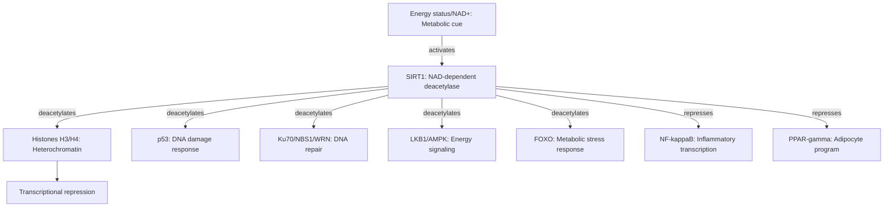

# Pathway Summary for SIRT1

## Overview
SIRT1 is an NAD+-dependent protein deacetylase that links cellular energy status to chromatin regulation, DNA damage responses, and metabolic adaptation by deacetylating histones and key transcriptional regulators. [PMID:15469825, PMID:18485871, PMID:11672523]

## Chromatin Silencing and Transcriptional Repression
SIRT1 deacetylates histone H4K16 and H3K9 and interacts with histone H1 to promote facultative heterochromatin formation, leading to transcriptional repression. [PMID:15469825] SIRT1 also regulates heterochromatin through cooperation with SUV39H1, reinforcing repressive chromatin states. [PMID:18004385]

## DNA Damage Response and Genome Maintenance
SIRT1 deacetylates p53 to modulate DNA damage-induced transcriptional responses and apoptosis. [PMID:11672523, PMID:12006491] It also targets DNA repair proteins such as Ku70, NBS1, and WRN, supporting repair and genome stability. [PMID:17334224, PMID:17612497, PMID:18203716]

## Energy/Nutrient Sensing and Metabolic Adaptation
SIRT1 responds to energy status at rDNA loci and integrates NAD+-dependent signals with transcriptional programs. [PMID:18485871] It modulates the LKB1-AMPK axis through deacetylation, connects to insulin signaling via IRS-2, and deacetylates FOXO factors to shape stress and metabolic responses. [PMID:18687677, PMID:17901049, PMID:14976264] In adipocytes, SIRT1 represses PPAR-gamma to promote fat mobilization. [PMID:15175761]

## Inflammatory Signaling Cross-talk
SIRT1 suppresses NF-kappaB-dependent transcriptional programs, linking its deacetylase activity to anti-inflammatory signaling. [PMID:15152190, PMID:17680780]

## Pathway Diagram

