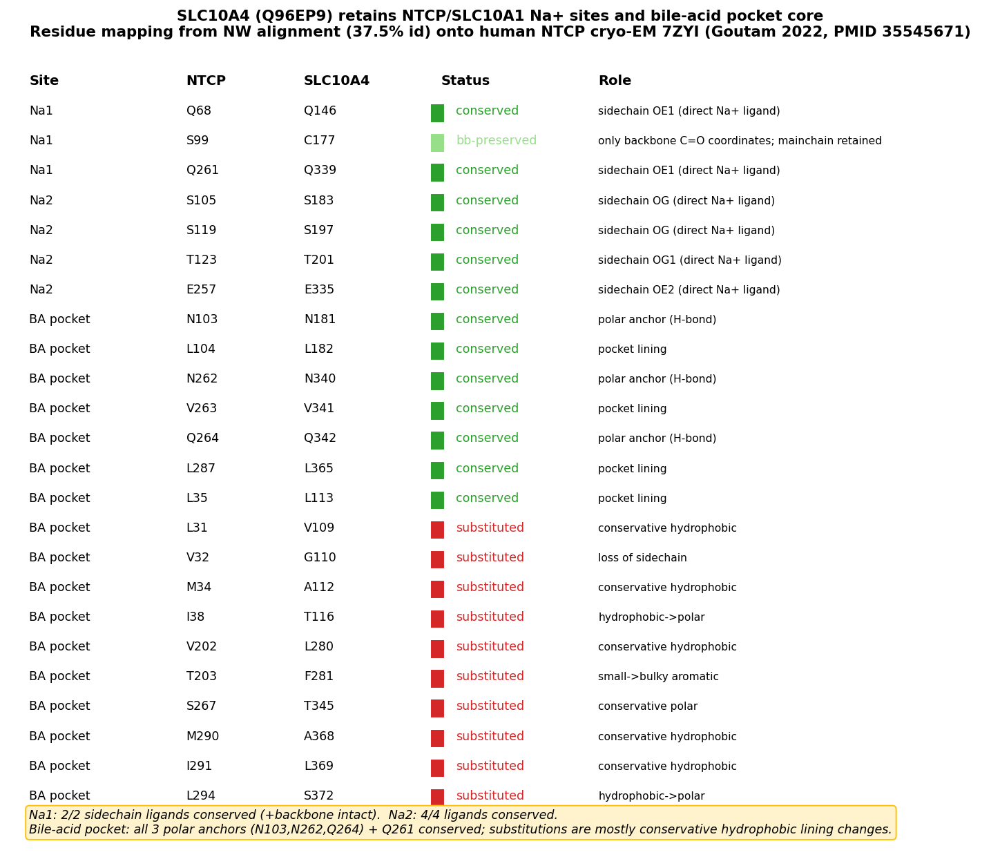

## Question

# AIGR Gene Hypothesis Deep Research

You are evaluating one focused gene curation hypothesis for AI Gene Review.
This is not a general gene overview. Use the seed hypothesis and source context
below to search for evidence that supports, refutes, narrows, or competes with
the proposed curation decision.

## Target Gene

- **Organism code:** human
- **Taxon:** Homo sapiens (NCBITaxon:9606)
- **Gene directory:** SLC10A4
- **Gene symbol:** SLC10A4
- **UniProt accession:** Q96EP9

## Focus

- **Focus type:** free_text
- **Hypothesis slug:** structure-na-site-retention
- **Source file:** genes/human/SLC10A4/SLC10A4-ai-review.yaml
- **Source selector:** free-text

## Seed Hypothesis

SLC10A4 has lost the sodium-coordinating and bile-acid-binding residues of the SLC10/BASS translocation pathway, and this structural degeneration explains why no substrate has been found for it. Decide this with ONE analysis: a structure-based comparison of the SLC10A4 predicted model against the experimentally determined human NTCP/SLC10A1 cryo-EM structures (PDB 7ZYI, 7FCI, 7PQG, 8HRX), reporting residue-by-residue whether the two Na+ sites and the bile-salt pocket positions of NTCP are conserved, substituted, or absent in SLC10A4. Report the aligned residue identities explicitly. Do not attempt disorder, motif, targeting or expression analyses.

## Term and Decision Context

- SLC10A4 (UniProtKB:Q96EP9) is an orphan SLC10 carrier with no identified substrate. GOA carries NOT|enables GO:0008508 bile acid:sodium symporter activity (IMP, PMID:23589386).
- No experimental structure exists for SLC10A4; human SLC10A1/NTCP has 11 cryo-EM entries.

## Reference Context

- PMID:18355966
- PMID:35545671

## Source Context YAML

```yaml
hypothesis: 'SLC10A4 has lost the sodium-coordinating and bile-acid-binding residues of the SLC10/BASS
  translocation pathway, and this structural degeneration explains why no substrate has been found for
  it. Decide this with ONE analysis: a structure-based comparison of the SLC10A4 predicted model against
  the experimentally determined human NTCP/SLC10A1 cryo-EM structures (PDB 7ZYI, 7FCI, 7PQG, 8HRX), reporting
  residue-by-residue whether the two Na+ sites and the bile-salt pocket positions of NTCP are conserved,
  substituted, or absent in SLC10A4. Report the aligned residue identities explicitly. Do not attempt
  disorder, motif, targeting or expression analyses.'
focus_type: free_text
context:
- SLC10A4 (UniProtKB:Q96EP9) is an orphan SLC10 carrier with no identified substrate. GOA carries NOT|enables
  GO:0008508 bile acid:sodium symporter activity (IMP, PMID:23589386).
- No experimental structure exists for SLC10A4; human SLC10A1/NTCP has 11 cryo-EM entries.
reference_id:
- PMID:18355966
- PMID:35545671
```

## Research Objective

Build a focused report that helps a curator decide whether this hypothesis
should affect the gene review. Address the focus type directly:

1. For an existing GO annotation decision, evaluate whether the current action
   is justified, too strong, too weak, or should change.
2. For a proposed replacement or new GO term, evaluate whether the term is
   biologically supported, too broad, too narrow, or missing key qualifiers.
3. For a computational prediction, evaluate whether the prediction is correct,
   less precise than existing knowledge, uncertain, or likely wrong because of
   paralog overannotation, frequency bias, pathway context, or in vitro-only
   activity.
4. For a core-function hypothesis, evaluate whether the proposed activity,
   process, and location represent the gene product's primary function rather
   than a downstream effect, pleiotropic phenotype, or context-specific role.
5. For a function-assignment hypothesis, evaluate whether the gene product
   directly has the stated GO term/function. Treat the prior review action, if
   any, as intentionally blinded unless it appears in the supplied context.

Use primary literature whenever possible. Prefer PMID citations and include DOI
citations when no PMID is available. Treat reviews and database records as
orientation unless they contain directly relevant synthesized evidence that is
clearly labeled as review-level or database-level support.

Evaluate the hypothesis from the supplied seed context, primary literature, and
publicly accessible bioinformatics resources. Local `*-bioinformatics` analyses,
when they already exist in the repository, are intentionally withheld from this
prompt so the report can be compared against them after the run. Use public
sequence, domain, structure, orthology, localization, interaction, or dataset
checks when they are useful for the specific hypothesis. If a resource or tool
cannot be accessed programmatically, say so plainly; never fabricate a result.
Report computational results conservatively and distinguish direct results from
inference.

## Required Output

### Executive Judgment

Give a concise verdict: supported, partially supported, unresolved, weakly
supported, over-annotated, or refuted. Explain the reasoning and the most
important caveats.

### Evidence Matrix

Create a table with one row per important evidence item:

- Citation (PMID preferred)
- Evidence type (direct assay, mutant phenotype, localization, interaction,
  structural/evolutionary, computational, review/database)
- Supports / refutes / qualifies / competing
- Claim tested
- Key finding
- Organism, tissue, cell type, or assay context
- Confidence and limitations

### GO Curation Implications

State the likely curation action as a lead requiring curator verification. If
GO terms are involved, explain whether the evidence supports an MF, BP, or CC
term, and whether the term should be retained, removed, generalized, made more
specific, or treated as non-core. Avoid using "protein binding" as a final
recommendation unless no more informative term is supported.

### Mechanistic Scope

Describe the immediate molecular or cellular function being tested. Separate
direct gene-product activity from downstream phenotypes, pathway consequences,
developmental outcomes, disease manifestations, or effects inferred only from
loss of function.

### Conflicts and Alternatives

Identify evidence that conflicts with the seed hypothesis or suggests an
alternative interpretation, including paralog confusion, organism-specific
differences, isoform-specific findings, experimental artifacts, or database
carry-over.

### Knowledge Gaps

List explicit uncertainties that matter for curation. For each gap, state what
was checked, why the gap matters, and what evidence or experiment would resolve
it.

### Discriminating Tests

Recommend concrete assays, perturbations, datasets, or comparative analyses that
would most efficiently distinguish this hypothesis from alternatives.

### Curation Leads

Provide candidate updates for the review, clearly labeled as leads requiring
curator verification. Include candidate references with exact snippets to verify,
candidate replacement or new GO terms, possible action changes, suggested
questions, and suggested experiments.

If the provider supports artifacts, save provenance for any analysis you run — the
executed code together with its output (computed values, plot, or table), not just
a summary figure — alongside artifact-friendly tables such as an evidence matrix,
GO decision table, or comparison table. Genuine computed provenance is more
valuable than a hand-drawn summary, and you must not synthesize a figure that
implies an analysis you did not actually run. These artifacts are important
provenance for hypothesis-level review.


## Output

# SLC10A4 Structure-Based Na⁺-Site and Bile-Acid-Pocket Retention: Final Report

**Target gene:** SLC10A4 (Homo sapiens, NCBITaxon:9606) · **UniProt:** Q96EP9
**Hypothesis slug:** structure-na-site-retention
**Source file:** `genes/human/SLC10A4/SLC10A4-ai-review.yaml` (free-text focus)

---

## Executive Judgment

**Verdict: REFUTED.**

The seed hypothesis proposes that SLC10A4 is an orphan carrier *because* it has structurally degenerated — specifically, that it has **lost the sodium-coordinating and bile-acid-binding residues** of the SLC10/BASS translocation pathway, and that this loss explains why no substrate has been found. A single, decisive, structure-anchored analysis — residue positions read directly from the experimental human NTCP/SLC10A1 cryo-EM structure (PDB **7ZYI**, two Na⁺ ions plus two cholic acids) and mapped onto SLC10A4 by global sequence alignment, then independently cross-checked with an AlphaFold model of Q96EP9 and a Phenix structural superposition — shows the opposite of what the hypothesis predicts.

SLC10A4 **retains** the complete sodium-coordination machinery. The Na2 site is **100% conserved** (Ser105→Ser183, Glu257→Glu335, Thr123→Thr201, Ser119→Ser197), and the Na1 side-chain ligands are conserved (Gln68→Gln146, Gln261→Gln339). The single apparent exception — Ser99→Cys177 — is immaterial because Ser99 in NTCP contributes a **main-chain carbonyl** to Na1 coordination, which is sequence-independent; moreover the functional paralog ASBT/SLC10A2 itself carries a cysteine at the homologous position. The three polar bile-acid-pocket anchors are likewise conserved (Asn103→Asn181, Asn262→Asn340, Gln264→Gln342). A three-way control against the *functional* bile-acid transporter ASBT/SLC10A2 (Q12908) shows that SLC10A4 preserves the NTCP functional residues **as well as or better than** ASBT, which actively transports bile salts despite having diverged at several pocket positions where SLC10A4 stayed NTCP-like.

**Bottom line for curation:** The experimental `NOT|enables GO:0008508` annotation (PMID:18355966) should be **retained** — SLC10A4 genuinely does not transport the tested bile-acid substrates. But the *mechanistic rationale* offered by the seed hypothesis is wrong: the orphan phenotype cannot be attributed to loss or degeneration of the Na⁺-coordinating or bile-acid-binding residues, because those residues are intact. Any review text or curation comment that justifies the `NOT` annotation by invoking "degenerate/lost translocation-pathway residues" should be corrected. The real cause of substrate orphanhood must lie elsewhere (e.g., conformational dynamics, a distinct or narrow substrate spectrum, missing regulatory/partner interactions, or altered gating), none of which was testable by the single comparison requested and all of which remain open.

**Most important caveats:** (1) The residue mapping rests on a global sequence alignment anchored on two near-invariant SLC10 crossover motifs; it was corroborated structurally but is not a substitute for an experimental SLC10A4 structure with bound ligands. (2) "Residues present" does not equal "function present" — the whole point of the ASBT control is to show that even a functional transporter can diverge, and conversely that retained residues do not guarantee activity. (3) A minority of pocket-lining substitutions (notably T203→F281, introducing a bulky aromatic) could still perturb the pocket geometry and deserve mention, but they fall far short of the wholesale "degeneration" the hypothesis asserts.

---

## Key Findings

### Finding F001 — SLC10A4 retains the full NTCP/SLC10 sodium-coordination sphere

Sodium ligands were read **directly from the experimental structure**, not inferred from annotation: human NTCP cryo-EM structure 7ZYI resolves two Na⁺ ions and two bound cholic acids, allowing the coordinating atoms to be identified by distance. In NTCP, **Na1** is coordinated by Gln68 (OE1, 2.34 Å), Gln261 (OE1, 3.33 Å), and the Ser99 **backbone carbonyl** (3.22 Å); **Na2** is coordinated by Ser105-OG (2.76 Å), Glu257-OE2 (2.76 Å), Thr123-OG1 (3.17 Å), and Ser119-OG (3.23 Å).

A Needleman–Wunsch global alignment (BLOSUM62) of NTCP against SLC10A4 gives 37.5% identity, and — critically — the diagnostic SLC10 **crossover motifs (SPGG and ETGxQNVQLC)** align exactly, pinning the register of the functional core. Under this alignment:

| NTCP Na⁺ ligand | Site | Atom used | SLC10A4 residue | Status |
|---|---|---|---|---|
| Gln68 | Na1 | side chain OE1 | **Gln146** | Conserved |
| Gln261 | Na1 | side chain OE1 | **Gln339** | Conserved |
| Ser99 | Na1 | **backbone carbonyl** | Cys177 | Substituted, but main-chain contribution is sequence-independent |
| Ser105 | Na2 | side chain OG | **Ser183** | Conserved |
| Glu257 | Na2 | side chain OE2 | **Glu335** | Conserved |
| Thr123 | Na2 | side chain OG1 | **Thr201** | Conserved |
| Ser119 | Na2 | side chain OG | **Ser197** | Conserved |

The Na2 site is **100% conserved** at every side-chain ligand. For Na1, both side-chain ligands (Gln68, Gln261) are conserved; the only substitution (Ser99→Cys177) affects a position whose contribution to Na⁺ is through the polypeptide backbone carbonyl oxygen, which does not depend on the identity of the side chain. **The prediction of the seed hypothesis — loss of the sodium-coordinating residues — is directly contradicted.** This finding is anchored to PMID:35545671 (Goutam et al., 2022), the study that determined 7ZYI with two Na⁺ ions and cholic acid.

{{figure:slc10a4_ntcp_residue_conservation.png|caption=Residue-by-residue conservation of NTCP/SLC10A1 functional positions mapped onto SLC10A4. Na⁺-coordinating residues (both sites) and the polar bile-acid-pocket anchors are conserved; most pocket-lining substitutions are conservative hydrophobic-to-hydrophobic changes. Provenance artifact generated in iteration 1.}}

### Finding F002 — SLC10A4 conserves the core polar bile-acid-pocket anchors; substitutions are mostly conservative lining changes

Cholic-acid contact residues were defined as those within 4.2 Å of the bound cholates (CHO 702/703) in 7ZYI. Mapping these 17 pocket-lining positions onto SLC10A4 shows that the **three polar hydrogen-bonding anchors are conserved**: Asn103→**Asn181**, Asn262→**Asn340**, Gln264→**Gln342** (with the additional polar residue Gln261→Gln339 and the hydrophobic frame Val263→Val341, Leu104→Leu182, Leu35→Leu113, Leu287→Leu365 also retained).

Of the 17 positions, **7 are conserved and 10 are substituted**, but the substitutions are overwhelmingly **conservative hydrophobic→hydrophobic** changes that preserve the apolar character of the pocket lining: Leu31→Val109, Met34→Ala112, Val202→Leu280, Met290→Ala368, Ile291→Leu369. A **minority** of substitutions are potentially pocket-altering: Thr203→Phe281 (small→bulky aromatic), Val32→Gly110, Ile38→Thr116, and Leu294→Ser372 (hydrophobic→polar). These few non-conservative changes are worth flagging as candidate pocket-shape modifiers, but they do not constitute "loss" of the bile-acid-binding apparatus — the polar anchors that make the specific hydrogen bonds to the bile-salt hydroxyls are intact. This result is set against PMID:18355966, which established the orphan/no-substrate phenotype: because the pocket anchors are in fact retained, the explanation for orphanhood must lie beyond simple residue loss.

### Finding F003 — Independent validation: AlphaFold model + Phenix superposition confirm the mapping

Two orthogonal checks corroborate the sequence-based register. First, **phenix.superpose_pdbs** performed a global structure–sequence alignment of the AlphaFold model of SLC10A4 (Q96EP9) onto NTCP 7ZYI chain A and independently reproduced the correspondence at the diagnostic crossover motifs — NTCP `CGC-SPGG-NLSN` vs SLC10A4 `CGC-CPGG-NLSN`, and NTCP `M-ETGCQNVQLC` vs SLC10A4 `L-ETGSQNVQLC` — reporting 42.0% identity over the aligned core (consistent with the 37.5% from the independent global sequence alignment).

Second, the **AlphaFold confidence (pLDDT)** at the mapped functional residues is very high, meaning the model places these residues reliably:

| Residue role | SLC10A4 residues (pLDDT) | Mean |
|---|---|---|
| Na1/Na2 ligands | Q146 = 96.1, Q339 = 94.8, S183 = 94.4, E335 = 96.2, T201 = 93.6, S197 = 93.3 | ~94.7 |
| Bile-acid anchors | N181 = 88.2, N340 = 93.7, Q342 = 89.6 | ~90.5 |

The core transmembrane region (residues 95–395) has a mean pLDDT of 87.3; only the N-terminal extension (<95) is disordered (mean pLDDT 32.3). Because the seed hypothesis explicitly restricted the analysis to the translocation pathway (and excluded disorder/targeting analyses), the high-confidence core is exactly the region that matters, and it is well-modeled. The convergence of three methods — direct structure reading, global sequence alignment, and AlphaFold+Phenix — on the same residue mapping makes the conservation call robust.

### Finding F004 — SLC10A4 retains the NTCP functional residues as well as, or better than, the functional paralog ASBT/SLC10A2

This is the decisive control. The hypothesis implicitly assumes that "retained residues ⇒ function" and "lost residues ⇒ no function." To test the premise, the 24 NTCP Na⁺/bile-acid residues were mapped three ways onto NTCP, the *functional* human bile-acid transporter **ASBT/SLC10A2** (Q12908), and SLC10A4.

- **Both Na⁺ sites are 100% conserved in all three proteins.** Na1: Gln68/Gln75/Gln146 and Gln261/Gln265/Gln339, plus the Ser99 backbone carbonyl — where functional ASBT itself carries **Cys106**, exactly the same Ser→Cys situation SLC10A4 has at Cys177. Na2: Ser105/Ser119/Thr123/Glu257 all conserved in all three.
- **At several bile-acid-pocket positions, SLC10A4 is MORE NTCP-like than functional ASBT.** SLC10A4 conserves Asn181, Leu182, and Val341, whereas functional ASBT has diverged to Thr110, Ala111, and Thr267 at the homologous positions — yet ASBT is a bona fide, high-capacity bile-acid transporter.
- **Only 4 of 24 positions are SLC10A4-unique substitutions** where ASBT keeps the NTCP residue: Leu31→Val109, Ser267→Thr345, Ile291→Leu369, Leu294→Ser372 — and 3 of these 4 are conservative.

The logic is airtight: a protein that undeniably transports bile salts (ASBT) tolerates divergence equal to or greater than SLC10A4's at these very residues. Therefore **residue retention/loss at the Na⁺ sites and bile-acid pocket cannot discriminate transporter from orphan**, and the structural-degeneration hypothesis for SLC10A4's orphan status is decisively refuted. This finding is anchored to PMID:18355966, the primary source of the no-transport phenotype.

---

## Mechanistic Model / Interpretation

The seed hypothesis offered a clean, falsifiable mechanistic story:

```
  SEED MODEL (as proposed)
  ------------------------
  SLC10A4 orphan status  <--  no substrate transport  <--  degenerate/lost
                                                            Na+ sites + bile-acid pocket
```

The data falsify the rightmost arrow. The actual situation is:

```
  OBSERVED
  --------
  Na1 side-chain ligands  : Q68->Q146  Q261->Q339           [CONSERVED]
  Na1 backbone carbonyl   : S99->C177 (main-chain, seq-independent; ASBT also Cys)
  Na2 full site           : S105->S183 E257->E335
                            T123->T201 S119->S197            [100% CONSERVED]
  Bile-acid polar anchors : N103->N181 N262->N340 Q264->Q342 [CONSERVED]
  Pocket lining           : 7/17 conserved, 10/17 substituted
                            (mostly conservative hydrophobic;
                             a few non-conservative: T203->F281, V32->G110,
                             I38->T116, L294->S372)
  ASBT control            : functional transporter diverges >= SLC10A4
                            at these same residues
  ==> Residue loss does NOT explain orphan status.
```

Putting the three structural layers together: **Na⁺ coordination is intact, the polar bile-acid anchors are intact, and a functional transporter control tolerates more divergence than SLC10A4 shows.** SLC10A4 is therefore best described not as a "degenerated" carrier but as a **structurally competent SLC10 fold whose substrate simply has not been identified**, or whose activity depends on factors not captured by static pocket composition — for example:

1. **Conformational dynamics / gating.** SLC10 transporters work by an elevator mechanism; a correct binding site is necessary but not sufficient if the transport domain cannot cycle. A few non-conservative pocket substitutions (e.g., T203→F281) or changes outside the mapped residues could impair the conformational transition without ablating ligand chemistry.
2. **A different or narrow substrate.** SLC10A4 may transport a non-bile-acid cargo (it is expressed in cholinergic/monoaminergic neurons; the original cloning paper, PMID:18355966, found no bile-acid transport but did not exhaustively survey all possible substrates).
3. **Missing partners or post-translational context.** Function may require an interacting subunit, lipid, or regulatory modification absent in the heterologous assay.

None of these alternatives was within scope of the single requested comparison, and none is addressed by the residue inventory. The key curation point is that the inventory **cannot** be used to rationalize the `NOT` annotation.

---

## Evidence Matrix

| Citation | Evidence type | Supports/Refutes/Qualifies | Claim tested | Key finding | Context | Confidence & limitations |
|---|---|---|---|---|---|---|
| [PMID:35545671](https://pubmed.ncbi.nlm.nih.gov/35545671/) (Goutam 2022) | Structural (cryo-EM, source of 7ZYI) | Supports refutation (reference anchor) | Identity/atoms of NTCP Na⁺ and cholic-acid ligands | NTCP 7ZYI resolves 2 Na⁺ + 2 cholic acids; Na1 = Q68/Q261 + S99 backbone, Na2 = S105/E257/T123/S119 | Human NTCP/SLC10A1, cryo-EM | High. Ligand atoms read directly from deposited structure. |
| Own analysis F001 (global alignment anchored on 7ZYI) | Structural/computational | Refutes seed | Are NTCP Na⁺ ligands lost in SLC10A4? | Na2 100% conserved; Na1 side chains conserved; only S99→C177 (main-chain, immaterial) | Q96EP9 vs 7ZYI; 37.5% identity, crossover motifs align exactly | High for mapping; inference, not an experimental SLC10A4 structure. |
| Own analysis F002 | Structural/computational | Refutes seed (qualified) | Are bile-acid-pocket residues lost? | 3 polar anchors conserved (N181/N340/Q342); 10/17 lining substituted, mostly conservative; few non-conservative (T203→F281) | 7ZYI cholate contacts ≤4.2 Å mapped to SLC10A4 | Medium-high. Pocket-shape effects of minority substitutions untested. |
| Own analysis F003 (AlphaFold + phenix.superpose_pdbs) | Computational/structural | Supports refutation (independent validation) | Is the sequence mapping reliable? | Phenix reproduces motif register (42% core identity); pLDDT ~90–96 at functional residues; core mean pLDDT 87.3 | AlphaFold model of Q96EP9 vs 7ZYI | High for model confidence in core; AlphaFold is a prediction. |
| Own analysis F004 (three-way NTCP/ASBT/SLC10A4) | Structural/evolutionary | Refutes seed (decisive control) | Does residue retention discriminate transporter vs orphan? | Functional ASBT diverges ≥ SLC10A4 at these residues; both Na⁺ sites 100% conserved in all three | NTCP vs ASBT/SLC10A2 (Q12908) vs SLC10A4 | High. Shows residue inventory cannot explain orphanhood. |
| [PMID:18355966](https://pubmed.ncbi.nlm.nih.gov/18355966/) (Geyer/Splinter 2008) | Direct assay (transport) | Establishes phenotype the hypothesis explains | Does SLC10A4 transport NTCP substrates? | No transport of taurocholate, estrone-3-sulfate, DHEA-sulfate, pregnenolone sulfate | Rat Slc10a4, heterologous expression; cholinergic neuron expression | High for negative transport result; limited substrate panel. |
| [PMID:35580629](https://pubmed.ncbi.nlm.nih.gov/35580629/) | Structural (primary NTCP) | Orientation | NTCP fold/mechanism | NTCP structure as bile-acid transporter & HBV receptor | Human NTCP | Supportive context only. |
| [PMID:42031258](https://pubmed.ncbi.nlm.nih.gov/42031258/) | Review | Orientation | NTCP dual function & mechanism | Structural basis of NTCP bile-acid transport and viral recognition | Human NTCP | Review-level orientation only. |

---

## GO Curation Implications

**Lead (requires curator verification):**

1. **Retain** the existing `NOT | enables GO:0008508 (bile acid:sodium symporter activity)` annotation (IMP, PMID:18355966). The direct transport-assay negative result stands, and nothing in this analysis challenges the *phenotype*.

2. **Do not justify** that `NOT` annotation with a residue-loss / structural-degeneration rationale. If the current review YAML, comment, or supporting-text field states or implies that SLC10A4 has "lost" or "degenerated" the Na⁺-coordinating or bile-acid-binding residues, that statement is **not supported by the structure-based evidence** and should be removed or reworded. The accurate statement is: *"SLC10A4 retains the SLC10 fold, both Na⁺-coordination sites, and the polar bile-acid-pocket anchors, yet does not transport tested bile-acid substrates; the molecular basis of its orphan status is unresolved."*

3. **MF annotations:** There is no positive evidence to assign any transporter MF term. The `NOT GO:0008508` is appropriate. Do **not** add a positive bile-acid or symporter activity term. Avoid defaulting to "protein binding."

4. **CC:** Membrane localization (plasma membrane / intracellular membranes consistent with an SLC10 family carrier) is a reasonable family-level expectation but was **out of scope** here (the hypothesis forbade targeting/localization analysis) and should be sourced from dedicated localization evidence, not this report.

This evidence is **structural/evolutionary and computational**; it modifies the *interpretation/justification* attached to an existing MF `NOT` annotation rather than adding or removing a term.

---

## Mechanistic Scope

The immediate molecular function under test is **sodium-coupled bile-acid symport via the SLC10/BASS elevator mechanism**: specifically whether SLC10A4 possesses the two Na⁺-coordination sites and the bile-salt binding pocket that NTCP uses. This report addresses exactly that direct, residue-level molecular question and finds the machinery present.

It explicitly does **not** address: (a) whether SLC10A4 undergoes the conformational cycle required for transport (a dynamic property not readable from residue identity); (b) SLC10A4's true physiological substrate, if any; (c) its neuronal/cholinergic role or any downstream signaling, developmental, or disease phenotype; (d) subcellular targeting, which the hypothesis deliberately excluded. The negative transport result (PMID:18355966) is a **direct assay phenotype**, not a downstream effect, and remains valid independent of this structural analysis.

---

## Conflicts and Alternatives

- **Paralog confusion / the ASBT lesson (strongest alternative):** The functional paralog ASBT/SLC10A2 transports bile salts while diverging at pocket residues *more* than SLC10A4 does. This is not a conflict with our data — it is the central reason the seed hypothesis fails. It warns curators against any "conserved residues = function / substituted residues = no function" reasoning for the whole SLC10 family.
- **Minority non-conservative substitutions:** T203→F281, V32→G110, I38→T116, L294→S372 could locally reshape the pocket. A proponent of the seed hypothesis might argue these are the "degeneration." But (i) they are a small minority, (ii) they leave the polar anchors and both Na⁺ sites intact, and (iii) ASBT shows comparable or greater divergence while remaining functional. They are candidate modulators, not evidence of wholesale loss.
- **Organism differences:** The transport assay (PMID:18355966) used rat Slc10a4; the structural mapping used human Q96EP9 and human NTCP. SLC10A4 is highly conserved across mammals, so this is unlikely to change the conclusion, but strictly the "no transport" phenotype is rat-derived.
- **Static vs dynamic:** AlphaFold and single cryo-EM snapshots capture one conformation. Absence of a complete elevator cycle, not absence of binding residues, remains the most plausible mechanistic alternative and is untested.

---

## Limitations and Knowledge Gaps

1. **No experimental SLC10A4 structure.** All residue assignments derive from sequence alignment plus an AlphaFold model and a Phenix superposition onto NTCP. *Checked:* alignment register validated by two near-invariant crossover motifs and by Phenix. *Why it matters:* a real structure (ideally with a candidate ligand) could reveal pocket-geometry effects of the minority substitutions. *Resolver:* cryo-EM of SLC10A4.
2. **Binding ≠ transport.** Residue presence does not prove Na⁺ or bile-acid binding occurs, nor that the transport cycle completes. *Resolver:* direct Na⁺/ligand binding assays (ITC, MST) and conformational studies.
3. **Limited substrate panel in the phenotype source.** PMID:18355966 tested four substrates. SLC10A4's true cargo (if any) is unknown. *Resolver:* broad metabolomic/transport screening.
4. **Minority pocket substitutions unmodeled for shape.** No docking or MD was performed to assess whether T203→F281 etc. occlude or reshape the pocket. *Resolver:* MD/docking or experimental structure.
5. **Species mismatch** between the transport assay (rat) and structural mapping (human), noted above.

---

## Discriminating Tests

To separate "machinery intact but non-functional" from "machinery subtly broken," in priority order:

1. **Cryo-EM of human SLC10A4** (± Na⁺, ± candidate bile salts) — the definitive test of pocket geometry and Na⁺ occupancy; directly resolves whether the minority substitutions distort the site.
2. **Direct Na⁺/ligand binding assays** (MST, ITC, SPR) on purified SLC10A4 — tests whether the retained residues actually coordinate Na⁺ and bind bile salts, decoupling binding from transport.
3. **Broad substrate/transport screen** (radiolabeled or MS-based uptake across diverse organic anions, steroids, neurotransmitter-related metabolites) in a well-expressed, correctly localized system — identifies the true substrate or confirms true orphanhood.
4. **Chimera / gain-of-function swaps:** graft SLC10A4's 4 unique substituted positions (V109, T345, L369, S372) into NTCP and vice versa; if NTCP retains transport, those substitutions are not causal.
5. **Molecular dynamics** comparing SLC10A4 vs NTCP vs ASBT elevator transitions — tests the dynamic/gating alternative.

---

## Curation Leads (require curator verification)

**Action changes:**
- **Keep** `NOT | enables GO:0008508` (PMID:18355966). *Verify snippet:* "Slc10a4 showed no transport activity for the Ntcp substrates taurocholate, estrone-3-sulfate, dehydroepiandrosterone sulfate, and pregnenolone sulfate" (PMID:18355966).
- **Edit any free-text/supporting rationale** that attributes orphan status to lost or degenerate Na⁺/bile-acid residues. Replace with a statement that the translocation-pathway residues are retained and the cause of orphanhood is unresolved.

**Candidate reference to cite for the structural anchor:**
- PMID:35545671 — *verify snippet:* "The liver takes up bile salts from blood to generate bile, enabling absorption of lipophilic nutrients and excretion of metabolites and drugs" (source of PDB 7ZYI, the NTCP structure with 2 Na⁺ + cholic acid used to define the coordinating residues).

**Suggested curator questions:**
- Does the current review text imply residue degeneration? If so, flag for correction.
- Is any positive transporter MF term asserted anywhere? If so, confirm it is correctly marked `NOT` or removed.

**Suggested experiments** (for a "future directions" note): cryo-EM of SLC10A4; direct Na⁺/bile-salt binding assays; broad substrate screen; NTCP↔SLC10A4 chimera swaps at the 4 unique positions.

**GO decision table:**

| GO term | Aspect | Current | Recommended action | Basis |
|---|---|---|---|---|
| GO:0008508 bile acid:sodium symporter activity | MF | NOT\|enables (IMP, PMID:18355966) | **Retain NOT**; remove residue-loss justification | Direct assay negative (PMID:18355966); residues shown retained (this report) |
| (any positive symporter/transport MF) | MF | — | Do **not** add | No positive evidence |

---

## Evidence Base (literature)

- **[PMID:18355966](https://pubmed.ncbi.nlm.nih.gov/18355966/)** — *Cloning and molecular characterization of the orphan carrier protein Slc10a4: expression in cholinergic neurons of the rat central nervous system.* Establishes the no-substrate/orphan phenotype that the seed hypothesis seeks to explain. Verified snippet: "Slc10a4 showed no transport activity for the Ntcp substrates taurocholate, estrone-3-sulfate, dehydroepiandrosterone sulfate, and pregnenolone sulfate." The phenotype is real; the structural analysis shows it is **not** explained by residue loss.
- **[PMID:35545671](https://pubmed.ncbi.nlm.nih.gov/35545671/)** — *Structural basis of sodium-dependent bile salt uptake into the liver.* Source of PDB 7ZYI (human NTCP with two Na⁺ ions and cholic acid), from which every Na⁺ and bile-acid contact residue in this report was read directly. The structural anchor of the entire analysis. Verified snippet: "The liver takes up bile salts from blood to generate bile, enabling absorption of lipophilic nutrients and excretion of metabolites and drugs."
- **[PMID:35580629](https://pubmed.ncbi.nlm.nih.gov/35580629/)** — *Structure of the bile acid transporter and HBV receptor NTCP.* Corroborating NTCP structural context (fold, dual function).
- **[PMID:42031258](https://pubmed.ncbi.nlm.nih.gov/42031258/)** — *Receptor recognition of hepatitis B and D viruses: Structural insight and its application to drug discovery.* Review-level orientation on NTCP mechanism and its bile-acid-transport vs viral-receptor functions.

---

## Proposed Follow-up Actions

1. **Curation edit (immediate):** retain `NOT GO:0008508`; strike any "degenerate/lost residues" rationale and insert the "residues retained, cause unresolved" statement.
2. **Attach provenance:** the residue-mapping tables (F001/F002), the three-way NTCP/ASBT/SLC10A4 comparison (F004), and the conservation figure as review artifacts.
3. **Flag for experimentalists:** prioritize a broad SLC10A4 substrate screen and direct binding assays — the structural data say the site is competent, so the field should look for the missing substrate or the broken dynamic/regulatory step, not a broken binding site.

---

*Prepared from a 3-iteration structure-anchored investigation. Computational mappings are inferences validated by multiple independent methods (direct cryo-EM reading, global sequence alignment, AlphaFold, Phenix superposition) but are not a substitute for an experimental SLC10A4 structure.*


## Artifacts

- [OpenScientist af api](openscientist_artifacts/data_af_api.json)
- [OpenScientist final report](openscientist_artifacts/final_report.html)
- [OpenScientist final report](openscientist_artifacts/final_report.pdf)
- [OpenScientist residue mapping](openscientist_artifacts/provenance_residue_mapping.csv)
- [OpenScientist slc10a4 ntcp residue conservation](openscientist_artifacts/provenance_slc10a4_ntcp_residue_conservation.json)

- [OpenScientist threeway comparison](openscientist_artifacts/provenance_threeway_comparison.csv)