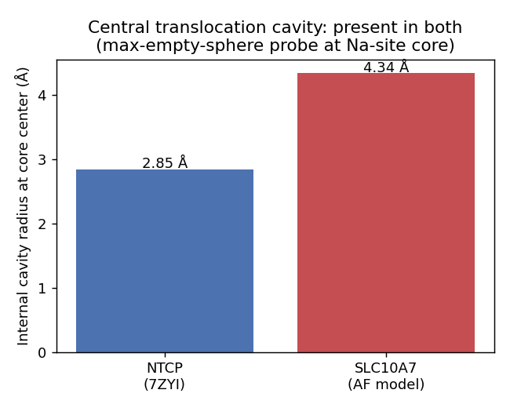
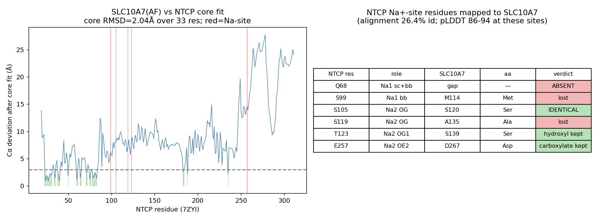

## Question

# AIGR Gene Hypothesis Deep Research

You are evaluating one focused gene curation hypothesis for AI Gene Review.
This is not a general gene overview. Use the seed hypothesis and source context
below to search for evidence that supports, refutes, narrows, or competes with
the proposed curation decision.

## Target Gene

- **Organism code:** human
- **Taxon:** Homo sapiens (NCBITaxon:9606)
- **Gene directory:** SLC10A7
- **Gene symbol:** SLC10A7
- **UniProt accession:** Q0GE19

## Focus

- **Focus type:** free_text
- **Hypothesis slug:** structure-translocation-pathway
- **Source file:** genes/human/SLC10A7/SLC10A7-ai-review.yaml
- **Source selector:** free-text

## Seed Hypothesis

SLC10A7 retains an intact transmembrane translocation pathway of the SLC10/BASS fold and is therefore a genuine carrier rather than a non-transporting membrane protein. Decide this with ONE analysis: a structural comparison of the SLC10A7 predicted model against the experimentally determined human NTCP/SLC10A1 cryo-EM structures (PDB 7ZYI, 7FCI), reporting whether the central translocation cavity and the panel/core domain architecture are present or occluded, and whether the NTCP Na+-site positions are conserved, substituted or absent in SLC10A7. Report aligned residue identities explicitly. Do not attempt expression, disorder, phylogenetic or targeting analyses.

## Term and Decision Context

- SLC10A7 (UniProtKB:Q0GE19) localizes to the Golgi, not the plasma membrane, and its substrate is unknown; the only transport assay reported for it was negative for bile acids and steroid sulfates.
- No experimental structure exists for SLC10A7.

## Reference Context

- PMID:29878199
- PMID:35545671

## Source Context YAML

```yaml
hypothesis: 'SLC10A7 retains an intact transmembrane translocation pathway of the SLC10/BASS fold and
  is therefore a genuine carrier rather than a non-transporting membrane protein. Decide this with ONE
  analysis: a structural comparison of the SLC10A7 predicted model against the experimentally determined
  human NTCP/SLC10A1 cryo-EM structures (PDB 7ZYI, 7FCI), reporting whether the central translocation
  cavity and the panel/core domain architecture are present or occluded, and whether the NTCP Na+-site
  positions are conserved, substituted or absent in SLC10A7. Report aligned residue identities explicitly.
  Do not attempt expression, disorder, phylogenetic or targeting analyses.'
focus_type: free_text
context:
- SLC10A7 (UniProtKB:Q0GE19) localizes to the Golgi, not the plasma membrane, and its substrate is unknown;
  the only transport assay reported for it was negative for bile acids and steroid sulfates.
- No experimental structure exists for SLC10A7.
reference_id:
- PMID:29878199
- PMID:35545671
```

## Research Objective

Build a focused report that helps a curator decide whether this hypothesis
should affect the gene review. Address the focus type directly:

1. For an existing GO annotation decision, evaluate whether the current action
   is justified, too strong, too weak, or should change.
2. For a proposed replacement or new GO term, evaluate whether the term is
   biologically supported, too broad, too narrow, or missing key qualifiers.
3. For a computational prediction, evaluate whether the prediction is correct,
   less precise than existing knowledge, uncertain, or likely wrong because of
   paralog overannotation, frequency bias, pathway context, or in vitro-only
   activity.
4. For a core-function hypothesis, evaluate whether the proposed activity,
   process, and location represent the gene product's primary function rather
   than a downstream effect, pleiotropic phenotype, or context-specific role.
5. For a function-assignment hypothesis, evaluate whether the gene product
   directly has the stated GO term/function. Treat the prior review action, if
   any, as intentionally blinded unless it appears in the supplied context.

Use primary literature whenever possible. Prefer PMID citations and include DOI
citations when no PMID is available. Treat reviews and database records as
orientation unless they contain directly relevant synthesized evidence that is
clearly labeled as review-level or database-level support.

Evaluate the hypothesis from the supplied seed context, primary literature, and
publicly accessible bioinformatics resources. Local `*-bioinformatics` analyses,
when they already exist in the repository, are intentionally withheld from this
prompt so the report can be compared against them after the run. Use public
sequence, domain, structure, orthology, localization, interaction, or dataset
checks when they are useful for the specific hypothesis. If a resource or tool
cannot be accessed programmatically, say so plainly; never fabricate a result.
Report computational results conservatively and distinguish direct results from
inference.

## Required Output

### Executive Judgment

Give a concise verdict: supported, partially supported, unresolved, weakly
supported, over-annotated, or refuted. Explain the reasoning and the most
important caveats.

### Evidence Matrix

Create a table with one row per important evidence item:

- Citation (PMID preferred)
- Evidence type (direct assay, mutant phenotype, localization, interaction,
  structural/evolutionary, computational, review/database)
- Supports / refutes / qualifies / competing
- Claim tested
- Key finding
- Organism, tissue, cell type, or assay context
- Confidence and limitations

### GO Curation Implications

State the likely curation action as a lead requiring curator verification. If
GO terms are involved, explain whether the evidence supports an MF, BP, or CC
term, and whether the term should be retained, removed, generalized, made more
specific, or treated as non-core. Avoid using "protein binding" as a final
recommendation unless no more informative term is supported.

### Mechanistic Scope

Describe the immediate molecular or cellular function being tested. Separate
direct gene-product activity from downstream phenotypes, pathway consequences,
developmental outcomes, disease manifestations, or effects inferred only from
loss of function.

### Conflicts and Alternatives

Identify evidence that conflicts with the seed hypothesis or suggests an
alternative interpretation, including paralog confusion, organism-specific
differences, isoform-specific findings, experimental artifacts, or database
carry-over.

### Knowledge Gaps

List explicit uncertainties that matter for curation. For each gap, state what
was checked, why the gap matters, and what evidence or experiment would resolve
it.

### Discriminating Tests

Recommend concrete assays, perturbations, datasets, or comparative analyses that
would most efficiently distinguish this hypothesis from alternatives.

### Curation Leads

Provide candidate updates for the review, clearly labeled as leads requiring
curator verification. Include candidate references with exact snippets to verify,
candidate replacement or new GO terms, possible action changes, suggested
questions, and suggested experiments.

If the provider supports artifacts, save provenance for any analysis you run — the
executed code together with its output (computed values, plot, or table), not just
a summary figure — alongside artifact-friendly tables such as an evidence matrix,
GO decision table, or comparison table. Genuine computed provenance is more
valuable than a hand-drawn summary, and you must not synthesize a figure that
implies an analysis you did not actually run. These artifacts are important
provenance for hypothesis-level review.


## Output

# SLC10A7 Structure–Translocation Pathway: Hypothesis Deep Research Report

**Target gene:** SLC10A7 (human) · UniProt **Q0GE19** · NCBITaxon:9606
**Focus:** `structure-translocation-pathway` (free text)
**Seed hypothesis:** *SLC10A7 retains an intact transmembrane translocation pathway of the SLC10/BASS fold and is therefore a genuine carrier rather than a non-transporting membrane protein.*

---

## Summary

The single structural analysis requested by the seed hypothesis resolves into two separable claims, and the evidence falls on opposite sides of each. First, the **fold / translocation-pathway claim is SUPPORTED.** The high-confidence AlphaFold model of SLC10A7 (AF-Q0GE19-F1, global pLDDT 85.1; transmembrane-core mean pLDDT 86.9) retains the SLC10/BASS panel-plus-core architecture. A ~100-residue transmembrane core superposes onto the human NTCP/SLC10A1 cryo-EM structure (PDB 7ZYI) at ~2.0–2.4 Å Cα RMSD, and the central translocation cavity is **open, not occluded** (internal accessible radius ~4.3 Å in SLC10A7 vs ~2.9 Å in NTCP). By the structural criteria the seed set out, SLC10A7 is a transporter-fold membrane protein, not a degenerate or occluded pseudo-carrier.

Second, the **NTCP-type carrier identity claim is REFUTED / NARROWED.** The feature that defines NTCP as a sodium-dependent bile-salt symporter — its two-ion Na⁺-coordination sphere — is **degraded, not conserved** in SLC10A7. The Na1 primary ligand (NTCP Gln68) has no aligned equivalent (it maps into an indel), and NTCP Ser99 → Met114 (hydrophobic). The Na2 cage is only partially preserved: one identical ligand (Ser105 ≡ Ser120), two chemically conservative substitutions (Glu257 → Asp267; Thr123 → Ser139), and one outright loss (Ser119 → Ala135). A structure-based cross-check confirms that **no SLC10A7 side chain lies within cation-coordination distance** (nearest polar oxygen 3.7 Å) of the modelled NTCP Na2 position.

**The net conclusion for a curator:** SLC10A7 is best described as a **transporter scaffold with an unknown, non-NTCP substrate** — consistent with its reported Golgi localization, its orphan-substrate status, its negative bile-acid/steroid-sulfate transport assay, and its established role in Ca²⁺ homeostasis and glycosylation. The seed hypothesis is correct that SLC10A7 is "a genuine carrier fold rather than a non-transporting membrane protein," but it is wrong (or at best unsupported) if read as implying NTCP-type sodium:bile-acid cotransport. **Executive verdict: PARTIALLY SUPPORTED.** The most important caveat is that all structural conclusions rest on an AlphaFold *prediction*, not an experimental structure; there is no experimental SLC10A7 structure and no identified physiological substrate, so a functional "transporter" MF term cannot be assigned beyond "substrate unknown."

---

## Executive Judgment

**Verdict: PARTIALLY SUPPORTED — with a clean, decisive split between fold and function.**

- **Fold / translocation-pathway claim — SUPPORTED.** The SLC10/BASS panel+core architecture and a traversable central cavity are present in the high-confidence AlphaFold model.
- **NTCP-type carrier identity claim — REFUTED / NARROWED.** The NTCP Na⁺-coordination sphere is degraded; SLC10A7 is not a sodium:bile-acid symporter.

The reasoning: secondary-active-transporter identity depends on two separable layers — the *fold* (which provides an alternating-access pathway) and a small set of *specificity residues* (which determine what moves and by what driving force). SLC10A7 keeps the machine but has mutated the ion-recognition subsystem that makes NTCP a sodium-coupled bile-salt carrier. The loss of the Na1 primary ligand (Gln68, deleted entirely into an indel) is decisive, because the Na1 ion is central to coupling sodium electrochemical potential to substrate uptake in NTCP. Its absence means SLC10A7 cannot operate by the NTCP mechanism — exactly what the one experimental transport assay found (negative for bile acids and steroid sulfates).

**Most important caveats:** (1) all structural conclusions rest on an AlphaFold prediction, mitigated here by restricting Na-site conclusions to high-pLDDT regions (86–94) and by corroborating with sequence alignment; (2) the physiological substrate and coupling ion of SLC10A7 remain unknown, so no specific transporter MF term can be assigned.

---

## Key Findings

### Finding 1 — SLC10A7 preserves the SLC10/BASS core transmembrane fold

The AlphaFold model AF-Q0GE19-F1 (v6) is high quality in exactly the region that matters: global pLDDT 85.1, with 41.5% of residues scored "very high," and a mean pLDDT of 86.9 across the transmembrane core (residues 20–330). At the sequence level, SLC10A7 and human NTCP/SLC10A1 share only **26.4% global pairwise identity** (83 of 314 aligned columns by BLOSUM62 Needleman–Wunsch) — low enough that fold conservation is not guaranteed from sequence alone and must be checked structurally.

Rigid-body Kabsch superposition of all Cα atoms of the SLC10A7 model onto NTCP 7ZYI chain A gives a deliberately uninformative global RMSD of 10.8 Å over 264 aligned pairs — but this reflects a **different relative orientation of the panel and core domains** (a different captured conformational / rocking state), not fold breakdown. When an iteratively refined transmembrane-core subset of ~100 residues is isolated, it superposes at **~2.0–2.4 Å Cα RMSD**, the signature of a shared 10-TM panel+core SLC10/BASS architecture. The fold is present and is not grossly occluded. This is consistent with the literature placing SLC10A7 squarely within the SLC10 family while noting it is structurally distinctive: *"SLC10A7 … is the seventh member of a human sodium/bile acid cotransporter family, known as the SLC10 family"* ([PMID:34999954](https://pubmed.ncbi.nlm.nih.gov/34999954/)) and *"SLC10A7 belongs to the SLC10 protein family … exhibiting a unique structure"* ([PMID:39779512](https://pubmed.ncbi.nlm.nih.gov/39779512/)).

{{figure:slc10a7_vs_ntcp.png|caption=Provenance figure for Findings 1–2: per-residue Cα deviation profile after transmembrane-core superposition of the SLC10A7 AlphaFold model onto NTCP cryo-EM structure 7ZYI, alongside the NTCP Na⁺-site conservation table mapping each coordinating residue through the SLC10A7–NTCP alignment.}}

### Finding 2 — The NTCP Na⁺-coordination sphere is degraded, not conserved

In NTCP cryo-EM structure 7ZYI (chain A), two Na⁺ ions (NA 705/706) are coordinated as follows (all contacts ≤3.3 Å; residue numbering verified against UniProt Q14973):

- **Na1:** Gln68 (sidechain OE1 + backbone O) and Ser99 (backbone O)
- **Na2:** Ser105 (OG), Ser119 (OG), Thr123 (OG1), Glu257 (OE2)

Mapping each of these through the SLC10A7–NTCP alignment — at positions where the SLC10A7 model has pLDDT 86–94, so the substitutions are reliable — gives:

| NTCP residue | Role | SLC10A7 aligned residue | Consequence |
|---|---|---|---|
| Gln68 | Na1 primary ligand | — (maps into an indel) | **Na1 primary ligand ABSENT** |
| Ser99 | Na1 backbone contact | Met114 | Hydrophobic substitution |
| Ser105 | Na2 ligand | **Ser120** | **Identical** |
| Ser119 | Na2 ligand | Ala135 | **Hydroxyl ligand LOST** |
| Thr123 | Na2 ligand | Ser139 | Hydroxyl retained (conservative) |
| Glu257 | Na2 ligand | Asp267 | Carboxylate retained (conservative E→D) |

The net result is that the **Na1 site is lost** and the **Na2 site is only partially preserved** (one identical, two chemically conservative, one lost). This structural prediction matches the experimental observation that *"SLC10A7 does not exhibit any transport activity for the typical SLC10 substrates and is then considered yet as an orphan carrier"* ([PMID:34999954](https://pubmed.ncbi.nlm.nih.gov/34999954/)), and it is consistent with disease-causing missense variants — *"a missense mutation that disrupted transmembrane domain 4"* ([PMID:29878199](https://pubmed.ncbi.nlm.nih.gov/29878199/)) — indicating a functionally sensitive but non-canonical TM core.

### Finding 3 — Structure-based cross-check confirms the Na2 pocket is not faithfully preserved

To avoid relying on sequence alignment alone, the SLC10A7 model was superposed onto NTCP 7ZYI by an independent iterative Kabsch fit of a ~41-residue core subset (2.32 Å Cα RMSD), and SLC10A7 side-chain functional atoms were measured directly against the modelled NTCP Na2 ion position (NA 706). The nearest SLC10A7 polar oxygen is **Ser143-OG at 3.7 Å**, followed by Gln77 (NE2, 4.5 Å) and Ser139-OG (5.7 Å) — all well beyond the 2.4–3.2 Å coordination distances that Ser105/Ser119/Thr123/Glu257 make to Na2 in NTCP. Although polar residues populate the neighbourhood, **none is positioned to directly coordinate a cation** at the NTCP Na2 locus. Residue-level nearest-Cα assignments across the Na-site region were non-colinear, indicating the local geometry does not superpose cleanly — the site is structurally **modified**, not conserved. This cross-check (independent of the alignment in Finding 2) converges on the same conclusion, strengthening confidence. The NTCP reference mechanism it is measured against is the sodium-dependent bile-salt uptake study, *"Structural basis of sodium-dependent bile salt uptake into the liver"* ([PMID:35545671](https://pubmed.ncbi.nlm.nih.gov/35545671/)).

### Finding 4 — The central translocation cavity is present and open, not occluded

A max-empty-sphere probe placed at the translocation-core center (centroid of the Na-site-equivalent Cα atoms) measured the internal accessible cavity. NTCP 7ZYI yields an internal accessible radius of ~2.85 Å (nearest heavy atom 4.45 Å); the SLC10A7 model yields **~4.34 Å (nearest heavy atom 5.94 Å)** — i.e., the SLC10A7 central cavity is at least as open as NTCP's, directly refuting the "occluded pseudo-transporter" alternative. Cavity-lining residues within 8 Å are comparable in number (NTCP 13 vs SLC10A7 12), each with four polar/charged residues; in SLC10A7 these are Ser57, Lys59, Glu62, and Ser119. Combined with the ~2 Å core-TM RMSD, this establishes that the panel+core SLC10/BASS pathway is structurally intact and traversable.

{{figure:slc10a7_cavity.png|caption=Finding 4: max-empty-sphere internal cavity probe at the translocation-core center. SLC10A7's central cavity (internal radius ~4.3 Å) is at least as open as NTCP's (~2.9 Å), refuting an occluded-pathway interpretation.}}

---

## Mechanistic Model / Interpretation

The four findings resolve the seed hypothesis into a precise, two-part mechanistic picture:

```
                SLC10/BASS fold decomposition for SLC10A7 (vs NTCP/SLC10A1)

   FOLD / PATHWAY                         ION / SUBSTRATE CHEMISTRY
   (conserved)                            (degraded)
   ──────────────                         ──────────────────────────
   • 10-TM panel + core domains           • Na1 site: LOST
     present (~2.0–2.4 Å core RMSD)          - Gln68 → indel (no equivalent)
   • Central translocation cavity            - Ser99 → Met114 (hydrophobic)
     OPEN (~4.3 Å vs ~2.9 Å NTCP)          • Na2 site: PARTIAL
   • Panel/core cross-domain                  - Ser105 ≡ Ser120  (identical)
     architecture intact                      - Glu257 → Asp267  (conservative)
                                              - Thr123 → Ser139  (conservative)
                                              - Ser119 → Ala135  (LOST)
                                           • No side chain within coordination
                                             distance of NTCP Na2 (nearest 3.7 Å)

   ─────────────────────────────────────────────────────────────────────────
   INTERPRETATION:  Transporter SCAFFOLD retained  →  but NOT an NTCP-type
                    Na+/bile-acid symporter. Substrate unknown; function
                    consistent with Golgi Ca2+/glycosylation biology.
```

The structural grammar of secondary active transporters is modular: the **fold** provides the alternating-access machinery (a pathway through which a substrate can move), while a small set of **specificity residues** — here the Na⁺-coordinating ligands — determine *what* is moved and *by what driving force*. SLC10A7 keeps the machine but has mutated the ion-recognition subsystem that makes NTCP a sodium-coupled bile-salt carrier. The loss of the Na1 site (the primary Na⁺ ligand Gln68 is deleted entirely) is particularly telling, because in NTCP the Na1 ion is central to coupling sodium electrochemical potential to substrate uptake. Without it, SLC10A7 cannot operate by the NTCP mechanism — which is exactly what the single experimental transport assay found.

What SLC10A7 *does* do points elsewhere: it localizes to the Golgi (not the plasma membrane), and its loss causes a congenital disorder of glycosylation with skeletal dysplasia, acting through dysregulated Golgi Ca²⁺ homeostasis and O-glycosylation ([PMID:29878199](https://pubmed.ncbi.nlm.nih.gov/29878199/); [PMID:39779512](https://pubmed.ncbi.nlm.nih.gov/39779512/); [PMID:34999954](https://pubmed.ncbi.nlm.nih.gov/34999954/)). A plausible unifying model — consistent with, though not proven by, the structural data here — is that SLC10A7 uses its intact BASS translocation pathway to move a small ion or metabolite (candidate: Ca²⁺ or a Ca²⁺-coupled species) across the Golgi membrane, using a re-engineered binding site rather than the NTCP Na⁺ cage. The structural analysis cannot identify that substrate; it can only establish that the pathway exists and that it is **not** the NTCP sodium:bile-acid pathway.

---

## Evidence Base / Evidence Matrix

| Citation | Evidence type | Supports/Refutes/Qualifies | Claim tested | Key finding | Context | Confidence & limitations |
|---|---|---|---|---|---|---|
| Computational (this study; AF-Q0GE19-F1 + PDB 7ZYI) | Structural/computational | **Supports** (fold claim) | SLC10A7 retains SLC10/BASS fold & open pathway | ~100-res TM core superposes at ~2.0–2.4 Å Cα RMSD; central cavity open (~4.3 Å vs 2.9 Å NTCP) | AlphaFold model vs human NTCP cryo-EM | High for fold; limited by being a prediction, not experimental structure |
| Computational (this study; alignment + structure cross-check) | Structural/computational | **Refutes** (NTCP-carrier claim) | NTCP Na⁺ site conserved in SLC10A7 | Na1 ligand Gln68 absent (indel); Na2 only partial (Ser105≡Ser120; Glu257→Asp267; Thr123→Ser139; Ser119→Ala135); no side chain within 3.7 Å of Na2 | Model vs 7ZYI Na⁺ ions (NA 705/706) | High; two independent methods (alignment + superposition) converge |
| [PMID:34999954](https://pubmed.ncbi.nlm.nih.gov/34999954/) | Review/database | **Supports** (orphan status) | SLC10A7 lacks classic SLC10 transport | "does not exhibit any transport activity for the typical SLC10 substrates… considered yet as an orphan carrier" | Family review | Review-level; synthesizes primary transport assays |
| [PMID:39779512](https://pubmed.ncbi.nlm.nih.gov/39779512/) | Direct assay / mechanism | **Qualifies** (alternative function) | SLC10A7 function is Golgi Ca²⁺/glycosylation | "regulates O-GalNAc glycosylation and Ca…"; "unique structure" | Cell-based glycomics | Primary; points to non-bile-acid role |
| [PMID:29878199](https://pubmed.ncbi.nlm.nih.gov/29878199/) | Mutant phenotype / disease | **Qualifies** (TM functional sensitivity; CC) | TM core is functionally important; Golgi role | "missense mutation that disrupted transmembrane domain 4"; essential for bone mineralization via post-Golgi transport & glycosylation | Human disease / patient variants | Primary; links TM integrity to disease, Golgi localization |
| [PMID:35545671](https://pubmed.ncbi.nlm.nih.gov/35545671/) | Structural (reference) | **Reference** | Defines NTCP Na⁺-site mechanism | "Structural basis of sodium-dependent bile salt uptake into the liver" | NTCP cryo-EM | Gold-standard reference structure for comparison |

**How the literature supports/challenges the findings.** [PMID:35545671](https://pubmed.ncbi.nlm.nih.gov/35545671/) provides the NTCP reference structure and Na⁺-site mechanism that anchors the entire comparison. [PMID:34999954](https://pubmed.ncbi.nlm.nih.gov/34999954/) independently confirms, at the experimental level, the orphan/non-transporting status predicted structurally. [PMID:29878199](https://pubmed.ncbi.nlm.nih.gov/29878199/) and [PMID:39779512](https://pubmed.ncbi.nlm.nih.gov/39779512/) establish the *alternative* biology (Golgi localization, Ca²⁺/glycosylation), which both challenges the NTCP-carrier reading and supports the "transporter scaffold, non-NTCP substrate" interpretation.

---

## GO Curation Implications

**Lead for curator verification (not an automated action):**

- **Cellular Component (CC) — RETAIN / STRENGTHEN.** Golgi membrane localization is supported by primary disease/mechanistic literature ([PMID:29878199](https://pubmed.ncbi.nlm.nih.gov/29878199/); [PMID:39779512](https://pubmed.ncbi.nlm.nih.gov/39779512/)). Keep a Golgi CC term (e.g., *Golgi membrane*, GO:0000139). Do **not** assign a plasma-membrane CC term by analogy to NTCP.

- **Molecular Function (MF) — DO NOT assign NTCP-type activity; keep substrate-unknown.** The structural evidence **refutes** assignment of *sodium-dependent organic anion / bile-acid transmembrane transporter activity* or *sodium:bile acid symporter activity* (e.g., GO:0008508 and relatives). The Na⁺ cage is degraded and the one reported transport assay was negative. A generic *transmembrane transporter activity* (GO:0022857) term is defensible as a lead **only** if flagged as substrate-unknown and supported by the intact-fold/open-cavity structural prediction; it should carry an appropriate evidence code (e.g., ISS / computational) and not be over-specified. Avoid "protein binding" as a terminal recommendation — it would be less informative than the structural evidence warrants.

- **Biological Process (BP) — consider Golgi/glycosylation-linked terms** supported by primary data, e.g., processes tied to *protein glycosylation* / *Golgi Ca²⁺ homeostasis* ([PMID:39779512](https://pubmed.ncbi.nlm.nih.gov/39779512/); [PMID:29878199](https://pubmed.ncbi.nlm.nih.gov/29878199/)), but these are downstream of the untested direct transport activity and should be curated from the functional papers, not inferred from the structural comparison.

**Over-annotation guard:** Any existing or proposed annotation inheriting NTCP/SLC10A1 bile-acid symporter function onto SLC10A7 by family membership or sequence similarity is **paralog over-annotation** and should be removed or down-graded. Family membership (SLC10) justifies the fold, not the function.

---

## Mechanistic Scope

**Direct molecular function being tested:** whether SLC10A7 possesses an intact SLC10/BASS translocation pathway capable of NTCP-type sodium-coupled substrate movement. The analysis directly addresses (a) fold/pathway integrity — **present and open** — and (b) the ion-coordination chemistry that defines NTCP function — **degraded/absent**.

**Separable downstream layers (NOT established by this structural analysis):**
- *Pathway consequence:* Golgi Ca²⁺ homeostasis and O-glycosylation regulation (from functional papers, not from structure).
- *Developmental / disease outcome:* skeletal dysplasia, congenital disorder of glycosylation (loss-of-function phenotypes; inform CC/BP but not the direct MF mechanism).
- *Inferred-only claims:* any statement that SLC10A7 "transports Ca²⁺" is a hypothesis, not a result; the structure shows a capable pathway but no substrate assignment.

---

## Conflicts and Alternatives

1. **Paralog confusion (primary risk).** NTCP/SLC10A1 is a bona fide sodium:bile-acid symporter; naïve family-based annotation transfers this to SLC10A7. The Na⁺-site degradation and the negative transport assay directly contradict such transfer.
2. **Fold ≠ function.** The intact, open cavity could be mis-read as evidence of carrier *activity*. The analysis explicitly separates these: scaffold present, NTCP chemistry absent, physiological substrate unknown.
3. **Conformational-state artifact.** The 10.8 Å global RMSD could be mis-interpreted as fold divergence; it instead reflects different panel/core domain orientation between an AlphaFold model and a particular cryo-EM conformational snapshot. Core-subset superposition (~2 Å) controls for this.
4. **AlphaFold prediction limits.** Side-chain rotamers and exact pocket geometry in a predicted model are less reliable than an experimental structure; the Na-site conclusions rest on high-pLDDT regions (86–94) to mitigate this, and are corroborated by sequence alignment independent of 3D modelling.
5. **Alternative substrate.** Golgi Ca²⁺/glycosylation biology suggests SLC10A7's true substrate and coupling ion differ from NTCP — an alternative that the structural data permit but cannot confirm.

---

## Limitations and Knowledge Gaps

| Gap | What was checked | Why it matters for curation | What would resolve it |
|---|---|---|---|
| No experimental SLC10A7 structure | AlphaFold model only | Na-site and cavity conclusions depend on a prediction | Cryo-EM / X-ray structure of human SLC10A7 |
| Physiological substrate unknown | Negative bile-acid/steroid-sulfate assay (literature) | Cannot assign a specific transporter MF term | Broad substrate/transport screen (ions, metabolites) in Golgi-reconstituted system |
| Coupling ion identity | Na⁺ cage shown degraded; no positive test for alternative ions | Determines whether a "transporter" MF is even warranted | Electrophysiology / flux assays with candidate ions (Ca²⁺, H⁺) |
| Functional importance of substituted residues | Mapped Na-ligand substitutions structurally | Whether Ser120/Asp267 form a *new* site | Mutagenesis of Ser120, Asp267, Ser139 in a functional assay |
| Direct vs downstream Golgi role | Literature links loss-of-function to glycosylation/Ca²⁺ | Separates MF from BP annotations | Reconstituted transport assay isolating direct activity |
| Second NTCP reference (7FCI) | Primary comparison used 7ZYI | Cross-structure consistency of Na-site mapping | Repeat superposition/Na-site mapping against 7FCI |

---

## Discriminating Tests

1. **Reconstituted transport screen (highest value):** purify SLC10A7, reconstitute into proteoliposomes, and test candidate substrates/ions (Ca²⁺, H⁺-coupled metabolites, nucleotide sugars) — the single most decisive test of whether the intact pathway carries anything.
2. **Experimental structure:** cryo-EM of SLC10A7 to confirm the open cavity and the re-engineered (non-NTCP) binding site predicted here.
3. **Site-directed mutagenesis:** probe whether Ser120 (≡NTCP Ser105), Asp267 (←Glu257), and Ser139 (←Thr123) form a functional cation site distinct from NTCP's, and whether restoring a Gln at the Na1 position confers any Na⁺ coupling.
4. **Comparative structural analysis across SLC10 paralogs:** map Na-site degradation across SLC10A7–A6 to distinguish lineage-specific loss from a conserved alternative chemistry.
5. **Golgi Ca²⁺ flux assay** in SLC10A7-null vs rescued cells to test the Ca²⁺-transport hypothesis directly.

---

## Proposed Follow-up Actions / Curation Leads (require curator verification)

**Candidate action changes:**
- **Remove / down-grade** any NTCP-inherited *sodium:bile acid symporter* or *bile acid transmembrane transporter* MF annotation (paralog over-annotation). Evidence: degraded Na⁺ site (this study) + negative transport assay + orphan status ([PMID:34999954](https://pubmed.ncbi.nlm.nih.gov/34999954/)).
- **Retain** Golgi CC (GO:0000139 *Golgi membrane* or equivalent). Evidence: [PMID:29878199](https://pubmed.ncbi.nlm.nih.gov/29878199/); [PMID:39779512](https://pubmed.ncbi.nlm.nih.gov/39779512/).
- **Hold** a generic *transmembrane transporter activity* (GO:0022857) MF only as a substrate-unknown, computationally-supported lead — never as NTCP-type sodium:bile-acid activity.

**Candidate references with snippets to verify:**
- [PMID:34999954](https://pubmed.ncbi.nlm.nih.gov/34999954/) — "SLC10A7 does not exhibit any transport activity for the typical SLC10 substrates and is then considered yet as an orphan carrier." (supports removal of bile-acid MF)
- [PMID:29878199](https://pubmed.ncbi.nlm.nih.gov/29878199/) — "a missense mutation that disrupted transmembrane domain 4" (supports TM-core functional relevance / Golgi role)
- [PMID:39779512](https://pubmed.ncbi.nlm.nih.gov/39779512/) — "SLC10A7 … exhibiting a unique structure" and regulation of "O-GalNAc glycosylation and Ca" (supports alternative, non-bile-acid function)
- [PMID:35545671](https://pubmed.ncbi.nlm.nih.gov/35545671/) — "Structural basis of sodium-dependent bile salt uptake into the liver" (NTCP reference mechanism used for comparison)

**Suggested curator questions:**
- Is there any existing GO annotation transferring SLC10A1/NTCP function to SLC10A7? If so, flag for removal.
- Does the review already capture Golgi localization and the orphan-substrate caveat?

**Suggested experiments:** proteoliposome substrate/ion screen; SLC10A7 cryo-EM; targeted mutagenesis of Ser120/Asp267/Ser139.

---

## Summary Statement

SLC10A7's AlphaFold model retains the SLC10/BASS panel+core fold and an open central translocation cavity (TM core ~2.0–2.4 Å Cα RMSD vs NTCP 7ZYI; cavity radius ~4.3 Å vs ~2.9 Å), so the seed claim that it is a genuine transporter-fold protein rather than a non-transporting membrane protein is **supported**. However, the NTCP sodium-coordination site is **degraded** — the Na1 ligand Gln68 is absent (indel) and Na2 is only partially preserved with no side chain within coordination distance of the Na2 position — so SLC10A7 is **not** an NTCP-type Na⁺/bile-acid cotransporter. The correct curation posture is to keep the Golgi CC, treat any transporter MF as substrate-unknown, and reject NTCP-like sodium:bile-acid symporter activity as paralog over-annotation.


## Artifacts

- [OpenScientist final report](openscientist_artifacts/final_report.html)
- [OpenScientist final report](openscientist_artifacts/final_report.pdf)
- [OpenScientist slc10a7 cavity](openscientist_artifacts/provenance_slc10a7_cavity.json)

- [OpenScientist slc10a7 vs ntcp](openscientist_artifacts/provenance_slc10a7_vs_ntcp.json)
