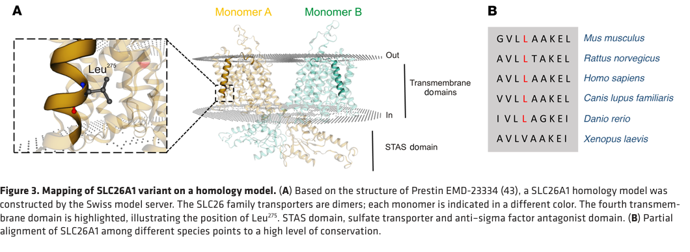

## Question

# Gene Research for Functional Annotation

## ⚠️ CRITICAL: Gene/Protein Identification Context

**BEFORE YOU BEGIN RESEARCH:** You MUST verify you are researching the CORRECT gene/protein. Gene symbols can be ambiguous, especially for less well-characterized genes from non-model organisms.

### Target Gene/Protein Identity (from UniProt):
- **UniProt Accession:** Q9H2B4
- **Protein Description:** RecName: Full=Sulfate anion transporter 1; Short=SAT-1; AltName: Full=Solute carrier family 26 member 1;
- **Gene Information:** Name=SLC26A1; Synonyms=SAT1;
- **Organism (full):** Homo sapiens (Human).
- **Protein Family:** Belongs to the SLC26A/SulP transporter (TC 2.A.53) family.
- **Key Domains:** S04_transporter_CS. (IPR018045); SLC26A/SulP_dom. (IPR011547); SLC26A/SulP_fam. (IPR001902); STAS_dom. (IPR002645); STAS_dom_sf. (IPR036513)

### MANDATORY VERIFICATION STEPS:

1. **Check if the gene symbol "SLC26A1" matches the protein description above**
2. **Verify the organism is correct:** Homo sapiens (Human).
3. **Check if protein family/domains align with what you find in literature**
4. **If you find literature for a DIFFERENT gene with the same or similar symbol, STOP**

### If Gene Symbol is Ambiguous or You Cannot Find Relevant Literature:

**DO NOT PROCEED WITH RESEARCH ON A DIFFERENT GENE.** Instead:
- State clearly: "The gene symbol 'SLC26A1' is ambiguous or literature is limited for this specific protein"
- Explain what you found (e.g., "Found extensive literature on a different gene with the same symbol in a different organism")
- Describe the protein based ONLY on the UniProt information provided above
- Suggest that the protein function can be inferred from domain/family information

### Research Target:

Please provide a comprehensive research report on the gene **SLC26A1** (gene ID: SLC26A1, UniProt: Q9H2B4) in human.

The research report should be a detailed narrative explaining the function, biological processes, and localization of the gene product. Citations should be given for all claims.

You should prioritize authoritative reviews and primary scientific literature when conducting research. You can supplement
this with annotations you find in gene/protein databases, but these can be outdated or inaccurate.

We are specifically interested in the primary function of the gene - for enzymes, what reaction is catalyzed, and what is the substrate specificity? For transporters, what is the substrate? For structural proteins or adapters, what is the broader structural role? For signaling molecules, what is the role in the pathway.

We are interested in where in or outside the cell the gene product carries out its function.

We are also interested in the signaling or biochemical pathways in which the gene functions. We are less interested in broad pleiotropic effects, except where these elucidate the precise role.

Include evidence where possible. We are interested in both experimental evidence as well as inference from structure, evolution, or bioinformatic analysis. Precise studies should be prioritized over high-throughput, where available.

## Output

Question: You are an expert researcher providing comprehensive, well-cited information.

Provide detailed information focusing on:
1. Key concepts and definitions with current understanding
2. Recent developments and latest research (prioritize 2023-2024 sources)
3. Current applications and real-world implementations
4. Expert opinions and analysis from authoritative sources
5. Relevant statistics and data from recent studies

Format as a comprehensive research report with proper citations. Include URLs and publication dates where available.
Always prioritize recent, authoritative sources and provide specific citations for all major claims.

# Gene Research for Functional Annotation

## ⚠️ CRITICAL: Gene/Protein Identification Context

**BEFORE YOU BEGIN RESEARCH:** You MUST verify you are researching the CORRECT gene/protein. Gene symbols can be ambiguous, especially for less well-characterized genes from non-model organisms.

### Target Gene/Protein Identity (from UniProt):
- **UniProt Accession:** Q9H2B4
- **Protein Description:** RecName: Full=Sulfate anion transporter 1; Short=SAT-1; AltName: Full=Solute carrier family 26 member 1;
- **Gene Information:** Name=SLC26A1; Synonyms=SAT1;
- **Organism (full):** Homo sapiens (Human).
- **Protein Family:** Belongs to the SLC26A/SulP transporter (TC 2.A.53) family.
- **Key Domains:** S04_transporter_CS. (IPR018045); SLC26A/SulP_dom. (IPR011547); SLC26A/SulP_fam. (IPR001902); STAS_dom. (IPR002645); STAS_dom_sf. (IPR036513)

### MANDATORY VERIFICATION STEPS:

1. **Check if the gene symbol "SLC26A1" matches the protein description above**
2. **Verify the organism is correct:** Homo sapiens (Human).
3. **Check if protein family/domains align with what you find in literature**
4. **If you find literature for a DIFFERENT gene with the same or similar symbol, STOP**

### If Gene Symbol is Ambiguous or You Cannot Find Relevant Literature:

**DO NOT PROCEED WITH RESEARCH ON A DIFFERENT GENE.** Instead:
- State clearly: "The gene symbol 'SLC26A1' is ambiguous or literature is limited for this specific protein"
- Explain what you found (e.g., "Found extensive literature on a different gene with the same symbol in a different organism")
- Describe the protein based ONLY on the UniProt information provided above
- Suggest that the protein function can be inferred from domain/family information

### Research Target:

Please provide a comprehensive research report on the gene **SLC26A1** (gene ID: SLC26A1, UniProt: Q9H2B4) in human.

The research report should be a detailed narrative explaining the function, biological processes, and localization of the gene product. Citations should be given for all claims.

You should prioritize authoritative reviews and primary scientific literature when conducting research. You can supplement
this with annotations you find in gene/protein databases, but these can be outdated or inaccurate.

We are specifically interested in the primary function of the gene - for enzymes, what reaction is catalyzed, and what is the substrate specificity? For transporters, what is the substrate? For structural proteins or adapters, what is the broader structural role? For signaling molecules, what is the role in the pathway.

We are interested in where in or outside the cell the gene product carries out its function.

We are also interested in the signaling or biochemical pathways in which the gene functions. We are less interested in broad pleiotropic effects, except where these elucidate the precise role.

Include evidence where possible. We are interested in both experimental evidence as well as inference from structure, evolution, or bioinformatic analysis. Precise studies should be prioritized over high-throughput, where available.

# Human SLC26A1 (SAT-1): functional annotation and evidence report

## Identity and principal function

**Identity verified.** The target is human **SLC26A1**, UniProt **Q9H2B4**, encoding sulfate anion transporter 1 (**SAT-1**). It belongs to the SLC26/SulP transporter family and has a membrane-spanning transport region and a cytosolic C-terminal **STAS** (sulfate transporter and anti-sigma-factor antagonist) domain. Structural models depict SLC26A1 as a dimer, but the cited human model is based on another SLC26 protein rather than a directly determined SLC26A1 structure. **SAT-1 should not be confused with the unrelated spermidine/spermine acetyltransferase also called SAT1.** (pfau2023slc26a1isa pages 1-2, gee2016mutationsinslc26a1 pages 2-3, pfau2023slc26a1isa pages 3-5, pfau2023slc26a1isa media c7ca8500)

**Best-supported primary annotation:** SLC26A1 is a plasma-membrane **anion exchanger whose physiologically established human role is renal sulfate recovery and maintenance of circulating sulfate**. It is not an enzyme and does not catalyze sulfate synthesis. Human SLC26A1 transports **SO₄²⁻** and can exchange it with **HCO₃⁻**; heterologous experiments also demonstrate transport of **oxalate** and **Cl⁻**. Transport of an anion in an expression system does not, by itself, establish that the anion is a quantitatively important substrate in intact human organs. (pfau2023slc26a1isa pages 1-2, markovich2010sulfateandphosphate pages 9-11, gee2016mutationsinslc26a1 pages 4-5, pfau2023slc26a1isa pages 5-6)

Human SLC26A1 expressed in *Xenopus* oocytes produced sodium-independent sulfate uptake with **Kₘ = 0.19 ± 0.066 mM** and **Vₘₐₓ = 52.35 ± 3.30 pmol/oocyte/hour**. The same experimental literature reports increased oxalate and chloride uptake, but not formate uptake. In transfected-cell assays, adding extracellular sulfate to bicarbonate-loaded cells produced an SLC26A1-dependent intracellular-pH decrease, directly supporting **bicarbonate-out/sulfate-in exchange** in that assay configuration. These are measurements of expressed transporters, not measurements of native human proximal-tubule flux. (markovich2010sulfateandphosphate pages 9-11, gee2016mutationsinslc26a1 pages 4-5, gee2016mutationsinslc26a1 pages 5-7)

## Site of action and biochemical pathway

SLC26A1 is most prominently expressed in **kidney and liver**; lower-level expression has been reported in other tissues, including intestine. Its principal renal site of action is the **basolateral, blood-facing membrane of proximal-tubule epithelial cells**. In the accepted transcellular model, apical **SLC13A1/NaS1** first brings filtered sulfate from tubular fluid into the cell, and basolateral SLC26A1 completes its movement toward blood. Thus, the two proteins act *in series* across the epithelium; this does not imply that they physically bind each other. Rat immunolocalization strongly supports basolateral renal placement, whereas the human conclusion integrates expression, transport physiology and the human renal-wasting phenotype. (pfau2023slc26a1isa pages 1-2, markovich2010sulfateandphosphate pages 6-9, gee2016mutationsinslc26a1 pages 3-4)

SAT-1 has also been placed at the **sinusoidal/basolateral membrane of hepatocytes**, consistent with a role in exchanging sulfate and other anions between liver cells and blood. Intestinal epithelial expression and basolateral staining have been reported, but intestinal protein localization and its quantitative transport role are less secure: expression varies among studies and antibody specificity has been questioned. These additional tissue assignments should not be treated as equally well established in native **human** tissue; much of the localization evidence comes from rat experiments. (stieger2011regulationofthe pages 2-2, gee2016mutationsinslc26a1 pages 3-4, whittamore2019absenceofthe pages 14-17, markovich2010sulfateandphosphate pages 6-9)

By conserving plasma sulfate, SLC26A1 contributes **upstream** to sulfate availability for sulfation-dependent physiology, including cartilage and bone health. The link from this transporter to an individual cartilage phenotype is biologically plausible, but direct proof that SLC26A1 deficiency causes defective proteoglycan sulfation in a particular patient is lacking. There is likewise no need to assign it a direct intracellular signaling or catalytic role: its demonstrated pathway function is **epithelial anion transport and systemic sulfate homeostasis**. (pfau2023slc26a1isa pages 1-2, pfau2023slc26a1isa pages 5-6, pfau2023slc26a1isa pages 6-7)

## Human evidence and recent developments

The strongest recent primary study, **Pfau et al., published 1 February 2023**, combined patient genetics, transport assays and population genetics. A patient homozygous for **c.824T>C (p.Leu275Pro)** had plasma sulfate of **138–159 μmol/L (mean 148 μmol/L)**, compared with approximately **300 μmol/L** ordinarily reported. Her sulfate fractional-excretion index was **0.20–0.27 (mean 0.24)**. Although 0.24 lies within the reported range in sulfate-replete people, it was **inappropriately high during marked hyposulfatemia**: sulfate excretion normally falls to about 0.10 or less during depletion or increased demand. The patient also had painful perichondritis and a 13-mm kidney stone, neither of which alone establishes a specific disease mechanism. (pfau2023slc26a1isa pages 2-3, pfau2023slc26a1isa pages 3-5, pfau2023slc26a1isa media bddf6c79)

Human p.Leu275Pro SLC26A1 expressed in oocytes showed markedly reduced sulfate uptake, reduced oxalate uptake and reduced cell-surface/total protein expression. The substitution lies in a conserved transmembrane segment, providing a plausible folding or stability mechanism. In the same study, **130 heterozygous carriers** of **43 rare predicted-damaging variants** among **4,708** German Chronic Kidney Disease participants had lower plasma sulfate than **4,578 noncarriers** (**gene-burden P = 3.01 × 10⁻⁵**); synonymous variants showed no association (**P = 0.7**). These population measurements were **semiquantitative**, so they do not yield a defensible absolute carrier–noncarrier concentration difference. Four tested variants impaired sulfate transport; when coexpressed 1:1 with wild type, **p.Thr185Met reduced transport to approximately 25%**, consistent with a dominant-negative effect in the assay. (pfau2023slc26a1isa pages 2-3, pfau2023slc26a1isa pages 3-5, pfau2023slc26a1isa pages 6-7)

**Gee et al. (2016)** found **two individuals with biallelic SLC26A1 variants among 348 unrelated kidney-stone patients**, both with calcium-oxalate stones. Functional testing found reduced sulfate/bicarbonate exchange and impaired processing of certain variants, particularly the **mouse p.Thr190Met construct corresponding to human p.Thr185Met**. Importantly, these experiments used engineered **mouse Slc26a1** in cultured cells and principally measured **sulfate/bicarbonate exchange**, not each human variant’s oxalate flux in native human kidney or gut. A frequently discussed p.Gln556Arg variant is common in population databases and should not be assumed disease-causing merely because it occurs in stone formers. (gee2016mutationsinslc26a1 pages 1-2, gee2016mutationsinslc26a1 pages 2-3, gee2016mutationsinslc26a1 pages 3-4, gee2016mutationsinslc26a1 pages 4-5)

The following matrix separates these direct human observations from expression-system experiments and animal inference.

| Functional claim | Direct human evidence / quantitative value | Evidence limitation / animal comparison | Best cited study and DOI URL |
|---|---|---|---|
| **SLC26A1/Q9H2B4 is a sulfate transporter** | Human SLC26A1 expressed in *Xenopus* oocytes produced Na⁺-independent sulfate uptake with sulfate **Kₘ = 0.19 ± 0.066 mM** and **Vₘₐₓ = 52.35 ± 3.30 pmol/oocyte/hour**; chloride and oxalate uptake also increased. (markovich2010sulfateandphosphate pages 9-11) | Heterologous expression establishes intrinsic substrate capability, not flux direction or relative contribution in native human epithelia. | Markovich, 2010 — [https://doi.org/10.1007/978-1-60327-229-2_8](https://doi.org/10.1007/978-1-60327-229-2_8) |
| **SLC26A1 is a major determinant of human sulfate homeostasis** | A patient homozygous for **p.Leu275Pro** had plasma sulfate **138–159 μM (mean 148 μM)** versus approximately **300 μM** physiologically. Sulfate FEI was **0.20–0.27 (mean 0.24)**. Because sulfate excretion normally falls to about **0.10 or less** during depletion or increased demand, this FEI was inappropriately unsuppressed and indicated renal sulfate wasting—not simply an FEI above the normal-state range. (pfau2023slc26a1isa pages 2-3, pfau2023slc26a1isa pages 3-5, pfau2023slc26a1isa pages 1-2, pfau2023slc26a1isa media bddf6c79) | Evidence includes one deeply phenotyped homozygous patient. The mutant’s reduced sulfate transport and surface expression were demonstrated in oocytes rather than native human renal tubules. | Pfau et al., published **1 February 2023** — [https://doi.org/10.1172/JCI161849](https://doi.org/10.1172/JCI161849) |
| **The human phenotype is more clearly sulfate-related than oxalate-related** | In the p.Leu275Pro patient, 24-hour urine oxalate was **21.8–48.6 mg/day (mean 33.7 mg/day)**—normal to mildly elevated and not reproducibly hyperoxaluric; plasma oxalate was **<2 μM**. (pfau2023slc26a1isa pages 2-3, pfau2023slc26a1isa pages 3-5) | The patient had a 13-mm renal stone, but its composition was unavailable. These data do not exclude an oxalate contribution; they indicate that sulfate wasting was the more consistent biochemical abnormality. | Pfau et al., 2023 — [https://doi.org/10.1172/JCI161849](https://doi.org/10.1172/JCI161849) |
| **Rare heterozygous variants influence sulfate at population level** | Among **4,708** GCKD participants, **43** rare predicted-damaging alleles occurred in **130 heterozygous carriers**, who had lower plasma sulfate than **4,578 noncarriers** (**gene-burden P = 3.01 × 10⁻⁵**); synonymous variants were not associated (**P = 0.7**). (pfau2023slc26a1isa pages 2-3, pfau2023slc26a1isa pages 3-5) | Participants had CKD, although subanalysis suggested the effect was not explained by reduced eGFR. Metabolon sulfate measurements were **semiquantitative**, so the population analysis does not provide an absolute concentration difference. (pfau2023slc26a1isa pages 6-7) | Pfau et al., 2023 — [https://doi.org/10.1172/JCI161849](https://doi.org/10.1172/JCI161849) |
| **SLC26A1 can exchange sulfate and bicarbonate; disease variants reduce this activity** | In a cohort of **348** unrelated stone formers, Gee et al. identified **two** individuals with biallelic SLC26A1 variants and calcium-oxalate stones. Variant assays showed reduced sulfate/bicarbonate exchange, with the Thr190Met construct showing nearly absent activity. (gee2016mutationsinslc26a1 pages 1-2, gee2016mutationsinslc26a1 pages 4-5, gee2016mutationsinslc26a1 pages 5-7) | Functional assays recreated the corresponding human changes in a **mouse Slc26a1 construct** expressed in HEK293T cells. They quantified sulfate/bicarbonate exchange—not oxalate transport—so they do not directly prove that defective oxalate flux caused the stones. | Gee et al., published **19 May 2016** — [https://doi.org/10.1016/j.ajhg.2016.03.026](https://doi.org/10.1016/j.ajhg.2016.03.026) |
| **A major physiological role in oxalate homeostasis remains uncertain** | Human SLC26A1 transports oxalate in heterologous systems, and p.Leu275Pro reduced experimental oxalate uptake. Nevertheless, heterozygous GCKD carriers did not report more stones (**P > 0.1**). (pfau2023slc26a1isa pages 5-6, pfau2023slc26a1isa pages 3-5, markovich2010sulfateandphosphate pages 9-11) | A 2019 knockout replication found **no hyperoxaluria or hyperoxalemia**, contrary to the original mouse report; urinary oxalate was instead **46% lower**, and oxalate:creatinine clearance ratios were similar (**0.10 WT versus 0.09 knockout**). Genetic background, spot-versus-24-hour urine sampling and sex could explain conflicting mouse results. (whittamore2019absenceofthe pages 17-19, whittamore2019absenceofthe pages 14-17) | Whittamore et al., **January 2019** — [https://doi.org/10.1152/ajpgi.00299.2018](https://doi.org/10.1152/ajpgi.00299.2018); Pfau et al., 2023 — [https://doi.org/10.1172/JCI161849](https://doi.org/10.1172/JCI161849) |
| **SLC26A1 functions on basolateral epithelial membranes** | Human expression is strongest in kidney and liver; the accepted renal model places SLC26A1 basolaterally in proximal-tubule cells, operating in series with apical SLC13A1 to return filtered sulfate to blood. (pfau2023slc26a1isa pages 1-2, markovich2010sulfateandphosphate pages 6-9) | Direct high-resolution localization is primarily from **rat** tissue: proximal-tubule basolateral membrane, enteric epithelia and hepatocyte sinusoidal membrane. Intestinal antibody specificity and expression patterns have varied among studies, so these sites should not all be presented as directly confirmed in human tissue. (gee2016mutationsinslc26a1 pages 3-4, whittamore2019absenceofthe pages 14-17) | Gee et al., 2016 — [https://doi.org/10.1016/j.ajhg.2016.03.026](https://doi.org/10.1016/j.ajhg.2016.03.026); Markovich, 2010 — [https://doi.org/10.1007/978-1-60327-229-2_8](https://doi.org/10.1007/978-1-60327-229-2_8) |
| **A definitive Mendelian disease assignment and targeted clinical application remain premature** | Biallelic loss-of-function observations support candidate associations with renal sulfate wasting, nephrolithiasis and possible cartilage or bone manifestations; population genetics independently supports effects on sulfate concentration. (pfau2023slc26a1isa pages 2-3, pfau2023slc26a1isa pages 3-5) | Pfau et al. explicitly stated that available data **did not meet ClinGen gene–phenotype attribution criteria** and were insufficient to define a Mendelian disorder. No validated SLC26A1-specific drug, treatment guideline or routine clinical assay was established. (pfau2023slc26a1isa pages 6-7) | Pfau et al., 2023 — [https://doi.org/10.1172/JCI161849](https://doi.org/10.1172/JCI161849) |

*Table: Evidence matrix separating direct human findings from heterologous assays and animal inference for SLC26A1/Q9H2B4. It highlights the strong sulfate-homeostasis evidence, unresolved oxalate role, localization limitations, and current disease-attribution caveat.*

## Oxalate: demonstrated substrate, unsettled physiological importance

SLC26A1 **can transport oxalate** in expression systems, but assigning it a *major human oxalate-clearance function* would overstate current evidence. In the 2023 sulfate-deficient patient, 24-hour urinary oxalate ranged from **21.8 to 48.6 mg/day** (mean **33.7 mg/day**) and was **not reproducibly elevated**; stone composition was unavailable. In the GCKD analysis, heterozygous carriers did not have a higher prevalence of self-reported stones (**P > 0.1**). These findings do not exclude a contribution to stones in particular biallelic cases, but they support sulfate wasting more directly than a general hyperoxaluria mechanism. (pfau2023slc26a1isa pages 2-3, pfau2023slc26a1isa pages 5-6, pfau2023slc26a1isa pages 3-5)

Animal findings also conflict. An original knockout model linked loss of SAT-1 to hyperoxalemia, hyperoxaluria and calcium-oxalate deposits. A subsequent **2019** investigation found **no hyperoxalemia or hyperoxaluria**, no demonstrable requirement for SAT-1 in intestinal oxalate transport, and **46% lower**, rather than higher, urinary oxalate in knockout mice. Differences in genetic background and urine sampling were identified as possible explanations. An expert review of oxalate homeostasis likewise treats the intestinal oxalate-secretion hypothesis as unresolved; Pfau and colleagues cite kinetic evidence arguing against substantial SLC26A1-mediated oxalate influx under physiological conditions. Accordingly, **sulfate transport is the high-confidence physiological annotation; oxalate transport is experimentally established but its net organ-level contribution remains uncertain**. (ermer2023oxalatehomeostasis pages 4-6, whittamore2019absenceofthe pages 14-17, whittamore2019absenceofthe pages 17-19, pfau2023slc26a1isa pages 5-6)

## Clinical and research application

The immediately useful application is **functional interpretation of SLC26A1 variants** when unexplained low plasma sulfate or renal sulfate wasting is investigated: the 2023 work shows why paired plasma/urine sulfate measurements, segregation and transporter-function testing provide stronger evidence than sequence prediction alone. Sulfate is not ordinarily measured in routine clinical chemistry. SLC26A1 may also be considered in research on unusual stone or cartilage presentations, but **no established SLC26A1-directed treatment or routine screening recommendation follows from these studies**. Pfau and colleagues explicitly cautioned that available evidence **did not meet ClinGen gene–phenotype attribution criteria** and was insufficient at that time to define a Mendelian disorder. Mouse acetaminophen-hepatotoxicity findings should likewise not be converted into a demonstrated human drug contraindication. (pfau2023slc26a1isa pages 1-2, pfau2023slc26a1isa pages 6-7, gee2016mutationsinslc26a1 pages 5-7)

### Principal sources and publication dates

- **Pfau A et al.** “SLC26A1 is a major determinant of sulfate homeostasis in humans.” *Journal of Clinical Investigation*, **1 February 2023**. https://doi.org/10.1172/JCI161849. Primary human genetic and functional evidence. (pfau2023slc26a1isa pages 1-2, pfau2023slc26a1isa pages 2-3)
- **Gee HY et al.** “Mutations in SLC26A1 Cause Nephrolithiasis.” *American Journal of Human Genetics*, published online **19 May 2016**. https://doi.org/10.1016/j.ajhg.2016.03.026. Human cases with complementary, mouse-construct functional experiments. (gee2016mutationsinslc26a1 pages 1-2, gee2016mutationsinslc26a1 pages 5-7)
- **Ermer T et al.** “Oxalate homeostasis.” *Nature Reviews Nephrology*, volume **19 (2023)**. https://doi.org/10.1038/s41581-022-00643-3. Specialist review assessing conflicting oxalate evidence. (ermer2023oxalatehomeostasis pages 4-6)
- **Whittamore JM et al.** “Absence of the sulfate transporter Sat-1 has no impact on oxalate handling by mouse intestine and does not cause hyperoxaluria or hyperoxalemia.” *American Journal of Physiology–Gastrointestinal and Liver Physiology*, **January 2019**. https://doi.org/10.1152/ajpgi.00299.2018. Knockout replication relevant to mechanistic uncertainty. (whittamore2019absenceofthe pages 14-17)
- **Li J et al.** “SLC26 family: a new insight for kidney stone disease.” *Frontiers in Physiology*, **May 2023**. https://doi.org/10.3389/fphys.2023.1118342. Family/domain and kidney-stone review; its oxalate claims should be read against the conflicting primary studies. (li2023slc26familya pages 2-4, pfau2023slc26a1isa pages 5-6)
- **Markovich D.** “Sulfate and Phosphate Transporters in Mammalian Renal and Gastrointestinal Systems,” **2010**. https://doi.org/10.1007/978-1-60327-229-2_8. Source summarizing original human-clone transport measurements and renal localization studies. (markovich2010sulfateandphosphate pages 9-11, markovich2010sulfateandphosphate pages 6-9)

**Overall conclusion:** Q9H2B4 is a blood-facing epithelial **sulfate-recovery exchanger**, most firmly established in the human renal proximal tubule. Its ability to transport bicarbonate, oxalate and chloride informs its mechanism, but current human genetics and physiology most clearly establish **control of circulating sulfate**, not a dominant role in systemic oxalate disposal. (pfau2023slc26a1isa pages 1-2, markovich2010sulfateandphosphate pages 9-11, pfau2023slc26a1isa pages 5-6)

References

1. (pfau2023slc26a1isa pages 1-2): Anja Pfau, Karen I. López-Cayuqueo, Nora Scherer, Matthias Wuttke, Annekatrin Wernstedt, Daniela González Fassrainer, Desiree E.C. Smith, Jiddeke M. van de Kamp, Katharina Ziegeler, Kai-Uwe Eckardt, Friedrich C. Luft, Peter S. Aronson, Anna Köttgen, Thomas J. Jentsch, and Felix Knauf. Slc26a1 is a major determinant of sulfate homeostasis in humans. The Journal of Clinical Investigation, Feb 2023. URL: https://doi.org/10.1172/jci161849, doi:10.1172/jci161849. This article has 26 citations.

2. (gee2016mutationsinslc26a1 pages 2-3): Heon Yung Gee, Ikhyun Jun, Daniela A. Braun, Jennifer A. Lawson, Jan Halbritter, Shirlee Shril, Caleb P. Nelson, Weizhen Tan, Deborah Stein, Ari J. Wassner, Michael A. Ferguson, Zoran Gucev, John A. Sayer, Danko Milosevic, Michelle Baum, Velibor Tasic, Min Goo Lee, and Friedhelm Hildebrandt. Mutations in slc26a1 cause nephrolithiasis. American journal of human genetics, 98 6:1228-1234, Jun 2016. URL: https://doi.org/10.1016/j.ajhg.2016.03.026, doi:10.1016/j.ajhg.2016.03.026. This article has 75 citations and is from a highest quality peer-reviewed journal.

3. (pfau2023slc26a1isa pages 3-5): Anja Pfau, Karen I. López-Cayuqueo, Nora Scherer, Matthias Wuttke, Annekatrin Wernstedt, Daniela González Fassrainer, Desiree E.C. Smith, Jiddeke M. van de Kamp, Katharina Ziegeler, Kai-Uwe Eckardt, Friedrich C. Luft, Peter S. Aronson, Anna Köttgen, Thomas J. Jentsch, and Felix Knauf. Slc26a1 is a major determinant of sulfate homeostasis in humans. The Journal of Clinical Investigation, Feb 2023. URL: https://doi.org/10.1172/jci161849, doi:10.1172/jci161849. This article has 26 citations.

4. (pfau2023slc26a1isa media c7ca8500): Anja Pfau, Karen I. López-Cayuqueo, Nora Scherer, Matthias Wuttke, Annekatrin Wernstedt, Daniela González Fassrainer, Desiree E.C. Smith, Jiddeke M. van de Kamp, Katharina Ziegeler, Kai-Uwe Eckardt, Friedrich C. Luft, Peter S. Aronson, Anna Köttgen, Thomas J. Jentsch, and Felix Knauf. Slc26a1 is a major determinant of sulfate homeostasis in humans. The Journal of Clinical Investigation, Feb 2023. URL: https://doi.org/10.1172/jci161849, doi:10.1172/jci161849. This article has 26 citations.

5. (markovich2010sulfateandphosphate pages 9-11): Daniel Markovich. Sulfate and phosphate transporters in mammalian renal and gastrointestinal systems. ArXiv, pages 165-193, Oct 2010. URL: https://doi.org/10.1007/978-1-60327-229-2\_8, doi:10.1007/978-1-60327-229-2\_8. This article has 5 citations.

6. (gee2016mutationsinslc26a1 pages 4-5): Heon Yung Gee, Ikhyun Jun, Daniela A. Braun, Jennifer A. Lawson, Jan Halbritter, Shirlee Shril, Caleb P. Nelson, Weizhen Tan, Deborah Stein, Ari J. Wassner, Michael A. Ferguson, Zoran Gucev, John A. Sayer, Danko Milosevic, Michelle Baum, Velibor Tasic, Min Goo Lee, and Friedhelm Hildebrandt. Mutations in slc26a1 cause nephrolithiasis. American journal of human genetics, 98 6:1228-1234, Jun 2016. URL: https://doi.org/10.1016/j.ajhg.2016.03.026, doi:10.1016/j.ajhg.2016.03.026. This article has 75 citations and is from a highest quality peer-reviewed journal.

7. (pfau2023slc26a1isa pages 5-6): Anja Pfau, Karen I. López-Cayuqueo, Nora Scherer, Matthias Wuttke, Annekatrin Wernstedt, Daniela González Fassrainer, Desiree E.C. Smith, Jiddeke M. van de Kamp, Katharina Ziegeler, Kai-Uwe Eckardt, Friedrich C. Luft, Peter S. Aronson, Anna Köttgen, Thomas J. Jentsch, and Felix Knauf. Slc26a1 is a major determinant of sulfate homeostasis in humans. The Journal of Clinical Investigation, Feb 2023. URL: https://doi.org/10.1172/jci161849, doi:10.1172/jci161849. This article has 26 citations.

8. (gee2016mutationsinslc26a1 pages 5-7): Heon Yung Gee, Ikhyun Jun, Daniela A. Braun, Jennifer A. Lawson, Jan Halbritter, Shirlee Shril, Caleb P. Nelson, Weizhen Tan, Deborah Stein, Ari J. Wassner, Michael A. Ferguson, Zoran Gucev, John A. Sayer, Danko Milosevic, Michelle Baum, Velibor Tasic, Min Goo Lee, and Friedhelm Hildebrandt. Mutations in slc26a1 cause nephrolithiasis. American journal of human genetics, 98 6:1228-1234, Jun 2016. URL: https://doi.org/10.1016/j.ajhg.2016.03.026, doi:10.1016/j.ajhg.2016.03.026. This article has 75 citations and is from a highest quality peer-reviewed journal.

9. (markovich2010sulfateandphosphate pages 6-9): Daniel Markovich. Sulfate and phosphate transporters in mammalian renal and gastrointestinal systems. ArXiv, pages 165-193, Oct 2010. URL: https://doi.org/10.1007/978-1-60327-229-2\_8, doi:10.1007/978-1-60327-229-2\_8. This article has 5 citations.

10. (gee2016mutationsinslc26a1 pages 3-4): Heon Yung Gee, Ikhyun Jun, Daniela A. Braun, Jennifer A. Lawson, Jan Halbritter, Shirlee Shril, Caleb P. Nelson, Weizhen Tan, Deborah Stein, Ari J. Wassner, Michael A. Ferguson, Zoran Gucev, John A. Sayer, Danko Milosevic, Michelle Baum, Velibor Tasic, Min Goo Lee, and Friedhelm Hildebrandt. Mutations in slc26a1 cause nephrolithiasis. American journal of human genetics, 98 6:1228-1234, Jun 2016. URL: https://doi.org/10.1016/j.ajhg.2016.03.026, doi:10.1016/j.ajhg.2016.03.026. This article has 75 citations and is from a highest quality peer-reviewed journal.

11. (stieger2011regulationofthe pages 2-2): Bruno Stieger. Regulation of the expression of the hepatocellular sulfate-oxalate exchanger sat-1 (slc26a1) by glyoxylate: a metabolic link between liver and kidney? Journal of hepatology, 54 3:406-7, Mar 2011. URL: https://doi.org/10.1016/j.jhep.2010.09.011, doi:10.1016/j.jhep.2010.09.011. This article has 11 citations and is from a highest quality peer-reviewed journal.

12. (whittamore2019absenceofthe pages 14-17): Jonathan M. Whittamore, Christine E. Stephens, and Marguerite Hatch. Absence of the sulfate transporter sat-1 has no impact on oxalate handling by mouse intestine and does not cause hyperoxaluria or hyperoxalemia. American journal of physiology. Gastrointestinal and liver physiology, 316 1:G82-G94, Jan 2019. URL: https://doi.org/10.1152/ajpgi.00299.2018, doi:10.1152/ajpgi.00299.2018. This article has 15 citations.

13. (pfau2023slc26a1isa pages 6-7): Anja Pfau, Karen I. López-Cayuqueo, Nora Scherer, Matthias Wuttke, Annekatrin Wernstedt, Daniela González Fassrainer, Desiree E.C. Smith, Jiddeke M. van de Kamp, Katharina Ziegeler, Kai-Uwe Eckardt, Friedrich C. Luft, Peter S. Aronson, Anna Köttgen, Thomas J. Jentsch, and Felix Knauf. Slc26a1 is a major determinant of sulfate homeostasis in humans. The Journal of Clinical Investigation, Feb 2023. URL: https://doi.org/10.1172/jci161849, doi:10.1172/jci161849. This article has 26 citations.

14. (pfau2023slc26a1isa pages 2-3): Anja Pfau, Karen I. López-Cayuqueo, Nora Scherer, Matthias Wuttke, Annekatrin Wernstedt, Daniela González Fassrainer, Desiree E.C. Smith, Jiddeke M. van de Kamp, Katharina Ziegeler, Kai-Uwe Eckardt, Friedrich C. Luft, Peter S. Aronson, Anna Köttgen, Thomas J. Jentsch, and Felix Knauf. Slc26a1 is a major determinant of sulfate homeostasis in humans. The Journal of Clinical Investigation, Feb 2023. URL: https://doi.org/10.1172/jci161849, doi:10.1172/jci161849. This article has 26 citations.

15. (pfau2023slc26a1isa media bddf6c79): Anja Pfau, Karen I. López-Cayuqueo, Nora Scherer, Matthias Wuttke, Annekatrin Wernstedt, Daniela González Fassrainer, Desiree E.C. Smith, Jiddeke M. van de Kamp, Katharina Ziegeler, Kai-Uwe Eckardt, Friedrich C. Luft, Peter S. Aronson, Anna Köttgen, Thomas J. Jentsch, and Felix Knauf. Slc26a1 is a major determinant of sulfate homeostasis in humans. The Journal of Clinical Investigation, Feb 2023. URL: https://doi.org/10.1172/jci161849, doi:10.1172/jci161849. This article has 26 citations.

16. (gee2016mutationsinslc26a1 pages 1-2): Heon Yung Gee, Ikhyun Jun, Daniela A. Braun, Jennifer A. Lawson, Jan Halbritter, Shirlee Shril, Caleb P. Nelson, Weizhen Tan, Deborah Stein, Ari J. Wassner, Michael A. Ferguson, Zoran Gucev, John A. Sayer, Danko Milosevic, Michelle Baum, Velibor Tasic, Min Goo Lee, and Friedhelm Hildebrandt. Mutations in slc26a1 cause nephrolithiasis. American journal of human genetics, 98 6:1228-1234, Jun 2016. URL: https://doi.org/10.1016/j.ajhg.2016.03.026, doi:10.1016/j.ajhg.2016.03.026. This article has 75 citations and is from a highest quality peer-reviewed journal.

17. (whittamore2019absenceofthe pages 17-19): Jonathan M. Whittamore, Christine E. Stephens, and Marguerite Hatch. Absence of the sulfate transporter sat-1 has no impact on oxalate handling by mouse intestine and does not cause hyperoxaluria or hyperoxalemia. American journal of physiology. Gastrointestinal and liver physiology, 316 1:G82-G94, Jan 2019. URL: https://doi.org/10.1152/ajpgi.00299.2018, doi:10.1152/ajpgi.00299.2018. This article has 15 citations.

18. (ermer2023oxalatehomeostasis pages 4-6): Theresa Ermer, Lama Nazzal, Maria Clarissa Tio, Sushrut Waikar, Peter S. Aronson, and Felix Knauf. Oxalate homeostasis. Nature Reviews Nephrology, 19:123-138, Nov 2023. URL: https://doi.org/10.1038/s41581-022-00643-3, doi:10.1038/s41581-022-00643-3. This article has 149 citations and is from a domain leading peer-reviewed journal.

19. (li2023slc26familya pages 2-4): Jialin Li, Sigen Huang, Shengyin Liu, Xinzhi Liao, Sheng Yan, and Quanliang Liu. Slc26 family: a new insight for kidney stone disease. Frontiers in Physiology, May 2023. URL: https://doi.org/10.3389/fphys.2023.1118342, doi:10.3389/fphys.2023.1118342. This article has 18 citations.

## Artifacts

- [Edison artifact artifact-00](SLC26A1-deep-research-falcon_artifacts/artifact-00.md)

## Citations

1. markovich2010sulfateandphosphate pages 9-11
2. ermer2023oxalatehomeostasis pages 4-6
3. whittamore2019absenceofthe pages 14-17
4. markovich2010sulfateandphosphate pages 6-9
5. stieger2011regulationofthe pages 2-2
6. whittamore2019absenceofthe pages 17-19
7. https://doi.org/10.1007/978-1-60327-229-2_8
8. https://doi.org/10.1172/JCI161849
9. https://doi.org/10.1016/j.ajhg.2016.03.026
10. https://doi.org/10.1152/ajpgi.00299.2018
11. https://doi.org/10.1007/978-1-60327-229-2_8](https://doi.org/10.1007/978-1-60327-229-2_8
12. https://doi.org/10.1172/JCI161849](https://doi.org/10.1172/JCI161849
13. https://doi.org/10.1016/j.ajhg.2016.03.026](https://doi.org/10.1016/j.ajhg.2016.03.026
14. https://doi.org/10.1152/ajpgi.00299.2018](https://doi.org/10.1152/ajpgi.00299.2018
15. https://doi.org/10.1172/JCI161849.
16. https://doi.org/10.1016/j.ajhg.2016.03.026.
17. https://doi.org/10.1038/s41581-022-00643-3.
18. https://doi.org/10.1152/ajpgi.00299.2018.
19. https://doi.org/10.3389/fphys.2023.1118342.
20. https://doi.org/10.1007/978-1-60327-229-2_8.
21. https://doi.org/10.1172/jci161849,
22. https://doi.org/10.1016/j.ajhg.2016.03.026,
23. https://doi.org/10.1007/978-1-60327-229-2\_8,
24. https://doi.org/10.1016/j.jhep.2010.09.011,
25. https://doi.org/10.1152/ajpgi.00299.2018,
26. https://doi.org/10.1038/s41581-022-00643-3,
27. https://doi.org/10.3389/fphys.2023.1118342,