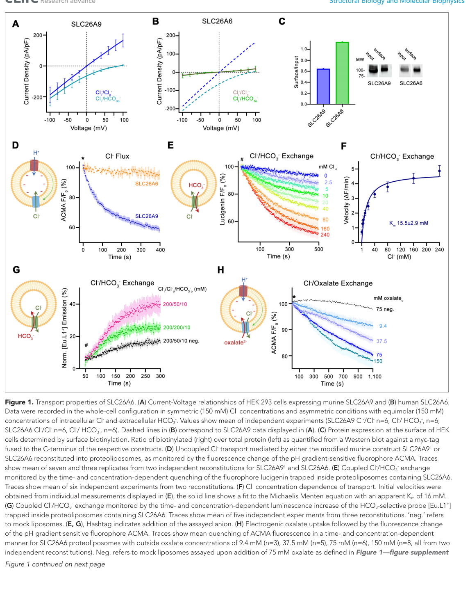

## Question

# Gene Research for Functional Annotation

## ⚠️ CRITICAL: Gene/Protein Identification Context

**BEFORE YOU BEGIN RESEARCH:** You MUST verify you are researching the CORRECT gene/protein. Gene symbols can be ambiguous, especially for less well-characterized genes from non-model organisms.

### Target Gene/Protein Identity (from UniProt):
- **UniProt Accession:** Q9BXS9
- **Protein Description:** RecName: Full=Solute carrier family 26 member 6; AltName: Full=Anion exchange transporter; AltName: Full=Pendrin-like protein 1; Short=Pendrin-L1;
- **Gene Information:** Name=SLC26A6;
- **Organism (full):** Homo sapiens (Human).
- **Protein Family:** Belongs to the SLC26A/SulP transporter (TC 2.A.53) family.
- **Key Domains:** S04_transporter_CS. (IPR018045); SLC26A/SulP_dom. (IPR011547); SLC26A/SulP_fam. (IPR001902); STAS_dom. (IPR002645); STAS_dom_sf. (IPR036513)

### MANDATORY VERIFICATION STEPS:

1. **Check if the gene symbol "SLC26A6" matches the protein description above**
2. **Verify the organism is correct:** Homo sapiens (Human).
3. **Check if protein family/domains align with what you find in literature**
4. **If you find literature for a DIFFERENT gene with the same or similar symbol, STOP**

### If Gene Symbol is Ambiguous or You Cannot Find Relevant Literature:

**DO NOT PROCEED WITH RESEARCH ON A DIFFERENT GENE.** Instead:
- State clearly: "The gene symbol 'SLC26A6' is ambiguous or literature is limited for this specific protein"
- Explain what you found (e.g., "Found extensive literature on a different gene with the same symbol in a different organism")
- Describe the protein based ONLY on the UniProt information provided above
- Suggest that the protein function can be inferred from domain/family information

### Research Target:

Please provide a comprehensive research report on the gene **SLC26A6** (gene ID: SLC26A6, UniProt: Q9BXS9) in human.

The research report should be a detailed narrative explaining the function, biological processes, and localization of the gene product. Citations should be given for all claims.

You should prioritize authoritative reviews and primary scientific literature when conducting research. You can supplement
this with annotations you find in gene/protein databases, but these can be outdated or inaccurate.

We are specifically interested in the primary function of the gene - for enzymes, what reaction is catalyzed, and what is the substrate specificity? For transporters, what is the substrate? For structural proteins or adapters, what is the broader structural role? For signaling molecules, what is the role in the pathway.

We are interested in where in or outside the cell the gene product carries out its function.

We are also interested in the signaling or biochemical pathways in which the gene functions. We are less interested in broad pleiotropic effects, except where these elucidate the precise role.

Include evidence where possible. We are interested in both experimental evidence as well as inference from structure, evolution, or bioinformatic analysis. Precise studies should be prioritized over high-throughput, where available.

## Output

Question: You are an expert researcher providing comprehensive, well-cited information.

Provide detailed information focusing on:
1. Key concepts and definitions with current understanding
2. Recent developments and latest research (prioritize 2023-2024 sources)
3. Current applications and real-world implementations
4. Expert opinions and analysis from authoritative sources
5. Relevant statistics and data from recent studies

Format as a comprehensive research report with proper citations. Include URLs and publication dates where available.
Always prioritize recent, authoritative sources and provide specific citations for all major claims.

# Gene Research for Functional Annotation

## ⚠️ CRITICAL: Gene/Protein Identification Context

**BEFORE YOU BEGIN RESEARCH:** You MUST verify you are researching the CORRECT gene/protein. Gene symbols can be ambiguous, especially for less well-characterized genes from non-model organisms.

### Target Gene/Protein Identity (from UniProt):
- **UniProt Accession:** Q9BXS9
- **Protein Description:** RecName: Full=Solute carrier family 26 member 6; AltName: Full=Anion exchange transporter; AltName: Full=Pendrin-like protein 1; Short=Pendrin-L1;
- **Gene Information:** Name=SLC26A6;
- **Organism (full):** Homo sapiens (Human).
- **Protein Family:** Belongs to the SLC26A/SulP transporter (TC 2.A.53) family.
- **Key Domains:** S04_transporter_CS. (IPR018045); SLC26A/SulP_dom. (IPR011547); SLC26A/SulP_fam. (IPR001902); STAS_dom. (IPR002645); STAS_dom_sf. (IPR036513)

### MANDATORY VERIFICATION STEPS:

1. **Check if the gene symbol "SLC26A6" matches the protein description above**
2. **Verify the organism is correct:** Homo sapiens (Human).
3. **Check if protein family/domains align with what you find in literature**
4. **If you find literature for a DIFFERENT gene with the same or similar symbol, STOP**

### If Gene Symbol is Ambiguous or You Cannot Find Relevant Literature:

**DO NOT PROCEED WITH RESEARCH ON A DIFFERENT GENE.** Instead:
- State clearly: "The gene symbol 'SLC26A6' is ambiguous or literature is limited for this specific protein"
- Explain what you found (e.g., "Found extensive literature on a different gene with the same symbol in a different organism")
- Describe the protein based ONLY on the UniProt information provided above
- Suggest that the protein function can be inferred from domain/family information

### Research Target:

Please provide a comprehensive research report on the gene **SLC26A6** (gene ID: SLC26A6, UniProt: Q9BXS9) in human.

The research report should be a detailed narrative explaining the function, biological processes, and localization of the gene product. Citations should be given for all claims.

You should prioritize authoritative reviews and primary scientific literature when conducting research. You can supplement
this with annotations you find in gene/protein databases, but these can be outdated or inaccurate.

We are specifically interested in the primary function of the gene - for enzymes, what reaction is catalyzed, and what is the substrate specificity? For transporters, what is the substrate? For structural proteins or adapters, what is the broader structural role? For signaling molecules, what is the role in the pathway.

We are interested in where in or outside the cell the gene product carries out its function.

We are also interested in the signaling or biochemical pathways in which the gene functions. We are less interested in broad pleiotropic effects, except where these elucidate the precise role.

Include evidence where possible. We are interested in both experimental evidence as well as inference from structure, evolution, or bioinformatic analysis. Precise studies should be prioritized over high-throughput, where available.

# Human SLC26A6 (UniProt Q9BXS9): functional annotation and research report

## Identity and principal function

**Identity check.** The supplied UniProt accession **Q9BXS9** identifies *Homo sapiens* **SLC26A6**, also called PAT-1, CFEX or pendrin-like protein 1. The literature on **human SLC26A6** matches the supplied SLC26/SulP transporter-family assignment: the protein has a membrane-spanning transport region and a cytoplasmic C-terminal **STAS** domain. “Pendrin-like” denotes family similarity; **pendrin itself is SLC26A4, a different gene**, and findings about SLC26A4 are not treated here as SLC26A6 findings. The accession-to-name mapping comes from the supplied UniProt identity; the human protein’s family architecture and function are independently supported by structural work. [UniProt record](https://www.uniprot.org/uniprotkb/Q9BXS9/entry). (seidler2025theenigmaticslc26a6 pages 1-2, tippett2023structuralandfunctional pages 5-7, tippett2023structuralandfunctional pages 1-2)

**Primary molecular function:** SLC26A6 is a **plasma-membrane anion exchanger, not an enzyme**. Its best-established human-protein reaction is coupled exchange of **one chloride ion (Cl⁻) for one bicarbonate ion (HCO₃⁻)**. Because both are monovalent, this mode is *electroneutral*. It also exchanges Cl⁻ with **oxalate (C₂O₄²⁻)**; the observed oxalate-associated flux is electrogenic, and **1:1 coupling is plausible but has not been measured unambiguously** for that substrate pair. Exchange is reversible: whether SLC26A6 imports or exports a given anion depends on local concentrations, membrane conditions and tissue context. Formate, sulfate and nitrate have also been reported among its transportable anions, but Cl⁻/HCO₃⁻ and Cl⁻/oxalate are the most directly supported pairs for annotating its principal physiological roles. (seidler2025theenigmaticslc26a6 pages 1-2, tippett2023structuralandfunctional pages 2-3, tippett2023structuralandfunctional pages 3-5, tippett2023structuralandfunctional pages 11-13)

## Molecular mechanism and strength of evidence

In a **2023 study of purified human SLC26A6**, Tippett and colleagues combined whole-cell recordings, reconstitution into proteoliposomes, ion-sensitive probes and cryo-electron microscopy. Chloride entered bicarbonate-loaded vesicles without requiring dissipation of a membrane potential; a separate bicarbonate-selective probe directly established bicarbonate transport coupled to chloride counterflow. The apparent Cl⁻ affinity was **Kₘ ≈16–37 mM**, depending on assay conditions; the fit shown in the paper’s Figure 1F was **16 mM**. Adding oxalate to Cl⁻-loaded vesicles produced concentration-dependent electrogenic uptake, although the authors could not directly establish its integer exchange ratio. These experiments provide unusually direct evidence for the *human* protein, while leaving its rates and preferred directions in native organs unresolved. [Tippett et al., *eLife*, version of record 23 June 2023](https://doi.org/10.7554/eLife.87178). (tippett2023structuralandfunctional pages 1-2, tippett2023structuralandfunctional pages 2-3, tippett2023structuralandfunctional pages 3-5, tippett2023structuralandfunctional media 7916d850)

The **3.28-Å human structure** shows a homodimer: each protomer contains two oppositely oriented seven-segment transmembrane repeats, organized into a mobile **core** and a relatively stationary **gate/scaffold**. The cytoplasmic STAS domains contribute substantially to the dimer interface. An anion-binding region lies in the core near helices α3 and α10; **Arg404** shapes its shallow, positively charged binding pocket. Substituting valine for Arg404 diminished coupled Cl⁻/HCO₃⁻ exchange and allowed slow uncoupled Cl⁻ movement in reconstituted protein, strengthening the mechanistic link between that pocket and substrate coupling. The resolved structure is **inward-facing**, so a complete structural transport cycle remains inferred rather than directly visualized. [Tippett et al., 23 June 2023](https://doi.org/10.7554/eLife.87178). (tippett2023structuralandfunctional pages 5-7, tippett2023structuralandfunctional pages 7-10, tippett2023structuralandfunctional pages 10-11, tippett2023structuralandfunctional pages 11-13)

Earlier expression studies proposed different electrogenic Cl⁻/HCO₃⁻ stoichiometries. The purified-human-protein data favor **1:1 electroneutral exchange**, but should not be read as proof that SLC26A6 accounts for every bicarbonate flux attributed to it in an intact epithelium. Human and mouse orthologues also differ in measured transport properties. [Seidler, *Frontiers in Pharmacology*, published 30 January 2025](https://doi.org/10.3389/fphar.2024.1536864); [Becker and Seidler, *Pflügers Archiv*, 2024](https://doi.org/10.1007/s00424-024-02914-3). (seidler2025theenigmaticslc26a6 pages 1-2, tippett2023structuralandfunctional pages 2-3, becker2024bicarbonatesecretionand pages 3-5)

The following evidence summary separates direct experiments on human protein or tissue from animal-model findings:

| Transport/site or finding | Evidence/model | Confidence/caveat | DOI URL |
|---|---|---|---|
| **Cl⁻/HCO₃⁻ exchange** | Purified human SLC26A6 reconstituted into proteoliposomes; direct Cl⁻ and HCO₃⁻ probe assays support strictly coupled, electroneutral **1:1 exchange**. Apparent Cl⁻ Kₘ: **16–37 mM**; the figure fit was 16 mM. Published 23 June 2023. (tippett2023structuralandfunctional pages 1-2, tippett2023structuralandfunctional pages 2-3, tippett2023structuralandfunctional pages 3-5) | **High mechanistic confidence in vitro.** Purified-protein evidence resolves earlier conflicting heterologous-expression results, but does not establish flux direction in native tissues. | [10.7554/eLife.87178](https://doi.org/10.7554/eLife.87178) |
| **Cl⁻/oxalate²⁻ exchange** | Extracellular oxalate caused concentration-dependent electrogenic uptake into Cl⁻-loaded proteoliposomes containing purified human SLC26A6. The authors infer **1:1 Cl⁻/oxalate²⁻ exchange**. (tippett2023structuralandfunctional pages 3-5, tippett2023structuralandfunctional pages 11-13) | **Moderate confidence.** Electrogenic oxalate transport is supported, but 1:1 stoichiometry was presumed rather than demonstrated unambiguously; whole-cell currents were not above background, likely because transport was slow. | [10.7554/eLife.87178](https://doi.org/10.7554/eLife.87178) |
| **Luminal/apical epithelial localization** | Human studies report SLC26A6 at the luminal membrane of small-intestinal epithelial cells, and early human pancreatic immunostaining showed apical ductal staining. Renal proximal-tubule brush-border localization was established principally for **mouse CFEX/Slc26a6**, not equivalently proven for native human Q9BXS9. (seidler2025theenigmaticslc26a6 pages 9-10, pariano2024unityisstrength pages 2-4, chu2023selectiveisoxazolopyrimidinepat1 pages 1-4) | **Moderate for human intestine and pancreas; lower for precise human renal localization.** Antibody nonspecificity, species differences, and incomplete cellular mapping remain important limitations. | [10.3390/ph17030367](https://doi.org/10.3390/ph17030367); [10.1039/d3md00302g](https://doi.org/10.1039/d3md00302g); [10.3389/fphar.2024.1536864](https://doi.org/10.3389/fphar.2024.1536864) |
| **Human p.R507W enteric hyperoxaluria** | A rare heterozygous **c.1519C>T/p.R507W** variant was found in a patient with recurrent calcium-oxalate stones and urinary oxalate of **733 and 800 µmol/day**. Mutant human SLC26A6 had reduced surface expression, approximately **50%** lower intrinsic transport activity, and dominant-negative effects. Increasing calcium intake to **900 mg/day** plus fluid sufficient for at least **3 L/day** urine reduced oxalate to approximately **300 µmol/day**, with no recurrence during **2 years** of follow-up. (corniere2022dominantnegativemutation pages 2-3, corniere2022dominantnegativemutation pages 4-5, corniere2022dominantnegativemutation pages 3-4) | **Strong case-level functional evidence, not population-level proof.** The father had hyperoxaluria without stones, indicating variable penetrance and major dietary and fluid modifiers. | [10.1136/jmedgenet-2021-108256](https://doi.org/10.1136/jmedgenet-2021-108256) |
| **PAT1inh-A0030 inhibitor** | Screening **377** isoxazolopyrimidine analogues identified PAT1inh-A0030 with **1.0 µM IC₅₀** and no detected activity against SLC26A3, SLC26A4, SLC26A9, CFTR, or TMEM16A. Intraluminal treatment produced **>90%** prevention of fluid-volume loss at 30 minutes in ileal loops from wild-type and Cftr F508del/F508del **mice**. (chu2023selectiveisoxazolopyrimidinepat1 pages 1-4) | **Preclinical, mouse-specific efficacy.** It is not an approved therapy, and these experiments do not establish human efficacy or safety; chronic inhibition could impair protective intestinal oxalate secretion. | [10.1039/d3md00302g](https://doi.org/10.1039/d3md00302g) |
| **Microbiome peptide–PKA regulation** | Oxalobacter formigenes-derived Sel1-like peptides P8 and P9 stimulated oxalate transport in human Caco2-BBE cells and human ileal and colonic organoids through **SLC26A2/SLC26A6 and PKA activation**. Earlier human-cell experiments found PKA activation increased oxalate transport **3.7-fold**, SLC26A6 surface abundance **2.5-fold**, and Vₘₐₓ **1.8-fold**, while reducing Kₘ **2-fold**. (arvans2020activationofthe pages 1-6, arvans2023sel1likeproteinsand pages 1-6) | **Moderate preclinical confidence.** Human cells and organoids support biological relevance, but SLC26A2 also contributes and no human therapeutic trial establishes clinical benefit. | [10.1152/ajpcell.00466.2021](https://doi.org/10.1152/ajpcell.00466.2021); [10.1152/ajpcell.00135.2019](https://doi.org/10.1152/ajpcell.00135.2019) |

*Table: Evidence hierarchy for human SLC26A6 (UniProt Q9BXS9), separating direct human mechanistic and clinical findings from rodent localization and pharmacology. Key uncertainties include inferred oxalate stoichiometry, incomplete native-tissue localization, and limited clinical validation.*

## Where SLC26A6 acts and what it does there

**Intestinal epithelium.** SLC26A6 acts principally at the **apical/luminal membrane of enterocytes**, facing the contents of the small intestine. Exchange of luminal Cl⁻ for a cellular anion can contribute to **Cl⁻ and water absorption**, alongside apical Na⁺/H⁺ exchange and other Cl⁻/HCO₃⁻ exchangers. Conversely, export of intracellular oxalate into the gut lumen constitutes a route for **whole-body oxalate elimination**. Human intestinal cell experiments and ileal/colonic organoids support an SLC26A6 contribution to oxalate transport; the size of its contribution to each native human intestinal segment is not yet firmly established. [Cil et al., *JCI Insight*, 8 June 2021](https://doi.org/10.1172/jci.insight.147699); [Arvans et al., *American Journal of Physiology–Cell Physiology*, 2023](https://doi.org/10.1152/ajpcell.00466.2021); [Seidler, 2025](https://doi.org/10.3389/fphar.2024.1536864). (seidler2025theenigmaticslc26a6 pages 8-9, arvans2020activationofthe pages 1-6, cil2021slc26a6selectiveinhibitoridentified pages 1-2, arvans2023sel1likeproteinsand pages 1-6)

**Pancreatic ducts.** Early human pancreatic tissue staining placed SLC26A6 toward the **apical ductal surface**, where Cl⁻ uptake coupled to HCO₃⁻ release could help initiate bicarbonate-rich pancreatic fluid secretion. This is a physiologically plausible **CFTR-associated** role, but its quantitative importance in human ducts remains uncertain. In particular, as luminal HCO₃⁻ rises and Cl⁻ falls along the duct, exchange becomes less favorable and **CFTR-mediated HCO₃⁻ conductance** may take over. Mouse pancreatic results should not be assigned directly to humans: one mouse ex-vivo deletion experiment reduced stimulated fluid secretion by approximately **35%**, but human pancreatic fluid production has different bicarbonate dependence. [Seidler, 2025](https://doi.org/10.3389/fphar.2024.1536864); [Pariano et al., *Pharmaceuticals*, published 12 March 2024](https://doi.org/10.3390/ph17030367). (seidler2025theenigmaticslc26a6 pages 9-10, pariano2024unityisstrength pages 2-4)

**Kidney and other tissues.** SLC26A6 is expressed in kidney and has been associated with **renal oxalate and chloride handling** and regulation of the renal citrate transporter. A well-known demonstration of **proximal-tubule brush-border** localization and Cl⁻/formate exchange was performed on **mouse CFEX/Slc26a6**, the orthologue of human SLC26A6—not by directly mapping native human Q9BXS9 throughout the nephron. Expression has also been reported in the heart, where anion exchange has been implicated in intracellular-pH regulation, but its precise site-specific human cardiac role is less certain than its epithelial transport chemistry. Reviews caution that nonspecific antibodies and coexpressed transporters have complicated fine-scale localization throughout the body. [Knauf et al., *PNAS*, 2001](https://doi.org/10.1073/pnas.141241098); [Seidler, 2025](https://doi.org/10.3389/fphar.2024.1536864). (seidler2025theenigmaticslc26a6 pages 1-2, seidler2025theenigmaticslc26a6 pages 11-13, tippett2023structuralandfunctional pages 1-2)

## Interacting pathways and regulation

The key processes are **epithelial salt and fluid transport, bicarbonate-dependent acid–base regulation, and intestinal–renal oxalate homeostasis**. SLC26A6 can cooperate with **CFTR**: its STAS-containing cytoplasmic region and C-terminal interaction motif participate in a proposed complex involving the CFTR regulatory region and PDZ-scaffold proteins. PKA-dependent CFTR activation can alter this functional partnership, but its importance for bicarbonate delivery varies by organ and should not be assumed to be identical in pancreatic ducts, intestinal villi and kidney. The 2024 CFTR–SLC26A6 article presents restoration of this partnership as a **therapeutic proposal**, not an established cystic-fibrosis treatment. [Pariano et al., 12 March 2024](https://doi.org/10.3390/ph17030367); [Becker and Seidler, 2024](https://doi.org/10.1007/s00424-024-02914-3). (pariano2024unityisstrength pages 1-2, pariano2024unityisstrength pages 2-4, becker2024bicarbonatesecretionand pages 3-5)

SLC26A6 also has a **regulatory role beyond carrying anions**. In cell-based work, its STAS domain interacts with the renal citrate cotransporter **NaDC-1/SLC13A2** and inhibits citrate uptake, a mechanism expected to preserve **urinary citrate**, which limits calcium-oxalate crystallization. Human STAS-region variants have been associated with altered citrate handling in a small number of carriers, but the magnitude of this pathway in the wider human population remains unsettled. [Shimshilashvili et al., *Frontiers in Pharmacology*, published 7 April 2020](https://doi.org/10.3389/fphar.2020.00405). (seidler2025theenigmaticslc26a6 pages 10-11, shimshilashvili2020novelhumanpolymorphisms pages 1-2)

At the intestinal surface, **PKA signaling** provides experimental evidence for regulation of oxalate transport. Forskolin/IBMX increased radiolabeled oxalate transport **3.7-fold** in human Caco2-BBE cells, while measured SLC26A6 surface abundance increased **2.5-fold**; knockdown implicated both **SLC26A6 and SLC26A2**, so the full response cannot be assigned to SLC26A6 alone. In **2023**, *Oxalobacter formigenes*-derived Sel1-like peptides **P8 and P9** stimulated oxalate transport in human intestinal cells and human ileal and colonic organoids through a pathway involving PKA and those two transporters. This is a mechanistically interesting host–microbe interaction, **not a clinically validated peptide therapy**. [Arvans et al., *American Journal of Physiology–Cell Physiology*, 2020](https://doi.org/10.1152/ajpcell.00135.2019); [Arvans et al., 2023](https://doi.org/10.1152/ajpcell.00466.2021). (arvans2020activationofthe pages 1-6, arvans2023sel1likeproteinsand pages 1-6)

## Human genetic evidence and translational applications

The clearest case-level human evidence concerns **SLC26A6 c.1519C>T (p.R507W)**. A woman with recurrent calcium-oxalate stones had urinary oxalate measurements of **733 and 800 µmol/day** against a reported **40–330 µmol/day** reference interval; her father carried the variant and had hyperoxaluria without stones. Expressed mutant **human** protein showed reduced surface abundance, impaired Cl⁻-dependent oxalate transport and a dominant-negative effect when coexpressed with wild type. After increased dietary calcium and fluid intake, the proband’s urinary oxalate fell to approximately **300 µmol/day**, with no reported recurrence over **two years**. This combination of segregation, transport experiments and dietary response supports a role in **enteric hyperoxaluria**, but the report concerns one family and demonstrates the importance of environmental modifiers; it does not imply that all SLC26A6 variants cause stones. [Cornière et al., *Journal of Medical Genetics*, published online 3 February 2022](https://doi.org/10.1136/jmedgenet-2021-108256). (corniere2022dominantnegativemutation pages 1-2, corniere2022dominantnegativemutation pages 2-3, corniere2022dominantnegativemutation pages 4-5, corniere2022dominantnegativemutation pages 3-4)

**Drug-discovery use is preclinical.** Screening **50,000 compounds** identified the research inhibitor **PAT1inh-B01** (approximately **350 nM IC₅₀** in its assay); mouse intestinal-loop experiments found more than **80%** inhibition of ileal fluid absorption. A **2023** optimization study screened **377** isoxazolopyrimidine analogues and reported **PAT1inh-A0030** (**1.0 µM IC₅₀**), which prevented **>90%** of the measured decline in ileal loop fluid volume at **30 minutes** in wild-type and *Cftr*-F508del mice. The aim is to retain intestinal water in disorders such as cystic-fibrosis-associated obstruction, **not** to treat patients with an approved SLC26A6 drug. Chronic inhibition may work against the transporter’s protective oxalate-secretory role, particularly in stone-prone patients; conversely, enhancing intestinal oxalate secretion remains a research strategy rather than an established SLC26A6-directed therapy. [Cil et al., 8 June 2021](https://doi.org/10.1172/jci.insight.147699); [Chu et al., *RSC Medicinal Chemistry*, 2023](https://doi.org/10.1039/d3md00302g); [Seidler, 2025](https://doi.org/10.3389/fphar.2024.1536864). (seidler2025theenigmaticslc26a6 pages 11-13, cil2021slc26a6selectiveinhibitoridentified pages 1-2, chu2023selectiveisoxazolopyrimidinepat1 pages 1-4)

**Annotation judgment.** The strongest assignment for human Q9BXS9 is an **apical epithelial Cl⁻/HCO₃⁻ exchanger that can also mediate Cl⁻-dependent oxalate movement**. Its supported biological roles center on local acid–base and fluid balance and on oxalate elimination. The exact 1:1 **oxalate** stoichiometry, the contribution to bicarbonate secretion in each *human* organ, complete native-human subcellular mapping, and clinical effectiveness or long-term safety of direct pharmacological modulation remain open questions. [Tippett et al., 2023](https://doi.org/10.7554/eLife.87178); [Becker and Seidler, 2024](https://doi.org/10.1007/s00424-024-02914-3); [Seidler, 2025](https://doi.org/10.3389/fphar.2024.1536864). (seidler2025theenigmaticslc26a6 pages 11-13, tippett2023structuralandfunctional pages 3-5, tippett2023structuralandfunctional pages 11-13, becker2024bicarbonatesecretionand pages 3-5)

References

1. (seidler2025theenigmaticslc26a6 pages 1-2): Ursula E. Seidler. The enigmatic slc26a6 multifunctional anion transporter: recent advances in structure-function relationship, pathophysiological significance and novel pharmacological inhibitors. Frontiers in Pharmacology, Jan 2025. URL: https://doi.org/10.3389/fphar.2024.1536864, doi:10.3389/fphar.2024.1536864. This article has 4 citations.

2. (tippett2023structuralandfunctional pages 5-7): David N. Tippett, Colum Breen, Stephen J. Butler, Marta Sawicka, and Raimund Dutzler. Structural and functional properties of the transporter slc26a6 reveal mechanism of coupled anion exchange. ArXiv, May 2023. URL: https://doi.org/10.7554/elife.87178.2, doi:10.7554/elife.87178.2. This article has 23 citations.

3. (tippett2023structuralandfunctional pages 1-2): David N. Tippett, Colum Breen, Stephen J. Butler, Marta Sawicka, and Raimund Dutzler. Structural and functional properties of the transporter slc26a6 reveal mechanism of coupled anion exchange. ArXiv, May 2023. URL: https://doi.org/10.7554/elife.87178.2, doi:10.7554/elife.87178.2. This article has 23 citations.

4. (tippett2023structuralandfunctional pages 2-3): David N. Tippett, Colum Breen, Stephen J. Butler, Marta Sawicka, and Raimund Dutzler. Structural and functional properties of the transporter slc26a6 reveal mechanism of coupled anion exchange. ArXiv, May 2023. URL: https://doi.org/10.7554/elife.87178.2, doi:10.7554/elife.87178.2. This article has 23 citations.

5. (tippett2023structuralandfunctional pages 3-5): David N. Tippett, Colum Breen, Stephen J. Butler, Marta Sawicka, and Raimund Dutzler. Structural and functional properties of the transporter slc26a6 reveal mechanism of coupled anion exchange. ArXiv, May 2023. URL: https://doi.org/10.7554/elife.87178.2, doi:10.7554/elife.87178.2. This article has 23 citations.

6. (tippett2023structuralandfunctional pages 11-13): David N. Tippett, Colum Breen, Stephen J. Butler, Marta Sawicka, and Raimund Dutzler. Structural and functional properties of the transporter slc26a6 reveal mechanism of coupled anion exchange. ArXiv, May 2023. URL: https://doi.org/10.7554/elife.87178.2, doi:10.7554/elife.87178.2. This article has 23 citations.

7. (tippett2023structuralandfunctional media 7916d850): David N. Tippett, Colum Breen, Stephen J. Butler, Marta Sawicka, and Raimund Dutzler. Structural and functional properties of the transporter slc26a6 reveal mechanism of coupled anion exchange. ArXiv, May 2023. URL: https://doi.org/10.7554/elife.87178.2, doi:10.7554/elife.87178.2. This article has 23 citations.

8. (tippett2023structuralandfunctional pages 7-10): David N. Tippett, Colum Breen, Stephen J. Butler, Marta Sawicka, and Raimund Dutzler. Structural and functional properties of the transporter slc26a6 reveal mechanism of coupled anion exchange. ArXiv, May 2023. URL: https://doi.org/10.7554/elife.87178.2, doi:10.7554/elife.87178.2. This article has 23 citations.

9. (tippett2023structuralandfunctional pages 10-11): David N. Tippett, Colum Breen, Stephen J. Butler, Marta Sawicka, and Raimund Dutzler. Structural and functional properties of the transporter slc26a6 reveal mechanism of coupled anion exchange. ArXiv, May 2023. URL: https://doi.org/10.7554/elife.87178.2, doi:10.7554/elife.87178.2. This article has 23 citations.

10. (becker2024bicarbonatesecretionand pages 3-5): Holger M. Becker and Ursula E. Seidler. Bicarbonate secretion and acid/base sensing by the intestine. Pflugers Archiv, 476:593-610, Feb 2024. URL: https://doi.org/10.1007/s00424-024-02914-3, doi:10.1007/s00424-024-02914-3. This article has 32 citations.

11. (seidler2025theenigmaticslc26a6 pages 9-10): Ursula E. Seidler. The enigmatic slc26a6 multifunctional anion transporter: recent advances in structure-function relationship, pathophysiological significance and novel pharmacological inhibitors. Frontiers in Pharmacology, Jan 2025. URL: https://doi.org/10.3389/fphar.2024.1536864, doi:10.3389/fphar.2024.1536864. This article has 4 citations.

12. (pariano2024unityisstrength pages 2-4): Marilena Pariano, Cinzia Antognelli, Luigina Romani, and Claudio Costantini. Unity is strength: the mutual alliance between cftr and slc26a6 as therapeutic opportunity in cystic fibrosis. Pharmaceuticals, 17:367, Mar 2024. URL: https://doi.org/10.3390/ph17030367, doi:10.3390/ph17030367. This article has 1 citations.

13. (chu2023selectiveisoxazolopyrimidinepat1 pages 1-4): Tifany Chu, Joy Karmakar, Peter M. Haggie, Joseph-Anthony Tan, Riya Master, Keerthana Ramaswamy, Alan S. Verkman, Marc O. Anderson, and Onur Cil. Selective isoxazolopyrimidine pat1 (slc26a6) inhibitors for therapy of intestinal disorders. RSC medicinal chemistry, 14 11:2342-2347, Nov 2023. URL: https://doi.org/10.1039/d3md00302g, doi:10.1039/d3md00302g. This article has 6 citations and is from a peer-reviewed journal.

14. (corniere2022dominantnegativemutation pages 2-3): Nicolas Cornière, R Brent Thomson, Stéphanie Thauvin, Bruno O Villoutreix, Sophie Karp, Diane W Dynia, Sarah Burlein, Lennart Brinkmann, Alaa Badreddine, Aurélie Dechaume, Mehdi Derhourhi, Emmanuelle Durand, Emmanuel Vaillant, Philippe Froguel, Régine Chambrey, Peter S Aronson, Amélie Bonnefond, and Dominique Eladari. Dominant negative mutation in oxalate transporter slc26a6 associated with enteric hyperoxaluria and nephrolithiasis. Journal of Medical Genetics, 59:1035-1043, Feb 2022. URL: https://doi.org/10.1136/jmedgenet-2021-108256, doi:10.1136/jmedgenet-2021-108256. This article has 30 citations and is from a domain leading peer-reviewed journal.

15. (corniere2022dominantnegativemutation pages 4-5): Nicolas Cornière, R Brent Thomson, Stéphanie Thauvin, Bruno O Villoutreix, Sophie Karp, Diane W Dynia, Sarah Burlein, Lennart Brinkmann, Alaa Badreddine, Aurélie Dechaume, Mehdi Derhourhi, Emmanuelle Durand, Emmanuel Vaillant, Philippe Froguel, Régine Chambrey, Peter S Aronson, Amélie Bonnefond, and Dominique Eladari. Dominant negative mutation in oxalate transporter slc26a6 associated with enteric hyperoxaluria and nephrolithiasis. Journal of Medical Genetics, 59:1035-1043, Feb 2022. URL: https://doi.org/10.1136/jmedgenet-2021-108256, doi:10.1136/jmedgenet-2021-108256. This article has 30 citations and is from a domain leading peer-reviewed journal.

16. (corniere2022dominantnegativemutation pages 3-4): Nicolas Cornière, R Brent Thomson, Stéphanie Thauvin, Bruno O Villoutreix, Sophie Karp, Diane W Dynia, Sarah Burlein, Lennart Brinkmann, Alaa Badreddine, Aurélie Dechaume, Mehdi Derhourhi, Emmanuelle Durand, Emmanuel Vaillant, Philippe Froguel, Régine Chambrey, Peter S Aronson, Amélie Bonnefond, and Dominique Eladari. Dominant negative mutation in oxalate transporter slc26a6 associated with enteric hyperoxaluria and nephrolithiasis. Journal of Medical Genetics, 59:1035-1043, Feb 2022. URL: https://doi.org/10.1136/jmedgenet-2021-108256, doi:10.1136/jmedgenet-2021-108256. This article has 30 citations and is from a domain leading peer-reviewed journal.

17. (arvans2020activationofthe pages 1-6): Donna Arvans, Altayeb Alshaikh, Mohamed Bashir, Christopher Weber, and Hatim Hassan. Activation of the pka signaling pathway stimulates oxalate transport by human intestinal caco2-bbe cells. American Journal of Physiology-Cell Physiology, 318:C372-C379, Feb 2020. URL: https://doi.org/10.1152/ajpcell.00135.2019, doi:10.1152/ajpcell.00135.2019. This article has 13 citations.

18. (arvans2023sel1likeproteinsand pages 1-6): Donna Arvans, Changsoo Chang, Altayeb Alshaikh, Christine Tesar, Gyorgy Babnigg, Don Wolfgeher, Stephen Kron, Dionysios Antonopoulos, Mohamed Bashir, Candace Cham, Mark Musch, Eugene Chang, Andrzej Joachimiak, and Hatim Hassan. Sel1-like proteins and peptides are the major <i>oxalobacter formigenes</i>-derived factors stimulating oxalate transport by human intestinal epithelial cells. American Journal of Physiology-Cell Physiology, 325:C344-C361, Jul 2023. URL: https://doi.org/10.1152/ajpcell.00466.2021, doi:10.1152/ajpcell.00466.2021. This article has 10 citations.

19. (seidler2025theenigmaticslc26a6 pages 8-9): Ursula E. Seidler. The enigmatic slc26a6 multifunctional anion transporter: recent advances in structure-function relationship, pathophysiological significance and novel pharmacological inhibitors. Frontiers in Pharmacology, Jan 2025. URL: https://doi.org/10.3389/fphar.2024.1536864, doi:10.3389/fphar.2024.1536864. This article has 4 citations.

20. (cil2021slc26a6selectiveinhibitoridentified pages 1-2): Onur Cil, Peter M. Haggie, Joseph-Anthony Tapia Tan, Amber A. Rivera, and Alan S. Verkman. Slc26a6-selective inhibitor identified in a small-molecule screen blocks fluid absorption in small intestine. JCI Insight, Jun 2021. URL: https://doi.org/10.1172/jci.insight.147699, doi:10.1172/jci.insight.147699. This article has 19 citations and is from a domain leading peer-reviewed journal.

21. (seidler2025theenigmaticslc26a6 pages 11-13): Ursula E. Seidler. The enigmatic slc26a6 multifunctional anion transporter: recent advances in structure-function relationship, pathophysiological significance and novel pharmacological inhibitors. Frontiers in Pharmacology, Jan 2025. URL: https://doi.org/10.3389/fphar.2024.1536864, doi:10.3389/fphar.2024.1536864. This article has 4 citations.

22. (pariano2024unityisstrength pages 1-2): Marilena Pariano, Cinzia Antognelli, Luigina Romani, and Claudio Costantini. Unity is strength: the mutual alliance between cftr and slc26a6 as therapeutic opportunity in cystic fibrosis. Pharmaceuticals, 17:367, Mar 2024. URL: https://doi.org/10.3390/ph17030367, doi:10.3390/ph17030367. This article has 1 citations.

23. (seidler2025theenigmaticslc26a6 pages 10-11): Ursula E. Seidler. The enigmatic slc26a6 multifunctional anion transporter: recent advances in structure-function relationship, pathophysiological significance and novel pharmacological inhibitors. Frontiers in Pharmacology, Jan 2025. URL: https://doi.org/10.3389/fphar.2024.1536864, doi:10.3389/fphar.2024.1536864. This article has 4 citations.

24. (shimshilashvili2020novelhumanpolymorphisms pages 1-2): Liana Shimshilashvili, Sara Aharon, Orson W. Moe, and Ehud Ohana. Novel human polymorphisms define a key role for the slc26a6-stas domain in protection from ca2+-oxalate lithogenesis. Frontiers in Pharmacology, Apr 2020. URL: https://doi.org/10.3389/fphar.2020.00405, doi:10.3389/fphar.2020.00405. This article has 15 citations.

25. (corniere2022dominantnegativemutation pages 1-2): Nicolas Cornière, R Brent Thomson, Stéphanie Thauvin, Bruno O Villoutreix, Sophie Karp, Diane W Dynia, Sarah Burlein, Lennart Brinkmann, Alaa Badreddine, Aurélie Dechaume, Mehdi Derhourhi, Emmanuelle Durand, Emmanuel Vaillant, Philippe Froguel, Régine Chambrey, Peter S Aronson, Amélie Bonnefond, and Dominique Eladari. Dominant negative mutation in oxalate transporter slc26a6 associated with enteric hyperoxaluria and nephrolithiasis. Journal of Medical Genetics, 59:1035-1043, Feb 2022. URL: https://doi.org/10.1136/jmedgenet-2021-108256, doi:10.1136/jmedgenet-2021-108256. This article has 30 citations and is from a domain leading peer-reviewed journal.

## Artifacts

- [Edison artifact artifact-00](SLC26A6-deep-research-falcon_artifacts/artifact-00.md)

## Citations

1. tippett2023structuralandfunctional pages 5-7
2. tippett2023structuralandfunctional pages 1-2
3. tippett2023structuralandfunctional pages 2-3
4. tippett2023structuralandfunctional pages 3-5
5. tippett2023structuralandfunctional pages 11-13
6. tippett2023structuralandfunctional pages 7-10
7. tippett2023structuralandfunctional pages 10-11
8. becker2024bicarbonatesecretionand pages 3-5
9. pariano2024unityisstrength pages 2-4
10. corniere2022dominantnegativemutation pages 2-3
11. corniere2022dominantnegativemutation pages 4-5
12. corniere2022dominantnegativemutation pages 3-4
13. arvans2020activationofthe pages 1-6
14. pariano2024unityisstrength pages 1-2
15. shimshilashvili2020novelhumanpolymorphisms pages 1-2
16. corniere2022dominantnegativemutation pages 1-2
17. UniProt record
18. Tippett et al., *eLife*, version of record 23 June 2023
19. Tippett et al., 23 June 2023
20. Seidler, *Frontiers in Pharmacology*, published 30 January 2025
21. Becker and Seidler, *Pflügers Archiv*, 2024
22. 10.7554/eLife.87178
23. 10.3390/ph17030367
24. 10.1039/d3md00302g
25. 10.3389/fphar.2024.1536864
26. 10.1136/jmedgenet-2021-108256
27. 10.1152/ajpcell.00466.2021
28. 10.1152/ajpcell.00135.2019
29. Cil et al., *JCI Insight*, 8 June 2021
30. Arvans et al., *American Journal of Physiology–Cell Physiology*, 2023
31. Seidler, 2025
32. Pariano et al., *Pharmaceuticals*, published 12 March 2024
33. Knauf et al., *PNAS*, 2001
34. Pariano et al., 12 March 2024
35. Becker and Seidler, 2024
36. Shimshilashvili et al., *Frontiers in Pharmacology*, published 7 April 2020
37. Arvans et al., *American Journal of Physiology–Cell Physiology*, 2020
38. Arvans et al., 2023
39. Cornière et al., *Journal of Medical Genetics*, published online 3 February 2022
40. Cil et al., 8 June 2021
41. Chu et al., *RSC Medicinal Chemistry*, 2023
42. Tippett et al., 2023
43. https://www.uniprot.org/uniprotkb/Q9BXS9/entry
44. https://doi.org/10.7554/eLife.87178
45. https://doi.org/10.3389/fphar.2024.1536864
46. https://doi.org/10.1007/s00424-024-02914-3
47. https://doi.org/10.3390/ph17030367
48. https://doi.org/10.1039/d3md00302g
49. https://doi.org/10.1136/jmedgenet-2021-108256
50. https://doi.org/10.1152/ajpcell.00466.2021
51. https://doi.org/10.1152/ajpcell.00135.2019
52. https://doi.org/10.1172/jci.insight.147699
53. https://doi.org/10.1073/pnas.141241098
54. https://doi.org/10.3389/fphar.2020.00405
55. https://doi.org/10.3389/fphar.2024.1536864,
56. https://doi.org/10.7554/elife.87178.2,
57. https://doi.org/10.1007/s00424-024-02914-3,
58. https://doi.org/10.3390/ph17030367,
59. https://doi.org/10.1039/d3md00302g,
60. https://doi.org/10.1136/jmedgenet-2021-108256,
61. https://doi.org/10.1152/ajpcell.00135.2019,
62. https://doi.org/10.1152/ajpcell.00466.2021,
63. https://doi.org/10.1172/jci.insight.147699,
64. https://doi.org/10.3389/fphar.2020.00405,