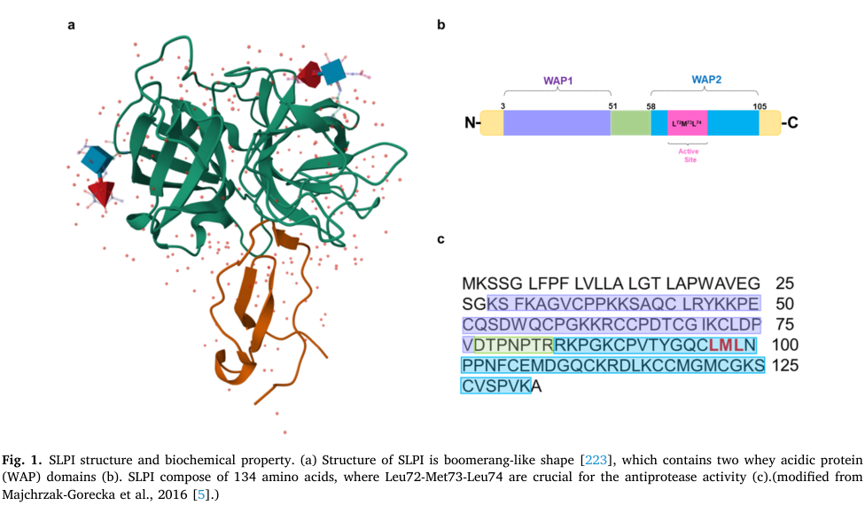
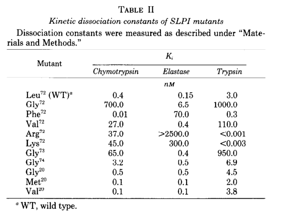

## Question

# Gene Research for Functional Annotation

## ⚠️ CRITICAL: Gene/Protein Identification Context

**BEFORE YOU BEGIN RESEARCH:** You MUST verify you are researching the CORRECT gene/protein. Gene symbols can be ambiguous, especially for less well-characterized genes from non-model organisms.

### Target Gene/Protein Identity (from UniProt):
- **UniProt Accession:** P03973
- **Protein Description:** RecName: Full=Antileukoproteinase; Short=ALP; AltName: Full=BLPI; AltName: Full=HUSI-1 {ECO:0000303|PubMed:3485543, ECO:0000303|PubMed:3533531}; AltName: Full=Mucus proteinase inhibitor; Short=MPI; AltName: Full=Protease inhibitor WAP4; AltName: Full=Secretory leukocyte protease inhibitor {ECO:0000303|PubMed:3462719}; AltName: Full=Seminal proteinase inhibitor; AltName: Full=WAP four-disulfide core domain protein 4; Flags: Precursor;
- **Gene Information:** Name=SLPI; Synonyms=WAP4, WFDC4;
- **Organism (full):** Homo sapiens (Human).
- **Protein Family:** Not specified in UniProt
- **Key Domains:** Elafin-like_sf. (IPR036645); WAP_dom. (IPR008197); WAP_four-disulfide_core. (IPR050514); WAP (PF00095)

### MANDATORY VERIFICATION STEPS:

1. **Check if the gene symbol "SLPI" matches the protein description above**
2. **Verify the organism is correct:** Homo sapiens (Human).
3. **Check if protein family/domains align with what you find in literature**
4. **If you find literature for a DIFFERENT gene with the same or similar symbol, STOP**

### If Gene Symbol is Ambiguous or You Cannot Find Relevant Literature:

**DO NOT PROCEED WITH RESEARCH ON A DIFFERENT GENE.** Instead:
- State clearly: "The gene symbol 'SLPI' is ambiguous or literature is limited for this specific protein"
- Explain what you found (e.g., "Found extensive literature on a different gene with the same symbol in a different organism")
- Describe the protein based ONLY on the UniProt information provided above
- Suggest that the protein function can be inferred from domain/family information

### Research Target:

Please provide a comprehensive research report on the gene **SLPI** (gene ID: SLPI, UniProt: P03973) in human.

The research report should be a detailed narrative explaining the function, biological processes, and localization of the gene product. Citations should be given for all claims.

You should prioritize authoritative reviews and primary scientific literature when conducting research. You can supplement
this with annotations you find in gene/protein databases, but these can be outdated or inaccurate.

We are specifically interested in the primary function of the gene - for enzymes, what reaction is catalyzed, and what is the substrate specificity? For transporters, what is the substrate? For structural proteins or adapters, what is the broader structural role? For signaling molecules, what is the role in the pathway.

We are interested in where in or outside the cell the gene product carries out its function.

We are also interested in the signaling or biochemical pathways in which the gene functions. We are less interested in broad pleiotropic effects, except where these elucidate the precise role.

Include evidence where possible. We are interested in both experimental evidence as well as inference from structure, evolution, or bioinformatic analysis. Precise studies should be prioritized over high-throughput, where available.

## Output

Question: You are an expert researcher providing comprehensive, well-cited information.

Provide detailed information focusing on:
1. Key concepts and definitions with current understanding
2. Recent developments and latest research (prioritize 2023-2024 sources)
3. Current applications and real-world implementations
4. Expert opinions and analysis from authoritative sources
5. Relevant statistics and data from recent studies

Format as a comprehensive research report with proper citations. Include URLs and publication dates where available.
Always prioritize recent, authoritative sources and provide specific citations for all major claims.

# Gene Research for Functional Annotation

## ⚠️ CRITICAL: Gene/Protein Identification Context

**BEFORE YOU BEGIN RESEARCH:** You MUST verify you are researching the CORRECT gene/protein. Gene symbols can be ambiguous, especially for less well-characterized genes from non-model organisms.

### Target Gene/Protein Identity (from UniProt):
- **UniProt Accession:** P03973
- **Protein Description:** RecName: Full=Antileukoproteinase; Short=ALP; AltName: Full=BLPI; AltName: Full=HUSI-1 {ECO:0000303|PubMed:3485543, ECO:0000303|PubMed:3533531}; AltName: Full=Mucus proteinase inhibitor; Short=MPI; AltName: Full=Protease inhibitor WAP4; AltName: Full=Secretory leukocyte protease inhibitor {ECO:0000303|PubMed:3462719}; AltName: Full=Seminal proteinase inhibitor; AltName: Full=WAP four-disulfide core domain protein 4; Flags: Precursor;
- **Gene Information:** Name=SLPI; Synonyms=WAP4, WFDC4;
- **Organism (full):** Homo sapiens (Human).
- **Protein Family:** Not specified in UniProt
- **Key Domains:** Elafin-like_sf. (IPR036645); WAP_dom. (IPR008197); WAP_four-disulfide_core. (IPR050514); WAP (PF00095)

### MANDATORY VERIFICATION STEPS:

1. **Check if the gene symbol "SLPI" matches the protein description above**
2. **Verify the organism is correct:** Homo sapiens (Human).
3. **Check if protein family/domains align with what you find in literature**
4. **If you find literature for a DIFFERENT gene with the same or similar symbol, STOP**

### If Gene Symbol is Ambiguous or You Cannot Find Relevant Literature:

**DO NOT PROCEED WITH RESEARCH ON A DIFFERENT GENE.** Instead:
- State clearly: "The gene symbol 'SLPI' is ambiguous or literature is limited for this specific protein"
- Explain what you found (e.g., "Found extensive literature on a different gene with the same symbol in a different organism")
- Describe the protein based ONLY on the UniProt information provided above
- Suggest that the protein function can be inferred from domain/family information

### Research Target:

Please provide a comprehensive research report on the gene **SLPI** (gene ID: SLPI, UniProt: P03973) in human.

The research report should be a detailed narrative explaining the function, biological processes, and localization of the gene product. Citations should be given for all claims.

You should prioritize authoritative reviews and primary scientific literature when conducting research. You can supplement
this with annotations you find in gene/protein databases, but these can be outdated or inaccurate.

We are specifically interested in the primary function of the gene - for enzymes, what reaction is catalyzed, and what is the substrate specificity? For transporters, what is the substrate? For structural proteins or adapters, what is the broader structural role? For signaling molecules, what is the role in the pathway.

We are interested in where in or outside the cell the gene product carries out its function.

We are also interested in the signaling or biochemical pathways in which the gene functions. We are less interested in broad pleiotropic effects, except where these elucidate the precise role.

Include evidence where possible. We are interested in both experimental evidence as well as inference from structure, evolution, or bioinformatic analysis. Precise studies should be prioritized over high-throughput, where available.

# Human SLPI (UniProt P03973): functional annotation and research report

## Identity and central function

**Identity verified.** Human **SLPI** encodes secretory leukocyte protease inhibitor, also called antileukoproteinase, **WFDC4** or **WAP4**. It is not elafin/trappin-2 (a distinct WFDC protein) or WFDC2/HE4. The approximately 134-residue precursor yields a secreted, approximately **107-residue, 11.7-kDa mature protein** with two homologous whey acidic protein/four-disulfide-core (**WAP/WFDC**) domains. Each domain’s conserved cysteines form four disulfide bonds. The C-terminal domain is the principal antiprotease module; the N-terminal domain contributes other host-defense activities. The 2024 review’s structural illustration depicts the two-domain arrangement and reactive region. (rosini2026slpiinprostate pages 2-4, small2017theroleof pages 45-49, small2017theroleof pages 6-10, mongkolpathumrat2024thesecretoryleukocyte pages 2-4, mongkolpathumrat2024thesecretoryleukocyte media 5940ef02, wen2024versatilewheyacidic pages 2-3, wen2024versatilewheyacidic pages 1-2)

**Primary molecular function:** SLPI is an **inhibitor, not an enzyme**. It does not catalyze a reaction or consume a substrate of its own. Rather, it binds selected *serine proteases* in a substrate-like, noncovalent inhibitory interaction that prevents them from cleaving their protein substrates. The physiologically prominent targets are **neutrophil elastase (NE)** and **cathepsin G**; purified-enzyme studies also establish inhibition of chymotrypsin and trypsin, and reviews report activity against chymase and tryptase. The pancreatic-enzyme assays establish biochemical breadth, not that every inhibited enzyme is an equally important target in human airway fluid. **Proteinase 3 (PR3) should not be assumed to be an SLPI target:** it is a documented *cleaver of SLPI*, whereas inhibition of NE and PR3 together is characteristic of the distinct protein elafin/trappin-2. (small2017theroleof pages 6-10, sallenave2010secretoryleukocyteprotease pages 2-3, stephen1990locationofthe pages 1-1, weldon2009decreasedlevelsof pages 5-6)

## Biochemical mechanism and specificity

The mature protein’s **C-terminal WAP domain, approximately residues 55–107**, presents an inhibitory loop around **residues 67–74**. Structural analysis of an SLPI–chymotrypsin complex and subsequent site-directed mutagenesis locate the crucial **P1 residue at mature-protein Leu72**, adjacent to the **Leu72–Met73** reactive bond. Eisenberg and colleagues changed residues in recombinant SLPI and measured inhibition of elastase, chymotrypsin and trypsin: replacing Leu72 changed target specificity, while changing the homologous N-terminal Arg20 did not abolish trypsin inhibition. In particular, Leu72→Phe weakened elastase inhibition while retaining chymotrypsin inhibition; Leu72→Lys or Arg markedly strengthened trypsin binding. These are unusually direct tests that locate the inhibitory contact rather than merely inferring function from a WAP-domain annotation. **Met73 is adjacent to the reactive site, but its substitution did not eliminate anti-NE activity** in the tested assays; calling both residues equally essential would overstate the evidence. The isolated C-terminal domain retains much of the anti-elastase/chymotrypsin activity, whereas effective trypsin inhibition depends more strongly on the intact two-domain protein. (stephen1990locationofthe pages 1-1, stephen1990locationofthe pages 3-4, stephen1990locationofthe pages 4-5, stephen1990locationofthe media 5d83c636)

A historical comparison reports approximate SLPI–protease dissociation constants of **2 × 10⁻¹⁰ M for elastase** and **5 × 10⁻⁹ M for cathepsin G**; these are assay-specific biochemical affinity estimates, not concentrations required for efficacy in patients. The original 1990 study’s mutant-inhibition measurements provide the stronger evidence for *which region confers specificity*. (richardson1998effectofekjmana pages 22-26, stephen1990locationofthe pages 1-1, stephen1990locationofthe media 5d83c636)

## Where SLPI acts and the processes it controls

SLPI’s **principal functional compartment is extracellular**: epithelial cells secrete it into airway-surface and bronchial secretions, nasal and cervical mucus, saliva and seminal fluid, where it can encounter leukocyte proteases released during inflammation. Mucosal epithelial cells are important sources; macrophages and neutrophils can also produce it. By restraining excess NE and cathepsin G at these interfaces, SLPI helps maintain a **protease–antiprotease balance** and limits proteolysis of surrounding tissue and host-defense components. A 2024 review reports salivary SLPI concentrations approximately **30-fold higher than circulating concentrations**, emphasizing that serum abundance need not reflect local mucosal activity. (mongkolpathumrat2024thesecretoryleukocyte pages 2-4, sallenave2010secretoryleukocyteprotease pages 2-3, stephen1990locationofthe pages 1-1)

There is also direct evidence for an **intracellular, including nuclear, site of action after uptake**. In primary monocytes and U937 cells, added SLPI entered the cytoplasm and nucleus. Taggart and colleagues used DNA-binding assays and chromatin immunoprecipitation to show SLPI at NF-κB-binding sequences in the **IL-8 promoter**, with reduced binding by the transcription-factor subunit **p65**; the IL-10 promoter, lacking the relevant sites in their assay, was a specificity comparison. SLPI was additionally detected in nuclear fractions of human monocytes and alveolar macrophages. Thus, its anti-inflammatory effect cannot be explained solely by extracellular protease inhibition. The route of cellular entry and the relative importance of nuclear competition in every tissue remain less certain. (taggart2005secretoryleucoproteaseinhibitor pages 5-6, taggart2005secretoryleucoproteaseinhibitor pages 1-2)

## Pathways and additional host-defense activity

**Protease control connects SLPI to inflammatory signaling and matrix homeostasis.** Its best-established direct biochemical step is binding and inhibiting extracellular serine proteases; changes in cytokine production, leukocyte recruitment or matrix-metalloproteinase activity can occur downstream and must not automatically be annotated as *direct* SLPI inhibition of those proteins. In monocyte experiments, SLPI’s binding to NF-κB-responsive DNA provides a second, more specific mechanism for restraining inflammatory transcription. Bacterial lipopolysaccharide (LPS), IL-1β, TNF-α and NE can induce epithelial SLPI production, consistent with feedback during mucosal inflammation. Experimental work also describes interference with LPS-dependent macrophage responses, but these observations do not establish SLPI as a canonical TLR4-pathway enzyme or receptor. (small2017theroleof pages 6-10, mongkolpathumrat2024thesecretoryleukocyte pages 2-4, sallenave2010secretoryleukocyteprotease pages 2-3, taggart2005secretoryleucoproteaseinhibitor pages 5-6, brown2024slpideficiencyalters pages 4-7)

SLPI has **antimicrobial activity in vitro**, including reported activity against *Staphylococcus aureus* and *Escherichia coli*; the N-terminal domain contributes, although an isolated domain need not reproduce the intact protein’s potency. Anti-HIV-1 effects have been reported in cell experiments, but findings have varied with experimental preparation and cell conditions. These activities are relevant secondary functions, not a reason to replace the well-established antiprotease annotation with a claim that direct microbial killing is SLPI’s sole or dominant action in vivo. (mongkolpathumrat2024thesecretoryleukocyte pages 2-4, sallenave2010secretoryleukocyteprotease pages 2-3, doumas2005antiinflammatoryandantimicrobial pages 2-3)

## What recent work adds—and what it does not

**Airway protease networks, 2024.** Brown and colleagues crossed SLPI-null mice with a muco-obstructive ENaC-transgenic model. SLPI loss increased airway macrophage recruitment and, in the ENaC-transgenic background, neutrophil recruitment; bronchoalveolar **MMP-9 activity rose and TIMP-1 fell**. Unexpectedly, **mucus plugging decreased**, while early mortality and measured structural lung damage were not significantly changed. Free soluble NE was **undetectable in lavage across the genotypes**. The study therefore supports a context-dependent role for SLPI in airway protease-network regulation, but does **not** demonstrate direct MMP-9 inhibition by SLPI or prove that increased free NE caused the phenotype. (brown2024slpideficiencyalters pages 4-7, brown2024slpideficiencyalters pages 3-4)

**Clinical context, 2024.** Mall and colleagues’ respiratory review reports associations between **lower SLPI and faster lung-function decline in cystic fibrosis (CF)**, and between lower SLPI, poorer lung function and shorter time to exacerbation in non-CF bronchiectasis. These are associations, not proof that supplementing SLPI changes those outcomes. The review notes persistent neutrophilic inflammation despite CFTR-modulator treatment and, as of its **July 2024** publication, no licensed treatment specifically for neutrophilic inflammation in the conditions it discusses. (mall2024neutrophilserineproteases pages 7-8)

**Why local protein activity matters.** In a primary CF bronchoalveolar-lavage study, *Pseudomonas*-positive samples had lower SLPI and more free NE than *Pseudomonas*-negative samples: approximately **18.76 versus 1.92 μM** free NE. Inhibitor controls implicated NE in SLPI cleavage. Mass spectrometry located cleavage at the mature protein’s **Ser15–Ala16 and Ala16–Glu17 bonds**. Importantly, that N-terminal cleavage impaired SLPI binding to LPS and NF-κB DNA sites **while preserving tested inhibition of cathepsin G**: proteolysis can selectively remove functions rather than simply convert SLPI into a wholly inactive protein. The 2024 review additionally discusses oxidation and other proteolytic routes to loss of antiprotease activity; which function is lost depends on the modification and assay. (mongkolpathumrat2024thesecretoryleukocyte pages 2-4, weldon2009decreasedlevelsof pages 5-6, weldon2009decreasedlevelsof pages 1-2, weldon2009decreasedlevelsof pages 7-7)

The following table separates direct observations from mechanistic interpretation and translational limits.

| Functional axis | Direct observation | Interpretation and limit | Source DOI/date |
|---|---|---|---|
| Serine-protease inhibition | Mature SLPI formed complexes with neutrophil elastase (NE) and cathepsin G (CatG). Site-directed mutagenesis and enzyme assays placed the principal P1 inhibitory residue at **Leu72** in the C-terminal WAP domain; substitutions at Leu72 changed NE, chymotrypsin and trypsin inhibition. (stephen1990locationofthe pages 1-1, stephen1990locationofthe pages 3-4, stephen1990locationofthe pages 4-5) | **High-confidence primary function:** reversible, substrate-like inhibition of selected serine proteases, especially NE and CatG. Met73 is adjacent to the reactive site, but Met73→Gly retained nearly full anti-NE activity; the strongest causal evidence therefore concerns Leu72. This evidence does **not** establish proteinase 3 as a direct SLPI target. | [Eisenberg et al., JBC, 15 May 1990](https://doi.org/10.1016/S0021-9258(19)39026-X) |
| Proteolytic inactivation in CF airways | Excess NE cleaved SLPI at the N-terminal **Ser15–Ala16** and **Ala16–Glu17** bonds. In *Pseudomonas*-positive CF bronchoalveolar lavage fluid, free NE was approximately ninefold higher than in negative samples (18.76 versus 1.92 μM). Cleaved SLPI retained CatG inhibition but lost LPS- and NF-κB-site binding. (weldon2009decreasedlevelsof pages 5-6, weldon2009decreasedlevelsof pages 1-2, weldon2009decreasedlevelsof pages 7-7) | Demonstrates domain-selective loss of host-defense functions: N-terminal cleavage can disrupt LPS/NF-κB interactions while leaving the C-terminal antiprotease site functional. PR3 could degrade SLPI in vitro, but inhibitor experiments implicated **NE**, not PR3, as the relevant CF-airway cleavage activity. | [Weldon et al., Journal of Immunology, December 2009](https://doi.org/10.4049/jimmunol.0901716) |
| Intracellular anti-inflammatory signaling | Exogenous SLPI entered monocytes and localized to cytoplasm and nucleus. DNA-binding and ChIP experiments showed direct binding to NF-κB sites in the IL-8 promoter, displacement/exclusion of p65 and reduced inflammatory transcription; binding was not detected at the NF-κB-site-poor IL-10 promoter. (taggart2005secretoryleucoproteaseinhibitor pages 5-6, taggart2005secretoryleucoproteaseinhibitor pages 1-2) | Strong mechanistic cell evidence supports a protease-independent anti-inflammatory action through competition at NF-κB-responsive DNA. Uptake mechanism and the relative contribution of this pathway in each tissue remain incompletely defined. | [Taggart et al., JEM, 13 December 2005](https://doi.org/10.1084/jem.20050768) |
| Muco-obstructive lung disease model | In ENaC-Tg mice, SLPI deletion increased BAL macrophage recruitment and, in the muco-obstructive background, neutrophils; it increased MMP-9 activity and reduced TIMP-1, yet decreased mucus plugging and did not change early mortality or structural lung damage. Free soluble NE was undetectable in BAL. (brown2024slpideficiencyalters pages 4-7, brown2024slpideficiencyalters pages 3-4, brown2024slpideficiencyalters pages 7-9) | Supports SLPI as an airway protease-network and cell-recruitment regulator, but the phenotype is non-linear and mouse-specific. The data do **not** demonstrate direct inhibition of MMP-9 by SLPI; altered MMP-9/TIMP-1 balance was likely indirect, and surface-bound NE was not directly resolved by the BAL assay. | [Brown et al., Frontiers in Immunology, September 2024](https://doi.org/10.3389/fimmu.2024.1433642) |
| Clinical translation | A completed phase-1 protocol planned **60** healthy older adults randomized to topical SLPI or placebo after punch wounds. A separate prospective case-control study planned **280** men to test serum, urine and tissue SLPI as a prostate-cancer biomarker; it was observational and registry status was unknown after last being listed as recruiting. (NCT00005569 chunk 1, NCT04854343 chunk 1) | Clinical development remains exploratory. The registry entries distinguish treatment feasibility/safety from biomarker evaluation, and neither record provides evidence of approved use or proven therapeutic benefit. | [NCT00005569, posted 24 April 2000](https://clinicaltrials.gov/study/NCT00005569); [NCT04854343, posted 22 April 2021](https://clinicaltrials.gov/study/NCT04854343) |

*Table: Evidence-weighted summary of human SLPI P03973 mechanisms, pathological inactivation, recent animal findings and clinical translation. The table separates direct observations from interpretations and important limitations.*

## Applications and evidence boundaries

**Clinical use remains investigational.** SLPI can be measured as a candidate biomarker in airway secretions or other specimens, but *total measured protein is not necessarily intact, functionally active inhibitor*, especially in protease-rich secretions. An NIH-registered **phase-1 topical-SLPI wound study** (NCT00005569; first posted **24 April 2000**) lists **60** participants and is marked completed; its accessible registry protocol does not establish wound-healing efficacy. A separate University of Florence **prospective observational** prostate-cancer biomarker study (NCT04854343; first posted **22 April 2021**) estimates **280** participants and measures SLPI in serum, urine and tissue. Its registry status is *unknown* after the last recorded recruiting update; it is not a trial of SLPI as a prostate-cancer treatment. Registry URLs: https://clinicaltrials.gov/study/NCT00005569 and https://clinicaltrials.gov/study/NCT04854343. (weldon2009decreasedlevelsof pages 5-6, NCT00005569 chunk 1, NCT04854343 chunk 1)

**Evidence-weighted annotation:** annotate human **SLPI/P03973 chiefly as a secreted, C-terminal-WAP-domain serine-protease inhibitor that protects mucosal extracellular environments from excess NE and cathepsin G**. Add experimentally supported but context-dependent annotations for intracellular NF-κB-site competition and antimicrobial host defense. Do not annotate it as an enzyme, as an established direct PR3 or MMP-9 inhibitor, or as a clinically validated SLPI replacement therapy. (sallenave2010secretoryleukocyteprotease pages 2-3, stephen1990locationofthe pages 1-1, taggart2005secretoryleucoproteaseinhibitor pages 5-6, weldon2009decreasedlevelsof pages 5-6, brown2024slpideficiencyalters pages 4-7, mall2024neutrophilserineproteases pages 7-8)

**Principal sources and publication dates:** Eisenberg *et al.*, *Journal of Biological Chemistry*, **15 May 1990**, https://doi.org/10.1016/S0021-9258(19)39026-X; Taggart *et al.*, *Journal of Experimental Medicine*, **December 2005**, https://doi.org/10.1084/jem.20050768; Weldon *et al.*, *Journal of Immunology*, **December 2009**, https://doi.org/10.4049/jimmunol.0901716; Mongkolpathumrat *et al.*, *Heliyon*, **January 2024**, https://doi.org/10.1016/j.heliyon.2024.e24550; Mall *et al.*, *European Respiratory Review*, **July 2024**, https://doi.org/10.1183/16000617.0001-2024; Brown *et al.*, *Frontiers in Immunology*, **September 2024**, https://doi.org/10.3389/fimmu.2024.1433642; Wen *et al.*, *Frontiers in Cell and Developmental Biology*, **4 September 2024**, https://doi.org/10.3389/fcell.2024.1459129. (stephen1990locationofthe pages 1-1, taggart2005secretoryleucoproteaseinhibitor pages 1-2, weldon2009decreasedlevelsof pages 1-2, mongkolpathumrat2024thesecretoryleukocyte pages 2-4, mall2024neutrophilserineproteases pages 1-2, brown2024slpideficiencyalters pages 1-2, wen2024versatilewheyacidic pages 1-2)

References

1. (rosini2026slpiinprostate pages 2-4): Dario Rosini, Irene Cosi, Pierpaolo De Iaco, Arcangelo Sebastianelli, Gioia Di Stefano, Sergio Serni, Gabriella Nesi, Rosario Notaro, and Maria De Angioletti. Slpi in prostate cancer. Cancers, 18:487, Feb 2026. URL: https://doi.org/10.3390/cancers18030487, doi:10.3390/cancers18030487. This article has 2 citations.

2. (small2017theroleof pages 45-49): Donna M. Small, Declan F. Doherty, Caoifa M. Dougan, Sinéad Weldon, and Clifford C. Taggart. The role of whey acidic protein four-disulfide-core proteins in respiratory health and disease. Biological Chemistry, 398:425-440, Apr 2017. URL: https://doi.org/10.1515/hsz-2016-0262, doi:10.1515/hsz-2016-0262. This article has 34 citations and is from a peer-reviewed journal.

3. (small2017theroleof pages 6-10): Donna M. Small, Declan F. Doherty, Caoifa M. Dougan, Sinéad Weldon, and Clifford C. Taggart. The role of whey acidic protein four-disulfide-core proteins in respiratory health and disease. Biological Chemistry, 398:425-440, Apr 2017. URL: https://doi.org/10.1515/hsz-2016-0262, doi:10.1515/hsz-2016-0262. This article has 34 citations and is from a peer-reviewed journal.

4. (mongkolpathumrat2024thesecretoryleukocyte pages 2-4): Podsawee Mongkolpathumrat, Faprathan Pikwong, Chayanisa Phutiyothin, Onnicha Srisopar, Wannapat Chouyratchakarn, Sasimanas Unnajak, Nitirut Nernpermpisooth, and Sarawut Kumphune. The secretory leukocyte protease inhibitor (slpi) in pathophysiology of non-communicable diseases: evidence from experimental studies to clinical applications. Heliyon, 10:e24550, Jan 2024. URL: https://doi.org/10.1016/j.heliyon.2024.e24550, doi:10.1016/j.heliyon.2024.e24550. This article has 18 citations.

5. (mongkolpathumrat2024thesecretoryleukocyte media 5940ef02): Podsawee Mongkolpathumrat, Faprathan Pikwong, Chayanisa Phutiyothin, Onnicha Srisopar, Wannapat Chouyratchakarn, Sasimanas Unnajak, Nitirut Nernpermpisooth, and Sarawut Kumphune. The secretory leukocyte protease inhibitor (slpi) in pathophysiology of non-communicable diseases: evidence from experimental studies to clinical applications. Heliyon, 10:e24550, Jan 2024. URL: https://doi.org/10.1016/j.heliyon.2024.e24550, doi:10.1016/j.heliyon.2024.e24550. This article has 18 citations.

6. (wen2024versatilewheyacidic pages 2-3): Yifan Wen, Nan Jiang, Zhen Wang, and Yuanyuan Xiao. Versatile whey acidic protein four-disulfide core domain proteins: biology and role in diseases. Frontiers in Cell and Developmental Biology, Sep 2024. URL: https://doi.org/10.3389/fcell.2024.1459129, doi:10.3389/fcell.2024.1459129. This article has 10 citations.

7. (wen2024versatilewheyacidic pages 1-2): Yifan Wen, Nan Jiang, Zhen Wang, and Yuanyuan Xiao. Versatile whey acidic protein four-disulfide core domain proteins: biology and role in diseases. Frontiers in Cell and Developmental Biology, Sep 2024. URL: https://doi.org/10.3389/fcell.2024.1459129, doi:10.3389/fcell.2024.1459129. This article has 10 citations.

8. (sallenave2010secretoryleukocyteprotease pages 2-3): Jean-Michel Sallenave. Secretory leukocyte protease inhibitor and elafin/trappin-2. Jun 2010. URL: https://doi.org/10.1165/rcmb.2010-0095rt, doi:10.1165/rcmb.2010-0095rt. This article has 175 citations and is from a peer-reviewed journal.

9. (stephen1990locationofthe pages 1-1): Stephen, P., Eisenberg, Karin, K., Hale, Patricia, Heimdal, Robert, and C. Thompson. Location of the protease-inhibitory region of secretory leukocyte protease inhibitor. Jun 1990. URL: https://doi.org/10.1016/s0021-9258(19)39026-x, doi:10.1016/s0021-9258(19)39026-x. This article has 217 citations and is from a domain leading peer-reviewed journal.

10. (weldon2009decreasedlevelsof pages 5-6): Sinéad Weldon, Paul McNally, Noel G McElvaney, J Stuart Elborn, Danny F McAuley, Julien Wartelle, Abderrazzaq Belaaouaj, Rodney L Levine, and Clifford C Taggart. Decreased levels of secretory leucoprotease inhibitor in the pseudomonas-infected cystic fibrosis lung are due to neutrophil elastase degradation. Journal of Immunology (Baltimore, Md. : 1950), 183:8148-8156, Dec 2009. URL: https://doi.org/10.4049/jimmunol.0901716, doi:10.4049/jimmunol.0901716. This article has 168 citations.

11. (stephen1990locationofthe pages 3-4): Stephen, P., Eisenberg, Karin, K., Hale, Patricia, Heimdal, Robert, and C. Thompson. Location of the protease-inhibitory region of secretory leukocyte protease inhibitor. Jun 1990. URL: https://doi.org/10.1016/s0021-9258(19)39026-x, doi:10.1016/s0021-9258(19)39026-x. This article has 217 citations and is from a domain leading peer-reviewed journal.

12. (stephen1990locationofthe pages 4-5): Stephen, P., Eisenberg, Karin, K., Hale, Patricia, Heimdal, Robert, and C. Thompson. Location of the protease-inhibitory region of secretory leukocyte protease inhibitor. Jun 1990. URL: https://doi.org/10.1016/s0021-9258(19)39026-x, doi:10.1016/s0021-9258(19)39026-x. This article has 217 citations and is from a domain leading peer-reviewed journal.

13. (stephen1990locationofthe media 5d83c636): Stephen, P., Eisenberg, Karin, K., Hale, Patricia, Heimdal, Robert, and C. Thompson. Location of the protease-inhibitory region of secretory leukocyte protease inhibitor. Jun 1990. URL: https://doi.org/10.1016/s0021-9258(19)39026-x, doi:10.1016/s0021-9258(19)39026-x. This article has 217 citations and is from a domain leading peer-reviewed journal.

14. (richardson1998effectofekjmana pages 22-26): S Richardson. Effect of ekjman kalli [kreins elk2 and eik3 on the anti-protease system of the cervical mucus of the hulman female. Unknown journal, 1998.

15. (taggart2005secretoryleucoproteaseinhibitor pages 5-6): Clifford C. Taggart, Sally-Ann Cryan, Sinead Weldon, Aileen Gibbons, Catherine M. Greene, Emer Kelly, Teck Boon Low, Shane J. O'Neill, and Noel G. McElvaney. Secretory leucoprotease inhibitor binds to nf-κb binding sites in monocytes and inhibits p65 binding. The Journal of Experimental Medicine, 202:1659-1668, Dec 2005. URL: https://doi.org/10.1084/jem.20050768, doi:10.1084/jem.20050768. This article has 313 citations.

16. (taggart2005secretoryleucoproteaseinhibitor pages 1-2): Clifford C. Taggart, Sally-Ann Cryan, Sinead Weldon, Aileen Gibbons, Catherine M. Greene, Emer Kelly, Teck Boon Low, Shane J. O'Neill, and Noel G. McElvaney. Secretory leucoprotease inhibitor binds to nf-κb binding sites in monocytes and inhibits p65 binding. The Journal of Experimental Medicine, 202:1659-1668, Dec 2005. URL: https://doi.org/10.1084/jem.20050768, doi:10.1084/jem.20050768. This article has 313 citations.

17. (brown2024slpideficiencyalters pages 4-7): Ryan Brown, Caoifa Dougan, Peter Ferris, Rebecca Delaney, Claire J. Houston, Aoife Rodgers, Damian G. Downey, Marcus A. Mall, Bronwen Connolly, Donna Small, Sinéad Weldon, and Clifford C. Taggart. Slpi deficiency alters airway protease activity and induces cell recruitment in a model of muco-obstructive lung disease. Frontiers in Immunology, Sep 2024. URL: https://doi.org/10.3389/fimmu.2024.1433642, doi:10.3389/fimmu.2024.1433642. This article has 11 citations and is from a peer-reviewed journal.

18. (doumas2005antiinflammatoryandantimicrobial pages 2-3): Stergios Doumas, Alexandros Kolokotronis, and Panagiotis Stefanopoulos. Anti-inflammatory and antimicrobial roles of secretory leukocyte protease inhibitor. Infection and Immunity, 73:1271-1274, Mar 2005. URL: https://doi.org/10.1128/iai.73.3.1271-1274.2005, doi:10.1128/iai.73.3.1271-1274.2005. This article has 338 citations and is from a peer-reviewed journal.

19. (brown2024slpideficiencyalters pages 3-4): Ryan Brown, Caoifa Dougan, Peter Ferris, Rebecca Delaney, Claire J. Houston, Aoife Rodgers, Damian G. Downey, Marcus A. Mall, Bronwen Connolly, Donna Small, Sinéad Weldon, and Clifford C. Taggart. Slpi deficiency alters airway protease activity and induces cell recruitment in a model of muco-obstructive lung disease. Frontiers in Immunology, Sep 2024. URL: https://doi.org/10.3389/fimmu.2024.1433642, doi:10.3389/fimmu.2024.1433642. This article has 11 citations and is from a peer-reviewed journal.

20. (mall2024neutrophilserineproteases pages 7-8): Marcus A. Mall, Jane C. Davies, Scott H. Donaldson, Raksha Jain, James D. Chalmers, and Michal Shteinberg. Neutrophil serine proteases in cystic fibrosis: role in disease pathogenesis and rationale as a therapeutic target. European Respiratory Review, 33:240001, Jul 2024. URL: https://doi.org/10.1183/16000617.0001-2024, doi:10.1183/16000617.0001-2024. This article has 33 citations and is from a peer-reviewed journal.

21. (weldon2009decreasedlevelsof pages 1-2): Sinéad Weldon, Paul McNally, Noel G McElvaney, J Stuart Elborn, Danny F McAuley, Julien Wartelle, Abderrazzaq Belaaouaj, Rodney L Levine, and Clifford C Taggart. Decreased levels of secretory leucoprotease inhibitor in the pseudomonas-infected cystic fibrosis lung are due to neutrophil elastase degradation. Journal of Immunology (Baltimore, Md. : 1950), 183:8148-8156, Dec 2009. URL: https://doi.org/10.4049/jimmunol.0901716, doi:10.4049/jimmunol.0901716. This article has 168 citations.

22. (weldon2009decreasedlevelsof pages 7-7): Sinéad Weldon, Paul McNally, Noel G McElvaney, J Stuart Elborn, Danny F McAuley, Julien Wartelle, Abderrazzaq Belaaouaj, Rodney L Levine, and Clifford C Taggart. Decreased levels of secretory leucoprotease inhibitor in the pseudomonas-infected cystic fibrosis lung are due to neutrophil elastase degradation. Journal of Immunology (Baltimore, Md. : 1950), 183:8148-8156, Dec 2009. URL: https://doi.org/10.4049/jimmunol.0901716, doi:10.4049/jimmunol.0901716. This article has 168 citations.

23. (brown2024slpideficiencyalters pages 7-9): Ryan Brown, Caoifa Dougan, Peter Ferris, Rebecca Delaney, Claire J. Houston, Aoife Rodgers, Damian G. Downey, Marcus A. Mall, Bronwen Connolly, Donna Small, Sinéad Weldon, and Clifford C. Taggart. Slpi deficiency alters airway protease activity and induces cell recruitment in a model of muco-obstructive lung disease. Frontiers in Immunology, Sep 2024. URL: https://doi.org/10.3389/fimmu.2024.1433642, doi:10.3389/fimmu.2024.1433642. This article has 11 citations and is from a peer-reviewed journal.

24. (NCT00005569 chunk 1):  Effects of Topical SLPI on Skin Wounds. National Institute of Dental and Craniofacial Research (NIDCR). 2000. ClinicalTrials.gov Identifier: NCT00005569

25. (NCT04854343 chunk 1): Simone Morselli. SLPI for Prostate Cancer. University of Florence. 2020. ClinicalTrials.gov Identifier: NCT04854343

26. (mall2024neutrophilserineproteases pages 1-2): Marcus A. Mall, Jane C. Davies, Scott H. Donaldson, Raksha Jain, James D. Chalmers, and Michal Shteinberg. Neutrophil serine proteases in cystic fibrosis: role in disease pathogenesis and rationale as a therapeutic target. European Respiratory Review, 33:240001, Jul 2024. URL: https://doi.org/10.1183/16000617.0001-2024, doi:10.1183/16000617.0001-2024. This article has 33 citations and is from a peer-reviewed journal.

27. (brown2024slpideficiencyalters pages 1-2): Ryan Brown, Caoifa Dougan, Peter Ferris, Rebecca Delaney, Claire J. Houston, Aoife Rodgers, Damian G. Downey, Marcus A. Mall, Bronwen Connolly, Donna Small, Sinéad Weldon, and Clifford C. Taggart. Slpi deficiency alters airway protease activity and induces cell recruitment in a model of muco-obstructive lung disease. Frontiers in Immunology, Sep 2024. URL: https://doi.org/10.3389/fimmu.2024.1433642, doi:10.3389/fimmu.2024.1433642. This article has 11 citations and is from a peer-reviewed journal.

## Artifacts

- [Edison artifact artifact-00](SLPI-deep-research-falcon_artifacts/artifact-00.md)

## Citations

1. mall2024neutrophilserineproteases pages 7-8
2. rosini2026slpiinprostate pages 2-4
3. small2017theroleof pages 45-49
4. small2017theroleof pages 6-10
5. mongkolpathumrat2024thesecretoryleukocyte pages 2-4
6. wen2024versatilewheyacidic pages 2-3
7. wen2024versatilewheyacidic pages 1-2
8. sallenave2010secretoryleukocyteprotease pages 2-3
9. stephen1990locationofthe pages 1-1
10. weldon2009decreasedlevelsof pages 5-6
11. stephen1990locationofthe pages 3-4
12. stephen1990locationofthe pages 4-5
13. richardson1998effectofekjmana pages 22-26
14. taggart2005secretoryleucoproteaseinhibitor pages 5-6
15. taggart2005secretoryleucoproteaseinhibitor pages 1-2
16. brown2024slpideficiencyalters pages 4-7
17. doumas2005antiinflammatoryandantimicrobial pages 2-3
18. brown2024slpideficiencyalters pages 3-4
19. weldon2009decreasedlevelsof pages 1-2
20. weldon2009decreasedlevelsof pages 7-7
21. brown2024slpideficiencyalters pages 7-9
22. mall2024neutrophilserineproteases pages 1-2
23. brown2024slpideficiencyalters pages 1-2
24. Eisenberg et al., JBC, 15 May 1990
25. Weldon et al., Journal of Immunology, December 2009
26. Taggart et al., JEM, 13 December 2005
27. Brown et al., Frontiers in Immunology, September 2024
28. NCT00005569, posted 24 April 2000
29. NCT04854343, posted 22 April 2021
30. https://doi.org/10.1016/S0021-9258(19
31. https://doi.org/10.4049/jimmunol.0901716
32. https://doi.org/10.1084/jem.20050768
33. https://doi.org/10.3389/fimmu.2024.1433642
34. https://clinicaltrials.gov/study/NCT00005569
35. https://clinicaltrials.gov/study/NCT04854343
36. https://clinicaltrials.gov/study/NCT04854343.
37. https://doi.org/10.1084/jem.20050768;
38. https://doi.org/10.4049/jimmunol.0901716;
39. https://doi.org/10.1016/j.heliyon.2024.e24550;
40. https://doi.org/10.1183/16000617.0001-2024;
41. https://doi.org/10.3389/fimmu.2024.1433642;
42. https://doi.org/10.3389/fcell.2024.1459129.
43. https://doi.org/10.3390/cancers18030487,
44. https://doi.org/10.1515/hsz-2016-0262,
45. https://doi.org/10.1016/j.heliyon.2024.e24550,
46. https://doi.org/10.3389/fcell.2024.1459129,
47. https://doi.org/10.1165/rcmb.2010-0095rt,
48. https://doi.org/10.1016/s0021-9258(19
49. https://doi.org/10.4049/jimmunol.0901716,
50. https://doi.org/10.1084/jem.20050768,
51. https://doi.org/10.3389/fimmu.2024.1433642,
52. https://doi.org/10.1128/iai.73.3.1271-1274.2005,
53. https://doi.org/10.1183/16000617.0001-2024,