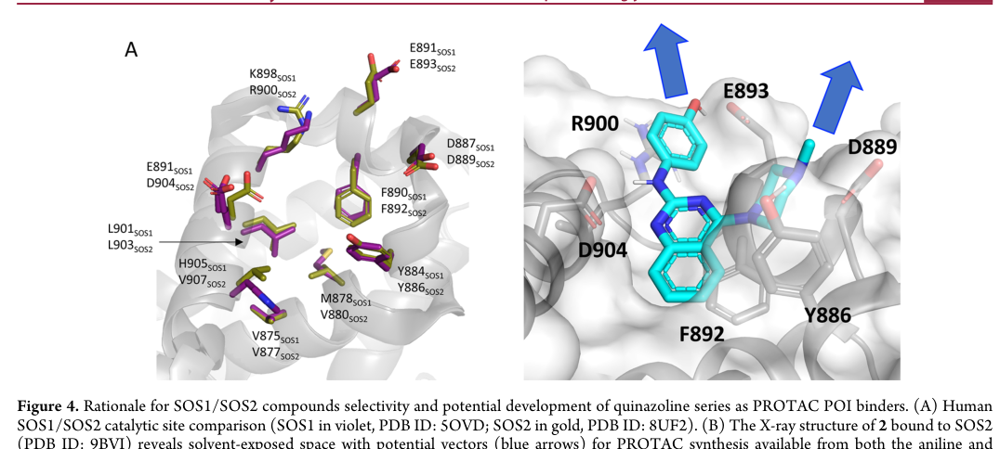

## Question

# Gene Research for Functional Annotation

## ⚠️ CRITICAL: Gene/Protein Identification Context

**BEFORE YOU BEGIN RESEARCH:** You MUST verify you are researching the CORRECT gene/protein. Gene symbols can be ambiguous, especially for less well-characterized genes from non-model organisms.

### Target Gene/Protein Identity (from UniProt):
- **UniProt Accession:** Q07890
- **Protein Description:** RecName: Full=Son of sevenless homolog 2; Short=SOS-2;
- **Gene Information:** Name=SOS2;
- **Organism (full):** Homo sapiens (Human).
- **Protein Family:** Not specified in UniProt
- **Key Domains:** DBL_dom_sf. (IPR035899); DH_dom. (IPR000219); Histone-fold. (IPR009072); PH-like_dom_sf. (IPR011993); PH_domain. (IPR001849)

### MANDATORY VERIFICATION STEPS:

1. **Check if the gene symbol "SOS2" matches the protein description above**
2. **Verify the organism is correct:** Homo sapiens (Human).
3. **Check if protein family/domains align with what you find in literature**
4. **If you find literature for a DIFFERENT gene with the same or similar symbol, STOP**

### If Gene Symbol is Ambiguous or You Cannot Find Relevant Literature:

**DO NOT PROCEED WITH RESEARCH ON A DIFFERENT GENE.** Instead:
- State clearly: "The gene symbol 'SOS2' is ambiguous or literature is limited for this specific protein"
- Explain what you found (e.g., "Found extensive literature on a different gene with the same symbol in a different organism")
- Describe the protein based ONLY on the UniProt information provided above
- Suggest that the protein function can be inferred from domain/family information

### Research Target:

Please provide a comprehensive research report on the gene **SOS2** (gene ID: SOS2, UniProt: Q07890) in human.

The research report should be a detailed narrative explaining the function, biological processes, and localization of the gene product. Citations should be given for all claims.

You should prioritize authoritative reviews and primary scientific literature when conducting research. You can supplement
this with annotations you find in gene/protein databases, but these can be outdated or inaccurate.

We are specifically interested in the primary function of the gene - for enzymes, what reaction is catalyzed, and what is the substrate specificity? For transporters, what is the substrate? For structural proteins or adapters, what is the broader structural role? For signaling molecules, what is the role in the pathway.

We are interested in where in or outside the cell the gene product carries out its function.

We are also interested in the signaling or biochemical pathways in which the gene functions. We are less interested in broad pleiotropic effects, except where these elucidate the precise role.

Include evidence where possible. We are interested in both experimental evidence as well as inference from structure, evolution, or bioinformatic analysis. Precise studies should be prioritized over high-throughput, where available.

## Output

Question: You are an expert researcher providing comprehensive, well-cited information.

Provide detailed information focusing on:
1. Key concepts and definitions with current understanding
2. Recent developments and latest research (prioritize 2023-2024 sources)
3. Current applications and real-world implementations
4. Expert opinions and analysis from authoritative sources
5. Relevant statistics and data from recent studies

Format as a comprehensive research report with proper citations. Include URLs and publication dates where available.
Always prioritize recent, authoritative sources and provide specific citations for all major claims.

# Gene Research for Functional Annotation

## ⚠️ CRITICAL: Gene/Protein Identification Context

**BEFORE YOU BEGIN RESEARCH:** You MUST verify you are researching the CORRECT gene/protein. Gene symbols can be ambiguous, especially for less well-characterized genes from non-model organisms.

### Target Gene/Protein Identity (from UniProt):
- **UniProt Accession:** Q07890
- **Protein Description:** RecName: Full=Son of sevenless homolog 2; Short=SOS-2;
- **Gene Information:** Name=SOS2;
- **Organism (full):** Homo sapiens (Human).
- **Protein Family:** Not specified in UniProt
- **Key Domains:** DBL_dom_sf. (IPR035899); DH_dom. (IPR000219); Histone-fold. (IPR009072); PH-like_dom_sf. (IPR011993); PH_domain. (IPR001849)

### MANDATORY VERIFICATION STEPS:

1. **Check if the gene symbol "SOS2" matches the protein description above**
2. **Verify the organism is correct:** Homo sapiens (Human).
3. **Check if protein family/domains align with what you find in literature**
4. **If you find literature for a DIFFERENT gene with the same or similar symbol, STOP**

### If Gene Symbol is Ambiguous or You Cannot Find Relevant Literature:

**DO NOT PROCEED WITH RESEARCH ON A DIFFERENT GENE.** Instead:
- State clearly: "The gene symbol 'SOS2' is ambiguous or literature is limited for this specific protein"
- Explain what you found (e.g., "Found extensive literature on a different gene with the same symbol in a different organism")
- Describe the protein based ONLY on the UniProt information provided above
- Suggest that the protein function can be inferred from domain/family information

### Research Target:

Please provide a comprehensive research report on the gene **SOS2** (gene ID: SOS2, UniProt: Q07890) in human.

The research report should be a detailed narrative explaining the function, biological processes, and localization of the gene product. Citations should be given for all claims.

You should prioritize authoritative reviews and primary scientific literature when conducting research. You can supplement
this with annotations you find in gene/protein databases, but these can be outdated or inaccurate.

We are specifically interested in the primary function of the gene - for enzymes, what reaction is catalyzed, and what is the substrate specificity? For transporters, what is the substrate? For structural proteins or adapters, what is the broader structural role? For signaling molecules, what is the role in the pathway.

We are interested in where in or outside the cell the gene product carries out its function.

We are also interested in the signaling or biochemical pathways in which the gene functions. We are less interested in broad pleiotropic effects, except where these elucidate the precise role.

Include evidence where possible. We are interested in both experimental evidence as well as inference from structure, evolution, or bioinformatic analysis. Precise studies should be prioritized over high-throughput, where available.

# Human SOS2 (UniProt Q07890): functional-annotation research report

## Executive conclusion

The requested target is correctly identified: **human SOS2 (SOS Ras/Rho guanine nucleotide exchange factor 2), UniProt Q07890**, also called **Son of sevenless homolog 2**. It is not the Arabidopsis salt-overly-sensitive kinase also called SOS2. Direct accession-level confirmation comes from recent biochemical work using residues 562–1047 of **Q07890** as the human SOS2 RAS-GEF construct. Human SOS2 is one of two mammalian SOS paralogs and shares approximately 69–70% overall similarity with SOS1. (nair2021rasisoformsfrom pages 9-10, rojas2011mammaliansonof pages 1-2, zak2025discoveryofsmall pages 7-8)

SOS2’s primary function is to act as a **guanine-nucleotide exchange factor (GEF) for RAS-family small GTPases**. It promotes release of GDP from membrane-associated RAS; because cellular GTP is abundant, RAS then binds GTP and enters its active signaling state. SOS2 therefore does not transfer a chemical group or hydrolyze a substrate: it catalyzes nucleotide exchange by remodeling the RAS nucleotide-binding site. The strongest substrate evidence concerns canonical RAS proteins. RAC-GEF activity is plausible from its DH domain and paralogy to SOS1, but has not been comparably demonstrated for SOS2 and should not be treated as its established primary function. (baltanas2021sos2comesto pages 1-3, baltanas2021sos2comesto pages 7-8, rojas2011mammaliansonof pages 1-2)

Its best-supported distinctive role is not absolute substrate specificity but **context-dependent signaling bias**: relative to SOS1, SOS2 often makes a disproportionate contribution to RTK-driven wild-type RAS–PI3K–AKT signaling, anchorage-independent survival, and KRAS-mutant transformation, while SOS1 more strongly controls sustained RAS–RAF–MEK–ERK signaling. SOS2 remains partly redundant with SOS1, and this division is not universal across cell types. (baltanas2021sos2comesto pages 8-10, baltanas2021sos2comesto pages 7-8, baltanas2021sos2comesto pages 10-11)

| Topic | Best-supported conclusion | Evidence type/strength | Key source and date |
|---|---|---|---|
| Identity and domain architecture | Human **SOS2** is Son of sevenless homolog 2, a ubiquitously expressed mammalian SOS-family GEF distinct from plant proteins named SOS2. UniProt **Q07890** was directly used for a human SOS2 construct spanning residues 562–1047. Conserved architecture comprises tandem histone folds, DH, PH, REM, catalytic CDC25H, and a proline-rich C-terminal region. Architecture is well supported by sequence homology; most detailed regulatory structures derive from SOS1. | **Strong identity evidence; moderate structural inference.** Q07890 was experimentally referenced, but full-length SOS2 structural validation remains limited. | Zak et al., **January 2025**; Nair et al., **June 2021** (nair2021rasisoformsfrom pages 9-10, zak2025discoveryofsmall pages 7-8) |
| Catalytic function and substrate | SOS2 is a **RAS guanine-nucleotide exchange factor**: its CDC25H module promotes GDP dissociation from RAS, permitting abundant cellular GTP to bind and generate active RAS–GTP. The best-supported substrates are canonical RAS proteins; SOS2-specific RAC-GEF activity has not been formally established. | **Strong biochemical/family evidence for RAS-GEF activity; limited evidence for RAC.** | Rojas et al., **March 2011**; Baltanás et al., **June 2021** (baltanas2021sos2comesto pages 1-3, baltanas2021sos2comesto pages 7-8, rojas2011mammaliansonof pages 1-2) |
| Localization and recruitment | SOS2 is primarily cytosolic before stimulation and functions at the **cytoplasmic face of cellular membranes**, especially the plasma membrane, where membrane-anchored RAS resides. RTK activation recruits GRB2–SOS complexes through the proline-rich SOS tail; PH- and histone-fold-mediated lipid contacts can further stabilize membrane association. Detailed autoinhibition and allosteric RAS–GTP activation mechanisms are strongly established for SOS1 and are plausible—but not equivalently demonstrated—for SOS2. | **Strong pathway-level evidence; moderate SOS2-specific evidence.** Localization model is conserved, whereas several mechanistic details are inferred from SOS1. | Nair et al., **June 2021**; Baltanás et al., **June 2021** (nair2021rasisoformsfrom pages 9-10, baltanas2021sos2comesto pages 7-8) |
| Comparison with SOS1 | SOS1 and SOS2 share about **69–70% overall similarity** and partial redundancy, but SOS1 usually dominates sustained RAS–ERK signaling. SOS2 binds GRB2 more strongly yet interacts less efficiently with activated EGFR/Shc, is less stable, and is associated mainly with short-duration signaling. | **Moderate-to-strong comparative evidence**, including interaction, degradation, knockout, and signaling studies. | Rojas et al., **March 2011**; Baltanás et al., **June 2021** (baltanas2021sos2comesto pages 7-8, rojas2011mammaliansonof pages 1-2, baltanas2021sos2comesto pages 5-7) |
| PI3K–AKT specificity | In keratinocytes and mutant-RAS models, SOS2 loss preferentially reduces EGF/RTK-stimulated **AKT phosphorylation**, whereas ERK activation is often preserved. This supports a context-dependent bias toward wild-type RAS–PI3K–AKT signaling rather than an absolute pathway-exclusive function. | **Strong cellular and genetic evidence in tested models; context-dependent**, not a universal biochemical specificity. | Sheffels and colleagues, summarized by Baltanás et al., **June 2021** (baltanas2021sos2comesto pages 8-10, baltanas2021sos2comesto pages 7-8, baltanas2021sos2comesto pages 10-11) |
| Physiology and knockout evidence | Constitutive **Sos2-null mice are viable and fertile**, unlike embryonic-lethal Sos1 knockout mice. Adult single knockouts can survive, but combined Sos1/Sos2 loss causes rapid death, demonstrating essential collective function and redundancy. Sos2 loss also reduces hair-follicle stem-cell populations, supporting a specific role in epidermal homeostasis. | **Strong in-vivo genetic evidence**, primarily from mouse models. | Esteban et al., **September 2000**; Baltanás et al., **June 2021** (baltanas2021sos2comesto pages 1-3, baltanas2021sos2comesto pages 4-5) |
| Noonan syndrome variants | Heterozygous activating SOS2 variants cause **Noonan syndrome 9**. Reported variants cluster in the DH region, including **T264K/R, E266_M267delins, M267K/R/T, and T376S**, and are proposed to weaken autoinhibitory domain interactions, thereby increasing RAS–MAPK signaling. Severe lymphatic disease occurs in some patients. | **Strong human genetic association; mechanistic interpretation partly structural/computational.** Open Targets identifies Noonan syndrome as the strongest curated SOS2 disease association. | Baltanás et al., **June 2021**; Open Targets, accessed **2026** (OpenTargets Search: -SOS2, baltanas2021sos2comesto pages 8-10) |
| Cancer evidence | SOS2 is generally not the primary proliferative RAS GEF, but it supports **anchorage-independent growth and anoikis resistance**, particularly in KRAS-mutant cells, through wild-type RAS–PI3K–AKT signaling. CRISPR depletion impaired transformation in lung, colorectal, and pancreatic cancer models; reported dependence follows approximately **KRAS > NRAS > HRAS**. These findings are preclinical and do not establish clinical efficacy. | **Moderate-to-strong preclinical evidence** from genetic perturbation and 3D-growth assays; no validated SOS2-directed therapy. | Sheffels et al., **2018–2021**; Baltanás et al., **June 2021** (baltanas2021sos2comesto pages 8-10, baltanas2021sos2comesto pages 10-11) |
| 2025 ligand discovery | A **6,000-compound SPR screen** produced a 33-µM quinazoline hit; optimization yielded single-digit-micromolar SOS2 binders. Compound 2 showed no saturable SOS1 binding up to 200 µM. X-ray structures identified catalytic-pocket selectivity determinants **R900, D904, and V907** and a second interdomain pocket. These molecules are **binders and preclinical chemical starting points**, potentially useful for inhibitors or PROTACs—not validated cellular SOS2 inhibitors. | **Strong biophysical and crystallographic binding evidence; weak functional/therapeutic evidence** because cellular pathway inhibition and in-vivo efficacy were not established. | Zak et al., *Journal of Medicinal Chemistry*, **January 2025** (zak2025discoveryofsmall pages 4-5, zak2025discoveryofsmall pages 5-7, zak2025discoveryofsmall pages 2-4, zak2025discoveryofsmall pages 1-2, zak2025discoveryofsmall media c657e5c6) |

*Table: A concise evidence map for human SOS2/Q07890 covering identity, mechanism, localization, physiology, disease relevance, cancer biology, and ligand discovery. It distinguishes direct SOS2 evidence from SOS1-based inference and emphasizes the preclinical status of reported chemical binders.*

## 1. Identity verification and domain organization

### 1.1 Verification

The symbol, protein description, organism, and accession supplied by the user are mutually consistent:

- **Gene/protein:** SOS2 / Son of sevenless homolog 2
- **Organism:** *Homo sapiens*
- **UniProt:** Q07890
- **Molecular class:** multidomain RAS guanine-nucleotide exchange factor
- **Human paralog:** SOS1

A 2025 SOS2 ligand study expressed a catalytic-region construct covering residues **562–1047 of Q07890**, independently tying the accession to human Son of sevenless 2. This excludes same-symbol proteins in other organisms, especially plant SOS2 kinases. (zak2025discoveryofsmall pages 1-2, zak2025discoveryofsmall pages 7-8)

### 1.2 Domain architecture

The conserved mammalian SOS architecture proceeds approximately as follows:

1. **N-terminal tandem histone-fold region**—participates in regulatory and membrane-related organization.
2. **DH domain**—a Dbl-homology/RhoGEF-like module implicated in autoinhibitory packing; unlike SOS1, SOS2-specific RAC exchange activity remains uncertain.
3. **PH domain**—supports lipid/membrane interactions and contributes to regulation.
4. **REM domain**—the RAS exchanger motif, involved in RAS binding and the allosteric regulatory site.
5. **CDC25-homology domain**—the catalytic RAS-GEF module that promotes GDP release.
6. **C-terminal proline-rich region**—binds SH3-domain adaptors, especially GRB2, coupling SOS2 to activated receptors. (nair2021rasisoformsfrom pages 9-10, rojas2011mammaliansonof pages 1-2)

This agrees with the supplied InterPro assignments: histone fold, DH/Dbl-homology, PH-like/PH domains, plus the catalytic region represented in the recent Q07890 construct. Importantly, most atomic-level knowledge of full-length autoinhibition and allosteric activation comes from SOS1. Given high conservation, it is a strong working model for SOS2, but not every SOS1 regulatory detail has been demonstrated directly in SOS2. (nair2021rasisoformsfrom pages 9-10, baltanas2021sos2comesto pages 7-8)

## 2. Molecular function, reaction, and substrate specificity

### 2.1 Catalyzed reaction

The functional reaction can be represented as:

**RAS–GDP + GTP → RAS–GTP + GDP**, with SOS2 acting catalytically and remaining unchanged.

Mechanistically, SOS2 binds RAS through its REM–CDC25 catalytic module. The CDC25-homology domain destabilizes nucleotide coordination and promotes GDP dissociation. Nucleotide-free RAS is transient; GTP then binds because its cytosolic concentration exceeds that of GDP. RAS–GTP can engage effectors including RAF kinases and PI3K. GAP proteins, not SOS2, subsequently accelerate GTP hydrolysis and return RAS to the GDP-bound state. (nair2021rasisoformsfrom pages 9-10, rojas2011mammaliansonof pages 1-2)

### 2.2 Substrate range

Canonical **H-RAS, N-RAS, and K-RAS/wild-type RAS pools** are the relevant substrate class. Experimental cancer models indicate that the biological requirement for SOS2 follows an approximate **KRAS > NRAS > HRAS** hierarchy, but this reflects cellular signaling dependence rather than proof that purified SOS2 has the same rank order of catalytic efficiency toward the three proteins. (baltanas2021sos2comesto pages 10-11)

The DH domain raises a second possibility: Rho-family exchange activity. SOS1 is a demonstrated RAC-GEF, whereas SOS2 has supporting interaction and homology evidence but had not, as of the authoritative 2021 synthesis, been formally established as an equivalent RAC-GEF. Thus, functional annotation should assign **RAS GEF** as the primary molecular function and treat RAC activation as provisional/context-dependent. (baltanas2021sos2comesto pages 7-8)

## 3. Regulation and subcellular localization

### 3.1 Where SOS2 acts

SOS2 is a soluble intracellular protein that is primarily cytosolic in unstimulated cells. Its productive catalytic activity occurs at the **cytoplasmic face of membranes—especially the plasma membrane—where prenylated RAS substrates reside**. Following ligand activation, receptor tyrosine kinases generate phosphotyrosine docking sites. GRB2 binds the receptor directly or through adaptors such as SHC and uses its SH3 domains to engage the proline-rich SOS2 tail, increasing the local concentration of SOS2 near membrane-bound RAS. PH- and histone-fold-mediated lipid contacts can further stabilize membrane association. (nair2021rasisoformsfrom pages 9-10, baltanas2021sos2comesto pages 7-8)

SOS2 reportedly binds GRB2 more strongly than SOS1 but associates less efficiently with activated EGFR and SHC in EGF-stimulated cells. It is also less stable and more rapidly degraded through ubiquitin/proteasome-dependent processes. These differences may help explain why SOS2 frequently supports shorter-lived signals while SOS1 supports both acute and sustained signaling. (baltanas2021sos2comesto pages 7-8, rojas2011mammaliansonof pages 1-2, baltanas2021sos2comesto pages 5-7)

### 3.2 Autoinhibition and allostery

In the conserved SOS regulatory model, N-terminal DH–PH regions occlude access to the allosteric RAS-binding surface. Membrane recruitment and lipid interactions shift the conformational equilibrium toward an accessible state. Binding of RAS–GTP to an allosteric site in the REM region can then enhance catalytic exchange on a second RAS molecule, generating positive feedback. This mechanism is structurally established for SOS1; the analogous importance of allosteric RAS–GTP activation in SOS2 remained less securely demonstrated. It should therefore be described as a highly plausible paralog-based mechanism rather than an equally complete SOS2-specific structural result. (nair2021rasisoformsfrom pages 9-10, baltanas2021sos2comesto pages 7-8)

## 4. Pathway placement and biological processes

The central pathway is:

**Growth factor → RTK phosphorylation → SHC/GRB2–SOS2 recruitment → RAS–GTP → RAF–MEK–ERK and/or PI3K–AKT outputs.**

Through these pathways, SOS2 can influence proliferation, survival, differentiation, stem-cell maintenance, and responses to loss of matrix attachment. Yet broad phenotypes should be interpreted as downstream consequences of its precise biochemical role—controlling the amount, location, and duration of RAS–GTP—rather than independent enzymatic activities. (baltanas2021sos2comesto pages 1-3, baltanas2021sos2comesto pages 8-10)

A reproducible distinction has emerged in tested keratinocyte and RAS-mutant systems: SOS1 loss more strongly reduces RAS activation and ERK-axis output, whereas SOS2 loss preferentially reduces EGF/RTK-stimulated **AKT phosphorylation**, often with comparatively preserved ERK phosphorylation. This supports a model in which SOS2-generated wild-type RAS–GTP preferentially sustains PI3K–AKT signaling in certain contexts. It is a cellular network bias, not evidence that SOS2’s catalytic pocket intrinsically recognizes “PI3K-directed RAS.” (baltanas2021sos2comesto pages 8-10, baltanas2021sos2comesto pages 7-8, baltanas2021sos2comesto pages 10-11)

## 5. Experimental evidence from genetics and physiology

Constitutive **Sos2-knockout mice are viable and fertile**, whereas constitutive Sos1 loss causes embryonic lethality. This originally led to SOS2 being considered dispensable. Later conditional genetics refined that view: adult animals can tolerate either single knockout, but combined Sos1/Sos2 ablation causes rapid death. SOS2 is therefore partly redundant and compensatory, even though SOS1 is usually the dominant paralog. (nair2021rasisoformsfrom pages 9-10, baltanas2021sos2comesto pages 1-3)

SOS2 also has nonredundant tissue functions. Genetic analysis of mouse keratinocytes and skin found overlapping SOS1/SOS2 contributions to proliferation and survival, but SOS2 loss significantly reduced hair-follicle stem-cell populations in newborn and adult animals. This supports a specific function in epidermal stem-cell homeostasis and is stronger evidence than expression correlation alone. (baltanas2021sos2comesto pages 4-5)

## 6. Human disease relevance

### 6.1 Noonan syndrome 9

Heterozygous activating SOS2 variants cause **Noonan syndrome type 9 (NS9; OMIM 616559)**, establishing a direct human genotype–function relationship. Reported variants include **T264K, T264R, E266_M267delins, M267K, M267R, M267T, and T376S**, concentrated in the DH regulatory region. Their clustering supports disruption of autoinhibitory domain contacts and inappropriate RAS–MAPK activation; however, variant-specific structural effects are partly inferred or computational rather than established by complete biochemical analysis of every allele. Some affected individuals have severe lymphatic complications. (baltanas2021sos2comesto pages 8-10)

Open Targets identifies Noonan syndrome as the strongest curated SOS2 disease association in the retrieved dataset, with an association score of approximately **0.854**, compared with approximately 0.758 for the NS9-specific term. The same resource reports weaker statistical associations with hypertension and gout; these should not be considered equivalent to the causal Mendelian evidence for NS9. (OpenTargets Search: -SOS2)

### 6.2 Cancer

SOS2 is not usually the dominant RAS GEF for conventional two-dimensional proliferation, but genetic experiments reveal functions under tumor-relevant stress. In mouse and human models, SOS2 deletion impaired anchorage-independent growth, reduced EGF-stimulated AKT phosphorylation, and sensitized KRAS-mutant cells to anoikis. Tested lines included lung, colorectal, and pancreatic cancer models; combining SOS2 loss with MEK inhibition could reverse transformed growth more effectively than either perturbation alone. (baltanas2021sos2comesto pages 8-10, baltanas2021sos2comesto pages 10-11)

A 2021 synthesis reported **253 somatic SOS2 mutations** catalogued across tumors, including functionally activating variants in gallbladder carcinoma and desmoplastic melanoma, and an association between SOS2 expression and osimertinib resistance in non-small-cell lung cancer. Mutation count alone does not establish driver status, and expression–resistance correlation does not prove that SOS2 inhibition will benefit patients. (baltanas2021sos2comesto pages 8-10)

The most defensible translational model is that SOS2 activates wild-type RAS downstream of RTKs, sustaining PI3K–AKT survival signals that cooperate with mutant KRAS. Accordingly, tumors dependent on this circuit may be vulnerable to SOS2 inhibition, particularly alongside MEK/ERK- or KRAS-directed agents. All such evidence is currently preclinical. (baltanas2021sos2comesto pages 8-10, baltanas2021sos2comesto pages 10-11)

## 7. Recent research and therapeutic development

### 7.1 State of the field in 2023–2024

The 2023–2024 literature remained dominated by broader RAS regulation, SOS1 pharmacology, and GEF-directed drug discovery rather than SOS2-selective experimental studies. The expert consensus is that GEFs are attractive upstream targets because they control GTP loading, but most GEF-directed agents remain preclinical and require stronger mechanistic, selectivity, and cellular-target-engagement validation. For SOS2 specifically, this caution is especially important: compounds selective for SOS1, such as commonly discussed SOS1 inhibitors, cannot be cited as evidence of SOS2 inhibition. The limited SOS2-specific 2024 Noonan work was principally structural modeling and therefore complements, rather than replaces, human genetics and biochemical validation.

### 7.2 First structure-guided SOS2 binders

The most important recent advance is Zak et al., published in the *Journal of Medicinal Chemistry* in **January 2025** (DOI [10.1021/acs.jmedchem.4c02007](https://doi.org/10.1021/acs.jmedchem.4c02007)). A **6,000-compound SPR fragment screen** identified a quinazoline hit with approximately **33 µM** affinity. Medicinal-chemistry optimization produced single-digit-micromolar binders. Compound 2 showed no saturable binding to SOS1 at concentrations up to **200 µM**, providing direct evidence that selectivity between the close paralogs is chemically achievable. (zak2025discoveryofsmall pages 2-4, zak2025discoveryofsmall pages 1-2)

Crystallography identified SOS2 residues **R900, D904, and V907**, corresponding to different residues in SOS1, as important selectivity determinants. Structures were deposited for compounds 2, 6, and 9 as PDB **9BVI, 9BVF, and 9BVE**. The experimentally observed compound-2 pose and the SOS1/SOS2 pocket comparison provide the structural rationale for paralog-selective ligand design. (zak2025discoveryofsmall pages 4-5, zak2025discoveryofsmall pages 5-7, zak2025discoveryofsmall media c657e5c6)

A separate screen of **961 fluorinated fragments** yielded 38 initial hits, 23 confirmed by STD-NMR, and revealed a previously unreported interdomain pocket. Compound 11 bound weakly by ITC—approximately **331 µM for SOS2 and 159 µM for SOS1**—so it was not SOS2-selective, but its structure (PDB **9GIN**) suggests a possible route to compounds that perturb the SOS–RAS interface. (zak2025discoveryofsmall pages 4-5, zak2025discoveryofsmall pages 2-4)

These are **binding fragments and chemical starting points**, not validated SOS2 drugs. Cellular suppression of RAS signaling, antitumor efficacy, pharmacokinetics, and safety were not established. Some binding modes could conceivably activate rather than inhibit SOS2; functional validation is therefore essential. Proposed uses as catalytic inhibitors, SOS–RAS interaction disruptors, or PROTAC ligands remain prospective. (zak2025discoveryofsmall pages 5-7, zak2025discoveryofsmall pages 2-4)

## 8. Current applications and real-world implementation

1. **Molecular diagnosis:** SOS2 is included in RASopathy/Noonan-syndrome sequencing panels. Pathogenic activating variants can establish NS9 and help focus cardiovascular, developmental, and lymphatic evaluation. This is the clearest current clinical implementation.
2. **Cancer biomarker research:** SOS2 dependency, expression, and pathway output are being evaluated as biomarkers for PI3K–AKT dependence, anchorage-independent survival, and combination sensitivity in KRAS-mutant cancers. This remains research use rather than routine oncology practice.
3. **Drug discovery:** Q07890 catalytic-domain constructs, SPR/NMR fragment screening, crystallography, and structure-guided chemistry now permit direct SOS2 ligand discovery. No SOS2-selective approved therapy or clinically validated inhibitor was identified.
4. **Disease-mechanism modeling:** Sos2 knockout and double-knockout models are used to separate paralog-specific from redundant RAS-GEF functions, including epidermal stem-cell maintenance and oncogenic RAS cooperation. (baltanas2021sos2comesto pages 1-3, baltanas2021sos2comesto pages 4-5, zak2025discoveryofsmall pages 4-5)

## 9. Evidence-weighted functional annotation

**Recommended primary annotation:**

> Human SOS2/Q07890 is a cytoplasmic, receptor-coupled RAS guanine-nucleotide exchange factor that is recruited to the cytoplasmic face of the plasma membrane through GRB2/adaptor and lipid interactions. Its CDC25-homology catalytic domain promotes GDP release from canonical RAS proteins, enabling GTP loading and downstream RAF–MEK–ERK and PI3K–AKT signaling. It is partly redundant with SOS1 but has context-specific importance for RTK-driven wild-type RAS–PI3K–AKT signaling, epidermal stem-cell homeostasis, and survival/transformation of some KRAS-mutant cells.

**Confidence assessment:**

- **High confidence:** identity, human organism, Q07890 accession, RAS-GEF function, GDP-release/GTP-loading reaction, REM/CDC25 catalytic module, membrane-proximal action, partial redundancy with SOS1, and causal association with Noonan syndrome 9.
- **Moderate confidence/context-dependent:** preferential contribution to PI3K–AKT signaling, KRAS-mutant cancer dependence, and tissue-specific stem-cell functions.
- **Provisional or extrapolated:** SOS2 RAC-GEF activity; exact equivalence of full-length SOS1 and SOS2 autoinhibition/allosteric activation; and therapeutic efficacy of newly discovered SOS2 binders.

Overall, SOS2 should no longer be described simply as a dispensable SOS1 backup. The current evidence supports a broadly redundant but biologically consequential RAS activator with distinct regulatory stability, receptor coupling, tissue functions, and a measurable bias toward PI3K–AKT survival signaling in selected systems. The field’s principal unresolved questions are the full-length SOS2 regulatory structure, quantitative substrate/isoform kinetics, determinants of ERK-versus-AKT pathway selection, and whether selective SOS2 inhibition has a clinically usable therapeutic window.

References

1. (nair2021rasisoformsfrom pages 9-10): Arathi Nair, Katharina F. Kubatzky, and Bhaskar Saha. Ras isoforms from lab benches to lives—what are we missing and how far are we? International Journal of Molecular Sciences, 22:6508, Jun 2021. URL: https://doi.org/10.3390/ijms22126508, doi:10.3390/ijms22126508. This article has 7 citations.

2. (rojas2011mammaliansonof pages 1-2): J. M. Rojas, J. L. Oliva, and E. Santos. Mammalian son of sevenless guanine nucleotide exchange factors: old concepts and new perspectives. Genes & cancer, 2 3:298-305, Mar 2011. URL: https://doi.org/10.1177/1947601911408078, doi:10.1177/1947601911408078. This article has 117 citations.

3. (zak2025discoveryofsmall pages 7-8): Krzysztof M. Zak, Alex G. Waterson, Leonhard Geist, Nina Braun, Katja Hauer, Klaus Rumpel, Juergen Ramharter, Heinz Stadtmueller, Bernhard Wolkerstorfer, David Schoenbauer, Jianwen Cui, Jason Phan, Jason R. Abbott, Dhruba Sarkar, Timothy R. Hodges, Allison Arnold, John L. Sensintaffar, Stephen W. Fesik, and Dirk Kessler. Discovery of small molecules that bind to son of sevenless 2 (sos2). Journal of Medicinal Chemistry, 68:2680-2693, Jan 2025. URL: https://doi.org/10.1021/acs.jmedchem.4c02007, doi:10.1021/acs.jmedchem.4c02007. This article has 5 citations and is from a highest quality peer-reviewed journal.

4. (baltanas2021sos2comesto pages 1-3): Fernando C. Baltanás, Rósula García-Navas, and Eugenio Santos. Sos2 comes to the fore: differential functionalities in physiology and pathology. International Journal of Molecular Sciences, 22:6613, Jun 2021. URL: https://doi.org/10.3390/ijms22126613, doi:10.3390/ijms22126613. This article has 37 citations.

5. (baltanas2021sos2comesto pages 7-8): Fernando C. Baltanás, Rósula García-Navas, and Eugenio Santos. Sos2 comes to the fore: differential functionalities in physiology and pathology. International Journal of Molecular Sciences, 22:6613, Jun 2021. URL: https://doi.org/10.3390/ijms22126613, doi:10.3390/ijms22126613. This article has 37 citations.

6. (baltanas2021sos2comesto pages 8-10): Fernando C. Baltanás, Rósula García-Navas, and Eugenio Santos. Sos2 comes to the fore: differential functionalities in physiology and pathology. International Journal of Molecular Sciences, 22:6613, Jun 2021. URL: https://doi.org/10.3390/ijms22126613, doi:10.3390/ijms22126613. This article has 37 citations.

7. (baltanas2021sos2comesto pages 10-11): Fernando C. Baltanás, Rósula García-Navas, and Eugenio Santos. Sos2 comes to the fore: differential functionalities in physiology and pathology. International Journal of Molecular Sciences, 22:6613, Jun 2021. URL: https://doi.org/10.3390/ijms22126613, doi:10.3390/ijms22126613. This article has 37 citations.

8. (baltanas2021sos2comesto pages 5-7): Fernando C. Baltanás, Rósula García-Navas, and Eugenio Santos. Sos2 comes to the fore: differential functionalities in physiology and pathology. International Journal of Molecular Sciences, 22:6613, Jun 2021. URL: https://doi.org/10.3390/ijms22126613, doi:10.3390/ijms22126613. This article has 37 citations.

9. (baltanas2021sos2comesto pages 4-5): Fernando C. Baltanás, Rósula García-Navas, and Eugenio Santos. Sos2 comes to the fore: differential functionalities in physiology and pathology. International Journal of Molecular Sciences, 22:6613, Jun 2021. URL: https://doi.org/10.3390/ijms22126613, doi:10.3390/ijms22126613. This article has 37 citations.

10. (OpenTargets Search: -SOS2): Open Targets Query (-SOS2, 5 results). Buniello, A. et al. (2025). Open Targets Platform: facilitating therapeutic hypotheses building in drug discovery. Nucleic Acids Research.

11. (zak2025discoveryofsmall pages 4-5): Krzysztof M. Zak, Alex G. Waterson, Leonhard Geist, Nina Braun, Katja Hauer, Klaus Rumpel, Juergen Ramharter, Heinz Stadtmueller, Bernhard Wolkerstorfer, David Schoenbauer, Jianwen Cui, Jason Phan, Jason R. Abbott, Dhruba Sarkar, Timothy R. Hodges, Allison Arnold, John L. Sensintaffar, Stephen W. Fesik, and Dirk Kessler. Discovery of small molecules that bind to son of sevenless 2 (sos2). Journal of Medicinal Chemistry, 68:2680-2693, Jan 2025. URL: https://doi.org/10.1021/acs.jmedchem.4c02007, doi:10.1021/acs.jmedchem.4c02007. This article has 5 citations and is from a highest quality peer-reviewed journal.

12. (zak2025discoveryofsmall pages 5-7): Krzysztof M. Zak, Alex G. Waterson, Leonhard Geist, Nina Braun, Katja Hauer, Klaus Rumpel, Juergen Ramharter, Heinz Stadtmueller, Bernhard Wolkerstorfer, David Schoenbauer, Jianwen Cui, Jason Phan, Jason R. Abbott, Dhruba Sarkar, Timothy R. Hodges, Allison Arnold, John L. Sensintaffar, Stephen W. Fesik, and Dirk Kessler. Discovery of small molecules that bind to son of sevenless 2 (sos2). Journal of Medicinal Chemistry, 68:2680-2693, Jan 2025. URL: https://doi.org/10.1021/acs.jmedchem.4c02007, doi:10.1021/acs.jmedchem.4c02007. This article has 5 citations and is from a highest quality peer-reviewed journal.

13. (zak2025discoveryofsmall pages 2-4): Krzysztof M. Zak, Alex G. Waterson, Leonhard Geist, Nina Braun, Katja Hauer, Klaus Rumpel, Juergen Ramharter, Heinz Stadtmueller, Bernhard Wolkerstorfer, David Schoenbauer, Jianwen Cui, Jason Phan, Jason R. Abbott, Dhruba Sarkar, Timothy R. Hodges, Allison Arnold, John L. Sensintaffar, Stephen W. Fesik, and Dirk Kessler. Discovery of small molecules that bind to son of sevenless 2 (sos2). Journal of Medicinal Chemistry, 68:2680-2693, Jan 2025. URL: https://doi.org/10.1021/acs.jmedchem.4c02007, doi:10.1021/acs.jmedchem.4c02007. This article has 5 citations and is from a highest quality peer-reviewed journal.

14. (zak2025discoveryofsmall pages 1-2): Krzysztof M. Zak, Alex G. Waterson, Leonhard Geist, Nina Braun, Katja Hauer, Klaus Rumpel, Juergen Ramharter, Heinz Stadtmueller, Bernhard Wolkerstorfer, David Schoenbauer, Jianwen Cui, Jason Phan, Jason R. Abbott, Dhruba Sarkar, Timothy R. Hodges, Allison Arnold, John L. Sensintaffar, Stephen W. Fesik, and Dirk Kessler. Discovery of small molecules that bind to son of sevenless 2 (sos2). Journal of Medicinal Chemistry, 68:2680-2693, Jan 2025. URL: https://doi.org/10.1021/acs.jmedchem.4c02007, doi:10.1021/acs.jmedchem.4c02007. This article has 5 citations and is from a highest quality peer-reviewed journal.

15. (zak2025discoveryofsmall media c657e5c6): Krzysztof M. Zak, Alex G. Waterson, Leonhard Geist, Nina Braun, Katja Hauer, Klaus Rumpel, Juergen Ramharter, Heinz Stadtmueller, Bernhard Wolkerstorfer, David Schoenbauer, Jianwen Cui, Jason Phan, Jason R. Abbott, Dhruba Sarkar, Timothy R. Hodges, Allison Arnold, John L. Sensintaffar, Stephen W. Fesik, and Dirk Kessler. Discovery of small molecules that bind to son of sevenless 2 (sos2). Journal of Medicinal Chemistry, 68:2680-2693, Jan 2025. URL: https://doi.org/10.1021/acs.jmedchem.4c02007, doi:10.1021/acs.jmedchem.4c02007. This article has 5 citations and is from a highest quality peer-reviewed journal.

## Artifacts

- [Edison artifact artifact-00](SOS2-deep-research-falcon_artifacts/artifact-00.md)

## Citations

1. nair2021rasisoformsfrom pages 9-10
2. rojas2011mammaliansonof pages 1-2
3. zak2025discoveryofsmall pages 7-8
4. zak2025discoveryofsmall pages 4-5
5. zak2025discoveryofsmall pages 5-7
6. zak2025discoveryofsmall pages 2-4
7. zak2025discoveryofsmall pages 1-2
8. 10.1021/acs.jmedchem.4c02007
9. https://doi.org/10.1021/acs.jmedchem.4c02007
10. https://doi.org/10.3390/ijms22126508,
11. https://doi.org/10.1177/1947601911408078,
12. https://doi.org/10.1021/acs.jmedchem.4c02007,
13. https://doi.org/10.3390/ijms22126613,