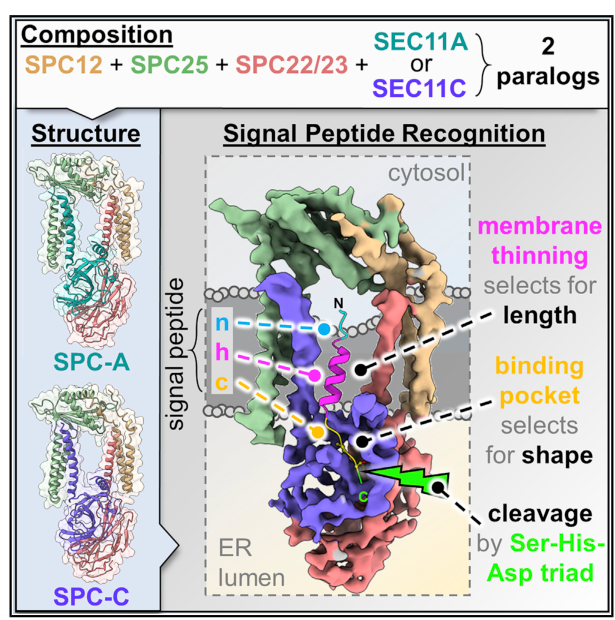

## Question

# Gene Research for Functional Annotation

## ⚠️ CRITICAL: Gene/Protein Identification Context

**BEFORE YOU BEGIN RESEARCH:** You MUST verify you are researching the CORRECT gene/protein. Gene symbols can be ambiguous, especially for less well-characterized genes from non-model organisms.

### Target Gene/Protein Identity (from UniProt):
- **UniProt Accession:** Q9Y6A9
- **Protein Description:** RecName: Full=Signal peptidase complex subunit 1; AltName: Full=Microsomal signal peptidase 12 kDa subunit; Short=SPase 12 kDa subunit;
- **Gene Information:** Name=SPCS1; Synonyms=SPC12; ORFNames=HSPC033;
- **Organism (full):** Homo sapiens (Human).
- **Protein Family:** Belongs to the SPCS1 family. .
- **Key Domains:** Spc1/SPCS1. (IPR009542); SPC12 (PF06645)

### MANDATORY VERIFICATION STEPS:

1. **Check if the gene symbol "SPCS1" matches the protein description above**
2. **Verify the organism is correct:** Homo sapiens (Human).
3. **Check if protein family/domains align with what you find in literature**
4. **If you find literature for a DIFFERENT gene with the same or similar symbol, STOP**

### If Gene Symbol is Ambiguous or You Cannot Find Relevant Literature:

**DO NOT PROCEED WITH RESEARCH ON A DIFFERENT GENE.** Instead:
- State clearly: "The gene symbol 'SPCS1' is ambiguous or literature is limited for this specific protein"
- Explain what you found (e.g., "Found extensive literature on a different gene with the same symbol in a different organism")
- Describe the protein based ONLY on the UniProt information provided above
- Suggest that the protein function can be inferred from domain/family information

### Research Target:

Please provide a comprehensive research report on the gene **SPCS1** (gene ID: SPCS1, UniProt: Q9Y6A9) in human.

The research report should be a detailed narrative explaining the function, biological processes, and localization of the gene product. Citations should be given for all claims.

You should prioritize authoritative reviews and primary scientific literature when conducting research. You can supplement
this with annotations you find in gene/protein databases, but these can be outdated or inaccurate.

We are specifically interested in the primary function of the gene - for enzymes, what reaction is catalyzed, and what is the substrate specificity? For transporters, what is the substrate? For structural proteins or adapters, what is the broader structural role? For signaling molecules, what is the role in the pathway.

We are interested in where in or outside the cell the gene product carries out its function.

We are also interested in the signaling or biochemical pathways in which the gene functions. We are less interested in broad pleiotropic effects, except where these elucidate the precise role.

Include evidence where possible. We are interested in both experimental evidence as well as inference from structure, evolution, or bioinformatic analysis. Precise studies should be prioritized over high-throughput, where available.

## Output

Question: You are an expert researcher providing comprehensive, well-cited information.

Provide detailed information focusing on:
1. Key concepts and definitions with current understanding
2. Recent developments and latest research (prioritize 2023-2024 sources)
3. Current applications and real-world implementations
4. Expert opinions and analysis from authoritative sources
5. Relevant statistics and data from recent studies

Format as a comprehensive research report with proper citations. Include URLs and publication dates where available.
Always prioritize recent, authoritative sources and provide specific citations for all major claims.

# Gene Research for Functional Annotation

## ⚠️ CRITICAL: Gene/Protein Identification Context

**BEFORE YOU BEGIN RESEARCH:** You MUST verify you are researching the CORRECT gene/protein. Gene symbols can be ambiguous, especially for less well-characterized genes from non-model organisms.

### Target Gene/Protein Identity (from UniProt):
- **UniProt Accession:** Q9Y6A9
- **Protein Description:** RecName: Full=Signal peptidase complex subunit 1; AltName: Full=Microsomal signal peptidase 12 kDa subunit; Short=SPase 12 kDa subunit;
- **Gene Information:** Name=SPCS1; Synonyms=SPC12; ORFNames=HSPC033;
- **Organism (full):** Homo sapiens (Human).
- **Protein Family:** Belongs to the SPCS1 family. .
- **Key Domains:** Spc1/SPCS1. (IPR009542); SPC12 (PF06645)

### MANDATORY VERIFICATION STEPS:

1. **Check if the gene symbol "SPCS1" matches the protein description above**
2. **Verify the organism is correct:** Homo sapiens (Human).
3. **Check if protein family/domains align with what you find in literature**
4. **If you find literature for a DIFFERENT gene with the same or similar symbol, STOP**

### If Gene Symbol is Ambiguous or You Cannot Find Relevant Literature:

**DO NOT PROCEED WITH RESEARCH ON A DIFFERENT GENE.** Instead:
- State clearly: "The gene symbol 'SPCS1' is ambiguous or literature is limited for this specific protein"
- Explain what you found (e.g., "Found extensive literature on a different gene with the same symbol in a different organism")
- Describe the protein based ONLY on the UniProt information provided above
- Suggest that the protein function can be inferred from domain/family information

### Research Target:

Please provide a comprehensive research report on the gene **SPCS1** (gene ID: SPCS1, UniProt: Q9Y6A9) in human.

The research report should be a detailed narrative explaining the function, biological processes, and localization of the gene product. Citations should be given for all claims.

You should prioritize authoritative reviews and primary scientific literature when conducting research. You can supplement
this with annotations you find in gene/protein databases, but these can be outdated or inaccurate.

We are specifically interested in the primary function of the gene - for enzymes, what reaction is catalyzed, and what is the substrate specificity? For transporters, what is the substrate? For structural proteins or adapters, what is the broader structural role? For signaling molecules, what is the role in the pathway.

We are interested in where in or outside the cell the gene product carries out its function.

We are also interested in the signaling or biochemical pathways in which the gene functions. We are less interested in broad pleiotropic effects, except where these elucidate the precise role.

Include evidence where possible. We are interested in both experimental evidence as well as inference from structure, evolution, or bioinformatic analysis. Precise studies should be prioritized over high-throughput, where available.

## Research Report: Human **SPCS1** (UniProt Q9Y6A9) Functional Annotation

### Executive summary
Signal peptidase complex subunit 1 (**SPCS1**, also called **SPC12**) is a non-catalytic, ER-resident membrane subunit of the human **signal peptidase complex (SPC)** that contributes to SPC architecture and substrate selectivity for signal peptide cleavage. Structural work indicates SPCS1 participates in forming a “transmembrane window” that thins the ER membrane near the catalytic site to discriminate short signal peptides from longer transmembrane helices. Beyond canonical signal peptide removal, recent work supports a SPCS1-dependent **quality-control** role in which SPC performs noncanonical cleavage of misfolded/unassembled membrane proteins and couples this to ER-associated degradation (ERAD). In infection biology, multiple genetic screens and mechanistic studies show SPCS1 is a strong **host dependency factor for Flaviviridae**, acting mainly at post-replication stages by enabling specific, suboptimal SPC cleavage events required for virion assembly.

### 1) Target verification (identity, synonyms, organism)
The gene symbol **SPCS1** in humans corresponds to the protein commonly referred to as **SPC12** (microsomal signal peptidase 12 kDa subunit), an accessory subunit of the ER signal peptidase complex (SPC). Structural and mechanistic studies of the *human* SPC explicitly list SPC12/SPCS1 among the four subunits of each SPC paralog, consistent with the UniProt identity provided (Q9Y6A9). (liaci2021structureofthe pages 1-3)

### 2) Key concepts and definitions (current understanding)
#### 2.1 Signal peptides and cleavage determinants
Signal peptides (SPs) classically comprise three regions: an N-terminal **basic n-region**, a **hydrophobic h-region** (often ~7–15 residues), and a more **polar c-region** (~3–7 residues) containing the cleavage site. Canonical cleavage typically prefers small, neutral residues at the −1 and −3 positions and disfavors proline near the cleavage site. (chung2024spc2modulatessubstrate pages 1-2, liaci2021structureofthe pages 1-3, liaci2021structureofthe pages 3-4)

#### 2.2 The eukaryotic signal peptidase complex (SPC)
The ER-resident SPC is a membrane-embedded serine protease complex that removes signal peptides from nascent secretory and membrane proteins as they enter the ER. In humans, SPC exists as two functional paralogs that differ in the proteolytic subunit (**SEC11A** vs **SEC11C**) but share the same accessory subunits (**SPCS1/SPC12**, **SPCS2/SPC25**, **SPCS3/SPC22/23**). (liaci2021structureofthe pages 1-3, liaci2021structureofthe pages 3-4)

Catalysis resides in SEC11A/C, where a **Ser–His–Asp catalytic triad** forms the active site. SPCS1 is not the catalytic subunit; rather, it contributes to the membrane-embedded architecture that positions substrates and shapes specificity. (liaci2021structureofthe pages 1-3, chung2024spc2modulatessubstrate pages 1-2)

### 3) Molecular function and mechanism of SPCS1
#### 3.1 Complex membership and ER localization
SPCS1 is an **ER-resident** membrane subunit of the human SPC and is present in both SPC paralogs: **SPC-A (SEC11A-containing)** and **SPC-C (SEC11C-containing)**. (liaci2021structureofthe pages 1-3, liaci2021structureofthe media 82841cab)

A key structural depiction of SPC subunit organization (including SPC12/SPCS1) is shown in Liaci et al. (Graphical Abstract and Figure 2). (liaci2021structureofthe media 82841cab, liaci2021structureofthe media ab792889)

#### 3.2 Structural role in the “transmembrane window” and membrane thinning
Cryo-EM and supporting simulations indicate that all SPC subunits collectively form a **transmembrane window** that locally **thins the ER membrane** adjacent to the luminal active site. This provides a physical mechanism to preferentially accommodate short SP h-regions while excluding longer transmembrane helices, thereby enforcing selectivity in signal peptide cleavage. SPCS1 contributes transmembrane elements to this architecture, supporting specificity without providing catalytic residues. (liaci2021structureofthe pages 1-3, liaci2021structureofthe media 82841cab)

#### 3.3 Accessory-subunit control of substrate selection and quality control (recent emphasis)
Recent mechanistic synthesis suggests that accessory subunits (including SPCS1) help ensure accurate substrate discrimination and cleavage site selection, rather than catalysis itself. In yeast genetics, accessory subunit perturbations compromise substrate discrimination and can increase incorrect transmembrane cleavage, supporting the general concept that SPCS1-like subunits contribute to quality control/fidelity. (chung2024spc2modulatessubstrate pages 1-2)

A major recent development is the proposal that the human SPC is not only a signal-peptide peptidase but also a **quality-control enzyme for membrane proteins**, with **SPCS1 acting as a recruitment factor/exosite** for “noncanonical” substrates. Specifically, proteome-scale analysis identified ~**1500** membrane proteins with putative cryptic SPC cleavage sites (reported as ~**18%** of the human membrane proteome; with ~**80%** of predicted sites after internal TMDs). Several substrates were experimentally validated (e.g., Cx32/Cx26/Cx30.3, PMP22, iRhom2, Hrd1). (zanotti2023characterisationofthe pages 49-53, zanotti2023characterisationofthe pages 1-8, zanotti2023characterisationofthe pages 34-38)

Functionally, SPCS1 knockout does **not** necessarily disrupt canonical signal sequence cleavage for tested substrates, but strongly reduces noncanonical cleavage of multiple membrane proteins; in one assay, prolactin secretion increased ~**4-fold** upon SPCS1 loss/depletion, consistent with SPCS1 acting as a specificity/selection factor rather than being required for general SPC catalysis. (zanotti2023characterisationofthe pages 34-38, zanotti2023characterisationofthe pages 53-57)

#### 3.4 Coupling to ERAD via Hrd1 (mechanistic linkage)
Evidence supports direct physical and functional coupling between SPC/SPCS1-mediated noncanonical cleavage and **ER-associated degradation (ERAD)**. Hrd1 (ERAD E3 ligase) binds SPC subunits (including SPCS1 and SEC11A) in co-immunoprecipitation experiments, and endogenous SPCS1 co-precipitates Hrd1. Functional turnover assays show that an SPC-derived fragment from a mutant membrane substrate decreases ~**50%** over 4 hours in wild-type cells but is completely stable in **Hrd1 knockout** cells, and inhibition of p97/VCP causes fragment accumulation—supporting a model in which SPC cleavage precedes Hrd1- and p97-dependent dislocation and degradation. (zanotti2023characterisationofthe pages 43-49)

### 4) Recent developments and latest research (prioritizing 2023–2024)
#### 4.1 2024: Accessory subunits and fidelity in SPC substrate selection
A 2024 Journal of Cell Biology study (in yeast, with direct reference to human cryo-EM) emphasizes that while Sec11 is catalytic, accessory subunits (Spc1/SPCS1, Spc2/SPCS2) contribute transmembrane helices and influence substrate selection and cleavage site identification, consistent with a conserved accessory-subunit contribution to fidelity rather than catalysis. (chung2024spc2modulatessubstrate pages 1-2)

#### 4.2 2023: SPC/SPCS1 as a membrane-protein quality-control enzyme
A 2023 body of work summarized in Zanotti’s thesis highlights a broadened functional role for SPC: SPCS1-dependent noncanonical cleavage of misfolded/unassembled membrane proteins, with proteome-scale estimates of candidate substrates and mechanistic coupling to ERAD/Hrd1. This “SPC-as-QC” framing is a major conceptual advance beyond the classic view of SPC as solely a cotranslational signal peptide remover. (zanotti2023characterisationofthe pages 49-53, zanotti2023characterisationofthe pages 43-49, zanotti2023characterisationofthe pages 34-38)

#### 4.3 2024: ER-centric host-directed antiviral strategies (contextualizing SPCS1/SPC)
A 2024 review in **npj Viruses** frames the ER as a central hub in flavivirus protein translocation and processing, and highlights host-directed intervention opportunities, including inhibitors of **signal peptidase cleavage** (e.g., cavinafungin) and ER translocation inhibitors (cotransins, apratoxins). While this review does not focus on SPCS1 specifically in the excerpted pages, it supports the importance of ER processing machinery targeted by viruses and as druggable biology. (verhaegen2024theendoplasmicreticulum pages 6-7, verhaegen2024theendoplasmicreticulum pages 13-14)

### 5) Current applications and real-world implementations
#### 5.1 Host-directed antiviral research targeting ER processing
**Flaviviridae dependence on SPCS1** is supported by genome-wide CRISPR screening and validation showing that SPCS1 loss results in markedly reduced yield for multiple flaviviruses (e.g., WNV, DENV, ZIKV, YFV, JEV) and HCV, with viral translation/replication often relatively preserved—consistent with a post-replication role (protein processing/assembly). (zhang2016acrisprscreen pages 1-2)

**Quantitative example (HCV):** In HCV systems, SPCS1 loss impaired E2–p7 processing and caused major assembly/titer defects, including reported **up to ~3-log reductions** in extracellular titers in one experimental system and abrogation/minimization of defects when E2 and p7 were separated by an EMCV IRES (bypassing the SPC junction processing constraint). (alzahrani2022spcs1dependente2p7processing pages 5-7)

**Mechanistic example (JEV):** SPCS1 regulates JEV propagation primarily at posttranslational processing/assembly and interacts with NS2B transmembrane domains; mutations in NS2B transmembrane regions weaken NS2B–SPCS1 interaction, supporting a direct virus–host interface. (ma2018hostfactorspcs1 pages 1-2, ma2018hostfactorspcs1 pages 2-5)

These findings position SPCS1/SPC biology as a foundation for host-directed antiviral strategies, although translation to clinic remains limited and safety constraints are expected because SPC is central to secretory pathway function. (zhang2016acrisprscreen pages 1-2, alzahrani2022spcs1dependente2p7processing pages 2-3)

#### 5.2 Proof-of-concept chemical modulation: cavinafungin and related ER-targeting agents
A 2024 review cites **cavinafungin** as a natural product that selectively interferes with Zika and dengue replication by inhibiting host signal peptidase activity, illustrating practical use of SPC pathway inhibition as an antiviral approach. (verhaegen2024theendoplasmicreticulum pages 13-14)

### 6) Expert opinions and authoritative synthesis
Across structural biology, cell biology, and virology, a convergent interpretation is that SPCS1 does not catalyze peptide bond cleavage but contributes to **(i)** SPC architecture that couples the catalytic site to the membrane interface and **(ii)** substrate discrimination, including specialized handling of “difficult” or suboptimal cleavage sites. Structural work frames specificity partly as a physical property of membrane thinning and transmembrane architecture, while more recent cell biology emphasizes an exosite-like recruitment role for noncanonical substrates in membrane-protein proteostasis. (liaci2021structureofthe pages 1-3, zanotti2023characterisationofthe pages 53-57, zanotti2023characterisationofthe pages 49-53)

In virology, multiple reviews of CRISPR screens highlight SPCS1 as an ER-localized dependency factor repeatedly rediscovered as essential for flavivirus replication/assembly and note that pharmacological modulation of ER translocation/processing machinery can inhibit DENV and ZIKV replication, supporting host-directed strategy rationale. (kanojia2022flavivirus–hostinteractionlandscape pages 7-9)

### 7) Relevant statistics and data highlights
- **Proteome-scale QC substrate prevalence:** ~**1500** membrane proteins with predicted cryptic SPC cleavage sites; ~**18%** of the human membrane proteome; ~**80%** of predicted sites after internal TMDs. (zanotti2023characterisationofthe pages 49-53)
- **ERAD coupling kinetics:** An SPC-derived fragment from a mutant membrane substrate decreases ~**50%** over 4 hours in wild-type cells but is **stable** in Hrd1 knockout cells (fragment turnover depends on Hrd1); p97/VCP inhibition increases fragment accumulation. (zanotti2023characterisationofthe pages 43-49)
- **HCV assembly effect sizes:** SPCS1 loss can produce **up to ~3-log reductions** in extracellular infectious titers in one HCV system, consistent with a strong post-replication assembly/processing phenotype linked to E2–p7 processing. (alzahrani2022spcs1dependente2p7processing pages 5-7)

### 8) Disease/phenotype associations (cautious interpretation)
OpenTargets aggregates association evidence linking SPCS1 to **dengue disease** (highest among returned examples), and lower-scoring associations to osteoarthritis, cataract, and bipolar disorder. These are association-level signals and do not by themselves establish causal mechanisms; the dengue link is biologically plausible given strong experimental evidence for SPCS1 as a flavivirus host factor. (OpenTargets Search: -SPCS1)

### 9) Visual evidence supporting SPC/SPCS1 structure
Liaci et al. provide a graphical abstract and a figure illustrating the architecture of human SPC paralogs, labeling SPC12/SPCS1 and showing the clamp-like arrangement and membrane thinning/transmembrane window concept. (liaci2021structureofthe media 82841cab, liaci2021structureofthe media ab792889)

### 10) Practical functional-annotation conclusion
**Primary function:** SPCS1 is a non-catalytic SPC subunit that enables **accurate and selective ER signal peptide cleavage** by shaping SPC membrane architecture and substrate discrimination, and it extends SPC function into **membrane-protein quality control** by promoting noncanonical cleavage of exposed transmembrane segments of misfolded/unassembled proteins and coupling this to ERAD. (liaci2021structureofthe pages 1-3, zanotti2023characterisationofthe pages 49-53, zanotti2023characterisationofthe pages 43-49)

**Localization:** ER membrane, within the SPC complex at the lumenal membrane interface. (liaci2021structureofthe pages 1-3, liaci2021structureofthe media 82841cab)

**Pathways:** Secretory pathway protein biogenesis (Sec61 translocation → SPC cleavage), proteostasis/ER stress response and ERAD coupling (Hrd1/p97). (chung2024spc2modulatessubstrate pages 1-2, zanotti2023characterisationofthe pages 43-49)

**High-impact application area:** Host-directed antiviral research for Flaviviridae, where SPCS1 controls processing/assembly steps dependent on suboptimal cleavage sites. (zhang2016acrisprscreen pages 1-2, alzahrani2022spcs1dependente2p7processing pages 5-7)

---

### Summary table
| Aspect | Key points | Evidence type | Representative sources (year and URL) |
|---|---|---|---|
| Identity / aliases | **SPCS1** is the human gene matching UniProt **Q9Y6A9**; protein name **signal peptidase complex subunit 1**, also called **SPC12 / microsomal signal peptidase 12 kDa subunit**. It belongs to the **SPCS1 family** and is a **non-catalytic accessory subunit** of the ER signal peptidase complex, not the peptidase active site itself. (liaci2021structureofthe pages 1-3) | Database-supported identity; structural/biochemical complex assignment | Liaci et al., 2021, https://doi.org/10.2139/ssrn.3778304; OpenTargets SPCS1 target entry/context, accessed via tool output (OpenTargets Search: -SPCS1) |
| Complex membership (SPC-A / SPC-C) | Human SPC exists as two paralogs: **SPC-A = SPCS1 + SPCS2 + SPCS3 + SEC11A** and **SPC-C = SPCS1 + SPCS2 + SPCS3 + SEC11C**. SPCS1 is therefore shared between both paralogs. Cryo-EM figures show SPC12/SPCS1 as one of the membrane subunits contributing to the clamp-like architecture around the catalytic core. (liaci2021structureofthe pages 1-3, liaci2021structureofthe pages 3-4, liaci2021structureofthe media 82841cab) | Cryo-EM structure; native complex proteomics | Liaci et al., 2021, https://doi.org/10.2139/ssrn.3778304 |
| Subcellular localization / topology | SPCS1 is **ER-resident** and membrane-embedded within the **endoplasmic reticulum signal peptidase complex** at the **ER membrane/lumenal interface**. It contributes transmembrane helices to the membrane-embedded body of SPC and helps shape the transmembrane window adjacent to the lumenal active site. (liaci2021structureofthe pages 1-3, chung2024spc2modulatessubstrate pages 1-2) | Structural biology; membrane topology inference | Liaci et al., 2021, https://doi.org/10.2139/ssrn.3778304; Gemmer & Förster, 2020, https://doi.org/10.1242/jcs.231340 |
| Molecular function | SPCS1 functions as an **accessory, non-proteolytic SPC subunit**. The **catalytic Ser-His-Asp triad** resides in **SEC11A/SEC11C**, whereas SPCS1 supports proper complex architecture, activity tuning, and substrate handling rather than catalysis. (liaci2021structureofthe pages 1-3, chung2024spc2modulatessubstrate pages 1-2) | Structure-function analysis; comparative genetics | Liaci et al., 2021, https://doi.org/10.2139/ssrn.3778304; Chung et al., 2024, https://doi.org/10.1083/jcb.202211035 |
| Mechanistic role: membrane thinning window | The SPC forms a **transmembrane window** that **locally thins the ER membrane**; all subunits, including SPCS1, contribute to this architecture. This membrane deformation helps the complex distinguish **short signal-peptide h-regions** from longer transmembrane helices, a major determinant of cleavage specificity. (liaci2021structureofthe pages 1-3, liaci2021structureofthe media 82841cab) | Cryo-EM; molecular dynamics; mechanistic modeling | Liaci et al., 2021, https://doi.org/10.2139/ssrn.3778304 |
| Mechanistic role: substrate selection / cleavage determinants | Canonical substrates have signal peptides with **n-, h-, and c-regions**; the c-region usually contains **small neutral residues at -1 and -3** and disfavors proline at +1. Accessory subunits including SPCS1 help enforce correct substrate and cleavage-site selection rather than direct catalysis. (chung2024spc2modulatessubstrate pages 1-2, liaci2021structureofthe pages 1-3, liaci2021structureofthe pages 3-4) | Structural comparison; biochemical rules; genetics | Chung et al., 2024, https://doi.org/10.1083/jcb.202211035; Liaci et al., 2021, https://doi.org/10.2139/ssrn.3778304 |
| Mechanistic role: noncanonical QC cleavage / exosite model | Beyond canonical signal peptide removal, SPCS1 is implicated in **SPC-dependent quality control of membrane proteins**. Work summarized in 2023 indicates SPCS1 may provide an **exosite/recruitment function** for **noncanonical substrates** with cryptic cleavage sites adjacent to type II-oriented TMDs; this enables cleavage of misfolded/unassembled membrane proteins and promotes their disposal. (zanotti2023characterisationofthe pages 57-60, zanotti2023characterisationofthe pages 53-57, zanotti2023characterisationofthe pages 1-8) | Cell biology; knockout phenotyping; proteomics; mechanistic inference | Zanotti, 2023, https://doi.org/10.11588/heidok.00033417 |
| Key pathways / partners | SPCS1 acts within the **secretory protein biogenesis pathway** downstream of ER targeting/translocation. SPC accessory subunits make transient/functional links with the **Sec61 translocon**, and SPCS1-dependent noncanonical cleavage is coupled to **ER-associated degradation (ERAD)**, particularly involving **Hrd1**. (chung2024spc2modulatessubstrate pages 1-2, zanotti2023characterisationofthe pages 53-57, zanotti2023characterisationofthe pages 57-60) | Structural cell biology; interaction/functional studies | Gemmer & Förster, 2020, https://doi.org/10.1242/jcs.231340; Chung et al., 2024, https://doi.org/10.1083/jcb.202211035; Zanotti, 2023, https://doi.org/10.11588/heidok.00033417 |
| Viral relevance | SPCS1 is a validated **host dependency factor for Flaviviridae**, with strong evidence from CRISPR/KO studies showing major defects in production of **WNV, DENV, ZIKV, YFV, JEV, and HCV** when SPCS1 is lost; viral translation/replication is often relatively preserved, indicating a **post-replication protein-processing/assembly role**. (zhang2016acrisprscreen pages 2-3, zhang2016acrisprscreen pages 1-2, rother2021signalpeptidasecomplex pages 1-2) | Genome-wide CRISPR; knockout/complementation; virology | Zhang et al., 2016, https://doi.org/10.1038/nature18625; Rother & Naumann, 2021, https://doi.org/10.1016/j.virusres.2021.198338; Verhaegen & Vermeire, 2024, https://doi.org/10.1038/s44298-024-00031-7 |
| Viral mechanism details | In **JEV**, SPCS1 interacts with **NS2B** transmembrane domains and supports **posttranslational processing/virion assembly** rather than entry or early RNA replication. In **HCV**, SPCS1 facilitates **E2-p7** processing; SPCS1 loss caused **near 1-log lower intracellular RNA at late times** and **up to ~3-log lower extracellular titers** for one HCV system, while an engineered E2-EMCV-p7 construct bypassed much of the defect. (alzahrani2022spcs1dependente2p7processing pages 5-7, ma2018hostfactorspcs1 pages 2-5, ma2018hostfactorspcs1 pages 1-2) | BiFC/interactome; knockout; rescue; immunoblot; infectivity assays | Ma et al., 2018, https://doi.org/10.1128/jvi.00197-18; Alzahrani et al., 2022, https://doi.org/10.1371/journal.ppat.1010310 |
| Disease / trait associations (OpenTargets) | OpenTargets reports disease/trait associations for **dengue disease** (strongest among returned examples in this query output), and lower-scoring associations with **osteoarthritis**, **hip osteoarthritis**, **cataract**, and **bipolar disorder**. These should be interpreted cautiously as **association-level evidence**, not necessarily direct mechanism. (OpenTargets Search: -SPCS1) | Target-disease association aggregation | OpenTargets platform result for SPCS1 via tool context (no single paper URL provided in tool output); association evidence includes literature mapped in OpenTargets context (OpenTargets Search: -SPCS1) |

*Table: This table summarizes the verified identity, ER signal peptidase complex role, mechanisms, pathway context, and virology relevance of human SPCS1 (UniProt Q9Y6A9). It is designed as a compact reference for functional annotation with context-linked citations.*

References

1. (liaci2021structureofthe pages 1-3): A. Manuel Liaci, Barbara Steigenberger, Sem Tamara, Paulo Cesar Telles de Souza, Mariska Gröllers-Mulderij, Patrick Ogrissek, Siewert Jan Marrink, Richard Scheltema, and Friedrich Förster. Structure of the human signal peptidase complex reveals the determinants for signal peptide cleavage. Jan 2021. URL: https://doi.org/10.2139/ssrn.3778304, doi:10.2139/ssrn.3778304. This article has 148 citations.

2. (chung2024spc2modulatessubstrate pages 1-2): Yeonji Chung, Chewon Yim, Gilberto P. Pereira, Sungjoon Son, Lisbeth R. Kjølbye, Lauren E. Mazurkiewicz, Amy M. Weeks, Friedrich Förster, Gunnar von Heijne, Paulo C.T. Souza, and Hyun Kim. Spc2 modulates substrate- and cleavage site-selection in the yeast signal peptidase complex. Journal of Cell Biology, Nov 2024. URL: https://doi.org/10.1083/jcb.202211035, doi:10.1083/jcb.202211035. This article has 4 citations and is from a highest quality peer-reviewed journal.

3. (liaci2021structureofthe pages 3-4): A. Manuel Liaci, Barbara Steigenberger, Sem Tamara, Paulo Cesar Telles de Souza, Mariska Gröllers-Mulderij, Patrick Ogrissek, Siewert Jan Marrink, Richard Scheltema, and Friedrich Förster. Structure of the human signal peptidase complex reveals the determinants for signal peptide cleavage. Jan 2021. URL: https://doi.org/10.2139/ssrn.3778304, doi:10.2139/ssrn.3778304. This article has 148 citations.

4. (liaci2021structureofthe media 82841cab): A. Manuel Liaci, Barbara Steigenberger, Sem Tamara, Paulo Cesar Telles de Souza, Mariska Gröllers-Mulderij, Patrick Ogrissek, Siewert Jan Marrink, Richard Scheltema, and Friedrich Förster. Structure of the human signal peptidase complex reveals the determinants for signal peptide cleavage. Jan 2021. URL: https://doi.org/10.2139/ssrn.3778304, doi:10.2139/ssrn.3778304. This article has 148 citations.

5. (liaci2021structureofthe media ab792889): A. Manuel Liaci, Barbara Steigenberger, Sem Tamara, Paulo Cesar Telles de Souza, Mariska Gröllers-Mulderij, Patrick Ogrissek, Siewert Jan Marrink, Richard Scheltema, and Friedrich Förster. Structure of the human signal peptidase complex reveals the determinants for signal peptide cleavage. Jan 2021. URL: https://doi.org/10.2139/ssrn.3778304, doi:10.2139/ssrn.3778304. This article has 148 citations.

6. (zanotti2023characterisationofthe pages 49-53): Andrea Zanotti. Characterisation of the human signal peptidase complex as a quality control enzyme for membrane proteins. Text, Jan 2023. URL: https://doi.org/10.11588/heidok.00033417, doi:10.11588/heidok.00033417. This article has 0 citations and is from a peer-reviewed journal.

7. (zanotti2023characterisationofthe pages 1-8): Andrea Zanotti. Characterisation of the human signal peptidase complex as a quality control enzyme for membrane proteins. Text, Jan 2023. URL: https://doi.org/10.11588/heidok.00033417, doi:10.11588/heidok.00033417. This article has 0 citations and is from a peer-reviewed journal.

8. (zanotti2023characterisationofthe pages 34-38): Andrea Zanotti. Characterisation of the human signal peptidase complex as a quality control enzyme for membrane proteins. Text, Jan 2023. URL: https://doi.org/10.11588/heidok.00033417, doi:10.11588/heidok.00033417. This article has 0 citations and is from a peer-reviewed journal.

9. (zanotti2023characterisationofthe pages 53-57): Andrea Zanotti. Characterisation of the human signal peptidase complex as a quality control enzyme for membrane proteins. Text, Jan 2023. URL: https://doi.org/10.11588/heidok.00033417, doi:10.11588/heidok.00033417. This article has 0 citations and is from a peer-reviewed journal.

10. (zanotti2023characterisationofthe pages 43-49): Andrea Zanotti. Characterisation of the human signal peptidase complex as a quality control enzyme for membrane proteins. Text, Jan 2023. URL: https://doi.org/10.11588/heidok.00033417, doi:10.11588/heidok.00033417. This article has 0 citations and is from a peer-reviewed journal.

11. (verhaegen2024theendoplasmicreticulum pages 6-7): Marijke Verhaegen and Kurt Vermeire. The endoplasmic reticulum (er): a crucial cellular hub in flavivirus infection and potential target site for antiviral interventions. npj Viruses, Jun 2024. URL: https://doi.org/10.1038/s44298-024-00031-7, doi:10.1038/s44298-024-00031-7. This article has 37 citations.

12. (verhaegen2024theendoplasmicreticulum pages 13-14): Marijke Verhaegen and Kurt Vermeire. The endoplasmic reticulum (er): a crucial cellular hub in flavivirus infection and potential target site for antiviral interventions. npj Viruses, Jun 2024. URL: https://doi.org/10.1038/s44298-024-00031-7, doi:10.1038/s44298-024-00031-7. This article has 37 citations.

13. (zhang2016acrisprscreen pages 1-2): Rong Zhang, Jonathan J. Miner, Matthew J. Gorman, Keiko Rausch, Holly Ramage, James P. White, Adam Zuiani, Ping Zhang, Estefania Fernandez, Qiang Zhang, Kimberly A. Dowd, Theodore C. Pierson, Sara Cherry, and Michael S. Diamond. A crispr screen defines a signal peptide processing pathway required by flaviviruses. Nature, 535:164-168, Jun 2016. URL: https://doi.org/10.1038/nature18625, doi:10.1038/nature18625. This article has 453 citations and is from a highest quality peer-reviewed journal.

14. (alzahrani2022spcs1dependente2p7processing pages 5-7): Nabeel Alzahrani, Ming-Jhan Wu, Carla F. Sousa, Olga V. Kalinina, Christoph Welsch, and MinKyung Yi. Spcs1-dependent e2-p7 processing determines hcv assembly efficiency. PLOS Pathogens, 18:e1010310, Feb 2022. URL: https://doi.org/10.1371/journal.ppat.1010310, doi:10.1371/journal.ppat.1010310. This article has 8 citations and is from a highest quality peer-reviewed journal.

15. (ma2018hostfactorspcs1 pages 1-2): Le Ma, Fang Li, Jing-Wei Zhang, Wei Li, Dong-Ming Zhao, Han Wang, Rong-Hong Hua, and Zhi-Gao Bu. Host factor spcs1 regulates the replication of japanese encephalitis virus through interactions with transmembrane domains of ns2b. Journal of Virology, Jun 2018. URL: https://doi.org/10.1128/jvi.00197-18, doi:10.1128/jvi.00197-18. This article has 35 citations and is from a domain leading peer-reviewed journal.

16. (ma2018hostfactorspcs1 pages 2-5): Le Ma, Fang Li, Jing-Wei Zhang, Wei Li, Dong-Ming Zhao, Han Wang, Rong-Hong Hua, and Zhi-Gao Bu. Host factor spcs1 regulates the replication of japanese encephalitis virus through interactions with transmembrane domains of ns2b. Journal of Virology, Jun 2018. URL: https://doi.org/10.1128/jvi.00197-18, doi:10.1128/jvi.00197-18. This article has 35 citations and is from a domain leading peer-reviewed journal.

17. (alzahrani2022spcs1dependente2p7processing pages 2-3): Nabeel Alzahrani, Ming-Jhan Wu, Carla F. Sousa, Olga V. Kalinina, Christoph Welsch, and MinKyung Yi. Spcs1-dependent e2-p7 processing determines hcv assembly efficiency. PLOS Pathogens, 18:e1010310, Feb 2022. URL: https://doi.org/10.1371/journal.ppat.1010310, doi:10.1371/journal.ppat.1010310. This article has 8 citations and is from a highest quality peer-reviewed journal.

18. (kanojia2022flavivirus–hostinteractionlandscape pages 7-9): Aditi Kanojia, Mansi Sharma, Rishad Shiraz, and Shashank Tripathi. Flavivirus–host interaction landscape visualized through genome-wide crispr screens. Viruses, 14:2164, Sep 2022. URL: https://doi.org/10.3390/v14102164, doi:10.3390/v14102164. This article has 12 citations.

19. (OpenTargets Search: -SPCS1): Open Targets Query (-SPCS1, 5 results). Buniello, A. et al. (2025). Open Targets Platform: facilitating therapeutic hypotheses building in drug discovery. Nucleic Acids Research.

20. (zanotti2023characterisationofthe pages 57-60): Andrea Zanotti. Characterisation of the human signal peptidase complex as a quality control enzyme for membrane proteins. Text, Jan 2023. URL: https://doi.org/10.11588/heidok.00033417, doi:10.11588/heidok.00033417. This article has 0 citations and is from a peer-reviewed journal.

21. (zhang2016acrisprscreen pages 2-3): Rong Zhang, Jonathan J. Miner, Matthew J. Gorman, Keiko Rausch, Holly Ramage, James P. White, Adam Zuiani, Ping Zhang, Estefania Fernandez, Qiang Zhang, Kimberly A. Dowd, Theodore C. Pierson, Sara Cherry, and Michael S. Diamond. A crispr screen defines a signal peptide processing pathway required by flaviviruses. Nature, 535:164-168, Jun 2016. URL: https://doi.org/10.1038/nature18625, doi:10.1038/nature18625. This article has 453 citations and is from a highest quality peer-reviewed journal.

22. (rother2021signalpeptidasecomplex pages 1-2): Marion Rother and Michael Naumann. Signal peptidase complex subunit 1 is an essential zika virus host factor in placental trophoblasts. Apr 2021. URL: https://doi.org/10.1016/j.virusres.2021.198338, doi:10.1016/j.virusres.2021.198338. This article has 4 citations and is from a peer-reviewed journal.

## Artifacts

- [Edison artifact artifact-00](SPCS1-deep-research-falcon_artifacts/artifact-00.md)

## Citations

1. liaci2021structureofthe pages 1-3
2. zanotti2023characterisationofthe pages 43-49
3. zhang2016acrisprscreen pages 1-2
4. verhaegen2024theendoplasmicreticulum pages 13-14
5. zanotti2023characterisationofthe pages 49-53
6. liaci2021structureofthe pages 3-4
7. zanotti2023characterisationofthe pages 1-8
8. zanotti2023characterisationofthe pages 34-38
9. zanotti2023characterisationofthe pages 53-57
10. verhaegen2024theendoplasmicreticulum pages 6-7
11. zanotti2023characterisationofthe pages 57-60
12. zhang2016acrisprscreen pages 2-3
13. rother2021signalpeptidasecomplex pages 1-2
14. https://doi.org/10.2139/ssrn.3778304;
15. https://doi.org/10.2139/ssrn.3778304
16. https://doi.org/10.1242/jcs.231340
17. https://doi.org/10.1083/jcb.202211035
18. https://doi.org/10.1083/jcb.202211035;
19. https://doi.org/10.11588/heidok.00033417
20. https://doi.org/10.1242/jcs.231340;
21. https://doi.org/10.1038/nature18625;
22. https://doi.org/10.1016/j.virusres.2021.198338;
23. https://doi.org/10.1038/s44298-024-00031-7
24. https://doi.org/10.1128/jvi.00197-18;
25. https://doi.org/10.1371/journal.ppat.1010310
26. https://doi.org/10.2139/ssrn.3778304,
27. https://doi.org/10.1083/jcb.202211035,
28. https://doi.org/10.11588/heidok.00033417,
29. https://doi.org/10.1038/s44298-024-00031-7,
30. https://doi.org/10.1038/nature18625,
31. https://doi.org/10.1371/journal.ppat.1010310,
32. https://doi.org/10.1128/jvi.00197-18,
33. https://doi.org/10.3390/v14102164,
34. https://doi.org/10.1016/j.virusres.2021.198338,