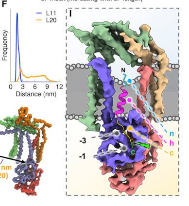

## Question

# Gene Research for Functional Annotation

## ⚠️ CRITICAL: Gene/Protein Identification Context

**BEFORE YOU BEGIN RESEARCH:** You MUST verify you are researching the CORRECT gene/protein. Gene symbols can be ambiguous, especially for less well-characterized genes from non-model organisms.

### Target Gene/Protein Identity (from UniProt):
- **UniProt Accession:** P61009
- **Protein Description:** RecName: Full=Signal peptidase complex subunit 3; AltName: Full=Microsomal signal peptidase 22/23 kDa subunit; Short=SPC22/23; Short=SPase 22/23 kDa subunit;
- **Gene Information:** Name=SPCS3; Synonyms=SPC22; ORFNames=UNQ1841/PRO3567;
- **Organism (full):** Homo sapiens (Human).
- **Protein Family:** Belongs to the SPCS3 family. .
- **Key Domains:** SPC3. (IPR007653); SPC22 (PF04573)

### MANDATORY VERIFICATION STEPS:

1. **Check if the gene symbol "SPCS3" matches the protein description above**
2. **Verify the organism is correct:** Homo sapiens (Human).
3. **Check if protein family/domains align with what you find in literature**
4. **If you find literature for a DIFFERENT gene with the same or similar symbol, STOP**

### If Gene Symbol is Ambiguous or You Cannot Find Relevant Literature:

**DO NOT PROCEED WITH RESEARCH ON A DIFFERENT GENE.** Instead:
- State clearly: "The gene symbol 'SPCS3' is ambiguous or literature is limited for this specific protein"
- Explain what you found (e.g., "Found extensive literature on a different gene with the same symbol in a different organism")
- Describe the protein based ONLY on the UniProt information provided above
- Suggest that the protein function can be inferred from domain/family information

### Research Target:

Please provide a comprehensive research report on the gene **SPCS3** (gene ID: SPCS3, UniProt: P61009) in human.

The research report should be a detailed narrative explaining the function, biological processes, and localization of the gene product. Citations should be given for all claims.

You should prioritize authoritative reviews and primary scientific literature when conducting research. You can supplement
this with annotations you find in gene/protein databases, but these can be outdated or inaccurate.

We are specifically interested in the primary function of the gene - for enzymes, what reaction is catalyzed, and what is the substrate specificity? For transporters, what is the substrate? For structural proteins or adapters, what is the broader structural role? For signaling molecules, what is the role in the pathway.

We are interested in where in or outside the cell the gene product carries out its function.

We are also interested in the signaling or biochemical pathways in which the gene functions. We are less interested in broad pleiotropic effects, except where these elucidate the precise role.

Include evidence where possible. We are interested in both experimental evidence as well as inference from structure, evolution, or bioinformatic analysis. Precise studies should be prioritized over high-throughput, where available.

## Output

Question: You are an expert researcher providing comprehensive, well-cited information.

Provide detailed information focusing on:
1. Key concepts and definitions with current understanding
2. Recent developments and latest research (prioritize 2023-2024 sources)
3. Current applications and real-world implementations
4. Expert opinions and analysis from authoritative sources
5. Relevant statistics and data from recent studies

Format as a comprehensive research report with proper citations. Include URLs and publication dates where available.
Always prioritize recent, authoritative sources and provide specific citations for all major claims.

# Gene Research for Functional Annotation

## ⚠️ CRITICAL: Gene/Protein Identification Context

**BEFORE YOU BEGIN RESEARCH:** You MUST verify you are researching the CORRECT gene/protein. Gene symbols can be ambiguous, especially for less well-characterized genes from non-model organisms.

### Target Gene/Protein Identity (from UniProt):
- **UniProt Accession:** P61009
- **Protein Description:** RecName: Full=Signal peptidase complex subunit 3; AltName: Full=Microsomal signal peptidase 22/23 kDa subunit; Short=SPC22/23; Short=SPase 22/23 kDa subunit;
- **Gene Information:** Name=SPCS3; Synonyms=SPC22; ORFNames=UNQ1841/PRO3567;
- **Organism (full):** Homo sapiens (Human).
- **Protein Family:** Belongs to the SPCS3 family. .
- **Key Domains:** SPC3. (IPR007653); SPC22 (PF04573)

### MANDATORY VERIFICATION STEPS:

1. **Check if the gene symbol "SPCS3" matches the protein description above**
2. **Verify the organism is correct:** Homo sapiens (Human).
3. **Check if protein family/domains align with what you find in literature**
4. **If you find literature for a DIFFERENT gene with the same or similar symbol, STOP**

### If Gene Symbol is Ambiguous or You Cannot Find Relevant Literature:

**DO NOT PROCEED WITH RESEARCH ON A DIFFERENT GENE.** Instead:
- State clearly: "The gene symbol 'SPCS3' is ambiguous or literature is limited for this specific protein"
- Explain what you found (e.g., "Found extensive literature on a different gene with the same symbol in a different organism")
- Describe the protein based ONLY on the UniProt information provided above
- Suggest that the protein function can be inferred from domain/family information

### Research Target:

Please provide a comprehensive research report on the gene **SPCS3** (gene ID: SPCS3, UniProt: P61009) in human.

The research report should be a detailed narrative explaining the function, biological processes, and localization of the gene product. Citations should be given for all claims.

You should prioritize authoritative reviews and primary scientific literature when conducting research. You can supplement
this with annotations you find in gene/protein databases, but these can be outdated or inaccurate.

We are specifically interested in the primary function of the gene - for enzymes, what reaction is catalyzed, and what is the substrate specificity? For transporters, what is the substrate? For structural proteins or adapters, what is the broader structural role? For signaling molecules, what is the role in the pathway.

We are interested in where in or outside the cell the gene product carries out its function.

We are also interested in the signaling or biochemical pathways in which the gene functions. We are less interested in broad pleiotropic effects, except where these elucidate the precise role.

Include evidence where possible. We are interested in both experimental evidence as well as inference from structure, evolution, or bioinformatic analysis. Precise studies should be prioritized over high-throughput, where available.

## Comprehensive Research Report: Human **SPCS3** (UniProt **P61009**) — Functional Annotation

### 0) Target identity verification (mandatory)
The requested target, human **SPCS3** (UniProt **P61009**), corresponds to **signal peptidase complex subunit 3**, historically termed **SPC22/23** (based on apparent molecular weight), and is a conserved subunit of the **endoplasmic reticulum (ER) signal peptidase complex (SPC)**. A key structural study explicitly maps **SPC22/23** to **SPCS3** and demonstrates that SPC22/23 is present in both human SPC paralogs (SPC-A and SPC-C) together with accessory subunits **SPC12 (SPCS1)** and **SPC25 (SPCS2)** plus a catalytic SEC11 protease paralog (**SEC11A** or **SEC11C**). This aligns with the UniProt description and avoids conflation with other “Spc3/Spc2” yeast proteins or SEC11 paralogs. (liaci2021structureofthe pages 1-3, liaci2021structureofthe pages 3-4)

### 1) Key concepts and definitions (current understanding)

#### 1.1 Signal peptides and signal peptidase complex (SPC)
Secretory and many membrane proteins are synthesized with an N-terminal **signal peptide (SP)** that targets the nascent chain to the ER. The **signal peptidase complex (SPC)** is an **ER membrane-resident serine protease** that removes signal peptides during ER translocation, enabling downstream folding, trafficking, secretion, and maturation of the cleaved protein product. (liaci2021structureofthe pages 1-3, zanotti2023characterisationofthe pages 53-57)

#### 1.2 What SPCS3 is (and is not)
SPCS3 is **not** itself the catalytic protease. Instead, it is an essential SPC subunit (SPC22/23) that **stabilizes and positions** the catalytic SEC11 subunit’s active site and contributes to the membrane-embedded architecture that determines substrate selectivity. (liaci2021structureofthe pages 8-10, liaci2021structureofthe pages 10-12)

### 2) Molecular function, biochemical role, and mechanism

#### 2.1 SPC composition and where SPCS3 fits
High-resolution structural proteomics and cryo-EM indicate the human SPC exists as **two paralogous hetero-tetramers**:
- **SPC-A:** SEC11A + SPC12 (SPCS1) + SPC25 (SPCS2) + **SPC22/23 (SPCS3)**
- **SPC-C:** SEC11C + SPC12 (SPCS1) + SPC25 (SPCS2) + **SPC22/23 (SPCS3)**
(liaci2021structureofthe pages 3-4, liaci2021structureofthe pages 1-3)

SPCS3 contributes a **luminal β-sandwich (ASF1-like) domain** that interacts with SEC11 and “embraces” its catalytic core, and it also provides transmembrane helices that participate in the complex’s membrane “window.” (liaci2021structureofthe pages 3-4)

#### 2.2 Cellular localization and topology
The SPC is embedded in the **ER membrane**, with catalytic processing occurring at the **luminal face**. SPCS3 contains a luminal domain and contributes to a transmembrane architecture that positions the catalytic site at the membrane interface. SPCS3 is reported to be **highly N-glycosylated** at Asp141 in the HEK293-derived sample described, consistent with luminal exposure. (liaci2021structureofthe pages 3-4, liaci2021structureofthe pages 10-12)

#### 2.3 Catalysis (what reaction is carried out?)
The SPC catalyzes **peptide-bond hydrolysis** at the signal peptide cleavage site of secretory-pathway precursors. Structural work defines the catalytic center (in SEC11A/C) as a **Ser–His–Asp triad**, and emphasizes that stabilization of this motif depends on the chaperone-like luminal domain of **SPC22/23 (SPCS3)**. Thus, SPCS3 is mechanistically essential for efficient catalysis even though the scissile-bond chemistry is executed by SEC11. (liaci2021structureofthe pages 8-10, liaci2021structureofthe pages 10-12)

#### 2.4 Substrate specificity: “TM window” and membrane thinning
A central mechanistic insight is that the SPC forms a lipid-filled **transmembrane (TM) window** collectively formed by all subunits. The TM helices of **SEC11A/C and SPCS3** form the **inner lining** of this window, which locally **thins the ER bilayer** above the c-region binding pocket. This creates a physical “molecular ruler” that strongly favors **short signal peptide hydrophobic segments (h-regions)** and excludes longer transmembrane helices. (liaci2021structureofthe pages 1-3, liaci2021structureofthe pages 10-12)

Quantitatively:
- Membrane thinning in simulations is ~**26%** on average. (liaci2021structureofthe pages 5-7)
- Mean SP h-region length reported is ~**11 residues**; eukaryotic SPC generally does not cleave SPs with h-regions longer than **18–20 aa**. (liaci2021structureofthe pages 10-12)

These findings explain how the SPC can process thousands of diverse substrates with conserved selectivity principles. (liaci2021structureofthe pages 10-12)

### 3) Recent developments and latest research (prioritizing 2023–2024)

#### 3.1 2023: SPC as a membrane-protein quality-control protease (noncanonical substrates)
A 2023 body of work argues that, beyond canonical co-translational SP removal, the SPC can act as a **post-translocational quality-control enzyme** for membrane proteins. In this model:
- The **catalytic core** is **SEC11A/C + SPCS3**.
- **SPCS1** functions as a recruitment/exosite factor for noncanonical membrane substrates, helping present cryptic cleavage sites from longer TMDs that would otherwise be excluded by membrane thinning.
- A proteome-wide analysis predicted ~**1,500** membrane proteins with putative internal “cryptic” SPC sites, and several multipass proteins were experimentally validated as noncanonical substrates (e.g., connexins, iRhom2, Hrd1), with links to ER stress adaptation and ERAD cooperation.
(zanotti2023characterisationofthe pages 53-57, zanotti2023characterisationofthe pages 57-60, zanotti2023characterisationofthe pages 1-8)

This reframes SPCS3 (as part of the catalytic core) as potentially relevant not only to protein biogenesis but also to **membrane proteostasis**.

#### 3.2 2024: SPCS3 as an antiviral restriction factor for chikungunya virus (CHIKV)
A 2024 EMBO Journal study discovered an unexpected role for SPCS3 in innate antiviral restriction in human macrophage models:
- **SPCS3 binds CHIKV glycoprotein E1** and shows **anti-CHIKV activity**.
- Importantly, **SPCS3 overexpression did not alter CHIKV poly-glycoprotein cleavage**, supporting a **peptidase-independent** antiviral mechanism.
- A positively selected viral residue (**E1-V220**) is critical for virion production in macrophages and modulates E1 interaction with SPCS3 (and eIF3k), consistent with host–virus evolutionary conflict.
(yao2024interactionofchikungunya pages 15-16)

A quantitative observation in primary macrophage infection reported a small, highly infected subset at **0.76%** of macrophages at 24 h post infection. (yao2024interactionofchikungunya pages 1-2)

#### 3.3 2024: SPC components in HCV assembly interactomes
A 2024 interaction-proteomics study of hepatitis C virus (HCV) assembly mapped host factors binding to viral structural proteins and noted that SPC components are engaged near these processes:
- SPC components co-precipitate with viral proteins, and **SPCS3** was reported as part of the **E2 accessory interactome**.
- The authors state that SPC subunits **SPCS1 and SPCS3** were previously recognized as important for flavivirus particle production and HCV.
- Reported transcript abundance values include **SPCS3 ~12.01 RPKM** (with SPCS2 ~34.69 RPKM) in their tabulated data.
(matthaei2024landscapeofproteinprotein pages 10-11, matthaei2024landscapeofproteinprotein pages 14-16)

#### 3.4 2024: ER host-directed antiviral strategies target the same pathway SPCS3 participates in
A 2024 npj Viruses review synthesizes host-directed approaches targeting ER translocation and signal peptide processing (a pathway in which SPCS3 is structurally essential):
- The review notes that the SPC contains accessory subunits **SPCS1–3** plus SEC11A/SEC11C and that **SPCS1 and SPCS3 were identified as essential flavivirus host factors** in genetic screens.
- It also lists potent inhibitors for **translocation** and **signal peptidase cleavage** (see Section 4).
(verhaegen2024theendoplasmicreticulum pages 4-5)

### 4) Current applications and real-world implementations

#### 4.1 Host-directed antivirals targeting ER translocation/SPC-mediated processing
The ER translocation/SPC step is increasingly treated as a druggable host dependency for flaviviruses:
- **Cotransin 8**: active at **0.5 µM** in Huh7 + C6/36 and **0.1–0.5 µM** in monocyte-derived dendritic cells (MDDCs). (verhaegen2024theendoplasmicreticulum pages 7-8)
- **PS3061**: active at **1 µM** in Huh7 + C6/36. (verhaegen2024theendoplasmicreticulum pages 7-8)
- **Apratoxin S4**: **IC50 0.003 µM** for DENV2 in Huh7.5 (table also indicates high selectivity index >300). (verhaegen2024theendoplasmicreticulum pages 7-8)
- **Cavinafungin** (signal peptidase inhibitor): reported DENV serotype IC50s in the **0.003–0.005 µM** range (see statistics below). (verhaegen2024theendoplasmicreticulum pages 7-8)

These represent real experimental implementations (cell-based antiviral assays, host-directed strategies) that exploit the same ER biogenesis machinery in which SPCS3 is a core structural component. (verhaegen2024theendoplasmicreticulum pages 4-5, verhaegen2024theendoplasmicreticulum pages 7-8)

#### 4.2 Virology/innate immunity implementation: antiviral restriction in macrophages
SPCS3’s anti-CHIKV activity has been shown in human macrophage model systems, suggesting that ER biogenesis proteins can have “moonlighting” antiviral roles independent of canonical enzymology. This provides an implementable framework for studying host restriction mechanisms and potentially designing viral attenuation strategies based on glycoprotein–host factor interaction surfaces. (yao2024interactionofchikungunya pages 15-16)

#### 4.3 Protein quality control implementation
The 2023 quality-control model proposes SPC-mediated cleavage as a surveillance mechanism for misfolded/misassembled membrane proteins, cooperating with ERAD. Although not yet a clinical implementation, it is a concrete experimental paradigm (substrate discovery + cleavage validation + ER stress phenotyping) that can be used to functionally annotate SPCS3 in membrane proteostasis contexts. (zanotti2023characterisationofthe pages 53-57, zanotti2023characterisationofthe pages 57-60)

### 5) Expert opinions and analysis (authoritative synthesis)

#### 5.1 Consensus mechanistic view (structural biology)
The structural interpretation is that SPC specificity is not primarily encoded by a large substrate-recognition surface on a single subunit, but by **membrane shaping** and the formation of a shared “TM window” that restricts which hydrophobic segments can access the active site. In this framework, SPCS3 is central because it helps form the inner lining of that window and stabilizes catalytic geometry through its luminal domain. (liaci2021structureofthe pages 1-3, liaci2021structureofthe pages 10-12)

#### 5.2 Emerging view (2023): dynamic roles of accessory subunits and expanded substrate space
The 2023 work argues the SPC may dynamically incorporate accessory elements to expand substrate range (canonical SPs vs cryptic TMD sites). Under this model, SPCS3 remains part of the catalytic core while SPCS1 provides a “recruitment/exosite” mechanism for challenging substrates that would otherwise be excluded by membrane thinning. (zanotti2023characterisationofthe pages 53-57, zanotti2023characterisationofthe pages 57-60)

#### 5.3 Implication for annotation
A functional annotation for human SPCS3 should therefore emphasize:
- ER membrane SPC subunit essential for catalytic competence (structural stabilization of SEC11).
- Contribution to TM-window architecture controlling substrate selectivity.
- Participation in broader ER pathways (viral polyprotein processing dependencies; potential post-translocational quality-control cleavage contexts).
(liaci2021structureofthe pages 8-10, liaci2021structureofthe pages 10-12, verhaegen2024theendoplasmicreticulum pages 4-5)

### 6) Key statistics and quantitative data (recent and/or mechanistically defining)
- **Membrane thinning** induced by SPC TM window: ~**26%** (simulation result). (liaci2021structureofthe pages 5-7)
- **TM window width**: ~**15 Å**. (liaci2021structureofthe pages 1-3)
- **Signal peptide h-region length**: mean ~**11 residues**; SPC generally cannot cleave SPs with h-regions **>18–20 aa**. (liaci2021structureofthe pages 10-12)
- **SPCS3 luminal glycosylation**: Asp141 site ~**98%** glycosylated in HEK293 sample described. (liaci2021structureofthe pages 3-4)
- **CHIKV infection heterogeneity**: **0.76%** of primary macrophages reported as highly infected at 24 hpi (study-specific). (yao2024interactionofchikungunya pages 1-2)
- **HCV dataset expression metric**: SPCS3 transcript abundance reported as **~12.01 RPKM** (with SPCS2 ~34.69 RPKM) in the study’s table. (matthaei2024landscapeofproteinprotein pages 14-16)
- **Host-directed antiviral potencies (DENV; 2024 review table):**
  - Cavinafungin IC50: **0.004 µM (DENV1), 0.005 µM (DENV2), 0.003 µM (DENV3), 0.003 µM (DENV4)**. (verhaegen2024theendoplasmicreticulum pages 7-8)
  - Apratoxin S4 IC50: **0.003 µM (DENV2; Huh7.5)**. (verhaegen2024theendoplasmicreticulum pages 7-8)
  - Cotransin 8: active at **0.5 µM** (Huh7 + C6/36) and **0.1–0.5 µM** (MDDCs). (verhaegen2024theendoplasmicreticulum pages 7-8)

### 7) Embedded evidence summary table
The following table consolidates identity, mechanistic function, recent (2023–2024) research, applications, and quantitative evidence.

| Topic | Summary | Quantitative data | Best citation IDs |
|---|---|---:|---|
| Identity / verified target | **SPCS3** in human corresponds to **signal peptidase complex subunit 3**, also called **SPC22/23**; it is an accessory/non-proteolytic SPC subunit present in both human SPC paralogs with SEC11A or SEC11C. | Human SPC resolved as ~**84 kDa** hetero-tetrameric complex; two paralogs: **SPC-A** and **SPC-C**. | (liaci2021structureofthe pages 1-3, liaci2021structureofthe pages 3-4) |
| Core function in SPC | SPCS3 forms part of the functional core of the ER signal peptidase complex, supporting cleavage of N-terminal signal peptides from secretory and membrane protein precursors by stabilizing and positioning the SEC11 catalytic center rather than acting as the catalytic serine protease itself. | Human secretome/translocome estimate discussed as **>3,000** signal peptides requiring SPC processing. | (liaci2021structureofthe pages 1-3, liaci2021structureofthe pages 8-10, zanotti2023characterisationofthe pages 53-57) |
| Localization / topology | ER-resident membrane complex; SPCS3 has a **luminal beta-sandwich (ASF1-like)** domain that embraces SEC11 and TM helices that contribute to the SPC transmembrane window at the **luminal membrane interface**. | SPCS3 is highly **N-glycosylated at Asp141 (~98%)** in the HEK293-derived sample described. | (liaci2021structureofthe pages 3-4, liaci2021structureofthe pages 10-12) |
| Mechanistic insight: TM window and membrane thinning | All SPC subunits collectively form a lipid-filled **TM window**; inner lining includes essential subunits **SEC11A/C and SPCS3**. Local ER bilayer thinning near the active site acts as a physical selector for signal peptides. | Average local membrane thinning in simulations: **~26%**; TM window width: **~15 Å**. | (liaci2021structureofthe pages 1-3, liaci2021structureofthe pages 5-7, liaci2021structureofthe pages 10-12) |
| Mechanistic insight: signal peptide selectivity | SPC specificity is explained by a molecular-ruler mechanism: short signal-peptide h-regions can enter the thinned TM window and access the c-region pocket, whereas longer TM helices are excluded. | Mean SP h-region length: **11 residues**; SPC generally cannot cleave h-regions **>18–20 aa**. | (liaci2021structureofthe pages 5-7, liaci2021structureofthe pages 10-12) |
| 2023 advance: membrane-protein quality control model | A 2023 characterization proposed that SPC also performs **noncanonical, post-translocational quality-control cleavage** of multipass membrane proteins with exposed cryptic sites. In this model, **SPCS1** is the key recruitment or exosite factor, while **SEC11A/C + SPCS3** form the catalytic core. | Proteome-wide prediction of **~1,500** membrane proteins with cryptic SPC cleavage sites; validated substrates included connexins, iRhom2, and Hrd1. | (zanotti2023characterisationofthe pages 53-57, zanotti2023characterisationofthe pages 57-60, zanotti2023characterisationofthe pages 1-8) |
| 2024 finding: CHIKV interaction / host restriction | In human macrophage models, **SPCS3** was identified as a **CHIKV E1-binding host factor** with **anti-CHIKV** activity; overexpression did not alter CHIKV poly-glycoprotein cleavage, implying a **peptidase-independent** antiviral role. E1 residue **V220** helps the virus evade SPCS3 and eIF3k restriction. | Highly infected primary macrophage subset reported at **0.76%** at 24 h.p.i.; siRNA comparisons involving SPCS3 reached **p < 0.0001** in knockdown validation context. | (yao2024interactionofchikungunya pages 15-16, yao2024interactionofchikungunya pages 28-31, yao2024interactionofchikungunya pages 1-2) |
| 2024 finding: HCV and flavivirus interactomes | 2024 HCV interactomics placed SPC components near viral envelope and assembly proteins; **SPCS3** appeared in the **E2 accessory interactome**, while prior work cited in the paper linked **SPCS1/SPCS3** to flavivirus and HCV particle production. | SPCS3 transcript abundance in the HCV study table: **RPKM ~12.01**; SPCS2: **~34.69**; interactome statistics included **n = 3–4** for normalized IBAQ boxplots. | (matthaei2024landscapeofproteinprotein pages 10-11, matthaei2024landscapeofproteinprotein pages 11-14, matthaei2024landscapeofproteinprotein pages 14-16) |
| Translational relevance: ER-targeted antivirals affecting SPC-dependent biology | Recent flavivirus review highlights host-directed inhibition of ER translocation and signal peptide processing as a practical application area; although not SPCS3-selective, these compounds exploit the same ER biogenesis pathway in which SPCS3 functions. | **Cavinafungin** IC50s: **0.004 µM** (DENV1), **0.005 µM** (DENV2), **0.003 µM** (DENV3), **0.003 µM** (DENV4); **Apratoxin S4**: **0.003 µM** (DENV2, Huh7.5); **Cotransin 8** active at **0.5 µM** (Huh7 + C6/36) and **0.1–0.5 µM** (MDDCs); **PS3061** active at **1 µM**. | (verhaegen2024theendoplasmicreticulum pages 4-5, verhaegen2024theendoplasmicreticulum pages 7-8, verhaegen2024theendoplasmicreticulum pages 6-7) |

*Table: This table condenses the most important validated information about human SPCS3/SPC22/23, including identity, ER localization, signal peptidase mechanism, recent 2023-2024 functional findings, and quantitative values relevant to annotation and translational interpretation.*

### 8) Visual evidence (structural localization of SPCS3 within SPC)
Cropped figure panels from Liaci et al. show SPC22/23 (SPCS3) positioned adjacent to SEC11 within the luminal body and the membrane-thinning “TM window” model used to explain signal peptide selectivity. (liaci2021structureofthe media 95c0a474, liaci2021structureofthe media d2d5d0ad)

### 9) References with URLs and publication dates (from retrieved sources)
- Liaci AM et al. *Structure of the Human Signal Peptidase Complex Reveals the Determinants for Signal Peptide Cleavage*. 2021-01. https://doi.org/10.2139/ssrn.3778304 (liaci2021structureofthe pages 1-3)
- Zanotti A. *Characterisation of the human signal peptidase complex as a quality control enzyme for membrane proteins*. 2023-01. https://doi.org/10.11588/heidok.00033417 (zanotti2023characterisationofthe pages 53-57)
- Yao Z et al. *Interaction of chikungunya virus glycoproteins with macrophage factors controls virion production*. 2024-09. https://doi.org/10.1038/s44318-024-00193-3 (yao2024interactionofchikungunya pages 1-2)
- Matthaei A et al. *Landscape of protein-protein interactions during hepatitis C virus assembly and release*. 2024-02. https://doi.org/10.1128/spectrum.02562-22 (matthaei2024landscapeofproteinprotein pages 10-11)
- Verhaegen M, Vermeire K. *The endoplasmic reticulum (ER): a crucial cellular hub in flavivirus infection and potential target site for antiviral interventions*. 2024-06. https://doi.org/10.1038/s44298-024-00031-7 (verhaegen2024theendoplasmicreticulum pages 4-5)

References

1. (liaci2021structureofthe pages 1-3): A. Manuel Liaci, Barbara Steigenberger, Sem Tamara, Paulo Cesar Telles de Souza, Mariska Gröllers-Mulderij, Patrick Ogrissek, Siewert Jan Marrink, Richard Scheltema, and Friedrich Förster. Structure of the human signal peptidase complex reveals the determinants for signal peptide cleavage. Jan 2021. URL: https://doi.org/10.2139/ssrn.3778304, doi:10.2139/ssrn.3778304. This article has 148 citations.

2. (liaci2021structureofthe pages 3-4): A. Manuel Liaci, Barbara Steigenberger, Sem Tamara, Paulo Cesar Telles de Souza, Mariska Gröllers-Mulderij, Patrick Ogrissek, Siewert Jan Marrink, Richard Scheltema, and Friedrich Förster. Structure of the human signal peptidase complex reveals the determinants for signal peptide cleavage. Jan 2021. URL: https://doi.org/10.2139/ssrn.3778304, doi:10.2139/ssrn.3778304. This article has 148 citations.

3. (zanotti2023characterisationofthe pages 53-57): Andrea Zanotti. Characterisation of the human signal peptidase complex as a quality control enzyme for membrane proteins. Text, Jan 2023. URL: https://doi.org/10.11588/heidok.00033417, doi:10.11588/heidok.00033417. This article has 0 citations and is from a peer-reviewed journal.

4. (liaci2021structureofthe pages 8-10): A. Manuel Liaci, Barbara Steigenberger, Sem Tamara, Paulo Cesar Telles de Souza, Mariska Gröllers-Mulderij, Patrick Ogrissek, Siewert Jan Marrink, Richard Scheltema, and Friedrich Förster. Structure of the human signal peptidase complex reveals the determinants for signal peptide cleavage. Jan 2021. URL: https://doi.org/10.2139/ssrn.3778304, doi:10.2139/ssrn.3778304. This article has 148 citations.

5. (liaci2021structureofthe pages 10-12): A. Manuel Liaci, Barbara Steigenberger, Sem Tamara, Paulo Cesar Telles de Souza, Mariska Gröllers-Mulderij, Patrick Ogrissek, Siewert Jan Marrink, Richard Scheltema, and Friedrich Förster. Structure of the human signal peptidase complex reveals the determinants for signal peptide cleavage. Jan 2021. URL: https://doi.org/10.2139/ssrn.3778304, doi:10.2139/ssrn.3778304. This article has 148 citations.

6. (liaci2021structureofthe pages 5-7): A. Manuel Liaci, Barbara Steigenberger, Sem Tamara, Paulo Cesar Telles de Souza, Mariska Gröllers-Mulderij, Patrick Ogrissek, Siewert Jan Marrink, Richard Scheltema, and Friedrich Förster. Structure of the human signal peptidase complex reveals the determinants for signal peptide cleavage. Jan 2021. URL: https://doi.org/10.2139/ssrn.3778304, doi:10.2139/ssrn.3778304. This article has 148 citations.

7. (zanotti2023characterisationofthe pages 57-60): Andrea Zanotti. Characterisation of the human signal peptidase complex as a quality control enzyme for membrane proteins. Text, Jan 2023. URL: https://doi.org/10.11588/heidok.00033417, doi:10.11588/heidok.00033417. This article has 0 citations and is from a peer-reviewed journal.

8. (zanotti2023characterisationofthe pages 1-8): Andrea Zanotti. Characterisation of the human signal peptidase complex as a quality control enzyme for membrane proteins. Text, Jan 2023. URL: https://doi.org/10.11588/heidok.00033417, doi:10.11588/heidok.00033417. This article has 0 citations and is from a peer-reviewed journal.

9. (yao2024interactionofchikungunya pages 15-16): Zhenlan Yao, Sangeetha Ramachandran, Serina Huang, Erin Kim, Yasaman Jami-Alahmadi, Prashant Kaushal, Mehdi Bouhaddou, James A Wohlschlegel, and Melody MH Li. Interaction of chikungunya virus glycoproteins with macrophage factors controls virion production. The EMBO Journal, 43:4625-4655, Sep 2024. URL: https://doi.org/10.1038/s44318-024-00193-3, doi:10.1038/s44318-024-00193-3. This article has 6 citations.

10. (yao2024interactionofchikungunya pages 1-2): Zhenlan Yao, Sangeetha Ramachandran, Serina Huang, Erin Kim, Yasaman Jami-Alahmadi, Prashant Kaushal, Mehdi Bouhaddou, James A Wohlschlegel, and Melody MH Li. Interaction of chikungunya virus glycoproteins with macrophage factors controls virion production. The EMBO Journal, 43:4625-4655, Sep 2024. URL: https://doi.org/10.1038/s44318-024-00193-3, doi:10.1038/s44318-024-00193-3. This article has 6 citations.

11. (matthaei2024landscapeofproteinprotein pages 10-11): Alina Matthaei, Sebastian Joecks, Annika Frauenstein, Janina Bruening, Dorothea Bankwitz, Martina Friesland, Gisa Gerold, Gabrielle Vieyres, Lars Kaderali, Felix Meissner, and Thomas Pietschmann. Landscape of protein-protein interactions during hepatitis c virus assembly and release. Feb 2024. URL: https://doi.org/10.1128/spectrum.02562-22, doi:10.1128/spectrum.02562-22. This article has 9 citations and is from a domain leading peer-reviewed journal.

12. (matthaei2024landscapeofproteinprotein pages 14-16): Alina Matthaei, Sebastian Joecks, Annika Frauenstein, Janina Bruening, Dorothea Bankwitz, Martina Friesland, Gisa Gerold, Gabrielle Vieyres, Lars Kaderali, Felix Meissner, and Thomas Pietschmann. Landscape of protein-protein interactions during hepatitis c virus assembly and release. Feb 2024. URL: https://doi.org/10.1128/spectrum.02562-22, doi:10.1128/spectrum.02562-22. This article has 9 citations and is from a domain leading peer-reviewed journal.

13. (verhaegen2024theendoplasmicreticulum pages 4-5): Marijke Verhaegen and Kurt Vermeire. The endoplasmic reticulum (er): a crucial cellular hub in flavivirus infection and potential target site for antiviral interventions. npj Viruses, Jun 2024. URL: https://doi.org/10.1038/s44298-024-00031-7, doi:10.1038/s44298-024-00031-7. This article has 37 citations.

14. (verhaegen2024theendoplasmicreticulum pages 7-8): Marijke Verhaegen and Kurt Vermeire. The endoplasmic reticulum (er): a crucial cellular hub in flavivirus infection and potential target site for antiviral interventions. npj Viruses, Jun 2024. URL: https://doi.org/10.1038/s44298-024-00031-7, doi:10.1038/s44298-024-00031-7. This article has 37 citations.

15. (yao2024interactionofchikungunya pages 28-31): Zhenlan Yao, Sangeetha Ramachandran, Serina Huang, Erin Kim, Yasaman Jami-Alahmadi, Prashant Kaushal, Mehdi Bouhaddou, James A Wohlschlegel, and Melody MH Li. Interaction of chikungunya virus glycoproteins with macrophage factors controls virion production. The EMBO Journal, 43:4625-4655, Sep 2024. URL: https://doi.org/10.1038/s44318-024-00193-3, doi:10.1038/s44318-024-00193-3. This article has 6 citations.

16. (matthaei2024landscapeofproteinprotein pages 11-14): Alina Matthaei, Sebastian Joecks, Annika Frauenstein, Janina Bruening, Dorothea Bankwitz, Martina Friesland, Gisa Gerold, Gabrielle Vieyres, Lars Kaderali, Felix Meissner, and Thomas Pietschmann. Landscape of protein-protein interactions during hepatitis c virus assembly and release. Feb 2024. URL: https://doi.org/10.1128/spectrum.02562-22, doi:10.1128/spectrum.02562-22. This article has 9 citations and is from a domain leading peer-reviewed journal.

17. (verhaegen2024theendoplasmicreticulum pages 6-7): Marijke Verhaegen and Kurt Vermeire. The endoplasmic reticulum (er): a crucial cellular hub in flavivirus infection and potential target site for antiviral interventions. npj Viruses, Jun 2024. URL: https://doi.org/10.1038/s44298-024-00031-7, doi:10.1038/s44298-024-00031-7. This article has 37 citations.

18. (liaci2021structureofthe media 95c0a474): A. Manuel Liaci, Barbara Steigenberger, Sem Tamara, Paulo Cesar Telles de Souza, Mariska Gröllers-Mulderij, Patrick Ogrissek, Siewert Jan Marrink, Richard Scheltema, and Friedrich Förster. Structure of the human signal peptidase complex reveals the determinants for signal peptide cleavage. Jan 2021. URL: https://doi.org/10.2139/ssrn.3778304, doi:10.2139/ssrn.3778304. This article has 148 citations.

19. (liaci2021structureofthe media d2d5d0ad): A. Manuel Liaci, Barbara Steigenberger, Sem Tamara, Paulo Cesar Telles de Souza, Mariska Gröllers-Mulderij, Patrick Ogrissek, Siewert Jan Marrink, Richard Scheltema, and Friedrich Förster. Structure of the human signal peptidase complex reveals the determinants for signal peptide cleavage. Jan 2021. URL: https://doi.org/10.2139/ssrn.3778304, doi:10.2139/ssrn.3778304. This article has 148 citations.

## Artifacts

- [Edison artifact artifact-00](SPCS3-deep-research-falcon_artifacts/artifact-00.md)

## Citations

1. liaci2021structureofthe pages 3-4
2. liaci2021structureofthe pages 5-7
3. liaci2021structureofthe pages 10-12
4. yao2024interactionofchikungunya pages 15-16
5. yao2024interactionofchikungunya pages 1-2
6. verhaegen2024theendoplasmicreticulum pages 4-5
7. verhaegen2024theendoplasmicreticulum pages 7-8
8. liaci2021structureofthe pages 1-3
9. matthaei2024landscapeofproteinprotein pages 14-16
10. zanotti2023characterisationofthe pages 53-57
11. matthaei2024landscapeofproteinprotein pages 10-11
12. liaci2021structureofthe pages 8-10
13. zanotti2023characterisationofthe pages 57-60
14. zanotti2023characterisationofthe pages 1-8
15. yao2024interactionofchikungunya pages 28-31
16. matthaei2024landscapeofproteinprotein pages 11-14
17. verhaegen2024theendoplasmicreticulum pages 6-7
18. https://doi.org/10.2139/ssrn.3778304
19. https://doi.org/10.11588/heidok.00033417
20. https://doi.org/10.1038/s44318-024-00193-3
21. https://doi.org/10.1128/spectrum.02562-22
22. https://doi.org/10.1038/s44298-024-00031-7
23. https://doi.org/10.2139/ssrn.3778304,
24. https://doi.org/10.11588/heidok.00033417,
25. https://doi.org/10.1038/s44318-024-00193-3,
26. https://doi.org/10.1128/spectrum.02562-22,
27. https://doi.org/10.1038/s44298-024-00031-7,