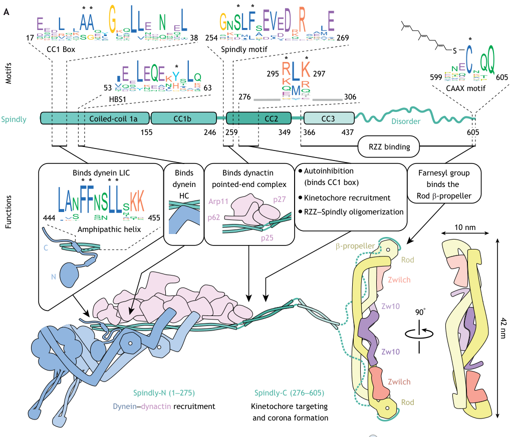

## Question

# Gene Research for Functional Annotation

## ⚠️ CRITICAL: Gene/Protein Identification Context

**BEFORE YOU BEGIN RESEARCH:** You MUST verify you are researching the CORRECT gene/protein. Gene symbols can be ambiguous, especially for less well-characterized genes from non-model organisms.

### Target Gene/Protein Identity (from UniProt):
- **UniProt Accession:** Q96EA4
- **Protein Description:** RecName: Full=Protein Spindly {ECO:0000255|HAMAP-Rule:MF_03041}; Short=hSpindly; AltName: Full=Arsenite-related gene 1 protein; AltName: Full=Coiled-coil domain-containing protein 99 {ECO:0000255|HAMAP-Rule:MF_03041}; AltName: Full=Rhabdomyosarcoma antigen MU-RMS-40.4A; AltName: Full=Spindle apparatus coiled-coil domain-containing protein 1 {ECO:0000255|HAMAP-Rule:MF_03041};
- **Gene Information:** Name=SPDL1 {ECO:0000255|HAMAP-Rule:MF_03041}; Synonyms=CCDC99 {ECO:0000255|HAMAP-Rule:MF_03041};
- **Organism (full):** Homo sapiens (Human).
- **Protein Family:** Belongs to the Spindly family. {ECO:0000255|HAMAP-
- **Key Domains:** SPDLY_chordates. (IPR028593); Spindly/BICDR_Dynein_Adapter. (IPR051149)

### MANDATORY VERIFICATION STEPS:

1. **Check if the gene symbol "SPDL1" matches the protein description above**
2. **Verify the organism is correct:** Homo sapiens (Human).
3. **Check if protein family/domains align with what you find in literature**
4. **If you find literature for a DIFFERENT gene with the same or similar symbol, STOP**

### If Gene Symbol is Ambiguous or You Cannot Find Relevant Literature:

**DO NOT PROCEED WITH RESEARCH ON A DIFFERENT GENE.** Instead:
- State clearly: "The gene symbol 'SPDL1' is ambiguous or literature is limited for this specific protein"
- Explain what you found (e.g., "Found extensive literature on a different gene with the same symbol in a different organism")
- Describe the protein based ONLY on the UniProt information provided above
- Suggest that the protein function can be inferred from domain/family information

### Research Target:

Please provide a comprehensive research report on the gene **SPDL1** (gene ID: SPDL1, UniProt: Q96EA4) in human.

The research report should be a detailed narrative explaining the function, biological processes, and localization of the gene product. Citations should be given for all claims.

You should prioritize authoritative reviews and primary scientific literature when conducting research. You can supplement
this with annotations you find in gene/protein databases, but these can be outdated or inaccurate.

We are specifically interested in the primary function of the gene - for enzymes, what reaction is catalyzed, and what is the substrate specificity? For transporters, what is the substrate? For structural proteins or adapters, what is the broader structural role? For signaling molecules, what is the role in the pathway.

We are interested in where in or outside the cell the gene product carries out its function.

We are also interested in the signaling or biochemical pathways in which the gene functions. We are less interested in broad pleiotropic effects, except where these elucidate the precise role.

Include evidence where possible. We are interested in both experimental evidence as well as inference from structure, evolution, or bioinformatic analysis. Precise studies should be prioritized over high-throughput, where available.

## Output

Question: You are an expert researcher providing comprehensive, well-cited information.

Provide detailed information focusing on:
1. Key concepts and definitions with current understanding
2. Recent developments and latest research (prioritize 2023-2024 sources)
3. Current applications and real-world implementations
4. Expert opinions and analysis from authoritative sources
5. Relevant statistics and data from recent studies

Format as a comprehensive research report with proper citations. Include URLs and publication dates where available.
Always prioritize recent, authoritative sources and provide specific citations for all major claims.

# Gene Research for Functional Annotation

## ⚠️ CRITICAL: Gene/Protein Identification Context

**BEFORE YOU BEGIN RESEARCH:** You MUST verify you are researching the CORRECT gene/protein. Gene symbols can be ambiguous, especially for less well-characterized genes from non-model organisms.

### Target Gene/Protein Identity (from UniProt):
- **UniProt Accession:** Q96EA4
- **Protein Description:** RecName: Full=Protein Spindly {ECO:0000255|HAMAP-Rule:MF_03041}; Short=hSpindly; AltName: Full=Arsenite-related gene 1 protein; AltName: Full=Coiled-coil domain-containing protein 99 {ECO:0000255|HAMAP-Rule:MF_03041}; AltName: Full=Rhabdomyosarcoma antigen MU-RMS-40.4A; AltName: Full=Spindle apparatus coiled-coil domain-containing protein 1 {ECO:0000255|HAMAP-Rule:MF_03041};
- **Gene Information:** Name=SPDL1 {ECO:0000255|HAMAP-Rule:MF_03041}; Synonyms=CCDC99 {ECO:0000255|HAMAP-Rule:MF_03041};
- **Organism (full):** Homo sapiens (Human).
- **Protein Family:** Belongs to the Spindly family. {ECO:0000255|HAMAP-
- **Key Domains:** SPDLY_chordates. (IPR028593); Spindly/BICDR_Dynein_Adapter. (IPR051149)

### MANDATORY VERIFICATION STEPS:

1. **Check if the gene symbol "SPDL1" matches the protein description above**
2. **Verify the organism is correct:** Homo sapiens (Human).
3. **Check if protein family/domains align with what you find in literature**
4. **If you find literature for a DIFFERENT gene with the same or similar symbol, STOP**

### If Gene Symbol is Ambiguous or You Cannot Find Relevant Literature:

**DO NOT PROCEED WITH RESEARCH ON A DIFFERENT GENE.** Instead:
- State clearly: "The gene symbol 'SPDL1' is ambiguous or literature is limited for this specific protein"
- Explain what you found (e.g., "Found extensive literature on a different gene with the same symbol in a different organism")
- Describe the protein based ONLY on the UniProt information provided above
- Suggest that the protein function can be inferred from domain/family information

### Research Target:

Please provide a comprehensive research report on the gene **SPDL1** (gene ID: SPDL1, UniProt: Q96EA4) in human.

The research report should be a detailed narrative explaining the function, biological processes, and localization of the gene product. Citations should be given for all claims.

You should prioritize authoritative reviews and primary scientific literature when conducting research. You can supplement
this with annotations you find in gene/protein databases, but these can be outdated or inaccurate.

We are specifically interested in the primary function of the gene - for enzymes, what reaction is catalyzed, and what is the substrate specificity? For transporters, what is the substrate? For structural proteins or adapters, what is the broader structural role? For signaling molecules, what is the role in the pathway.

We are interested in where in or outside the cell the gene product carries out its function.

We are also interested in the signaling or biochemical pathways in which the gene functions. We are less interested in broad pleiotropic effects, except where these elucidate the precise role.

Include evidence where possible. We are interested in both experimental evidence as well as inference from structure, evolution, or bioinformatic analysis. Precise studies should be prioritized over high-throughput, where available.

## Research Report: Human **SPDL1** (Spindly; UniProt **Q96EA4**) Functional Annotation

### 0) Target verification (mandatory)
SPDL1 in this report refers specifically to **human Spindly (hSpindly)** encoded by **SPDL1** (also referenced as **CCDC99**) with **UniProt accession Q96EA4** and a length of ~**605 aa**. This matches the mitotic **dynein–dynactin activating adaptor** described in kinetochore/corona literature, including explicit UniProt mapping and domain schematics in a 2023 review. (gassmann2023dyneinatthe pages 5-6, gassmann2023dyneinatthe pages 4-5, d’amico2022conformationaltransitionsof pages 1-2, feng2024emergingroleand pages 1-2)

### 1) Key concepts, definitions, and current understanding

#### 1.1 What SPDL1/Spindly is
Spindly (SPDL1) is a **coiled-coil activating adaptor** that links the microtubule minus-end motor **cytoplasmic dynein-1** and its cofactor **dynactin** to the **kinetochore fibrous corona** during mitosis, enabling dynein recruitment/activation at kinetochores. (gassmann2023dyneinatthe pages 4-5, gassmann2023dyneinatthe pages 5-6)

A core organizing concept is that “activating adaptors” are not merely tethers: they **stabilize the dynein–dynactin interaction** and promote formation of a motile dynein–dynactin–adaptor complex (here, **DDS** = dynein–dynactin–Spindly). (gassmann2023dyneinatthe pages 4-5)

#### 1.2 Kinetochore/corona and spindle assembly checkpoint (SAC) silencing
The **fibrous corona** is a dynamic outer kinetochore layer that concentrates microtubule-binding and checkpoint proteins early in mitosis. Spindly operates within the **RZZ–Spindly pathway** to recruit dynein–dynactin to this region and to promote **dynein-dependent “stripping”** (poleward transport/removal) of corona material, including checkpoint effectors, as kinetochores achieve productive microtubule attachments—an important mechanism contributing to **SAC silencing** and error avoidance. (gassmann2023dyneinatthe pages 4-5, gassmann2023dyneinatthe pages 3-4)

### 2) Molecular mechanism: domains, interactions, and regulation

#### 2.1 Domain architecture and dynein/dynactin binding logic
A domain schematic from a 2023 review summarizes Spindly’s key motifs and post-translational targeting signal, including:
- **CC1 box**: creates a binding pocket for a conserved amphipathic helix in **dynein LIC (light intermediate chain)**.
- **Spindly motif**: contributes to interaction with the **dynactin pointed-end**.
- **C-terminal CAAX** motif enabling **farnesylation**.
- N-terminal functional partitioning (roughly **1–275** for dynein/dynactin recruitment; **276–605** for kinetochore targeting/corona formation). (gassmann2023dyneinatthe pages 4-5, gassmann2023dyneinatthe pages 5-6)

**Image evidence:** The Spindly domain architecture and the kinetochore recruitment model are shown schematically in the cited review figures. (gassmann2023dyneinatthe media 046141ea, gassmann2023dyneinatthe media fb7cb4cf)

#### 2.2 Recruitment to kinetochores via RZZ and farnesylation
Spindly is recruited to kinetochores primarily through the **RZZ complex** (ROD–ZW10–ZWILCH). A key targeting mechanism is **C-terminal farnesylation**, with the **Rod β-propeller** acting as a **farnesyl receptor** in humans. (gassmann2023dyneinatthe pages 6-7, barbosa2020rzzspindlydyneinyougot pages 5-7)

#### 2.3 Autoinhibition and kinetochore-dependent activation (structural/biochemical understanding)
A major mechanistic insight from structure–function work is that **full-length Spindly is autoinhibited**: it adopts a folded/closed conformation that **occludes the CC1 box and Spindly motif**, preventing productive binding to dynein–dynactin in solution. (d’amico2022conformationaltransitionsof pages 1-2, d’amico2022conformationaltransitionsof pages 11-13)

Importantly, **RZZ binding alone is insufficient** to fully “open” Spindly into a dynein–dynactin-binding competent state; the data support a **multi-trigger activation model** at kinetochores (RZZ plus at least one additional kinetochore cue/receptor). (d’amico2022conformationaltransitionsof pages 11-13, d’amico2022conformationaltransitionsof pages 13-14, gassmann2023dyneinatthe pages 6-7)

A 2023 synthesis describes a regulatory segment in **CC2 (residues ~276–306)** folding back onto the **CC1 box** to enforce autoinhibition, thereby preventing inappropriate dynein activation away from kinetochores and coupling activation to corona assembly. (gassmann2023dyneinatthe pages 6-7)

#### 2.4 Kinase regulation and corona dynamics
Multiple mitotic kinases regulate the RZZ–Spindly–dynein module:
- **MPS1** activity is required for robust RZZ–Spindly recruitment/corona expansion; MPS1-dependent **ROD phosphorylation** promotes expansion. (barbosa2020rzzspindlydyneinyougot pages 5-7, barbosa2022theroleof pages 17-18, gassmann2023dyneinatthe pages 7-8)
- **PLK1/Polo** phosphorylates Spindly to tune coupling/uncoupling between RZZ and dynein, helping prevent premature stabilization of erroneous attachments early in mitosis and allowing later transition to stable end-on attachments. (barbosa2020rzzspindlydyneinyougot pages 1-3, barbosa2020rzzspindlydyneinyougot pages 3-5, barbosa2020rzzspindlydyneinyougot pages 5-7)

### 3) Cellular functions (experimentally supported)

#### 3.1 Spindle assembly checkpoint silencing via corona disassembly (updated model)
A key 2023 mechanistic advance is that kinetochore dynein’s checkpoint-silencing role is **restricted primarily to disassembly of the fibrous corona**, rather than wholesale removal of checkpoint proteins from the entire outer kinetochore. Spindly is central because it recruits dynein to the corona. (ide2023theroleof pages 1-2, ide2023theroleof pages 9-10)

Quantitative evidence from the 2023 study: a Spindly mutant (**SpindlyΔCCS**) that **fails to recruit dynein** but allows corona expansion yields strong mitotic arrest phenotypes (mitotic index **63.9%** with wild-type Mad1). Disrupting corona-localized Mad1/Mad2 (Mad1-3EK) in the same SpindlyΔCCS background reduces the mitotic index (**30.8%**) and increases mitotic exit over 15 h (**49%** vs **8%** for SpindlyΔCCS + WT Mad1), supporting that dynein recruited through Spindly is essential to remove a potent corona-derived inhibitory signal when few kinetochores remain unattached. (ide2023theroleof pages 9-10)

#### 3.2 Promoting correct kinetochore–microtubule attachments and limiting segregation errors
A 2023 review describes that Spindly-dependent dynein stripping is triggered after **end-coupled microtubule attachment**, enabling removal of corona components (including Mad1–Mad2) and promoting kinetochore remodeling/compaction. Perturbations that prevent Spindly-dependent dynein recruitment/stripping can lead to **merotelic attachments** and chromosome mis-segregation. (gassmann2023dyneinatthe pages 4-5, gassmann2023dyneinatthe pages 3-4)

### 4) Subcellular localization
A 2024 SPDL1-focused review summarizes Spindly localization dynamics:
- **Interphase:** nuclear localization.
- **Prometaphase:** kinetochore localization.
- **Pre-metaphase/metaphase:** relocalization toward spindle poles.
- Loss after chromosome congression. (feng2024emergingroleand pages 1-2)

Consistent with the mechanistic literature, Spindly is specifically enriched at the **kinetochore fibrous corona** in early mitosis where it enables dynein–dynactin recruitment. (d’amico2022conformationaltransitionsof pages 1-2, ide2023theroleof pages 1-2)

### 5) Recent developments and latest research (prioritizing 2023–2024)

#### 5.1 2023: dynein/Spindly in checkpoint silencing refined to corona disassembly
The 2023 Molecular Biology of the Cell study provides a refined checkpoint-silencing model emphasizing that dynein recruited via Spindly primarily removes **corona-localized checkpoint effectors**, effectively “priming” the checkpoint system for stable end-on attachment signals. (ide2023theroleof pages 1-2, ide2023theroleof pages 9-10)

#### 5.2 2024: disease-focused synthesis of SPDL1 (review)
A 2024 Open Medicine review provides a consolidated picture of SPDL1/Spindly biology and disease relevance, summarizing SPDL1 structure (~605 aa; farnesylation; kinetochore-binding segment), core mitotic functions (SAC silencing, microtubule attachment), and diverse disease associations including pulmonary fibrosis and multiple cancers. (feng2024emergingroleand pages 1-2, feng2024emergingroleand pages 6-7)

#### 5.3 2024: oncology example—ESCC functional targeting and prognostic modeling
A 2024 PLOS ONE study in esophageal squamous cell carcinoma (ESCC) reports SPDL1 is overexpressed in tumor tissue datasets (TCGA/GEO), correlates with survival through SPDL1-related lncRNA risk scores (P<0.05), and that SPDL1 inhibition in TE-1 cells suppresses proliferation, migration, and invasion (P<0.05), supporting biomarker/target hypotheses in a real tumor setting. (liu2024inhibitingtheexpression pages 1-2)

#### 5.4 2024: large-scale human genetics (preprint) implicating SPDL1 in prostate cancer risk
A May 2024 medRxiv meta-analysis of rare coding germline variation in prostate cancer (37,184 cases; 331,329 male controls overall) reports rare non-synonymous variants in SPDL1 among genes associated with **decreased prostate cancer risk** (preprint; not peer-reviewed). (mitchell2024characterisingthecontribution pages 1-4)

### 6) Human disease associations and statistics (with emphasis on fibrosis genetics)

#### 6.1 Idiopathic pulmonary fibrosis (IPF): replicated SPDL1 missense association
A 2021 Communications Biology sequencing study identifies a rare SPDL1 missense variant **p.Arg20Gln (rs116483731)** associated with IPF:
- Discovery: **752** sporadic IPF cases vs **119,055** controls; allele frequency **2.2%** in cases vs **0.78%** controls; **OR 2.87** (95% CI 2.03–4.07), **p=2.4×10−7**.
- Replication: FinnGen **1028** cases vs **196,986** controls; case frequency **6.9%** vs control **3.0%**; **OR 3.13** (95% CI 2.37–4.14), **p=1.0×10−15**.
- Combined evidence: **p=2.2×10−20**.
The authors highlight SPDL1/Spindly as a **mitotic checkpoint signaling gene not previously tied to fibrosis**, suggesting a new mechanistic axis for IPF biology and drug discovery. (dhindsa2021identificationofa pages 2-3, dhindsa2021identificationofa pages 1-2)

Clinical context reported in the same study: median diagnosis age **71 years**, median survival **39.4 months**, underscoring unmet need and the potential value of genetic stratification for etiology and therapy development. (dhindsa2021identificationofa pages 1-2)

#### 6.2 Antagonistic pleiotropy (IPF risk vs cancer protection) and somatic chromosomal alterations (preprint)
A 2021 medRxiv analysis using FinnGen/UK Biobank data reports the same SPDL1 missense allele shows **antagonistic pleiotropy**: increased IPF risk but decreased cancer risk. In FinnGen, the SPDL1 missense allele is associated with IPF risk (**HR 2.27**, 95% CI 1.86–2.76; **P=4.46×10−16**) and reduced overall cancer risk (**OR 0.81**, 95% CI 0.77–0.85; **P=2.05×10−15**; longitudinal cancer HR 0.83). The allele is also associated with reduced mosaic chromosomal alterations (**OR 0.71**, 95% CI 0.63–0.79; **P=5.36×10−9**), supporting a hypothesis that reduced accumulation of chromosomal alterations may protect against cancer while predisposing to fibrosis/senescence pathways (preprint). (koskela2021geneticvariantin pages 7-10)

### 7) Current applications and real-world implementations

1. **Clinical genetics / risk stratification in IPF:** The replicated association of SPDL1 p.Arg20Gln with IPF (OR ~2.9–3.1; strong replication; large cohorts) supports its use as a **genetic risk marker** in research and potentially in clinical genetic panels for pulmonary fibrosis risk assessment/stratification, alongside known loci such as MUC5B and telomere-related genes (implementation depends on local practice and validation studies). (dhindsa2021identificationofa pages 2-3, dhindsa2021identificationofa pages 1-2)

2. **Therapeutic discovery for IPF:** By implicating a **mitotic checkpoint/kinetochore–dynein** pathway in IPF—distinct from telomere-length mechanisms—SPDL1 provides a mechanistically distinct hypothesis space for target discovery, though direct SPDL1-targeted therapies are not established. (dhindsa2021identificationofa pages 1-2, dhindsa2021identificationofa pages 3-5)

3. **Oncology biomarker/target exploration:** A 2024 ESCC study supports SPDL1 as a prognostic/biology-linked marker and suggests suppressing SPDL1 can inhibit malignant cell phenotypes in vitro, motivating exploratory targeting strategies in specific tumor contexts; however, prognostic directionality appears cancer-type dependent per review synthesis. (liu2024inhibitingtheexpression pages 1-2, feng2024emergingroleand pages 6-7)

### 8) Expert synthesis and interpretation (authoritative perspectives)

- A 2023 Journal of Cell Science review frames SPDL1/Spindly as a kinetochore-localized **activating adaptor** that couples dynein recruitment to motor activation, and emphasizes that dynein/Spindly-dependent corona stripping is integrated with establishment of correct end-on attachments and checkpoint silencing; several mechanistic parameters (stoichiometry of DDS; triggers of Spindly activation; full corona architecture) remain open. (gassmann2023dyneinatthe pages 4-5, gassmann2023dyneinatthe pages 3-4, gassmann2023dyneinatthe pages 6-7)

- A 2024 SPDL1-focused review synthesizes broader disease connections, emphasizing mitotic checkpoint silencing, microtubule attachment and potential roles in migration/drug response as recurring biological themes; it highlights heterogeneity and contradictions in cancer associations as an area requiring more rigorous clinical validation. (feng2024emergingroleand pages 1-2, feng2024emergingroleand pages 6-7)

### 9) Summary tables

#### 9.1 Core functional annotation (mechanism-level)
| Aspect | Current best-supported annotation for human SPDL1/Spindly | Key sources |
|---|---|---|
| Molecular role | Kinetochore-localized **dynein–dynactin activating adaptor**; assembles DDS at fibrous corona | (gassmann2023dyneinatthe pages 4-5) |
| Recruitment platform | **RZZ complex** (ROD/ZW10/ZWILCH); oligomerization contributes to corona organization | (gassmann2023dyneinatthe pages 6-7, gassmann2023dyneinatthe pages 7-8) |
| Targeting PTM | **C-terminal farnesylation (CAAX)**; Rod β-propeller is farnesyl receptor | (gassmann2023dyneinatthe pages 6-7, barbosa2020rzzspindlydyneinyougot pages 5-7) |
| Dynein binding | **CC1 box → dynein LIC** amphipathic helix; additional motifs engage dynein/dynactin | (gassmann2023dyneinatthe pages 4-5, barbosa2020rzzspindlydyneinyougot pages 3-5) |
| Dynactin binding | **Spindly motif** engages dynactin pointed-end | (gassmann2023dyneinatthe pages 4-5, barbosa2020rzzspindlydyneinyougot pages 3-5) |
| Regulation | **Autoinhibition** (closed conformation occludes CC1 box/Spindly motif); activated at kinetochores | (d’amico2022conformationaltransitionsof pages 1-2, d’amico2022conformationaltransitionsof pages 11-13) |
| Checkpoint role | Dynein recruited by Spindly disassembles **corona** and removes corona-localized checkpoint effectors | (ide2023theroleof pages 1-2, ide2023theroleof pages 9-10) |

#### 9.2 Selected recent/impactful studies with quantitative data
| Year | Study | Topic | Key quantitative findings | URL |
|---:|---|---|---|---|
| 2023 | Ide et al., Mol Biol Cell | Dynein/Spindly in SAC silencing via corona disassembly | SpindlyΔCCS + WT Mad1 mitotic index **63.9%** vs SpindlyΔCCS + Mad1-3EK **30.8%**; mitotic exit over 15h **8%** vs **49%** | https://doi.org/10.1091/mbc.e23-04-0130 |
| 2024 | Feng et al., Open Medicine (review) | SPDL1 in health/disease synthesis | Reports 605-aa Q96EA4 protein; summarizes mitotic roles and disease links | https://doi.org/10.1515/med-2024-0922 |
| 2024 | Liu et al., PLOS ONE | ESCC biomarker/functional study | SPDL1 inhibition suppresses TE-1 proliferation/migration/invasion (**P<0.05**); risk models correlate with OS (**P<0.05**) | https://doi.org/10.1371/journal.pone.0302312 |
| 2024 | Mitchell et al., medRxiv (preprint) | Prostate cancer rare variant meta-analysis | Cohort sizes **37,184 cases; 331,329 controls**; SPDL1 rare variants associated with decreased risk (no OR in excerpt) | https://doi.org/10.1101/2024.05.10.24307164 |
| 2021 | Dhindsa et al., Commun Biol | IPF genetics | p.Arg20Gln (rs116483731) OR **2.87** (p=2.4×10−7) discovery; OR **3.13** (p=1.0×10−15) replication; combined p=2.2×10−20 | https://doi.org/10.1038/s42003-021-01910-y |
| 2021 | Koskela et al., medRxiv (preprint) | IPF–cancer antagonistic pleiotropy | IPF HR **2.27**; cancer OR **0.81**; mosaic chromosomal alterations OR **0.71** | https://doi.org/10.1101/2021.05.07.21255988 |

### 10) Notes on evidence limitations
- Some 2024 oncology/genetics results are **preprints** (medRxiv) and should be interpreted as provisional until peer reviewed. (mitchell2024characterisingthecontribution pages 1-4, koskela2021geneticvariantin pages 7-10)
- Cancer associations for SPDL1 appear **context-dependent** (tumor type–specific directionality), per 2024 synthesis. (feng2024emergingroleand pages 6-7)

### Key cited visuals
- Spindly domain architecture and kinetochore recruitment pathway cartoons (used as visual evidence in this report). (gassmann2023dyneinatthe media 046141ea, gassmann2023dyneinatthe media fb7cb4cf)

References

1. (gassmann2023dyneinatthe pages 5-6): Reto Gassmann. Dynein at the kinetochore. Journal of cell science, Mar 2023. URL: https://doi.org/10.1242/jcs.220269, doi:10.1242/jcs.220269. This article has 24 citations and is from a domain leading peer-reviewed journal.

2. (gassmann2023dyneinatthe pages 4-5): Reto Gassmann. Dynein at the kinetochore. Journal of cell science, Mar 2023. URL: https://doi.org/10.1242/jcs.220269, doi:10.1242/jcs.220269. This article has 24 citations and is from a domain leading peer-reviewed journal.

3. (d’amico2022conformationaltransitionsof pages 1-2): Ennio A. d’Amico, Misbha Ud Din Ahmad, Verena Cmentowski, Mathias Girbig, Franziska Müller, Sabine Wohlgemuth, Andreas Brockmeyer, Stefano Maffini, Petra Janning, Ingrid R. Vetter, Andrew P. Carter, Anastassis Perrakis, and Andrea Musacchio. Conformational transitions of the spindly adaptor underlie its interaction with dynein and dynactin. The Journal of Cell Biology, Sep 2022. URL: https://doi.org/10.1083/jcb.202206131, doi:10.1083/jcb.202206131. This article has 34 citations.

4. (feng2024emergingroleand pages 1-2): Yuejiao Feng, Donghao Tang, and Jie Wang. Emerging role and function of spdl1 in human health and diseases. Open Medicine, Jan 2024. URL: https://doi.org/10.1515/med-2024-0922, doi:10.1515/med-2024-0922. This article has 4 citations and is from a peer-reviewed journal.

5. (gassmann2023dyneinatthe pages 3-4): Reto Gassmann. Dynein at the kinetochore. Journal of cell science, Mar 2023. URL: https://doi.org/10.1242/jcs.220269, doi:10.1242/jcs.220269. This article has 24 citations and is from a domain leading peer-reviewed journal.

6. (gassmann2023dyneinatthe media 046141ea): Reto Gassmann. Dynein at the kinetochore. Journal of cell science, Mar 2023. URL: https://doi.org/10.1242/jcs.220269, doi:10.1242/jcs.220269. This article has 24 citations and is from a domain leading peer-reviewed journal.

7. (gassmann2023dyneinatthe media fb7cb4cf): Reto Gassmann. Dynein at the kinetochore. Journal of cell science, Mar 2023. URL: https://doi.org/10.1242/jcs.220269, doi:10.1242/jcs.220269. This article has 24 citations and is from a domain leading peer-reviewed journal.

8. (gassmann2023dyneinatthe pages 6-7): Reto Gassmann. Dynein at the kinetochore. Journal of cell science, Mar 2023. URL: https://doi.org/10.1242/jcs.220269, doi:10.1242/jcs.220269. This article has 24 citations and is from a domain leading peer-reviewed journal.

9. (barbosa2020rzzspindlydyneinyougot pages 5-7): João Barbosa, Carlos Conde, and Claudio Sunkel. Rzz-spindly-dynein: you got to keep ‘em separated. Cell Cycle, 19:1716-1726, Jun 2020. URL: https://doi.org/10.1080/15384101.2020.1780382, doi:10.1080/15384101.2020.1780382. This article has 10 citations and is from a peer-reviewed journal.

10. (d’amico2022conformationaltransitionsof pages 11-13): Ennio A. d’Amico, Misbha Ud Din Ahmad, Verena Cmentowski, Mathias Girbig, Franziska Müller, Sabine Wohlgemuth, Andreas Brockmeyer, Stefano Maffini, Petra Janning, Ingrid R. Vetter, Andrew P. Carter, Anastassis Perrakis, and Andrea Musacchio. Conformational transitions of the spindly adaptor underlie its interaction with dynein and dynactin. The Journal of Cell Biology, Sep 2022. URL: https://doi.org/10.1083/jcb.202206131, doi:10.1083/jcb.202206131. This article has 34 citations.

11. (d’amico2022conformationaltransitionsof pages 13-14): Ennio A. d’Amico, Misbha Ud Din Ahmad, Verena Cmentowski, Mathias Girbig, Franziska Müller, Sabine Wohlgemuth, Andreas Brockmeyer, Stefano Maffini, Petra Janning, Ingrid R. Vetter, Andrew P. Carter, Anastassis Perrakis, and Andrea Musacchio. Conformational transitions of the spindly adaptor underlie its interaction with dynein and dynactin. The Journal of Cell Biology, Sep 2022. URL: https://doi.org/10.1083/jcb.202206131, doi:10.1083/jcb.202206131. This article has 34 citations.

12. (barbosa2022theroleof pages 17-18): João Barbosa, Claudio E. Sunkel, and Carlos Conde. The role of mitotic kinases and the rzz complex in kinetochore-microtubule attachments: doing the right link. Frontiers in Cell and Developmental Biology, Jan 2022. URL: https://doi.org/10.3389/fcell.2022.787294, doi:10.3389/fcell.2022.787294. This article has 18 citations.

13. (gassmann2023dyneinatthe pages 7-8): Reto Gassmann. Dynein at the kinetochore. Journal of cell science, Mar 2023. URL: https://doi.org/10.1242/jcs.220269, doi:10.1242/jcs.220269. This article has 24 citations and is from a domain leading peer-reviewed journal.

14. (barbosa2020rzzspindlydyneinyougot pages 1-3): João Barbosa, Carlos Conde, and Claudio Sunkel. Rzz-spindly-dynein: you got to keep ‘em separated. Cell Cycle, 19:1716-1726, Jun 2020. URL: https://doi.org/10.1080/15384101.2020.1780382, doi:10.1080/15384101.2020.1780382. This article has 10 citations and is from a peer-reviewed journal.

15. (barbosa2020rzzspindlydyneinyougot pages 3-5): João Barbosa, Carlos Conde, and Claudio Sunkel. Rzz-spindly-dynein: you got to keep ‘em separated. Cell Cycle, 19:1716-1726, Jun 2020. URL: https://doi.org/10.1080/15384101.2020.1780382, doi:10.1080/15384101.2020.1780382. This article has 10 citations and is from a peer-reviewed journal.

16. (ide2023theroleof pages 1-2): Amy H. Ide, Keith F. DeLuca, O’Neil Wiggan, Steven M. Markus, and Jennifer G. DeLuca. The role of kinetochore dynein in checkpoint silencing is restricted to disassembly of the corona. Jun 2023. URL: https://doi.org/10.1091/mbc.e23-04-0130, doi:10.1091/mbc.e23-04-0130. This article has 10 citations and is from a domain leading peer-reviewed journal.

17. (ide2023theroleof pages 9-10): Amy H. Ide, Keith F. DeLuca, O’Neil Wiggan, Steven M. Markus, and Jennifer G. DeLuca. The role of kinetochore dynein in checkpoint silencing is restricted to disassembly of the corona. Jun 2023. URL: https://doi.org/10.1091/mbc.e23-04-0130, doi:10.1091/mbc.e23-04-0130. This article has 10 citations and is from a domain leading peer-reviewed journal.

18. (feng2024emergingroleand pages 6-7): Yuejiao Feng, Donghao Tang, and Jie Wang. Emerging role and function of spdl1 in human health and diseases. Open Medicine, Jan 2024. URL: https://doi.org/10.1515/med-2024-0922, doi:10.1515/med-2024-0922. This article has 4 citations and is from a peer-reviewed journal.

19. (liu2024inhibitingtheexpression pages 1-2): Tao Liu, Juan Xu, Qun-xian Zhang, Yan-Jiao Huang, Wei Wang, and Zhu Fu. Inhibiting the expression of spindle appendix cooled coil protein 1 can suppress tumor cell growth and metastasis and is associated with cancer immune cells in esophageal squamous cell carcinoma. PLOS ONE, 19(8):e0302312, Aug 2024. URL: https://doi.org/10.1371/journal.pone.0302312, doi:10.1371/journal.pone.0302312. This article has 1 citations and is from a peer-reviewed journal.

20. (mitchell2024characterisingthecontribution pages 1-4): Jonathan Mitchell, Niedzica Camacho, Patrick Shea, Konrad H. Stopsack, Vijai Joseph, Oliver Burren, Ryan Dhindsa, Abhishek Nag, Jacob E. Berchuck, Amanda O’Neill, Ali Abbasi, Anthony W. Zoghbi, Jesus Alegre-Díaz, Pablo Kuri-Morales, Jaime Berumen, Roberto Tapia-Conyer, Jonathan Emberson, Jason M. Torres, Rory Collins, Quanli Wang, David Goldstein, Athena Matakidou, Carolina Haefliger, Lauren Anderson-Dring, Ruth March, Vaidehi Jobanputra, Brian Dougherty, Keren Carss, Slavé Petrovski, Philip W. Kantoff, Kenneth Offit, Lorelei A. Mucci, Mark Pomerantz, and Margarete A. Fabre. Characterising the contribution of rare protein-coding germline variants to prostate cancer risk and severity in 37,184 cases. medRxiv, May 2024. URL: https://doi.org/10.1101/2024.05.10.24307164, doi:10.1101/2024.05.10.24307164. This article has 4 citations.

21. (dhindsa2021identificationofa pages 2-3): Ryan S. Dhindsa, Johan Mattsson, Abhishek Nag, Quanli Wang, Louise V. Wain, Richard Allen, Eleanor M. Wigmore, Kristina Ibanez, Dimitrios Vitsios, Sri V. V. Deevi, Sebastian Wasilewski, Maria Karlsson, Glenda Lassi, Henric Olsson, Daniel Muthas, Susan Monkley, Alex Mackay, Lynne Murray, Simon Young, Carolina Haefliger, Toby M. Maher, Maria G. Belvisi, Gisli Jenkins, Philip L. Molyneaux, Adam Platt, and Slavé Petrovski. Identification of a missense variant in spdl1 associated with idiopathic pulmonary fibrosis. Communications Biology, Mar 2021. URL: https://doi.org/10.1038/s42003-021-01910-y, doi:10.1038/s42003-021-01910-y. This article has 69 citations and is from a peer-reviewed journal.

22. (dhindsa2021identificationofa pages 1-2): Ryan S. Dhindsa, Johan Mattsson, Abhishek Nag, Quanli Wang, Louise V. Wain, Richard Allen, Eleanor M. Wigmore, Kristina Ibanez, Dimitrios Vitsios, Sri V. V. Deevi, Sebastian Wasilewski, Maria Karlsson, Glenda Lassi, Henric Olsson, Daniel Muthas, Susan Monkley, Alex Mackay, Lynne Murray, Simon Young, Carolina Haefliger, Toby M. Maher, Maria G. Belvisi, Gisli Jenkins, Philip L. Molyneaux, Adam Platt, and Slavé Petrovski. Identification of a missense variant in spdl1 associated with idiopathic pulmonary fibrosis. Communications Biology, Mar 2021. URL: https://doi.org/10.1038/s42003-021-01910-y, doi:10.1038/s42003-021-01910-y. This article has 69 citations and is from a peer-reviewed journal.

23. (koskela2021geneticvariantin pages 7-10): Jukka T. Koskela, Paavo Häppölä, Aoxing Liu, Juulia Partanen, Giulio Genovese, Mykyta Artomov, Mikko N.M. Myllymäki, Masahiro Kanai, Wei Zhou, Juha M. Karjalainen, Teemu Palviainen, Justiina Ronkainen, Sylvain Sebert, Taru Tukiainen, Priit Palta, Jaakko Kaprio, Mitja Kurki, Andrea Ganna, Aarno Palotie, Tarja Laitinen, Marjukka Myllärniemi, and Mark J. Daly. Genetic variant in spdl1 reveals novel mechanism linking pulmonary fibrosis risk and cancer protection. MedRxiv, May 2021. URL: https://doi.org/10.1101/2021.05.07.21255988, doi:10.1101/2021.05.07.21255988. This article has 11 citations.

24. (dhindsa2021identificationofa pages 3-5): Ryan S. Dhindsa, Johan Mattsson, Abhishek Nag, Quanli Wang, Louise V. Wain, Richard Allen, Eleanor M. Wigmore, Kristina Ibanez, Dimitrios Vitsios, Sri V. V. Deevi, Sebastian Wasilewski, Maria Karlsson, Glenda Lassi, Henric Olsson, Daniel Muthas, Susan Monkley, Alex Mackay, Lynne Murray, Simon Young, Carolina Haefliger, Toby M. Maher, Maria G. Belvisi, Gisli Jenkins, Philip L. Molyneaux, Adam Platt, and Slavé Petrovski. Identification of a missense variant in spdl1 associated with idiopathic pulmonary fibrosis. Communications Biology, Mar 2021. URL: https://doi.org/10.1038/s42003-021-01910-y, doi:10.1038/s42003-021-01910-y. This article has 69 citations and is from a peer-reviewed journal.

## Artifacts

## Citations

1. gassmann2023dyneinatthe pages 4-5
2. gassmann2023dyneinatthe pages 6-7
3. ide2023theroleof pages 9-10
4. feng2024emergingroleand pages 1-2
5. liu2024inhibitingtheexpression pages 1-2
6. mitchell2024characterisingthecontribution pages 1-4
7. dhindsa2021identificationofa pages 1-2
8. koskela2021geneticvariantin pages 7-10
9. feng2024emergingroleand pages 6-7
10. gassmann2023dyneinatthe pages 5-6
11. gassmann2023dyneinatthe pages 3-4
12. barbosa2020rzzspindlydyneinyougot pages 5-7
13. barbosa2022theroleof pages 17-18
14. gassmann2023dyneinatthe pages 7-8
15. barbosa2020rzzspindlydyneinyougot pages 1-3
16. barbosa2020rzzspindlydyneinyougot pages 3-5
17. ide2023theroleof pages 1-2
18. dhindsa2021identificationofa pages 2-3
19. dhindsa2021identificationofa pages 3-5
20. https://doi.org/10.1091/mbc.e23-04-0130
21. https://doi.org/10.1515/med-2024-0922
22. https://doi.org/10.1371/journal.pone.0302312
23. https://doi.org/10.1101/2024.05.10.24307164
24. https://doi.org/10.1038/s42003-021-01910-y
25. https://doi.org/10.1101/2021.05.07.21255988
26. https://doi.org/10.1242/jcs.220269,
27. https://doi.org/10.1083/jcb.202206131,
28. https://doi.org/10.1515/med-2024-0922,
29. https://doi.org/10.1080/15384101.2020.1780382,
30. https://doi.org/10.3389/fcell.2022.787294,
31. https://doi.org/10.1091/mbc.e23-04-0130,
32. https://doi.org/10.1371/journal.pone.0302312,
33. https://doi.org/10.1101/2024.05.10.24307164,
34. https://doi.org/10.1038/s42003-021-01910-y,
35. https://doi.org/10.1101/2021.05.07.21255988,