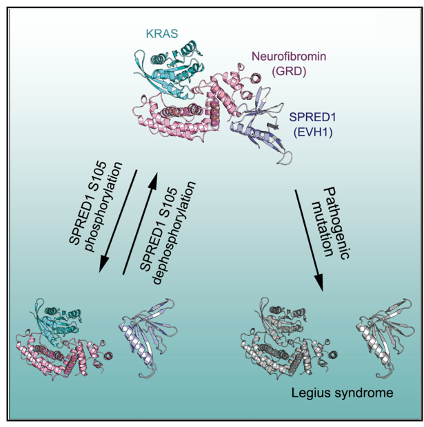

## Question

# Gene Research for Functional Annotation

## ⚠️ CRITICAL: Gene/Protein Identification Context

**BEFORE YOU BEGIN RESEARCH:** You MUST verify you are researching the CORRECT gene/protein. Gene symbols can be ambiguous, especially for less well-characterized genes from non-model organisms.

### Target Gene/Protein Identity (from UniProt):
- **UniProt Accession:** Q7Z699
- **Protein Description:** RecName: Full=Sprouty-related, EVH1 domain-containing protein 1; Short=Spred-1; Short=hSpred1;
- **Gene Information:** Name=SPRED1;
- **Organism (full):** Homo sapiens (Human).
- **Protein Family:** Not specified in UniProt
- **Key Domains:** KBD. (IPR023337); PH-like_dom_sf. (IPR011993); SPRE_EVH1. (IPR041937); Sprouty. (IPR007875); WH1/EVH1_dom. (IPR000697)

### MANDATORY VERIFICATION STEPS:

1. **Check if the gene symbol "SPRED1" matches the protein description above**
2. **Verify the organism is correct:** Homo sapiens (Human).
3. **Check if protein family/domains align with what you find in literature**
4. **If you find literature for a DIFFERENT gene with the same or similar symbol, STOP**

### If Gene Symbol is Ambiguous or You Cannot Find Relevant Literature:

**DO NOT PROCEED WITH RESEARCH ON A DIFFERENT GENE.** Instead:
- State clearly: "The gene symbol 'SPRED1' is ambiguous or literature is limited for this specific protein"
- Explain what you found (e.g., "Found extensive literature on a different gene with the same symbol in a different organism")
- Describe the protein based ONLY on the UniProt information provided above
- Suggest that the protein function can be inferred from domain/family information

### Research Target:

Please provide a comprehensive research report on the gene **SPRED1** (gene ID: SPRED1, UniProt: Q7Z699) in human.

The research report should be a detailed narrative explaining the function, biological processes, and localization of the gene product. Citations should be given for all claims.

You should prioritize authoritative reviews and primary scientific literature when conducting research. You can supplement
this with annotations you find in gene/protein databases, but these can be outdated or inaccurate.

We are specifically interested in the primary function of the gene - for enzymes, what reaction is catalyzed, and what is the substrate specificity? For transporters, what is the substrate? For structural proteins or adapters, what is the broader structural role? For signaling molecules, what is the role in the pathway.

We are interested in where in or outside the cell the gene product carries out its function.

We are also interested in the signaling or biochemical pathways in which the gene functions. We are less interested in broad pleiotropic effects, except where these elucidate the precise role.

Include evidence where possible. We are interested in both experimental evidence as well as inference from structure, evolution, or bioinformatic analysis. Precise studies should be prioritized over high-throughput, where available.

## Output

Question: You are an expert researcher providing comprehensive, well-cited information.

Provide detailed information focusing on:
1. Key concepts and definitions with current understanding
2. Recent developments and latest research (prioritize 2023-2024 sources)
3. Current applications and real-world implementations
4. Expert opinions and analysis from authoritative sources
5. Relevant statistics and data from recent studies

Format as a comprehensive research report with proper citations. Include URLs and publication dates where available.
Always prioritize recent, authoritative sources and provide specific citations for all major claims.

# Gene Research for Functional Annotation

## ⚠️ CRITICAL: Gene/Protein Identification Context

**BEFORE YOU BEGIN RESEARCH:** You MUST verify you are researching the CORRECT gene/protein. Gene symbols can be ambiguous, especially for less well-characterized genes from non-model organisms.

### Target Gene/Protein Identity (from UniProt):
- **UniProt Accession:** Q7Z699
- **Protein Description:** RecName: Full=Sprouty-related, EVH1 domain-containing protein 1; Short=Spred-1; Short=hSpred1;
- **Gene Information:** Name=SPRED1;
- **Organism (full):** Homo sapiens (Human).
- **Protein Family:** Not specified in UniProt
- **Key Domains:** KBD. (IPR023337); PH-like_dom_sf. (IPR011993); SPRE_EVH1. (IPR041937); Sprouty. (IPR007875); WH1/EVH1_dom. (IPR000697)

### MANDATORY VERIFICATION STEPS:

1. **Check if the gene symbol "SPRED1" matches the protein description above**
2. **Verify the organism is correct:** Homo sapiens (Human).
3. **Check if protein family/domains align with what you find in literature**
4. **If you find literature for a DIFFERENT gene with the same or similar symbol, STOP**

### If Gene Symbol is Ambiguous or You Cannot Find Relevant Literature:

**DO NOT PROCEED WITH RESEARCH ON A DIFFERENT GENE.** Instead:
- State clearly: "The gene symbol 'SPRED1' is ambiguous or literature is limited for this specific protein"
- Explain what you found (e.g., "Found extensive literature on a different gene with the same symbol in a different organism")
- Describe the protein based ONLY on the UniProt information provided above
- Suggest that the protein function can be inferred from domain/family information

### Research Target:

Please provide a comprehensive research report on the gene **SPRED1** (gene ID: SPRED1, UniProt: Q7Z699) in human.

The research report should be a detailed narrative explaining the function, biological processes, and localization of the gene product. Citations should be given for all claims.

You should prioritize authoritative reviews and primary scientific literature when conducting research. You can supplement
this with annotations you find in gene/protein databases, but these can be outdated or inaccurate.

We are specifically interested in the primary function of the gene - for enzymes, what reaction is catalyzed, and what is the substrate specificity? For transporters, what is the substrate? For structural proteins or adapters, what is the broader structural role? For signaling molecules, what is the role in the pathway.

We are interested in where in or outside the cell the gene product carries out its function.

We are also interested in the signaling or biochemical pathways in which the gene functions. We are less interested in broad pleiotropic effects, except where these elucidate the precise role.

Include evidence where possible. We are interested in both experimental evidence as well as inference from structure, evolution, or bioinformatic analysis. Precise studies should be prioritized over high-throughput, where available.

# Human SPRED1 (UniProt Q7Z699): functional annotation and research report

## Identity and principal function

**Identity verified.** The target is human **SPRED1**, sprouty-related EVH1 domain-containing protein 1, not the paralog SPRED2 or the distinct Sprouty protein SPRY2. Human SPRED1 is a 444-amino-acid protein with an N-terminal EVH1 domain, a central KIT-binding region and a C-terminal cysteine-rich Sprouty-related (SPR) domain. The literature explicitly associates the analyzed SPRED1 sequence with UniProt **Q7Z699**. (baezflores2026spred1variantsreveal pages 21-24, lorenzo2020spredproteinsand pages 2-3)

**Primary molecular annotation:** SPRED1 is a **nonenzymatic, membrane-targeting signaling adaptor** that suppresses growth-factor-induced RAS–RAF–MEK–ERK signaling. Its EVH1 domain binds **neurofibromin**, the RAS GTPase-activating protein encoded by *NF1*; SPRED1 positions neurofibromin near membrane-associated RAS, where **neurofibromin—not SPRED1—accelerates hydrolysis of RAS-bound GTP to GDP**. The resulting reduction in RAS-GTP attenuates downstream ERK activation. SPRED1 therefore has no catalytic reaction, enzyme substrate specificity or transport substrate of its own. (stowe2012asharedmolecular pages 2-3, yan2020structuralinsightsinto pages 1-3, dunzendorfermatt2016theneurofibrominrecruitment pages 3-3)

The following domain-resolved summary separates measured interactions from interpretations that remain uncertain.

| Domain/localization | Measured molecular role | Evidence and strength |
|---|---|---|
| **Full-length human SPRED1 Q7Z699**; cytosol-to-plasma-membrane signaling adaptor | Nonenzymatic negative regulator of RAS–MAPK signaling. SPRED1 recruits the RAS-GAP neurofibromin; **SPRED1 is neither a GAP nor an enzyme** and does not catalyze GTP hydrolysis. | NF1 depletion or deletion abolished SPRED1-dependent suppression of RAS-GTP and ERK phosphorylation: **strong functional evidence**. These experiments do not establish efficacy of any treatment in patients. (stowe2012asharedmolecular pages 2-3) |
| **N-terminal EVH1 domain**; NF1-binding interface | Binds the noncatalytic GAPex region of the NF1 GAP-related domain, positioning NF1 near membrane-associated RAS without obstructing NF1 catalysis. | Purified proteins formed a 1:1 complex; surface plasmon resonance measured **Kd = 7.4 nM**. SPRED1 EVH1 did not significantly alter NF1-GRD-catalyzed RAS-GTP hydrolysis: **strong quantitative biochemical evidence**. (dunzendorfermatt2016theneurofibrominrecruitment pages 3-3) |
| **EVH1–NF1–RAS ternary interface** | NF1 acts as the bridge: SPRED1 EVH1 binds mainly NF1 GAPex, whereas KRAS binds the distinct catalytic GAPc surface. No direct SPRED1–KRAS contact was observed. | Ternary complexes containing wild-type or Q61L KRAS were solved at **2.75 Å and 2.55 Å**, respectively. ITC measured **Kd = 224 nM** for SPRED1 EVH1–NF1 GRD under the study conditions: **strong atomic structural evidence**. (yan2020structuralinsightsinto pages 3-4) |
| **Central KIT-binding domain; residues 233–285** | Associates with the receptor tyrosine kinase KIT; **Arg247** is required for KIT binding. The physiological consequence of this interaction remains incompletely defined. | Domain mapping and mutational results provide **moderate evidence for KIT binding but limited evidence for its downstream mechanism**. (lorenzo2020spredproteinsand pages 2-3) |
| **C-terminal cysteine-rich SPR domain**; plasma-membrane and lipid-raft localization | Enables membrane localization and delivery of EVH1-bound NF1 to membrane-associated RAS; it also contributes to SPRED-family dimerization. | SPR deletion caused mislocalization and loss of ERK suppression; adding a membrane-targeting CAAX motif restored localization and RAS–ERK inhibition: **strong cellular rescue evidence**. These findings do **not** establish zDHHC17-mediated S-acylation of human SPRED1. (lorenzo2020spredproteinsand pages 2-3, stowe2012asharedmolecular pages 2-3) |
| **Pathogenic EVH1 variants** | Disrupt SPRED1–NF1 binding, impairing neurofibromin recruitment and RAS–MAPK inhibition. | Legius-syndrome-associated substitutions including R24Q, G30R, and T102R reduce or abolish NF1 binding and map to the structural interface: **strong genotype–structure–function evidence**. (lorenzo2020spredproteinsand pages 2-3, yan2020structuralinsightsinto pages 3-4) |
| **Pathogenic SPR variants** | Can retain NF1 binding through an intact EVH1 domain while failing to localize the SPRED1–NF1 complex correctly at the plasma membrane. | The P415A SPR variant retained neurofibromin association, whereas C-terminal localization defects impaired pathway suppression: **strong domain-separation evidence for defective spatial recruitment rather than lost catalytic activity**. (stowe2012asharedmolecular pages 2-3, lorenzo2020spredproteinsand pages 2-3) |

*Table: Domain-resolved evidence identifies human SPRED1 Q7Z699 as a membrane-targeting adaptor for neurofibromin rather than an enzyme. The table distinguishes established mechanisms from unresolved acylation and clinical-treatment questions.*

## Mechanism, localization and strength of evidence

SPRED1 acts **inside the cell, principally at the cytoplasmic face of the plasma membrane**, rather than as a secreted factor or transmembrane transporter. In cell experiments, SPRED1 localized to the membrane while neurofibromin alone was predominantly cytoplasmic; their association redistributed neurofibromin toward membrane-associated signaling complexes. The C-terminal SPR domain is required for effective localization and ERK suppression: deletion or pathogenic alteration can leave neurofibromin binding intact but prevent productive membrane recruitment. Artificial addition of a membrane-targeting **CAAX** sequence rescued localization and inhibitory activity, a particularly direct test of the importance of *where* the adaptor acts. SPRED1 has also been observed in membrane raft/caveolar signaling compartments and in cytoplasmic complexes with B-RAF before membrane recruitment. (stowe2012asharedmolecular pages 2-3, lorenzo2020spredproteinsand pages 2-3, lorenzo2020spredproteinsand pages 3-4)

The physical mechanism is unusually well resolved. Purified SPRED1 EVH1 and neurofibromin’s GAP-related domain (GRD) formed a **1:1 complex** with a surface-plasmon-resonance dissociation constant of **7.4 nM** under the conditions of a 2016 study. An activated RAS molecule and SPRED1 could bind neurofibromin simultaneously; adding SPRED1 EVH1 **did not significantly change** the isolated GRD’s RAS-GTP-hydrolysis activity. These findings support *recruitment and spatial positioning*, not direct catalytic activation of neurofibromin by SPRED1. Binding constants measured using other constructs and methods need not be numerically identical. (dunzendorfermatt2016theneurofibrominrecruitment pages 3-3)

Crystal structures reported in 2020 at **2.75 Å** and **2.55 Å** resolution show the ternary SPRED1–neurofibromin–KRAS complex. SPRED1 EVH1 contacts primarily the noncatalytic **GAPex** surface of neurofibromin; KRAS binds a separate, predominantly catalytic **GAPc** surface. **No direct SPRED1–KRAS contact was observed in those structures.** Disease-associated substitutions at the SPRED1–neurofibromin interface provide independent, mutation-based support for its functional importance. The cropped structural view of the distinct binding surfaces provides visual corroboration of this interpretation. (yan2020structuralinsightsinto pages 3-4, yan2020structuralinsightsinto media d9c40e10)

The central region binds the receptor tyrosine kinase **KIT**: the mapped binding region spans approximately residues **233–285**, and SPRED1 **Arg247** is important for KIT association. Growth-factor-dependent phosphorylation and other receptor interactions have been reported, but the physiological consequence of KIT binding is less firmly established than EVH1-mediated neurofibromin recruitment. An independent cell-imaging study found selective disruption of **K-RAS**, but not **H-RAS**, membrane anchorage and signaling under its experimental conditions; whether this constitutes a separate neurofibromin-independent mechanism remains unresolved. Likewise, early proposals of direct RAF inhibition should not replace the better-supported neurofibromin-recruitment annotation. (lorenzo2020spredproteinsand pages 3-4, siljamaki2016spred1interfereswith pages 1-3, yan2020structuralinsightsinto pages 3-4, lorenzo2020spredproteinsand pages 2-3)

SPRED1 activity is itself regulatable. In the 2020 structural and cellular study, oncogenic **EGFR(L858R)** promoted phosphorylation of SPRED1 **Ser105**, disrupting its association with neurofibromin and providing a mechanism for sustained RAS signaling despite the presence of both proteins. This is an experimentally characterized oncogenic context, not evidence that every growth-factor stimulus disables SPRED1 in the same manner. (yan2020structuralinsightsinto pages 1-3, yan2020structuralinsightsinto pages 3-4)

## Biological processes and disease-relevant applications

**Developmental RAS regulation and clinical diagnosis.** Heterozygous germline loss-of-function variants in *SPRED1* cause **Legius syndrome**, an autosomal-dominant RASopathy that can resemble pigmentary neurofibromatosis type 1 (NF1). The overlap follows directly from the shared SPRED1–neurofibromin mechanism, but the genes and clinical syndromes are not interchangeable. In a reported cohort of **71** people younger than 20 years presenting with at least six café-au-lait macules, with or without freckling but without another NF1 criterion or an affected parent, **6/71 (8.5%)** had a pathogenic *SPRED1* variant, compared with **44/71 (62%)** with a pathogenic *NF1* variant. These are **selected-clinic cohort proportions, not population prevalence**; they illustrate why molecular discrimination is useful in children with predominantly pigmentary signs. (kehrersawatzki2022challengesinthe pages 7-8, stowe2012asharedmolecular pages 2-3)

An authoritative **2024 pediatric cancer-surveillance consensus** identifies Legius syndrome as the **exception** to the significantly increased childhood cancer risk described for the other RASopathies it discusses. Characteristic NF1 manifestations such as neurofibromas, optic-pathway gliomas and Lisch nodules are generally absent in Legius syndrome. Thus, a confirmed pathogenic *SPRED1* result should not automatically be treated as a diagnosis of *NF1* or used to transfer NF1-specific tumor-risk estimates and surveillance protocols to that patient. Importantly, **somatic SPRED1 loss in a tumor does not establish inherited cancer predisposition in people with Legius syndrome**. Clinical assessment and developmental support remain appropriate according to the individual presentation. (perrino2024updateonpediatric pages 3-5, kehrersawatzki2022challengesinthe pages 7-8)

**Cancer signaling and treatment-response research.** In a primary study of **43 human mucosal melanomas**, **37%** showed evidence of SPRED1 inactivation or protein loss; **11/43 (26%)** had documented biallelic genetic inactivation. Melanocyte-specific zebrafish experiments and a human **KIT-mutant** melanoma cell line showed that SPRED1 loss particularly cooperated with mutant KIT, increased MAPK signaling and proliferation, and reduced response to the KIT inhibitor **dasatinib**. In the cell experiments, the MEK inhibitor **trametinib** counteracted this resistance; the zebrafish experiments also showed reduced tumor response to dasatinib after *spred1* knockout. This supports evaluating SPRED1 status as a **candidate** biomarker and downstream MAPK inhibition as a therapeutic hypothesis, **not** a demonstrated patient-level benefit of KIT-plus-MEK treatment. The effect was context-dependent: *spred1* disruption did not significantly accelerate the tested BRAF- or NRAS-driven melanomas in the same zebrafish setting. (ablain2018humantumorgenomics pages 2-2, ablain2018humantumorgenomics pages 2-3)

**Endothelial growth-factor responses.** Human endothelial-cell experiments established that **miR-126 directly represses SPRED1 mRNA through its 3′ untranslated region**. SPRED1 knockdown rescued aspects of impaired VEGF-induced ERK activation and endothelial migration after miR-126 suppression; complementary mouse and zebrafish work connected this axis to angiogenic responsiveness and vessel integrity. This is a tissue-specific example of adjusting the strength of the same growth-factor–RAS/MAPK brake, rather than a separate biochemical function of SPRED1. miR-126 also targets **PIK3R2**, so its full endothelial phenotype should not be attributed exclusively to SPRED1. (wang2008theendothelialspecificmicrorna pages 5-7, fish2008mir126regulatesangiogenic pages 8-9, fish2008mir126regulatesangiogenic pages 6-7)

## Developments in 2023–2024 and remaining uncertainties

A **2023** study investigated lipid modification of Sprouty and SPRED family proteins, but **SPR-domain-dependent membrane targeting should not be equated with proven zDHHC17-mediated acylation of human SPRED1**. In the accessible author’s experimental thesis, overexpressed SPRED1 was modified under **zDHHC7** coexpression conditions, whereas modification by **zDHHC17** was not significant; the specific endogenous SPRED1 acylation sites and their physiological contribution to localization were not established there. The retrieved text labeled as the corresponding *Journal of Biological Chemistry* article was actually thesis text, so this enzyme-specific detail should be treated cautiously rather than presented as independently checked peer-reviewed article content. The paper’s bibliographic record is Butler *et al.*, *Journal of Biological Chemistry*, **January 2023**, https://doi.org/10.1016/j.jbc.2022.102754; the accessible thesis is https://doi.org/10.48730/q7zj-s736. (butler2023sacylationofsprouty pages 106-111, butler2023sacylationofsprouty pages 1-7)

A **December 2024** primary article directly addresses Legius-associated SPRED1 mutations, loss of membrane localization and possible neurodegeneration: Hirata *et al.*, *Journal of Biological Chemistry* **300**, 107969, https://doi.org/10.1016/j.jbc.2024.107969. Its full text was **not obtainable in this search**, so its mutation-specific experiments and proposed neurodegeneration mechanism cannot be independently evaluated here; the established localization conclusion above rests chiefly on accessible earlier primary experiments. The accessible 2024 surveillance consensus is Perrino *et al.*, *Clinical Cancer Research* **30**, 4834–4843, **August 2024**, https://doi.org/10.1158/1078-0432.CCR-24-1611. (baezflores2026spred1variantsreveal pages 30-33, perrino2024updateonpediatric pages 3-5)

**Bottom line:** The highest-confidence annotation for **human SPRED1/Q7Z699** is a **cytoplasmic-face-of-plasma-membrane adaptor that recruits neurofibromin to RAS**, thereby constraining RAS-GTP and downstream RAF–MEK–ERK signaling. KIT association, growth-factor-dependent trafficking, selective effects on KRAS membrane organization and possible lipid modifications add regulatory context, but do not establish SPRED1 as an enzyme or replace its experimentally validated neurofibromin-recruitment role. (stowe2012asharedmolecular pages 2-3, dunzendorfermatt2016theneurofibrominrecruitment pages 3-3, yan2020structuralinsightsinto pages 3-4, lorenzo2020spredproteinsand pages 2-3)

References

1. (baezflores2026spred1variantsreveal pages 21-24): Juan Báez-Flores, Alessio Coppola, Noemi Ferrito, Ana María Palade, David Hansoe Heredero-Jung, Elena Marcos-Vadillo, Saturnino Ortiz-Madinaveitia, María Isidoro-García, Jesus Lacal, and Pablo Prieto-Matos. <i>spred1</i> variants reveal differential impacts on signaling dynamics. Unknown journal, Jul 2026. URL: https://doi.org/10.64898/2026.07.08.26357239, doi:10.64898/2026.07.08.26357239.

2. (lorenzo2020spredproteinsand pages 2-3): Claire Lorenzo and Frank McCormick. Spred proteins and their roles in signal transduction, development, and malignancy. Genes & Development, 34:1410-1421, Nov 2020. URL: https://doi.org/10.1101/gad.341222.120, doi:10.1101/gad.341222.120. This article has 69 citations and is from a highest quality peer-reviewed journal.

3. (stowe2012asharedmolecular pages 2-3): Irma B. Stowe, Ellen L. Mercado, Timothy R. Stowe, Erika L. Bell, Juan A. Oses-Prieto, Hilda Hernández, Alma L. Burlingame, and Frank McCormick. A shared molecular mechanism underlies the human rasopathies legius syndrome and neurofibromatosis-1. Genes & development, 26 13:1421-6, Jul 2012. URL: https://doi.org/10.1101/gad.190876.112, doi:10.1101/gad.190876.112. This article has 198 citations and is from a highest quality peer-reviewed journal.

4. (yan2020structuralinsightsinto pages 1-3): Wupeng Yan, Evan Markegard, Srisathiyanarayanan Dharmaiah, Anatoly Urisman, Matthew Drew, Dominic Esposito, Klaus Scheffzek, Dwight V. Nissley, Frank McCormick, and Dhirendra K. Simanshu. Structural insights into the spred1-neurofibromin-kras complex and disruption of spred1-neurofibromin interaction by oncogenic egfr. Cell reports, 32:107909-107909, Jul 2020. URL: https://doi.org/10.1016/j.celrep.2020.107909, doi:10.1016/j.celrep.2020.107909. This article has 91 citations and is from a highest quality peer-reviewed journal.

5. (dunzendorfermatt2016theneurofibrominrecruitment pages 3-3): Theresia Dunzendorfer-Matt, Ellen L. Mercado, Karl Maly, Frank McCormick, and Klaus Scheffzek. The neurofibromin recruitment factor spred1 binds to the gap related domain without affecting ras inactivation. Proceedings of the National Academy of Sciences, 113:7497-7502, Jun 2016. URL: https://doi.org/10.1073/pnas.1607298113, doi:10.1073/pnas.1607298113. This article has 88 citations and is from a highest quality peer-reviewed journal.

6. (yan2020structuralinsightsinto pages 3-4): Wupeng Yan, Evan Markegard, Srisathiyanarayanan Dharmaiah, Anatoly Urisman, Matthew Drew, Dominic Esposito, Klaus Scheffzek, Dwight V. Nissley, Frank McCormick, and Dhirendra K. Simanshu. Structural insights into the spred1-neurofibromin-kras complex and disruption of spred1-neurofibromin interaction by oncogenic egfr. Cell reports, 32:107909-107909, Jul 2020. URL: https://doi.org/10.1016/j.celrep.2020.107909, doi:10.1016/j.celrep.2020.107909. This article has 91 citations and is from a highest quality peer-reviewed journal.

7. (lorenzo2020spredproteinsand pages 3-4): Claire Lorenzo and Frank McCormick. Spred proteins and their roles in signal transduction, development, and malignancy. Genes & Development, 34:1410-1421, Nov 2020. URL: https://doi.org/10.1101/gad.341222.120, doi:10.1101/gad.341222.120. This article has 69 citations and is from a highest quality peer-reviewed journal.

8. (yan2020structuralinsightsinto media d9c40e10): Wupeng Yan, Evan Markegard, Srisathiyanarayanan Dharmaiah, Anatoly Urisman, Matthew Drew, Dominic Esposito, Klaus Scheffzek, Dwight V. Nissley, Frank McCormick, and Dhirendra K. Simanshu. Structural insights into the spred1-neurofibromin-kras complex and disruption of spred1-neurofibromin interaction by oncogenic egfr. Cell reports, 32:107909-107909, Jul 2020. URL: https://doi.org/10.1016/j.celrep.2020.107909, doi:10.1016/j.celrep.2020.107909. This article has 91 citations and is from a highest quality peer-reviewed journal.

9. (siljamaki2016spred1interfereswith pages 1-3): Elina Siljamäki and Daniel Abankwa. Spred1 interferes with k-ras but not h-ras membrane anchorage and signaling. Molecular and Cellular Biology, 36:2612-2625, Oct 2016. URL: https://doi.org/10.1128/mcb.00191-16, doi:10.1128/mcb.00191-16. This article has 28 citations and is from a domain leading peer-reviewed journal.

10. (kehrersawatzki2022challengesinthe pages 7-8): Hildegard Kehrer-Sawatzki and David N. Cooper. Challenges in the diagnosis of neurofibromatosis type 1 (nf1) in young children facilitated by means of revised diagnostic criteria including genetic testing for pathogenic nf1 gene variants. Human Genetics, 141:177-191, Dec 2022. URL: https://doi.org/10.1007/s00439-021-02410-z, doi:10.1007/s00439-021-02410-z. This article has 126 citations and is from a peer-reviewed journal.

11. (perrino2024updateonpediatric pages 3-5): Melissa R. Perrino, Anirban Das, Sarah R. Scollon, Sarah G. Mitchell, Mary-Louise C. Greer, Marielle E. Yohe, Jordan R. Hansford, Jennifer M. Kalish, Kris Ann P. Schultz, Suzanne P. MacFarland, Wendy K. Kohlmann, Philip J. Lupo, Kara N. Maxwell, Stefan M. Pfister, Rosanna Weksberg, Orli Michaeli, Marjolijn C.J. Jongmans, Gail E. Tomlinson, Jack Brzezinski, Uri Tabori, Gina M. Ney, Karen W. Gripp, Andrea M. Gross, Brigitte C. Widemann, Douglas R. Stewart, Emma R. Woodward, and Christian P. Kratz. Update on pediatric cancer surveillance recommendations for patients with neurofibromatosis type 1, noonan syndrome, cbl syndrome, costello syndrome, and related rasopathies. Clinical Cancer Research, 30:4834-4843, Aug 2024. URL: https://doi.org/10.1158/1078-0432.ccr-24-1611, doi:10.1158/1078-0432.ccr-24-1611. This article has 64 citations and is from a highest quality peer-reviewed journal.

12. (ablain2018humantumorgenomics pages 2-2): Julien Ablain, Mengshu Xu, Harriet Rothschild, Richard C. Jordan, Jeffrey K. Mito, Brianne H. Daniels, Caitlin F. Bell, Nancy M. Joseph, Hong Wu, Boris C. Bastian, Leonard I. Zon, and Iwei Yeh. Human tumor genomics and zebrafish modeling identify <i>spred1</i> loss as a driver of mucosal melanoma. Nov 2018. URL: https://doi.org/10.1126/science.aau6509, doi:10.1126/science.aau6509. This article has 171 citations and is from a highest quality peer-reviewed journal.

13. (ablain2018humantumorgenomics pages 2-3): Julien Ablain, Mengshu Xu, Harriet Rothschild, Richard C. Jordan, Jeffrey K. Mito, Brianne H. Daniels, Caitlin F. Bell, Nancy M. Joseph, Hong Wu, Boris C. Bastian, Leonard I. Zon, and Iwei Yeh. Human tumor genomics and zebrafish modeling identify <i>spred1</i> loss as a driver of mucosal melanoma. Nov 2018. URL: https://doi.org/10.1126/science.aau6509, doi:10.1126/science.aau6509. This article has 171 citations and is from a highest quality peer-reviewed journal.

14. (wang2008theendothelialspecificmicrorna pages 5-7): Shusheng Wang, Arin B. Aurora, Brett A. Johnson, Xiaoxia Qi, John McAnally, Joseph A. Hill, James A. Richardson, Rhonda Bassel-Duby, and Eric N. Olson. The endothelial-specific microrna mir-126 governs vascular integrity and angiogenesis. Developmental cell, 15 2:261-71, Aug 2008. URL: https://doi.org/10.1016/j.devcel.2008.07.002, doi:10.1016/j.devcel.2008.07.002. This article has 2409 citations and is from a highest quality peer-reviewed journal.

15. (fish2008mir126regulatesangiogenic pages 8-9): Jason E. Fish, Massimo M. Santoro, Sarah U. Morton, Sangho Yu, Ru-Fang Yeh, Joshua D. Wythe, Kathryn N. Ivey, Benoit G. Bruneau, Didier Y.R. Stainier, and Deepak Srivastava. Mir-126 regulates angiogenic signaling and vascular integrity. Developmental cell, 15 2:272-84, Aug 2008. URL: https://doi.org/10.1016/j.devcel.2008.07.008, doi:10.1016/j.devcel.2008.07.008. This article has 2255 citations and is from a highest quality peer-reviewed journal.

16. (fish2008mir126regulatesangiogenic pages 6-7): Jason E. Fish, Massimo M. Santoro, Sarah U. Morton, Sangho Yu, Ru-Fang Yeh, Joshua D. Wythe, Kathryn N. Ivey, Benoit G. Bruneau, Didier Y.R. Stainier, and Deepak Srivastava. Mir-126 regulates angiogenic signaling and vascular integrity. Developmental cell, 15 2:272-84, Aug 2008. URL: https://doi.org/10.1016/j.devcel.2008.07.008, doi:10.1016/j.devcel.2008.07.008. This article has 2255 citations and is from a highest quality peer-reviewed journal.

17. (butler2023sacylationofsprouty pages 106-111): Liam Butler, Carolina Locatelli, Despoina Allagioti, Irina Lousa, Kimon Lemonidis, Nicholas C.O. Tomkinson, Christine Salaun, and Luke H. Chamberlain. S-acylation of sprouty and spred proteins by the s-acyltransferase zdhhc17 involves a novel mode of enzyme–substrate interaction. Journal of Biological Chemistry, 299:102754, Jan 2023. URL: https://doi.org/10.1016/j.jbc.2022.102754, doi:10.1016/j.jbc.2022.102754. This article has 17 citations and is from a domain leading peer-reviewed journal.

18. (butler2023sacylationofsprouty pages 1-7): Liam Butler, Carolina Locatelli, Despoina Allagioti, Irina Lousa, Kimon Lemonidis, Nicholas C.O. Tomkinson, Christine Salaun, and Luke H. Chamberlain. S-acylation of sprouty and spred proteins by the s-acyltransferase zdhhc17 involves a novel mode of enzyme–substrate interaction. Journal of Biological Chemistry, 299:102754, Jan 2023. URL: https://doi.org/10.1016/j.jbc.2022.102754, doi:10.1016/j.jbc.2022.102754. This article has 17 citations and is from a domain leading peer-reviewed journal.

19. (baezflores2026spred1variantsreveal pages 30-33): Juan Báez-Flores, Alessio Coppola, Noemi Ferrito, Ana María Palade, David Hansoe Heredero-Jung, Elena Marcos-Vadillo, Saturnino Ortiz-Madinaveitia, María Isidoro-García, Jesus Lacal, and Pablo Prieto-Matos. <i>spred1</i> variants reveal differential impacts on signaling dynamics. Unknown journal, Jul 2026. URL: https://doi.org/10.64898/2026.07.08.26357239, doi:10.64898/2026.07.08.26357239.

## Artifacts

- [Edison artifact artifact-00](SPRED1-deep-research-falcon_artifacts/artifact-00.md)

## Citations

1. stowe2012asharedmolecular pages 2-3
2. dunzendorfermatt2016theneurofibrominrecruitment pages 3-3
3. yan2020structuralinsightsinto pages 3-4
4. lorenzo2020spredproteinsand pages 2-3
5. yan2020structuralinsightsinto pages 1-3
6. lorenzo2020spredproteinsand pages 3-4
7. kehrersawatzki2022challengesinthe pages 7-8
8. perrino2024updateonpediatric pages 3-5
9. ablain2018humantumorgenomics pages 2-2
10. ablain2018humantumorgenomics pages 2-3
11. wang2008theendothelialspecificmicrorna pages 5-7
12. butler2023sacylationofsprouty pages 106-111
13. butler2023sacylationofsprouty pages 1-7
14. https://doi.org/10.1016/j.jbc.2022.102754;
15. https://doi.org/10.48730/q7zj-s736.
16. https://doi.org/10.1016/j.jbc.2024.107969.
17. https://doi.org/10.1158/1078-0432.CCR-24-1611.
18. https://doi.org/10.64898/2026.07.08.26357239,
19. https://doi.org/10.1101/gad.341222.120,
20. https://doi.org/10.1101/gad.190876.112,
21. https://doi.org/10.1016/j.celrep.2020.107909,
22. https://doi.org/10.1073/pnas.1607298113,
23. https://doi.org/10.1128/mcb.00191-16,
24. https://doi.org/10.1007/s00439-021-02410-z,
25. https://doi.org/10.1158/1078-0432.ccr-24-1611,
26. https://doi.org/10.1126/science.aau6509,
27. https://doi.org/10.1016/j.devcel.2008.07.002,
28. https://doi.org/10.1016/j.devcel.2008.07.008,
29. https://doi.org/10.1016/j.jbc.2022.102754,