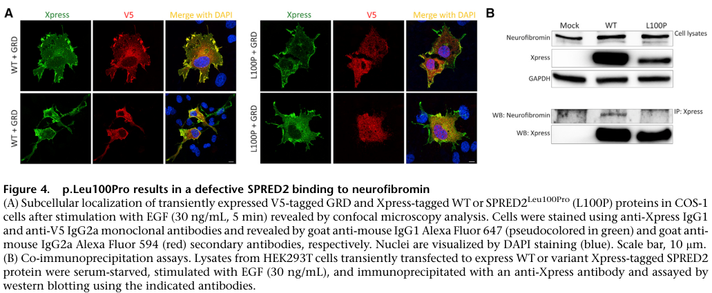

## Question

# Gene Research for Functional Annotation

## ⚠️ CRITICAL: Gene/Protein Identification Context

**BEFORE YOU BEGIN RESEARCH:** You MUST verify you are researching the CORRECT gene/protein. Gene symbols can be ambiguous, especially for less well-characterized genes from non-model organisms.

### Target Gene/Protein Identity (from UniProt):
- **UniProt Accession:** Q7Z698
- **Protein Description:** RecName: Full=Sprouty-related, EVH1 domain-containing protein 2; Short=Spred-2;
- **Gene Information:** Name=SPRED2;
- **Organism (full):** Homo sapiens (Human).
- **Protein Family:** Not specified in UniProt
- **Key Domains:** KBD. (IPR023337); PH-like_dom_sf. (IPR011993); SPRE_EVH1. (IPR041937); Sprouty. (IPR007875); WH1/EVH1_dom. (IPR000697)

### MANDATORY VERIFICATION STEPS:

1. **Check if the gene symbol "SPRED2" matches the protein description above**
2. **Verify the organism is correct:** Homo sapiens (Human).
3. **Check if protein family/domains align with what you find in literature**
4. **If you find literature for a DIFFERENT gene with the same or similar symbol, STOP**

### If Gene Symbol is Ambiguous or You Cannot Find Relevant Literature:

**DO NOT PROCEED WITH RESEARCH ON A DIFFERENT GENE.** Instead:
- State clearly: "The gene symbol 'SPRED2' is ambiguous or literature is limited for this specific protein"
- Explain what you found (e.g., "Found extensive literature on a different gene with the same symbol in a different organism")
- Describe the protein based ONLY on the UniProt information provided above
- Suggest that the protein function can be inferred from domain/family information

### Research Target:

Please provide a comprehensive research report on the gene **SPRED2** (gene ID: SPRED2, UniProt: Q7Z698) in human.

The research report should be a detailed narrative explaining the function, biological processes, and localization of the gene product. Citations should be given for all claims.

You should prioritize authoritative reviews and primary scientific literature when conducting research. You can supplement
this with annotations you find in gene/protein databases, but these can be outdated or inaccurate.

We are specifically interested in the primary function of the gene - for enzymes, what reaction is catalyzed, and what is the substrate specificity? For transporters, what is the substrate? For structural proteins or adapters, what is the broader structural role? For signaling molecules, what is the role in the pathway.

We are interested in where in or outside the cell the gene product carries out its function.

We are also interested in the signaling or biochemical pathways in which the gene functions. We are less interested in broad pleiotropic effects, except where these elucidate the precise role.

Include evidence where possible. We are interested in both experimental evidence as well as inference from structure, evolution, or bioinformatic analysis. Precise studies should be prioritized over high-throughput, where available.

## Output

Question: You are an expert researcher providing comprehensive, well-cited information.

Provide detailed information focusing on:
1. Key concepts and definitions with current understanding
2. Recent developments and latest research (prioritize 2023-2024 sources)
3. Current applications and real-world implementations
4. Expert opinions and analysis from authoritative sources
5. Relevant statistics and data from recent studies

Format as a comprehensive research report with proper citations. Include URLs and publication dates where available.
Always prioritize recent, authoritative sources and provide specific citations for all major claims.

# Gene Research for Functional Annotation

## ⚠️ CRITICAL: Gene/Protein Identification Context

**BEFORE YOU BEGIN RESEARCH:** You MUST verify you are researching the CORRECT gene/protein. Gene symbols can be ambiguous, especially for less well-characterized genes from non-model organisms.

### Target Gene/Protein Identity (from UniProt):
- **UniProt Accession:** Q7Z698
- **Protein Description:** RecName: Full=Sprouty-related, EVH1 domain-containing protein 2; Short=Spred-2;
- **Gene Information:** Name=SPRED2;
- **Organism (full):** Homo sapiens (Human).
- **Protein Family:** Not specified in UniProt
- **Key Domains:** KBD. (IPR023337); PH-like_dom_sf. (IPR011993); SPRE_EVH1. (IPR041937); Sprouty. (IPR007875); WH1/EVH1_dom. (IPR000697)

### MANDATORY VERIFICATION STEPS:

1. **Check if the gene symbol "SPRED2" matches the protein description above**
2. **Verify the organism is correct:** Homo sapiens (Human).
3. **Check if protein family/domains align with what you find in literature**
4. **If you find literature for a DIFFERENT gene with the same or similar symbol, STOP**

### If Gene Symbol is Ambiguous or You Cannot Find Relevant Literature:

**DO NOT PROCEED WITH RESEARCH ON A DIFFERENT GENE.** Instead:
- State clearly: "The gene symbol 'SPRED2' is ambiguous or literature is limited for this specific protein"
- Explain what you found (e.g., "Found extensive literature on a different gene with the same symbol in a different organism")
- Describe the protein based ONLY on the UniProt information provided above
- Suggest that the protein function can be inferred from domain/family information

### Research Target:

Please provide a comprehensive research report on the gene **SPRED2** (gene ID: SPRED2, UniProt: Q7Z698) in human.

The research report should be a detailed narrative explaining the function, biological processes, and localization of the gene product. Citations should be given for all claims.

You should prioritize authoritative reviews and primary scientific literature when conducting research. You can supplement
this with annotations you find in gene/protein databases, but these can be outdated or inaccurate.

We are specifically interested in the primary function of the gene - for enzymes, what reaction is catalyzed, and what is the substrate specificity? For transporters, what is the substrate? For structural proteins or adapters, what is the broader structural role? For signaling molecules, what is the role in the pathway.

We are interested in where in or outside the cell the gene product carries out its function.

We are also interested in the signaling or biochemical pathways in which the gene functions. We are less interested in broad pleiotropic effects, except where these elucidate the precise role.

Include evidence where possible. We are interested in both experimental evidence as well as inference from structure, evolution, or bioinformatic analysis. Precise studies should be prioritized over high-throughput, where available.

# Human SPRED2: functional annotation and evidence review

## Identity and principal function

**SPRED2** denotes human *Sprouty-related, EVH1 domain-containing protein 2*, the protein identified in the question as UniProt **Q7Z698**. The literature independently identifies human SPRED2 as a **418-amino-acid** SPRED-family protein with an N-terminal EVH1/WH1 domain, a central c-Kit-binding region and a C-terminal cysteine-rich Sprouty-related (SPR) domain. This architecture agrees with the supplied domain annotations. SPRED2 must not be confused with SPRED1, SPRED3 or SPRY2: although related, they are distinct proteins, and SPRY2 lacks the SPRED EVH1 domain. The retrieved papers confirm the human protein identity and domain organization but do not independently print the accession Q7Z698; that accession is supplied in the question. (lorenzo2020spredproteinsand pages 2-3, onore2023anovelhomozygous pages 1-2, stowe2012asharedmolecular pages 3-4)

**The best-supported primary function is attenuation of growth-factor-responsive RAS–RAF–MEK–ERK signaling.** SPRED2 acts principally as a *nonenzymatic signaling adaptor*: it associates with neurofibromin, the **NF1-encoded RAS GTPase-activating protein**, and helps position neurofibromin at cellular membranes where RAS signals. Neurofibromin supplies the RAS-GAP activity that promotes conversion of active RAS–GTP to inactive RAS–GDP; SPRED2 is **not** itself the GAP, a kinase, a transporter or a protein with an established catalytic substrate. This assignment rests on SPRED2-specific interaction and localization experiments, as well as MAPK readouts in human cells with pathogenic SPRED2 variants. (motta2021spred2lossoffunctioncauses pages 9-11, stowe2012asharedmolecular pages 3-4, stowe2012asharedmolecular pages 4-6, onore2023anovelhomozygous pages 1-2)

## Molecular mechanism and cellular location

The working model has two complementary parts. The **EVH1 domain** mediates association with neurofibromin’s GAP-related region, while the **SPR domain** supports membrane targeting; bringing the two proteins together places the RAS-GAP near membrane-associated RAS and restrains signal transmission through RAF1, MEK and ERK. The **central c-Kit-binding region** also binds the c-Kit receptor tyrosine kinase and is implicated in regulation of SPRED2 after receptor stimulation, but its precise contribution to neurofibromin recruitment and pathway inhibition is less settled. SPR-mediated membrane association, not a classical lipid-binding PH domain with an established SPRED2 substrate, is the pertinent localization mechanism supported by the cited experiments. (lorenzo2020spredproteinsand pages 2-3, motta2021spred2lossoffunctioncauses pages 9-11, lorenzo2020spredproteinsand pages 3-4)

**Direct SPRED2 evidence is available, rather than only analogy with SPRED1.** Stowe and colleagues found that expressed SPRED2 co-immunoprecipitated endogenous neurofibromin in human-cell experiments, whereas SPRY2 and SPRY4 did not. Expressing SPRED2 also shifted neurofibromin from the cytoplasmic to a membrane fraction; simultaneous depletion of endogenous SPRED1 and SPRED2 in PC3 cells reduced membrane-associated neurofibromin. Co-immunoprecipitation establishes association in a complex, but alone does not prove a purified, direct binary interaction or determine the separate endogenous contribution of each SPRED isoform. [Stowe *et al.*, *Genes & Development*, July 2012; https://doi.org/10.1101/gad.190876.112.] (stowe2012asharedmolecular pages 4-6, stowe2012asharedmolecular pages 3-4)

Human disease variants provide a particularly informative separation of **membrane targeting from NF1 binding**. In confocal experiments, wild-type SPRED2 localized to the plasma-membrane region and recruited an expressed neurofibromin GAP-related-domain construct there. Residual **SPRED2-Leu100Pro** retained partial membrane localization but failed to recruit that construct; in a separate co-immunoprecipitation assay, wild-type SPRED2 associated with endogenous neurofibromin whereas Leu100Pro did not. Thus an EVH1-disrupting variant can reach the membrane yet fail to assemble a functional neurofibromin-localizing complex. The other tested variants, **Arg63\*** and **Leu381Hisfs\*95**, showed altered localization and accelerated degradation. These are results from tagged-protein expression systems, complemented—not replaced—by the patient-cell results below. [Motta *et al.*, *American Journal of Human Genetics*, November 2021; https://doi.org/10.1016/j.ajhg.2021.09.007; see its Figure 4.] (motta2021spred2lossoffunctioncauses pages 9-11, motta2021spred2lossoffunctioncauses pages 8-9, motta2021spred2lossoffunctioncauses media 09cba787)

SPRED2 therefore functions **inside the cell, prominently at or near the cytoplasmic face of the plasma membrane**, rather than as a secreted extracellular inhibitor. Cytoplasmic pools and variant-dependent intracellular puncta have also been observed. Reports of SPRED-family association with lipid rafts, caveolae and other membranes provide context, but should not be treated as proof that every such compartment is a necessary site of *human SPRED2* activity. Similarly, SPRED2 colocalization with Rab11-associated trafficking compartments does not establish direct Rab11 binding. (lorenzo2020spredproteinsand pages 2-3, motta2021spred2lossoffunctioncauses pages 9-11, motta2021spred2lossoffunctioncauses pages 8-9, bundschu2007gettingafirst pages 4-5)

Early work also proposed that SPRED proteins inhibit **RAF activation** through interactions at the RAS–RAF level. That model need not be discarded, but its precise contribution relative to NF1 recruitment remains context-dependent and incompletely resolved. A SPRED1–neurofibromin–KRAS structure helps explain EVH1 recognition, yet it is a **SPRED1 structure**: assigning every atomic contact or RAS-isoform preference to SPRED2 would overstate the SPRED2-specific structural evidence. (bundschu2007gettingafirst pages 5-6, lorenzo2020spredproteinsand pages 2-3, motta2021spred2lossoffunctioncauses pages 8-9)

The principal studies and the limits of each inference are summarized here:

| Evidence and study/date | Direct SPRED2 observations | Interpretation and limitations |
|---|---|---|
| **Mechanistic interaction — Stowe et al., July 2012** | Ectopic SPRED2 co-immunoprecipitated endogenous neurofibromin/NF1 in T-REx-293 cells, whereas SPRY2 and SPRY4 did not. In HEK-293T fractionation, ectopic SPRED2 redistributed neurofibromin from the cytoplasm to the membrane fraction; combined endogenous SPRED1/SPRED2 depletion in PC3 cells reduced membrane-associated neurofibromin. (stowe2012asharedmolecular pages 4-6, stowe2012asharedmolecular pages 3-4) | Directly supports SPRED2–NF1 complex association and SPRED2-dependent membrane recruitment. Co-immunoprecipitation does not necessarily establish direct binary binding. Neurofibromin—not SPRED2—provides Ras-GAP catalytic activity. |
| **Human functional genetics — Motta et al., November 2021** | Wild-type SPRED2 co-immunoprecipitated endogenous neurofibromin and recruited an NF1 GRD construct to the plasma membrane. SPRED2-L100P retained partial membrane targeting but lost NF1 association and recruitment. Fibroblasts from patients with biallelic SPRED2 variants showed enhanced, stimulus-dependent RAF1, MEK and ERK phosphorylation after EGF, without significantly altered AKT phosphorylation. (motta2021spred2lossoffunctioncauses pages 9-11, motta2021spred2lossoffunctioncauses pages 8-9, motta2021spred2lossoffunctioncauses pages 11-12, motta2021spred2lossoffunctioncauses media 09cba787) | Orthogonal interaction, imaging, signaling and patient-cell evidence links SPRED2 loss to defective NF1 localization and impaired MAPK attenuation. Some interaction and localization experiments used overexpressed tagged proteins; signaling remained growth-factor dependent rather than constitutively active. |
| **Clinical extension — Onore et al., published 25 December 2023; Genes 2024, 15:32** | Reported one additional affected child—the seventh reported case—with homozygous c.325del (p.Arg109Glfs*7) in the EVH1 domain and heterozygous unaffected parents. The variant was predicted to trigger nonsense-mediated decay. (onore2023anovelhomozygous pages 4-6, onore2023anovelhomozygous pages 1-2) | Expanded the recessive SPRED2-associated Noonan-like syndrome series to five families and seven individuals. No RNA, protein, interaction or MAPK assay was performed for this variant; nonsense-mediated decay remains predicted rather than experimentally demonstrated. |
| **Pathway extension — Wang et al., June 2024** | In HCC models, SPRED2 overexpression reduced ERK and p70S6K phosphorylation and increased LC3-II and autophagosome-associated measures; knockout produced reciprocal effects. MEK inhibition reduced p70S6K phosphorylation and increased LC3-II, supporting an ERK-to-mTORC1 relationship. Among 18 paired human HCC specimens, tumors had lower SPRED2 and higher p62 immunoreactivity; SPRED2-knockout HepG2 xenografts were larger and showed reduced autophagy-associated measures. (wang2024spred2isa pages 2-4, wang2024spred2isa pages 4-5, wang2024spred2isa pages 6-8) | Extends SPRED2 function to an ERK–mTORC1–autophagy phenotype in liver models, but the human-tissue evidence is associative. LC3-II, p62 and autophagosome abundance without a lysosomal-blockade flux assay do not conclusively measure autophagic flux; some knockout ultrastructural differences were not statistically significant. |

*Table: Key studies progress from direct SPRED2–neurofibromin association and membrane recruitment to human loss-of-function genetics and an emerging ERK–mTORC1–autophagy phenotype. Direct observations are separated from mechanistic inference and clinical association.*

## Biological processes and human genetic validation

The molecular consequence of losing SPRED2 is most clearly seen when cells receive a growth-factor signal. Motta and colleagues studied **four affected people from three families** with homozygous SPRED2 variants **Arg63\***, **Leu100Pro** or **Leu381Hisfs\*95**. Patient-derived fibroblasts carrying the latter two variants had **enhanced EGF-stimulated RAF1, MEK and ERK phosphorylation**, while signaling remained stimulus-dependent rather than constitutively active. Wild-type SPRED2, but not the tested disease variants, modestly suppressed pathway phosphorylation in transfected cells. In those patient-fibroblast experiments, EGF-stimulated **AKT phosphorylation was not significantly different**, arguing for a more specific MAPK defect *under those conditions*, not excluding every possible effect on other pathways. Zebrafish spred2a/spred2b depletion increased ERK-associated developmental abnormalities; wild-type human SPRED2, but not Leu381Hisfs\*95, rescued the tested phenotype. These convergent approaches connect the adaptor mechanism to developmental control of RAS–MAPK signal strength. [Motta *et al.*, November 2021; https://doi.org/10.1016/j.ajhg.2021.09.007.] (motta2021spred2lossoffunctioncauses pages 1-2, motta2021spred2lossoffunctioncauses pages 9-11, motta2021spred2lossoffunctioncauses pages 11-12)

**Recent clinical extension.** A report **published online 25 December 2023** in the **2024 volume** of *Genes* described another child with a homozygous EVH1-region frameshift, **NM_181784.3:c.325del, p.Arg109Glufs\*7**. Its authors counted **four previously reported families and six affected individuals**; with their case, the published series comprised **five families and seven individuals**. Across those seven, pulmonary valve stenosis was reported in **5/7** and hypertrophic cardiomyopathy in **4/7**. The new frameshift was *predicted* to cause nonsense-mediated RNA decay; that effect was not demonstrated with an RNA or protein assay in the report. These numbers describe a very small, ascertained case series, not population prevalence or penetrance. [Onore *et al.*, published 25 December 2023, *Genes* **15**:32 (2024); https://doi.org/10.3390/genes15010032.] (onore2023anovelhomozygous pages 4-6, onore2023anovelhomozygous pages 1-2)

Together, these findings establish biallelic SPRED2 loss of function as a cause of a **recessive Noonan-like RASopathy**, with growth, cardiac and neurodevelopmental manifestations consistent with dysregulated RAS–MAPK signaling. They do **not** imply that heterozygous SPRED2 loss causes the **SPRED1-associated Legius syndrome**; the two genes’ clinical presentations and inheritance should remain distinct. The clinical importance of SPRED2 is consequently a real-world application of its functional annotation in variant interpretation and RASopathy diagnosis, not evidence of an established SPRED2-directed treatment. (motta2021spred2lossoffunctioncauses pages 1-2, onore2023anovelhomozygous pages 4-6, motta2021spred2lossoffunctioncauses pages 7-8)

## 2024 pathway extension: liver-cell autophagy

A **June 2024** study extended SPRED2 research from the core RAS–ERK mechanism to an **ERK–mTORC1–autophagy relationship** in hepatocellular carcinoma (HCC) models. In HepG2 cells, SPRED2 overexpression lowered ERK and p70S6K phosphorylation and increased LC3-II and autophagosome-associated measures; knockout generally produced reciprocal effects. Pharmacological MEK inhibition decreased p70S6K phosphorylation and raised LC3-II, while rapamycin altered p70S6K and LC3-II without changing ERK phosphorylation. These interventions support, but do not exhaustively prove, the proposed ordering **SPRED2 → reduced ERK signaling → reduced mTORC1 signaling → altered autophagy-associated phenotype**. Comparable overexpression-associated observations in Hep3B and HLE cells and impaired starvation-associated autophagy measures in SPRED2-deficient mouse liver broaden the experimental context. [Wang *et al.*, *International Journal of Molecular Sciences*, June 2024; https://doi.org/10.3390/ijms25116269.] (wang2024spred2isa pages 1-2, wang2024spred2isa pages 9-11, wang2024spred2isa pages 6-8, wang2024spred2isa pages 5-6, wang2024spred2isa pages 4-5)

The same study assessed **18 human HCC specimens with adjacent tissue**: tumor SPRED2 immunoreactivity was lower and p62 immunoreactivity higher, with an inverse relationship within tumors. In a HepG2 xenograft experiment, tumors formed in **5/6 control** versus **6/6 SPRED2-knockout** recipients and knockout tumors were larger. These are, respectively, human **associations** and a **preclinical perturbation**, not a validated human prognostic test or clinical treatment. Interpretation of *autophagic flux* requires particular care: LC3-II, p62 and autophagosome abundance can change for reasons other than faster completion of lysosomal degradation; the cited results do not establish flux as conclusively as a lysosomal-blockade comparison would. Some knockout ultrastructural changes in cultured cells were not statistically significant. [Wang *et al.*, June 2024; https://doi.org/10.3390/ijms25116269.] (wang2024spred2isa pages 2-4, wang2024spred2isa pages 4-5, wang2024spred2isa pages 6-8)

## Assessment

For functional annotation, **“intracellular membrane-associated negative regulator of receptor-driven RAS–MAPK signaling that recruits/positions neurofibromin”** is the most defensible concise description of human SPRED2. Its supported molecular partners and localization explain the direction of the signaling effect; human variant experiments provide unusually strong biological validation. c-Kit binding and the 2024 autophagy findings add useful context, but neither establishes a catalytic activity for SPRED2, and the latter remains a pathway-dependent, model-specific extension rather than a replacement for its primary NF1/RAS–ERK role. (lorenzo2020spredproteinsand pages 2-3, motta2021spred2lossoffunctioncauses pages 9-11, stowe2012asharedmolecular pages 4-6, wang2024spred2isa pages 6-8, lorenzo2020spredproteinsand pages 3-4)

References

1. (lorenzo2020spredproteinsand pages 2-3): Claire Lorenzo and Frank McCormick. Spred proteins and their roles in signal transduction, development, and malignancy. Genes & Development, 34:1410-1421, Nov 2020. URL: https://doi.org/10.1101/gad.341222.120, doi:10.1101/gad.341222.120. This article has 69 citations and is from a highest quality peer-reviewed journal.

2. (onore2023anovelhomozygous pages 1-2): Maria Elena Onore, Martina Caiazza, Antonella Farina, Gioacchino Scarano, Alberto Budillon, Rossella Nicoletta Borrelli, Giuseppe Limongelli, Vincenzo Nigro, and Giulio Piluso. A novel homozygous loss-of-function variant in spred2 causes autosomal recessive noonan-like syndrome. Genes, 15:32, Dec 2023. URL: https://doi.org/10.3390/genes15010032, doi:10.3390/genes15010032. This article has 3 citations.

3. (stowe2012asharedmolecular pages 3-4): Irma B. Stowe, Ellen L. Mercado, Timothy R. Stowe, Erika L. Bell, Juan A. Oses-Prieto, Hilda Hernández, Alma L. Burlingame, and Frank McCormick. A shared molecular mechanism underlies the human rasopathies legius syndrome and neurofibromatosis-1. Genes & development, 26 13:1421-6, Jul 2012. URL: https://doi.org/10.1101/gad.190876.112, doi:10.1101/gad.190876.112. This article has 198 citations and is from a highest quality peer-reviewed journal.

4. (motta2021spred2lossoffunctioncauses pages 9-11): Marialetizia Motta, Giulia Fasano, Sina Gredy, Julia Brinkmann, Adeline Alice Bonnard, Pelin Ozlem Simsek-Kiper, Elif Yilmaz Gulec, Leila Essaddam, Gulen Eda Utine, Ingrid Guarnetti Prandi, Martina Venditti, Francesca Pantaleoni, Francesca Clementina Radio, Andrea Ciolfi, Stefania Petrini, Federica Consoli, Cédric Vignal, Denis Hepbasli, Melanie Ullrich, Elke de Boer, Lisenka E.L.M. Vissers, Sami Gritli, Cesare Rossi, Alessandro De Luca, Saayda Ben Becher, Bruce D. Gelb, Bruno Dallapiccola, Antonella Lauri, Giovanni Chillemi, Kai Schuh, Hélène Cavé, Martin Zenker, and Marco Tartaglia. Spred2 loss-of-function causes a recessive noonan syndrome-like phenotype. The American Journal of Human Genetics, 108:2112-2129, Nov 2021. URL: https://doi.org/10.1016/j.ajhg.2021.09.007, doi:10.1016/j.ajhg.2021.09.007. This article has 90 citations.

5. (stowe2012asharedmolecular pages 4-6): Irma B. Stowe, Ellen L. Mercado, Timothy R. Stowe, Erika L. Bell, Juan A. Oses-Prieto, Hilda Hernández, Alma L. Burlingame, and Frank McCormick. A shared molecular mechanism underlies the human rasopathies legius syndrome and neurofibromatosis-1. Genes & development, 26 13:1421-6, Jul 2012. URL: https://doi.org/10.1101/gad.190876.112, doi:10.1101/gad.190876.112. This article has 198 citations and is from a highest quality peer-reviewed journal.

6. (lorenzo2020spredproteinsand pages 3-4): Claire Lorenzo and Frank McCormick. Spred proteins and their roles in signal transduction, development, and malignancy. Genes & Development, 34:1410-1421, Nov 2020. URL: https://doi.org/10.1101/gad.341222.120, doi:10.1101/gad.341222.120. This article has 69 citations and is from a highest quality peer-reviewed journal.

7. (motta2021spred2lossoffunctioncauses pages 8-9): Marialetizia Motta, Giulia Fasano, Sina Gredy, Julia Brinkmann, Adeline Alice Bonnard, Pelin Ozlem Simsek-Kiper, Elif Yilmaz Gulec, Leila Essaddam, Gulen Eda Utine, Ingrid Guarnetti Prandi, Martina Venditti, Francesca Pantaleoni, Francesca Clementina Radio, Andrea Ciolfi, Stefania Petrini, Federica Consoli, Cédric Vignal, Denis Hepbasli, Melanie Ullrich, Elke de Boer, Lisenka E.L.M. Vissers, Sami Gritli, Cesare Rossi, Alessandro De Luca, Saayda Ben Becher, Bruce D. Gelb, Bruno Dallapiccola, Antonella Lauri, Giovanni Chillemi, Kai Schuh, Hélène Cavé, Martin Zenker, and Marco Tartaglia. Spred2 loss-of-function causes a recessive noonan syndrome-like phenotype. The American Journal of Human Genetics, 108:2112-2129, Nov 2021. URL: https://doi.org/10.1016/j.ajhg.2021.09.007, doi:10.1016/j.ajhg.2021.09.007. This article has 90 citations.

8. (motta2021spred2lossoffunctioncauses media 09cba787): Marialetizia Motta, Giulia Fasano, Sina Gredy, Julia Brinkmann, Adeline Alice Bonnard, Pelin Ozlem Simsek-Kiper, Elif Yilmaz Gulec, Leila Essaddam, Gulen Eda Utine, Ingrid Guarnetti Prandi, Martina Venditti, Francesca Pantaleoni, Francesca Clementina Radio, Andrea Ciolfi, Stefania Petrini, Federica Consoli, Cédric Vignal, Denis Hepbasli, Melanie Ullrich, Elke de Boer, Lisenka E.L.M. Vissers, Sami Gritli, Cesare Rossi, Alessandro De Luca, Saayda Ben Becher, Bruce D. Gelb, Bruno Dallapiccola, Antonella Lauri, Giovanni Chillemi, Kai Schuh, Hélène Cavé, Martin Zenker, and Marco Tartaglia. Spred2 loss-of-function causes a recessive noonan syndrome-like phenotype. The American Journal of Human Genetics, 108:2112-2129, Nov 2021. URL: https://doi.org/10.1016/j.ajhg.2021.09.007, doi:10.1016/j.ajhg.2021.09.007. This article has 90 citations.

9. (bundschu2007gettingafirst pages 4-5): Karin Bundschu, Ulrich Walter, and Kai Schuh. Getting a first clue about spred functions. BioEssays, 29:897-907, Sep 2007. URL: https://doi.org/10.1002/bies.20632, doi:10.1002/bies.20632. This article has 132 citations and is from a peer-reviewed journal.

10. (bundschu2007gettingafirst pages 5-6): Karin Bundschu, Ulrich Walter, and Kai Schuh. Getting a first clue about spred functions. BioEssays, 29:897-907, Sep 2007. URL: https://doi.org/10.1002/bies.20632, doi:10.1002/bies.20632. This article has 132 citations and is from a peer-reviewed journal.

11. (motta2021spred2lossoffunctioncauses pages 11-12): Marialetizia Motta, Giulia Fasano, Sina Gredy, Julia Brinkmann, Adeline Alice Bonnard, Pelin Ozlem Simsek-Kiper, Elif Yilmaz Gulec, Leila Essaddam, Gulen Eda Utine, Ingrid Guarnetti Prandi, Martina Venditti, Francesca Pantaleoni, Francesca Clementina Radio, Andrea Ciolfi, Stefania Petrini, Federica Consoli, Cédric Vignal, Denis Hepbasli, Melanie Ullrich, Elke de Boer, Lisenka E.L.M. Vissers, Sami Gritli, Cesare Rossi, Alessandro De Luca, Saayda Ben Becher, Bruce D. Gelb, Bruno Dallapiccola, Antonella Lauri, Giovanni Chillemi, Kai Schuh, Hélène Cavé, Martin Zenker, and Marco Tartaglia. Spred2 loss-of-function causes a recessive noonan syndrome-like phenotype. The American Journal of Human Genetics, 108:2112-2129, Nov 2021. URL: https://doi.org/10.1016/j.ajhg.2021.09.007, doi:10.1016/j.ajhg.2021.09.007. This article has 90 citations.

12. (onore2023anovelhomozygous pages 4-6): Maria Elena Onore, Martina Caiazza, Antonella Farina, Gioacchino Scarano, Alberto Budillon, Rossella Nicoletta Borrelli, Giuseppe Limongelli, Vincenzo Nigro, and Giulio Piluso. A novel homozygous loss-of-function variant in spred2 causes autosomal recessive noonan-like syndrome. Genes, 15:32, Dec 2023. URL: https://doi.org/10.3390/genes15010032, doi:10.3390/genes15010032. This article has 3 citations.

13. (wang2024spred2isa pages 2-4): Tianyi Wang, Tong Gao, Masayoshi Fujisawa, Toshiaki Ohara, Masakiyo Sakaguchi, Teizo Yoshimura, and Akihiro Matsukawa. Spred2 is a novel regulator of autophagy in hepatocellular carcinoma cells and normal hepatocytes. Jun 2024. URL: https://doi.org/10.3390/ijms25116269, doi:10.3390/ijms25116269. This article has 11 citations.

14. (wang2024spred2isa pages 4-5): Tianyi Wang, Tong Gao, Masayoshi Fujisawa, Toshiaki Ohara, Masakiyo Sakaguchi, Teizo Yoshimura, and Akihiro Matsukawa. Spred2 is a novel regulator of autophagy in hepatocellular carcinoma cells and normal hepatocytes. Jun 2024. URL: https://doi.org/10.3390/ijms25116269, doi:10.3390/ijms25116269. This article has 11 citations.

15. (wang2024spred2isa pages 6-8): Tianyi Wang, Tong Gao, Masayoshi Fujisawa, Toshiaki Ohara, Masakiyo Sakaguchi, Teizo Yoshimura, and Akihiro Matsukawa. Spred2 is a novel regulator of autophagy in hepatocellular carcinoma cells and normal hepatocytes. Jun 2024. URL: https://doi.org/10.3390/ijms25116269, doi:10.3390/ijms25116269. This article has 11 citations.

16. (motta2021spred2lossoffunctioncauses pages 1-2): Marialetizia Motta, Giulia Fasano, Sina Gredy, Julia Brinkmann, Adeline Alice Bonnard, Pelin Ozlem Simsek-Kiper, Elif Yilmaz Gulec, Leila Essaddam, Gulen Eda Utine, Ingrid Guarnetti Prandi, Martina Venditti, Francesca Pantaleoni, Francesca Clementina Radio, Andrea Ciolfi, Stefania Petrini, Federica Consoli, Cédric Vignal, Denis Hepbasli, Melanie Ullrich, Elke de Boer, Lisenka E.L.M. Vissers, Sami Gritli, Cesare Rossi, Alessandro De Luca, Saayda Ben Becher, Bruce D. Gelb, Bruno Dallapiccola, Antonella Lauri, Giovanni Chillemi, Kai Schuh, Hélène Cavé, Martin Zenker, and Marco Tartaglia. Spred2 loss-of-function causes a recessive noonan syndrome-like phenotype. The American Journal of Human Genetics, 108:2112-2129, Nov 2021. URL: https://doi.org/10.1016/j.ajhg.2021.09.007, doi:10.1016/j.ajhg.2021.09.007. This article has 90 citations.

17. (motta2021spred2lossoffunctioncauses pages 7-8): Marialetizia Motta, Giulia Fasano, Sina Gredy, Julia Brinkmann, Adeline Alice Bonnard, Pelin Ozlem Simsek-Kiper, Elif Yilmaz Gulec, Leila Essaddam, Gulen Eda Utine, Ingrid Guarnetti Prandi, Martina Venditti, Francesca Pantaleoni, Francesca Clementina Radio, Andrea Ciolfi, Stefania Petrini, Federica Consoli, Cédric Vignal, Denis Hepbasli, Melanie Ullrich, Elke de Boer, Lisenka E.L.M. Vissers, Sami Gritli, Cesare Rossi, Alessandro De Luca, Saayda Ben Becher, Bruce D. Gelb, Bruno Dallapiccola, Antonella Lauri, Giovanni Chillemi, Kai Schuh, Hélène Cavé, Martin Zenker, and Marco Tartaglia. Spred2 loss-of-function causes a recessive noonan syndrome-like phenotype. The American Journal of Human Genetics, 108:2112-2129, Nov 2021. URL: https://doi.org/10.1016/j.ajhg.2021.09.007, doi:10.1016/j.ajhg.2021.09.007. This article has 90 citations.

18. (wang2024spred2isa pages 1-2): Tianyi Wang, Tong Gao, Masayoshi Fujisawa, Toshiaki Ohara, Masakiyo Sakaguchi, Teizo Yoshimura, and Akihiro Matsukawa. Spred2 is a novel regulator of autophagy in hepatocellular carcinoma cells and normal hepatocytes. Jun 2024. URL: https://doi.org/10.3390/ijms25116269, doi:10.3390/ijms25116269. This article has 11 citations.

19. (wang2024spred2isa pages 9-11): Tianyi Wang, Tong Gao, Masayoshi Fujisawa, Toshiaki Ohara, Masakiyo Sakaguchi, Teizo Yoshimura, and Akihiro Matsukawa. Spred2 is a novel regulator of autophagy in hepatocellular carcinoma cells and normal hepatocytes. Jun 2024. URL: https://doi.org/10.3390/ijms25116269, doi:10.3390/ijms25116269. This article has 11 citations.

20. (wang2024spred2isa pages 5-6): Tianyi Wang, Tong Gao, Masayoshi Fujisawa, Toshiaki Ohara, Masakiyo Sakaguchi, Teizo Yoshimura, and Akihiro Matsukawa. Spred2 is a novel regulator of autophagy in hepatocellular carcinoma cells and normal hepatocytes. Jun 2024. URL: https://doi.org/10.3390/ijms25116269, doi:10.3390/ijms25116269. This article has 11 citations.

## Artifacts

- [Edison artifact artifact-00](SPRED2-deep-research-falcon_artifacts/artifact-00.md)

## Citations

1. lorenzo2020spredproteinsand pages 2-3
2. onore2023anovelhomozygous pages 1-2
3. stowe2012asharedmolecular pages 3-4
4. stowe2012asharedmolecular pages 4-6
5. lorenzo2020spredproteinsand pages 3-4
6. bundschu2007gettingafirst pages 4-5
7. bundschu2007gettingafirst pages 5-6
8. onore2023anovelhomozygous pages 4-6
9. Stowe *et al.*, *Genes & Development*, July 2012; https://doi.org/10.1101/gad.190876.112.
10. Motta *et al.*, *American Journal of Human Genetics*, November 2021; https://doi.org/10.1016/j.ajhg.2021.09.007; see its Figure 4.
11. Motta *et al.*, November 2021; https://doi.org/10.1016/j.ajhg.2021.09.007.
12. Onore *et al.*, published 25 December 2023, *Genes* **15**:32 (2024); https://doi.org/10.3390/genes15010032.
13. Wang *et al.*, *International Journal of Molecular Sciences*, June 2024; https://doi.org/10.3390/ijms25116269.
14. Wang *et al.*, June 2024; https://doi.org/10.3390/ijms25116269.
15. https://doi.org/10.1101/gad.190876.112.]
16. https://doi.org/10.1016/j.ajhg.2021.09.007;
17. https://doi.org/10.1016/j.ajhg.2021.09.007.]
18. https://doi.org/10.3390/genes15010032.]
19. https://doi.org/10.3390/ijms25116269.]
20. https://doi.org/10.1101/gad.341222.120,
21. https://doi.org/10.3390/genes15010032,
22. https://doi.org/10.1101/gad.190876.112,
23. https://doi.org/10.1016/j.ajhg.2021.09.007,
24. https://doi.org/10.1002/bies.20632,
25. https://doi.org/10.3390/ijms25116269,