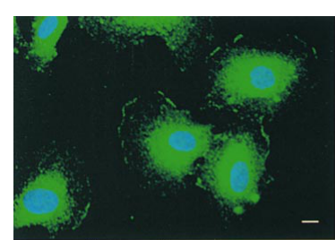

## Question

# Gene Research for Functional Annotation

## ⚠️ CRITICAL: Gene/Protein Identification Context

**BEFORE YOU BEGIN RESEARCH:** You MUST verify you are researching the CORRECT gene/protein. Gene symbols can be ambiguous, especially for less well-characterized genes from non-model organisms.

### Target Gene/Protein Identity (from UniProt):
- **UniProt Accession:** O43609
- **Protein Description:** RecName: Full=Protein sprouty homolog 1; Short=Spry-1;
- **Gene Information:** Name=SPRY1;
- **Organism (full):** Homo sapiens (Human).
- **Protein Family:** Belongs to the sprouty family. .
- **Key Domains:** Sprouty. (IPR007875); Sprouty_domain. (IPR051192); Sprouty (PF05210)

### MANDATORY VERIFICATION STEPS:

1. **Check if the gene symbol "SPRY1" matches the protein description above**
2. **Verify the organism is correct:** Homo sapiens (Human).
3. **Check if protein family/domains align with what you find in literature**
4. **If you find literature for a DIFFERENT gene with the same or similar symbol, STOP**

### If Gene Symbol is Ambiguous or You Cannot Find Relevant Literature:

**DO NOT PROCEED WITH RESEARCH ON A DIFFERENT GENE.** Instead:
- State clearly: "The gene symbol 'SPRY1' is ambiguous or literature is limited for this specific protein"
- Explain what you found (e.g., "Found extensive literature on a different gene with the same symbol in a different organism")
- Describe the protein based ONLY on the UniProt information provided above
- Suggest that the protein function can be inferred from domain/family information

### Research Target:

Please provide a comprehensive research report on the gene **SPRY1** (gene ID: SPRY1, UniProt: O43609) in human.

The research report should be a detailed narrative explaining the function, biological processes, and localization of the gene product. Citations should be given for all claims.

You should prioritize authoritative reviews and primary scientific literature when conducting research. You can supplement
this with annotations you find in gene/protein databases, but these can be outdated or inaccurate.

We are specifically interested in the primary function of the gene - for enzymes, what reaction is catalyzed, and what is the substrate specificity? For transporters, what is the substrate? For structural proteins or adapters, what is the broader structural role? For signaling molecules, what is the role in the pathway.

We are interested in where in or outside the cell the gene product carries out its function.

We are also interested in the signaling or biochemical pathways in which the gene functions. We are less interested in broad pleiotropic effects, except where these elucidate the precise role.

Include evidence where possible. We are interested in both experimental evidence as well as inference from structure, evolution, or bioinformatic analysis. Precise studies should be prioritized over high-throughput, where available.

## Output

Question: You are an expert researcher providing comprehensive, well-cited information.

Provide detailed information focusing on:
1. Key concepts and definitions with current understanding
2. Recent developments and latest research (prioritize 2023-2024 sources)
3. Current applications and real-world implementations
4. Expert opinions and analysis from authoritative sources
5. Relevant statistics and data from recent studies

Format as a comprehensive research report with proper citations. Include URLs and publication dates where available.
Always prioritize recent, authoritative sources and provide specific citations for all major claims.

# Gene Research for Functional Annotation

## ⚠️ CRITICAL: Gene/Protein Identification Context

**BEFORE YOU BEGIN RESEARCH:** You MUST verify you are researching the CORRECT gene/protein. Gene symbols can be ambiguous, especially for less well-characterized genes from non-model organisms.

### Target Gene/Protein Identity (from UniProt):
- **UniProt Accession:** O43609
- **Protein Description:** RecName: Full=Protein sprouty homolog 1; Short=Spry-1;
- **Gene Information:** Name=SPRY1;
- **Organism (full):** Homo sapiens (Human).
- **Protein Family:** Belongs to the sprouty family. .
- **Key Domains:** Sprouty. (IPR007875); Sprouty_domain. (IPR051192); Sprouty (PF05210)

### MANDATORY VERIFICATION STEPS:

1. **Check if the gene symbol "SPRY1" matches the protein description above**
2. **Verify the organism is correct:** Homo sapiens (Human).
3. **Check if protein family/domains align with what you find in literature**
4. **If you find literature for a DIFFERENT gene with the same or similar symbol, STOP**

### If Gene Symbol is Ambiguous or You Cannot Find Relevant Literature:

**DO NOT PROCEED WITH RESEARCH ON A DIFFERENT GENE.** Instead:
- State clearly: "The gene symbol 'SPRY1' is ambiguous or literature is limited for this specific protein"
- Explain what you found (e.g., "Found extensive literature on a different gene with the same symbol in a different organism")
- Describe the protein based ONLY on the UniProt information provided above
- Suggest that the protein function can be inferred from domain/family information

### Research Target:

Please provide a comprehensive research report on the gene **SPRY1** (gene ID: SPRY1, UniProt: O43609) in human.

The research report should be a detailed narrative explaining the function, biological processes, and localization of the gene product. Citations should be given for all claims.

You should prioritize authoritative reviews and primary scientific literature when conducting research. You can supplement
this with annotations you find in gene/protein databases, but these can be outdated or inaccurate.

We are specifically interested in the primary function of the gene - for enzymes, what reaction is catalyzed, and what is the substrate specificity? For transporters, what is the substrate? For structural proteins or adapters, what is the broader structural role? For signaling molecules, what is the role in the pathway.

We are interested in where in or outside the cell the gene product carries out its function.

We are also interested in the signaling or biochemical pathways in which the gene functions. We are less interested in broad pleiotropic effects, except where these elucidate the precise role.

Include evidence where possible. We are interested in both experimental evidence as well as inference from structure, evolution, or bioinformatic analysis. Precise studies should be prioritized over high-throughput, where available.

# Human SPRY1: functional annotation and evidence assessment

## Identity and principal function

The specified target is **human SPRY1, protein sprouty homolog 1 (UniProt [O43609](https://www.uniprot.org/uniprotkb/O43609/entry))**, not the related proteins SPRY2, SPRY3, SPRY4, or SPRED1. Its reported approximately 319-amino-acid sequence has a conserved C-terminal cysteine-rich **Sprouty domain** and a more variable N-terminus containing conserved Tyr53; this architecture agrees with the supplied InterPro/Pfam annotations. SPRY1 is best annotated as an **intracellular, membrane-associated regulator of growth-factor signaling**, principally a feedback brake on selected receptor-driven RAS–RAF–MEK–ERK responses. It is **not a demonstrated enzyme, transporter, secreted growth factor, or general-purpose inhibitor of every ERK response**. (sutterlutyfall2013tumorassociatedgrowthconditions pages 36-39, anerillas2024sprouty1isa pages 1-2, ozaki2005efficientsuppressionof pages 1-2, szybowska2021negativeregulationof pages 8-10)

The strongest mechanistic interpretation is that SPRY1 changes the assembly and duration of signaling complexes downstream of activated receptors. It associates with the adaptor GRB2; in an experimentally studied SPRY1–SPRY4 complex, SPRY1-associated GRB2 and SPRY4-associated SOS1 are less available for recruitment to the FGFR docking protein FRS2, reducing FGF2-induced ERK activation. This is **adaptor-level regulation**, not evidence that SPRY1 catalytically dephosphorylates or directly blocks the FGFR kinase. The exceptionally strong effect of the hetero-oligomer must not be attributed to SPRY1 acting alone. [Ozaki et al., *Journal of Cell Science*, December 2005](https://doi.org/10.1242/jcs.02711); [Szybowska et al., *Cells*, May 2021](https://doi.org/10.3390/cells10061342). (ozaki2005efficientsuppressionof pages 1-2, ozaki2005efficientsuppressionof pages 3-4, ozaki2005efficientsuppressionof pages 6-8, szybowska2021negativeregulationof pages 8-10)

## Where SPRY1 acts

SPRY1 operates **inside cells, particularly at intracellular membranes and the cytoplasmic face of the plasma membrane**. In primary human umbilical-vein endothelial cells, endogenous SPRY1 was observed in perinuclear and vesicular structures and at non-junctional leading-edge membrane regions. After FGF2 or VEGF stimulation, a fraction moved to the leading edge within approximately **30 minutes**. Biochemical experiments associated SPRY1 membrane anchoring with palmitoylation, and imaging showed colocalization with caveolin-1. These results identify a dynamic signaling-proximal location, rather than a constitutively extracellular or exclusively nuclear role. [Impagnatiello et al., *Journal of Cell Biology*, March 2001](https://doi.org/10.1083/jcb.152.5.1087). (impagnatiello2001mammaliansprouty1and pages 6-7, impagnatiello2001mammaliansprouty1and media e4a0361e, impagnatiello2001mammaliansprouty1and pages 3-5)

The localization evidence is cell-context dependent. A [February 2025 melanoma study](https://doi.org/10.1186/s13046-025-03289-8) reported predominantly mitochondrial SPRY1 in its BRAF-mutant melanoma models and linked SPRY1 knockout to altered mitochondrial function and HIF1α-dependent metabolism. This is an **additional, tumor-context observation**, not grounds to replace the directly observed endothelial perinuclear/vesicular and plasma-membrane localization with a universal mitochondrial annotation. (montico2025suppressionofspry1 pages 1-2)

## Pathways and experimentally supported processes

**FGF/VEGF signaling and angiogenic endothelial behavior.** In primary human endothelial cells expressing mouse Spry1 experimentally, FGF2- and VEGF-stimulated MEK/ERK activation, DNA synthesis, and formation of capillary-like networks were reduced. EGF-induced proliferation was also inhibited, *without* a corresponding reduction in EGF-induced ERK activation—an early demonstration that the output depends on the initiating receptor and readout. The experiment supports activity in human cells but used **adenoviral overexpression of mouse Spry1**, a distinction from manipulating endogenous human SPRY1. [Impagnatiello et al., March 2001](https://doi.org/10.1083/jcb.152.5.1087). (impagnatiello2001mammaliansprouty1and pages 3-5, mardakheh2010regulationoffgf pages 88-92)

An endogenous-SPRY1 perturbation provides complementary evidence: in primary endothelial-cell experiments, two siRNAs achieved approximately **60% SPRY1 mRNA reduction**. Silencing was associated with approximately **60% less caspase-3 activity**, approximately **70% greater migration without bFGF** and **60% greater migration with bFGF**, greater network formation, and increased growth-factor-associated ERK phosphorylation. These data support an anti-angiogenic function in this experimental setting; they do not establish a clinical anti-angiogenic treatment. [Sabatel et al., *Molecular Cancer*, September 2010](https://doi.org/10.1186/1476-4598-9-231). (sabatel2010sprouty1anew pages 4-6, sabatel2010sprouty1anew pages 2-4)

**GDNF–RET and FGF10–FGFR signaling during kidney branching.** The particularly compelling *in-vivo* evidence comes from **mouse genetic epistasis**, rather than an asserted direct SPRY1–RET physical interaction. Removing *Spry1* permitted extensive kidney and collecting-duct development in embryos lacking either *Gdnf* or *Ret*, although normal branch spacing, angle, and frequency were not restored. Critically, deleting **even one *Fgf10* allele** in the *Gdnf*-null/*Spry1*-null setting caused complete renal agenesis. Thus SPRY1 restrains RTK-dependent ureteric-bud outgrowth, while FGF10 signaling can compensate for missing GDNF–RET growth input when that brake is removed; RET remains important for normal patterning. This establishes pathway- and dosage-level function, **not** a human-specific catalytic mechanism. [Michos et al., *PLoS Genetics*, January 2010](https://doi.org/10.1371/journal.pgen.1000809). (michos2010kidneydevelopmentin pages 6-8, michos2010kidneydevelopmentin pages 3-6, michos2010kidneydevelopmentin pages 1-2)

**Why “ERK inhibitor” requires qualification.** When Spry1 was overexpressed in **mouse chondrocytes**, ligand-induced **FGFR2 ubiquitination and degradation decreased**, FGFR2 accumulated, and FGF2-induced ERK activation was prolonged; growth plates developed chondrodysplasia-like abnormalities. Thus, in a receptor-trafficking context, excess SPRY1 can *increase the duration* of FGFR–ERK output instead of suppressing it. The specific receptor, cell type, protein abundance, and signaling time scale matter. [Yang et al., *Developmental Biology*, September 2008](https://doi.org/10.1016/j.ydbio.2008.05.555). (yang2008overexpressionofspry1 pages 10-11, yang2008overexpressionofspry1 pages 1-2)

**Erythropoietin signaling.** SPRY1 is also induced during erythroid development and phosphorylated at **Tyr53 following EPO stimulation**. Conditional *Spry1* loss in mouse erythroid progenitors increased **JAK2 and ERK1/2 activation** and disturbed progression to mature erythroblasts, stress erythropoiesis, and recovery after hemolytic anemia. Human CD34-derived developing erythroid cells expressed SPRY1, but the strongest causal genetic evidence comes from mice. This extends the functional annotation to **EPOR–JAK2-associated feedback**, while the exact molecular step suppressing JAK2 remains to be resolved. [Sathyanarayana et al., *Blood*, June 2012](https://doi.org/10.1182/blood-2011-11-392571). (sathyanarayana2012spry1asa pages 1-2)

The following evidence map distinguishes SPRY1-specific perturbations, cooperative mechanisms, and experiments in which several Sprouty genes were removed together. (ozaki2005efficientsuppressionof pages 1-2, li2024sproutygenesregulate pages 1-2, li2024sproutygenesregulate pages 2-3)

| Pathway/context | Direct observation and model/species | Conclusion and important limits | Source |
|---|---|---|---|
| **FGF2/VEGF–ERK; membrane localization** | In primary human HUVECs, SPRY1 overexpression reduced FGF2- and VEGF-induced MEK–ERK activation, proliferation, and Matrigel network formation. Endogenous SPRY1 was perinuclear/vesicular, colocalized with caveolin-1, and a fraction moved to non-junctional leading-edge plasma membrane within 30 min of FGF2 or VEGF stimulation. | **Direct human-cell evidence.** Supports a membrane-associated intracellular RTK-feedback regulator, not a secreted factor, receptor, or enzyme. Adenoviral overexpression may exceed physiological abundance. | Impagnatiello et al., 2001, [J. Cell Biol.](https://doi.org/10.1083/jcb.152.5.1087) (impagnatiello2001mammaliansprouty1and pages 6-7, impagnatiello2001mammaliansprouty1and pages 3-5, impagnatiello2001mammaliansprouty1and media e4a0361e) |
| **FGF2–FRS2–GRB2/SOS1–ERK** | In transfected 293T and mouse Swiss 3T3 cells, SPRY1 associated with GRB2, SPRY4 associated with SOS1, and C-terminal-domain-mediated SPRY1–SPRY4 hetero-oligomers inhibited FGF2-induced GRB2 recruitment to FRS2. Knockdown of endogenous Spry1 prolonged ERK activation, especially 2–4 h after FGF2. | Supports **adaptor sequestration/complex remodeling**, not direct inhibition of FGFR catalytic activity. The strongest suppression required SPRY1 plus SPRY4, so it cannot be assigned to SPRY1 alone; much of the evidence used overexpression or mouse fibroblasts. | Ozaki et al., 2005, [J. Cell Sci.](https://doi.org/10.1242/jcs.02711) (ozaki2005efficientsuppressionof pages 1-2, ozaki2005efficientsuppressionof pages 3-4, ozaki2005efficientsuppressionof pages 6-8) |
| **GDNF–RET and FGF10–FGFR2 in renal branching** | Mouse *Gdnf−/−;Spry1−/−* and *Ret−/−;Spry1−/−* embryos formed kidneys with extensive collecting-duct branching, although branch spacing, angle, and frequency were abnormal. Removing even one *Fgf10* allele from the *Gdnf−/−;Spry1−/−* background caused complete renal agenesis; reducing *Spry1* dosage improved impaired FGF10 signaling. | Strong **in-vivo genetic epistasis** identifies Spry1 as a dosage-sensitive brake on RET- and FGFR-driven ureteric-bud growth. It does not establish a direct SPRY1–RET/FGFR physical interaction, and it is mouse—not direct human—evidence. | Michos et al., 2010, [PLoS Genet.](https://doi.org/10.1371/journal.pgen.1000809) (michos2010kidneydevelopmentin pages 6-8, michos2010kidneydevelopmentin pages 3-6, michos2010kidneydevelopmentin pages 1-2) |
| **FGFR trafficking in chondrocytes—contextual paradox** | Conditional Spry1 overexpression in mouse chondrocytes reduced ligand-induced FGFR2 ubiquitination and degradation, accelerated nuclear FGFR2 accumulation, and sustained FGF2-induced ERK signaling, producing chondrodysplasia-like growth-plate abnormalities. | Demonstrates that SPRY1 is **not invariably an ERK inhibitor**: by interfering with receptor downregulation, excess SPRY1 can prolong FGFR output. This is an overexpression model and may involve competition with CBL/GRB2 rather than normal physiological SPRY1 action. | Yang et al., 2008, [Dev. Biol.](https://doi.org/10.1016/j.ydbio.2008.05.555) (yang2008overexpressionofspry1 pages 10-11, yang2008overexpressionofspry1 pages 1-2) |
| **EPO–EPOR–JAK2/ERK erythroid feedback** | EPO induced SPRY1 Tyr53 phosphorylation in developing erythroid cells. Conditional mouse Spry1 deletion hyperactivated JAK2 and ERK1/2, caused reticulocytosis and splenic stress erythropoiesis, expanded progenitors, and delayed recovery from hemolytic anemia. SPRY1 was also highly expressed during human CD34-derived CFU-E-to-erythroblast development. | Extends SPRY1 beyond classical RTKs to **EPOR/JAK2 negative feedback**. Functional causality is principally from mice; the exact biochemical step by which SPRY1 suppresses JAK2 remains unresolved. | Sathyanarayana et al., 2012, [Blood](https://doi.org/10.1182/blood-2011-11-392571) (sathyanarayana2012spry1asa pages 1-2) |
| **Tyr53–p38 cellular senescence** | In human IMR90 fibroblasts, multiple senescence triggers increased SPRY1, while SPRY1 overexpression induced SA-β-gal, p21/p16, reduced BrdU incorporation, and loss of clonogenicity. SPRY1-Y53A failed to drive chronic p38 activation. Mouse *Spry1Y53A* fibroblasts escaped replicative senescence, and knock-in mice showed delayed wound- and doxorubicin-associated senescence; ERK kinetics were largely unchanged. | **Recent SPRY1-specific evidence** identifies Tyr53-dependent activation of a p38 senescence program distinct from canonical ERK inhibition. Human evidence is cell-culture based; in-vivo samples were small (often *n*=3–6, one wound comparison *n*=2), limiting translational certainty. | Anerillas et al., 2024, [Cell Death Dis.](https://doi.org/10.1038/s41419-024-06689-4) (anerillas2024sprouty1isa pages 2-3, anerillas2024sprouty1isa pages 9-10, anerillas2024sprouty1isa pages 6-8) |
| **Mammary fibroblast RTK signaling and branching** | Fibroblast-specific **triple loss of Spry1, Spry2, and Spry4** in mice increased ERBB/VEGFR/IGFR–ERK signaling, expanded FGF10-rich MSF-2 activated fibroblasts, and raised organoid branching from ~42% to ~80%; MSF-2 G2/M cells increased from ~28% to ~49%. | Causal phenotype belongs to the **Spry1/2/4 triple knockout**, not SPRY1 alone. It shows overlapping family control of stromal RTK signaling and epithelial morphogenesis but cannot quantify SPRY1’s individual contribution. | Li et al., 2024, [Cell Death Dis.](https://doi.org/10.1038/s41419-024-06637-2) (li2024sproutygenesregulate pages 1-2, li2024sproutygenesregulate pages 9-10, li2024sproutygenesregulate pages 2-3) |
| **Human breast-cancer fibroblast transcriptomics** | Bulk TCGA breast-tumor analysis showed lower SPRY1/2/4 transcripts, whereas human stromal-fibroblast single-cell data showed **SPRY1 increased** but SPRY2/4 decreased in cancer-associated fibroblasts; activated MSF-2-like fibroblasts expanded across ER-positive, HER2-positive, and triple-negative cancers. | The bulk-versus-single-cell contrast likely reflects cellular composition and fibroblast-state specificity. These are computational expression associations—not SPRY1 perturbation, protein-level validation, or proof that SPRY1 drives human breast cancer. | Li et al., 2024, [Cell Death Dis.](https://doi.org/10.1038/s41419-024-06637-2) (li2024sproutygenesregulate pages 10-11) |

*Table: Evidence-tier comparison of SPRY1 signaling mechanisms, localization, physiological contexts, and model-specific limitations. The table separates direct SPRY1 findings from paralog-cooperation and Spry1/2/4 triple-knockout evidence.*

## Research published in 2024

**SPRY1 Tyr53 and senescence.** [Anerillas et al., *Cell Death & Disease*, April 2024](https://doi.org/10.1038/s41419-024-06689-4) found that oncogenic RAS, etoposide, and oxidative stress increased Sprouty proteins in **human IMR90 fibroblasts**; SPRY1 overexpression produced senescence-associated markers and reduced clonogenicity and DNA synthesis. A Tyr53-to-alanine substitution compromised the response. In mouse fibroblasts and knock-in animals, the substitution impaired replicative, wound-associated, and chemotherapy-associated senescence. Unlike a simple FGF–ERK inhibition model, the experiments implicated **sustained p38 signaling upstream of senescence**, with ERK1/2 behavior insufficient to explain the phenotype. The human evidence is from cultured cells; the *in-vivo* evidence is mouse-based, with some groups small, including a wound comparison reported with **n = 2** heterozygous animals. (anerillas2024sprouty1isa pages 2-3, anerillas2024sprouty1isa pages 10-11, anerillas2024sprouty1isa pages 9-10, anerillas2024sprouty1isa pages 6-8)

**Activated mammary fibroblasts: important paralog limitation.** [Li et al., *Cell Death & Disease*, April 2024](https://doi.org/10.1038/s41419-024-06637-2) removed **Spry1, Spry2, and Spry4 together** in mouse mammary fibroblasts. The combined deletion elevated multiple receptor-signaling responses, expanded an FGF10-producing activated-fibroblast population, and increased the proportion of branching mammary organoid cultures from approximately **42% with control fibroblasts to 80% with triple-knockout fibroblasts**. Its activated MSF-2 subgroup increased from approximately **27% to 38%** of fibroblasts, and the MSF-2 G2/M fraction from approximately **28% to 49%**. These are valuable quantitative findings about **Sprouty-family redundancy**, *not* estimates of a SPRY1-only effect. (li2024sproutygenesregulate pages 1-2, li2024sproutygenesregulate pages 2-3, li2024sproutygenesregulate pages 5-9, li2024sproutygenesregulate pages 9-10)

The same report illustrates why bulk tumor RNA cannot be treated as a direct functional SPRY1 assay: bulk breast-tumor data suggested lower SPRY1 transcripts, whereas a human **cancer-associated-fibroblast single-cell** analysis found **higher SPRY1**, alongside lower SPRY2 and SPRY4, in that cell compartment. Those expression associations do not show that SPRY1 alone causes human breast-cancer progression. [Li et al., April 2024](https://doi.org/10.1038/s41419-024-06637-2). (li2024sproutygenesregulate pages 10-11)

A separate [August 2024 adult-onset mouse study](https://doi.org/10.1038/s41598-024-70529-w) found metabolic and endocrine abnormalities after **whole-body Spry1/2/4 triple deletion**, including phosphaturia and hypophosphatemia suggestive of altered FGF23 signaling, but **no increase in tumor incidence through one year**. This again tests combined Sprouty function and cautions against calling SPRY1 loss alone a sufficient cancer initiator. (altes2024multipleendocrinedefectsa pages 1-2)

## Human relevance and present applications

Human prostate-cancer tissue supplies one direct disease-associated observation: approximately **40%** of examined tumors had reduced SPRY1 protein relative to matched normal epithelium, with accompanying transcript reduction; prostate-cancer cells also lacked normal FGF-induced SPRY1 upregulation. This is consistent with impaired FGF feedback but is **not a clinically validated prognostic test or treatment selection rule**. [Kwabi-Addo et al., *Cancer Research*, July 2004](https://doi.org/10.1158/0008-5472.can-03-3759). (kwabiaddo2004theexpressionof pages 1-3)

SPRY1 currently has its clearest *applications as a research readout and experimental perturbation*: dissecting FGF/RET-dependent branching and congenital urinary-tract mechanisms, testing endothelial growth-factor responses, and probing cell-type-specific cancer signaling and senescence. For example, sequencing of **122** people with congenital kidney/urinary-tract anomalies implicated rare variants elsewhere in the GDNF–RET signaling network; that cohort **did not establish a pathogenic SPRY1 variant** and cannot be cited as direct proof of human SPRY1-associated disease. Likewise, the 16-kDa-prolactin colorectal-xenograft experiment associated tumor-growth delay with induced **mouse stromal/endothelial Spry1**, not induction in the human tumor cells. [Chatterjee et al., *Human Genetics*, June 2012](https://doi.org/10.1007/s00439-012-1181-3); [Sabatel et al., September 2010](https://doi.org/10.1186/1476-4598-9-231). (chatterjee2012traditionalandtargeted pages 1-3, sabatel2010sprouty1anew pages 2-4)

**Functional-annotation conclusion:** assign human SPRY1 a primary role as a **palmitoylated, dynamically membrane-associated modulator of receptor-driven signaling-complex assembly and signaling duration**, commonly restraining FGFR/RET-linked ERK output but capable of context-dependent effects on receptor turnover and distinct Tyr53-dependent p38/senescence or EPOR/JAK2 responses. The direct human-cell localization and signaling findings, mouse genetic pathway evidence, and newer human-cell senescence results support this annotation. Precisely how endogenous human SPRY1 chooses between these outputs—and whether any proposed SPRY1-directed intervention benefits patients—remains unresolved; neither SPRY2-specific biochemistry nor Spry1/2/4 triple-knockout phenotypes should fill that gap by assumption. (impagnatiello2001mammaliansprouty1and pages 6-7, ozaki2005efficientsuppressionof pages 1-2, michos2010kidneydevelopmentin pages 1-2, yang2008overexpressionofspry1 pages 10-11, sathyanarayana2012spry1asa pages 1-2, anerillas2024sprouty1isa pages 6-8, li2024sproutygenesregulate pages 1-2)

References

1. (sutterlutyfall2013tumorassociatedgrowthconditions pages 36-39): PDDH Sutterlüty-Fall. Tumor-associated growth conditions activate mechanisms regulating sprouty protein expression. Unknown journal, 2013.

2. (anerillas2024sprouty1isa pages 1-2): Carlos Anerillas, Aida Perramon-Güell, Gisela Altés, Sara Cuesta, Marta Vaquero, Anna Olomí, Ruth Rodríguez-Barrueco, David Llobet-Navàs, Joaquim Egea, Xavi Dolcet, Andrée Yeramian, and Mario Encinas. Sprouty1 is a broad mediator of cellular senescence. Cell Death &amp; Disease, Apr 2024. URL: https://doi.org/10.1038/s41419-024-06689-4, doi:10.1038/s41419-024-06689-4. This article has 7 citations and is from a peer-reviewed journal.

3. (ozaki2005efficientsuppressionof pages 1-2): Kei-ichi Ozaki, Satsuki Miyazaki, Susumu Tanimura, and Michiaki Kohno. Efficient suppression of fgf-2-induced erk activation by the cooperative interaction among mammalian sprouty isoforms. Journal of Cell Science, 118:5861-5871, Dec 2005. URL: https://doi.org/10.1242/jcs.02711, doi:10.1242/jcs.02711. This article has 83 citations and is from a domain leading peer-reviewed journal.

4. (szybowska2021negativeregulationof pages 8-10): Patrycja Szybowska, Michal Kostas, Jørgen Wesche, Ellen Margrethe Haugsten, and Antoni Wiedlocha. Negative regulation of fgfr (fibroblast growth factor receptor) signaling. Cells, 10:1342, May 2021. URL: https://doi.org/10.3390/cells10061342, doi:10.3390/cells10061342. This article has 67 citations.

5. (ozaki2005efficientsuppressionof pages 3-4): Kei-ichi Ozaki, Satsuki Miyazaki, Susumu Tanimura, and Michiaki Kohno. Efficient suppression of fgf-2-induced erk activation by the cooperative interaction among mammalian sprouty isoforms. Journal of Cell Science, 118:5861-5871, Dec 2005. URL: https://doi.org/10.1242/jcs.02711, doi:10.1242/jcs.02711. This article has 83 citations and is from a domain leading peer-reviewed journal.

6. (ozaki2005efficientsuppressionof pages 6-8): Kei-ichi Ozaki, Satsuki Miyazaki, Susumu Tanimura, and Michiaki Kohno. Efficient suppression of fgf-2-induced erk activation by the cooperative interaction among mammalian sprouty isoforms. Journal of Cell Science, 118:5861-5871, Dec 2005. URL: https://doi.org/10.1242/jcs.02711, doi:10.1242/jcs.02711. This article has 83 citations and is from a domain leading peer-reviewed journal.

7. (impagnatiello2001mammaliansprouty1and pages 6-7): Maria-Antonietta Impagnatiello, Stefan Weitzer, Grainne Gannon, Amelia Compagni, Matt Cotten, and Gerhard Christofori. Mammalian sprouty-1 and -2 are membrane-anchored phosphoprotein inhibitors of growth factor signaling in endothelial cells. The Journal of Cell Biology, 152(5):1087-1098, Mar 2001. URL: https://doi.org/10.1083/jcb.152.5.1087, doi:10.1083/jcb.152.5.1087. This article has 325 citations.

8. (impagnatiello2001mammaliansprouty1and media e4a0361e): Maria-Antonietta Impagnatiello, Stefan Weitzer, Grainne Gannon, Amelia Compagni, Matt Cotten, and Gerhard Christofori. Mammalian sprouty-1 and -2 are membrane-anchored phosphoprotein inhibitors of growth factor signaling in endothelial cells. The Journal of Cell Biology, 152(5):1087-1098, Mar 2001. URL: https://doi.org/10.1083/jcb.152.5.1087, doi:10.1083/jcb.152.5.1087. This article has 325 citations.

9. (impagnatiello2001mammaliansprouty1and pages 3-5): Maria-Antonietta Impagnatiello, Stefan Weitzer, Grainne Gannon, Amelia Compagni, Matt Cotten, and Gerhard Christofori. Mammalian sprouty-1 and -2 are membrane-anchored phosphoprotein inhibitors of growth factor signaling in endothelial cells. The Journal of Cell Biology, 152(5):1087-1098, Mar 2001. URL: https://doi.org/10.1083/jcb.152.5.1087, doi:10.1083/jcb.152.5.1087. This article has 325 citations.

10. (montico2025suppressionofspry1 pages 1-2): Barbara Montico, Giorgio Giurato, Roberto Guerrieri, Francesca Colizzi, Annamaria Salvati, Giovanni Nassa, Jessica Lamberti, Domenico Memoli, Patrizia Sabatelli, Marina Comelli, Arianna Bellazzo, Albina Fejza, Lucrezia Camicia, Lorena Baboci, Michele Dal Bo, Alessia Covre, Tuula A. Nyman, Alessandro Weisz, Agostino Steffan, Michele Maio, Luca Sigalotti, Maurizio Mongiat, Eva Andreuzzi, and Elisabetta Fratta. Suppression of spry1 reduces hif1α-dependent glycolysis and impairs angiogenesis in braf-mutant cutaneous melanoma. Journal of Experimental & Clinical Cancer Research : CR, Feb 2025. URL: https://doi.org/10.1186/s13046-025-03289-8, doi:10.1186/s13046-025-03289-8. This article has 11 citations.

11. (mardakheh2010regulationoffgf pages 88-92): F Khosravi Mardakheh. Regulation of fgf receptor signalling by sprouty and spred. Unknown journal, 2010.

12. (sabatel2010sprouty1anew pages 4-6): Céline Sabatel, Anne M Cornet, Sébastien P Tabruyn, Ludovic Malvaux, Karolien Castermans, Joseph A Martial, and Ingrid Struman. Sprouty1, a new target of the angiostatic agent 16k prolactin, negatively regulates angiogenesis. Molecular Cancer, 9:231-231, Sep 2010. URL: https://doi.org/10.1186/1476-4598-9-231, doi:10.1186/1476-4598-9-231. This article has 41 citations and is from a highest quality peer-reviewed journal.

13. (sabatel2010sprouty1anew pages 2-4): Céline Sabatel, Anne M Cornet, Sébastien P Tabruyn, Ludovic Malvaux, Karolien Castermans, Joseph A Martial, and Ingrid Struman. Sprouty1, a new target of the angiostatic agent 16k prolactin, negatively regulates angiogenesis. Molecular Cancer, 9:231-231, Sep 2010. URL: https://doi.org/10.1186/1476-4598-9-231, doi:10.1186/1476-4598-9-231. This article has 41 citations and is from a highest quality peer-reviewed journal.

14. (michos2010kidneydevelopmentin pages 6-8): Odyssé Michos, Cristina Cebrian, Deborah Hyink, Uta Grieshammer, Linda Williams, Vivette D'Agati, Jonathan D. Licht, Gail R. Martin, and Frank Costantini. Kidney development in the absence of gdnf and spry1 requires fgf10. PLoS Genetics, 6:e1000809, Jan 2010. URL: https://doi.org/10.1371/journal.pgen.1000809, doi:10.1371/journal.pgen.1000809. This article has 198 citations and is from a domain leading peer-reviewed journal.

15. (michos2010kidneydevelopmentin pages 3-6): Odyssé Michos, Cristina Cebrian, Deborah Hyink, Uta Grieshammer, Linda Williams, Vivette D'Agati, Jonathan D. Licht, Gail R. Martin, and Frank Costantini. Kidney development in the absence of gdnf and spry1 requires fgf10. PLoS Genetics, 6:e1000809, Jan 2010. URL: https://doi.org/10.1371/journal.pgen.1000809, doi:10.1371/journal.pgen.1000809. This article has 198 citations and is from a domain leading peer-reviewed journal.

16. (michos2010kidneydevelopmentin pages 1-2): Odyssé Michos, Cristina Cebrian, Deborah Hyink, Uta Grieshammer, Linda Williams, Vivette D'Agati, Jonathan D. Licht, Gail R. Martin, and Frank Costantini. Kidney development in the absence of gdnf and spry1 requires fgf10. PLoS Genetics, 6:e1000809, Jan 2010. URL: https://doi.org/10.1371/journal.pgen.1000809, doi:10.1371/journal.pgen.1000809. This article has 198 citations and is from a domain leading peer-reviewed journal.

17. (yang2008overexpressionofspry1 pages 10-11): Xuehui Yang, Lauren K. Harkins, Olga Zubanova, Anne Harrington, Dmitry Kovalenko, Robert J. Nadeau, Pei-Yu Chen, Jessica L. Toher, Volkhard Lindner, Lucy Liaw, and Robert Friesel. Overexpression of spry1 in chondrocytes causes attenuated fgfr ubiquitination and sustained erk activation resulting in chondrodysplasia. Developmental biology, 321 1:64-76, Sep 2008. URL: https://doi.org/10.1016/j.ydbio.2008.05.555, doi:10.1016/j.ydbio.2008.05.555. This article has 47 citations and is from a peer-reviewed journal.

18. (yang2008overexpressionofspry1 pages 1-2): Xuehui Yang, Lauren K. Harkins, Olga Zubanova, Anne Harrington, Dmitry Kovalenko, Robert J. Nadeau, Pei-Yu Chen, Jessica L. Toher, Volkhard Lindner, Lucy Liaw, and Robert Friesel. Overexpression of spry1 in chondrocytes causes attenuated fgfr ubiquitination and sustained erk activation resulting in chondrodysplasia. Developmental biology, 321 1:64-76, Sep 2008. URL: https://doi.org/10.1016/j.ydbio.2008.05.555, doi:10.1016/j.ydbio.2008.05.555. This article has 47 citations and is from a peer-reviewed journal.

19. (sathyanarayana2012spry1asa pages 1-2): Pradeep Sathyanarayana, Arvind Dev, Anamika Pradeep, Melanie Ufkin, Jonathan D. Licht, and Don M. Wojchowski. Spry1 as a novel regulator of erythropoiesis, epo/epor target, and suppressor of jak2. Blood, 119 23:5522-31, Jun 2012. URL: https://doi.org/10.1182/blood-2011-11-392571, doi:10.1182/blood-2011-11-392571. This article has 15 citations and is from a highest quality peer-reviewed journal.

20. (li2024sproutygenesregulate pages 1-2): Jiyong Li, Rongze Ma, Xuebing Wang, Yunzhe Lu, Jing Chen, Deyi Feng, Jiecan Zhou, Kun Xia, Ophir D. Klein, Hao Xie, and Pengfei Lu. Sprouty genes regulate activated fibroblasts in mammary epithelial development and breast cancer. Cell Death &amp; Disease, Apr 2024. URL: https://doi.org/10.1038/s41419-024-06637-2, doi:10.1038/s41419-024-06637-2. This article has 8 citations and is from a peer-reviewed journal.

21. (li2024sproutygenesregulate pages 2-3): Jiyong Li, Rongze Ma, Xuebing Wang, Yunzhe Lu, Jing Chen, Deyi Feng, Jiecan Zhou, Kun Xia, Ophir D. Klein, Hao Xie, and Pengfei Lu. Sprouty genes regulate activated fibroblasts in mammary epithelial development and breast cancer. Cell Death &amp; Disease, Apr 2024. URL: https://doi.org/10.1038/s41419-024-06637-2, doi:10.1038/s41419-024-06637-2. This article has 8 citations and is from a peer-reviewed journal.

22. (anerillas2024sprouty1isa pages 2-3): Carlos Anerillas, Aida Perramon-Güell, Gisela Altés, Sara Cuesta, Marta Vaquero, Anna Olomí, Ruth Rodríguez-Barrueco, David Llobet-Navàs, Joaquim Egea, Xavi Dolcet, Andrée Yeramian, and Mario Encinas. Sprouty1 is a broad mediator of cellular senescence. Cell Death &amp; Disease, Apr 2024. URL: https://doi.org/10.1038/s41419-024-06689-4, doi:10.1038/s41419-024-06689-4. This article has 7 citations and is from a peer-reviewed journal.

23. (anerillas2024sprouty1isa pages 9-10): Carlos Anerillas, Aida Perramon-Güell, Gisela Altés, Sara Cuesta, Marta Vaquero, Anna Olomí, Ruth Rodríguez-Barrueco, David Llobet-Navàs, Joaquim Egea, Xavi Dolcet, Andrée Yeramian, and Mario Encinas. Sprouty1 is a broad mediator of cellular senescence. Cell Death &amp; Disease, Apr 2024. URL: https://doi.org/10.1038/s41419-024-06689-4, doi:10.1038/s41419-024-06689-4. This article has 7 citations and is from a peer-reviewed journal.

24. (anerillas2024sprouty1isa pages 6-8): Carlos Anerillas, Aida Perramon-Güell, Gisela Altés, Sara Cuesta, Marta Vaquero, Anna Olomí, Ruth Rodríguez-Barrueco, David Llobet-Navàs, Joaquim Egea, Xavi Dolcet, Andrée Yeramian, and Mario Encinas. Sprouty1 is a broad mediator of cellular senescence. Cell Death &amp; Disease, Apr 2024. URL: https://doi.org/10.1038/s41419-024-06689-4, doi:10.1038/s41419-024-06689-4. This article has 7 citations and is from a peer-reviewed journal.

25. (li2024sproutygenesregulate pages 9-10): Jiyong Li, Rongze Ma, Xuebing Wang, Yunzhe Lu, Jing Chen, Deyi Feng, Jiecan Zhou, Kun Xia, Ophir D. Klein, Hao Xie, and Pengfei Lu. Sprouty genes regulate activated fibroblasts in mammary epithelial development and breast cancer. Cell Death &amp; Disease, Apr 2024. URL: https://doi.org/10.1038/s41419-024-06637-2, doi:10.1038/s41419-024-06637-2. This article has 8 citations and is from a peer-reviewed journal.

26. (li2024sproutygenesregulate pages 10-11): Jiyong Li, Rongze Ma, Xuebing Wang, Yunzhe Lu, Jing Chen, Deyi Feng, Jiecan Zhou, Kun Xia, Ophir D. Klein, Hao Xie, and Pengfei Lu. Sprouty genes regulate activated fibroblasts in mammary epithelial development and breast cancer. Cell Death &amp; Disease, Apr 2024. URL: https://doi.org/10.1038/s41419-024-06637-2, doi:10.1038/s41419-024-06637-2. This article has 8 citations and is from a peer-reviewed journal.

27. (anerillas2024sprouty1isa pages 10-11): Carlos Anerillas, Aida Perramon-Güell, Gisela Altés, Sara Cuesta, Marta Vaquero, Anna Olomí, Ruth Rodríguez-Barrueco, David Llobet-Navàs, Joaquim Egea, Xavi Dolcet, Andrée Yeramian, and Mario Encinas. Sprouty1 is a broad mediator of cellular senescence. Cell Death &amp; Disease, Apr 2024. URL: https://doi.org/10.1038/s41419-024-06689-4, doi:10.1038/s41419-024-06689-4. This article has 7 citations and is from a peer-reviewed journal.

28. (li2024sproutygenesregulate pages 5-9): Jiyong Li, Rongze Ma, Xuebing Wang, Yunzhe Lu, Jing Chen, Deyi Feng, Jiecan Zhou, Kun Xia, Ophir D. Klein, Hao Xie, and Pengfei Lu. Sprouty genes regulate activated fibroblasts in mammary epithelial development and breast cancer. Cell Death &amp; Disease, Apr 2024. URL: https://doi.org/10.1038/s41419-024-06637-2, doi:10.1038/s41419-024-06637-2. This article has 8 citations and is from a peer-reviewed journal.

29. (altes2024multipleendocrinedefectsa pages 1-2): Gisela Altés, Anna Olomí, Aida Perramon-Güell, Sara Hernández, Anna Casanovas, Aurora Pérez, Juan Miguel Díaz-Tocados, José Manuel Valdivielso, Cristina Megino, Raúl Navaridas, Xavier Matias-Guiu, Ophir D. Klein, Joaquim Egea, Xavi Dolcet, Andrée Yeramian, and Mario Encinas. Multiple endocrine defects in adult-onset sprouty1/2/4 triple knockout mice. Scientific Reports, Aug 2024. URL: https://doi.org/10.1038/s41598-024-70529-w, doi:10.1038/s41598-024-70529-w. This article has 1 citations and is from a peer-reviewed journal.

30. (kwabiaddo2004theexpressionof pages 1-3): Bernard Kwabi-Addo, Jianghua Wang, Halime Erdem, Ajula Vaid, Patricia Castro, Gustavo Ayala, and Michael Ittmann. The expression of sprouty1, an inhibitor of fibroblast growth factor signal transduction, is decreased in human prostate cancer. Cancer Research, 64:4728-4735, Jul 2004. URL: https://doi.org/10.1158/0008-5472.can-03-3759, doi:10.1158/0008-5472.can-03-3759. This article has 154 citations and is from a highest quality peer-reviewed journal.

31. (chatterjee2012traditionalandtargeted pages 1-3): Rajshekhar Chatterjee, Enrique Ramos, Mary Hoffman, Jessica VanWinkle, Daniel R. Martin, Thomas K. Davis, Masato Hoshi, Stanley P. Hmiel, Anne Beck, Keith Hruska, Doug Coplen, Helen Liapis, Robi Mitra, Todd Druley, Paul Austin, and Sanjay Jain. Traditional and targeted exome sequencing reveals common, rare and novel functional deleterious variants in ret-signaling complex in a cohort of living us patients with urinary tract malformations. Human Genetics, 131:1725-1738, Jun 2012. URL: https://doi.org/10.1007/s00439-012-1181-3, doi:10.1007/s00439-012-1181-3. This article has 109 citations and is from a peer-reviewed journal.

## Artifacts

- [Edison artifact artifact-00](SPRY1-deep-research-falcon_artifacts/artifact-00.md)

## Citations

1. li2024sproutygenesregulate pages 10-11
2. altes2024multipleendocrinedefectsa pages 1-2
3. kwabiaddo2004theexpressionof pages 1-3
4. sutterlutyfall2013tumorassociatedgrowthconditions pages 36-39
5. ozaki2005efficientsuppressionof pages 1-2
6. szybowska2021negativeregulationof pages 8-10
7. ozaki2005efficientsuppressionof pages 3-4
8. ozaki2005efficientsuppressionof pages 6-8
9. mardakheh2010regulationoffgf pages 88-92
10. michos2010kidneydevelopmentin pages 6-8
11. michos2010kidneydevelopmentin pages 3-6
12. michos2010kidneydevelopmentin pages 1-2
13. li2024sproutygenesregulate pages 1-2
14. li2024sproutygenesregulate pages 2-3
15. li2024sproutygenesregulate pages 9-10
16. li2024sproutygenesregulate pages 5-9
17. chatterjee2012traditionalandtargeted pages 1-3
18. O43609
19. Ozaki et al., *Journal of Cell Science*, December 2005
20. Szybowska et al., *Cells*, May 2021
21. Impagnatiello et al., *Journal of Cell Biology*, March 2001
22. February 2025 melanoma study
23. Impagnatiello et al., March 2001
24. Sabatel et al., *Molecular Cancer*, September 2010
25. Michos et al., *PLoS Genetics*, January 2010
26. Yang et al., *Developmental Biology*, September 2008
27. Sathyanarayana et al., *Blood*, June 2012
28. J. Cell Biol.
29. J. Cell Sci.
30. PLoS Genet.
31. Dev. Biol.
32. Blood
33. Cell Death Dis.
34. Anerillas et al., *Cell Death & Disease*, April 2024
35. Li et al., *Cell Death & Disease*, April 2024
36. Li et al., April 2024
37. August 2024 adult-onset mouse study
38. Kwabi-Addo et al., *Cancer Research*, July 2004
39. Chatterjee et al., *Human Genetics*, June 2012
40. Sabatel et al., September 2010
41. https://www.uniprot.org/uniprotkb/O43609/entry
42. https://doi.org/10.1242/jcs.02711
43. https://doi.org/10.3390/cells10061342
44. https://doi.org/10.1083/jcb.152.5.1087
45. https://doi.org/10.1186/s13046-025-03289-8
46. https://doi.org/10.1186/1476-4598-9-231
47. https://doi.org/10.1371/journal.pgen.1000809
48. https://doi.org/10.1016/j.ydbio.2008.05.555
49. https://doi.org/10.1182/blood-2011-11-392571
50. https://doi.org/10.1038/s41419-024-06689-4
51. https://doi.org/10.1038/s41419-024-06637-2
52. https://doi.org/10.1038/s41598-024-70529-w
53. https://doi.org/10.1158/0008-5472.can-03-3759
54. https://doi.org/10.1007/s00439-012-1181-3
55. https://doi.org/10.1038/s41419-024-06689-4,
56. https://doi.org/10.1242/jcs.02711,
57. https://doi.org/10.3390/cells10061342,
58. https://doi.org/10.1083/jcb.152.5.1087,
59. https://doi.org/10.1186/s13046-025-03289-8,
60. https://doi.org/10.1186/1476-4598-9-231,
61. https://doi.org/10.1371/journal.pgen.1000809,
62. https://doi.org/10.1016/j.ydbio.2008.05.555,
63. https://doi.org/10.1182/blood-2011-11-392571,
64. https://doi.org/10.1038/s41419-024-06637-2,
65. https://doi.org/10.1038/s41598-024-70529-w,
66. https://doi.org/10.1158/0008-5472.can-03-3759,
67. https://doi.org/10.1007/s00439-012-1181-3,