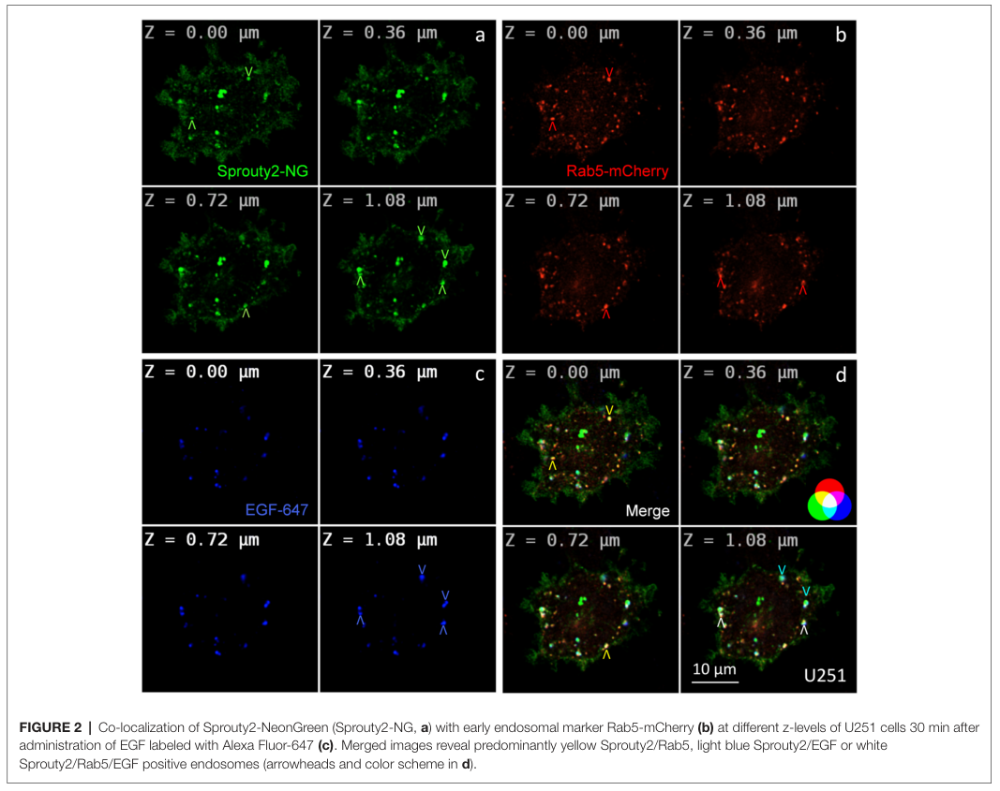

## Question

# Gene Research for Functional Annotation

## ⚠️ CRITICAL: Gene/Protein Identification Context

**BEFORE YOU BEGIN RESEARCH:** You MUST verify you are researching the CORRECT gene/protein. Gene symbols can be ambiguous, especially for less well-characterized genes from non-model organisms.

### Target Gene/Protein Identity (from UniProt):
- **UniProt Accession:** O43597
- **Protein Description:** RecName: Full=Protein sprouty homolog 2; Short=Spry-2;
- **Gene Information:** Name=SPRY2;
- **Organism (full):** Homo sapiens (Human).
- **Protein Family:** Belongs to the sprouty family. .
- **Key Domains:** Sprouty. (IPR007875); Sprouty_domain. (IPR051192); Sprouty (PF05210)

### MANDATORY VERIFICATION STEPS:

1. **Check if the gene symbol "SPRY2" matches the protein description above**
2. **Verify the organism is correct:** Homo sapiens (Human).
3. **Check if protein family/domains align with what you find in literature**
4. **If you find literature for a DIFFERENT gene with the same or similar symbol, STOP**

### If Gene Symbol is Ambiguous or You Cannot Find Relevant Literature:

**DO NOT PROCEED WITH RESEARCH ON A DIFFERENT GENE.** Instead:
- State clearly: "The gene symbol 'SPRY2' is ambiguous or literature is limited for this specific protein"
- Explain what you found (e.g., "Found extensive literature on a different gene with the same symbol in a different organism")
- Describe the protein based ONLY on the UniProt information provided above
- Suggest that the protein function can be inferred from domain/family information

### Research Target:

Please provide a comprehensive research report on the gene **SPRY2** (gene ID: SPRY2, UniProt: O43597) in human.

The research report should be a detailed narrative explaining the function, biological processes, and localization of the gene product. Citations should be given for all claims.

You should prioritize authoritative reviews and primary scientific literature when conducting research. You can supplement
this with annotations you find in gene/protein databases, but these can be outdated or inaccurate.

We are specifically interested in the primary function of the gene - for enzymes, what reaction is catalyzed, and what is the substrate specificity? For transporters, what is the substrate? For structural proteins or adapters, what is the broader structural role? For signaling molecules, what is the role in the pathway.

We are interested in where in or outside the cell the gene product carries out its function.

We are also interested in the signaling or biochemical pathways in which the gene functions. We are less interested in broad pleiotropic effects, except where these elucidate the precise role.

Include evidence where possible. We are interested in both experimental evidence as well as inference from structure, evolution, or bioinformatic analysis. Precise studies should be prioritized over high-throughput, where available.

## Output

Question: You are an expert researcher providing comprehensive, well-cited information.

Provide detailed information focusing on:
1. Key concepts and definitions with current understanding
2. Recent developments and latest research (prioritize 2023-2024 sources)
3. Current applications and real-world implementations
4. Expert opinions and analysis from authoritative sources
5. Relevant statistics and data from recent studies

Format as a comprehensive research report with proper citations. Include URLs and publication dates where available.
Always prioritize recent, authoritative sources and provide specific citations for all major claims.

# Gene Research for Functional Annotation

## ⚠️ CRITICAL: Gene/Protein Identification Context

**BEFORE YOU BEGIN RESEARCH:** You MUST verify you are researching the CORRECT gene/protein. Gene symbols can be ambiguous, especially for less well-characterized genes from non-model organisms.

### Target Gene/Protein Identity (from UniProt):
- **UniProt Accession:** O43597
- **Protein Description:** RecName: Full=Protein sprouty homolog 2; Short=Spry-2;
- **Gene Information:** Name=SPRY2;
- **Organism (full):** Homo sapiens (Human).
- **Protein Family:** Belongs to the sprouty family. .
- **Key Domains:** Sprouty. (IPR007875); Sprouty_domain. (IPR051192); Sprouty (PF05210)

### MANDATORY VERIFICATION STEPS:

1. **Check if the gene symbol "SPRY2" matches the protein description above**
2. **Verify the organism is correct:** Homo sapiens (Human).
3. **Check if protein family/domains align with what you find in literature**
4. **If you find literature for a DIFFERENT gene with the same or similar symbol, STOP**

### If Gene Symbol is Ambiguous or You Cannot Find Relevant Literature:

**DO NOT PROCEED WITH RESEARCH ON A DIFFERENT GENE.** Instead:
- State clearly: "The gene symbol 'SPRY2' is ambiguous or literature is limited for this specific protein"
- Explain what you found (e.g., "Found extensive literature on a different gene with the same symbol in a different organism")
- Describe the protein based ONLY on the UniProt information provided above
- Suggest that the protein function can be inferred from domain/family information

### Research Target:

Please provide a comprehensive research report on the gene **SPRY2** (gene ID: SPRY2, UniProt: O43597) in human.

The research report should be a detailed narrative explaining the function, biological processes, and localization of the gene product. Citations should be given for all claims.

You should prioritize authoritative reviews and primary scientific literature when conducting research. You can supplement
this with annotations you find in gene/protein databases, but these can be outdated or inaccurate.

We are specifically interested in the primary function of the gene - for enzymes, what reaction is catalyzed, and what is the substrate specificity? For transporters, what is the substrate? For structural proteins or adapters, what is the broader structural role? For signaling molecules, what is the role in the pathway.

We are interested in where in or outside the cell the gene product carries out its function.

We are also interested in the signaling or biochemical pathways in which the gene functions. We are less interested in broad pleiotropic effects, except where these elucidate the precise role.

Include evidence where possible. We are interested in both experimental evidence as well as inference from structure, evolution, or bioinformatic analysis. Precise studies should be prioritized over high-throughput, where available.

# Human SPRY2 (UniProt O43597): functional-annotation research report

## Identity and principal function

**Identity verified.** Human **SPRY2** encodes protein sprouty homolog 2, also called Spry-2. A 2024 review explicitly assigns **O43597** to human SPRY2, distinguishing it from SPRY1 (O43609), SPRY3 (O43610), and SPRY4 (Q9C004). The reviewed protein is 315 amino acids long (approximately 34.7 kDa) and belongs to the sprouty family, whose members share a C-terminal cysteine-rich *Sprouty* domain. This matches the supplied IPR007875/IPR051192/PF05210 annotation; it is **not** a report about a similarly named domain in another protein. [UniProt record](https://www.uniprot.org/uniprotkb/O43597/entry); Puranik *et al.*, October 2024, [doi:10.3390/ijms252011043](https://doi.org/10.3390/ijms252011043). (puranik2024sprouty2anegative pages 3-4, locatelli2020identificationofkey pages 1-3)

**Primary functional annotation:** SPRY2 is an *intracellular, regulated signaling adaptor/antagonist* that limits the amplitude or duration of signaling initiated by selected receptor tyrosine kinases (RTKs), especially **FGF–FGFR → RAS → RAF → MEK → ERK**. Growth-factor signaling also induces sprouty expression, establishing negative feedback. SPRY2 is **not an enzyme**: it has no established reaction or substrate specificity of its own. Its defining activity is to associate with signaling proteins and membrane compartments, thereby changing adaptor assembly, downstream signaling, or receptor trafficking. Its effect is ligand- and cell-context-dependent rather than a universal inhibition of every RTK. Puranik *et al.*, 2024; Lao *et al.*, October 2006, [doi:10.1074/jbc.M604044200](https://doi.org/10.1074/jbc.M604044200); Hausott and Klimaschewski, 2019, [doi:10.1007/s12035-018-1338-8](https://doi.org/10.1007/s12035-018-1338-8). (puranik2024sprouty2anegative pages 3-4, lao2006asrchomology pages 3-4, puranik2024sprouty2anegative pages 10-12, puranik2024sprouty2anegative pages 1-3)

## Molecular mechanism and pathway position

Upon RTK stimulation, SPRY2 can be phosphorylated at conserved **Tyr55** and recruited to receptor-proximal signaling sites. In human-SPRY2 experiments, Tyr55 and neighboring residues support binding to the E3 ubiquitin ligase **c-Cbl**; the Y55F mutant fails to retain activated EGFR at the cell surface. In the **EGF–EGFR** setting, competition for c-Cbl can therefore reduce EGFR removal and *prolong*, rather than suppress, ERK signaling. Conversely, wild-type SPRY2 inhibits FGFR-dependent ERK activation. These opposing observations are essential to interpreting an SPRY2 perturbation. Fong *et al.*, August 2003, [doi:10.1074/jbc.M301317200](https://doi.org/10.1074/jbc.M301317200). (fong2003tyrosinephosphorylationof pages 1-1, fong2003tyrosinephosphorylationof pages 7-8)

**GRB2 and the precise inhibitory step remain context-dependent.** The influential adaptor model proposes that SPRY2 diverts GRB2 from receptor/FRS2–SOS signaling complexes, reducing RAS-to-ERK transmission. However, direct mutagenesis found that SPRY2–GRB2 association depends on a **C-terminal PXXPXR motif**, whereas direct binding of phosphorylated SPRY2 Tyr55 to the **GRB2 SH2 domain was not demonstrated**; Tyr55 instead provides a c-Cbl-recognition site. Moreover, subsequent experiments summarized in the 2024 review reported FGF-dependent ERK suppression even when GRB2 binding or RAS-GTP loading was unaffected, implicating inhibition nearer **RAF** in that system. Thus, “SPRY2 always inhibits RAS by binding GRB2 through phospho-Tyr55” is too strong an annotation. Lao *et al.*, 2006; Puranik *et al.*, 2024. (lao2006asrchomology pages 8-9, puranik2024sprouty2anegative pages 10-12)

A second experimentally supported output is **PLCγ signaling**. SPRY2 associates with PLCγ1/PLCγ2, and mutation of SPRY2 Tyr55 disrupts binding to the PLCγ SH2-region reagent. Sprouty overexpression decreases PLCγ phosphorylation and production of its downstream second messengers **IP₃ and diacylglycerol**, with reduced calcium-dependent signaling. Some loss-of-function measurements used *combined* Spry1/2/4-deficient cells or mouse Spry2-deficient mast cells; they establish pathway involvement but should not all be interpreted as an isolated human-SPRY2 effect. Akbulut *et al.*, October 2010, [doi:10.1091/mbc.e10-02-0123](https://doi.org/10.1091/mbc.e10-02-0123). (akbulut2010sproutyproteinsinhibit pages 1-2, akbulut2010sproutyproteinsinhibit pages 4-5)

The following table distinguishes the principal experimentally observed mechanisms and their evidentiary settings. (fong2003tyrosinephosphorylationof pages 1-1, lao2006asrchomology pages 3-4, akbulut2010sproutyproteinsinhibit pages 1-2, hausott2019subcellularlocalizationof pages 4-7, butler2023sacylationofsprouty pages 171-175)

| Molecular context | Experimentally established SPRY2 effect | Evidence type | Publication DOI/year |
|---|---|---|---|
| FGFR–RAS/ERK; GRB2 | SPRY2 was the strongest tested SPRY-family inhibitor of FGFR-stimulated ERK phosphorylation. Inhibition correlated with GRB2 binding through a cryptic C-terminal **PXXPXR** motif; direct binding of phospho-Tyr55 to the GRB2 SH2 domain was not supported. (lao2006asrchomology pages 3-4, lao2006asrchomology pages 8-9) | Mutagenesis, co-immunoprecipitation/binding assays, and phospho-ERK immunoblotting in 293T and PC12 cells | Lao et al., **2006**; [10.1074/jbc.M604044200](https://doi.org/10.1074/jbc.M604044200) |
| EGFR trafficking; c-Cbl | Growth-factor-induced phosphorylation of **Tyr55** enhanced SPRY2 binding to c-Cbl. A Y55F mutant failed to retain EGFR at the cell surface, supporting a context-specific mechanism in which SPRY2 diverts c-Cbl from EGFR, reduces receptor endocytosis, and can prolong EGF–ERK signaling. (fong2003tyrosinephosphorylationof pages 7-8, fong2003tyrosinephosphorylationof pages 1-1) | Site-directed mutagenesis, c-Cbl interaction assays, receptor-surface retention, and ERK assays | Fong et al., **2003**; [10.1074/jbc.M301317200](https://doi.org/10.1074/jbc.M301317200) |
| PLCγ signaling | SPRY2 associated with PLCγ1/PLCγ2 through the PLCγ SH2 region; SPRY2 Y55 mutation disrupted binding. SPRY1/2 overexpression reduced PLCγ phosphorylation, IP3/DAG production, and calcium-dependent signaling. SPRY2-null mast cells and combined Spry1/2/4-null fibroblasts increased inositol-phosphate output, so some functional evidence is family-level rather than uniquely attributable to human SPRY2. (akbulut2010sproutyproteinsinhibit pages 3-4, akbulut2010sproutyproteinsinhibit pages 1-2, akbulut2010sproutyproteinsinhibit pages 4-5) | Yeast two-hybrid/co-immunoprecipitation, Y55 mutagenesis, phospho-PLCγ assays, inositol-phosphate measurements, reporter assays, and mouse-family knockouts | Akbulut et al., **2010**; [10.1091/mbc.e10-02-0123](https://doi.org/10.1091/mbc.e10-02-0123) |
| Cytoplasm, plasma membrane, and endosomes | In human glioma cells, SPRY2 occurred in cytoplasmic puncta, at membrane ruffles, and on early, late, and recycling endosomes; it partly colocalized with activated ERK and cytoskeletal structures. This places its RTK-regulatory activity at receptor-proximal membranes and trafficking compartments rather than in one fixed organelle. (hausott2019subcellularlocalizationof pages 1-3, hausott2019subcellularlocalizationof media 4a4dfba5, hausott2019subcellularlocalizationof pages 4-7) | Super-resolution fluorescence microscopy, live-cell marker colocalization, immunofluorescence, and immunoelectron microscopy | Hausott et al., **2019**; [10.3389/fnmol.2019.00073](https://doi.org/10.3389/fnmol.2019.00073) |
| SPRY2 cysteine-rich domain; membrane targeting | zDHHC17 preferentially S-acylated SPRY2 at **Cys265/Cys268**; Asp214 and Lys223 were also required for efficient modification. Acylation-defective mutants showed reduced plasma-membrane localization and stability, linking the cysteine-rich domain to membrane recruitment. (locatelli2020identificationofkey pages 27-31, locatelli2020identificationofkey pages 1-3, locatelli2020identificationofkey pages 5-7) | Palmitate-azide metabolic labeling/click chemistry, mutagenesis, cycloheximide chase, and confocal microscopy | Locatelli et al., **2020**; [10.1242/jcs.249664](https://doi.org/10.1242/jcs.249664) |
| zDHHC17 substrate recognition | SPRY2 retained zDHHC17 binding and S-acylation after disruption or removal of the canonical zDHHC17 ankyrin-binding mechanism. A SPRY2 fragment spanning residues **155–315**, containing the SPR/cysteine-rich region, remained competent for binding and acylation, supporting an additional noncanonical recognition mode; its exact interface remains unresolved. (butler2023sacylationofsprouty pages 171-175) | Truncation and interaction mutants, co-immunoprecipitation, S-acylation assays, and localization analysis | Butler et al., **2023**; [10.1016/j.jbc.2022.102754](https://doi.org/10.1016/j.jbc.2022.102754) |
| B-cell receptor–SYK–RAF–ERK signaling in CLL | SPRY2 bound and antagonized SYK, RAF1, and BRAF, attenuating B-cell-receptor/MAPK–ERK signaling. Patient-derived poor-prognosis CLL cells had lower SPRY2 expression; restoring SPRY2 increased apoptosis, whereas reducing it promoted proliferation. These findings establish disease-context function but not an approved SPRY2-directed treatment. (shukla2016sprouty2a pages 1-2) | Patient-cell expression analysis, gain-/loss-of-function assays, protein-interaction studies, xenografts, and B-cell-specific transgenic mice | Shukla et al., **2016**; [10.1182/blood-2015-09-669317](https://doi.org/10.1182/blood-2015-09-669317) |

*Table: Primary experimental evidence defining the signaling, trafficking, localization, and lipidation functions of human SPRY2 (UniProt O43597). The table distinguishes SPRY2-specific results from family-level or animal evidence.*

## Where SPRY2 acts

SPRY2 acts on the **cytosolic side of cellular membranes**, rather than as a secreted ligand or integral membrane receptor. Growth-factor stimulation can redistribute a cytoplasmic pool to **plasma-membrane ruffles**. Its C-terminal cysteine-rich region participates in membrane recruitment, and S-acylation contributes to membrane targeting and protein stability. Locatelli *et al.*, November 2020, [doi:10.1242/jcs.249664](https://doi.org/10.1242/jcs.249664); Puranik *et al.*, 2024. (locatelli2020identificationofkey pages 1-3, puranik2024sprouty2anegative pages 10-12)

Direct microscopy of **human glioma cells** also places SPRY2 in cytoplasmic puncta **smaller than 100 nm**, partly associated with vimentin and activated ERK, and on **early, late, and recycling endosomes**. In U251 cells, the measured object-based correlation with the early-endosome marker Rab5 was **0.49 ± 0.08**; some SPRY2-positive endosomes contained internalized fluorescent EGF 30 minutes after treatment. Immunoelectron microscopy supported association with late-endosomal membranes. The observed location therefore fits regulation both near activated cell-surface receptors and during intracellular receptor trafficking; localization can differ by cell type and expression level. Hausott *et al.*, March 2019, [doi:10.3389/fnmol.2019.00073](https://doi.org/10.3389/fnmol.2019.00073). (hausott2019subcellularlocalizationof pages 1-3, hausott2019subcellularlocalizationof media 4a4dfba5, hausott2019subcellularlocalizationof pages 4-7)

## Recent research, 2023–2024

A **2023 biochemical study** extended the explanation for SPRY2 membrane targeting. Truncation experiments showed that a SPRY2 fragment comprising **residues 155–315** still associated with the S-acyltransferase **zDHHC17** and underwent S-acylation despite removal of the canonical upstream recognition region; SPRY2 also retained some association when canonical zDHHC17 ankyrin-mediated recognition was disrupted. This supports an *additional* interaction mode involving the Sprouty-domain-containing region, although its precise contact residues remain unresolved. Earlier mutagenesis had identified **Cys265/Cys268** as important for zDHHC17-dependent modification and showed that acylation-defective SPRY2 loses plasma-membrane enrichment and stability. Butler *et al.*, January 2023, [doi:10.1016/j.jbc.2022.102754](https://doi.org/10.1016/j.jbc.2022.102754); Locatelli *et al.*, 2020. (butler2023sacylationofsprouty pages 171-175, locatelli2020identificationofkey pages 1-3, locatelli2020identificationofkey pages 5-7)

The **October 2024 review** consolidated phosphorylation, adaptor binding, trafficking, and nervous-system studies while emphasizing that the complete molecular mechanism and the contribution of **BDNF-linked** SPRY2 signaling remain incompletely resolved. Its discussion of nervous-system therapy draws chiefly on cellular and animal perturbations, not demonstrated clinical efficacy. An example of the distinction is a report of reduced SPRY2 and BDNF expression in RNA from **100 people** studied in relation to bipolar disorder and schizophrenia: the review notes potential confounding by antipsychotic treatment, so this association does not establish an SPRY2-caused disorder. Puranik *et al.*, October 2024. (puranik2024sprouty2anegative pages 16-17, puranik2024sprouty2anegative pages 18-20, puranik2024sprouty2anegative pages 1-3)

## Biological significance and real-world relevance

The most direct developmental interpretation is **feedback control of growth-factor-dependent cell decisions**. The 2024 review reports broad human tissue expression, with relatively high expression in the cerebellum; experimental depletion of SPRY2 in **human embryonic stem cells** decreased proliferation and increased cell death, unlike depletion of SPRY4. These observations support a role in cell survival and self-renewal without implying that SPRY2 simply promotes proliferation in every tissue. Puranik *et al.*, 2024; Felfly and Klein, July 2013, [doi:10.1038/srep02277](https://doi.org/10.1038/srep02277). (puranik2024sprouty2anegative pages 3-4)

In cancer, SPRY2 is a **context-dependent pathway regulator**, not an invariant tumor suppressor. In human prostate-cancer cells and mouse models, SPRY2 loss raised ERK and AKT signaling yet also triggered a **PP2A–GSK3β–nuclear-PTEN growth-arrest checkpoint**; partial PTEN loss bypassed that checkpoint and cooperated with Spry2 deficiency in tumor progression. In chronic lymphocytic leukemia (CLL), SPRY2 bound and antagonized **SYK, RAF1, and BRAF**, limiting B-cell-receptor/ERK signaling. One patient-cell transcriptomic comparison comprised **seven good-prognosis and eight poor-prognosis CLL cases**; functional overexpression or knockdown and xenograft experiments supplied stronger mechanistic evidence than expression correlation alone. Patel *et al.*, March 2013, [doi:10.1172/JCI63672](https://doi.org/10.1172/JCI63672); Shukla *et al.*, May 2016, [doi:10.1182/blood-2015-09-669317](https://doi.org/10.1182/blood-2015-09-669317). (patel2013sprouty2ptenand pages 1-3, shukla2016sprouty2a pages 1-2)

**Implementation status:** SPRY2 expression, localization, and pathway-response measurements are used as **research readouts** in cell, animal, and patient-sample studies, including investigations of cancer signaling and neuronal growth. Changing SPRY2 expression or signaling is a proposed experimental therapeutic strategy; the reviewed evidence does **not** establish an approved SPRY2-directed treatment or a validated SPRY2-based clinical decision test. Because SPRY2 lacks enzymatic activity and can either attenuate FGFR output or sustain EGFR output, extrapolating from one receptor or tumor type to another would be particularly unreliable. Hausott and Klimaschewski, 2019; Puranik *et al.*, 2024; Fong *et al.*, 2003. (fong2003tyrosinephosphorylationof pages 1-1, puranik2024sprouty2anegative pages 16-17, puranik2024sprouty2anegative pages 18-20, puranik2024sprouty2anegative pages 1-3)

**Bottom line:** The highest-confidence functional assignment for **human SPRY2/O43597** is a **membrane- and endosome-associated feedback modulator of RTK signaling**, principally controlling FGFR-linked ERK output through regulated protein interactions, with documented effects on EGFR trafficking and PLCγ signaling. Specific partners and whether signaling increases or decreases must be annotated with the receptor, compartment, and cell type in which they were observed. (puranik2024sprouty2anegative pages 3-4, lao2006asrchomology pages 8-9, akbulut2010sproutyproteinsinhibit pages 1-2, hausott2019subcellularlocalizationof pages 4-7)

References

1. (puranik2024sprouty2anegative pages 3-4): Nidhi Puranik, HoJeong Jung, and Minseok Song. Sprouty2, a negative feedback regulator of receptor tyrosine kinase signaling, associated with neurodevelopmental disorders: current knowledge and future perspectives. International Journal of Molecular Sciences, 25:11043, Oct 2024. URL: https://doi.org/10.3390/ijms252011043, doi:10.3390/ijms252011043. This article has 13 citations.

2. (locatelli2020identificationofkey pages 1-3): Carolina Locatelli, Kimon Lemonidis, Christine Salaun, Nicholas C. O. Tomkinson, and Luke H. Chamberlain. Identification of key features required for efficient s-acylation and plasma membrane targeting of sprouty-2. Journal of Cell Science, Nov 2020. URL: https://doi.org/10.1242/jcs.249664, doi:10.1242/jcs.249664. This article has 18 citations and is from a domain leading peer-reviewed journal.

3. (lao2006asrchomology pages 3-4): Dieu-Hung Lao, Sumana Chandramouli, Permeen Yusoff, Chee Wai Fong, Tzuen Yih Saw, Lai Peng Tai, Chye Yun Yu, Hwei Fen Leong, and Graeme R. Guy. A src homology 3-binding sequence on the c terminus of sprouty2 is necessary for inhibition of the ras/erk pathway downstream of fibroblast growth factor receptor stimulation*. Journal of Biological Chemistry, 281:29993-30000, Oct 2006. URL: https://doi.org/10.1074/jbc.m604044200, doi:10.1074/jbc.m604044200. This article has 101 citations and is from a domain leading peer-reviewed journal.

4. (puranik2024sprouty2anegative pages 10-12): Nidhi Puranik, HoJeong Jung, and Minseok Song. Sprouty2, a negative feedback regulator of receptor tyrosine kinase signaling, associated with neurodevelopmental disorders: current knowledge and future perspectives. International Journal of Molecular Sciences, 25:11043, Oct 2024. URL: https://doi.org/10.3390/ijms252011043, doi:10.3390/ijms252011043. This article has 13 citations.

5. (puranik2024sprouty2anegative pages 1-3): Nidhi Puranik, HoJeong Jung, and Minseok Song. Sprouty2, a negative feedback regulator of receptor tyrosine kinase signaling, associated with neurodevelopmental disorders: current knowledge and future perspectives. International Journal of Molecular Sciences, 25:11043, Oct 2024. URL: https://doi.org/10.3390/ijms252011043, doi:10.3390/ijms252011043. This article has 13 citations.

6. (fong2003tyrosinephosphorylationof pages 1-1): Chee Wai Fong, Hwei Fen Leong, Esther Sook Miin Wong, Jormay Lim, Permeen Yusoff, and Graeme R. Guy. Tyrosine phosphorylation of sprouty2 enhances its interaction with c-cbl and is crucial for its function*. Journal of Biological Chemistry, 278:33456-33464, Aug 2003. URL: https://doi.org/10.1074/jbc.m301317200, doi:10.1074/jbc.m301317200. This article has 157 citations and is from a domain leading peer-reviewed journal.

7. (fong2003tyrosinephosphorylationof pages 7-8): Chee Wai Fong, Hwei Fen Leong, Esther Sook Miin Wong, Jormay Lim, Permeen Yusoff, and Graeme R. Guy. Tyrosine phosphorylation of sprouty2 enhances its interaction with c-cbl and is crucial for its function*. Journal of Biological Chemistry, 278:33456-33464, Aug 2003. URL: https://doi.org/10.1074/jbc.m301317200, doi:10.1074/jbc.m301317200. This article has 157 citations and is from a domain leading peer-reviewed journal.

8. (lao2006asrchomology pages 8-9): Dieu-Hung Lao, Sumana Chandramouli, Permeen Yusoff, Chee Wai Fong, Tzuen Yih Saw, Lai Peng Tai, Chye Yun Yu, Hwei Fen Leong, and Graeme R. Guy. A src homology 3-binding sequence on the c terminus of sprouty2 is necessary for inhibition of the ras/erk pathway downstream of fibroblast growth factor receptor stimulation*. Journal of Biological Chemistry, 281:29993-30000, Oct 2006. URL: https://doi.org/10.1074/jbc.m604044200, doi:10.1074/jbc.m604044200. This article has 101 citations and is from a domain leading peer-reviewed journal.

9. (akbulut2010sproutyproteinsinhibit pages 1-2): Simge Akbulut, Alagarsamy L. Reddi, Priya Aggarwal, Charuta Ambardekar, Barbara Canciani, Marianne K.H. Kim, Laura Hix, Tomas Vilimas, Jacqueline Mason, M. Albert Basson, Matthew Lovatt, Jonathan Powell, Samuel Collins, Steven Quatela, Mark Phillips, and Jonathan D. Licht. Sprouty proteins inhibit receptor-mediated activation of phosphatidylinositol-specific phospholipase c. Oct 2010. URL: https://doi.org/10.1091/mbc.e10-02-0123, doi:10.1091/mbc.e10-02-0123. This article has 70 citations and is from a domain leading peer-reviewed journal.

10. (akbulut2010sproutyproteinsinhibit pages 4-5): Simge Akbulut, Alagarsamy L. Reddi, Priya Aggarwal, Charuta Ambardekar, Barbara Canciani, Marianne K.H. Kim, Laura Hix, Tomas Vilimas, Jacqueline Mason, M. Albert Basson, Matthew Lovatt, Jonathan Powell, Samuel Collins, Steven Quatela, Mark Phillips, and Jonathan D. Licht. Sprouty proteins inhibit receptor-mediated activation of phosphatidylinositol-specific phospholipase c. Oct 2010. URL: https://doi.org/10.1091/mbc.e10-02-0123, doi:10.1091/mbc.e10-02-0123. This article has 70 citations and is from a domain leading peer-reviewed journal.

11. (hausott2019subcellularlocalizationof pages 4-7): Barbara Hausott, Jong-Whi Park, Taras Valovka, Martin Offterdinger, Michael W. Hess, Stephan Geley, and Lars Klimaschewski. Subcellular localization of sprouty2 in human glioma cells. Frontiers in Molecular Neuroscience, Mar 2019. URL: https://doi.org/10.3389/fnmol.2019.00073, doi:10.3389/fnmol.2019.00073. This article has 6 citations.

12. (butler2023sacylationofsprouty pages 171-175): Liam Butler, Carolina Locatelli, Despoina Allagioti, Irina Lousa, Kimon Lemonidis, Nicholas C.O. Tomkinson, Christine Salaun, and Luke H. Chamberlain. S-acylation of sprouty and spred proteins by the s-acyltransferase zdhhc17 involves a novel mode of enzyme–substrate interaction. Journal of Biological Chemistry, 299:102754, Jan 2023. URL: https://doi.org/10.1016/j.jbc.2022.102754, doi:10.1016/j.jbc.2022.102754. This article has 17 citations and is from a domain leading peer-reviewed journal.

13. (akbulut2010sproutyproteinsinhibit pages 3-4): Simge Akbulut, Alagarsamy L. Reddi, Priya Aggarwal, Charuta Ambardekar, Barbara Canciani, Marianne K.H. Kim, Laura Hix, Tomas Vilimas, Jacqueline Mason, M. Albert Basson, Matthew Lovatt, Jonathan Powell, Samuel Collins, Steven Quatela, Mark Phillips, and Jonathan D. Licht. Sprouty proteins inhibit receptor-mediated activation of phosphatidylinositol-specific phospholipase c. Oct 2010. URL: https://doi.org/10.1091/mbc.e10-02-0123, doi:10.1091/mbc.e10-02-0123. This article has 70 citations and is from a domain leading peer-reviewed journal.

14. (hausott2019subcellularlocalizationof pages 1-3): Barbara Hausott, Jong-Whi Park, Taras Valovka, Martin Offterdinger, Michael W. Hess, Stephan Geley, and Lars Klimaschewski. Subcellular localization of sprouty2 in human glioma cells. Frontiers in Molecular Neuroscience, Mar 2019. URL: https://doi.org/10.3389/fnmol.2019.00073, doi:10.3389/fnmol.2019.00073. This article has 6 citations.

15. (hausott2019subcellularlocalizationof media 4a4dfba5): Barbara Hausott, Jong-Whi Park, Taras Valovka, Martin Offterdinger, Michael W. Hess, Stephan Geley, and Lars Klimaschewski. Subcellular localization of sprouty2 in human glioma cells. Frontiers in Molecular Neuroscience, Mar 2019. URL: https://doi.org/10.3389/fnmol.2019.00073, doi:10.3389/fnmol.2019.00073. This article has 6 citations.

16. (locatelli2020identificationofkey pages 27-31): Carolina Locatelli, Kimon Lemonidis, Christine Salaun, Nicholas C. O. Tomkinson, and Luke H. Chamberlain. Identification of key features required for efficient s-acylation and plasma membrane targeting of sprouty-2. Journal of Cell Science, Nov 2020. URL: https://doi.org/10.1242/jcs.249664, doi:10.1242/jcs.249664. This article has 18 citations and is from a domain leading peer-reviewed journal.

17. (locatelli2020identificationofkey pages 5-7): Carolina Locatelli, Kimon Lemonidis, Christine Salaun, Nicholas C. O. Tomkinson, and Luke H. Chamberlain. Identification of key features required for efficient s-acylation and plasma membrane targeting of sprouty-2. Journal of Cell Science, Nov 2020. URL: https://doi.org/10.1242/jcs.249664, doi:10.1242/jcs.249664. This article has 18 citations and is from a domain leading peer-reviewed journal.

18. (shukla2016sprouty2a pages 1-2): Ashima Shukla, Karan Rai, Vipul Shukla, Nagendra K. Chaturvedi, R. Gregory Bociek, Samuel J. Pirruccello, Hamid Band, Runqing Lu, and Shantaram S. Joshi. Sprouty 2: a novel attenuator of b-cell receptor and mapk-erk signaling in cll. Blood, 127 19:2310-21, May 2016. URL: https://doi.org/10.1182/blood-2015-09-669317, doi:10.1182/blood-2015-09-669317. This article has 31 citations and is from a highest quality peer-reviewed journal.

19. (puranik2024sprouty2anegative pages 16-17): Nidhi Puranik, HoJeong Jung, and Minseok Song. Sprouty2, a negative feedback regulator of receptor tyrosine kinase signaling, associated with neurodevelopmental disorders: current knowledge and future perspectives. International Journal of Molecular Sciences, 25:11043, Oct 2024. URL: https://doi.org/10.3390/ijms252011043, doi:10.3390/ijms252011043. This article has 13 citations.

20. (puranik2024sprouty2anegative pages 18-20): Nidhi Puranik, HoJeong Jung, and Minseok Song. Sprouty2, a negative feedback regulator of receptor tyrosine kinase signaling, associated with neurodevelopmental disorders: current knowledge and future perspectives. International Journal of Molecular Sciences, 25:11043, Oct 2024. URL: https://doi.org/10.3390/ijms252011043, doi:10.3390/ijms252011043. This article has 13 citations.

21. (patel2013sprouty2ptenand pages 1-3): Rachana Patel, Meiling Gao, Imran Ahmad, Janis Fleming, Lukram B. Singh, Taranjit Singh Rai, Arthur B. McKie, Morag Seywright, Robert J. Barnetson, Joanne Edwards, Owen J. Sansom, and Hing Y. Leung. Sprouty2, pten, and pp2a interact to regulate prostate cancer progression. The Journal of clinical investigation, 123 3:1157-75, Mar 2013. URL: https://doi.org/10.1172/jci63672, doi:10.1172/jci63672. This article has 106 citations.

## Artifacts

- [Edison artifact artifact-00](SPRY2-deep-research-falcon_artifacts/artifact-00.md)

## Citations

1. butler2023sacylationofsprouty pages 171-175
2. locatelli2020identificationofkey pages 1-3
3. lao2006asrchomology pages 3-4
4. fong2003tyrosinephosphorylationof pages 1-1
5. fong2003tyrosinephosphorylationof pages 7-8
6. lao2006asrchomology pages 8-9
7. akbulut2010sproutyproteinsinhibit pages 1-2
8. akbulut2010sproutyproteinsinhibit pages 4-5
9. hausott2019subcellularlocalizationof pages 4-7
10. akbulut2010sproutyproteinsinhibit pages 3-4
11. hausott2019subcellularlocalizationof pages 1-3
12. locatelli2020identificationofkey pages 27-31
13. locatelli2020identificationofkey pages 5-7
14. UniProt record
15. doi:10.3390/ijms252011043
16. doi:10.1074/jbc.M604044200
17. doi:10.1007/s12035-018-1338-8
18. doi:10.1074/jbc.M301317200
19. doi:10.1091/mbc.e10-02-0123
20. 10.1074/jbc.M604044200
21. 10.1074/jbc.M301317200
22. 10.1091/mbc.e10-02-0123
23. 10.3389/fnmol.2019.00073
24. 10.1242/jcs.249664
25. 10.1016/j.jbc.2022.102754
26. 10.1182/blood-2015-09-669317
27. doi:10.1242/jcs.249664
28. doi:10.3389/fnmol.2019.00073
29. doi:10.1016/j.jbc.2022.102754
30. doi:10.1038/srep02277
31. doi:10.1172/JCI63672
32. doi:10.1182/blood-2015-09-669317
33. https://www.uniprot.org/uniprotkb/O43597/entry
34. https://doi.org/10.3390/ijms252011043
35. https://doi.org/10.1074/jbc.M604044200
36. https://doi.org/10.1007/s12035-018-1338-8
37. https://doi.org/10.1074/jbc.M301317200
38. https://doi.org/10.1091/mbc.e10-02-0123
39. https://doi.org/10.3389/fnmol.2019.00073
40. https://doi.org/10.1242/jcs.249664
41. https://doi.org/10.1016/j.jbc.2022.102754
42. https://doi.org/10.1182/blood-2015-09-669317
43. https://doi.org/10.1038/srep02277
44. https://doi.org/10.1172/JCI63672
45. https://doi.org/10.3390/ijms252011043,
46. https://doi.org/10.1242/jcs.249664,
47. https://doi.org/10.1074/jbc.m604044200,
48. https://doi.org/10.1074/jbc.m301317200,
49. https://doi.org/10.1091/mbc.e10-02-0123,
50. https://doi.org/10.3389/fnmol.2019.00073,
51. https://doi.org/10.1016/j.jbc.2022.102754,
52. https://doi.org/10.1182/blood-2015-09-669317,
53. https://doi.org/10.1172/jci63672,