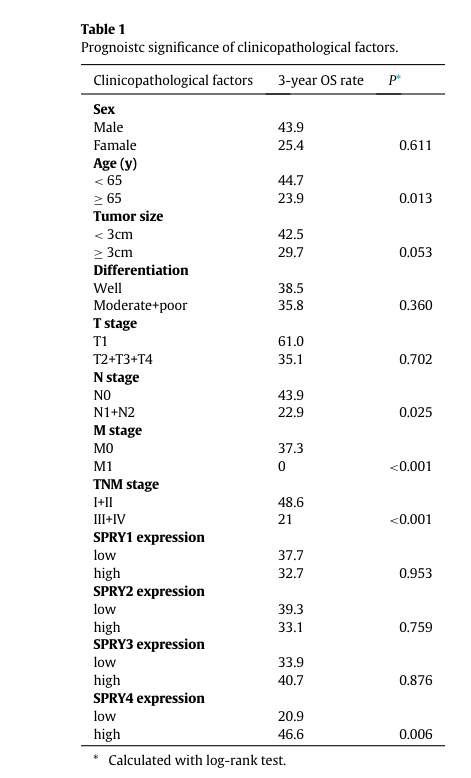

## Question

# Gene Research for Functional Annotation

## ⚠️ CRITICAL: Gene/Protein Identification Context

**BEFORE YOU BEGIN RESEARCH:** You MUST verify you are researching the CORRECT gene/protein. Gene symbols can be ambiguous, especially for less well-characterized genes from non-model organisms.

### Target Gene/Protein Identity (from UniProt):
- **UniProt Accession:** Q9C004
- **Protein Description:** RecName: Full=Protein sprouty homolog 4; Short=Spry-4;
- **Gene Information:** Name=SPRY4;
- **Organism (full):** Homo sapiens (Human).
- **Protein Family:** Belongs to the sprouty family. .
- **Key Domains:** Sprouty. (IPR007875); Sprouty_domain. (IPR051192); Sprouty (PF05210)

### MANDATORY VERIFICATION STEPS:

1. **Check if the gene symbol "SPRY4" matches the protein description above**
2. **Verify the organism is correct:** Homo sapiens (Human).
3. **Check if protein family/domains align with what you find in literature**
4. **If you find literature for a DIFFERENT gene with the same or similar symbol, STOP**

### If Gene Symbol is Ambiguous or You Cannot Find Relevant Literature:

**DO NOT PROCEED WITH RESEARCH ON A DIFFERENT GENE.** Instead:
- State clearly: "The gene symbol 'SPRY4' is ambiguous or literature is limited for this specific protein"
- Explain what you found (e.g., "Found extensive literature on a different gene with the same symbol in a different organism")
- Describe the protein based ONLY on the UniProt information provided above
- Suggest that the protein function can be inferred from domain/family information

### Research Target:

Please provide a comprehensive research report on the gene **SPRY4** (gene ID: SPRY4, UniProt: Q9C004) in human.

The research report should be a detailed narrative explaining the function, biological processes, and localization of the gene product. Citations should be given for all claims.

You should prioritize authoritative reviews and primary scientific literature when conducting research. You can supplement
this with annotations you find in gene/protein databases, but these can be outdated or inaccurate.

We are specifically interested in the primary function of the gene - for enzymes, what reaction is catalyzed, and what is the substrate specificity? For transporters, what is the substrate? For structural proteins or adapters, what is the broader structural role? For signaling molecules, what is the role in the pathway.

We are interested in where in or outside the cell the gene product carries out its function.

We are also interested in the signaling or biochemical pathways in which the gene functions. We are less interested in broad pleiotropic effects, except where these elucidate the precise role.

Include evidence where possible. We are interested in both experimental evidence as well as inference from structure, evolution, or bioinformatic analysis. Precise studies should be prioritized over high-throughput, where available.

## Output

Question: You are an expert researcher providing comprehensive, well-cited information.

Provide detailed information focusing on:
1. Key concepts and definitions with current understanding
2. Recent developments and latest research (prioritize 2023-2024 sources)
3. Current applications and real-world implementations
4. Expert opinions and analysis from authoritative sources
5. Relevant statistics and data from recent studies

Format as a comprehensive research report with proper citations. Include URLs and publication dates where available.
Always prioritize recent, authoritative sources and provide specific citations for all major claims.

# Gene Research for Functional Annotation

## ⚠️ CRITICAL: Gene/Protein Identification Context

**BEFORE YOU BEGIN RESEARCH:** You MUST verify you are researching the CORRECT gene/protein. Gene symbols can be ambiguous, especially for less well-characterized genes from non-model organisms.

### Target Gene/Protein Identity (from UniProt):
- **UniProt Accession:** Q9C004
- **Protein Description:** RecName: Full=Protein sprouty homolog 4; Short=Spry-4;
- **Gene Information:** Name=SPRY4;
- **Organism (full):** Homo sapiens (Human).
- **Protein Family:** Belongs to the sprouty family. .
- **Key Domains:** Sprouty. (IPR007875); Sprouty_domain. (IPR051192); Sprouty (PF05210)

### MANDATORY VERIFICATION STEPS:

1. **Check if the gene symbol "SPRY4" matches the protein description above**
2. **Verify the organism is correct:** Homo sapiens (Human).
3. **Check if protein family/domains align with what you find in literature**
4. **If you find literature for a DIFFERENT gene with the same or similar symbol, STOP**

### If Gene Symbol is Ambiguous or You Cannot Find Relevant Literature:

**DO NOT PROCEED WITH RESEARCH ON A DIFFERENT GENE.** Instead:
- State clearly: "The gene symbol 'SPRY4' is ambiguous or literature is limited for this specific protein"
- Explain what you found (e.g., "Found extensive literature on a different gene with the same symbol in a different organism")
- Describe the protein based ONLY on the UniProt information provided above
- Suggest that the protein function can be inferred from domain/family information

### Research Target:

Please provide a comprehensive research report on the gene **SPRY4** (gene ID: SPRY4, UniProt: Q9C004) in human.

The research report should be a detailed narrative explaining the function, biological processes, and localization of the gene product. Citations should be given for all claims.

You should prioritize authoritative reviews and primary scientific literature when conducting research. You can supplement
this with annotations you find in gene/protein databases, but these can be outdated or inaccurate.

We are specifically interested in the primary function of the gene - for enzymes, what reaction is catalyzed, and what is the substrate specificity? For transporters, what is the substrate? For structural proteins or adapters, what is the broader structural role? For signaling molecules, what is the role in the pathway.

We are interested in where in or outside the cell the gene product carries out its function.

We are also interested in the signaling or biochemical pathways in which the gene functions. We are less interested in broad pleiotropic effects, except where these elucidate the precise role.

Include evidence where possible. We are interested in both experimental evidence as well as inference from structure, evolution, or bioinformatic analysis. Precise studies should be prioritized over high-throughput, where available.

# Human SPRY4 (UniProt Q9C004): functional annotation research report

## Identity and principal function

**Identity verified.** SPRY4 denotes human *sprouty RTK signaling antagonist 4* (Sprouty-4), a protein in the four-member mammalian Sprouty family. Its conserved C-terminal cysteine-rich region is consistent with the supplied Sprouty-domain annotations. This report concerns the **SPRY4 protein**, not the similarly named noncoding RNA SPRY4-IT1 or the SPRY1–3 paralogs. Publications disagree on SPRY4 protein length—299 versus 322 amino acids—so length should not be used alone to identify an experimental construct. The original human cloning study characterized a 322-residue product. (puranik2024sprouty2anegative pages 3-4, leeksma2002humansprouty4 pages 1-2, leeksma2002humansprouty4 pages 3-4, pan2024roleofspry4 pages 1-2)

**Primary annotation:** SPRY4 is an intracellular, non-enzymatic regulator of signal-transduction complexes, best established as an inducible **negative-feedback modulator of receptor-tyrosine-kinase (RTK)–RAS–RAF–MEK–ERK signaling**. It has no established catalytic reaction, transported substrate, or structural load-bearing role. Its molecular action depends on the receptor stimulus and interacting proteins: it can interfere with adaptor-mediated RAS activation or bind RAF1 to inhibit a distinct route to ERK. Accordingly, “inhibits ERK” describes a common outcome, not an invariant biochemical mechanism. (ozaki2005efficientsuppressionof pages 4-6, leeksma2002humansprouty4 pages 1-2, pan2024roleofspry4 pages 2-4, pan2024roleofspry4 pages 1-2)

## Molecular mechanisms and biological processes

**FGF-to-RAS signaling.** Activated FGFR signaling recruits the GRB2–SOS1 RAS-activating machinery through the membrane-associated docking protein FRS2. In FGF2-stimulated cell experiments, SPRY4 associated preferentially with SOS1, whereas SPRY1 associated with GRB2. SPRY4 and other Sprouty proteins associated through their conserved C-terminal regions; coexpression of SPRY1 and SPRY4 more strongly reduced GRB2 recruitment to FRS2 and ERK phosphorylation than either alone. Endogenous complexes appeared after FGF2 treatment, and depletion of SPRY1 or SPRY4 prolonged ERK activation. The proposed sequestration of GRB2/SOS1 is well supported functionally, although co-immunoprecipitation does not establish that every interaction within the complex is direct. (ozaki2005efficientsuppressionof pages 4-6, ozaki2005efficientsuppressionof pages 6-8, ozaki2005efficientsuppressionof pages 8-9)

**Position relative to RAS.** In the original human-protein study, expressing SPRY4 reduced insulin- and EGF-stimulated RAS-GTP and MAP-kinase activity, but did not suppress ERK activation driven by constitutively active RASV12. This places that particular inhibitory effect at RAS activation or upstream; it does **not** mean SPRY4 always blocks EGF signaling. Indeed, a subsequent FGF2 comparison found pronounced inhibition of FGF2-induced ERK but little inhibition of EGF-induced ERK in its experimental conditions. These results illustrate stimulus-, timing-, and cell-dependent selectivity rather than a universal receptor rule. (leeksma2002humansprouty4 pages 1-2, leeksma2002humansprouty4 pages 4-6, ozaki2005efficientsuppressionof pages 4-6, leeksma2002humansprouty4 pages 6-9)

**VEGF-to-RAF signaling.** SPRY4 also binds RAF1 through its C-terminal cysteine-rich region. In the reported mammalian model, this binding was necessary to suppress **VEGF-induced, RAS-independent RAF1–ERK activation**, while EGF-induced, RAS-dependent RAF1 activation was not suppressed. Thus, SPRY4 can act at RAF1 as well as at receptor-to-RAS adaptor steps; the location of inhibition must be specified for each stimulus. (pan2024roleofspry4 pages 2-4, sutterlutyfall2013tumorassociatedgrowthconditionsa pages 39-42)

**Other signaling inputs.** A 2024 SPRY4-focused review describes binding of the cysteine-rich region to membrane phosphatidylinositol 4,5-bisphosphate, proposed to shield this lipid from phospholipase-C-dependent hydrolysis and reduce downstream calcium/PKC signaling. This is a proposed SPRY4 mechanism distinct from SPRY4 catalyzing lipid conversion or directly inhibiting PLC activation. Evidence from experiments on SPRY1 or SPRY2 should not automatically be assigned to SPRY4. (pan2024roleofspry4 pages 2-4)

These molecular effects help explain experimentally observed changes in growth-factor-dependent proliferation, G1-to-S progression, migration, and adhesion. They should not be taken to imply that SPRY4 invariably suppresses every such process across tissues. (qiu2019sprouty4correlateswith pages 9-12, queiroz2024mdm2requiressprouty4 pages 11-12, pan2024roleofspry4 pages 1-2)

## Where SPRY4 acts

SPRY4 acts **inside the cell**, at signaling interfaces in the cytoplasm and on the **cytoplasmic side of membranes**, rather than as an extracellular ligand. Conserved Sprouty C-terminal sequences are associated with membrane recruitment and protein-complex assembly; a 2024 review describes activation-associated movement toward the plasma membrane. Spatial behavior is nevertheless context-dependent. In the original human SPRY4 microscopy experiments, tagged SPRY4 and its binding partner TESK1 colocalized predominantly in cytoplasmic peri- and paranuclear puncta, including after EGF or insulin treatment; those experiments did **not** show substantial growth-factor-induced accumulation at the cell surface. In human perihilar cholangiocarcinoma tissue, immunohistochemistry likewise reported predominantly cytoplasmic SPRY4 staining. Consequently, plasma-membrane association is a plausible functional state, not an exclusive or universally observed localization. (pan2024roleofspry4 pages 1-2, leeksma2002humansprouty4 pages 1-2, leeksma2002humansprouty4 pages 6-9, qiu2019sprouty4correlateswith pages 4-5)

TESK1 binding was identified by yeast two-hybrid screening and corroborated by reciprocal co-immunoprecipitation; EGF increased their association. Binding and colocalization establish a potential signaling interface, **not** that SPRY4 phosphorylates TESK1 or directly inhibits TESK1 kinase activity. (leeksma2002humansprouty4 pages 6-9)

## Recent research and translational relevance

**FGFR–ERK signaling in human cancer.** In a 142-patient perihilar cholangiocarcinoma cohort, high tumor SPRY4 expression was associated with **46.6% three-year overall survival**, versus **20.9%** with low expression (log-rank **P = 0.006**); the original study’s Table 1 and Figure 2d corroborate the comparison. SPRY4 and FGFR2 staining were correlated (reported **R² = 0.468**). In cell experiments, SPRY4 depletion increased FGF2-induced ERK phosphorylation, proliferation, and migration; FGFR or ERK-pathway inhibition attenuated relevant effects. Reduced cyclin D1 and G1 arrest, rather than a demonstrated increase in apoptosis, explained the growth effect. These are patient associations plus experimental pathway evidence—not proof that changing SPRY4 improves patient survival. [Qiu et al., *EBioMedicine*, December 2019](https://doi.org/10.1016/j.ebiom.2019.11.021). (qiu2019sprouty4correlateswith pages 3-4, qiu2019sprouty4correlateswith pages 9-12, qiu2019sprouty4correlateswith pages 5-7, qiu2019sprouty4correlateswith pages 4-5, qiu2019sprouty4correlateswith media 0f428a4b, qiu2019sprouty4correlateswith media 60116c2b)

**A distinct, ERK-independent adhesion mechanism.** A study published in **August 2024** found that inhibiting or depleting MDM2 increased SPRY4 and impaired spreading, focal-adhesion formation, migration, and metastasis in the investigated **p53-deficient** cancer models. Concurrent SPRY4 depletion rescued several MDM2-loss-associated motility and metastasis effects. MDM2 depletion reduced total RhoA protein without a corresponding change in RHOA mRNA; concurrent SPRY4 depletion restored RhoA abundance, and RhoA inhibition prevented the migration rescue. Crucially, SPRY4 perturbation did **not** alter ERK phosphorylation in the studied HT1080 cells. This supports a context-specific **MDM2–SPRY4–RhoA functional axis**, but does not demonstrate direct SPRY4–RhoA binding, altered RhoA-GTP loading, or its applicability to all tissues. The reported double-knockdown tail-vein metastasis comparison used seven mice per group. [de Queiroz et al., *Nature Communications*, August 2024](https://doi.org/10.1038/s41467-024-51488-2). (queiroz2024mdm2requiressprouty4 pages 5-6, queiroz2024mdm2requiressprouty4 pages 7-8, queiroz2024mdm2requiressprouty4 pages 13-14, queiroz2024mdm2requiressprouty4 pages 9-10, queiroz2024mdm2requiressprouty4 pages 11-12)

**Current use and limitations.** SPRY4 expression and pathway responses are being investigated as **research biomarkers** of tumor biology and as potential points for therapeutic intervention; the PHCC cohort supplies a concrete prognostic example. The 2024 SPRY4 review emphasizes that tumor effects can differ by tissue and experimental setting. Neither a universally applicable SPRY4 clinical assay nor a validated SPRY4-directed treatment is established by the cited studies. For functional annotation, the strongest defensible summary remains **context-dependent, intracellular feedback control of RTK-linked RAS/ERK signaling, with additional experimentally supported roles in adhesion/RhoA-associated behavior**. [Pan et al., *Frontiers in Oncology*, 15 April 2024](https://doi.org/10.3389/fonc.2024.1376873). (pan2024roleofspry4 pages 1-2, qiu2019sprouty4correlateswith pages 9-12, queiroz2024mdm2requiressprouty4 pages 9-10, queiroz2024mdm2requiressprouty4 pages 11-12)

The following primary-study comparison separates directly observed mechanisms from their limitations. (leeksma2002humansprouty4 pages 1-2, ozaki2005efficientsuppressionof pages 4-6, pan2024roleofspry4 pages 2-4, qiu2019sprouty4correlateswith pages 9-12, queiroz2024mdm2requiressprouty4 pages 9-10)

| Study | Biological system | Directly demonstrated SPRY4 role | Qualification |
|---|---|---|---|
| [Leeksma et al. (2002), DOI: 10.1046/j.1432-1033.2002.02921.x](https://doi.org/10.1046/j.1432-1033.2002.02921.x) | Human SPRY4 expressed in A14, COS-7 and HeLa cells | Reduced insulin/EGF-induced Ras-GTP and ERK activation but not ERK activation driven by constitutively active RasV12; physically associated with TESK1 and colocalized with it in cytoplasmic, mainly peri-/paranuclear puncta. (leeksma2002humansprouty4 pages 1-2, leeksma2002humansprouty4 pages 4-6, leeksma2002humansprouty4 pages 6-9) | Establishes a non-enzymatic inhibitor acting at or upstream of Ras. TESK1 binding was shown, but inhibition of TESK1 catalytic activity was not demonstrated; substantial stimulus-induced plasma-membrane translocation was not observed in this study. |
| [Ozaki et al. (2005), DOI: 10.1242/jcs.02711](https://doi.org/10.1242/jcs.02711) | FGF2-stimulated 293T and Swiss 3T3 cells | SPRY4 associated preferentially with SOS1 and formed complexes with other Sprouty isoforms; SPRY1–SPRY4 cooperation more strongly disrupted recruitment of GRB2–SOS1 to FRS2 and suppressed FGF2-induced ERK activation than either protein alone. Depletion prolonged ERK1/2 activation. (ozaki2005efficientsuppressionof pages 4-6, ozaki2005efficientsuppressionof pages 6-8, ozaki2005efficientsuppressionof pages 8-9) | Supports adaptor/scaffold sequestration in an inducible negative-feedback circuit. Co-immunoprecipitation supports association but does not by itself prove direct SPRY1–SPRY4 binding. |
| [Sasaki et al. (2003), DOI: 10.4161/cc.2.4.418](https://doi.org/10.4161/cc.2.4.418) | Mammalian-cell VEGF and EGF signaling models | SPRY4 bound RAF1 through its C-terminal cysteine-rich region and suppressed VEGF-induced, Ras-independent RAF1–ERK activation, while not suppressing EGF-induced, Ras-dependent RAF1 activation. (pan2024roleofspry4 pages 2-4, sutterlutyfall2013tumorassociatedgrowthconditionsa pages 39-42) | Demonstrates stimulus- and pathway-specific modulation rather than universal blockade of RAF–ERK signaling; SPRY4 is a regulator, not a kinase or phosphatase. |
| [Qiu et al. (2019), DOI: 10.1016/j.ebiom.2019.11.021](https://doi.org/10.1016/j.ebiom.2019.11.021) | Human perihilar cholangiocarcinoma tissues and cell lines; xenografts; clinical cohort of 142 cases | SPRY4 knockdown enhanced FGF2-induced ERK phosphorylation, proliferation and migration; FGFR or ERK inhibition attenuated these effects. High tumor SPRY4 was associated with 46.6% three-year overall survival versus 20.9% for low expression (log-rank P=.006). (qiu2019sprouty4correlateswith pages 9-12, qiu2019sprouty4correlateswith pages 5-7, qiu2019sprouty4correlateswith pages 4-5, qiu2019sprouty4correlateswith media 0f428a4b) | Supports an FGFR–ERK negative-feedback and cell-cycle-control role in this disease context. Survival data are observational and do not establish SPRY4 as a clinically validated biomarker or treatment target. |
| [de Queiroz et al. (2024), DOI: 10.1038/s41467-024-51488-2](https://doi.org/10.1038/s41467-024-51488-2) | Human p53-knockout HT1080 cells, naturally p53-null H1299 cells and mouse metastasis models | MDM2 inhibition or depletion increased SPRY4, reduced focal adhesions and migration, and lowered total RhoA protein without changing RHOA mRNA; combined MDM2–SPRY4 depletion restored RhoA abundance and rescued migration, focal-adhesion and metastasis phenotypes. ERK phosphorylation was unchanged. (queiroz2024mdm2requiressprouty4 pages 5-6, queiroz2024mdm2requiressprouty4 pages 7-8, queiroz2024mdm2requiressprouty4 pages 13-14, queiroz2024mdm2requiressprouty4 pages 9-10) | Defines a context-specific, p53-independent and ERK-independent MDM2–SPRY4–RhoA axis. Evidence is genetic/pharmacological epistasis; neither direct SPRY4–RhoA binding nor altered RhoA-GTP loading was demonstrated. |

*Table: Primary-study evidence defining SPRY4 as a non-enzymatic, context-dependent regulator of RTK–Ras/ERK and adhesion signaling. Qualifications distinguish direct biochemical findings from pathway inference and clinical association.*

References

1. (puranik2024sprouty2anegative pages 3-4): Nidhi Puranik, HoJeong Jung, and Minseok Song. Sprouty2, a negative feedback regulator of receptor tyrosine kinase signaling, associated with neurodevelopmental disorders: current knowledge and future perspectives. International Journal of Molecular Sciences, 25:11043, Oct 2024. URL: https://doi.org/10.3390/ijms252011043, doi:10.3390/ijms252011043. This article has 13 citations.

2. (leeksma2002humansprouty4 pages 1-2): Onno C. Leeksma, Tanja A. E. van Achterberg, Yoshikazu Tsumura, Jiro Toshima, Eric Eldering, Wilma G. M. Kroes, Clemens Mellink, Marcel Spaargaren, Kensaku Mizuno, Hans Pannekoek, and Carlie J. M. de Vries. Human sprouty 4, a new ras antagonist on 5q31, interacts with the dual specificity kinase tesk1. European journal of biochemistry, 269 10:2546-56, May 2002. URL: https://doi.org/10.1046/j.1432-1033.2002.02921.x, doi:10.1046/j.1432-1033.2002.02921.x. This article has 133 citations.

3. (leeksma2002humansprouty4 pages 3-4): Onno C. Leeksma, Tanja A. E. van Achterberg, Yoshikazu Tsumura, Jiro Toshima, Eric Eldering, Wilma G. M. Kroes, Clemens Mellink, Marcel Spaargaren, Kensaku Mizuno, Hans Pannekoek, and Carlie J. M. de Vries. Human sprouty 4, a new ras antagonist on 5q31, interacts with the dual specificity kinase tesk1. European journal of biochemistry, 269 10:2546-56, May 2002. URL: https://doi.org/10.1046/j.1432-1033.2002.02921.x, doi:10.1046/j.1432-1033.2002.02921.x. This article has 133 citations.

4. (pan2024roleofspry4 pages 1-2): Hao Pan, Renjie Xu, and Yong Zhang. Role of spry4 in health and disease. Frontiers in Oncology, Apr 2024. URL: https://doi.org/10.3389/fonc.2024.1376873, doi:10.3389/fonc.2024.1376873. This article has 20 citations.

5. (ozaki2005efficientsuppressionof pages 4-6): Kei-ichi Ozaki, Satsuki Miyazaki, Susumu Tanimura, and Michiaki Kohno. Efficient suppression of fgf-2-induced erk activation by the cooperative interaction among mammalian sprouty isoforms. Journal of Cell Science, 118:5861-5871, Dec 2005. URL: https://doi.org/10.1242/jcs.02711, doi:10.1242/jcs.02711. This article has 83 citations and is from a domain leading peer-reviewed journal.

6. (pan2024roleofspry4 pages 2-4): Hao Pan, Renjie Xu, and Yong Zhang. Role of spry4 in health and disease. Frontiers in Oncology, Apr 2024. URL: https://doi.org/10.3389/fonc.2024.1376873, doi:10.3389/fonc.2024.1376873. This article has 20 citations.

7. (ozaki2005efficientsuppressionof pages 6-8): Kei-ichi Ozaki, Satsuki Miyazaki, Susumu Tanimura, and Michiaki Kohno. Efficient suppression of fgf-2-induced erk activation by the cooperative interaction among mammalian sprouty isoforms. Journal of Cell Science, 118:5861-5871, Dec 2005. URL: https://doi.org/10.1242/jcs.02711, doi:10.1242/jcs.02711. This article has 83 citations and is from a domain leading peer-reviewed journal.

8. (ozaki2005efficientsuppressionof pages 8-9): Kei-ichi Ozaki, Satsuki Miyazaki, Susumu Tanimura, and Michiaki Kohno. Efficient suppression of fgf-2-induced erk activation by the cooperative interaction among mammalian sprouty isoforms. Journal of Cell Science, 118:5861-5871, Dec 2005. URL: https://doi.org/10.1242/jcs.02711, doi:10.1242/jcs.02711. This article has 83 citations and is from a domain leading peer-reviewed journal.

9. (leeksma2002humansprouty4 pages 4-6): Onno C. Leeksma, Tanja A. E. van Achterberg, Yoshikazu Tsumura, Jiro Toshima, Eric Eldering, Wilma G. M. Kroes, Clemens Mellink, Marcel Spaargaren, Kensaku Mizuno, Hans Pannekoek, and Carlie J. M. de Vries. Human sprouty 4, a new ras antagonist on 5q31, interacts with the dual specificity kinase tesk1. European journal of biochemistry, 269 10:2546-56, May 2002. URL: https://doi.org/10.1046/j.1432-1033.2002.02921.x, doi:10.1046/j.1432-1033.2002.02921.x. This article has 133 citations.

10. (leeksma2002humansprouty4 pages 6-9): Onno C. Leeksma, Tanja A. E. van Achterberg, Yoshikazu Tsumura, Jiro Toshima, Eric Eldering, Wilma G. M. Kroes, Clemens Mellink, Marcel Spaargaren, Kensaku Mizuno, Hans Pannekoek, and Carlie J. M. de Vries. Human sprouty 4, a new ras antagonist on 5q31, interacts with the dual specificity kinase tesk1. European journal of biochemistry, 269 10:2546-56, May 2002. URL: https://doi.org/10.1046/j.1432-1033.2002.02921.x, doi:10.1046/j.1432-1033.2002.02921.x. This article has 133 citations.

11. (sutterlutyfall2013tumorassociatedgrowthconditionsa pages 39-42): PDDH Sutterlüty-Fall. Tumor-associated growth conditions activate mechanisms regulating sprouty protein expression. Unknown journal, 2013.

12. (qiu2019sprouty4correlateswith pages 9-12): Bo Qiu, Tianli Chen, Rongqi Sun, Zengli Liu, Xiaoming Zhang, Zhipeng Li, Yunfei Xu, and Zongli Zhang. Sprouty4 correlates with favorable prognosis in perihilar cholangiocarcinoma by blocking the fgfr-erk signaling pathway and arresting the cell cycle. Dec 2019. URL: https://doi.org/10.1016/j.ebiom.2019.11.021, doi:10.1016/j.ebiom.2019.11.021. This article has 31 citations and is from a peer-reviewed journal.

13. (queiroz2024mdm2requiressprouty4 pages 11-12): Rafaela Muniz de Queiroz, Gizem Efe, Asja Guzman, Naoko Hashimoto, Yusuke Kawashima, Tomoaki Tanaka, Anil K. Rustgi, and Carol Prives. Mdm2 requires sprouty4 to regulate focal adhesion formation and metastasis independent of p53. Nature Communications, Aug 2024. URL: https://doi.org/10.1038/s41467-024-51488-2, doi:10.1038/s41467-024-51488-2. This article has 16 citations and is from a highest quality peer-reviewed journal.

14. (qiu2019sprouty4correlateswith pages 4-5): Bo Qiu, Tianli Chen, Rongqi Sun, Zengli Liu, Xiaoming Zhang, Zhipeng Li, Yunfei Xu, and Zongli Zhang. Sprouty4 correlates with favorable prognosis in perihilar cholangiocarcinoma by blocking the fgfr-erk signaling pathway and arresting the cell cycle. Dec 2019. URL: https://doi.org/10.1016/j.ebiom.2019.11.021, doi:10.1016/j.ebiom.2019.11.021. This article has 31 citations and is from a peer-reviewed journal.

15. (qiu2019sprouty4correlateswith pages 3-4): Bo Qiu, Tianli Chen, Rongqi Sun, Zengli Liu, Xiaoming Zhang, Zhipeng Li, Yunfei Xu, and Zongli Zhang. Sprouty4 correlates with favorable prognosis in perihilar cholangiocarcinoma by blocking the fgfr-erk signaling pathway and arresting the cell cycle. Dec 2019. URL: https://doi.org/10.1016/j.ebiom.2019.11.021, doi:10.1016/j.ebiom.2019.11.021. This article has 31 citations and is from a peer-reviewed journal.

16. (qiu2019sprouty4correlateswith pages 5-7): Bo Qiu, Tianli Chen, Rongqi Sun, Zengli Liu, Xiaoming Zhang, Zhipeng Li, Yunfei Xu, and Zongli Zhang. Sprouty4 correlates with favorable prognosis in perihilar cholangiocarcinoma by blocking the fgfr-erk signaling pathway and arresting the cell cycle. Dec 2019. URL: https://doi.org/10.1016/j.ebiom.2019.11.021, doi:10.1016/j.ebiom.2019.11.021. This article has 31 citations and is from a peer-reviewed journal.

17. (qiu2019sprouty4correlateswith media 0f428a4b): Bo Qiu, Tianli Chen, Rongqi Sun, Zengli Liu, Xiaoming Zhang, Zhipeng Li, Yunfei Xu, and Zongli Zhang. Sprouty4 correlates with favorable prognosis in perihilar cholangiocarcinoma by blocking the fgfr-erk signaling pathway and arresting the cell cycle. Dec 2019. URL: https://doi.org/10.1016/j.ebiom.2019.11.021, doi:10.1016/j.ebiom.2019.11.021. This article has 31 citations and is from a peer-reviewed journal.

18. (qiu2019sprouty4correlateswith media 60116c2b): Bo Qiu, Tianli Chen, Rongqi Sun, Zengli Liu, Xiaoming Zhang, Zhipeng Li, Yunfei Xu, and Zongli Zhang. Sprouty4 correlates with favorable prognosis in perihilar cholangiocarcinoma by blocking the fgfr-erk signaling pathway and arresting the cell cycle. Dec 2019. URL: https://doi.org/10.1016/j.ebiom.2019.11.021, doi:10.1016/j.ebiom.2019.11.021. This article has 31 citations and is from a peer-reviewed journal.

19. (queiroz2024mdm2requiressprouty4 pages 5-6): Rafaela Muniz de Queiroz, Gizem Efe, Asja Guzman, Naoko Hashimoto, Yusuke Kawashima, Tomoaki Tanaka, Anil K. Rustgi, and Carol Prives. Mdm2 requires sprouty4 to regulate focal adhesion formation and metastasis independent of p53. Nature Communications, Aug 2024. URL: https://doi.org/10.1038/s41467-024-51488-2, doi:10.1038/s41467-024-51488-2. This article has 16 citations and is from a highest quality peer-reviewed journal.

20. (queiroz2024mdm2requiressprouty4 pages 7-8): Rafaela Muniz de Queiroz, Gizem Efe, Asja Guzman, Naoko Hashimoto, Yusuke Kawashima, Tomoaki Tanaka, Anil K. Rustgi, and Carol Prives. Mdm2 requires sprouty4 to regulate focal adhesion formation and metastasis independent of p53. Nature Communications, Aug 2024. URL: https://doi.org/10.1038/s41467-024-51488-2, doi:10.1038/s41467-024-51488-2. This article has 16 citations and is from a highest quality peer-reviewed journal.

21. (queiroz2024mdm2requiressprouty4 pages 13-14): Rafaela Muniz de Queiroz, Gizem Efe, Asja Guzman, Naoko Hashimoto, Yusuke Kawashima, Tomoaki Tanaka, Anil K. Rustgi, and Carol Prives. Mdm2 requires sprouty4 to regulate focal adhesion formation and metastasis independent of p53. Nature Communications, Aug 2024. URL: https://doi.org/10.1038/s41467-024-51488-2, doi:10.1038/s41467-024-51488-2. This article has 16 citations and is from a highest quality peer-reviewed journal.

22. (queiroz2024mdm2requiressprouty4 pages 9-10): Rafaela Muniz de Queiroz, Gizem Efe, Asja Guzman, Naoko Hashimoto, Yusuke Kawashima, Tomoaki Tanaka, Anil K. Rustgi, and Carol Prives. Mdm2 requires sprouty4 to regulate focal adhesion formation and metastasis independent of p53. Nature Communications, Aug 2024. URL: https://doi.org/10.1038/s41467-024-51488-2, doi:10.1038/s41467-024-51488-2. This article has 16 citations and is from a highest quality peer-reviewed journal.

## Artifacts

- [Edison artifact artifact-00](SPRY4-deep-research-falcon_artifacts/artifact-00.md)

## Citations

1. ozaki2005efficientsuppressionof pages 4-6
2. ozaki2005efficientsuppressionof pages 6-8
3. ozaki2005efficientsuppressionof pages 8-9
4. sutterlutyfall2013tumorassociatedgrowthconditionsa pages 39-42
5. Qiu et al., *EBioMedicine*, December 2019
6. de Queiroz et al., *Nature Communications*, August 2024
7. Pan et al., *Frontiers in Oncology*, 15 April 2024
8. Leeksma et al. (2002), DOI: 10.1046/j.1432-1033.2002.02921.x
9. Ozaki et al. (2005), DOI: 10.1242/jcs.02711
10. Sasaki et al. (2003), DOI: 10.4161/cc.2.4.418
11. Qiu et al. (2019), DOI: 10.1016/j.ebiom.2019.11.021
12. de Queiroz et al. (2024), DOI: 10.1038/s41467-024-51488-2
13. https://doi.org/10.1016/j.ebiom.2019.11.021
14. https://doi.org/10.1038/s41467-024-51488-2
15. https://doi.org/10.3389/fonc.2024.1376873
16. https://doi.org/10.1046/j.1432-1033.2002.02921.x
17. https://doi.org/10.1242/jcs.02711
18. https://doi.org/10.4161/cc.2.4.418
19. https://doi.org/10.3390/ijms252011043,
20. https://doi.org/10.1046/j.1432-1033.2002.02921.x,
21. https://doi.org/10.3389/fonc.2024.1376873,
22. https://doi.org/10.1242/jcs.02711,
23. https://doi.org/10.1016/j.ebiom.2019.11.021,
24. https://doi.org/10.1038/s41467-024-51488-2,