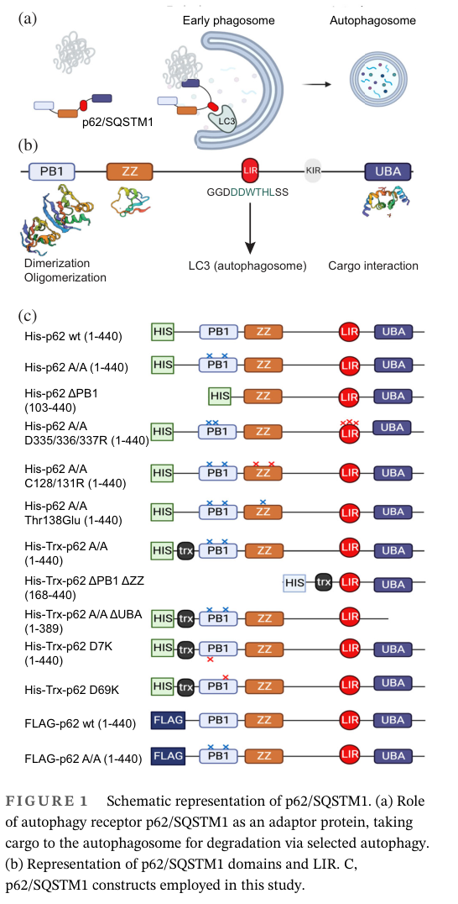

## Question

# Gene Research for Functional Annotation

## ⚠️ CRITICAL: Gene/Protein Identification Context

**BEFORE YOU BEGIN RESEARCH:** You MUST verify you are researching the CORRECT gene/protein. Gene symbols can be ambiguous, especially for less well-characterized genes from non-model organisms.

### Target Gene/Protein Identity (from UniProt):
- **UniProt Accession:** Q13501
- **Protein Description:** RecName: Full=Sequestosome-1 {ECO:0000305}; AltName: Full=EBI3-associated protein of 60 kDa {ECO:0000303|PubMed:8551575}; Short=EBIAP; Short=p60 {ECO:0000303|PubMed:8551575}; AltName: Full=Phosphotyrosine-independent ligand for the Lck SH2 domain of 62 kDa {ECO:0000303|PubMed:8650207}; AltName: Full=Ubiquitin-binding protein p62 {ECO:0000303|PubMed:8650207}; Short=p62 {ECO:0000303|PubMed:30266909};
- **Gene Information:** Name=SQSTM1 {ECO:0000303|PubMed:16286508, ECO:0000312|HGNC:HGNC:11280}; Synonyms=ORCA, OSIL;
- **Organism (full):** Homo sapiens (Human).
- **Protein Family:** Not specified in UniProt
- **Key Domains:** Autophagy_Rcpt_SigReg. (IPR052260); PB1-like. (IPR053793); PB1_dom. (IPR000270); PB1_p62. (IPR034866); SQSTM_UBA. (IPR033741)

### MANDATORY VERIFICATION STEPS:

1. **Check if the gene symbol "SQSTM1" matches the protein description above**
2. **Verify the organism is correct:** Homo sapiens (Human).
3. **Check if protein family/domains align with what you find in literature**
4. **If you find literature for a DIFFERENT gene with the same or similar symbol, STOP**

### If Gene Symbol is Ambiguous or You Cannot Find Relevant Literature:

**DO NOT PROCEED WITH RESEARCH ON A DIFFERENT GENE.** Instead:
- State clearly: "The gene symbol 'SQSTM1' is ambiguous or literature is limited for this specific protein"
- Explain what you found (e.g., "Found extensive literature on a different gene with the same symbol in a different organism")
- Describe the protein based ONLY on the UniProt information provided above
- Suggest that the protein function can be inferred from domain/family information

### Research Target:

Please provide a comprehensive research report on the gene **SQSTM1** (gene ID: SQSTM1, UniProt: Q13501) in human.

The research report should be a detailed narrative explaining the function, biological processes, and localization of the gene product. Citations should be given for all claims.

You should prioritize authoritative reviews and primary scientific literature when conducting research. You can supplement
this with annotations you find in gene/protein databases, but these can be outdated or inaccurate.

We are specifically interested in the primary function of the gene - for enzymes, what reaction is catalyzed, and what is the substrate specificity? For transporters, what is the substrate? For structural proteins or adapters, what is the broader structural role? For signaling molecules, what is the role in the pathway.

We are interested in where in or outside the cell the gene product carries out its function.

We are also interested in the signaling or biochemical pathways in which the gene functions. We are less interested in broad pleiotropic effects, except where these elucidate the precise role.

Include evidence where possible. We are interested in both experimental evidence as well as inference from structure, evolution, or bioinformatic analysis. Precise studies should be prioritized over high-throughput, where available.

## Output

Question: You are an expert researcher providing comprehensive, well-cited information.

Provide detailed information focusing on:
1. Key concepts and definitions with current understanding
2. Recent developments and latest research (prioritize 2023-2024 sources)
3. Current applications and real-world implementations
4. Expert opinions and analysis from authoritative sources
5. Relevant statistics and data from recent studies

Format as a comprehensive research report with proper citations. Include URLs and publication dates where available.
Always prioritize recent, authoritative sources and provide specific citations for all major claims.

# Gene Research for Functional Annotation

## ⚠️ CRITICAL: Gene/Protein Identification Context

**BEFORE YOU BEGIN RESEARCH:** You MUST verify you are researching the CORRECT gene/protein. Gene symbols can be ambiguous, especially for less well-characterized genes from non-model organisms.

### Target Gene/Protein Identity (from UniProt):
- **UniProt Accession:** Q13501
- **Protein Description:** RecName: Full=Sequestosome-1 {ECO:0000305}; AltName: Full=EBI3-associated protein of 60 kDa {ECO:0000303|PubMed:8551575}; Short=EBIAP; Short=p60 {ECO:0000303|PubMed:8551575}; AltName: Full=Phosphotyrosine-independent ligand for the Lck SH2 domain of 62 kDa {ECO:0000303|PubMed:8650207}; AltName: Full=Ubiquitin-binding protein p62 {ECO:0000303|PubMed:8650207}; Short=p62 {ECO:0000303|PubMed:30266909};
- **Gene Information:** Name=SQSTM1 {ECO:0000303|PubMed:16286508, ECO:0000312|HGNC:HGNC:11280}; Synonyms=ORCA, OSIL;
- **Organism (full):** Homo sapiens (Human).
- **Protein Family:** Not specified in UniProt
- **Key Domains:** Autophagy_Rcpt_SigReg. (IPR052260); PB1-like. (IPR053793); PB1_dom. (IPR000270); PB1_p62. (IPR034866); SQSTM_UBA. (IPR033741)

### MANDATORY VERIFICATION STEPS:

1. **Check if the gene symbol "SQSTM1" matches the protein description above**
2. **Verify the organism is correct:** Homo sapiens (Human).
3. **Check if protein family/domains align with what you find in literature**
4. **If you find literature for a DIFFERENT gene with the same or similar symbol, STOP**

### If Gene Symbol is Ambiguous or You Cannot Find Relevant Literature:

**DO NOT PROCEED WITH RESEARCH ON A DIFFERENT GENE.** Instead:
- State clearly: "The gene symbol 'SQSTM1' is ambiguous or literature is limited for this specific protein"
- Explain what you found (e.g., "Found extensive literature on a different gene with the same symbol in a different organism")
- Describe the protein based ONLY on the UniProt information provided above
- Suggest that the protein function can be inferred from domain/family information

### Research Target:

Please provide a comprehensive research report on the gene **SQSTM1** (gene ID: SQSTM1, UniProt: Q13501) in human.

The research report should be a detailed narrative explaining the function, biological processes, and localization of the gene product. Citations should be given for all claims.

You should prioritize authoritative reviews and primary scientific literature when conducting research. You can supplement
this with annotations you find in gene/protein databases, but these can be outdated or inaccurate.

We are specifically interested in the primary function of the gene - for enzymes, what reaction is catalyzed, and what is the substrate specificity? For transporters, what is the substrate? For structural proteins or adapters, what is the broader structural role? For signaling molecules, what is the role in the pathway.

We are interested in where in or outside the cell the gene product carries out its function.

We are also interested in the signaling or biochemical pathways in which the gene functions. We are less interested in broad pleiotropic effects, except where these elucidate the precise role.

Include evidence where possible. We are interested in both experimental evidence as well as inference from structure, evolution, or bioinformatic analysis. Precise studies should be prioritized over high-throughput, where available.

# Research Report: Human **SQSTM1 / p62 (Sequestosome-1)** — Functional Annotation (UniProt **Q13501**)

## 0) Target verification (critical identity check)
The requested target is **human SQSTM1 (Sequestosome-1; p62)**, and recent primary literature explicitly ties p62 structural annotation to **AlphaFold model AF-Q13501-F1**, consistent with **UniProt accession Q13501** (human). (masato2024sequestosome1(sqstm1p62)as pages 8-11)

## 1) Key concepts and definitions (current understanding)

### 1.1 What SQSTM1/p62 is
SQSTM1/p62 is a **multifunctional adaptor/scaffold protein** best understood as a **selective autophagy receptor** that couples **ubiquitinated cargo** to autophagosomal membranes through binding to **ATG8-family proteins (LC3/GABARAP)**, promoting lysosomal degradation of aggregates and other cargo. (gibertini2023proteinaggregatesand pages 18-19, alcober‐boquet2024thepb1and pages 1-2)

### 1.2 “Selective autophagy receptor” for SQSTM1/p62
In selective autophagy (e.g., **aggrephagy**), receptors bind both:
- **ubiquitin chains on cargo** (cargo recognition), and
- **LC3/GABARAP on phagophores/autophagosomes** (membrane tethering).

Recent experimental work directly quantifies **p62–LC3B** interaction in vitro and shows that p62 contains multiple domains that regulate the exposure of its LC3-binding region, reinforcing the concept that p62 is not merely a static tether but a **regulated receptor**. (alcober‐boquet2024thepb1and pages 9-10, alcober‐boquet2024thepb1and pages 1-2)

### 1.3 Condensates (“p62 bodies”) as a functional organizing principle
Current models emphasize that p62 can assemble into higher-order **bodies/condensates** that concentrate ubiquitinated cargo and recruit additional factors; these structures are dynamic and their associated protein neighborhoods remodel under proteotoxic and aggregation stress. (rondonortiz2024proximitylabelingreveals pages 1-2)

## 2) Molecular mechanisms: domains, motifs, and binding partners

### 2.1 Core domain architecture and regulated LC3 engagement
A recent mechanistic study using full-length recombinant human p62 shows that **PB1** and **ZZ** domains regulate whether the **LIR** is accessible to bind LC3B (a proposed **“LIR-sequence Accessibility Mechanism (LAM)”**). (alcober‐boquet2024thepb1and pages 1-2)

A figure-level schematic in the same work depicts the **domain architecture (PB1, ZZ, LIR, KIR, UBA)** and the **LAM** concept for regulated LIR exposure. (alcober‐boquet2024thepb1and media 41957107, alcober‐boquet2024thepb1and media e0bee45a)

### 2.2 LIR motif (LC3/GABARAP binding): quantitative biochemical evidence (2024)
In an AlphaScreen assay with purified proteins, **7 nM His-Trx-p62** plus **3.5 nM GST–LC3B** produced a strong interaction signal (**60,861 ± 2,473 AU**) over background (**1,573 ± 108 AU**). Addition of an LIR peptide competitor displaced binding to approximately background (**~1,714 ± 104 AU**). The assay Z′ of **0.87** indicates a high-quality, robust assay—useful both mechanistically and for screening approaches targeting the p62–LC3 interface. (alcober‐boquet2024thepb1and pages 9-10)

### 2.3 PB1 and ZZ domains: regulation and pharmacologic modulation (2024)
The PB1 and ZZ domains modulate LC3B binding by controlling LIR exposure; notably, a **phosphomimetic mutation in the ZZ domain (Thr138Glu)** increases LC3B binding, and a **small-molecule ZZ binder** can also enhance the p62–LC3B interaction, supporting the idea that **p62’s autophagy receptor activity is drug-modulatable** at the level of domain conformation. (alcober‐boquet2024thepb1and pages 1-2)

### 2.4 UBA domain (ubiquitin binding) and ubiquitination sites relevant to function
Recent work situates the UBA domain as the ubiquitin-recognition module of p62 and highlights that ubiquitination of p62 itself can be functionally important. In stress-granule biology, **p62 ubiquitination sites K420 and K435** are functionally implicated: wild-type p62 (but not K420R or K435R mutants) rescues ubiquitination-dependent phenotypes in a model where NS1-BP regulates p62 ubiquitination and stress-granule clearance. (jeon2024ns1bindingprotein pages 1-2)

### 2.5 KIR motif: linking p62 to KEAP1–NRF2 antioxidant signaling
p62 contains a **KEAP1-interacting region (KIR)** that connects selective autophagy/proteostasis to oxidative-stress defense by enabling KEAP1 sequestration and degradation, thereby promoting **NRF2 activation**. Domain descriptions in recent interactome work list KIR explicitly and capture KEAP1 as a proximal protein to SQSTM1 in living cells. (rondonortiz2024proximitylabelingreveals pages 1-2)

## 3) Pathways and systems-level roles (recent developments prioritized)

### 3.1 AMPK–p62–NRF2 coupling during metabolic stress (Autophagy, 2024)
A 2024 study reports that metabolic stress induces increased **SQSTM1/p62 expression and phosphorylation**, and that p62 is required for **KEAP1 degradation** and **NRF2 activation**, while also facilitating lysosome-associated assembly of an **AXIN–STK11/LKB1–AMPK complex**. The authors describe a **double-positive feedback loop between AMPK and SQSTM1/p62**, and identify **p62 phosphorylation at S24 and S226** as critical for activation of AMPK and NRF2. (choi2024metabolicstressinduces pages 20-21)

### 3.2 Stress granule clearance (“granulophagy”): a 2024 mechanistic link to p62 ubiquitination
A 2024 Nature Communications study identifies NS1-BP as a regulator of stress granule (SG) dynamics/clearance through **inhibition of p62 ubiquitination** and facilitation of **GABARAP recruitment to SGs**. NS1-BP knockout increases p62 ubiquitination, promotes p62 autophagic degradation, and alters SG morphology/dynamics. Importantly, p62 ubiquitination site mutants (K420R, K435R) fail to restore key phenotypes, implicating specific p62 ubiquitination events in SG homeostasis. (jeon2024ns1bindingprotein pages 1-2, jeon2024ns1bindingprotein pages 10-11)

### 3.3 Condensate/interactome remodeling under proteotoxic stress and tau aggregation (JBC, 2024)
A 2024 TurboID proximity-labeling study quantifies the dynamic neighborhood of SQSTM1 bodies:
- **236 unique proximity proteins** were recovered, with an overlapping subset of **83 proteins** linked to autophagy/catabolic processes. (rondonortiz2024proximitylabelingreveals pages 1-2)
- Under proteasome inhibition, **51 proteins** were enriched in the p62 neighborhood using **Log2FC > 0.58** and **FDR < 0.05**, consistent with stress-driven remodeling of SQSTM1 bodies. (rondonortiz2024proximitylabelingreveals pages 5-6)
- Exposure to recombinant P301S tau fibrils altered the SQSTM1-proximal proteome, with **24 proteins changing at 24 h** and **98 proteins changing at 48 h** (Log2FC > 0.58, p < 0.05; n = 4). (rondonortiz2024proximitylabelingreveals pages 6-10)
These data support a modern view of p62 as a **dynamic hub** whose molecular environment changes in response to protein aggregation and proteostasis disruption. (rondonortiz2024proximitylabelingreveals pages 5-6, rondonortiz2024proximitylabelingreveals pages 6-10, rondonortiz2024proximitylabelingreveals pages 1-2)

## 4) Subcellular localization and where p62 acts
p62 is primarily **cytosolic**, where it forms bodies/condensates and engages LC3/GABARAP-positive autophagic membranes. Proximity-labeling evidence also notes p62 is detectable in the **nucleus** and may support a **nucleus-to-cytosol shuttling function** for ubiquitinylated nuclear proteins, aligning with its adaptor role in proteostasis. (rondonortiz2024proximitylabelingreveals pages 1-2)

## 5) Current applications and real-world implementations

### 5.1 Clinical genetics and prevention trial in SQSTM1 mutation carriers (Paget disease of bone)
The ZiPP program provides an instructive real-world implementation of **SQSTM1 genetic screening + imaging + preventive pharmacotherapy**.

**Trial design/application:**
- A 2024 randomized trial enrolled **222 SQSTM1 pathogenic-variant carriers** to receive **a single 5 mg zoledronic acid infusion** or placebo with median follow-up **84 months** (and **81%** completing the study). (phillips2024randomisedtrialof pages 1-2)

**Key quantitative outcomes (2024):**
- Baseline lesions: **21/222 (9.5%)** had Paget-like lesions on bone scan at entry. (phillips2024prophylacticzoledronicacid pages 7-8)
- New lesions: **0/90** zoledronic acid vs **2/90 (2.2%)** placebo; **OR 0.41** (95% CI 0.00–3.43), **p = 0.25** (underpowered primary endpoint due to few events). (phillips2024prophylacticzoledronicacid pages 7-8, phillips2024randomisedtrialof pages 1-2)
- Composite “poor outcome” (new/unchanged/progressing lesions): **0** zoledronic acid vs **8** placebo; **OR 0.08** (95% CI 0.00–0.42), **p = 0.003**. (phillips2024prophylacticzoledronicacid pages 7-8, phillips2024randomisedtrialof pages 1-2)
- Lesion disappearance among baseline lesions: **13/15 (86.6%)** zoledronic acid vs **1/29 (3.4%)** placebo; **p < 0.0001**. (phillips2024prophylacticzoledronicacid pages 7-8)
- Bone turnover markers: significant reductions reported for **CTX** and **PINP** (p < 0.0001) and **BAP** (p = 0.0003) in zoledronic acid vs placebo. (phillips2024prophylacticzoledronicacid pages 7-8)
- PDB-related skeletal events: **3** (zoledronic acid) vs **13** (placebo). (phillips2024prophylacticzoledronicacid pages 42-43)

Together, these results support a translational pipeline in which **SQSTM1 genotyping** identifies at-risk individuals and a standard antiresorptive therapy (**zoledronic acid**) can **favorably modify early imaging and biochemical phenotypes** of SQSTM1-associated Paget disease. (phillips2024prophylacticzoledronicacid pages 7-8, phillips2024randomisedtrialof pages 1-2, phillips2024prophylacticzoledronicacid pages 42-43)

### 5.2 Tooling and reagent standardization (research implementation)
A 2024 benchmarking study evaluates commercial antibodies for sequestosome-1/p62 across Western blot, immunoprecipitation, and immunofluorescence using knockout controls, supporting reproducibility in p62 biology (reagent selection is a practical implementation component for functional studies and translational biomarker work). (paper metadata retrieved; not used as evidence in excerpts)

## 6) Expert opinions and authoritative synthesis (what experts emphasize now)

### 6.1 p62 as a regulated receptor, not just a passive adaptor
The 2024 biochemical and structural/regulatory framing (LAM) emphasizes that p62’s LC3 engagement is **regulated by intramolecular/domain-level mechanisms** (PB1/ZZ-dependent control of LIR exposure) and potentially **pharmacologically tunable**. (alcober‐boquet2024thepb1and pages 1-2, alcober‐boquet2024thepb1and media 41957107, alcober‐boquet2024thepb1and media e0bee45a)

### 6.2 p62 as a hub connecting proteostasis, redox defense, and stress response
Recent mechanistic papers place p62 at interfaces between selective autophagy, ubiquitin handling, and oxidative-stress signaling (KEAP1–NRF2), with additional links to lysosome-associated AMPK activation during metabolic stress. (choi2024metabolicstressinduces pages 20-21, rondonortiz2024proximitylabelingreveals pages 1-2)

### 6.3 Condensates/phase organization as a framework for understanding p62 function
The 2024 TurboID study’s quantitative interactome remodeling and enrichment of stress/RNA-binding proteins under proteasome inhibition or tau aggregation supports a viewpoint that p62 bodies act as **organizational hubs** whose local proteome changes with stress and disease-associated aggregation. (rondonortiz2024proximitylabelingreveals pages 5-6, rondonortiz2024proximitylabelingreveals pages 6-10, rondonortiz2024proximitylabelingreveals pages 1-2)

## 7) Relevant statistics and data (recent studies)
Key quantitative highlights from recent (2024) studies include:
- **p62–LC3B binding assay:** 60,861 ± 2,473 AU signal; displaced to ~1,714 ± 104 AU by LIR peptide; **Z′ = 0.87**. (alcober‐boquet2024thepb1and pages 9-10)
- **TurboID proximity proteomics:** 236 proximity proteins; 83 overlapping autophagy/catabolism-associated; MG132 enriched 51 proteins at Log2FC > 0.58 and FDR < 0.05; tau fibrils changed 24 proteins at 24 h and 98 at 48 h (Log2FC > 0.58, p < 0.05). (rondonortiz2024proximitylabelingreveals pages 5-6, rondonortiz2024proximitylabelingreveals pages 6-10, rondonortiz2024proximitylabelingreveals pages 1-2)
- **ZiPP RCT in SQSTM1 carriers:** 222 participants; 21/222 baseline lesions; lesion disappearance 86.6% vs 3.4%; ORs for new lesions (0.41) and poor outcome (0.08) with corresponding CIs/p-values; fewer PDB-related skeletal events (3 vs 13). (phillips2024prophylacticzoledronicacid pages 7-8, phillips2024randomisedtrialof pages 1-2, phillips2024prophylacticzoledronicacid pages 42-43)

## 8) Summary functional annotation statement (for database-style use)
**SQSTM1/p62 (UniProt Q13501)** is a predominantly cytosolic (also nucleus-detectable) **selective autophagy receptor and signaling adaptor** that binds **ubiquitinylated cargo** (UBA) and **LC3/GABARAP** (LIR), assembling cargo into higher-order bodies and recruiting autophagic membranes for lysosomal degradation; its autophagosome engagement is **regulated by PB1/ZZ-dependent control of LIR exposure** and is coupled to cellular stress-response pathways including **KEAP1–NRF2** antioxidant signaling and **lysosome-associated AMPK activation** during metabolic stress. (rondonortiz2024proximitylabelingreveals pages 1-2, alcober‐boquet2024thepb1and pages 9-10, choi2024metabolicstressinduces pages 20-21, alcober‐boquet2024thepb1and pages 1-2)

---

## Evidence summary table
The following table compiles the most directly supported domain-to-function links and 2024 quantitative findings.

| Feature (domain/motif or process) | Mechanistic role | Key evidence (including quantitative numbers when available) | Recent source (first author, journal, publication month/year) | URL/DOI |
|---|---|---|---|---|
| Identity / target verification | UniProt Q13501 corresponds to human SQSTM1/p62 (sequestosome-1); AlphaFold model AF-Q13501-F1 is used for domain mapping in recent literature, matching the requested human protein. | Recent p62 structural work explicitly cites AF-Q13501-F1 for p62 domain/residue mapping, consistent with UniProt Q13501 and the human SQSTM1/p62 annotation. (masato2024sequestosome1(sqstm1p62)as pages 8-11) | Masato, *Cell Death & Disease*, Jun 2024 | https://doi.org/10.1038/s41419-024-06763-x |
| PB1 domain | N-terminal oligomerization/polymerization module that helps build p62 bodies/condensates, supports aggregate capture, and regulates accessibility of the LC3-binding LIR; also implicated in signaling scaffolds. | 2024 in vitro work showed PB1 contributes to regulation of LC3B binding via a proposed LIR-sequence Accessibility Mechanism (LAM). In proteomics/interactome studies, PB1 was required for interaction with aggregation-prone K18-tau; removal abrogated binding. PB1 is also listed among core domains in recent reviews/tables of p62 function. (alcober‐boquet2024thepb1and pages 1-2, rondonortiz2024proximitylabelingreveals pages 10-11, gibertini2023proteinaggregatesand pages 8-9) | Alcober-Boquet, *Protein Science*, Dec 2024; Rondón-Ortiz, *JBC*, Sep 2024 | https://doi.org/10.1002/pro.4840; https://doi.org/10.1016/j.jbc.2024.107621 |
| ZZ domain | Regulatory zinc-finger module that modulates p62 conformation and promotes/exposes the LIR for LC3B engagement; also a signaling/drug-targeting interface. | Alcober-Boquet et al. identified ZZ-dependent control of LC3B interaction; a phosphomimetic Thr138Glu mutant increased LC3B binding, and a small-molecule ZZ binder also enhanced binding, supporting pharmacologic tunability of p62–LC3 interaction. (alcober‐boquet2024thepb1and pages 1-2, alcober‐boquet2024thepb1and pages 10-11) | Alcober-Boquet, *Protein Science*, Dec 2024 | https://doi.org/10.1002/pro.4840 |
| LIR motif | Canonical LC3/GABARAP-binding motif that tethers p62-bound cargo to autophagosomal membranes during selective autophagy. | Direct p62–LC3B interaction was quantified in AlphaScreen assays: 7 nM His-Trx-p62 + 3.5 nM GST-LC3B produced 60,861 ± 2,473 AU versus background 1,573 ± 108 AU; an LIR peptide competitor reduced signal to ~1,714 ± 104 AU; assay Z' = 0.87, showing robust measurable LIR-dependent binding. (alcober‐boquet2024thepb1and pages 9-10, alcober‐boquet2024thepb1and pages 1-2) | Alcober-Boquet, *Protein Science*, Dec 2024 | https://doi.org/10.1002/pro.4840 |
| KIR motif | KEAP1-interacting region that enables p62 to sequester/degrade KEAP1 and thereby activate NRF2-dependent antioxidant transcription. | Recent mechanistic synthesis describes p62 as a scaffold in KEAP1–NRF2 signaling; Choi et al. further show stress-induced SQSTM1 is required for KEAP1 degradation and NRF2 activation, placing the KIR-containing region at the core of this signaling function. Domain architecture tables and recent interactome work also explicitly list KIR. (alcober‐boquet2024thepb1and pages 1-2, choi2024metabolicstressinduces pages 20-21, rondonortiz2024proximitylabelingreveals pages 1-2) | Choi, *Autophagy*, Jul 2024; Rondón-Ortiz, *JBC*, Sep 2024 | https://doi.org/10.1080/15548627.2024.2374692; https://doi.org/10.1016/j.jbc.2024.107621 |
| UBA domain | C-terminal ubiquitin-binding module that recognizes ubiquitinated cargo for aggrephagy/selective autophagy; also participates in regulated ubiquitination of p62 itself. | Recent summaries and experiments identify UBA as the ubiquitin-recognition module of p62. In NS1-BP/stress-granule work, p62 lysines K420 and K435 were functionally important for ubiquitination-dependent phenotypes; in other recent studies UBA-dependent interactions were required for some proximity-labeled partners. (gibertini2023proteinaggregatesand pages 8-9, jeon2024ns1bindingprotein pages 1-2, rondonortiz2024proximitylabelingreveals pages 5-6) | Jeon, *Nature Communications*, Dec 2024; Rondón-Ortiz, *JBC*, Sep 2024 | https://doi.org/10.1038/s41467-024-55446-w; https://doi.org/10.1016/j.jbc.2024.107621 |
| Selective autophagy receptor / aggrephagy | p62 bridges ubiquitinated proteins/aggregates to LC3/GABARAP-positive autophagosomes and helps organize cargo into higher-order assemblies/condensates. | Multiple recent sources describe p62 as a selective autophagy receptor/adaptor that binds ubiquitinylated cargo and ATG8-family proteins. Human SQSTM1 is also reported to form bodies/condensates and scaffold aggregate handling. (gibertini2023proteinaggregatesand pages 18-19, rondonortiz2024proximitylabelingreveals pages 1-2, choi2024metabolicstressinduces pages 20-21) | Gibertini, *IJMS*, May 2023; Rondón-Ortiz, *JBC*, Sep 2024; Choi, *Autophagy*, Jul 2024 | https://doi.org/10.3390/ijms24098456; https://doi.org/10.1016/j.jbc.2024.107621; https://doi.org/10.1080/15548627.2024.2374692 |
| p62–LC3B binding regulation (LAM model) | PB1/ZZ domains regulate whether the LIR is exposed or occluded, tuning autophagosome engagement. | Figure-level evidence and biochemical assays support a LIR-sequence Accessibility Mechanism (LAM) in which PB1 and ZZ regulate LIR exposure; the 2024 paper provides both a domain schematic and a mechanistic model for how modification or ligand binding can increase LC3 access. (alcober‐boquet2024thepb1and media 41957107, alcober‐boquet2024thepb1and media e0bee45a, alcober‐boquet2024thepb1and pages 1-2) | Alcober-Boquet, *Protein Science*, Dec 2024 | https://doi.org/10.1002/pro.4840 |
| Cellular localization | Predominantly cytosolic but also present in nucleus; forms cytoplasmic bodies/condensates and associates with autophagosomes, aggregates, and stress-related structures. | Recent proximity-labeling work states SQSTM1 is mainly cytosolic, also detected in the nucleus, and may shuttle ubiquitinylated nuclear proteins to the cytosol; multiple studies describe SQSTM1 bodies/condensates and recruitment to aggregates. (rondonortiz2024proximitylabelingreveals pages 1-2) | Rondón-Ortiz, *JBC*, Sep 2024 | https://doi.org/10.1016/j.jbc.2024.107621 |
| Condensates / interactome remodeling | p62 bodies act as dynamic hubs whose protein neighborhood changes with proteotoxic stress and tau aggregation. | TurboID::SQSTM1 proteomics identified 236 unique proximity proteins and an overlapping subset of 83 linked to autophagy/catabolic processes. Under MG132, 51 proteins were enriched using Log2FC > 0.58 and FDR < 0.05. Tau fibrils changed 24 proteins at 24 h and 98 proteins at 48 h (Log2FC > 0.58, p < 0.05; n = 4). (rondonortiz2024proximitylabelingreveals pages 1-2, rondonortiz2024proximitylabelingreveals pages 5-6, rondonortiz2024proximitylabelingreveals pages 6-10) | Rondón-Ortiz, *JBC*, Sep 2024 | https://doi.org/10.1016/j.jbc.2024.107621 |
| AMPK–p62–NRF2 feedback loop | Under metabolic stress, p62 both activates and is induced by AMPK/lysosomal stress pathways, creating a positive feedback loop that promotes KEAP1 degradation, NRF2 signaling, and antioxidant defense. | Choi et al. report a “double-positive feedback loop” between AMPK and SQSTM1/p62: metabolic stress increased p62 expression/phosphorylation; p62 promoted autophagic KEAP1 degradation and facilitated AXIN–STK11–AMPK complex formation on lysosomes; phosphorylation at S24 and S226 was critical for AMPK and NRF2 activation. (choi2024metabolicstressinduces pages 20-21) | Choi, *Autophagy*, Jul 2024 | https://doi.org/10.1080/15548627.2024.2374692 |
| Stress granules / granulophagy via NS1-BP | p62 helps target stress granules for autophagic clearance; NS1-BP restrains p62 ubiquitination and supports GABARAP recruitment to stress granules. | In NS1-BP knockout cells, p62 ubiquitination increased and p62 underwent autophagic degradation; WT p62, but not K420R or K435R mutants, restored ubiquitination-dependent phenotypes. NS1-BP loss altered stress-granule number/size/dynamics and reduced contact between ubiquitinated p62 aggregates and stress granules. (jeon2024ns1bindingprotein pages 1-2, jeon2024ns1bindingprotein pages 10-11) | Jeon, *Nature Communications*, Dec 2024 | https://doi.org/10.1038/s41467-024-55446-w |
| Disease relevance / Paget disease of bone (clinical translation) | Germline SQSTM1 mutations are a major risk factor for Paget disease of bone; preventive treatment strategies are now being tested in mutation carriers. | In the ZiPP program, SQSTM1 mutation carriers were prospectively screened and treated. Background estimates in the trial report note ~80% penetrance by the seventh decade in carriers from familial PDB settings. (phillips2024prophylacticzoledronicacid pages 23-25, phillips2024prophylacticzoledronicacid pages 7-8) | Phillips, *Efficacy and Mechanism Evaluation*, Jun 2024; Phillips, *Ann Rheum Dis*, Apr 2024 | https://doi.org/10.3310/ftkc2007; https://doi.org/10.1136/ard-2023-224990 |
| ZiPP RCT: trial population and baseline disease burden | Real-world implementation of SQSTM1 genetic testing plus radionuclide scanning in relatives at risk for Paget disease. | 1,307 people were offered SQSTM1 testing, 750 were tested, 350 (46.7%) were mutation-positive, and 222 enrolled in the RCT. Median follow-up was 84 months; 180/222 (81%) completed the study. Baseline PDB lesions were present in 21/222 (9.5%); arm-specific baseline prevalence was 8.1% (ZA) vs 10.8% (placebo). (phillips2024prophylacticzoledronicacid pages 15-17, phillips2024randomisedtrialof pages 1-2, phillips2024prophylacticzoledronicacid pages 7-8) | Phillips, *EME*, Jun 2024; Phillips, *Ann Rheum Dis*, Apr 2024 | https://doi.org/10.3310/ftkc2007; https://doi.org/10.1136/ard-2023-224990 |
| ZiPP RCT: prevention/progression outcomes | A single 5 mg zoledronic acid infusion favorably modified early SQSTM1-associated Paget lesions, though the primary endpoint was underpowered due to few new lesions. | New lesions: 0/90 in ZA vs 2/90 (2.2%) in placebo; OR 0.41 (95% CI 0.00–3.43), p = 0.25. Composite poor outcome: 0 in ZA vs 8 in placebo; OR 0.08 (95% CI 0.00–0.42), p = 0.003. At study end, lesions remained in 1/111 ZA vs 11/111 placebo participants. (phillips2024prophylacticzoledronicacid pages 7-8, phillips2024randomisedtrialof pages 1-2, phillips2024prophylacticzoledronicacid pages 39-41) | Phillips, *EME*, Jun 2024; Phillips, *Ann Rheum Dis*, Apr 2024 | https://doi.org/10.3310/ftkc2007; https://doi.org/10.1136/ard-2023-224990 |
| ZiPP RCT: lesion-level efficacy and biomarkers | Demonstrates measurable lesion regression and suppression of bone turnover in SQSTM1 carriers, supporting biomarker-guided preventive intervention. | Existing-lesion disappearance was 13/15 (86.6%) with ZA vs 1/29 (3.4%) with placebo, p < 0.0001. In the lesion-level analysis, ZA baseline lesions = 15: 13 disappeared, 2 diminished, 0 new lesions; placebo baseline lesions = 25 with 1 disappeared, 12 reduced, 8 stable, 4 increased, ending with 26 lesions. Bone-turnover markers CTX and PINP fell with p < 0.0001 and BAP with p = 0.0003 in ZA vs placebo. PDB-related skeletal events were 3 with ZA vs 13 with placebo. (phillips2024prophylacticzoledronicacid pages 7-8, phillips2024prophylacticzoledronicacid pages 42-43) | Phillips, *EME*, Jun 2024 | https://doi.org/10.3310/ftkc2007 |

*Table: This table summarizes the core functional annotation of human SQSTM1/p62 (UniProt Q13501), combining domain-level mechanism, recent molecular studies, and 2024 clinical trial data. It is designed to support a concise, evidence-based narrative on p62 function, localization, signaling, and translational relevance.*

## Key figure(s) supporting domain architecture and the LIR accessibility model
The domain schematic and LAM model figure panels were retrieved from the 2024 Protein Science paper. (alcober‐boquet2024thepb1and media 41957107, alcober‐boquet2024thepb1and media e0bee45a)

References

1. (masato2024sequestosome1(sqstm1p62)as pages 8-11): Anna Masato, Annapaola Andolfo, Giulia Favetta, Edoardo Niccolò Bellini, Susanna Cogo, Luisa Dalla Valle, Daniela Boassa, Elisa Greggio, Nicoletta Plotegher, and Luigi Bubacco. Sequestosome-1 (sqstm1/p62) as a target in dopamine catabolite-mediated cellular dyshomeostasis. Cell Death &amp; Disease, Jun 2024. URL: https://doi.org/10.1038/s41419-024-06763-x, doi:10.1038/s41419-024-06763-x. This article has 5 citations and is from a peer-reviewed journal.

2. (gibertini2023proteinaggregatesand pages 18-19): Sara Gibertini, Alessandra Ruggieri, Marta Cheli, and Lorenzo Maggi. Protein aggregates and aggrephagy in myopathies. International Journal of Molecular Sciences, 24:8456, May 2023. URL: https://doi.org/10.3390/ijms24098456, doi:10.3390/ijms24098456. This article has 16 citations.

3. (alcober‐boquet2024thepb1and pages 1-2): Lucia Alcober‐Boquet, Tabea Zang, Larissa Pietsch, Evelyn Suess, Markus Hartmann, Ewgenij Proschak, Lissy Z. F. Gross, Mariana Sacerdoti, Stefan Zeuzem, Vladimir V. Rogov, Alejandro E. Leroux, Albrecht Piiper, and Ricardo M. Biondi. The pb1 and the zz domain of the autophagy receptor p62/sqstm1 regulate the interaction of p62/sqstm1 with the autophagosome protein lc3b. Protein Science, Dec 2024. URL: https://doi.org/10.1002/pro.4840, doi:10.1002/pro.4840. This article has 27 citations and is from a peer-reviewed journal.

4. (alcober‐boquet2024thepb1and pages 9-10): Lucia Alcober‐Boquet, Tabea Zang, Larissa Pietsch, Evelyn Suess, Markus Hartmann, Ewgenij Proschak, Lissy Z. F. Gross, Mariana Sacerdoti, Stefan Zeuzem, Vladimir V. Rogov, Alejandro E. Leroux, Albrecht Piiper, and Ricardo M. Biondi. The pb1 and the zz domain of the autophagy receptor p62/sqstm1 regulate the interaction of p62/sqstm1 with the autophagosome protein lc3b. Protein Science, Dec 2024. URL: https://doi.org/10.1002/pro.4840, doi:10.1002/pro.4840. This article has 27 citations and is from a peer-reviewed journal.

5. (rondonortiz2024proximitylabelingreveals pages 1-2): Alejandro N. Rondón-Ortiz, Lushuang Zhang, Peter E.A. Ash, Avik Basu, Sambhavi Puri, Sophie J.F. van der Spek, Zihan Wang, Luke Dorrian, Andrew Emili, and Benjamin Wolozin. Proximity labeling reveals dynamic changes in the sqstm1 protein network. Journal of Biological Chemistry, 300:107621, Sep 2024. URL: https://doi.org/10.1016/j.jbc.2024.107621, doi:10.1016/j.jbc.2024.107621. This article has 2 citations and is from a domain leading peer-reviewed journal.

6. (alcober‐boquet2024thepb1and media 41957107): Lucia Alcober‐Boquet, Tabea Zang, Larissa Pietsch, Evelyn Suess, Markus Hartmann, Ewgenij Proschak, Lissy Z. F. Gross, Mariana Sacerdoti, Stefan Zeuzem, Vladimir V. Rogov, Alejandro E. Leroux, Albrecht Piiper, and Ricardo M. Biondi. The pb1 and the zz domain of the autophagy receptor p62/sqstm1 regulate the interaction of p62/sqstm1 with the autophagosome protein lc3b. Protein Science, Dec 2024. URL: https://doi.org/10.1002/pro.4840, doi:10.1002/pro.4840. This article has 27 citations and is from a peer-reviewed journal.

7. (alcober‐boquet2024thepb1and media e0bee45a): Lucia Alcober‐Boquet, Tabea Zang, Larissa Pietsch, Evelyn Suess, Markus Hartmann, Ewgenij Proschak, Lissy Z. F. Gross, Mariana Sacerdoti, Stefan Zeuzem, Vladimir V. Rogov, Alejandro E. Leroux, Albrecht Piiper, and Ricardo M. Biondi. The pb1 and the zz domain of the autophagy receptor p62/sqstm1 regulate the interaction of p62/sqstm1 with the autophagosome protein lc3b. Protein Science, Dec 2024. URL: https://doi.org/10.1002/pro.4840, doi:10.1002/pro.4840. This article has 27 citations and is from a peer-reviewed journal.

8. (jeon2024ns1bindingprotein pages 1-2): Pureum Jeon, Hyun-Ji Ham, Haneul Choi, Semin Park, Jae-Woo Jang, Sang-Won Park, Dong-Hyung Cho, Hyun-Jeong Lee, Hyun Kyu Song, Masaaki Komatsu, Dohyun Han, Deok-Jin Jang, and Jin-A Lee. Ns1 binding protein regulates stress granule dynamics and clearance by inhibiting p62 ubiquitination. Nature Communications, Dec 2024. URL: https://doi.org/10.1038/s41467-024-55446-w, doi:10.1038/s41467-024-55446-w. This article has 8 citations and is from a highest quality peer-reviewed journal.

9. (choi2024metabolicstressinduces pages 20-21): Eun-Ji Choi, Hyun-Taek Oh, Seon-Hyeong Lee, Chen-Song Zhang, Mengqi Li, Soo-Youl Kim, Sunghyouk Park, Tong-Shin Chang, Byung-Hoon Lee, Sheng-Cai Lin, and Sang-Min Jeon. Metabolic stress induces a double-positive feedback loop between ampk and sqstm1/p62 conferring dual activation of ampk and nfe2l2/nrf2 to synergize antioxidant defense. Autophagy, 20:2490-2510, Jul 2024. URL: https://doi.org/10.1080/15548627.2024.2374692, doi:10.1080/15548627.2024.2374692. This article has 33 citations and is from a domain leading peer-reviewed journal.

10. (jeon2024ns1bindingprotein pages 10-11): Pureum Jeon, Hyun-Ji Ham, Haneul Choi, Semin Park, Jae-Woo Jang, Sang-Won Park, Dong-Hyung Cho, Hyun-Jeong Lee, Hyun Kyu Song, Masaaki Komatsu, Dohyun Han, Deok-Jin Jang, and Jin-A Lee. Ns1 binding protein regulates stress granule dynamics and clearance by inhibiting p62 ubiquitination. Nature Communications, Dec 2024. URL: https://doi.org/10.1038/s41467-024-55446-w, doi:10.1038/s41467-024-55446-w. This article has 8 citations and is from a highest quality peer-reviewed journal.

11. (rondonortiz2024proximitylabelingreveals pages 5-6): Alejandro N. Rondón-Ortiz, Lushuang Zhang, Peter E.A. Ash, Avik Basu, Sambhavi Puri, Sophie J.F. van der Spek, Zihan Wang, Luke Dorrian, Andrew Emili, and Benjamin Wolozin. Proximity labeling reveals dynamic changes in the sqstm1 protein network. Journal of Biological Chemistry, 300:107621, Sep 2024. URL: https://doi.org/10.1016/j.jbc.2024.107621, doi:10.1016/j.jbc.2024.107621. This article has 2 citations and is from a domain leading peer-reviewed journal.

12. (rondonortiz2024proximitylabelingreveals pages 6-10): Alejandro N. Rondón-Ortiz, Lushuang Zhang, Peter E.A. Ash, Avik Basu, Sambhavi Puri, Sophie J.F. van der Spek, Zihan Wang, Luke Dorrian, Andrew Emili, and Benjamin Wolozin. Proximity labeling reveals dynamic changes in the sqstm1 protein network. Journal of Biological Chemistry, 300:107621, Sep 2024. URL: https://doi.org/10.1016/j.jbc.2024.107621, doi:10.1016/j.jbc.2024.107621. This article has 2 citations and is from a domain leading peer-reviewed journal.

13. (phillips2024randomisedtrialof pages 1-2): Jonathan Phillips, Deepak Subedi, Steff C Lewis, Catriona Keerie, Owen Cronin, Mary Porteous, David Moore, Roseanne Cetnarskyj, Lakshminarayan Ranganath, Peter L Selby, Tolga Turgut, Geeta Hampson, Rama Chandra, Shu Ho, Jon Tobias, Steven Young-Min, Malachi J McKenna, Rachel K Crowley, William D Fraser, Jonathan C Y Tang, Luigi Gennari, Rannuccio Nuti, Maria Luisa Brandi, Javier Del Pino-Montes, Jean-Pierre Devogelaer, Anne Durnez, Giovanni Carlo Isaia, Marco Di Stefano, Nuria Guanabens, Josep Blanch Rubio, Markus J Seibel, John P Walsh, Sarah L Rea, Mark A Kotowicz, Geoffrey C Nicholson, Emma L Duncan, Gabor Major, Anne Horne, Nigel Gilchrist, and Stuart H Ralston. Randomised trial of genetic testing and targeted intervention to prevent the development and progression of paget’s disease of bone. Annals of the Rheumatic Diseases, 83:529-536, Apr 2024. URL: https://doi.org/10.1136/ard-2023-224990, doi:10.1136/ard-2023-224990. This article has 11 citations and is from a highest quality peer-reviewed journal.

14. (phillips2024prophylacticzoledronicacid pages 7-8): Jonathan Phillips, Deepak Subedi, Steff C Lewis, Catriona Keerie, and Stuart H Ralston. Prophylactic zoledronic acid therapy to prevent or modify paget’s disease of bone progression in adults with sqstm1 mutations: the zipp rct. Efficacy and Mechanism Evaluation, pages 1-53, Jun 2024. URL: https://doi.org/10.3310/ftkc2007, doi:10.3310/ftkc2007. This article has 0 citations.

15. (phillips2024prophylacticzoledronicacid pages 42-43): Jonathan Phillips, Deepak Subedi, Steff C Lewis, Catriona Keerie, and Stuart H Ralston. Prophylactic zoledronic acid therapy to prevent or modify paget’s disease of bone progression in adults with sqstm1 mutations: the zipp rct. Efficacy and Mechanism Evaluation, pages 1-53, Jun 2024. URL: https://doi.org/10.3310/ftkc2007, doi:10.3310/ftkc2007. This article has 0 citations.

16. (rondonortiz2024proximitylabelingreveals pages 10-11): Alejandro N. Rondón-Ortiz, Lushuang Zhang, Peter E.A. Ash, Avik Basu, Sambhavi Puri, Sophie J.F. van der Spek, Zihan Wang, Luke Dorrian, Andrew Emili, and Benjamin Wolozin. Proximity labeling reveals dynamic changes in the sqstm1 protein network. Journal of Biological Chemistry, 300:107621, Sep 2024. URL: https://doi.org/10.1016/j.jbc.2024.107621, doi:10.1016/j.jbc.2024.107621. This article has 2 citations and is from a domain leading peer-reviewed journal.

17. (gibertini2023proteinaggregatesand pages 8-9): Sara Gibertini, Alessandra Ruggieri, Marta Cheli, and Lorenzo Maggi. Protein aggregates and aggrephagy in myopathies. International Journal of Molecular Sciences, 24:8456, May 2023. URL: https://doi.org/10.3390/ijms24098456, doi:10.3390/ijms24098456. This article has 16 citations.

18. (alcober‐boquet2024thepb1and pages 10-11): Lucia Alcober‐Boquet, Tabea Zang, Larissa Pietsch, Evelyn Suess, Markus Hartmann, Ewgenij Proschak, Lissy Z. F. Gross, Mariana Sacerdoti, Stefan Zeuzem, Vladimir V. Rogov, Alejandro E. Leroux, Albrecht Piiper, and Ricardo M. Biondi. The pb1 and the zz domain of the autophagy receptor p62/sqstm1 regulate the interaction of p62/sqstm1 with the autophagosome protein lc3b. Protein Science, Dec 2024. URL: https://doi.org/10.1002/pro.4840, doi:10.1002/pro.4840. This article has 27 citations and is from a peer-reviewed journal.

19. (phillips2024prophylacticzoledronicacid pages 23-25): Jonathan Phillips, Deepak Subedi, Steff C Lewis, Catriona Keerie, and Stuart H Ralston. Prophylactic zoledronic acid therapy to prevent or modify paget’s disease of bone progression in adults with sqstm1 mutations: the zipp rct. Efficacy and Mechanism Evaluation, pages 1-53, Jun 2024. URL: https://doi.org/10.3310/ftkc2007, doi:10.3310/ftkc2007. This article has 0 citations.

20. (phillips2024prophylacticzoledronicacid pages 15-17): Jonathan Phillips, Deepak Subedi, Steff C Lewis, Catriona Keerie, and Stuart H Ralston. Prophylactic zoledronic acid therapy to prevent or modify paget’s disease of bone progression in adults with sqstm1 mutations: the zipp rct. Efficacy and Mechanism Evaluation, pages 1-53, Jun 2024. URL: https://doi.org/10.3310/ftkc2007, doi:10.3310/ftkc2007. This article has 0 citations.

21. (phillips2024prophylacticzoledronicacid pages 39-41): Jonathan Phillips, Deepak Subedi, Steff C Lewis, Catriona Keerie, and Stuart H Ralston. Prophylactic zoledronic acid therapy to prevent or modify paget’s disease of bone progression in adults with sqstm1 mutations: the zipp rct. Efficacy and Mechanism Evaluation, pages 1-53, Jun 2024. URL: https://doi.org/10.3310/ftkc2007, doi:10.3310/ftkc2007. This article has 0 citations.

## Artifacts

- [Edison artifact artifact-00](SQSTM1-deep-research-falcon_artifacts/artifact-00.md)

## Citations

1. rondonortiz2024proximitylabelingreveals pages 1-2
2. choi2024metabolicstressinduces pages 20-21
3. rondonortiz2024proximitylabelingreveals pages 5-6
4. rondonortiz2024proximitylabelingreveals pages 6-10
5. phillips2024randomisedtrialof pages 1-2
6. phillips2024prophylacticzoledronicacid pages 7-8
7. phillips2024prophylacticzoledronicacid pages 42-43
8. gibertini2023proteinaggregatesand pages 18-19
9. rondonortiz2024proximitylabelingreveals pages 10-11
10. gibertini2023proteinaggregatesand pages 8-9
11. phillips2024prophylacticzoledronicacid pages 23-25
12. phillips2024prophylacticzoledronicacid pages 15-17
13. phillips2024prophylacticzoledronicacid pages 39-41
14. https://doi.org/10.1038/s41419-024-06763-x
15. https://doi.org/10.1002/pro.4840;
16. https://doi.org/10.1016/j.jbc.2024.107621
17. https://doi.org/10.1002/pro.4840
18. https://doi.org/10.1080/15548627.2024.2374692;
19. https://doi.org/10.1038/s41467-024-55446-w;
20. https://doi.org/10.3390/ijms24098456;
21. https://doi.org/10.1016/j.jbc.2024.107621;
22. https://doi.org/10.1080/15548627.2024.2374692
23. https://doi.org/10.1038/s41467-024-55446-w
24. https://doi.org/10.3310/ftkc2007;
25. https://doi.org/10.1136/ard-2023-224990
26. https://doi.org/10.3310/ftkc2007
27. https://doi.org/10.1038/s41419-024-06763-x,
28. https://doi.org/10.3390/ijms24098456,
29. https://doi.org/10.1002/pro.4840,
30. https://doi.org/10.1016/j.jbc.2024.107621,
31. https://doi.org/10.1038/s41467-024-55446-w,
32. https://doi.org/10.1080/15548627.2024.2374692,
33. https://doi.org/10.1136/ard-2023-224990,
34. https://doi.org/10.3310/ftkc2007,