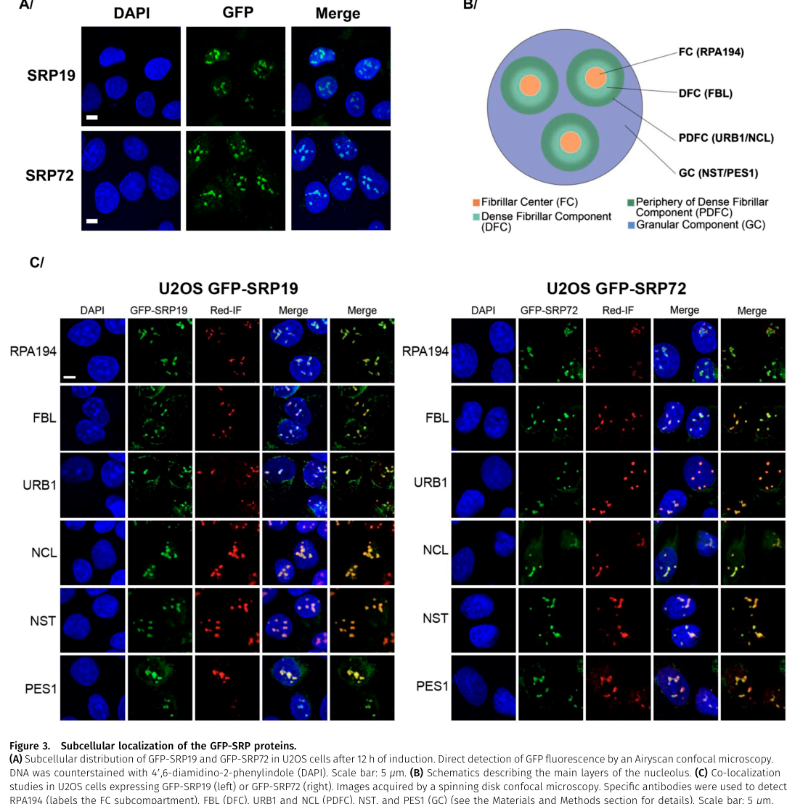

## Question

# Gene Research for Functional Annotation

## ⚠️ CRITICAL: Gene/Protein Identification Context

**BEFORE YOU BEGIN RESEARCH:** You MUST verify you are researching the CORRECT gene/protein. Gene symbols can be ambiguous, especially for less well-characterized genes from non-model organisms.

### Target Gene/Protein Identity (from UniProt):
- **UniProt Accession:** P09132
- **Protein Description:** RecName: Full=Signal recognition particle 19 kDa protein; Short=SRP19;
- **Gene Information:** Name=SRP19;
- **Organism (full):** Homo sapiens (Human).
- **Protein Family:** Belongs to the SRP19 family. .
- **Key Domains:** Signal_recog_particle_SRP19. (IPR002778); SRP19-like_sf. (IPR036521); SRP19 (PF01922)

### MANDATORY VERIFICATION STEPS:

1. **Check if the gene symbol "SRP19" matches the protein description above**
2. **Verify the organism is correct:** Homo sapiens (Human).
3. **Check if protein family/domains align with what you find in literature**
4. **If you find literature for a DIFFERENT gene with the same or similar symbol, STOP**

### If Gene Symbol is Ambiguous or You Cannot Find Relevant Literature:

**DO NOT PROCEED WITH RESEARCH ON A DIFFERENT GENE.** Instead:
- State clearly: "The gene symbol 'SRP19' is ambiguous or literature is limited for this specific protein"
- Explain what you found (e.g., "Found extensive literature on a different gene with the same symbol in a different organism")
- Describe the protein based ONLY on the UniProt information provided above
- Suggest that the protein function can be inferred from domain/family information

### Research Target:

Please provide a comprehensive research report on the gene **SRP19** (gene ID: SRP19, UniProt: P09132) in human.

The research report should be a detailed narrative explaining the function, biological processes, and localization of the gene product. Citations should be given for all claims.

You should prioritize authoritative reviews and primary scientific literature when conducting research. You can supplement
this with annotations you find in gene/protein databases, but these can be outdated or inaccurate.

We are specifically interested in the primary function of the gene - for enzymes, what reaction is catalyzed, and what is the substrate specificity? For transporters, what is the substrate? For structural proteins or adapters, what is the broader structural role? For signaling molecules, what is the role in the pathway.

We are interested in where in or outside the cell the gene product carries out its function.

We are also interested in the signaling or biochemical pathways in which the gene functions. We are less interested in broad pleiotropic effects, except where these elucidate the precise role.

Include evidence where possible. We are interested in both experimental evidence as well as inference from structure, evolution, or bioinformatic analysis. Precise studies should be prioritized over high-throughput, where available.

## Output

Question: You are an expert researcher providing comprehensive, well-cited information.

Provide detailed information focusing on:
1. Key concepts and definitions with current understanding
2. Recent developments and latest research (prioritize 2023-2024 sources)
3. Current applications and real-world implementations
4. Expert opinions and analysis from authoritative sources
5. Relevant statistics and data from recent studies

Format as a comprehensive research report with proper citations. Include URLs and publication dates where available.
Always prioritize recent, authoritative sources and provide specific citations for all major claims.

# Gene Research for Functional Annotation

## ⚠️ CRITICAL: Gene/Protein Identification Context

**BEFORE YOU BEGIN RESEARCH:** You MUST verify you are researching the CORRECT gene/protein. Gene symbols can be ambiguous, especially for less well-characterized genes from non-model organisms.

### Target Gene/Protein Identity (from UniProt):
- **UniProt Accession:** P09132
- **Protein Description:** RecName: Full=Signal recognition particle 19 kDa protein; Short=SRP19;
- **Gene Information:** Name=SRP19;
- **Organism (full):** Homo sapiens (Human).
- **Protein Family:** Belongs to the SRP19 family. .
- **Key Domains:** Signal_recog_particle_SRP19. (IPR002778); SRP19-like_sf. (IPR036521); SRP19 (PF01922)

### MANDATORY VERIFICATION STEPS:

1. **Check if the gene symbol "SRP19" matches the protein description above**
2. **Verify the organism is correct:** Homo sapiens (Human).
3. **Check if protein family/domains align with what you find in literature**
4. **If you find literature for a DIFFERENT gene with the same or similar symbol, STOP**

### If Gene Symbol is Ambiguous or You Cannot Find Relevant Literature:

**DO NOT PROCEED WITH RESEARCH ON A DIFFERENT GENE.** Instead:
- State clearly: "The gene symbol 'SRP19' is ambiguous or literature is limited for this specific protein"
- Explain what you found (e.g., "Found extensive literature on a different gene with the same symbol in a different organism")
- Describe the protein based ONLY on the UniProt information provided above
- Suggest that the protein function can be inferred from domain/family information

### Research Target:

Please provide a comprehensive research report on the gene **SRP19** (gene ID: SRP19, UniProt: P09132) in human.

The research report should be a detailed narrative explaining the function, biological processes, and localization of the gene product. Citations should be given for all claims.

You should prioritize authoritative reviews and primary scientific literature when conducting research. You can supplement
this with annotations you find in gene/protein databases, but these can be outdated or inaccurate.

We are specifically interested in the primary function of the gene - for enzymes, what reaction is catalyzed, and what is the substrate specificity? For transporters, what is the substrate? For structural proteins or adapters, what is the broader structural role? For signaling molecules, what is the role in the pathway.

We are interested in where in or outside the cell the gene product carries out its function.

We are also interested in the signaling or biochemical pathways in which the gene functions. We are less interested in broad pleiotropic effects, except where these elucidate the precise role.

Include evidence where possible. We are interested in both experimental evidence as well as inference from structure, evolution, or bioinformatic analysis. Precise studies should be prioritized over high-throughput, where available.

# Research report: Human SRP19 (UniProt P09132) functional annotation

## 0. Target verification (gene/protein identity)
The literature retrieved here consistently defines **SRP19** as the **signal recognition particle 19 kDa protein**, an RNA-binding subunit of the **mammalian signal recognition particle (SRP)** that binds **7SL RNA** and promotes assembly of the SRP S-domain, enabling SRP54 incorporation—matching the UniProt P09132 description and SRP19-family/domain context. (oubridge2002crystalstructureof pages 1-2, faoro2021noncanonicalfunctionsand pages 3-4, issa2024thenucleolarphase pages 1-2)

## 1. Key concepts and definitions (current understanding)

### 1.1 What is SRP19?
SRP19 is a **single-domain RNA-binding protein** that is part of the **S domain** of the mammalian SRP ribonucleoprotein (RNP). Reviews describe SRP19 as an αβ-fold protein with **βαββα topology**, emphasizing its role as an RNA-binding structural component rather than an enzyme. (Faoro & Ataide, 2021-05; https://doi.org/10.3389/fmolb.2021.679584) (faoro2021noncanonicalfunctionsand pages 3-4)

### 1.2 What is the SRP pathway and where does SRP19 fit?
The mammalian SRP is a cytosolic RNP that **co-translationally targets nascent secreted and membrane proteins** to the **endoplasmic reticulum (ER)** by recognizing signal sequences on ribosome–nascent chain complexes and delivering them to the ER via the SRP receptor/translocon system. SRP19’s specific role is primarily in **SRP assembly and S-domain architecture**, which enables downstream SRP functions in targeting. (faoro2021noncanonicalfunctionsand pages 3-4, kellogg2023unravelingsrpbiogenesis pages 35-40)

### 1.3 Molecular function: SRP19 is an SRP RNA assembly factor within the mature complex
A key structural model derived from a crystal structure of SRP19 in complex with the S domain RNA (representing the S domain of human 7SL RNA) shows that SRP19 **binds SRP RNA and clamps key RNA helices**: SRP19 “clamps the tetraloops of two branched helices (helices 6 and 8)” and helix 6 functions as a “splint,” partially pre-organizing the SRP54-binding site on helix 8. (Oubridge et al., 2002-06; https://doi.org/10.1016/S1097-2765(02)00530-0) (oubridge2002crystalstructureof pages 1-2)

Functionally, this creates a eukaryote-specific assembly dependency: in contrast to bacterial SRP systems (where the SRP54 homolog can bind SRP RNA without SRP19), **human SRP54 is unable to bind 7SL RNA without prior SRP19 binding**, placing SRP19 upstream in hierarchical SRP assembly. (Oubridge et al., 2002-06; https://doi.org/10.1016/S1097-2765(02)00530-0) (oubridge2002crystalstructureof pages 1-2)

## 2. SRP19 complex membership, interactions, and pathway placement

### 2.1 Core SRP composition
A 2024 study explicitly describes mammalian SRP as consisting of **7SL RNA plus six proteins (SRP9, SRP14, SRP19, SRP54, SRP68, SRP72)** and uses SRP19 as a bait/marker for SRP interactome analyses, supporting that SRP19 is a canonical core SRP subunit. (Issa et al., 2024-06; https://doi.org/10.26508/lsa.202402614) (issa2024thenucleolarphase pages 1-2, issa2024thenucleolarphase pages 8-9)

### 2.2 Assembly logic: SRP19 shapes the S domain to recruit SRP54
Reviews summarize that SRP19 binds the **GGAG tetraloop at the tip of helix 6** in 7SL RNA and **clamps helices 6 and 8**, inducing the “closed” S-domain structure that supports productive SRP assembly. (Faoro & Ataide, 2021-05; https://doi.org/10.3389/fmolb.2021.679584) (faoro2021noncanonicalfunctionsand pages 3-4)

## 3. Subcellular localization and SRP biogenesis route

### 3.1 Nuclear/nucleolar assembly phase followed by cytoplasmic maturation
Recent synthesis of SRP biogenesis emphasizes that (i) most SRP proteins are translated in the cytoplasm, (ii) several are imported into the nucleus, and (iii) **SRP19 assembles with 7SL RNA first in the nucleolus**, producing a pre-SRP that is exported, after which SRP54 is attached to complete SRP maturation. (Kellogg, 2023; pages describing import/export and nucleolar first assembly) (kellogg2023unravelingsrpbiogenesis pages 35-40)

### 3.2 2024 primary evidence: SRP19 nucleolar accumulation and nucleolus-dependence
Issa et al. (2024) provide direct imaging and perturbation evidence that SRP biogenesis occurs partly in the nucleolus and that SRP19 participates in this phase. They show **GFP-SRP19 accumulating in nucleoli** and co-localizing with nucleolar markers, and they report that nucleolar disruption alters SRP19 distribution. (Issa et al., 2024-06; https://doi.org/10.26508/lsa.202402614) (issa2024thenucleolarphase pages 8-9, issa2024thenucleolarphase media 3dc4c0c3)

In the same study, inhibition of nucleolar transcription by **low-dose actinomycin D** is associated with **relocalization of GFP-SRP19** into more compact nucleolar structures, and depletion of a ribosomal component (uL18/RPL5) disrupts nucleolar structure and alters GFP-SRP19 localization, supporting that SRP19’s nucleolar localization is **functionally coupled to nucleolar integrity**. (issa2024thenucleolarphase media 3dc4c0c3, issa2024thenucleolarphase media d5a9ef09)

## 4. Recent developments and latest research (prioritizing 2023–2024)

### 4.1 Nucleolar phase of SRP assembly (2024)
The principal 2024 advance in the retrieved corpus is the quantitative proteomics and cell-biology demonstration that SRP proteins (including SRP19) associate with “scores” of nucleolar proteins involved in ribosome biogenesis and that an intact nucleolus is required for correct SRP protein localization and efficient SRP production. (Issa et al., 2024-06; https://doi.org/10.26508/lsa.202402614) (issa2024thenucleolarphase pages 1-2, issa2024thenucleolarphase pages 8-9)

### 4.2 SRP subunit homeostasis and SRP19 dependence on other SRP components (2023)
A 2023 SRP biogenesis/quality-control synthesis reports that **SRP19 and SRP54 protein levels are attenuated by loss of other SRP subunits**, and that SRP54 depletion disrupts **ribosome association** of SRP19 (along with other SRP proteins), consistent with SRP19 being structurally integrated into SRP–ribosome interactions and SRP integrity. (kellogg2023unravelingsrpbiogenesis pages 111-116)

### 4.3 SRP19 in pathogen/host context (2024)
In a 2024 PLOS Pathogens study of flavivirus-driven ER remodeling, viral proteins are reported to interact with SRP components, including an interaction involving **viral NS4B and SRP19**; this is presented as part of a viral strategy to rewire ER-localized translation and translocation machinery. (Wong et al., 2024-12; https://doi.org/10.1371/journal.ppat.1012766) (kellogg2023unravelingsrpbiogenesis pages 46-51)

## 5. Current applications and real-world implementations

### 5.1 Clinical diagnostics: anti-SRP antibody testing in immune-mediated necrotizing myopathy
A major real-world implementation relevant to SRP19 is clinical testing for **anti-SRP autoantibodies** in **immune-mediated necrotizing myopathy (IMNM)**. A disease-focused review lists four SRP-associated autoantibody specificities linked to necrotizing myopathy: **anti-SRP19, anti-SRP54, anti-SRP72, and anti-7SL RNA**. (Kellogg et al., 2022-06; https://doi.org/10.3389/fgene.2022.898083) (kellogg2022signalrecognitionparticle pages 2-4)

## 6. Expert opinions and analysis (authoritative sources)
A key expert-level interpretation from structural biology is that SRP19 is **not simply a passive subunit**, but an RNA-architecture organizer whose binding “preorganizes” the SRP54 site on 7SL RNA, thereby enforcing hierarchical assembly in eukaryotes. (Oubridge et al., 2002-06; https://doi.org/10.1016/S1097-2765(02)00530-0) (oubridge2002crystalstructureof pages 1-2)

Complementary expert synthesis emphasizes that mammalian SRP components—including SRP19—also have **noncanonical or disease-linked associations**, motivating closer study of SRP subunits as disease modifiers or therapeutic targets, even though SRP19’s best-supported “primary” function remains SRP RNP assembly. (Faoro & Ataide, 2021-05; https://doi.org/10.3389/fmolb.2021.679584) (faoro2021noncanonicalfunctionsand pages 3-4)

## 7. Quantitative statistics and data points from recent studies/reviews

### 7.1 Autoimmune myopathy prevalence/incidence
IMNM is reported to account for **17–45%** of idiopathic inflammatory myopathy (IIM) patients, and IIM incidence is reported as approximately **2 per 100,000**. (Kellogg et al., 2022-06; https://doi.org/10.3389/fgene.2022.898083) (kellogg2022signalrecognitionparticle pages 2-4)

### 7.2 SRP-dependent transcript set size
A 2023 SRP biogenesis/quality-control synthesis reports that **~500 genes** have been identified as SRP-dependent via DeepRNAseq, providing an approximate scale of SRP pathway substrate scope (though not specific to SRP19 alone). (kellogg2023unravelingsrpbiogenesis pages 111-116)

### 7.3 Quantitative imaging evidence for SRP19 in nuclear bodies
Issa et al. (2024) include quantitative counting of nuclear body association (Cajal bodies) for GFP-tagged SRP proteins, including SRP19, and provide microscopy panels documenting SRP19 nucleolar localization patterns under perturbation. (Issa et al., 2024-06; https://doi.org/10.26508/lsa.202402614) (issa2024thenucleolarphase media 3dc4c0c3, issa2024thenucleolarphase media 392a1c04)

## 8. Summary for functional annotation
SRP19 (human; UniProt P09132) is best annotated as an **SRP RNA-binding assembly factor/structural subunit** of the mammalian SRP **S domain**, whose primary molecular function is to bind the S-domain region of **7SL RNA**, **clamp and remodel RNA helices (notably helices 6 and 8)**, and thereby **enable SRP54 incorporation** and formation of a functional SRP competent for co-translational targeting to the ER. Its cellular lifecycle includes a significant **nucleolar assembly phase** (supported by 2024 imaging and perturbation evidence) followed by **cytoplasmic function** in SRP-mediated targeting on translating ribosomes. (oubridge2002crystalstructureof pages 1-2, faoro2021noncanonicalfunctionsand pages 3-4, kellogg2023unravelingsrpbiogenesis pages 35-40, issa2024thenucleolarphase media 3dc4c0c3)

## Evidence map table
| Topic | Key points for functional annotation | Representative evidence (paper + year + main method/result) | URL | Citation id placeholders |
|---|---|---|---|---|
| Identity | Human **SRP19** corresponds to **signal recognition particle 19 kDa protein**, a canonical eukaryotic SRP subunit in the **S domain** of the SRP ribonucleoprotein; distinct from bacterial systems that lack a true SRP19 counterpart. | **Althoff et al., 1994, NAR**: comparative/evolutionary analysis placed SRP19 among small mammalian SRP proteins and noted lack of a bacterial counterpart with equivalent binding behavior; **Faoro & Ataide, 2021**: review defines mammalian SRP as 7SL RNA plus SRP9/14/19/54/68/72. | https://doi.org/10.1093/nar/22.11.1933 ; https://doi.org/10.3389/fmolb.2021.679584 | (althoff1994molecularevolutionof pages 6-7, althoff1994molecularevolutionof pages 7-8, faoro2021noncanonicalfunctionsand pages 3-4) |
| Domains | SRP19 is a **single-domain RNA-binding protein** of the **αβ fold / βαββα topology**; functionally specialized for 7SL RNA recognition rather than enzymatic catalysis. | **Faoro & Ataide, 2021**: summarizes structural class and fold of SRP19 from prior structural work, emphasizing RNA-binding architecture. | https://doi.org/10.3389/fmolb.2021.679584 | (faoro2021noncanonicalfunctionsand pages 3-4) |
| Complex membership | SRP19 is one of the **six protein subunits** of mammalian SRP and resides in the **S domain** with **SRP54, SRP68, SRP72** on the **7SL RNA** scaffold. | **Issa et al., 2024**: defines core mammalian SRP composition and studies tagged SRP19 in SRP biogenesis; **Kellogg 2023**: places SRP19 in the S domain assembled on 7SL RNA. | https://doi.org/10.26508/lsa.202402614 | (issa2024thenucleolarphase pages 1-2, kellogg2023unravelingsrpbiogenesis pages 35-40, kellogg2023unravelingsrpbiogenesis pages 40-43) |
| Molecular function | Primary function is **RNA-structure remodeling during SRP assembly**: SRP19 binds the **GGAG tetraloop of helix 6** in 7SL RNA, **clamps helices 6 and 8**, and induces the **closed S-domain conformation** needed for productive SRP formation. | **Oubridge et al., 2002, Mol Cell**: crystal structure of SRP19–S-domain RNA complex showed SRP19 clamps tetraloops of helices 6 and 8 and preorganizes the SRP54-binding site; **Faoro & Ataide, 2021**: review summarizes this RNA-binding mechanism. | https://doi.org/10.1016/S1097-2765(02)00530-0 ; https://doi.org/10.3389/fmolb.2021.679584 | (oubridge2002crystalstructureof pages 1-2, faoro2021noncanonicalfunctionsand pages 3-4) |
| Assembly role | SRP19 is **essential for eukaryotic SRP assembly** because **human SRP54 cannot bind 7SL RNA efficiently before SRP19 binds**; thus SRP19 acts as an upstream assembly factor within the mature complex. | **Oubridge et al., 2002**: structural/biochemical interpretation explicitly states prior SRP19 binding is required for human SRP54 incorporation; **Kellogg 2023**: depletion predicted to alter the SRP54 interface and compromise SRP integrity. | https://doi.org/10.1016/S1097-2765(02)00530-0 | (oubridge2002crystalstructureof pages 1-2, kellogg2023unravelingsrpbiogenesis pages 43-46, kellogg2023unravelingsrpbiogenesis pages 111-116) |
| Pathway context | SRP19 participates in the **co-translational protein-targeting pathway** to the **ER**, indirectly enabling signal-sequence recognition and SRP receptor engagement by building the correct S-domain architecture. It is **not an enzyme** and does **not transport substrate directly**; its role is structural/assembly-related in the SRP pathway. | **Faoro & Ataide, 2021**: reviews S-domain function in signal-sequence recognition and receptor interaction; **Kellogg 2023**: SRP co-translationally targets secretory/membrane proteins to ER and protects some mRNAs from degradation. | https://doi.org/10.3389/fmolb.2021.679584 | (faoro2021noncanonicalfunctionsand pages 3-4, kellogg2023unravelingsrpbiogenesis pages 35-40) |
| Localization / biogenesis route | SRP19 is synthesized in the cytoplasm, imported to the nucleus, and assembles with **7SL RNA first in the nucleolus**; pre-SRP is then exported, with final maturation completed in the cytoplasm. Mature SRP functions in the cytosol on translating ribosomes targeting to the **ER membrane**. | **Kellogg 2023**: review/preprint describes SRP19 nuclear import and first nucleolar assembly step with 7SL RNA; **Issa et al., 2024**: microscopy/proteomics show GFP-SRP19 nucleolar accumulation and dependence on nucleolar integrity. | https://doi.org/10.26508/lsa.202402614 | (kellogg2023unravelingsrpbiogenesis pages 35-40, issa2024thenucleolarphase pages 8-9, issa2024thenucleolarphase pages 1-2) |
| Recent 2024 development: nucleolar phase | New evidence strengthens the model that **SRP biogenesis partly occurs in the nucleolus** and that SRP19 transiently accumulates there; nucleolar disruption alters SRP19 localization, supporting a bona fide nucleolar assembly phase. | **Issa et al., 2024**: inducible GFP-SRP19 U2OS cell lines, quantitative proteomics, IP/WB, and perturbations (low-dose actinomycin D; uL18 depletion) demonstrated nucleolar accumulation and relocalization of SRP19 when nucleolar structure/function is perturbed. | https://doi.org/10.26508/lsa.202402614 | (issa2024thenucleolarphase pages 8-9, issa2024thenucleolarphase media 3dc4c0c3, issa2024thenucleolarphase media d5a9ef09) |
| Recent 2023 development: SRP homeostasis | SRP19 abundance depends on other SRP subunits; loss of partner subunits reduces SRP19 protein and disrupts SRP–ribosome association, indicating coordinated SRP quality control/homeostasis. | **Kellogg 2023**: HeLa-cell work reports SRP19 and SRP54 protein attenuation after loss of other SRP subunits and disrupted ribosome association involving SRP19 in SRP54-depleted cells. | https://doi.org/10.3389/fgene.2022.898083 | (kellogg2023unravelingsrpbiogenesis pages 111-116) |
| Disease links: autoimmunity | SRP19 is a recognized **autoantigen** in **immune-mediated necrotizing myopathy (IMNM)** / anti-SRP myositis; anti-SRP19 antibodies are reported among the pathogenic anti-SRP specificities. | **Kellogg et al., 2022**: review lists anti-SRP19 among four SRP-targeted antibodies associated with necrotizing myopathy; **Julien et al., 2024** and **Kellogg 2023** further discuss anti-SRP antibodies in IMNM. | https://doi.org/10.3389/fgene.2022.898083 ; https://doi.org/10.3390/antib13010012 | (kellogg2022signalrecognitionparticle pages 2-4, kellogg2023unravelingsrpbiogenesis pages 40-43, kellogg2023unravelingsrpbiogenesis pages 43-46) |
| Disease links: other human relevance | SRP19 has been implicated in **cancer-related biology** and may be perturbed in infection-related ER remodeling; these are secondary/noncanonical associations compared with its canonical SRP assembly role. | **Kellogg et al., 2022**: review notes SRP19 with SRP54/SRP68 can attenuate p53 in cervical cancer; **Wong et al., 2024** reports viral NS4B interaction with SRP19 during flaviviral ER-specific remodeling (host-pathway rewiring rather than core SRP19 function). | https://doi.org/10.3389/fgene.2022.898083 ; https://doi.org/10.1371/journal.ppat.1012766 | (kellogg2022signalrecognitionparticle pages 2-4, kellogg2023unravelingsrpbiogenesis pages 46-51) |
| Quantitative stats | Recent literature provides several useful quantitative anchors: anti-SRP antibodies occur in **17–45%** of IMNM patients; idiopathic inflammatory myopathy incidence is about **2 per 100,000**; SRP dependency has been assigned to **~500 genes** by DeepRNAseq; Issa et al. report SRP19 interactome validation using **SILAC** and microscopy-based counting of Cajal body association. | **Kellogg et al., 2022**: prevalence/incidence figures for IMNM/IIM; **Kellogg 2023**: ~500 SRP-dependent genes; **Issa et al., 2024**: SILAC-based interactome and microscopy quantification of SRP19-positive nuclear bodies. | https://doi.org/10.3389/fgene.2022.898083 ; https://doi.org/10.26508/lsa.202402614 | (kellogg2022signalrecognitionparticle pages 2-4, kellogg2023unravelingsrpbiogenesis pages 111-116, issa2024thenucleolarphase pages 8-9, issa2024thenucleolarphase media 3dc4c0c3) |

*Table: This table summarizes the identity, function, assembly role, localization, disease links, and recent developments for human SRP19 (UniProt P09132). It is designed as a compact evidence map for functional annotation, with representative sources and citation placeholders tied to available context IDs.*

## References (URLs and publication dates)
Key sources used in this report:
- Oubridge C. et al. “Crystal structure of SRP19 in complex with the S domain of SRP RNA…” **2002-06**. Molecular Cell. https://doi.org/10.1016/S1097-2765(02)00530-0 (oubridge2002crystalstructureof pages 1-2)
- Faoro C., Ataide S.F. “Noncanonical Functions and Cellular Dynamics of the Mammalian SRP Components” **2021-05**. Frontiers in Molecular Biosciences. https://doi.org/10.3389/fmolb.2021.679584 (faoro2021noncanonicalfunctionsand pages 3-4)
- Issa A. et al. “The nucleolar phase of signal recognition particle assembly” **2024-06**. Life Science Alliance. https://doi.org/10.26508/lsa.202402614 (issa2024thenucleolarphase pages 1-2, issa2024thenucleolarphase pages 8-9, issa2024thenucleolarphase media 3dc4c0c3)
- Kellogg M.K. et al. “Signal Recognition Particle in Human Diseases” **2022-06**. Frontiers in Genetics. https://doi.org/10.3389/fgene.2022.898083 (kellogg2022signalrecognitionparticle pages 2-4)
- Wong H.H. et al. “Flaviviruses induce ER-specific remodelling of protein synthesis” **2024-12**. PLOS Pathogens. https://doi.org/10.1371/journal.ppat.1012766 (kellogg2023unravelingsrpbiogenesis pages 46-51)
- Althoff S. et al. “Molecular evolution of SRP cycle components…” **1994-06**. Nucleic Acids Research. https://doi.org/10.1093/nar/22.11.1933 (althoff1994molecularevolutionof pages 6-7, althoff1994molecularevolutionof pages 7-8)

References

1. (oubridge2002crystalstructureof pages 1-2): Chris Oubridge, Andreas Kuglstatter, Luca Jovine, and Kiyoshi Nagai. Crystal structure of srp19 in complex with the s domain of srp rna and its implication for the assembly of the signal recognition particle. Molecular cell, 9 6:1251-61, Jun 2002. URL: https://doi.org/10.1016/s1097-2765(02)00530-0, doi:10.1016/s1097-2765(02)00530-0. This article has 87 citations and is from a highest quality peer-reviewed journal.

2. (faoro2021noncanonicalfunctionsand pages 3-4): Camilla Faoro and Sandro F. Ataide. Noncanonical functions and cellular dynamics of the mammalian signal recognition particle components. Frontiers in Molecular Biosciences, May 2021. URL: https://doi.org/10.3389/fmolb.2021.679584, doi:10.3389/fmolb.2021.679584. This article has 32 citations.

3. (issa2024thenucleolarphase pages 1-2): Amani Issa, Florence Schlotter, Justine Flayac, Jing Chen, Ludivine Wacheul, Manon Philippe, Lucas Sardini, Lalia Mostefa, Franck Vandermoere, Edouard Bertrand, Céline Verheggen, Denis LJ Lafontaine, and Séverine Massenet. The nucleolar phase of signal recognition particle assembly. Life Science Alliance, 7:e202402614, Jun 2024. URL: https://doi.org/10.26508/lsa.202402614, doi:10.26508/lsa.202402614. This article has 8 citations and is from a peer-reviewed journal.

4. (kellogg2023unravelingsrpbiogenesis pages 35-40): MK Kellogg. Unraveling srp biogenesis and quality control: implications for human disease pathogenesis. Unknown journal, 2023.

5. (issa2024thenucleolarphase pages 8-9): Amani Issa, Florence Schlotter, Justine Flayac, Jing Chen, Ludivine Wacheul, Manon Philippe, Lucas Sardini, Lalia Mostefa, Franck Vandermoere, Edouard Bertrand, Céline Verheggen, Denis LJ Lafontaine, and Séverine Massenet. The nucleolar phase of signal recognition particle assembly. Life Science Alliance, 7:e202402614, Jun 2024. URL: https://doi.org/10.26508/lsa.202402614, doi:10.26508/lsa.202402614. This article has 8 citations and is from a peer-reviewed journal.

6. (issa2024thenucleolarphase media 3dc4c0c3): Amani Issa, Florence Schlotter, Justine Flayac, Jing Chen, Ludivine Wacheul, Manon Philippe, Lucas Sardini, Lalia Mostefa, Franck Vandermoere, Edouard Bertrand, Céline Verheggen, Denis LJ Lafontaine, and Séverine Massenet. The nucleolar phase of signal recognition particle assembly. Life Science Alliance, 7:e202402614, Jun 2024. URL: https://doi.org/10.26508/lsa.202402614, doi:10.26508/lsa.202402614. This article has 8 citations and is from a peer-reviewed journal.

7. (issa2024thenucleolarphase media d5a9ef09): Amani Issa, Florence Schlotter, Justine Flayac, Jing Chen, Ludivine Wacheul, Manon Philippe, Lucas Sardini, Lalia Mostefa, Franck Vandermoere, Edouard Bertrand, Céline Verheggen, Denis LJ Lafontaine, and Séverine Massenet. The nucleolar phase of signal recognition particle assembly. Life Science Alliance, 7:e202402614, Jun 2024. URL: https://doi.org/10.26508/lsa.202402614, doi:10.26508/lsa.202402614. This article has 8 citations and is from a peer-reviewed journal.

8. (kellogg2023unravelingsrpbiogenesis pages 111-116): MK Kellogg. Unraveling srp biogenesis and quality control: implications for human disease pathogenesis. Unknown journal, 2023.

9. (kellogg2023unravelingsrpbiogenesis pages 46-51): MK Kellogg. Unraveling srp biogenesis and quality control: implications for human disease pathogenesis. Unknown journal, 2023.

10. (kellogg2022signalrecognitionparticle pages 2-4): Morgana K. Kellogg, Elena B. Tikhonova, and Andrey L. Karamyshev. Signal recognition particle in human diseases. Frontiers in Genetics, Jun 2022. URL: https://doi.org/10.3389/fgene.2022.898083, doi:10.3389/fgene.2022.898083. This article has 30 citations and is from a peer-reviewed journal.

11. (issa2024thenucleolarphase media 392a1c04): Amani Issa, Florence Schlotter, Justine Flayac, Jing Chen, Ludivine Wacheul, Manon Philippe, Lucas Sardini, Lalia Mostefa, Franck Vandermoere, Edouard Bertrand, Céline Verheggen, Denis LJ Lafontaine, and Séverine Massenet. The nucleolar phase of signal recognition particle assembly. Life Science Alliance, 7:e202402614, Jun 2024. URL: https://doi.org/10.26508/lsa.202402614, doi:10.26508/lsa.202402614. This article has 8 citations and is from a peer-reviewed journal.

12. (althoff1994molecularevolutionof pages 6-7): Steven Althoff, David Selinger, and Jo Ann Wise. Molecular evolution of srp cycle components: functional implications. Nucleic acids research, 22 11:1933-47, Jun 1994. URL: https://doi.org/10.1093/nar/22.11.1933, doi:10.1093/nar/22.11.1933. This article has 118 citations and is from a highest quality peer-reviewed journal.

13. (althoff1994molecularevolutionof pages 7-8): Steven Althoff, David Selinger, and Jo Ann Wise. Molecular evolution of srp cycle components: functional implications. Nucleic acids research, 22 11:1933-47, Jun 1994. URL: https://doi.org/10.1093/nar/22.11.1933, doi:10.1093/nar/22.11.1933. This article has 118 citations and is from a highest quality peer-reviewed journal.

14. (kellogg2023unravelingsrpbiogenesis pages 40-43): MK Kellogg. Unraveling srp biogenesis and quality control: implications for human disease pathogenesis. Unknown journal, 2023.

15. (kellogg2023unravelingsrpbiogenesis pages 43-46): MK Kellogg. Unraveling srp biogenesis and quality control: implications for human disease pathogenesis. Unknown journal, 2023.

## Artifacts

- [Edison artifact artifact-00](SRP19-deep-research-falcon_artifacts/artifact-00.md)

## Citations

1. faoro2021noncanonicalfunctionsand pages 3-4
2. oubridge2002crystalstructureof pages 1-2
3. kellogg2023unravelingsrpbiogenesis pages 35-40
4. kellogg2023unravelingsrpbiogenesis pages 111-116
5. kellogg2023unravelingsrpbiogenesis pages 46-51
6. kellogg2022signalrecognitionparticle pages 2-4
7. issa2024thenucleolarphase pages 1-2
8. issa2024thenucleolarphase pages 8-9
9. althoff1994molecularevolutionof pages 6-7
10. althoff1994molecularevolutionof pages 7-8
11. kellogg2023unravelingsrpbiogenesis pages 40-43
12. kellogg2023unravelingsrpbiogenesis pages 43-46
13. https://doi.org/10.3389/fmolb.2021.679584
14. https://doi.org/10.1016/S1097-2765(02
15. https://doi.org/10.26508/lsa.202402614
16. https://doi.org/10.1371/journal.ppat.1012766
17. https://doi.org/10.3389/fgene.2022.898083
18. https://doi.org/10.1093/nar/22.11.1933
19. https://doi.org/10.3390/antib13010012
20. https://doi.org/10.1016/s1097-2765(02
21. https://doi.org/10.3389/fmolb.2021.679584,
22. https://doi.org/10.26508/lsa.202402614,
23. https://doi.org/10.3389/fgene.2022.898083,
24. https://doi.org/10.1093/nar/22.11.1933,