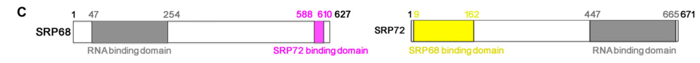
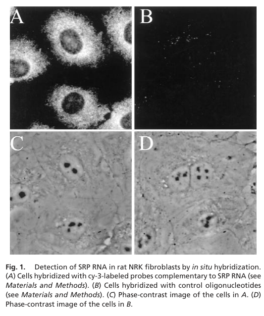

## Question

# Gene Research for Functional Annotation

## ⚠️ CRITICAL: Gene/Protein Identification Context

**BEFORE YOU BEGIN RESEARCH:** You MUST verify you are researching the CORRECT gene/protein. Gene symbols can be ambiguous, especially for less well-characterized genes from non-model organisms.

### Target Gene/Protein Identity (from UniProt):
- **UniProt Accession:** Q9UHB9
- **Protein Description:** RecName: Full=Signal recognition particle subunit SRP68; Short=SRP68; AltName: Full=Signal recognition particle 68 kDa protein;
- **Gene Information:** Name=SRP68;
- **Organism (full):** Homo sapiens (Human).
- **Protein Family:** Belongs to the SRP68 family. .
- **Key Domains:** SRP68. (IPR026258); SRP68-RBD. (IPR034652); SRP68_N_sf. (IPR038253); SRP68 (PF16969)

### MANDATORY VERIFICATION STEPS:

1. **Check if the gene symbol "SRP68" matches the protein description above**
2. **Verify the organism is correct:** Homo sapiens (Human).
3. **Check if protein family/domains align with what you find in literature**
4. **If you find literature for a DIFFERENT gene with the same or similar symbol, STOP**

### If Gene Symbol is Ambiguous or You Cannot Find Relevant Literature:

**DO NOT PROCEED WITH RESEARCH ON A DIFFERENT GENE.** Instead:
- State clearly: "The gene symbol 'SRP68' is ambiguous or literature is limited for this specific protein"
- Explain what you found (e.g., "Found extensive literature on a different gene with the same symbol in a different organism")
- Describe the protein based ONLY on the UniProt information provided above
- Suggest that the protein function can be inferred from domain/family information

### Research Target:

Please provide a comprehensive research report on the gene **SRP68** (gene ID: SRP68, UniProt: Q9UHB9) in human.

The research report should be a detailed narrative explaining the function, biological processes, and localization of the gene product. Citations should be given for all claims.

You should prioritize authoritative reviews and primary scientific literature when conducting research. You can supplement
this with annotations you find in gene/protein databases, but these can be outdated or inaccurate.

We are specifically interested in the primary function of the gene - for enzymes, what reaction is catalyzed, and what is the substrate specificity? For transporters, what is the substrate? For structural proteins or adapters, what is the broader structural role? For signaling molecules, what is the role in the pathway.

We are interested in where in or outside the cell the gene product carries out its function.

We are also interested in the signaling or biochemical pathways in which the gene functions. We are less interested in broad pleiotropic effects, except where these elucidate the precise role.

Include evidence where possible. We are interested in both experimental evidence as well as inference from structure, evolution, or bioinformatic analysis. Precise studies should be prioritized over high-throughput, where available.

## Output

Question: You are an expert researcher providing comprehensive, well-cited information.

Provide detailed information focusing on:
1. Key concepts and definitions with current understanding
2. Recent developments and latest research (prioritize 2023-2024 sources)
3. Current applications and real-world implementations
4. Expert opinions and analysis from authoritative sources
5. Relevant statistics and data from recent studies

Format as a comprehensive research report with proper citations. Include URLs and publication dates where available.
Always prioritize recent, authoritative sources and provide specific citations for all major claims.

# Gene Research for Functional Annotation

## ⚠️ CRITICAL: Gene/Protein Identification Context

**BEFORE YOU BEGIN RESEARCH:** You MUST verify you are researching the CORRECT gene/protein. Gene symbols can be ambiguous, especially for less well-characterized genes from non-model organisms.

### Target Gene/Protein Identity (from UniProt):
- **UniProt Accession:** Q9UHB9
- **Protein Description:** RecName: Full=Signal recognition particle subunit SRP68; Short=SRP68; AltName: Full=Signal recognition particle 68 kDa protein;
- **Gene Information:** Name=SRP68;
- **Organism (full):** Homo sapiens (Human).
- **Protein Family:** Belongs to the SRP68 family. .
- **Key Domains:** SRP68. (IPR026258); SRP68-RBD. (IPR034652); SRP68_N_sf. (IPR038253); SRP68 (PF16969)

### MANDATORY VERIFICATION STEPS:

1. **Check if the gene symbol "SRP68" matches the protein description above**
2. **Verify the organism is correct:** Homo sapiens (Human).
3. **Check if protein family/domains align with what you find in literature**
4. **If you find literature for a DIFFERENT gene with the same or similar symbol, STOP**

### If Gene Symbol is Ambiguous or You Cannot Find Relevant Literature:

**DO NOT PROCEED WITH RESEARCH ON A DIFFERENT GENE.** Instead:
- State clearly: "The gene symbol 'SRP68' is ambiguous or literature is limited for this specific protein"
- Explain what you found (e.g., "Found extensive literature on a different gene with the same symbol in a different organism")
- Describe the protein based ONLY on the UniProt information provided above
- Suggest that the protein function can be inferred from domain/family information

### Research Target:

Please provide a comprehensive research report on the gene **SRP68** (gene ID: SRP68, UniProt: Q9UHB9) in human.

The research report should be a detailed narrative explaining the function, biological processes, and localization of the gene product. Citations should be given for all claims.

You should prioritize authoritative reviews and primary scientific literature when conducting research. You can supplement
this with annotations you find in gene/protein databases, but these can be outdated or inaccurate.

We are specifically interested in the primary function of the gene - for enzymes, what reaction is catalyzed, and what is the substrate specificity? For transporters, what is the substrate? For structural proteins or adapters, what is the broader structural role? For signaling molecules, what is the role in the pathway.

We are interested in where in or outside the cell the gene product carries out its function.

We are also interested in the signaling or biochemical pathways in which the gene functions. We are less interested in broad pleiotropic effects, except where these elucidate the precise role.

Include evidence where possible. We are interested in both experimental evidence as well as inference from structure, evolution, or bioinformatic analysis. Precise studies should be prioritized over high-throughput, where available.

## Research report: Human **SRP68** (UniProt **Q9UHB9**) — functional annotation

### 0) Mandatory identity verification (gene/protein correctness)
The literature retrieved and reviewed here consistently uses **SRP68** to refer to the **human signal recognition particle subunit SRP68**, a core protein of the mammalian signal recognition particle (SRP) complex, and matches the UniProt identity provided (Q9UHB9). Structural work on the human SRP72 complexes explicitly references **UniProtKB Q9UHB9 (human SRP68)** as the binding partner of human SRP72, confirming correct mapping to the UniProt accession and organism (Homo sapiens). (becker2017structuresofhuman pages 1-2)

### 1) Key concepts and definitions (current understanding)

#### 1.1 What SRP68 is
SRP68 is one of the two largest protein subunits of the **mammalian SRP** and is **eukaryote-specific** (no bacterial/archaeal homologs). It forms a stable heterodimer with **SRP72** and binds the **S domain** of SRP RNA (7SL/7S RNA), which is central to SRP-mediated protein targeting. (gao2017humanaposrp72and pages 1-2, faoro2021noncanonicalfunctionsand pages 3-4, becker2017structuresofhuman pages 1-2)

#### 1.2 What SRP does (context)
The SRP is a ribonucleoprotein complex that mediates **co-translational targeting** of nascent secretory and membrane proteins to the **endoplasmic reticulum (ER)**. Reviews emphasize that SRP failure can also trigger quality-control pathways (e.g., RAPP) and contribute to disease phenotypes. (kellogg2021srpassingcotranslationaltargeting pages 11-13, kellogg2022signalrecognitionparticle pages 2-4)

### 2) Molecular function and mechanism (experimental evidence prioritized)

#### 2.1 Binding partners and complex membership
**Direct binding partners supported by primary biochemical/structural work:**
- **SRP72:** SRP68 and SRP72 form a stable heterodimer; SRP72 binds an extended linear motif/segment of SRP68 with high affinity. (gao2017humanaposrp72and pages 7-9, becker2017structuresofhuman pages 1-2)
- **SRP RNA (7SL/7S RNA):** SRP68 binds the central SRP RNA region near the three-way junction (helices 5–8) and contributes to S-domain architecture and remodeling. (gao2017humanaposrp72and pages 1-2, becker2017structuresofhuman pages 1-2)
- **SRP19:** SRP68 RNA-binding domain has been structurally characterized in complex with SRP RNA and SRP19 and is implicated in SRP RNA remodeling relevant for SRP function. (gao2017humanaposrp72and pages 1-2)

#### 2.2 Domain architecture (functional regions)
A key domain-mapping study in human SRP68 identified:
- **RNA-binding domain (RBD):** approximately residues **52–252** are sufficient for SRP RNA binding. (iakhiaeva2006proteinsrp68of pages 1-2, iakhiaeva2006proteinsrp68of pages 2-4)
- **SRP72-binding region:** a **C-terminal ~91–94 amino-acid segment** mediates SRP72 binding. (iakhiaeva2006proteinsrp68of pages 1-2, iakhiaeva2006proteinsrp68of pages 6-8)

These mapped regions align with later structural work describing SRP72’s **TPR-containing protein-binding domain** engaging an SRP68 peptide/linear motif. (becker2017structuresofhuman pages 1-2, gao2017humanaposrp72and pages 7-9)

#### 2.3 Functional role in SRP-mediated co-translational targeting
Multiple lines of evidence support SRP68/72 as functionally essential:
- Reconstituted SRP lacking SRP68/72 is defective in core SRP activities including translocation-related steps; SRP68/72 are described as essential for SRP-mediated protein translocation. (gao2017humanaposrp72and pages 1-2, becker2017structuresofhuman pages 1-2)
- SRP68 binding to SRP RNA promotes/enhances SRP72 binding, consistent with an ordered assembly mechanism on SRP RNA. (politz2000signalrecognitionparticle pages 1-2)
- Structural modeling/docking into cryo-EM density suggests multiple SRP68/72 contact sites with the ribosome, supporting their role in SRP–ribosome organization during targeting. (becker2017structuresofhuman pages 1-2)

**Interpretive expert view:** Reviews emphasize that while SRP68/72 are clearly essential and contribute to RNA remodeling/ribosome interaction, the precise mechanistic details of how SRP68/72 coordinate steps such as handover to the translocon (and interactions involving SRβ/SRα) remain incompletely resolved. (kellogg2021srpassingcotranslationaltargeting pages 11-13, kellogg2023unravelingsrpbiogenesis pages 26-29)

### 3) Cellular localization (where SRP68 acts)

#### 3.1 Cytosol/ER association
SRP68 participates in the cytosolic SRP cycle and shows ER accumulation consistent with SRP’s interaction with the ER-bound SRP receptor and translocation machinery. In cellular imaging, SRP68 showed overlap with an ER-specific dye in addition to nuclear/nucleolar localization. (politz2000signalrecognitionparticle pages 1-2, politz2000signalrecognitionparticle media 5d65c091)

#### 3.2 Nucleus/nucleolus and SRP biogenesis
Classic imaging/localization studies demonstrated that **SRP68 and SRP72 localize to nucleoli**, and SRP RNA is also present in nucleoli—supporting a nuclear/nucleolar stage of SRP biogenesis/assembly. (politz2000signalrecognitionparticle pages 1-2, politz2000signalrecognitionparticle media 5d65c091)

More recent synthesis emphasizes **pre-SRP assembly in the nucleus/nucleolus** (SRP19 binding 7SL RNA first, followed by SRP68/72) and subsequent export to the cytoplasm. (kellogg2023unravelingsrpbiogenesis pages 35-40)

### 4) Recent developments and latest research (prioritize 2023–2024)

#### 4.1 SRP biogenesis and quality-control framing (2023)
A 2023 synthesis on SRP biogenesis and quality control highlights SRP68 as part of a disease-relevant SRP integrity network (linking SRP subunit defects to ER targeting failure and cellular stress). It specifically cites SRP68 congenital-neutropenia-associated lesions (splice/exon 1 deletion; frameshift A50Ffs*52) and frames SRP subunit dysfunction within quality-control logic (including RAPP concepts), while also noting gaps in direct mechanistic evidence for SRP68-triggered RAPP. (kellogg2023unravelingsrpbiogenesis pages 46-51, kellogg2023unravelingsrpbiogenesis pages 40-43)

#### 4.2 Continued structural emphasis on SRP68/72 architecture (2024)
A 2024 RNA Biology review centered on SRP9/14 and Alu RNA regulation references the positioning of the **SRP68/SRP72 heterodimer** over the SRP RNA helix 5e and cites contemporary SRP68/72 structural work, reflecting continuing interest in SRP architecture and RNA-binding interfaces. (OpenTargets Search: -SRP68)

**Important limitation (transparency):** A Feb 2024 Nucleic Acids Research cryo-EM paper specifically about SRP68/72 structure was identified by search but was not obtainable in this run, so the report cannot extract direct textual evidence from it. (tool output: “unobtainable paper” noted in search results)

### 5) Human genetics, disease links, and real-world applications

#### 5.1 Severe congenital neutropenia due to biallelic SRP68 variants (primary evidence)
A 2021 Haematologica case report provided direct human genetic and mechanistic cellular evidence linking SRP68 loss-of-function to severe congenital neutropenia:
- Clinical hematology statistics at presentation: WBC **6.1 × 10^9/L**, neutrophils **0.2 × 10^9/L**, monocytes **1.7 × 10^9/L**, hemoglobin **7.5 g/dL**, platelets **149 × 10^9/L**. Serial counts (n=41) confirmed persistent profound neutropenia (median **0.200 × 10^9/L**, range 0–1.800). (schmaltzpanneau2021identificationofbiallelic pages 1-6)
- Bone marrow phenotype: maturation arrest at promyelocytic stage with dysgranulopoiesis and abnormal promyelocyte/neutrophil morphology. (schmaltzpanneau2021identificationofbiallelic pages 1-6)
- Genotype/variant mechanism: compound heterozygosity including **c.184+2T>C** splice-site defect using a cryptic splice donor producing a truncated protein **Ala50Phefs*52**, plus an exon 1 deletion. (schmaltzpanneau2021identificationofbiallelic pages 1-6)
- Functional consequence: markedly reduced SRP68 protein (western blot), reduced SRP68 expression during granulocytic differentiation, impaired granulocytic proliferation, ER-stress signatures (e.g., XBP1 splicing) and increased expression of p53/apoptosis pathway genes (e.g., P21, BAX, MDM2). (schmaltzpanneau2021identificationofbiallelic pages 10-17, schmaltzpanneau2021identificationofbiallelic pages 6-10)

**Real-world implementation:** SRP68 is therefore relevant to **clinical genomics/rare disease diagnostics** (variant interpretation; mechanism-based classification) for congenital neutropenia cases. (schmaltzpanneau2021identificationofbiallelic pages 1-6)

#### 5.2 Cancer-associated variants affecting SRP68–SRP72 interaction (functional/structural evidence)
Structural work mapping SRP68/72 interfaces found that cancer-associated substitutions can impair heterodimer formation and subcellular distribution:
- Example: **SRP68 F590L** abolished SRP68–SRP72 binding in vitro, and mutants showed diminished ER co-localization and more diffuse localization compared to wild-type. (gao2017humanaposrp72and pages 7-9)
These results provide a mechanistic basis for using SRP68/SRP72 interface maps to interpret variants discovered in tumor sequencing. (gao2017humanaposrp72and pages 7-9)

#### 5.3 Disease-association aggregation resources
Open Targets aggregates SRP68 disease associations including **“neutropenia, severe congenital, 10, autosomal recessive”** (and other lower-confidence associations), providing a starting point for cross-referencing genetic evidence. (OpenTargets Search: -SRP68)

### 6) Visual evidence (figures supporting key claims)
- **SRP68/72 complex and domain architecture:** Structural images show the SRP68/72 complex and domain schematic highlighting SRP68 and SRP72 RNA-binding and mutual binding regions. (gao2017humanaposrp72and media 9d5056ea, gao2017humanaposrp72and media 6b1840f5)
- **Nucleolar and ER localization:** Images show nucleolar localization of SRP68 and SRP72 and ER accumulation of SRP68 overlapping an ER dye. (politz2000signalrecognitionparticle media 5d65c091, politz2000signalrecognitionparticle media 4ee44bf1)

### 7) Statistics and data highlights (recent/primary)
- Severe congenital neutropenia case: neutrophils **0.2 × 10^9/L** at presentation; persistent median **0.200 × 10^9/L** across **41** measurements; hemoglobin **7.5 g/dL**; platelets **149 × 10^9/L**. (schmaltzpanneau2021identificationofbiallelic pages 1-6)
- Patient-derived granulocytic cells: SRP68 expression reduced to **68%** (immature) and **39%** (more mature) relative to controls; granulocytic proliferation **~6× lower** than control. (schmaltzpanneau2021identificationofbiallelic pages 6-10)

### 8) Consolidated evidence map
The following table compactly maps SRP68 annotation aspects to the strongest sources.

| Aspect | Key findings | Strongest sources | Publication year |
|---|---|---|---|
| Definition/concept | SRP68 (UniProt Q9UHB9) is the human signal recognition particle 68 kDa subunit, a eukaryote-specific core component of the mammalian SRP S domain. It forms an obligate heterodimer with SRP72 and is required for productive SRP assembly and co-translational targeting of secretory and membrane proteins to the ER. | Becker et al. 2017, Gao et al. 2017, Kellogg et al. 2021 (becker2017structuresofhuman pages 1-2, gao2017humanaposrp72and pages 1-2, kellogg2021srpassingcotranslationaltargeting pages 11-13) | 2017, 2017, 2021 |
| Domains | Experimental mapping placed the major SRP RNA-binding region of SRP68 at approximately residues 52-252, while a C-terminal segment of about 91-94 aa mediates SRP72 binding. Reviews and structural analyses describe SRP68 as containing an RNA-binding module that remodels 7SL RNA and supports heterodimer assembly with SRP72. | Iakhiaeva et al. 2006, Faoro & Ataide 2021, Gao et al. 2017 (iakhiaeva2006proteinsrp68of pages 1-2, faoro2021noncanonicalfunctionsand pages 3-4, gao2017humanaposrp72and pages 1-2) | 2006, 2021, 2017 |
| Binding partners | The best-supported direct partners are SRP72, 7SL/SRP RNA, and SRP19 within the assembled S domain; SRP68 also functionally influences SRP54 recruitment and ribosome engagement through RNA remodeling. A minimal ~23-residue SRP68 segment is sufficient for tight binding to the SRP72 TPR-containing protein-binding domain. | Iakhiaeva et al. 2006, Becker et al. 2017, Gao et al. 2017 (iakhiaeva2006proteinsrp68of pages 2-4, becker2017structuresofhuman pages 1-2, gao2017humanaposrp72and pages 1-2) | 2006, 2017, 2017 |
| Mechanism in SRP cycle | SRP68 binds the central 7SL RNA region near the three-way junction/helices 5-8 and helps remodel the S-domain RNA, which supports ribosome interaction and efficient SRP function. Reconstituted SRP lacking SRP68/72 is defective in translocation, and SRP68/72 assembly is needed for pre-SRP nuclear export and productive ER targeting. | Becker et al. 2017, Gao et al. 2017, Politz et al. 2000 (becker2017structuresofhuman pages 1-2, gao2017humanaposrp72and pages 1-2, politz2000signalrecognitionparticle pages 1-2) | 2017, 2017, 2000 |
| Localization | SRP68 is detected in the cytosol and at the ER as expected for a co-translational targeting factor, but mammalian studies also localize SRP68 and SRP72 to the nucleolus, supporting nuclear/nucleolar stages of SRP biogenesis. Imaging further showed SRP68 accumulation at ER membranes and nucleolar localization of GFP-tagged SRP68/72 constructs. | Politz et al. 2000, Gao et al. 2017, Kellogg 2023 (politz2000signalrecognitionparticle pages 1-2, gao2017humanaposrp72and pages 7-9, kellogg2023unravelingsrpbiogenesis pages 35-40) | 2000, 2017, 2023 |
| Disease/variants | Biallelic loss-of-function SRP68 variants were reported in severe congenital neutropenia, with persistent ANC around 0.2 x10^9/L, promyelocytic maturation arrest, dysgranulopoiesis, reduced SRP68 protein, impaired granulocytic proliferation, ER-stress signaling, and p53-dependent apoptosis. Cancer-associated interface variants such as F590L can weaken SRP68-SRP72 binding and reduce ER co-localization. | Schmaltz-Panneau et al. 2021, Gao et al. 2017, Kellogg et al. 2022 (schmaltzpanneau2021identificationofbiallelic pages 1-6, gao2017humanaposrp72and pages 7-9, kellogg2022signalrecognitionparticle pages 2-4) | 2021, 2017, 2022 |
| Recent developments 2023-2024 | Recent work emphasized SRP-centered quality control and disease mechanisms: 2023 analyses linked SRP integrity to RAPP-related concepts and highlighted SRP68 congenital-neutropenia and cancer variants, while 2024 structural reporting further extended SRP68/72 architecture. The newest accessible evidence here mainly refines SRP biogenesis/quality-control interpretation rather than redefining SRP68’s core biochemical role. | Kellogg 2023, Karamysheva & Karamyshev 2023, Gussakovsky et al. 2024 (kellogg2023unravelingsrpbiogenesis pages 46-51, kellogg2023unravelingsrpbiogenesis pages 40-43, OpenTargets Search: -SRP68) | 2023, 2023, 2024 |
| Applications | Current real-world use is primarily diagnostic and interpretive rather than therapeutic: SRP68 is relevant in rare-disease genomics, variant interpretation, and mechanistic annotation of congenital neutropenia and cancer-associated mutations. Structural mapping of SRP68-SRP72 interfaces also provides a framework for functional variant assessment and potentially future drug-design efforts around SRP-mediated targeting defects. | Schmaltz-Panneau et al. 2021, Gao et al. 2017, Open Targets association summary (schmaltzpanneau2021identificationofbiallelic pages 1-6, gao2017humanaposrp72and pages 7-9, OpenTargets Search: -SRP68) | 2021, 2017, 2024 |

*Table: This table summarizes the strongest functional annotation evidence for human SRP68 (UniProt Q9UHB9), including its domains, mechanism in the SRP pathway, localization, disease associations, and recent developments. It is useful as a compact evidence map linking each annotation category to the most relevant supporting sources.*

### 9) Key sources (URLs and publication dates)
- Iakhiaeva et al. **2006-06**. *Protein SRP68 of human signal recognition particle: Identification of the RNA and SRP72 binding domains.* **Protein Science**. https://doi.org/10.1110/ps.051861406 (iakhiaeva2006proteinsrp68of pages 1-2)
- Gao et al. **2017-04**. *Human apo-SRP72 and SRP68/72 complex structures reveal the molecular basis of protein translocation.* **Journal of Molecular Cell Biology**. https://doi.org/10.1093/jmcb/mjx010 (gao2017humanaposrp72and pages 1-2)
- Becker et al. **2017-11**. *Structures of human SRP72 complexes provide insights into SRP RNA remodeling and ribosome interaction.* **Nucleic Acids Research**. https://doi.org/10.1093/nar/gkw1124 (becker2017structuresofhuman pages 1-2)
- Politz et al. **2000-01**. *Signal recognition particle components in the nucleolus.* **PNAS**. https://doi.org/10.1073/pnas.97.1.55 (politz2000signalrecognitionparticle pages 1-2)
- Schmaltz-Panneau et al. **2021-04**. *Identification of biallelic germline variants of SRP68 in a sporadic case with severe congenital neutropenia.* **Haematologica**. https://doi.org/10.3324/haematol.2020.247825 (schmaltzpanneau2021identificationofbiallelic pages 1-6)
- Kellogg et al. **2022-06**. *Signal Recognition Particle in Human Diseases.* **Frontiers in Genetics**. https://doi.org/10.3389/fgene.2022.898083 (kellogg2022signalrecognitionparticle pages 2-4)
- Karamysheva & Karamyshev **2023-06**. *Aberrant protein targeting activates quality control on the ribosome.* **Frontiers in Cell and Developmental Biology**. https://doi.org/10.3389/fcell.2023.1198184 (OpenTargets Search: -SRP68)
- Gussakovsky et al. **2024-11**. *The role of SRP9/SRP14 in regulating Alu RNA.* **RNA Biology**. https://doi.org/10.1080/15476286.2024.2430817 (OpenTargets Search: -SRP68)

### 10) Summary (functional annotation statement)
Human SRP68 (UniProt Q9UHB9) is a eukaryote-specific SRP core subunit whose primary function is structural and regulatory within the SRP S domain: it binds 7SL SRP RNA through an N-terminal RNA-binding region (~52–252), binds SRP72 via a C-terminal segment (~91–94 aa), and together with SRP72 remodels SRP RNA and supports ribosome interaction and ER targeting. SRP68 localizes to the cytosolic SRP pathway and shows ER association, but also localizes to the nucleolus consistent with nuclear/nucleolar SRP assembly. Pathogenic biallelic SRP68 loss-of-function variants cause severe congenital neutropenia with ER stress and p53/apoptosis signatures in granulopoiesis, and cancer-associated interface variants can disrupt SRP68–SRP72 binding and ER co-localization. (iakhiaeva2006proteinsrp68of pages 1-2, becker2017structuresofhuman pages 1-2, politz2000signalrecognitionparticle pages 1-2, schmaltzpanneau2021identificationofbiallelic pages 1-6, gao2017humanaposrp72and pages 7-9)

References

1. (becker2017structuresofhuman pages 1-2): Matthias M. M. Becker, Karine Lapouge, Bernd Segnitz, Klemens Wild, and Irmgard Sinning. Structures of human srp72 complexes provide insights into srp rna remodeling and ribosome interaction. Nucleic Acids Research, 45:470-481, Nov 2017. URL: https://doi.org/10.1093/nar/gkw1124, doi:10.1093/nar/gkw1124. This article has 38 citations and is from a highest quality peer-reviewed journal.

2. (gao2017humanaposrp72and pages 1-2): Yina Gao, Qi Zhang, Yue Lang, Yang Liu, Xiaofei Dong, Zhenhang Chen, Wenli Tian, Jun Tang, Wei Wu, Yufeng Tong, and Zhongzhou Chen. Human apo-srp72 and srp68/72 complex structures reveal the molecular basis of protein translocation. Journal of Molecular Cell Biology, 9:220-230, Apr 2017. URL: https://doi.org/10.1093/jmcb/mjx010, doi:10.1093/jmcb/mjx010. This article has 20 citations and is from a peer-reviewed journal.

3. (faoro2021noncanonicalfunctionsand pages 3-4): Camilla Faoro and Sandro F. Ataide. Noncanonical functions and cellular dynamics of the mammalian signal recognition particle components. Frontiers in Molecular Biosciences, May 2021. URL: https://doi.org/10.3389/fmolb.2021.679584, doi:10.3389/fmolb.2021.679584. This article has 32 citations.

4. (kellogg2021srpassingcotranslationaltargeting pages 11-13): Morgana K. Kellogg, Sarah C. Miller, Elena B. Tikhonova, and Andrey L. Karamyshev. Srpassing co-translational targeting: the role of the signal recognition particle in protein targeting and mrna protection. International Journal of Molecular Sciences, 22:6284, Jun 2021. URL: https://doi.org/10.3390/ijms22126284, doi:10.3390/ijms22126284. This article has 70 citations.

5. (kellogg2022signalrecognitionparticle pages 2-4): Morgana K. Kellogg, Elena B. Tikhonova, and Andrey L. Karamyshev. Signal recognition particle in human diseases. Frontiers in Genetics, Jun 2022. URL: https://doi.org/10.3389/fgene.2022.898083, doi:10.3389/fgene.2022.898083. This article has 30 citations and is from a peer-reviewed journal.

6. (gao2017humanaposrp72and pages 7-9): Yina Gao, Qi Zhang, Yue Lang, Yang Liu, Xiaofei Dong, Zhenhang Chen, Wenli Tian, Jun Tang, Wei Wu, Yufeng Tong, and Zhongzhou Chen. Human apo-srp72 and srp68/72 complex structures reveal the molecular basis of protein translocation. Journal of Molecular Cell Biology, 9:220-230, Apr 2017. URL: https://doi.org/10.1093/jmcb/mjx010, doi:10.1093/jmcb/mjx010. This article has 20 citations and is from a peer-reviewed journal.

7. (iakhiaeva2006proteinsrp68of pages 1-2): Elena Iakhiaeva, Shakhawat Hossain Bhuiyan, Jiaming Yin, and Christian Zwieb. Protein srp68 of human signal recognition particle: identification of the rna and srp72 binding domains. Protein Science, 15:1290-1302, Jun 2006. URL: https://doi.org/10.1110/ps.051861406, doi:10.1110/ps.051861406. This article has 27 citations and is from a peer-reviewed journal.

8. (iakhiaeva2006proteinsrp68of pages 2-4): Elena Iakhiaeva, Shakhawat Hossain Bhuiyan, Jiaming Yin, and Christian Zwieb. Protein srp68 of human signal recognition particle: identification of the rna and srp72 binding domains. Protein Science, 15:1290-1302, Jun 2006. URL: https://doi.org/10.1110/ps.051861406, doi:10.1110/ps.051861406. This article has 27 citations and is from a peer-reviewed journal.

9. (iakhiaeva2006proteinsrp68of pages 6-8): Elena Iakhiaeva, Shakhawat Hossain Bhuiyan, Jiaming Yin, and Christian Zwieb. Protein srp68 of human signal recognition particle: identification of the rna and srp72 binding domains. Protein Science, 15:1290-1302, Jun 2006. URL: https://doi.org/10.1110/ps.051861406, doi:10.1110/ps.051861406. This article has 27 citations and is from a peer-reviewed journal.

10. (politz2000signalrecognitionparticle pages 1-2): Joan C. Politz, Serge Yarovoi, Susan M. Kilroy, Krishne Gowda, Christian Zwieb, and Thoru Pederson. Signal recognition particle components in the nucleolus. Proceedings of the National Academy of Sciences of the United States of America, 97 1:55-60, Jan 2000. URL: https://doi.org/10.1073/pnas.97.1.55, doi:10.1073/pnas.97.1.55. This article has 234 citations and is from a highest quality peer-reviewed journal.

11. (kellogg2023unravelingsrpbiogenesis pages 26-29): MK Kellogg. Unraveling srp biogenesis and quality control: implications for human disease pathogenesis. Unknown journal, 2023.

12. (politz2000signalrecognitionparticle media 5d65c091): Joan C. Politz, Serge Yarovoi, Susan M. Kilroy, Krishne Gowda, Christian Zwieb, and Thoru Pederson. Signal recognition particle components in the nucleolus. Proceedings of the National Academy of Sciences of the United States of America, 97 1:55-60, Jan 2000. URL: https://doi.org/10.1073/pnas.97.1.55, doi:10.1073/pnas.97.1.55. This article has 234 citations and is from a highest quality peer-reviewed journal.

13. (kellogg2023unravelingsrpbiogenesis pages 35-40): MK Kellogg. Unraveling srp biogenesis and quality control: implications for human disease pathogenesis. Unknown journal, 2023.

14. (kellogg2023unravelingsrpbiogenesis pages 46-51): MK Kellogg. Unraveling srp biogenesis and quality control: implications for human disease pathogenesis. Unknown journal, 2023.

15. (kellogg2023unravelingsrpbiogenesis pages 40-43): MK Kellogg. Unraveling srp biogenesis and quality control: implications for human disease pathogenesis. Unknown journal, 2023.

16. (OpenTargets Search: -SRP68): Open Targets Query (-SRP68, 5 results). Buniello, A. et al. (2025). Open Targets Platform: facilitating therapeutic hypotheses building in drug discovery. Nucleic Acids Research.

17. (schmaltzpanneau2021identificationofbiallelic pages 1-6): Barbara Schmaltz-Panneau, Anne Pagnier, Séverine Clauin, Julien Buratti, Caroline Marty, Odile Fenneteau, Klaus Dieterich, Blandine Beaupain, Jean Donadieu, Isabelle Plo, and Christine Bellanné-Chantelot. Identification of biallelic germline variants of srp68 in a sporadic case with severe congenital neutropenia. Haematologica, 106:1216-1219, Apr 2021. URL: https://doi.org/10.3324/haematol.2020.247825, doi:10.3324/haematol.2020.247825. This article has 15 citations.

18. (schmaltzpanneau2021identificationofbiallelic pages 10-17): Barbara Schmaltz-Panneau, Anne Pagnier, Séverine Clauin, Julien Buratti, Caroline Marty, Odile Fenneteau, Klaus Dieterich, Blandine Beaupain, Jean Donadieu, Isabelle Plo, and Christine Bellanné-Chantelot. Identification of biallelic germline variants of srp68 in a sporadic case with severe congenital neutropenia. Haematologica, 106:1216-1219, Apr 2021. URL: https://doi.org/10.3324/haematol.2020.247825, doi:10.3324/haematol.2020.247825. This article has 15 citations.

19. (schmaltzpanneau2021identificationofbiallelic pages 6-10): Barbara Schmaltz-Panneau, Anne Pagnier, Séverine Clauin, Julien Buratti, Caroline Marty, Odile Fenneteau, Klaus Dieterich, Blandine Beaupain, Jean Donadieu, Isabelle Plo, and Christine Bellanné-Chantelot. Identification of biallelic germline variants of srp68 in a sporadic case with severe congenital neutropenia. Haematologica, 106:1216-1219, Apr 2021. URL: https://doi.org/10.3324/haematol.2020.247825, doi:10.3324/haematol.2020.247825. This article has 15 citations.

20. (gao2017humanaposrp72and media 9d5056ea): Yina Gao, Qi Zhang, Yue Lang, Yang Liu, Xiaofei Dong, Zhenhang Chen, Wenli Tian, Jun Tang, Wei Wu, Yufeng Tong, and Zhongzhou Chen. Human apo-srp72 and srp68/72 complex structures reveal the molecular basis of protein translocation. Journal of Molecular Cell Biology, 9:220-230, Apr 2017. URL: https://doi.org/10.1093/jmcb/mjx010, doi:10.1093/jmcb/mjx010. This article has 20 citations and is from a peer-reviewed journal.

21. (gao2017humanaposrp72and media 6b1840f5): Yina Gao, Qi Zhang, Yue Lang, Yang Liu, Xiaofei Dong, Zhenhang Chen, Wenli Tian, Jun Tang, Wei Wu, Yufeng Tong, and Zhongzhou Chen. Human apo-srp72 and srp68/72 complex structures reveal the molecular basis of protein translocation. Journal of Molecular Cell Biology, 9:220-230, Apr 2017. URL: https://doi.org/10.1093/jmcb/mjx010, doi:10.1093/jmcb/mjx010. This article has 20 citations and is from a peer-reviewed journal.

22. (politz2000signalrecognitionparticle media 4ee44bf1): Joan C. Politz, Serge Yarovoi, Susan M. Kilroy, Krishne Gowda, Christian Zwieb, and Thoru Pederson. Signal recognition particle components in the nucleolus. Proceedings of the National Academy of Sciences of the United States of America, 97 1:55-60, Jan 2000. URL: https://doi.org/10.1073/pnas.97.1.55, doi:10.1073/pnas.97.1.55. This article has 234 citations and is from a highest quality peer-reviewed journal.

## Artifacts

- [Edison artifact artifact-00](SRP68-deep-research-falcon_artifacts/artifact-00.md)

## Citations

1. becker2017structuresofhuman pages 1-2
2. politz2000signalrecognitionparticle pages 1-2
3. kellogg2023unravelingsrpbiogenesis pages 35-40
4. schmaltzpanneau2021identificationofbiallelic pages 1-6
5. schmaltzpanneau2021identificationofbiallelic pages 6-10
6. kellogg2022signalrecognitionparticle pages 2-4
7. faoro2021noncanonicalfunctionsand pages 3-4
8. kellogg2021srpassingcotranslationaltargeting pages 11-13
9. kellogg2023unravelingsrpbiogenesis pages 26-29
10. kellogg2023unravelingsrpbiogenesis pages 46-51
11. kellogg2023unravelingsrpbiogenesis pages 40-43
12. schmaltzpanneau2021identificationofbiallelic pages 10-17
13. https://doi.org/10.1110/ps.051861406
14. https://doi.org/10.1093/jmcb/mjx010
15. https://doi.org/10.1093/nar/gkw1124
16. https://doi.org/10.1073/pnas.97.1.55
17. https://doi.org/10.3324/haematol.2020.247825
18. https://doi.org/10.3389/fgene.2022.898083
19. https://doi.org/10.3389/fcell.2023.1198184
20. https://doi.org/10.1080/15476286.2024.2430817
21. https://doi.org/10.1093/nar/gkw1124,
22. https://doi.org/10.1093/jmcb/mjx010,
23. https://doi.org/10.3389/fmolb.2021.679584,
24. https://doi.org/10.3390/ijms22126284,
25. https://doi.org/10.3389/fgene.2022.898083,
26. https://doi.org/10.1110/ps.051861406,
27. https://doi.org/10.1073/pnas.97.1.55,
28. https://doi.org/10.3324/haematol.2020.247825,