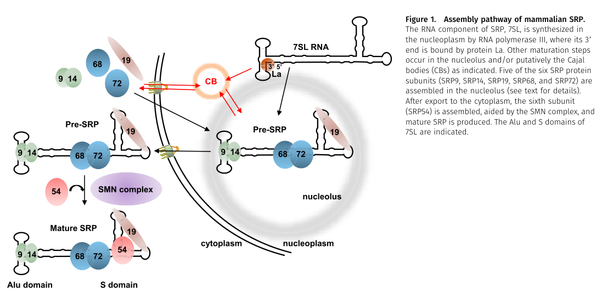

## Question

# Gene Research for Functional Annotation

## ⚠️ CRITICAL: Gene/Protein Identification Context

**BEFORE YOU BEGIN RESEARCH:** You MUST verify you are researching the CORRECT gene/protein. Gene symbols can be ambiguous, especially for less well-characterized genes from non-model organisms.

### Target Gene/Protein Identity (from UniProt):
- **UniProt Accession:** O76094
- **Protein Description:** RecName: Full=Signal recognition particle subunit SRP72; Short=SRP72; AltName: Full=Signal recognition particle 72 kDa protein;
- **Gene Information:** Name=SRP72;
- **Organism (full):** Homo sapiens (Human).
- **Protein Family:** Belongs to the SRP72 family. .
- **Key Domains:** Signal_recog_part_SRP72_RNA-bd. (IPR013699); SRP72. (IPR026270); SRP72_TPR-like. (IPR031545); TPR-like_helical_dom_sf. (IPR011990); TPR_rpt. (IPR019734)

### MANDATORY VERIFICATION STEPS:

1. **Check if the gene symbol "SRP72" matches the protein description above**
2. **Verify the organism is correct:** Homo sapiens (Human).
3. **Check if protein family/domains align with what you find in literature**
4. **If you find literature for a DIFFERENT gene with the same or similar symbol, STOP**

### If Gene Symbol is Ambiguous or You Cannot Find Relevant Literature:

**DO NOT PROCEED WITH RESEARCH ON A DIFFERENT GENE.** Instead:
- State clearly: "The gene symbol 'SRP72' is ambiguous or literature is limited for this specific protein"
- Explain what you found (e.g., "Found extensive literature on a different gene with the same symbol in a different organism")
- Describe the protein based ONLY on the UniProt information provided above
- Suggest that the protein function can be inferred from domain/family information

### Research Target:

Please provide a comprehensive research report on the gene **SRP72** (gene ID: SRP72, UniProt: O76094) in human.

The research report should be a detailed narrative explaining the function, biological processes, and localization of the gene product. Citations should be given for all claims.

You should prioritize authoritative reviews and primary scientific literature when conducting research. You can supplement
this with annotations you find in gene/protein databases, but these can be outdated or inaccurate.

We are specifically interested in the primary function of the gene - for enzymes, what reaction is catalyzed, and what is the substrate specificity? For transporters, what is the substrate? For structural proteins or adapters, what is the broader structural role? For signaling molecules, what is the role in the pathway.

We are interested in where in or outside the cell the gene product carries out its function.

We are also interested in the signaling or biochemical pathways in which the gene functions. We are less interested in broad pleiotropic effects, except where these elucidate the precise role.

Include evidence where possible. We are interested in both experimental evidence as well as inference from structure, evolution, or bioinformatic analysis. Precise studies should be prioritized over high-throughput, where available.

## Output

Question: You are an expert researcher providing comprehensive, well-cited information.

Provide detailed information focusing on:
1. Key concepts and definitions with current understanding
2. Recent developments and latest research (prioritize 2023-2024 sources)
3. Current applications and real-world implementations
4. Expert opinions and analysis from authoritative sources
5. Relevant statistics and data from recent studies

Format as a comprehensive research report with proper citations. Include URLs and publication dates where available.
Always prioritize recent, authoritative sources and provide specific citations for all major claims.

# Gene Research for Functional Annotation

## ⚠️ CRITICAL: Gene/Protein Identification Context

**BEFORE YOU BEGIN RESEARCH:** You MUST verify you are researching the CORRECT gene/protein. Gene symbols can be ambiguous, especially for less well-characterized genes from non-model organisms.

### Target Gene/Protein Identity (from UniProt):
- **UniProt Accession:** O76094
- **Protein Description:** RecName: Full=Signal recognition particle subunit SRP72; Short=SRP72; AltName: Full=Signal recognition particle 72 kDa protein;
- **Gene Information:** Name=SRP72;
- **Organism (full):** Homo sapiens (Human).
- **Protein Family:** Belongs to the SRP72 family. .
- **Key Domains:** Signal_recog_part_SRP72_RNA-bd. (IPR013699); SRP72. (IPR026270); SRP72_TPR-like. (IPR031545); TPR-like_helical_dom_sf. (IPR011990); TPR_rpt. (IPR019734)

### MANDATORY VERIFICATION STEPS:

1. **Check if the gene symbol "SRP72" matches the protein description above**
2. **Verify the organism is correct:** Homo sapiens (Human).
3. **Check if protein family/domains align with what you find in literature**
4. **If you find literature for a DIFFERENT gene with the same or similar symbol, STOP**

### If Gene Symbol is Ambiguous or You Cannot Find Relevant Literature:

**DO NOT PROCEED WITH RESEARCH ON A DIFFERENT GENE.** Instead:
- State clearly: "The gene symbol 'SRP72' is ambiguous or literature is limited for this specific protein"
- Explain what you found (e.g., "Found extensive literature on a different gene with the same symbol in a different organism")
- Describe the protein based ONLY on the UniProt information provided above
- Suggest that the protein function can be inferred from domain/family information

### Research Target:

Please provide a comprehensive research report on the gene **SRP72** (gene ID: SRP72, UniProt: O76094) in human.

The research report should be a detailed narrative explaining the function, biological processes, and localization of the gene product. Citations should be given for all claims.

You should prioritize authoritative reviews and primary scientific literature when conducting research. You can supplement
this with annotations you find in gene/protein databases, but these can be outdated or inaccurate.

We are specifically interested in the primary function of the gene - for enzymes, what reaction is catalyzed, and what is the substrate specificity? For transporters, what is the substrate? For structural proteins or adapters, what is the broader structural role? For signaling molecules, what is the role in the pathway.

We are interested in where in or outside the cell the gene product carries out its function.

We are also interested in the signaling or biochemical pathways in which the gene functions. We are less interested in broad pleiotropic effects, except where these elucidate the precise role.

Include evidence where possible. We are interested in both experimental evidence as well as inference from structure, evolution, or bioinformatic analysis. Precise studies should be prioritized over high-throughput, where available.

## Research Report: Human **SRP72** (UniProt **O76094**) — Functional Annotation

### 0) Gene/protein verification (mandatory)
The target is **human SRP72** (gene symbol **SRP72**), the **signal recognition particle subunit SRP72** (≈72 kDa) that is a canonical SRP protein subunit in mammals (issa2024thenucleolarphase pages 1-2). In mammalian cells, SRP comprises **7SL RNA** plus **six proteins** (**SRP9, SRP14, SRP19, SRP54, SRP68, SRP72**), and **SRP68 and SRP72 form a heterodimer** (issa2024thenucleolarphase pages 1-2). This matches the provided UniProt context (SRP72 family; RNA-binding and TPR-like features) and the organism is explicitly mammalian/human in the core sources used (issa2024thenucleolarphase pages 1-2, kirwan2012exomesequencingidentifies pages 3-5).

### 1) Key concepts and definitions (current understanding)

#### 1.1 Signal recognition particle (SRP) pathway (co-translational ER targeting)
The **SRP pathway** is the principal and best-characterized route for **co-translational targeting of secretory and membrane proteins to the endoplasmic reticulum (ER)** (issa2024thenucleolarphase pages 1-2). SRP binds ribosomes translating nascent chains bearing ER-targeting sequences (signal peptides or transmembrane segments), **transiently arrests elongation**, targets the ribosome–nascent chain complex to the **SRP receptor (SR)** at the ER membrane, and transfers the nascent chain to the **Sec61 translocon**, after which translation resumes (issa2024thenucleolarphase pages 1-2, karamysheva2023aberrantproteintargeting pages 1-2).

A widely cited 2023 synthesis emphasizes that SRP-dependent targeting failures can trigger **quality control** (notably **RAPP**, Regulation of Aberrant Protein Production) that selectively degrades mRNAs encoding proteins whose signal peptide–SRP interactions are disrupted (karamysheva2023aberrantproteintargeting pages 1-2, guarnizo2023pathogenicsignalpeptide pages 1-2).

#### 1.2 Where SRP72 fits in SRP architecture
SRP is organized around 7SL RNA with two functional regions:
- **Alu domain** (bound by SRP9/14; linked to elongation arrest)
- **S-domain** (bound by SRP19, SRP54, and the **SRP68/72 heterodimer**, which is described as helping “control translocation”) (kellogg2023unravelingsrpbiogenesis pages 147-153, gussakovsky2024theroleof pages 1-2).

SRP72’s role is therefore best understood as **structural/organizational and targeting-supportive** within the SRP ribonucleoprotein rather than as an enzyme with a catalytic reaction. Recent mechanistic summaries attribute SRP68/72 positioning to the 7SL S-domain and assign SRP68/72 contributions to translocation control and SRP architecture (kellogg2023unravelingsrpbiogenesis pages 26-29, gussakovsky2024theroleof pages 1-2).

### 2) SRP72 molecular function, interactions, and localization

#### 2.1 Core molecular function: enabling SRP-mediated ER targeting
In mammalian SRP, SRP72 functions as part of the SRP machinery that mediates co-translational targeting to the ER and subsequent handoff to the SR receptor and Sec61 translocon (issa2024thenucleolarphase pages 1-2, kellogg2023unravelingsrpbiogenesis pages 23-26). A 2023 mechanistic overview reiterates that SRP recognizes emerging signal peptides/transmembrane segments (via SRP54), arrests elongation, docks at the ER SR, and transfers to the translocon (karamysheva2023aberrantproteintargeting pages 1-2). In these models, **SRP72’s primary function is through its membership in the SRP S-domain and heterodimerization with SRP68**, supporting SRP assembly and productive targeting (kellogg2023unravelingsrpbiogenesis pages 23-26, kellogg2023unravelingsrpbiogenesis pages 26-29).

#### 2.2 Key interactions (SRP68, 7SL RNA, and SRP complex integrity)
**Experimental evidence for SRP72 as a bona fide SRP component** comes from inducible GFP-tagging and immunoprecipitation:
- GFP-SRP72 **efficiently co-immunoprecipitates other SRP subunits**, consistent with incorporation into mature SRP particles (issa2024thenucleolarphase pages 2-3).
- RNase treatment disrupts many inter-subunit associations between Alu-domain proteins and S-domain proteins (including SRP72), consistent with **7SL RNA-mediated complex architecture** (issa2024thenucleolarphase pages 2-3).

A disease-genetics/mechanism study further supports direct SRP72–7SL functional coupling:
- A truncating SRP72 frameshift variant (p.Thr355Lysfs*19) was reported to show **~15% of wild-type 7SL RNA co-precipitation**, indicating substantially impaired association with 7SL RNA (kirwan2012exomesequencingidentifies pages 3-5).

#### 2.3 Subcellular localization and SRP72 biogenesis: cytoplasm, nucleolus, and Cajal bodies
Although SRP executes its targeting function in the **cytoplasm at translating ribosomes** (issa2024thenucleolarphase pages 1-2), SRP biogenesis includes a nuclear/nucleolar phase:
- An SRP assembly model indicates that **five of the six SRP proteins (including SRP72) assemble with 7SL RNA in the nucleolus**, while SRP54 joins after export to the cytoplasm (issa2024thenucleolarphase pages 2-3, issa2024thenucleolarphase pages 1-2).
- GFP-SRP72 localizes to nucleoli, especially the **periphery of the dense fibrillar component (PDFC)**, and it also localizes to **Cajal bodies (CBs)** (issa2024thenucleolarphase pages 3-5, issa2024thenucleolarphase media d31564f7).
- Quantitatively, analysis of **45 U2OS cells expressing GFP-SRP72** found SRP72 present in **~50% of analyzed Cajal bodies** (issa2024thenucleolarphase pages 2-3).

Proteomic evidence from 2024 further indicates SRP72’s nucleolar connectivity:
- SRP interactome mapping identified **~239 new associations** overall and **95 new nucleolar/ribosome-biogenesis proteins** interacting with SRP components, bringing nucleolar/ribosome biogenesis SRP interactors to **173** (issa2024thenucleolarphase pages 9-10). These findings support the view that SRP72 (as part of SRP) participates in a biogenesis environment intertwined with nucleolar structure and ribosome assembly (issa2024thenucleolarphase pages 9-10).

### 3) Recent developments and latest research (prioritizing 2023–2024)

#### 3.1 2024: Nucleolar phase of SRP assembly and SRP72 localization (primary data)
A 2024 Life Science Alliance study systematically tested SRP component localization and interactomes and concluded that an intact nucleolus is required for proper SRP protein localization and that SRP72 has a nucleolar/CB phase (issa2024thenucleolarphase pages 1-2, issa2024thenucleolarphase pages 3-5). This represents a recent consolidation and expansion of SRP biogenesis concepts, providing experimental support for a nucleolar step in SRP72-containing SRP assembly (issa2024thenucleolarphase pages 2-3, issa2024thenucleolarphase media d31564f7).

#### 3.2 2023: SRP quality control framing (RAPP and broader proteostasis links)
Two 2023 sources emphasize that ER targeting is tightly coupled to mRNA/protein quality control: when SRP recognition fails (e.g., due to signal peptide defects), RAPP can degrade the corresponding mRNAs (karamysheva2023aberrantproteintargeting pages 1-2, guarnizo2023pathogenicsignalpeptide pages 1-2). While these papers focus heavily on signal peptides and SRP54 function, they contribute to a **current “systems” understanding** of SRP as both a targeting factor and a gatekeeper for proteostasis (karamysheva2023aberrantproteintargeting pages 1-2, guarnizo2023pathogenicsignalpeptide pages 1-2).

#### 3.3 2024: Viral co-option of SRP factors including SRP72
A 2024 PLOS Pathogens study reports that Zika virus proteins can engage SRP machinery: viral NS3 binding to **SRP54 and SRP72** is noted, and infection alters normal SRP receptor engagement, supporting a model where viruses remodel ER-associated translation and translocation via SRP interactions (wong2024flavivirusesinduceerspecific pages 8-10). This is an emerging real-world mechanistic context in which SRP72 may be functionally relevant.

### 4) Disease relevance and expert synthesis

#### 4.1 Germline SRP72 and autosomal-dominant bone marrow failure (AA/MDS)
A landmark genetics study identified **heterozygous SRP72 mutations** segregating in **two autosomal-dominant families** with **familial aplastic anemia (AA) and/or myelodysplasia (MDS)** (May 2012; https://doi.org/10.1016/j.ajhg.2012.03.020) (kirwan2012exomesequencingidentifies pages 2-3, kirwan2012exomesequencingidentifies pages 1-2). Reported variants included:
- **c.1064_1065del; p.Thr355Lysfs*19**, predicted truncation deleting a 7SL RNA-binding region (kirwan2012exomesequencingidentifies pages 2-3, kirwan2012exomesequencingidentifies pages 3-5)
- **c.620G>A; p.Arg207His**, a missense affecting a TPR region (kirwan2012exomesequencingidentifies pages 2-3, kirwan2012exomesequencingidentifies pages 3-5)

Mechanistically, the frameshift variant showed substantially reduced 7SL RNA association (~15% of wild-type co-precipitation), connecting the bone-marrow-failure phenotype to disrupted SRP72–7SL coupling and SRP function (kirwan2012exomesequencingidentifies pages 3-5).

A 2019 Blood review (expert synthesis) explicitly summarizes that **two families** with heterozygous SRP72 mutations have been described with autosomal-dominant MDS/bone marrow failure, reinforcing SRP72 as a germline predisposition gene in myeloid disease evaluation (kennedy2019geneticpredispositionto pages 10-15).

#### 4.2 Disease-target association summaries (database evidence)
OpenTargets disease–gene associations include “autosomal dominant aplasia and myelodysplasia” linked to SRP72 and cite the same foundational literature evidence (OpenTargets Search: -SRP72). This supports that SRP72 is recognized across curated resources as a disease gene in hereditary bone marrow failure/MDS predisposition.

### 5) Current applications and real-world implementations

#### 5.1 Clinical genetics: inclusion in hereditary myeloid malignancy screening frameworks
SRP72 appears in gene lists used to triage variants for potential germline evaluation in hereditary myeloid malignancy screening workflows (teranishi2025affirmingtheutility pages 26-30). This indicates real-world implementation in contemporary NGS-based diagnostic pipelines, even when SRP72 pathogenic variants are rare.

#### 5.2 Research implementations
- **Interactome mapping / SRP biogenesis studies**: inducible **GFP-SRP72** cell lines combined with SILAC IP–MS and nucleolar perturbation were used to define SRP72-containing SRP interactomes and nucleolar dependencies (issa2024thenucleolarphase pages 14-15, issa2024thenucleolarphase pages 9-10).
- **Pathogen–host interface**: SRP72 has been implicated as part of SRP machinery engaged by viral non-structural proteins during ER translation remodeling (wong2024flavivirusesinduceerspecific pages 8-10).

### 6) Relevant statistics and quantitative data highlights
Key quantitative findings relevant to SRP72 functional annotation include:
- **Cajal body localization**: SRP72 detected in **~50% of analyzed Cajal bodies**, based on **45 GFP-SRP72-expressing U2OS cells** (2024) (issa2024thenucleolarphase pages 2-3).
- **Proteomic network expansion**: SRP interactome analysis found **~239 new associations**; **95 new nucleolar/ribosome-biogenesis interactors**; total nucleolar/ribosome-biogenesis SRP interactors increased to **173** (2024) (issa2024thenucleolarphase pages 9-10).
- **Disease-variant biochemical effect**: SRP72 frameshift **p.Thr355Lysfs*19** showed **~15%** of wild-type **7SL RNA co-precipitation** (2012) (kirwan2012exomesequencingidentifies pages 3-5).

### 7) Evidence-linked figures (visual)
The following extracted figure panels provide visual support for SRP72 biogenesis and localization:
- SRP assembly schematic showing nucleolar steps (SRP72 among nucleolar-assembling subunits) (issa2024thenucleolarphase media d31564f7).
- GFP-SRP72 nucleolar marker co-localization panels (issa2024thenucleolarphase media 18da7877).
- GFP-SRP72 co-localization with coilin-marked Cajal bodies (issa2024thenucleolarphase media 082653e8).

### 8) Summary and interpretation (authoritative analysis)
Taken together, the evidence supports annotating human **SRP72 (O76094)** as a **core structural/functional subunit of the mammalian SRP S-domain**, operating primarily in **co-translational ER targeting** by maintaining proper SRP architecture and assembly (issa2024thenucleolarphase pages 1-2, kellogg2023unravelingsrpbiogenesis pages 26-29). Recent primary data strongly support a **nucleolar and Cajal-body phase** of SRP72-containing SRP biogenesis, aligning SRP production with ribosome biogenesis environments (issa2024thenucleolarphase pages 2-3, issa2024thenucleolarphase pages 9-10, issa2024thenucleolarphase media d31564f7). Clinically, SRP72 is a validated **autosomal-dominant germline predisposition gene** for familial **aplastic anemia/myelodysplasia**, with mechanistic evidence that pathogenic truncation can disrupt SRP72–7SL RNA association (kirwan2012exomesequencingidentifies pages 2-3, kirwan2012exomesequencingidentifies pages 3-5, kennedy2019geneticpredispositionto pages 10-15). Finally, 2024 work suggests SRP72 may be engaged in pathogen-driven ER translation remodeling, adding translationally relevant context beyond canonical secretion (wong2024flavivirusesinduceerspecific pages 8-10).

| Category | Summary |
|---|---|
| Identity/domains | • Verified target: **human SRP72 / signal recognition particle 72 kDa subunit**, a canonical component of mammalian SRP containing six proteins plus **7SL RNA** (issa2024thenucleolarphase pages 1-2, kellogg2023unravelingsrpbiogenesis pages 111-116)  • Forms the **SRP68/72 heterodimer** within the **S-domain** of SRP; UniProt O76094 assignment is consistent with literature on human SRP72 (issa2024thenucleolarphase pages 1-2, gussakovsky2024theroleof pages 1-2) |
| Molecular function | • Functions in **co-translational targeting** of secretory and membrane proteins to the **ER** as part of SRP, which pauses elongation, targets the ribosome–nascent chain complex to the **SRP receptor**, and hands substrates to the **Sec61 translocon** (issa2024thenucleolarphase pages 1-2, kellogg2023unravelingsrpbiogenesis pages 23-26, karamysheva2023aberrantproteintargeting pages 1-2)  • SRP68/72 is positioned on the **7SL S-domain** and is described as helping **control translocation** (kellogg2023unravelingsrpbiogenesis pages 26-29, gussakovsky2024theroleof pages 1-2) |
| Key interactions | • **SRP72 + SRP68** form a stable heterodimer; GFP-SRP72 co-immunoprecipitates other SRP subunits, confirming assembly into mature SRP (issa2024thenucleolarphase pages 1-2, issa2024thenucleolarphase pages 2-3)  • Interactions between **Alu-domain proteins** and **S-domain proteins including SRP72** are strongly **RNase-sensitive**, supporting dependence on **7SL RNA** (issa2024thenucleolarphase pages 2-3)  • Disease-associated frameshift SRP72 shows markedly reduced **7SL RNA co-precipitation** (kirwan2012exomesequencingidentifies pages 3-5) |
| Subcellular localization/biogenesis | • Mature SRP72 is found in the **cytoplasm**, where SRP functions, but SRP72 also has a clear **nuclear/nucleolar biogenesis phase** (issa2024thenucleolarphase pages 3-5)  • Five SRP proteins, including **SRP72**, assemble with 7SL in the **nucleolus** before **SRP54** joins in the cytoplasm (issa2024thenucleolarphase pages 2-3, issa2024thenucleolarphase pages 1-2)  • SRP72 localizes to the **PDFC region of the nucleolus** and to **Cajal bodies**, implying additional assembly steps there (issa2024thenucleolarphase pages 2-3, issa2024thenucleolarphase pages 3-5, issa2024thenucleolarphase media d31564f7) |
| Disease genetics | • **Heterozygous germline SRP72 mutations** are linked to **autosomal-dominant familial aplasia / myelodysplasia** and bone-marrow failure phenotypes including **AA/MDS, pancytopenia, macrocytic anemia, thrombocytopenia** (kirwan2012exomesequencingidentifies pages 2-3, kirwan2012exomesequencingidentifies pages 1-2, kennedy2019geneticpredispositionto pages 10-15)  • Reported pathogenic variants include **p.Thr355Lysfs*19** and **p.Arg207His**; the frameshift removes the **7SL RNA-binding region** and impairs association with 7SL (kirwan2012exomesequencingidentifies pages 2-3, kirwan2012exomesequencingidentifies pages 3-5) |
| Recent non-canonical roles | • 2024 proteomics places SRP72 in a broader **nucleolar/ribosome-biogenesis network**, suggesting coordinated assembly of SRP and ribosomes (issa2024thenucleolarphase pages 9-10)  • **Zika virus NS3** was reported to bind **SRP72** and other SRP machinery during ER-translation remodeling (wong2024flavivirusesinduceerspecific pages 8-10)  • In 2025 heat-shock work, **SRP72 depletion** altered stress-linked translation programs, implicating SRP72/SRP in acute thermal-stress responses beyond secretion (bujisic20257slrnaand pages 9-10) |
| Applications/implementations | • **Clinical genetics**: SRP72 is included in hereditary myeloid malignancy / inherited bone-marrow-failure evaluation frameworks and targeted-gene screening lists (kennedy2019geneticpredispositionto pages 10-15, teranishi2025affirmingtheutility pages 26-30)  • **Cell biology/proteomics tool use**: inducible **GFP-SRP72** lines and **SILAC IP–MS** are being used to map SRP assembly and interactomes (issa2024thenucleolarphase pages 14-15, issa2024thenucleolarphase pages 3-5) |
| Quantitative highlights | • In U2OS cells, **~50% of analyzed Cajal bodies** were positive for SRP72; based on **45 GFP-SRP72-expressing cells** examined (issa2024thenucleolarphase pages 2-3)  • SRP proteomics identified **~239 new SRP associations**, including **95 new nucleolar/ribosome-biogenesis proteins**, bringing the total such SRP interactors to **173** (issa2024thenucleolarphase pages 9-10)  • SRP72 frameshift **p.Thr355Lysfs*19** retained only **~15% of wild-type 7SL RNA co-precipitation** (kirwan2012exomesequencingidentifies pages 3-5)  • Heat-shock study reported **33 DEGs** and **4 SRP72-dependency clusters** upon SRP72 depletion (bujisic20257slrnaand pages 9-10) |
| Key references/URLs | • **Issa et al., 2024, Life Science Alliance** — nucleolar phase of SRP assembly — https://doi.org/10.26508/lsa.202402614 (issa2024thenucleolarphase pages 1-2)  • **Kirwan et al., 2012, AJHG** — familial aplasia/myelodysplasia genetics — https://doi.org/10.1016/j.ajhg.2012.03.020 (kirwan2012exomesequencingidentifies pages 2-3)  • **Karamysheva & Karamyshev, 2023, Front Cell Dev Biol** — SRP/RAPP overview — https://doi.org/10.3389/fcell.2023.1198184 (karamysheva2023aberrantproteintargeting pages 1-2)  • **Guarnizo et al., 2023, NAR Genom Bioinform** — pathogenic signal peptide variants/SRP pathway — https://doi.org/10.1093/nargab/lqad093 (guarnizo2023pathogenicsignalpeptide pages 1-2)  • **Wong et al., 2024, PLOS Pathogens** — viral remodeling with SRP72 interaction — https://doi.org/10.1371/journal.ppat.1012766 (wong2024flavivirusesinduceerspecific pages 8-10) |

*Table: This table condenses the most relevant verified findings on human SRP72 (UniProt O76094), covering identity, mechanism, localization, disease links, recent research, and practical clinical/research uses. It is useful as a citation-ready scaffold for the final research report.*

References

1. (issa2024thenucleolarphase pages 1-2): Amani Issa, Florence Schlotter, Justine Flayac, Jing Chen, Ludivine Wacheul, Manon Philippe, Lucas Sardini, Lalia Mostefa, Franck Vandermoere, Edouard Bertrand, Céline Verheggen, Denis LJ Lafontaine, and Séverine Massenet. The nucleolar phase of signal recognition particle assembly. Life Science Alliance, 7:e202402614, Jun 2024. URL: https://doi.org/10.26508/lsa.202402614, doi:10.26508/lsa.202402614. This article has 8 citations and is from a peer-reviewed journal.

2. (kirwan2012exomesequencingidentifies pages 3-5): Michael Kirwan, Amanda J. Walne, Vincent Plagnol, Mark Velangi, Aloysius Ho, Upal Hossain, Tom Vulliamy, and Inderjeet Dokal. Exome sequencing identifies autosomal-dominant srp72 mutations associated with familial aplasia and myelodysplasia. American journal of human genetics, 90 5:888-92, May 2012. URL: https://doi.org/10.1016/j.ajhg.2012.03.020, doi:10.1016/j.ajhg.2012.03.020. This article has 151 citations and is from a highest quality peer-reviewed journal.

3. (karamysheva2023aberrantproteintargeting pages 1-2): Zemfira N. Karamysheva and Andrey L. Karamyshev. Aberrant protein targeting activates quality control on the ribosome. Frontiers in Cell and Developmental Biology, Jun 2023. URL: https://doi.org/10.3389/fcell.2023.1198184, doi:10.3389/fcell.2023.1198184. This article has 8 citations.

4. (guarnizo2023pathogenicsignalpeptide pages 1-2): Sneider Alexander Gutierrez Guarnizo, Morgana K Kellogg, Sarah C Miller, Elena B Tikhonova, Zemfira N Karamysheva, and Andrey L Karamyshev. Pathogenic signal peptide variants in the human genome. NAR Genomics and Bioinformatics, Oct 2023. URL: https://doi.org/10.1093/nargab/lqad093, doi:10.1093/nargab/lqad093. This article has 32 citations and is from a peer-reviewed journal.

5. (kellogg2023unravelingsrpbiogenesis pages 147-153): MK Kellogg. Unraveling srp biogenesis and quality control: implications for human disease pathogenesis. Unknown journal, 2023.

6. (gussakovsky2024theroleof pages 1-2): Daniel Gussakovsky, Nicole A. Black, Evan P. Booy, and Sean A. McKenna. The role of srp9/srp14 in regulating alu rna. Nov 2024. URL: https://doi.org/10.1080/15476286.2024.2430817, doi:10.1080/15476286.2024.2430817. This article has 7 citations and is from a peer-reviewed journal.

7. (kellogg2023unravelingsrpbiogenesis pages 26-29): MK Kellogg. Unraveling srp biogenesis and quality control: implications for human disease pathogenesis. Unknown journal, 2023.

8. (kellogg2023unravelingsrpbiogenesis pages 23-26): MK Kellogg. Unraveling srp biogenesis and quality control: implications for human disease pathogenesis. Unknown journal, 2023.

9. (issa2024thenucleolarphase pages 2-3): Amani Issa, Florence Schlotter, Justine Flayac, Jing Chen, Ludivine Wacheul, Manon Philippe, Lucas Sardini, Lalia Mostefa, Franck Vandermoere, Edouard Bertrand, Céline Verheggen, Denis LJ Lafontaine, and Séverine Massenet. The nucleolar phase of signal recognition particle assembly. Life Science Alliance, 7:e202402614, Jun 2024. URL: https://doi.org/10.26508/lsa.202402614, doi:10.26508/lsa.202402614. This article has 8 citations and is from a peer-reviewed journal.

10. (issa2024thenucleolarphase pages 3-5): Amani Issa, Florence Schlotter, Justine Flayac, Jing Chen, Ludivine Wacheul, Manon Philippe, Lucas Sardini, Lalia Mostefa, Franck Vandermoere, Edouard Bertrand, Céline Verheggen, Denis LJ Lafontaine, and Séverine Massenet. The nucleolar phase of signal recognition particle assembly. Life Science Alliance, 7:e202402614, Jun 2024. URL: https://doi.org/10.26508/lsa.202402614, doi:10.26508/lsa.202402614. This article has 8 citations and is from a peer-reviewed journal.

11. (issa2024thenucleolarphase media d31564f7): Amani Issa, Florence Schlotter, Justine Flayac, Jing Chen, Ludivine Wacheul, Manon Philippe, Lucas Sardini, Lalia Mostefa, Franck Vandermoere, Edouard Bertrand, Céline Verheggen, Denis LJ Lafontaine, and Séverine Massenet. The nucleolar phase of signal recognition particle assembly. Life Science Alliance, 7:e202402614, Jun 2024. URL: https://doi.org/10.26508/lsa.202402614, doi:10.26508/lsa.202402614. This article has 8 citations and is from a peer-reviewed journal.

12. (issa2024thenucleolarphase pages 9-10): Amani Issa, Florence Schlotter, Justine Flayac, Jing Chen, Ludivine Wacheul, Manon Philippe, Lucas Sardini, Lalia Mostefa, Franck Vandermoere, Edouard Bertrand, Céline Verheggen, Denis LJ Lafontaine, and Séverine Massenet. The nucleolar phase of signal recognition particle assembly. Life Science Alliance, 7:e202402614, Jun 2024. URL: https://doi.org/10.26508/lsa.202402614, doi:10.26508/lsa.202402614. This article has 8 citations and is from a peer-reviewed journal.

13. (wong2024flavivirusesinduceerspecific pages 8-10): Ho Him Wong, Dorian Richard Kenneth Crudgington, Lewis Siu, and Sumana Sanyal. Flaviviruses induce er-specific remodelling of protein synthesis. Dec 2024. URL: https://doi.org/10.1371/journal.ppat.1012766, doi:10.1371/journal.ppat.1012766. This article has 10 citations and is from a highest quality peer-reviewed journal.

14. (kirwan2012exomesequencingidentifies pages 2-3): Michael Kirwan, Amanda J. Walne, Vincent Plagnol, Mark Velangi, Aloysius Ho, Upal Hossain, Tom Vulliamy, and Inderjeet Dokal. Exome sequencing identifies autosomal-dominant srp72 mutations associated with familial aplasia and myelodysplasia. American journal of human genetics, 90 5:888-92, May 2012. URL: https://doi.org/10.1016/j.ajhg.2012.03.020, doi:10.1016/j.ajhg.2012.03.020. This article has 151 citations and is from a highest quality peer-reviewed journal.

15. (kirwan2012exomesequencingidentifies pages 1-2): Michael Kirwan, Amanda J. Walne, Vincent Plagnol, Mark Velangi, Aloysius Ho, Upal Hossain, Tom Vulliamy, and Inderjeet Dokal. Exome sequencing identifies autosomal-dominant srp72 mutations associated with familial aplasia and myelodysplasia. American journal of human genetics, 90 5:888-92, May 2012. URL: https://doi.org/10.1016/j.ajhg.2012.03.020, doi:10.1016/j.ajhg.2012.03.020. This article has 151 citations and is from a highest quality peer-reviewed journal.

16. (kennedy2019geneticpredispositionto pages 10-15): Alyssa L. Kennedy and Akiko Shimamura. Genetic predisposition to mds: clinical features and clonal evolution. Blood, 133 10:1071-1085, Mar 2019. URL: https://doi.org/10.1182/blood-2018-10-844662, doi:10.1182/blood-2018-10-844662. This article has 176 citations and is from a highest quality peer-reviewed journal.

17. (OpenTargets Search: -SRP72): Open Targets Query (-SRP72, 5 results). Buniello, A. et al. (2025). Open Targets Platform: facilitating therapeutic hypotheses building in drug discovery. Nucleic Acids Research.

18. (teranishi2025affirmingtheutility pages 26-30): E Teranishi. Affirming the utility of somatic genetic testing as a screening tool to identify patients with a possible hereditary myeloid malignancy. Unknown journal, 2025.

19. (issa2024thenucleolarphase pages 14-15): Amani Issa, Florence Schlotter, Justine Flayac, Jing Chen, Ludivine Wacheul, Manon Philippe, Lucas Sardini, Lalia Mostefa, Franck Vandermoere, Edouard Bertrand, Céline Verheggen, Denis LJ Lafontaine, and Séverine Massenet. The nucleolar phase of signal recognition particle assembly. Life Science Alliance, 7:e202402614, Jun 2024. URL: https://doi.org/10.26508/lsa.202402614, doi:10.26508/lsa.202402614. This article has 8 citations and is from a peer-reviewed journal.

20. (issa2024thenucleolarphase media 18da7877): Amani Issa, Florence Schlotter, Justine Flayac, Jing Chen, Ludivine Wacheul, Manon Philippe, Lucas Sardini, Lalia Mostefa, Franck Vandermoere, Edouard Bertrand, Céline Verheggen, Denis LJ Lafontaine, and Séverine Massenet. The nucleolar phase of signal recognition particle assembly. Life Science Alliance, 7:e202402614, Jun 2024. URL: https://doi.org/10.26508/lsa.202402614, doi:10.26508/lsa.202402614. This article has 8 citations and is from a peer-reviewed journal.

21. (issa2024thenucleolarphase media 082653e8): Amani Issa, Florence Schlotter, Justine Flayac, Jing Chen, Ludivine Wacheul, Manon Philippe, Lucas Sardini, Lalia Mostefa, Franck Vandermoere, Edouard Bertrand, Céline Verheggen, Denis LJ Lafontaine, and Séverine Massenet. The nucleolar phase of signal recognition particle assembly. Life Science Alliance, 7:e202402614, Jun 2024. URL: https://doi.org/10.26508/lsa.202402614, doi:10.26508/lsa.202402614. This article has 8 citations and is from a peer-reviewed journal.

22. (kellogg2023unravelingsrpbiogenesis pages 111-116): MK Kellogg. Unraveling srp biogenesis and quality control: implications for human disease pathogenesis. Unknown journal, 2023.

23. (bujisic20257slrnaand pages 9-10): Bojan Bujisic, Hun-Goo Lee, Lilei Xu, Uri Weissbein, Carlos Rivera, Ivan Topisirovic, and Jeannie T. Lee. 7sl rna and signal recognition particle orchestrate a global cellular response to acute thermal stress. Nature Communications, Feb 2025. URL: https://doi.org/10.1038/s41467-025-56351-6, doi:10.1038/s41467-025-56351-6. This article has 7 citations and is from a highest quality peer-reviewed journal.

## Artifacts

- [Edison artifact artifact-00](SRP72-deep-research-falcon_artifacts/artifact-00.md)

## Citations

1. issa2024thenucleolarphase pages 1-2
2. karamysheva2023aberrantproteintargeting pages 1-2
3. issa2024thenucleolarphase pages 2-3
4. kirwan2012exomesequencingidentifies pages 3-5
5. issa2024thenucleolarphase pages 9-10
6. wong2024flavivirusesinduceerspecific pages 8-10
7. kennedy2019geneticpredispositionto pages 10-15
8. teranishi2025affirmingtheutility pages 26-30
9. issa2024thenucleolarphase pages 3-5
10. kirwan2012exomesequencingidentifies pages 2-3
11. guarnizo2023pathogenicsignalpeptide pages 1-2
12. kellogg2023unravelingsrpbiogenesis pages 147-153
13. gussakovsky2024theroleof pages 1-2
14. kellogg2023unravelingsrpbiogenesis pages 26-29
15. kellogg2023unravelingsrpbiogenesis pages 23-26
16. kirwan2012exomesequencingidentifies pages 1-2
17. issa2024thenucleolarphase pages 14-15
18. kellogg2023unravelingsrpbiogenesis pages 111-116
19. https://doi.org/10.1016/j.ajhg.2012.03.020
20. https://doi.org/10.26508/lsa.202402614
21. https://doi.org/10.3389/fcell.2023.1198184
22. https://doi.org/10.1093/nargab/lqad093
23. https://doi.org/10.1371/journal.ppat.1012766
24. https://doi.org/10.26508/lsa.202402614,
25. https://doi.org/10.1016/j.ajhg.2012.03.020,
26. https://doi.org/10.3389/fcell.2023.1198184,
27. https://doi.org/10.1093/nargab/lqad093,
28. https://doi.org/10.1080/15476286.2024.2430817,
29. https://doi.org/10.1371/journal.ppat.1012766,
30. https://doi.org/10.1182/blood-2018-10-844662,
31. https://doi.org/10.1038/s41467-025-56351-6,