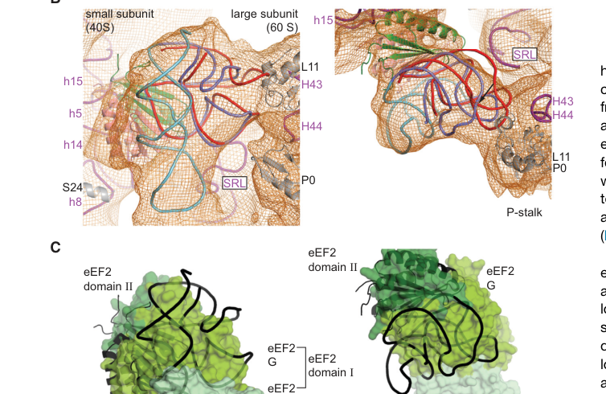

## Question

# Gene Research for Functional Annotation

## ⚠️ CRITICAL: Gene/Protein Identification Context

**BEFORE YOU BEGIN RESEARCH:** You MUST verify you are researching the CORRECT gene/protein. Gene symbols can be ambiguous, especially for less well-characterized genes from non-model organisms.

### Target Gene/Protein Identity (from UniProt):
- **UniProt Accession:** P49458
- **Protein Description:** RecName: Full=Signal recognition particle 9 kDa protein; Short=SRP9;
- **Gene Information:** Name=SRP9;
- **Organism (full):** Homo sapiens (Human).
- **Protein Family:** Belongs to the SRP9 family. .
- **Key Domains:** Signal_recog_particle_SRP9/14. (IPR009018); SRP9. (IPR008832); SRP9-like. (IPR039914); SRP9_dom. (IPR039432); SRP9-21 (PF05486)

### MANDATORY VERIFICATION STEPS:

1. **Check if the gene symbol "SRP9" matches the protein description above**
2. **Verify the organism is correct:** Homo sapiens (Human).
3. **Check if protein family/domains align with what you find in literature**
4. **If you find literature for a DIFFERENT gene with the same or similar symbol, STOP**

### If Gene Symbol is Ambiguous or You Cannot Find Relevant Literature:

**DO NOT PROCEED WITH RESEARCH ON A DIFFERENT GENE.** Instead:
- State clearly: "The gene symbol 'SRP9' is ambiguous or literature is limited for this specific protein"
- Explain what you found (e.g., "Found extensive literature on a different gene with the same symbol in a different organism")
- Describe the protein based ONLY on the UniProt information provided above
- Suggest that the protein function can be inferred from domain/family information

### Research Target:

Please provide a comprehensive research report on the gene **SRP9** (gene ID: SRP9, UniProt: P49458) in human.

The research report should be a detailed narrative explaining the function, biological processes, and localization of the gene product. Citations should be given for all claims.

You should prioritize authoritative reviews and primary scientific literature when conducting research. You can supplement
this with annotations you find in gene/protein databases, but these can be outdated or inaccurate.

We are specifically interested in the primary function of the gene - for enzymes, what reaction is catalyzed, and what is the substrate specificity? For transporters, what is the substrate? For structural proteins or adapters, what is the broader structural role? For signaling molecules, what is the role in the pathway.

We are interested in where in or outside the cell the gene product carries out its function.

We are also interested in the signaling or biochemical pathways in which the gene functions. We are less interested in broad pleiotropic effects, except where these elucidate the precise role.

Include evidence where possible. We are interested in both experimental evidence as well as inference from structure, evolution, or bioinformatic analysis. Precise studies should be prioritized over high-throughput, where available.

## Output

Question: You are an expert researcher providing comprehensive, well-cited information.

Provide detailed information focusing on:
1. Key concepts and definitions with current understanding
2. Recent developments and latest research (prioritize 2023-2024 sources)
3. Current applications and real-world implementations
4. Expert opinions and analysis from authoritative sources
5. Relevant statistics and data from recent studies

Format as a comprehensive research report with proper citations. Include URLs and publication dates where available.
Always prioritize recent, authoritative sources and provide specific citations for all major claims.

# Gene Research for Functional Annotation

## ⚠️ CRITICAL: Gene/Protein Identification Context

**BEFORE YOU BEGIN RESEARCH:** You MUST verify you are researching the CORRECT gene/protein. Gene symbols can be ambiguous, especially for less well-characterized genes from non-model organisms.

### Target Gene/Protein Identity (from UniProt):
- **UniProt Accession:** P49458
- **Protein Description:** RecName: Full=Signal recognition particle 9 kDa protein; Short=SRP9;
- **Gene Information:** Name=SRP9;
- **Organism (full):** Homo sapiens (Human).
- **Protein Family:** Belongs to the SRP9 family. .
- **Key Domains:** Signal_recog_particle_SRP9/14. (IPR009018); SRP9. (IPR008832); SRP9-like. (IPR039914); SRP9_dom. (IPR039432); SRP9-21 (PF05486)

### MANDATORY VERIFICATION STEPS:

1. **Check if the gene symbol "SRP9" matches the protein description above**
2. **Verify the organism is correct:** Homo sapiens (Human).
3. **Check if protein family/domains align with what you find in literature**
4. **If you find literature for a DIFFERENT gene with the same or similar symbol, STOP**

### If Gene Symbol is Ambiguous or You Cannot Find Relevant Literature:

**DO NOT PROCEED WITH RESEARCH ON A DIFFERENT GENE.** Instead:
- State clearly: "The gene symbol 'SRP9' is ambiguous or literature is limited for this specific protein"
- Explain what you found (e.g., "Found extensive literature on a different gene with the same symbol in a different organism")
- Describe the protein based ONLY on the UniProt information provided above
- Suggest that the protein function can be inferred from domain/family information

### Research Target:

Please provide a comprehensive research report on the gene **SRP9** (gene ID: SRP9, UniProt: P49458) in human.

The research report should be a detailed narrative explaining the function, biological processes, and localization of the gene product. Citations should be given for all claims.

You should prioritize authoritative reviews and primary scientific literature when conducting research. You can supplement
this with annotations you find in gene/protein databases, but these can be outdated or inaccurate.

We are specifically interested in the primary function of the gene - for enzymes, what reaction is catalyzed, and what is the substrate specificity? For transporters, what is the substrate? For structural proteins or adapters, what is the broader structural role? For signaling molecules, what is the role in the pathway.

We are interested in where in or outside the cell the gene product carries out its function.

We are also interested in the signaling or biochemical pathways in which the gene functions. We are less interested in broad pleiotropic effects, except where these elucidate the precise role.

Include evidence where possible. We are interested in both experimental evidence as well as inference from structure, evolution, or bioinformatic analysis. Precise studies should be prioritized over high-throughput, where available.

## Research Report: Human SRP9 (UniProt P49458)

### 1. Key concepts and definitions (current understanding)

**Gene/protein identity and complex membership.** Human **SRP9** encodes the **signal recognition particle 9 kDa protein**, which functions as an obligate heterodimer with **SRP14** (SRP9/14) and binds the **Alu domain** of the SRP RNA (7SL/RN7SL1). This SRP9/14–RNA module is the Alu domain of mammalian SRP and is positioned at the ribosome factor-binding (GTPase) center where it modulates translation elongation during co-translational targeting. (faoro2021noncanonicalfunctionsand pages 3-4, kellogg2021srpassingcotranslationaltargeting pages 11-13, voorhees2015structuresofthe pages 7-9)

**Canonical SRP pathway role.** In mammalian SRP, SRP9/14 stabilizes a compact (“closed”) Alu RNA architecture that fits into the elongation-factor binding site of the ribosome and is mechanistically consistent with **translation slowing/retardation** to increase the time window for successful ER targeting. Structural reconstructions of scanning vs engaged SRP–ribosome complexes show Alu-domain density at the ribosomal GTPase center in both states, supporting a model in which SRP9/14 contributes to dynamic competition with elongation factors rather than being the primary determinant of SRP binding affinity. (voorhees2015structuresofthe pages 12-14, voorhees2015structuresofthe pages 14-15, wild2019reconstitutionofthe pages 1-2)

**SRP9 as an RNA-binding structural protein rather than an enzyme.** SRP9 does not catalyze a chemical reaction; its primary function is **RNA binding and RNP architecture**, acting as part of an RNA–protein clamp/chaperone that stabilizes specific RNA folds (7SL Alu domain and Alu-derived RNAs). High-resolution structural analysis of a human Alu RNP (SRP9/14 + Alu RNA) shows extensive protein–RNA interfaces consistent with this architectural role. (ahl2015retrotranspositionandcrystal pages 5-6, ahl2015retrotranspositionandcrystal pages 6-7)

### 2. Recent developments and latest research (prioritizing 2023–2024)

#### 2.1 Nuclear SRP9/14 as a Pol III transcriptional regulator (2023)
A major update is the demonstration of a **nuclear role** for SRP9/14 in regulating Pol III transcripts.

In MCF-7 cells, SRP9/14 was reported to be **heavily localized in the nucleus** by immunofluorescence and subcellular fractionation, and siRNA knockdown of either SRP9 or SRP14 caused reduction of both proteins, consistent with mutual stabilization of the heterodimer. Knockdown produced selective decreases in **Alu-like Pol III transcripts**—notably **7SL (RN7SL1)** and **BC200 (BCYRN1)**—with minimal effect on other Pol III RNAs (e.g., a tRNA control). Quantitatively, 7SL RNA decreased modestly by 48 h and more strongly by 72 h (~40% by RT-qPCR), whereas BC200 was dramatically reduced (>80% by 48 h and ~95% by 72 h). (Gussakovsky et al., *RNA*, May 2023, https://doi.org/10.1261/rna.079649.123) (gussakovsky2023nuclearsrp9srp14heterodimer pages 2-3, gussakovsky2023nuclearsrp9srp14heterodimer pages 3-5)

Mechanistically, this phenotype was attributed to **transcriptional regulation**, not altered RNA stability: measured half-lives were similar and short (7SL 1.7 h, 95% CI 1.4–2.1; BC200 1.5 h, 95% CI 1.3–1.6) and were not changed upon SRP9/14 depletion. In contrast, Pol III occupancy (ChIP-qPCR) decreased over time; for example, at the 7SL locus Pol III occupancy decreased ~15% at 48 h (P=1.3×10−2) and remained ~15% reduced at 72 h (P=6.5×10−5). At BC200, Pol III occupancy decreased progressively (15% at 24 h, P=6.8×10−3; 32% at 48 h, P=2.0×10−3; 48% at 72 h, P=1.9×10−4). (Gussakovsky et al., *RNA*, May 2023, https://doi.org/10.1261/rna.079649.123) (gussakovsky2023nuclearsrp9srp14heterodimer pages 5-7)

#### 2.2 SRP9/14 in Alu-exon splicing regulation (2023)
Borovská et al. provided strong evidence that SRP9/14 functions beyond canonical SRP in **splicing regulation** of Alu-derived exons, where RNA **structure** (closed vs open Alu conformations) predicts exon inclusion better than sequence-motif heuristics. The authors combined structure-guided mutagenesis of an AluJ exon in the human *F8* gene, biochemical probing/pull-down assays, and cellular RNAi experiments to show SRP9/14 binds specific Alu RNA conformations and modulates exon inclusion in a mutation-dependent manner. (Borovská et al., *Nucleic Acids Research*, Jun 2023, https://doi.org/10.1093/nar/gkad500) (borovska2023alurnafold pages 1-2, borovska2023alurnafold pages 9-11)

#### 2.3 SRP biogenesis and nucleolar coordination (2024)
Issa et al. (2024) investigated SRP assembly and the nucleolar phase using quantitative interactome proteomics and imaging. They reported SRP proteins associate with many nucleolar and ribosome-biogenesis factors, identifying **95 newly identified nucleolar/ribosome-biogenesis-related SRP interactors** (173 total SRP-associated nucleolar/ribosome biogenesis factors). Their localization experiments indicated GFP-SRP9 appeared mostly nuclear with faint cytoplasmic staining and that GFP-SRP9/SRP14 heterodimers can stall in assembly intermediates, supporting the idea that **nucleolar integrity is required for proper localization** and that SRP assembly may involve additional compartments such as Cajal bodies. (Issa et al., *Life Science Alliance*, Jun 2024, https://doi.org/10.26508/lsa.202402614) (issa2024thenucleolarphase pages 9-10, issa2024thenucleolarphase pages 3-5)

#### 2.4 Updated synthesis of SRP9/14 regulation of Alu RNAs (2024 review)
A 2024 review emphasizes SRP9/14’s breadth of **Alu RNA regulation**, including Alu RNA maturation, trafficking, and functional diversification, and highlights quantitative constraints relevant to cellular competition between 7SL and other Alu-family transcripts: primate SRP9/14 is described as present in ~**20-fold molar excess** over assembled SRP, and binding to 7SL is described as **sub-nanomolar**. (Gussakovsky et al., *RNA Biology*, Nov 2024, https://doi.org/10.1080/15476286.2024.2430817) (gussakovsky2024theroleof pages 1-2, gussakovsky2024theroleof pages 2-4)

### 3. Current applications and real-world implementations

**Clinical pathology / prognosis (pancreatic cancer).** Sato et al. used immunohistochemistry on **38 resected pancreatic cancer** cases (no preoperative therapy) and stratified tumors by SRP9 nuclear staining (>50% vs ≤50%). The >50% nuclear-staining group (n=24) showed significantly improved recurrence-free survival (**P=0.037**) compared with the ≤50% group (n=14), while overall survival did not differ significantly (P=0.604). Their cell-based work further linked SRP9 nuclear translocation to nutrient status (amino-acid deficiency suppressed nuclear translocation with P<0.0001 in quantified assays). (Sato et al., *International Journal of Oncology*, Jun 2024, https://doi.org/10.3892/ijo.2024.5662) (sato2024significanceofsignal pages 11-12, sato2024significanceofsignal pages 12-13, sato2024significanceofsignal pages 5-8)

**Biotechnology relevance: retrotransposition and RNA–protein fold stabilization.** Structural and functional work on SRP9/14-bound Alu RNPs provides a mechanistic framework for how Alu RNAs form retrotransposition-competent RNPs by co-opting SRP proteins, relevant to contexts where retroelement behavior is measured or engineered (e.g., retrotransposon-derived tools). (Ahl et al., *Molecular Cell*, Dec 2015, https://doi.org/10.1016/j.molcel.2015.10.003) (ahl2015retrotranspositionandcrystal pages 3-4, ahl2015retrotranspositionandcrystal pages 11-12)

### 4. Expert opinions and analysis (authoritative interpretations)

**Translation slowdown as a kinetic facilitator rather than absolute arrest in mammals.** Structural analyses argue for a kinetic model in which the Alu domain (SRP9/14) transiently occupies and is displaced from the GTPase center through the elongation cycle, yielding a modest slowdown that expands the targeting window; scanning-state SRP is more readily displaced by a translational GTPase surrogate, whereas engaged-state SRP is more stable. This reconciles Alu positioning with ongoing translation and emphasizes SRP9/14’s regulatory (not necessarily essential binding) contribution. (Voorhees & Hegde, *eLife*, Jul 2015, https://doi.org/10.7554/eLife.07975) (voorhees2015structuresofthe pages 12-14, voorhees2015structuresofthe pages 9-10, voorhees2015structuresofthe pages 14-15)

**Domain contributions to ribosome binding and why SRP9/14 may be hard to quantify by affinity alone.** Reconstitution and MST show SRP54 and SRP68/72 dominate measurable SRP–ribosome binding, while the Alu domain contributes little to affinity in those assays. This supports the interpretation that SRP9/14’s key role is geometric/steric regulation at the factor-binding site rather than driving high-affinity docking of SRP to ribosomes. (Wild et al., *Nucleic Acids Research*, Jan 2019, https://doi.org/10.1093/nar/gky1324) (wild2019reconstitutionofthe pages 10-11, wild2019reconstitutionofthe pages 5-5)

**Noncanonical roles as a consequence of SRP9/14 abundance and shared structural motifs across Alu-family RNAs.** Reviews highlight that the same structural motif enabling SRP9/14 binding to 7SL is shared with primate-specific Alu RNAs, implying that a large pool of SRP9/14 can regulate Alu-family transcripts in nucleus and cytoplasm (splicing, retrotransposition, translation regulation), especially given the reported ~20-fold molar excess over assembled SRP. (Faoro & Ataide, *Frontiers in Molecular Biosciences*, May 2021, https://doi.org/10.3389/fmolb.2021.679584; Gussakovsky et al., *RNA Biology*, Nov 2024, https://doi.org/10.1080/15476286.2024.2430817) (faoro2021noncanonicalfunctionsand pages 3-4, gussakovsky2024theroleof pages 1-2)

### 5. Relevant statistics and data highlights

**Structural and energetic constraints on SRP9/14–Alu RNP function.** The human Alu RNP crystal structure was solved at **2.0 Å**; SRP9/14 binds with a total interface area ~**1,820 Ų** (SRP9 ~700 Ų; SRP14 ~1,120 Ų). Mutations weakening SRP9/14 interaction beyond **ΔΔG > 3.5 kcal/mol** abolished retrotransposition, providing a quantitative link between SRP9/14 binding energy and retroelement activity. (Ahl et al., 2015, https://doi.org/10.1016/j.molcel.2015.10.003) (ahl2015retrotranspositionandcrystal pages 5-6, ahl2015retrotranspositionandcrystal pages 9-11)

**Human SRP–ribosome binding constants (domain-resolved).** Reconstituted binding experiments indicate very tight binding of assembled SRP to ribosomes (sub-nanomolar in the assay configuration), with key determinants including SRP54 (KD ~30 nM for isolated SRP54) and SRP68/72 (KD ~160 ± 20 nM, Hill coefficient ~2.3). (Wild et al., 2019, https://doi.org/10.1093/nar/gky1324) (wild2019reconstitutionofthe pages 6-7, wild2019reconstitutionofthe pages 5-5)

**Transcriptional regulation metrics (SRP9/14 knockdown).** SRP9/14 depletion did not change measured RNA half-lives (7SL 1.7 h; BC200 1.5 h) but reduced Pol III occupancy at target loci with statistically significant P-values and caused marked time-dependent decreases in steady-state RNA, particularly BC200 (up to ~95% reduction by 72 h). (Gussakovsky et al., 2023, https://doi.org/10.1261/rna.079649.123) (gussakovsky2023nuclearsrp9srp14heterodimer pages 5-7, gussakovsky2023nuclearsrp9srp14heterodimer pages 2-3)

**Clinical association statistics (pancreatic cancer).** In a surgical cohort, SRP9 nuclear staining >50% was associated with improved recurrence-free survival (P=0.037), while proliferation (Ki-67) showed no trend (R²=0.007; P=0.622). (Sato et al., 2024, https://doi.org/10.3892/ijo.2024.5662) (sato2024significanceofsignal pages 11-12, sato2024significanceofsignal pages 12-13)

**Functional-genomics disease associations (hypothesis-generating).** Open Targets lists SRP9 associations with disease categories including neurodegenerative disease and osteoarthritis, with association scores (e.g., neurodegenerative disease score ~0.542) and evidence counts of 5 in the returned set; these represent aggregated functional-genomics evidence rather than direct clinical causality. (OpenTargets Search: -SRP9)

### Visual evidence from primary literature

Structural placement of SRP9/14-bound Alu RNP at the ribosomal elongation factor-binding site and overlay with eEF2 are shown in cropped figures from Ahl et al. 2015. (ahl2015retrotranspositionandcrystal media 866dee84, ahl2015retrotranspositionandcrystal media c0bafdb5)

### Summary

Human SRP9 (UniProt P49458) is best understood as an RNA-binding structural subunit of the SRP Alu domain that, through an obligate heterodimer with SRP14, stabilizes RNA conformations that interact with the ribosomal factor-binding center to slow translation and facilitate co-translational ER targeting. Quantitative binding studies suggest SRP9/14 is not the primary driver of SRP’s overall ribosome affinity, consistent with a regulatory/steric function. Recent 2023–2024 work substantially expands SRP9/14 biology to include nuclear roles in Pol III transcriptional control of 7SL and BC200, a mechanistic role in Alu exon splicing regulation, and potential clinical relevance via SRP9 nuclear localization patterns in pancreatic cancer prognosis.

| Category | Key claim | Evidence type | Quantitative/statistical details | Primary source with year and DOI URL | Citation ID placeholder |
|---|---|---|---|---|---|
| Canonical SRP function | SRP9 forms an obligate SRP9/14 heterodimer that clamps the 5′ and 3′ ends of the Alu domain RNA, stabilizing the closed ribosome-stalling conformation required for translational slowdown during co-translational targeting. | Structure | Human Alu RNP crystal structure solved at 2.0 Å; SRP9 contributes ~700 Ų of protein-RNA interface within a total ~1,820 Ų SRP9/14-RNA interface; docking places the complex at the elongation factor-binding site. | Ahl et al., 2015, Molecular Cell. https://doi.org/10.1016/j.molcel.2015.10.003 | (ahl2015retrotranspositionandcrystal pages 5-6, ahl2015retrotranspositionandcrystal pages 6-7, ahl2015retrotranspositionandcrystal pages 1-3) |
| Canonical SRP function | In mammalian scanning and engaged SRP-ribosome states, the SRP9/14-containing Alu domain sits at the ribosomal GTPase center, where it can compete with elongation factors and prolong the targeting window. | Cryo-EM structure/biochemical competition | Hbs1-DN displaced SRP from scanning ribosome-nascent chain complexes by up to ~70% but not from engaged complexes, supporting dynamic Alu competition at the factor-binding center. | Voorhees & Hegde, 2015, eLife. https://doi.org/10.7554/eLife.07975 | (voorhees2015structuresofthe pages 6-7, voorhees2015structuresofthe pages 7-9, voorhees2015structuresofthe pages 9-10) |
| Canonical SRP function | SRP9/14 is not the dominant ribosome affinity determinant for human SRP; SRP54 and SRP68/72 account for most measurable binding, while the Alu domain contributes little or only slightly in reconstituted assays. | MST binding/reconstitution | Full SRP binds in the (sub-)nanomolar range; isolated SRP54 KD ~30 nM; SRP68/72 KD ~160 ± 20 nM with Hill coefficient ~2.3; SR heterodimer KD 410 ± 50 nM; Alu contribution not quantifiable or minor. | Wild et al., 2019, Nucleic Acids Research. https://doi.org/10.1093/nar/gky1324 | (wild2019reconstitutionofthe pages 5-5, wild2019reconstitutionofthe pages 10-11, wild2019reconstitutionofthe pages 6-7, wild2019reconstitutionofthe pages 4-5, wild2019reconstitutionofthe pages 7-8) |
| SRP biogenesis/localization | SRP9/14 participates in nuclear/nucleolar phases of SRP assembly; most SRP proteins assemble with 7SL in the nucleus/nucleolus before final cytoplasmic maturation. | Review of assembly data/in vitro assembly | Ordered assembly summarized as SRP19 → SRP68/72 → SRP9/14 on 7SL RNA before cytoplasmic completion with SRP54. | Kellogg et al., 2021, Int J Mol Sci. https://doi.org/10.3390/ijms22126284 | (kellogg2021srpassingcotranslationaltargeting pages 11-13, kellogg2021srpassingcotranslationaltargeting pages 6-7) |
| SRP biogenesis/localization | GFP-SRP9 is found mostly in the nucleus with faint cytoplasmic signal; SRP9/14 heterodimer accumulates in nucleoplasm, and nucleolar integrity is required for proper SRP protein localization. | Microscopy, GFP-trap IP, SILAC proteomics | Study identified 95 newly found nucleolar/ribosome-biogenesis-related SRP interactors, bringing total SRP-associated nucleolar/ribosome biogenesis factors to 173. | Issa et al., 2024, Life Science Alliance. https://doi.org/10.26508/lsa.202402614 | (issa2024thenucleolarphase pages 3-5, issa2024thenucleolarphase pages 9-10, issa2024thenucleolarphase pages 1-2) |
| SRP biogenesis/localization | In SR receptor knockout cells, SRP9 protein remains present and SRP complex composition is retained, indicating SR loss does not collapse SRP abundance. | TMT-SILAC proteomics | In membrane proteome analysis, only ~25% of 287 polytopic and ~20% of 350 single-pass membrane proteins were downregulated; SRP9, SRP14, SRP19, SRP54, SRP68, SRP72 were still detected in both channels. | Child et al., 2023, RNA. https://doi.org/10.1261/rna.079643.123 | (child2023examiningsrppathway pages 6-8) |
| Alu/retrotransposition | SRP9/14-bound Alu RNP mimics the SRP Alu domain and occupies the ribosomal elongation factor-binding site, linking ribosome stalling to Alu retrotransposition. | Structure/mutagenesis/retrotransposition assays | PDB 5AOX; mutations weakening SRP9/14 interaction by >3.5 kcal/mol abolish retrotransposition; exemplar constructs showed ~111%, 11%, and 83% relative activities depending on retained folding features. | Ahl et al., 2015, Molecular Cell. https://doi.org/10.1016/j.molcel.2015.10.003 | (ahl2015retrotranspositionandcrystal pages 3-4, ahl2015retrotranspositionandcrystal pages 9-11, ahl2015retrotranspositionandcrystal pages 11-12, ahl2015retrotranspositionandcrystal media 866dee84) |
| Alu/retrotransposition | SRP9/14 binds 7SL and related Alu RNAs with high affinity and exists in substantial molar excess over assembled SRP, enabling extensive extra-canonical regulation of Alu-family RNAs. | Review synthesis of primary biochemical studies | Human SRP9/14 binds 7SL with sub-nanomolar affinity; primate SRP9/14 is present at ~20-fold molar excess over intact SRP; Alu elements comprise ~10% of the human genome. | Gussakovsky et al., 2024, RNA Biology. https://doi.org/10.1080/15476286.2024.2430817 | (gussakovsky2024theroleof pages 1-2, gussakovsky2024theroleof pages 2-4) |
| Splicing regulation | SRP9/14 binds compact/closed Alu RNA conformations and modulates exonization of Alu-derived exons, acting functionally like an RNA chaperone in pre-mRNA splicing decisions. | Structure-guided mutagenesis, pull-down/immunoblot, footprinting, RNAi splicing assays | Splicing analysis covered 38 reporters; ~15 endogenous transcripts screened; six additional endogenous SRP9/14-regulated Alu exons identified; 16.5 µg recombinant SRP9/14 used in footprinting; SRP9/14 is ~20-fold in excess over SRP. | Borovská et al., 2023, Nucleic Acids Research. https://doi.org/10.1093/nar/gkad500 | (borovska2023alurnafold pages 9-11, borovska2023alurnafold pages 11-14, borovska2023alurnafold pages 14-15, borovska2023alurnafold pages 5-6) |
| SRP biogenesis/localization | Nuclear SRP9/SRP14 positively regulates steady-state 7SL and BC200 levels by promoting transcription rather than RNA stability. | ChIP-qPCR, siRNA knockdown, BRIC/actinomycin D decay assays, fractionation | 7SL reduced ~40% by 72 h knockdown; BC200 reduced >80% by 48 h and ~95% by 72 h; 7SL half-life 1.7 h (95% CI 1.4–2.1), BC200 1.5 h (95% CI 1.3–1.6); Pol III occupancy at 7SL fell ~15% at 48 h (P=1.3×10^-2) and ~15% at 72 h (P=6.5×10^-5); BC200 occupancy fell 15% (P=6.8×10^-3), 32% (P=2.0×10^-3), 48% (P=1.9×10^-4). | Gussakovsky et al., 2023, RNA. https://doi.org/10.1261/rna.079649.123 | (gussakovsky2023nuclearsrp9srp14heterodimer pages 3-5, gussakovsky2023nuclearsrp9srp14heterodimer pages 2-3, gussakovsky2023nuclearsrp9srp14heterodimer pages 5-7, gussakovsky2023nuclearsrp9srp14heterodimer pages 7-8, gussakovsky2023nuclearsrp9srp14heterodimer pages 10-12) |
| Disease/biomarker | In pancreatic ductal adenocarcinoma, higher nuclear SRP9 localization is associated with better recurrence-free survival and with distinct translation/cancer-pathway RNA associations. | IHC, immunocytochemistry, splice-variant transfection, RIP-seq | Surgical cohort n=38; >50% nuclear-staining group n=24 vs ≤50% group n=14; better RFS P=0.037; OS not significant P=0.604; Ki-67 correlation R²=0.007, P=0.622; lymphatic invasion distribution differed (ly0:ly1 = 5:9 vs 17:7, P=0.047); amino-acid deficiency lowered nuclear translocation with P<0.0001 in cell assays. | Sato et al., 2024, International Journal of Oncology. https://doi.org/10.3892/ijo.2024.5662 | (sato2024significanceofsignal pages 11-12, sato2024significanceofsignal pages 12-13, sato2024significanceofsignal pages 1-2, sato2024significanceofsignal pages 13-15, sato2024significanceofsignal pages 5-8) |
| Disease/biomarker | Public genetics/functional-association resources connect SRP9 to several disease areas, but current evidence is indirect and driven largely by functional-genomics datasets rather than established clinical causality. | Database association/functional genomics aggregation | Open Targets scores: neurodegenerative disease 0.542; abnormality of skeletal system 0.450; osteoarthritis 0.413; osteoarthritis, knee 0.331; lysosomal storage disease 0.109; evidence count 5 per listed association. | Open Targets Platform query for SRP9, accessed via tool context. https://platform.opentargets.org | (OpenTargets Search: -SRP9) |

*Table: This table summarizes the strongest mechanistic, localization, regulatory, and disease-linked evidence for human SRP9 (UniProt P49458). It emphasizes the distinction between canonical SRP/Alu-domain functions and emerging nuclear, splicing, and biomarker-related roles supported by recent literature and database evidence.*

References

1. (faoro2021noncanonicalfunctionsand pages 3-4): Camilla Faoro and Sandro F. Ataide. Noncanonical functions and cellular dynamics of the mammalian signal recognition particle components. Frontiers in Molecular Biosciences, May 2021. URL: https://doi.org/10.3389/fmolb.2021.679584, doi:10.3389/fmolb.2021.679584. This article has 32 citations.

2. (kellogg2021srpassingcotranslationaltargeting pages 11-13): Morgana K. Kellogg, Sarah C. Miller, Elena B. Tikhonova, and Andrey L. Karamyshev. Srpassing co-translational targeting: the role of the signal recognition particle in protein targeting and mrna protection. International Journal of Molecular Sciences, 22:6284, Jun 2021. URL: https://doi.org/10.3390/ijms22126284, doi:10.3390/ijms22126284. This article has 70 citations.

3. (voorhees2015structuresofthe pages 7-9): Rebecca M Voorhees and Ramanujan S Hegde. Structures of the scanning and engaged states of the mammalian srp-ribosome complex. eLife, Jul 2015. URL: https://doi.org/10.7554/elife.07975, doi:10.7554/elife.07975. This article has 172 citations and is from a domain leading peer-reviewed journal.

4. (voorhees2015structuresofthe pages 12-14): Rebecca M Voorhees and Ramanujan S Hegde. Structures of the scanning and engaged states of the mammalian srp-ribosome complex. eLife, Jul 2015. URL: https://doi.org/10.7554/elife.07975, doi:10.7554/elife.07975. This article has 172 citations and is from a domain leading peer-reviewed journal.

5. (voorhees2015structuresofthe pages 14-15): Rebecca M Voorhees and Ramanujan S Hegde. Structures of the scanning and engaged states of the mammalian srp-ribosome complex. eLife, Jul 2015. URL: https://doi.org/10.7554/elife.07975, doi:10.7554/elife.07975. This article has 172 citations and is from a domain leading peer-reviewed journal.

6. (wild2019reconstitutionofthe pages 1-2): Klemens Wild, Keven D Juaire, Komal Soni, Vivekanandan Shanmuganathan, Astrid Hendricks, Bernd Segnitz, Roland Beckmann, and Irmgard Sinning. Reconstitution of the human srp system and quantitative and systematic analysis of its ribosome interactions. Nucleic Acids Research, 47:3184-3196, Jan 2019. URL: https://doi.org/10.1093/nar/gky1324, doi:10.1093/nar/gky1324. This article has 43 citations and is from a highest quality peer-reviewed journal.

7. (ahl2015retrotranspositionandcrystal pages 5-6): Valentina Ahl, Heiko Keller, Steffen Schmidt, and Oliver Weichenrieder. Retrotransposition and crystal structure of an alu rnp in the ribosome-stalling conformation. Molecular cell, 60 5:715-727, Dec 2015. URL: https://doi.org/10.1016/j.molcel.2015.10.003, doi:10.1016/j.molcel.2015.10.003. This article has 92 citations and is from a highest quality peer-reviewed journal.

8. (ahl2015retrotranspositionandcrystal pages 6-7): Valentina Ahl, Heiko Keller, Steffen Schmidt, and Oliver Weichenrieder. Retrotransposition and crystal structure of an alu rnp in the ribosome-stalling conformation. Molecular cell, 60 5:715-727, Dec 2015. URL: https://doi.org/10.1016/j.molcel.2015.10.003, doi:10.1016/j.molcel.2015.10.003. This article has 92 citations and is from a highest quality peer-reviewed journal.

9. (gussakovsky2023nuclearsrp9srp14heterodimer pages 2-3): Daniel Gussakovsky, Evan P. Booy, Mira J.F. Brown, and Sean A. McKenna. Nuclear srp9/srp14 heterodimer transcriptionally regulates 7sl and bc200 rna expression. RNA, 29:1185-1200, May 2023. URL: https://doi.org/10.1261/rna.079649.123, doi:10.1261/rna.079649.123. This article has 7 citations and is from a domain leading peer-reviewed journal.

10. (gussakovsky2023nuclearsrp9srp14heterodimer pages 3-5): Daniel Gussakovsky, Evan P. Booy, Mira J.F. Brown, and Sean A. McKenna. Nuclear srp9/srp14 heterodimer transcriptionally regulates 7sl and bc200 rna expression. RNA, 29:1185-1200, May 2023. URL: https://doi.org/10.1261/rna.079649.123, doi:10.1261/rna.079649.123. This article has 7 citations and is from a domain leading peer-reviewed journal.

11. (gussakovsky2023nuclearsrp9srp14heterodimer pages 5-7): Daniel Gussakovsky, Evan P. Booy, Mira J.F. Brown, and Sean A. McKenna. Nuclear srp9/srp14 heterodimer transcriptionally regulates 7sl and bc200 rna expression. RNA, 29:1185-1200, May 2023. URL: https://doi.org/10.1261/rna.079649.123, doi:10.1261/rna.079649.123. This article has 7 citations and is from a domain leading peer-reviewed journal.

12. (borovska2023alurnafold pages 1-2): Ivana Borovská, Igor Vořechovský, and Jana Královičová. Alu rna fold links splicing with signal recognition particle proteins. Nucleic Acids Research, 51:8199-8216, Jun 2023. URL: https://doi.org/10.1093/nar/gkad500, doi:10.1093/nar/gkad500. This article has 10 citations and is from a highest quality peer-reviewed journal.

13. (borovska2023alurnafold pages 9-11): Ivana Borovská, Igor Vořechovský, and Jana Královičová. Alu rna fold links splicing with signal recognition particle proteins. Nucleic Acids Research, 51:8199-8216, Jun 2023. URL: https://doi.org/10.1093/nar/gkad500, doi:10.1093/nar/gkad500. This article has 10 citations and is from a highest quality peer-reviewed journal.

14. (issa2024thenucleolarphase pages 9-10): Amani Issa, Florence Schlotter, Justine Flayac, Jing Chen, Ludivine Wacheul, Manon Philippe, Lucas Sardini, Lalia Mostefa, Franck Vandermoere, Edouard Bertrand, Céline Verheggen, Denis LJ Lafontaine, and Séverine Massenet. The nucleolar phase of signal recognition particle assembly. Life Science Alliance, 7:e202402614, Jun 2024. URL: https://doi.org/10.26508/lsa.202402614, doi:10.26508/lsa.202402614. This article has 8 citations and is from a peer-reviewed journal.

15. (issa2024thenucleolarphase pages 3-5): Amani Issa, Florence Schlotter, Justine Flayac, Jing Chen, Ludivine Wacheul, Manon Philippe, Lucas Sardini, Lalia Mostefa, Franck Vandermoere, Edouard Bertrand, Céline Verheggen, Denis LJ Lafontaine, and Séverine Massenet. The nucleolar phase of signal recognition particle assembly. Life Science Alliance, 7:e202402614, Jun 2024. URL: https://doi.org/10.26508/lsa.202402614, doi:10.26508/lsa.202402614. This article has 8 citations and is from a peer-reviewed journal.

16. (gussakovsky2024theroleof pages 1-2): Daniel Gussakovsky, Nicole A. Black, Evan P. Booy, and Sean A. McKenna. The role of srp9/srp14 in regulating alu rna. Nov 2024. URL: https://doi.org/10.1080/15476286.2024.2430817, doi:10.1080/15476286.2024.2430817. This article has 7 citations and is from a peer-reviewed journal.

17. (gussakovsky2024theroleof pages 2-4): Daniel Gussakovsky, Nicole A. Black, Evan P. Booy, and Sean A. McKenna. The role of srp9/srp14 in regulating alu rna. Nov 2024. URL: https://doi.org/10.1080/15476286.2024.2430817, doi:10.1080/15476286.2024.2430817. This article has 7 citations and is from a peer-reviewed journal.

18. (sato2024significanceofsignal pages 11-12): Hiromichi Sato, Sikun Meng, Kazuki Sasaki, Shogo Kobayashi, Kansuke Kido, Yoshiko Tsuji, Yasuko Arao, Yoshiko Saito, Yoshifumi Iwagami, Daisaku Yamada, Yoshito Tomimaru, Takehiro Noda, Hidenori Takahashi, Daisuke Motooka, Shizuka Uchida, Ken Ofusa, Taroh Satoh, Yuichiro Doki, Hidetoshi Eguchi, Tomoaki Hara, and Hideshi Ishii. Significance of signal recognition particle 9 nuclear translocation: implications for pancreatic cancer prognosis and functionality. International Journal of Oncology, Jun 2024. URL: https://doi.org/10.3892/ijo.2024.5662, doi:10.3892/ijo.2024.5662. This article has 0 citations and is from a peer-reviewed journal.

19. (sato2024significanceofsignal pages 12-13): Hiromichi Sato, Sikun Meng, Kazuki Sasaki, Shogo Kobayashi, Kansuke Kido, Yoshiko Tsuji, Yasuko Arao, Yoshiko Saito, Yoshifumi Iwagami, Daisaku Yamada, Yoshito Tomimaru, Takehiro Noda, Hidenori Takahashi, Daisuke Motooka, Shizuka Uchida, Ken Ofusa, Taroh Satoh, Yuichiro Doki, Hidetoshi Eguchi, Tomoaki Hara, and Hideshi Ishii. Significance of signal recognition particle 9 nuclear translocation: implications for pancreatic cancer prognosis and functionality. International Journal of Oncology, Jun 2024. URL: https://doi.org/10.3892/ijo.2024.5662, doi:10.3892/ijo.2024.5662. This article has 0 citations and is from a peer-reviewed journal.

20. (sato2024significanceofsignal pages 5-8): Hiromichi Sato, Sikun Meng, Kazuki Sasaki, Shogo Kobayashi, Kansuke Kido, Yoshiko Tsuji, Yasuko Arao, Yoshiko Saito, Yoshifumi Iwagami, Daisaku Yamada, Yoshito Tomimaru, Takehiro Noda, Hidenori Takahashi, Daisuke Motooka, Shizuka Uchida, Ken Ofusa, Taroh Satoh, Yuichiro Doki, Hidetoshi Eguchi, Tomoaki Hara, and Hideshi Ishii. Significance of signal recognition particle 9 nuclear translocation: implications for pancreatic cancer prognosis and functionality. International Journal of Oncology, Jun 2024. URL: https://doi.org/10.3892/ijo.2024.5662, doi:10.3892/ijo.2024.5662. This article has 0 citations and is from a peer-reviewed journal.

21. (ahl2015retrotranspositionandcrystal pages 3-4): Valentina Ahl, Heiko Keller, Steffen Schmidt, and Oliver Weichenrieder. Retrotransposition and crystal structure of an alu rnp in the ribosome-stalling conformation. Molecular cell, 60 5:715-727, Dec 2015. URL: https://doi.org/10.1016/j.molcel.2015.10.003, doi:10.1016/j.molcel.2015.10.003. This article has 92 citations and is from a highest quality peer-reviewed journal.

22. (ahl2015retrotranspositionandcrystal pages 11-12): Valentina Ahl, Heiko Keller, Steffen Schmidt, and Oliver Weichenrieder. Retrotransposition and crystal structure of an alu rnp in the ribosome-stalling conformation. Molecular cell, 60 5:715-727, Dec 2015. URL: https://doi.org/10.1016/j.molcel.2015.10.003, doi:10.1016/j.molcel.2015.10.003. This article has 92 citations and is from a highest quality peer-reviewed journal.

23. (voorhees2015structuresofthe pages 9-10): Rebecca M Voorhees and Ramanujan S Hegde. Structures of the scanning and engaged states of the mammalian srp-ribosome complex. eLife, Jul 2015. URL: https://doi.org/10.7554/elife.07975, doi:10.7554/elife.07975. This article has 172 citations and is from a domain leading peer-reviewed journal.

24. (wild2019reconstitutionofthe pages 10-11): Klemens Wild, Keven D Juaire, Komal Soni, Vivekanandan Shanmuganathan, Astrid Hendricks, Bernd Segnitz, Roland Beckmann, and Irmgard Sinning. Reconstitution of the human srp system and quantitative and systematic analysis of its ribosome interactions. Nucleic Acids Research, 47:3184-3196, Jan 2019. URL: https://doi.org/10.1093/nar/gky1324, doi:10.1093/nar/gky1324. This article has 43 citations and is from a highest quality peer-reviewed journal.

25. (wild2019reconstitutionofthe pages 5-5): Klemens Wild, Keven D Juaire, Komal Soni, Vivekanandan Shanmuganathan, Astrid Hendricks, Bernd Segnitz, Roland Beckmann, and Irmgard Sinning. Reconstitution of the human srp system and quantitative and systematic analysis of its ribosome interactions. Nucleic Acids Research, 47:3184-3196, Jan 2019. URL: https://doi.org/10.1093/nar/gky1324, doi:10.1093/nar/gky1324. This article has 43 citations and is from a highest quality peer-reviewed journal.

26. (ahl2015retrotranspositionandcrystal pages 9-11): Valentina Ahl, Heiko Keller, Steffen Schmidt, and Oliver Weichenrieder. Retrotransposition and crystal structure of an alu rnp in the ribosome-stalling conformation. Molecular cell, 60 5:715-727, Dec 2015. URL: https://doi.org/10.1016/j.molcel.2015.10.003, doi:10.1016/j.molcel.2015.10.003. This article has 92 citations and is from a highest quality peer-reviewed journal.

27. (wild2019reconstitutionofthe pages 6-7): Klemens Wild, Keven D Juaire, Komal Soni, Vivekanandan Shanmuganathan, Astrid Hendricks, Bernd Segnitz, Roland Beckmann, and Irmgard Sinning. Reconstitution of the human srp system and quantitative and systematic analysis of its ribosome interactions. Nucleic Acids Research, 47:3184-3196, Jan 2019. URL: https://doi.org/10.1093/nar/gky1324, doi:10.1093/nar/gky1324. This article has 43 citations and is from a highest quality peer-reviewed journal.

28. (OpenTargets Search: -SRP9): Open Targets Query (-SRP9, 5 results). Buniello, A. et al. (2025). Open Targets Platform: facilitating therapeutic hypotheses building in drug discovery. Nucleic Acids Research.

29. (ahl2015retrotranspositionandcrystal media 866dee84): Valentina Ahl, Heiko Keller, Steffen Schmidt, and Oliver Weichenrieder. Retrotransposition and crystal structure of an alu rnp in the ribosome-stalling conformation. Molecular cell, 60 5:715-727, Dec 2015. URL: https://doi.org/10.1016/j.molcel.2015.10.003, doi:10.1016/j.molcel.2015.10.003. This article has 92 citations and is from a highest quality peer-reviewed journal.

30. (ahl2015retrotranspositionandcrystal media c0bafdb5): Valentina Ahl, Heiko Keller, Steffen Schmidt, and Oliver Weichenrieder. Retrotransposition and crystal structure of an alu rnp in the ribosome-stalling conformation. Molecular cell, 60 5:715-727, Dec 2015. URL: https://doi.org/10.1016/j.molcel.2015.10.003, doi:10.1016/j.molcel.2015.10.003. This article has 92 citations and is from a highest quality peer-reviewed journal.

31. (ahl2015retrotranspositionandcrystal pages 1-3): Valentina Ahl, Heiko Keller, Steffen Schmidt, and Oliver Weichenrieder. Retrotransposition and crystal structure of an alu rnp in the ribosome-stalling conformation. Molecular cell, 60 5:715-727, Dec 2015. URL: https://doi.org/10.1016/j.molcel.2015.10.003, doi:10.1016/j.molcel.2015.10.003. This article has 92 citations and is from a highest quality peer-reviewed journal.

32. (voorhees2015structuresofthe pages 6-7): Rebecca M Voorhees and Ramanujan S Hegde. Structures of the scanning and engaged states of the mammalian srp-ribosome complex. eLife, Jul 2015. URL: https://doi.org/10.7554/elife.07975, doi:10.7554/elife.07975. This article has 172 citations and is from a domain leading peer-reviewed journal.

33. (wild2019reconstitutionofthe pages 4-5): Klemens Wild, Keven D Juaire, Komal Soni, Vivekanandan Shanmuganathan, Astrid Hendricks, Bernd Segnitz, Roland Beckmann, and Irmgard Sinning. Reconstitution of the human srp system and quantitative and systematic analysis of its ribosome interactions. Nucleic Acids Research, 47:3184-3196, Jan 2019. URL: https://doi.org/10.1093/nar/gky1324, doi:10.1093/nar/gky1324. This article has 43 citations and is from a highest quality peer-reviewed journal.

34. (wild2019reconstitutionofthe pages 7-8): Klemens Wild, Keven D Juaire, Komal Soni, Vivekanandan Shanmuganathan, Astrid Hendricks, Bernd Segnitz, Roland Beckmann, and Irmgard Sinning. Reconstitution of the human srp system and quantitative and systematic analysis of its ribosome interactions. Nucleic Acids Research, 47:3184-3196, Jan 2019. URL: https://doi.org/10.1093/nar/gky1324, doi:10.1093/nar/gky1324. This article has 43 citations and is from a highest quality peer-reviewed journal.

35. (kellogg2021srpassingcotranslationaltargeting pages 6-7): Morgana K. Kellogg, Sarah C. Miller, Elena B. Tikhonova, and Andrey L. Karamyshev. Srpassing co-translational targeting: the role of the signal recognition particle in protein targeting and mrna protection. International Journal of Molecular Sciences, 22:6284, Jun 2021. URL: https://doi.org/10.3390/ijms22126284, doi:10.3390/ijms22126284. This article has 70 citations.

36. (issa2024thenucleolarphase pages 1-2): Amani Issa, Florence Schlotter, Justine Flayac, Jing Chen, Ludivine Wacheul, Manon Philippe, Lucas Sardini, Lalia Mostefa, Franck Vandermoere, Edouard Bertrand, Céline Verheggen, Denis LJ Lafontaine, and Séverine Massenet. The nucleolar phase of signal recognition particle assembly. Life Science Alliance, 7:e202402614, Jun 2024. URL: https://doi.org/10.26508/lsa.202402614, doi:10.26508/lsa.202402614. This article has 8 citations and is from a peer-reviewed journal.

37. (child2023examiningsrppathway pages 6-8): Jessica R. Child, Alex C. Hofler, Qiang Chen, Brenda H. Yang, JohnCarlo Kristofich, Tianli Zheng, Molly M. Hannigan, Andrew L. Elles, David W. Reid, and Christopher V. Nicchitta. Examining srp pathway function in mrna localization to the endoplasmic reticulum. RNA, 29:1703-1724, Aug 2023. URL: https://doi.org/10.1261/rna.079643.123, doi:10.1261/rna.079643.123. This article has 13 citations and is from a domain leading peer-reviewed journal.

38. (borovska2023alurnafold pages 11-14): Ivana Borovská, Igor Vořechovský, and Jana Královičová. Alu rna fold links splicing with signal recognition particle proteins. Nucleic Acids Research, 51:8199-8216, Jun 2023. URL: https://doi.org/10.1093/nar/gkad500, doi:10.1093/nar/gkad500. This article has 10 citations and is from a highest quality peer-reviewed journal.

39. (borovska2023alurnafold pages 14-15): Ivana Borovská, Igor Vořechovský, and Jana Královičová. Alu rna fold links splicing with signal recognition particle proteins. Nucleic Acids Research, 51:8199-8216, Jun 2023. URL: https://doi.org/10.1093/nar/gkad500, doi:10.1093/nar/gkad500. This article has 10 citations and is from a highest quality peer-reviewed journal.

40. (borovska2023alurnafold pages 5-6): Ivana Borovská, Igor Vořechovský, and Jana Královičová. Alu rna fold links splicing with signal recognition particle proteins. Nucleic Acids Research, 51:8199-8216, Jun 2023. URL: https://doi.org/10.1093/nar/gkad500, doi:10.1093/nar/gkad500. This article has 10 citations and is from a highest quality peer-reviewed journal.

41. (gussakovsky2023nuclearsrp9srp14heterodimer pages 7-8): Daniel Gussakovsky, Evan P. Booy, Mira J.F. Brown, and Sean A. McKenna. Nuclear srp9/srp14 heterodimer transcriptionally regulates 7sl and bc200 rna expression. RNA, 29:1185-1200, May 2023. URL: https://doi.org/10.1261/rna.079649.123, doi:10.1261/rna.079649.123. This article has 7 citations and is from a domain leading peer-reviewed journal.

42. (gussakovsky2023nuclearsrp9srp14heterodimer pages 10-12): Daniel Gussakovsky, Evan P. Booy, Mira J.F. Brown, and Sean A. McKenna. Nuclear srp9/srp14 heterodimer transcriptionally regulates 7sl and bc200 rna expression. RNA, 29:1185-1200, May 2023. URL: https://doi.org/10.1261/rna.079649.123, doi:10.1261/rna.079649.123. This article has 7 citations and is from a domain leading peer-reviewed journal.

43. (sato2024significanceofsignal pages 1-2): Hiromichi Sato, Sikun Meng, Kazuki Sasaki, Shogo Kobayashi, Kansuke Kido, Yoshiko Tsuji, Yasuko Arao, Yoshiko Saito, Yoshifumi Iwagami, Daisaku Yamada, Yoshito Tomimaru, Takehiro Noda, Hidenori Takahashi, Daisuke Motooka, Shizuka Uchida, Ken Ofusa, Taroh Satoh, Yuichiro Doki, Hidetoshi Eguchi, Tomoaki Hara, and Hideshi Ishii. Significance of signal recognition particle 9 nuclear translocation: implications for pancreatic cancer prognosis and functionality. International Journal of Oncology, Jun 2024. URL: https://doi.org/10.3892/ijo.2024.5662, doi:10.3892/ijo.2024.5662. This article has 0 citations and is from a peer-reviewed journal.

44. (sato2024significanceofsignal pages 13-15): Hiromichi Sato, Sikun Meng, Kazuki Sasaki, Shogo Kobayashi, Kansuke Kido, Yoshiko Tsuji, Yasuko Arao, Yoshiko Saito, Yoshifumi Iwagami, Daisaku Yamada, Yoshito Tomimaru, Takehiro Noda, Hidenori Takahashi, Daisuke Motooka, Shizuka Uchida, Ken Ofusa, Taroh Satoh, Yuichiro Doki, Hidetoshi Eguchi, Tomoaki Hara, and Hideshi Ishii. Significance of signal recognition particle 9 nuclear translocation: implications for pancreatic cancer prognosis and functionality. International Journal of Oncology, Jun 2024. URL: https://doi.org/10.3892/ijo.2024.5662, doi:10.3892/ijo.2024.5662. This article has 0 citations and is from a peer-reviewed journal.

## Artifacts

- [Edison artifact artifact-00](SRP9-deep-research-falcon_artifacts/artifact-00.md)

## Citations

1. child2023examiningsrppathway pages 6-8
2. faoro2021noncanonicalfunctionsand pages 3-4
3. kellogg2021srpassingcotranslationaltargeting pages 11-13
4. voorhees2015structuresofthe pages 7-9
5. voorhees2015structuresofthe pages 12-14
6. voorhees2015structuresofthe pages 14-15
7. wild2019reconstitutionofthe pages 1-2
8. ahl2015retrotranspositionandcrystal pages 5-6
9. ahl2015retrotranspositionandcrystal pages 6-7
10. borovska2023alurnafold pages 1-2
11. borovska2023alurnafold pages 9-11
12. issa2024thenucleolarphase pages 9-10
13. issa2024thenucleolarphase pages 3-5
14. gussakovsky2024theroleof pages 1-2
15. gussakovsky2024theroleof pages 2-4
16. sato2024significanceofsignal pages 11-12
17. sato2024significanceofsignal pages 12-13
18. sato2024significanceofsignal pages 5-8
19. ahl2015retrotranspositionandcrystal pages 3-4
20. ahl2015retrotranspositionandcrystal pages 11-12
21. voorhees2015structuresofthe pages 9-10
22. wild2019reconstitutionofthe pages 10-11
23. wild2019reconstitutionofthe pages 5-5
24. ahl2015retrotranspositionandcrystal pages 9-11
25. wild2019reconstitutionofthe pages 6-7
26. ahl2015retrotranspositionandcrystal pages 1-3
27. voorhees2015structuresofthe pages 6-7
28. wild2019reconstitutionofthe pages 4-5
29. wild2019reconstitutionofthe pages 7-8
30. kellogg2021srpassingcotranslationaltargeting pages 6-7
31. issa2024thenucleolarphase pages 1-2
32. borovska2023alurnafold pages 11-14
33. borovska2023alurnafold pages 14-15
34. borovska2023alurnafold pages 5-6
35. sato2024significanceofsignal pages 1-2
36. sato2024significanceofsignal pages 13-15
37. https://doi.org/10.1261/rna.079649.123
38. https://doi.org/10.1093/nar/gkad500
39. https://doi.org/10.26508/lsa.202402614
40. https://doi.org/10.1080/15476286.2024.2430817
41. https://doi.org/10.3892/ijo.2024.5662
42. https://doi.org/10.1016/j.molcel.2015.10.003
43. https://doi.org/10.7554/eLife.07975
44. https://doi.org/10.1093/nar/gky1324
45. https://doi.org/10.3389/fmolb.2021.679584;
46. https://doi.org/10.3390/ijms22126284
47. https://doi.org/10.1261/rna.079643.123
48. https://platform.opentargets.org
49. https://doi.org/10.3389/fmolb.2021.679584,
50. https://doi.org/10.3390/ijms22126284,
51. https://doi.org/10.7554/elife.07975,
52. https://doi.org/10.1093/nar/gky1324,
53. https://doi.org/10.1016/j.molcel.2015.10.003,
54. https://doi.org/10.1261/rna.079649.123,
55. https://doi.org/10.1093/nar/gkad500,
56. https://doi.org/10.26508/lsa.202402614,
57. https://doi.org/10.1080/15476286.2024.2430817,
58. https://doi.org/10.3892/ijo.2024.5662,
59. https://doi.org/10.1261/rna.079643.123,