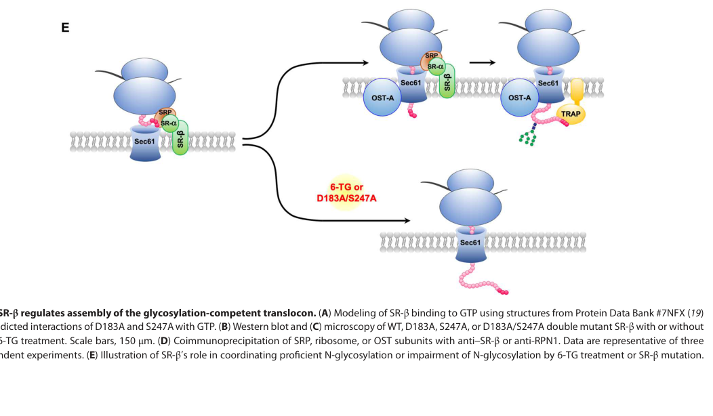

## Question

# Gene Research for Functional Annotation

## ⚠️ CRITICAL: Gene/Protein Identification Context

**BEFORE YOU BEGIN RESEARCH:** You MUST verify you are researching the CORRECT gene/protein. Gene symbols can be ambiguous, especially for less well-characterized genes from non-model organisms.

### Target Gene/Protein Identity (from UniProt):
- **UniProt Accession:** Q9Y5M8
- **Protein Description:** RecName: Full=Signal recognition particle receptor subunit beta; Short=SR-beta; AltName: Full=Protein APMCF1;
- **Gene Information:** Name=SRPRB; ORFNames=PSEC0230;
- **Organism (full):** Homo sapiens (Human).
- **Protein Family:** Belongs to the SRP receptor beta subunit family.
- **Key Domains:** P-loop_NTPase. (IPR027417); Small_GTPase_ARF. (IPR024156); SRP_receptor_beta_su. (IPR019009); SRPRB (PF09439)

### MANDATORY VERIFICATION STEPS:

1. **Check if the gene symbol "SRPRB" matches the protein description above**
2. **Verify the organism is correct:** Homo sapiens (Human).
3. **Check if protein family/domains align with what you find in literature**
4. **If you find literature for a DIFFERENT gene with the same or similar symbol, STOP**

### If Gene Symbol is Ambiguous or You Cannot Find Relevant Literature:

**DO NOT PROCEED WITH RESEARCH ON A DIFFERENT GENE.** Instead:
- State clearly: "The gene symbol 'SRPRB' is ambiguous or literature is limited for this specific protein"
- Explain what you found (e.g., "Found extensive literature on a different gene with the same symbol in a different organism")
- Describe the protein based ONLY on the UniProt information provided above
- Suggest that the protein function can be inferred from domain/family information

### Research Target:

Please provide a comprehensive research report on the gene **SRPRB** (gene ID: SRPRB, UniProt: Q9Y5M8) in human.

The research report should be a detailed narrative explaining the function, biological processes, and localization of the gene product. Citations should be given for all claims.

You should prioritize authoritative reviews and primary scientific literature when conducting research. You can supplement
this with annotations you find in gene/protein databases, but these can be outdated or inaccurate.

We are specifically interested in the primary function of the gene - for enzymes, what reaction is catalyzed, and what is the substrate specificity? For transporters, what is the substrate? For structural proteins or adapters, what is the broader structural role? For signaling molecules, what is the role in the pathway.

We are interested in where in or outside the cell the gene product carries out its function.

We are also interested in the signaling or biochemical pathways in which the gene functions. We are less interested in broad pleiotropic effects, except where these elucidate the precise role.

Include evidence where possible. We are interested in both experimental evidence as well as inference from structure, evolution, or bioinformatic analysis. Precise studies should be prioritized over high-throughput, where available.

## Output

Question: You are an expert researcher providing comprehensive, well-cited information.

Provide detailed information focusing on:
1. Key concepts and definitions with current understanding
2. Recent developments and latest research (prioritize 2023-2024 sources)
3. Current applications and real-world implementations
4. Expert opinions and analysis from authoritative sources
5. Relevant statistics and data from recent studies

Format as a comprehensive research report with proper citations. Include URLs and publication dates where available.
Always prioritize recent, authoritative sources and provide specific citations for all major claims.

# Gene Research for Functional Annotation

## ⚠️ CRITICAL: Gene/Protein Identification Context

**BEFORE YOU BEGIN RESEARCH:** You MUST verify you are researching the CORRECT gene/protein. Gene symbols can be ambiguous, especially for less well-characterized genes from non-model organisms.

### Target Gene/Protein Identity (from UniProt):
- **UniProt Accession:** Q9Y5M8
- **Protein Description:** RecName: Full=Signal recognition particle receptor subunit beta; Short=SR-beta; AltName: Full=Protein APMCF1;
- **Gene Information:** Name=SRPRB; ORFNames=PSEC0230;
- **Organism (full):** Homo sapiens (Human).
- **Protein Family:** Belongs to the SRP receptor beta subunit family.
- **Key Domains:** P-loop_NTPase. (IPR027417); Small_GTPase_ARF. (IPR024156); SRP_receptor_beta_su. (IPR019009); SRPRB (PF09439)

### MANDATORY VERIFICATION STEPS:

1. **Check if the gene symbol "SRPRB" matches the protein description above**
2. **Verify the organism is correct:** Homo sapiens (Human).
3. **Check if protein family/domains align with what you find in literature**
4. **If you find literature for a DIFFERENT gene with the same or similar symbol, STOP**

### If Gene Symbol is Ambiguous or You Cannot Find Relevant Literature:

**DO NOT PROCEED WITH RESEARCH ON A DIFFERENT GENE.** Instead:
- State clearly: "The gene symbol 'SRPRB' is ambiguous or literature is limited for this specific protein"
- Explain what you found (e.g., "Found extensive literature on a different gene with the same symbol in a different organism")
- Describe the protein based ONLY on the UniProt information provided above
- Suggest that the protein function can be inferred from domain/family information

### Research Target:

Please provide a comprehensive research report on the gene **SRPRB** (gene ID: SRPRB, UniProt: Q9Y5M8) in human.

The research report should be a detailed narrative explaining the function, biological processes, and localization of the gene product. Citations should be given for all claims.

You should prioritize authoritative reviews and primary scientific literature when conducting research. You can supplement
this with annotations you find in gene/protein databases, but these can be outdated or inaccurate.

We are specifically interested in the primary function of the gene - for enzymes, what reaction is catalyzed, and what is the substrate specificity? For transporters, what is the substrate? For structural proteins or adapters, what is the broader structural role? For signaling molecules, what is the role in the pathway.

We are interested in where in or outside the cell the gene product carries out its function.

We are also interested in the signaling or biochemical pathways in which the gene functions. We are less interested in broad pleiotropic effects, except where these elucidate the precise role.

Include evidence where possible. We are interested in both experimental evidence as well as inference from structure, evolution, or bioinformatic analysis. Precise studies should be prioritized over high-throughput, where available.

# Research Report: Human **SRPRB** (SRP receptor subunit beta; SRβ) — Functional Annotation

## 1. Target identity verification (mandatory)
The gene symbol **SRPRB** in **Homo sapiens** encodes **Signal Recognition Particle (SRP) receptor subunit beta (SRβ)**, an **integral endoplasmic reticulum (ER) membrane** protein and the membrane-anchoring subunit of the heterodimeric SRP receptor (SRα/SRβ). This matches the UniProt Q9Y5M8 description provided (SRP receptor subunit beta; SR-β; APMCF1). Experimental work describing SRβ as the **transmembrane GTPase** subunit that anchors SRα to the ER and binds GTP specifically is consistent with the expected domain/family assignment (P-loop NTPase/small GTPase-like). (miller1995thebetasubunit pages 1-2, miller1995thebetasubunit pages 6-7)

A recent human genetics/cell biology study explicitly refers to **SRPRB as encoding the “membrane anchoring subunit”** of the SRP receptor, with CRISPR knockout of SRPRB disrupting SRα stability and ER localization—directly aligning the symbol **SRPRB** with the SRβ protein identity in human cells. (child2023examiningsrppathway pages 2-4)

## 2. Key concepts and current understanding

### 2.1 The SRP pathway and the SRP receptor (SR)
The **SRP pathway** mediates **cotranslational targeting** of a large fraction of secretory and membrane proteins to the ER. In this process, SRP binds emerging signal sequences on ribosome–nascent chain complexes and delivers them to the ER-localized SRP receptor (SR), enabling transfer to the protein translocation machinery (e.g., Sec61). The SRP receptor is a heterodimer of **SRα** (peripheral membrane GTPase) and **SRβ** (integral membrane GTPase). (miller1995thebetasubunit pages 1-2)

### 2.2 Definition: SRPRB/SRβ molecular role
**SRβ** is best understood as:
- An **ER membrane anchor** for SRα (maintaining SRα at the ER surface). (miller1995thebetasubunit pages 1-2, child2023examiningsrppathway pages 2-4)
- A **GTP-binding transmembrane small GTPase** with canonical GTPase motifs in its cytosolic domain. (miller1995thebetasubunit pages 6-7, miller1995thebetasubunit pages 7-9)
- A structural/mechanistic component of the targeting complex that helps organize the SRP–SR GTPase cycle on the ribosome and (as shown recently) helps coordinate downstream ER cotranslational processing events such as **N-glycosylation**. (kobayashi2018structureofa pages 1-3, phoomak2023signalrecognitionparticle pages 1-2)

## 3. Protein features, domains, and subcellular localization

### 3.1 Membrane topology and ER localization
Classic biochemical characterization established SRβ as an **integral membrane protein** with a **single signal-anchor transmembrane segment** (no cleaved signal peptide) and a **cytosolic GTPase domain**, consistent with function on the cytosolic face of the ER where ribosomes dock. (miller1995thebetasubunit pages 6-7, miller1995thebetasubunit pages 5-6)

### 3.2 GTPase family assignment
SRβ belongs to the GTPase superfamily and forms a distinct subgroup distantly related to ARF/Sar1-like small GTPases; it **binds GTP specifically** in UV crosslinking assays, supporting its functional classification as a GTP-binding protein. (miller1995thebetasubunit pages 1-2, miller1995thebetasubunit pages 7-9)

## 4. Molecular function in pathways: SRP receptor cycle, targeting, and translocation

### 4.1 SRβ as the membrane-anchoring subunit for SRα
SRα behaves as a peripheral membrane protein, and SRβ mediates stable **membrane association of SRα**. This anchoring is not merely structural: SRβ’s nucleotide-binding domain suggested (even in early work) an additional regulated role in targeting/translocation. (miller1995thebetasubunit pages 1-2, miller1995thebetasubunit pages 6-7)

Direct evidence in human cells shows that **loss of SRPRB (SRβ) destabilizes SRα** and causes cytosolic redistribution of residual SRα, while re-expression of SRβ restores SRα abundance and ER localization. (child2023examiningsrppathway pages 2-4)

### 4.2 Structural and mechanistic role during cotranslational targeting (2018–2021 mechanistic framework)
A cryo-EM structure of a **prehandover mammalian ribosomal SRP·SR targeting complex** places SRβ as an ER-integrated, eukaryote-specific SRP receptor component with **GTP bound**. In this structure, the SRα NG domain contacts the SRβ-bound GTP, and SRβ (together with SRP68 elements) helps form a platform that docks/stabilizes the NG heterodimer at the distal SRP RNA site to enable subsequent handover steps. (kobayashi2018structureofa pages 1-3)

Follow-on mechanistic work supports a model in which SRP-mediated targeting requires sequential conformational rearrangements driven by the SRP/SR GTPase cycle, including **receptor compaction and GTPase rearrangement** to transition from cargo recognition near the ribosome exit tunnel to a distal state compatible with translocon engagement. In this framework, SRβ is part of the membrane-proximal SR architecture that enables these rearrangements at the ER. (lee2021receptorcompactionand pages 1-2, lee2021receptorcompactionand pages 2-3)

## 5. Recent developments (prioritizing 2023–2024)

### 5.1 2023: SRβ coordinates cotranslational N-glycosylation by promoting a glycosylation-competent translocon
A 2023 *Science Advances* study provided direct evidence for a **previously underappreciated function** of SRβ: SRβ is **required for assembly of an N-glycosylation–competent translocon** and thereby coordinates cotranslational translation/translocation with N-glycosylation. Perturbation of SRβ’s **GTP-binding site** (mutation) or small-molecule guanine analog probes produced a **hypoglycosylation phenotype** without disrupting SRα–SRβ association, but **reduced SRβ association with the oligosaccharyltransferase (OST) complex**, linking SRβ activity to OST recruitment/engagement. (phoomak2023signalrecognitionparticle pages 1-2)

A mechanistic schematic from the same study summarizes this model: SRβ promotes recruitment/assembly of OST with the ribosome–Sec61 translocon to create a glycosylation-competent supercomplex, whereas SRβ perturbation prevents proper OST engagement and results in hypoglycosylation. (phoomak2023signalrecognitionparticle media 4ab7387b)

### 5.2 2023: SRPRB knockout and ER mRNA localization
A 2023 *RNA* study used CRISPR/Cas9 to generate SRPRB knockout lines and found that, although SRβ loss profoundly destabilizes SRα, **steady-state ER localization patterns of mRNAs were largely unaltered** in their assays, arguing that ER mRNA localization can be uncoupled from SRP receptor expression under tested conditions. This refines (and complicates) common assumptions that SR is strictly required for ER mRNA localization. (child2023examiningsrppathway pages 2-4)

### 5.3 2024: SRPRB appears mainly in association/omics contexts rather than established mechanistic disease biology
In 2024 literature retrieved here, SRPRB often appears in **gene signatures** (e.g., cancer prognostic models, extracellular vesicle proteomics, epigenetic review examples) rather than as a deeply validated causal driver; these contexts can be hypothesis-generating but typically do not supersede the experimentally defined SRβ function in ER targeting and cotranslational processing. (OpenTargets Search: -SRPRB)

## 6. Quantitative statistics and data from recent studies

### 6.1 Quantitative phenotypes from SRPRB knockout (2023)
In SRPRB knockout cells, mutant SRPRB transcript levels were reported at **~50–80% of parental** and showed reduced engagement with heavy polysomes (shift from **fractions 13–18** to **fractions 8–10**), consistent with nonsense-mediated decay/translation effects. Proteasome inhibition (MG132) for **16 hours** increased SRα levels in SRβ-deficient cells, supporting proteasome-mediated SRα turnover when SRβ is absent. (child2023examiningsrppathway pages 2-4)

### 6.2 Quantitative glycoproteomics and screening statistics (2023)
In the SRβ–glycosylation coordination study:
- A high-throughput screen of **361,103 small molecules** identified guanine analog activity (including 6-thioguanine) associated with glycosylation defects. (phoomak2023signalrecognitionparticle pages 1-2)
- Glycoproteomic analysis identified **796 acceptor sequons**; **244** showed **>25%** reduction in glycan occupancy and **95** showed **>50%** reduction after treatment. (phoomak2023signalrecognitionparticle pages 2-3)
- Comparison with a direct OST inhibitor (NGI-1) suggested only partial overlap: among **617** sequons quantified in both datasets, only **~50%** of strongly affected sites by one condition matched the other, consistent with a mechanism distinct from simple OST inhibition and implicating cotranslational/translocon coordination. (phoomak2023signalrecognitionparticle pages 2-3)

## 7. Current applications and real-world implementations

### 7.1 Chemical biology and pathway probing of cotranslational processing
The 2023 identification of guanine-analog probes that induce SRβ-linked hypoglycosylation provides a practical **chemical perturbation strategy** to interrogate how cotranslational targeting interfaces with glycosylation and translocon assembly. This is directly applicable to studies of secretory pathway quality control and glycoprotein biogenesis. (phoomak2023signalrecognitionparticle pages 1-2, phoomak2023signalrecognitionparticle pages 2-3)

### 7.2 Functional genomics models to dissect ER targeting and mRNA localization
SRPRB knockout cell lines (and complementary SRα suppression approaches) provide **real-world cellular systems** for separating SR-dependent protein targeting functions from SR-independent ER mRNA localization phenomena, enabling mechanistic dissection of ER-associated translation biology. (child2023examiningsrppathway pages 2-4)

### 7.3 Disease association resources (hypothesis generation)
Open Targets lists modest associations between SRPRB and several disease terms (e.g., neurodegenerative disease) derived largely from functional screening evidence (CRISPRi/CRISPRa survival screens). These data are useful for hypothesis generation and prioritization but should be interpreted cautiously because they do not, by themselves, establish SRPRB as a well-validated monogenic disease gene or therapeutic target. (OpenTargets Search: -SRPRB)

## 8. Expert synthesis and analysis (evidence-weighted)

1. **Core, highest-confidence function:** SRPRB encodes SRβ, an ER-integrated GTP-binding receptor subunit essential for stable SRα association with the ER and for canonical SRP-mediated cotranslational targeting. This is supported by foundational biochemical work and reinforced by direct human knockout phenotypes. (miller1995thebetasubunit pages 1-2, child2023examiningsrppathway pages 2-4)

2. **Mechanistic refinement from structures:** Cryo-EM places SRβ as an organizing element in eukaryotic targeting intermediates; GTP-bound SRβ interacts with SRα domain architecture to stabilize/dock the SRP–SR NG heterodimer for handover steps, with evidence that SRβ may not hydrolyze GTP in at least one prehandover conformation. (kobayashi2018structureofa pages 1-3)

3. **Major 2023 advance:** SRβ is not only an anchor; it can coordinate **assembly of a glycosylation-competent translocon** by modulating association with OST, providing a direct mechanistic bridge between targeting and a key cotranslational modification (N-glycosylation). This expands functional annotation of SRPRB into cotranslational processing beyond simple targeting. (phoomak2023signalrecognitionparticle pages 1-2, phoomak2023signalrecognitionparticle media 4ab7387b)

4. **Limits of current evidence:** Many 2024 mentions of SRPRB occur in omics signatures or association resources; these do not yet replace direct mechanistic studies as the basis for functional annotation. (OpenTargets Search: -SRPRB)

## 9. Summary table
| Category | Evidence summary | Key citations (pqac IDs) | Publication(s) + date + URL |
|---|---|---|---|
| Identity | Human **SRPRB** matches UniProt **Q9Y5M8** and encodes **signal recognition particle receptor subunit beta (SRβ)**, also called the membrane-anchoring subunit of the heterodimeric SRP receptor. Loss of SRPRB destabilizes SRα and redistributes residual SRα to the cytosol, confirming the specific SRα/SRβ receptor identity in human cells. | (miller1995thebetasubunit pages 1-2, child2023examiningsrppathway pages 2-4) | Miller et al., *J Cell Biol* (Feb 1995), https://doi.org/10.1083/jcb.128.3.273; Child et al., *RNA* (Aug 2023), https://doi.org/10.1261/rna.079643.123 |
| Domains | SRβ is an **integral membrane small GTPase** with a **single transmembrane signal-anchor** and a **cytosolic GTP-binding domain** containing canonical GTPase motifs; it defines a distinct SRβ subfamily related to ARF/Sar1-like small GTPases. Structural work further places a **GTP molecule bound to SRβ** within the mammalian targeting complex. | (miller1995thebetasubunit pages 6-7, miller1995thebetasubunit pages 7-9, kobayashi2018structureofa pages 7-9) | Miller et al., *J Cell Biol* (Feb 1995), https://doi.org/10.1083/jcb.128.3.273; Kobayashi et al., *Science* (Apr 2018), https://doi.org/10.1126/science.aar7924 |
| Localization | SRβ localizes to the **endoplasmic reticulum membrane** as the membrane-integrated subunit of the SRP receptor, with its GTPase domain on the cytosolic face. Complementation of SRPRB knockout restores SRα localization to the ER, reinforcing ER residency of the functional complex. | (miller1995thebetasubunit pages 6-7, miller1995thebetasubunit pages 5-6, child2023examiningsrppathway pages 2-4) | Miller et al., *J Cell Biol* (Feb 1995), https://doi.org/10.1083/jcb.128.3.273; Child et al., *RNA* (Aug 2023), https://doi.org/10.1261/rna.079643.123 |
| Complexes/partners | Major partners are **SRα (SRPRA)**, **SRP54/SRP**, the **ribosome-nascent chain complex**, and functionally the **Sec61 translocon**. Recent work adds the **oligosaccharyltransferase (OST) complex** as an SRβ-associated partner needed for a glycosylation-competent translocon. Cryo-EM places SRβ together with SRP68 in a platform that docks the NG heterodimer at the distal SRP RNA site. | (phoomak2023signalrecognitionparticle pages 1-2, kobayashi2018structureofa pages 1-3, kobayashi2018structureofa pages 3-5, phoomak2023signalrecognitionparticle media 4ab7387b) | Kobayashi et al., *Science* (Apr 2018), https://doi.org/10.1126/science.aar7924; Phoomak et al., *Sci Adv* (Mar 2023), https://doi.org/10.1126/sciadv.ade8079 |
| Core molecular function | SRβ’s core role is to **anchor and organize the SRP receptor at the ER** during **co-translational targeting** of secretory and membrane proteins. Beyond anchoring, its **GTP-bound state contributes to assembly/stabilization of the targeting complex** and, in 2023 work, to **coordination of cotranslational N-glycosylation** by promoting OST engagement with the translocon. | (miller1995thebetasubunit pages 1-2, kobayashi2018structureofa pages 1-3, phoomak2023signalrecognitionparticle pages 1-2) | Miller et al., *J Cell Biol* (Feb 1995), https://doi.org/10.1083/jcb.128.3.273; Kobayashi et al., *Science* (Apr 2018), https://doi.org/10.1126/science.aar7924; Phoomak et al., *Sci Adv* (Mar 2023), https://doi.org/10.1126/sciadv.ade8079 |
| Key mechanistic insights | Early biochemical work showed **specific GTP binding** by SRβ and proposed that its nucleotide state could regulate targeting/translocation. Cryo-EM and single-molecule work later showed that eukaryotic targeting requires **SR compaction and GTPase-driven rearrangements**; **GTP-bound SRβ** contacts the SRα NG/SRX architecture and provides a **eukaryote-specific stabilizing effect** that helps dock the targeting complex for signal-sequence handover. Notably, the 2018 structure suggested SRβ may remain **GTP-bound without hydrolysis** in that prehandover state. | (miller1995thebetasubunit pages 7-9, kobayashi2018structureofa pages 1-3, kobayashi2018structureofa pages 3-5, lee2021receptorcompactionand pages 1-2, lee2021receptorcompactionand pages 2-3) | Miller et al., *J Cell Biol* (Feb 1995), https://doi.org/10.1083/jcb.128.3.273; Kobayashi et al., *Science* (Apr 2018), https://doi.org/10.1126/science.aar7924; Lee et al., *Sci Adv* (May 2021), https://doi.org/10.1126/sciadv.abg0942 |
| Phenotypes/perturbations | **SRPRB knockout** in human cells causes **profound destabilization of SRα**, proteasome-sensitive SRα loss, and cytosolic redistribution of residual SRα, but surprisingly leaves bulk steady-state ER/cytosol mRNA partitioning largely unchanged. Chemical or mutational perturbation of the **SRβ GTP-binding site** causes an **N-glycosylation-deficient phenotype** and reduces SRβ association with OST without disrupting SRα-SRβ association. | (child2023examiningsrppathway pages 2-4, phoomak2023signalrecognitionparticle pages 1-2) | Child et al., *RNA* (Aug 2023), https://doi.org/10.1261/rna.079643.123; Phoomak et al., *Sci Adv* (Mar 2023), https://doi.org/10.1126/sciadv.ade8079 |
| Recent (2023-2024) developments | In **2023**, SRPRB was shown to have a previously underappreciated role in **assembling an N-glycosylation-competent translocon** and **coordinating cotranslational N-glycosylation**, expanding its function beyond receptor anchoring. Also in **2023**, human SRPRB knockout experiments challenged simple models that ER mRNA localization is strictly SR-dependent. In **2024**, SRPRB appears mainly in **omics/association contexts** rather than as a directly validated disease gene; Open Targets lists modest disease associations largely derived from functional screening evidence rather than gene-specific mechanistic human pathology. | (child2023examiningsrppathway pages 2-4, phoomak2023signalrecognitionparticle pages 1-2, phoomak2023signalrecognitionparticle pages 2-3, OpenTargets Search: -SRPRB) | Child et al., *RNA* (Aug 2023), https://doi.org/10.1261/rna.079643.123; Phoomak et al., *Sci Adv* (Mar 2023), https://doi.org/10.1126/sciadv.ade8079; Open Targets context (accessed via tool context) |
| Quantitative data points | Reported quantitative findings include: **SRPRB KO transcripts at ~50–80% of parental** with mutant mRNAs shifted from **heavy polysomes fractions 13–18** to **fractions 8–10**; **MG132 for 16 h** increased SRα levels in KO cells. In the glycosylation study, a **361,103-compound** screen identified **6-thioguanine**; treatment effects were seen with **10 μM** compounds and ~**6 h** onset; among **796** sequons, **244** showed **>25%** occupancy loss and **95** showed **>50%** loss; among **617** shared sequons, only **~50%** overlapped with NGI-1-sensitive sites. | (child2023examiningsrppathway pages 2-4, phoomak2023signalrecognitionparticle pages 1-2, phoomak2023signalrecognitionparticle pages 2-3) | Child et al., *RNA* (Aug 2023), https://doi.org/10.1261/rna.079643.123; Phoomak et al., *Sci Adv* (Mar 2023), https://doi.org/10.1126/sciadv.ade8079 |
| OpenTargets association context | Open Targets lists low-to-moderate association scores between **SRPRB** and several diseases (for example **neurodegenerative disease score 0.5463**) based on **5 evidence items** tied to CRISPRi/CRISPRa survival screens (literature PMID **34031600**). These are useful hypothesis-generating links but do **not** currently establish SRPRB as a well-validated monogenic disease gene. | (OpenTargets Search: -SRPRB) | Open Targets platform context for SRPRB associations (tool-derived evidence context) |

*Table: This table summarizes the best-supported functional annotation for human SRPRB/SRβ, integrating classic biochemistry, structural studies, and recent 2023 findings. It is useful for distinguishing the core ER-targeting role of SRβ from newer evidence linking it to cotranslational N-glycosylation and from weaker disease-association signals.*

## Key source URLs (with publication dates)
- Miller et al., *Journal of Cell Biology* (Feb 1995): https://doi.org/10.1083/jcb.128.3.273 (miller1995thebetasubunit pages 1-2)
- Kobayashi et al., *Science* (Apr 2018): https://doi.org/10.1126/science.aar7924 (kobayashi2018structureofa pages 1-3)
- Lee et al., *Science Advances* (May 2021): https://doi.org/10.1126/sciadv.abg0942 (lee2021receptorcompactionand pages 1-2)
- Child et al., *RNA* (Aug 2023): https://doi.org/10.1261/rna.079643.123 (child2023examiningsrppathway pages 2-4)
- Phoomak et al., *Science Advances* (Mar 2023): https://doi.org/10.1126/sciadv.ade8079 (phoomak2023signalrecognitionparticle pages 1-2)
- Open Targets SRPRB associations (tool-derived context): evidence summarized in (OpenTargets Search: -SRPRB)

References

1. (miller1995thebetasubunit pages 1-2): Joshua D. Miller, S. Tajima, L. Lauffer, and P. Walter. The beta subunit of the signal recognition particle receptor is a transmembrane gtpase that anchors the alpha subunit, a peripheral membrane gtpase, to the endoplasmic reticulum membrane. The Journal of cell biology, 128:273-282, Feb 1995. URL: https://doi.org/10.1083/jcb.128.3.273, doi:10.1083/jcb.128.3.273. This article has 167 citations.

2. (miller1995thebetasubunit pages 6-7): Joshua D. Miller, S. Tajima, L. Lauffer, and P. Walter. The beta subunit of the signal recognition particle receptor is a transmembrane gtpase that anchors the alpha subunit, a peripheral membrane gtpase, to the endoplasmic reticulum membrane. The Journal of cell biology, 128:273-282, Feb 1995. URL: https://doi.org/10.1083/jcb.128.3.273, doi:10.1083/jcb.128.3.273. This article has 167 citations.

3. (child2023examiningsrppathway pages 2-4): Jessica R. Child, Alex C. Hofler, Qiang Chen, Brenda H. Yang, JohnCarlo Kristofich, Tianli Zheng, Molly M. Hannigan, Andrew L. Elles, David W. Reid, and Christopher V. Nicchitta. Examining srp pathway function in mrna localization to the endoplasmic reticulum. RNA, 29:1703-1724, Aug 2023. URL: https://doi.org/10.1261/rna.079643.123, doi:10.1261/rna.079643.123. This article has 13 citations and is from a domain leading peer-reviewed journal.

4. (miller1995thebetasubunit pages 7-9): Joshua D. Miller, S. Tajima, L. Lauffer, and P. Walter. The beta subunit of the signal recognition particle receptor is a transmembrane gtpase that anchors the alpha subunit, a peripheral membrane gtpase, to the endoplasmic reticulum membrane. The Journal of cell biology, 128:273-282, Feb 1995. URL: https://doi.org/10.1083/jcb.128.3.273, doi:10.1083/jcb.128.3.273. This article has 167 citations.

5. (kobayashi2018structureofa pages 1-3): Kan Kobayashi, Ahmad Jomaa, Jae Ho Lee, Sowmya Chandrasekar, Daniel Boehringer, Shu-ou Shan, and Nenad Ban. Structure of a prehandover mammalian ribosomal srp·srp receptor targeting complex. Science, 360:323-327, Apr 2018. URL: https://doi.org/10.1126/science.aar7924, doi:10.1126/science.aar7924. This article has 74 citations and is from a highest quality peer-reviewed journal.

6. (phoomak2023signalrecognitionparticle pages 1-2): Chatchai Phoomak, Natalie Rinis, Marta Baro, Shiteshu Shrimal, Daniel Bennett, Scott A. Shaffer, Mark Lehrman, Reid Gilmore, and Joseph N. Contessa. Signal recognition particle receptor-β (sr-β) coordinates cotranslational n-glycosylation. Science Advances, Mar 2023. URL: https://doi.org/10.1126/sciadv.ade8079, doi:10.1126/sciadv.ade8079. This article has 6 citations and is from a highest quality peer-reviewed journal.

7. (miller1995thebetasubunit pages 5-6): Joshua D. Miller, S. Tajima, L. Lauffer, and P. Walter. The beta subunit of the signal recognition particle receptor is a transmembrane gtpase that anchors the alpha subunit, a peripheral membrane gtpase, to the endoplasmic reticulum membrane. The Journal of cell biology, 128:273-282, Feb 1995. URL: https://doi.org/10.1083/jcb.128.3.273, doi:10.1083/jcb.128.3.273. This article has 167 citations.

8. (lee2021receptorcompactionand pages 1-2): Jae Ho Lee, Ahmad Jomaa, SangYoon Chung, Yu-Hsien Hwang Fu, Ruilin Qian, Xuemeng Sun, Hao-Hsuan Hsieh, Sowmya Chandrasekar, Xiaotian Bi, Simone Mattei, Daniel Boehringer, Shimon Weiss, Nenad Ban, and Shu-ou Shan. Receptor compaction and gtpase rearrangement drive srp-mediated cotranslational protein translocation into the er. May 2021. URL: https://doi.org/10.1126/sciadv.abg0942, doi:10.1126/sciadv.abg0942. This article has 27 citations and is from a highest quality peer-reviewed journal.

9. (lee2021receptorcompactionand pages 2-3): Jae Ho Lee, Ahmad Jomaa, SangYoon Chung, Yu-Hsien Hwang Fu, Ruilin Qian, Xuemeng Sun, Hao-Hsuan Hsieh, Sowmya Chandrasekar, Xiaotian Bi, Simone Mattei, Daniel Boehringer, Shimon Weiss, Nenad Ban, and Shu-ou Shan. Receptor compaction and gtpase rearrangement drive srp-mediated cotranslational protein translocation into the er. May 2021. URL: https://doi.org/10.1126/sciadv.abg0942, doi:10.1126/sciadv.abg0942. This article has 27 citations and is from a highest quality peer-reviewed journal.

10. (phoomak2023signalrecognitionparticle media 4ab7387b): Chatchai Phoomak, Natalie Rinis, Marta Baro, Shiteshu Shrimal, Daniel Bennett, Scott A. Shaffer, Mark Lehrman, Reid Gilmore, and Joseph N. Contessa. Signal recognition particle receptor-β (sr-β) coordinates cotranslational n-glycosylation. Science Advances, Mar 2023. URL: https://doi.org/10.1126/sciadv.ade8079, doi:10.1126/sciadv.ade8079. This article has 6 citations and is from a highest quality peer-reviewed journal.

11. (OpenTargets Search: -SRPRB): Open Targets Query (-SRPRB, 5 results). Buniello, A. et al. (2025). Open Targets Platform: facilitating therapeutic hypotheses building in drug discovery. Nucleic Acids Research.

12. (phoomak2023signalrecognitionparticle pages 2-3): Chatchai Phoomak, Natalie Rinis, Marta Baro, Shiteshu Shrimal, Daniel Bennett, Scott A. Shaffer, Mark Lehrman, Reid Gilmore, and Joseph N. Contessa. Signal recognition particle receptor-β (sr-β) coordinates cotranslational n-glycosylation. Science Advances, Mar 2023. URL: https://doi.org/10.1126/sciadv.ade8079, doi:10.1126/sciadv.ade8079. This article has 6 citations and is from a highest quality peer-reviewed journal.

13. (kobayashi2018structureofa pages 7-9): Kan Kobayashi, Ahmad Jomaa, Jae Ho Lee, Sowmya Chandrasekar, Daniel Boehringer, Shu-ou Shan, and Nenad Ban. Structure of a prehandover mammalian ribosomal srp·srp receptor targeting complex. Science, 360:323-327, Apr 2018. URL: https://doi.org/10.1126/science.aar7924, doi:10.1126/science.aar7924. This article has 74 citations and is from a highest quality peer-reviewed journal.

14. (kobayashi2018structureofa pages 3-5): Kan Kobayashi, Ahmad Jomaa, Jae Ho Lee, Sowmya Chandrasekar, Daniel Boehringer, Shu-ou Shan, and Nenad Ban. Structure of a prehandover mammalian ribosomal srp·srp receptor targeting complex. Science, 360:323-327, Apr 2018. URL: https://doi.org/10.1126/science.aar7924, doi:10.1126/science.aar7924. This article has 74 citations and is from a highest quality peer-reviewed journal.

## Artifacts

- [Edison artifact artifact-00](SRPRB-deep-research-falcon_artifacts/artifact-00.md)

## Citations

1. child2023examiningsrppathway pages 2-4
2. miller1995thebetasubunit pages 1-2
3. kobayashi2018structureofa pages 1-3
4. phoomak2023signalrecognitionparticle pages 1-2
5. phoomak2023signalrecognitionparticle pages 2-3
6. lee2021receptorcompactionand pages 1-2
7. miller1995thebetasubunit pages 6-7
8. miller1995thebetasubunit pages 7-9
9. miller1995thebetasubunit pages 5-6
10. lee2021receptorcompactionand pages 2-3
11. kobayashi2018structureofa pages 7-9
12. kobayashi2018structureofa pages 3-5
13. https://doi.org/10.1083/jcb.128.3.273;
14. https://doi.org/10.1261/rna.079643.123
15. https://doi.org/10.1126/science.aar7924
16. https://doi.org/10.1126/science.aar7924;
17. https://doi.org/10.1126/sciadv.ade8079
18. https://doi.org/10.1126/sciadv.abg0942
19. https://doi.org/10.1261/rna.079643.123;
20. https://doi.org/10.1126/sciadv.ade8079;
21. https://doi.org/10.1083/jcb.128.3.273
22. https://doi.org/10.1083/jcb.128.3.273,
23. https://doi.org/10.1261/rna.079643.123,
24. https://doi.org/10.1126/science.aar7924,
25. https://doi.org/10.1126/sciadv.ade8079,
26. https://doi.org/10.1126/sciadv.abg0942,