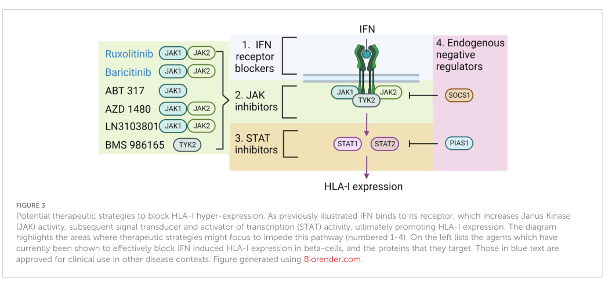

## Question

# Gene Research for Functional Annotation

## ⚠️ CRITICAL: Gene/Protein Identification Context

**BEFORE YOU BEGIN RESEARCH:** You MUST verify you are researching the CORRECT gene/protein. Gene symbols can be ambiguous, especially for less well-characterized genes from non-model organisms.

### Target Gene/Protein Identity (from UniProt):
- **UniProt Accession:** P42224
- **Protein Description:** RecName: Full=Signal transducer and activator of transcription 1-alpha/beta; AltName: Full=Transcription factor ISGF-3 components p91/p84;
- **Gene Information:** Name=STAT1;
- **Organism (full):** Homo sapiens (Human).
- **Protein Family:** Belongs to the transcription factor STAT family.
- **Key Domains:** p53-like_TF_DNA-bd_sf. (IPR008967); SH2. (IPR000980); SH2_dom_sf. (IPR036860); STAT. (IPR001217); STAT1_C_sf. (IPR038295)

### MANDATORY VERIFICATION STEPS:

1. **Check if the gene symbol "STAT1" matches the protein description above**
2. **Verify the organism is correct:** Homo sapiens (Human).
3. **Check if protein family/domains align with what you find in literature**
4. **If you find literature for a DIFFERENT gene with the same or similar symbol, STOP**

### If Gene Symbol is Ambiguous or You Cannot Find Relevant Literature:

**DO NOT PROCEED WITH RESEARCH ON A DIFFERENT GENE.** Instead:
- State clearly: "The gene symbol 'STAT1' is ambiguous or literature is limited for this specific protein"
- Explain what you found (e.g., "Found extensive literature on a different gene with the same symbol in a different organism")
- Describe the protein based ONLY on the UniProt information provided above
- Suggest that the protein function can be inferred from domain/family information

### Research Target:

Please provide a comprehensive research report on the gene **STAT1** (gene ID: STAT1, UniProt: P42224) in human.

The research report should be a detailed narrative explaining the function, biological processes, and localization of the gene product. Citations should be given for all claims.

You should prioritize authoritative reviews and primary scientific literature when conducting research. You can supplement
this with annotations you find in gene/protein databases, but these can be outdated or inaccurate.

We are specifically interested in the primary function of the gene - for enzymes, what reaction is catalyzed, and what is the substrate specificity? For transporters, what is the substrate? For structural proteins or adapters, what is the broader structural role? For signaling molecules, what is the role in the pathway.

We are interested in where in or outside the cell the gene product carries out its function.

We are also interested in the signaling or biochemical pathways in which the gene functions. We are less interested in broad pleiotropic effects, except where these elucidate the precise role.

Include evidence where possible. We are interested in both experimental evidence as well as inference from structure, evolution, or bioinformatic analysis. Precise studies should be prioritized over high-throughput, where available.

## Output

Question: You are an expert researcher providing comprehensive, well-cited information.

Provide detailed information focusing on:
1. Key concepts and definitions with current understanding
2. Recent developments and latest research (prioritize 2023-2024 sources)
3. Current applications and real-world implementations
4. Expert opinions and analysis from authoritative sources
5. Relevant statistics and data from recent studies

Format as a comprehensive research report with proper citations. Include URLs and publication dates where available.
Always prioritize recent, authoritative sources and provide specific citations for all major claims.

# Gene Research for Functional Annotation

## ⚠️ CRITICAL: Gene/Protein Identification Context

**BEFORE YOU BEGIN RESEARCH:** You MUST verify you are researching the CORRECT gene/protein. Gene symbols can be ambiguous, especially for less well-characterized genes from non-model organisms.

### Target Gene/Protein Identity (from UniProt):
- **UniProt Accession:** P42224
- **Protein Description:** RecName: Full=Signal transducer and activator of transcription 1-alpha/beta; AltName: Full=Transcription factor ISGF-3 components p91/p84;
- **Gene Information:** Name=STAT1;
- **Organism (full):** Homo sapiens (Human).
- **Protein Family:** Belongs to the transcription factor STAT family.
- **Key Domains:** p53-like_TF_DNA-bd_sf. (IPR008967); SH2. (IPR000980); SH2_dom_sf. (IPR036860); STAT. (IPR001217); STAT1_C_sf. (IPR038295)

### MANDATORY VERIFICATION STEPS:

1. **Check if the gene symbol "STAT1" matches the protein description above**
2. **Verify the organism is correct:** Homo sapiens (Human).
3. **Check if protein family/domains align with what you find in literature**
4. **If you find literature for a DIFFERENT gene with the same or similar symbol, STOP**

### If Gene Symbol is Ambiguous or You Cannot Find Relevant Literature:

**DO NOT PROCEED WITH RESEARCH ON A DIFFERENT GENE.** Instead:
- State clearly: "The gene symbol 'STAT1' is ambiguous or literature is limited for this specific protein"
- Explain what you found (e.g., "Found extensive literature on a different gene with the same symbol in a different organism")
- Describe the protein based ONLY on the UniProt information provided above
- Suggest that the protein function can be inferred from domain/family information

### Research Target:

Please provide a comprehensive research report on the gene **STAT1** (gene ID: STAT1, UniProt: P42224) in human.

The research report should be a detailed narrative explaining the function, biological processes, and localization of the gene product. Citations should be given for all claims.

You should prioritize authoritative reviews and primary scientific literature when conducting research. You can supplement
this with annotations you find in gene/protein databases, but these can be outdated or inaccurate.

We are specifically interested in the primary function of the gene - for enzymes, what reaction is catalyzed, and what is the substrate specificity? For transporters, what is the substrate? For structural proteins or adapters, what is the broader structural role? For signaling molecules, what is the role in the pathway.

We are interested in where in or outside the cell the gene product carries out its function.

We are also interested in the signaling or biochemical pathways in which the gene functions. We are less interested in broad pleiotropic effects, except where these elucidate the precise role.

Include evidence where possible. We are interested in both experimental evidence as well as inference from structure, evolution, or bioinformatic analysis. Precise studies should be prioritized over high-throughput, where available.

## Research Report: Human STAT1 (UniProt P42224) — Functional Annotation and Current Understanding

### 0. Target verification (mandatory)
The UniProt accession **P42224** corresponds to **human STAT1** (“signal transducer and activator of transcription 1-alpha/beta”; historically described as **ISGF3 component p91/p84**), a STAT-family transcription factor central to interferon (IFN) signaling, consistent with STAT-family domain architecture and STAT1’s role in IFN-induced transcriptional complexes. (babadei2024transcriptionalcontrolof pages 2-3, meesilpavikkai2024unravelingtheimmunogenetics pages 1-3)

---

### 1. Key concepts and definitions (current understanding)

#### 1.1 STAT1 as a JAK–STAT pathway transcription factor
STAT1 is a signal transducer and transcription factor that is activated downstream of cytokine receptors (classically IFN receptors) via receptor-associated **Janus kinases (JAKs)**, leading to STAT phosphorylation, dimerization, nuclear translocation, and transcriptional regulation of IFN-responsive genes. (ott2023jaksandstats pages 1-2, babadei2024transcriptionalcontrolof pages 2-3)

#### 1.2 Domain architecture (functional implications)
Recent authoritative reviews summarize canonical STAT-family domain organization present in STAT1: **N-terminal domain, coiled-coil domain, DNA-binding domain, linker, SH2 domain, and a C-terminal transactivation domain (TAD)**; these domains support receptor docking (via SH2), dimerization (via phosphotyrosine–SH2 interactions), DNA binding, and transcriptional activation. (babadei2024transcriptionalcontrolof pages 2-3, meesilpavikkai2024unravelingtheimmunogenetics pages 1-3)

#### 1.3 Activation, post-translational modification (PTM), and complex formation
* **Tyrosine phosphorylation**: IFN-receptor-associated JAKs phosphorylate STAT1 on a key tyrosine residue (**Tyr701**, located between SH2 and TAD), altering dimerization properties and enabling nuclear translocation and transcriptional activity. (babadei2024transcriptionalcontrolof pages 2-3)
* **Serine phosphorylation**: STAT1 also has a well-characterized C-terminal serine phosphorylation site (**Ser727**), which modulates transcriptional activity and can be induced by IFN-dependent and IFN-independent routes. (babadei2024transcriptionalcontrolof pages 2-3)
* **GAF vs ISGF3 (DNA response elements)**:
  * **STAT1 homodimers** (historically **GAF**, gamma-interferon activation factor) bind **GAS** (gamma-activated sequence) DNA elements.
  * **STAT1–STAT2 heterodimers** plus **IRF9** form **ISGF3**, which binds **ISRE** (interferon-stimulated response element) DNA elements.
These complexes provide a mechanistic basis for differences between IFNγ- and IFNα/β-driven transcriptional programs. (babadei2024transcriptionalcontrolof pages 2-3, efstathiou2024respiratorysyncytialvirus pages 1-2)

---

### 2. Molecular function, pathways, and cellular localization

#### 2.1 Primary molecular function
STAT1’s primary biochemical function is **sequence-specific transcriptional regulation** as part of IFN-activated transcription factor complexes (GAF and ISGF3), controlling expression of interferon-stimulated genes (ISGs). (babadei2024transcriptionalcontrolof pages 2-3, babadei2024transcriptionalcontrolof pages 1-2)

#### 2.2 Subcellular localization dynamics
STAT1 exists in unphosphorylated/preassociated states at baseline and, upon tyrosine phosphorylation, forms dimers that **translocate to the nucleus**, where they bind regulatory DNA elements (GAS/ISRE) and regulate transcription. (babadei2024transcriptionalcontrolof pages 1-2, babadei2024transcriptionalcontrolof pages 2-3)

A 2024 mechanistic virology study illustrates that nuclear entry is a critical control point: respiratory syncytial virus (RSV) **NS1** can bind STAT1 and **reduce STAT1 nuclear translocation** (and reduce interaction with nuclear transport adaptor **KPNA1**) even when IFNα-induced STAT1 phosphorylation is enhanced, thereby suppressing ISRE/GAS promoter activity and antiviral gene induction. (efstathiou2024respiratorysyncytialvirus pages 1-2)

---

### 3. Recent developments and latest research (prioritizing 2023–2024)

#### 3.1 Quantitative, genome-scale characterization of ISG programs
A 2024 JBC review synthesizes a cross-cell-type analysis that identified **975 ISGs across 11 cell types**, including a **core set of 166 ISGs** robustly induced by type I IFNs. This review also emphasizes that tyrosine-phosphorylated STAT1 can form homodimers or STAT1–STAT2 heterodimers, and that the relative abundance depends on IFN type (more persistent STAT1 homodimers after IFNγ; STAT1–STAT2 heterodimers predominate after type I/III IFNs). (babadei2024transcriptionalcontrolof pages 1-2)

#### 3.2 Time-resolved recruitment of STAT/IRF complexes to GAS/ISRE/composite sites (2023)
A 2023 time-resolved RNA-seq + ChIP-seq study in Huh7.5 cells integrated transcriptional induction with binding of pSTAT1, pSTAT2, IRF9, and IRF1, identifying **319 IFNα-responsive integrated genes** and **286 IFNγ-inducible integrated genes** with associated binding profiles. The study reported **108 IFNα-specific** and **75 IFNγ-specific** integrated genes, and found that **GAS genes tend to be early responders** while **ISRE genes predominate later**, with **ISRE+GAS composite sites** acting as switch-like regulatory elements enabling mechanistic overlap between IFNα and IFNγ programs. (sekrecka2023timedependentrecruitmentof pages 8-9, sekrecka2023timedependentrecruitmentof pages 1-2)

#### 3.3 Divergence of IFNβ vs IFNγ programs over time: ISGF3 versus IRF1 (2024)
A 2024 EMBO Journal study profiled nascent transcription over **48 hours** and concluded that IFNβ and IFNγ programs overlap early but diverge over time, driven by differential deployment of **ISGF3** and the “second-tier” transcription factor **IRF1**. Notably, the study reports a large nuclear interactome for STAT1 and provides quantitative proximity-labeling results: **184 STAT1 interactors** vs **37 IRF1 interactors**, with **127 STAT1-specific**, **30 IRF1-specific**, and **7 shared** interactors. (geetha2024dynamiccontrolof pages 1-2, geetha2024dynamiccontrolof pages 8-10)

---

### 4. Human genetics and disease relevance (STAT1 LOF/GOF) with recent statistics

#### 4.1 STAT1 gain-of-function (GOF): phenotype, mechanism, and prevalence statistics
A 2024 clinical-genetics review reports that **STAT1 GOF is the most common STAT1 defect**, with **>100 different variants** described in **>400 patients**, and **chronic mucocutaneous candidiasis (CMC)** occurring in **>60%** of individuals with STAT1 GOF. Mechanistically, GOF variants often cause increased or prolonged STAT1 phosphorylation after cytokine stimulation (including variant-class-dependent effects on dephosphorylation). (meesilpavikkai2024unravelingtheimmunogenetics pages 4-7)

A 2024 infections-focused review summarizes a cohort description of **274 STAT1 GOF patients**, reporting recurrent bacterial infections in **~75%** and pneumonias in **~50%**, with viral susceptibility in **~one-third** (noting recurrent HSV/VZV and rare severe complications such as JCV-associated PML). (wang2024infectionsininborn pages 3-4)

#### 4.2 STAT1 loss-of-function (LOF): severe inborn errors of immunity
A 2024 review summarizes **autosomal recessive complete STAT1 deficiency** as abolishing type I/II/III IFN and IL-27 signaling and reports **24 patients** described “so far” in that review; it notes severe early-life infections and high mortality (“majority … died within the first year of life”) and severe vaccine reactions (e.g., **5 of 24** with severe reactions after live vaccination, as summarized). (meesilpavikkai2024unravelingtheimmunogenetics pages 4-7)

A 2023 clinical review similarly emphasizes that STAT1 LOF impairs IFN responses leading to severe infections and reports HSCT as a key intervention for severe deficiency; in one summary of **24 published patients**, **10 received HSCT** and **7 survived**. (ott2023jaksandstats pages 13-14)

---

### 5. Current applications and real-world implementations

#### 5.1 Targeted pathway modulation in STAT1 GOF (real-world care)
A 2023 case series reports three adults with STAT1 GOF and CMC treated with **JAK inhibitors**. In one detailed case, **baricitinib 2 mg/day** (initiated with prophylactic fluconazole and valacyclovir) led to marked improvement in mucocutaneous inflammation within a month and healing of aphthous ulcers by six months; infections/side effects were observed in some cases (e.g., herpes virus infection, sinusitis, bronchitis) and one patient did not tolerate ruxolitinib and required HSCT. (borgstrom2023threeadultcases pages 5-7, borgstrom2023threeadultcases pages 12-13)

#### 5.2 IFN/JAK/STAT axis as a therapeutic target in type 1 diabetes (T1D)
A 2023 review argues that interferon-driven **JAK–STAT signaling** contributes to pancreatic islet **HLA-I hyperexpression** in T1D and frames JAK inhibition as a practical near-term approach to modulate this axis. It reports:
* In NOD mice, JAK inhibitors reduced insulitis, reduced islet HLA-I, and lowered diabetes incidence, with some evidence for reversal of new-onset disease. (russell2023theroleof pages 7-9)
* In human beta-cell/islet models, **baricitinib** prevented IFNα-induced HLA-I upregulation in EndoC-βH1 cells, and **TYK2 inhibition** (e.g., BMS-986165) or TYK2 knockdown prevented IFN-driven HLA-I upregulation in human islets. (russell2023theroleof pages 7-9)
* A translational clinical anecdote: a **15-year-old STAT1 GOF** patient treated with **ruxolitinib** became euglycemic and discontinued insulin for **12 months**. (russell2023theroleof pages 7-9, russell2023theroleof pages 9-10)

Figure evidence of proposed intervention points (receptors/JAKs/STATs/negative regulators) is available from this review. (russell2023theroleof media e63e0201)

#### 5.3 Broader clinical landscape: JAK/TYK inhibitors
A 2024 Signal Transduction and Targeted Therapy review compiles a broad translational landscape of JAK/TYK inhibitors in clinical use and development, including long-term clinical data for widely used agents (e.g., ruxolitinib, tofacitinib) and multiple phase I/II studies for more selective inhibitors. This provides context for why repurposing JAK inhibitors is often proposed for IFN/STAT1-driven pathology: the pharmacologic class is mature and clinically accessible, though selectivity and infection risk remain central safety concerns. (lv2024thejakstatpathway pages 31-31)

---

### 6. Expert synthesis and analysis (authoritative perspectives)

* **Mechanistic modularity and context-dependence**: Contemporary reviews emphasize that STAT1 functions are not monolithic; instead, pathway output depends on IFN type, complex composition (GAF vs ISGF3), promoter architecture (GAS/ISRE/composite), and additional transcription factors such as IRF1 that shape late phases of gene expression. (babadei2024transcriptionalcontrolof pages 2-3, sekrecka2023timedependentrecruitmentof pages 8-9, geetha2024dynamiccontrolof pages 1-2)
* **Clinical-genotype complexity**: Recent clinical reviews stress that STAT1 GOF and LOF phenotypes cannot be inferred solely by variant location and that functional assays must measure phosphorylation and downstream transcription over time, due to time-dependent signaling and variant-class-specific effects on phosphorylation/dephosphorylation. (meesilpavikkai2024unravelingtheimmunogenetics pages 4-7, meesilpavikkai2024unravelingtheimmunogenetics pages 12-14)
* **Therapeutic tradeoffs**: Reviews and clinical series converge on a key translational point: inhibiting JAK–STAT signaling can relieve STAT1 GOF-associated immune dysregulation (e.g., CMC), but also increases infection risk and must be deployed with careful antimicrobial prophylaxis and monitoring; HSCT remains essential in severe STAT1 deficiency and can be considered in refractory GOF cases. (wang2024infectionsininborn pages 3-4, borgstrom2023threeadultcases pages 12-13, ott2023jaksandstats pages 13-14)

---

### 7. Evidence summary table
The following table consolidates the most directly citable functional-annotation evidence gathered here (mechanism, localization, transcriptional programs, disease statistics, and applications) with URLs.

| Aspect | Key points | Recent sources (2023-2024 with first author/year) | URLs |
|---|---|---|---|
| Identity / domains | • Verified target is **human STAT1** matching UniProt **P42224**, a STAT-family transcription factor in IFN signaling. • Conserved STAT architecture: **N-terminal, coiled-coil, DNA-binding, linker, SH2, C-terminal transactivation domain**. • Canonical gene products include STAT1 homodimeric and STAT1-containing heterodimeric transcription factor functions, consistent with UniProt description of **ISGF3 component p91/p84**. (babadei2024transcriptionalcontrolof pages 2-3, meesilpavikkai2024unravelingtheimmunogenetics pages 1-3) | Babadei 2024; Meesilpavikkai 2024 | https://doi.org/10.1016/j.jbc.2024.107771 https://doi.org/10.12932/ap-270124-1776 |
| Activation / PTMs | • Receptor-associated **JAKs** phosphorylate STAT1 on **Tyr701**, enabling dimerization and transcriptional activation. • **Ser727** phosphorylation in the C-terminal region modulates transcriptional output; recent review also highlights context-dependent **Thr748** phosphorylation biology. • GOF alleles often show **prolonged or increased pSTAT1** after cytokine stimulation due to altered phosphorylation/dephosphorylation dynamics. (babadei2024transcriptionalcontrolof pages 2-3, meesilpavikkai2024unravelingtheimmunogenetics pages 4-7) | Babadei 2024; Meesilpavikkai 2024 | https://doi.org/10.1016/j.jbc.2024.107771 https://doi.org/10.12932/ap-270124-1776 |
| Complexes & DNA elements | • **STAT1 homodimers (GAF)** bind **GAS** elements, especially downstream of IFN-γ. • **STAT1-STAT2-IRF9 (ISGF3)** binds **ISRE** elements, especially downstream of type I/III IFNs. • Composite **ISRE+GAS** promoters function as regulatory switches integrating pSTAT1, pSTAT2, IRF9, and IRF1. (babadei2024transcriptionalcontrolof pages 2-3, efstathiou2024respiratorysyncytialvirus pages 1-2, sekrecka2023timedependentrecruitmentof pages 1-2) | Babadei 2024; Efstathiou 2024; Sekrecka 2023 | https://doi.org/10.1016/j.jbc.2024.107771 https://doi.org/10.3389/fimmu.2024.1395809 https://doi.org/10.1007/s00018-023-04830-8 |
| Localization | • In resting cells, STAT1 is largely cytoplasmic or shuttling in unphosphorylated/preassociated forms; after tyrosine phosphorylation it forms dimers that **translocate to the nucleus**. • Nuclear import depends on interaction with **importin α/KPNA1**; RSV NS1 can block STAT1 nuclear translocation despite preserved phosphorylation. • STAT1 executes its transcriptional role in the **nucleus** at IFN-responsive promoters/enhancers. (babadei2024transcriptionalcontrolof pages 1-2, efstathiou2024respiratorysyncytialvirus pages 1-2) | Babadei 2024; Efstathiou 2024 | https://doi.org/10.1016/j.jbc.2024.107771 https://doi.org/10.3389/fimmu.2024.1395809 |
| Transcriptional programs / kinetics | • A cross-cell-type study summarized in review identified **975 ISGs**, with **166 core ISGs** robustly induced by IFN-I. • Time-resolved multi-omics identified **319 IFNα-responsive integrated genes** and **286 IFNγ-inducible integrated genes** bound by STAT/IRF complexes; **108** were IFNα-specific and **75** IFNγ-specific. • GAS genes tend to be **early**, ISRE genes more **intermediate/late**, while composite promoters show heterogeneous sustained responses driven by GAF, ISGF3, and IRF1. (sekrecka2023timedependentrecruitmentof pages 8-9, sekrecka2023timedependentrecruitmentof pages 1-2, babadei2024transcriptionalcontrolof pages 1-2) | Sekrecka 2023; Babadei 2024 | https://doi.org/10.1007/s00018-023-04830-8 https://doi.org/10.1016/j.jbc.2024.107771 |
| Human genetic disorders & stats | • **STAT1 GOF** is the most common STAT1 defect: **>100 variants** reported in **>400 patients**; **CMC >60%**, and one review notes **98%** CMC in a series and **~half of all CMC** attributable to STAT1 GOF. • A cohort of **274 patients** with STAT1 GOF showed broad infectious phenotypes: recurrent bacterial infections in **~75%**, pneumonias in **~50%**, viral infections in **~one-third**; another review notes bacterial infections in **more than half** and viral infections in **about half**. • AR complete STAT1 deficiency is rare but severe: **24 patients** summarized in one review; a larger review cites **32 patients** with severe viral/mycobacterial disease, including universal BCGosis in one series; among **24 HSCT cases**, **10 transplanted** and **7 survived**. (meesilpavikkai2024unravelingtheimmunogenetics pages 4-7, wang2024infectionsininborn pages 3-4, ott2023jaksandstats pages 13-14) | Meesilpavikkai 2024; Wang 2024; Ott 2023 | https://doi.org/10.12932/ap-270124-1776 https://doi.org/10.3390/pathogens13110955 https://doi.org/10.1007/s10875-023-01483-x |
| Therapeutic applications | • **JAK inhibitors** are the main targeted strategy in STAT1 GOF and related IFN-driven pathology; real-world adult case series showed **baricitinib** improved mucocutaneous disease, though infections/side effects occurred and one patient later required HSCT. • In T1D models, JAK inhibition reduced IFN-driven **HLA-I hyperexpression**: baricitinib protected human beta-cell models; TYK2 inhibition also blocked IFN-induced HLA-I upregulation. • Translational activity includes a reported **15-year-old STAT1 GOF** patient who became euglycemic off insulin for **12 months** on **ruxolitinib**, and the **BANDIT** placebo-controlled trial testing **baricitinib** in new-onset T1D. (borgstrom2023threeadultcases pages 12-13, russell2023theroleof pages 7-9, russell2023theroleof pages 9-10, russell2023theroleof media e63e0201) | Borgström 2023; Russell 2023 | https://doi.org/10.1007/s10875-022-01351-0 https://doi.org/10.3389/fendo.2023.1270325 |

*Table: This table summarizes verified functional annotation evidence for human STAT1 (UniProt P42224), spanning molecular mechanism, localization, transcriptional programs, disease genetics, and current therapeutic applications. It emphasizes recent 2023-2024 sources and key quantitative findings useful for evidence-based gene annotation.*

---

### 8. Key references (with URLs and publication dates)
* Babadei O. et al. **“Transcriptional control of interferon-stimulated genes.”** *Journal of Biological Chemistry*, **Oct 2024**. https://doi.org/10.1016/j.jbc.2024.107771 (babadei2024transcriptionalcontrolof pages 2-3, babadei2024transcriptionalcontrolof pages 1-2)
* Geetha A.R.S.J. et al. **“Dynamic control of gene expression by ISGF3 and IRF1 during IFNβ and IFNγ signaling.”** *The EMBO Journal*, **Apr 2024**. https://doi.org/10.1038/s44318-024-00092-7 (geetha2024dynamiccontrolof pages 1-2, geetha2024dynamiccontrolof pages 8-10)
* Sekrecka A. et al. **“Time-dependent recruitment of GAF, ISGF3 and IRF1…”** *Cellular and Molecular Life Sciences*, **Jun 2023**. https://doi.org/10.1007/s00018-023-04830-8 (sekrecka2023timedependentrecruitmentof pages 8-9, sekrecka2023timedependentrecruitmentof pages 1-2)
* Wang C., Freeman A.F. **“Infections in Inborn Errors of STATs.”** *Pathogens*, **Nov 2024**. https://doi.org/10.3390/pathogens13110955 (wang2024infectionsininborn pages 3-4)
* Meesilpavikkai K. et al. **“Unraveling the Immunogenetics of STAT Proteins…”** *Asian Pacific Journal of Allergy and Immunology*, **May 2024**. https://doi.org/10.12932/ap-270124-1776 (meesilpavikkai2024unravelingtheimmunogenetics pages 4-7)
* Borgström E.W. et al. **“Three Adult Cases of STAT1 Gain-of-Function… Treated with JAK Inhibitors.”** *Journal of Clinical Immunology*, **Sep 2023**. https://doi.org/10.1007/s10875-022-01351-0 (borgstrom2023threeadultcases pages 5-7, borgstrom2023threeadultcases pages 12-13)
* Russell M.A. et al. **“The role of the interferon/JAK-STAT axis in driving islet HLA-I hyperexpression in type 1 diabetes.”** *Frontiers in Endocrinology*, **Oct 2023**. https://doi.org/10.3389/fendo.2023.1270325 (russell2023theroleof pages 7-9, russell2023theroleof media e63e0201)
* Efstathiou C. et al. **“RSV NS1 inhibits anti-viral IFNα-induced JAK/STAT signaling by limiting nuclear translocation of STAT1.”** *Frontiers in Immunology*, **Jun 2024**. https://doi.org/10.3389/fimmu.2024.1395809 (efstathiou2024respiratorysyncytialvirus pages 1-2)

References

1. (babadei2024transcriptionalcontrolof pages 2-3): Olga Babadei, Birgit Strobl, Mathias Müller, and Thomas Decker. Transcriptional control of interferon-stimulated genes. Journal of Biological Chemistry, 300:107771, Oct 2024. URL: https://doi.org/10.1016/j.jbc.2024.107771, doi:10.1016/j.jbc.2024.107771. This article has 22 citations and is from a domain leading peer-reviewed journal.

2. (meesilpavikkai2024unravelingtheimmunogenetics pages 1-3): Kornvalee Meesilpavikkai, N. Hirankarn, Virgil A.S.H. Dalm, P. M. Hagen, Willem A. Dik, and Hanna IJspeert. Unraveling the immunogenetics of stat proteins: clinical perspectives on gain-of-function and loss-of-function variants. Asian Pacific journal of allergy and immunology, May 2024. URL: https://doi.org/10.12932/ap-270124-1776, doi:10.12932/ap-270124-1776. This article has 7 citations and is from a peer-reviewed journal.

3. (ott2023jaksandstats pages 1-2): Nils Ott, Laura Faletti, Maximilian Heeg, Virginia Andreani, and Bodo Grimbacher. Jaks and stats from a clinical perspective: loss-of-function mutations, gain-of-function mutations, and their multidimensional consequences. Journal of Clinical Immunology, 43:1326-1359, May 2023. URL: https://doi.org/10.1007/s10875-023-01483-x, doi:10.1007/s10875-023-01483-x. This article has 97 citations and is from a domain leading peer-reviewed journal.

4. (efstathiou2024respiratorysyncytialvirus pages 1-2): Claudia Efstathiou, Yamei Zhang, Shubhangi Kandwal, Darren Fayne, Eleanor J. Molloy, and Nigel J. Stevenson. Respiratory syncytial virus ns1 inhibits anti-viral interferon-α-induced jak/stat signaling, by limiting the nuclear translocation of stat1. Frontiers in Immunology, Jun 2024. URL: https://doi.org/10.3389/fimmu.2024.1395809, doi:10.3389/fimmu.2024.1395809. This article has 16 citations and is from a peer-reviewed journal.

5. (babadei2024transcriptionalcontrolof pages 1-2): Olga Babadei, Birgit Strobl, Mathias Müller, and Thomas Decker. Transcriptional control of interferon-stimulated genes. Journal of Biological Chemistry, 300:107771, Oct 2024. URL: https://doi.org/10.1016/j.jbc.2024.107771, doi:10.1016/j.jbc.2024.107771. This article has 22 citations and is from a domain leading peer-reviewed journal.

6. (sekrecka2023timedependentrecruitmentof pages 8-9): Agata Sekrecka, Katarzyna Kluzek, Michal Sekrecki, Mahdi Eskandarian Boroujeni, Sanaz Hassani, Shota Yamauchi, Kiyonao Sada, Joanna Wesoly, and Hans A. R. Bluyssen. Time-dependent recruitment of gaf, isgf3 and irf1 complexes shapes ifnα and ifnγ-activated transcriptional responses and explains mechanistic and functional overlap. Cellular and Molecular Life Sciences: CMLS, Jun 2023. URL: https://doi.org/10.1007/s00018-023-04830-8, doi:10.1007/s00018-023-04830-8. This article has 37 citations.

7. (sekrecka2023timedependentrecruitmentof pages 1-2): Agata Sekrecka, Katarzyna Kluzek, Michal Sekrecki, Mahdi Eskandarian Boroujeni, Sanaz Hassani, Shota Yamauchi, Kiyonao Sada, Joanna Wesoly, and Hans A. R. Bluyssen. Time-dependent recruitment of gaf, isgf3 and irf1 complexes shapes ifnα and ifnγ-activated transcriptional responses and explains mechanistic and functional overlap. Cellular and Molecular Life Sciences: CMLS, Jun 2023. URL: https://doi.org/10.1007/s00018-023-04830-8, doi:10.1007/s00018-023-04830-8. This article has 37 citations.

8. (geetha2024dynamiccontrolof pages 1-2): Aarathy Ravi Sundar Jose Geetha, Katrin Fischer, Olga Babadei, Georg Smesnik, Alex Vogt, Ekaterini Platanitis, Mathias Müller, Matthias Farlik, and Thomas Decker. Dynamic control of gene expression by isgf3 and irf1 during ifnβ and ifnγ signaling. The EMBO Journal, 43:2233-2263, Apr 2024. URL: https://doi.org/10.1038/s44318-024-00092-7, doi:10.1038/s44318-024-00092-7. This article has 15 citations.

9. (geetha2024dynamiccontrolof pages 8-10): Aarathy Ravi Sundar Jose Geetha, Katrin Fischer, Olga Babadei, Georg Smesnik, Alex Vogt, Ekaterini Platanitis, Mathias Müller, Matthias Farlik, and Thomas Decker. Dynamic control of gene expression by isgf3 and irf1 during ifnβ and ifnγ signaling. The EMBO Journal, 43:2233-2263, Apr 2024. URL: https://doi.org/10.1038/s44318-024-00092-7, doi:10.1038/s44318-024-00092-7. This article has 15 citations.

10. (meesilpavikkai2024unravelingtheimmunogenetics pages 4-7): Kornvalee Meesilpavikkai, N. Hirankarn, Virgil A.S.H. Dalm, P. M. Hagen, Willem A. Dik, and Hanna IJspeert. Unraveling the immunogenetics of stat proteins: clinical perspectives on gain-of-function and loss-of-function variants. Asian Pacific journal of allergy and immunology, May 2024. URL: https://doi.org/10.12932/ap-270124-1776, doi:10.12932/ap-270124-1776. This article has 7 citations and is from a peer-reviewed journal.

11. (wang2024infectionsininborn pages 3-4): Chen Wang and Alexandra F. Freeman. Infections in inborn errors of stats. Pathogens, 13:955, Nov 2024. URL: https://doi.org/10.3390/pathogens13110955, doi:10.3390/pathogens13110955. This article has 0 citations.

12. (ott2023jaksandstats pages 13-14): Nils Ott, Laura Faletti, Maximilian Heeg, Virginia Andreani, and Bodo Grimbacher. Jaks and stats from a clinical perspective: loss-of-function mutations, gain-of-function mutations, and their multidimensional consequences. Journal of Clinical Immunology, 43:1326-1359, May 2023. URL: https://doi.org/10.1007/s10875-023-01483-x, doi:10.1007/s10875-023-01483-x. This article has 97 citations and is from a domain leading peer-reviewed journal.

13. (borgstrom2023threeadultcases pages 5-7): Emilie W. Borgström, Marie Edvinsson, Lucía P. Pérez, Anna C. Norlin, Sara L. Enoksson, Susanne Hansen, Anders Fasth, Vanda Friman, Olle Kämpe, Robert Månsson, Hernando Y. Estupiñán, Qing Wang, Tan Ziyang, Tadepally Lakshmikanth, Carl Inge E. Smith, Petter Brodin, and Peter Bergman. Three adult cases of stat1 gain-of-function with chronic mucocutaneous candidiasis treated with jak inhibitors. Journal of Clinical Immunology, 43:136-150, Sep 2023. URL: https://doi.org/10.1007/s10875-022-01351-0, doi:10.1007/s10875-022-01351-0. This article has 30 citations and is from a domain leading peer-reviewed journal.

14. (borgstrom2023threeadultcases pages 12-13): Emilie W. Borgström, Marie Edvinsson, Lucía P. Pérez, Anna C. Norlin, Sara L. Enoksson, Susanne Hansen, Anders Fasth, Vanda Friman, Olle Kämpe, Robert Månsson, Hernando Y. Estupiñán, Qing Wang, Tan Ziyang, Tadepally Lakshmikanth, Carl Inge E. Smith, Petter Brodin, and Peter Bergman. Three adult cases of stat1 gain-of-function with chronic mucocutaneous candidiasis treated with jak inhibitors. Journal of Clinical Immunology, 43:136-150, Sep 2023. URL: https://doi.org/10.1007/s10875-022-01351-0, doi:10.1007/s10875-022-01351-0. This article has 30 citations and is from a domain leading peer-reviewed journal.

15. (russell2023theroleof pages 7-9): Mark A. Russell, Sarah J. Richardson, and Noel G. Morgan. The role of the interferon/jak-stat axis in driving islet hla-i hyperexpression in type 1 diabetes. Frontiers in Endocrinology, Oct 2023. URL: https://doi.org/10.3389/fendo.2023.1270325, doi:10.3389/fendo.2023.1270325. This article has 30 citations.

16. (russell2023theroleof pages 9-10): Mark A. Russell, Sarah J. Richardson, and Noel G. Morgan. The role of the interferon/jak-stat axis in driving islet hla-i hyperexpression in type 1 diabetes. Frontiers in Endocrinology, Oct 2023. URL: https://doi.org/10.3389/fendo.2023.1270325, doi:10.3389/fendo.2023.1270325. This article has 30 citations.

17. (russell2023theroleof media e63e0201): Mark A. Russell, Sarah J. Richardson, and Noel G. Morgan. The role of the interferon/jak-stat axis in driving islet hla-i hyperexpression in type 1 diabetes. Frontiers in Endocrinology, Oct 2023. URL: https://doi.org/10.3389/fendo.2023.1270325, doi:10.3389/fendo.2023.1270325. This article has 30 citations.

18. (lv2024thejakstatpathway pages 31-31): You Lv, Jianxun Qi, Jeff J. Babon, Longxing Cao, Guohuang Fan, Jiajia Lang, Jin Zhang, Pengbing Mi, B. Kobe, and Faming Wang. The jak-stat pathway: from structural biology to cytokine engineering. Signal Transduction and Targeted Therapy, Aug 2024. URL: https://doi.org/10.1038/s41392-024-01934-w, doi:10.1038/s41392-024-01934-w. This article has 122 citations and is from a peer-reviewed journal.

19. (meesilpavikkai2024unravelingtheimmunogenetics pages 12-14): Kornvalee Meesilpavikkai, N. Hirankarn, Virgil A.S.H. Dalm, P. M. Hagen, Willem A. Dik, and Hanna IJspeert. Unraveling the immunogenetics of stat proteins: clinical perspectives on gain-of-function and loss-of-function variants. Asian Pacific journal of allergy and immunology, May 2024. URL: https://doi.org/10.12932/ap-270124-1776, doi:10.12932/ap-270124-1776. This article has 7 citations and is from a peer-reviewed journal.

## Artifacts

- [Edison artifact artifact-00](STAT1-deep-research-falcon_artifacts/artifact-00.md)

## Citations

1. babadei2024transcriptionalcontrolof pages 2-3
2. efstathiou2024respiratorysyncytialvirus pages 1-2
3. babadei2024transcriptionalcontrolof pages 1-2
4. meesilpavikkai2024unravelingtheimmunogenetics pages 4-7
5. wang2024infectionsininborn pages 3-4
6. ott2023jaksandstats pages 13-14
7. russell2023theroleof pages 7-9
8. lv2024thejakstatpathway pages 31-31
9. meesilpavikkai2024unravelingtheimmunogenetics pages 1-3
10. ott2023jaksandstats pages 1-2
11. sekrecka2023timedependentrecruitmentof pages 8-9
12. sekrecka2023timedependentrecruitmentof pages 1-2
13. geetha2024dynamiccontrolof pages 1-2
14. geetha2024dynamiccontrolof pages 8-10
15. borgstrom2023threeadultcases pages 5-7
16. borgstrom2023threeadultcases pages 12-13
17. russell2023theroleof pages 9-10
18. meesilpavikkai2024unravelingtheimmunogenetics pages 12-14
19. https://doi.org/10.1016/j.jbc.2024.107771 https://doi.org/10.12932/ap-270124-1776
20. https://doi.org/10.1016/j.jbc.2024.107771 https://doi.org/10.3389/fimmu.2024.1395809 https://doi.org/10.1007/s00018-023-04830-8
21. https://doi.org/10.1016/j.jbc.2024.107771 https://doi.org/10.3389/fimmu.2024.1395809
22. https://doi.org/10.1007/s00018-023-04830-8 https://doi.org/10.1016/j.jbc.2024.107771
23. https://doi.org/10.12932/ap-270124-1776 https://doi.org/10.3390/pathogens13110955 https://doi.org/10.1007/s10875-023-01483-x
24. https://doi.org/10.1007/s10875-022-01351-0 https://doi.org/10.3389/fendo.2023.1270325
25. https://doi.org/10.1016/j.jbc.2024.107771
26. https://doi.org/10.1038/s44318-024-00092-7
27. https://doi.org/10.1007/s00018-023-04830-8
28. https://doi.org/10.3390/pathogens13110955
29. https://doi.org/10.12932/ap-270124-1776
30. https://doi.org/10.1007/s10875-022-01351-0
31. https://doi.org/10.3389/fendo.2023.1270325
32. https://doi.org/10.3389/fimmu.2024.1395809
33. https://doi.org/10.1016/j.jbc.2024.107771,
34. https://doi.org/10.12932/ap-270124-1776,
35. https://doi.org/10.1007/s10875-023-01483-x,
36. https://doi.org/10.3389/fimmu.2024.1395809,
37. https://doi.org/10.1007/s00018-023-04830-8,
38. https://doi.org/10.1038/s44318-024-00092-7,
39. https://doi.org/10.3390/pathogens13110955,
40. https://doi.org/10.1007/s10875-022-01351-0,
41. https://doi.org/10.3389/fendo.2023.1270325,
42. https://doi.org/10.1038/s41392-024-01934-w,