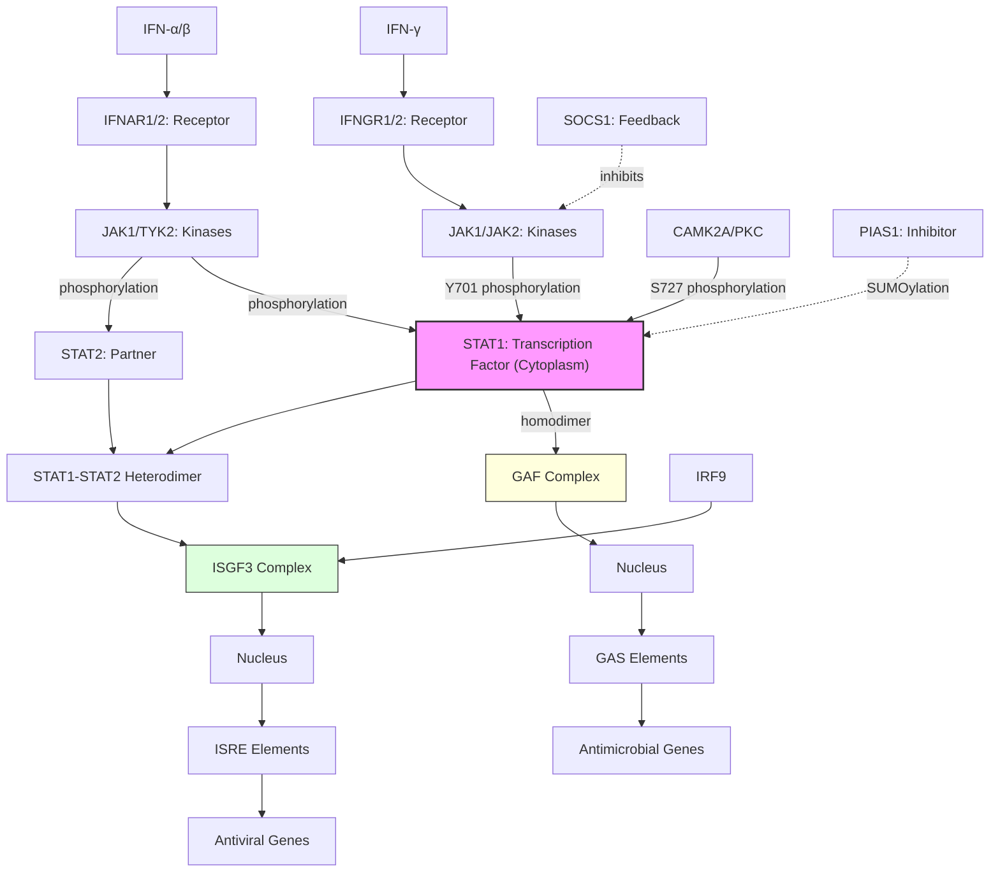

# Pathway Summary for STAT1

## Overview
STAT1 (Signal Transducer and Activator of Transcription 1) is a latent cytoplasmic transcription factor that serves as the central mediator of interferon signaling and other cytokine responses. Upon cytokine stimulation, STAT1 becomes phosphorylated on Y701 by JAK kinases, forms homodimers (GAF complex) or heterodimers with STAT2 (ISGF3 complex), and translocates to the nucleus to regulate gene expression. STAT1 is essential for antiviral and antimicrobial immunity, mediating both type I (IFN-α/β) and type II (IFN-γ) interferon responses.

## Core Signaling Pathways

### Type II Interferon (IFN-γ) Pathway
IFN-γ binding to its receptor activates JAK1/JAK2, which phosphorylate STAT1 on Y701. Phosphorylated STAT1 forms homodimers (GAF - Gamma-Activated Factor) that translocate to the nucleus and bind GAS (Gamma-Activated Sequences) elements to induce antimicrobial and immunomodulatory genes.

### Type I Interferon (IFN-α/β) Pathway
Type I interferons activate JAK1/TYK2, leading to STAT1 and STAT2 phosphorylation. These form a heterotrimeric complex with IRF9 called ISGF3 (Interferon-Stimulated Gene Factor 3) that binds ISRE (Interferon-Stimulated Response Elements) to induce antiviral genes.

### Secondary Phosphorylation and Fine-tuning
STAT1 Ser727 phosphorylation by various kinases including CAMK2A provides additional regulation, enhancing transcriptional activity and allowing integration with other signaling pathways.

## Pathway Diagram

## Upstream Regulators
- **JAK kinases**: JAK1, JAK2, TYK2 phosphorylate STAT1 Y701
- **Serine kinases**: CAMK2A, PKC, p38 MAPK phosphorylate S727
- **Cytokine receptors**: IFNGR (IFN-γ), IFNAR (IFN-α/β), IL-6R, IL-27R
- **Phosphatases**: SHP2, TCPTP dephosphorylate and inactivate STAT1

## Downstream Target Genes

### Antiviral Response
- **ISG15, ISG20**: Interferon-stimulated genes
- **OAS1/2/3**: 2'-5' oligoadenylate synthetases
- **MX1/2**: Myxovirus resistance proteins
- **PKR (EIF2AK2)**: Protein kinase R

### Antimicrobial Response
- **NOS2**: Inducible nitric oxide synthase
- **GBP family**: Guanylate-binding proteins
- **IDO1**: Indoleamine 2,3-dioxygenase

### Immunomodulation
- **PD-L1**: Immune checkpoint ligand
- **MHC class I/II**: Antigen presentation
- **CXCL9/10/11**: Chemokines
- **IRF1**: Secondary transcription factor

## Clinical Significance

### STAT1 Gain-of-Function
Mutations causing hyperactive STAT1 lead to:
- Chronic mucocutaneous candidiasis
- Autoimmunity
- Immunodeficiency

### STAT1 Loss-of-Function
Complete STAT1 deficiency causes:
- Severe susceptibility to viral infections
- Mycobacterial susceptibility
- Impaired IFN responses

## Regulatory Mechanisms
- **Phosphorylation**: Y701 (activation), S727 (enhancement)
- **SUMOylation**: PIAS1-mediated negative regulation
- **Dephosphorylation**: Phosphatases terminate signaling
- **SOCS proteins**: Negative feedback inhibitors
- **Protein degradation**: Ubiquitin-proteasome pathway

## Cross-pathway Integration
STAT1 integrates signals from multiple pathways:
- **Growth factor signaling**: EGF, PDGF can activate STAT1
- **Stress responses**: p38 MAPK pathway
- **Calcium signaling**: CAMK2A-mediated S727 phosphorylation
- **TLR signaling**: Synergy with innate immune responses
