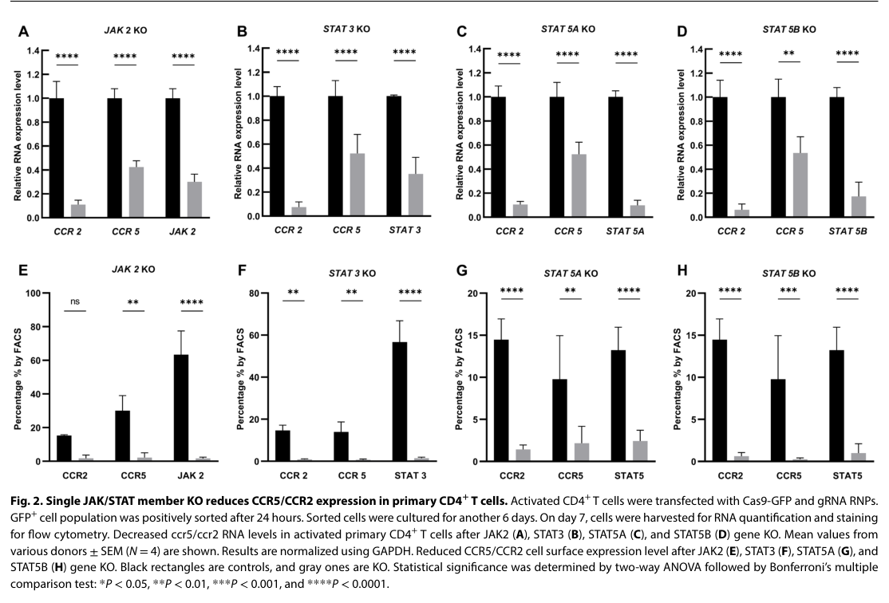

## Question

# Gene Research for Functional Annotation

## ⚠️ CRITICAL: Gene/Protein Identification Context

**BEFORE YOU BEGIN RESEARCH:** You MUST verify you are researching the CORRECT gene/protein. Gene symbols can be ambiguous, especially for less well-characterized genes from non-model organisms.

### Target Gene/Protein Identity (from UniProt):
- **UniProt Accession:** P42229
- **Protein Description:** RecName: Full=Signal transducer and activator of transcription 5A;
- **Gene Information:** Name=STAT5A; Synonyms=STAT5;
- **Organism (full):** Homo sapiens (Human).
- **Protein Family:** Belongs to the transcription factor STAT family.
- **Key Domains:** p53-like_TF_DNA-bd_sf. (IPR008967); SH2. (IPR000980); SH2_dom_sf. (IPR036860); STAT. (IPR001217); STAT5_CC. (IPR046994)

### MANDATORY VERIFICATION STEPS:

1. **Check if the gene symbol "STAT5A" matches the protein description above**
2. **Verify the organism is correct:** Homo sapiens (Human).
3. **Check if protein family/domains align with what you find in literature**
4. **If you find literature for a DIFFERENT gene with the same or similar symbol, STOP**

### If Gene Symbol is Ambiguous or You Cannot Find Relevant Literature:

**DO NOT PROCEED WITH RESEARCH ON A DIFFERENT GENE.** Instead:
- State clearly: "The gene symbol 'STAT5A' is ambiguous or literature is limited for this specific protein"
- Explain what you found (e.g., "Found extensive literature on a different gene with the same symbol in a different organism")
- Describe the protein based ONLY on the UniProt information provided above
- Suggest that the protein function can be inferred from domain/family information

### Research Target:

Please provide a comprehensive research report on the gene **STAT5A** (gene ID: STAT5A, UniProt: P42229) in human.

The research report should be a detailed narrative explaining the function, biological processes, and localization of the gene product. Citations should be given for all claims.

You should prioritize authoritative reviews and primary scientific literature when conducting research. You can supplement
this with annotations you find in gene/protein databases, but these can be outdated or inaccurate.

We are specifically interested in the primary function of the gene - for enzymes, what reaction is catalyzed, and what is the substrate specificity? For transporters, what is the substrate? For structural proteins or adapters, what is the broader structural role? For signaling molecules, what is the role in the pathway.

We are interested in where in or outside the cell the gene product carries out its function.

We are also interested in the signaling or biochemical pathways in which the gene functions. We are less interested in broad pleiotropic effects, except where these elucidate the precise role.

Include evidence where possible. We are interested in both experimental evidence as well as inference from structure, evolution, or bioinformatic analysis. Precise studies should be prioritized over high-throughput, where available.

## Output

Question: You are an expert researcher providing comprehensive, well-cited information.

Provide detailed information focusing on:
1. Key concepts and definitions with current understanding
2. Recent developments and latest research (prioritize 2023-2024 sources)
3. Current applications and real-world implementations
4. Expert opinions and analysis from authoritative sources
5. Relevant statistics and data from recent studies

Format as a comprehensive research report with proper citations. Include URLs and publication dates where available.
Always prioritize recent, authoritative sources and provide specific citations for all major claims.

# Gene Research for Functional Annotation

## ⚠️ CRITICAL: Gene/Protein Identification Context

**BEFORE YOU BEGIN RESEARCH:** You MUST verify you are researching the CORRECT gene/protein. Gene symbols can be ambiguous, especially for less well-characterized genes from non-model organisms.

### Target Gene/Protein Identity (from UniProt):
- **UniProt Accession:** P42229
- **Protein Description:** RecName: Full=Signal transducer and activator of transcription 5A;
- **Gene Information:** Name=STAT5A; Synonyms=STAT5;
- **Organism (full):** Homo sapiens (Human).
- **Protein Family:** Belongs to the transcription factor STAT family.
- **Key Domains:** p53-like_TF_DNA-bd_sf. (IPR008967); SH2. (IPR000980); SH2_dom_sf. (IPR036860); STAT. (IPR001217); STAT5_CC. (IPR046994)

### MANDATORY VERIFICATION STEPS:

1. **Check if the gene symbol "STAT5A" matches the protein description above**
2. **Verify the organism is correct:** Homo sapiens (Human).
3. **Check if protein family/domains align with what you find in literature**
4. **If you find literature for a DIFFERENT gene with the same or similar symbol, STOP**

### If Gene Symbol is Ambiguous or You Cannot Find Relevant Literature:

**DO NOT PROCEED WITH RESEARCH ON A DIFFERENT GENE.** Instead:
- State clearly: "The gene symbol 'STAT5A' is ambiguous or literature is limited for this specific protein"
- Explain what you found (e.g., "Found extensive literature on a different gene with the same symbol in a different organism")
- Describe the protein based ONLY on the UniProt information provided above
- Suggest that the protein function can be inferred from domain/family information

### Research Target:

Please provide a comprehensive research report on the gene **STAT5A** (gene ID: STAT5A, UniProt: P42229) in human.

The research report should be a detailed narrative explaining the function, biological processes, and localization of the gene product. Citations should be given for all claims.

You should prioritize authoritative reviews and primary scientific literature when conducting research. You can supplement
this with annotations you find in gene/protein databases, but these can be outdated or inaccurate.

We are specifically interested in the primary function of the gene - for enzymes, what reaction is catalyzed, and what is the substrate specificity? For transporters, what is the substrate? For structural proteins or adapters, what is the broader structural role? For signaling molecules, what is the role in the pathway.

We are interested in where in or outside the cell the gene product carries out its function.

We are also interested in the signaling or biochemical pathways in which the gene functions. We are less interested in broad pleiotropic effects, except where these elucidate the precise role.

Include evidence where possible. We are interested in both experimental evidence as well as inference from structure, evolution, or bioinformatic analysis. Precise studies should be prioritized over high-throughput, where available.

# Functional Annotation Report: Human STAT5A (UniProt P42229)

## Executive summary

The requested target is correctly identified as **human signal transducer and activator of transcription 5A (STAT5A)**, UniProt **P42229**—not STAT5B and not a non-human protein. STAT5A is a roughly 94-kDa, 794-amino-acid member of the STAT transcription-factor family. Its architecture—N-terminal oligomerization region, STAT5 coiled-coil domain, p53-like DNA-binding fold, linker, SH2 domain, and C-terminal transactivation region—matches the supplied InterPro annotations. Human STAT5A and STAT5B are distinct, adjacent chromosome-17 paralogs with approximately 90–95% protein identity; STAT5B is approximately 787 amino acids and is phosphorylated at Tyr699, whereas STAT5A is activated at **Tyr694**. These distinctions are essential because many papers and commercial antibodies report only combined “STAT5” or pSTAT5A/B activity. (kim2022genomicmutationsof pages 3-4, kim2022genomicmutationsof pages 1-3, hennighausen2008interpretationofcytokine pages 1-2, foley2021immuneandpulmonary pages 22-25)

STAT5A is **not an enzyme or transporter**. It is a cytokine- and hormone-responsive signal-transducing transcription factor. Its best-established primary physiological role is to translate **prolactin receptor–JAK2 signals in mammary epithelium** into nuclear transcriptional programs required for alveolar differentiation, milk-protein expression, and lactation. It also participates—often redundantly with STAT5B—in IL-2-family cytokine signaling, hematopoietic growth-factor responses, survival and proliferation programs, and immune-cell differentiation. (leehy2018progesteronereceptors(pr) pages 4-6, able2017stat5interactingproteinsa pages 3-6, hennighausen2008interpretationofcytokine pages 1-2, kim2022genomicmutationsof pages 8-10)

| Feature | Best-supported annotation | Evidence type / isoform caveat |
|---|---|---|
| Identity | Human **STAT5A**, UniProt **P42229**; a **794-aa** STAT-family transcription factor encoded by a gene on chromosome 17. | Accession-linked protein research plus paralog review; STAT5B is a separate ~787-aa protein and must not be substituted for STAT5A. (kim2022genomicmutationsof pages 1-3) |
| Domains | Conserved **N-terminal**, **coiled-coil**, **DNA-binding**, **linker**, **SH2**, and C-terminal **transactivation** modules, consistent with the supplied STAT, p53-like DNA-binding, SH2, and STAT5 coiled-coil annotations. | Architecture is shared with STAT5B, although sequence divergence is greatest near the C terminus. (kim2022genomicmutationsof pages 1-3, hennighausen2008interpretationofcytokine pages 1-2) |
| Activation | Receptor-associated JAKs phosphorylate **STAT5A Tyr694**; reciprocal phosphotyrosine–SH2 interactions form active dimers. | Tyr694 distinguishes STAT5A from STAT5B Tyr699; generic pSTAT5 antibodies often cannot distinguish the paralogs. (kim2022genomicmutationsof pages 3-4, foley2021immuneandpulmonary pages 22-25) |
| DNA recognition and localization | Activated dimers accumulate in the nucleus and bind **GAS elements, TTCNNNGAA**. The coiled-coil region contains an importin-interacting nuclear-localization signal; unphosphorylated STAT5 also shuttles between nucleus and cytoplasm. | Conserved STAT5 mechanism; DNA complexes may contain STAT5A, STAT5B, or both, depending on context. (kim2022genomicmutationsof pages 3-4, kim2022genomicmutationsof pages 1-3) |
| Primary physiological role | The clearest STAT5A-weighted function is transduction of **prolactin–PRLR–JAK2** signals in mammary epithelium, supporting alveolar differentiation, milk-protein transcription, and lactation. | Genetic and physiological evidence favors STAT5A in mammary tissue, although STAT5B can partly compensate and many experiments measure combined STAT5A/B. (leehy2018progesteronereceptors(pr) pages 4-6, hennighausen2008interpretationofcytokine pages 1-2, kim2022genomicmutationsof pages 8-10) |
| IL-2 and Treg biology | IL-2 receptor signaling activates STAT5 to promote thymic Treg maturation, survival, functional programming, and **FOXP3** expression. | Authoritative 2024 synthesis, but most underlying experiments are pan-STAT5 or mouse studies; the role is not exclusively attributable to human STAT5A. (shouse2024interleukin2signalingin pages 3-4) |
| 2024 CCR5/CCR2 finding | In primary human CD4+ T cells from four donors, CRISPR disruption reduced **STAT5A RNA by about 90%** and cell-surface **CCR5 about fivefold**, with CCR2 also decreased. | Direct, isoform-specific human-cell evidence; off-target mutations were not evaluated, and the mechanism may be indirect. (wang2024jakstatsignalingpathway pages 3-5, wang2024jakstatsignalingpathway pages 5-6, wang2024jakstatsignalingpathway media 8a8d1325) |
| Disease interpretation | Persistent STAT5 signaling can sustain survival, proliferation, and transformation, but effects are tissue- and paralog-dependent; STAT5A can also support differentiation or tumor-suppressive programs. | Open Targets associations do not establish causality. Recent breast and pancreatic studies measured pSTAT5 or pan-STAT5 rather than STAT5A specifically. (OpenTargets Search: -STAT5A, lin2024pancreaticstat5activation pages 7-8, hathaway2023prolactinlevelsand pages 1-2, hathaway2023prolactinlevelsand pages 6-7) |
| Therapeutic interpretation | Approved **JAK inhibitors** can indirectly reduce signaling through STAT5A and other STATs; proposed uses include cancer and immune modulation and reducing CCR5-mediated HIV susceptibility. | Real-world drugs target upstream JAKs, not STAT5A, and have broad pathway effects; the HIV application remains experimental. (wang2024jakstatsignalingpathway pages 1-2, wang2024jakstatsignalingpathway pages 5-6) |
| Direct inhibitor status | Direct STAT5 inhibitors, including the reported STAT5A-selective compound **Stafia-1**, remain research or preclinical agents; no clinically approved direct STAT5A inhibitor was established. | Selectivity and cellular activity need further validation; many candidates inhibit both paralogs or preferentially target STAT5B. (orlova2019directtargetingoptions pages 15-16, orlova2019directtargetingoptions pages 9-10) |

*Table: Compact evidence table defining human STAT5A identity, mechanism, physiological roles, recent findings, and therapeutic status. Isoform-specific evidence is distinguished from pan-STAT5 and STAT5B findings.*

## 1. Identity verification and domain consistency

### Required verification

1. **Symbol and description:** The literature consistently uses **STAT5A** for signal transducer and activator of transcription 5A. A protein study explicitly used the human STAT5 sequence under accession P42229, while comparative reviews identify STAT5A as the 794-aa member of the STAT5 paralog pair. (kim2022genomicmutationsof pages 1-3)
2. **Organism:** The target is **Homo sapiens**. No evidence encountered required substituting a similarly named gene from another organism.
3. **Family and domains:** The literature describes the conserved STAT arrangement of N-terminal, coiled-coil, DNA-binding, linker, SH2, and C-terminal transactivation modules. This agrees with the supplied STAT, STAT5_CC, p53-like transcription-factor DNA-binding, and SH2 annotations. (orlova2019directtargetingoptions pages 1-3, kim2022genomicmutationsof pages 1-3, hennighausen2008interpretationofcytokine pages 1-2)
4. **Paralog exclusion:** STAT5B is a different protein. It is especially prominent in growth-hormone signaling, hepatic transcription, body growth, and several lymphoid malignancies. Findings specific to STAT5B—including Tyr699 phosphorylation or STAT5B N642H disease biology—should not be assigned to P42229. (araujo2019structuralimplicationsof pages 7-8, kim2022genomicmutationsof pages 3-4, hennighausen2008interpretationofcytokine pages 1-2)

Published sequence lengths vary by one residue in older reviews—793 versus 794 aa for STAT5A and 786 versus 787 aa for STAT5B—probably because of sequence-version or initiator-count conventions. The current target specification and recent review support **794 aa for human STAT5A**. (kim2022genomicmutationsof pages 1-3, hennighausen2008interpretationofcytokine pages 1-2, foley2021immuneandpulmonary pages 22-25)

## 2. Molecular function and activation cycle

STAT5A functions as a direct bridge between activated cell-surface cytokine receptors and gene regulation:

1. A ligand such as prolactin, IL-2-family cytokine, erythropoietin, thrombopoietin, GM-CSF, or another hematopoietic cytokine activates a receptor-associated Janus kinase.
2. JAKs phosphorylate receptor cytoplasmic tyrosines, producing SH2-domain docking sites, and then phosphorylate STAT5A at **Tyr694**.
3. Phosphorylated STAT5A molecules form parallel dimers through reciprocal interactions between Tyr694-containing phosphopeptides and the partner SH2 domain. STAT5A can form homodimers and, depending on the cell, heterodimers with STAT5B.
4. Activated dimers accumulate in the nucleus, bind DNA, and recruit transcriptional coactivators or corepressors through the C-terminal transactivation region.
5. Phosphatases, SOCS proteins, receptor turnover, nuclear export, and other interacting proteins terminate or reshape the response. (araujo2019structuralimplicationsof pages 1-3, orlova2019directtargetingoptions pages 1-3, kim2022genomicmutationsof pages 3-4, able2017stat5interactingproteinsa pages 3-6)

The principal recognition sequence is the gamma-interferon-activated sequence or **GAS motif, TTCNNNGAA**. Closely spaced low-affinity GAS elements can support higher-order STAT5 oligomers through the N-terminal region, potentially changing promoter selectivity and transcriptional output. (orlova2019directtargetingoptions pages 1-3, kim2022genomicmutationsof pages 3-4)

### Functional contribution of the domains

- **N-terminal domain:** stabilizes higher-order oligomers and contributes to regulatory protein interactions.
- **Coiled-coil domain:** mediates receptor/cofactor interactions and contains an unconventional nuclear-localization signal that engages import machinery.
- **DNA-binding domain:** provides sequence recognition and also contains a nuclear-export determinant.
- **Linker:** structurally couples the DNA-binding and SH2 regions.
- **SH2 domain:** recognizes phosphorylated receptors and mediates phosphotyrosine-dependent dimerization. The high similarity of STAT5A and STAT5B SH2 domains helps explain their overlap, although local sequence differences may alter phosphopeptide selectivity.
- **C-terminal transactivation domain:** recruits factors such as p300/CBP and NCoA-1/SRC-1 and contains regulatory phosphorylation sites; this is one of the more divergent regions between STAT5A and STAT5B. (araujo2019structuralimplicationsof pages 1-3, araujo2019structuralimplicationsof pages 7-8, kim2022genomicmutationsof pages 1-3, able2017stat5interactingproteinsa pages 3-6)

## 3. Subcellular localization

Inactive STAT5A is commonly described as predominantly **cytoplasmic**, where it can associate with receptors and signaling complexes. This is not an absolute compartmental boundary: unphosphorylated STAT5 undergoes constitutive nucleocytoplasmic shuttling. Cytokine-induced Tyr694 phosphorylation, dimerization, and importin recognition shift the steady state toward **nuclear accumulation**. There, STAT5A binds promoters and enhancers and recruits transcriptional machinery. DNA-binding-domain and N-terminal export signals permit return to the cytoplasm after dephosphorylation. (orlova2019directtargetingoptions pages 1-3, kim2022genomicmutationsof pages 3-4, kim2022genomicmutationsof pages 1-3)

Accordingly, immunohistochemical “nuclear pSTAT5” is often used as a pathway-activation marker. However, most pSTAT5 antibodies recognize the highly conserved phosphorylated region and do **not** reliably distinguish pSTAT5A from pSTAT5B. Nuclear pSTAT5 should therefore not automatically be annotated as STAT5A-specific. (hathaway2023prolactinlevelsand pages 1-2, foley2021immuneandpulmonary pages 22-25)

## 4. Principal pathways and biological processes

### 4.1 Prolactin–PRLR–JAK2 signaling in mammary epithelium

This is the clearest STAT5A-weighted physiological pathway. Prolactin binding reorganizes the prolactin receptor complex, activates JAK2, and induces STAT5 phosphorylation and nuclear localization. STAT5-dependent transcription promotes mammary alveolar specification and differentiation, epithelial survival, and expression of milk proteins during late pregnancy and lactation. STAT5A predominates in mammary tissue, and Stat5a loss in mouse models produces a much stronger mammary differentiation/lactation phenotype than Stat5b loss, although the paralogs retain partial redundancy. (leehy2018progesteronereceptors(pr) pages 4-6, hennighausen2008interpretationofcytokine pages 1-2, kim2022genomicmutationsof pages 8-10)

Relevant downstream programs include milk-protein genes, CISH/SOCS feedback regulators, and genes controlling epithelial proliferation and differentiation. STAT5A also integrates progesterone-receptor signaling: PR-B can support STAT5A-dependent transcription, and STAT5A has been reported as a coactivator at progesterone-responsive genes including RANKL, WNT4, and AREG. (leehy2018progesteronereceptors(pr) pages 4-6, able2017stat5interactingproteinsa pages 3-6)

### 4.2 IL-2-family cytokines and immune regulation

IL-2 receptor signaling uses JAK1/JAK3 and STAT5 to regulate T-cell proliferation, survival, differentiation, and tolerance. A 2024 authoritative review concludes that IL-2-driven STAT5 activity is central to thymic regulatory-T-cell maturation and peripheral Treg maintenance. STAT5 binds regulatory elements controlling **FOXP3**, including a response element in the CNS0 enhancer. Loss of IL-2, CD25, or CD122 in mice causes severe Treg deficiency and lethal lymphoproliferative autoimmunity. (shouse2024interleukin2signalingin pages 3-4)

This pathway should be annotated as **STAT5A/STAT5B-mediated**, not uniquely STAT5A-mediated. STAT5B is often especially important in human growth and immune phenotypes, while the degree of functional compensation depends on cell type, expression level, and cytokine strength. (kim2022genomicmutationsof pages 3-4, hennighausen2008interpretationofcytokine pages 1-2, foley2021immuneandpulmonary pages 22-25)

### 4.3 Other cytokine and growth-factor pathways

STAT5A can be activated downstream of erythropoietin, thrombopoietin, GM-CSF/IL-3-family receptors, growth hormone, and oncogenic tyrosine kinases. Common transcriptional outputs include **CISH/SOCS**, D-type cyclins, BCL2-family survival genes, MYC, and lineage-specific differentiation genes. Exact target selection is determined by receptor context, STAT5A/STAT5B abundance, chromatin accessibility, GAS-site arrangement, and cooperating transcription factors. (araujo2019structuralimplicationsof pages 1-3, able2017stat5interactingproteinsa pages 3-6, hennighausen2008interpretationofcytokine pages 1-2)

### 4.4 Negative regulation

SOCS proteins provide inducible negative feedback by inhibiting JAK/receptor signaling. Protein tyrosine phosphatases dephosphorylate receptors or STAT5, while corepressors including SMRT and SHD1 can inhibit transcriptional activity. SOCS7 suppresses prolactin- or leptin-induced STAT5 activation. These controls normally make STAT5A activation transient; persistent phosphorylation generally indicates chronic cytokine exposure, upstream oncogenic kinase activity, defective negative feedback, or altered post-translational regulation. (able2017stat5interactingproteinsa pages 3-6, hennighausen2008interpretationofcytokine pages 1-2)

## 5. Recent research and quantitative findings

### 5.1 STAT5A regulates CCR5/CCR2 in human CD4 T cells—2024

Wang and colleagues, published **20 March 2024** in *Science Advances*, used CRISPR–Cas9 in activated primary CD4-positive T cells from four healthy donors. STAT5A RNA was reduced by approximately **90%**; STAT5A knockout significantly reduced CCR2 and CCR5 RNA and surface protein, with surface CCR5 falling approximately **fivefold**. Parallel STAT5B, STAT3, and JAK2 knockouts also reduced the receptors, so the pathway is distributed rather than uniquely STAT5A-dependent. The authors also found that six of nine tested JAK/STAT inhibitors reduced CCR5/CCR2 and that treated cells were relatively resistant to R5-tropic HIV entry. DOI/URL: https://doi.org/10.1126/sciadv.adl0368. (wang2024jakstatsignalingpathway pages 1-2, wang2024jakstatsignalingpathway pages 3-5, wang2024jakstatsignalingpathway pages 5-6)

The inspected Figure 2 directly confirms the significant reductions in CCR2/CCR5 RNA and cell-surface staining after STAT5A knockout. It is among the strongest recent pieces of **isoform-specific human-cell evidence** for STAT5A. Nevertheless, the authors did not evaluate all CRISPR off-target mutations, and prior T-cell ChIP studies did not consistently show direct STAT5A binding at CCR5; mediation through SGK1 or another intermediate remains plausible. (wang2024jakstatsignalingpathway pages 3-5, wang2024jakstatsignalingpathway pages 5-6, wang2024jakstatsignalingpathway media 8a8d1325)

### 5.2 Prolactin, pSTAT5, and breast-cancer risk—2023

A 2023 nested case-control analysis in the Nurses’ Health Study included **745 cases and 2,454 matched controls**. Among premenopausal women, plasma prolactin above 11 ng/mL was associated with pSTAT5-nuclear-positive tumors (OR **2.30**, 95% CI 1.02–5.22), pSTAT5-cytoplasmic-positive tumors (OR **1.64**, 95% CI 1.01–2.65), and tumors positive in both compartments (OR **2.88**, 95% CI 1.14–7.25). Among 577 postmenopausal cases, prolactin above 11 ng/mL was associated with overall breast-cancer risk (OR **1.37**, 95% CI 1.12–1.67), but differences by pSTAT5 status were not statistically compelling. Published March 2023; DOI/URL: https://doi.org/10.1186/s13058-023-01618-3. (hathaway2023prolactinlevelsand pages 1-2, hathaway2023prolactinlevelsand pages 6-7)

This study is clinically relevant but **not STAT5A-specific**: immunohistochemical pSTAT5 could represent STAT5A, STAT5B, or both. Its authors also concluded that prolactin may operate through alternative pathways, particularly in postmenopausal disease. (hathaway2023prolactinlevelsand pages 1-2, hathaway2023prolactinlevelsand pages 6-7)

### 5.3 Pancreatic cancer—2024 pan-STAT5 evidence

A 2024 *Gut* study reported increased STAT5 expression/phosphorylation in human pancreatic ductal adenocarcinoma and poorer prognosis with high tumor-cell STAT5. Conditional Stat5 deletion reduced KRAS-driven or pancreatitis-driven acinar-to-ductal metaplasia and neoplasia in mouse models. Pharmacological inhibition was tested in orthotopic models, patient-derived xenografts, and KPC mice; several comparisons used **n=7**, with a survival experiment using **n=9**. The proposed mechanism included IL-22-enhanced STAT5 activation and direct STAT5 occupancy at HNF1B and HNF4A regulatory regions. Published July 2024; DOI/URL: https://doi.org/10.1136/gutjnl-2024-332225. (lin2024pancreaticstat5activation pages 7-8, lin2024pancreaticstat5activation pages 5-6)

This is important translational evidence for the STAT5 axis, but the reported deletion, staining, and inhibitor experiments did not resolve STAT5A from STAT5B. It therefore cannot establish a pancreatic-cancer function unique to P42229. (lin2024pancreaticstat5activation pages 7-8, lin2024pancreaticstat5activation pages 5-6)

## 6. Disease relevance and expert interpretation

Persistent STAT5 activity can drive proliferation, survival, stemness, and resistance in leukemia and some solid tumors. However, experts emphasize that “STAT5” is not a uniformly oncogenic entity. STAT5A can promote differentiation and has been associated with tumor-suppressive behavior in some settings, whereas STAT5B is the more frequent direct mutational driver in T-cell neoplasia and BCR–ABL leukemia. In mammary tumors, active STAT5 may support early tumor growth yet correlate with a more differentiated, less invasive state and be lost during metastatic progression. (radler2017crosstalkbetweenstat5 pages 13-15, araujo2019structuralimplicationsof pages 7-8, araujo2019structuralimplicationsof pages 20-21)

Open Targets links STAT5A with cancer, AML, breast cancer, asthma, and dermatitis, but association scores are evidence-aggregation metrics rather than proof that STAT5A is causal or druggable in each disease. The aggregate cancer score was higher than the individual breast-cancer association in the retrieved results, illustrating that broad pathway evidence can outweigh isoform-specific genetics. (OpenTargets Search: -STAT5A)

The key expert caution is therefore methodological: results from pSTAT5 antibodies, pan-STAT5 inhibitors, or combined Stat5a/b deletion should be annotated as **STAT5-pathway evidence** unless the experiment separately manipulates or measures STAT5A. This substantially lowers confidence in many nominally “STAT5A” cancer claims but increases confidence in the mammary genetic evidence and the 2024 STAT5A-specific CD4-T-cell knockout result.

## 7. Current applications and therapeutic implementation

### Established implementation

Clinically used JAK inhibitors—including ruxolitinib, tofacitinib, and baricitinib—can indirectly reduce STAT5 signaling. Their approved uses are based on JAK inhibition, not selective STAT5A targeting, and they affect several STAT proteins and cytokine pathways. In the 2024 CD4-T-cell study, ruxolitinib and tofacitinib reduced CCR5 expression; this creates a plausible HIV-related repurposing strategy, but it remains experimental and is not evidence that STAT5A inhibition is an established HIV treatment. (wang2024jakstatsignalingpathway pages 1-2, wang2024jakstatsignalingpathway pages 5-6)

### Direct STAT5 targeting

Direct approaches include SH2-interface inhibitors, DNA-binding inhibitors, and compounds intended to distinguish STAT5A from STAT5B. IST5-002 inhibits both paralogs at low-micromolar cellular concentrations. Stafib compounds preferentially target STAT5B; reported biochemical IC50 values were 0.044 μM for Stafib-1 and 0.009 μM for Stafib-2, with cellular activity around 1.5 μM. **Stafia-1** has been reported as STAT5A-selective, but the available evidence is preclinical. No clinically approved, direct STAT5A-selective drug was established by the reviewed literature. (orlova2019directtargetingoptions pages 15-16, orlova2019directtargetingoptions pages 9-10)

Selective inhibition is biologically challenging because the paralogs have highly similar SH2 and DNA-binding surfaces and because normal STAT5 signaling supports hematopoiesis, immune tolerance, and mammary function. A successful therapeutic strategy will probably require disease-specific biomarkers, transient dosing, or targeting a pathogenic upstream receptor/kinase rather than systemic STAT5A ablation. (araujo2019structuralimplicationsof pages 1-3, araujo2019structuralimplicationsof pages 7-8, kim2022genomicmutationsof pages 3-4)

## 8. Confidence-weighted functional annotation

**Primary annotation—high confidence:** STAT5A is a nucleocytoplasmic, cytokine-responsive transcription factor. Receptor-associated JAK phosphorylation at Tyr694 drives SH2-mediated dimerization, nuclear accumulation, binding to GAS elements, and transcriptional regulation. (araujo2019structuralimplicationsof pages 1-3, kim2022genomicmutationsof pages 3-4, kim2022genomicmutationsof pages 1-3)

**Principal physiological specialization—high confidence:** STAT5A is the mammary-predominant STAT5 paralog and a central effector of prolactin–PRLR–JAK2 signaling during alveolar differentiation and lactogenesis. (leehy2018progesteronereceptors(pr) pages 4-6, hennighausen2008interpretationofcytokine pages 1-2, kim2022genomicmutationsof pages 8-10)

**Immune annotation—moderate-to-high confidence:** STAT5A contributes with STAT5B to IL-2-family cytokine responses, T-cell proliferation and survival, and Treg/FOXP3 programming. Assignment exclusively to STAT5A is usually unsupported. (shouse2024interleukin2signalingin pages 3-4, kim2022genomicmutationsof pages 3-4)

**Recent human-cell extension—moderate confidence:** STAT5A positively influences CCR5/CCR2 expression in activated primary human CD4 T cells; this may be indirect and requires confirmation in larger donor cohorts and in vivo. (wang2024jakstatsignalingpathway pages 3-5, wang2024jakstatsignalingpathway pages 5-6, wang2024jakstatsignalingpathway media 8a8d1325)

**Cancer annotation—context-dependent:** Constitutive STAT5 signaling can be oncogenic, but isoform, tissue, stage, and differentiation state determine outcome. Pan-STAT5 observations should not be converted into STAT5A-specific claims. (orlova2019directtargetingoptions pages 1-3, radler2017crosstalkbetweenstat5 pages 13-15, araujo2019structuralimplicationsof pages 7-8)

In sum, the most defensible concise annotation for **P42229** is: **a human JAK-activated transcription factor that converts cytokine and hormone receptor signals—most characteristically prolactin signals in mammary epithelium—into GAS-element-dependent nuclear transcription, with additional partly redundant roles in immune and hematopoietic cytokine responses.**

References

1. (kim2022genomicmutationsof pages 3-4): Uijin Kim and Ha Youn Shin. Genomic mutations of the stat5 transcription factor are associated with human cancer and immune diseases. International Journal of Molecular Sciences, 23:11297, Sep 2022. URL: https://doi.org/10.3390/ijms231911297, doi:10.3390/ijms231911297. This article has 18 citations.

2. (kim2022genomicmutationsof pages 1-3): Uijin Kim and Ha Youn Shin. Genomic mutations of the stat5 transcription factor are associated with human cancer and immune diseases. International Journal of Molecular Sciences, 23:11297, Sep 2022. URL: https://doi.org/10.3390/ijms231911297, doi:10.3390/ijms231911297. This article has 18 citations.

3. (hennighausen2008interpretationofcytokine pages 1-2): Lothar Hennighausen and Gertraud W. Robinson. Interpretation of cytokine signaling through the transcription factors stat5a and stat5b. Genes & development, 22 6:711-21, Mar 2008. URL: https://doi.org/10.1101/gad.1643908, doi:10.1101/gad.1643908. This article has 490 citations and is from a highest quality peer-reviewed journal.

4. (foley2021immuneandpulmonary pages 22-25): CL Foley. Immune and pulmonary dysfunction associated with human stat5b deficiency. Unknown journal, 2021.

5. (leehy2018progesteronereceptors(pr) pages 4-6): Katherine A. Leehy, Thu H. Truong, Laura J. Mauro, and Carol A. Lange. Progesterone receptors (pr) mediate stat actions: pr and prolactin receptor signaling crosstalk in breast cancer models. The Journal of Steroid Biochemistry and Molecular Biology, 176:88-93, Feb 2018. URL: https://doi.org/10.1016/j.jsbmb.2017.04.011, doi:10.1016/j.jsbmb.2017.04.011. This article has 67 citations.

6. (able2017stat5interactingproteinsa pages 3-6): Ashley Able, Jasmine Burrell, and Jacqueline Stephens. Stat5-interacting proteins: a synopsis of proteins that regulate stat5 activity. Biology, 6:20, Mar 2017. URL: https://doi.org/10.3390/biology6010020, doi:10.3390/biology6010020. This article has 75 citations.

7. (kim2022genomicmutationsof pages 8-10): Uijin Kim and Ha Youn Shin. Genomic mutations of the stat5 transcription factor are associated with human cancer and immune diseases. International Journal of Molecular Sciences, 23:11297, Sep 2022. URL: https://doi.org/10.3390/ijms231911297, doi:10.3390/ijms231911297. This article has 18 citations.

8. (shouse2024interleukin2signalingin pages 3-4): Acacia N. Shouse, Kathryn M. LaPorte, and Thomas R. Malek. Interleukin-2 signaling in the regulation of t cell biology in autoimmunity and cancer. Immunity, 57 3:414-428, Mar 2024. URL: https://doi.org/10.1016/j.immuni.2024.02.001, doi:10.1016/j.immuni.2024.02.001. This article has 207 citations and is from a highest quality peer-reviewed journal.

9. (wang2024jakstatsignalingpathway pages 3-5): Lingyun Wang, Yunus Yukselten, Julius Nuwagaba, and Richard E. Sutton. Jak/stat signaling pathway affects ccr5 expression in human cd4 + t cells. Mar 2024. URL: https://doi.org/10.1126/sciadv.adl0368, doi:10.1126/sciadv.adl0368. This article has 58 citations and is from a highest quality peer-reviewed journal.

10. (wang2024jakstatsignalingpathway pages 5-6): Lingyun Wang, Yunus Yukselten, Julius Nuwagaba, and Richard E. Sutton. Jak/stat signaling pathway affects ccr5 expression in human cd4 + t cells. Mar 2024. URL: https://doi.org/10.1126/sciadv.adl0368, doi:10.1126/sciadv.adl0368. This article has 58 citations and is from a highest quality peer-reviewed journal.

11. (wang2024jakstatsignalingpathway media 8a8d1325): Lingyun Wang, Yunus Yukselten, Julius Nuwagaba, and Richard E. Sutton. Jak/stat signaling pathway affects ccr5 expression in human cd4 + t cells. Mar 2024. URL: https://doi.org/10.1126/sciadv.adl0368, doi:10.1126/sciadv.adl0368. This article has 58 citations and is from a highest quality peer-reviewed journal.

12. (OpenTargets Search: -STAT5A): Open Targets Query (-STAT5A, 5 results). Buniello, A. et al. (2025). Open Targets Platform: facilitating therapeutic hypotheses building in drug discovery. Nucleic Acids Research.

13. (lin2024pancreaticstat5activation pages 7-8): Yuli Lin, Shaofeng Pu, Jun Wang, Yaqi Wan, Zhihao Wu, Yangyang Guo, Wenxue Feng, Ying Ying, Shuai Ma, Xiang Jun Meng, Wenquan Wang, Liang Liu, Qing Xia, and Xuguang Yang. Pancreatic stat5 activation promotes krasg12d-induced and inflammation-induced acinar-to-ductal metaplasia and pancreatic cancer. Gut, 73:1831-1843, Jul 2024. URL: https://doi.org/10.1136/gutjnl-2024-332225, doi:10.1136/gutjnl-2024-332225. This article has 23 citations and is from a highest quality peer-reviewed journal.

14. (hathaway2023prolactinlevelsand pages 1-2): Cassandra A. Hathaway, Megan S. Rice, Laura C. Collins, Dilys Chen, David A. Frank, Sarah Walker, Charles V. Clevenger, Rulla M. Tamimi, Shelley S. Tworoger, and Susan E. Hankinson. Prolactin levels and breast cancer risk by tumor expression of prolactin-related markers. Breast Cancer Research : BCR, Mar 2023. URL: https://doi.org/10.1186/s13058-023-01618-3, doi:10.1186/s13058-023-01618-3. This article has 26 citations.

15. (hathaway2023prolactinlevelsand pages 6-7): Cassandra A. Hathaway, Megan S. Rice, Laura C. Collins, Dilys Chen, David A. Frank, Sarah Walker, Charles V. Clevenger, Rulla M. Tamimi, Shelley S. Tworoger, and Susan E. Hankinson. Prolactin levels and breast cancer risk by tumor expression of prolactin-related markers. Breast Cancer Research : BCR, Mar 2023. URL: https://doi.org/10.1186/s13058-023-01618-3, doi:10.1186/s13058-023-01618-3. This article has 26 citations.

16. (wang2024jakstatsignalingpathway pages 1-2): Lingyun Wang, Yunus Yukselten, Julius Nuwagaba, and Richard E. Sutton. Jak/stat signaling pathway affects ccr5 expression in human cd4 + t cells. Mar 2024. URL: https://doi.org/10.1126/sciadv.adl0368, doi:10.1126/sciadv.adl0368. This article has 58 citations and is from a highest quality peer-reviewed journal.

17. (orlova2019directtargetingoptions pages 15-16): Anna Orlova, Christina Wagner, Elvin D. de Araujo, Dávid Bajusz, Heidi A. Neubauer, Marco Herling, Patrick T. Gunning, György M. Keserű, and Richard Moriggl. Direct targeting options for stat3 and stat5 in cancer. Cancers, 11:1930, Dec 2019. URL: https://doi.org/10.3390/cancers11121930, doi:10.3390/cancers11121930. This article has 103 citations.

18. (orlova2019directtargetingoptions pages 9-10): Anna Orlova, Christina Wagner, Elvin D. de Araujo, Dávid Bajusz, Heidi A. Neubauer, Marco Herling, Patrick T. Gunning, György M. Keserű, and Richard Moriggl. Direct targeting options for stat3 and stat5 in cancer. Cancers, 11:1930, Dec 2019. URL: https://doi.org/10.3390/cancers11121930, doi:10.3390/cancers11121930. This article has 103 citations.

19. (orlova2019directtargetingoptions pages 1-3): Anna Orlova, Christina Wagner, Elvin D. de Araujo, Dávid Bajusz, Heidi A. Neubauer, Marco Herling, Patrick T. Gunning, György M. Keserű, and Richard Moriggl. Direct targeting options for stat3 and stat5 in cancer. Cancers, 11:1930, Dec 2019. URL: https://doi.org/10.3390/cancers11121930, doi:10.3390/cancers11121930. This article has 103 citations.

20. (araujo2019structuralimplicationsof pages 7-8): Elvin D. de Araujo, Anna Orlova, Heidi A. Neubauer, Dávid Bajusz, Hyuk-Soo Seo, Sirano Dhe-Paganon, György M. Keserű, Richard Moriggl, and Patrick T. Gunning. Structural implications of stat3 and stat5 sh2 domain mutations. Cancers, 11:1757, Nov 2019. URL: https://doi.org/10.3390/cancers11111757, doi:10.3390/cancers11111757. This article has 82 citations.

21. (araujo2019structuralimplicationsof pages 1-3): Elvin D. de Araujo, Anna Orlova, Heidi A. Neubauer, Dávid Bajusz, Hyuk-Soo Seo, Sirano Dhe-Paganon, György M. Keserű, Richard Moriggl, and Patrick T. Gunning. Structural implications of stat3 and stat5 sh2 domain mutations. Cancers, 11:1757, Nov 2019. URL: https://doi.org/10.3390/cancers11111757, doi:10.3390/cancers11111757. This article has 82 citations.

22. (lin2024pancreaticstat5activation pages 5-6): Yuli Lin, Shaofeng Pu, Jun Wang, Yaqi Wan, Zhihao Wu, Yangyang Guo, Wenxue Feng, Ying Ying, Shuai Ma, Xiang Jun Meng, Wenquan Wang, Liang Liu, Qing Xia, and Xuguang Yang. Pancreatic stat5 activation promotes krasg12d-induced and inflammation-induced acinar-to-ductal metaplasia and pancreatic cancer. Gut, 73:1831-1843, Jul 2024. URL: https://doi.org/10.1136/gutjnl-2024-332225, doi:10.1136/gutjnl-2024-332225. This article has 23 citations and is from a highest quality peer-reviewed journal.

23. (radler2017crosstalkbetweenstat5 pages 13-15): Patrick D. Rädler, Barbara L. Wehde, and Kay-Uwe Wagner. Crosstalk between stat5 activation and pi3k/akt functions in normal and transformed mammary epithelial cells. Molecular and Cellular Endocrinology, 451:31-39, Aug 2017. URL: https://doi.org/10.1016/j.mce.2017.04.025, doi:10.1016/j.mce.2017.04.025. This article has 108 citations and is from a peer-reviewed journal.

24. (araujo2019structuralimplicationsof pages 20-21): Elvin D. de Araujo, Anna Orlova, Heidi A. Neubauer, Dávid Bajusz, Hyuk-Soo Seo, Sirano Dhe-Paganon, György M. Keserű, Richard Moriggl, and Patrick T. Gunning. Structural implications of stat3 and stat5 sh2 domain mutations. Cancers, 11:1757, Nov 2019. URL: https://doi.org/10.3390/cancers11111757, doi:10.3390/cancers11111757. This article has 82 citations.

## Artifacts

- [Edison artifact artifact-00](STAT5A-deep-research-falcon_artifacts/artifact-00.md)

## Citations

1. kim2022genomicmutationsof pages 1-3
2. kim2022genomicmutationsof pages 3-4
3. hennighausen2008interpretationofcytokine pages 1-2
4. foley2021immuneandpulmonary pages 22-25
5. kim2022genomicmutationsof pages 8-10
6. wang2024jakstatsignalingpathway pages 3-5
7. wang2024jakstatsignalingpathway pages 5-6
8. hathaway2023prolactinlevelsand pages 1-2
9. hathaway2023prolactinlevelsand pages 6-7
10. wang2024jakstatsignalingpathway pages 1-2
11. orlova2019directtargetingoptions pages 15-16
12. orlova2019directtargetingoptions pages 9-10
13. orlova2019directtargetingoptions pages 1-3
14. araujo2019structuralimplicationsof pages 7-8
15. araujo2019structuralimplicationsof pages 1-3
16. araujo2019structuralimplicationsof pages 20-21
17. https://doi.org/10.1126/sciadv.adl0368.
18. https://doi.org/10.1186/s13058-023-01618-3.
19. https://doi.org/10.1136/gutjnl-2024-332225.
20. https://doi.org/10.3390/ijms231911297,
21. https://doi.org/10.1101/gad.1643908,
22. https://doi.org/10.1016/j.jsbmb.2017.04.011,
23. https://doi.org/10.3390/biology6010020,
24. https://doi.org/10.1016/j.immuni.2024.02.001,
25. https://doi.org/10.1126/sciadv.adl0368,
26. https://doi.org/10.1136/gutjnl-2024-332225,
27. https://doi.org/10.1186/s13058-023-01618-3,
28. https://doi.org/10.3390/cancers11121930,
29. https://doi.org/10.3390/cancers11111757,
30. https://doi.org/10.1016/j.mce.2017.04.025,