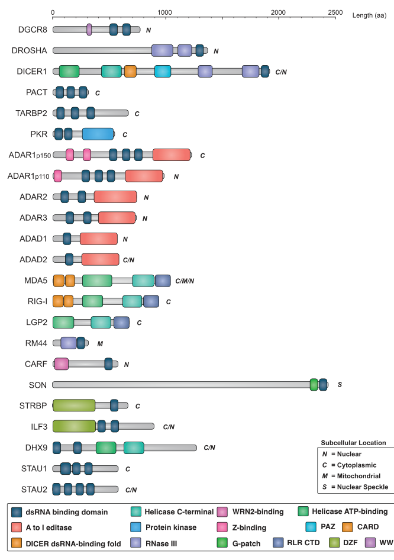

## Question

# Gene Research for Functional Annotation

## ⚠️ CRITICAL: Gene/Protein Identification Context

**BEFORE YOU BEGIN RESEARCH:** You MUST verify you are researching the CORRECT gene/protein. Gene symbols can be ambiguous, especially for less well-characterized genes from non-model organisms.

### Target Gene/Protein Identity (from UniProt):
- **UniProt Accession:** Q9NUL3
- **Protein Description:** RecName: Full=Double-stranded RNA-binding protein Staufen homolog 2;
- **Gene Information:** Name=STAU2;
- **Organism (full):** Homo sapiens (Human).
- **Protein Family:** Not specified in UniProt
- **Key Domains:** DRBM-containing_protein. (IPR051740); dsRBD_dom. (IPR014720); STAU2_DSRM_2. (IPR044464); STAU2_DSRM_3. (IPR044473); STAU2_DSRM_4. (IPR044474)

### MANDATORY VERIFICATION STEPS:

1. **Check if the gene symbol "STAU2" matches the protein description above**
2. **Verify the organism is correct:** Homo sapiens (Human).
3. **Check if protein family/domains align with what you find in literature**
4. **If you find literature for a DIFFERENT gene with the same or similar symbol, STOP**

### If Gene Symbol is Ambiguous or You Cannot Find Relevant Literature:

**DO NOT PROCEED WITH RESEARCH ON A DIFFERENT GENE.** Instead:
- State clearly: "The gene symbol 'STAU2' is ambiguous or literature is limited for this specific protein"
- Explain what you found (e.g., "Found extensive literature on a different gene with the same symbol in a different organism")
- Describe the protein based ONLY on the UniProt information provided above
- Suggest that the protein function can be inferred from domain/family information

### Research Target:

Please provide a comprehensive research report on the gene **STAU2** (gene ID: STAU2, UniProt: Q9NUL3) in human.

The research report should be a detailed narrative explaining the function, biological processes, and localization of the gene product. Citations should be given for all claims.

You should prioritize authoritative reviews and primary scientific literature when conducting research. You can supplement
this with annotations you find in gene/protein databases, but these can be outdated or inaccurate.

We are specifically interested in the primary function of the gene - for enzymes, what reaction is catalyzed, and what is the substrate specificity? For transporters, what is the substrate? For structural proteins or adapters, what is the broader structural role? For signaling molecules, what is the role in the pathway.

We are interested in where in or outside the cell the gene product carries out its function.

We are also interested in the signaling or biochemical pathways in which the gene functions. We are less interested in broad pleiotropic effects, except where these elucidate the precise role.

Include evidence where possible. We are interested in both experimental evidence as well as inference from structure, evolution, or bioinformatic analysis. Precise studies should be prioritized over high-throughput, where available.

## Output

Question: You are an expert researcher providing comprehensive, well-cited information.

Provide detailed information focusing on:
1. Key concepts and definitions with current understanding
2. Recent developments and latest research (prioritize 2023-2024 sources)
3. Current applications and real-world implementations
4. Expert opinions and analysis from authoritative sources
5. Relevant statistics and data from recent studies

Format as a comprehensive research report with proper citations. Include URLs and publication dates where available.
Always prioritize recent, authoritative sources and provide specific citations for all major claims.

# Gene Research for Functional Annotation

## ⚠️ CRITICAL: Gene/Protein Identification Context

**BEFORE YOU BEGIN RESEARCH:** You MUST verify you are researching the CORRECT gene/protein. Gene symbols can be ambiguous, especially for less well-characterized genes from non-model organisms.

### Target Gene/Protein Identity (from UniProt):
- **UniProt Accession:** Q9NUL3
- **Protein Description:** RecName: Full=Double-stranded RNA-binding protein Staufen homolog 2;
- **Gene Information:** Name=STAU2;
- **Organism (full):** Homo sapiens (Human).
- **Protein Family:** Not specified in UniProt
- **Key Domains:** DRBM-containing_protein. (IPR051740); dsRBD_dom. (IPR014720); STAU2_DSRM_2. (IPR044464); STAU2_DSRM_3. (IPR044473); STAU2_DSRM_4. (IPR044474)

### MANDATORY VERIFICATION STEPS:

1. **Check if the gene symbol "STAU2" matches the protein description above**
2. **Verify the organism is correct:** Homo sapiens (Human).
3. **Check if protein family/domains align with what you find in literature**
4. **If you find literature for a DIFFERENT gene with the same or similar symbol, STOP**

### If Gene Symbol is Ambiguous or You Cannot Find Relevant Literature:

**DO NOT PROCEED WITH RESEARCH ON A DIFFERENT GENE.** Instead:
- State clearly: "The gene symbol 'STAU2' is ambiguous or literature is limited for this specific protein"
- Explain what you found (e.g., "Found extensive literature on a different gene with the same symbol in a different organism")
- Describe the protein based ONLY on the UniProt information provided above
- Suggest that the protein function can be inferred from domain/family information

### Research Target:

Please provide a comprehensive research report on the gene **STAU2** (gene ID: STAU2, UniProt: Q9NUL3) in human.

The research report should be a detailed narrative explaining the function, biological processes, and localization of the gene product. Citations should be given for all claims.

You should prioritize authoritative reviews and primary scientific literature when conducting research. You can supplement
this with annotations you find in gene/protein databases, but these can be outdated or inaccurate.

We are specifically interested in the primary function of the gene - for enzymes, what reaction is catalyzed, and what is the substrate specificity? For transporters, what is the substrate? For structural proteins or adapters, what is the broader structural role? For signaling molecules, what is the role in the pathway.

We are interested in where in or outside the cell the gene product carries out its function.

We are also interested in the signaling or biochemical pathways in which the gene functions. We are less interested in broad pleiotropic effects, except where these elucidate the precise role.

Include evidence where possible. We are interested in both experimental evidence as well as inference from structure, evolution, or bioinformatic analysis. Precise studies should be prioritized over high-throughput, where available.

## Research report: Human **STAU2** (Staufen double-stranded RNA-binding protein 2; UniProt **Q9NUL3**)

### 1) Target verification (critical identity checks)
The literature gathered here consistently refers to **STAU2** as the **human/mammalian Staufen homolog 2**, a **double-stranded RNA-binding protein (dsRBP)** and paralog of **STAU1**, matching the UniProt record provided (Q9NUL3: “Double-stranded RNA-binding protein Staufen homolog 2”). (cottrell2024thecompetitivelandscape media b836f7c7, ciccopiedi2024theroleof pages 10-13)

### 2) Key concepts and definitions (current understanding)

#### 2.1 dsRNA-binding proteins (dsRBPs) and dsRNA-binding domains (dsRBDs)
STAU2 is a dsRBP that recognizes **double-stranded/structured RNA elements**, typically via multiple **dsRNA-binding domains (dsRBDs)**. Recent review figures explicitly depict the **domain organization of human STAU2** with multiple dsRBDs, consistent with dsRBD-centric recognition of structured RNA substrates rather than sequence-specific single-stranded motifs. (cottrell2024thecompetitivelandscape media b836f7c7)

#### 2.2 Staufen-containing ribonucleoprotein particles (RNPs)
A central concept is that STAU2 forms or associates with **particulate RNP granules** (mRNPs) that package transcripts for **transport, localization, and regulated translation**. In neurons, STAU2-containing RNPs show **bidirectional trafficking** along microtubules and contribute to compartment-specific transcript distributions (e.g., soma vs dendrites). (ciccopiedi2024theroleof pages 10-13, ciccopiedi2024theroleofa pages 10-13)

#### 2.3 Staufen-mediated mRNA decay (SMD)
**SMD** is a post-transcriptional mRNA decay pathway in which **STAU1 and STAU2** target transcripts that contain **double-stranded RNA regions in their 3′ UTRs** (Staufen-binding sites) and promote decay through downstream effector machinery (classically involving UPF1). A 2024 review figure places STAU2 explicitly in this SMD context. (cottrell2024thecompetitivelandscape media b836f7c7, cottrell2024thecompetitivelandscape media 974b9087)

### 3) Protein domains and molecular mechanism

#### 3.1 Domain architecture (dsRBD-rich; microtubule-related features)
A 2024 review on dsRNA competition includes a figure summarizing the **domain structure of human STAU2**, showing multiple dsRBDs. (cottrell2024thecompetitivelandscape media b836f7c7)

Supporting mechanistic discussion (from a 2024 thesis focusing on Staufen interactions) describes mammalian Staufen proteins as containing **4–5 dsRBDs** and a **tubulin-binding domain (TBD)** between later dsRBDs, consistent with their role in cytoskeleton-linked mRNP transport. (gaber2024understandingtheproteinprotein pages 14-17)

#### 3.2 RNA target recognition: structured 3′ UTRs and long-range hairpins
Recent synthesis highlights that STAU2 binds **secondary structures in 3′ UTRs**, including **complex long-range RNA hairpins**, which provide a structural basis for selective mRNA association and downstream regulation. (zhukova2024theroleof pages 4-6, ciccopiedi2024theroleof pages 10-13)

A specific mechanistic example described in a 2024 review: **a retained intron in the 3′ UTR of Calm3 mRNA mediates its STAU2- and activity-dependent localization to neuronal dendrites**, directly linking a structural RNA feature to STAU2-driven subcellular targeting. (zhukova2024theroleof pages 15-17)

### 4) Cellular localization and where STAU2 acts

#### 4.1 Tissue enrichment and neuronal compartmentalization
STAU2 is described as **enriched in brain and gonads**, in contrast to more ubiquitous STAU1, aligning with its prominent roles in neuronal RNA regulation. (ciccopiedi2024theroleof pages 10-13)

Within neurons, STAU2 localizes as **particles in soma and dendrites**, consistent with a role in dendritic mRNA transport/local translation systems. (ciccopiedi2024theroleof pages 10-13, ciccopiedi2024theroleofa pages 10-13)

#### 4.2 Isoform-specific localization behaviors
A 2023 source (focused primarily on STAU1 regulation but summarizing STAU2 properties) reports that **STAU2 isoforms** can show **isoform-specific nucleolar accumulation** and **exportin-5-dependent export**, indicating that STAU2 localization may depend on isoform context and nuclear–cytoplasmic trafficking regulation. (quesada2023larégulationde pages 206-208)

### 5) Core biological functions and pathways

#### 5.1 Neuronal mRNA transport/localization and local translation control
Multiple recent sources converge on STAU2 as a key regulator of **mRNA transport and localization in neurites**, with RNPs that traffic along microtubules into dendrites. Functional perturbation (dominant-negative STAU2) is described as **reducing dendritic RNA levels while increasing somatic levels**, supporting a direct role in compartmentalized RNA localization. (ciccopiedi2024theroleof pages 10-13, ciccopiedi2024theroleofa pages 10-13)

This localization function is tied to neuronal phenotypes including **dendritic spine morphogenesis, synaptic plasticity, and memory**, consistent with a model where STAU2-dependent transcript targeting enables activity-responsive local protein synthesis. (ciccopiedi2024theroleof pages 10-13, zhukova2024theroleof pages 4-6)

#### 5.2 mRNA stability regulation and SMD
A 2024 review summarizes that STAU2 contributes to **mRNA stability**, with **STAU2-deficient neurons showing decreased levels of target transcripts**, supporting a functional role beyond transport (i.e., in maintaining abundance of select RNAs). (zhukova2024theroleof pages 4-6)

In parallel, STAU2 is implicated in **SMD**. Mechanistically summarized evidence indicates that **STAU2 can interact with itself and with STAU1** and can promote **UPF1 helicase (but not ATPase) activity** in SMD-related regulation. (zhukova2024theroleof pages 15-17, quesada2023larégulationde pages 206-208)

A 2024 dsRNA-focused review figure depicts STAU1/2 as effectors that target mRNAs containing **3′-UTR dsRNA structures** in SMD, situating STAU2 within a broader “competitive landscape” in which other dsRBPs can compete for structured RNA binding and modulate outcomes. (cottrell2024thecompetitivelandscape media b836f7c7, cottrell2024thecompetitivelandscape media 974b9087)

### 6) Recent developments and latest research (prioritizing 2023–2024)

#### 6.1 2024 synthesis on structured 3′ UTRs and STAU2 target counts
A 2024 **BioEssays** review (publication date: **Dec 2024**; URL: https://doi.org/10.1002/bies.202300099) provides quantitative synthesis of STAU2 target identification studies, reporting:
- ~**1,200** STAU2-associated mRNA targets identified by immunoprecipitation from rat brain (mostly neurite-localized), and
- **356** neuronal mRNAs with **3′ UTRs bound by STAU2** reported in a mouse-brain study. (zhukova2024theroleof pages 4-6)

This review also highlights example target transcripts (**Calm3**, **Rgs4**) and notes decreased target transcript levels in STAU2-deficient neurons, integrating transport/localization and stability phenotypes in a single contemporary synthesis. (zhukova2024theroleof pages 4-6)

#### 6.2 2024 dsRNA competition review emphasizing STAU2 in SMD
A 2024 **Molecular Cell** review (publication date: **Jan 2024**; URL: https://doi.org/10.1016/j.molcel.2023.11.033) contextualizes STAU2 within the broader dsRNA-binding ecosystem and visually summarizes human STAU2 domain architecture and its role in **SMD**, including competition models (e.g., other dsRBPs competing for binding to structured RNA sites that would otherwise trigger SMD). (cottrell2024thecompetitivelandscape media b836f7c7, cottrell2024thecompetitivelandscape media 974b9087)

#### 6.3 2023 experimental evidence for a noncanonical application: olfactory receptor trafficking
A 2023 **International Journal of Molecular Sciences** study (publication date: **Apr 2023**; URL: https://doi.org/10.3390/ijms24097829) identified STAU2 in the proximal interactome of **RTP1S**, a factor involved in olfactory receptor trafficking. The authors report:
- RTP1S-AirID proximity labeling biotinylated **STAU2**,
- NanoBiT assays mapped an interaction between the **RTP1S N-terminus** and the **STAU2 N-terminal domain**, and
- STAU2 co-expression produced effects on an olfactory receptor’s surface expression that were “almost identical” to those from HSPA6 co-expression (with HSPA6 reported to increase surface expression by **~50–80%** in that assay context). (inoue2023identificationandcharacterization pages 1-2)

This is a recent, concrete example of STAU2 being used experimentally in a cell-based trafficking implementation, albeit outside the canonical neuronal mRNA-localization framing. (inoue2023identificationandcharacterization pages 1-2)

### 7) Current applications and real-world implementations

1. **Neuroscience (mechanistic and functional studies):** STAU2 is widely implemented as a mechanistic handle for dissecting **dendritic RNA localization**, compartmentalized translation, and synaptic plasticity-related gene expression programs (e.g., perturbation approaches affecting dendritic vs somatic RNA distributions). (ciccopiedi2024theroleof pages 10-13, ciccopiedi2024theroleofa pages 10-13)
2. **RNA-structure–guided post-transcriptional regulation:** STAU2 is increasingly treated as a structured-RNA reader in **3′ UTR secondary-structure biology**, a framing emphasized by 2024 reviews that connect 3′UTR structure to transport and decay outcomes. (zhukova2024theroleof pages 4-6)
3. **Cell-based trafficking assays in sensory biology:** the RTP1S-dependent olfactory receptor trafficking study provides an example where STAU2 is implemented as a candidate interactor/modulator of membrane receptor surface expression. (inoue2023identificationandcharacterization pages 1-2)

### 8) Expert opinion and analysis (authoritative sources)
Recent authoritative reviews emphasize a unifying view: STAU2 is primarily a **post-transcriptional regulator** that couples **structured RNA recognition** to downstream outcomes including **subcellular localization**, **translation control**, and **regulated mRNA stability/decay**.
- The **BioEssays 2024** review highlights STAU2 as a neurite mRNA localization factor and compiles quantitative target counts, framing STAU2 as part of an RNA secondary-structure–dependent regulatory layer in 3′ UTRs. (zhukova2024theroleof pages 4-6)
- The **Molecular Cell 2024** review frames STAU2 within a competitive dsRNA-binding landscape and explicitly situates STAU2 as an SMD effector acting on 3′-UTR dsRNA elements, implying that cellular outcomes reflect competition between dsRBPs for structured RNA sites. (cottrell2024thecompetitivelandscape media b836f7c7, cottrell2024thecompetitivelandscape media 974b9087)

### 9) Disease associations (evidence-aware summary)
A targeted Open Targets query returns a low-scoring association between **STAU2** and **neurodevelopmental disorder**, but with **no evidence rows** in the retrieved result view, indicating that, within this snapshot, curated human genetic/clinical evidence is limited or not captured by the query output. Disease conclusions should therefore be treated cautiously based on this retrieved dataset alone. (OpenTargets Search: neurodevelopmental disorder,schizophrenia,autism spectrum disorder,Alzheimer disease-STAU2)

### 10) Key statistics and quantitative data (recently reported)
- **~1,200** STAU2-associated mRNAs (rat brain immunoprecipitation study summarized in 2024 review). (zhukova2024theroleof pages 4-6)
- **356** neuronal mRNAs with **3′UTRs bound by STAU2** (mouse brain study summarized in 2024 review). (zhukova2024theroleof pages 4-6)
- STAU2-associated RNP perturbation effects described qualitatively as reducing dendritic RNAs and increasing somatic RNAs (directionality supportive of a localization role). (ciccopiedi2024theroleof pages 10-13, ciccopiedi2024theroleofa pages 10-13)
- In an olfactory receptor assay context, HSPA6 increased surface expression by **~50–80%**, and STAU2 co-expression gave an “almost identical” enhancement, suggesting a comparable effect size in that system. (inoue2023identificationandcharacterization pages 1-2)

### 11) Consolidated evidence map
The following table summarizes the best-supported facets of STAU2 from the gathered evidence.

| Aspect | Details | Evidence/notes | Key recent sources (with year) |
|---|---|---|---|
| Verified identity | **STAU2** matches the requested target: human **Staufen homolog 2**, a **double-stranded RNA-binding protein**; distinct from paralog **STAU1**. Recent reviews explicitly discuss human/mammalian STAU2 in the context of dsRNA-binding proteins and Staufen-mediated mRNA decay. | Identity is consistent with UniProt Q9NUL3 description and with recent literature describing STAU2 as one of two mammalian Staufen paralogs and a dsRBP. | Cottrell et al., *Molecular Cell* (2024) (cottrell2024thecompetitivelandscape media b836f7c7); Ciccopiedi (2024) (ciccopiedi2024theroleof pages 10-13) |
| Domains | STAU2 contains **multiple dsRNA-binding domains (dsRBDs)**; recent review imagery shows human STAU2 domain architecture with multiple dsRBDs. Thesis/review literature further notes mammalian Staufen proteins contain **4–5 dsRBDs** and a **tubulin-binding domain (TBD)**, with STAU2 being the paralog most similar to Drosophila Staufen. | Domain organization aligns with the UniProt-provided dsRBD/DRBM annotations. One 2024 source notes human STAU2 may have a degenerated RBD5 in some descriptions, so exact domain-function assignment should be treated cautiously unless directly confirmed for a given isoform. | Cottrell et al., *Molecular Cell* (2024) (cottrell2024thecompetitivelandscape media b836f7c7); Gaber thesis (2024) (gaber2024understandingtheproteinprotein pages 14-17) |
| Core molecular function | STAU2 is an **RNA-binding post-transcriptional regulator** that recognizes **double-stranded/structured RNA elements**, especially **3′-UTR secondary structures/hairpins**, and functions in **mRNA transport/localization**, **translation control**, **mRNA stability**, and **Staufen-mediated mRNA decay (SMD)**. | Multiple recent reviews converge on STAU2 as a structured-RNA-binding factor acting in neuronal RNA localization and SMD rather than as an enzyme or transporter. | Zhukova et al., *BioEssays* (2024) (zhukova2024theroleof pages 15-17, zhukova2024theroleof pages 4-6); Ciccopiedi (2024) (ciccopiedi2024theroleof pages 10-13); Cottrell et al., *Molecular Cell* (2024) (cottrell2024thecompetitivelandscape media b836f7c7) |
| Subcellular localization | STAU2 is enriched in **brain and gonads** and in neurons localizes as **RNP particles** in the **soma and dendrites**; STAU2-containing RNPs traffic into dendrites along **microtubules**. Some literature also notes **isoform-specific nucleolar accumulation** and **exportin-5-dependent export**. | Evidence is strongest for neuronal cytoplasmic/dendritic localization and RNP granule behavior; additional nucleolar/export observations appear isoform-specific. | Ciccopiedi (2024) (ciccopiedi2024theroleof pages 10-13, ciccopiedi2024theroleofa pages 10-13); Quesada (2023) (quesada2023larégulationde pages 206-208) |
| Key mechanism: mRNA transport / local translation | STAU2-containing RNPs **traffic bidirectionally along microtubules** to deliver transcripts to dendrites, where transported mRNAs can undergo **compartmentalized/local translation**. Dominant-negative STAU2 perturbs this partitioning by reducing many dendritic RNAs and increasing somatic levels. | This supports a direct role in **subcellular mRNA localization** and local proteome control important for dendritic spine morphogenesis, synaptic plasticity, and memory-related neuronal functions. | Ciccopiedi (2024) (ciccopiedi2024theroleof pages 10-13, ciccopiedi2024theroleofa pages 10-13); Zhukova et al., *BioEssays* (2024) (zhukova2024theroleof pages 4-6) |
| Key mechanism: RNA target recognition | STAU2 binds **complex long-range RNA hairpins** and other **secondary structures in 3′ UTRs**. A highlighted example is **Calm3 mRNA**, where a **retained intron in the 3′ UTR** mediates **STAU2- and activity-dependent dendritic localization**. | Recent reviews use Calm3 as a canonical mechanistic example linking RNA structure recognition to STAU2-dependent localization. | Zhukova et al., *BioEssays* (2024) (zhukova2024theroleof pages 15-17); Taylor & Nikolaou, *Front. Mol. Neurosci.* (2024) via gathered evidence summarized in (zhukova2024theroleof pages 4-6) |
| Key mechanism: Staufen-mediated mRNA decay (SMD) | STAU2 participates in **SMD**, a pathway targeting mRNAs with **double-stranded RNA regions in their 3′ UTRs**. Recent evidence summarized in reviews indicates STAU2 can interact with **itself** and with **STAU1** and promote **UPF1 helicase** activity (but not ATPase activity) within SMD-related regulation. | Reviews emphasize that both **STAU1 and STAU2** are involved in SMD; recent figure-based summaries explicitly place STAU2 among SMD effectors acting on 3′-UTR dsRNA structures. | Cottrell et al., *Molecular Cell* (2024) (cottrell2024thecompetitivelandscape media b836f7c7, cottrell2024thecompetitivelandscape media 974b9087); Zhukova et al., *BioEssays* (2024) (zhukova2024theroleof pages 15-17); Quesada (2023) (quesada2023larégulationde pages 206-208) |
| Major interaction partners | Supported partners/process-linked interactors include **STAU1**, **STAU2 self-association**, and **UPF1** in SMD-related regulation. A 2023 experimental study also identified interaction of **STAU2 N-terminus** with the **RTP1S N-terminus** in olfactory receptor trafficking assays; the olfactory receptor itself did **not** significantly interact with STAU2. | Interaction evidence is uneven: STAU1/UPF1 are mechanistically established in SMD-focused reviews; RTP1S comes from a recent proximity-labeling/NanoBiT study and suggests a context-specific noncanonical role. | Zhukova et al., *BioEssays* (2024) (zhukova2024theroleof pages 15-17); Inoue et al., *IJMS* (2023) (inoue2023identificationandcharacterization pages 1-2) |
| Quantitative findings | Recent review-level quantitative summaries report about **~1,200 STAU2-associated mRNA targets** identified by immunoprecipitation from rat brain and **356 neuronal mRNAs** with **3′-UTR binding by STAU2** in mouse brain. Another 2024 review notes STAU2 strongly binds retained introns in the **3′ UTRs of 28 mRNAs**. In olfactory receptor assays, co-expression of **STAU2** produced effects on Olfr544 surface expression **similar to HSPA6**, while HSPA6 co-expression increased surface expression by **~50–80%**. | These are the clearest quantitative values recovered in recent literature, though most are from rodent neuronal systems or review syntheses rather than direct human-cell measurements. | Zhukova et al., *BioEssays* (2024) (zhukova2024theroleof pages 4-6); Taylor & Nikolaou, *Front. Mol. Neurosci.* (2024) via gathered evidence summarized in (zhukova2024theroleof pages 4-6); Inoue et al., *IJMS* (2023) (inoue2023identificationandcharacterization pages 1-2) |
| Biological contexts / applications | Current implementations are mainly **neuroscience-focused**: STAU2 is studied as a regulator of **neuronal development, migration, synaptic plasticity, and memory**, and as a factor influencing **astrocyte-to-neuron reprogramming**. A 2023 cell-based implementation implicated STAU2 in **RTP1S-dependent olfactory receptor trafficking**. | Human disease association evidence in Open Targets is currently weak/limited (low-score neurodevelopmental-disorder association with no direct evidence rows in the retrieved result), so disease claims should remain cautious. | Ciccopiedi (2024) (ciccopiedi2024theroleof pages 1-5, ciccopiedi2024theroleof pages 10-13); Inoue et al., *IJMS* (2023) (inoue2023identificationandcharacterization pages 1-2); Open Targets search result (OpenTargets Search: neurodevelopmental disorder,schizophrenia,autism spectrum disorder,Alzheimer disease-STAU2) |

*Table: This table summarizes verified identity, molecular functions, localization, mechanisms, interaction partners, and quantitative findings for human STAU2 using only the gathered evidence. It is useful as a compact evidence map for building a longer research report on STAU2.*

### 12) Limitations of this tool-based evidence set
The retrieved 2023–2024 literature in this run includes strong **review-level syntheses** and one **primary experimental study** linking STAU2 to receptor trafficking. However, this evidence set contains limited 2023–2024 **human-cell, mechanistic primary studies** that directly map STAU2’s isoform-specific domain functions, binding specificities, and endogenous interactomes at high resolution. Accordingly, where rodent-neuron systems are summarized in 2024 reviews, translation to human STAU2 biology should be treated as likely but not fully proven in the cited primary evidence available in this run. (zhukova2024theroleof pages 4-6, cottrell2024thecompetitivelandscape media b836f7c7)

### URLs and publication dates (from retrieved sources)
- Cottrell KA, Andrews RJ, Bass BL. *Molecular Cell*. **Jan 2024**. “The competitive landscape of the dsRNA world.” https://doi.org/10.1016/j.molcel.2023.11.033 (cottrell2024thecompetitivelandscape media b836f7c7)
- Zhukova M, Schedl P, Shidlovskii YV. *BioEssays*. **Dec 2024**. “The role of secondary structures in the functioning of 3′ untranslated regions of mRNA.” https://doi.org/10.1002/bies.202300099 (zhukova2024theroleof pages 4-6)
- Inoue R, Fukutani Y, Niwa T, Matsunami H, Yohda M. *Int J Mol Sci*. **Apr 2023**. “Identification and Characterization of Proteins That Are Involved in RTP1S-Dependent Transport of Olfactory Receptors.” https://doi.org/10.3390/ijms24097829 (inoue2023identificationandcharacterization pages 1-2)

References

1. (cottrell2024thecompetitivelandscape media b836f7c7): Kyle A. Cottrell, Ryan J. Andrews, and Brenda L. Bass. The competitive landscape of the dsrna world. Molecular Cell, 84:107-119, Jan 2024. URL: https://doi.org/10.1016/j.molcel.2023.11.033, doi:10.1016/j.molcel.2023.11.033. This article has 83 citations and is from a highest quality peer-reviewed journal.

2. (ciccopiedi2024theroleof pages 10-13): G Ciccopiedi. The role of rna-binding proteins in astrocyte-to-neuron reprogramming. Unknown journal, 2024.

3. (ciccopiedi2024theroleofa pages 10-13): G Ciccopiedi. The role of rna-binding proteins in astrocyte-to-neuron reprogramming. Unknown journal, 2024.

4. (cottrell2024thecompetitivelandscape media 974b9087): Kyle A. Cottrell, Ryan J. Andrews, and Brenda L. Bass. The competitive landscape of the dsrna world. Molecular Cell, 84:107-119, Jan 2024. URL: https://doi.org/10.1016/j.molcel.2023.11.033, doi:10.1016/j.molcel.2023.11.033. This article has 83 citations and is from a highest quality peer-reviewed journal.

5. (gaber2024understandingtheproteinprotein pages 14-17): Understanding the protein-protein and protein-RNA interactions of the Drosophila and murine RNA-transport factor Staufen This article has 0 citations.

6. (zhukova2024theroleof pages 4-6): Mariya Zhukova, Paul Schedl, and Yulii V. Shidlovskii. The role of secondary structures in the functioning of 3′ untranslated regions of mrna. BioEssays, Dec 2024. URL: https://doi.org/10.1002/bies.202300099, doi:10.1002/bies.202300099. This article has 9 citations and is from a peer-reviewed journal.

7. (zhukova2024theroleof pages 15-17): Mariya Zhukova, Paul Schedl, and Yulii V. Shidlovskii. The role of secondary structures in the functioning of 3′ untranslated regions of mrna. BioEssays, Dec 2024. URL: https://doi.org/10.1002/bies.202300099, doi:10.1002/bies.202300099. This article has 9 citations and is from a peer-reviewed journal.

8. (quesada2023larégulationde pages 206-208): Y Gonzalez Quesada. La régulation de staufen1 dans le cycle et la prolifération cellulaires. Unknown journal, 2023.

9. (inoue2023identificationandcharacterization pages 1-2): Ryosuke Inoue, Yosuke Fukutani, Tatsuya Niwa, Hiroaki Matsunami, and Masafumi Yohda. Identification and characterization of proteins that are involved in rtp1s-dependent transport of olfactory receptors. International Journal of Molecular Sciences, 24:7829, Apr 2023. URL: https://doi.org/10.3390/ijms24097829, doi:10.3390/ijms24097829. This article has 11 citations.

10. (OpenTargets Search: neurodevelopmental disorder,schizophrenia,autism spectrum disorder,Alzheimer disease-STAU2): Open Targets Query (neurodevelopmental disorder,schizophrenia,autism spectrum disorder,Alzheimer disease-STAU2, 1 results). Buniello, A. et al. (2025). Open Targets Platform: facilitating therapeutic hypotheses building in drug discovery. Nucleic Acids Research.

11. (ciccopiedi2024theroleof pages 1-5): G Ciccopiedi. The role of rna-binding proteins in astrocyte-to-neuron reprogramming. Unknown journal, 2024.

## Artifacts

- [Edison artifact artifact-00](STAU2-deep-research-falcon_artifacts/artifact-00.md)

## Citations

1. gaber2024understandingtheproteinprotein pages 14-17
2. zhukova2024theroleof pages 15-17
3. ciccopiedi2024theroleof pages 10-13
4. zhukova2024theroleof pages 4-6
5. inoue2023identificationandcharacterization pages 1-2
6. ciccopiedi2024theroleofa pages 10-13
7. ciccopiedi2024theroleof pages 1-5
8. https://doi.org/10.1002/bies.202300099
9. https://doi.org/10.1016/j.molcel.2023.11.033
10. https://doi.org/10.3390/ijms24097829
11. https://doi.org/10.1016/j.molcel.2023.11.033,
12. https://doi.org/10.1002/bies.202300099,
13. https://doi.org/10.3390/ijms24097829,