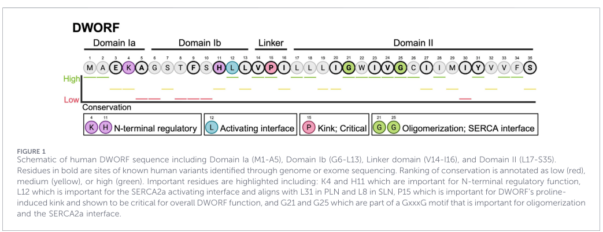
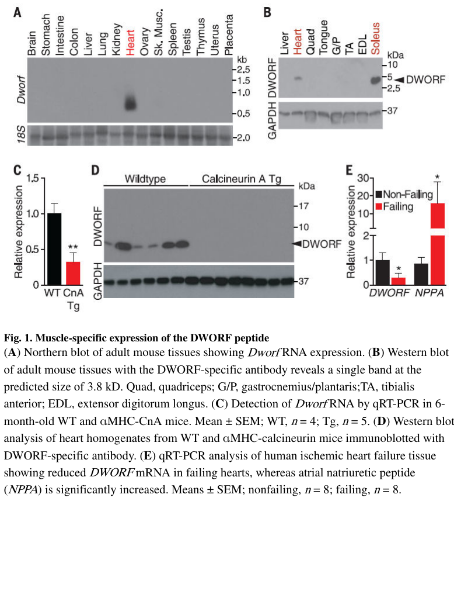

## Question

# Gene Research for Functional Annotation

## ⚠️ CRITICAL: Gene/Protein Identification Context

**BEFORE YOU BEGIN RESEARCH:** You MUST verify you are researching the CORRECT gene/protein. Gene symbols can be ambiguous, especially for less well-characterized genes from non-model organisms.

### Target Gene/Protein Identity (from UniProt):
- **UniProt Accession:** P0DN84
- **Protein Description:** RecName: Full=Sarcoplasmic/endoplasmic reticulum calcium ATPase regulator DWORF {ECO:0000305}; Short=SERCA regulator DWORF {ECO:0000305}; AltName: Full=Dwarf open reading frame {ECO:0000303|PubMed:26816378}; Short=DWORF {ECO:0000303|PubMed:26816378}; AltName: Full=Small transmembrane regulator of ion transport 1 {ECO:0000312|HGNC:HGNC:52297};
- **Gene Information:** Name=STRIT1 {ECO:0000312|HGNC:HGNC:52297}; Synonyms=DWORF {ECO:0000303|PubMed:26816378};
- **Organism (full):** Homo sapiens (Human).
- **Protein Family:** Not specified in UniProt
- **Key Domains:** DWORF. (IPR044529); DWORF (PF22030)

### MANDATORY VERIFICATION STEPS:

1. **Check if the gene symbol "STRIT1" matches the protein description above**
2. **Verify the organism is correct:** Homo sapiens (Human).
3. **Check if protein family/domains align with what you find in literature**
4. **If you find literature for a DIFFERENT gene with the same or similar symbol, STOP**

### If Gene Symbol is Ambiguous or You Cannot Find Relevant Literature:

**DO NOT PROCEED WITH RESEARCH ON A DIFFERENT GENE.** Instead:
- State clearly: "The gene symbol 'STRIT1' is ambiguous or literature is limited for this specific protein"
- Explain what you found (e.g., "Found extensive literature on a different gene with the same symbol in a different organism")
- Describe the protein based ONLY on the UniProt information provided above
- Suggest that the protein function can be inferred from domain/family information

### Research Target:

Please provide a comprehensive research report on the gene **STRIT1** (gene ID: STRIT1, UniProt: P0DN84) in human.

The research report should be a detailed narrative explaining the function, biological processes, and localization of the gene product. Citations should be given for all claims.

You should prioritize authoritative reviews and primary scientific literature when conducting research. You can supplement
this with annotations you find in gene/protein databases, but these can be outdated or inaccurate.

We are specifically interested in the primary function of the gene - for enzymes, what reaction is catalyzed, and what is the substrate specificity? For transporters, what is the substrate? For structural proteins or adapters, what is the broader structural role? For signaling molecules, what is the role in the pathway.

We are interested in where in or outside the cell the gene product carries out its function.

We are also interested in the signaling or biochemical pathways in which the gene functions. We are less interested in broad pleiotropic effects, except where these elucidate the precise role.

Include evidence where possible. We are interested in both experimental evidence as well as inference from structure, evolution, or bioinformatic analysis. Precise studies should be prioritized over high-throughput, where available.

## Output

Question: You are an expert researcher providing comprehensive, well-cited information.

Provide detailed information focusing on:
1. Key concepts and definitions with current understanding
2. Recent developments and latest research (prioritize 2023-2024 sources)
3. Current applications and real-world implementations
4. Expert opinions and analysis from authoritative sources
5. Relevant statistics and data from recent studies

Format as a comprehensive research report with proper citations. Include URLs and publication dates where available.
Always prioritize recent, authoritative sources and provide specific citations for all major claims.

# Gene Research for Functional Annotation

## ⚠️ CRITICAL: Gene/Protein Identification Context

**BEFORE YOU BEGIN RESEARCH:** You MUST verify you are researching the CORRECT gene/protein. Gene symbols can be ambiguous, especially for less well-characterized genes from non-model organisms.

### Target Gene/Protein Identity (from UniProt):
- **UniProt Accession:** P0DN84
- **Protein Description:** RecName: Full=Sarcoplasmic/endoplasmic reticulum calcium ATPase regulator DWORF {ECO:0000305}; Short=SERCA regulator DWORF {ECO:0000305}; AltName: Full=Dwarf open reading frame {ECO:0000303|PubMed:26816378}; Short=DWORF {ECO:0000303|PubMed:26816378}; AltName: Full=Small transmembrane regulator of ion transport 1 {ECO:0000312|HGNC:HGNC:52297};
- **Gene Information:** Name=STRIT1 {ECO:0000312|HGNC:HGNC:52297}; Synonyms=DWORF {ECO:0000303|PubMed:26816378};
- **Organism (full):** Homo sapiens (Human).
- **Protein Family:** Not specified in UniProt
- **Key Domains:** DWORF. (IPR044529); DWORF (PF22030)

### MANDATORY VERIFICATION STEPS:

1. **Check if the gene symbol "STRIT1" matches the protein description above**
2. **Verify the organism is correct:** Homo sapiens (Human).
3. **Check if protein family/domains align with what you find in literature**
4. **If you find literature for a DIFFERENT gene with the same or similar symbol, STOP**

### If Gene Symbol is Ambiguous or You Cannot Find Relevant Literature:

**DO NOT PROCEED WITH RESEARCH ON A DIFFERENT GENE.** Instead:
- State clearly: "The gene symbol 'STRIT1' is ambiguous or literature is limited for this specific protein"
- Explain what you found (e.g., "Found extensive literature on a different gene with the same symbol in a different organism")
- Describe the protein based ONLY on the UniProt information provided above
- Suggest that the protein function can be inferred from domain/family information

### Research Target:

Please provide a comprehensive research report on the gene **STRIT1** (gene ID: STRIT1, UniProt: P0DN84) in human.

The research report should be a detailed narrative explaining the function, biological processes, and localization of the gene product. Citations should be given for all claims.

You should prioritize authoritative reviews and primary scientific literature when conducting research. You can supplement
this with annotations you find in gene/protein databases, but these can be outdated or inaccurate.

We are specifically interested in the primary function of the gene - for enzymes, what reaction is catalyzed, and what is the substrate specificity? For transporters, what is the substrate? For structural proteins or adapters, what is the broader structural role? For signaling molecules, what is the role in the pathway.

We are interested in where in or outside the cell the gene product carries out its function.

We are also interested in the signaling or biochemical pathways in which the gene functions. We are less interested in broad pleiotropic effects, except where these elucidate the precise role.

Include evidence where possible. We are interested in both experimental evidence as well as inference from structure, evolution, or bioinformatic analysis. Precise studies should be prioritized over high-throughput, where available.

# Comprehensive Research Report: STRIT1 (DWORF) - Sarcoplasmic/Endoplasmic Reticulum Calcium ATPase Regulator

## Gene Identity and Discovery

STRIT1 (Small Transmembrane Regulator of Ion Transport 1), widely known by its synonym DWORF (Dwarf Open Reading Frame), encodes an exceptionally small microprotein that represents a fundamentally distinct class of SERCA regulators (verry2026microproteinmacroeffectdworf pages 1-2, verry2026microproteinmacroeffectdworf pages 2-3). The protein was discovered in 2016 by Nelson et al. through ribosome profiling and proteomic analysis of what was originally annotated as a long noncoding RNA (nelson2016apeptideencoded pages 1-3, nelson2016apeptideencoded pages 3-4). DWORF is the human protein corresponding to UniProt accession P0DN84, matching the provided functional description as a SERCA regulator with InterPro domain IPR044529 and Pfam domain PF22030 (verry2026microproteinmacroeffectdworf pages 2-3, verry2026microproteinmacroeffectdworf pages 3-4).

## Protein Structure and Molecular Architecture

Human DWORF is an extraordinarily compact microprotein of approximately 35 amino acids (~3.8–4 kDa), with the commonly studied mouse ortholog containing 34 amino acids (verry2026microproteinmacroeffectdworf pages 2-3, verry2026microproteinmacroeffectdworf pages 3-4, nelson2016apeptideencoded pages 1-3, verry2026microproteinmacroeffectdworf media 8d4c71fa). The protein adopts a distinctive helix–linker–helix architecture that is fundamental to its activating function (verry2026microproteinmacroeffectdworf pages 4-5, verry2026microproteinmacroeffectdworf pages 3-4). This structure comprises four functional domains (verry2026microproteinmacroeffectdworf pages 3-4, verry2026microproteinmacroeffectdworf media 8d4c71fa):

**Domain Ia (residues M1–A5):** An N-terminal region enriched in positively charged residues (Lys4) that may interact with negatively charged membrane lipid headgroups or cytosolic SERCA domains.

**Domain Ib (residues G6–L13):** An amphipathic juxtamembrane helix positioned along the cytosolic leaflet of the SR membrane, containing Leu12, a critical residue at the SERCA2a-activating interface.

**Linker domain (residues V14–I16):** A short connector centered on Pro15, whose proline-induced kink is absolutely essential for DWORF function. Structural studies demonstrate that Pro15 separates the amphipathic and transmembrane helices, creating the precise geometry required for productive SERCA engagement (zador2023themeetingof pages 7-8, verry2026microproteinmacroeffectdworf pages 4-5, verry2026microproteinmacroeffectdworf pages 5-7). Critically, substitution of Pro15 with helix-favoring residues such as alanine or asparagine straightens the peptide and abolishes activation, converting DWORF into a phospholamban-like SERCA inhibitor (verry2026microproteinmacroeffectdworf pages 4-5, verry2026microproteinmacroeffectdworf pages 5-7, verry2026microproteinmacroeffectdworf pages 15-16).

**Domain II (residues L17–S35):** A C-terminal transmembrane helix enriched in hydrophobic residues that spans the SR membrane. This domain includes Trp22, important for SERCA interaction, and a GxxxG motif (Gly21 and Gly25) that creates a smooth SERCA-binding interface (zador2023themeetingof pages 7-8, verry2026microproteinmacroeffectdworf pages 3-4, verry2026microproteinmacroeffectdworf pages 15-16, verry2026microproteinmacroeffectdworf media 8d4c71fa).

DWORF is classified as a tail-anchored transmembrane protein with one short intraluminal serine residue and a short cytoplasmic tail (zador2023themeetingof pages 7-8, zador2023themeetingof pages 5-7, nelson2016apeptideencoded pages 1-3).

## Subcellular Localization

DWORF carries out its function exclusively at the sarcoplasmic reticulum (SR) membrane in cardiac and skeletal muscle cells, where it co-resides with SERCA2a in both junctional SR and network SR (verry2026microproteinmacroeffectdworf pages 3-4, rustad2023interactionofdworf pages 1-3, kim2025theserca–pln–dworfaxis pages 6-11). Localization studies using GFP-DWORF in skeletal muscle fibers revealed transverse and longitudinal striations that precisely match the SR distribution pattern, similar to the localization of sarcolipin and phospholamban (nelson2016apeptideencoded pages 3-4, nelson2016apeptideencoded pages 1-3). In heterologous COS7 cells, GFP-DWORF colocalizes with SERCA1 in the endoplasmic reticulum and perinuclear regions, demonstrating its preference for SERCA-containing membranes (nelson2016apeptideencoded pages 3-4). DWORF is not a soluble cytoplasmic protein; its transmembrane helix anchors it within the SR membrane, positioning it for direct interaction with SERCA during the calcium-transport cycle (zador2023themeetingof pages 7-8, verry2026microproteinmacroeffectdworf pages 3-4, zador2023themeetingof pages 5-7, nelson2016apeptideencoded pages 1-3, verry2026microproteinmacroeffectdworf pages 5-7).

## Tissue Expression and Developmental Pattern

DWORF expression is highly tissue-restricted, being concentrated in ventricular myocardium and slow-twitch skeletal muscle (verry2026microproteinmacroeffectdworf pages 1-2, verry2026microproteinmacroeffectdworf pages 2-3, zador2023themeetingof pages 7-8). Northern blot and Western blot analyses in mice demonstrated that Dworf RNA and protein are exclusively expressed in the heart and in the soleus, a slow-twitch postural muscle, with strong expression also noted in the diaphragm (nelson2016apeptideencoded pages 1-3, nelson2016apeptideencoded media 6e4faed7). Notably, DWORF is not detected in fast-twitch skeletal muscles such as quadriceps, gastrocnemius/plantaris, tibialis anterior, or extensor digitorum longus, nor is it detected in cardiac atrial tissue (nelson2016apeptideencoded pages 1-3, zador2023themeetingof pages 7-8, nelson2016apeptideencoded media 6e4faed7). This expression pattern correlates with the distribution of SERCA2a, DWORF's primary regulatory target in cardiac and slow skeletal muscle.

Developmentally, DWORF expression increases postnatally as the heart matures and SR-dominated calcium handling becomes established (nelson2016apeptideencoded pages 1-3, verry2026microproteinmacroeffectdworf pages 1-2). DWORF is absent from prenatal mouse hearts and progressively increases after birth, paralleling the maturation of excitation-contraction coupling (nelson2016apeptideencoded pages 1-3). While the human genomic counterpart has been identified, detailed human tissue and cell-type expression patterns remain less comprehensively characterized than mouse data (nelson2016apeptideencoded pages 1-3).

## Primary Function: SERCA Regulation and Mechanism of Action

DWORF is the only known endogenous positive regulator of the sarco/endoplasmic reticulum Ca²⁺-ATPase (SERCA) within the SERCA-regulin family (verry2026microproteinmacroeffectdworf pages 2-3, verry2026microproteinmacroeffectdworf pages 1-2). Unlike inhibitory regulins including phospholamban (PLN), sarcolipin (SLN), myoregulin (MLN), endoregulin (ELN), and another-regulin (ALN), DWORF enhances SERCA2a activity through a dual mechanism (verry2026microproteinmacroeffectdworf pages 5-7, verry2026microproteinmacroeffectdworf pages 2-3, verry2026microproteinmacroeffectdworf pages 1-2, nelson2016apeptideencoded pages 3-4):

### Mechanism 1: Displacement of Inhibitory Regulins

DWORF competes with phospholamban and other inhibitory micropeptides for a shared regulatory binding site on SERCA (rustad2023interactionofdworf pages 1-3, nelson2016apeptideencoded pages 3-4, verry2026microproteinmacroeffectdworf pages 4-5). Co-immunoprecipitation experiments demonstrate that DWORF physically associates with SERCA and that increasing DWORF expression reduces SERCA's association with PLN, SLN, and MLN, indicating mutually exclusive binding (nelson2016apeptideencoded pages 3-4). Mutagenesis studies mapping the interaction site to SERCA's M6 transmembrane helix confirm that DWORF binds to a region overlapping the PLN-binding interface (nelson2016apeptideencoded pages 3-4). EPR spectroscopy experiments in defined proteoliposomes revealed that DWORF and PLN compete for SERCA binding at low Ca²⁺, although DWORF's apparent affinity is approximately one order of magnitude weaker than PLN in this system, suggesting cooperative interactions rather than simple high-affinity displacement (rustad2023interactionofdworf pages 1-3). By displacing inhibitory regulins, DWORF relieves their suppression of SERCA activity, particularly at subsaturating Ca²⁺ concentrations where PLN normally reduces SERCA's apparent Ca²⁺ affinity (rustad2023interactionofdworf pages 1-3).

### Mechanism 2: Direct SERCA Activation

Beyond displacing inhibitory regulins, DWORF directly enhances SERCA catalytic activity even when PLN is absent (rustad2023interactionofdworf pages 1-3, verry2026microproteinmacroeffectdworf pages 1-2, verry2026microproteinmacroeffectdworf pages 4-5). Reconstituted SERCA activity assays and purified-system measurements demonstrate that DWORF increases SERCA catalytic turnover (Vmax) by approximately 1.5–1.7-fold (verry2026microproteinmacroeffectdworf pages 5-7, verry2026microproteinmacroeffectdworf pages 4-5, zador2023themeetingof pages 7-8). Unlike PLN's inhibitory effect, DWORF produces little consistent change in intrinsic apparent Ca²⁺ affinity when inhibitory regulins are not present; its primary direct effect is acceleration of rate-limiting steps in the SERCA catalytic cycle (verry2026microproteinmacroeffectdworf pages 5-7, verry2026microproteinmacroeffectdworf pages 4-5).

### State-Dependent Binding and Conformational Selectivity

DWORF exhibits preferential binding to specific SERCA conformational states, particularly the phosphorylated intermediates E1P and E2P that predominate during elevated cytosolic Ca²⁺ and active transport (verry2026microproteinmacroeffectdworf pages 5-7, zador2023themeetingof pages 7-8). This contrasts with PLN, which preferentially associates with the E1-ATP state at low/resting Ca²⁺ (zador2023themeetingof pages 7-8). The state-dependent competition between DWORF and PLN creates a calcium-sensitive regulatory switch: PLN predominates at low Ca²⁺ (inhibiting SERCA), while DWORF preferentially associates with high-throughput SERCA states during Ca²⁺ elevation, promoting greater pump activity precisely when demand is high (zador2023themeetingof pages 7-8, verry2026microproteinmacroeffectdworf pages 5-7).

### Structural Basis of SERCA Interaction

DWORF's transmembrane helix makes extensive contacts with SERCA's M2 transmembrane helix and fewer contacts with M6 than inhibitory regulins (verry2026microproteinmacroeffectdworf pages 5-7). The Pro15-induced kink is causally important for this interaction, as it positions the transmembrane domain correctly within the SERCA binding groove (verry2026microproteinmacroeffectdworf pages 4-5, verry2026microproteinmacroeffectdworf pages 3-4). Additionally, DWORF may modify the local membrane bilayer environment, further stabilizing the active SERCA conformation (zador2023themeetingof pages 7-8).

## Biochemical Pathway: Excitation-Contraction Coupling and Calcium Cycling

DWORF participates in the fundamental excitation-contraction coupling pathway that governs cardiac and skeletal muscle function (verry2026microproteinmacroeffectdworf pages 4-5, nelson2016apeptideencoded pages 3-4, nelson2016apeptideencoded pages 1-3, verry2026microproteinmacroeffectdworf pages 2-3). In cardiac myocytes, membrane depolarization opens L-type Ca²⁺ channels, producing a trigger Ca²⁺ influx that induces larger ryanodine receptor 2 (RyR2)-mediated Ca²⁺ release from the SR (verry2026microproteinmacroeffectdworf pages 2-3). This cytosolic Ca²⁺ elevation binds to troponin C, initiating actin-myosin cross-bridge cycling and contraction (nelson2016apeptideencoded pages 1-3, verry2026microproteinmacroeffectdworf pages 2-3). Relaxation depends primarily on ATP-dependent SERCA2a-mediated Ca²⁺ reuptake into the SR, with a smaller contribution from sodium-calcium exchanger (NCX)-mediated extrusion across the plasma membrane (kim2025theserca–pln–dworfaxis pages 6-11, verry2026microproteinmacroeffectdworf pages 2-3).

DWORF enhances this cycle by accelerating SERCA-mediated Ca²⁺ reuptake from the cytoplasm into the SR during relaxation (diastole), thereby increasing SR Ca²⁺ load and supporting larger subsequent Ca²⁺ releases during contraction (systole) (zador2023themeetingof pages 7-8, verry2026microproteinmacroeffectdworf pages 4-5, nelson2016apeptideencoded pages 3-4, nelson2016apeptideencoded pages 1-3). In cardiomyocytes overexpressing DWORF, peak systolic Ca²⁺ transient amplitude and SR Ca²⁺ content increase, while electrically stimulated Ca²⁺ transient decay accelerates, consistent with faster SERCA-mediated Ca²⁺ clearance (nelson2016apeptideencoded pages 3-4). Importantly, caffeine-induced Ca²⁺ decay rates and NCX protein abundance remain unchanged, confirming that the primary effect is on SERCA rather than enhanced NCX-mediated extrusion (nelson2016apeptideencoded pages 3-4).

DWORF also integrates with β-adrenergic signaling: phosphorylation of PLN at Ser16 by protein kinase A (PKA) and at Thr17 by Ca²⁺/calmodulin-dependent protein kinase II (CaMKII) relieves PLN-mediated SERCA inhibition (kim2025theserca–pln–dworfaxis pages 6-11, verry2026microproteinmacroeffectdworf pages 2-3, kim2025theserca–pln–dworfaxis pages 11-16). When PLN is phosphorylated, its affinity for SERCA decreases, facilitating DWORF access and potentially shifting regulation toward SERCA activation (verry2026microproteinmacroeffectdworf pages 5-7). This synergy may explain why DWORF-overexpressing cardiomyocytes show reduced responsiveness to β-adrenergic stimulation—calcium cycling may already be operating near maximal capacity (nelson2016apeptideencoded pages 3-4).

## Disease Association and Clinical Relevance

DWORF expression is consistently reduced across multiple heart failure and cardiomyopathy models, suggesting that loss of this endogenous positive SERCA regulator contributes to defective calcium handling in cardiac disease (verry2026microproteinmacroeffectdworf pages 1-2, kim2025theserca–pln–dworfaxis pages 11-16, nelson2016apeptideencoded pages 3-4). The original 2016 discovery paper reported significant downregulation of both DWORF mRNA and protein in mouse hearts with pathological hypertrophy progressing to dilated cardiomyopathy, with protein loss more pronounced than transcript loss (nelson2016apeptideencoded pages 3-4, nelson2016apeptideencoded media 6e4faed7). Critically, DWORF mRNA was also reduced in ischemic failing human hearts, establishing clinical relevance (nelson2016apeptideencoded pages 3-4, nelson2016apeptideencoded media 6e4faed7).

More recent studies have documented reduced DWORF in dilated transgenic mouse hearts, ischemia-reperfusion injury, myocardial infarction, pollutant-associated cardiomyopathy, and Duchenne muscular dystrophy-associated cardiomyopathy (rustad2023interactionofdworf pages 1-3, verry2026microproteinmacroeffectdworf pages 12-13, kim2025theserca–pln–dworfaxis pages 11-16, verry2026microproteinmacroeffectdworf pages 11-11). In a canine Duchenne model, DWORF transcript and protein decline in skeletal muscle, left ventricle, and right atrium beginning around 8–13 months and continuing through symptomatic disease (verry2026microproteinmacroeffectdworf pages 11-11). This reduction occurs alongside abnormalities in other Ca²⁺-handling proteins and SERCA isoforms, suggesting that DWORF loss compounds impaired myocardial calcium cycling and contractile dysfunction (kim2025theserca–pln–dworfaxis pages 11-16, verry2026microproteinmacroeffectdworf pages 11-11).

## Experimental Evidence Supporting DWORF Function

Multiple independent lines of evidence converge to establish DWORF as a direct, positive SERCA regulator:

**Structural Evidence:** NMR studies confirmed the helix-linker-helix architecture with a Pro15-induced kink (zador2023themeetingof pages 7-8, verry2026microproteinmacroeffectdworf pages 4-5, rustad2023interactionofdworf pages 1-3). Site-directed mutagenesis demonstrated that Pro15 is causally important: Pro15Ala, Pro15Asn, and Pro15Leu substitutions eliminate activation and can convert DWORF into an inhibitor (verry2026microproteinmacroeffectdworf pages 4-5, verry2026microproteinmacroeffectdworf pages 5-7, verry2026microproteinmacroeffectdworf pages 15-16). Similarly, disruption of the GxxxG motif (Gly25Asp) produces inhibitory behavior (verry2026microproteinmacroeffectdworf pages 15-16).

**Biochemical Evidence:** Co-immunoprecipitation established direct physical interaction between DWORF and all tested SERCA isoforms (SERCA1, 2a, 2b, 3a, 3b) (nelson2016apeptideencoded pages 3-4, zador2023themeetingof pages 7-8). EPR spectroscopy in reconstituted proteoliposomes quantified competition between DWORF and PLN for SERCA binding (rustad2023interactionofdworf pages 1-3). Reconstituted SERCA activity assays demonstrated 1.5–1.7-fold increases in Vmax with DWORF (verry2026microproteinmacroeffectdworf pages 4-5, verry2026microproteinmacroeffectdworf pages 5-7, zador2023themeetingof pages 7-8).

**Cellular Evidence:** GFP-DWORF localization showed SR-like striations and colocalization with SERCA (nelson2016apeptideencoded pages 3-4, nelson2016apeptideencoded pages 1-3). Ca²⁺ imaging in cardiomyocytes revealed increased SR Ca²⁺ load, larger Ca²⁺ transients, and accelerated decay (nelson2016apeptideencoded pages 3-4). Contractility assays confirmed increased baseline contractility and improved relaxation (nelson2016apeptideencoded pages 3-4, verry2026microproteinmacroeffectdworf pages 5-7).

**Animal Model Evidence:** DWORF-knockout mice exhibited modestly reduced SERCA Ca²⁺ affinity and slowed relaxation after high-demand stimulation in slow skeletal muscle, supporting an endogenous role in accelerating Ca²⁺ clearance (zador2023themeetingof pages 7-8, nelson2016apeptideencoded pages 1-3, verry2026microproteinmacroeffectdworf pages 5-7). Cardiac transgenic/overexpression mice showed increased SERCA2a activity, enhanced contractility, and a hypercontractile phenotype (nelson2016apeptideencoded pages 3-4, verry2026microproteinmacroeffectdworf pages 5-7). Most compellingly, DWORF gene therapy improved outcomes in multiple preclinical heart failure models, including dilated cardiomyopathy, pressure overload (transverse aortic constriction), PLN-R14del cardiomyopathy, Duchenne muscular dystrophy cardiomyopathy, and myocardial infarction (verry2026microproteinmacroeffectdworf pages 12-13, verry2026microproteinmacroeffectdworf pages 1-2, verry2026microproteinmacroeffectdworf pages 8-9, verry2026microproteinmacroeffectdworf pages 11-12).

In pressure-overload models, adeno-associated virus (AAV)-mediated DWORF delivery (~25-fold cardiac expression) attenuated ejection-fraction decline, limited left-ventricular dilation, preserved mitochondrial respiratory capacity, and improved cardiomyocyte contractility (verry2026microproteinmacroeffectdworf pages 11-12, verry2026microproteinmacroeffectdworf pages 12-13). Importantly, treatment administered six weeks after TAC (after substantial remodeling) still produced "late rescue," indicating therapeutic benefit even in established disease (verry2026microproteinmacroeffectdworf pages 11-12, verry2026microproteinmacroeffectdworf pages 12-13). In PLN-R14del cardiomyopathy, DWORF knock-in extended survival, delayed heart failure onset, and reduced pathological PLN aggregates (verry2026microproteinmacroeffectdworf pages 12-13, verry2026microproteinmacroeffectdworf pages 11-12). In permanent coronary ligation models, ~17-fold DWORF overexpression preserved SR Ca²⁺ uptake, limited ventricular dilation, and improved function without reducing infarct size, indicating improved function of surviving myocardium (verry2026microproteinmacroeffectdworf pages 12-13).

Human iPSC-derived cardiomyocytes showed dose-responsive improvement in mitochondrial respiration with DWORF, supporting conservation of the effect in human cells (verry2026microproteinmacroeffectdworf pages 11-12, verry2026microproteinmacroeffectdworf pages 12-13). However, large-animal safety validation and human clinical efficacy data remain unavailable (verry2026microproteinmacroeffectdworf pages 8-9, verry2026microproteinmacroeffectdworf pages 15-16).

## Current Understanding and Recent Developments (2023-2026)

Recent comprehensive reviews highlight DWORF's emerging status as a mechanistically distinct therapeutic strategy for heart failure (verry2026microproteinmacroeffectdworf pages 1-2, verry2026microproteinmacroeffectdworf pages 8-9). Unlike approaches targeting PLN inhibition or deletion—which carry safety concerns given that complete PLN loss is lethal in humans—DWORF-based therapy aims to enhance SERCA function through positive regulation while preserving the physiologic PLN regulatory network (verry2026microproteinmacroeffectdworf pages 5-7, verry2026microproteinmacroeffectdworf pages 1-2, verry2026microproteinmacroeffectdworf pages 8-9). DWORF's compact coding sequence (~105 nucleotides for the 35-amino-acid human protein) is ideally suited for AAV delivery, enabling efficient packaging and potential multiplexing strategies (verry2026microproteinmacroeffectdworf pages 1-2).

A 2023 EPR spectroscopy study provided refined mechanistic insights into DWORF-PLN competition, demonstrating that DWORF's weaker binding affinity compared to PLN suggests cooperative interactions among regulatory components rather than simple high-affinity displacement (rustad2023interactionofdworf pages 1-3). A 2025 review in *Cardiovascular Diabetology* positioned DWORF within the SERCA-PLN-DWORF axis as a key regulator in cardiometabolic disease, noting its potential to improve impaired SR Ca²⁺ cycling in both heart failure and metabolic disorders (kim2025theserca–pln–dworfaxis pages 6-11, kim2025theserca–pln–dworfaxis pages 11-16). A 2026 review in *Frontiers in Cell and Developmental Biology* provided comprehensive analysis of DWORF as a therapeutic strategy, summarizing preclinical evidence and discussing translational challenges including species differences, safety concerns, and knowledge gaps that must be addressed for clinical advancement (verry2026microproteinmacroeffectdworf pages 1-2, verry2026microproteinmacroeffectdworf pages 8-9, verry2026microproteinmacroeffectdworf pages 15-16).

## Summary Tables

Comprehensive summaries of DWORF's functional annotations and experimental evidence are provided in the following tables:

| Feature | Functional annotation and evidence |
|---|---|
| Gene identity | **STRIT1** (*small transmembrane regulator of ion transport 1*); established synonym **DWORF** (*dwarf open reading frame*). The target is the human protein corresponding to UniProt **P0DN84**, not a similarly named gene. |
| Protein class | An exceptionally small SERCA-regulating microprotein encoded by a short open reading frame originally annotated within a putative long noncoding RNA (nelson2016apeptideencoded pages 1-3). |
| Protein size | Human DWORF is approximately **35 amino acids** and **3.8–4 kDa**; the commonly studied mouse ortholog is 34 amino acids (verry2026microproteinmacroeffectdworf pages 2-3, verry2026microproteinmacroeffectdworf pages 3-4, nelson2016apeptideencoded pages 1-3). |
| Domain/family alignment | A conserved, single-pass membrane member of the **SERCA-regulin** group, consistent with the supplied InterPro **DWORF domain (IPR044529)** and Pfam **PF22030** annotations. Unlike PLN, SLN, MLN, ELN, and ALN, DWORF positively regulates rather than inhibits SERCA (verry2026microproteinmacroeffectdworf pages 2-3). |
| Tissue expression | Expression is concentrated in **ventricular myocardium** and **slow-twitch skeletal muscle**, including soleus; mouse studies found little or no detectable expression in atria or predominantly fast-twitch muscles. Expression increases postnatally as cardiac calcium handling matures (nelson2016apeptideencoded pages 1-3, verry2026microproteinmacroeffectdworf pages 1-2, zador2023themeetingof pages 7-8, nelson2016apeptideencoded media 6e4faed7). Human tissue-resolution evidence is less extensive than the mouse evidence. |
| Subcellular localization | An integral, tail-anchored microprotein of the **sarcoplasmic-reticulum membrane** in muscle, with analogous ER localization in heterologous cells. GFP-DWORF exhibits SR-like transverse and longitudinal striations and colocalizes with SERCA; recent synthesis places it in both network and junctional SR (verry2026microproteinmacroeffectdworf pages 3-4, nelson2016apeptideencoded pages 3-4, nelson2016apeptideencoded pages 1-3). |
| Primary molecular function | **Endogenous positive regulator of sarco/endoplasmic-reticulum Ca²⁺-ATPase**, principally cardiac **SERCA2a**. DWORF itself is not an enzyme or transporter; it regulates the ATP-driven movement of cytosolic Ca²⁺ into the SR by SERCA (rustad2023interactionofdworf pages 1-3, verry2026microproteinmacroeffectdworf pages 1-2). |
| Mechanism of action | DWORF acts through two complementary mechanisms: it competes with and displaces inhibitory regulins—especially **phospholamban (PLN)**—from an overlapping SERCA regulatory interface, and it can **directly increase SERCA catalytic turnover** even without PLN. Reconstituted-system summaries report an approximately **1.5–1.7-fold increase in Vmax**, with little consistent effect on intrinsic Ca²⁺ affinity when inhibitory regulins are absent (nelson2016apeptideencoded pages 3-4, verry2026microproteinmacroeffectdworf pages 4-5, rustad2023interactionofdworf pages 1-3). |
| Conformational selectivity | DWORF preferentially associates with SERCA catalytic states populated during elevated cytosolic Ca²⁺ and active transport, including **E1P/E2P**, whereas PLN preferentially inhibits low-Ca²⁺ states. This state-dependent competition may concentrate DWORF activation during high Ca²⁺ flux (zador2023themeetingof pages 7-8, verry2026microproteinmacroeffectdworf pages 5-7). |
| Interacting partners | Directly demonstrated or reported interactions include **SERCA2a** and, in co-immunoprecipitation experiments, SERCA1, SERCA2b, SERCA3a, and SERCA3b. Functionally competing regulators include **PLN, sarcolipin (SLN), and myoregulin (MLN)** (nelson2016apeptideencoded pages 3-4). SERCA2a is the dominant physiological target in ventricular muscle. |
| Overall architecture | Compact **helix–linker–helix** topology: a positively charged N-terminal region, an amphipathic juxtamembrane helix, a short linker, and a C-terminal transmembrane helix spanning approximately residues 17–35 (verry2026microproteinmacroeffectdworf pages 4-5, verry2026microproteinmacroeffectdworf pages 3-4, verry2026microproteinmacroeffectdworf media 8d4c71fa). |
| Critical Pro15 kink | **Pro15** creates a functionally essential kink between the amphipathic and transmembrane helices. Substitution with helix-favoring residues straightens the peptide, abolishes activation, and can convert DWORF into a PLN-like SERCA inhibitor (zador2023themeetingof pages 7-8, verry2026microproteinmacroeffectdworf pages 4-5, verry2026microproteinmacroeffectdworf pages 5-7). |
| Other structural determinants | **Leu12** contributes to the activating interface; **Trp22** participates in SERCA interaction; and the **GxxxG motif** formed by Gly21 and Gly25 produces a smooth transmembrane binding surface. Mutations disrupting these features can weaken activation or produce inhibitory behavior (zador2023themeetingof pages 7-8, verry2026microproteinmacroeffectdworf pages 3-4, verry2026microproteinmacroeffectdworf pages 15-16, verry2026microproteinmacroeffectdworf media 8d4c71fa). |
| Cellular and physiological effects | Enhanced SERCA function accelerates cytosolic Ca²⁺ clearance, increases SR Ca²⁺ load, enlarges subsequent systolic Ca²⁺ transients, and supports relaxation and contractility. These effects occur without evidence that altered NCX-mediated extrusion is the primary cause (nelson2016apeptideencoded pages 3-4, nelson2016apeptideencoded pages 1-3). |
| Disease association | DWORF transcript and protein are reduced in multiple experimental heart-failure and cardiomyopathy settings; the original study also reported reduced DWORF RNA in ischemic failing human hearts. Loss of this positive SERCA input may compound defective SR Ca²⁺ cycling, although causality and disease-specific human expression patterns remain incompletely established (nelson2016apeptideencoded pages 3-4, kim2025theserca–pln–dworfaxis pages 11-16, nelson2016apeptideencoded media 6e4faed7). |
| Therapeutic development | Cardiac DWORF overexpression or AAV-mediated delivery has improved Ca²⁺ handling and cardiac phenotypes in preclinical models of dilated cardiomyopathy, pressure overload, Duchenne muscular-dystrophy cardiomyopathy, PLN-R14del cardiomyopathy, and ischemic injury. One pressure-overload study summarized approximately **25-fold** expression after MyoAAV-DWORF, while a coronary-ligation model used approximately **17-fold** overexpression (verry2026microproteinmacroeffectdworf pages 1-2, verry2026microproteinmacroeffectdworf pages 8-9, verry2026microproteinmacroeffectdworf pages 11-12, verry2026microproteinmacroeffectdworf pages 12-13). These remain preclinical applications; large-animal safety validation and human clinical efficacy have not been established. |

*Table: This table integrates the identity, structure, localization, expression, molecular mechanism, physiological role, and disease relevance of human STRIT1/DWORF. It also distinguishes well-supported functional conclusions from areas where human-specific or clinical evidence remains limited.*

| Evidence type | Method/model | Specific finding | Functional interpretation |
|---|---|---|---|
| Structural | NMR-derived membrane structure | DWORF adopts a helix–linker–helix architecture with an N-terminal amphipathic segment and C-terminal transmembrane helix. Pro15 introduces a pronounced kink between them (zador2023themeetingof pages 7-8, verry2026microproteinmacroeffectdworf pages 4-5, verry2026microproteinmacroeffectdworf pages 3-4). | The kink establishes the geometry needed for productive SERCA interaction and distinguishes activating DWORF from inhibitory regulins. |
| Structural | Site-directed mutagenesis of Pro15 | Pro15Ala, Pro15Asn, and Pro15Leu substitutions straighten the peptide, eliminate SERCA activation, reduce pump Vmax, and can convert DWORF into a phospholamban-like inhibitor (verry2026microproteinmacroeffectdworf pages 4-5, verry2026microproteinmacroeffectdworf pages 5-7, verry2026microproteinmacroeffectdworf pages 15-16). | Pro15 is a causal structure–function determinant. |
| Structural | Residue-level mutagenesis and modeling | Leu12 contributes to the activating interface; Trp22 supports SERCA interaction; Gly21 and Gly25 form a GxxxG surface important for transmembrane packing and binding. Disruptive Gly25 variants can produce inhibitory behavior (zador2023themeetingof pages 7-8, verry2026microproteinmacroeffectdworf pages 3-4, verry2026microproteinmacroeffectdworf pages 15-16, verry2026microproteinmacroeffectdworf media 8d4c71fa). | Several residues cooperate to create an activation-competent SERCA-binding surface. |
| Biophysical | EPR spectroscopy in SERCA/phospholamban proteoliposomes | DWORF altered phospholamban mobility and competed with it for SERCA at low Ca²⁺. Its apparent affinity was about one order of magnitude weaker in this defined system, suggesting regulation more complex than simple high-affinity displacement (rustad2023interactionofdworf pages 1-3). | Supports direct membrane-delimited competition plus cooperative or conformational-state effects. |
| Biochemical | Co-immunoprecipitation and SERCA transmembrane mutants | DWORF associated with all tested SERCA isoforms, including SERCA1, SERCA2a, SERCA2b, SERCA3a, and SERCA3b; SERCA M6 mutations reduced binding (nelson2016apeptideencoded pages 3-4). | Establishes direct SERCA association at an interface overlapping the inhibitory-regulin site. |
| Biochemical | Competitive coexpression/co-immunoprecipitation | Increasing DWORF reduced SERCA association with phospholamban, sarcolipin, and myoregulin, consistent with mutually exclusive occupancy (nelson2016apeptideencoded pages 3-4). | DWORF can activate SERCA indirectly by displacing inhibitory regulins. |
| Biochemical | Reconstituted SERCA activity and Ca²⁺-uptake assays | DWORF directly enhanced SERCA without phospholamban; reported increases in catalytic turnover/Vmax were approximately 1.5–1.7-fold, with little consistent change in intrinsic apparent Ca²⁺ affinity when inhibitory regulins were absent (verry2026microproteinmacroeffectdworf pages 4-5, verry2026microproteinmacroeffectdworf pages 5-7, zador2023themeetingof pages 7-8). | DWORF is not merely a phospholamban antagonist; it can accelerate the SERCA catalytic cycle directly. |
| Cellular | GFP localization in muscle fibers and heterologous cells | GFP-DWORF produced SR-like transverse and longitudinal striations in muscle and colocalized with SERCA in ER/perinuclear membranes (nelson2016apeptideencoded pages 3-4, nelson2016apeptideencoded pages 1-3). | Places DWORF at the SR/ER membrane where SERCA transports Ca²⁺. |
| Cellular | Cardiomyocyte Ca²⁺ imaging | DWORF increased peak systolic Ca²⁺-transient amplitude and SR Ca²⁺ content and accelerated electrically evoked transient decay (nelson2016apeptideencoded pages 3-4). | Indicates faster SERCA-dependent cytosolic Ca²⁺ clearance and greater SR loading. |
| Cellular | Caffeine-evoked Ca²⁺ decay and protein analysis | NCX-related measures and major Ca²⁺-handling protein abundance were not materially altered (nelson2016apeptideencoded pages 3-4). | Supports direct SERCA regulation rather than enhanced NCX extrusion or broad proteome remodeling. |
| Cellular | Cardiomyocyte contractility assays | DWORF increased baseline contractility and improved relaxation; β-adrenergic reserve was reduced in some overexpression experiments, consistent with near-maximal baseline calcium cycling (nelson2016apeptideencoded pages 3-4, verry2026microproteinmacroeffectdworf pages 5-7). | Connects SERCA activation to excitation–contraction physiology while identifying effects of supraphysiologic expression. |
| Animal | DWORF-knockout mice and skeletal-muscle physiology | Loss of DWORF modestly reduced SERCA Ca²⁺ affinity/activity and slowed relaxation after high-demand or tetanic stimulation, particularly in slow muscle (zador2023themeetingof pages 7-8, nelson2016apeptideencoded pages 1-3, verry2026microproteinmacroeffectdworf pages 5-7). | Supports an endogenous role in accelerating SERCA-dependent Ca²⁺ clearance, although baseline loss is not acutely lethal. |
| Animal | Cardiac transgenic/overexpression mice | Overexpression increased SERCA2a activity, SR Ca²⁺ load, systolic Ca²⁺ transients, contractility, and relaxation, producing a hypercontractile but generally tolerated phenotype (nelson2016apeptideencoded pages 3-4, verry2026microproteinmacroeffectdworf pages 5-7). | Demonstrates that DWORF is sufficient to enhance cardiac Ca²⁺ cycling in vivo. |
| Animal | Dilated-cardiomyopathy rescue models | DWORF overexpression improved Ca²⁺ cycling and contractility and prevented or attenuated heart-failure progression (rustad2023interactionofdworf pages 1-3). | Shows that restoring positive SERCA regulation can modify disease. |
| Animal and human-cell models | MyoAAV-DWORF after transverse aortic constriction; human iPSC-derived cardiomyocytes | Approximately 25-fold cardiac expression attenuated ejection-fraction decline and ventricular dilation and preserved mitochondrial respiration; treatment after established remodeling also produced rescue. Human cells showed dose-responsive improvement in mitochondrial respiration (verry2026microproteinmacroeffectdworf pages 11-12, verry2026microproteinmacroeffectdworf pages 12-13). | Supports post-onset therapeutic activity and a link between improved Ca²⁺ handling and energetics, but not yet clinical efficacy. |
| Animal | PLN-R14del cardiomyopathy models | DWORF knock-in prolonged survival, delayed heart failure, improved electrical and mechanical measures, and reduced pathological PLN aggregates and SR/ER clusters, although protection was incomplete in severe disease (verry2026microproteinmacroeffectdworf pages 12-13, verry2026microproteinmacroeffectdworf pages 11-12). | Suggests SERCA competition and possible proteostatic benefits in phospholamban-associated cardiomyopathy. |
| Animal | Permanent coronary-ligation models | Approximately 17-fold DWORF overexpression preserved SR Ca²⁺ uptake, limited ventricular dilation, and improved function without reducing infarct size (verry2026microproteinmacroeffectdworf pages 12-13). | Indicates improved function of surviving myocardium rather than prevention of the initial ischemic lesion. |
| Overall conclusion | Convergence across methods | Structural, biochemical, cellular, and in vivo studies consistently identify DWORF as a direct SERCA-binding microprotein that displaces inhibitory regulins and increases pump turnover (nelson2016apeptideencoded pages 3-4, verry2026microproteinmacroeffectdworf pages 5-7, rustad2023interactionofdworf pages 1-3). | The positive SERCA-regulator annotation is strongly supported; therapeutic evidence remains preclinical. |

*Table: Evidence from structural, biochemical, cellular, and animal studies supports DWORF as a direct positive regulator of SERCA-dependent calcium transport. The table also distinguishes established mechanism from still-preclinical therapeutic findings.*

## Visual Evidence

The structural organization of DWORF and its critical functional domains are illustrated in Figure 1, showing the helix-linker-helix architecture, Pro15 kink, and key residues involved in SERCA interaction (verry2026microproteinmacroeffectdworf media 8d4c71fa):

The tissue-specific expression pattern of DWORF is demonstrated in Figure 1 from the original 2016 discovery paper, confirming exclusive expression in heart and slow-twitch skeletal muscle, and documenting downregulation in diseased hearts (nelson2016apeptideencoded media 6e4faed7):

## Conclusion

STRIT1/DWORF represents a unique and functionally important positive regulator of SERCA-mediated calcium transport in cardiac and slow skeletal muscle. Its extraordinarily small size (35 amino acids), distinctive helix-linker-helix architecture centered on a critical Pro15 kink, and dual mechanism of action (displacing inhibitory regulins and directly enhancing SERCA turnover) distinguish it from all other SERCA-regulin family members. DWORF functions exclusively at the SR membrane, where it modulates excitation-contraction coupling by accelerating Ca²⁺ reuptake and increasing SR Ca²⁺ load. Its consistent downregulation in heart failure and the robust preclinical efficacy of DWORF gene therapy across multiple cardiomyopathy models position DWORF as a promising therapeutic target, although clinical translation remains to be established. The convergence of structural, biochemical, cellular, and animal model evidence provides strong support for DWORF's annotation as a SERCA activator and highlights its importance in muscle calcium homeostasis and cardiac function.

References

1. (verry2026microproteinmacroeffectdworf pages 1-2): Joseph P. Verry and Catherine A. Makarewich. Microprotein, macro-effect: dworf as a therapeutic strategy in heart failure. Frontiers in Cell and Developmental Biology, Jul 2026. URL: https://doi.org/10.3389/fcell.2026.1864847, doi:10.3389/fcell.2026.1864847. This article has 0 citations.

2. (verry2026microproteinmacroeffectdworf pages 2-3): Joseph P. Verry and Catherine A. Makarewich. Microprotein, macro-effect: dworf as a therapeutic strategy in heart failure. Frontiers in Cell and Developmental Biology, Jul 2026. URL: https://doi.org/10.3389/fcell.2026.1864847, doi:10.3389/fcell.2026.1864847. This article has 0 citations.

3. (nelson2016apeptideencoded pages 1-3): Benjamin R. Nelson, Catherine A. Makarewich, Douglas M. Anderson, Benjamin R. Winders, Constantine D. Troupes, Fenfen Wu, Austin L. Reese, John R. McAnally, Xiongwen Chen, Ege T. Kavalali, Stephen C. Cannon, Steven R. Houser, Rhonda Bassel-Duby, and Eric N. Olson. A peptide encoded by a transcript annotated as long noncoding rna enhances serca activity in muscle. Science, 351:271-275, Jan 2016. URL: https://doi.org/10.1126/science.aad4076, doi:10.1126/science.aad4076. This article has 944 citations and is from a highest quality peer-reviewed journal.

4. (nelson2016apeptideencoded pages 3-4): Benjamin R. Nelson, Catherine A. Makarewich, Douglas M. Anderson, Benjamin R. Winders, Constantine D. Troupes, Fenfen Wu, Austin L. Reese, John R. McAnally, Xiongwen Chen, Ege T. Kavalali, Stephen C. Cannon, Steven R. Houser, Rhonda Bassel-Duby, and Eric N. Olson. A peptide encoded by a transcript annotated as long noncoding rna enhances serca activity in muscle. Science, 351:271-275, Jan 2016. URL: https://doi.org/10.1126/science.aad4076, doi:10.1126/science.aad4076. This article has 944 citations and is from a highest quality peer-reviewed journal.

5. (verry2026microproteinmacroeffectdworf pages 3-4): Joseph P. Verry and Catherine A. Makarewich. Microprotein, macro-effect: dworf as a therapeutic strategy in heart failure. Frontiers in Cell and Developmental Biology, Jul 2026. URL: https://doi.org/10.3389/fcell.2026.1864847, doi:10.3389/fcell.2026.1864847. This article has 0 citations.

6. (verry2026microproteinmacroeffectdworf media 8d4c71fa): Joseph P. Verry and Catherine A. Makarewich. Microprotein, macro-effect: dworf as a therapeutic strategy in heart failure. Frontiers in Cell and Developmental Biology, Jul 2026. URL: https://doi.org/10.3389/fcell.2026.1864847, doi:10.3389/fcell.2026.1864847. This article has 0 citations.

7. (verry2026microproteinmacroeffectdworf pages 4-5): Joseph P. Verry and Catherine A. Makarewich. Microprotein, macro-effect: dworf as a therapeutic strategy in heart failure. Frontiers in Cell and Developmental Biology, Jul 2026. URL: https://doi.org/10.3389/fcell.2026.1864847, doi:10.3389/fcell.2026.1864847. This article has 0 citations.

8. (zador2023themeetingof pages 7-8): Ernő Zádor. The meeting of micropeptides with major ca2+ pumps in inner membranes—consideration of a new player, serca1b. Membranes, 13:274, Feb 2023. URL: https://doi.org/10.3390/membranes13030274, doi:10.3390/membranes13030274. This article has 7 citations.

9. (verry2026microproteinmacroeffectdworf pages 5-7): Joseph P. Verry and Catherine A. Makarewich. Microprotein, macro-effect: dworf as a therapeutic strategy in heart failure. Frontiers in Cell and Developmental Biology, Jul 2026. URL: https://doi.org/10.3389/fcell.2026.1864847, doi:10.3389/fcell.2026.1864847. This article has 0 citations.

10. (verry2026microproteinmacroeffectdworf pages 15-16): Joseph P. Verry and Catherine A. Makarewich. Microprotein, macro-effect: dworf as a therapeutic strategy in heart failure. Frontiers in Cell and Developmental Biology, Jul 2026. URL: https://doi.org/10.3389/fcell.2026.1864847, doi:10.3389/fcell.2026.1864847. This article has 0 citations.

11. (zador2023themeetingof pages 5-7): Ernő Zádor. The meeting of micropeptides with major ca2+ pumps in inner membranes—consideration of a new player, serca1b. Membranes, 13:274, Feb 2023. URL: https://doi.org/10.3390/membranes13030274, doi:10.3390/membranes13030274. This article has 7 citations.

12. (rustad2023interactionofdworf pages 1-3): Mark D. Rustad, Osha Roopnarine, Razvan L. Cornea, and David D. Thomas. Interaction of dworf with serca and plb as determined by epr spectroscopy. Biochemical and Biophysical Research Communications, 645:97-102, Feb 2023. URL: https://doi.org/10.1016/j.bbrc.2023.01.041, doi:10.1016/j.bbrc.2023.01.041. This article has 16 citations and is from a peer-reviewed journal.

13. (kim2025theserca–pln–dworfaxis pages 6-11): Ok-Hee Kim, Seung Wan Noh, Jun-Su Choi, YunJae Jung, and Byung-Chul Oh. The serca–pln–dworf axis in cardiometabolic disease: mechanisms and therapeutic perspectives. Cardiovascular Diabetology, Dec 2025. URL: https://doi.org/10.1186/s12933-025-03023-w, doi:10.1186/s12933-025-03023-w. This article has 13 citations and is from a peer-reviewed journal.

14. (nelson2016apeptideencoded media 6e4faed7): Benjamin R. Nelson, Catherine A. Makarewich, Douglas M. Anderson, Benjamin R. Winders, Constantine D. Troupes, Fenfen Wu, Austin L. Reese, John R. McAnally, Xiongwen Chen, Ege T. Kavalali, Stephen C. Cannon, Steven R. Houser, Rhonda Bassel-Duby, and Eric N. Olson. A peptide encoded by a transcript annotated as long noncoding rna enhances serca activity in muscle. Science, 351:271-275, Jan 2016. URL: https://doi.org/10.1126/science.aad4076, doi:10.1126/science.aad4076. This article has 944 citations and is from a highest quality peer-reviewed journal.

15. (kim2025theserca–pln–dworfaxis pages 11-16): Ok-Hee Kim, Seung Wan Noh, Jun-Su Choi, YunJae Jung, and Byung-Chul Oh. The serca–pln–dworf axis in cardiometabolic disease: mechanisms and therapeutic perspectives. Cardiovascular Diabetology, Dec 2025. URL: https://doi.org/10.1186/s12933-025-03023-w, doi:10.1186/s12933-025-03023-w. This article has 13 citations and is from a peer-reviewed journal.

16. (verry2026microproteinmacroeffectdworf pages 12-13): Joseph P. Verry and Catherine A. Makarewich. Microprotein, macro-effect: dworf as a therapeutic strategy in heart failure. Frontiers in Cell and Developmental Biology, Jul 2026. URL: https://doi.org/10.3389/fcell.2026.1864847, doi:10.3389/fcell.2026.1864847. This article has 0 citations.

17. (verry2026microproteinmacroeffectdworf pages 11-11): Joseph P. Verry and Catherine A. Makarewich. Microprotein, macro-effect: dworf as a therapeutic strategy in heart failure. Frontiers in Cell and Developmental Biology, Jul 2026. URL: https://doi.org/10.3389/fcell.2026.1864847, doi:10.3389/fcell.2026.1864847. This article has 0 citations.

18. (verry2026microproteinmacroeffectdworf pages 8-9): Joseph P. Verry and Catherine A. Makarewich. Microprotein, macro-effect: dworf as a therapeutic strategy in heart failure. Frontiers in Cell and Developmental Biology, Jul 2026. URL: https://doi.org/10.3389/fcell.2026.1864847, doi:10.3389/fcell.2026.1864847. This article has 0 citations.

19. (verry2026microproteinmacroeffectdworf pages 11-12): Joseph P. Verry and Catherine A. Makarewich. Microprotein, macro-effect: dworf as a therapeutic strategy in heart failure. Frontiers in Cell and Developmental Biology, Jul 2026. URL: https://doi.org/10.3389/fcell.2026.1864847, doi:10.3389/fcell.2026.1864847. This article has 0 citations.

## Artifacts

- [Edison artifact artifact-00](STRIT1-deep-research-falcon_artifacts/artifact-00.md)
- [Edison artifact artifact-01](STRIT1-deep-research-falcon_artifacts/artifact-01.md)

## Citations

1. nelson2016apeptideencoded pages 3-4
2. nelson2016apeptideencoded pages 1-3
3. rustad2023interactionofdworf pages 1-3
4. zador2023themeetingof pages 7-8
5. verry2026microproteinmacroeffectdworf pages 5-7
6. verry2026microproteinmacroeffectdworf pages 2-3
7. verry2026microproteinmacroeffectdworf pages 11-11
8. verry2026microproteinmacroeffectdworf pages 15-16
9. verry2026microproteinmacroeffectdworf pages 12-13
10. verry2026microproteinmacroeffectdworf pages 1-2
11. verry2026microproteinmacroeffectdworf pages 3-4
12. verry2026microproteinmacroeffectdworf pages 4-5
13. zador2023themeetingof pages 5-7
14. verry2026microproteinmacroeffectdworf pages 8-9
15. verry2026microproteinmacroeffectdworf pages 11-12
16. DWORF structural domains
17. DWORF tissue expression
18. https://doi.org/10.3389/fcell.2026.1864847,
19. https://doi.org/10.1126/science.aad4076,
20. https://doi.org/10.3390/membranes13030274,
21. https://doi.org/10.1016/j.bbrc.2023.01.041,
22. https://doi.org/10.1186/s12933-025-03023-w,