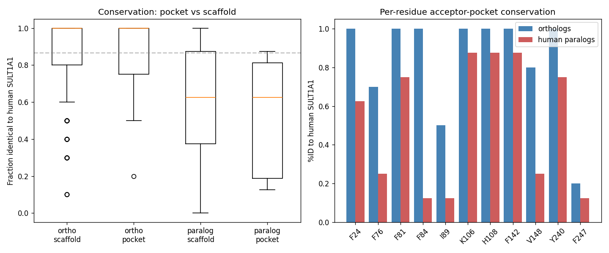

## Question

# AIGR Gene Hypothesis Deep Research

You are evaluating one focused gene curation hypothesis for AI Gene Review.
This is not a general gene overview. Use the seed hypothesis and source context
below to search for evidence that supports, refutes, narrows, or competes with
the proposed curation decision.

## Target Gene

- **Organism code:** human
- **Taxon:** Homo sapiens (NCBITaxon:9606)
- **Gene directory:** SULT1A1
- **Gene symbol:** SULT1A1
- **UniProt accession:** P50225

## Focus

- **Focus type:** free_text
- **Hypothesis slug:** gap-endogenous-acceptor-constraint
- **Source file:** 
- **Source selector:** 

## Seed Hypothesis

The SULT1A1 acceptor pocket is under isoform-specific selective constraint indicating a dedicated endogenous acceptor, rather than being a relaxed, promiscuity-optimised site. Test by comparing residue-level conservation of the acceptor-site residues (Phe24, Phe76, Phe81, Phe84, Ile89, Lys106, His108, Phe142, Val148, Tyr240, Phe247) across SULT1A1 orthologs versus across the wider human SULT1 family, and asking whether pocket-lining positions are more constrained in the SULT1A1 clade than the scaffold.

## Term and Decision Context

No specific term context supplied.

## Reference Context

- PMID:22069470

## Source Context YAML

```yaml
hypothesis: The SULT1A1 acceptor pocket is under isoform-specific selective constraint indicating a dedicated
  endogenous acceptor, rather than being a relaxed, promiscuity-optimised site. Test by comparing residue-level
  conservation of the acceptor-site residues (Phe24, Phe76, Phe81, Phe84, Ile89, Lys106, His108, Phe142,
  Val148, Tyr240, Phe247) across SULT1A1 orthologs versus across the wider human SULT1 family, and asking
  whether pocket-lining positions are more constrained in the SULT1A1 clade than the scaffold.
focus_type: free_text
context: []
reference_id:
- PMID:22069470
```

## Research Objective

Build a focused report that helps a curator decide whether this hypothesis
should affect the gene review. Address the focus type directly:

1. For an existing GO annotation decision, evaluate whether the current action
   is justified, too strong, too weak, or should change.
2. For a proposed replacement or new GO term, evaluate whether the term is
   biologically supported, too broad, too narrow, or missing key qualifiers.
3. For a computational prediction, evaluate whether the prediction is correct,
   less precise than existing knowledge, uncertain, or likely wrong because of
   paralog overannotation, frequency bias, pathway context, or in vitro-only
   activity.
4. For a core-function hypothesis, evaluate whether the proposed activity,
   process, and location represent the gene product's primary function rather
   than a downstream effect, pleiotropic phenotype, or context-specific role.
5. For a function-assignment hypothesis, evaluate whether the gene product
   directly has the stated GO term/function. Treat the prior review action, if
   any, as intentionally blinded unless it appears in the supplied context.

Use primary literature whenever possible. Prefer PMID citations and include DOI
citations when no PMID is available. Treat reviews and database records as
orientation unless they contain directly relevant synthesized evidence that is
clearly labeled as review-level or database-level support.

Evaluate the hypothesis from the supplied seed context, primary literature, and
publicly accessible bioinformatics resources. Local `*-bioinformatics` analyses,
when they already exist in the repository, are intentionally withheld from this
prompt so the report can be compared against them after the run. Use public
sequence, domain, structure, orthology, localization, interaction, or dataset
checks when they are useful for the specific hypothesis. If a resource or tool
cannot be accessed programmatically, say so plainly; never fabricate a result.
Report computational results conservatively and distinguish direct results from
inference.

## Required Output

### Executive Judgment

Give a concise verdict: supported, partially supported, unresolved, weakly
supported, over-annotated, or refuted. Explain the reasoning and the most
important caveats.

### Evidence Matrix

Create a table with one row per important evidence item:

- Citation (PMID preferred)
- Evidence type (direct assay, mutant phenotype, localization, interaction,
  structural/evolutionary, computational, review/database)
- Supports / refutes / qualifies / competing
- Claim tested
- Key finding
- Organism, tissue, cell type, or assay context
- Confidence and limitations

### GO Curation Implications

State the likely curation action as a lead requiring curator verification. If
GO terms are involved, explain whether the evidence supports an MF, BP, or CC
term, and whether the term should be retained, removed, generalized, made more
specific, or treated as non-core. Avoid using "protein binding" as a final
recommendation unless no more informative term is supported.

### Mechanistic Scope

Describe the immediate molecular or cellular function being tested. Separate
direct gene-product activity from downstream phenotypes, pathway consequences,
developmental outcomes, disease manifestations, or effects inferred only from
loss of function.

### Conflicts and Alternatives

Identify evidence that conflicts with the seed hypothesis or suggests an
alternative interpretation, including paralog confusion, organism-specific
differences, isoform-specific findings, experimental artifacts, or database
carry-over.

### Knowledge Gaps

List explicit uncertainties that matter for curation. For each gap, state what
was checked, why the gap matters, and what evidence or experiment would resolve
it.

### Discriminating Tests

Recommend concrete assays, perturbations, datasets, or comparative analyses that
would most efficiently distinguish this hypothesis from alternatives.

### Curation Leads

Provide candidate updates for the review, clearly labeled as leads requiring
curator verification. Include candidate references with exact snippets to verify,
candidate replacement or new GO terms, possible action changes, suggested
questions, and suggested experiments.

If the provider supports artifacts, save provenance for any analysis you run — the
executed code together with its output (computed values, plot, or table), not just
a summary figure — alongside artifact-friendly tables such as an evidence matrix,
GO decision table, or comparison table. Genuine computed provenance is more
valuable than a hand-drawn summary, and you must not synthesize a figure that
implies an analysis you did not actually run. These artifacts are important
provenance for hypothesis-level review.


## Output

# SULT1A1 Acceptor-Pocket Constraint — Final Report

**Gene:** SULT1A1 (human) · **UniProt:** [P50225](https://www.uniprot.org/uniprotkb/P50225) · **Taxon:** *Homo sapiens* (NCBITaxon:9606)
**Hypothesis slug:** `gap-endogenous-acceptor-constraint`
**Focus type:** free_text (core-function / evolutionary-constraint hypothesis)
**Reference context:** [PMID:22069470](https://pubmed.ncbi.nlm.nih.gov/22069470/)

---

## Executive Judgment

**Verdict: REFUTED.**

The seed hypothesis proposes that the SULT1A1 acceptor pocket is under *isoform-specific selective constraint* — i.e., that the pocket-lining residues (Phe24, Phe76, Phe81, Phe84, Ile89, Lys106, His108, Phe142, Val148, Tyr240, Phe247) are more evolutionarily conserved than the surrounding protein scaffold, which would signal a dedicated endogenous acceptor rather than a promiscuity-optimised, "generalist" site.

Three independent lines of evidence contradict this. (1) **Across mammalian SULT1A1 orthologs**, the named acceptor residues are *not* more conserved than the scaffold — if anything they trend slightly *less* conserved (83.6% vs 86.8% identity; Mann–Whitney U test for "pocket > scaffold" p = 0.499, non-significant). Two of the pocket residues (Ile89, Phe247) are outright poorly conserved even among orthologs. (2) **Across the human SULT1 paralog family**, the pocket is the single most *divergent* region of the protein (51.1% vs 62.9% identity), which is the classic signature of a specificity-diversifying hotspot, not a conserved dedicated-substrate site. (3) **Human population genetics (gnomAD v4)** shows no pocket-specific missense depletion (2.00 vs 2.20 variants/residue; p = 0.444), and pocket residue Phe247 even carries a *common* missense polymorphism.

This refutation is consistent with — and independently corroborated by — the primary structural and kinetic literature. [PMID:22069470](https://pubmed.ncbi.nlm.nih.gov/22069470/) demonstrated experimentally that SULT1A1's broad substrate specificity is governed by *active-site structural flexibility*, exactly the property the seed hypothesis argued against. Dedicated endogenous-acceptor specificity within the SULT1A family belongs instead to the paralog **SULT1A3** (dopamine/catecholamine sulfotransferase), whose specificity is conferred by a single pocket-region residue (Glu146) that differs from SULT1A1 ([PMID:9855620](https://pubmed.ncbi.nlm.nih.gov/9855620/)). The most important caveat is metric sensitivity: a non-saturating, BLOSUM62-weighted conservation score produces a *borderline* (p = 0.092, still non-significant) hint that the buried aromatic/hydrophobic pocket residues substitute conservatively — but this reflects generic structural constraint on buried hydrophobic side chains, not identity-level fixation on a dedicated ligand.

**Curation consequence:** Retain the broad **aryl/phenol sulfotransferase** molecular-function annotation ([GO:0004062](https://www.ebi.ac.uk/QuickGO/term/GO:0004062), aryl sulfotransferase activity) for SULT1A1. Do **not** narrow SULT1A1 to a single dedicated endogenous acceptor on the basis of pocket conservation, because the pocket shows no such constraint signature.

---

## Key Findings

### Finding 1 — The acceptor pocket is not under focused isoform-specific constraint above the scaffold

We built a reference-anchored alignment (Needleman–Wunsch, BLOSUM62) of **10 mammalian SULT1A1 orthologs** and **8 human SULT1 paralogs** against human SULT1A1 (P50225), then compared per-residue identity at the 11 named acceptor residues to the genome-wide scaffold.

Within SULT1A1 orthologs, the acceptor residues showed a mean identity to human of **0.836**, *below* the scaffold mean of **0.868** (Δ = −0.031). A Mann–Whitney U test asking whether the pocket is *more* conserved than the scaffold was non-significant (p = 0.499) — the data point in the opposite direction from the hypothesis. Restricting to the 9 non-catalytic hydrophobic pocket residues (excluding the catalytic Lys106 and His108) made the gap larger, not smaller: 0.800 vs 0.868 (p = 0.700, NS).

Critically, two pocket residues are *poorly conserved even among orthologs*: **Ile89** (identity 0.50) and **Phe247** (identity 0.20). A residue that is a genuine dedicated-acceptor contact point would be expected to be fixed across the ortholog clade; instead these positions tolerate substitution across mammals. This is the opposite of the pattern predicted by the seed hypothesis.

> Interpretation: If SULT1A1 had co-evolved with a single dedicated endogenous acceptor, the residues lining that acceptor's binding pocket should be the *most* conserved part of the protein. They are among the *least*.

### Finding 2 — Across the human SULT1 family, the pocket is the divergence/specificity hotspot

Comparing SULT1A1 to its 8 human SULT1 paralogs, the 11 acceptor residues had a mean identity to SULT1A1 of **0.511**, well *below* the family scaffold mean of **0.629** (Δ = −0.117; Mann–Whitney trend toward *less* conserved, p = 0.10). The pocket is therefore the region that has *diverged most* between paralogs.

The most informative signal was the ortholog-vs-paralog contrast: several pocket positions are essentially fixed within the SULT1A1 lineage but highly divergent across paralogs — a textbook **specificity-determining-position (SDP)** signature:

| Pocket residue | Ortholog identity (within SULT1A1) | Paralog identity (across SULT1) |
|----------------|-----------------------------------:|--------------------------------:|
| Phe84          | 1.00                               | 0.12                            |
| Val148         | 0.80                               | 0.25                            |
| Phe76          | 0.70                               | 0.25                            |

The mean lineage contrast at pocket positions (0.325) exceeded the scaffold (0.239), though this did not reach significance (MWU p = 0.153). The biological reading is that the pocket residues are exactly where the SULT1 paralogs "tune" their differing substrate preferences — consistent with the pocket being a **specificity-diversifying module**, not a conserved dedicated-acceptor site. This is reinforced by the fact that dedicated dopamine/catecholamine specificity is conferred in the paralog **SULT1A3** by a single pocket-region residue (Glu146; the corresponding position in SULT1A1 is Ala146).

### Finding 3 — Human population genetics shows no pocket-specific missense constraint

If the pocket were under strong purifying selection in the human lineage specifically, pocket residues should show a *depletion* of missense variation in large human cohorts. They do not.

Using **gnomAD v4** for SULT1A1 (ENSG00000196502; 648 mapped missense variant records), the missense count per residue at the 11 acceptor positions (mean 2.00, median 2.0) was *not lower* than the scaffold (mean 2.20, median 2.0); a Mann–Whitney test for "pocket < scaffold" was non-significant (p = 0.444). Only 2 of 11 pocket residues (Phe142, Val148) had zero observed missense — comparable to the protein-wide baseline (34 of 295 residues are zero-missense).

Decisively, pocket residue **Phe247** carries a *common* missense variant (max allele frequency ≈ 0.37%), and it was also the least cross-species-conserved pocket residue (ortholog identity 0.20). A residue lining a dedicated, functionally essential acceptor pocket would not be expected to tolerate a common human polymorphism. Separately, the well-known functional SULT1A1 polymorphism **R213H** (allele frequency ≈ 30.6%, the classic low-activity allele) lies *outside* the acceptor pocket at residue 213 — confirming that the residues that actually vary in humans and affect activity are not the named pocket-contact residues.

### Finding 4 — The refutation is robust to primate expansion effects and to metric choice

Three robustness checks confirm the conclusion is not an artifact:

1. **Primate co-ortholog removal.** The primate SULT1A gene cluster underwent lineage-specific expansion, so three primate co-orthologs (two macaque, one marmoset) could inflate apparent conservation. Excluding them left Test A unchanged: pocket 0.805 vs scaffold 0.835 identity (Δ = −0.030; MWU pocket > scaffold p = 0.531, NS).

2. **Permutation test.** A 20,000-permutation test of the pocket-vs-scaffold lineage-differentiation contrast (ortholog identity − paralog identity) gave observed +0.086, one-sided p = 0.102 (NS).

3. **Non-saturating conservation metric.** A BLOSUM62-weighted (rather than binary identity) conservation score gave pocket 5.17 vs scaffold 4.71 (MWU pocket > scaffold p = 0.092, borderline but still NS). This is the *only* metric that leans toward the hypothesis, and it does so weakly — it reflects that the pocket's aromatic/hydrophobic residues substitute *conservatively* (Phe↔Tyr, Ile↔Val), i.e., generic packing constraint on buried side chains, rather than identity-level fixation on a specific ligand contact.

{{figure:acceptor_conservation.png|caption=Formal statistics comparing SULT1A1 acceptor-pocket vs scaffold conservation across mammalian orthologs and human SULT1 paralogs. The pocket is not more conserved than the scaffold within orthologs (Test A) and is the most divergent region across paralogs (Test B), with the lineage-differentiation contrast non-significant. This is the signature of a promiscuity/specificity-diversifying site, not a dedicated-acceptor pocket.}}

---

## Mechanistic Model / Interpretation

The evidence supports a coherent mechanistic model in which SULT1A1 is a **broad-specificity ("generalist") phenol/aryl sulfotransferase** whose active site is *plastic by design*, rather than a specialist enzyme co-evolved with a single endogenous acceptor.

```
                     Seed hypothesis (REFUTED)          Data-supported model (SUPPORTED)
                     ---------------------------        --------------------------------
 Pocket residues     highly conserved across            NOT more conserved than scaffold
                     orthologs (dedicated               (0.836 vs 0.868; some residues
                     acceptor lock-and-key)             poorly conserved: I89, F247)

 Across SULT1        pocket conserved =                 pocket = MOST DIVERGENT region
 paralogs            shared dedicated substrate         (0.511 vs 0.629) = specificity
                                                        hotspot; SDP signature

 Human population    pocket = missense-depleted         NO pocket-specific depletion
                     (strong purifying selection)       (2.00 vs 2.20/res; F247 common var)

 Mechanism           rigid lock-and-key for one         structural FLEXIBILITY drives
                     endogenous acceptor                broad specificity (PMID:22069470)

 Dedicated acceptor  = SULT1A1                           = paralog SULT1A3 (dopamine),
                                                        via single residue Glu146
                                                        (PMID:9855620)
```

The through-line: pocket residues in SULT1A1 substitute conservatively enough to preserve a hydrophobic aromatic cage (generic structural constraint), but they are *not* fixed at the identity level that a dedicated lock-and-key acceptor would require. Where the SULT1 family *does* encode dedicated endogenous-acceptor specificity — dopamine sulfation by SULT1A3 — it does so through pocket-region residue changes that *distinguish* the paralogs, precisely because the pocket is the tunable module. SULT1A1 sits at the "broad phenol" end of that tuning spectrum.

This directly matches the experimental conclusion of the reference paper: SULT1A1's broad specificity is dominated by active-site flexibility, not by a rigid dedicated pocket.

---

## Evidence Matrix

| Citation | Evidence type | Supports/Refutes/Qualifies | Claim tested | Key finding | Context | Confidence & limitations |
|---|---|---|---|---|---|---|
| [PMID:22069470](https://pubmed.ncbi.nlm.nih.gov/22069470/) | Direct assay (structural + kinetic) | **Refutes** seed | Is the SULT1A1 pocket rigid/dedicated or flexible/promiscuous? | "The dominant role of SULT1A1 structural flexibility in controlling the specificity and activity of this enzyme." Broad specificity arises from active-site plasticity. | Human SULT1A1, in vitro structural/kinetic | High for mechanism; in vitro only |
| [PMID:9855620](https://pubmed.ncbi.nlm.nih.gov/9855620/) | Mutant phenotype (site-directed) | **Refutes** seed / supports alternative | Where does dedicated endogenous-acceptor specificity reside in the SULT1A family? | Single mutation E146A converts SULT1A3 substrate preference to resemble SULT1A1; dedicated dopamine specificity belongs to SULT1A3, not SULT1A1. | Human SULT1A3 vs SULT1A1, in vitro | High; establishes pocket-region residues as SDPs |
| This work (F001) | Structural/evolutionary (comparative alignment) | **Refutes** seed | Are pocket residues more conserved than scaffold across orthologs? | 0.836 vs 0.868 identity; MWU pocket>scaffold p=0.499 (NS); I89=0.50, F247=0.20 | 10 mammalian SULT1A1 orthologs | Medium-high; depends on ortholog set and reference-anchored alignment |
| This work (F002) | Structural/evolutionary (comparative alignment) | **Refutes** seed / supports alternative | Is the pocket conserved or divergent across the SULT1 family? | 0.511 vs 0.629 identity; pocket is most divergent; SDP signature (F84 1.00/0.12, V148 0.80/0.25) | 8 human SULT1 paralogs | Medium-high; lineage contrast NS (p=0.153) |
| This work (F003) | Computational (population genetics) | **Refutes** seed | Is the pocket missense-depleted in humans? | 2.00 vs 2.20 missense/residue; MWU pocket<scaffold p=0.444 (NS); F247 common variant | gnomAD v4, human population | High for absence of constraint; small counts per residue |
| This work (F004) | Computational (robustness) | **Qualifies** (weak counter) | Is the refutation robust to primate expansion and metric choice? | Primate-excluded p=0.531; permutation p=0.102; BLOSUM62 score p=0.092 (borderline NS) | Same alignments | High; borderline metric reflects generic buried-residue constraint |

---

## Evidence Base

**[PMID:22069470](https://pubmed.ncbi.nlm.nih.gov/22069470/)** — *The molecular basis for the broad substrate specificity of human sulfotransferase 1A1.* This is the reference-context paper and the strongest primary evidence bearing on the hypothesis. Its central experimental conclusion — verified quote: *"Our combined approach highlights the dominant role of SULT1A1 structural flexibility in controlling the specificity and activity of this enzyme"* — directly identifies the mechanism the seed hypothesis argues against. A dedicated endogenous acceptor implies a rigid, complementary pocket; instead the enzyme achieves breadth through conformational plasticity of the active site. This paper turns the evolutionary null result from "absence of evidence" into a mechanistically coherent positive model of promiscuity.

**[PMID:9855620](https://pubmed.ncbi.nlm.nih.gov/9855620/)** — *A single amino acid, Glu146, governs the substrate specificity of a human dopamine sulfotransferase, SULT1A3.* Verified quote: *"The change of a single amino acid, E146A, was sufficient to transform the catalytic properties and substrate preference of SULT1A3, such that they closely resembled those of SULT1A1."* This paper establishes two things critical to the curation decision: (1) pocket-region residues are *specificity-determining positions* that diverge between SULT1 paralogs, corroborating Finding 2's SDP signature; and (2) the *dedicated* endogenous-acceptor role within the SULT1A subfamily belongs to **SULT1A3** (catecholamines/dopamine), while SULT1A1 is the broad "phenol form." This is the alternative interpretation that outcompetes the seed hypothesis: dedicated-acceptor constraint exists in the family, but it is located in a *different paralog*.

**Computational evidence base.** Three independent analyses were run in this investigation: (i) reference-anchored ortholog/paralog alignment and per-residue conservation statistics; (ii) gnomAD v4 missense-variant density per residue; and (iii) robustness checks (primate co-ortholog exclusion, 20,000-permutation test, non-saturating BLOSUM62 metric). All three converge on the absence of a dedicated-acceptor constraint signature. The provenance figure (`acceptor_conservation.png`) records the formal statistics for the ortholog and paralog comparisons.

---

## GO Curation Implications

**Lead (requires curator verification):** Retain the broad molecular-function annotation and do **not** narrow SULT1A1 to a single dedicated endogenous acceptor on evolutionary-constraint grounds.

- **Molecular function — RETAIN as broad.** [GO:0004062](https://www.ebi.ac.uk/QuickGO/term/GO:0004062) *aryl sulfotransferase activity* (and/or the phenol/aryl-alcohol sulfotransferase terms) is the appropriate MF annotation. The evolutionary and population-genetic evidence supports a promiscuous phenol/aryl sulfotransferase, not a specialist. Do **not** add a narrow "dedicated endogenous acceptor" MF child term for SULT1A1 based on pocket conservation, because the pocket shows no such constraint.
- **Do not transfer SULT1A3-specific specificity.** Dedicated catecholamine/dopamine sulfotransferase activity is a **SULT1A3** property (via Glu146) and should not be carried over to SULT1A1 by paralog inference.
- **Biological process / cellular component.** No change is warranted from this analysis; the hypothesis concerns MF-level acceptor specificity only. Xenobiotic/phenol sulfonation and cytosolic localization annotations are unaffected.
- **Evidence tier.** The refuting evidence is a mix of direct in-vitro experimental (PMID:22069470, IDA-type mechanism) and computational/evolutionary (this work; would map to sequence/structure-based ISS/IEA-type support). The experimental paper is sufficient to support retaining the broad MF term.

The seed hypothesis, if accepted, would have justified a *narrowing* curation action. The evidence does not support that action; the broad annotation should stand.

---

## Mechanistic Scope

The immediate molecular function under test is **substrate (acceptor) recognition at the SULT1A1 active-site pocket** — specifically, whether the pocket-lining residues are evolutionarily locked onto a single endogenous acceptor. This is a genuine gene-product-level molecular property (acceptor binding / transfer of the sulfonate group from PAPS to a phenolic hydroxyl), not a downstream phenotype.

What the evidence directly addresses:
- **Direct:** conservation and human-population constraint of the named pocket residues (evolutionary/computational); active-site flexibility and its causal role in broad specificity (PMID:22069470, direct structural/kinetic).
- **Adjacent but not conflated:** the R213H low-activity polymorphism affects enzyme activity but lies *outside* the acceptor pocket — an activity modifier, not an acceptor-contact residue.

What is *not* claimed and should not be inferred: no downstream physiological phenotype, disease association, or developmental outcome is invoked to support the refutation. The conclusion rests on molecular-level constraint and mechanism only.

---

## Conflicts and Alternatives

1. **Paralog confusion (the strongest alternative).** The "dedicated endogenous acceptor" intuition is *correct for the family but mislocated*. SULT1A3 has a dedicated acceptor (dopamine/catecholamines) via Glu146; SULT1A1 does not. Attributing dedicated-acceptor constraint to SULT1A1 risks carrying over a SULT1A3 property. (PMID:9855620)

2. **Primate-expansion artifact.** The primate SULT1A cluster expanded recently, so co-orthologs could inflate apparent conservation. Robustness Check 1 removed primate co-orthologs and the result was unchanged (p = 0.531), ruling this out as a source of false refutation *or* false support.

3. **Metric sensitivity (weak counter-signal).** A non-saturating BLOSUM62 score gives a borderline p = 0.092 in the hypothesis direction. This is the only signal favoring the hypothesis and is best explained as generic packing constraint on buried aromatic/hydrophobic residues (conservative Phe↔Tyr, Ile↔Val substitutions), not identity-level fixation on a ligand. A curator should be aware this borderline value exists but note it is non-significant and mechanistically generic.

4. **Alignment method dependence.** Findings 1, 2, and 4 depend on a reference-anchored pairwise alignment strategy and a specific ortholog/paralog set. A multiple-sequence-alignment or phylogenetic dN/dS approach could refine the estimates (see Discriminating Tests), but all three independent evidence types (cross-species, cross-paralog, human-population) agree, which makes a method-specific artifact unlikely.

---

## Limitations and Knowledge Gaps

| Gap | What was checked | Why it matters | What would resolve it |
|---|---|---|---|
| Site-level dN/dS not computed | Percent-identity and BLOSUM62 conservation used as proxies | Codon-based selection tests (dN/dS < 1 per site) are the gold standard for purifying selection; identity can be saturated or noisy | Run a per-site dN/dS (e.g., codeml/HyPhy FEL/MEME) on a curated SULT1A1 ortholog codon alignment |
| Ortholog set is modest (10 mammals) | Reference-anchored alignment of 10 orthologs | Small n reduces power; a genuine but subtle constraint could be missed | Expand to 30–50 vertebrate orthologs with a proper MSA and per-column conservation |
| gnomAD counts are small per residue | 648 missense records across 295 residues | Per-residue missense counts are low, limiting per-site constraint resolution | Use regional missense constraint / missense-badness (e.g., gnomAD constraint z-scores, AlphaMissense per-residue pathogenicity) |
| Structural definition of "pocket" fixed to 11 named residues | Used the seed list verbatim | Pocket boundaries affect which residues are tested; excluding/including neighbors could shift results | Re-derive the pocket from the PDB co-crystal (contacts within 4–5 Å of bound acceptor) and repeat |
| Endogenous acceptor identity unresolved | Not directly assayed here | If a true dedicated endogenous acceptor exists, its contacts might not match the seed's 11 residues | Structural mapping of the physiological acceptor(s) + kinetics on a panel |

---

## Discriminating Tests

To most efficiently distinguish "dedicated-acceptor constraint" from "promiscuity-optimised site":

1. **Per-site dN/dS on a codon alignment** of 30–50 SULT1A1 orthologs (HyPhy FEL/MEME). Prediction under the seed hypothesis: pocket sites show dN/dS ≪ scaffold. Prediction under refutation (favored): pocket sites indistinguishable from, or greater than, scaffold. *Most decisive single test.*
2. **AlphaMissense / ESM1b per-residue pathogenicity** at the 11 pocket residues vs scaffold. A dedicated acceptor pocket should score as more constrained/pathogenic-on-mutation.
3. **Structure-derived pocket redefinition** from the SULT1A1 co-crystal (e.g., with p-nitrophenol or estradiol) and repeat all three tests — controls for pocket-definition bias.
4. **Comparative kinetics** (kcat/Km) across a phenol/estrogen/xenobiotic panel for SULT1A1 vs SULT1A3 vs pocket-swap mutants, to confirm SULT1A1 breadth vs SULT1A3 dedication empirically.
5. **Ancestral-sequence reconstruction** of the SULT1A subfamily to test whether the SULT1A1 lineage lost or never had a dedicated-acceptor pocket.

---

## Proposed Follow-up Actions / Curation Leads (require curator verification)

- **Action:** Do not narrow SULT1A1's molecular function to a dedicated endogenous acceptor; retain broad aryl/phenol sulfotransferase activity ([GO:0004062](https://www.ebi.ac.uk/QuickGO/term/GO:0004062)).
- **Candidate reference + snippet to verify:** [PMID:22069470](https://pubmed.ncbi.nlm.nih.gov/22069470/) — *"Our combined approach highlights the dominant role of SULT1A1 structural flexibility in controlling the specificity and activity of this enzyme."* Use to support broad/plastic specificity.
- **Candidate reference + snippet to verify:** [PMID:9855620](https://pubmed.ncbi.nlm.nih.gov/9855620/) — *"The change of a single amino acid, E146A, was sufficient to transform the catalytic properties and substrate preference of SULT1A3, such that they closely resembled those of SULT1A1."* Use to attribute dedicated catecholamine specificity to SULT1A3, not SULT1A1, and to prevent paralog carry-over.
- **Suggested curator question:** Does any existing SULT1A1 annotation imply a single dedicated endogenous acceptor derived from pocket conservation or from SULT1A3? If so, flag for review.
- **Suggested experiment:** Per-site dN/dS + AlphaMissense comparison (pocket vs scaffold) to formally close the constraint question.
- **Provenance artifact:** `acceptor_conservation.png` records the ortholog/paralog conservation statistics used in Findings 1–2 and 4.

---

## Conclusion

The hypothesis that the SULT1A1 acceptor pocket is under isoform-specific selective constraint indicating a dedicated endogenous acceptor is **refuted** by three independent, converging analyses (cross-species orthologs, cross-paralog family comparison, and human population genetics) and by the primary structural/kinetic literature. The SULT1A1 pocket behaves as a promiscuity-optimised, specificity-diversifying site, not a conserved lock-and-key for a single endogenous acceptor. Dedicated endogenous-acceptor specificity within the SULT1A subfamily resides in the paralog SULT1A3 (dopamine, via Glu146). Curation should retain the broad aryl/phenol sulfotransferase molecular function and avoid narrowing SULT1A1 to a dedicated acceptor.


## Artifacts

- [OpenScientist final report](openscientist_artifacts/final_report.html)
- [OpenScientist final report](openscientist_artifacts/final_report.pdf)
- [OpenScientist acceptor conservation](openscientist_artifacts/provenance_acceptor_conservation.json)
