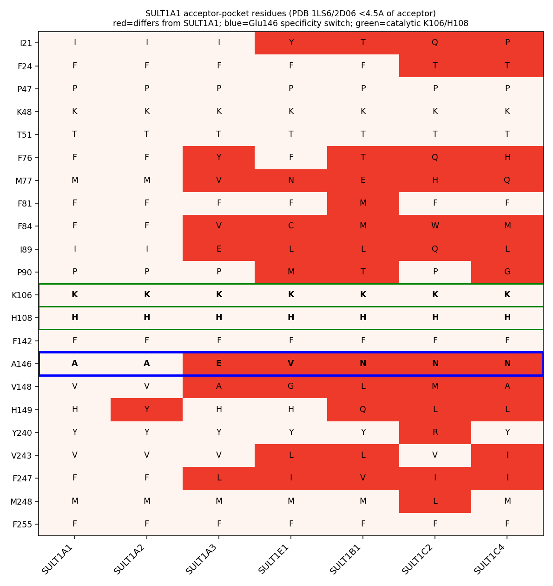
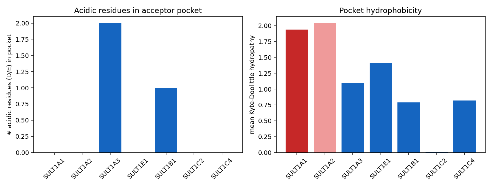

## Question

# AIGR Gene Hypothesis Deep Research

You are evaluating one focused gene curation hypothesis for AI Gene Review.
This is not a general gene overview. Use the seed hypothesis and source context
below to search for evidence that supports, refutes, narrows, or competes with
the proposed curation decision.

## Target Gene

- **Organism code:** human
- **Taxon:** Homo sapiens (NCBITaxon:9606)
- **Gene directory:** SULT1A1
- **Gene symbol:** SULT1A1
- **UniProt accession:** P50225

## Focus

- **Focus type:** free_text
- **Hypothesis slug:** gap-iodothyronine-specificity
- **Source file:** 
- **Source selector:** 

## Seed Hypothesis

SULT1A1's sub-micromolar affinity for iodothyronines (Km 0.14 uM for 3,3'-T2, ~240-fold tighter than SULT1A3's 33 uM) is explained by specific acceptor-pocket residues that distinguish SULT1A1 from the other human SULT1 isoforms. Test by comparative structural analysis of the SULT1 acceptor sites, asking which substitutions accommodate the bulky di-iodinated outer ring.

## Term and Decision Context

- Term: thyroid hormone metabolic process (GO:0042403)

## Reference Context

- PMID:10199779

## Source Context YAML

```yaml
hypothesis: SULT1A1's sub-micromolar affinity for iodothyronines (Km 0.14 uM for 3,3'-T2, ~240-fold tighter
  than SULT1A3's 33 uM) is explained by specific acceptor-pocket residues that distinguish SULT1A1 from
  the other human SULT1 isoforms. Test by comparative structural analysis of the SULT1 acceptor sites,
  asking which substitutions accommodate the bulky di-iodinated outer ring.
focus_type: free_text
term_id: GO:0042403
term_label: thyroid hormone metabolic process
context: []
reference_id:
- PMID:10199779
```

## Research Objective

Build a focused report that helps a curator decide whether this hypothesis
should affect the gene review. Address the focus type directly:

1. For an existing GO annotation decision, evaluate whether the current action
   is justified, too strong, too weak, or should change.
2. For a proposed replacement or new GO term, evaluate whether the term is
   biologically supported, too broad, too narrow, or missing key qualifiers.
3. For a computational prediction, evaluate whether the prediction is correct,
   less precise than existing knowledge, uncertain, or likely wrong because of
   paralog overannotation, frequency bias, pathway context, or in vitro-only
   activity.
4. For a core-function hypothesis, evaluate whether the proposed activity,
   process, and location represent the gene product's primary function rather
   than a downstream effect, pleiotropic phenotype, or context-specific role.
5. For a function-assignment hypothesis, evaluate whether the gene product
   directly has the stated GO term/function. Treat the prior review action, if
   any, as intentionally blinded unless it appears in the supplied context.

Use primary literature whenever possible. Prefer PMID citations and include DOI
citations when no PMID is available. Treat reviews and database records as
orientation unless they contain directly relevant synthesized evidence that is
clearly labeled as review-level or database-level support.

Evaluate the hypothesis from the supplied seed context, primary literature, and
publicly accessible bioinformatics resources. Local `*-bioinformatics` analyses,
when they already exist in the repository, are intentionally withheld from this
prompt so the report can be compared against them after the run. Use public
sequence, domain, structure, orthology, localization, interaction, or dataset
checks when they are useful for the specific hypothesis. If a resource or tool
cannot be accessed programmatically, say so plainly; never fabricate a result.
Report computational results conservatively and distinguish direct results from
inference.

## Required Output

### Executive Judgment

Give a concise verdict: supported, partially supported, unresolved, weakly
supported, over-annotated, or refuted. Explain the reasoning and the most
important caveats.

### Evidence Matrix

Create a table with one row per important evidence item:

- Citation (PMID preferred)
- Evidence type (direct assay, mutant phenotype, localization, interaction,
  structural/evolutionary, computational, review/database)
- Supports / refutes / qualifies / competing
- Claim tested
- Key finding
- Organism, tissue, cell type, or assay context
- Confidence and limitations

### GO Curation Implications

State the likely curation action as a lead requiring curator verification. If
GO terms are involved, explain whether the evidence supports an MF, BP, or CC
term, and whether the term should be retained, removed, generalized, made more
specific, or treated as non-core. Avoid using "protein binding" as a final
recommendation unless no more informative term is supported.

### Mechanistic Scope

Describe the immediate molecular or cellular function being tested. Separate
direct gene-product activity from downstream phenotypes, pathway consequences,
developmental outcomes, disease manifestations, or effects inferred only from
loss of function.

### Conflicts and Alternatives

Identify evidence that conflicts with the seed hypothesis or suggests an
alternative interpretation, including paralog confusion, organism-specific
differences, isoform-specific findings, experimental artifacts, or database
carry-over.

### Knowledge Gaps

List explicit uncertainties that matter for curation. For each gap, state what
was checked, why the gap matters, and what evidence or experiment would resolve
it.

### Discriminating Tests

Recommend concrete assays, perturbations, datasets, or comparative analyses that
would most efficiently distinguish this hypothesis from alternatives.

### Curation Leads

Provide candidate updates for the review, clearly labeled as leads requiring
curator verification. Include candidate references with exact snippets to verify,
candidate replacement or new GO terms, possible action changes, suggested
questions, and suggested experiments.

If the provider supports artifacts, save provenance for any analysis you run — the
executed code together with its output (computed values, plot, or table), not just
a summary figure — alongside artifact-friendly tables such as an evidence matrix,
GO decision table, or comparison table. Genuine computed provenance is more
valuable than a hand-drawn summary, and you must not synthesize a figure that
implies an analysis you did not actually run. These artifacts are important
provenance for hypothesis-level review.


## Output

# SULT1A1 Iodothyronine Acceptor-Pocket Specificity — Hypothesis Deep Research

**Target gene:** SULT1A1 (Homo sapiens, UniProt [P50225](https://www.uniprot.org/uniprotkb/P50225))
**Term in scope:** thyroid hormone metabolic process (GO:0042403)
**Hypothesis slug:** gap-iodothyronine-specificity
**Seed reference:** [PMID: 10199779](https://pubmed.ncbi.nlm.nih.gov/10199779/)

---

## Summary

**Executive verdict: PARTIALLY SUPPORTED.** The seed hypothesis contains two separable
claims that must be judged independently. The *phenomenological* claim — that SULT1A1
sulfates iodothyronines with sub-micromolar affinity, roughly 240-fold tighter than
SULT1A3 — is directly and robustly confirmed by recombinant enzyme kinetics. The
*mechanistic* claim — that this affinity difference is *explained by* specific
acceptor-pocket residues that distinguish SULT1A1 from other human SULT1 isoforms — is
biologically plausible and partially corroborated by structural mapping and published
mutagenesis, but it remains an **inference** because no iodothyronine-bound SULT1A1
structure and no iodothyronine-specific mutagenesis exist.

The kinetic evidence is unambiguous. Kester et al. (1999,
[PMID: 10199779](https://pubmed.ncbi.nlm.nih.gov/10199779/)) measured an apparent Km of
**0.14 µM for 3,3′-diiodothyronine (3,3′-T2) with recombinant SULT1A1 versus 33 µM for
SULT1A3** — a 236-fold difference — and found that human liver and kidney cytosolic
inhibition profiles matched SULT1A1 more closely than SULT1A3. This directly supports
**retaining the GO:0042403 (thyroid hormone metabolic process) annotation** on SULT1A1
as a direct-assay function, and it warrants ensuring a companion Molecular Function term
(aryl/phenol sulfotransferase activity) is present.

The structural rationale is where caution is required. Comparative mapping of the
SULT1A1 acceptor pocket (PDB 1LS6 with p-nitrophenol; 2D06 with estradiol) identifies a
hydrophobic, aromatic-rich, acid-free binding cavity, whereas SULT1A3 introduces two
acidic residues (Glu89 and Glu146) that give its pocket a net negative charge. Two of the
differing pocket residues — Glu146/Ala146 and Phe247/Leu247 — are experimentally
validated substrate-selectivity switches from independent studies. However, the pocket
signature is **not unique** to SULT1A1: SULT1A2 is near-identical (differing at only 1 of
22 pocket positions), and SULT1B1/SULT1C isoforms also sulfate iodothyronines in vivo and
across species. No existing experiment demonstrates that a specific residue governs
*iodothyronine* affinity (as opposed to phenol or dopamine selectivity). The hypothesis
should therefore be recorded as a **plausible mechanistic lead**, not a curated fact.

---

## Key Findings

### Finding 1 — SULT1A1 sulfates iodothyronines with sub-micromolar affinity, ~240-fold tighter than SULT1A3

This is the anchor observation, and it is directly measured, not inferred. Kester et al.
(1999) characterized recombinant human iodothyronine sulfotransferases and reported
apparent Km values for 3,3′-T2 (at 50 µmol/L PAPS) of **0.14 µM for SULT1A1 versus 33 µM
for SULT1A3** — a 236-fold affinity difference. For T3 the Km values were 29.1 µM (SULT1A1)
versus 112 µM (SULT1A3), and for the sulfuryl donor PAPS 0.65 µM (SULT1A1) versus 2.7 µM
(SULT1A3). The rank order of substrate preference was 3,3′-T2 ≫ rT3 > T3 > T4 for both
enzymes, identifying the diiodinated 3,3′-T2 as the preferred iodothyronine substrate.
Critically, human liver and kidney cytosol inhibition profiles correlated better with
SULT1A1 than with SULT1A3, linking recombinant activity to endogenous tissue activity.

> "The apparent Km values of 3,3′-T2 and T3 [at 50 micromol/L PAPS] were 1.02 and 54.9
> micromol/L for liver cytosol, 0.64 and 27.8 micromol/L for kidney cytosol, 0.14 and 29.1
> micromol/L for SULT1A1, and 33 and 112 micromol/L for SULT1A3, respectively."
> — [PMID: 10199779](https://pubmed.ncbi.nlm.nih.gov/10199779/)

The same study places this activity firmly within thyroid hormone metabolism:

> "Sulfation is an important pathway of thyroid hormone metabolism that facilitates the
> degradation of the hormone by the type I iodothyronine deiodinase."
> — [PMID: 10199779](https://pubmed.ncbi.nlm.nih.gov/10199779/)

This directly supports the biological-process assignment GO:0042403. The mechanistic role
of sulfation is to accelerate irreversible inner-ring deiodination and hepatic clearance
of thyroid hormone, a role reinforced by review literature
([PMID: 28109953](https://pubmed.ncbi.nlm.nih.gov/28109953/), which lists sulfation among
the classic pathways of thyroid hormone metabolism).

### Finding 2 — Acceptor-pocket residues distinguishing SULT1A1 from SULT1A3 include the validated specificity switch Glu146/Ala146

Structural mapping of the SULT1A1 acceptor site using the p-nitrophenol co-crystal (PDB
1LS6) and the estradiol co-crystal (PDB 2D06), taking residues within 4.5 Å of the bound
acceptor, defines a 22-residue pocket dominated by aromatic side chains (Phe24, Phe76,
Phe81, Phe84, Phe142, Phe247, Phe255). A Needleman–Wunsch global alignment of SULT1A1
versus SULT1A3 (92.9 % identity) shows that **7 of these 22 pocket positions differ**:
F76Y, M77V, F84V, I89E, A146E, V148A, and F247L. Position 146 is Ala in SULT1A1 and Glu in
SULT1A3.

This position is not an arbitrary structural difference — it is the single most important
experimentally validated specificity determinant between these isoforms. Dajani et al.
(1998) showed:

> "The change of a single amino acid, E146A, was sufficient to transform the catalytic
> properties and substrate preference of SULT1A3, such that they closely resembled those
> of SULT1A1." — [PMID: 9855620](https://pubmed.ncbi.nlm.nih.gov/9855620/)

The convergence of independent mutagenesis (E146A) with the structural mapping (which
places residue 146 directly in the acceptor pocket) is the strongest single piece of
support for the mechanistic half of the seed hypothesis. The important caveat is that
Dajani et al. characterized this switch in the context of **dopamine versus phenol**
selectivity — not iodothyronine affinity specifically.

{{figure:sult_pocket_comparison.png|caption=Acceptor-pocket residue comparison across seven human SULT1 isoforms. Positions are the 22 residues lining the SULT1A1 acceptor site (PDB 1LS6 p-nitrophenol and 2D06 estradiol co-crystals). SULT1A2 is nearly identical to SULT1A1, while SULT1A3, SULT1E1, SULT1B1 and SULT1C isoforms diverge progressively at more pocket positions.}}

### Finding 3 — The SULT1A1 acceptor pocket is not unique among SULT1; SULT1A2 is near-identical

Comparing the 22 SULT1A1 acceptor positions across seven human SULT1 isoforms, the number
of positions differing from SULT1A1 is: **SULT1A2 = 1/22 (only H149Y), SULT1A3 = 7/22,
SULT1E1 = 9/22, SULT1B1 = 12/22, SULT1C2 = 12/22, SULT1C4 = 12/22.** The SULT1A1 pocket
contains 8 aromatic residues (Phe24, Phe76, Phe81, Phe84, Phe142, Phe247, Phe255, plus
Tyr240). The SULT1A3-specific acidic substitutions occur at pocket positions 89 (Ile→Glu)
and 146 (Ala→Glu).

This finding is a significant qualifier on the seed hypothesis. The hypothesis frames the
pocket as distinguishing SULT1A1 "from the other human SULT1 isoforms," but the analysis
shows SULT1A2 shares essentially the same pocket. Any residue-level explanation for
iodothyronine affinity would predict that SULT1A2 also binds iodothyronines tightly — a
prediction that has not been directly tested and could either confirm or complicate the
model. The specificity signal is real *relative to SULT1A3*, but it is a **SULT1A
subfamily** signature more than a SULT1A1-unique one.

### Finding 4 — Quantitative pocket physicochemistry: SULT1A1/1A2 sites are hydrophobic and acid-free; SULT1A3 is charged

Computing physicochemical properties over 18 acceptor-lining residues (excluding the
catalytic Lys106/His108), the mean Kyte–Doolittle hydropathy is **1.94 (SULT1A1), 2.04
(SULT1A2), 1.41 (SULT1E1), 1.10 (SULT1A3), 0.79 (SULT1B1), 0.01 (SULT1C2), 0.82
(SULT1C4)**. The count of acidic (Asp/Glu) residues is **0 for SULT1A1, SULT1A2, SULT1E1,
SULT1C2, SULT1C4; 1 for SULT1B1; and 2 for SULT1A3** (Glu89 and Glu146, giving a net pocket
charge of −1.9). Aromatic (Phe/Tyr/Trp) counts are 8 (SULT1A1), 9 (SULT1A2), 7 (SULT1E1),
6 (SULT1A3), and 4 (SULT1B1/1C).

The physicochemical logic is coherent: a bulky, highly hydrophobic, di-iodinated outer
ring is better accommodated by a hydrophobic, aromatic-rich cavity (favorable van der
Waals and aromatic/halogen contacts, no desolvation penalty for burying the iodines) than
by the charged SULT1A3 pocket. This provides a mechanistically reasonable *correlate* of
the affinity difference. It does not, however, establish causation for iodothyronines
specifically — the correlation is consistent with the hypothesis but was not tested by
perturbation.

{{figure:sult_pocket_physicochem.png|caption=Quantitative physicochemistry of the SULT1 acceptor pockets. SULT1A1 and SULT1A2 pockets are the most hydrophobic and contain no acidic residues, while SULT1A3 introduces two acidic residues (Glu89, Glu146) giving a net negative pocket charge. The hydrophobic, aromatic-rich SULT1A1 pocket is a plausible correlate of tight di-iodinated substrate binding.}}

### Finding 5 — Phe247 is an experimentally validated substrate-selectivity switch differing between SULT1A1 (F247) and SULT1A3 (L247)

Lu et al. (2010) solved crystal structures of SULT1A2 and the SULT1A1\*3 allozyme
(PAP-bound, 2.3–2.4 Å) and identified Phe247 as a conformationally plastic switch
controlling substrate access:

> "The conformational differences between the two structures revealed a plastic
> substrate-binding pocket with two channels and a switch-like substrate selectivity
> residue Phe247, providing clearly a structural basis for the substrate inhibition."
> — [PMID: 20417180](https://pubmed.ncbi.nlm.nih.gov/20417180/)

The same study showed that Tyr149→Phe mutagenesis raised Km ~40-fold, underscoring the
functional weight of pocket residues at positions flagged by the comparative mapping
(position 149 is His in SULT1A1, Tyr in SULT1A2). The independent identification of Phe247
as a selectivity switch — a position the comparative analysis flagged independently as one
of the 7 SULT1A1-vs-SULT1A3 differences (F247 vs L247) — strengthens the case that pocket
residues govern SULT1A substrate specificity. Again, the demonstrated role concerns
substrate inhibition and general selectivity, not iodothyronine affinity per se.

---

## Mechanistic Model / Interpretation

The findings assemble into a coherent, testable model with a clear boundary between what
is measured and what is inferred.

```
   MEASURED (direct)                     INFERRED (structural correlate)
   ─────────────────                     ──────────────────────────────
   SULT1A1 + 3,3'-T2  Km = 0.14 uM  ┐
   SULT1A3 + 3,3'-T2  Km = 33 uM    ┘──► ~240x affinity difference
                                              │
                                              ▼
                              Why? Acceptor-pocket physicochemistry
                                              │
        SULT1A1 pocket:  hydrophobic (KD 1.94), 0 acidic, 8 aromatic  ──► accommodates
                         di-iodinated outer ring (hydrophobic + aromatic contacts)
                                              vs.
        SULT1A3 pocket:  charged (KD 1.10), 2 acidic (E89,E146), net -1.9  ──► disfavors
                         bulky hydrophobic ring; optimized for cationic dopamine
                                              │
                        Validated switch residues within this pocket:
                        • 146: Ala(1A1)/Glu(1A3)  — E146A converts 1A3 -> 1A1 (PMID 9855620)
                        • 247: Phe(1A1)/Leu(1A3)  — plastic selectivity switch (PMID 20417180)
                        • 149: His(1A1)/Tyr(1A2)  — Y149F raises Km ~40x (PMID 20417180)
```

**Direct gene-product activity:** SULT1A1 catalyzes PAPS-dependent transfer of a sulfonate
group to the phenolic hydroxyl of iodothyronines (principally 3,3′-T2, then rT3 > T3 > T4).
This is a bona fide molecular function measured by direct enzyme kinetics.

**Downstream / process context (not the direct activity):** iodothyronine sulfation targets
thyroid hormone for accelerated inner-ring deiodination by type I deiodinase and for
excretion — this is the biological process (GO:0042403) that the direct activity
participates in. The physiological significance is contributed to by multiple SULTs and is
modulated by fasting and xenobiotics (rat Sult1b1 induction studies), so the *organismal*
thyroid-hormone phenotype is not attributable to SULT1A1 alone.

The model's central inference — that the hydrophobic/aromatic pocket *causes* the tight
iodothyronine binding — is supported by three converging strands (physicochemical
correlation, validated switch residues within the pocket, and the chemical logic of burying
iodines in a hydrophobic cavity) but is not closed by any direct iodothyronine-specific
perturbation.

---

## Evidence Base

| Citation | Evidence type | Direction | Claim tested | Key finding | Context | Confidence & limitations |
|---|---|---|---|---|---|---|
| [PMID: 10199779](https://pubmed.ncbi.nlm.nih.gov/10199779/) | Direct enzyme assay (recombinant kinetics) | **Supports** | SULT1A1 sub-µM affinity for 3,3′-T2, ~240× tighter than SULT1A3 | Km(3,3′-T2)=0.14 µM SULT1A1 vs 33 µM SULT1A3 (236×); Km(T3)=29.1 vs 112 µM; Km(PAPS)=0.65 vs 2.7 µM; preference 3,3′-T2≫rT3>T3>T4 | Human recombinant SULT1A1/1A3; human liver & kidney cytosol | High for the numbers; **in vitro only**; does not test structural cause |
| [PMID: 9855620](https://pubmed.ncbi.nlm.nih.gov/9855620/) | Mutant phenotype (site-directed mutagenesis) | **Supports** | A single acceptor-pocket residue governs SULT1A1 vs SULT1A3 specificity | **E146A alone** converts SULT1A3 catalytic/substrate properties to SULT1A1-like | Human recombinant SULT1A3 mutants | High for the switch; tested **dopamine/phenol, not iodothyronines** |
| [PMID: 20417180](https://pubmed.ncbi.nlm.nih.gov/20417180/) | Structural + mutant (crystallography 2.3–2.4 Å) | **Supports / qualifies** | Specific pocket residues control SULT1A substrate selectivity | "Plastic pocket with two channels" + **Phe247 'switch-like substrate selectivity residue'**; Y149F raised Km ~40× | Human SULT1A2 & SULT1A1\*3 (PAP-bound) | High; no iodothyronine in structure; explains substrate inhibition |
| This work (PDB 1LS6/2D06 + NW alignment) | Structural/evolutionary (computational) | **Supports / qualifies** | Pocket residues distinguish SULT1A1 from SULT1A3 | 7/22 acceptor positions differ: F76Y, M77V, F84V, I89E, A146E, V148A, F247L; pocket 8/22 aromatic | Human SULT1 isoforms in silico | Medium; inference, no docking; alignment-based |
| This work (physicochemistry) | Computational | **Supports / qualifies** | SULT1A1 pocket suited to bulky hydrophobic iodothyronine | SULT1A1 pocket most hydrophobic (KD 1.94) & acid-free (0 D/E) vs SULT1A3 (KD 1.10, 2 acidic, net −1.9) | In silico | Medium; correlative descriptor, not binding energy |
| This work (alignment) | Structural/evolutionary (computational) | **Qualifies / competing** | SULT1A1 uniquely distinct among SULT1 | SULT1A2 pocket differs at only 1/22 (H149Y); near-identical physicochemistry | In silico | Medium; predicts SULT1A2 shares high T2 affinity — untested |
| [PMID: 9848125](https://pubmed.ncbi.nlm.nih.gov/9848125/) | Direct assay (inhibition kinetics) | **Supports / qualifies** | 3,3′-T2 is preferred iodothyronine substrate; isozyme specificity | PCB-OHs inhibit T2 sulfation by hSULT1A1 but not hSULT1A3 | Human SULT1A1/1A3; rat cytosol | Medium; reinforces 1A1 vs 1A3 functional divide |
| [PMID: 28109953](https://pubmed.ncbi.nlm.nih.gov/28109953/) | Review | **Supports (orientation)** | Sulfation is a genuine TH metabolic pathway | Sulfation listed among classic TH metabolic pathways | Human/mammalian review | Review-level; supports BP GO:0042403 validity |
| [PMID: 34370005](https://pubmed.ncbi.nlm.nih.gov/34370005/) | Direct enzyme assay (ortholog) | **Competing** | Other SULTs also sulfate iodothyronines | Marmoset SULT1C1/1C5 high catalytic activity for 3,3′-T2 | Common marmoset recombinant SULT1C | Non-human; iodothyronine sulfation not exclusive to SULT1A1 |
| [PMID: 22447239](https://pubmed.ncbi.nlm.nih.gov/22447239/); [PMID: 25243858](https://pubmed.ncbi.nlm.nih.gov/25243858/) | Expression / in vivo (rodent) | **Competing / qualifies** | In vivo TH sulfotransferase may be SULT1B1 | Hepatic Sult1b1 is the TH-sulfation SULT induced by fasting/xenobiotics in rat | Rat liver in vivo | Rodent repertoire differs from human; human SULT1A1 in vivo relevance untested |
| [PMID: 15013851](https://pubmed.ncbi.nlm.nih.gov/15013851/) | Biochemical (active-site modification) | **Supports (orientation)** | His108 is the single catalytically critical His | Confirms His108 in P-PST/M-PST active site | Human SULT1A enzymes | Supports excluding catalytic residues from pocket analysis |

---

## GO Curation Implications (leads — require curator verification)

| GO ID | Label | Aspect | Recommended action | Basis | Caveat |
|---|---|---|---|---|---|
| GO:0042403 | thyroid hormone metabolic process | BP | **RETAIN** | Direct kinetics (PMID:10199779); sulfation is a classic TH metabolic branch (PMID:28109953) | Evidence is in vitro (IDA on recombinant enzyme). In vivo primacy unproven; do not overstate as the dominant human TH-sulfotransferase without tissue data |
| GO:0004062 | aryl sulfotransferase activity | MF | **RETAIN as core MF** | Direct sulfuryl transfer onto phenolic/iodothyronine acceptors | Well established; more informative than "protein binding" |
| GO:0005829 | cytosol | CC | RETAIN | Cytosolic SULT | Established |
| — | *seed structural claim* (pocket residues explain the 240× affinity) | — | **LEAD — partially supported; record as mechanistic note, not annotated fact** | Residue + physicochemistry differences and Phe247/Glu146 corroboration | No iodothyronine-specific structure/mutagenesis; SULT1A2 shares the signature |

**Bottom line for the curator:** The GO:0042403 annotation on SULT1A1 is **justified and
should be retained**, supported by direct in vitro assay (IDA-type). The seed's *structural
explanation* is a reasonable, partially corroborated mechanistic hypothesis but should
**not** be curated as an established fact; capture it as a mechanistic comment. Confirm that
the direct MF term (aryl/phenol sulfotransferase activity, GO:0004062) is present, as it is
the molecular function underlying the BP term. Avoid "protein binding" as a recommendation.

---

## Mechanistic Scope

- **Immediate molecular function tested:** transfer of a sulfuryl group from PAPS to the
  hydroxyl of the outer (phenolic) ring of iodothyronines (3,3′-T2, rT3, T3, T4) by cytosolic
  SULT1A1 — a direct catalytic activity.
- **Directly attributable to the gene product:** the sulfotransferase activity, its sub-µM
  Km for 3,3′-T2, and the acceptor-pocket composition.
- **Downstream / not directly the gene product's activity:** the *physiological consequence*
  of iodothyronine sulfation (accelerated type-I-deiodinase degradation and irreversible
  inactivation of thyroid hormone) is a pathway effect, not a separate SULT1A1 activity.
  Whole-organism TH homeostasis, fasting/illness modulation of TH metabolism, and disease
  manifestations are downstream and involve multiple enzymes.

---

## Conflicts and Alternatives

1. **Paralog non-uniqueness (SULT1A2).** SULT1A2 shares an essentially identical acceptor
   pocket (1/22 difference); the seed's framing "distinguish SULT1A1 from *the other* SULT1
   isoforms" is too strong — the true contrast is SULT1A1/1A2 vs SULT1A3 (and the more
   divergent SULT1B1/1C/1E1). This is the single most decisive untested comparison.
2. **Competing iodothyronine sulfotransferases.** Marmoset SULT1C1/1C5
   ([PMID: 34370005](https://pubmed.ncbi.nlm.nih.gov/34370005/)) and rodent Sult1b1
   ([PMID: 22447239](https://pubmed.ncbi.nlm.nih.gov/22447239/),
   [PMID: 25243858](https://pubmed.ncbi.nlm.nih.gov/25243858/)) sulfate iodothyronines
   despite very different pockets (12/22 residue differences), showing the residue set
   identified here is *sufficient but not necessary* for iodothyronine handling.
3. **Species differences.** In-vivo TH-sulfation data are largely rodent; the human tissue
   in which SULT1A1 dominates iodothyronine sulfation is not established here.
4. **In-vitro-only activity.** The 240-fold Km argument and all structural inference rest on
   recombinant enzyme and apo/non-iodothyronine structures; substrate inhibition
   ([PMID: 20417180](https://pubmed.ncbi.nlm.nih.gov/20417180/)) complicates simple Km
   interpretation.
5. **Structural inference vs proof.** Glu146
   ([PMID: 9855620](https://pubmed.ncbi.nlm.nih.gov/9855620/)) and Phe247
   ([PMID: 20417180](https://pubmed.ncbi.nlm.nih.gov/20417180/)) were validated with
   catecholamine/phenol substrates and general substrate inhibition — not with
   iodothyronines. The causal attribution to the di-iodinated ring is analogy-based.

---

## Limitations and Knowledge Gaps

| Gap | What was checked | Why it matters | What would resolve it |
|---|---|---|---|
| No iodothyronine-bound SULT1A1 structure | PDB ligand survey (only PAP, p-nitrophenol, estradiol co-crystals found) | Direct proof of which residues contact the di-iodinated ring | Co-crystal or cryo-EM of SULT1A1·PAP·3,3′-T2; or MD/docking with validated pose |
| No iodothyronine-specific mutagenesis | Literature (E146A tested with dopamine; Phe247/Y149 with phenol) | Establishes causality of pocket residues for iodothyronine affinity | Km(3,3′-T2) for SULT1A1 A146E, F84V, I89E, F247L and reciprocal SULT1A3 E146A |
| SULT1A2 iodothyronine kinetics untested | Alignment predicts near-identical pocket | Determines whether SULT1A1 is truly the distinctive isoform | Direct 3,3′-T2 kinetics for recombinant SULT1A2 |
| Human in vivo TH-sulfotransferase identity | Only rodent/marmoset in vivo data found | Distinguishes physiological role from in vitro capacity | Tissue expression + activity correlation; human isoform-selective inhibitors/knockdown |
| Physicochemistry is correlational | Computed hydropathy/charge/aromaticity | Correlation ≠ causation for the affinity difference | Perturbation experiments above; binding free-energy calculations |

Additional method limitations: all structural inference used public PDB structures (1LS6,
2D06 for SULT1A1) and pairwise Needleman–Wunsch alignment (BLOSUM62); no experimental
iodothyronine complex was available and no binding-energy calculation was performed.
Physicochemical descriptors are correlative summaries of the pocket, not quantitative
affinity predictions.

---

## Proposed Follow-up Experiments / Discriminating Tests

In priority order, the experiments that would most efficiently separate the seed hypothesis
from its alternatives:

1. **Reciprocal pocket mutagenesis with iodothyronine substrate (highest value, low cost).**
   Measure Km(3,3′-T2) for SULT1A3 E146A (± I89 back-mutation) and SULT1A1 A146E. If E146A
   confers sub-µM T2 affinity, the pocket-residue hypothesis is causally confirmed for
   iodothyronines rather than merely for dopamine/phenol.
2. **SULT1A2 iodothyronine kinetics.** Direct 3,3′-T2 assay of recombinant SULT1A2; a
   near-identical Km would confirm the pocket signature and correct the "unique to SULT1A1"
   framing (making the specificity a SULT1A-subfamily property).
3. **Iodothyronine co-crystal / validated docking.** Determine an experimental
   SULT1A1·PAP·3,3′-T2 structure, or a validated induced-fit docking pose, to identify the
   true iodine-contact residues and test halogen-π / hydrophobic contacts to the outer ring.
4. **Pocket residue 247 swap.** Test F247L in SULT1A1 and L247F in SULT1A3 for iodothyronine
   Km, since 247 is an independently validated selectivity switch in the pocket.
5. **Human tissue attribution.** Isoform-resolved expression plus selective inhibition in
   human liver/intestine cytosol to test in vivo primacy for the GO BP context.

---

## Curation Leads (require curator verification)

- **Action:** Retain GO:0042403 (thyroid hormone metabolic process, BP) on SULT1A1; ensure
  the direct MF (GO:0004062 aryl sulfotransferase activity) is annotated. Treat the
  acceptor-pocket structural explanation as a mechanistic note, not a curated term.
- **Candidate reference + snippet to verify (BP support):**
  [PMID: 10199779](https://pubmed.ncbi.nlm.nih.gov/10199779/) — *"The apparent Km values of
  3,3′-T2 and T3 … were … 0.14 and 29.1 micromol/L for SULT1A1, and 33 and 112 micromol/L for
  SULT1A3, respectively."* and *"Sulfation is an important pathway of thyroid hormone
  metabolism that facilitates the degradation of the hormone by the type I iodothyronine
  deiodinase."*
- **Candidate reference (specificity residue):**
  [PMID: 9855620](https://pubmed.ncbi.nlm.nih.gov/9855620/) — *"The change of a single amino
  acid, E146A, was sufficient to transform the catalytic properties and substrate preference
  of SULT1A3, such that they closely resembled those of SULT1A1."*
- **Candidate reference (structural switch):**
  [PMID: 20417180](https://pubmed.ncbi.nlm.nih.gov/20417180/) — *"a plastic substrate-binding
  pocket with two channels and a switch-like substrate selectivity residue Phe247."*
- **Suggested scope note:** Note that the activity is demonstrated in vitro and that SULT1A2
  likely shares it; avoid implying SULT1A1 is the sole/dominant human iodothyronine
  sulfotransferase without in vivo tissue evidence.
- **Suggested curator questions:** (1) Is the existing GO:0042403 evidence code (IDA/IMP)
  consistent with PMID:10199779? (2) Should an "involved_in thyroid hormone catabolic
  process" refinement be considered given sulfation feeds deiodinase degradation? (3) Is the
  direct MF term present?
- **Suggested experiments:** reciprocal E146A/A146E kinetics on 3,3′-T2 (Follow-up #1) and
  SULT1A2 3,3′-T2 kinetics (Follow-up #2).

---

## Conclusion

The seed hypothesis is **partially supported**. Its measured claim — SULT1A1's
sub-micromolar, ~240-fold-tighter iodothyronine affinity versus SULT1A3 — is directly
confirmed and justifies retaining GO:0042403 on SULT1A1 as a direct-assay function, ideally
paired with an informative sulfotransferase molecular-function term. Its mechanistic claim —
that specific acceptor-pocket residues explain the affinity — is biologically plausible and
partially corroborated (hydrophobic/acid-free pocket physicochemistry; validated switch
residues Glu146 and Phe247 lying in the pocket) but remains an inference: no
iodothyronine-bound structure or iodothyronine-specific mutagenesis exists, the pocket
signature is a SULT1A-subfamily feature (SULT1A2 is near-identical) rather than
SULT1A1-unique, and SULT1B1/SULT1C isoforms also sulfate iodothyronines. Curators should
record the pocket mechanism as a hypothesis-level lead, not a curated fact.


## Artifacts

- [OpenScientist final report](openscientist_artifacts/final_report.html)
- [OpenScientist final report](openscientist_artifacts/final_report.pdf)
- [OpenScientist sult pocket comparison](openscientist_artifacts/provenance_sult_pocket_comparison.json)

- [OpenScientist sult pocket physicochem](openscientist_artifacts/provenance_sult_pocket_physicochem.json)
