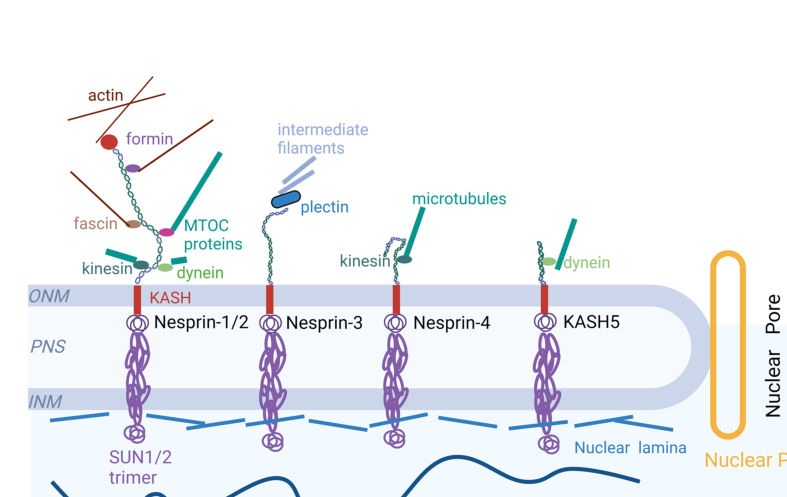

## Question

# Gene Research for Functional Annotation

## ⚠️ CRITICAL: Gene/Protein Identification Context

**BEFORE YOU BEGIN RESEARCH:** You MUST verify you are researching the CORRECT gene/protein. Gene symbols can be ambiguous, especially for less well-characterized genes from non-model organisms.

### Target Gene/Protein Identity (from UniProt):
- **UniProt Accession:** Q6ZMZ3
- **Protein Description:** RecName: Full=Nesprin-3; AltName: Full=KASH domain-containing protein 3; Short=KASH3; AltName: Full=Nuclear envelope spectrin repeat protein 3;
- **Gene Information:** Name=SYNE3 {ECO:0000312|HGNC:HGNC:19861}; Synonyms=C14orf139 {ECO:0000312|HGNC:HGNC:19861}, C14orf49 {ECO:0000312|HGNC:HGNC:19861}, LINC00341 {ECO:0000312|HGNC:HGNC:19861};
- **Organism (full):** Homo sapiens (Human).
- **Protein Family:** Belongs to the nesprin family. .
- **Key Domains:** KASH. (IPR012315); LINC-complex_assoc. (IPR052403); Spectrin/alpha-actinin. (IPR018159); Spectrin_repeat. (IPR002017); Spectrin_SYNE1_3. (IPR057932)

### MANDATORY VERIFICATION STEPS:

1. **Check if the gene symbol "SYNE3" matches the protein description above**
2. **Verify the organism is correct:** Homo sapiens (Human).
3. **Check if protein family/domains align with what you find in literature**
4. **If you find literature for a DIFFERENT gene with the same or similar symbol, STOP**

### If Gene Symbol is Ambiguous or You Cannot Find Relevant Literature:

**DO NOT PROCEED WITH RESEARCH ON A DIFFERENT GENE.** Instead:
- State clearly: "The gene symbol 'SYNE3' is ambiguous or literature is limited for this specific protein"
- Explain what you found (e.g., "Found extensive literature on a different gene with the same symbol in a different organism")
- Describe the protein based ONLY on the UniProt information provided above
- Suggest that the protein function can be inferred from domain/family information

### Research Target:

Please provide a comprehensive research report on the gene **SYNE3** (gene ID: SYNE3, UniProt: Q6ZMZ3) in human.

The research report should be a detailed narrative explaining the function, biological processes, and localization of the gene product. Citations should be given for all claims.

You should prioritize authoritative reviews and primary scientific literature when conducting research. You can supplement
this with annotations you find in gene/protein databases, but these can be outdated or inaccurate.

We are specifically interested in the primary function of the gene - for enzymes, what reaction is catalyzed, and what is the substrate specificity? For transporters, what is the substrate? For structural proteins or adapters, what is the broader structural role? For signaling molecules, what is the role in the pathway.

We are interested in where in or outside the cell the gene product carries out its function.

We are also interested in the signaling or biochemical pathways in which the gene functions. We are less interested in broad pleiotropic effects, except where these elucidate the precise role.

Include evidence where possible. We are interested in both experimental evidence as well as inference from structure, evolution, or bioinformatic analysis. Precise studies should be prioritized over high-throughput, where available.

## Output

Question: You are an expert researcher providing comprehensive, well-cited information.

Provide detailed information focusing on:
1. Key concepts and definitions with current understanding
2. Recent developments and latest research (prioritize 2023-2024 sources)
3. Current applications and real-world implementations
4. Expert opinions and analysis from authoritative sources
5. Relevant statistics and data from recent studies

Format as a comprehensive research report with proper citations. Include URLs and publication dates where available.
Always prioritize recent, authoritative sources and provide specific citations for all major claims.

# Gene Research for Functional Annotation

## ⚠️ CRITICAL: Gene/Protein Identification Context

**BEFORE YOU BEGIN RESEARCH:** You MUST verify you are researching the CORRECT gene/protein. Gene symbols can be ambiguous, especially for less well-characterized genes from non-model organisms.

### Target Gene/Protein Identity (from UniProt):
- **UniProt Accession:** Q6ZMZ3
- **Protein Description:** RecName: Full=Nesprin-3; AltName: Full=KASH domain-containing protein 3; Short=KASH3; AltName: Full=Nuclear envelope spectrin repeat protein 3;
- **Gene Information:** Name=SYNE3 {ECO:0000312|HGNC:HGNC:19861}; Synonyms=C14orf139 {ECO:0000312|HGNC:HGNC:19861}, C14orf49 {ECO:0000312|HGNC:HGNC:19861}, LINC00341 {ECO:0000312|HGNC:HGNC:19861};
- **Organism (full):** Homo sapiens (Human).
- **Protein Family:** Belongs to the nesprin family. .
- **Key Domains:** KASH. (IPR012315); LINC-complex_assoc. (IPR052403); Spectrin/alpha-actinin. (IPR018159); Spectrin_repeat. (IPR002017); Spectrin_SYNE1_3. (IPR057932)

### MANDATORY VERIFICATION STEPS:

1. **Check if the gene symbol "SYNE3" matches the protein description above**
2. **Verify the organism is correct:** Homo sapiens (Human).
3. **Check if protein family/domains align with what you find in literature**
4. **If you find literature for a DIFFERENT gene with the same or similar symbol, STOP**

### If Gene Symbol is Ambiguous or You Cannot Find Relevant Literature:

**DO NOT PROCEED WITH RESEARCH ON A DIFFERENT GENE.** Instead:
- State clearly: "The gene symbol 'SYNE3' is ambiguous or literature is limited for this specific protein"
- Explain what you found (e.g., "Found extensive literature on a different gene with the same symbol in a different organism")
- Describe the protein based ONLY on the UniProt information provided above
- Suggest that the protein function can be inferred from domain/family information

### Research Target:

Please provide a comprehensive research report on the gene **SYNE3** (gene ID: SYNE3, UniProt: Q6ZMZ3) in human.

The research report should be a detailed narrative explaining the function, biological processes, and localization of the gene product. Citations should be given for all claims.

You should prioritize authoritative reviews and primary scientific literature when conducting research. You can supplement
this with annotations you find in gene/protein databases, but these can be outdated or inaccurate.

We are specifically interested in the primary function of the gene - for enzymes, what reaction is catalyzed, and what is the substrate specificity? For transporters, what is the substrate? For structural proteins or adapters, what is the broader structural role? For signaling molecules, what is the role in the pathway.

We are interested in where in or outside the cell the gene product carries out its function.

We are also interested in the signaling or biochemical pathways in which the gene functions. We are less interested in broad pleiotropic effects, except where these elucidate the precise role.

Include evidence where possible. We are interested in both experimental evidence as well as inference from structure, evolution, or bioinformatic analysis. Precise studies should be prioritized over high-throughput, where available.

# Human SYNE3 / Nesprin-3 Functional Annotation Report

## Executive conclusion

**Identity is verified.** Human **SYNE3** (spectrin repeat containing nuclear envelope family member 3; UniProt **Q6ZMZ3**) encodes **nesprin-3**, also called **KASH3**. The literature consistently describes the same approximately 110–112-kDa, 975/976-residue human nuclear-envelope protein specified in the query; no conflicting same-symbol protein was used. SYNE3 belongs to the nesprin/KASH family, contains spectrin repeats and a C-terminal KASH region, and lacks the N-terminal actin-binding domain characteristic of giant nesprin-1/2 proteins. A recent human study places SYNE3 at chromosome 14q32.13 and describes the α and β isoforms as containing eight and seven spectrin repeats, respectively. Human aortic endothelial cells show a principal approximately 110-kDa nesprin-3α band. Minor differences of 975 versus 976 residues among publications/databases likely reflect transcript or sequence-annotation conventions rather than mistaken identity. (wu2024expressionandclinical pages 1-2, morgan2011nesprin3regulatesendothelial pages 1-2)

The primary function is **not enzymatic, transport, or receptor catalysis**. Nesprin-3 is a structural adaptor and load-bearing component of the **linker of nucleoskeleton and cytoskeleton (LINC) complex**. It resides principally in the **outer nuclear membrane (ONM)**. Its C-terminal transmembrane/KASH region projects into the perinuclear lumen and engages SUN proteins in the inner nuclear membrane, whereas its larger cytoplasmic domain binds plectin and related plakins. This couples the nuclear envelope indirectly to intermediate filaments—including keratins, vimentin, and desmin—and enables force transmission, nuclear positioning and shape control, perinuclear cytoskeletal organization, and mechanosensitive cell behavior. (bougaran2024lifeatthe pages 2-3, wilhelmsen2005nesprin3anovel pages 1-2, wilhelmsen2005nesprin3anovel pages 5-6, ziyi2024nesprinproteinsbridging media ec497919)

| Question/feature | Best-supported conclusion | Direct evidence/model | Confidence/limitation |
|---|---|---|---|
| Identity and architecture | Human **SYNE3** encodes **nesprin-3/KASH3**, a nonenzymatic nesprin-family protein of approximately 975–976 aa and 110–112 kDa. It contains seven or eight spectrin repeats, depending on isoform, and a C-terminal KASH region; unlike giant nesprin-1/2, it lacks an N-terminal actin-binding domain. | Human NSCLC paper explicitly identifies SYNE3/nesprin-3, chromosome 14q32.13, protein size, isoforms, spectrin repeats, and KASH domain; human aortic endothelial cells yielded a principal approximately 110-kDa band. (wu2024expressionandclinical pages 1-2, morgan2011nesprin3regulatesendothelial pages 1-2) | **High.** Matches the supplied UniProt Q6ZMZ3 identity and domain annotations. Minor 975-versus-976-aa differences likely reflect sequence/isoform annotation conventions. |
| Outer nuclear membrane and LINC assembly | Nesprin-3 is an **outer nuclear membrane (ONM)** protein whose short C-terminal KASH segment occupies the perinuclear lumen and binds inner-nuclear-membrane SUN proteins, creating a trans-envelope LINC bridge. | Immuno-electron microscopy directly localized tagged nesprin-3 to the ONM; recent literature and an inspected 2024 schematic place the KASH–SUN interaction in the perinuclear space. (wilhelmsen2005nesprin3anovel pages 5-6, bougaran2024lifeatthe pages 2-3, ziyi2024nesprinproteinsbridging media ec497919) | **High for ONM localization; moderate-to-high for human SYNE3-specific SUN assembly.** ONM localization was directly tested, whereas some SUN/KASH topology evidence is based on conserved LINC architecture and structural studies of KASH proteins generally. |
| α and β isoforms; first spectrin repeat | **Nesprin-3α** has eight spectrin repeats, and its first repeat forms the principal plakin-binding region. **Nesprin-3β** lacks that repeat, has seven repeats, and binds plectin only weakly or not detectably under the tested conditions. | Co-immunoprecipitation/pull-down assays showed strong α binding to plectin-1A/1C and MACF actin-binding domains, weak β interactions, and identified the first repeat as critical; human endothelial blots detected approximately 110-kDa α and an inconsistent 97-kDa species possibly representing β or degradation. (wilhelmsen2005nesprin3anovel pages 5-6, morgan2011nesprin3regulatesendothelial pages 1-2) | **High for differential binding; moderate for endogenous β abundance.** The smaller human endothelial band was inconsistent and not definitively identified. |
| Intermediate-filament linkage | Primary function is that of a **structural adaptor/load-bearing linker**, not an enzyme or transporter: cytoplasmic nesprin-3 binds plectin and thereby couples the nuclear envelope indirectly to keratin, vimentin, or desmin intermediate filaments. Plakin partners may additionally connect it to actin or microtubules. | Yeast two-hybrid, co-immunoprecipitation, fluorescence colocalization, immuno-EM, and overexpression showed plectin recruitment to the nuclear perimeter and colocalization with keratin-6/14; knockout and knockdown studies disrupted perinuclear plectin/vimentin organization. (wilhelmsen2005nesprin3anovel pages 1-2, wilhelmsen2005nesprin3anovel pages 5-6, ketema2013nesprin3connectsplectin pages 1-2, morgan2011nesprin3regulatesendothelial pages 5-6) | **High for plectin-mediated intermediate-filament coupling.** Direct coupling to actin or microtubules through MACF/dystonin is less completely characterized and should not be treated as the core function. |
| Human aortic endothelial-cell function | Nesprin-3 maintains cell shape, perinuclear plectin/vimentin organization, nucleus–centrosome coupling, and flow-induced centrosome polarization and migration. Knockdown increased mean MTOC-to-nuclear-edge distance from **1.42 ± 0.08 μm to 2.09 ± 0.10 μm** (*p*<0.002) and abolished polarization induced by 15 dyn/cm² shear stress. | siRNA knockdown, immunofluorescence, confocal microscopy, flow chambers, and migration assays in cultured human aortic endothelial cells; expression and nuclear localization were also confirmed in human aortic tissue. (morgan2011nesprin3regulatesendothelial pages 1-2, morgan2011nesprin3regulatesendothelial pages 5-6) | **High for cultured HAEC phenotypes.** Mechanistic relevance to intact human vessels and atherosclerosis remains plausible but unproven clinically. |
| Cardiomyocyte nuclear architecture | Nesprin-3–dependent anchoring of desmin counterbalances compressive forces from polymerizing microtubules. Its depletion causes nuclear collapse/infolding, DNA damage, loss of genome organization, broad transcriptional changes, and impaired contractile function. | Acute nesprin-3 or desmin depletion in neonatal/adult rat ventricular cardiomyocyte systems, assessed using super-resolution imaging, biophysical, genomic, and functional methods. (heffler2020abalancebetween pages 1-4) | **Moderate-to-high mechanistic confidence; limited human specificity.** Direct evidence is principally from rat cardiomyocytes, so human cardiac-disease causality cannot be assumed. |
| Mouse Sertoli-cell knockout | Nesprin-3 concentrates plectin and vimentin at the Sertoli-cell nuclear perimeter but is **dispensable for fertility, spermatogenesis, gross nuclear positioning, and anchorage** under baseline conditions. | Conditional deletion/homologous recombination, PCR, immunoblotting, and tissue localization in mice showed loss of perinuclear plectin/vimentin but viable, fertile animals with normal testicular morphology. (ketema2013nesprin3connectsplectin pages 1-2) | **High for the mouse baseline phenotype.** Indicates redundancy or context dependence; it does not negate important roles under mechanical stress or in other tissues. |
| 2023 myotonic-dystrophy muscle finding | In human DM1 tibialis anterior muscle, **SYNE3 expression increased as dorsiflexion strength declined**, apparently driven by a 970-aa isoform lacking residues 793–797 relative to the 975-aa α isoform. | Reanalysis of RNA-seq from **54 biopsies**—11 unaffected and 43 DM1 cases—with differential-expression and exon-usage analysis stratified by muscle weakness. (todorow2023nuclearenvelopetransmembrane pages 4-6) | **Moderate.** This is disease-associated transcriptomic evidence, not proof that SYNE3 drives DM1 pathology; cell-composition changes or compensatory regulation could contribute. |
| 2024 NSCLC finding | SYNE3 immunostaining was lower in NSCLC than adjacent lung and negatively associated with tumor diameter; association with CD34-marked microvessels suggests biomarker potential but does not establish an angiogenic mechanism. | Immunohistochemistry in **45 NSCLC tumors and 45 matched paracancerous tissues**; tumor-versus-adjacent difference *p*=0.037. Reported SYNE3–CD34 correlation was **r=0.450**, with inconsistent *p* values across the abstract/table/text. (wu2024expressionandclinical pages 8-11, wu2024expressionandclinical pages 1-2) | **Low-to-moderate.** Small, single-center observational cohort; no survival validation, mechanistic perturbation, independent replication, or diagnostic-performance analysis. Internal statistical inconsistencies warrant caution. |
| Signaling and pathway placement | SYNE3 participates primarily in the **SUN–KASH LINC/mechanotransduction pathway**. Changes in LINC composition can affect RhoA, focal adhesions, cytoskeletal remodeling, and SUN2 conformational assembly, but many pathway effects are not uniquely attributable to SYNE3. | LINC studies showed opposing SUN1/SUN2 regulation of RhoA and used nesprin-3 knockdown to probe SUN2–KASH assembly dynamics. (thakar2017opposingrolesfor pages 1-5, sharma2023disulfidebondin pages 10-11) | **Moderate for pathway membership; low-to-moderate for a direct SYNE3→RhoA mechanism.** General LINC-complex findings must not be over-annotated as SYNE3-specific signaling. |
| Clinical maturity and applications | Current applications are chiefly **research uses**: nuclear-mechanics models, endothelial-flow assays, cardiomyocyte/desmin studies, and exploratory tissue biomarkers. SYNE3 is not yet a validated diagnostic biomarker, therapeutic target, or established monogenic disease gene in routine practice. | Recent studies provide disease associations in DM1 and NSCLC, while target databases list several associations; no interventional clinical implementation or validated SYNE3-directed therapy was identified. (OpenTargets Search: -SYNE3, wu2024expressionandclinical pages 1-2, todorow2023nuclearenvelopetransmembrane pages 4-6) | **High confidence that clinical maturity is low.** Database associations and expression correlations are hypothesis-generating and should not be interpreted as causal or clinically actionable. |

*Table: Evidence matrix for human SYNE3/nesprin-3, separating direct human findings from rodent models and general LINC-complex inference. It summarizes molecular function, localization, quantitative phenotypes, disease associations, and current clinical maturity.*

## 1. Molecular architecture and localization

### Domain organization and isoforms

Nesprin-3 is much smaller than giant nesprin-1 and nesprin-2. Its relevant architecture is:

1. **An N-terminal/cytoplasmic spectrin-repeat region**, which provides a scaffold for protein interactions.
2. **A C-terminal membrane anchor and KASH sequence**, responsible for ONM residence and association with SUN-domain proteins across the perinuclear space.
3. **No intrinsic N-terminal calponin-homology actin-binding domain**, distinguishing its core function from the direct actin binding of giant nesprin-1/2. (ketema2013nesprin3connectsplectin pages 1-2, litster2026duplicationwithin14q32.13 pages 20-23, wilhelmsen2005nesprin3anovel pages 1-2)

Two principal isoforms were identified in the foundational work. **Nesprin-3α** contains the first spectrin repeat, which acts as a high-affinity plakin-binding region; **nesprin-3β** lacks this repeat and interacts only weakly, if at all, with plectin in the tested assays. Co-immunoprecipitation showed strong binding of α to the actin-binding domains of plectin-1A and plectin-1C and also to MACF, but not to α-actinin-1. The investigators therefore designated the first repeat the **plakin-binding domain**. (wilhelmsen2005nesprin3anovel pages 5-6)

### Membrane topology and cellular site of action

Tagged nesprin-3 localized to the nuclear envelope in keratinocytes, and immuno-electron microscopy resolved it specifically in the **outer** nuclear membrane; overexpression could additionally produce rough-endoplasmic-reticulum staining, consistent with continuity between the ONM and ER. Endogenous human nesprin-3 was robustly detected around the nuclear envelope of cultured human aortic endothelial cells and in endothelial cells in human aortic tissue. Confocal analysis suggested relatively uniform apical-to-basal coverage rather than polarized accumulation. (morgan2011nesprin3regulatesendothelial pages 1-2, wilhelmsen2005nesprin3anovel pages 5-6)

A 2024 review schematic accurately summarizes the current model: nesprin-3 spans the ONM, its KASH tail contacts SUN1/2 within the perinuclear space, and its cytoplasmic portion binds plectin, which connects to intermediate filaments. This visual model agrees with the direct localization and interaction experiments. (ziyi2024nesprinproteinsbridging media ec497919)

## 2. Primary molecular function

The best-supported functional description is:

> **Nesprin-3 is a nuclear-envelope cytolinker that joins SUN-based LINC complexes to plakin-associated intermediate-filament networks.**

The original 2005 study used yeast two-hybrid analysis, co-immunoprecipitation, fluorescence colocalization, and immuno-EM to demonstrate association with plectin. Nesprin-3α overexpression dramatically recruited plectin to the nuclear perimeter, where the proteins colocalized with keratin-6 and keratin-14. Because plectin can bind integrin α6β4 at epithelial hemidesmosomes, these observations support a mechanically continuous route from extracellular matrix/integrin adhesions through keratin–plectin–nesprin-3 to the nuclear envelope. (wilhelmsen2005nesprin3anovel pages 1-2, wilhelmsen2005nesprin3anovel pages 5-6)

This is an **indirect**, adaptor-mediated connection to filaments: nesprin-3 does not itself bind intermediate filaments in the same manner as a filament subunit. Plectin connects it to keratin, vimentin, or desmin networks according to cell type. Associations with MACF1 or dystonin may broaden coupling to actin and microtubules, but these are less completely established than the core plectin–intermediate-filament linkage. (litster2026duplicationwithin14q32.13 pages 20-23, ziyi2024nesprinproteinsbridging pages 4-5)

## 3. Biological processes supported by direct evidence

### Endothelial morphology, polarity, and flow responses

The most detailed human cellular evidence comes from human aortic endothelial cells. Nesprin-3 knockdown caused marked cell elongation, loss of perinuclear plectin and vimentin organization, and weakening of centrosome–nucleus coupling. Mean distance from the microtubule-organizing center to the nearest nuclear edge increased from **1.42 ± 0.08 μm** in controls to **2.09 ± 0.10 μm** after knockdown (*p*<0.002). Knockdown also abolished centrosome polarization induced by **15 dyn/cm²** shear stress and impaired directional migration under flow. These results place nesprin-3 at the interface between perinuclear intermediate filaments, centrosome organization, and vascular mechanotransduction. (morgan2011nesprin3regulatesendothelial pages 1-2, morgan2011nesprin3regulatesendothelial pages 5-6)

These experiments do not establish that SYNE3 prevents atherosclerosis in humans; rather, they identify cellular functions relevant to endothelial adaptation to hemodynamic forces. A 2024 vascular-mechanotransduction review consequently treats nesprin-3 as part of the machinery by which endothelial nuclei integrate cytoskeletal force, while emphasizing that LINC-component functions overlap and remain context dependent. (bougaran2024lifeatthe pages 2-3)

### Cardiomyocyte nuclear homeostasis

In ventricular cardiomyocytes, nesprin-3 anchors the desmin intermediate-filament system to the nuclear surface. Acute depletion of either desmin or nesprin-3 allowed polymerizing microtubules to deform and collapse nuclei, producing nuclear-envelope infolding, DNA damage, disturbed genome organization, broad transcriptional changes, and impaired contractile function. The mechanistic interpretation is that tensile support from desmin–plectin–nesprin-3 counterbalances compressive microtubule forces. This is strong evidence for a mechanical homeostatic role, although the direct experiments were principally in rat cardiomyocytes rather than human myocardium. [Heffler et al., *Circulation Research*, published January 2020, DOI: https://doi.org/10.1161/CIRCRESAHA.119.315582]. (heffler2020abalancebetween pages 1-4)

### Sertoli-cell intermediate-filament organization

In mouse Sertoli cells, genetic loss of nesprin-3 removed the normal concentration of plectin and vimentin around the nuclear perimeter. Nevertheless, knockout animals were viable and fertile, with normal gross testicular morphology, spermatogenesis, and Sertoli-cell nuclear positioning under baseline conditions. This establishes the molecular linkage in vivo but also demonstrates biological redundancy: loss of perinuclear filament organization need not cause an overt phenotype in every tissue or physiological state. [Ketema et al., published August 2013, DOI: https://doi.org/10.1091/mbc.e13-02-0100]. (ketema2013nesprin3connectsplectin pages 1-2, litster2026duplicationwithin14q32.13 pages 34-36)

### Nuclear morphology and genome integrity

Across the endothelial, cardiac, and overexpression studies, the recurring phenotype is altered nuclear shape or nuclear–cytoskeletal organization. This is consistent with nesprin-3 transmitting and balancing cytoskeletal loads rather than acting as a conventional biochemical enzyme. Recent overexpression experiments also found perinuclear recruitment of vimentin and plectin and significant reductions in nuclear area, although those 2026 results are later than the requested priority window and presently provide supportive rather than foundational evidence. (litster2026duplicationwithin14q32.13 pages 23-27)

## 4. Signaling and biochemical pathway placement

### Core pathway: SUN–KASH LINC mechanotransduction

The direct pathway assignment is the **LINC-complex/nuclear mechanotransduction pathway**:

**extracellular matrix or cellular force → adhesion/cytoskeletal network → intermediate filament → plectin/plakin → nesprin-3 → SUN protein → nuclear lamina/nucleoskeleton and chromatin-associated structures.**

The cytoplasmic and nuclear sides can transmit forces in either direction. Thus, nesprin-3 can contribute both to transmission of external mechanical cues toward the nucleus and to nuclear control of cell polarity, cytoskeletal arrangement, and migration. (ziyi2024nesprinproteinsbridging pages 4-5, bougaran2024lifeatthe pages 2-3, heffler2020abalancebetween pages 1-4)

### RhoA and focal-adhesion signaling: important but not uniquely SYNE3-specific

Distinct SUN–nesprin LINC complexes can regulate the small GTPase **RhoA**, focal-adhesion assembly, and actomyosin organization. SUN2-containing complexes promote RhoA activity, whereas SUN1 can antagonize them. However, much of this evidence concerns LINC composition generally and does not prove a linear, unique **SYNE3→RhoA** pathway. It is therefore appropriate to annotate SYNE3 as participating in a LINC context capable of regulating RhoA, but not as a dedicated RhoA activator. [Thakar et al., published January 2017, DOI: https://doi.org/10.1091/mbc.e16-06-0467]. (thakar2017opposingrolesfor pages 1-5)

A 2023 study added a molecular assembly mechanism: SUN2 undergoes KASH-dependent disulfide rearrangement. Nesprin-3 knockdown was used to perturb SUN2–KASH assembly, supporting participation of nesprin-3 in dynamic LINC-complex conformation. Yet the principal discovery concerned SUN2 redox/structural regulation, not a new catalytic activity of SYNE3. [Sharma and Hetzer, published May 2023, DOI: https://doi.org/10.26508/lsa.202302031]. (sharma2023disulfidebondin pages 10-11)

## 5. Recent developments, 2023–2024

### Human myotonic dystrophy type 1 muscle—2023

RNA-seq reanalysis of **54 human tibialis anterior biopsies**—11 unaffected controls and 43 patients with myotonic dystrophy type 1 (DM1)—found that SYNE3 expression increased as dorsiflexion strength declined. The increase appeared to involve a **970-aa isoform lacking residues 793–797** relative to the 975-aa α isoform. This identifies disease-severity-associated regulation and alternative splicing, but it does not establish SYNE3 as the primary cause of DM1; compensation, altered cell composition, or downstream responses remain viable explanations. [Todorow et al., published January 2023, DOI: https://doi.org/10.3389/fcell.2022.1007331]. (todorow2023nuclearenvelopetransmembrane pages 4-6)

### Updated nesprin/LINC interpretation—2024

A 2024 review emphasizes the LINC complex as a load-transmitting system essential to nuclear-envelope dynamics and mechanically sensitive tissues. For nesprin-3 specifically, the best-supported role remains plectin-dependent coupling of the nucleus to intermediate filaments and, through cell-surface plectin interactions, potentially to extracellular-matrix attachments. Proposed therapeutic concepts—repairing nesprin mutations, modulating expression, or strengthening LINC function—remain conceptual and are not SYNE3-directed clinical interventions. [Zhou et al., published April 2024, DOI: https://doi.org/10.1186/s12964-024-01593-y]. (ziyi2024nesprinproteinsbridging pages 4-5)

### Non-small-cell lung cancer—2024

A single-center immunohistochemical study analyzed **45 NSCLC tumors and 45 adjacent normal lung samples** collected in 2022. SYNE3 staining was lower in tumors, whereas CD34-marked microvessel density was higher; the tumor-versus-adjacent difference was reported as *p*=0.037. SYNE3 was negatively associated with tumor diameter, and the reported correlation with CD34-MVD was **r=0.450**. The article reports inconsistent significance values for that correlation across its abstract, table, and text, which materially lowers confidence. No independent cohort, survival validation, perturbational mechanism, or diagnostic accuracy analysis was provided. Consequently, SYNE3 is an **exploratory biomarker candidate**, not a validated NSCLC diagnostic or angiogenic target. [Wu et al., received April 8, accepted July 8, e-published September 15 and published September 30, 2024; DOI: https://doi.org/10.62347/ZHBP7145]. (wu2024expressionandclinical pages 8-11, wu2024expressionandclinical pages 1-2)

## 6. Disease associations and current applications

Open Targets recognizes human **SYNE3 (ENSG00000176438)** and returns associations with atrial fibrillation, open-angle glaucoma, hair morphology, and lymphatic malignancies. These results are useful for hypothesis generation but reflect aggregated genetic/literature evidence and do not by themselves establish causal disease mechanisms. (OpenTargets Search: -SYNE3)

Current practical uses are predominantly experimental:

- **Nuclear-mechanics and LINC-complex models**, particularly assays of perinuclear intermediate filaments and nuclear deformation.
- **Endothelial flow and polarization assays**, where SYNE3 depletion tests nucleus–centrosome coupling and directional migration.
- **Cardiomyocyte mechanobiology**, especially desmin-linked nuclear homeostasis and genome organization.
- **Exploratory pathology biomarkers**, including tissue-expression studies in NSCLC and transcriptomic studies in muscle disease.

No evidence identified SYNE3 as an approved drug target, validated clinical biomarker, routinely actionable cardiomyopathy gene, or target of an established clinical intervention. Moreover, many human disease associations concern **SYNE1** or **SYNE2**, and those should not be transferred to SYNE3 merely because all encode nesprins. (ravera2025cardiovascularinvolvementin pages 6-8, wu2024expressionandclinical pages 1-2, todorow2023nuclearenvelopetransmembrane pages 4-6)

## 7. Expert assessment and evidence gaps

The most defensible annotation is narrow and mechanistic: **SYNE3 encodes an ONM LINC-complex adaptor specialized for plakin/intermediate-filament coupling**. Evidence for this conclusion is strong because it rests on convergent interaction, localization, ultrastructural, knockdown, overexpression, and knockout experiments. (ketema2013nesprin3connectsplectin pages 1-2, morgan2011nesprin3regulatesendothelial pages 5-6, wilhelmsen2005nesprin3anovel pages 1-2, wilhelmsen2005nesprin3anovel pages 5-6)

Important uncertainties remain:

1. **Isoform biology:** endogenous abundance, tissue specificity, and functional division among human α, β, and additional splice forms remain incompletely resolved.
2. **SUN-partner specificity:** conserved KASH–SUN binding is well supported, but cell-specific preferences among SUN1, SUN2, and alternative assemblies require better quantitative analysis.
3. **Redundancy:** the mild baseline phenotype of knockout Sertoli cells shows that other cytolinkers can compensate in some tissues.
4. **Mechanotransduction versus signaling:** direct mechanical coupling is established; downstream transcriptional, RhoA, or disease-signaling effects are more context dependent and frequently derive from broader LINC perturbation.
5. **Human disease causality:** 2023–2024 studies mainly report altered expression or association. They do not yet show that pathogenic SYNE3 variants or dysregulation independently cause the observed disorders.
6. **Clinical translation:** biomarker and therapeutic proposals require replicated cohorts, variant-level functional studies, tissue-specific models, and prospective validation.

## Overall functional annotation

**Recommended concise annotation:** *Nesprin-3 is a KASH-domain outer nuclear membrane protein and LINC-complex component that binds plectin through its N-terminal spectrin-repeat region, thereby tethering keratin-, vimentin-, or desmin-containing intermediate-filament networks to the nuclear envelope. It maintains perinuclear cytoskeletal organization, nuclear morphology and mechanical homeostasis, nucleus–centrosome coupling, and context-dependent cell polarization and migration. Its disease associations are currently mainly mechanistic or observational rather than clinically validated.*

References

1. (wu2024expressionandclinical pages 1-2): Y Wu, D Chen, Y Luo, J Wang, and H Gong. Expression and clinical significance of syne3 in non-small cell lung cancer. American Journal of Translational Research, 16:4436-4449, Jan 2024. URL: https://doi.org/10.62347/zhbp7145, doi:10.62347/zhbp7145. This article has 1 citations and is from a peer-reviewed journal.

2. (morgan2011nesprin3regulatesendothelial pages 1-2): Joshua T. Morgan, Emily R. Pfeiffer, Twanda L. Thirkill, Priyadarsini Kumar, Gordon Peng, Heidi N. Fridolfsson, Gordon C. Douglas, Daniel A. Starr, and Abdul I. Barakat. Nesprin-3 regulates endothelial cell morphology, perinuclear cytoskeletal architecture, and flow-induced polarization. Molecular Biology of the Cell, 22:4324-4334, Nov 2011. URL: https://doi.org/10.1091/mbc.e11-04-0287, doi:10.1091/mbc.e11-04-0287. This article has 165 citations and is from a domain leading peer-reviewed journal.

3. (bougaran2024lifeatthe pages 2-3): Pauline Bougaran and Victoria L. Bautch. Life at the crossroads: the nuclear linc complex and vascular mechanotransduction. Frontiers in Physiology, May 2024. URL: https://doi.org/10.3389/fphys.2024.1411995, doi:10.3389/fphys.2024.1411995. This article has 23 citations.

4. (wilhelmsen2005nesprin3anovel pages 1-2): Kevin Wilhelmsen, Sandy H.M. Litjens, Ingrid Kuikman, Ntambua Tshimbalanga, Hans Janssen, Iman van den Bout, Karine Raymond, and Arnoud Sonnenberg. Nesprin-3, a novel outer nuclear membrane protein, associates with the cytoskeletal linker protein plectin. The Journal of Cell Biology, 171:799-810, Dec 2005. URL: https://doi.org/10.1083/jcb.200506083, doi:10.1083/jcb.200506083. This article has 639 citations.

5. (wilhelmsen2005nesprin3anovel pages 5-6): Kevin Wilhelmsen, Sandy H.M. Litjens, Ingrid Kuikman, Ntambua Tshimbalanga, Hans Janssen, Iman van den Bout, Karine Raymond, and Arnoud Sonnenberg. Nesprin-3, a novel outer nuclear membrane protein, associates with the cytoskeletal linker protein plectin. The Journal of Cell Biology, 171:799-810, Dec 2005. URL: https://doi.org/10.1083/jcb.200506083, doi:10.1083/jcb.200506083. This article has 639 citations.

6. (ziyi2024nesprinproteinsbridging media ec497919): Zhou Zi-yi, Qin Qin, Zhou Fei, Cao Cun-Yu, and Teng Lin. Nesprin proteins: bridging nuclear envelope dynamics to muscular dysfunction. Cell Communication and Signaling : CCS, Apr 2024. URL: https://doi.org/10.1186/s12964-024-01593-y, doi:10.1186/s12964-024-01593-y. This article has 28 citations.

7. (ketema2013nesprin3connectsplectin pages 1-2): Mirjam Ketema, Maaike Kreft, Pablo Secades, Hans Janssen, and Arnoud Sonnenberg. Nesprin-3 connects plectin and vimentin to the nuclear envelope of sertoli cells but is not required for sertoli cell function in spermatogenesis. Molecular Biology of the Cell, 24:2454-2466, Aug 2013. URL: https://doi.org/10.1091/mbc.e13-02-0100, doi:10.1091/mbc.e13-02-0100. This article has 116 citations and is from a domain leading peer-reviewed journal.

8. (morgan2011nesprin3regulatesendothelial pages 5-6): Joshua T. Morgan, Emily R. Pfeiffer, Twanda L. Thirkill, Priyadarsini Kumar, Gordon Peng, Heidi N. Fridolfsson, Gordon C. Douglas, Daniel A. Starr, and Abdul I. Barakat. Nesprin-3 regulates endothelial cell morphology, perinuclear cytoskeletal architecture, and flow-induced polarization. Molecular Biology of the Cell, 22:4324-4334, Nov 2011. URL: https://doi.org/10.1091/mbc.e11-04-0287, doi:10.1091/mbc.e11-04-0287. This article has 165 citations and is from a domain leading peer-reviewed journal.

9. (heffler2020abalancebetween pages 1-4): Julie Heffler, Parisha P. Shah, Patrick Robison, Sai Phyo, Kimberly Veliz, Keita Uchida, Alexey Bogush, Joshua Rhoades, Rajan Jain, and Benjamin L. Prosser. A balance between intermediate filaments and microtubules maintains nuclear architecture in the cardiomyocyte. Jan 2020. URL: https://doi.org/10.1161/circresaha.119.315582, doi:10.1161/circresaha.119.315582. This article has 140 citations and is from a highest quality peer-reviewed journal.

10. (todorow2023nuclearenvelopetransmembrane pages 4-6): Vanessa Todorow, Stefan Hintze, Benedikt Schoser, and Peter Meinke. Nuclear envelope transmembrane proteins involved in genome organization are misregulated in myotonic dystrophy type 1 muscle. Frontiers in Cell and Developmental Biology, Jan 2023. URL: https://doi.org/10.3389/fcell.2022.1007331, doi:10.3389/fcell.2022.1007331. This article has 12 citations.

11. (wu2024expressionandclinical pages 8-11): Y Wu, D Chen, Y Luo, J Wang, and H Gong. Expression and clinical significance of syne3 in non-small cell lung cancer. American Journal of Translational Research, 16:4436-4449, Jan 2024. URL: https://doi.org/10.62347/zhbp7145, doi:10.62347/zhbp7145. This article has 1 citations and is from a peer-reviewed journal.

12. (thakar2017opposingrolesfor pages 1-5): Ketan Thakar, Christopher K. May, Anna Rogers, and Christopher W. Carroll. Opposing roles for distinct linc complexes in regulation of the small gtpase rhoa. Molecular Biology of the Cell, 28:182-191, Jan 2017. URL: https://doi.org/10.1091/mbc.e16-06-0467, doi:10.1091/mbc.e16-06-0467. This article has 87 citations and is from a domain leading peer-reviewed journal.

13. (sharma2023disulfidebondin pages 10-11): Rahul Sharma and Martin W Hetzer. Disulfide bond in sun2 regulates dynamic remodeling of linc complexes at the nuclear envelope. Life Science Alliance, 6:e202302031, May 2023. URL: https://doi.org/10.26508/lsa.202302031, doi:10.26508/lsa.202302031. This article has 15 citations and is from a peer-reviewed journal.

14. (OpenTargets Search: -SYNE3): Open Targets Query (-SYNE3, 5 results). Buniello, A. et al. (2025). Open Targets Platform: facilitating therapeutic hypotheses building in drug discovery. Nucleic Acids Research.

15. (litster2026duplicationwithin14q32.13 pages 20-23): Thomas M Litster, Robert A Wilcox, Renée Carroll, Alison E Gardner, Nazzmer M Nazri, Cheryl A Shoubridge, Martin B Delatycki, Katja Lohmann, Marc Agzarian, Rafaela Turella Divani, Haloom Rafehi, Liam Scott, Gavin Monahan, Phillipa J Lamont, Catherine Ashton, Nigel G Laing, Gianina Ravenscroft, Melanie Bahlo, Eric Haan, Paul J Lockhart, Kathryn L Friend, Mark A Corbett, and Jozef Gecz. Duplication within 14q32.13 implicates a chimeric <i>clmn</i> :: <i>syne3</i> rna transcript in cerebellar ataxia. Unknown journal, Apr 2026. URL: https://doi.org/10.64898/2026.04.23.26350376, doi:10.64898/2026.04.23.26350376.

16. (ziyi2024nesprinproteinsbridging pages 4-5): Zhou Zi-yi, Qin Qin, Zhou Fei, Cao Cun-Yu, and Teng Lin. Nesprin proteins: bridging nuclear envelope dynamics to muscular dysfunction. Cell Communication and Signaling : CCS, Apr 2024. URL: https://doi.org/10.1186/s12964-024-01593-y, doi:10.1186/s12964-024-01593-y. This article has 28 citations.

17. (litster2026duplicationwithin14q32.13 pages 34-36): Thomas M Litster, Robert A Wilcox, Renée Carroll, Alison E Gardner, Nazzmer M Nazri, Cheryl A Shoubridge, Martin B Delatycki, Katja Lohmann, Marc Agzarian, Rafaela Turella Divani, Haloom Rafehi, Liam Scott, Gavin Monahan, Phillipa J Lamont, Catherine Ashton, Nigel G Laing, Gianina Ravenscroft, Melanie Bahlo, Eric Haan, Paul J Lockhart, Kathryn L Friend, Mark A Corbett, and Jozef Gecz. Duplication within 14q32.13 implicates a chimeric <i>clmn</i> :: <i>syne3</i> rna transcript in cerebellar ataxia. Unknown journal, Apr 2026. URL: https://doi.org/10.64898/2026.04.23.26350376, doi:10.64898/2026.04.23.26350376.

18. (litster2026duplicationwithin14q32.13 pages 23-27): Thomas M Litster, Robert A Wilcox, Renée Carroll, Alison E Gardner, Nazzmer M Nazri, Cheryl A Shoubridge, Martin B Delatycki, Katja Lohmann, Marc Agzarian, Rafaela Turella Divani, Haloom Rafehi, Liam Scott, Gavin Monahan, Phillipa J Lamont, Catherine Ashton, Nigel G Laing, Gianina Ravenscroft, Melanie Bahlo, Eric Haan, Paul J Lockhart, Kathryn L Friend, Mark A Corbett, and Jozef Gecz. Duplication within 14q32.13 implicates a chimeric <i>clmn</i> :: <i>syne3</i> rna transcript in cerebellar ataxia. Unknown journal, Apr 2026. URL: https://doi.org/10.64898/2026.04.23.26350376, doi:10.64898/2026.04.23.26350376.

19. (ravera2025cardiovascularinvolvementin pages 6-8): Francesco Ravera, Veronica Dusi, Pier Paolo Bocchino, Giulia Gobello, Giuseppe Giannino, Daniele Melis, Giulia Margherita Brach Del Prever, Filippo Angelini, Andrea Saglietto, Carla Giustetto, Guglielmo Gallone, Stefano Pidello, Margherita Cannillo, Marco Matteo Cingolani, Silvia Deaglio, Walter Grosso Marra, Gaetano Maria De Ferrari, and Claudia Raineri. Cardiovascular involvement in syne variants: a case series and narrative review. Cardiogenetics, 15:2, Jan 2025. URL: https://doi.org/10.3390/cardiogenetics15010002, doi:10.3390/cardiogenetics15010002. This article has 3 citations.

## Artifacts

- [Edison artifact artifact-00](SYNE3-deep-research-falcon_artifacts/artifact-00.md)

## Citations

1. heffler2020abalancebetween pages 1-4
2. todorow2023nuclearenvelopetransmembrane pages 4-6
3. bougaran2024lifeatthe pages 2-3
4. thakar2017opposingrolesfor pages 1-5
5. sharma2023disulfidebondin pages 10-11
6. ziyi2024nesprinproteinsbridging pages 4-5
7. wu2024expressionandclinical pages 1-2
8. wu2024expressionandclinical pages 8-11
9. ravera2025cardiovascularinvolvementin pages 6-8
10. Heffler et al., *Circulation Research*, published January 2020, DOI: https://doi.org/10.1161/CIRCRESAHA.119.315582
11. Ketema et al., published August 2013, DOI: https://doi.org/10.1091/mbc.e13-02-0100
12. Thakar et al., published January 2017, DOI: https://doi.org/10.1091/mbc.e16-06-0467
13. Sharma and Hetzer, published May 2023, DOI: https://doi.org/10.26508/lsa.202302031
14. Todorow et al., published January 2023, DOI: https://doi.org/10.3389/fcell.2022.1007331
15. Zhou et al., published April 2024, DOI: https://doi.org/10.1186/s12964-024-01593-y
16. Wu et al., received April 8, accepted July 8, e-published September 15 and published September 30, 2024; DOI: https://doi.org/10.62347/ZHBP7145
17. https://doi.org/10.1161/CIRCRESAHA.119.315582].
18. https://doi.org/10.1091/mbc.e13-02-0100].
19. https://doi.org/10.1091/mbc.e16-06-0467].
20. https://doi.org/10.26508/lsa.202302031].
21. https://doi.org/10.3389/fcell.2022.1007331].
22. https://doi.org/10.1186/s12964-024-01593-y].
23. https://doi.org/10.62347/ZHBP7145].
24. https://doi.org/10.62347/zhbp7145,
25. https://doi.org/10.1091/mbc.e11-04-0287,
26. https://doi.org/10.3389/fphys.2024.1411995,
27. https://doi.org/10.1083/jcb.200506083,
28. https://doi.org/10.1186/s12964-024-01593-y,
29. https://doi.org/10.1091/mbc.e13-02-0100,
30. https://doi.org/10.1161/circresaha.119.315582,
31. https://doi.org/10.3389/fcell.2022.1007331,
32. https://doi.org/10.1091/mbc.e16-06-0467,
33. https://doi.org/10.26508/lsa.202302031,
34. https://doi.org/10.64898/2026.04.23.26350376,
35. https://doi.org/10.3390/cardiogenetics15010002,