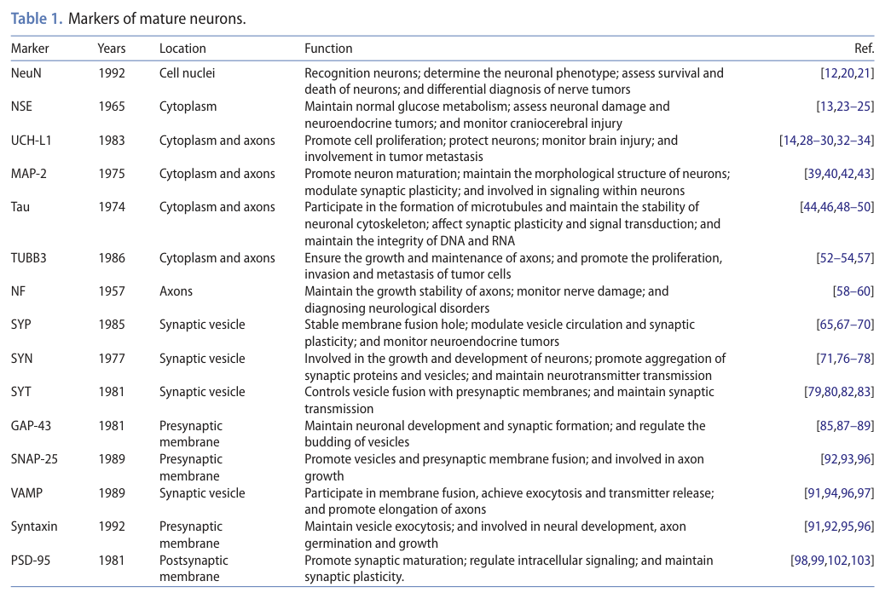

## Question

# Gene Research for Functional Annotation

## ⚠️ CRITICAL: Gene/Protein Identification Context

**BEFORE YOU BEGIN RESEARCH:** You MUST verify you are researching the CORRECT gene/protein. Gene symbols can be ambiguous, especially for less well-characterized genes from non-model organisms.

### Target Gene/Protein Identity (from UniProt):
- **UniProt Accession:** P08247
- **Protein Description:** RecName: Full=Synaptophysin; AltName: Full=Major synaptic vesicle protein p38;
- **Gene Information:** Name=SYP;
- **Organism (full):** Homo sapiens (Human).
- **Protein Family:** Belongs to the synaptophysin/synaptobrevin family.
- **Key Domains:** Marvel. (IPR008253); Synaptophysin/porin. (IPR001285); MARVEL (PF01284)

### MANDATORY VERIFICATION STEPS:

1. **Check if the gene symbol "SYP" matches the protein description above**
2. **Verify the organism is correct:** Homo sapiens (Human).
3. **Check if protein family/domains align with what you find in literature**
4. **If you find literature for a DIFFERENT gene with the same or similar symbol, STOP**

### If Gene Symbol is Ambiguous or You Cannot Find Relevant Literature:

**DO NOT PROCEED WITH RESEARCH ON A DIFFERENT GENE.** Instead:
- State clearly: "The gene symbol 'SYP' is ambiguous or literature is limited for this specific protein"
- Explain what you found (e.g., "Found extensive literature on a different gene with the same symbol in a different organism")
- Describe the protein based ONLY on the UniProt information provided above
- Suggest that the protein function can be inferred from domain/family information

### Research Target:

Please provide a comprehensive research report on the gene **SYP** (gene ID: SYP, UniProt: P08247) in human.

The research report should be a detailed narrative explaining the function, biological processes, and localization of the gene product. Citations should be given for all claims.

You should prioritize authoritative reviews and primary scientific literature when conducting research. You can supplement
this with annotations you find in gene/protein databases, but these can be outdated or inaccurate.

We are specifically interested in the primary function of the gene - for enzymes, what reaction is catalyzed, and what is the substrate specificity? For transporters, what is the substrate? For structural proteins or adapters, what is the broader structural role? For signaling molecules, what is the role in the pathway.

We are interested in where in or outside the cell the gene product carries out its function.

We are also interested in the signaling or biochemical pathways in which the gene functions. We are less interested in broad pleiotropic effects, except where these elucidate the precise role.

Include evidence where possible. We are interested in both experimental evidence as well as inference from structure, evolution, or bioinformatic analysis. Precise studies should be prioritized over high-throughput, where available.

## Output

Question: You are an expert researcher providing comprehensive, well-cited information.

Provide detailed information focusing on:
1. Key concepts and definitions with current understanding
2. Recent developments and latest research (prioritize 2023-2024 sources)
3. Current applications and real-world implementations
4. Expert opinions and analysis from authoritative sources
5. Relevant statistics and data from recent studies

Format as a comprehensive research report with proper citations. Include URLs and publication dates where available.
Always prioritize recent, authoritative sources and provide specific citations for all major claims.

# Gene Research for Functional Annotation

## ⚠️ CRITICAL: Gene/Protein Identification Context

**BEFORE YOU BEGIN RESEARCH:** You MUST verify you are researching the CORRECT gene/protein. Gene symbols can be ambiguous, especially for less well-characterized genes from non-model organisms.

### Target Gene/Protein Identity (from UniProt):
- **UniProt Accession:** P08247
- **Protein Description:** RecName: Full=Synaptophysin; AltName: Full=Major synaptic vesicle protein p38;
- **Gene Information:** Name=SYP;
- **Organism (full):** Homo sapiens (Human).
- **Protein Family:** Belongs to the synaptophysin/synaptobrevin family.
- **Key Domains:** Marvel. (IPR008253); Synaptophysin/porin. (IPR001285); MARVEL (PF01284)

### MANDATORY VERIFICATION STEPS:

1. **Check if the gene symbol "SYP" matches the protein description above**
2. **Verify the organism is correct:** Homo sapiens (Human).
3. **Check if protein family/domains align with what you find in literature**
4. **If you find literature for a DIFFERENT gene with the same or similar symbol, STOP**

### If Gene Symbol is Ambiguous or You Cannot Find Relevant Literature:

**DO NOT PROCEED WITH RESEARCH ON A DIFFERENT GENE.** Instead:
- State clearly: "The gene symbol 'SYP' is ambiguous or literature is limited for this specific protein"
- Explain what you found (e.g., "Found extensive literature on a different gene with the same symbol in a different organism")
- Describe the protein based ONLY on the UniProt information provided above
- Suggest that the protein function can be inferred from domain/family information

### Research Target:

Please provide a comprehensive research report on the gene **SYP** (gene ID: SYP, UniProt: P08247) in human.

The research report should be a detailed narrative explaining the function, biological processes, and localization of the gene product. Citations should be given for all claims.

You should prioritize authoritative reviews and primary scientific literature when conducting research. You can supplement
this with annotations you find in gene/protein databases, but these can be outdated or inaccurate.

We are specifically interested in the primary function of the gene - for enzymes, what reaction is catalyzed, and what is the substrate specificity? For transporters, what is the substrate? For structural proteins or adapters, what is the broader structural role? For signaling molecules, what is the role in the pathway.

We are interested in where in or outside the cell the gene product carries out its function.

We are also interested in the signaling or biochemical pathways in which the gene functions. We are less interested in broad pleiotropic effects, except where these elucidate the precise role.

Include evidence where possible. We are interested in both experimental evidence as well as inference from structure, evolution, or bioinformatic analysis. Precise studies should be prioritized over high-throughput, where available.

## Research Report: Human **SYP** (Synaptophysin; UniProt **P08247**)

### Executive summary
Human **SYP** encodes **synaptophysin** (also called **major synaptic vesicle protein p38**), a highly abundant **integral synaptic vesicle (SV) membrane** protein with **four transmembrane helices**. The best-supported functional model is that synaptophysin is a **regulator of synaptic vesicle protein trafficking and retrieval during endocytosis**, with particularly strong evidence for a **selective role in synaptobrevin/VAMP2 retrieval** and for maintaining **efficient endocytic capacity** during sustained neuronal activity. Although historically hypothesized to be a core exocytosis/fusion-pore component, knockout studies show synaptophysin is **not strictly essential for neurotransmitter release**, indicating redundancy and/or context-dependent roles. Synaptophysin is also widely implemented as an **immunohistochemical marker** of presynaptic terminals/synapse density and as a **neuronal maturation marker**, with diagnostic use in **neuroendocrine tumor pathology**. (yuan2024biomarkersofmature pages 7-8, valtorta2004synaptophysinleadingactor pages 2-3, kwon2011synaptophysinregulatesthe pages 7-7, gordon2011synaptophysinisrequired pages 3-4, mcmahon1996synaptophysinamajor pages 1-2)

---

### 1) Key concepts, definitions, and current understanding

#### 1.1 Verified identity and terminology
The gene symbol **SYP** in humans corresponds to **synaptophysin** (p38), a ~38 kDa glycoprotein enriched on synaptic vesicles, consistent with the UniProt P08247 target. (yuan2024biomarkersofmature pages 7-8, valtorta2004synaptophysinleadingactor pages 2-3)

#### 1.2 Protein class and structural definition
Synaptophysin is described as a **four-pass transmembrane** synaptic vesicle protein, with both N- and C-termini on the cytosolic side; early work and later reviews highlight intravesicular loops and a cytosolic C-terminal tail that mediates protein interactions relevant to vesicle cycling. (yuan2024biomarkersofmature pages 7-8, valtorta2004synaptophysinleadingactor pages 2-3)

#### 1.3 Subcellular localization
Synaptophysin is localized predominantly to the **synaptic vesicle membrane** in presynaptic terminals and is widely used as a **synapse density** and **synaptogenesis/neuron maturation** marker in experimental and clinical contexts. (yuan2024biomarkersofmature pages 7-8, valtorta2004synaptophysinleadingactor pages 2-3, yuan2024biomarkersofmature media 7f79c0e9)

#### 1.4 Primary function (functional annotation perspective)
Across authoritative reviews and targeted primary studies, the strongest supported “primary function” is **regulation of synaptic vesicle cycling**—particularly **endocytosis and vesicle cargo sorting**—rather than enzymatic catalysis. (valtorta2004synaptophysinleadingactor pages 6-7, kwon2011synaptophysinregulatesthe pages 7-7, gordon2011synaptophysinisrequired pages 3-4, mcmahon1996synaptophysinamajor pages 1-2)

---

### 2) Recent developments and latest research (prioritizing 2023–2024)

#### 2.1 2024 review synthesis: SYP as a mature neuron/synapse biomarker
A 2024 review of neuronal differentiation biomarkers reiterates synaptophysin as a synaptic vesicle membrane protein (reported as ~7–10% of vesicle protein in that review’s synthesis) and emphasizes its continuing use as a marker of neuronal maturation and synapse formation; it also notes diagnostic use in neuroendocrine tumors while emphasizing the need for further validation of diagnostic performance depending on context. (yuan2024biomarkersofmature pages 7-8)

#### 2.2 2023 experimental literature: dynamic SYP changes in disease models
In a 2023 kainic-acid epilepsy mouse model study, synaptophysin (SYP) expression was reported to **decrease early** (0–6 h) and then **increase** through later time points (24 h to day 7), supporting its frequent use as a proxy for synaptic remodeling in neurological injury/disease paradigms (though the excerpted text did not provide numerical effect sizes). (xin2023thealteredexpression pages 3-6)

#### 2.3 Important limitation of this evidence set
Within the retrieved 2023–2024 corpus available here, **few primary mechanistic papers** focused specifically on synaptophysin’s molecular mechanism were obtainable; the most mechanistically detailed evidence in this tool run is from **2011 primary studies** and an authoritative **2004** review, which remain foundational. (valtorta2004synaptophysinleadingactor pages 6-7, kwon2011synaptophysinregulatesthe pages 7-7, gordon2011synaptophysinisrequired pages 3-4)

---

### 3) Molecular functions, pathways, and mechanisms (evidence-weighted)

#### 3.1 Interaction partners and biochemical context
**Synaptobrevin/VAMP2 (sybII)**: Synaptophysin forms a complex with synaptobrevin/VAMP2; reviews treat this complex as a hallmark of synaptic vesicle maturation and propose that the interaction influences synaptobrevin availability for SNARE complex assembly. (valtorta2004synaptophysinleadingactor pages 9-9, valtorta2004synaptophysinleadingactor pages 5-6)

**Cholesterol**: Reviews describe synaptophysin as a synaptic vesicle **cholesterol-binding** protein and report that cholesterol content influences the synaptophysin–synaptobrevin interaction, linking synaptophysin to lipid microdomains and vesicle biogenesis/curvature models. (valtorta2004synaptophysinleadingactor pages 9-9, valtorta2004synaptophysinleadingactor pages 5-6)

**Dynamin and adaptor complexes**: Review-level synthesis describes Ca2+-dependent formation of a dynamin–synaptophysin complex and synaptophysin interactions with adaptor proteins such as AP-1 γ-adaptin, consistent with roles in vesicle budding/fission and sorting. (valtorta2004synaptophysinleadingactor pages 9-9)

#### 3.2 Role in neurotransmitter release vs vesicle recycling
A classic knockout study concluded that synaptophysin is **not essential for neurotransmitter release**, reporting normal synaptic transmission and no detectable changes in release probability or synaptic plasticity in the assays used, despite decreased synaptobrevin/VAMP2 levels. (mcmahon1996synaptophysinamajor pages 1-2)

Later work refined this picture: synaptophysin is not required for overall exocytosis or recycling pool size, but is required for **kinetically efficient endocytosis** and to mitigate activity-dependent synaptic depression during sustained stimulation. (kwon2011synaptophysinregulatesthe pages 6-7)

#### 3.3 Quantitative evidence for endocytosis kinetics and synaptic function
In cultured hippocampal synapses, post-stimulus recovery after stimulation was faster in wild-type than synaptophysin knockout neurons (**time constant 5.60 s WT vs 12.8 s syp−/−**), consistent with slowed vesicle retrieval/reacidification dynamics in the absence of synaptophysin. (kwon2011synaptophysinregulatesthe pages 7-7, kwon2011synaptophysinregulatesthe pages 6-7)

Electrophysiologically during sustained activity (100 pulses at 10 Hz), synaptophysin knockout synapses exhibited more pronounced depression: steady-state IPSC amplitudes (last 10 responses) were **0.171 ± 0.04 (WT) vs 0.060 ± 0.01 (syp−/−)**, with rescue by wild-type synaptophysin but not a C-terminal truncation, implicating the cytosolic C-terminus in activity-dependent retrieval. (kwon2011synaptophysinregulatesthe pages 6-7)

#### 3.4 Specific requirement for synaptobrevin/VAMP2 retrieval
A targeted imaging study directly tested synaptobrevin retrieval using **sybII-pHluorin**. In synaptophysin knockout neurons, sybII-pHluorin was **stranded on the cell surface** and retrieval kinetics were significantly impaired; re-expression of synaptophysin rescued retrieval. Reported sampling included **n = 10 (WT), n = 8 (KO), n = 9 (rescue)** with **p < 0.001** (two-way ANOVA) for KO vs WT/rescue. Other cargo reporters (vGLUT-pHluorin and syt-pHluorin) were still retrieved but with slower kinetics (also **p < 0.001**), while bulk vesicle turnover by FM dye measurements was unchanged (e.g., total recycling pool KO **100 ± 7.2** vs rescue **103.7 ± 9.6**, p = 0.64). (gordon2011synaptophysinisrequired pages 3-4)

Mechanistically, this supports a model where synaptophysin is a **cargo-specific organizer/chaperone** for synaptobrevin/VAMP2 during synaptic vesicle recycling, rather than a universal endocytosis factor. (gordon2011synaptophysinisrequired pages 3-4)

---

### 4) Current applications and real-world implementations

#### 4.1 Neuroscience research tool: synaptic marker
Synaptophysin immunostaining is broadly used to label presynaptic terminals and estimate synapse density and synaptogenesis in tissue sections and experimental models. (valtorta2004synaptophysinleadingactor pages 2-3, yuan2024biomarkersofmature media 7f79c0e9)

#### 4.2 Clinical pathology and diagnostics
A 2024 biomarker-focused review notes synaptophysin’s immunohistochemical use as a diagnostic marker in **neuroendocrine tumors** (including pancreatic neuroendocrine tumor contexts), while emphasizing that diagnostic specificity/accuracy requires context-dependent validation. (yuan2024biomarkersofmature pages 7-8)

#### 4.3 Real-world implementation note
Because synaptophysin is abundant and synapse-enriched, it is often used as an outcome readout in preclinical studies of neurological injury and neurodegeneration. In a 2023 epilepsy model study, time-dependent changes in SYP expression were reported (early decrease, later increase), illustrating how SYP is applied to infer synaptic remodeling dynamics in vivo. (xin2023thealteredexpression pages 3-6)

---

### 5) Expert opinion and analysis (authoritative synthesis)

A highly cited review framed synaptophysin as an abundant SV membrane protein with multiple proposed mechanistic roles (exocytosis, fusion pore, endocytosis, SV biogenesis), while emphasizing that knockout phenotypes are often subtle and that redundancy/context dependence may explain why synaptophysin is not strictly essential for neurotransmitter release. This review also highlights synaptophysin’s interactions with VAMP2 and cholesterol and models of synaptophysin organizing cholesterol-rich microdomains that may influence curvature and budding. (valtorta2004synaptophysinleadingactor pages 6-7, valtorta2004synaptophysinleadingactor pages 7-8, valtorta2004synaptophysinleadingactor pages 5-6)

When weighed against later mechanistic primary studies, the most strongly supported specific function is synaptophysin’s role in **VAMP2/synaptobrevin trafficking and retrieval**, which provides a concrete explanation for activity-dependent endocytic defects observed in synaptophysin knockout synapses. (kwon2011synaptophysinregulatesthe pages 7-7, gordon2011synaptophysinisrequired pages 3-4)

---

### 6) Disease associations (curated resources)

Open Targets curation links **SYP** to neurodevelopmental phenotypes including **X-linked non-syndromic intellectual disability / neurodevelopmental delay**, supporting clinical relevance, though the association evidence in this context does not provide mechanism by itself. (OpenTargets Search: -SYP)

---

### Visual evidence (from retrieved figures/tables)
The 2024 review includes a figure illustrating synaptophysin localization on synaptic vesicles and a table listing SYP as a synaptic vesicle marker (useful for readers needing a quick localization reference). (yuan2024biomarkersofmature media 7f79c0e9, yuan2024biomarkersofmature media 399fd545)

---

### Summary table of key claims (with dates and URLs)
| Category | Key points | Evidence | Key source | URL/DOI | Publication date |
|---|---|---|---|---|---|
| Concept | Human **SYP** matches **synaptophysin** (UniProt P08247), also called major synaptic vesicle protein **p38**. It is an abundant synaptic vesicle membrane glycoprotein of ~38 kDa with **four transmembrane segments** and cytosolic N- and C-termini, consistent with the synaptophysin/MARVEL family assignment. | Structural/topology and naming evidence (yuan2024biomarkersofmature pages 7-8, valtorta2004synaptophysinleadingactor pages 2-3) | Yuan 2024, *Future Sci OA*; Valtorta 2004, *BioEssays* | https://doi.org/10.1080/20565623.2024.2410146; https://doi.org/10.1002/bies.20012 | Oct 2024; Apr 2004 |
| Localization | SYP localizes predominantly to the **synaptic vesicle membrane** in presynaptic terminals and is widely used as a marker of synapse density, synaptogenesis, and neuronal maturation. | Localization in SVs and marker use (yuan2024biomarkersofmature pages 7-8, valtorta2004synaptophysinleadingactor pages 2-3, yuan2024biomarkersofmature media 7f79c0e9) | Yuan 2024, *Future Sci OA*; Valtorta 2004, *BioEssays* | https://doi.org/10.1080/20565623.2024.2410146; https://doi.org/10.1002/bies.20012 | Oct 2024; Apr 2004 |
| Function | Current understanding supports SYP as a **regulator of synaptic vesicle cycling** rather than an essential catalyst of neurotransmitter release. It contributes to vesicle recycling, synaptic plasticity, and maintenance of proper synaptic vesicle protein composition. | Functional synthesis from review and recent biomarker review (valtorta2004synaptophysinleadingactor pages 6-7, valtorta2004synaptophysinleadingactor pages 8-9, yuan2024biomarkersofmature pages 7-8) | Valtorta 2004, *BioEssays*; Yuan 2024, *Future Sci OA* | https://doi.org/10.1002/bies.20012; https://doi.org/10.1080/20565623.2024.2410146 | Apr 2004; Oct 2024 |
| Interactions | A best-supported interaction is with **synaptobrevin/VAMP2 (sybII)**; SYP also binds **cholesterol**, and reported partners include **dynamin** and **AP-1 γ-adaptin**. The SYP–VAMP2 complex is considered a hallmark of synaptic vesicle maturation and depends on membrane cholesterol. | Interaction evidence (valtorta2004synaptophysinleadingactor pages 9-9, gordon2011synaptophysinisrequired pages 5-5, valtorta2004synaptophysinleadingactor pages 5-6) | Gordon 2011, *J Neurosci*; Valtorta 2004, *BioEssays* | https://doi.org/10.1523/JNEUROSCI.3162-11.2011; https://doi.org/10.1002/bies.20012 | Sep 2011; Apr 2004 |
| Mechanism | Mechanistically, SYP helps **retrieve synaptobrevin/VAMP2 during endocytosis** and may bridge vesicle cargo to adaptor machinery through C-terminal tyrosine-based motifs. Reviews also discuss models in which SYP organizes cholesterol-rich microdomains, influences membrane curvature, and may participate in fusion-pore/endocytic coupling, but these broader mechanistic proposals remain less settled than the VAMP2 retrieval role. | Strongest direct evidence is VAMP2 retrieval/endocytosis; additional mechanistic models from review (gordon2011synaptophysinisrequired pages 5-5, valtorta2004synaptophysinleadingactor pages 6-7, valtorta2004synaptophysinleadingactor pages 7-8, valtorta2004synaptophysinleadingactor pages 5-6) | Gordon 2011, *J Neurosci*; Valtorta 2004, *BioEssays* | https://doi.org/10.1523/JNEUROSCI.3162-11.2011; https://doi.org/10.1002/bies.20012 | Sep 2011; Apr 2004 |
| Quantitative/phenotypic evidence | SYP constitutes roughly **7–10% of total synaptic vesicle protein**. Loss of SYP causes **VAMP dispersion along axons**, trapping at the plasma membrane and impaired vesicle endocytosis; however, conventional knockout mice lack an overt global neurotransmission phenotype, indicating a modulatory rather than absolutely essential role. | Quantitative abundance and KO phenotype summaries (yuan2024biomarkersofmature pages 7-8, valtorta2004synaptophysinleadingactor pages 7-8) | Yuan 2024, *Future Sci OA*; Valtorta 2004, *BioEssays* | https://doi.org/10.1080/20565623.2024.2410146; https://doi.org/10.1002/bies.20012 | Oct 2024; Apr 2004 |
| Applications | In practice, SYP is widely implemented as an **immunohistochemical marker** for presynaptic terminals and mature neurons, and is used diagnostically in **neuroendocrine tumors**. Recent review literature notes utility especially in pancreatic neuroendocrine tumor pathology, while emphasizing that diagnostic specificity/accuracy still require validation. | Biomarker and diagnostic application evidence (yuan2024biomarkersofmature pages 7-8, valtorta2004synaptophysinleadingactor pages 2-3) | Yuan 2024, *Future Sci OA*; Valtorta 2004, *BioEssays* | https://doi.org/10.1080/20565623.2024.2410146; https://doi.org/10.1002/bies.20012 | Oct 2024; Apr 2004 |
| Disease links | Curated disease-association resources link human **SYP** to **non-syndromic X-linked intellectual disability / neurodevelopmental delay** and broader neurodegenerative or genetic-disorder categories. These associations support clinical relevance but do not by themselves establish mechanism. | Curated association context (OpenTargets Search: -SYP) | Open Targets association context | https://platform.opentargets.org/target/ENSG00000102003 | Accessed via tool context |
| Expert interpretation | Authoritative reviews converge on the view that SYP is a **major structural/regulatory synaptic vesicle protein** whose clearest experimentally supported role is in **vesicle protein trafficking/endocytosis**, especially VAMP2 handling, whereas direct indispensable control of exocytotic release is not supported by knockout studies. | Review synthesis and targeted trafficking study (valtorta2004synaptophysinleadingactor pages 6-7, gordon2011synaptophysinisrequired pages 5-5) | Valtorta 2004, *BioEssays*; Gordon 2011, *J Neurosci* | https://doi.org/10.1002/bies.20012; https://doi.org/10.1523/JNEUROSCI.3162-11.2011 | Apr 2004; Sep 2011 |

*Table: This table summarizes the best-supported functional annotation for human SYP/synaptophysin (UniProt P08247), emphasizing localization, interactions, mechanism, applications, and disease relevance. It uses only the cited evidence contexts from the reviewed literature and Open Targets association data.*

---

### References (URLs/DOIs and publication dates)
- Valtorta F, Pennuto M, Bonanomi D, Benfenati F. *Synaptophysin: leading actor or walk-on role in synaptic vesicle exocytosis?* **BioEssays**. **Apr 2004**. https://doi.org/10.1002/bies.20012 (valtorta2004synaptophysinleadingactor pages 6-7, valtorta2004synaptophysinleadingactor pages 9-9, valtorta2004synaptophysinleadingactor pages 7-8, valtorta2004synaptophysinleadingactor pages 5-6, valtorta2004synaptophysinleadingactor pages 2-3)
- McMahon HT et al. *Synaptophysin, a major synaptic vesicle protein, is not essential for neurotransmitter release.* **PNAS**. **May 1996**. https://doi.org/10.1073/pnas.93.10.4760 (mcmahon1996synaptophysinamajor pages 1-2)
- Kwon SE, Chapman ER. *Synaptophysin regulates the kinetics of synaptic vesicle endocytosis in central neurons.* **Neuron**. **Jun 2011**. https://doi.org/10.1016/j.neuron.2011.04.001 (kwon2011synaptophysinregulatesthe pages 7-7, kwon2011synaptophysinregulatesthe pages 6-7)
- Gordon SL, Leube RE, Cousin MA. *Synaptophysin is required for synaptobrevin retrieval during synaptic vesicle endocytosis.* **J Neurosci**. **Sep 2011**. https://doi.org/10.1523/JNEUROSCI.3162-11.2011 (gordon2011synaptophysinisrequired pages 3-4, gordon2011synaptophysinisrequired pages 1-2)
- Yuan X et al. *Biomarkers of mature neuronal differentiation and related diseases.* **Future Science OA**. **Oct 2024**. https://doi.org/10.1080/20565623.2024.2410146 (yuan2024biomarkersofmature pages 7-8, yuan2024biomarkersofmature media 7f79c0e9)
- Xin Y et al. *The altered expression of cytoskeletal and synaptic remodeling proteins during epilepsy.* **Open Life Sciences**. **Jan 2023**. https://doi.org/10.1515/biol-2022-0595 (xin2023thealteredexpression pages 3-6)
- Open Targets Platform: SYP (ENSG00000102003) disease associations. https://platform.opentargets.org/target/ENSG00000102003 (accessed via tool context) (OpenTargets Search: -SYP)

References

1. (yuan2024biomarkersofmature pages 7-8): Xiaodong Yuan, Wen Li, Qi Yan, Ya Ou, Qingxi Long, and Pingshu Zhang. Biomarkers of mature neuronal differentiation and related diseases. Future Science OA, Oct 2024. URL: https://doi.org/10.1080/20565623.2024.2410146, doi:10.1080/20565623.2024.2410146. This article has 22 citations.

2. (valtorta2004synaptophysinleadingactor pages 2-3): Flavia Valtorta, Maria Pennuto, Dario Bonanomi, and Fabio Benfenati. Synaptophysin: leading actor or walk-on role in synaptic vesicle exocytosis? BioEssays : news and reviews in molecular, cellular and developmental biology, 26 4:445-53, Apr 2004. URL: https://doi.org/10.1002/bies.20012, doi:10.1002/bies.20012. This article has 459 citations.

3. (kwon2011synaptophysinregulatesthe pages 7-7): Sung E. Kwon and Edwin R. Chapman. Synaptophysin regulates the kinetics of synaptic vesicle endocytosis in central neurons. Neuron, 70:847-854, Jun 2011. URL: https://doi.org/10.1016/j.neuron.2011.04.001, doi:10.1016/j.neuron.2011.04.001. This article has 620 citations and is from a highest quality peer-reviewed journal.

4. (gordon2011synaptophysinisrequired pages 3-4): Sarah L. Gordon, Rudolf E. Leube, and Michael A. Cousin. Synaptophysin is required for synaptobrevin retrieval during synaptic vesicle endocytosis. The Journal of Neuroscience, 31:14032-14036, Sep 2011. URL: https://doi.org/10.1523/jneurosci.3162-11.2011, doi:10.1523/jneurosci.3162-11.2011. This article has 154 citations.

5. (mcmahon1996synaptophysinamajor pages 1-2): Harvey T. McMahon, Harvey T. McMahon, Vadim Y. Bolshakov, R. Janz, Robert E. Hammer, S. Siegelbaum, and Thomas C. Südhof. Synaptophysin, a major synaptic vesicle protein, is not essential for neurotransmitter release. Proceedings of the National Academy of Sciences of the United States of America, 93 10:4760-4, May 1996. URL: https://doi.org/10.1073/pnas.93.10.4760, doi:10.1073/pnas.93.10.4760. This article has 352 citations and is from a highest quality peer-reviewed journal.

6. (yuan2024biomarkersofmature media 7f79c0e9): Xiaodong Yuan, Wen Li, Qi Yan, Ya Ou, Qingxi Long, and Pingshu Zhang. Biomarkers of mature neuronal differentiation and related diseases. Future Science OA, Oct 2024. URL: https://doi.org/10.1080/20565623.2024.2410146, doi:10.1080/20565623.2024.2410146. This article has 22 citations.

7. (valtorta2004synaptophysinleadingactor pages 6-7): Flavia Valtorta, Maria Pennuto, Dario Bonanomi, and Fabio Benfenati. Synaptophysin: leading actor or walk-on role in synaptic vesicle exocytosis? BioEssays : news and reviews in molecular, cellular and developmental biology, 26 4:445-53, Apr 2004. URL: https://doi.org/10.1002/bies.20012, doi:10.1002/bies.20012. This article has 459 citations.

8. (xin2023thealteredexpression pages 3-6): Yanbao Xin, Guojiao Lin, Tianbao Hua, Jianmin Liang, Tianmeng Sun, and Xue-mei Wu. The altered expression of cytoskeletal and synaptic remodeling proteins during epilepsy. Open Life Sciences, Jan 2023. URL: https://doi.org/10.1515/biol-2022-0595, doi:10.1515/biol-2022-0595. This article has 14 citations and is from a peer-reviewed journal.

9. (valtorta2004synaptophysinleadingactor pages 9-9): Flavia Valtorta, Maria Pennuto, Dario Bonanomi, and Fabio Benfenati. Synaptophysin: leading actor or walk-on role in synaptic vesicle exocytosis? BioEssays : news and reviews in molecular, cellular and developmental biology, 26 4:445-53, Apr 2004. URL: https://doi.org/10.1002/bies.20012, doi:10.1002/bies.20012. This article has 459 citations.

10. (valtorta2004synaptophysinleadingactor pages 5-6): Flavia Valtorta, Maria Pennuto, Dario Bonanomi, and Fabio Benfenati. Synaptophysin: leading actor or walk-on role in synaptic vesicle exocytosis? BioEssays : news and reviews in molecular, cellular and developmental biology, 26 4:445-53, Apr 2004. URL: https://doi.org/10.1002/bies.20012, doi:10.1002/bies.20012. This article has 459 citations.

11. (kwon2011synaptophysinregulatesthe pages 6-7): Sung E. Kwon and Edwin R. Chapman. Synaptophysin regulates the kinetics of synaptic vesicle endocytosis in central neurons. Neuron, 70:847-854, Jun 2011. URL: https://doi.org/10.1016/j.neuron.2011.04.001, doi:10.1016/j.neuron.2011.04.001. This article has 620 citations and is from a highest quality peer-reviewed journal.

12. (valtorta2004synaptophysinleadingactor pages 7-8): Flavia Valtorta, Maria Pennuto, Dario Bonanomi, and Fabio Benfenati. Synaptophysin: leading actor or walk-on role in synaptic vesicle exocytosis? BioEssays : news and reviews in molecular, cellular and developmental biology, 26 4:445-53, Apr 2004. URL: https://doi.org/10.1002/bies.20012, doi:10.1002/bies.20012. This article has 459 citations.

13. (OpenTargets Search: -SYP): Open Targets Query (-SYP, 27 results). Buniello, A. et al. (2025). Open Targets Platform: facilitating therapeutic hypotheses building in drug discovery. Nucleic Acids Research.

14. (yuan2024biomarkersofmature media 399fd545): Xiaodong Yuan, Wen Li, Qi Yan, Ya Ou, Qingxi Long, and Pingshu Zhang. Biomarkers of mature neuronal differentiation and related diseases. Future Science OA, Oct 2024. URL: https://doi.org/10.1080/20565623.2024.2410146, doi:10.1080/20565623.2024.2410146. This article has 22 citations.

15. (valtorta2004synaptophysinleadingactor pages 8-9): Flavia Valtorta, Maria Pennuto, Dario Bonanomi, and Fabio Benfenati. Synaptophysin: leading actor or walk-on role in synaptic vesicle exocytosis? BioEssays : news and reviews in molecular, cellular and developmental biology, 26 4:445-53, Apr 2004. URL: https://doi.org/10.1002/bies.20012, doi:10.1002/bies.20012. This article has 459 citations.

16. (gordon2011synaptophysinisrequired pages 5-5): Sarah L. Gordon, Rudolf E. Leube, and Michael A. Cousin. Synaptophysin is required for synaptobrevin retrieval during synaptic vesicle endocytosis. The Journal of Neuroscience, 31:14032-14036, Sep 2011. URL: https://doi.org/10.1523/jneurosci.3162-11.2011, doi:10.1523/jneurosci.3162-11.2011. This article has 154 citations.

17. (gordon2011synaptophysinisrequired pages 1-2): Sarah L. Gordon, Rudolf E. Leube, and Michael A. Cousin. Synaptophysin is required for synaptobrevin retrieval during synaptic vesicle endocytosis. The Journal of Neuroscience, 31:14032-14036, Sep 2011. URL: https://doi.org/10.1523/jneurosci.3162-11.2011, doi:10.1523/jneurosci.3162-11.2011. This article has 154 citations.

## Artifacts

- [Edison artifact artifact-00](SYP-deep-research-falcon_artifacts/artifact-00.md)

## Citations

1. yuan2024biomarkersofmature pages 7-8
2. xin2023thealteredexpression pages 3-6
3. valtorta2004synaptophysinleadingactor pages 9-9
4. mcmahon1996synaptophysinamajor pages 1-2
5. kwon2011synaptophysinregulatesthe pages 6-7
6. gordon2011synaptophysinisrequired pages 3-4
7. valtorta2004synaptophysinleadingactor pages 2-3
8. kwon2011synaptophysinregulatesthe pages 7-7
9. valtorta2004synaptophysinleadingactor pages 6-7
10. valtorta2004synaptophysinleadingactor pages 5-6
11. valtorta2004synaptophysinleadingactor pages 7-8
12. valtorta2004synaptophysinleadingactor pages 8-9
13. gordon2011synaptophysinisrequired pages 5-5
14. gordon2011synaptophysinisrequired pages 1-2
15. https://doi.org/10.1080/20565623.2024.2410146;
16. https://doi.org/10.1002/bies.20012
17. https://doi.org/10.1002/bies.20012;
18. https://doi.org/10.1080/20565623.2024.2410146
19. https://doi.org/10.1523/JNEUROSCI.3162-11.2011;
20. https://platform.opentargets.org/target/ENSG00000102003
21. https://doi.org/10.1523/JNEUROSCI.3162-11.2011
22. https://doi.org/10.1073/pnas.93.10.4760
23. https://doi.org/10.1016/j.neuron.2011.04.001
24. https://doi.org/10.1515/biol-2022-0595
25. https://doi.org/10.1080/20565623.2024.2410146,
26. https://doi.org/10.1002/bies.20012,
27. https://doi.org/10.1016/j.neuron.2011.04.001,
28. https://doi.org/10.1523/jneurosci.3162-11.2011,
29. https://doi.org/10.1073/pnas.93.10.4760,
30. https://doi.org/10.1515/biol-2022-0595,