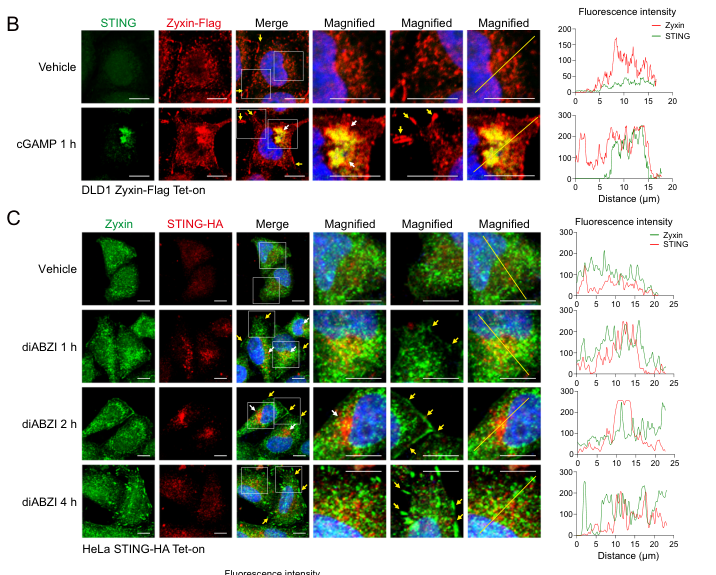

## Question

# Gene Research for Functional Annotation

## ⚠️ CRITICAL: Gene/Protein Identification Context

**BEFORE YOU BEGIN RESEARCH:** You MUST verify you are researching the CORRECT gene/protein. Gene symbols can be ambiguous, especially for less well-characterized genes from non-model organisms.

### Target Gene/Protein Identity (from UniProt):
- **UniProt Accession:** Q9UHD2
- **Protein Description:** RecName: Full=Serine/threonine-protein kinase TBK1 {ECO:0000305}; EC=2.7.11.1 {ECO:0000269|PubMed:15367631, ECO:0000269|PubMed:18583960, ECO:0000269|PubMed:21138416, ECO:0000269|PubMed:21270402, ECO:0000269|PubMed:21464307, ECO:0000269|PubMed:21617041, ECO:0000269|PubMed:25636800}; AltName: Full=NF-kappa-B-activating kinase {ECO:0000303|PubMed:10783893}; AltName: Full=T2K; AltName: Full=TANK-binding kinase 1 {ECO:0000303|PubMed:10581243};
- **Gene Information:** Name=TBK1 {ECO:0000303|PubMed:10581243, ECO:0000312|HGNC:HGNC:11584}; Synonyms=NAK {ECO:0000303|PubMed:10783893};
- **Organism (full):** Homo sapiens (Human).
- **Protein Family:** Belongs to the protein kinase superfamily. Ser/Thr protein
- **Key Domains:** IKK. (IPR051180); Kinase-like_dom_sf. (IPR011009); Prot_kinase_dom. (IPR000719); Protein_kinase_ATP_BS. (IPR017441); TBK1_CC1. (IPR041309)

### MANDATORY VERIFICATION STEPS:

1. **Check if the gene symbol "TBK1" matches the protein description above**
2. **Verify the organism is correct:** Homo sapiens (Human).
3. **Check if protein family/domains align with what you find in literature**
4. **If you find literature for a DIFFERENT gene with the same or similar symbol, STOP**

### If Gene Symbol is Ambiguous or You Cannot Find Relevant Literature:

**DO NOT PROCEED WITH RESEARCH ON A DIFFERENT GENE.** Instead:
- State clearly: "The gene symbol 'TBK1' is ambiguous or literature is limited for this specific protein"
- Explain what you found (e.g., "Found extensive literature on a different gene with the same symbol in a different organism")
- Describe the protein based ONLY on the UniProt information provided above
- Suggest that the protein function can be inferred from domain/family information

### Research Target:

Please provide a comprehensive research report on the gene **TBK1** (gene ID: TBK1, UniProt: Q9UHD2) in human.

The research report should be a detailed narrative explaining the function, biological processes, and localization of the gene product. Citations should be given for all claims.

You should prioritize authoritative reviews and primary scientific literature when conducting research. You can supplement
this with annotations you find in gene/protein databases, but these can be outdated or inaccurate.

We are specifically interested in the primary function of the gene - for enzymes, what reaction is catalyzed, and what is the substrate specificity? For transporters, what is the substrate? For structural proteins or adapters, what is the broader structural role? For signaling molecules, what is the role in the pathway.

We are interested in where in or outside the cell the gene product carries out its function.

We are also interested in the signaling or biochemical pathways in which the gene functions. We are less interested in broad pleiotropic effects, except where these elucidate the precise role.

Include evidence where possible. We are interested in both experimental evidence as well as inference from structure, evolution, or bioinformatic analysis. Precise studies should be prioritized over high-throughput, where available.

## Output

Question: You are an expert researcher providing comprehensive, well-cited information.

Provide detailed information focusing on:
1. Key concepts and definitions with current understanding
2. Recent developments and latest research (prioritize 2023-2024 sources)
3. Current applications and real-world implementations
4. Expert opinions and analysis from authoritative sources
5. Relevant statistics and data from recent studies

Format as a comprehensive research report with proper citations. Include URLs and publication dates where available.
Always prioritize recent, authoritative sources and provide specific citations for all major claims.

# Gene Research for Functional Annotation

## ⚠️ CRITICAL: Gene/Protein Identification Context

**BEFORE YOU BEGIN RESEARCH:** You MUST verify you are researching the CORRECT gene/protein. Gene symbols can be ambiguous, especially for less well-characterized genes from non-model organisms.

### Target Gene/Protein Identity (from UniProt):
- **UniProt Accession:** Q9UHD2
- **Protein Description:** RecName: Full=Serine/threonine-protein kinase TBK1 {ECO:0000305}; EC=2.7.11.1 {ECO:0000269|PubMed:15367631, ECO:0000269|PubMed:18583960, ECO:0000269|PubMed:21138416, ECO:0000269|PubMed:21270402, ECO:0000269|PubMed:21464307, ECO:0000269|PubMed:21617041, ECO:0000269|PubMed:25636800}; AltName: Full=NF-kappa-B-activating kinase {ECO:0000303|PubMed:10783893}; AltName: Full=T2K; AltName: Full=TANK-binding kinase 1 {ECO:0000303|PubMed:10581243};
- **Gene Information:** Name=TBK1 {ECO:0000303|PubMed:10581243, ECO:0000312|HGNC:HGNC:11584}; Synonyms=NAK {ECO:0000303|PubMed:10783893};
- **Organism (full):** Homo sapiens (Human).
- **Protein Family:** Belongs to the protein kinase superfamily. Ser/Thr protein
- **Key Domains:** IKK. (IPR051180); Kinase-like_dom_sf. (IPR011009); Prot_kinase_dom. (IPR000719); Protein_kinase_ATP_BS. (IPR017441); TBK1_CC1. (IPR041309)

### MANDATORY VERIFICATION STEPS:

1. **Check if the gene symbol "TBK1" matches the protein description above**
2. **Verify the organism is correct:** Homo sapiens (Human).
3. **Check if protein family/domains align with what you find in literature**
4. **If you find literature for a DIFFERENT gene with the same or similar symbol, STOP**

### If Gene Symbol is Ambiguous or You Cannot Find Relevant Literature:

**DO NOT PROCEED WITH RESEARCH ON A DIFFERENT GENE.** Instead:
- State clearly: "The gene symbol 'TBK1' is ambiguous or literature is limited for this specific protein"
- Explain what you found (e.g., "Found extensive literature on a different gene with the same symbol in a different organism")
- Describe the protein based ONLY on the UniProt information provided above
- Suggest that the protein function can be inferred from domain/family information

### Research Target:

Please provide a comprehensive research report on the gene **TBK1** (gene ID: TBK1, UniProt: Q9UHD2) in human.

The research report should be a detailed narrative explaining the function, biological processes, and localization of the gene product. Citations should be given for all claims.

You should prioritize authoritative reviews and primary scientific literature when conducting research. You can supplement
this with annotations you find in gene/protein databases, but these can be outdated or inaccurate.

We are specifically interested in the primary function of the gene - for enzymes, what reaction is catalyzed, and what is the substrate specificity? For transporters, what is the substrate? For structural proteins or adapters, what is the broader structural role? For signaling molecules, what is the role in the pathway.

We are interested in where in or outside the cell the gene product carries out its function.

We are also interested in the signaling or biochemical pathways in which the gene functions. We are less interested in broad pleiotropic effects, except where these elucidate the precise role.

Include evidence where possible. We are interested in both experimental evidence as well as inference from structure, evolution, or bioinformatic analysis. Precise studies should be prioritized over high-throughput, where available.

## Research report: Human TBK1 (TANK-binding kinase 1; UniProt Q9UHD2)

### 0) Target verification (critical)
The evidence reviewed here consistently refers to **human TANK-binding kinase 1 (TBK1)**, a **serine/threonine protein kinase** in the IKK-related kinase family, activated by **dimerization/oligomerization** and **Ser172 (S172) trans-autophosphorylation**, and functioning downstream of **STING/MAVS** innate-immune signalosomes and in **selective autophagy/mitophagy** via cargo receptors such as **OPTN and NDP52**—matching the UniProt identity Q9UHD2. (miranda2024emergingrolesof pages 3-4, yamano2024optineurinprovidesa pages 12-13, hu2024mechanismoftbk1 pages 1-2)

### 1) Key concepts and definitions (current understanding)

#### 1.1 What TBK1 is
TBK1 is an enzyme (EC 2.7.11.1) that **catalyzes protein phosphorylation on Ser/Thr residues**, acting as a signal-transduction node that converts innate-immune receptor engagement into transcriptional programs (type I interferons; inflammatory genes) and also modulates membrane-trafficking and autophagy-related processes. (miranda2024emergingrolesof pages 3-4, yamano2024optineurinprovidesa pages 12-13)

#### 1.2 Canonical pathway definition: nucleic-acid sensing → TBK1 → IRFs
A core, widely used definition of TBK1’s canonical role is: **cytosolic nucleic-acid sensors** (e.g., RNA-sensing via MAVS, DNA-sensing via cGAS–STING) recruit and activate TBK1, which then **phosphorylates IRF3 and IRF7**, enabling **type I interferon** induction. (miranda2024emergingrolesof pages 3-4, yamano2024optineurinprovidesa pages 12-13)

#### 1.3 Key activation concepts
**S172 phosphorylation** is repeatedly described as the central biochemical “switch” for TBK1 catalytic activation and is promoted by **dimer/oligomer formation** and **trans-autophosphorylation** within TBK1 assemblies. (hu2024mechanismoftbk1 pages 2-3, miranda2024emergingrolesof pages 3-4, yamano2024optineurinprovidesa pages 12-13)

Recruitment to particular signaling complexes (via adaptor proteins such as **TANK, NAP1/AZI2, and SINTBAD/TBKBP1**) is emphasized as a major determinant of TBK1 **substrate selection and localization**, beyond what the kinase domain alone could specify in the cytosol. (miranda2024emergingrolesof pages 3-4, hu2024mechanismoftbk1 pages 1-2, paul2023thenoncanonicalfunction pages 17-20)

### 2) Molecular function: substrates, reaction logic, and pathway positioning

#### 2.1 Substrate spectrum and pathway outputs
**Innate immunity (STING/MAVS pathways).** TBK1 is recruited to STING signalosomes after STING activation/oligomerization on post-Golgi membranes and then drives downstream phosphorylation events including **IRF3/IRF7** activation to induce IFN-I programs, with additional coupling into NF-κB outputs in multiple contexts. (miranda2024emergingrolesof pages 3-4, yamano2024optineurinprovidesa pages 12-13)

**Selective autophagy/mitophagy.** TBK1 also functions as a selective-autophagy kinase: when recruited to ubiquitinated cargo, it phosphorylates autophagy receptors—particularly **OPTN and NDP52 (CALCOCO2)**—thereby increasing their effective interactions with ubiquitin and ATG8/LC3 proteins and promoting autophagosome biogenesis and cargo clearance. (paul2023thenoncanonicalfunction pages 15-17, yamano2024optineurinprovidesa pages 12-13, paul2023thenoncanonicalfunction pages 17-20)

#### 2.2 Mechanism of TBK1 action in mitophagy (detailed, 2023–2024 emphasis)
A major 2024 mechanistic advance is the demonstration that **OPTN provides a physical “contact site” for TBK1 activation** during PINK1/Parkin-dependent mitophagy, assembling an OPTN–TBK1 complex at mitochondria–autophagosome formation interfaces and generating a **positive-feedback loop**: OPTN promotes TBK1 activation, and activated TBK1 promotes OPTN function. (yamano2024optineurinprovidesa pages 1-2)

This work highlights **S172 autophosphorylation** as the activation switch and reports that **TBK1 deletion prevents OPTN localization to autophagosome formation sites**, while **OPTN deletion blocks TBK1 autophosphorylation**, strongly supporting reciprocal dependency in mitophagy initiation. (yamano2024optineurinprovidesa pages 1-2)

At the level of phosphorylation sites relevant to mechanism, OPTN phosphorylation sites discussed include **S177 (in/near LIR)** and **S473 (in UBAN)**, which are linked to OPTN’s improved association with ubiquitin-coated mitochondria and trafficking to autophagosome formation sites. (yamano2024optineurinprovidesa pages 12-13)

#### 2.3 A newly defined innate-immune-to-cytoskeleton axis (2024): TBK1 → Zyxin
A 2024 EMBO Journal study identifies a STING/MAVS–TBK1 signaling axis that reaches the actin adhesion machinery via **Zyxin**. In this model, nucleic-acid sensing activates TBK1, resulting in robust phosphorylation of **Zyxin at S142/S143**, with phospho-Zyxin colocalizing with TBK1 puncta and subsequently localizing to focal adhesions to modulate F-actin organization and macrophage motility. (zhou2024tbk1zyxinsignalingcontrols pages 4-5)

The same study reports that **TBK1 inhibitors BX795 or MRT67307 eliminate Zyxin phosphorylation**, paralleling their suppression of **IRF3 phosphorylation**, supporting Zyxin as a TBK1-dependent downstream output of innate-immune activation (directly or indirectly). (zhou2024tbk1zyxinsignalingcontrols pages 4-5)

**Figure evidence.** The immunofluorescence and immunoblot panels extracted from this work show pZyxin colocalization with TBK1 puncta and focal adhesions and quantify phosphorylation changes during innate-immune stimulation and inhibitor treatment. (zhou2024tbk1zyxinsignalingcontrols media 698b1cfa)

### 3) Regulation and activation mechanisms (latest research emphasized)

#### 3.1 Core activation by oligomerization and S172 autophosphorylation
Recent reviews consolidate a model in which TBK1 becomes catalytically competent when brought into higher-order assemblies, undergoing **trans-autophosphorylation at S172**; this is strongly tied to innate-immune signalosome formation (e.g., STING oligomers) and to cargo-receptor scaffolding in selective autophagy. (miranda2024emergingrolesof pages 3-4, yamano2024optineurinprovidesa pages 12-13)

A 2024 review focused on cancer contexts further emphasizes that S172 phosphorylation is tightly linked to TBK1 catalytic activation and notes upstream inputs capable of triggering or amplifying S172 phosphorylation (including pathways involving ULK1, PKCθ, and RalB/Sec5-dependent recruitment). (hu2024mechanismoftbk1 pages 2-3, hu2024mechanismoftbk1 pages 1-2)

#### 3.2 PTK2B (PYK2) as an upstream activator via TBK1 Tyr591 (2023)
A 2023 Nature Communications study provides evidence for a specific activating tyrosine phosphorylation event: **PTK2B directly phosphorylates TBK1 at Tyr591 (Y591)**, located in TBK1’s scaffolding/dimerization region, which **enhances TBK1 activation by increasing oligomerization**. (lin2023ptk2bpromotestbk1 pages 9-10)

The same work reports that **PTK2B also promotes STING oligomerization**, via a kinase-independent mechanism, providing a coherent explanation for how PTK2B can amplify STING–TBK1 signaling from multiple angles. (lin2023ptk2bpromotestbk1 pages 9-10)

### 4) Subcellular localization: where TBK1 acts

TBK1’s function is tightly linked to its recruitment to distinct subcellular “platforms”:

* **Post-Golgi STING signalosomes/aggregates**: STING oligomerization on post-Golgi membranes recruits TBK1 and supports TBK1 trans-autophosphorylation and downstream IRF signaling. (yamano2024optineurinprovidesa pages 12-13)
* **Mitochondria–autophagosome formation contact sites** during mitophagy: OPTN-dependent assembly of OPTN–TBK1 complexes at these interfaces supports TBK1 activation and autophagosome biogenesis on damaged mitochondria. (yamano2024optineurinprovidesa pages 1-2)
* **TBK1 puncta and focal adhesions** in innate-immune-to-adhesion remodeling: pZyxin (S142/S143) is observed colocalized with TBK1 puncta and then at focal adhesions upon innate immune stimulation. (zhou2024tbk1zyxinsignalingcontrols pages 4-5, zhou2024tbk1zyxinsignalingcontrols media 698b1cfa)

### 5) Recent developments and latest research (prioritizing 2023–2024)

Key 2023–2024 developments with strong experimental support in this corpus include:

1. **Mitophagy activation platform model (OPTN–TBK1)**: OPTN provides a scaffold for TBK1 activation at mitochondria–autophagosome contact sites, establishing reciprocal positive feedback in mitophagy initiation (EMBO J, Feb 2024). URL: https://doi.org/10.1038/s44318-024-00036-1 (yamano2024optineurinprovidesa pages 1-2)
2. **PTK2B→TBK1 Y591 activation mechanism**: PTK2B phosphorylates TBK1 at Y591 to enhance oligomerization/activation, and independently supports STING oligomerization (Nat Commun, Nov 2023). URL: https://doi.org/10.1038/s41467-023-43419-4 (lin2023ptk2bpromotestbk1 pages 9-10)
3. **STING/MAVS–TBK1–Zyxin axis**: TBK1-driven phosphorylation of Zyxin at S142/S143 links innate immune sensing to focal adhesion/F-actin remodeling and macrophage migration (EMBO J, Sep 2024). URL: https://doi.org/10.1038/s44318-024-00244-9 (zhou2024tbk1zyxinsignalingcontrols pages 4-5, zhou2024tbk1zyxinsignalingcontrols media 698b1cfa)
4. **Cancer-centered synthesis of upstream TBK1 activation**: review literature consolidates growth-factor and oncogenic pathways (e.g., KRAS→RalB/Sec5; PKCθ-linked complexes) that activate TBK1 through S172-centric mechanisms (Cell Insight, Oct 2024). URL: https://doi.org/10.1016/j.cellin.2024.100197 (hu2024mechanismoftbk1 pages 2-3, hu2024mechanismoftbk1 pages 1-2)

### 6) Current applications and real-world implementations

#### 6.1 TBK1 as a therapeutic target/modulator in viral immunopathology (COVID-19)
A 2023 Nature Communications study proposes that dampening TBK1/IKKε signaling can blunt maladaptive inflammatory programs in SARS-CoV-2 infection. The authors report **a preliminary Phase I study** in which **rectal delivery of idronoxil (IDX) was well-tolerated in 38 hospitalized patients with moderate COVID-19**, and they cite an **excellent safety profile in humans established in >600 cancer patients**. URL: https://doi.org/10.1038/s41467-023-41381-9 (Sep 2023). (ullah2023pharmacologicalinhibitionof pages 7-8)

In a Vero-cell SARS-CoV-2 infection assay described in the methods, the virus was used at **MOI 0.002**, and IDX was tested using **3-fold serial dilutions starting at 50 μM** (Remdesivir starting at 20 μM), illustrating a concrete translational screening setup. (ullah2023pharmacologicalinhibitionof pages 7-8)

#### 6.2 TBK1 inhibition in neuroinflammatory pain models (preclinical)
A 2024 Cell Communication and Signaling study of painful diabetic neuropathy (PDN) reports TBK1 activation in the spinal dorsal horn and uses **TBK1-siRNA** and the TBK1 inhibitor **amlexanox (AMX)** as interventions; the study’s statistical plan reports **sample size n=5 per group** based on repeated behavioral measures power calculations (α=0.05, power=0.8). URL: https://doi.org/10.1186/s12964-024-01723-6 (Jul 2024). (liao2024targetingtankbindingkinase pages 4-5)

#### 6.3 TBK1 genetics for diagnosis/stratification in FTD (patient-facing implementation)
A 2024 Alzheimer’s Research & Therapy study of a Chinese FTD cohort (n=261) identifies **TBK1 variants in 7 individuals**, and reports a pooled Chinese-cohort TBK1 mutation frequency of **2.0% (95% CI 1.0%–3.1%)** in a meta-analysis, positioning TBK1 among the most frequent genetic contributors to FTD in that population. URL: https://doi.org/10.1186/s13195-024-01493-w (Jun 2024). (nan2024geneticandclinical pages 1-3, nan2024geneticandclinical pages 18-20)

This work also links patient variants to mechanistic function: TBK1 **I37T and E232Q** show **reduced TBK1 autophosphorylation**, and **I37T reduces OPTN phosphorylation**, while **E696G increases OPTN–TBK1 complex formation**, directly connecting TBK1 disease variants to altered kinase activation and selective-autophagy signaling. (nan2024geneticandclinical pages 1-3, nan2024geneticandclinical pages 18-20)

### 7) Expert synthesis and analysis (authoritative sources)

A 2024 Trends in Cancer review frames TBK1 as a **context-dependent regulator** that integrates innate immune sensing (STING/MAVS/TLR inputs) with broader outputs including NF-κB signaling and autophagy, arguing that adaptor-driven recruitment (TANK/SINTBAD/AZI2) is critical for TBK1’s diverse functions and that TBK1 has multiple roles in tumor–immune interactions beyond tumor-intrinsic survival signaling. URL: https://doi.org/10.1016/j.trecan.2024.02.007 (Mar 2024). (miranda2024emergingrolesof pages 3-4)

A 2024 focused review on TBK1 activation in cancer emphasizes that upstream kinase inputs and scaffolding complexes likely initiate and amplify S172 phosphorylation and that autophagy can also impose negative feedback by degrading activated TBK1, highlighting TBK1 as a dynamically regulated signaling hub rather than a simple on/off kinase. URL: https://doi.org/10.1016/j.cellin.2024.100197 (Oct 2024). (hu2024mechanismoftbk1 pages 2-3)

### 8) Disease associations (database-supported overview)
Open Targets disease–target association evidence links **TBK1** to multiple conditions including **amyotrophic lateral sclerosis (ALS)** and **frontotemporal dementia and/or ALS 4**, as well as **COVID-19** and certain autoinflammatory/infectious phenotypes, reflecting the combined genetic and mechanistic literature around TBK1’s roles in neurodegeneration and innate immunity. (OpenTargets Search: -TBK1)

### 9) Summary tables and figure evidence
The following tables summarize TBK1 functional annotation and translational evidence:

| Functional area | Key concepts/definition | Core molecular mechanism | Key substrates/partners | Subcellular localization | Representative 2023-2024 sources (with DOI URLs) |
|---|---|---|---|---|---|
| Innate immune signaling (STING/MAVS→TBK1→IRF3/7) | TBK1 is a human serine/threonine kinase and central effector of nucleic-acid sensing that couples STING or MAVS signalosomes to type I interferon output; activation requires dimerization/oligomerization and Ser172 trans-autophosphorylation (miranda2024emergingrolesof pages 3-4, yamano2024optineurinprovidesa pages 12-13, hu2024mechanismoftbk1 pages 1-2) | STING oligomerization on post-Golgi membranes recruits TBK1 dimers, enabling trans-autophosphorylation at S172 and phosphorylation of IRF3/IRF7; MAVS/TLR pathways likewise recruit TBK1 through adaptors such as TANK, NAP1/AZI2, and SINTBAD/TBKBP1 to drive IFN and some NF-κB responses (miranda2024emergingrolesof pages 3-4, yamano2024optineurinprovidesa pages 12-13, hu2024mechanismoftbk1 pages 1-2, paul2023thenoncanonicalfunction pages 17-20) | STING, MAVS, TANK, NAP1/AZI2, SINTBAD/TBKBP1, IRF3, IRF7; K63-linked ubiquitination at Lys30/Lys401 contributes to activation (miranda2024emergingrolesof pages 3-4, hu2024mechanismoftbk1 pages 1-2) | Cytosol; ER-to-post-Golgi STING signalosomes; pathogen-sensing complexes (miranda2024emergingrolesof pages 3-4, yamano2024optineurinprovidesa pages 12-13) | Miranda et al., 2024, Trends Cancer, https://doi.org/10.1016/j.trecan.2024.02.007; Lin et al., 2023, Nat Commun, https://doi.org/10.1038/s41467-023-43419-4; Wegner et al., 2023, Front Immunol, https://doi.org/10.3389/fimmu.2023.1073608 (miranda2024emergingrolesof pages 3-4, lin2023ptk2bpromotestbk1 pages 9-10) |
| Autophagy/mitophagy | TBK1 is a selective-autophagy/mitophagy kinase that amplifies ubiquitin-driven recruitment of cargo receptors and early autophagosome machinery; OPTN can act as a platform for TBK1 activation at mitophagy contact sites (yamano2024optineurinprovidesa pages 1-2, yamano2024optineurinprovidesa pages 12-13, paul2023thenoncanonicalfunction pages 17-20) | Upon mitochondrial damage or ubiquitinated cargo accumulation, TBK1 is recruited by OPTN/NDP52/TAX1BP1-containing assemblies; TBK1 autophosphorylation activates phosphorylation of mitophagy receptors, increasing their binding to ubiquitin, ATG8 proteins, and FIP200, thereby promoting phagophore assembly and cargo clearance (paul2023thenoncanonicalfunction pages 15-17, yamano2024optineurinprovidesa pages 1-2, yamano2024optineurinprovidesa pages 12-13, paul2023thenoncanonicalfunction pages 17-20) | OPTN, NDP52/CALCOCO2, TAX1BP1, FIP200, LC3/ATG8 family, ATG9A, RAB7A; OPTN sites include S177 and S473 in the LIR/UBAN region (yamano2024optineurinprovidesa pages 1-2, yamano2024optineurinprovidesa pages 12-13, paul2023thenoncanonicalfunction pages 17-20) | Damaged mitochondria; mitochondria–autophagosome formation contact sites; ubiquitin-coated bacteria/cargo; lysosome-associated autophagy initiation complexes (yamano2024optineurinprovidesa pages 1-2, yamano2024optineurinprovidesa pages 12-13, paul2023thenoncanonicalfunction pages 17-20) | Yamano et al., 2024, EMBO J, https://doi.org/10.1038/s44318-024-00036-1; Nguyen et al., 2023, Mol Cell/bioRxiv record, https://doi.org/10.1101/2022.08.14.503930; Schmid et al., 2024, Front Immunol, https://doi.org/10.3389/fimmu.2024.1356369 (yamano2024optineurinprovidesa pages 1-2, yamano2024optineurinprovidesa pages 12-13) |
| Focal-adhesion / cytoskeletal signaling | Recent work identifies TBK1 as a regulator of actin-adhesion remodeling through Zyxin, linking innate immune sensing to cell motility and tissue positioning (zhou2024tbk1zyxinsignalingcontrols pages 4-5, zhou2024tbk1zyxinsignalingcontrols media 698b1cfa) | STING or MAVS signalosomes activate TBK1, which drives Zyxin phosphorylation at S142/S143; phospho-Zyxin colocalizes with TBK1 puncta and focal adhesions, promoting focal-adhesion/F-actin reorganization and reducing macrophage migration (zhou2024tbk1zyxinsignalingcontrols pages 4-5, zhou2024tbk1zyxinsignalingcontrols media 698b1cfa) | Zyxin; upstream STING/MAVS signalosomes; downstream F-actin/focal-adhesion machinery; TBK1 inhibitors BX795 and MRT67307 suppress Zyxin phosphorylation together with IRF3 phosphorylation (zhou2024tbk1zyxinsignalingcontrols pages 4-5, zhou2024tbk1zyxinsignalingcontrols media 698b1cfa) | STING aggregates/signalosomes, TBK1 puncta, focal adhesions, macrophage cytoplasm (zhou2024tbk1zyxinsignalingcontrols pages 4-5, zhou2024tbk1zyxinsignalingcontrols media 698b1cfa) | Zhou et al., 2024, EMBO J, https://doi.org/10.1038/s44318-024-00244-9 (zhou2024tbk1zyxinsignalingcontrols pages 4-5, zhou2024tbk1zyxinsignalingcontrols media 698b1cfa) |
| Upstream activation by PTK2B | PTK2B/PYK2 is an upstream tyrosine kinase that enhances TBK1 activation in antiviral signaling by promoting TBK1 oligomerization (lin2023ptk2bpromotestbk1 pages 9-10) | PTK2B directly phosphorylates TBK1 at Tyr591 in the scaffold/dimerization domain, increasing TBK1 oligomerization and activation; PTK2B also promotes STING oligomerization through a kinase-independent mechanism, strengthening STING–TBK1 signaling (lin2023ptk2bpromotestbk1 pages 9-10) | PTK2B, TBK1 Y591, STING, IRF3; PTK2B deficiency reduces antiviral signaling and increases susceptibility to viral infection in mouse models (lin2023ptk2bpromotestbk1 pages 9-10) | Golgi-associated granules/signalosomes containing STING and TBK1 during infection; immune-cell cytoplasm (lin2023ptk2bpromotestbk1 pages 9-10) | Lin et al., 2023, Nat Commun, https://doi.org/10.1038/s41467-023-43419-4 (lin2023ptk2bpromotestbk1 pages 9-10) |
| Cancer context | TBK1 is frequently positioned as a multifunctional cancer-cell survival and tumor-immune regulator, especially in KRAS-driven and inflammatory tumor contexts; its effects can be tumor-promoting or context-dependent via IFN-I pathways (hu2024mechanismoftbk1 pages 2-3, miranda2024emergingrolesof pages 3-4, hu2024mechanismoftbk1 pages 1-2) | Oncogenic inputs such as KRAS→RalB/Sec5 and growth-factor→TBK1–TBKBP1–CARD10–PKCθ pathways increase TBK1 activation (including S172 and S716-linked regulation), supporting NF-κB/IFN signaling, anti-apoptotic transcription, autophagy, and tumor–microenvironment crosstalk (hu2024mechanismoftbk1 pages 2-3, hu2024mechanismoftbk1 pages 1-2) | RalB, Sec5, PKCθ, TBKBP1, CARD10, NEMO, IRF3, NF-κB components including c-Rel and BCL-xL-linked outputs; additional reported substrates include Sec5, p62, and OPTN (hu2024mechanismoftbk1 pages 2-3, miranda2024emergingrolesof pages 3-4) | Cytosol and signalosome-associated compartments; Golgi-associated pre-autophagosome initiation sites; tumor and immune-cell compartments (hu2024mechanismoftbk1 pages 2-3, miranda2024emergingrolesof pages 3-4) | Hu & Zhang, 2024, Cell Insight, https://doi.org/10.1016/j.cellin.2024.100197; Miranda et al., 2024, Trends Cancer, https://doi.org/10.1016/j.trecan.2024.02.007; Wang et al., 2024, Front Immunol, https://doi.org/10.3389/fimmu.2024.1433321 (hu2024mechanismoftbk1 pages 2-3, miranda2024emergingrolesof pages 3-4) |

*Table: This table summarizes the major functional areas of human TBK1 (UniProt Q9UHD2), including its core mechanisms, substrates, localization, and recent representative sources. It is useful as a compact reference for innate immunity, autophagy, cytoskeletal signaling, upstream activation, and cancer-related roles.*

| Use case/disease area | Compound/inhibitor or intervention | Mechanism (TBK1/IKKε etc) | Model/system | Key quantitative/statistical details | Notes/limitations | Source (with DOI URL and date) |
|---|---|---|---|---|---|---|
| COVID-19 / SARS-CoV-2 hyper-inflammation | Idronoxil (IDX) | Small-molecule inhibitor that suppresses TBK1/IKKε signaling by destabilizing TBK1/IKKε protein complexes; proposed to limit harmful inflammatory signaling rather than directly target viral replication (ullah2023pharmacologicalinhibitionof pages 7-8, ullah2023pharmacologicalinhibitionof pages 8-9) | Murine SARS-CoV-2 immunopathology model; supporting cell-based assays including Vero infection assay and multiple innate-immune reporter/cell systems (ullah2023pharmacologicalinhibitionof pages 7-8, ullah2023pharmacologicalinhibitionof pages 8-9) | Preliminary Phase I rectal-delivery study reported good tolerability in **38 hospitalized moderate COVID-19 patients**; human safety profile cited as established in **>600 cancer patients**; antiviral assay used **MOI 0.002**, with IDX tested in **3-fold serial dilution from 50 μM** (Remdesivir from 20 μM) (ullah2023pharmacologicalinhibitionof pages 7-8) | Quantitative efficacy values are not provided in the extracted text; translational rationale is stronger than direct clinical efficacy evidence here; effects may reflect broader TBK1/IKKε pathway modulation (ullah2023pharmacologicalinhibitionof pages 7-8, ullah2023pharmacologicalinhibitionof pages 8-9) | Ullah et al., *Nature Communications*, 2023-09, https://doi.org/10.1038/s41467-023-41381-9 (ullah2023pharmacologicalinhibitionof pages 7-8, ullah2023pharmacologicalinhibitionof pages 8-9) |
| Innate immune / cytoskeletal signaling; tumor immunity | MRT67307 | Pharmacologic TBK1 inhibitor used to block TBK1 kinase activity; in this context suppresses Zyxin phosphorylation downstream of STING/MAVS-TBK1 signaling (zhou2024tbk1zyxinsignalingcontrols pages 4-5, zhou2024tbk1zyxinsignalingcontrols media 698b1cfa) | Primary macrophages and cell systems stimulated by HSV-1, SeV, poly(I:C), diABZI, or cGAMP; focal-adhesion/TBK1 puncta imaging and immunoblot analyses (zhou2024tbk1zyxinsignalingcontrols pages 4-5, zhou2024tbk1zyxinsignalingcontrols media 698b1cfa) | Immunofluorescence quantification used **n = 4 per group** for panel E and **n = 3 per group** for panel F; inhibitor treatment eliminated inducible **pZyxin(S142/S143)** in parallel with loss of **pIRF3**, while not eliminating TBK1 S172 phosphorylation signal in the reported assays (zhou2024tbk1zyxinsignalingcontrols pages 4-5) | Primarily a mechanistic research tool, not a clinically validated TBK1 therapy; extracted text does not provide dose-response or in vivo human data (zhou2024tbk1zyxinsignalingcontrols pages 4-5, zhou2024tbk1zyxinsignalingcontrols media 698b1cfa) | Zhou et al., *The EMBO Journal*, 2024-09, https://doi.org/10.1038/s44318-024-00244-9 (zhou2024tbk1zyxinsignalingcontrols pages 4-5, zhou2024tbk1zyxinsignalingcontrols media 698b1cfa) |
| Innate immune / cytoskeletal signaling; tumor immunity | BX795 | TBK1 inhibitor used experimentally to abrogate TBK1 activity and downstream Zyxin phosphorylation in STING/MAVS-TBK1-Zyxin pathway studies (zhou2024tbk1zyxinsignalingcontrols pages 4-5, zhou2024tbk1zyxinsignalingcontrols media 698b1cfa) | Same macrophage and cell-signaling systems as above; nucleic-acid sensing and focal-adhesion remodeling assays (zhou2024tbk1zyxinsignalingcontrols pages 4-5, zhou2024tbk1zyxinsignalingcontrols media 698b1cfa) | Inhibiting TBK1 with **BX795 or MRT67307** eliminated Zyxin phosphorylation, paralleling inhibition of IRF3 phosphorylation during HSV-1/SeV/poly(I:C) responses; figure-based quantification used **n = 3-4** independent experiments depending on panel (zhou2024tbk1zyxinsignalingcontrols pages 4-5) | Widely used but known in the field as a multi-kinase tool compound; extracted text here focuses on mechanistic inference, not therapeutic translation (zhou2024tbk1zyxinsignalingcontrols pages 4-5, zhou2024tbk1zyxinsignalingcontrols media 698b1cfa) | Zhou et al., *The EMBO Journal*, 2024-09, https://doi.org/10.1038/s44318-024-00244-9 (zhou2024tbk1zyxinsignalingcontrols pages 4-5, zhou2024tbk1zyxinsignalingcontrols media 698b1cfa) |
| Painful diabetic neuropathy (PDN) | Amlexanox (AMX) | TBK1 inhibitor proposed to reduce microglial pyroptosis and noncanonical NF-κB/NLRP3-linked inflammatory signaling in PDN (paper describes it as a TBK1 inhibitor) (liao2024targetingtankbindingkinase pages 4-5) | Mouse PDN models including streptozotocin-induced T1DM and db/db T2DM-related neuropathy; spinal dorsal horn/microglial analyses plus behavioral and nerve-injury readouts (liao2024targetingtankbindingkinase pages 4-5) | Power calculation used **α = 0.05**, **power = 0.8**, and **sample size = 5/group** for repeated behavioral measures; intrathecal **TBK1 siRNA 10 μg/mouse** and **Ac-YVAD-cmk 10 nmol/mouse** were used in intervention experiments; systemic AMX was reported to improve peripheral nerve injury (liao2024targetingtankbindingkinase pages 4-5) | The extracted pages do not provide a specific AMX dose or effect size; evidence is preclinical and includes siRNA plus inhibitor data rather than a standalone drug-development package (liao2024targetingtankbindingkinase pages 4-5) | Liao et al., *Cell Communication and Signaling*, 2024-07, https://doi.org/10.1186/s12964-024-01723-6 (liao2024targetingtankbindingkinase pages 4-5) |
| Frontotemporal dementia (FTD) genetics / patient stratification | TBK1 variant screening and functional characterization | Human genetic association plus functional assays of TBK1 variants affecting autophosphorylation and OPTN-related autophagy signaling (nan2024geneticandclinical pages 1-3, nan2024geneticandclinical pages 18-20, nan2024geneticandclinical pages 20-22) | Chinese FTD cohort and meta-analysis; in vitro HEK293T functional assays for TBK1 mutants and OPTN phosphorylation/complex formation (nan2024geneticandclinical pages 1-3, nan2024geneticandclinical pages 18-20, nan2024geneticandclinical pages 20-22) | In the cohort, **61/261 (23.4%)** carried potential causative FTD-gene variants; **TBK1 variants were found in 7 patients**; pooled Chinese FTD meta-analysis estimated TBK1 mutation frequency at **2.0% (95% CI 1.0%-3.1%)**; one excerpt also reports **19/751** positive cases overall; functional assays showed **I37T** and **E232Q** had decreased TBK1 autophosphorylation, and **I37T** reduced OPTN phosphorylation, while **E696G** increased OPTN-TBK1 complex formation (nan2024geneticandclinical pages 1-3, nan2024geneticandclinical pages 18-20, nan2024geneticandclinical pages 20-22) | Translational value is strongest for diagnosis/genetic stratification rather than immediate drug intervention; some cohort/count discrepancies across excerpts likely reflect different filtering definitions (all variants vs pathogenic subsets) and should be interpreted carefully (nan2024geneticandclinical pages 1-3, nan2024geneticandclinical pages 18-20, nan2024geneticandclinical pages 20-22, nan2024geneticandclinical pages 4-6) | Nan et al., *Alzheimer's Research & Therapy*, 2024-06, https://doi.org/10.1186/s13195-024-01493-w (nan2024geneticandclinical pages 1-3, nan2024geneticandclinical pages 18-20, nan2024geneticandclinical pages 20-22, nan2024geneticandclinical pages 4-6) |

*Table: This table summarizes translationally relevant TBK1 evidence across infection, inflammation, neuropathy, and neurodegenerative genetics. It highlights compounds, mechanisms, models, and quantitative details that are useful for prioritizing TBK1-related therapeutic or biomarker opportunities.*

A representative figure extraction supporting the STING/MAVS–TBK1–Zyxin axis and TBK1 inhibitor effects is shown here: (zhou2024tbk1zyxinsignalingcontrols media 698b1cfa)

### 10) Limitations of this report (evidence constraints)
Some frequently discussed TBK1 topics (e.g., comprehensive kinase kinetic constants, full inhibitor selectivity panels, and broad clinical-trial landscapes specific to TBK1 inhibitors) were not available in the extracted full-text segments retrieved in this run; accordingly, quantitative pharmacology is reported only where explicitly present in the accessible text. (ullah2023pharmacologicalinhibitionof pages 7-8, liao2024targetingtankbindingkinase pages 4-5)

References

1. (miranda2024emergingrolesof pages 3-4): Alex Miranda, Carl A. Shirley, and Russell W. Jenkins. Emerging roles of tbk1 in cancer immunobiology. Trends in cancer, Mar 2024. URL: https://doi.org/10.1016/j.trecan.2024.02.007, doi:10.1016/j.trecan.2024.02.007. This article has 33 citations and is from a peer-reviewed journal.

2. (yamano2024optineurinprovidesa pages 12-13): Koji Yamano, Momoha Sawada, Reika Kikuchi, Kafu Nagataki, Waka Kojima, Atsushi Sugihara, Tomoshige Fujino, Keiji Tanaka, Gosuke Hayashi, Hiroshi Murakami, and Noriyuki Matsuda. Optineurin provides a mitophagy contact site for tbk1 activation. The EMBO Journal, 43:754-779, Feb 2024. URL: https://doi.org/10.1038/s44318-024-00036-1, doi:10.1038/s44318-024-00036-1. This article has 65 citations.

3. (hu2024mechanismoftbk1 pages 1-2): Lianxin Hu and Qing Zhang. Mechanism of tbk1 activation in cancer cells. Oct 2024. URL: https://doi.org/10.1016/j.cellin.2024.100197, doi:10.1016/j.cellin.2024.100197. This article has 13 citations.

4. (hu2024mechanismoftbk1 pages 2-3): Lianxin Hu and Qing Zhang. Mechanism of tbk1 activation in cancer cells. Oct 2024. URL: https://doi.org/10.1016/j.cellin.2024.100197, doi:10.1016/j.cellin.2024.100197. This article has 13 citations.

5. (paul2023thenoncanonicalfunction pages 17-20): S Paul. The non-canonical function and regulation of tbk1 in the cell cycle. Unknown journal, 2023.

6. (paul2023thenoncanonicalfunction pages 15-17): S Paul. The non-canonical function and regulation of tbk1 in the cell cycle. Unknown journal, 2023.

7. (yamano2024optineurinprovidesa pages 1-2): Koji Yamano, Momoha Sawada, Reika Kikuchi, Kafu Nagataki, Waka Kojima, Atsushi Sugihara, Tomoshige Fujino, Keiji Tanaka, Gosuke Hayashi, Hiroshi Murakami, and Noriyuki Matsuda. Optineurin provides a mitophagy contact site for tbk1 activation. The EMBO Journal, 43:754-779, Feb 2024. URL: https://doi.org/10.1038/s44318-024-00036-1, doi:10.1038/s44318-024-00036-1. This article has 65 citations.

8. (zhou2024tbk1zyxinsignalingcontrols pages 4-5): Ruyuan Zhou, Mengqiu Wang, Xiao Li, Yutong Liu, Yihan Yao, Ailian Wang, Chen Chen, Qian Zhang, Qirou Wu, Qi Zhang, Dante Neculai, Bing Xia, Jian-Zhong Shao, Xin-Hua Feng, Tingbo Liang, Jian Zou, Xiaojian Wang, and Pinglong Xu. Tbk1-zyxin signaling controls tumor-associated macrophage recruitment to mitigate antitumor immunity. The EMBO Journal, 43:4984-5017, Sep 2024. URL: https://doi.org/10.1038/s44318-024-00244-9, doi:10.1038/s44318-024-00244-9. This article has 11 citations.

9. (zhou2024tbk1zyxinsignalingcontrols media 698b1cfa): Ruyuan Zhou, Mengqiu Wang, Xiao Li, Yutong Liu, Yihan Yao, Ailian Wang, Chen Chen, Qian Zhang, Qirou Wu, Qi Zhang, Dante Neculai, Bing Xia, Jian-Zhong Shao, Xin-Hua Feng, Tingbo Liang, Jian Zou, Xiaojian Wang, and Pinglong Xu. Tbk1-zyxin signaling controls tumor-associated macrophage recruitment to mitigate antitumor immunity. The EMBO Journal, 43:4984-5017, Sep 2024. URL: https://doi.org/10.1038/s44318-024-00244-9, doi:10.1038/s44318-024-00244-9. This article has 11 citations.

10. (lin2023ptk2bpromotestbk1 pages 9-10): Yongfang Lin, Jing Yang, Qili Yang, Sha Zeng, Jiayu Zhang, Yuanxiang Zhu, Yuxin Tong, Lin Li, Weiqi Tan, Dahua Chen, and Qinmiao Sun. Ptk2b promotes tbk1 and sting oligomerization and enhances the sting-tbk1 signaling. Nature Communications, Nov 2023. URL: https://doi.org/10.1038/s41467-023-43419-4, doi:10.1038/s41467-023-43419-4. This article has 23 citations and is from a highest quality peer-reviewed journal.

11. (ullah2023pharmacologicalinhibitionof pages 7-8): Tomalika R. Ullah, Matt D. Johansen, Katherine R. Balka, Rebecca L. Ambrose, Linden J. Gearing, James Roest, Julian P. Vivian, Sunil Sapkota, W. Samantha N. Jayasekara, Daniel S. Wenholz, Vina R. Aldilla, Jun Zeng, Stefan Miemczyk, Duc H. Nguyen, Nicole G. Hansbro, Rajan Venkatraman, Jung Hee Kang, Ee Shan Pang, Belinda J. Thomas, Arwaf S. Alharbi, Refaya Rezwan, Meredith O’Keeffe, William A. Donald, Julia I. Ellyard, Wilson Wong, Naresh Kumar, Benjamin T. Kile, Carola G. Vinuesa, Graham E. Kelly, Olivier F. Laczka, Philip M. Hansbro, Dominic De Nardo, and Michael P. Gantier. Pharmacological inhibition of tbk1/ikkε blunts immunopathology in a murine model of sars-cov-2 infection. Nature Communications, Sep 2023. URL: https://doi.org/10.1038/s41467-023-41381-9, doi:10.1038/s41467-023-41381-9. This article has 26 citations and is from a highest quality peer-reviewed journal.

12. (liao2024targetingtankbindingkinase pages 4-5): Qinming Liao, Yimei Yang, Yilu Li, Jun Zhang, Keke Fan, Yihao Guo, Jun Chen, Yinhao Chen, Pian Zhu, Lijin Huang, and Zhongjie Liu. Targeting tank-binding kinase 1 attenuates painful diabetic neuropathy via inhibiting microglia pyroptosis. Cell Communication and Signaling : CCS, Jul 2024. URL: https://doi.org/10.1186/s12964-024-01723-6, doi:10.1186/s12964-024-01723-6. This article has 15 citations.

13. (nan2024geneticandclinical pages 1-3): Haitian Nan, Yeon-Jeong Kim, Min-Liang Chu, Dan Li, Jieying Li, Deming Jiang, Yiming Wu, Toshihisa Ohtsuka, and Liyong Wu. Genetic and clinical landscape of chinese frontotemporal dementia: dominance of tbk1 and optn mutations. Alzheimer's Research & Therapy, Jun 2024. URL: https://doi.org/10.1186/s13195-024-01493-w, doi:10.1186/s13195-024-01493-w. This article has 11 citations and is from a domain leading peer-reviewed journal.

14. (nan2024geneticandclinical pages 18-20): Haitian Nan, Yeon-Jeong Kim, Min-Liang Chu, Dan Li, Jieying Li, Deming Jiang, Yiming Wu, Toshihisa Ohtsuka, and Liyong Wu. Genetic and clinical landscape of chinese frontotemporal dementia: dominance of tbk1 and optn mutations. Alzheimer's Research & Therapy, Jun 2024. URL: https://doi.org/10.1186/s13195-024-01493-w, doi:10.1186/s13195-024-01493-w. This article has 11 citations and is from a domain leading peer-reviewed journal.

15. (OpenTargets Search: -TBK1): Open Targets Query (-TBK1, 7 results). Buniello, A. et al. (2025). Open Targets Platform: facilitating therapeutic hypotheses building in drug discovery. Nucleic Acids Research.

16. (ullah2023pharmacologicalinhibitionof pages 8-9): Tomalika R. Ullah, Matt D. Johansen, Katherine R. Balka, Rebecca L. Ambrose, Linden J. Gearing, James Roest, Julian P. Vivian, Sunil Sapkota, W. Samantha N. Jayasekara, Daniel S. Wenholz, Vina R. Aldilla, Jun Zeng, Stefan Miemczyk, Duc H. Nguyen, Nicole G. Hansbro, Rajan Venkatraman, Jung Hee Kang, Ee Shan Pang, Belinda J. Thomas, Arwaf S. Alharbi, Refaya Rezwan, Meredith O’Keeffe, William A. Donald, Julia I. Ellyard, Wilson Wong, Naresh Kumar, Benjamin T. Kile, Carola G. Vinuesa, Graham E. Kelly, Olivier F. Laczka, Philip M. Hansbro, Dominic De Nardo, and Michael P. Gantier. Pharmacological inhibition of tbk1/ikkε blunts immunopathology in a murine model of sars-cov-2 infection. Nature Communications, Sep 2023. URL: https://doi.org/10.1038/s41467-023-41381-9, doi:10.1038/s41467-023-41381-9. This article has 26 citations and is from a highest quality peer-reviewed journal.

17. (nan2024geneticandclinical pages 20-22): Haitian Nan, Yeon-Jeong Kim, Min-Liang Chu, Dan Li, Jieying Li, Deming Jiang, Yiming Wu, Toshihisa Ohtsuka, and Liyong Wu. Genetic and clinical landscape of chinese frontotemporal dementia: dominance of tbk1 and optn mutations. Alzheimer's Research & Therapy, Jun 2024. URL: https://doi.org/10.1186/s13195-024-01493-w, doi:10.1186/s13195-024-01493-w. This article has 11 citations and is from a domain leading peer-reviewed journal.

18. (nan2024geneticandclinical pages 4-6): Haitian Nan, Yeon-Jeong Kim, Min-Liang Chu, Dan Li, Jieying Li, Deming Jiang, Yiming Wu, Toshihisa Ohtsuka, and Liyong Wu. Genetic and clinical landscape of chinese frontotemporal dementia: dominance of tbk1 and optn mutations. Alzheimer's Research & Therapy, Jun 2024. URL: https://doi.org/10.1186/s13195-024-01493-w, doi:10.1186/s13195-024-01493-w. This article has 11 citations and is from a domain leading peer-reviewed journal.

## Artifacts

- [Edison artifact artifact-00](TBK1-deep-research-falcon_artifacts/artifact-00.md)
- [Edison artifact artifact-01](TBK1-deep-research-falcon_artifacts/artifact-01.md)

## Citations

1. yamano2024optineurinprovidesa pages 1-2
2. yamano2024optineurinprovidesa pages 12-13
3. ullah2023pharmacologicalinhibitionof pages 7-8
4. liao2024targetingtankbindingkinase pages 4-5
5. miranda2024emergingrolesof pages 3-4
6. paul2023thenoncanonicalfunction pages 17-20
7. paul2023thenoncanonicalfunction pages 15-17
8. nan2024geneticandclinical pages 1-3
9. nan2024geneticandclinical pages 18-20
10. ullah2023pharmacologicalinhibitionof pages 8-9
11. nan2024geneticandclinical pages 20-22
12. nan2024geneticandclinical pages 4-6
13. https://doi.org/10.1038/s44318-024-00036-1
14. https://doi.org/10.1038/s41467-023-43419-4
15. https://doi.org/10.1038/s44318-024-00244-9
16. https://doi.org/10.1016/j.cellin.2024.100197
17. https://doi.org/10.1038/s41467-023-41381-9
18. https://doi.org/10.1186/s12964-024-01723-6
19. https://doi.org/10.1186/s13195-024-01493-w
20. https://doi.org/10.1016/j.trecan.2024.02.007
21. https://doi.org/10.1016/j.trecan.2024.02.007;
22. https://doi.org/10.1038/s41467-023-43419-4;
23. https://doi.org/10.3389/fimmu.2023.1073608
24. https://doi.org/10.1038/s44318-024-00036-1;
25. https://doi.org/10.1101/2022.08.14.503930;
26. https://doi.org/10.3389/fimmu.2024.1356369
27. https://doi.org/10.1016/j.cellin.2024.100197;
28. https://doi.org/10.3389/fimmu.2024.1433321
29. https://doi.org/10.1016/j.trecan.2024.02.007,
30. https://doi.org/10.1038/s44318-024-00036-1,
31. https://doi.org/10.1016/j.cellin.2024.100197,
32. https://doi.org/10.1038/s44318-024-00244-9,
33. https://doi.org/10.1038/s41467-023-43419-4,
34. https://doi.org/10.1038/s41467-023-41381-9,
35. https://doi.org/10.1186/s12964-024-01723-6,
36. https://doi.org/10.1186/s13195-024-01493-w,