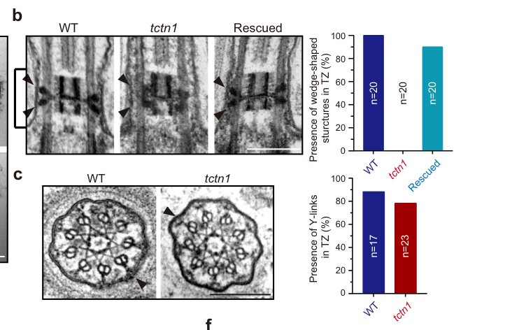

## Question

# Gene Research for Functional Annotation

## ⚠️ CRITICAL: Gene/Protein Identification Context

**BEFORE YOU BEGIN RESEARCH:** You MUST verify you are researching the CORRECT gene/protein. Gene symbols can be ambiguous, especially for less well-characterized genes from non-model organisms.

### Target Gene/Protein Identity (from UniProt):
- **UniProt Accession:** Q2MV58
- **Protein Description:** RecName: Full=Tectonic-1; Flags: Precursor;
- **Gene Information:** Name=TCTN1; Synonyms=TECT1; ORFNames=UNQ9369/PRO34160;
- **Organism (full):** Homo sapiens (Human).
- **Protein Family:** Belongs to the tectonic family. .
- **Key Domains:** TCTN1-3. (IPR040354); TCTN1-3_dom. (IPR011677); TCTN1-3_N. (IPR057724); DUF1619_N (PF25752); TCTN_DUF1619 (PF07773)

### MANDATORY VERIFICATION STEPS:

1. **Check if the gene symbol "TCTN1" matches the protein description above**
2. **Verify the organism is correct:** Homo sapiens (Human).
3. **Check if protein family/domains align with what you find in literature**
4. **If you find literature for a DIFFERENT gene with the same or similar symbol, STOP**

### If Gene Symbol is Ambiguous or You Cannot Find Relevant Literature:

**DO NOT PROCEED WITH RESEARCH ON A DIFFERENT GENE.** Instead:
- State clearly: "The gene symbol 'TCTN1' is ambiguous or literature is limited for this specific protein"
- Explain what you found (e.g., "Found extensive literature on a different gene with the same symbol in a different organism")
- Describe the protein based ONLY on the UniProt information provided above
- Suggest that the protein function can be inferred from domain/family information

### Research Target:

Please provide a comprehensive research report on the gene **TCTN1** (gene ID: TCTN1, UniProt: Q2MV58) in human.

The research report should be a detailed narrative explaining the function, biological processes, and localization of the gene product. Citations should be given for all claims.

You should prioritize authoritative reviews and primary scientific literature when conducting research. You can supplement
this with annotations you find in gene/protein databases, but these can be outdated or inaccurate.

We are specifically interested in the primary function of the gene - for enzymes, what reaction is catalyzed, and what is the substrate specificity? For transporters, what is the substrate? For structural proteins or adapters, what is the broader structural role? For signaling molecules, what is the role in the pathway.

We are interested in where in or outside the cell the gene product carries out its function.

We are also interested in the signaling or biochemical pathways in which the gene functions. We are less interested in broad pleiotropic effects, except where these elucidate the precise role.

Include evidence where possible. We are interested in both experimental evidence as well as inference from structure, evolution, or bioinformatic analysis. Precise studies should be prioritized over high-throughput, where available.

## Output

Question: You are an expert researcher providing comprehensive, well-cited information.

Provide detailed information focusing on:
1. Key concepts and definitions with current understanding
2. Recent developments and latest research (prioritize 2023-2024 sources)
3. Current applications and real-world implementations
4. Expert opinions and analysis from authoritative sources
5. Relevant statistics and data from recent studies

Format as a comprehensive research report with proper citations. Include URLs and publication dates where available.
Always prioritize recent, authoritative sources and provide specific citations for all major claims.

# Gene Research for Functional Annotation

## ⚠️ CRITICAL: Gene/Protein Identification Context

**BEFORE YOU BEGIN RESEARCH:** You MUST verify you are researching the CORRECT gene/protein. Gene symbols can be ambiguous, especially for less well-characterized genes from non-model organisms.

### Target Gene/Protein Identity (from UniProt):
- **UniProt Accession:** Q2MV58
- **Protein Description:** RecName: Full=Tectonic-1; Flags: Precursor;
- **Gene Information:** Name=TCTN1; Synonyms=TECT1; ORFNames=UNQ9369/PRO34160;
- **Organism (full):** Homo sapiens (Human).
- **Protein Family:** Belongs to the tectonic family. .
- **Key Domains:** TCTN1-3. (IPR040354); TCTN1-3_dom. (IPR011677); TCTN1-3_N. (IPR057724); DUF1619_N (PF25752); TCTN_DUF1619 (PF07773)

### MANDATORY VERIFICATION STEPS:

1. **Check if the gene symbol "TCTN1" matches the protein description above**
2. **Verify the organism is correct:** Homo sapiens (Human).
3. **Check if protein family/domains align with what you find in literature**
4. **If you find literature for a DIFFERENT gene with the same or similar symbol, STOP**

### If Gene Symbol is Ambiguous or You Cannot Find Relevant Literature:

**DO NOT PROCEED WITH RESEARCH ON A DIFFERENT GENE.** Instead:
- State clearly: "The gene symbol 'TCTN1' is ambiguous or literature is limited for this specific protein"
- Explain what you found (e.g., "Found extensive literature on a different gene with the same symbol in a different organism")
- Describe the protein based ONLY on the UniProt information provided above
- Suggest that the protein function can be inferred from domain/family information

### Research Target:

Please provide a comprehensive research report on the gene **TCTN1** (gene ID: TCTN1, UniProt: Q2MV58) in human.

The research report should be a detailed narrative explaining the function, biological processes, and localization of the gene product. Citations should be given for all claims.

You should prioritize authoritative reviews and primary scientific literature when conducting research. You can supplement
this with annotations you find in gene/protein databases, but these can be outdated or inaccurate.

We are specifically interested in the primary function of the gene - for enzymes, what reaction is catalyzed, and what is the substrate specificity? For transporters, what is the substrate? For structural proteins or adapters, what is the broader structural role? For signaling molecules, what is the role in the pathway.

We are interested in where in or outside the cell the gene product carries out its function.

We are also interested in the signaling or biochemical pathways in which the gene functions. We are less interested in broad pleiotropic effects, except where these elucidate the precise role.

Include evidence where possible. We are interested in both experimental evidence as well as inference from structure, evolution, or bioinformatic analysis. Precise studies should be prioritized over high-throughput, where available.

# Human TCTN1 (tectonic-1): functional annotation

## Identity and principal function

The target is **human TCTN1, tectonic-1**, identified in the supplied UniProt record as **Q2MV58** (synonym **TECT1**). Literature independently identifies human TCTN1 as a member of the **TCTN1–TCTN3 tectonic family**, rather than a similarly named gene from another organism. Mammalian tectonics have an N-terminal signal peptide and a family-characteristic **DUF1619-related domain**; the more specific domain identifiers in the question come from the supplied UniProt annotation. Neither that domain nor the available experiments establishes a catalytic reaction, transported substrate, or definitive membrane-spanning topology for TCTN1. Its best-supported classification is a **ciliary transition-zone complex component that helps organize a selective membrane-protein diffusion barrier**. (gong2018tectonicproteinsare pages 3-4, yee2015conservedgeneticinteractions pages 2-4, truong2023thetectoniccomplex pages 1-2)

This distinction matters: a signal peptide and extracellular or membrane-associated features do **not** establish that the protein’s primary role is as a freely secreted signaling ligand. Functional experiments place the tectonic complex at the ciliary gate. Likewise, findings for mouse *Tctn1* concern the human gene’s ortholog; the single *Chlamydomonas* TCTN homolog is related to all three vertebrate tectonics and must not be treated as human Q2MV58. (truong2023thetectoniccomplex pages 1-2, truong2023thetectoniccomplex pages 2-3, wang2022ciliarytransitionzone pages 2-3)

## Where and how the protein functions

TCTN1 acts principally at the **transition zone**, the short region at the base of a primary cilium between its basal body and axoneme, where the ciliary membrane is compartmentalized from the surrounding cell membrane. Mouse transition-zone proteins include Tctn1, Tctn2, TMEM67, MKS1, B9D1, CC2D2A and CEP290; biochemical and localization studies place TCTN1 in the **tectonic/MKS-associated module**, alongside TCTN2 and TCTN3. In mouse rods, tagged full-length Tctn1 colocalized with transition-zone markers at the base of the photoreceptor outer segment, a specialized cilium. The N-terminal signal peptide is consistent with access to the secretory pathway and a membrane-associated extracellular-facing complex, but precise human TCTN1 anchoring and topology remain less securely established than its transition-zone localization and function. (yee2015conservedgeneticinteractions pages 2-4, szymanska2012thetransitionzone pages 4-6, truong2023thetectoniccomplex pages 2-3, truong2023tectoniccompleximpedes pages 6-8)

The primary biochemical-level effect is **control of which membrane proteins can diffuse into and persist within cilia**. In mouse cells lacking Tctn1, selected normal ciliary residents—including ARL13B, adenylyl cyclase III (AC3), polycystin-2 (PKD2) and the Hedgehog transducer Smoothened (SMO)—are reduced or absent from cilia. Tctn1 loss also has a tissue-dependent effect on making cilia: some embryonic tissues fail to form them, whereas others retain cilia with abnormal membrane composition. Thus, “required for ciliogenesis” is accurate only with that tissue qualification; loss of the ciliary gate can be consequential even when a cilium remains visible. (gong2018tectonicproteinsare pages 4-4, szymanska2012thetransitionzone pages 4-6, gong2018tectonicproteinsare pages 3-4)

## Mechanistic evidence and recent developments

A **2023 peer-reviewed mouse study** substantially sharpened the mechanism. Conditional deletion of *Tctn1* in rod photoreceptors reduced Tctn1 together with other tectonic/MKS-associated proteins. Nevertheless, the transition zone and its bead-like *ciliary necklace* remained largely recognizable by electron microscopy. In contrast, normally non-resident inner-segment proteins—including syntaxin-3, SNAP25 and Na⁺/K⁺-ATPase—entered the outer segment in approximately **25–40% of mutant rods at one month** and **nearly 100% by three months**; approximately **20%** showed disorganized disc stacks. Resident outer-segment proteins were comparatively well localized. Re-expression of Tctn1 rescued syntaxin-3 sorting in the experimental system. These observations separate a loss of **gate function** from wholesale destruction of transition-zone ultrastructure. (truong2023thetectoniccomplex pages 2-3, truong2023thetectoniccomplex pages 4-6, truong2023tectoniccompleximpedes pages 6-8, truong2023thetectoniccomplex pages 8-9)

Fluorescence recovery after photobleaching showed **faster rhodopsin movement through the transition zone** after Tctn1 deletion. The supported model is that a TCTN1-containing complex slows lateral membrane-protein diffusion sufficiently for active sorting systems to remove inappropriate cargo. Transport-carrier abundance and localization appeared preserved, but carrier activity, cargo loading and transport kinetics were **not directly tested**: a concurrent transport defect cannot be excluded. Progressive rod degeneration followed the sorting defect, demonstrating physiological relevance without establishing that the identical quantitative phenotype occurs in human retina. **Truong et al., *Nature Communications*, September 2023**, https://doi.org/10.1038/s41467-023-41450-z. (truong2023thetectoniccomplex pages 7-8, truong2023thetectoniccomplex pages 1-2, truong2023tectoniccompleximpedes pages 8-10)

A **2024 expert review** situates this finding within a broader model of ciliary compartmentalization. Relatively immobilized transition-zone components may act as membrane “pickets” or molecular roadblocks; membrane lipids, other basal-body barriers, intraflagellar transport (IFT) and BBSome-mediated cargo sorting also contribute. TCTN1 is therefore **not itself an identified membrane transporter**, and the physical architecture of the proposed roadblocks—including the contributions of Y-links and lipid partitioning—remains unresolved. **Moran et al., *Nature Reviews Nephrology*, volume 20 (2024)**, https://doi.org/10.1038/s41581-023-00773-2. (moran2024transportandbarrier pages 5-6, moran2024transportandbarrier pages 6-7, moran2024transportandbarrier pages 1-2)

Complementary—but explicitly **non-human**—evidence comes from deletion of the single tectonic homolog in *Chlamydomonas*. The algal mutant had malformed wedge-shaped transition-zone connectors, increased spacing between an internal transition-zone structure and the ciliary membrane, altered ciliary-protein composition and changes in ciliary ectosomes. Cross sections did **not** establish a uniform loss of Y-links. These observations support an evolutionarily conserved gate-organizing role, while the differing algal and mouse ultrastructural phenotypes caution against specifying a universal TCTN1-built Y-link or assigning algal ectosome phenotypes directly to human TCTN1. **Wang et al., *Nature Communications*, 2022**, https://doi.org/10.1038/s41467-022-31751-0; relevant electron-microscopy comparisons appear in **Figure 2**. (wang2022ciliarytransitionzonea pages 2-3, wang2022ciliarytransitionzonea pages 1-2, wang2022ciliarytransitionzone pages 2-3, wang2022ciliarytransitionzone media 9a51f441)

The following comparison separates human genetic evidence from mechanistic experiments in ortholog models. (huppke2015tectonicgenemutations pages 2-4, truong2023thetectoniccomplex pages 4-6, wang2022ciliarytransitionzonea pages 2-3)

| Experimental context/date | Direct TCTN1 findings | Functional inference and limitation | Source DOI URL |
|---|---|---|---|
| **Human genetics and mouse models (2011)** | Human **TCTN1** variants were linked to Joubert syndrome. In mice, Tctn1 localized to the ciliary transition zone, associated with Tctn2/3 and MKS-module proteins, and was required in a tissue-dependent manner for ciliogenesis and ciliary enrichment of ARL13B, AC3, SMO and PKD2. (szymanska2012thetransitionzone pages 4-6, gong2018tectonicproteinsare pages 3-4) | Supports an organizing and gating role in the MKS transition-zone module and indirect control of Hedgehog signaling through ciliary composition. Most mechanistic evidence is from mouse tissues or cells, not direct biochemical experiments on human Q2MV58. | [10.1038/ng.891](https://doi.org/10.1038/ng.891) |
| **Two human Joubert-syndrome cases (2015)** | Two homozygous splice-acceptor variants were reported: **c.853-1G>T**, experimentally associated with exon-7 skipping, and **c.1235-1G>A**. Both occurred in recessive pedigrees with Joubert-spectrum neurodevelopmental abnormalities. (huppke2015tectonicgenemutations pages 2-4) | Provides direct human genetic and RNA-level evidence that loss of TCTN1 function causes autosomal-recessive ciliopathy. The report involved only two affected individuals and did not directly measure ciliary gating. | [10.1038/ejhg.2014.160](https://doi.org/10.1038/ejhg.2014.160) |
| **Chlamydomonas TCTN ortholog knockout (2022)** | Loss of the single algal TCTN ortholog malformed wedge-shaped transition-zone connectors and increased membrane-to-H-structure spacing; Y-links were **not unequivocally defective**. The mutant showed altered ciliary proteomes, abnormal glycocalyx and altered ectosome size or activity. (wang2022ciliarytransitionzonea pages 2-3, wang2022ciliarytransitionzonea pages 6-7, wang2022ciliarytransitionzone pages 2-3, wang2022ciliarytransitionzone pages 3-4) | Supports an evolutionarily conserved role in membrane-axoneme organization, selective ciliary composition and ectosome biology. These algal findings cannot automatically be assigned to human TCTN1 because the single ortholog corresponds collectively to vertebrate TCTN1-3. | [10.1038/s41467-022-31751-0](https://doi.org/10.1038/s41467-022-31751-0) |
| **Conditional rod-photoreceptor Tctn1 knockout in mice (2023)** | Tctn1 loss depleted the tectonic complex but left transition-zone ultrastructure largely intact. STX3, SNAP25 and Na+/K+-ATPase entered outer segments in approximately **25-40% of rods at 1 month** and nearly **100% at 3 months**; about **20%** had disorganized discs. Rhodopsin recovered faster in transition-zone FRAP, Tctn1 re-expression rescued STX3 sorting, and progressive photoreceptor degeneration followed. (truong2023thetectoniccomplex pages 4-6, truong2023thetectoniccomplex pages 7-8, truong2023thetectoniccomplex pages 2-3, truong2023tectoniccompleximpedes pages 6-8) | Strongest direct mechanistic evidence that the tectonic complex slows lateral membrane-protein diffusion so active carriers can sort cargo. It is a mouse tissue-specific model; FRAP did not measure every cargo, and normal carrier abundance or localization did not prove normal transport activity. | [10.1038/s41467-023-41450-z](https://doi.org/10.1038/s41467-023-41450-z) |
| **Expert synthesis (2024)** | The MKS and NPHP transition-zone assemblies are proposed to operate as immobile pickets or molecular roadblocks that restrict lateral membrane diffusion, integrated with lipid partitioning, IFT and BBSome-mediated transport. (moran2024transportandbarrier pages 5-6, moran2024transportandbarrier pages 6-7, moran2024transportandbarrier pages 1-2) | Places TCTN1-dependent observations in a multilayer ciliary-compartmentalization model. The physical roadblock mechanism remains **hypothetical**; contributions from Y-links, protein anchoring, membrane lipids and cytoskeletal or extracellular interactions are unresolved. | [10.1038/s41581-023-00773-2](https://doi.org/10.1038/s41581-023-00773-2) |

*Table: Comparison of human genetic evidence with mechanistic findings from mouse and algal ortholog models. The table distinguishes direct human observations from cross-species inference and highlights key experimental limitations.*

## Pathways and biological consequences

The most clearly established signaling connection is **cilium-dependent Hedgehog signaling**. Transition-zone disruption changes whether SMO and other signaling-associated proteins accumulate in the ciliary compartment; mouse *Tctn1* defects are associated with abnormal Hedgehog-dependent embryonic development and GLI3 processing. TCTN1 should consequently be annotated as an **upstream organizer of the ciliary environment needed for Hedgehog signal transduction**, **not** as the SHH ligand, PTCH1 receptor, SMO itself or a GLI-processing enzyme. Effects on polycystin-containing cilia and retinal photoreceptors are consistent with the same compartmentalization role, although the affected cargoes and dependence on ciliogenesis vary by tissue. (gong2018tectonicproteinsare pages 4-4, yee2015conservedgeneticinteractions pages 2-4, gong2018tectonicproteinsare pages 5-6, truong2023thetectoniccomplex pages 7-8)

Genetic-interaction experiments further distinguish the TCTN1-associated **MKS module** from the **NPHP transition-zone module** and the **BBSome**. Combined mouse *Tctn1*/*Nphp4* defects worsened ciliary phenotypes; experiments in nematodes likewise supported cooperation between modules. This is consistent with partially redundant gate organization rather than a claim that TCTN1 directly transports BBSome cargo. (yee2015conservedgeneticinteractions pages 2-4, yee2015conservedgeneticinteractions pages 4-5, moran2024transportandbarrier pages 6-7)

## Human evidence and current application

The direct human evidence is principally **recessive disease genetics**, rather than a purified-protein assay on Q2MV58. Pathogenic TCTN1 variants were identified in **Joubert syndrome**, a developmental ciliopathy recognized by characteristic hindbrain abnormalities including the MRI “molar tooth sign.” A subsequent report described **two affected individuals** with homozygous splice-acceptor variants **c.853-1G>T** and **c.1235-1G>A**; RNA analysis linked the former to exon-7 skipping. This supports consideration of **TCTN1 in molecular evaluation of suspected Joubert syndrome**, particularly when compatible recessive variants are found, but a reported variant still requires clinical interpretation rather than assumption of pathogenicity from the gene name alone. **Garcia-Gonzalo et al., *Nature Genetics*, 2011**, https://doi.org/10.1038/ng.891; **Huppke et al., *European Journal of Human Genetics*, 2015**, https://doi.org/10.1038/ejhg.2014.160. (szymanska2012thetransitionzone pages 4-6, huppke2015tectonicgenemutations pages 2-4, huppke2015tectonicgenemutations pages 5-5)

**Bottom line.** For human functional annotation, the strongest supported entry is: *TCTN1 encodes a tectonic-family, ciliary transition-zone protein that helps assemble or maintain an MKS-associated membrane gate, restricts inappropriate diffusion and accumulation of membrane proteins, and thereby supports tissue-dependent ciliogenesis and ciliary Hedgehog signaling.* Its exact human membrane topology, direct molecular binding partners at the gate and any substrate-like cargo specificity remain incompletely resolved; no enzyme reaction should be assigned. (truong2023thetectoniccomplex pages 1-2, szymanska2012thetransitionzone pages 4-6, truong2023thetectoniccomplex pages 7-8, moran2024transportandbarrier pages 5-6)

References

1. (gong2018tectonicproteinsare pages 3-4): Siyi Gong, Feng Ji, Bin Wang, Yingying Zhang, Xingshun Xu, and Miao Sun. Tectonic proteins are important players in non-motile ciliopathies. Cellular Physiology and Biochemistry, 50:398-409, Oct 2018. URL: https://doi.org/10.1159/000494017, doi:10.1159/000494017. This article has 21 citations and is from a peer-reviewed journal.

2. (yee2015conservedgeneticinteractions pages 2-4): Laura E. Yee, Francesc R. Garcia-Gonzalo, Rachel V. Bowie, Chunmei Li, Julie K. Kennedy, Kaveh Ashrafi, Oliver E. Blacque, Michel R. Leroux, and Jeremy F. Reiter. Conserved genetic interactions between ciliopathy complexes cooperatively support ciliogenesis and ciliary signaling. PLOS Genetics, 11:e1005627, Nov 2015. URL: https://doi.org/10.1371/journal.pgen.1005627, doi:10.1371/journal.pgen.1005627. This article has 113 citations and is from a domain leading peer-reviewed journal.

3. (truong2023thetectoniccomplex pages 1-2): Hanh M. Truong, Kevin O. Cruz-Colón, Jorge Y. Martínez-Márquez, Jason R. Willer, Amanda M. Travis, Sondip K. Biswas, Woo-Kuen Lo, Hanno J. Bolz, and Jillian N. Pearring. The tectonic complex regulates membrane protein composition in the photoreceptor cilium. Nature Communications, Sep 2023. URL: https://doi.org/10.1038/s41467-023-41450-z, doi:10.1038/s41467-023-41450-z. This article has 14 citations and is from a highest quality peer-reviewed journal.

4. (truong2023thetectoniccomplex pages 2-3): Hanh M. Truong, Kevin O. Cruz-Colón, Jorge Y. Martínez-Márquez, Jason R. Willer, Amanda M. Travis, Sondip K. Biswas, Woo-Kuen Lo, Hanno J. Bolz, and Jillian N. Pearring. The tectonic complex regulates membrane protein composition in the photoreceptor cilium. Nature Communications, Sep 2023. URL: https://doi.org/10.1038/s41467-023-41450-z, doi:10.1038/s41467-023-41450-z. This article has 14 citations and is from a highest quality peer-reviewed journal.

5. (wang2022ciliarytransitionzone pages 2-3): Liang Wang, Xing Wen, Zhengmao Wang, Zaisheng Lin, Chun-Hong Li, Huilin Zhou, Hui-Yang Yu, Yu-Han Li, Yi-pu Cheng, Yu-Ling Chen, Geer Lou, Junmin Pan, and Muqing Cao. Ciliary transition zone proteins coordinate ciliary protein composition and ectosome shedding. Nature Communications, Dec 2022. URL: https://doi.org/10.21203/rs.3.rs-1142196/v1, doi:10.21203/rs.3.rs-1142196/v1. This article has 56 citations and is from a highest quality peer-reviewed journal.

6. (szymanska2012thetransitionzone pages 4-6): Katarzyna Szymanska and Colin A Johnson. The transition zone: an essential functional compartment of cilia. Cilia, 1:10-10, Jul 2012. URL: https://doi.org/10.1186/2046-2530-1-10, doi:10.1186/2046-2530-1-10. This article has 167 citations.

7. (truong2023tectoniccompleximpedes pages 6-8): Hanh M. Truong, Kevin O. Cruz-Colón, Jorge Y. Martínez-Márquez, Jason R. Willer, Amanda M. Travis, Sondip K. Biswas, Woo-Kuen Lo, Hanno J. Bolz, and Jillian N. Pearring. Tectonic complex impedes diffusion through the ciliary transition zone to ensure proper sorting of membrane proteins. bioRxiv, May 2023. URL: https://doi.org/10.1101/2023.05.13.540647, doi:10.1101/2023.05.13.540647. This article has 0 citations.

8. (gong2018tectonicproteinsare pages 4-4): Siyi Gong, Feng Ji, Bin Wang, Yingying Zhang, Xingshun Xu, and Miao Sun. Tectonic proteins are important players in non-motile ciliopathies. Cellular Physiology and Biochemistry, 50:398-409, Oct 2018. URL: https://doi.org/10.1159/000494017, doi:10.1159/000494017. This article has 21 citations and is from a peer-reviewed journal.

9. (truong2023thetectoniccomplex pages 4-6): Hanh M. Truong, Kevin O. Cruz-Colón, Jorge Y. Martínez-Márquez, Jason R. Willer, Amanda M. Travis, Sondip K. Biswas, Woo-Kuen Lo, Hanno J. Bolz, and Jillian N. Pearring. The tectonic complex regulates membrane protein composition in the photoreceptor cilium. Nature Communications, Sep 2023. URL: https://doi.org/10.1038/s41467-023-41450-z, doi:10.1038/s41467-023-41450-z. This article has 14 citations and is from a highest quality peer-reviewed journal.

10. (truong2023thetectoniccomplex pages 8-9): Hanh M. Truong, Kevin O. Cruz-Colón, Jorge Y. Martínez-Márquez, Jason R. Willer, Amanda M. Travis, Sondip K. Biswas, Woo-Kuen Lo, Hanno J. Bolz, and Jillian N. Pearring. The tectonic complex regulates membrane protein composition in the photoreceptor cilium. Nature Communications, Sep 2023. URL: https://doi.org/10.1038/s41467-023-41450-z, doi:10.1038/s41467-023-41450-z. This article has 14 citations and is from a highest quality peer-reviewed journal.

11. (truong2023thetectoniccomplex pages 7-8): Hanh M. Truong, Kevin O. Cruz-Colón, Jorge Y. Martínez-Márquez, Jason R. Willer, Amanda M. Travis, Sondip K. Biswas, Woo-Kuen Lo, Hanno J. Bolz, and Jillian N. Pearring. The tectonic complex regulates membrane protein composition in the photoreceptor cilium. Nature Communications, Sep 2023. URL: https://doi.org/10.1038/s41467-023-41450-z, doi:10.1038/s41467-023-41450-z. This article has 14 citations and is from a highest quality peer-reviewed journal.

12. (truong2023tectoniccompleximpedes pages 8-10): Hanh M. Truong, Kevin O. Cruz-Colón, Jorge Y. Martínez-Márquez, Jason R. Willer, Amanda M. Travis, Sondip K. Biswas, Woo-Kuen Lo, Hanno J. Bolz, and Jillian N. Pearring. Tectonic complex impedes diffusion through the ciliary transition zone to ensure proper sorting of membrane proteins. bioRxiv, May 2023. URL: https://doi.org/10.1101/2023.05.13.540647, doi:10.1101/2023.05.13.540647. This article has 0 citations.

13. (moran2024transportandbarrier pages 5-6): Ailis L. Moran, Laura Louzao-Martinez, Dominic P. Norris, Dorien J. M. Peters, and Oliver E. Blacque. Transport and barrier mechanisms that regulate ciliary compartmentalization and ciliopathies. Nature Reviews Nephrology, 20:83-100, Oct 2024. URL: https://doi.org/10.1038/s41581-023-00773-2, doi:10.1038/s41581-023-00773-2. This article has 48 citations and is from a domain leading peer-reviewed journal.

14. (moran2024transportandbarrier pages 6-7): Ailis L. Moran, Laura Louzao-Martinez, Dominic P. Norris, Dorien J. M. Peters, and Oliver E. Blacque. Transport and barrier mechanisms that regulate ciliary compartmentalization and ciliopathies. Nature Reviews Nephrology, 20:83-100, Oct 2024. URL: https://doi.org/10.1038/s41581-023-00773-2, doi:10.1038/s41581-023-00773-2. This article has 48 citations and is from a domain leading peer-reviewed journal.

15. (moran2024transportandbarrier pages 1-2): Ailis L. Moran, Laura Louzao-Martinez, Dominic P. Norris, Dorien J. M. Peters, and Oliver E. Blacque. Transport and barrier mechanisms that regulate ciliary compartmentalization and ciliopathies. Nature Reviews Nephrology, 20:83-100, Oct 2024. URL: https://doi.org/10.1038/s41581-023-00773-2, doi:10.1038/s41581-023-00773-2. This article has 48 citations and is from a domain leading peer-reviewed journal.

16. (wang2022ciliarytransitionzonea pages 2-3): Liang Wang, Xing Wen, Zhengmao Wang, Zaisheng Lin, Chunhong Li, Huilin Zhou, Hui-Yang Yu, Yuhan Li, Yi-pu Cheng, Yuling Chen, Geer Lou, Junmin Pan, and Muqing Cao. Ciliary transition zone proteins coordinate ciliary protein composition and ectosome shedding. Nature Communications, Dec 2022. URL: https://doi.org/10.1038/s41467-022-31751-0, doi:10.1038/s41467-022-31751-0. This article has 56 citations and is from a highest quality peer-reviewed journal.

17. (wang2022ciliarytransitionzonea pages 1-2): Liang Wang, Xing Wen, Zhengmao Wang, Zaisheng Lin, Chunhong Li, Huilin Zhou, Hui-Yang Yu, Yuhan Li, Yi-pu Cheng, Yuling Chen, Geer Lou, Junmin Pan, and Muqing Cao. Ciliary transition zone proteins coordinate ciliary protein composition and ectosome shedding. Nature Communications, Dec 2022. URL: https://doi.org/10.1038/s41467-022-31751-0, doi:10.1038/s41467-022-31751-0. This article has 56 citations and is from a highest quality peer-reviewed journal.

18. (wang2022ciliarytransitionzone media 9a51f441): Liang Wang, Xing Wen, Zhengmao Wang, Zaisheng Lin, Chun-Hong Li, Huilin Zhou, Hui-Yang Yu, Yu-Han Li, Yi-pu Cheng, Yu-Ling Chen, Geer Lou, Junmin Pan, and Muqing Cao. Ciliary transition zone proteins coordinate ciliary protein composition and ectosome shedding. Nature Communications, Dec 2022. URL: https://doi.org/10.21203/rs.3.rs-1142196/v1, doi:10.21203/rs.3.rs-1142196/v1. This article has 56 citations and is from a highest quality peer-reviewed journal.

19. (huppke2015tectonicgenemutations pages 2-4): Peter Huppke, Eike Wegener, Helena Böhrer-Rabel, Hanno J Bolz, Barbara Zoll, Jutta Gärtner, and Carsten Bergmann. Tectonic gene mutations in patients with joubert syndrome. European Journal of Human Genetics, 23:616-620, Aug 2015. URL: https://doi.org/10.1038/ejhg.2014.160, doi:10.1038/ejhg.2014.160. This article has 42 citations and is from a domain leading peer-reviewed journal.

20. (wang2022ciliarytransitionzonea pages 6-7): Liang Wang, Xing Wen, Zhengmao Wang, Zaisheng Lin, Chunhong Li, Huilin Zhou, Hui-Yang Yu, Yuhan Li, Yi-pu Cheng, Yuling Chen, Geer Lou, Junmin Pan, and Muqing Cao. Ciliary transition zone proteins coordinate ciliary protein composition and ectosome shedding. Nature Communications, Dec 2022. URL: https://doi.org/10.1038/s41467-022-31751-0, doi:10.1038/s41467-022-31751-0. This article has 56 citations and is from a highest quality peer-reviewed journal.

21. (wang2022ciliarytransitionzone pages 3-4): Liang Wang, Xing Wen, Zhengmao Wang, Zaisheng Lin, Chun-Hong Li, Huilin Zhou, Hui-Yang Yu, Yu-Han Li, Yi-pu Cheng, Yu-Ling Chen, Geer Lou, Junmin Pan, and Muqing Cao. Ciliary transition zone proteins coordinate ciliary protein composition and ectosome shedding. Nature Communications, Dec 2022. URL: https://doi.org/10.21203/rs.3.rs-1142196/v1, doi:10.21203/rs.3.rs-1142196/v1. This article has 56 citations and is from a highest quality peer-reviewed journal.

22. (gong2018tectonicproteinsare pages 5-6): Siyi Gong, Feng Ji, Bin Wang, Yingying Zhang, Xingshun Xu, and Miao Sun. Tectonic proteins are important players in non-motile ciliopathies. Cellular Physiology and Biochemistry, 50:398-409, Oct 2018. URL: https://doi.org/10.1159/000494017, doi:10.1159/000494017. This article has 21 citations and is from a peer-reviewed journal.

23. (yee2015conservedgeneticinteractions pages 4-5): Laura E. Yee, Francesc R. Garcia-Gonzalo, Rachel V. Bowie, Chunmei Li, Julie K. Kennedy, Kaveh Ashrafi, Oliver E. Blacque, Michel R. Leroux, and Jeremy F. Reiter. Conserved genetic interactions between ciliopathy complexes cooperatively support ciliogenesis and ciliary signaling. PLOS Genetics, 11:e1005627, Nov 2015. URL: https://doi.org/10.1371/journal.pgen.1005627, doi:10.1371/journal.pgen.1005627. This article has 113 citations and is from a domain leading peer-reviewed journal.

24. (huppke2015tectonicgenemutations pages 5-5): Peter Huppke, Eike Wegener, Helena Böhrer-Rabel, Hanno J Bolz, Barbara Zoll, Jutta Gärtner, and Carsten Bergmann. Tectonic gene mutations in patients with joubert syndrome. European Journal of Human Genetics, 23:616-620, Aug 2015. URL: https://doi.org/10.1038/ejhg.2014.160, doi:10.1038/ejhg.2014.160. This article has 42 citations and is from a domain leading peer-reviewed journal.

## Artifacts

- [Edison artifact artifact-00](TCTN1-deep-research-falcon_artifacts/artifact-00.md)

## Citations

1. huppke2015tectonicgenemutations pages 2-4
2. gong2018tectonicproteinsare pages 3-4
3. yee2015conservedgeneticinteractions pages 2-4
4. truong2023thetectoniccomplex pages 1-2
5. truong2023thetectoniccomplex pages 2-3
6. wang2022ciliarytransitionzone pages 2-3
7. szymanska2012thetransitionzone pages 4-6
8. truong2023tectoniccompleximpedes pages 6-8
9. gong2018tectonicproteinsare pages 4-4
10. truong2023thetectoniccomplex pages 4-6
11. truong2023thetectoniccomplex pages 8-9
12. truong2023thetectoniccomplex pages 7-8
13. truong2023tectoniccompleximpedes pages 8-10
14. moran2024transportandbarrier pages 5-6
15. moran2024transportandbarrier pages 6-7
16. moran2024transportandbarrier pages 1-2
17. wang2022ciliarytransitionzonea pages 2-3
18. wang2022ciliarytransitionzonea pages 1-2
19. wang2022ciliarytransitionzonea pages 6-7
20. wang2022ciliarytransitionzone pages 3-4
21. gong2018tectonicproteinsare pages 5-6
22. yee2015conservedgeneticinteractions pages 4-5
23. huppke2015tectonicgenemutations pages 5-5
24. 10.1038/ng.891
25. 10.1038/ejhg.2014.160
26. 10.1038/s41467-022-31751-0
27. 10.1038/s41467-023-41450-z
28. 10.1038/s41581-023-00773-2
29. https://doi.org/10.1038/s41467-023-41450-z.
30. https://doi.org/10.1038/s41581-023-00773-2.
31. https://doi.org/10.1038/s41467-022-31751-0;
32. https://doi.org/10.1038/ng.891
33. https://doi.org/10.1038/ejhg.2014.160
34. https://doi.org/10.1038/s41467-022-31751-0
35. https://doi.org/10.1038/s41467-023-41450-z
36. https://doi.org/10.1038/s41581-023-00773-2
37. https://doi.org/10.1038/ng.891;
38. https://doi.org/10.1038/ejhg.2014.160.
39. https://doi.org/10.1159/000494017,
40. https://doi.org/10.1371/journal.pgen.1005627,
41. https://doi.org/10.1038/s41467-023-41450-z,
42. https://doi.org/10.21203/rs.3.rs-1142196/v1,
43. https://doi.org/10.1186/2046-2530-1-10,
44. https://doi.org/10.1101/2023.05.13.540647,
45. https://doi.org/10.1038/s41581-023-00773-2,
46. https://doi.org/10.1038/s41467-022-31751-0,
47. https://doi.org/10.1038/ejhg.2014.160,