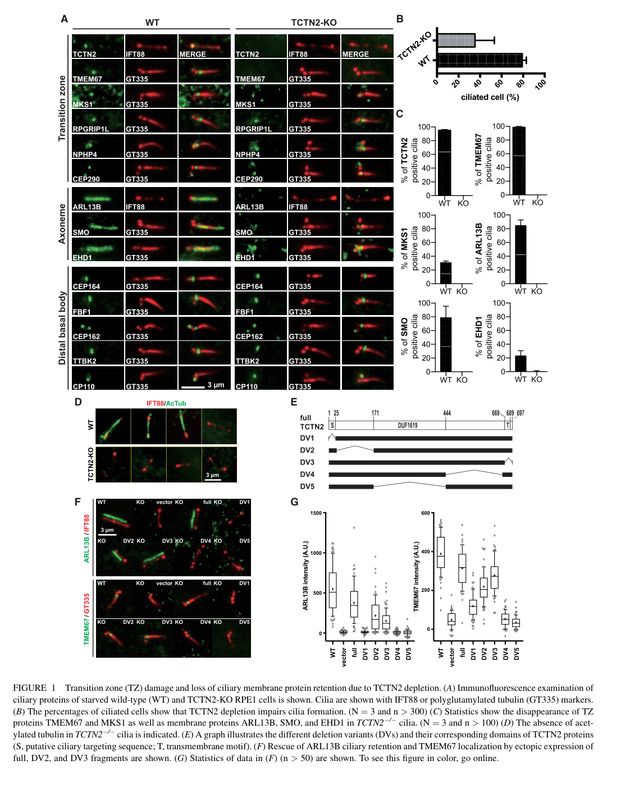

## Question

# Gene Research for Functional Annotation

## ⚠️ CRITICAL: Gene/Protein Identification Context

**BEFORE YOU BEGIN RESEARCH:** You MUST verify you are researching the CORRECT gene/protein. Gene symbols can be ambiguous, especially for less well-characterized genes from non-model organisms.

### Target Gene/Protein Identity (from UniProt):
- **UniProt Accession:** Q96GX1
- **Protein Description:** RecName: Full=Tectonic-2; Flags: Precursor;
- **Gene Information:** Name=TCTN2; Synonyms=C12orf38, TECT2;
- **Organism (full):** Homo sapiens (Human).
- **Protein Family:** Belongs to the tectonic family. .
- **Key Domains:** TCTN1-3. (IPR040354); TCTN1-3_dom. (IPR011677); TCTN1-3_N. (IPR057724); DUF1619_N (PF25752); TCTN_DUF1619 (PF07773)

### MANDATORY VERIFICATION STEPS:

1. **Check if the gene symbol "TCTN2" matches the protein description above**
2. **Verify the organism is correct:** Homo sapiens (Human).
3. **Check if protein family/domains align with what you find in literature**
4. **If you find literature for a DIFFERENT gene with the same or similar symbol, STOP**

### If Gene Symbol is Ambiguous or You Cannot Find Relevant Literature:

**DO NOT PROCEED WITH RESEARCH ON A DIFFERENT GENE.** Instead:
- State clearly: "The gene symbol 'TCTN2' is ambiguous or literature is limited for this specific protein"
- Explain what you found (e.g., "Found extensive literature on a different gene with the same symbol in a different organism")
- Describe the protein based ONLY on the UniProt information provided above
- Suggest that the protein function can be inferred from domain/family information

### Research Target:

Please provide a comprehensive research report on the gene **TCTN2** (gene ID: TCTN2, UniProt: Q96GX1) in human.

The research report should be a detailed narrative explaining the function, biological processes, and localization of the gene product. Citations should be given for all claims.

You should prioritize authoritative reviews and primary scientific literature when conducting research. You can supplement
this with annotations you find in gene/protein databases, but these can be outdated or inaccurate.

We are specifically interested in the primary function of the gene - for enzymes, what reaction is catalyzed, and what is the substrate specificity? For transporters, what is the substrate? For structural proteins or adapters, what is the broader structural role? For signaling molecules, what is the role in the pathway.

We are interested in where in or outside the cell the gene product carries out its function.

We are also interested in the signaling or biochemical pathways in which the gene functions. We are less interested in broad pleiotropic effects, except where these elucidate the precise role.

Include evidence where possible. We are interested in both experimental evidence as well as inference from structure, evolution, or bioinformatic analysis. Precise studies should be prioritized over high-throughput, where available.

## Output

Question: You are an expert researcher providing comprehensive, well-cited information.

Provide detailed information focusing on:
1. Key concepts and definitions with current understanding
2. Recent developments and latest research (prioritize 2023-2024 sources)
3. Current applications and real-world implementations
4. Expert opinions and analysis from authoritative sources
5. Relevant statistics and data from recent studies

Format as a comprehensive research report with proper citations. Include URLs and publication dates where available.
Always prioritize recent, authoritative sources and provide specific citations for all major claims.

# Gene Research for Functional Annotation

## ⚠️ CRITICAL: Gene/Protein Identification Context

**BEFORE YOU BEGIN RESEARCH:** You MUST verify you are researching the CORRECT gene/protein. Gene symbols can be ambiguous, especially for less well-characterized genes from non-model organisms.

### Target Gene/Protein Identity (from UniProt):
- **UniProt Accession:** Q96GX1
- **Protein Description:** RecName: Full=Tectonic-2; Flags: Precursor;
- **Gene Information:** Name=TCTN2; Synonyms=C12orf38, TECT2;
- **Organism (full):** Homo sapiens (Human).
- **Protein Family:** Belongs to the tectonic family. .
- **Key Domains:** TCTN1-3. (IPR040354); TCTN1-3_dom. (IPR011677); TCTN1-3_N. (IPR057724); DUF1619_N (PF25752); TCTN_DUF1619 (PF07773)

### MANDATORY VERIFICATION STEPS:

1. **Check if the gene symbol "TCTN2" matches the protein description above**
2. **Verify the organism is correct:** Homo sapiens (Human).
3. **Check if protein family/domains align with what you find in literature**
4. **If you find literature for a DIFFERENT gene with the same or similar symbol, STOP**

### If Gene Symbol is Ambiguous or You Cannot Find Relevant Literature:

**DO NOT PROCEED WITH RESEARCH ON A DIFFERENT GENE.** Instead:
- State clearly: "The gene symbol 'TCTN2' is ambiguous or literature is limited for this specific protein"
- Explain what you found (e.g., "Found extensive literature on a different gene with the same symbol in a different organism")
- Describe the protein based ONLY on the UniProt information provided above
- Suggest that the protein function can be inferred from domain/family information

### Research Target:

Please provide a comprehensive research report on the gene **TCTN2** (gene ID: TCTN2, UniProt: Q96GX1) in human.

The research report should be a detailed narrative explaining the function, biological processes, and localization of the gene product. Citations should be given for all claims.

You should prioritize authoritative reviews and primary scientific literature when conducting research. You can supplement
this with annotations you find in gene/protein databases, but these can be outdated or inaccurate.

We are specifically interested in the primary function of the gene - for enzymes, what reaction is catalyzed, and what is the substrate specificity? For transporters, what is the substrate? For structural proteins or adapters, what is the broader structural role? For signaling molecules, what is the role in the pathway.

We are interested in where in or outside the cell the gene product carries out its function.

We are also interested in the signaling or biochemical pathways in which the gene functions. We are less interested in broad pleiotropic effects, except where these elucidate the precise role.

Include evidence where possible. We are interested in both experimental evidence as well as inference from structure, evolution, or bioinformatic analysis. Precise studies should be prioritized over high-throughput, where available.

# Human TCTN2 (tectonic-2): functional annotation research report

**Identity verified.** The target is human **TCTN2**, also called **TECT2** or **C12orf38**, encoding tectonic-2 (UniProt **Q96GX1**), not its paralogs TCTN1 or TCTN3. Its assignment to the tectonic family agrees with the supplied TCTN1–3 and DUF1619 domain annotations. A review describes an N-terminal signal peptide and C-terminal membrane-spanning region; the protein is associated principally with the **transition zone at the base of primary cilia**. The domain labels establish family membership, not an enzymatic activity. (gong2018tectonicproteinsare pages 3-4, gong2018tectonicproteinsare pages 2-3)

## Primary function and location

The best-supported function of TCTN2 is as a **membrane-associated organizing component of the ciliary transition-zone gate**. This zone lies between the basal body and ciliary axoneme, where protein assemblies link the axoneme to the surrounding membrane and help establish the cilium’s distinctive membrane composition. TCTN2 belongs to a tectonic-containing Meckel-syndrome (MKS) module that associates with other transition-zone proteins, including TCTN1, MKS1, TMEM67, B9D1 and CC2D2A. It helps organize the localization of these assemblies and the enrichment or exclusion of selected membrane proteins. Its signal peptide and membrane anchor are consistent with action at the transition-zone membrane, rather than as a freely soluble cytosolic factor. (gong2018tectonicproteinsare pages 3-4, truong2023thetectoniccomplex pages 1-2, shi2017superresolutionmicroscopyreveals pages 14-17, weng2018superresolutionimagingreveals pages 3-5)

**This is a structural and trafficking-regulatory role, not a demonstrated enzyme or transporter activity.** ARL13B, adenylyl cyclase 3 (AC3), polycystin-2 (PKD2) and Smoothened (SMO) are *proteins whose ciliary localization depends on transition-zone integrity*; none has been established as a substrate directly transported or chemically modified by TCTN2. A 2024 authoritative review emphasizes that even the physical basis of transition-zone membrane gating remains incompletely resolved: candidate mechanisms include protein barriers and specialized membrane properties. (gong2018tectonicproteinsare pages 4-4, weng2018superresolutionimagingreveals pages 5-6, moran2024transportandbarrier pages 5-6)

## Experimental basis for the annotation

In **human retinal pigment epithelial RPE1 cells**, CRISPR/Cas9 disruption of *TCTN2* displaced the transition-zone proteins **TMEM67 and MKS1**, whereas some other components, including RPGRIP1L, NPHP4 and CEP290, remained at the ciliary base. Ciliary **ARL13B** was lost and agonist-induced **SMO** was strongly impaired; cilia were less frequent, shorter and often curved. Reintroduction of full-length TCTN2 restored ARL13B and TMEM67 localization. Deletion constructs lacking the signal peptide, C-terminal region or DUF1619 failed to rescue in that assay, supporting the importance of protein architecture, although a failed deletion rescue does not by itself identify a direct binding site. Figure panels comparing wild-type and edited cells document the transition-zone and ciliary phenotypes. (weng2018superresolutionimagingreveals media 4ab946a1, weng2018superresolutionimagingreveals pages 3-5, weng2018superresolutionimagingreveals pages 5-6)

The same human-cell study found an abnormal proximal extension of the intraflagellar-transport protein **IFT88** into the basal-body lumen. Super-resolution measurements put its extension at approximately **500 nm** and its width at approximately **127 nm**, narrower than the approximately **197-nm** ciliary IFT88 distribution. This supports a defect in spatial organization of ciliary transport machinery, but does not establish whether IFT88 enters the lumen through leakage or another misregulation mechanism. (weng2018superresolutionimagingreveals pages 1-2, weng2018superresolutionimagingreveals pages 7-9, weng2018superresolutionimagingreveals pages 6-7)

Human **Joubert-syndrome patient cells carrying TCTN2 mutations** also showed displacement of components of both MKS and nephronophthisis (NPHP) transition-zone assemblies, strengthening the architectural interpretation beyond engineered cells. A distinct result from **RPGRIP1L-mutant**, not TCTN2-mutant, patient fibroblasts was a **56 ± 5%** reduction in transition-zone TCTN2; that figure must not be attributed to direct TCTN2 loss. Together these observations indicate that transition-zone modules are interdependent rather than that TCTN2 alone constitutes the gate. (shi2017superresolutionmicroscopyreveals pages 14-17, shi2017superresolutionmicroscopyreveals pages 12-14)

The principal studies and the identity of the gene directly manipulated are separated below; this distinction is important when interpreting recent complex-level experiments. (weng2018superresolutionimagingreveals pages 3-5, sang2011mappingthenphpjbtsmks pages 10-11, truong2023thetectoniccomplex pages 4-6)

| Study/model | Directly altered gene | Mechanistic observation | Interpretation / limitation |
|---|---|---|---|
| Sang et al., *Cell* (2011): human Joubert syndrome families and knockout mice | Human **TCTN2** biallelic variants; mouse **Tctn2** loss | Three Joubert-syndrome families carried splice, nonsense, or frameshift alleles. Mutant mice/MEFs had defective ciliogenesis and neural-tube patterning; SAG induced **Ptc1/Gli1** approximately 20-fold in wild-type MEFs but negligibly in mutants, with accumulation of unprocessed Gli3-190. (sang2011mappingthenphpjbtsmks pages 10-11, sang2011mappingthenphpjbtsmks pages 11-13) | Strong human-genetic and in-vivo evidence that TCTN2 is required for cilium-dependent Hedgehog signaling; it does not establish an enzymatic reaction or direct TCTN2–cargo binding mechanism. |
| Weng et al., *Biophysical Journal* (2018): CRISPR-edited human RPE1 cells | Human **TCTN2** | Loss caused partial transition-zone disruption, disappearance of TMEM67/MKS1, failure to retain ARL13B and agonist-induced SMO, shortened/curved cilia, and IFT88 extension into the basal-body lumen. Full-length TCTN2 rescued ARL13B/TMEM67 localization; constructs lacking the signal peptide, C terminus, or DUF1619 did not, whereas two other deletions gave partial recovery. (weng2018superresolutionimagingreveals pages 3-5, weng2018superresolutionimagingreveals pages 5-6, weng2018superresolutionimagingreveals pages 7-9) | Most direct cellular evidence for a structural/gating role and for the importance of TCTN2 topology/domains. The engineered allele may produce a truncated protein, and several reported changes are localization—not direct transport or binding—measurements. |
| Shi et al., *Nature Cell Biology* study/preprint (2017): Joubert patient fibroblasts | Human **TCTN2** disease alleles in the TCTN2-patient experiment | TCTN2 mutations displaced components of both MKS and NPHP transition-zone modules, supporting an interdependent architectural role in organizing the ciliary gate. (shi2017superresolutionmicroscopyreveals pages 1-4, shi2017superresolutionmicroscopyreveals pages 14-17) | Direct patient-cell evidence. The separate **56 ± 5%** reduction of transition-zone TCTN2 occurred in **RPGRIP1L-mutant**, not TCTN2-mutant, fibroblasts and therefore is only indirect evidence about TCTN2 assembly. (shi2017superresolutionmicroscopyreveals pages 12-14) |
| Truong et al., *Nature Communications* (2023): photoreceptor-specific mouse knockout | Mouse **Tctn1**, not **Tctn2** | Tctn1 deletion reduced Tctn2/tectonic-complex abundance while leaving major connecting-cilium transition-zone structures largely intact; nonresident inner-segment membrane proteins accumulated in outer segments and rhodopsin crossed the transition zone more readily. (truong2023thetectoniccomplex pages 4-6, truong2023thetectoniccomplex pages 6-7) | Recent functional support for the **tectonic complex** as a membrane diffusion barrier, but attribution to TCTN2 is indirect because Tctn1 was the experimentally deleted paralog. |
| Moran et al., *Nature Reviews Nephrology* (2024): authoritative synthesis | None; review of MKS/NPHP-module studies | Transition-zone disruption can both deplete legitimate ciliary membrane proteins and permit inappropriate entry, consistent with diffusion-barrier, picket-fence, lipid-domain, or molecular-sieve models. (moran2024transportandbarrier pages 5-6) | Expert consensus supports gating/compartmentalization as the primary framework, while emphasizing that the physical mechanism remains unresolved. No catalytic activity or biochemical substrate has been demonstrated for TCTN2. |
| Yang et al., *Molecular Genetics & Genomic Medicine* (2025): affected human fetus | Human **TCTN2** compound-heterozygous loss-of-function variants | A fetus with meningoencephalocele and enlarged multicystic kidneys carried **c.1047delA (p.Val351fs*1)** and **c.1336C>T (p.Arg446*)**, validated by segregation/Sanger sequencing. (yang2025novelcompoundheterozygous pages 2-2, yang2025novelcompoundheterozygous pages 2-3) | Extends clinical evidence for TCTN2-related Meckel–Gruber syndrome, but the variants were not functionally tested in cells; the proposed ciliary-gating/Hedgehog mechanism is inferred from earlier work. |

*Table: Evidence is separated by model and by the gene directly perturbed, preventing TCTN1-complex findings or RPGRIP1L-mutant measurements from being misattributed to human TCTN2.*

## Signaling and biological processes

TCTN2 supports **cilia-dependent Hedgehog signaling primarily by maintaining a functional cilium and the localization of signaling components**, particularly SMO, at the ciliary membrane. In mouse *Tctn2*-null embryonic fibroblasts, stimulation with a SMO agonist produced negligible induction of the Hedgehog-response genes *Ptc1/Ptch1* and *Gli1*, whereas wild-type cells showed approximately **20-fold induction**. Mutant embryos accumulated full-length, unprocessed **Gli3-190** and exhibited altered neural-tube patterning. These findings place TCTN2 function upstream of normal GLI-dependent transcription, but do **not** demonstrate that TCTN2 binds Hedgehog ligand, is itself a receptor, or catalyzes GLI processing. (sang2011mappingthenphpjbtsmks pages 10-11, sang2011mappingthenphpjbtsmks pages 11-13, weng2018superresolutionimagingreveals pages 5-6)

TCTN2 also contributes to **ciliogenesis in a cell-type-dependent manner**. Mouse loss-of-function studies found absent or reduced cilia in several embryonic tissues, including the node, neural tube and limb-bud mesenchyme. Conversely, examination of a human TCTN2-associated Meckel-syndrome fetal kidney reported apparently preserved primary-cilium protrusion in affected renal epithelial cells. Thus, a requirement for ciliogenesis cannot be generalized to every tissue; abnormal **ciliary composition can coexist with cilium formation**. (gong2018tectonicproteinsare pages 4-4, zhang2020twonoveltctn2 pages 1-3)

## Recent developments and interpretation

A **September 2023** photoreceptor study offered unusually direct evidence for what the **tectonic complex** does to a specialized ciliary membrane: normally excluded inner-segment proteins accumulated in rod outer segments, and fluorescent rhodopsin traversed the connecting-cilium transition zone more readily, despite largely preserved gross transition-zone architecture. Approximately **one third of rods were lost by three months**, with near-complete rod degeneration by six months. Crucially, the manipulated mouse gene was **Tctn1**, with accompanying reduction of Tctn2/complex components; these are **complex-level evidence relevant to TCTN2, not a TCTN2-specific knockout result**. Truong *et al.*, *Nature Communications* (2023), https://doi.org/10.1038/s41467-023-41450-z. (truong2023thetectoniccomplex pages 1-2, truong2023thetectoniccomplex pages 3-4, truong2023thetectoniccomplex pages 4-6, truong2023thetectoniccomplex pages 6-7)

Moran *et al.* synthesized membrane-transport and barrier evidence in *Nature Reviews Nephrology*, volume 20 (2024; DOI first issued in **October 2023**). Their interpretation accommodates both loss of legitimate ciliary residents and inappropriate entry of other proteins after MKS/NPHP-module disruption; it does not establish a unique molecular mechanism for TCTN2. https://doi.org/10.1038/s41581-023-00773-2. (moran2024transportandbarrier pages 5-6)

## Human relevance and current applications

Biallelic human *TCTN2* variants are established causes of the **Joubert–Meckel ciliopathy spectrum**. In the original **May 2011** *Cell* study, three Joubert-syndrome families carried TCTN2 splice, nonsense or frameshift alleles; associated mouse experiments connected the gene to defective ciliogenesis and Hedgehog responses. This evidence underpins the use of **TCTN2 in molecular diagnosis and variant interpretation**, alongside clinical phenotyping, segregation analysis and, where feasible, splice or cellular assays. Sang *et al.*, https://doi.org/10.1016/j.cell.2011.04.019. (sang2011mappingthenphpjbtsmks pages 10-11, sang2011mappingthenphpjbtsmks pages 3-5)

A **2023** report identified the deep-intronic *TCTN2* variant **c.1033+423G>A** in a patient with Joubert syndrome; the variant was reported to activate a cryptic exon. The original article could not be inspected in full here, so its experimental validation and effect size should not be inferred from the secondary listing alone. Hiraide *et al.*, *Journal of Human Genetics* (2023), https://doi.org/10.1038/s10038-023-01143-3. (yang2025novelcompoundheterozygous pages 6-6)

In a **November 2025** case study, a fetus with meningoencephalocele and enlarged multicystic kidneys had *TCTN2* variants **c.1047delA (p.Val351fs*1)** and **c.1336C>T (p.Arg446*)**, inherited from different parents. Exome sequencing and Sanger confirmation provide clinically actionable diagnostic evidence for Meckel–Gruber syndrome 8, **not a functional test of those individual proteins**. Yang *et al.*, *Molecular Genetics & Genomic Medicine* (2025), https://doi.org/10.1002/mgg3.70160. (yang2025novelcompoundheterozygous pages 2-2, yang2025novelcompoundheterozygous pages 2-3)

**Conclusion.** Human TCTN2 is best annotated as a **tectonic-family, membrane-associated organizer of the primary-cilium transition zone**, necessary for appropriate ciliary protein compartmentalization and, consequently, tissue-dependent ciliogenesis and Hedgehog signal transduction. Human gene perturbation, patient cells, mouse genetics and recent complex-level work converge on this role. Its exact molecular contacts, the physical gate mechanism and any direct cargo specificity remain unresolved; no catalytic reaction or transported small-molecule substrate has been established. (shi2017superresolutionmicroscopyreveals pages 14-17, weng2018superresolutionimagingreveals pages 3-5, sang2011mappingthenphpjbtsmks pages 10-11, moran2024transportandbarrier pages 5-6)

References

1. (gong2018tectonicproteinsare pages 3-4): Siyi Gong, Feng Ji, Bin Wang, Yingying Zhang, Xingshun Xu, and Miao Sun. Tectonic proteins are important players in non-motile ciliopathies. Cellular Physiology and Biochemistry, 50:398-409, Oct 2018. URL: https://doi.org/10.1159/000494017, doi:10.1159/000494017. This article has 21 citations and is from a peer-reviewed journal.

2. (gong2018tectonicproteinsare pages 2-3): Siyi Gong, Feng Ji, Bin Wang, Yingying Zhang, Xingshun Xu, and Miao Sun. Tectonic proteins are important players in non-motile ciliopathies. Cellular Physiology and Biochemistry, 50:398-409, Oct 2018. URL: https://doi.org/10.1159/000494017, doi:10.1159/000494017. This article has 21 citations and is from a peer-reviewed journal.

3. (truong2023thetectoniccomplex pages 1-2): Hanh M. Truong, Kevin O. Cruz-Colón, Jorge Y. Martínez-Márquez, Jason R. Willer, Amanda M. Travis, Sondip K. Biswas, Woo-Kuen Lo, Hanno J. Bolz, and Jillian N. Pearring. The tectonic complex regulates membrane protein composition in the photoreceptor cilium. Nature Communications, Sep 2023. URL: https://doi.org/10.1038/s41467-023-41450-z, doi:10.1038/s41467-023-41450-z. This article has 14 citations and is from a highest quality peer-reviewed journal.

4. (shi2017superresolutionmicroscopyreveals pages 14-17): Xiaoyu Shi, Galo Garcia, Julie C. Van De Weghe, Ryan McGorty, Gregory J. Pazour, Dan Doherty, Bo Huang, and Jeremy F. Reiter. Super-resolution microscopy reveals that disruption of ciliary transition zone architecture is a cause of joubert syndrome. bioRxiv, May 2017. URL: https://doi.org/10.1101/142042, doi:10.1101/142042. This article has 0 citations.

5. (weng2018superresolutionimagingreveals pages 3-5): Rueyhung Roc Weng, T. Tony Yang, Chia-En Huang, Chih-Wei Chang, Won-Jing Wang, and Jung-Chi Liao. Super-resolution imaging reveals tctn2 depletion-induced ift88 lumen leakage and ciliary weakening. Jul 2018. URL: https://doi.org/10.1016/j.bpj.2018.04.051, doi:10.1016/j.bpj.2018.04.051. This article has 20 citations and is from a domain leading peer-reviewed journal.

6. (gong2018tectonicproteinsare pages 4-4): Siyi Gong, Feng Ji, Bin Wang, Yingying Zhang, Xingshun Xu, and Miao Sun. Tectonic proteins are important players in non-motile ciliopathies. Cellular Physiology and Biochemistry, 50:398-409, Oct 2018. URL: https://doi.org/10.1159/000494017, doi:10.1159/000494017. This article has 21 citations and is from a peer-reviewed journal.

7. (weng2018superresolutionimagingreveals pages 5-6): Rueyhung Roc Weng, T. Tony Yang, Chia-En Huang, Chih-Wei Chang, Won-Jing Wang, and Jung-Chi Liao. Super-resolution imaging reveals tctn2 depletion-induced ift88 lumen leakage and ciliary weakening. Jul 2018. URL: https://doi.org/10.1016/j.bpj.2018.04.051, doi:10.1016/j.bpj.2018.04.051. This article has 20 citations and is from a domain leading peer-reviewed journal.

8. (moran2024transportandbarrier pages 5-6): Ailis L. Moran, Laura Louzao-Martinez, Dominic P. Norris, Dorien J. M. Peters, and Oliver E. Blacque. Transport and barrier mechanisms that regulate ciliary compartmentalization and ciliopathies. Nature Reviews Nephrology, 20:83-100, Oct 2024. URL: https://doi.org/10.1038/s41581-023-00773-2, doi:10.1038/s41581-023-00773-2. This article has 48 citations and is from a domain leading peer-reviewed journal.

9. (weng2018superresolutionimagingreveals media 4ab946a1): Rueyhung Roc Weng, T. Tony Yang, Chia-En Huang, Chih-Wei Chang, Won-Jing Wang, and Jung-Chi Liao. Super-resolution imaging reveals tctn2 depletion-induced ift88 lumen leakage and ciliary weakening. Jul 2018. URL: https://doi.org/10.1016/j.bpj.2018.04.051, doi:10.1016/j.bpj.2018.04.051. This article has 20 citations and is from a domain leading peer-reviewed journal.

10. (weng2018superresolutionimagingreveals pages 1-2): Rueyhung Roc Weng, T. Tony Yang, Chia-En Huang, Chih-Wei Chang, Won-Jing Wang, and Jung-Chi Liao. Super-resolution imaging reveals tctn2 depletion-induced ift88 lumen leakage and ciliary weakening. Jul 2018. URL: https://doi.org/10.1016/j.bpj.2018.04.051, doi:10.1016/j.bpj.2018.04.051. This article has 20 citations and is from a domain leading peer-reviewed journal.

11. (weng2018superresolutionimagingreveals pages 7-9): Rueyhung Roc Weng, T. Tony Yang, Chia-En Huang, Chih-Wei Chang, Won-Jing Wang, and Jung-Chi Liao. Super-resolution imaging reveals tctn2 depletion-induced ift88 lumen leakage and ciliary weakening. Jul 2018. URL: https://doi.org/10.1016/j.bpj.2018.04.051, doi:10.1016/j.bpj.2018.04.051. This article has 20 citations and is from a domain leading peer-reviewed journal.

12. (weng2018superresolutionimagingreveals pages 6-7): Rueyhung Roc Weng, T. Tony Yang, Chia-En Huang, Chih-Wei Chang, Won-Jing Wang, and Jung-Chi Liao. Super-resolution imaging reveals tctn2 depletion-induced ift88 lumen leakage and ciliary weakening. Jul 2018. URL: https://doi.org/10.1016/j.bpj.2018.04.051, doi:10.1016/j.bpj.2018.04.051. This article has 20 citations and is from a domain leading peer-reviewed journal.

13. (shi2017superresolutionmicroscopyreveals pages 12-14): Xiaoyu Shi, Galo Garcia, Julie C. Van De Weghe, Ryan McGorty, Gregory J. Pazour, Dan Doherty, Bo Huang, and Jeremy F. Reiter. Super-resolution microscopy reveals that disruption of ciliary transition zone architecture is a cause of joubert syndrome. bioRxiv, May 2017. URL: https://doi.org/10.1101/142042, doi:10.1101/142042. This article has 0 citations.

14. (sang2011mappingthenphpjbtsmks pages 10-11): Liyun Sang, Julie J. Miller, Kevin C. Corbit, Rachel H. Giles, Matthew J. Brauer, Edgar A. Otto, Lisa M. Baye, Xiaohui Wen, Suzie J. Scales, Mandy Kwong, Erik G. Huntzicker, Mindan K. Sfakianos, Wendy Sandoval, J. Fernando Bazan, Priya Kulkarni, Francesc R. Garcia-Gonzalo, Allen D. Seol, John F. O'Toole, Susanne Held, Heiko M. Reutter, William S. Lane, Muhammad Arshad Rafiq, Abdul Noor, Muhammad Ansar, Akella Radha Rama Devi, Val C. Sheffield, Diane C. Slusarski, John B. Vincent, Daniel A. Doherty, Friedhelm Hildebrandt, Jeremy F. Reiter, and Peter K. Jackson. Mapping the nphp-jbts-mks protein network reveals ciliopathy disease genes and pathways. Cell, 145:513-528, May 2011. URL: https://doi.org/10.1016/j.cell.2011.04.019, doi:10.1016/j.cell.2011.04.019. This article has 761 citations and is from a highest quality peer-reviewed journal.

15. (truong2023thetectoniccomplex pages 4-6): Hanh M. Truong, Kevin O. Cruz-Colón, Jorge Y. Martínez-Márquez, Jason R. Willer, Amanda M. Travis, Sondip K. Biswas, Woo-Kuen Lo, Hanno J. Bolz, and Jillian N. Pearring. The tectonic complex regulates membrane protein composition in the photoreceptor cilium. Nature Communications, Sep 2023. URL: https://doi.org/10.1038/s41467-023-41450-z, doi:10.1038/s41467-023-41450-z. This article has 14 citations and is from a highest quality peer-reviewed journal.

16. (sang2011mappingthenphpjbtsmks pages 11-13): Liyun Sang, Julie J. Miller, Kevin C. Corbit, Rachel H. Giles, Matthew J. Brauer, Edgar A. Otto, Lisa M. Baye, Xiaohui Wen, Suzie J. Scales, Mandy Kwong, Erik G. Huntzicker, Mindan K. Sfakianos, Wendy Sandoval, J. Fernando Bazan, Priya Kulkarni, Francesc R. Garcia-Gonzalo, Allen D. Seol, John F. O'Toole, Susanne Held, Heiko M. Reutter, William S. Lane, Muhammad Arshad Rafiq, Abdul Noor, Muhammad Ansar, Akella Radha Rama Devi, Val C. Sheffield, Diane C. Slusarski, John B. Vincent, Daniel A. Doherty, Friedhelm Hildebrandt, Jeremy F. Reiter, and Peter K. Jackson. Mapping the nphp-jbts-mks protein network reveals ciliopathy disease genes and pathways. Cell, 145:513-528, May 2011. URL: https://doi.org/10.1016/j.cell.2011.04.019, doi:10.1016/j.cell.2011.04.019. This article has 761 citations and is from a highest quality peer-reviewed journal.

17. (shi2017superresolutionmicroscopyreveals pages 1-4): Xiaoyu Shi, Galo Garcia, Julie C. Van De Weghe, Ryan McGorty, Gregory J. Pazour, Dan Doherty, Bo Huang, and Jeremy F. Reiter. Super-resolution microscopy reveals that disruption of ciliary transition zone architecture is a cause of joubert syndrome. bioRxiv, May 2017. URL: https://doi.org/10.1101/142042, doi:10.1101/142042. This article has 0 citations.

18. (truong2023thetectoniccomplex pages 6-7): Hanh M. Truong, Kevin O. Cruz-Colón, Jorge Y. Martínez-Márquez, Jason R. Willer, Amanda M. Travis, Sondip K. Biswas, Woo-Kuen Lo, Hanno J. Bolz, and Jillian N. Pearring. The tectonic complex regulates membrane protein composition in the photoreceptor cilium. Nature Communications, Sep 2023. URL: https://doi.org/10.1038/s41467-023-41450-z, doi:10.1038/s41467-023-41450-z. This article has 14 citations and is from a highest quality peer-reviewed journal.

19. (yang2025novelcompoundheterozygous pages 2-2): Qi Yang, Wei He, Qiang Zhang, Sheng Yi, Xunzhao Zhou, Shujie Zhang, Shang Yi, Qinle Zhang, and Jingsi Luo. Novel compound heterozygous variants in the <scp> <i>tctn2</i> </scp> gene causing meckel–gruber syndrome 8 in a non‐consanguineous chinese family. Molecular Genetics &amp; Genomic Medicine, Nov 2025. URL: https://doi.org/10.1002/mgg3.70160, doi:10.1002/mgg3.70160. This article has 1 citations and is from a peer-reviewed journal.

20. (yang2025novelcompoundheterozygous pages 2-3): Qi Yang, Wei He, Qiang Zhang, Sheng Yi, Xunzhao Zhou, Shujie Zhang, Shang Yi, Qinle Zhang, and Jingsi Luo. Novel compound heterozygous variants in the <scp> <i>tctn2</i> </scp> gene causing meckel–gruber syndrome 8 in a non‐consanguineous chinese family. Molecular Genetics &amp; Genomic Medicine, Nov 2025. URL: https://doi.org/10.1002/mgg3.70160, doi:10.1002/mgg3.70160. This article has 1 citations and is from a peer-reviewed journal.

21. (zhang2020twonoveltctn2 pages 1-3): Manli Zhang, Zhijie Chang, Yaping Tian, Longxia Wang, and Yanping Lu. Two novel tctn2 mutations cause meckel–gruber syndrome. Journal of Human Genetics, 65:1039-1043, Jul 2020. URL: https://doi.org/10.1038/s10038-020-0804-0, doi:10.1038/s10038-020-0804-0. This article has 13 citations and is from a peer-reviewed journal.

22. (truong2023thetectoniccomplex pages 3-4): Hanh M. Truong, Kevin O. Cruz-Colón, Jorge Y. Martínez-Márquez, Jason R. Willer, Amanda M. Travis, Sondip K. Biswas, Woo-Kuen Lo, Hanno J. Bolz, and Jillian N. Pearring. The tectonic complex regulates membrane protein composition in the photoreceptor cilium. Nature Communications, Sep 2023. URL: https://doi.org/10.1038/s41467-023-41450-z, doi:10.1038/s41467-023-41450-z. This article has 14 citations and is from a highest quality peer-reviewed journal.

23. (sang2011mappingthenphpjbtsmks pages 3-5): Liyun Sang, Julie J. Miller, Kevin C. Corbit, Rachel H. Giles, Matthew J. Brauer, Edgar A. Otto, Lisa M. Baye, Xiaohui Wen, Suzie J. Scales, Mandy Kwong, Erik G. Huntzicker, Mindan K. Sfakianos, Wendy Sandoval, J. Fernando Bazan, Priya Kulkarni, Francesc R. Garcia-Gonzalo, Allen D. Seol, John F. O'Toole, Susanne Held, Heiko M. Reutter, William S. Lane, Muhammad Arshad Rafiq, Abdul Noor, Muhammad Ansar, Akella Radha Rama Devi, Val C. Sheffield, Diane C. Slusarski, John B. Vincent, Daniel A. Doherty, Friedhelm Hildebrandt, Jeremy F. Reiter, and Peter K. Jackson. Mapping the nphp-jbts-mks protein network reveals ciliopathy disease genes and pathways. Cell, 145:513-528, May 2011. URL: https://doi.org/10.1016/j.cell.2011.04.019, doi:10.1016/j.cell.2011.04.019. This article has 761 citations and is from a highest quality peer-reviewed journal.

24. (yang2025novelcompoundheterozygous pages 6-6): Qi Yang, Wei He, Qiang Zhang, Sheng Yi, Xunzhao Zhou, Shujie Zhang, Shang Yi, Qinle Zhang, and Jingsi Luo. Novel compound heterozygous variants in the <scp> <i>tctn2</i> </scp> gene causing meckel–gruber syndrome 8 in a non‐consanguineous chinese family. Molecular Genetics &amp; Genomic Medicine, Nov 2025. URL: https://doi.org/10.1002/mgg3.70160, doi:10.1002/mgg3.70160. This article has 1 citations and is from a peer-reviewed journal.

## Artifacts

- [Edison artifact artifact-00](TCTN2-deep-research-falcon_artifacts/artifact-00.md)

## Citations

1. shi2017superresolutionmicroscopyreveals pages 12-14
2. moran2024transportandbarrier pages 5-6
3. yang2025novelcompoundheterozygous pages 6-6
4. gong2018tectonicproteinsare pages 3-4
5. gong2018tectonicproteinsare pages 2-3
6. truong2023thetectoniccomplex pages 1-2
7. shi2017superresolutionmicroscopyreveals pages 14-17
8. weng2018superresolutionimagingreveals pages 3-5
9. gong2018tectonicproteinsare pages 4-4
10. weng2018superresolutionimagingreveals pages 5-6
11. weng2018superresolutionimagingreveals pages 1-2
12. weng2018superresolutionimagingreveals pages 7-9
13. weng2018superresolutionimagingreveals pages 6-7
14. sang2011mappingthenphpjbtsmks pages 10-11
15. truong2023thetectoniccomplex pages 4-6
16. sang2011mappingthenphpjbtsmks pages 11-13
17. shi2017superresolutionmicroscopyreveals pages 1-4
18. truong2023thetectoniccomplex pages 6-7
19. yang2025novelcompoundheterozygous pages 2-2
20. yang2025novelcompoundheterozygous pages 2-3
21. truong2023thetectoniccomplex pages 3-4
22. sang2011mappingthenphpjbtsmks pages 3-5
23. https://doi.org/10.1038/s41467-023-41450-z.
24. https://doi.org/10.1038/s41581-023-00773-2.
25. https://doi.org/10.1016/j.cell.2011.04.019.
26. https://doi.org/10.1038/s10038-023-01143-3.
27. https://doi.org/10.1002/mgg3.70160.
28. https://doi.org/10.1159/000494017,
29. https://doi.org/10.1038/s41467-023-41450-z,
30. https://doi.org/10.1101/142042,
31. https://doi.org/10.1016/j.bpj.2018.04.051,
32. https://doi.org/10.1038/s41581-023-00773-2,
33. https://doi.org/10.1016/j.cell.2011.04.019,
34. https://doi.org/10.1002/mgg3.70160,
35. https://doi.org/10.1038/s10038-020-0804-0,