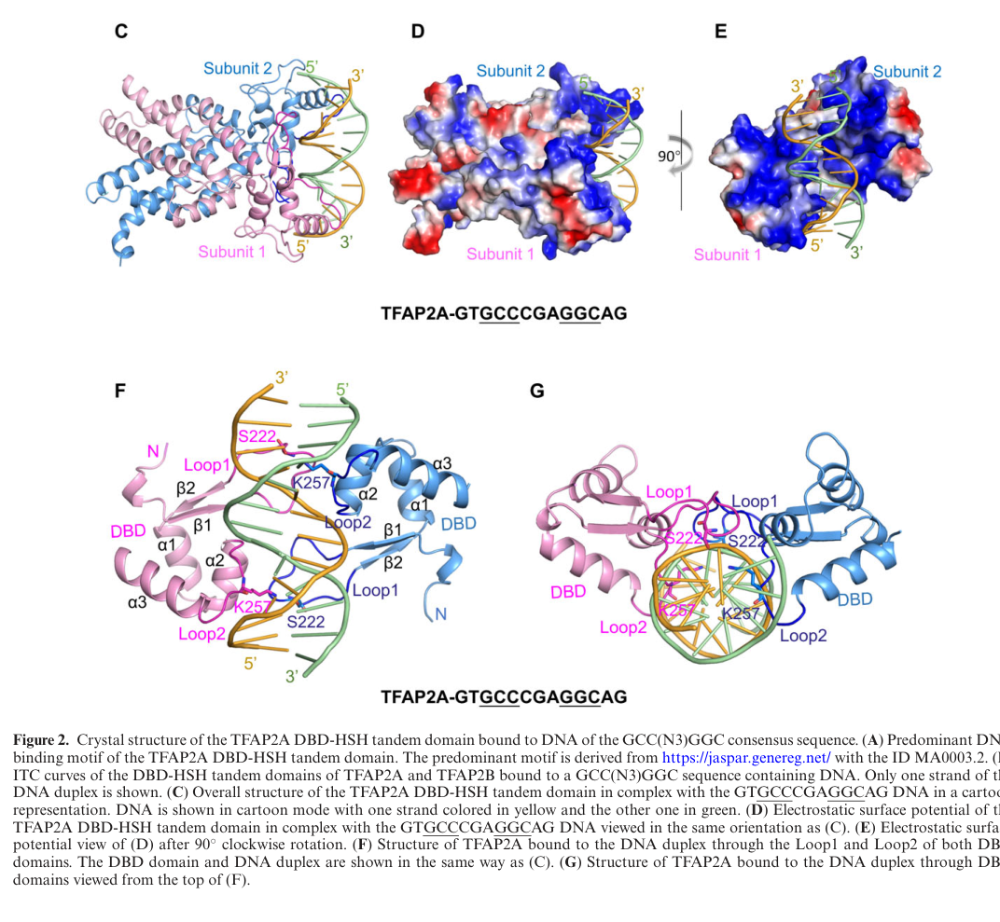

## Question

# Gene Research for Functional Annotation

## ⚠️ CRITICAL: Gene/Protein Identification Context

**BEFORE YOU BEGIN RESEARCH:** You MUST verify you are researching the CORRECT gene/protein. Gene symbols can be ambiguous, especially for less well-characterized genes from non-model organisms.

### Target Gene/Protein Identity (from UniProt):
- **UniProt Accession:** P05549
- **Protein Description:** RecName: Full=Transcription factor AP-2-alpha; Short=AP2-alpha; AltName: Full=AP-2 transcription factor; AltName: Full=Activating enhancer-binding protein 2-alpha; AltName: Full=Activator protein 2; Short=AP-2;
- **Gene Information:** Name=TFAP2A; Synonyms=AP2TF, TFAP2;
- **Organism (full):** Homo sapiens (Human).
- **Protein Family:** Belongs to the AP-2 family. .
- **Key Domains:** TF_AP2. (IPR004979); TF_AP2_alpha_N. (IPR008121); TF_AP2_C. (IPR013854); TF_AP-2 (PF03299)

### MANDATORY VERIFICATION STEPS:

1. **Check if the gene symbol "TFAP2A" matches the protein description above**
2. **Verify the organism is correct:** Homo sapiens (Human).
3. **Check if protein family/domains align with what you find in literature**
4. **If you find literature for a DIFFERENT gene with the same or similar symbol, STOP**

### If Gene Symbol is Ambiguous or You Cannot Find Relevant Literature:

**DO NOT PROCEED WITH RESEARCH ON A DIFFERENT GENE.** Instead:
- State clearly: "The gene symbol 'TFAP2A' is ambiguous or literature is limited for this specific protein"
- Explain what you found (e.g., "Found extensive literature on a different gene with the same symbol in a different organism")
- Describe the protein based ONLY on the UniProt information provided above
- Suggest that the protein function can be inferred from domain/family information

### Research Target:

Please provide a comprehensive research report on the gene **TFAP2A** (gene ID: TFAP2A, UniProt: P05549) in human.

The research report should be a detailed narrative explaining the function, biological processes, and localization of the gene product. Citations should be given for all claims.

You should prioritize authoritative reviews and primary scientific literature when conducting research. You can supplement
this with annotations you find in gene/protein databases, but these can be outdated or inaccurate.

We are specifically interested in the primary function of the gene - for enzymes, what reaction is catalyzed, and what is the substrate specificity? For transporters, what is the substrate? For structural proteins or adapters, what is the broader structural role? For signaling molecules, what is the role in the pathway.

We are interested in where in or outside the cell the gene product carries out its function.

We are also interested in the signaling or biochemical pathways in which the gene functions. We are less interested in broad pleiotropic effects, except where these elucidate the precise role.

Include evidence where possible. We are interested in both experimental evidence as well as inference from structure, evolution, or bioinformatic analysis. Precise studies should be prioritized over high-throughput, where available.

## Output

Question: You are an expert researcher providing comprehensive, well-cited information.

Provide detailed information focusing on:
1. Key concepts and definitions with current understanding
2. Recent developments and latest research (prioritize 2023-2024 sources)
3. Current applications and real-world implementations
4. Expert opinions and analysis from authoritative sources
5. Relevant statistics and data from recent studies

Format as a comprehensive research report with proper citations. Include URLs and publication dates where available.
Always prioritize recent, authoritative sources and provide specific citations for all major claims.

# Gene Research for Functional Annotation

## ⚠️ CRITICAL: Gene/Protein Identification Context

**BEFORE YOU BEGIN RESEARCH:** You MUST verify you are researching the CORRECT gene/protein. Gene symbols can be ambiguous, especially for less well-characterized genes from non-model organisms.

### Target Gene/Protein Identity (from UniProt):
- **UniProt Accession:** P05549
- **Protein Description:** RecName: Full=Transcription factor AP-2-alpha; Short=AP2-alpha; AltName: Full=AP-2 transcription factor; AltName: Full=Activating enhancer-binding protein 2-alpha; AltName: Full=Activator protein 2; Short=AP-2;
- **Gene Information:** Name=TFAP2A; Synonyms=AP2TF, TFAP2;
- **Organism (full):** Homo sapiens (Human).
- **Protein Family:** Belongs to the AP-2 family. .
- **Key Domains:** TF_AP2. (IPR004979); TF_AP2_alpha_N. (IPR008121); TF_AP2_C. (IPR013854); TF_AP-2 (PF03299)

### MANDATORY VERIFICATION STEPS:

1. **Check if the gene symbol "TFAP2A" matches the protein description above**
2. **Verify the organism is correct:** Homo sapiens (Human).
3. **Check if protein family/domains align with what you find in literature**
4. **If you find literature for a DIFFERENT gene with the same or similar symbol, STOP**

### If Gene Symbol is Ambiguous or You Cannot Find Relevant Literature:

**DO NOT PROCEED WITH RESEARCH ON A DIFFERENT GENE.** Instead:
- State clearly: "The gene symbol 'TFAP2A' is ambiguous or literature is limited for this specific protein"
- Explain what you found (e.g., "Found extensive literature on a different gene with the same symbol in a different organism")
- Describe the protein based ONLY on the UniProt information provided above
- Suggest that the protein function can be inferred from domain/family information

### Research Target:

Please provide a comprehensive research report on the gene **TFAP2A** (gene ID: TFAP2A, UniProt: P05549) in human.

The research report should be a detailed narrative explaining the function, biological processes, and localization of the gene product. Citations should be given for all claims.

You should prioritize authoritative reviews and primary scientific literature when conducting research. You can supplement
this with annotations you find in gene/protein databases, but these can be outdated or inaccurate.

We are specifically interested in the primary function of the gene - for enzymes, what reaction is catalyzed, and what is the substrate specificity? For transporters, what is the substrate? For structural proteins or adapters, what is the broader structural role? For signaling molecules, what is the role in the pathway.

We are interested in where in or outside the cell the gene product carries out its function.

We are also interested in the signaling or biochemical pathways in which the gene functions. We are less interested in broad pleiotropic effects, except where these elucidate the precise role.

Include evidence where possible. We are interested in both experimental evidence as well as inference from structure, evolution, or bioinformatic analysis. Precise studies should be prioritized over high-throughput, where available.

# Human TFAP2A (AP-2α; UniProt P05549): functional annotation research report

## Identity and principal function

**Identity verified.** Human **TFAP2A** encodes transcription factor **AP-2α**, corresponding to **UniProt P05549**, not the related AP-2β/TFAP2B or AP-2γ/TFAP2C proteins. Its reported architecture—an amino-terminal transcriptional activation region and a carboxy-terminal basic DNA-binding region with a helix–span–helix (HSH) dimerization region—agrees with the supplied AP-2-family and TF_AP2 domain annotations. Human genetic studies independently identify TFAP2A as the gene encoding AP-2α. (kołat2019thebiologicalcharacteristics pages 5-10, liu2023structuralbasisfor pages 1-2, milunsky2008tfap2amutationsresult pages 2-4)

**Primary molecular activity:** AP-2α is a **sequence-specific transcriptional regulator**. It binds regulatory DNA as a homodimer or, in appropriate cellular settings, a heterodimer with another TFAP2 protein, and changes target-gene transcription. It is **not an enzyme or transporter**: the relevant molecular specificity is for DNA sequence and regulatory context, not a catalytic or transported substrate. The protein can activate or repress transcription depending on the locus and its partners. (liu2023structuralbasisfor pages 1-2, kołat2019thebiologicalcharacteristics pages 5-10, li2013analysisoftfap2a pages 7-8)

## Molecular mechanism and location of action

The strongest direct structural evidence comes from Liu and colleagues’ **2023** crystallographic and isothermal-titration-calorimetry study. TFAP2A preferentially recognizes the approximately palindromic **5′-GCCNNNGGC-3′** motif; the **three-base-pair spacing** between GCC and GGC is important, whereas the identities of the three intervening bases are comparatively flexible in the tested sequences. Its isolated DNA-binding–HSH region bound a representative motif-containing duplex with a dissociation constant of **19 ± 1 nM**. A TFAP2A dimer presents two DNA-binding regions to neighboring major grooves; structured loops make sequence-specific contacts, while the paired HSH regions stabilize the dimer rather than directly contacting DNA. These measurements characterize a purified protein fragment and defined oligonucleotides, not a universal affinity at every genomic site. (liu2023structuralbasisfor pages 3-4, liu2023structuralbasisfor pages 5-6, liu2023structuralbasisfor pages 8-9, liu2023structuralbasisfor media 6776c055)

**The functional destination is the cell nucleus, particularly promoter and enhancer chromatin.** Wild-type AP-2α was predominantly nuclear in cellular localization experiments. Several branchio-oculo-facial-syndrome (BOFS) variants showed less nuclear accumulation, could still dimerize with wild-type AP-2α, and could draw coexpressed wild-type protein toward the cytoplasm. Thus, cytoplasmic detection of an altered protein does not redefine the site of normal transcription-factor action; it can instead indicate loss of access to nuclear DNA. Nuclear transport mechanisms were not completely resolved by those experiments. (li2013analysisoftfap2a pages 7-8, li2013analysisoftfap2a pages 6-7)

The 2023 study also linked binding to transcriptional output. In **HEK293T** reporter experiments using an **IGFBP5 promoter** construct, BOFS-associated TFAP2A variants produced roughly **two- to fivefold lower** activation than wild-type protein despite comparable measured expression. Substituting a four-base spacer for the preferred three-base spacer decreased reporter activation approximately **twofold**; a two-base spacer decreased it approximately **fivefold**. For the tested duplex, **G262E** reduced measured binding affinity from **19 ± 1 nM** to **129 ± 22 nM**, whereas **R217S** had no detectable binding under the assay conditions. This is unusually direct evidence connecting disease-linked protein changes, sequence recognition, and transcriptional activity, while remaining an engineered reporter system rather than an assay of an endogenous developmental gene. (liu2023structuralbasisfor pages 8-9, liu2023structuralbasisfor pages 9-10)

**Structural illustration:** the cropped TFAP2A–DNA complex in Liu *et al.* shows the homodimer’s DNA-binding loops engaging adjacent major grooves of motif-containing DNA. (liu2023structuralbasisfor media 6776c055)

## Biological processes and pathways: evidence by model

**Neural-crest regulatory programs.** The most mechanistically informative stage-specific study examined **chick embryos**, not human embryos. TFAP2A-associated genomic occupancy, ATAC-seq, enhancer activity and perturbation support an early partnership with **TFAP2C** during neural-plate-border induction and a later partnership with **TFAP2B** during neural-crest specification. TFAP2C perturbation affected border-associated **MSX1, PAX7, ZIC1 and GBX2**; TFAP2B perturbation affected specification-associated **FOXD3, ETS1, SOX9 and SOX10** and reduced TFAP2A occupancy at selected specification elements, including sites near **SOX10**. This underpins the description of TFAP2A as a context-dependent, pioneer-like chromatin regulator, but the partner-switch mechanism is **avian evidence**, and its precise operation in human embryos remains to be demonstrated. (rothstein2020heterodimerizationoftfap2 pages 10-11, rothstein2020heterodimerizationoftfap2 pages 5-7, rothstein2020heterodimerizationoftfap2 pages 9-10, rothstein2020heterodimerizationoftfap2 pages 3-5)

A **2024 mouse** study strengthened the link between TFAP2-dependent transcription and craniofacial patterning. Combined neural-crest deletion of **Tfap2a and Tfap2b** reduced **Alx1, Alx3 and Alx4** expression and produced midfacial abnormalities. Facial-tissue ChIP-seq identified **13,778 TFAP2-enriched regions**, including active regulatory regions at the *Alx* loci; zebrafish *tfap2a* mutants additionally showed altered *alx3* expression. Occupancy plus genetic perturbation supports a TFAP2–ALX pathway, **not** the claim that every ChIP peak or the full mouse double-knockout phenotype is due to human TFAP2A acting alone. (nguyen2024tfap2paralogsregulate pages 7-9, nguyen2024tfap2paralogsregulate pages 9-11, nguyen2024tfap2paralogsregulate pages 1-3)

**Surface ectoderm and positioning of tooth initiation.** In a **2024 human pluripotent-stem-cell differentiation** study, high-density cultures became largely **TFAP2A-protein-positive within three days**, expressed surface-ectoderm markers **GRHL3** and **MSX1**, and lacked the amniotic marker **ISL1**. The resulting cells could subsequently acquire keratinocyte-associated markers. These observations establish a useful association with human surface-ectoderm identity and an experimental cell model; they **do not by themselves prove that TFAP2A is required** for that fate. (nakanoh2024humansurfaceectoderm pages 8-9)

More causal, but predominantly **mouse**, evidence comes from a second 2024 study: epithelial **Tfap2a/Tfap2b double** deletion expanded the normally restricted **PITX2/SOX2** dental-lamina program into ventral mandibular surface epithelium and produced an **ectopic incisor**; the corresponding expansion was **not observed with either single knockout**. In cultured **human oral epithelial cells**, PITX2 reduced TFAP2A expression, while expressed TFAP2A or TFAP2B suppressed activation of a PITX2-promoter reporter. This supports reciprocal transcriptional antagonism that helps define epithelial identity and the tooth-initiation boundary, although the human reporter assay does not independently prove physical occupancy of the endogenous PITX2 promoter. Altered FGF, SHH and WNT readouts in mutant mouse tissue are consequences of this tissue-patterning network, not evidence that AP-2α itself is a ligand or receptor in those pathways. (shao2024transcriptionalprogramsof pages 1-2, shao2024transcriptionalprogramsof pages 11-12)

**Human germline specification: a TFAP2A-specific perturbation.** Castillo-Venzor and colleagues used **human stem-cell-derived embryoid bodies** and found that TFAP2A knockout reduced the primordial-germ-cell-like-cell fraction from **9.28% to 2.78%**. By **96 hours**, the germ-cell-like population was nearly absent, while the amnion-like population showed **no statistically significant reduction**; knockout cultures instead retained a **SOX2-positive** pluripotent/neural-like population. TFAP2A is expressed early in the germline trajectory, before **SOX17** and **TFAP2C**, and subsequently declines as TFAP2C becomes prominent. This provides direct human-cell evidence for a **transient role in initiating germline fate**, rather than establishing a general requirement for TFAP2A in every TFAP2A-expressing lineage. Direct DNA binding to SOX2 or SOX17 regulatory elements was not established by these knockout and expression results. (castillovenzor2023originandsegregation pages 9-12, castillovenzor2023originandsegregation pages 12-13)

The following evidence matrix separates human-specific molecular and genetic results from joint-paralog and nonhuman experiments:

| Mechanism or biological context | Assay/model | Specific result | Strength and caveat | DOI/date |
|---|---|---|---|---|
| Sequence-specific DNA binding and dimerization | Human TFAP2A DBD–HSH crystallography, ITC and HEK293T reporter assays | TFAP2A homodimer bound **GCC(N3)GGC** DNA with **Kd = 19 ± 1 nM**. DBD loops contact adjacent major grooves; the HSH domain mediates dimerization without directly contacting DNA. BOFS-associated variants reduced binding and reporter activation. (liu2023structuralbasisfor pages 8-9, liu2023structuralbasisfor pages 5-6, liu2023structuralbasisfor pages 9-10, liu2023structuralbasisfor media 6776c055) | Direct, quantitative biochemical and structural evidence for human TFAP2A. Uses a truncated DBD–HSH construct and an artificial promoter assay rather than an endogenous developmental locus. | [10.1093/nar/gkad583](https://doi.org/10.1093/nar/gkad583); **6 July 2023** |
| Human primordial-germ-cell initiation | TFAP2A-knockout human PSC-derived embryoid bodies; FACS, immunofluorescence and scRNA-seq | TFAP2A loss reduced PGCLCs from **9.28% to 2.78%** and nearly eliminated the lineage by 96 h, while amnion-like-cell abundance was not significantly altered. Knockout cells retained a SOX2-positive pluripotent/neural-like state. (castillovenzor2023originandsegregation pages 9-12, castillovenzor2023originandsegregation pages 12-13) | Strong TFAP2A-specific human genetic perturbation. This is an in-vitro embryo model rather than direct manipulation of a human embryo; TFAP2A acts transiently before TFAP2C in this setting. | [10.26508/lsa.202201706](https://doi.org/10.26508/lsa.202201706); **May 2023** |
| Midfacial neural-crest gene regulation | Conditional **mouse Tfap2a/Tfap2b** loss; bulk and single-cell RNA-seq, TFAP2 ChIP-seq and zebrafish tests | E11.5 facial tissue yielded **13,778 TFAP2-enriched regions**. Active peaks occurred at **Alx1, Alx3 and Alx4**, and combined loss reduced ALX expression and caused midfacial defects. Zebrafish *tfap2a* mutants showed altered *alx3* expression. (nguyen2024tfap2paralogsregulate pages 7-9, nguyen2024tfap2paralogsregulate pages 9-11, nguyen2024tfap2paralogsregulate pages 1-3) | Occupancy plus perturbation supports a TFAP2–ALX axis. Mouse results chiefly reflect cooperative TFAP2A/TFAP2B activity; the peaks do not isolate TFAP2A and this was not a human functional experiment. | [10.1242/dev.202095](https://doi.org/10.1242/dev.202095); **January 2024** |
| Mandibular epithelial identity and tooth-position restriction | Mouse epithelial **Tfap2a/Tfap2b double knockout**; LMD-RNA-seq and histology; human GMSM-K oral epithelial reporter assays | Double knockout converted ventral surface epithelium toward dental identity and produced an ectopic aboral incisor; single knockouts did not reproduce the expanded dental program. In GMSM-K cells, PITX2 lowered TFAP2A, while TFAP2A or TFAP2B dose-dependently suppressed PITX2-promoter activation. (shao2024transcriptionalprogramsof pages 1-2, shao2024transcriptionalprogramsof pages 11-12) | Functional cross-repression is supported, but the developmental phenotype requires combined Tfap2a/Tfap2b loss. The human-cell result is an artificial reporter assay, not proof of endogenous promoter occupancy. | [10.1371/journal.pgen.1011364](https://doi.org/10.1371/journal.pgen.1011364); **25 July 2024** |
| Pioneer-factor partner switching during neural-crest specification | Chick embryos; CUT&RUN, ATAC-seq, H3K27ac profiling, knockdown, rescue and enhancer assays | TFAP2A/TFAP2C operated during neural-plate-border induction, whereas TFAP2A/TFAP2B promoted later neural-crest specification. TFAP2C loss affected **MSX1, PAX7, ZIC1 and GBX2**; TFAP2B loss reduced **FOXD3, ETS1, SOX9 and SOX10** and TFAP2A occupancy near **LMO4/SOX10**. (rothstein2020heterodimerizationoftfap2 pages 10-11, rothstein2020heterodimerizationoftfap2 pages 5-7, rothstein2020heterodimerizationoftfap2 pages 9-10, rothstein2020heterodimerizationoftfap2 pages 3-5) | Strong in-vivo genomic and perturbational evidence for pioneer-like, stage-specific activity, but it is **avian**, not human; paralog-dependent effects cannot be assigned to TFAP2A alone. | [10.1101/gr.249680.119](https://doi.org/10.1101/gr.249680.119); **2020** |
| BOFS disease causality | Human family deletion mapping and sequencing of sporadic cases | A **3.2-Mb 6p24.3 deletion** containing TFAP2A segregated with BOFS in a family; four sporadic cases carried de novo DNA-binding-region substitutions **L249P, R254G, R255G or G262E**. (milunsky2008tfap2amutationsresult pages 2-4, milunsky2008tfap2amutationsresult pages 1-2) | Authoritative human genetic evidence linking TFAP2A—not TFAP2B—to branchio-oculo-facial syndrome. The original study did not establish cellular trafficking or dominant-negative mechanisms. | [10.1016/j.ajhg.2008.03.005](https://doi.org/10.1016/j.ajhg.2008.03.005); **May 2008** |
| Nuclear localization and BOFS allele mechanisms | Transfected cells expressing human wild-type or eight BOFS-mutant AP-2α proteins; immunofluorescence, fractionation, dimerization and transcription assays | Wild-type AP-2α was predominantly nuclear; every tested mutant had diminished nuclear localization. Mutants retained dimerization and could drive coexpressed wild-type protein toward the cytoplasm; DNA-binding and dominant-negative effects varied by allele. (li2013analysisoftfap2a pages 7-8, li2013analysisoftfap2a pages 6-7) | Direct localization and functional evidence. Artificial overexpression limits inference about endogenous patient cells, and the variants are hypomorphic or antimorphic rather than uniformly null. | [10.1093/hmg/ddt173](https://doi.org/10.1093/hmg/ddt173); **April 2013** |
| Candidate PD-L1 transcriptional regulation in cancer | TFAP2A overexpression in MCF-7 and Caco2 cells; PD-L1 promoter-truncation reporters in HEK293FT; four paired colon tumour and normal tissues | TFAP2A increased PD-L1 RNA, protein and promoter activity; the strongest responsive promoter segment was **−400 to +100 bp**. TFAP2A and PD-L1 were concordantly elevated in **3 of 4** tumour pairs. (niu2024potentialprognosisand pages 11-14) | Reporter and expression evidence supports transcriptional activation, but **direct endogenous binding was not established by ChIP**. The tissue cohort comprised only four pairs, so this remains a candidate biomarker rather than a validated therapy predictor. | [10.18632/aging.205225](https://doi.org/10.18632/aging.205225); **January 2024** |

*Table: Evidence supporting the molecular and developmental annotation of human TFAP2A (UniProt P05549), with quantitative results and model-specific caveats. Paralog-combined and nonhuman findings are explicitly distinguished from TFAP2A-specific human evidence.*

## Disease relevance, implementation and research limits

**Established clinical relevance is genetic diagnosis of BOFS.** Milunsky and colleagues identified an affected family with a **3.2-Mb chromosome-6p24.3 deletion** encompassing TFAP2A and **four sporadic cases with de novo TFAP2A DNA-binding-region missense variants**. BOFS includes variable branchial/skin, ocular and craniofacial abnormalities. Subsequent functional work found heterogeneous effects on DNA binding and transcription, as well as altered nuclear localization and mutation-dependent interference with wild-type protein. These results make TFAP2A variant identification relevant to evaluation of a compatible congenital phenotype; they do not imply that every rare missense variant is pathogenic without variant-specific assessment. **TFAP2B-associated Char syndrome is a different gene–disease relationship.** (milunsky2008tfap2amutationsresult pages 2-4, milunsky2008tfap2amutationsresult pages 1-2, li2013analysisoftfap2a pages 7-8, li2013analysisoftfap2a pages 7-7)

**Oncology applications remain investigational.** In a **2024** study, TFAP2A overexpression increased **PD-L1/CD274** RNA and protein in MCF-7 and Caco2 cells and stimulated a PD-L1 promoter reporter; the strongest tested responsive fragment extended from approximately **−400 to +100 bp**. TFAP2A and PD-L1 were jointly elevated in **three of four** examined colon-tumour/adjacent-tissue pairs. These findings motivate studies of immune-checkpoint regulation and potential biomarker use, but the promoter-truncation result does **not establish direct binding to the endogenous promoter**, and four tissue pairs do not validate TFAP2A as an immunotherapy predictor or therapeutic target. TFAP2A can have different transcriptional and cancer-associated effects across cell types; broad cancer correlations should not replace target-specific experiments. (niu2024potentialprognosisand pages 11-14, kołat2019thebiologicalcharacteristics pages 1-5)

**Overall annotation:** Human AP-2α is best annotated as a **predominantly nuclear, dimeric, sequence-specific promoter/enhancer-binding transcription factor** whose best-supported intrinsic activity is recognition of appropriately spaced GC-rich DNA motifs and regulation of transcription. Human perturbation establishes an early role in germ-cell-like specification and human genetics establishes BOFS causality. Precise neural-crest partner switching, ALX-mediated facial patterning and tooth-position restriction have particularly informative **chick or mouse** evidence, with paralog redundancy requiring explicit qualification when extrapolating to human TFAP2A. (liu2023structuralbasisfor pages 5-6, castillovenzor2023originandsegregation pages 9-12, milunsky2008tfap2amutationsresult pages 2-4, rothstein2020heterodimerizationoftfap2 pages 10-11, nguyen2024tfap2paralogsregulate pages 1-3, shao2024transcriptionalprogramsof pages 11-12)

### Selected primary sources and publication dates

- Liu *et al.*, **published online 6 July 2023**, *Nucleic Acids Research*, “Structural basis for specific DNA sequence motif recognition by the TFAP2 transcription factors.” https://doi.org/10.1093/nar/gkad583. (liu2023structuralbasisfor pages 1-2)
- Castillo-Venzor *et al.*, **May 2023**, *Life Science Alliance*, “Origin and segregation of the human germline.” https://doi.org/10.26508/lsa.202201706. (castillovenzor2023originandsegregation pages 1-2)
- Nguyen *et al.*, **January 2024**, *Development*, “TFAP2 paralogs regulate midfacial development in part through a conserved ALX genetic pathway.” https://doi.org/10.1242/dev.202095. (nguyen2024tfap2paralogsregulate pages 1-3)
- Nakanoh *et al.*, **1 March 2024**, *Science Advances*, “Human surface ectoderm and amniotic ectoderm are sequentially specified according to cellular density.” https://doi.org/10.1126/sciadv.adh7748. (nakanoh2024humansurfaceectoderm pages 8-9)
- Shao *et al.*, **25 July 2024**, *PLOS Genetics*, “Transcriptional programs of Pitx2 and Tfap2a/Tfap2b controlling lineage specification of mandibular epithelium during tooth initiation.” https://doi.org/10.1371/journal.pgen.1011364. (shao2024transcriptionalprogramsof pages 11-12)
- Niu *et al.*, **January 2024**, *Aging*, “Potential prognosis and immunotherapy predictor TFAP2A in pan-cancer.” https://doi.org/10.18632/aging.205225. (niu2024potentialprognosisand pages 11-14)
- Rothstein and Simoes-Costa, **2020**, *Genome Research*, “Heterodimerization of TFAP2 pioneer factors drives epigenomic remodeling during neural crest specification.” https://doi.org/10.1101/gr.249680.119. (rothstein2020heterodimerizationoftfap2 pages 10-11)
- Milunsky *et al.*, **May 2008**, *American Journal of Human Genetics*, “TFAP2A mutations result in branchio-oculo-facial syndrome.” https://doi.org/10.1016/j.ajhg.2008.03.005; Li *et al.*, **April 2013**, *Human Molecular Genetics*, “Analysis of TFAP2A mutations in Branchio-Oculo-Facial Syndrome indicates functional complexity within the AP-2α DNA-binding domain.” https://doi.org/10.1093/hmg/ddt173. (milunsky2008tfap2amutationsresult pages 1-2, li2013analysisoftfap2a pages 1-1)

References

1. (kołat2019thebiologicalcharacteristics pages 5-10): Damian Kołat, Żaneta Kałuzińska, Andrzej K. Bednarek, and Elżbieta Płuciennik. The biological characteristics of transcription factors ap-2α and ap-2γ and their importance in various types of cancers. Bioscience Reports, Mar 2019. URL: https://doi.org/10.1042/bsr20181928, doi:10.1042/bsr20181928. This article has 87 citations and is from a peer-reviewed journal.

2. (liu2023structuralbasisfor pages 1-2): Ke Liu, Yuqing Xiao, Linyao Gan, Weifang Li, Jin Zhang, and Jinrong Min. Structural basis for specific dna sequence motif recognition by the tfap2 transcription factors. Nucleic Acids Research, 51:8270-8282, Jul 2023. URL: https://doi.org/10.1093/nar/gkad583, doi:10.1093/nar/gkad583. This article has 24 citations and is from a highest quality peer-reviewed journal.

3. (milunsky2008tfap2amutationsresult pages 2-4): Jeff M. Milunsky, Tom A. Maher, Geping Zhao, Amy E. Roberts, Heather J. Stalker, Roberto T. Zori, Michelle N. Burch, Michele Clemens, John B. Mulliken, Rosemarie Smith, and Angela E. Lin. Tfap2a mutations result in branchio-oculo-facial syndrome. American journal of human genetics, 82 5:1171-7, May 2008. URL: https://doi.org/10.1016/j.ajhg.2008.03.005, doi:10.1016/j.ajhg.2008.03.005. This article has 266 citations and is from a highest quality peer-reviewed journal.

4. (li2013analysisoftfap2a pages 7-8): Hong Li, Ryan Sheridan, and Trevor Williams. Analysis of tfap2a mutations in branchio-oculo-facial syndrome indicates functional complexity within the ap-2α dna-binding domain. Human molecular genetics, 22 16:3195-206, Apr 2013. URL: https://doi.org/10.1093/hmg/ddt173, doi:10.1093/hmg/ddt173. This article has 46 citations and is from a domain leading peer-reviewed journal.

5. (liu2023structuralbasisfor pages 3-4): Ke Liu, Yuqing Xiao, Linyao Gan, Weifang Li, Jin Zhang, and Jinrong Min. Structural basis for specific dna sequence motif recognition by the tfap2 transcription factors. Nucleic Acids Research, 51:8270-8282, Jul 2023. URL: https://doi.org/10.1093/nar/gkad583, doi:10.1093/nar/gkad583. This article has 24 citations and is from a highest quality peer-reviewed journal.

6. (liu2023structuralbasisfor pages 5-6): Ke Liu, Yuqing Xiao, Linyao Gan, Weifang Li, Jin Zhang, and Jinrong Min. Structural basis for specific dna sequence motif recognition by the tfap2 transcription factors. Nucleic Acids Research, 51:8270-8282, Jul 2023. URL: https://doi.org/10.1093/nar/gkad583, doi:10.1093/nar/gkad583. This article has 24 citations and is from a highest quality peer-reviewed journal.

7. (liu2023structuralbasisfor pages 8-9): Ke Liu, Yuqing Xiao, Linyao Gan, Weifang Li, Jin Zhang, and Jinrong Min. Structural basis for specific dna sequence motif recognition by the tfap2 transcription factors. Nucleic Acids Research, 51:8270-8282, Jul 2023. URL: https://doi.org/10.1093/nar/gkad583, doi:10.1093/nar/gkad583. This article has 24 citations and is from a highest quality peer-reviewed journal.

8. (liu2023structuralbasisfor media 6776c055): Ke Liu, Yuqing Xiao, Linyao Gan, Weifang Li, Jin Zhang, and Jinrong Min. Structural basis for specific dna sequence motif recognition by the tfap2 transcription factors. Nucleic Acids Research, 51:8270-8282, Jul 2023. URL: https://doi.org/10.1093/nar/gkad583, doi:10.1093/nar/gkad583. This article has 24 citations and is from a highest quality peer-reviewed journal.

9. (li2013analysisoftfap2a pages 6-7): Hong Li, Ryan Sheridan, and Trevor Williams. Analysis of tfap2a mutations in branchio-oculo-facial syndrome indicates functional complexity within the ap-2α dna-binding domain. Human molecular genetics, 22 16:3195-206, Apr 2013. URL: https://doi.org/10.1093/hmg/ddt173, doi:10.1093/hmg/ddt173. This article has 46 citations and is from a domain leading peer-reviewed journal.

10. (liu2023structuralbasisfor pages 9-10): Ke Liu, Yuqing Xiao, Linyao Gan, Weifang Li, Jin Zhang, and Jinrong Min. Structural basis for specific dna sequence motif recognition by the tfap2 transcription factors. Nucleic Acids Research, 51:8270-8282, Jul 2023. URL: https://doi.org/10.1093/nar/gkad583, doi:10.1093/nar/gkad583. This article has 24 citations and is from a highest quality peer-reviewed journal.

11. (rothstein2020heterodimerizationoftfap2 pages 10-11): Megan Rothstein and Marcos Simoes-Costa. Heterodimerization of tfap2 pioneer factors drives epigenomic remodeling during neural crest specification. Genome Research, 30:35-48, Dec 2020. URL: https://doi.org/10.1101/gr.249680.119, doi:10.1101/gr.249680.119. This article has 126 citations and is from a highest quality peer-reviewed journal.

12. (rothstein2020heterodimerizationoftfap2 pages 5-7): Megan Rothstein and Marcos Simoes-Costa. Heterodimerization of tfap2 pioneer factors drives epigenomic remodeling during neural crest specification. Genome Research, 30:35-48, Dec 2020. URL: https://doi.org/10.1101/gr.249680.119, doi:10.1101/gr.249680.119. This article has 126 citations and is from a highest quality peer-reviewed journal.

13. (rothstein2020heterodimerizationoftfap2 pages 9-10): Megan Rothstein and Marcos Simoes-Costa. Heterodimerization of tfap2 pioneer factors drives epigenomic remodeling during neural crest specification. Genome Research, 30:35-48, Dec 2020. URL: https://doi.org/10.1101/gr.249680.119, doi:10.1101/gr.249680.119. This article has 126 citations and is from a highest quality peer-reviewed journal.

14. (rothstein2020heterodimerizationoftfap2 pages 3-5): Megan Rothstein and Marcos Simoes-Costa. Heterodimerization of tfap2 pioneer factors drives epigenomic remodeling during neural crest specification. Genome Research, 30:35-48, Dec 2020. URL: https://doi.org/10.1101/gr.249680.119, doi:10.1101/gr.249680.119. This article has 126 citations and is from a highest quality peer-reviewed journal.

15. (nguyen2024tfap2paralogsregulate pages 7-9): Timothy T. Nguyen, Jennyfer M. Mitchell, Michaela D. Kiel, Colin P. Kenny, Hong Li, Kenneth L. Jones, Robert A. Cornell, Trevor J. Williams, James T. Nichols, and Eric Van Otterloo. Tfap2 paralogs regulate midfacial development in part through a conserved alx genetic pathway. Development, Jan 2024. URL: https://doi.org/10.1242/dev.202095, doi:10.1242/dev.202095. This article has 22 citations and is from a domain leading peer-reviewed journal.

16. (nguyen2024tfap2paralogsregulate pages 9-11): Timothy T. Nguyen, Jennyfer M. Mitchell, Michaela D. Kiel, Colin P. Kenny, Hong Li, Kenneth L. Jones, Robert A. Cornell, Trevor J. Williams, James T. Nichols, and Eric Van Otterloo. Tfap2 paralogs regulate midfacial development in part through a conserved alx genetic pathway. Development, Jan 2024. URL: https://doi.org/10.1242/dev.202095, doi:10.1242/dev.202095. This article has 22 citations and is from a domain leading peer-reviewed journal.

17. (nguyen2024tfap2paralogsregulate pages 1-3): Timothy T. Nguyen, Jennyfer M. Mitchell, Michaela D. Kiel, Colin P. Kenny, Hong Li, Kenneth L. Jones, Robert A. Cornell, Trevor J. Williams, James T. Nichols, and Eric Van Otterloo. Tfap2 paralogs regulate midfacial development in part through a conserved alx genetic pathway. Development, Jan 2024. URL: https://doi.org/10.1242/dev.202095, doi:10.1242/dev.202095. This article has 22 citations and is from a domain leading peer-reviewed journal.

18. (nakanoh2024humansurfaceectoderm pages 8-9): Shota Nakanoh, Kendig Sham, Sabitri Ghimire, Irina Mohorianu, Teresa Rayon, and Ludovic Vallier. Human surface ectoderm and amniotic ectoderm are sequentially specified according to cellular density. Science Advances, Mar 2024. URL: https://doi.org/10.1126/sciadv.adh7748, doi:10.1126/sciadv.adh7748. This article has 17 citations and is from a highest quality peer-reviewed journal.

19. (shao2024transcriptionalprogramsof pages 1-2): Fan Shao, An-Vi Phan, Wenjie Yu, Yuwei Guo, Jamie Thompson, Carter Coppinger, Shankar R. Venugopalan, Brad A. Amendt, Eric Van Otterloo, and Huojun Cao. Transcriptional programs of pitx2 and tfap2a/tfap2b controlling lineage specification of mandibular epithelium during tooth initiation. Jul 2024. URL: https://doi.org/10.1371/journal.pgen.1011364, doi:10.1371/journal.pgen.1011364. This article has 8 citations and is from a domain leading peer-reviewed journal.

20. (shao2024transcriptionalprogramsof pages 11-12): Fan Shao, An-Vi Phan, Wenjie Yu, Yuwei Guo, Jamie Thompson, Carter Coppinger, Shankar R. Venugopalan, Brad A. Amendt, Eric Van Otterloo, and Huojun Cao. Transcriptional programs of pitx2 and tfap2a/tfap2b controlling lineage specification of mandibular epithelium during tooth initiation. Jul 2024. URL: https://doi.org/10.1371/journal.pgen.1011364, doi:10.1371/journal.pgen.1011364. This article has 8 citations and is from a domain leading peer-reviewed journal.

21. (castillovenzor2023originandsegregation pages 9-12): Aracely Castillo-Venzor, Christopher A Penfold, Michael D Morgan, Walfred WC Tang, Toshihiro Kobayashi, Frederick CK Wong, Sophie Bergmann, Erin Slatery, Thorsten E Boroviak, John C Marioni, and M Azim Surani. Origin and segregation of the human germline. Life Science Alliance, 6:e202201706, May 2023. URL: https://doi.org/10.26508/lsa.202201706, doi:10.26508/lsa.202201706. This article has 56 citations and is from a peer-reviewed journal.

22. (castillovenzor2023originandsegregation pages 12-13): Aracely Castillo-Venzor, Christopher A Penfold, Michael D Morgan, Walfred WC Tang, Toshihiro Kobayashi, Frederick CK Wong, Sophie Bergmann, Erin Slatery, Thorsten E Boroviak, John C Marioni, and M Azim Surani. Origin and segregation of the human germline. Life Science Alliance, 6:e202201706, May 2023. URL: https://doi.org/10.26508/lsa.202201706, doi:10.26508/lsa.202201706. This article has 56 citations and is from a peer-reviewed journal.

23. (milunsky2008tfap2amutationsresult pages 1-2): Jeff M. Milunsky, Tom A. Maher, Geping Zhao, Amy E. Roberts, Heather J. Stalker, Roberto T. Zori, Michelle N. Burch, Michele Clemens, John B. Mulliken, Rosemarie Smith, and Angela E. Lin. Tfap2a mutations result in branchio-oculo-facial syndrome. American journal of human genetics, 82 5:1171-7, May 2008. URL: https://doi.org/10.1016/j.ajhg.2008.03.005, doi:10.1016/j.ajhg.2008.03.005. This article has 266 citations and is from a highest quality peer-reviewed journal.

24. (niu2024potentialprognosisand pages 11-14): Chenxi Niu, Haixuan Wen, Shutong Wang, Guang Shu, Maonan Wang, Hanxi Yi, Ke Guo, Qiong Pan, and Gang Yin. Potential prognosis and immunotherapy predictor tfap2a in pan-cancer. Aging (Albany NY), 16:1021-1048, Jan 2024. URL: https://doi.org/10.18632/aging.205225, doi:10.18632/aging.205225. This article has 16 citations.

25. (li2013analysisoftfap2a pages 7-7): Hong Li, Ryan Sheridan, and Trevor Williams. Analysis of tfap2a mutations in branchio-oculo-facial syndrome indicates functional complexity within the ap-2α dna-binding domain. Human molecular genetics, 22 16:3195-206, Apr 2013. URL: https://doi.org/10.1093/hmg/ddt173, doi:10.1093/hmg/ddt173. This article has 46 citations and is from a domain leading peer-reviewed journal.

26. (kołat2019thebiologicalcharacteristics pages 1-5): Damian Kołat, Żaneta Kałuzińska, Andrzej K. Bednarek, and Elżbieta Płuciennik. The biological characteristics of transcription factors ap-2α and ap-2γ and their importance in various types of cancers. Bioscience Reports, Mar 2019. URL: https://doi.org/10.1042/bsr20181928, doi:10.1042/bsr20181928. This article has 87 citations and is from a peer-reviewed journal.

27. (castillovenzor2023originandsegregation pages 1-2): Aracely Castillo-Venzor, Christopher A Penfold, Michael D Morgan, Walfred WC Tang, Toshihiro Kobayashi, Frederick CK Wong, Sophie Bergmann, Erin Slatery, Thorsten E Boroviak, John C Marioni, and M Azim Surani. Origin and segregation of the human germline. Life Science Alliance, 6:e202201706, May 2023. URL: https://doi.org/10.26508/lsa.202201706, doi:10.26508/lsa.202201706. This article has 56 citations and is from a peer-reviewed journal.

28. (li2013analysisoftfap2a pages 1-1): Hong Li, Ryan Sheridan, and Trevor Williams. Analysis of tfap2a mutations in branchio-oculo-facial syndrome indicates functional complexity within the ap-2α dna-binding domain. Human molecular genetics, 22 16:3195-206, Apr 2013. URL: https://doi.org/10.1093/hmg/ddt173, doi:10.1093/hmg/ddt173. This article has 46 citations and is from a domain leading peer-reviewed journal.

## Artifacts

- [Edison artifact artifact-00](TFAP2A-deep-research-falcon_artifacts/artifact-00.md)

## Citations

1. nakanoh2024humansurfaceectoderm pages 8-9
2. niu2024potentialprognosisand pages 11-14
3. liu2023structuralbasisfor pages 1-2
4. castillovenzor2023originandsegregation pages 1-2
5. shao2024transcriptionalprogramsof pages 11-12
6. liu2023structuralbasisfor pages 3-4
7. liu2023structuralbasisfor pages 5-6
8. liu2023structuralbasisfor pages 8-9
9. liu2023structuralbasisfor pages 9-10
10. shao2024transcriptionalprogramsof pages 1-2
11. castillovenzor2023originandsegregation pages 9-12
12. castillovenzor2023originandsegregation pages 12-13
13. 10.1093/nar/gkad583
14. 10.26508/lsa.202201706
15. 10.1242/dev.202095
16. 10.1371/journal.pgen.1011364
17. 10.1101/gr.249680.119
18. 10.1016/j.ajhg.2008.03.005
19. 10.1093/hmg/ddt173
20. 10.18632/aging.205225
21. https://doi.org/10.1093/nar/gkad583
22. https://doi.org/10.26508/lsa.202201706
23. https://doi.org/10.1242/dev.202095
24. https://doi.org/10.1371/journal.pgen.1011364
25. https://doi.org/10.1101/gr.249680.119
26. https://doi.org/10.1016/j.ajhg.2008.03.005
27. https://doi.org/10.1093/hmg/ddt173
28. https://doi.org/10.18632/aging.205225
29. https://doi.org/10.1093/nar/gkad583.
30. https://doi.org/10.26508/lsa.202201706.
31. https://doi.org/10.1242/dev.202095.
32. https://doi.org/10.1126/sciadv.adh7748.
33. https://doi.org/10.1371/journal.pgen.1011364.
34. https://doi.org/10.18632/aging.205225.
35. https://doi.org/10.1101/gr.249680.119.
36. https://doi.org/10.1016/j.ajhg.2008.03.005;
37. https://doi.org/10.1093/hmg/ddt173.
38. https://doi.org/10.1042/bsr20181928,
39. https://doi.org/10.1093/nar/gkad583,
40. https://doi.org/10.1016/j.ajhg.2008.03.005,
41. https://doi.org/10.1093/hmg/ddt173,
42. https://doi.org/10.1101/gr.249680.119,
43. https://doi.org/10.1242/dev.202095,
44. https://doi.org/10.1126/sciadv.adh7748,
45. https://doi.org/10.1371/journal.pgen.1011364,
46. https://doi.org/10.26508/lsa.202201706,
47. https://doi.org/10.18632/aging.205225,