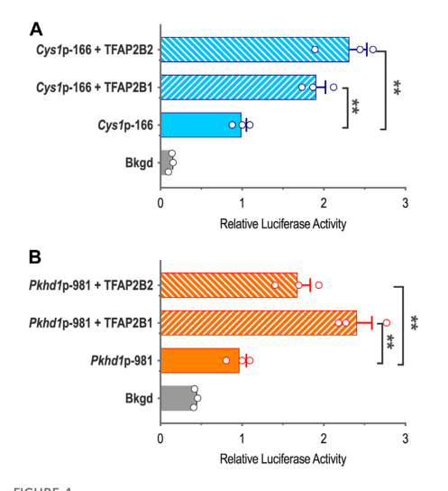

## Question

# Gene Research for Functional Annotation

## ⚠️ CRITICAL: Gene/Protein Identification Context

**BEFORE YOU BEGIN RESEARCH:** You MUST verify you are researching the CORRECT gene/protein. Gene symbols can be ambiguous, especially for less well-characterized genes from non-model organisms.

### Target Gene/Protein Identity (from UniProt):
- **UniProt Accession:** Q92481
- **Protein Description:** RecName: Full=Transcription factor AP-2-beta; Short=AP2-beta; AltName: Full=Activating enhancer-binding protein 2-beta;
- **Gene Information:** Name=TFAP2B;
- **Organism (full):** Homo sapiens (Human).
- **Protein Family:** Belongs to the AP-2 family. .
- **Key Domains:** TF_AP2. (IPR004979); TF_AP2_beta. (IPR008122); TF_AP2_C. (IPR013854); TF_AP-2 (PF03299)

### MANDATORY VERIFICATION STEPS:

1. **Check if the gene symbol "TFAP2B" matches the protein description above**
2. **Verify the organism is correct:** Homo sapiens (Human).
3. **Check if protein family/domains align with what you find in literature**
4. **If you find literature for a DIFFERENT gene with the same or similar symbol, STOP**

### If Gene Symbol is Ambiguous or You Cannot Find Relevant Literature:

**DO NOT PROCEED WITH RESEARCH ON A DIFFERENT GENE.** Instead:
- State clearly: "The gene symbol 'TFAP2B' is ambiguous or literature is limited for this specific protein"
- Explain what you found (e.g., "Found extensive literature on a different gene with the same symbol in a different organism")
- Describe the protein based ONLY on the UniProt information provided above
- Suggest that the protein function can be inferred from domain/family information

### Research Target:

Please provide a comprehensive research report on the gene **TFAP2B** (gene ID: TFAP2B, UniProt: Q92481) in human.

The research report should be a detailed narrative explaining the function, biological processes, and localization of the gene product. Citations should be given for all claims.

You should prioritize authoritative reviews and primary scientific literature when conducting research. You can supplement
this with annotations you find in gene/protein databases, but these can be outdated or inaccurate.

We are specifically interested in the primary function of the gene - for enzymes, what reaction is catalyzed, and what is the substrate specificity? For transporters, what is the substrate? For structural proteins or adapters, what is the broader structural role? For signaling molecules, what is the role in the pathway.

We are interested in where in or outside the cell the gene product carries out its function.

We are also interested in the signaling or biochemical pathways in which the gene functions. We are less interested in broad pleiotropic effects, except where these elucidate the precise role.

Include evidence where possible. We are interested in both experimental evidence as well as inference from structure, evolution, or bioinformatic analysis. Precise studies should be prioritized over high-throughput, where available.

## Output

Question: You are an expert researcher providing comprehensive, well-cited information.

Provide detailed information focusing on:
1. Key concepts and definitions with current understanding
2. Recent developments and latest research (prioritize 2023-2024 sources)
3. Current applications and real-world implementations
4. Expert opinions and analysis from authoritative sources
5. Relevant statistics and data from recent studies

Format as a comprehensive research report with proper citations. Include URLs and publication dates where available.
Always prioritize recent, authoritative sources and provide specific citations for all major claims.

# Gene Research for Functional Annotation

## ⚠️ CRITICAL: Gene/Protein Identification Context

**BEFORE YOU BEGIN RESEARCH:** You MUST verify you are researching the CORRECT gene/protein. Gene symbols can be ambiguous, especially for less well-characterized genes from non-model organisms.

### Target Gene/Protein Identity (from UniProt):
- **UniProt Accession:** Q92481
- **Protein Description:** RecName: Full=Transcription factor AP-2-beta; Short=AP2-beta; AltName: Full=Activating enhancer-binding protein 2-beta;
- **Gene Information:** Name=TFAP2B;
- **Organism (full):** Homo sapiens (Human).
- **Protein Family:** Belongs to the AP-2 family. .
- **Key Domains:** TF_AP2. (IPR004979); TF_AP2_beta. (IPR008122); TF_AP2_C. (IPR013854); TF_AP-2 (PF03299)

### MANDATORY VERIFICATION STEPS:

1. **Check if the gene symbol "TFAP2B" matches the protein description above**
2. **Verify the organism is correct:** Homo sapiens (Human).
3. **Check if protein family/domains align with what you find in literature**
4. **If you find literature for a DIFFERENT gene with the same or similar symbol, STOP**

### If Gene Symbol is Ambiguous or You Cannot Find Relevant Literature:

**DO NOT PROCEED WITH RESEARCH ON A DIFFERENT GENE.** Instead:
- State clearly: "The gene symbol 'TFAP2B' is ambiguous or literature is limited for this specific protein"
- Explain what you found (e.g., "Found extensive literature on a different gene with the same symbol in a different organism")
- Describe the protein based ONLY on the UniProt information provided above
- Suggest that the protein function can be inferred from domain/family information

### Research Target:

Please provide a comprehensive research report on the gene **TFAP2B** (gene ID: TFAP2B, UniProt: Q92481) in human.

The research report should be a detailed narrative explaining the function, biological processes, and localization of the gene product. Citations should be given for all claims.

You should prioritize authoritative reviews and primary scientific literature when conducting research. You can supplement
this with annotations you find in gene/protein databases, but these can be outdated or inaccurate.

We are specifically interested in the primary function of the gene - for enzymes, what reaction is catalyzed, and what is the substrate specificity? For transporters, what is the substrate? For structural proteins or adapters, what is the broader structural role? For signaling molecules, what is the role in the pathway.

We are interested in where in or outside the cell the gene product carries out its function.

We are also interested in the signaling or biochemical pathways in which the gene functions. We are less interested in broad pleiotropic effects, except where these elucidate the precise role.

Include evidence where possible. We are interested in both experimental evidence as well as inference from structure, evolution, or bioinformatic analysis. Precise studies should be prioritized over high-throughput, where available.

# Functional annotation of human TFAP2B (UniProt Q92481)

## Identity and primary molecular function

**Identity verified.** Human **TFAP2B** encodes transcription factor **AP-2β**, also called activating enhancer-binding protein 2-beta. The characterized 460-amino-acid AP-2β isoform corresponds to **UniProt Q92481**. It belongs to the AP-2 transcription-factor family; AP-2α, AP-2γ and AP-2δ are products of the *different* genes **TFAP2A, TFAP2C and TFAP2D**, respectively. This identification agrees with the supplied TF_AP2, TF_AP2_beta and TF_AP2_C domain annotations. The protein is **a sequence-specific transcriptional regulator, not an enzyme or a membrane transporter**: its relevant substrate is regulatory DNA, and its output is context-dependent activation or repression of gene transcription. [UniProt Q92481](https://www.uniprot.org/uniprotkb/Q92481/entry); Al-Sabri and colleagues, *Cell & Bioscience*, September 2022, [DOI:10.1186/s13578-022-00891-7](https://doi.org/10.1186/s13578-022-00891-7). (alsabri2022theregulatoryrole pages 3-4, alsabri2022theregulatoryrole pages 1-2)

AP-2β has a less-conserved, proline/glutamine-rich **N-terminal transactivation and protein-interaction region**, including a PY motif, and a conserved **central basic DNA-binding region adjoining a C-terminal helix–span–helix dimerization region**. Homo- or heterodimerization enables recognition of AP-2-family DNA motifs, including **5′-GCCNNNGGC-3′** and **5′-(G/C)CCCA(G/C)(G/C)(G/C)-3′**. These are *family-level* preferences: finding the motif alone neither proves AP-2β occupies a locus nor distinguishes it from other AP-2 paralogs. The available review also describes a shorter TFAP2B splice product, which should not be assumed equivalent to the well-studied Q92481 long isoform. (alsabri2022theregulatoryrole pages 1-2, alsabri2022theregulatoryrole pages 3-4, wu2023transcriptionfactorap2b pages 1-2, wu2023transcriptionfactorap2b pages 8-9)

## Site of action and biological processes

**Subcellular site: the nucleus.** Nuclear AP-2β protein staining was directly assessed in human breast lesions, and strong nuclear immunoreactivity was observed in a human FOXO1-rearranged alveolar rhabdomyosarcoma. Chromatin immunoprecipitation at human target promoters independently supports a nuclear transcriptional role. Evidence for *which cells* express the protein is distinct from evidence for its subcellular compartment. Raap and colleagues, *Laboratory Investigation*, January 2018, [DOI:10.1038/labinvest.2017.106](https://doi.org/10.1038/labinvest.2017.106). (raap2018lobularcarcinomain pages 3-5, raap2018lobularcarcinomain pages 2-3, han2024hif1αparticipatesin pages 5-5)

Protein-level surveys detected AP-2β in human embryonic facial mesenchyme, renal tubules and midbrain, and in subsets of adult mammary, distal-renal-tubule, salivary-gland and surface epithelial cells. These distributions fit its roles in **neural-crest-associated patterning, ductus-arteriosus and limb development, renal epithelial differentiation, and neural differentiation**, but expression in a tissue does not by itself establish a direct target gene there. Raap and colleagues, *International Journal of Cancer*, March 2021, [DOI:10.1002/ijc.33558](https://doi.org/10.1002/ijc.33558). (raap2018lobularcarcinomain pages 3-5, raap2021transcriptionfactorap‐2beta pages 4-5, raap2021transcriptionfactorap‐2beta pages 3-4)

## Experimentally supported regulatory pathways

The following comparison separates direct **human-cell** results from animal, shared-family and reporter-only evidence.

| Context/model | Directly observed TFAP2B molecular role and methods | Interpretation / limitations | Source |
|---|---|---|---|
| **Human renal tubular cells — direct human-cell evidence** (HK-2; hypoxia/reoxygenation and TGF-β1 injury models) | TFAP2B occupied two predicted *S100A16* promoter regions (S1, −200 to +88 bp; S2, −1980 to −1734 bp), with stronger S1 binding by ChIP. TFAP2B overexpression increased *S100A16* promoter-reporter activity, mRNA and protein; TFAP2B siRNA reversed injury-induced *S100A16* upregulation. | Supports a **TFAP2B → S100A16 → HIF-1α/HRD1 → GSK3β/CK1α–β-catenin** injury axis. Nuclear localization was not directly imaged, and downstream injury protection was established chiefly through *S100A16* rather than TFAP2B-specific in-vivo perturbation. | Han et al., **2024**, *Cell Death & Disease*. [https://doi.org/10.1038/s41419-024-06696-5](https://doi.org/10.1038/s41419-024-06696-5) (han2024hif1αparticipatesin pages 5-5, han2024hif1αparticipatesin pages 8-11, han2024hif1αparticipatesin pages 1-2) |
| **Mouse collecting-duct cells — direct promoter evidence** (mIMCD-3) | TFAP2B1 and TFAP2B2 increased mouse *Cys1* and *Pkhd1* promoter-reporter activity; promoter deletion/mutation and EMSA supported AP-2-site binding. Isoform effects differed by promoter. | Strong simplified protein–DNA evidence, but TFAP2B overexpression did **not** substantially change endogenous *Pkhd1* or *Cys1*. Mutation of the distal *Pkhd1* site only showed a nonsignificant trend (**p = 0.14, n = 6**). AP-2 motifs are shared among paralogs, and mouse renal phenotypes do not reproduce human Char syndrome. | Wu et al., **2023**, *Frontiers in Molecular Biosciences*. [https://doi.org/10.3389/fmolb.2022.946344](https://doi.org/10.3389/fmolb.2022.946344) (wu2023transcriptionfactorap2b pages 7-8, wu2023transcriptionfactorap2b pages 9-10, wu2023transcriptionfactorap2b pages 8-9) |
| **Mouse ductus arteriosus and limb development — mechanistic animal evidence** | *Tfap2b* loss reduced *Bmp2* and increased *Bmp4* expression in limb buds. Reporter assays showed 3–6-fold activation of the *Bmp2* promoter and 2.5–4-fold repression of the *Bmp4* promoter by TFAP2 expression plasmids; promoter oligonucleotides bound AP-2 proteins by EMSA. | Supports BMP-pathway involvement in patent ductus arteriosus and limb defects. However, EMSA used AP-2-rich HeLa extracts and an AP-2α antibody, and both TFAP2A and TFAP2B regulated the reporters; binding is therefore **AP-2-family**, not unequivocally TFAP2B-specific. | Zhao et al., **2011**, *PLoS ONE*. [https://doi.org/10.1371/journal.pone.0022908](https://doi.org/10.1371/journal.pone.0022908) (zhao2011ahearthandsyndrome pages 5-6, zhao2011ahearthandsyndrome pages 7-8, zhao2011ahearthandsyndrome pages 3-5) |
| **Mouse craniofacial surface ectoderm — cooperative AP-2 evidence** | Combined *Tfap2a/Tfap2b* deletion reduced accessibility at **3,103** regions (~5% of control elements), ~**87%** promoter-distal; affected elements were AP-2-motif-enriched and associated with multiple WNT loci. Ectodermal Wnt1 overexpression partially rescued craniofacial fusion defects. | Demonstrates cooperative TFAP2A/TFAP2B control of enhancer accessibility and WNT output, **not a TFAP2B-alone mechanism**. The rescue was incomplete, indicating additional AP-2-regulated pathways or dosage/timing constraints. | Van Otterloo et al., **2022**, *eLife*. [https://doi.org/10.7554/eLife.70511](https://doi.org/10.7554/eLife.70511) (otterloo2022ap2αandap2β pages 26-30, otterloo2022ap2αandap2β pages 17-20, otterloo2022ap2αandap2β pages 10-14) |
| **Human mesothelial cells — recent human-cell corroboration** (HMrSV5/MET-5A; gastric-cancer exosomal circPTBP3 model) | RNA pull-down/RIP/EMSA and RNA-FISH–immunofluorescence supported nuclear circPTBP3–TFAP2B association. ChIP detected TFAP2B at *SGK1* promoter regions; ChIRP recovered circPTBP3-associated promoter chromatin. TFAP2B knockdown reversed circPTBP3-induced SGK1 upregulation. | Supports a **circPTBP3–TFAP2B–SGK1** transcriptional axis promoting mesothelial–mesenchymal transition. Evidence is model-specific and strongly supports recruitment/facilitated occupancy, but does not fully resolve the biochemical architecture of the RNA–TF–DNA complex or provide independent replication. | Dong et al., **2025**, *Cell Death & Disease*. [https://doi.org/10.1038/s41419-025-07749-z](https://doi.org/10.1038/s41419-025-07749-z) (dong2025tumorexosomalcircptbp3 pages 9-11, dong2025tumorexosomalcircptbp3 pages 11-11, dong2025tumorexosomalcircptbp3 pages 6-9) |

*Table: Evidence-tier summary of experimentally tested TFAP2B/AP-2β regulatory mechanisms across human-cell and mouse models. It separates TFAP2B-specific observations from shared AP-2-family or combined TFAP2A/TFAP2B effects and highlights major translational limitations.*

**Renal injury—human-cell target.** Han and colleagues identified **S100A16** as a TFAP2B-responsive gene in human HK-2 renal tubular cells. TFAP2B ChIP detected occupancy at two candidate *S100A16* promoter regions, approximately **−200 to +88 bp** and **−1980 to −1734 bp**, with stronger signal at the proximal region. TFAP2B overexpression raised promoter-reporter activity and endogenous S100A16 RNA and protein; TFAP2B siRNA attenuated the S100A16 increase following hypoxia/reoxygenation. The authors propose **TFAP2B → S100A16 → HIF-1α → HRD1/SYVN1 → GSK3β/CK1α degradation → β-catenin signaling** in injury. The downstream injury experiments particularly substantiate S100A16 and HIF-1α/HRD1; they do **not** establish that TFAP2B alone produces the entire cascade in patients. Han and colleagues, *Cell Death & Disease*, May 2024, [DOI:10.1038/s41419-024-06696-5](https://doi.org/10.1038/s41419-024-06696-5). (han2024hif1αparticipatesin pages 5-5, han2024hif1αparticipatesin pages 8-11, han2024hif1αparticipatesin pages 1-2)

**Renal epithelial differentiation—mouse promoter mechanism.** In a 2023 study, mouse collecting-duct-cell reporter assays and electrophoretic mobility-shift assays supported AP-2β-responsive sites in the cystic-kidney-disease genes *Pkhd1* and *Cys1*. Both tested TFAP2B isoforms increased reporter activity, but preferred different promoters. Critically, overexpression **did not substantially increase the endogenous genes**, and mutation of one distal *Pkhd1* site showed only a nonsignificant reduction (**p = 0.14; n = 6**). Thus, promoter recognition is supported more strongly than a demonstrated TFAP2B-dependent *PKHD1/CYS1* program in human kidney. The authors explicitly note that human Char syndrome does not reproduce the severe renal phenotype of *Tfap2b*-deficient mice. Wu and colleagues, *Frontiers in Molecular Biosciences*, January 2023, [DOI:10.3389/fmolb.2022.946344](https://doi.org/10.3389/fmolb.2022.946344). The cropped reporter panels of that study’s Figure 4 illustrate its isoform- and promoter-dependent effects. (wu2023transcriptionfactorap2b pages 7-8, wu2023transcriptionfactorap2b pages 9-10, wu2023transcriptionfactorap2b pages 8-9, wu2023transcriptionfactorap2b media df3393e2)

**Developmental BMP and WNT signaling—animal evidence.** In mouse *Tfap2b* knockouts, the ductus arteriosus remained open **six hours after birth**, and limb buds showed reduced *Bmp2* and increased *Bmp4* expression. TFAP2 expression activated a *Bmp2* promoter reporter **3–6-fold** and repressed a *Bmp4* reporter **2.5–4-fold**. However, the DNA-binding assays used AP-2-containing extracts—including AP-2α—so those shifts cannot uniquely be assigned to TFAP2B. Zhao and colleagues, *PLoS ONE*, July 2011, [DOI:10.1371/journal.pone.0022908](https://doi.org/10.1371/journal.pone.0022908). (zhao2011ahearthandsyndrome pages 1-2, zhao2011ahearthandsyndrome pages 7-8, zhao2011ahearthandsyndrome pages 3-5)

In mouse craniofacial surface ectoderm, **combined** *Tfap2a/Tfap2b* deletion reduced accessibility at **3,103 genomic regions**—approximately **5%** of control-accessible elements—of which roughly **87%** were promoter-distal. Affected sites included regulatory regions associated with WNT-pathway genes; ectodermal *Wnt1* overexpression partly rescued facial defects. This supports cooperative AP-2 control of enhancer accessibility and signaling **from ectoderm to neighboring tissues**, not a TFAP2B-specific WNT1-binding claim. Van Otterloo and colleagues, *eLife*, 2022; retrieved manuscript [DOI:10.1101/2021.06.10.447717](https://doi.org/10.1101/2021.06.10.447717). (otterloo2022ap2αandap2β pages 26-30, otterloo2022ap2αandap2β pages 17-20, otterloo2022ap2αandap2β pages 10-14)

**Neural programs.** An expert review describes AP-2β-dependent regulation of catecholamine-associated genes including **TH** and **DBH**, consonant with sympathoadrenal and neuroblastoma differentiation. It also discusses serotonin-transporter and monoamine-metabolism regulation, but emphasizes unresolved mechanisms and mixed findings. Importantly, its proposed transfer of a *Drosophila* vesicular-monoamine-transporter result to **human VMAT2/SLC18A2** is a **hypothesis, not demonstrated direct regulation by human TFAP2B**. Al-Sabri and colleagues, September 2022, [DOI:10.1186/s13578-022-00891-7](https://doi.org/10.1186/s13578-022-00891-7); Raap and colleagues, March 2021, [DOI:10.1002/ijc.33558](https://doi.org/10.1002/ijc.33558). (raap2021transcriptionfactorap‐2beta pages 4-5, alsabri2022theregulatoryrole pages 6-8)

## Recent developments and practical relevance

A **2024** yeast-one-hybrid screen tested **1,086 transcription factors against 108 cancer-gene promoters**, reporting AP-2-family and particularly TFAP2B enrichment among detected protein–DNA interactions. This is useful for generating target hypotheses, but yeast promoter binding is neither endogenous occupancy nor proof of transcriptional regulation in a human tissue. Lu and colleagues, *Life Science Alliance*, July 2024, [DOI:10.26508/lsa.202402641](https://doi.org/10.26508/lsa.202402641). Human kidney single-cell regulatory-genomics work likewise prioritized TFAP2B among candidate renal transcriptional regulators without independently establishing a TFAP2B-specific target or causal GWAS effect. Loeb and colleagues, *Nature Genetics*, September 2024, [DOI:10.1038/s41588-024-01904-6](https://doi.org/10.1038/s41588-024-01904-6). (lu2024alargescalecancerspecific pages 4-5, loeb2024variantsintubule pages 8-10)

A later **2025** human-cell study provides another specific mechanism: in mesothelial cells, nuclear circPTBP3 associated with TFAP2B, TFAP2B occupied *SGK1* promoter regions by ChIP, and TFAP2B knockdown reversed circPTBP3-induced SGK1 expression. This supports a context-specific **circPTBP3–TFAP2B–SGK1** transcriptional axis, while the precise biochemical architecture of recruitment remains incompletely resolved. Dong and colleagues, *Cell Death & Disease*, June 2025, [DOI:10.1038/s41419-025-07749-z](https://doi.org/10.1038/s41419-025-07749-z). (dong2025tumorexosomalcircptbp3 pages 9-11, dong2025tumorexosomalcircptbp3 pages 11-11)

**Clinical use and limits.** Inherited TFAP2B disruption causes **autosomal-dominant Char syndrome**, characterized by patent ductus arteriosus, distinctive facial features and fifth-digit abnormalities; this is the clearest human genetic demonstration that normal TFAP2B function matters in development. AP-2β immunohistochemistry is used as an **ancillary**, not stand-alone, diagnostic test in alveolar rhabdomyosarcoma alongside testing for FOXO1 rearrangement. In an older human breast-lesion series, **16/19** lobular carcinoma-in-situ samples had strong uniform AP-2β staining, as did **4/4** invasive lobular cancers; those small denominators do not establish clinical-test performance. TFAP2B-directed siRNA also reduced growth and increased G0/G1 accumulation in breast-cancer cell models. None of these findings establishes an approved TFAP2B-directed therapy. Raap and colleagues, 2018 and 2021, [DOI:10.1038/labinvest.2017.106](https://doi.org/10.1038/labinvest.2017.106), [DOI:10.1002/ijc.33558](https://doi.org/10.1002/ijc.33558). (raap2021transcriptionfactorap‐2beta pages 1-3, raap2021transcriptionfactorap‐2beta pages 4-5, raap2018lobularcarcinomain pages 2-3, raap2018lobularcarcinomain pages 11-12)

**Overall assessment.** The highest-confidence annotation for human Q92481 is **nuclear, dimerization-dependent, sequence-specific regulation of gene expression**. Its directly tested human targets include *S100A16* in renal tubular-cell experiments and, in a 2025 disease model, *SGK1* in mesothelial cells. Renal cyst-gene, BMP and craniofacial WNT findings provide mechanistically valuable—but partly mouse-derived, shared-AP-2, or reporter-level—evidence. TFAP2B target selection in normal human tissues, paralog-specific binding and clinical translation remain less firmly established than its core transcription-factor function. (alsabri2022theregulatoryrole pages 1-2, han2024hif1αparticipatesin pages 5-5, wu2023transcriptionfactorap2b pages 9-10, otterloo2022ap2αandap2β pages 10-14, dong2025tumorexosomalcircptbp3 pages 9-11)

References

1. (alsabri2022theregulatoryrole pages 3-4): Mohamed H. Al-Sabri, Maryam Nikpour, Laura E. Clemensson, Misty M. Attwood, Michael J. Williams, Mathias Rask-Anderson, Jessica Mwinyi, and Helgi B. Schiöth. The regulatory role of ap-2β in monoaminergic neurotransmitter systems: insights on its signalling pathway, linked disorders and theragnostic potential. Cell & Bioscience, Sep 2022. URL: https://doi.org/10.1186/s13578-022-00891-7, doi:10.1186/s13578-022-00891-7. This article has 9 citations and is from a peer-reviewed journal.

2. (alsabri2022theregulatoryrole pages 1-2): Mohamed H. Al-Sabri, Maryam Nikpour, Laura E. Clemensson, Misty M. Attwood, Michael J. Williams, Mathias Rask-Anderson, Jessica Mwinyi, and Helgi B. Schiöth. The regulatory role of ap-2β in monoaminergic neurotransmitter systems: insights on its signalling pathway, linked disorders and theragnostic potential. Cell & Bioscience, Sep 2022. URL: https://doi.org/10.1186/s13578-022-00891-7, doi:10.1186/s13578-022-00891-7. This article has 9 citations and is from a peer-reviewed journal.

3. (wu2023transcriptionfactorap2b pages 1-2): Maoqing Wu, Naoe Harafuji, Amber K. O’Connor, Ljubica Caldovic, and Lisa M. Guay-Woodford. Transcription factor ap2b regulates the mouse autosomal recessive polycystic kidney disease genes, pkhd1 and cys1. Frontiers in Molecular Biosciences, Jan 2023. URL: https://doi.org/10.3389/fmolb.2022.946344, doi:10.3389/fmolb.2022.946344. This article has 5 citations.

4. (wu2023transcriptionfactorap2b pages 8-9): Maoqing Wu, Naoe Harafuji, Amber K. O’Connor, Ljubica Caldovic, and Lisa M. Guay-Woodford. Transcription factor ap2b regulates the mouse autosomal recessive polycystic kidney disease genes, pkhd1 and cys1. Frontiers in Molecular Biosciences, Jan 2023. URL: https://doi.org/10.3389/fmolb.2022.946344, doi:10.3389/fmolb.2022.946344. This article has 5 citations.

5. (raap2018lobularcarcinomain pages 3-5): Mieke Raap, Malte Gronewold, Henriette Christgen, Silke Glage, Mohammad Bentires-Alj, Shany Koren, Patrick W Derksen, Mirjam Boelens, Jos Jonkers, Ulrich Lehmann, Friedrich Feuerhake, Elna Kuehnle, Oleg Gluz, Ronald Kates, Ulrike Nitz, Nadia Harbeck, Hans H Kreipe, and Matthias Christgen. Lobular carcinoma in situ and invasive lobular breast cancer are characterized by enhanced expression of transcription factor ap-2β. Laboratory Investigation, 98:117-129, Jan 2018. URL: https://doi.org/10.1038/labinvest.2017.106, doi:10.1038/labinvest.2017.106. This article has 41 citations and is from a peer-reviewed journal.

6. (raap2018lobularcarcinomain pages 2-3): Mieke Raap, Malte Gronewold, Henriette Christgen, Silke Glage, Mohammad Bentires-Alj, Shany Koren, Patrick W Derksen, Mirjam Boelens, Jos Jonkers, Ulrich Lehmann, Friedrich Feuerhake, Elna Kuehnle, Oleg Gluz, Ronald Kates, Ulrike Nitz, Nadia Harbeck, Hans H Kreipe, and Matthias Christgen. Lobular carcinoma in situ and invasive lobular breast cancer are characterized by enhanced expression of transcription factor ap-2β. Laboratory Investigation, 98:117-129, Jan 2018. URL: https://doi.org/10.1038/labinvest.2017.106, doi:10.1038/labinvest.2017.106. This article has 41 citations and is from a peer-reviewed journal.

7. (han2024hif1αparticipatesin pages 5-5): Shuying Han, Runbing Jin, Lei Huo, Yunfei Teng, Lihua Zhao, Kaini Zhang, Rongfeng Li, Dongming Su, and Xiubin Liang. Hif-1α participates in the regulation of s100a16-hrd1-gsk3β/ck1α pathway in renal hypoxia injury. Cell Death &amp; Disease, May 2024. URL: https://doi.org/10.1038/s41419-024-06696-5, doi:10.1038/s41419-024-06696-5. This article has 20 citations and is from a peer-reviewed journal.

8. (raap2021transcriptionfactorap‐2beta pages 4-5): Mieke Raap, Lisa Gierendt, Hans H. Kreipe, and Matthias Christgen. Transcription factor <scp>ap</scp>‐2beta in development, differentiation and tumorigenesis. International Journal of Cancer, 149:1221-1227, Mar 2021. URL: https://doi.org/10.1002/ijc.33558, doi:10.1002/ijc.33558. This article has 38 citations and is from a domain leading peer-reviewed journal.

9. (raap2021transcriptionfactorap‐2beta pages 3-4): Mieke Raap, Lisa Gierendt, Hans H. Kreipe, and Matthias Christgen. Transcription factor <scp>ap</scp>‐2beta in development, differentiation and tumorigenesis. International Journal of Cancer, 149:1221-1227, Mar 2021. URL: https://doi.org/10.1002/ijc.33558, doi:10.1002/ijc.33558. This article has 38 citations and is from a domain leading peer-reviewed journal.

10. (han2024hif1αparticipatesin pages 8-11): Shuying Han, Runbing Jin, Lei Huo, Yunfei Teng, Lihua Zhao, Kaini Zhang, Rongfeng Li, Dongming Su, and Xiubin Liang. Hif-1α participates in the regulation of s100a16-hrd1-gsk3β/ck1α pathway in renal hypoxia injury. Cell Death &amp; Disease, May 2024. URL: https://doi.org/10.1038/s41419-024-06696-5, doi:10.1038/s41419-024-06696-5. This article has 20 citations and is from a peer-reviewed journal.

11. (han2024hif1αparticipatesin pages 1-2): Shuying Han, Runbing Jin, Lei Huo, Yunfei Teng, Lihua Zhao, Kaini Zhang, Rongfeng Li, Dongming Su, and Xiubin Liang. Hif-1α participates in the regulation of s100a16-hrd1-gsk3β/ck1α pathway in renal hypoxia injury. Cell Death &amp; Disease, May 2024. URL: https://doi.org/10.1038/s41419-024-06696-5, doi:10.1038/s41419-024-06696-5. This article has 20 citations and is from a peer-reviewed journal.

12. (wu2023transcriptionfactorap2b pages 7-8): Maoqing Wu, Naoe Harafuji, Amber K. O’Connor, Ljubica Caldovic, and Lisa M. Guay-Woodford. Transcription factor ap2b regulates the mouse autosomal recessive polycystic kidney disease genes, pkhd1 and cys1. Frontiers in Molecular Biosciences, Jan 2023. URL: https://doi.org/10.3389/fmolb.2022.946344, doi:10.3389/fmolb.2022.946344. This article has 5 citations.

13. (wu2023transcriptionfactorap2b pages 9-10): Maoqing Wu, Naoe Harafuji, Amber K. O’Connor, Ljubica Caldovic, and Lisa M. Guay-Woodford. Transcription factor ap2b regulates the mouse autosomal recessive polycystic kidney disease genes, pkhd1 and cys1. Frontiers in Molecular Biosciences, Jan 2023. URL: https://doi.org/10.3389/fmolb.2022.946344, doi:10.3389/fmolb.2022.946344. This article has 5 citations.

14. (zhao2011ahearthandsyndrome pages 5-6): Feng Zhao, Anja-Katrin Bosserhoff, Reinhard Buettner, and Markus Moser. A heart-hand syndrome gene: tfap2b plays a critical role in the development and remodeling of mouse ductus arteriosus and limb patterning. PLoS ONE, 6:e22908, Jul 2011. URL: https://doi.org/10.1371/journal.pone.0022908, doi:10.1371/journal.pone.0022908. This article has 71 citations and is from a peer-reviewed journal.

15. (zhao2011ahearthandsyndrome pages 7-8): Feng Zhao, Anja-Katrin Bosserhoff, Reinhard Buettner, and Markus Moser. A heart-hand syndrome gene: tfap2b plays a critical role in the development and remodeling of mouse ductus arteriosus and limb patterning. PLoS ONE, 6:e22908, Jul 2011. URL: https://doi.org/10.1371/journal.pone.0022908, doi:10.1371/journal.pone.0022908. This article has 71 citations and is from a peer-reviewed journal.

16. (zhao2011ahearthandsyndrome pages 3-5): Feng Zhao, Anja-Katrin Bosserhoff, Reinhard Buettner, and Markus Moser. A heart-hand syndrome gene: tfap2b plays a critical role in the development and remodeling of mouse ductus arteriosus and limb patterning. PLoS ONE, 6:e22908, Jul 2011. URL: https://doi.org/10.1371/journal.pone.0022908, doi:10.1371/journal.pone.0022908. This article has 71 citations and is from a peer-reviewed journal.

17. (otterloo2022ap2αandap2β pages 26-30): Eric Van Otterloo, Isaac Milanda, H. Pike, Jamie A Thompson, Hong Li, Kenneth L Jones, and T. Williams. Ap-2α and ap-2β cooperatively function in the craniofacial surface ectoderm to regulate chromatin and gene expression dynamics during facial development. eLife, Jun 2022. URL: https://doi.org/10.1101/2021.06.10.447717, doi:10.1101/2021.06.10.447717. This article has 51 citations and is from a domain leading peer-reviewed journal.

18. (otterloo2022ap2αandap2β pages 17-20): Eric Van Otterloo, Isaac Milanda, H. Pike, Jamie A Thompson, Hong Li, Kenneth L Jones, and T. Williams. Ap-2α and ap-2β cooperatively function in the craniofacial surface ectoderm to regulate chromatin and gene expression dynamics during facial development. eLife, Jun 2022. URL: https://doi.org/10.1101/2021.06.10.447717, doi:10.1101/2021.06.10.447717. This article has 51 citations and is from a domain leading peer-reviewed journal.

19. (otterloo2022ap2αandap2β pages 10-14): Eric Van Otterloo, Isaac Milanda, H. Pike, Jamie A Thompson, Hong Li, Kenneth L Jones, and T. Williams. Ap-2α and ap-2β cooperatively function in the craniofacial surface ectoderm to regulate chromatin and gene expression dynamics during facial development. eLife, Jun 2022. URL: https://doi.org/10.1101/2021.06.10.447717, doi:10.1101/2021.06.10.447717. This article has 51 citations and is from a domain leading peer-reviewed journal.

20. (dong2025tumorexosomalcircptbp3 pages 9-11): Chao Dong, Yajing Zhou, Xiaochun Shen, Shuo Hu, Kaipeng Duan, Tao Chen, Weikang Li, Xiaotong Sun, Peiyuan Li, Pengbo Wang, Ye Han, Dongbao Li, Qiaoming Zhi, and Jin Zhou. Tumor exosomal circptbp3 drives gastric cancer peritoneal metastasis via mesothelial-mesenchymal transition. Cell Death & Disease, Jun 2025. URL: https://doi.org/10.1038/s41419-025-07749-z, doi:10.1038/s41419-025-07749-z. This article has 15 citations and is from a peer-reviewed journal.

21. (dong2025tumorexosomalcircptbp3 pages 11-11): Chao Dong, Yajing Zhou, Xiaochun Shen, Shuo Hu, Kaipeng Duan, Tao Chen, Weikang Li, Xiaotong Sun, Peiyuan Li, Pengbo Wang, Ye Han, Dongbao Li, Qiaoming Zhi, and Jin Zhou. Tumor exosomal circptbp3 drives gastric cancer peritoneal metastasis via mesothelial-mesenchymal transition. Cell Death & Disease, Jun 2025. URL: https://doi.org/10.1038/s41419-025-07749-z, doi:10.1038/s41419-025-07749-z. This article has 15 citations and is from a peer-reviewed journal.

22. (dong2025tumorexosomalcircptbp3 pages 6-9): Chao Dong, Yajing Zhou, Xiaochun Shen, Shuo Hu, Kaipeng Duan, Tao Chen, Weikang Li, Xiaotong Sun, Peiyuan Li, Pengbo Wang, Ye Han, Dongbao Li, Qiaoming Zhi, and Jin Zhou. Tumor exosomal circptbp3 drives gastric cancer peritoneal metastasis via mesothelial-mesenchymal transition. Cell Death & Disease, Jun 2025. URL: https://doi.org/10.1038/s41419-025-07749-z, doi:10.1038/s41419-025-07749-z. This article has 15 citations and is from a peer-reviewed journal.

23. (wu2023transcriptionfactorap2b media df3393e2): Maoqing Wu, Naoe Harafuji, Amber K. O’Connor, Ljubica Caldovic, and Lisa M. Guay-Woodford. Transcription factor ap2b regulates the mouse autosomal recessive polycystic kidney disease genes, pkhd1 and cys1. Frontiers in Molecular Biosciences, Jan 2023. URL: https://doi.org/10.3389/fmolb.2022.946344, doi:10.3389/fmolb.2022.946344. This article has 5 citations.

24. (zhao2011ahearthandsyndrome pages 1-2): Feng Zhao, Anja-Katrin Bosserhoff, Reinhard Buettner, and Markus Moser. A heart-hand syndrome gene: tfap2b plays a critical role in the development and remodeling of mouse ductus arteriosus and limb patterning. PLoS ONE, 6:e22908, Jul 2011. URL: https://doi.org/10.1371/journal.pone.0022908, doi:10.1371/journal.pone.0022908. This article has 71 citations and is from a peer-reviewed journal.

25. (alsabri2022theregulatoryrole pages 6-8): Mohamed H. Al-Sabri, Maryam Nikpour, Laura E. Clemensson, Misty M. Attwood, Michael J. Williams, Mathias Rask-Anderson, Jessica Mwinyi, and Helgi B. Schiöth. The regulatory role of ap-2β in monoaminergic neurotransmitter systems: insights on its signalling pathway, linked disorders and theragnostic potential. Cell & Bioscience, Sep 2022. URL: https://doi.org/10.1186/s13578-022-00891-7, doi:10.1186/s13578-022-00891-7. This article has 9 citations and is from a peer-reviewed journal.

26. (lu2024alargescalecancerspecific pages 4-5): Yunwei Lu, Anna Berenson, Ryan Lane, Isabelle Guelin, Zhaorong Li, Yilin Chen, Sakshi Shah, Meimei Yin, Luis Fernando Soto-Ugaldi, Ana Fiszbein, and Juan Ignacio Fuxman Bass. A large-scale cancer-specific protein–dna interaction network. Life Science Alliance, 7:e202402641, Jul 2024. URL: https://doi.org/10.26508/lsa.202402641, doi:10.26508/lsa.202402641. This article has 10 citations and is from a peer-reviewed journal.

27. (loeb2024variantsintubule pages 8-10): Gabriel B. Loeb, Pooja Kathail, Richard W. Shuai, Ryan Chung, Reinier J. Grona, Sailaja Peddada, Volkan Sevim, Scot Federman, Karl Mader, Audrey Y. Chu, Jonathan Davitte, Juan Du, Alexander R. Gupta, Chun Jimmie Ye, Shawn Shafer, Laralynne Przybyla, Radu Rapiteanu, Nilah M. Ioannidis, and Jeremy F. Reiter. Variants in tubule epithelial regulatory elements mediate most heritable differences in human kidney function. Nature genetics, 56:2078-2092, Sep 2024. URL: https://doi.org/10.1038/s41588-024-01904-6, doi:10.1038/s41588-024-01904-6. This article has 43 citations and is from a highest quality peer-reviewed journal.

28. (raap2021transcriptionfactorap‐2beta pages 1-3): Mieke Raap, Lisa Gierendt, Hans H. Kreipe, and Matthias Christgen. Transcription factor <scp>ap</scp>‐2beta in development, differentiation and tumorigenesis. International Journal of Cancer, 149:1221-1227, Mar 2021. URL: https://doi.org/10.1002/ijc.33558, doi:10.1002/ijc.33558. This article has 38 citations and is from a domain leading peer-reviewed journal.

29. (raap2018lobularcarcinomain pages 11-12): Mieke Raap, Malte Gronewold, Henriette Christgen, Silke Glage, Mohammad Bentires-Alj, Shany Koren, Patrick W Derksen, Mirjam Boelens, Jos Jonkers, Ulrich Lehmann, Friedrich Feuerhake, Elna Kuehnle, Oleg Gluz, Ronald Kates, Ulrike Nitz, Nadia Harbeck, Hans H Kreipe, and Matthias Christgen. Lobular carcinoma in situ and invasive lobular breast cancer are characterized by enhanced expression of transcription factor ap-2β. Laboratory Investigation, 98:117-129, Jan 2018. URL: https://doi.org/10.1038/labinvest.2017.106, doi:10.1038/labinvest.2017.106. This article has 41 citations and is from a peer-reviewed journal.

## Artifacts

- [Edison artifact artifact-00](TFAP2B-deep-research-falcon_artifacts/artifact-00.md)

## Citations

1. alsabri2022theregulatoryrole pages 3-4
2. alsabri2022theregulatoryrole pages 1-2
3. raap2018lobularcarcinomain pages 3-5
4. raap2018lobularcarcinomain pages 2-3
5. zhao2011ahearthandsyndrome pages 5-6
6. zhao2011ahearthandsyndrome pages 7-8
7. zhao2011ahearthandsyndrome pages 3-5
8. zhao2011ahearthandsyndrome pages 1-2
9. alsabri2022theregulatoryrole pages 6-8
10. lu2024alargescalecancerspecific pages 4-5
11. loeb2024variantsintubule pages 8-10
12. raap2018lobularcarcinomain pages 11-12
13. UniProt Q92481
14. DOI:10.1186/s13578-022-00891-7
15. DOI:10.1038/labinvest.2017.106
16. DOI:10.1002/ijc.33558
17. https://doi.org/10.1038/s41419-024-06696-5
18. https://doi.org/10.3389/fmolb.2022.946344
19. https://doi.org/10.1371/journal.pone.0022908
20. https://doi.org/10.7554/eLife.70511
21. https://doi.org/10.1038/s41419-025-07749-z
22. DOI:10.1038/s41419-024-06696-5
23. DOI:10.3389/fmolb.2022.946344
24. DOI:10.1371/journal.pone.0022908
25. DOI:10.1101/2021.06.10.447717
26. DOI:10.26508/lsa.202402641
27. DOI:10.1038/s41588-024-01904-6
28. DOI:10.1038/s41419-025-07749-z
29. https://www.uniprot.org/uniprotkb/Q92481/entry
30. https://doi.org/10.1186/s13578-022-00891-7
31. https://doi.org/10.1038/labinvest.2017.106
32. https://doi.org/10.1002/ijc.33558
33. https://doi.org/10.1038/s41419-024-06696-5](https://doi.org/10.1038/s41419-024-06696-5
34. https://doi.org/10.3389/fmolb.2022.946344](https://doi.org/10.3389/fmolb.2022.946344
35. https://doi.org/10.1371/journal.pone.0022908](https://doi.org/10.1371/journal.pone.0022908
36. https://doi.org/10.7554/eLife.70511](https://doi.org/10.7554/eLife.70511
37. https://doi.org/10.1038/s41419-025-07749-z](https://doi.org/10.1038/s41419-025-07749-z
38. https://doi.org/10.1101/2021.06.10.447717
39. https://doi.org/10.26508/lsa.202402641
40. https://doi.org/10.1038/s41588-024-01904-6
41. https://doi.org/10.1186/s13578-022-00891-7,
42. https://doi.org/10.3389/fmolb.2022.946344,
43. https://doi.org/10.1038/labinvest.2017.106,
44. https://doi.org/10.1038/s41419-024-06696-5,
45. https://doi.org/10.1002/ijc.33558,
46. https://doi.org/10.1371/journal.pone.0022908,
47. https://doi.org/10.1101/2021.06.10.447717,
48. https://doi.org/10.1038/s41419-025-07749-z,
49. https://doi.org/10.26508/lsa.202402641,
50. https://doi.org/10.1038/s41588-024-01904-6,