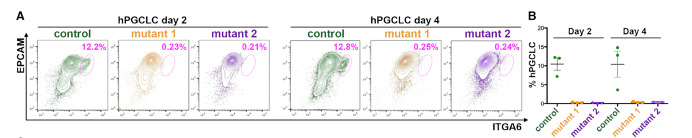

## Question

# Gene Research for Functional Annotation

## ⚠️ CRITICAL: Gene/Protein Identification Context

**BEFORE YOU BEGIN RESEARCH:** You MUST verify you are researching the CORRECT gene/protein. Gene symbols can be ambiguous, especially for less well-characterized genes from non-model organisms.

### Target Gene/Protein Identity (from UniProt):
- **UniProt Accession:** Q92754
- **Protein Description:** RecName: Full=Transcription factor AP-2 gamma; Short=AP2-gamma; AltName: Full=Activating enhancer-binding protein 2 gamma; AltName: Full=Transcription factor ERF-1;
- **Gene Information:** Name=TFAP2C;
- **Organism (full):** Homo sapiens (Human).
- **Protein Family:** Belongs to the AP-2 family. .
- **Key Domains:** TF_AP2. (IPR004979); TF_AP2_C. (IPR013854); TF_AP2_gamma. (IPR008123); TF_AP-2 (PF03299)

### MANDATORY VERIFICATION STEPS:

1. **Check if the gene symbol "TFAP2C" matches the protein description above**
2. **Verify the organism is correct:** Homo sapiens (Human).
3. **Check if protein family/domains align with what you find in literature**
4. **If you find literature for a DIFFERENT gene with the same or similar symbol, STOP**

### If Gene Symbol is Ambiguous or You Cannot Find Relevant Literature:

**DO NOT PROCEED WITH RESEARCH ON A DIFFERENT GENE.** Instead:
- State clearly: "The gene symbol 'TFAP2C' is ambiguous or literature is limited for this specific protein"
- Explain what you found (e.g., "Found extensive literature on a different gene with the same symbol in a different organism")
- Describe the protein based ONLY on the UniProt information provided above
- Suggest that the protein function can be inferred from domain/family information

### Research Target:

Please provide a comprehensive research report on the gene **TFAP2C** (gene ID: TFAP2C, UniProt: Q92754) in human.

The research report should be a detailed narrative explaining the function, biological processes, and localization of the gene product. Citations should be given for all claims.

You should prioritize authoritative reviews and primary scientific literature when conducting research. You can supplement
this with annotations you find in gene/protein databases, but these can be outdated or inaccurate.

We are specifically interested in the primary function of the gene - for enzymes, what reaction is catalyzed, and what is the substrate specificity? For transporters, what is the substrate? For structural proteins or adapters, what is the broader structural role? For signaling molecules, what is the role in the pathway.

We are interested in where in or outside the cell the gene product carries out its function.

We are also interested in the signaling or biochemical pathways in which the gene functions. We are less interested in broad pleiotropic effects, except where these elucidate the precise role.

Include evidence where possible. We are interested in both experimental evidence as well as inference from structure, evolution, or bioinformatic analysis. Precise studies should be prioritized over high-throughput, where available.

## Output

Question: You are an expert researcher providing comprehensive, well-cited information.

Provide detailed information focusing on:
1. Key concepts and definitions with current understanding
2. Recent developments and latest research (prioritize 2023-2024 sources)
3. Current applications and real-world implementations
4. Expert opinions and analysis from authoritative sources
5. Relevant statistics and data from recent studies

Format as a comprehensive research report with proper citations. Include URLs and publication dates where available.
Always prioritize recent, authoritative sources and provide specific citations for all major claims.

# Gene Research for Functional Annotation

## ⚠️ CRITICAL: Gene/Protein Identification Context

**BEFORE YOU BEGIN RESEARCH:** You MUST verify you are researching the CORRECT gene/protein. Gene symbols can be ambiguous, especially for less well-characterized genes from non-model organisms.

### Target Gene/Protein Identity (from UniProt):
- **UniProt Accession:** Q92754
- **Protein Description:** RecName: Full=Transcription factor AP-2 gamma; Short=AP2-gamma; AltName: Full=Activating enhancer-binding protein 2 gamma; AltName: Full=Transcription factor ERF-1;
- **Gene Information:** Name=TFAP2C;
- **Organism (full):** Homo sapiens (Human).
- **Protein Family:** Belongs to the AP-2 family. .
- **Key Domains:** TF_AP2. (IPR004979); TF_AP2_C. (IPR013854); TF_AP2_gamma. (IPR008123); TF_AP-2 (PF03299)

### MANDATORY VERIFICATION STEPS:

1. **Check if the gene symbol "TFAP2C" matches the protein description above**
2. **Verify the organism is correct:** Homo sapiens (Human).
3. **Check if protein family/domains align with what you find in literature**
4. **If you find literature for a DIFFERENT gene with the same or similar symbol, STOP**

### If Gene Symbol is Ambiguous or You Cannot Find Relevant Literature:

**DO NOT PROCEED WITH RESEARCH ON A DIFFERENT GENE.** Instead:
- State clearly: "The gene symbol 'TFAP2C' is ambiguous or literature is limited for this specific protein"
- Explain what you found (e.g., "Found extensive literature on a different gene with the same symbol in a different organism")
- Describe the protein based ONLY on the UniProt information provided above
- Suggest that the protein function can be inferred from domain/family information

### Research Target:

Please provide a comprehensive research report on the gene **TFAP2C** (gene ID: TFAP2C, UniProt: Q92754) in human.

The research report should be a detailed narrative explaining the function, biological processes, and localization of the gene product. Citations should be given for all claims.

You should prioritize authoritative reviews and primary scientific literature when conducting research. You can supplement
this with annotations you find in gene/protein databases, but these can be outdated or inaccurate.

We are specifically interested in the primary function of the gene - for enzymes, what reaction is catalyzed, and what is the substrate specificity? For transporters, what is the substrate? For structural proteins or adapters, what is the broader structural role? For signaling molecules, what is the role in the pathway.

We are interested in where in or outside the cell the gene product carries out its function.

We are also interested in the signaling or biochemical pathways in which the gene functions. We are less interested in broad pleiotropic effects, except where these elucidate the precise role.

Include evidence where possible. We are interested in both experimental evidence as well as inference from structure, evolution, or bioinformatic analysis. Precise studies should be prioritized over high-throughput, where available.

# Human TFAP2C (UniProt Q92754): functional annotation research report

## Identity and principal function

**Identity verified.** Human **TFAP2C** encodes transcription factor **AP-2γ**, historically called **ERF-1**; it is distinct from the related gene **TFAP2A** (AP-2α). The original ERF-1 protein purified from human MCF-7 cells yielded peptides and a cloned coding sequence matching AP-2γ. Although AP-2α and AP-2γ share approximately 65% overall sequence identity, the cloned ERF-1 sequence established the γ assignment. This identity agrees with the AP-2 family and TF_AP2/TF_AP2_C/TF_AP2_gamma domains supplied for Q92754; there is no indication that the research below concerns a different gene or organism. (mcpherson1997identificationoferf1 pages 1-2, mcpherson1997identificationoferf1 pages 3-4)

**Primary molecular role.** TFAP2C is a sequence-specific, **nuclear DNA-binding transcription factor**, not an enzyme or transporter. Its N-terminal proline/glutamine-rich region supports transcriptional activation, and its conserved basic and C-terminal helix-span-helix regions support DNA binding and dimerization. AP-2 proteins can form homo- or heterodimers. TFAP2C recognizes GC-rich regulatory sequences: the traditional family motif is `GCCNNNGGC`, whereas a selected TFAP2C-preferred site is `GCCTGAGGG` and an experimentally derived MCF-7 chromatin motif is `SCCTSRGGS` (`S` = G/C; `R` = A/G). Binding-site occurrence does not alone establish occupancy or regulation of a nearby gene. (vallo2024characterisationofa pages 13-17, woodfield2010identificationofprimary pages 1-2, woodfield2010identificationofprimary pages 8-9, woodfield2010identificationofprimary pages 5-7)

**Site of action.** Its established function occurs **in the nucleus, on chromatin at promoters and enhancers**. Native human TFAP2C occupancy has been measured by ChIP-seq at breast-cancer genes and at regulatory loci during human trophoblast and germ-cell differentiation. Thus its primary activity is intracellular transcriptional control, rather than secretion or membrane signaling; the genomic-binding evidence establishes functional nuclear localization without requiring an inference from expression alone. (kim2024thetranscriptionalregulatory pages 10-11, chen2019humanprimordialgerm pages 8-9, woodfield2010identificationofprimary pages 8-9)

The following evidence map distinguishes directly measured binding and perturbation from broader pathway associations.

| Context | Molecular action | Experimental support | Boundary of inference |
|---|---|---|---|
| **Identity, DNA recognition, and nucleus (1997, 2010)** | Human TFAP2C is AP-2γ/ERF-1, a nuclear sequence-specific transcription factor. Its N-terminal Pro/Gln-rich region supports transactivation, while its basic C-terminal TF_AP2/helix-span-helix region mediates DNA binding and dimerization. It recognizes GC-rich AP-2 elements, classically `GCCNNNGGC`; experimentally defined motifs include `GCCTGAGGG` and the in-vivo MCF-7 consensus `SCCTSRGGS`. | ERF-1 purified from human MCF-7 cells was an approximately 50-kDa protein whose peptides and 1,353-bp ORF precisely matched AP-2γ. Recombinant and native complexes had the same DNA-binding specificity. TFAP2C and TFAP2A were distinct proteins, with 65% overall identity. MCF-7 ChIP-seq demonstrated nuclear chromatin occupancy: 27,759 broad peaks, 3,552 stringent peaks, and 1,384 restricted gene-associated peaks. [McPherson et al., 29 April 1997](https://doi.org/10.1073/pnas.94.9.4342); [Woodfield et al., October 2010](https://doi.org/10.1002/gcc.20807). (mcpherson1997identificationoferf1 pages 1-2, mcpherson1997identificationoferf1 pages 3-4, woodfield2010identificationofprimary pages 5-7) | ChIP establishes nuclear genomic activity but is not an imaging or fractionation assay. Motif occurrence alone does not demonstrate occupancy, and occupancy alone does not determine activation versus repression. AP-2-family antibody cross-reactivity requires paralog-specific reagents or sequence evidence. |
| **Human germline specification: SOX17, POU5F1/OCT4, PRDM1, and TET1 (2018–2023)** | TFAP2C consolidates hPGCLC identity by activating germline and naive-pluripotency regulatory elements while repressing somatic alternatives. It supports SOX17 induction, POU5F1/OCT4 and KLF4 expression, cooperates with SOX17 and PRDM1, and occupies TET1-associated regulatory sites during epigenetic reprogramming. | Two independent TFAP2C-null hESC clones completely ablated ITGA6-positive/EPCAM-positive hPGCLC formation. TFAP2C bound a POU5F1 naive enhancer; deleting that enhancer produced a **partial**, not knockout-equivalent, phenotype—approximately halving OCT4 RNA and reducing day-4 hPGCLCs and germline markers—whereas distal-enhancer deletion had no detectable effect. TFAP2C-null progenitors failed to induce SOX17, repress SOX2, or extinguish somatic programs. GATA3/2 plus SOX17 plus TFAP2C was sufficient to induce hPGCLC-like cells independently of continuing BMP-receptor signaling. In 2023, hPGCLC-specific TFAP2C peaks gained local 5hmC; profiling identified 42,997 hyper-DhMRs versus 1,606 hypo-DhMRs. [Chen et al., 26 December 2018](https://doi.org/10.1016/j.celrep.2018.12.011); [Chen et al., 31 December 2019](https://doi.org/10.1016/j.celrep.2019.11.083); [Kojima et al., February 2021](https://doi.org/10.26508/lsa.202000974); [Tang et al., March 2022](https://doi.org/10.1038/s41556-022-00878-z); [Hsu et al., July 2023](https://doi.org/10.1016/j.isci.2023.107191). (hsu2023tet1facilitatesspecification pages 5-7, chen2019humanprimordialgerm pages 8-9, tang2022sequentialenhancerstate pages 6-8, chen2018thetfap2cregulatedoct4 pages 4-7, kojima2021gatatranscriptionfactors pages 6-8, chen2018thetfap2cregulatedoct4 pages 7-9, chen2018thetfap2cregulatedoct4 pages 9-11) | OCT4 naive-enhancer deletion tests one cis-element and does not phenocopy loss of the entire TFAP2C network. TFAP2C occupancy and 5hmC enrichment at TET1-associated sites are mechanistic associations; the 2023 data alone do not prove that TFAP2C causes TET1-dependent hydroxymethylation. Evidence derives mainly from in-vitro hPGCLC models, not clinical gametogenesis. |
| **Human trophoblast stem cell to extravillous trophoblast differentiation (Kim et al., 2024)** | TFAP2C is a temporally restricted early regulator that pre-occupies relatively inaccessible EVT-active loci, primes their later accessibility, maintains early TSC-associated transcription, and enables subsequent activation by late factors such as DLX5, DLX6, and ASCL2. TFAP2C must subsequently decline for full EVT maturation. | Knockdown initiated on days −1, 0, or 1 impaired morphology, HLA-G/MMP2 induction, and invasion; knockdown beginning on days 2–3 or later did not reproduce these defects. TFAP2C-depleted cells lost EVT signatures (reported NES −1.94, FDR 0.000; invasion assays used three biological replicates) and reduced MMP2, ADAM19, CXCR4, EGFR-AS1, ITGA1, PLAC8, and SERPINE2. Conversely, enforced expression from day 2 prevented proper TSC-gene repression and EVT-gene activation. ChIP-seq showed early occupancy at loci with low initial accessibility that opened later. [Kim et al., 12 February 2024](https://doi.org/10.1038/s41467-024-45669-2). (kim2024thetranscriptionalregulatory pages 6-7, kim2024thetranscriptionalregulatory pages 5-6, kim2024thetranscriptionalregulatory pages 10-11, kim2024thetranscriptionalregulatory pages 9-10) | Pioneer-like priming is supported by occupancy before accessibility and perturbation, but TFAP2C is not sufficient to activate the mature EVT program. Persistent TFAP2C is detrimental, so its function cannot be summarized simply as promoting EVT differentiation. Motif enrichment must be distinguished from direct ChIP-seq occupancy. |
| **Human trophectoderm-like cells: VGLL1/TEAD4 network (Yang et al., 2024)** | TFAP2C participates in an active trophectoderm regulatory assembly with VGLL1, TEAD4, and GATA3 at placenta-development, growth, and chromatin-regulation loci. | CUT&Tag found that VGLL1 and TEAD4 sites overlapped TFAP2C sites at 49.12% and 45.52%, respectively. Four-factor co-occupied loci were enriched near placenta-development and cell-growth genes. Co-immunoprecipitation supported association among VGLL1, TEAD4, GATA3, and TFAP2C; TFAP2C motifs were also enriched at VGLL1-bound regions. [Yang et al., 17 January 2024](https://doi.org/10.1038/s41467-024-44780-8). (yang2024vgll1cooperateswith pages 7-8, yang2024vgll1cooperateswith pages 6-7, yang2024vgll1cooperateswith pages 10-11, yang2024vgll1cooperateswith pages 11-11) | Four-factor co-IP does **not** prove a direct pairwise TFAP2C–VGLL1 or TFAP2C–TEAD4 interaction, or that all four factors simultaneously occupy one molecular complex. The cited experiments did not report a TFAP2C-knockout phenotype; functional dependence was established principally for VGLL1/TEAD4. Motif enrichment alone is not occupancy evidence. |
| **Human breast carcinoma: ESR1, FOXA1, and RET (2010–2013)** | TFAP2C organizes luminal and hormone-response transcription by directly occupying and promoting ESR1 and FOXA1 regulatory regions. It also activates RET through multiple AP-2 sites, including in ER-negative cells, linking TFAP2C to receptor-tyrosine-kinase signaling independently of ESR1. | Integrated MCF-7 ChIP-seq and siRNA profiling identified 447 binding-plus-expression-supported primary targets—about 8% of 5,520 TFAP2C-responsive genes—including ESR1, FOXA1, RET, WWOX, GREB1, and MYC. Selected ESR1/FOXA1-region ChIP-qPCR sites showed approximately 200–550-fold enrichment. Five principal RET peaks were mapped; gel shifts and AP-2-site-mutant reporters supported direct regulation. TFAP2C depletion reduced RET mRNA to 0.09 of control in ER-positive MCF-7 cells and 0.16 in ER-negative MDA-MB-453 cells (both P<0.001), with RET protein loss preceding ER reduction. [Woodfield et al., October 2010](https://doi.org/10.1002/gcc.20807); [Spanheimer et al., July 2013](https://doi.org/10.1245/s10434-012-2570-5). (woodfield2010identificationofprimary pages 7-8, spanheimer2013expressionofthe pages 4-6, spanheimer2013expressionofthe pages 1-2, woodfield2010identificationofprimary pages 5-7, woodfield2010identificationofprimary pages 1-2) | These are mechanistic cancer-cell-line findings, not evidence that TFAP2C is an approved biomarker or drug target. Only 8% of knockdown-responsive genes met the conservative primary-target definition; most expression changes were indirect, while distal direct targets may have been missed by the 5-kb assignment rule. RET-related endocrine-resistance implications remain translational hypotheses rather than clinically validated TFAP2C-guided therapy. |

*Table: Evidence-weighted summary of human TFAP2C/AP-2γ molecular function across germline, trophoblast, trophectoderm, and breast-cancer contexts. The table separates direct experimental findings from model-specific or translational inferences.*

## Biological processes and pathway mechanisms

### Human trophoblast and placental differentiation

A particularly informative **2024 human trophoblast stem-cell (TSC)** study places TFAP2C **early**, not constitutively, in differentiation to invasive extravillous trophoblasts (EVTs). TFAP2C occupies regulatory elements of genes that are initially inactive and relatively inaccessible; accessibility increases as differentiation proceeds, consistent with *priming* or pioneer-like action. Later regulators, including **DLX5, DLX6 and ASCL2**, participate in activation of the mature EVT program. Occupancy and accessibility measurements support this sequence, but do not establish that TFAP2C alone opens every bound element or directly activates every associated gene. [Kim et al., *Nature Communications*, February 2024](https://doi.org/10.1038/s41467-024-45669-2). (kim2024thetranscriptionalregulatory pages 10-11, kim2024thetranscriptionalregulatory pages 9-10, kim2024thetranscriptionalregulatory pages 4-5)

Timing was tested experimentally. TFAP2C depletion initiated on differentiation days **−1, 0 or 1** impaired EVT morphology, expression of markers including **HLA-G** and **MMP2**, and invasion; depletion beginning around **days 2–3 or later** did not reproduce the early defect. Conversely, maintaining TFAP2C expression from day 2 interfered with repression of TSC-associated genes and adequate induction of EVT genes. Depletion reduced invasion-associated **MMP2, ADAM19, CXCR4** and **EGFR-AS1**, among other EVT-associated transcripts. The invasion assay used **three independent biological replicates**; TFAP2C-depleted cells showed an attenuated EVT gene signature, reported as **normalized enrichment score −1.94** for one marker set. The mechanistic conclusion is therefore that an **early TFAP2C pulse followed by its decline**, rather than persistent high expression, supports normal EVT differentiation. [Kim et al., February 2024](https://doi.org/10.1038/s41467-024-45669-2). (kim2024thetranscriptionalregulatory pages 6-7, kim2024thetranscriptionalregulatory pages 5-6)

TFAP2C also intersects a human **trophectoderm regulatory network** involving the DNA-binding factor **TEAD4**, its cofactor **VGLL1**, and **GATA3**. A 2024 CUT&Tag study found overlapping TFAP2C and VGLL1/TEAD4 genomic sites and reported co-immunoprecipitation involving the four factors. This supports network-level cooperation at placental regulatory loci, **not** proof of a direct pairwise TFAP2C–VGLL1 interaction or a TFAP2C-specific knockout phenotype in that experiment. VGLL1/TEAD4-dependent histone acetylation and chromatin accessibility provide a plausible regulatory setting; they should not be attributed solely to TFAP2C. [Yang et al., *Nature Communications*, January 2024](https://doi.org/10.1038/s41467-024-44780-8). (yang2024vgll1cooperateswith pages 7-8, yang2024vgll1cooperateswith pages 10-11)

### Human primordial germ-cell specification

TFAP2C is also a functional component of the human **primordial germ-cell-like cell (hPGCLC)** transcriptional circuit; it is **not exclusively a trophoblast marker**. In two independent human embryonic stem-cell TFAP2C-null lines, formation of ITGA6-positive/EPCAM-positive hPGCLCs was abolished in the tested aggregate system, although the cells retained the ability to undergo somatic differentiation. During normal specification, TFAP2C occupies a **POU5F1/OCT4 naïve enhancer** and a germline-associated element near **KLF4**. Deleting the OCT4 naïve enhancer—unlike deleting a separately tested OCT4 distal enhancer—reduced day-4 hPGCLC formation and approximately halved OCT4 RNA in the resulting hPGCLCs. This **partial enhancer-deletion phenotype is not equivalent to complete TFAP2C loss**. [Chen et al., *Cell Reports*, December 2018](https://doi.org/10.1016/j.celrep.2018.12.011). The paper’s cropped **Figure 4A–B** documents the TFAP2C-loss induction experiment, and **Figure 5C–D** shows the OCT4-regulatory-region occupancy analysis. (chen2018thetfap2cregulatedoct4 pages 7-9, chen2018thetfap2cregulatedoct4 media c80927d4, chen2018thetfap2cregulatedoct4 media c26ae115, chen2018thetfap2cregulatedoct4 pages 9-11)

Additional human knockout and chromatin experiments indicate that TFAP2C helps **induce SOX17 and suppress competing somatic programs**, including failure to repress **SOX2** in TFAP2C-deficient germline progenitors. TFAP2C binding at the SOX17 promoter before germline specification is *insufficient* by itself to turn SOX17 on; changes at distal regulatory elements and their active chromatin state matter. In the broader circuit, SOX17, TFAP2C and **PRDM1/BLIMP1** act with pluripotency regulators including OCT4 and NANOG. [Chen et al., *Cell Reports*, December 2019](https://doi.org/10.1016/j.celrep.2019.11.083); [Tang et al., *Nature Cell Biology*, March 2022](https://doi.org/10.1038/s41556-022-00878-z). (chen2019humanprimordialgerm pages 8-9, chen2019humanprimordialgerm pages 9-11, tang2022sequentialenhancerstate pages 6-8)

Human induction experiments further distinguish **upstream signaling** from TFAP2C’s nuclear role. **BMP signaling** induces GATA factors; enforced **GATA3 or GATA2 together with SOX17 and TFAP2C** generated hPGCLC-like cells even when BMP receptor signaling was inhibited, whereas GATA3 with SOX17 but without TFAP2C did not produce the same distinct cell population. A 2023 temporal analysis found an earlier **TFAP2A-positive** progenitor state, followed by SOX17/TFAP2C and subsequently PRDM1: AP-2α and AP-2γ should therefore not be conflated. [Kojima et al., *Life Science Alliance*, February 2021](https://doi.org/10.26508/lsa.202000974); [Castillo-Venzor et al., *Life Science Alliance*, May 2023](https://doi.org/10.26508/lsa.202201706). (kojima2021gatatranscriptionfactors pages 6-8, castillovenzor2023originandsegregation pages 12-13)

The associated **epigenetic pathway** remains an active research area. A 2023 human hPGCLC study detected TFAP2C binding at **TET1-associated regulatory sites** and increased local **5-hydroxymethylcytosine (5hmC)** at hPGCLC-specific TFAP2C sites. Its genome-wide analysis identified **42,997 regions with increased** versus **1,606 with decreased** differential 5hmC. These observations connect TFAP2C occupancy to germline chromatin remodeling, but **do not by themselves prove** that TFAP2C directly causes TET1 activity or DNA demethylation. [Hsu et al., *iScience*, July 2023](https://doi.org/10.1016/j.isci.2023.107191). (hsu2023tet1facilitatesspecification pages 5-7)

### Breast epithelial and cancer-associated transcription

In human MCF-7 breast-carcinoma cells, TFAP2C directly occupies regulatory DNA near **ESR1** (encoding estrogen receptor α), **FOXA1**, and other hormone-response genes. Combining TFAP2C ChIP-seq with TFAP2C siRNA expression profiling identified **27,759 broadly called binding peaks**; stringent filtering yielded **3,552 peaks**, of which a further restricted analysis assigned **1,384 peaks to 1,202 genes**. Of those genes, **447** also changed expression after TFAP2C depletion. These are distinct counts of genomic sites, nearby genes and expression-supported candidates—not 27,759 proven direct target genes. As only about **8% of 5,520** knockdown-responsive genes met the study’s conservative binding-plus-expression definition, many expression effects are indirect; the proximity cutoff could also miss distal direct targets. [Woodfield et al., *Genes, Chromosomes & Cancer*, October 2010](https://doi.org/10.1002/gcc.20807). (woodfield2010identificationofprimary pages 7-8, woodfield2010identificationofprimary pages 5-7)

A more focused mechanistic example is **RET**, which encodes a receptor tyrosine kinase; TFAP2C **regulates RET transcription**, rather than itself acting as a kinase. ChIP-seq, DNA gel shifts and mutation of AP-2 sites in reporters supported RET regulatory-site binding. After TFAP2C depletion, RET mRNA was **0.09 versus 1.0 control** in ER-positive MCF-7 cells and **0.16 versus 1.0** in ER-negative MDA-MB-453 cells (**both P < 0.001**); RET protein declined before ER protein in MCF-7 cells. Thus TFAP2C can promote RET expression **independently of estrogen-receptor expression**. RET signaling or endocrine-resistance implications should not be confused with proof that TFAP2C directly phosphorylates pathway components. [Spanheimer et al., *Annals of Surgical Oncology*, July 2013](https://doi.org/10.1245/s10434-012-2570-5). (spanheimer2013expressionofthe pages 4-6, spanheimer2013expressionofthe pages 1-2)

## Current uses and limits of inference

**Research implementations** include human TSC-to-EVT differentiation assays for placental invasion mechanisms, TFAP2C occupancy and perturbation assays for assigning regulatory elements, and hPGCLC production for studying germline specification. A 2023 monolayer human-pluripotent-cell protocol generated PGCLCs within **3.5 days**, using **12 hours of WNT activation followed by inhibition**; its purified cells had a **CXCR4-positive/PDGFRA-negative/GARP-negative** surface profile. These are laboratory developmental models and research tools, **not established TFAP2C-directed clinical therapies or human fertility treatments**. [Kim et al., February 2024](https://doi.org/10.1038/s41467-024-45669-2); [Vijayakumar et al., *Nature Communications*, September 2023](https://doi.org/10.1038/s41467-023-41302-w). (kim2024thetranscriptionalregulatory pages 6-7, vijayakumar2023monolayerplatformto pages 1-2)

**Overall annotation:** TFAP2C/AP-2γ is best described as a **nuclear, dimerizing AP-2-family transcriptional regulator of lineage-specific promoters and enhancers**. Its most directly demonstrated human roles are temporally controlled trophoblast/EVT transcription, consolidation of the SOX17–OCT4-associated germline program while excluding somatic fates, and regulation of ESR1/FOXA1/RET-associated breast-cell transcription. Its consequences depend on **cell type, chromatin state, cofactors and developmental timing**; neither a TFAP2C motif nor TFAP2C expression alone is sufficient to assign a direct target or a particular lineage fate. (kim2024thetranscriptionalregulatory pages 6-7, chen2019humanprimordialgerm pages 8-9, yang2024vgll1cooperateswith pages 10-11, woodfield2010identificationofprimary pages 8-9)

References

1. (mcpherson1997identificationoferf1 pages 1-2): Lisa A. McPherson, Vijay R. Baichwal, and Ronald J. Weigel. Identification of erf-1 as a member of the ap2 transcription factor family. Proceedings of the National Academy of Sciences of the United States of America, 94 9:4342-7, Apr 1997. URL: https://doi.org/10.1073/pnas.94.9.4342, doi:10.1073/pnas.94.9.4342. This article has 186 citations and is from a highest quality peer-reviewed journal.

2. (mcpherson1997identificationoferf1 pages 3-4): Lisa A. McPherson, Vijay R. Baichwal, and Ronald J. Weigel. Identification of erf-1 as a member of the ap2 transcription factor family. Proceedings of the National Academy of Sciences of the United States of America, 94 9:4342-7, Apr 1997. URL: https://doi.org/10.1073/pnas.94.9.4342, doi:10.1073/pnas.94.9.4342. This article has 186 citations and is from a highest quality peer-reviewed journal.

3. (vallo2024characterisationofa pages 13-17): T Vallo. Characterisation of a novel tfap2c promoter. Unknown journal, 2024.

4. (woodfield2010identificationofprimary pages 1-2): George W. Woodfield, Yizhen Chen, Thomas B. Bair, Frederick E. Domann, and Ronald J. Weigel. Identification of primary gene targets of tfap2c in hormone responsive breast carcinoma cells. Genes, 49:948-962, Oct 2010. URL: https://doi.org/10.1002/gcc.20807, doi:10.1002/gcc.20807. This article has 94 citations.

5. (woodfield2010identificationofprimary pages 8-9): George W. Woodfield, Yizhen Chen, Thomas B. Bair, Frederick E. Domann, and Ronald J. Weigel. Identification of primary gene targets of tfap2c in hormone responsive breast carcinoma cells. Genes, 49:948-962, Oct 2010. URL: https://doi.org/10.1002/gcc.20807, doi:10.1002/gcc.20807. This article has 94 citations.

6. (woodfield2010identificationofprimary pages 5-7): George W. Woodfield, Yizhen Chen, Thomas B. Bair, Frederick E. Domann, and Ronald J. Weigel. Identification of primary gene targets of tfap2c in hormone responsive breast carcinoma cells. Genes, 49:948-962, Oct 2010. URL: https://doi.org/10.1002/gcc.20807, doi:10.1002/gcc.20807. This article has 94 citations.

7. (kim2024thetranscriptionalregulatory pages 10-11): Mijeong Kim, Yu Jin Jang, Muyoung Lee, Qingqing Guo, Albert J. Son, Nikita A. Kakkad, Abigail B. Roland, Bum-Kyu Lee, and Jonghwan Kim. The transcriptional regulatory network modulating human trophoblast stem cells to extravillous trophoblast differentiation. Nature Communications, Feb 2024. URL: https://doi.org/10.1038/s41467-024-45669-2, doi:10.1038/s41467-024-45669-2. This article has 36 citations and is from a highest quality peer-reviewed journal.

8. (chen2019humanprimordialgerm pages 8-9): Di Chen, Na Sun, Lei Hou, Rachel Kim, Jared Faith, Marianna Aslanyan, Yu Tao, Yi Zheng, Jianping Fu, Wanlu Liu, Manolis Kellis, and Amander Clark. Human primordial germ cells are specified from lineage-primed progenitors. Cell reports, 29:4568-4582.e5, Dec 2019. URL: https://doi.org/10.1016/j.celrep.2019.11.083, doi:10.1016/j.celrep.2019.11.083. This article has 228 citations and is from a highest quality peer-reviewed journal.

9. (hsu2023tet1facilitatesspecification pages 5-7): Fei-Man Hsu, Qiu Ya Wu, Emily B. Fabyanic, Alex Wei, Hao Wu, and Amander T. Clark. Tet1 facilitates specification of early human lineages including germ cells. iScience, 26:107191, Jul 2023. URL: https://doi.org/10.1016/j.isci.2023.107191, doi:10.1016/j.isci.2023.107191. This article has 8 citations and is from a peer-reviewed journal.

10. (tang2022sequentialenhancerstate pages 6-8): Walfred W. C. Tang, A. Castillo-Venzor, Wolfram H. Gruhn, Toshihiro Kobayashi, Christopher A. Penfold, Michael D. Morgan, D. Sun, N. Irie, and M. Surani. Sequential enhancer state remodelling defines human germline competence and specification. Nature cell biology, 24:448-460, Mar 2022. URL: https://doi.org/10.1038/s41556-022-00878-z, doi:10.1038/s41556-022-00878-z. This article has 81 citations and is from a highest quality peer-reviewed journal.

11. (chen2018thetfap2cregulatedoct4 pages 4-7): Di Chen, Wanlu Liu, Jill Zimmerman, William A. Pastor, Rachel Kim, Linzi Hosohama, Jamie Ho, Marianna Aslanyan, Joanna J. Gell, Steven E. Jacobsen, and Amander T. Clark. The tfap2c-regulated oct4 naive enhancer is involved in human germline formation. Cell reports, 25:3591-3602.e5, Dec 2018. URL: https://doi.org/10.1016/j.celrep.2018.12.011, doi:10.1016/j.celrep.2018.12.011. This article has 94 citations and is from a highest quality peer-reviewed journal.

12. (kojima2021gatatranscriptionfactors pages 6-8): Yoji Kojima, Chika Yamashiro, Yusuke Murase, Yukihiro Yabuta, Ikuhiro Okamoto, Chizuru Iwatani, Hideaki Tsuchiya, Masataka Nakaya, Tomoyuki Tsukiyama, Tomonori Nakamura, Takuya Yamamoto, and Mitinori Saitou. Gata transcription factors, sox17 and tfap2c, drive the human germ-cell specification program. Life Science Alliance, 4:e202000974, Feb 2021. URL: https://doi.org/10.26508/lsa.202000974, doi:10.26508/lsa.202000974. This article has 83 citations and is from a peer-reviewed journal.

13. (chen2018thetfap2cregulatedoct4 pages 7-9): Di Chen, Wanlu Liu, Jill Zimmerman, William A. Pastor, Rachel Kim, Linzi Hosohama, Jamie Ho, Marianna Aslanyan, Joanna J. Gell, Steven E. Jacobsen, and Amander T. Clark. The tfap2c-regulated oct4 naive enhancer is involved in human germline formation. Cell reports, 25:3591-3602.e5, Dec 2018. URL: https://doi.org/10.1016/j.celrep.2018.12.011, doi:10.1016/j.celrep.2018.12.011. This article has 94 citations and is from a highest quality peer-reviewed journal.

14. (chen2018thetfap2cregulatedoct4 pages 9-11): Di Chen, Wanlu Liu, Jill Zimmerman, William A. Pastor, Rachel Kim, Linzi Hosohama, Jamie Ho, Marianna Aslanyan, Joanna J. Gell, Steven E. Jacobsen, and Amander T. Clark. The tfap2c-regulated oct4 naive enhancer is involved in human germline formation. Cell reports, 25:3591-3602.e5, Dec 2018. URL: https://doi.org/10.1016/j.celrep.2018.12.011, doi:10.1016/j.celrep.2018.12.011. This article has 94 citations and is from a highest quality peer-reviewed journal.

15. (kim2024thetranscriptionalregulatory pages 6-7): Mijeong Kim, Yu Jin Jang, Muyoung Lee, Qingqing Guo, Albert J. Son, Nikita A. Kakkad, Abigail B. Roland, Bum-Kyu Lee, and Jonghwan Kim. The transcriptional regulatory network modulating human trophoblast stem cells to extravillous trophoblast differentiation. Nature Communications, Feb 2024. URL: https://doi.org/10.1038/s41467-024-45669-2, doi:10.1038/s41467-024-45669-2. This article has 36 citations and is from a highest quality peer-reviewed journal.

16. (kim2024thetranscriptionalregulatory pages 5-6): Mijeong Kim, Yu Jin Jang, Muyoung Lee, Qingqing Guo, Albert J. Son, Nikita A. Kakkad, Abigail B. Roland, Bum-Kyu Lee, and Jonghwan Kim. The transcriptional regulatory network modulating human trophoblast stem cells to extravillous trophoblast differentiation. Nature Communications, Feb 2024. URL: https://doi.org/10.1038/s41467-024-45669-2, doi:10.1038/s41467-024-45669-2. This article has 36 citations and is from a highest quality peer-reviewed journal.

17. (kim2024thetranscriptionalregulatory pages 9-10): Mijeong Kim, Yu Jin Jang, Muyoung Lee, Qingqing Guo, Albert J. Son, Nikita A. Kakkad, Abigail B. Roland, Bum-Kyu Lee, and Jonghwan Kim. The transcriptional regulatory network modulating human trophoblast stem cells to extravillous trophoblast differentiation. Nature Communications, Feb 2024. URL: https://doi.org/10.1038/s41467-024-45669-2, doi:10.1038/s41467-024-45669-2. This article has 36 citations and is from a highest quality peer-reviewed journal.

18. (yang2024vgll1cooperateswith pages 7-8): Yueli Yang, Wenqi Jia, Zhiwei Luo, Yunpan Li, Hao Liu, Lixin Fu, Jinxiu Li, Yu Jiang, Junjian Lai, Haiwei Li, Babangida Jabir Saeed, Yi Zou, Yuan Lv, Liang Wu, Ting Zhou, Yongli Shan, Chuanyu Liu, Yiwei Lai, Longqi Liu, Andrew P. Hutchins, Miguel A. Esteban, Md. Abdul Mazid, and Wenjuan Li. Vgll1 cooperates with tead4 to control human trophectoderm lineage specification. Nature Communications, Jan 2024. URL: https://doi.org/10.1038/s41467-024-44780-8, doi:10.1038/s41467-024-44780-8. This article has 34 citations and is from a highest quality peer-reviewed journal.

19. (yang2024vgll1cooperateswith pages 6-7): Yueli Yang, Wenqi Jia, Zhiwei Luo, Yunpan Li, Hao Liu, Lixin Fu, Jinxiu Li, Yu Jiang, Junjian Lai, Haiwei Li, Babangida Jabir Saeed, Yi Zou, Yuan Lv, Liang Wu, Ting Zhou, Yongli Shan, Chuanyu Liu, Yiwei Lai, Longqi Liu, Andrew P. Hutchins, Miguel A. Esteban, Md. Abdul Mazid, and Wenjuan Li. Vgll1 cooperates with tead4 to control human trophectoderm lineage specification. Nature Communications, Jan 2024. URL: https://doi.org/10.1038/s41467-024-44780-8, doi:10.1038/s41467-024-44780-8. This article has 34 citations and is from a highest quality peer-reviewed journal.

20. (yang2024vgll1cooperateswith pages 10-11): Yueli Yang, Wenqi Jia, Zhiwei Luo, Yunpan Li, Hao Liu, Lixin Fu, Jinxiu Li, Yu Jiang, Junjian Lai, Haiwei Li, Babangida Jabir Saeed, Yi Zou, Yuan Lv, Liang Wu, Ting Zhou, Yongli Shan, Chuanyu Liu, Yiwei Lai, Longqi Liu, Andrew P. Hutchins, Miguel A. Esteban, Md. Abdul Mazid, and Wenjuan Li. Vgll1 cooperates with tead4 to control human trophectoderm lineage specification. Nature Communications, Jan 2024. URL: https://doi.org/10.1038/s41467-024-44780-8, doi:10.1038/s41467-024-44780-8. This article has 34 citations and is from a highest quality peer-reviewed journal.

21. (yang2024vgll1cooperateswith pages 11-11): Yueli Yang, Wenqi Jia, Zhiwei Luo, Yunpan Li, Hao Liu, Lixin Fu, Jinxiu Li, Yu Jiang, Junjian Lai, Haiwei Li, Babangida Jabir Saeed, Yi Zou, Yuan Lv, Liang Wu, Ting Zhou, Yongli Shan, Chuanyu Liu, Yiwei Lai, Longqi Liu, Andrew P. Hutchins, Miguel A. Esteban, Md. Abdul Mazid, and Wenjuan Li. Vgll1 cooperates with tead4 to control human trophectoderm lineage specification. Nature Communications, Jan 2024. URL: https://doi.org/10.1038/s41467-024-44780-8, doi:10.1038/s41467-024-44780-8. This article has 34 citations and is from a highest quality peer-reviewed journal.

22. (woodfield2010identificationofprimary pages 7-8): George W. Woodfield, Yizhen Chen, Thomas B. Bair, Frederick E. Domann, and Ronald J. Weigel. Identification of primary gene targets of tfap2c in hormone responsive breast carcinoma cells. Genes, 49:948-962, Oct 2010. URL: https://doi.org/10.1002/gcc.20807, doi:10.1002/gcc.20807. This article has 94 citations.

23. (spanheimer2013expressionofthe pages 4-6): Philip M. Spanheimer, George W. Woodfield, Anthony R. Cyr, Mikhail V. Kulak, Lola S. White-Baer, Thomas B. Bair, and Ronald J. Weigel. Expression of the ret proto-oncogene is regulated by tfap2c in breast cancer independent of the estrogen receptor. Annals of Surgical Oncology, 20:2204-2212, Jul 2013. URL: https://doi.org/10.1245/s10434-012-2570-5, doi:10.1245/s10434-012-2570-5. This article has 34 citations and is from a domain leading peer-reviewed journal.

24. (spanheimer2013expressionofthe pages 1-2): Philip M. Spanheimer, George W. Woodfield, Anthony R. Cyr, Mikhail V. Kulak, Lola S. White-Baer, Thomas B. Bair, and Ronald J. Weigel. Expression of the ret proto-oncogene is regulated by tfap2c in breast cancer independent of the estrogen receptor. Annals of Surgical Oncology, 20:2204-2212, Jul 2013. URL: https://doi.org/10.1245/s10434-012-2570-5, doi:10.1245/s10434-012-2570-5. This article has 34 citations and is from a domain leading peer-reviewed journal.

25. (kim2024thetranscriptionalregulatory pages 4-5): Mijeong Kim, Yu Jin Jang, Muyoung Lee, Qingqing Guo, Albert J. Son, Nikita A. Kakkad, Abigail B. Roland, Bum-Kyu Lee, and Jonghwan Kim. The transcriptional regulatory network modulating human trophoblast stem cells to extravillous trophoblast differentiation. Nature Communications, Feb 2024. URL: https://doi.org/10.1038/s41467-024-45669-2, doi:10.1038/s41467-024-45669-2. This article has 36 citations and is from a highest quality peer-reviewed journal.

26. (chen2018thetfap2cregulatedoct4 media c80927d4): Di Chen, Wanlu Liu, Jill Zimmerman, William A. Pastor, Rachel Kim, Linzi Hosohama, Jamie Ho, Marianna Aslanyan, Joanna J. Gell, Steven E. Jacobsen, and Amander T. Clark. The tfap2c-regulated oct4 naive enhancer is involved in human germline formation. Cell reports, 25:3591-3602.e5, Dec 2018. URL: https://doi.org/10.1016/j.celrep.2018.12.011, doi:10.1016/j.celrep.2018.12.011. This article has 94 citations and is from a highest quality peer-reviewed journal.

27. (chen2018thetfap2cregulatedoct4 media c26ae115): Di Chen, Wanlu Liu, Jill Zimmerman, William A. Pastor, Rachel Kim, Linzi Hosohama, Jamie Ho, Marianna Aslanyan, Joanna J. Gell, Steven E. Jacobsen, and Amander T. Clark. The tfap2c-regulated oct4 naive enhancer is involved in human germline formation. Cell reports, 25:3591-3602.e5, Dec 2018. URL: https://doi.org/10.1016/j.celrep.2018.12.011, doi:10.1016/j.celrep.2018.12.011. This article has 94 citations and is from a highest quality peer-reviewed journal.

28. (chen2019humanprimordialgerm pages 9-11): Di Chen, Na Sun, Lei Hou, Rachel Kim, Jared Faith, Marianna Aslanyan, Yu Tao, Yi Zheng, Jianping Fu, Wanlu Liu, Manolis Kellis, and Amander Clark. Human primordial germ cells are specified from lineage-primed progenitors. Cell reports, 29:4568-4582.e5, Dec 2019. URL: https://doi.org/10.1016/j.celrep.2019.11.083, doi:10.1016/j.celrep.2019.11.083. This article has 228 citations and is from a highest quality peer-reviewed journal.

29. (castillovenzor2023originandsegregation pages 12-13): Aracely Castillo-Venzor, Christopher A Penfold, Michael D Morgan, Walfred WC Tang, Toshihiro Kobayashi, Frederick CK Wong, Sophie Bergmann, Erin Slatery, Thorsten E Boroviak, John C Marioni, and M Azim Surani. Origin and segregation of the human germline. Life Science Alliance, 6:e202201706, May 2023. URL: https://doi.org/10.26508/lsa.202201706, doi:10.26508/lsa.202201706. This article has 56 citations and is from a peer-reviewed journal.

30. (vijayakumar2023monolayerplatformto pages 1-2): Sivakamasundari Vijayakumar, Roberta Sala, Gugene Kang, Angela Chen, Michelle Ann Pablo, Abidemi Ismail Adebayo, Andrea Cipriano, Jonas L. Fowler, Danielle L. Gomes, Lay Teng Ang, Kyle M. Loh, and Vittorio Sebastiano. Monolayer platform to generate and purify primordial germ-like cells in vitro provides insights into human germline specification. Nature Communications, Sep 2023. URL: https://doi.org/10.1038/s41467-023-41302-w, doi:10.1038/s41467-023-41302-w. This article has 37 citations and is from a highest quality peer-reviewed journal.

## Artifacts

- [Edison artifact artifact-00](TFAP2C-deep-research-falcon_artifacts/artifact-00.md)

## Citations

1. vallo2024characterisationofa pages 13-17
2. woodfield2010identificationofprimary pages 1-2
3. woodfield2010identificationofprimary pages 8-9
4. woodfield2010identificationofprimary pages 5-7
5. kim2024thetranscriptionalregulatory pages 10-11
6. chen2019humanprimordialgerm pages 8-9
7. tang2022sequentialenhancerstate pages 6-8
8. kojima2021gatatranscriptionfactors pages 6-8
9. kim2024thetranscriptionalregulatory pages 6-7
10. kim2024thetranscriptionalregulatory pages 5-6
11. kim2024thetranscriptionalregulatory pages 9-10
12. woodfield2010identificationofprimary pages 7-8
13. spanheimer2013expressionofthe pages 4-6
14. spanheimer2013expressionofthe pages 1-2
15. kim2024thetranscriptionalregulatory pages 4-5
16. chen2019humanprimordialgerm pages 9-11
17. castillovenzor2023originandsegregation pages 12-13
18. vijayakumar2023monolayerplatformto pages 1-2
19. McPherson et al., 29 April 1997
20. Woodfield et al., October 2010
21. Chen et al., 26 December 2018
22. Chen et al., 31 December 2019
23. Kojima et al., February 2021
24. Tang et al., March 2022
25. Hsu et al., July 2023
26. Kim et al., 12 February 2024
27. Yang et al., 17 January 2024
28. Spanheimer et al., July 2013
29. Kim et al., *Nature Communications*, February 2024
30. Kim et al., February 2024
31. Yang et al., *Nature Communications*, January 2024
32. Chen et al., *Cell Reports*, December 2018
33. Chen et al., *Cell Reports*, December 2019
34. Tang et al., *Nature Cell Biology*, March 2022
35. Kojima et al., *Life Science Alliance*, February 2021
36. Castillo-Venzor et al., *Life Science Alliance*, May 2023
37. Hsu et al., *iScience*, July 2023
38. Woodfield et al., *Genes, Chromosomes & Cancer*, October 2010
39. Spanheimer et al., *Annals of Surgical Oncology*, July 2013
40. Vijayakumar et al., *Nature Communications*, September 2023
41. https://doi.org/10.1073/pnas.94.9.4342
42. https://doi.org/10.1002/gcc.20807
43. https://doi.org/10.1016/j.celrep.2018.12.011
44. https://doi.org/10.1016/j.celrep.2019.11.083
45. https://doi.org/10.26508/lsa.202000974
46. https://doi.org/10.1038/s41556-022-00878-z
47. https://doi.org/10.1016/j.isci.2023.107191
48. https://doi.org/10.1038/s41467-024-45669-2
49. https://doi.org/10.1038/s41467-024-44780-8
50. https://doi.org/10.1245/s10434-012-2570-5
51. https://doi.org/10.26508/lsa.202201706
52. https://doi.org/10.1038/s41467-023-41302-w
53. https://doi.org/10.1073/pnas.94.9.4342,
54. https://doi.org/10.1002/gcc.20807,
55. https://doi.org/10.1038/s41467-024-45669-2,
56. https://doi.org/10.1016/j.celrep.2019.11.083,
57. https://doi.org/10.1016/j.isci.2023.107191,
58. https://doi.org/10.1038/s41556-022-00878-z,
59. https://doi.org/10.1016/j.celrep.2018.12.011,
60. https://doi.org/10.26508/lsa.202000974,
61. https://doi.org/10.1038/s41467-024-44780-8,
62. https://doi.org/10.1245/s10434-012-2570-5,
63. https://doi.org/10.26508/lsa.202201706,
64. https://doi.org/10.1038/s41467-023-41302-w,