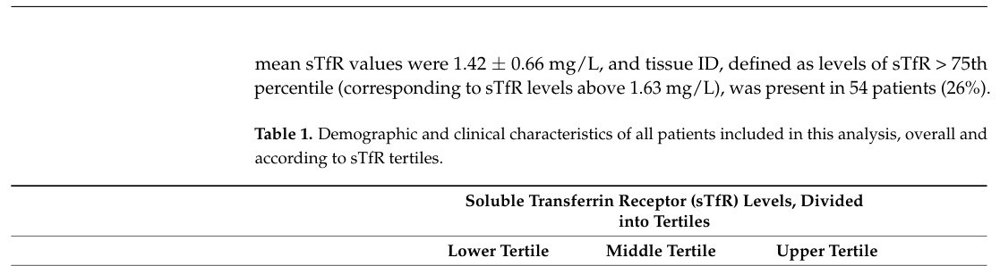

## Question

# Gene Research for Functional Annotation

## ⚠️ CRITICAL: Gene/Protein Identification Context

**BEFORE YOU BEGIN RESEARCH:** You MUST verify you are researching the CORRECT gene/protein. Gene symbols can be ambiguous, especially for less well-characterized genes from non-model organisms.

### Target Gene/Protein Identity (from UniProt):
- **UniProt Accession:** P02786
- **Protein Description:** RecName: Full=Transferrin receptor protein 1; Short=TR; Short=TfR; Short=TfR1; Short=Trfr; AltName: Full=T9; AltName: Full=p90; AltName: CD_antigen=CD71; Contains: RecName: Full=Transferrin receptor protein 1, serum form; Short=sTfR;
- **Gene Information:** Name=TFRC;
- **Organism (full):** Homo sapiens (Human).
- **Protein Family:** Belongs to the peptidase M28 family. M28B subfamily.
- **Key Domains:** PA_dom_sf. (IPR046450); PA_domain. (IPR003137); Peptidase_M28. (IPR007484); Peptidase_M28B. (IPR039373); TFR-like_dimer_dom. (IPR007365)

### MANDATORY VERIFICATION STEPS:

1. **Check if the gene symbol "TFRC" matches the protein description above**
2. **Verify the organism is correct:** Homo sapiens (Human).
3. **Check if protein family/domains align with what you find in literature**
4. **If you find literature for a DIFFERENT gene with the same or similar symbol, STOP**

### If Gene Symbol is Ambiguous or You Cannot Find Relevant Literature:

**DO NOT PROCEED WITH RESEARCH ON A DIFFERENT GENE.** Instead:
- State clearly: "The gene symbol 'TFRC' is ambiguous or literature is limited for this specific protein"
- Explain what you found (e.g., "Found extensive literature on a different gene with the same symbol in a different organism")
- Describe the protein based ONLY on the UniProt information provided above
- Suggest that the protein function can be inferred from domain/family information

### Research Target:

Please provide a comprehensive research report on the gene **TFRC** (gene ID: TFRC, UniProt: P02786) in human.

The research report should be a detailed narrative explaining the function, biological processes, and localization of the gene product. Citations should be given for all claims.

You should prioritize authoritative reviews and primary scientific literature when conducting research. You can supplement
this with annotations you find in gene/protein databases, but these can be outdated or inaccurate.

We are specifically interested in the primary function of the gene - for enzymes, what reaction is catalyzed, and what is the substrate specificity? For transporters, what is the substrate? For structural proteins or adapters, what is the broader structural role? For signaling molecules, what is the role in the pathway.

We are interested in where in or outside the cell the gene product carries out its function.

We are also interested in the signaling or biochemical pathways in which the gene functions. We are less interested in broad pleiotropic effects, except where these elucidate the precise role.

Include evidence where possible. We are interested in both experimental evidence as well as inference from structure, evolution, or bioinformatic analysis. Precise studies should be prioritized over high-throughput, where available.

## Output

Question: You are an expert researcher providing comprehensive, well-cited information.

Provide detailed information focusing on:
1. Key concepts and definitions with current understanding
2. Recent developments and latest research (prioritize 2023-2024 sources)
3. Current applications and real-world implementations
4. Expert opinions and analysis from authoritative sources
5. Relevant statistics and data from recent studies

Format as a comprehensive research report with proper citations. Include URLs and publication dates where available.
Always prioritize recent, authoritative sources and provide specific citations for all major claims.

# Gene Research for Functional Annotation

## ⚠️ CRITICAL: Gene/Protein Identification Context

**BEFORE YOU BEGIN RESEARCH:** You MUST verify you are researching the CORRECT gene/protein. Gene symbols can be ambiguous, especially for less well-characterized genes from non-model organisms.

### Target Gene/Protein Identity (from UniProt):
- **UniProt Accession:** P02786
- **Protein Description:** RecName: Full=Transferrin receptor protein 1; Short=TR; Short=TfR; Short=TfR1; Short=Trfr; AltName: Full=T9; AltName: Full=p90; AltName: CD_antigen=CD71; Contains: RecName: Full=Transferrin receptor protein 1, serum form; Short=sTfR;
- **Gene Information:** Name=TFRC;
- **Organism (full):** Homo sapiens (Human).
- **Protein Family:** Belongs to the peptidase M28 family. M28B subfamily.
- **Key Domains:** PA_dom_sf. (IPR046450); PA_domain. (IPR003137); Peptidase_M28. (IPR007484); Peptidase_M28B. (IPR039373); TFR-like_dimer_dom. (IPR007365)

### MANDATORY VERIFICATION STEPS:

1. **Check if the gene symbol "TFRC" matches the protein description above**
2. **Verify the organism is correct:** Homo sapiens (Human).
3. **Check if protein family/domains align with what you find in literature**
4. **If you find literature for a DIFFERENT gene with the same or similar symbol, STOP**

### If Gene Symbol is Ambiguous or You Cannot Find Relevant Literature:

**DO NOT PROCEED WITH RESEARCH ON A DIFFERENT GENE.** Instead:
- State clearly: "The gene symbol 'TFRC' is ambiguous or literature is limited for this specific protein"
- Explain what you found (e.g., "Found extensive literature on a different gene with the same symbol in a different organism")
- Describe the protein based ONLY on the UniProt information provided above
- Suggest that the protein function can be inferred from domain/family information

### Research Target:

Please provide a comprehensive research report on the gene **TFRC** (gene ID: TFRC, UniProt: P02786) in human.

The research report should be a detailed narrative explaining the function, biological processes, and localization of the gene product. Citations should be given for all claims.

You should prioritize authoritative reviews and primary scientific literature when conducting research. You can supplement
this with annotations you find in gene/protein databases, but these can be outdated or inaccurate.

We are specifically interested in the primary function of the gene - for enzymes, what reaction is catalyzed, and what is the substrate specificity? For transporters, what is the substrate? For structural proteins or adapters, what is the broader structural role? For signaling molecules, what is the role in the pathway.

We are interested in where in or outside the cell the gene product carries out its function.

We are also interested in the signaling or biochemical pathways in which the gene functions. We are less interested in broad pleiotropic effects, except where these elucidate the precise role.

Include evidence where possible. We are interested in both experimental evidence as well as inference from structure, evolution, or bioinformatic analysis. Precise studies should be prioritized over high-throughput, where available.

## Research report: Human **TFRC** (UniProt **P02786**) — Transferrin receptor protein 1 (TfR1/CD71)

### Scope and identity verification (critical)
The UniProt accession **P02786** corresponds to the **human TFRC gene product**, transferrin receptor protein 1, widely referred to as **TfR1** and the cell-surface marker **CD71**. A 2024 review on receptor-mediated transcytosis explicitly lists **“TfR, CD71, TFRC”** together, confirming the symbol-to-protein mapping in the relevant physiological context (blood–brain barrier transport). (haqqani2024receptormediatedtranscytosisfor pages 2-3)

### 1) Key concepts and definitions (current understanding)

#### 1.1 Canonical molecular function: transferrin-dependent iron uptake
**TfR1 is the major cell-surface receptor that mediates cellular iron import by binding diferric transferrin (holo‑Tf)** and internalizing the ligand–receptor complex. A 2024 review describes TfR1 as a **homodimeric transmembrane glycoprotein** formed by disulfide-linked ~90 kDa subunits and emphasizes that TfR1 **preferentially binds diferric transferrin** to form a complex that is internalized. (li2024pathophysiologicalaspectsof pages 5-6)

#### 1.2 Cellular mechanism and subcellular localization: clathrin-mediated endocytosis and recycling
The core trafficking cycle proceeds through **clathrin-mediated endocytosis** at the plasma membrane, **acidic endosomes** that trigger iron release, and **recycling** of the receptor–apotransferrin complex back to the cell surface.
* In a 2024 review, the Fe‑Tf–TfR1 complex is described as internalized via **clathrin-mediated endocytosis**, followed by iron release in **acidic endosomes (pH ≤ 5.5)**, then receptor recycling; the overall cycle is described as completing in approximately **10–20 minutes**. (li2024pathophysiologicalaspectsof pages 5-6)
* A 2024 BBB transcytosis review states that receptor-mediated endocytosis at the BBB predominantly occurs via **clathrin-mediated endocytosis** and identifies **TFRC/TfR (CD71)** as a key receptor in this class. (haqqani2024receptormediatedtranscytosisfor pages 2-3)

#### 1.3 Internalization motif (molecular definition relevant to genotype/phenotype)
A critical mechanistic concept is the **tyrosine-based internalization motif “YTRF”** in the cytoplasmic tail. In a 2024 human genetics/immunology study, TfR1-mediated iron uptake is described as receptor-mediated endocytosis regulated via the **YTRF motif**; variants affecting this region cause defective internalization. (aba2024anovelhomozygous pages 1-2, aba2024anovelhomozygous pages 4-5)

#### 1.4 Soluble transferrin receptor (sTfR)
The **soluble transferrin receptor (sTfR)** refers to a **circulating form** of the transferrin receptor generated by **proteolytic cleavage/shedding** of membrane TfR; it rises in **iron deficiency** and with **expanded erythropoiesis** because more receptor is expressed and shed. A recent synthesis notes that sTfR is clinically useful—often together with ferritin-based indices—yet **cutoffs are not standardized** across assays and populations. (polizzi2026recentadvancesin pages 10-11)

### 2) Recent developments and latest research (prioritizing 2023–2024)

#### 2.1 2024: TFRC germline variants as an inborn error of immunity (iron–immune crosstalk)
A 2024 *Journal of Clinical Immunology* report identifies a **new homozygous TFRC variant (c.64C>T; p.R22W)** causing **combined immunodeficiency (CID)** and shows it produces an internalization defect similar to the previously known **p.Y20H** founder variant. Key mechanistic findings include:
* **Impaired TfR1 internalization** (approximately **fourfold lower** internalization in patient T cells in the reported assays) with **increased steady-state surface TfR1**. (aba2024anovelhomozygous pages 4-5)
* Downstream immune consequences: impaired T-cell activation (failure to upregulate CD25/ICOS), defective T- and B-cell proliferation, increased activation-induced apoptosis, restricted clonal diversity, and metabolic defects including impaired **mitochondrial oxidative phosphorylation** in activated helper T cells. (aba2024anovelhomozygous pages 9-12, aba2024anovelhomozygous pages 4-5)
* Clinical phenotype in the described case includes recurrent infections (e.g., sinopulmonary), bronchiectasis, chronic cytopenias (neutropenia, thrombocytopenia), microcytic anemia, hypogammaglobulinemia, and reduced NK/Treg/MAIT populations. (aba2024anovelhomozygous pages 4-5)

This line of evidence strengthens the view that TFRC is not only an iron import receptor but also a **non-redundant immune-metabolic checkpoint** during lymphocyte activation and expansion. (aba2024anovelhomozygous pages 9-12, aba2024anovelhomozygous pages 1-2)

#### 2.2 2024: TFRC as a regulatory node in ferroptosis and therapy response
Multiple 2024 studies place TFRC at the intersection of iron uptake and **ferroptosis** (iron-dependent lipid peroxidation-driven cell death), with distinct upstream regulatory mechanisms:

**(a) Aging liver ischemia/reperfusion injury (Nature Communications, Jun 2024)**
* Older livers display increased oxidative stress/lipid peroxidation and increased **ACSL4 and TFRC** after reperfusion.
* The m6A demethylase **FTO** is downregulated in older livers; TFRC and ACSL4 are presented as **FTO targets**, with FTO overexpression mitigating injury by reducing ferroptosis via **m6A-dependent regulation of mRNA stability**.
* A translational angle is proposed where **nicotinamide mononucleotide** increases FTO activity and suppresses ferroptosis. (li2024ftodeficiencyin pages 1-2, li2024ftodeficiencyin pages 2-4)

**(b) Sorafenib resistance in hepatocellular carcinoma (J Exp Clin Cancer Res, Aug 2024)**
* A **CCT3/ACTN4/TFRC axis** is described in which CCT3 interacts with ACTN4 to **impair TFRC recycling back to the plasma membrane**, thereby reducing iron endocytosis and protecting cells from ferroptosis.
* CCT3 knockdown sensitizes HCC cells to sorafenib and increases sorafenib-induced ferroptosis; effects are supported by in vivo xenograft experiments. (zhu2024cct3actn4tfrcaxisprotects pages 1-2)

**(c) Breast cancer adriamycin resistance (FASEB Journal, Aug 2024)**
* **HIF1α** is shown by dual-luciferase assay to act upstream of **TFRC**, and increasing HIF1α increases TFRC and ferroptosis-associated markers (Fe2+, MDA).
* Ferroptosis dependence is supported by rescue with **ferroptosis inhibitor Fer‑1** in the cellular model, linking TFRC-driven iron accumulation to therapy response. (yu2024hypoxia‐induciblefactor‐1αcan pages 1-2)

Collectively, these studies update TFRC’s functional annotation from “iron receptor” to a **conditionally actionable control point** for iron-dependent cell death programs in both injury and cancer contexts. (li2024ftodeficiencyin pages 1-2, zhu2024cct3actn4tfrcaxisprotects pages 1-2, yu2024hypoxia‐induciblefactor‐1αcan pages 1-2)

### 3) Current applications and real-world implementations

#### 3.1 TFRC/TfR1 targeting for blood–brain barrier delivery (receptor-mediated transcytosis)
TfR1 is a leading target for **receptor-mediated transcytosis (RMT)** strategies to shuttle biologics across the BBB.
* A 2024 review explains the RMT concept and includes **TFRC/TfR** among the best-studied BBB receptors; it also emphasizes that such receptors commonly internalize through **clathrin-mediated endocytosis** and then traffic through intracellular compartments before release on the abluminal side. (haqqani2024receptormediatedtranscytosisfor pages 2-3)
* A TfR1-focused review (2025, included here for engineering detail) highlights key design constraints for TfR1 shuttles: favoring **monovalent and moderate-affinity** binding, **pH-dependent dissociation** in early endosomes, and avoiding multivalent clustering that drives lysosomal capture; it also notes evaluation platforms such as **human iPSC-derived BBB models** and microvessel systems. (shen2025targetingtransferrinreceptor pages 6-8)

#### 3.2 Cancer-targeted delivery exploiting CD71/TfR1 overexpression
A 2024 review on transferrin-based delivery catalogs multiple Tf/TfR1-targeted platforms used experimentally for tumor delivery, including **Tf–drug conjugates, Tf-modified nanoparticles, liposomes, microemulsions, and toxin conjugates**, leveraging the rapid TfR1 trafficking cycle (~10–20 min) to enhance uptake. (li2024pathophysiologicalaspectsof pages 8-9, li2024pathophysiologicalaspectsof pages 6-8, li2024pathophysiologicalaspectsof pages 5-6)

A 2024 experimental nanomaterial study demonstrates an implementation conceptually aligned with TFRC biology: **transferrin-derived carbon dots** selectively bind **CD71** on HL60 leukemia cells and trigger **clathrin-dependent endocytosis**, positioning such particles as candidates for imaging/biosensing and targeted uptake applications. (strickland2024cancercelltargeting pages 1-2)

### 4) Expert opinions / analysis from authoritative sources

#### 4.1 “Lessons learned” in TFRC/TfR1 BBB targeting
Authoritative BBB delivery analyses emphasize that merely binding TfR1 is insufficient; effective delivery depends on controlling **intracellular trafficking fate** (recycling/transcytosis vs lysosomal degradation). The design principles described (monovalency, moderate affinity, pH-sensitive dissociation, epitope selection, ligand density) reflect expert consensus in the RMT field and are intended to mitigate well-recognized issues like endosomal/lysosomal trapping and limited productive transcytosis. (shen2025targetingtransferrinreceptor pages 6-8)

#### 4.2 TFRC as an immune-metabolic checkpoint
The 2024 CID genetics report provides mechanistic evidence supporting an expert interpretation: TFRC function is not interchangeable in activated lymphocytes because TfR1 internalization is needed to supply iron for proliferation and mitochondrial metabolism; partial rescue by exogenous iron sources reinforces the causal iron-dependence. (aba2024anovelhomozygous pages 9-12, aba2024anovelhomozygous pages 4-5)

### 5) Statistics and data from recent studies

#### 5.1 sTfR as a clinical biomarker (2023 cohort with quantitative associations)
A 2023 prospective observational cohort analysis in chronic heart failure (HF) (final analyzed cohort **n=215**, selected for normal hemoglobin and normal systemic iron markers) used **sTfR** to define “tissue iron deficiency” (because standardized cutoffs are lacking).
* The authors define tissue iron deficiency as **sTfR > 75th percentile = 1.63 mg/L**; sTfR tertiles were **<1.11**, **1.11–1.45**, and **≥1.46 mg/L**, with ~**26%** meeting the >75th percentile definition. (rasjimenez2023solubletransferrinreceptor pages 3-5, rasjimenez2023solubletransferrinreceptor media 424abe75)
* Patients meeting the tissue iron deficiency definition had markedly worse functional capacity: **6-minute walk test (6MWT)** distance **206 ± 179 m vs 314 ± 155 m** (p < 0.0001). (rasjimenez2023solubletransferrinreceptor pages 1-2, rasjimenez2023solubletransferrinreceptor media 424abe75)
* Quality of life was worse: Minnesota Living with HF Questionnaire overall summary score **51 ± 27 vs 39 ± 20** (p = 0.006). (rasjimenez2023solubletransferrinreceptor pages 1-2)
* Regression results: log sTfR standardized β = **−0.135** (p = 0.010) in multivariable models for 6MWT distance; tissue ID (sTfR > 1.63 mg/L) multivariable standardized β = **−0.176** (p = 0.001). Odds ratios for impaired exercise capacity included OR **2.8** (1.44–5.43) for tissue ID (p = 0.002). (rasjimenez2023solubletransferrinreceptor pages 5-7)

These data illustrate a real-world deployment of TFRC biology via its soluble ectodomain biomarker and underscore the practical issue that sTfR thresholds are often cohort- and assay-specific. (rasjimenez2023solubletransferrinreceptor pages 2-3, rasjimenez2023solubletransferrinreceptor pages 3-5)

---

## Integrated summary table
| Topic | Key recent finding | Evidence type/model | Practical implication | Primary citations (pqac IDs) |
|---|---|---|---|---|
| TFRC/TfR1 core function and trafficking | Human TFRC encodes TfR1/CD71, a homodimeric type II transmembrane receptor that binds diferric transferrin, internalizes via clathrin/AP-2-mediated endocytosis, releases iron in acidic endosomes, and recycles apo-transferrin/TfR1 to the surface; the cytoplasmic YTRF motif is critical for internalization. | Mechanistic reviews and human disease-focused primary study; receptor biology and trafficking synthesis. | Establishes the primary molecular function for functional annotation: transferrin-dependent cellular iron import coupled to rapid endocytic recycling, with the YTRF motif explaining trafficking-sensitive pathogenic variants and engineering opportunities. | (aba2024anovelhomozygous pages 1-2, li2024pathophysiologicalaspectsof pages 5-6, shen2025targetingtransferrinreceptor pages 4-5, haqqani2024receptormediatedtranscytosisfor pages 2-3) |
| 2024 immune deficiency findings | A new homozygous TFRC p.R22W variant, alongside known p.Y20H, disrupts the YTRF-region internalization machinery, increases surface TfR1, impairs receptor shuttling/iron uptake, and causes combined immunodeficiency with defective T/B-cell activation, restricted clonal diversity, hypogammaglobulinemia, cytopenias, recurrent infections, and reduced NK/Treg/MAIT cells; some proliferative defects were partially rescued by exogenous iron. | 2024 human genetics and immunology study in patient cells, engineered HEK293T constructs, flow cytometry, Seahorse metabolic assays, transcriptomics. | Shows TfR1 is not only an iron receptor but a nonredundant immune-metabolic checkpoint; supports TFRC inclusion in inborn error of immunity workups and motivates iron-uptake rescue or HSCT-based management strategies. | (aba2024anovelhomozygous pages 9-12, aba2024anovelhomozygous pages 2-4, aba2024anovelhomozygous pages 1-2, aba2024anovelhomozygous pages 4-5) |
| 2024 ferroptosis-related regulatory axes | Multiple 2024 studies place TFRC as a positive ferroptosis node: reduced FTO increases m6A-dependent stability of Tfrc/Acsl4 transcripts in aged liver I/R injury; CCT3-ACTN4 limits TFRC recycling to the plasma membrane and thereby suppresses iron endocytosis/ferroptosis in sorafenib-resistant HCC; HIF1A transcriptionally upregulates TFRC in breast cancer, increasing Fe2+ and lipid peroxidation and restoring Adriamycin sensitivity. | 2024 primary mechanistic studies using mouse liver I/R models, primary hepatocytes, HCC cell lines/xenografts, breast cancer clinical samples/cell models, dual-luciferase assays, ferroptosis rescue assays. | Identifies TFRC trafficking/expression as a therapeutically actionable lever for ferroptosis modulation in cancer and ischemia-reperfusion injury, including overcoming drug resistance. | (li2024ftodeficiencyin pages 1-2, zhu2024cct3actn4tfrcaxisprotects pages 1-2, yu2024hypoxia‐induciblefactor‐1αcan pages 1-2, li2024ftodeficiencyin pages 2-4) |
| Applications: BBB targeting, cancer delivery, sTfR biomarker | TfR1 remains a major receptor-mediated transcytosis target at the BBB; successful design principles emphasize monovalent/moderate-affinity binding, pH-dependent dissociation, recycling-biased epitopes, and controlled ligand density to avoid lysosomal trapping. Cancer implementations include transferrin- or anti-TfR1-based nanoparticles, liposomes, micelles, toxin conjugates, and protein-derived carbon dots. Soluble TfR (sTfR) serves as a clinical marker of tissue iron demand/erythropoiesis; in a 2023 HF cohort, a pragmatic cutoff of >1.63 mg/L identified patients with worse 6MWT and quality-of-life outcomes. | 2024 delivery reviews, 2024 nanoparticle/cell-targeting study, 2023 prospective human heart-failure cohort with regression analyses and figure/table support. | Guides translational use of TFRC in brain drug delivery and tumor targeting, while highlighting biomarker utility of sTfR and the lack of universally standardized cutoffs. | (li2024pathophysiologicalaspectsof pages 8-9, li2024pathophysiologicalaspectsof pages 9-10, strickland2024cancercelltargeting pages 1-2, shen2025targetingtransferrinreceptor pages 6-8, rasjimenez2023solubletransferrinreceptor pages 1-2, rasjimenez2023solubletransferrinreceptor pages 5-7, rasjimenez2023solubletransferrinreceptor media 424abe75) |

*Table: This table condenses the most important TFRC/TfR1 findings for functional annotation, recent mechanistic advances, and translational relevance. It is useful as a quick-reference summary linking core biology to 2024 immune and ferroptosis studies and current application areas.*

---

## Limitations of this tool-based synthesis
* The UniProt note that TFRC “belongs to the peptidase M28 family / M28B subfamily” and detailed domain architecture were not directly evidenced in the retrieved full-text excerpts; the functional annotation here is therefore grounded in contemporary literature describing TfR1 biology and clinically validated phenotypes rather than domain-family claims.
* Evidence for the **biochemical identity of the sheddase(s)** that generate sTfR (e.g., specific proteases such as ADAM family members) was not captured in the curated evidence snippets used above; the report therefore states sTfR as a proteolytically released form without assigning a specific protease.

## Key URLs (with publication dates)
* Haqqani AS et al. *Frontiers in Drug Delivery* (Mar 2024): https://doi.org/10.3389/fddev.2024.1360302 (haqqani2024receptormediatedtranscytosisfor pages 2-3)
* Li C et al. *Frontiers in Pharmacology* (Mar 2024): https://doi.org/10.3389/fphar.2024.1342181 (li2024pathophysiologicalaspectsof pages 5-6, li2024pathophysiologicalaspectsof pages 8-9)
* Aba Ü et al. *Journal of Clinical Immunology* (Jan 2024): https://doi.org/10.1007/s10875-024-01658-0 (aba2024anovelhomozygous pages 4-5)
* Li R et al. *Nature Communications* (Jun 2024): https://doi.org/10.1038/s41467-024-49202-3 (li2024ftodeficiencyin pages 1-2)
* Zhu H et al. *J Exp Clin Cancer Res* (Aug 2024): https://doi.org/10.1186/s13046-024-03169-7 (zhu2024cct3actn4tfrcaxisprotects pages 1-2)
* Yu X et al. *FASEB Journal* (Aug 2024): https://doi.org/10.1096/fj.202401119r (yu2024hypoxia‐induciblefactor‐1αcan pages 1-2)
* Ras-Jiménez MM et al. *Journal of Personalized Medicine* (Aug 2023): https://doi.org/10.3390/jpm13081282 (rasjimenez2023solubletransferrinreceptor pages 1-2)
* Strickland S et al. *ACS Omega* (Jan 2024): https://doi.org/10.1021/acsomega.3c07744 (strickland2024cancercelltargeting pages 1-2)
* Bu X & Wang L. *International Journal of Molecular Medicine* (Dec 2024): https://doi.org/10.3892/ijmm.2024.5480 (bu2024ironmetabolismand pages 4-5)

References

1. (haqqani2024receptormediatedtranscytosisfor pages 2-3): Arsalan S. Haqqani, Kasandra Bélanger, and Danica B. Stanimirovic. Receptor-mediated transcytosis for brain delivery of therapeutics: receptor classes and criteria. Frontiers in Drug Delivery, Mar 2024. URL: https://doi.org/10.3389/fddev.2024.1360302, doi:10.3389/fddev.2024.1360302. This article has 123 citations.

2. (li2024pathophysiologicalaspectsof pages 5-6): Chang Li, Liya Zhou, and Xunzhe Yin. Pathophysiological aspects of transferrin-a potential nano-based drug delivery signaling molecule in therapeutic target for varied diseases. Frontiers in Pharmacology, Mar 2024. URL: https://doi.org/10.3389/fphar.2024.1342181, doi:10.3389/fphar.2024.1342181. This article has 33 citations.

3. (aba2024anovelhomozygous pages 1-2): Ümran Aba, İbrahim Cemal Maslak, Canberk İpşir, Damla Pehlivan, Nicholas I. Warnock, Damon J. Tumes, Gökhan Cildir, and Baran Erman. A novel homozygous germline mutation in transferrin receptor 1 (tfr1) leads to combined immunodeficiency and provides new insights into iron-immunity axis. Journal of Clinical Immunology, Jan 2024. URL: https://doi.org/10.1007/s10875-024-01658-0, doi:10.1007/s10875-024-01658-0. This article has 16 citations and is from a domain leading peer-reviewed journal.

4. (aba2024anovelhomozygous pages 4-5): Ümran Aba, İbrahim Cemal Maslak, Canberk İpşir, Damla Pehlivan, Nicholas I. Warnock, Damon J. Tumes, Gökhan Cildir, and Baran Erman. A novel homozygous germline mutation in transferrin receptor 1 (tfr1) leads to combined immunodeficiency and provides new insights into iron-immunity axis. Journal of Clinical Immunology, Jan 2024. URL: https://doi.org/10.1007/s10875-024-01658-0, doi:10.1007/s10875-024-01658-0. This article has 16 citations and is from a domain leading peer-reviewed journal.

5. (polizzi2026recentadvancesin pages 10-11): Alessandro Polizzi. Recent advances in research on iron metabolism, ferritin, and hepcidin. International Journal of Molecular Sciences, 27(2):906, Jan 2026. URL: https://doi.org/10.3390/ijms27020906, doi:10.3390/ijms27020906. This article has 2 citations.

6. (aba2024anovelhomozygous pages 9-12): Ümran Aba, İbrahim Cemal Maslak, Canberk İpşir, Damla Pehlivan, Nicholas I. Warnock, Damon J. Tumes, Gökhan Cildir, and Baran Erman. A novel homozygous germline mutation in transferrin receptor 1 (tfr1) leads to combined immunodeficiency and provides new insights into iron-immunity axis. Journal of Clinical Immunology, Jan 2024. URL: https://doi.org/10.1007/s10875-024-01658-0, doi:10.1007/s10875-024-01658-0. This article has 16 citations and is from a domain leading peer-reviewed journal.

7. (li2024ftodeficiencyin pages 1-2): Rong Li, Xijing Yan, Cuicui Xiao, Tingting Wang, Xuejiao Li, Zhongying Hu, Jinliang Liang, Jiebin Zhang, Jianye Cai, Xin Sui, Qiuli Liu, Manli Wu, Jiaqi Xiao, Haitian Chen, Yasong Liu, Chenhao Jiang, Guoshi Lv, Gui-huo Chen, Yingcai Zhang, Jia Yao, Jun Zheng, and Yang Yang. Fto deficiency in older livers exacerbates ferroptosis during ischaemia/reperfusion injury by upregulating acsl4 and tfrc. Nature Communications, Jun 2024. URL: https://doi.org/10.1038/s41467-024-49202-3, doi:10.1038/s41467-024-49202-3. This article has 84 citations and is from a highest quality peer-reviewed journal.

8. (li2024ftodeficiencyin pages 2-4): Rong Li, Xijing Yan, Cuicui Xiao, Tingting Wang, Xuejiao Li, Zhongying Hu, Jinliang Liang, Jiebin Zhang, Jianye Cai, Xin Sui, Qiuli Liu, Manli Wu, Jiaqi Xiao, Haitian Chen, Yasong Liu, Chenhao Jiang, Guoshi Lv, Gui-huo Chen, Yingcai Zhang, Jia Yao, Jun Zheng, and Yang Yang. Fto deficiency in older livers exacerbates ferroptosis during ischaemia/reperfusion injury by upregulating acsl4 and tfrc. Nature Communications, Jun 2024. URL: https://doi.org/10.1038/s41467-024-49202-3, doi:10.1038/s41467-024-49202-3. This article has 84 citations and is from a highest quality peer-reviewed journal.

9. (zhu2024cct3actn4tfrcaxisprotects pages 1-2): Huihui Zhu, Qiuhong Liu, Qinna Meng, Lingjian Zhang, Siwei Ju, Jiaheng Lang, Danhua Zhu, Yongxia Chen, Nadire Aishan, Xiaoxi Ouyang, Sainan Zhang, Lidan Jin, Lanlan Xiao, Linbo Wang, Lanjuan Li, and Feiyang Ji. Cct3/actn4/tfrc axis protects hepatocellular carcinoma cells from ferroptosis by inhibiting iron endocytosis. Journal of Experimental & Clinical Cancer Research : CR, Aug 2024. URL: https://doi.org/10.1186/s13046-024-03169-7, doi:10.1186/s13046-024-03169-7. This article has 29 citations.

10. (yu2024hypoxia‐induciblefactor‐1αcan pages 1-2): Xiaojie Yu, Qingqun Guo, Haojie Zhang, Xiaohong Wang, Yong Han, and Zhenlin Yang. Hypoxia‐inducible factor‐1α can reverse the adriamycin resistance of breast cancer adjuvant chemotherapy by upregulating transferrin receptor and activating ferroptosis. The FASEB Journal, Aug 2024. URL: https://doi.org/10.1096/fj.202401119r, doi:10.1096/fj.202401119r. This article has 18 citations.

11. (shen2025targetingtransferrinreceptor pages 6-8): Xinai Shen, Huan Li, Beiyu Zhang, Yunan Li, and Zheying Zhu. Targeting transferrin receptor 1 for enhancing drug delivery through the blood–brain barrier for alzheimer’s disease. International Journal of Molecular Sciences, 26:9793, Oct 2025. URL: https://doi.org/10.3390/ijms26199793, doi:10.3390/ijms26199793. This article has 18 citations.

12. (li2024pathophysiologicalaspectsof pages 8-9): Chang Li, Liya Zhou, and Xunzhe Yin. Pathophysiological aspects of transferrin-a potential nano-based drug delivery signaling molecule in therapeutic target for varied diseases. Frontiers in Pharmacology, Mar 2024. URL: https://doi.org/10.3389/fphar.2024.1342181, doi:10.3389/fphar.2024.1342181. This article has 33 citations.

13. (li2024pathophysiologicalaspectsof pages 6-8): Chang Li, Liya Zhou, and Xunzhe Yin. Pathophysiological aspects of transferrin-a potential nano-based drug delivery signaling molecule in therapeutic target for varied diseases. Frontiers in Pharmacology, Mar 2024. URL: https://doi.org/10.3389/fphar.2024.1342181, doi:10.3389/fphar.2024.1342181. This article has 33 citations.

14. (strickland2024cancercelltargeting pages 1-2): Sara Strickland, Mychele Jorns, Luke Fourroux, Lindsey Heyd, and Dimitri Pappas. Cancer cell targeting via selective transferrin receptor labeling using protein-derived carbon dots. ACS Omega, 9:2707-2718, Jan 2024. URL: https://doi.org/10.1021/acsomega.3c07744, doi:10.1021/acsomega.3c07744. This article has 23 citations and is from a peer-reviewed journal.

15. (rasjimenez2023solubletransferrinreceptor pages 3-5): Maria del Mar Ras-Jiménez, Raúl Ramos-Polo, Josep Francesch Manzano, Miriam Corbella Santano, Herminio Morillas Climent, Núria Jose-Bazán, Santiago Jiménez-Marrero, Paloma Garcimartin Cerezo, Sergi Yun Viladomat, Pedro Moliner Borja, Blanca Torres Cardús, José Maria Verdú-Rotellar, Carles Diez-López, José González-Costello, Elena García-Romero, Fernando de Frutos Seminario, Laura Triguero-Llonch, Cristina Enjuanes Grau, Marta Tajes Orduña, and Josep Comin-Colet. Soluble transferrin receptor as iron deficiency biomarker: impact on exercise capacity in heart failure patients. Journal of Personalized Medicine, 13:1282, Aug 2023. URL: https://doi.org/10.3390/jpm13081282, doi:10.3390/jpm13081282. This article has 7 citations.

16. (rasjimenez2023solubletransferrinreceptor media 424abe75): Maria del Mar Ras-Jiménez, Raúl Ramos-Polo, Josep Francesch Manzano, Miriam Corbella Santano, Herminio Morillas Climent, Núria Jose-Bazán, Santiago Jiménez-Marrero, Paloma Garcimartin Cerezo, Sergi Yun Viladomat, Pedro Moliner Borja, Blanca Torres Cardús, José Maria Verdú-Rotellar, Carles Diez-López, José González-Costello, Elena García-Romero, Fernando de Frutos Seminario, Laura Triguero-Llonch, Cristina Enjuanes Grau, Marta Tajes Orduña, and Josep Comin-Colet. Soluble transferrin receptor as iron deficiency biomarker: impact on exercise capacity in heart failure patients. Journal of Personalized Medicine, 13:1282, Aug 2023. URL: https://doi.org/10.3390/jpm13081282, doi:10.3390/jpm13081282. This article has 7 citations.

17. (rasjimenez2023solubletransferrinreceptor pages 1-2): Maria del Mar Ras-Jiménez, Raúl Ramos-Polo, Josep Francesch Manzano, Miriam Corbella Santano, Herminio Morillas Climent, Núria Jose-Bazán, Santiago Jiménez-Marrero, Paloma Garcimartin Cerezo, Sergi Yun Viladomat, Pedro Moliner Borja, Blanca Torres Cardús, José Maria Verdú-Rotellar, Carles Diez-López, José González-Costello, Elena García-Romero, Fernando de Frutos Seminario, Laura Triguero-Llonch, Cristina Enjuanes Grau, Marta Tajes Orduña, and Josep Comin-Colet. Soluble transferrin receptor as iron deficiency biomarker: impact on exercise capacity in heart failure patients. Journal of Personalized Medicine, 13:1282, Aug 2023. URL: https://doi.org/10.3390/jpm13081282, doi:10.3390/jpm13081282. This article has 7 citations.

18. (rasjimenez2023solubletransferrinreceptor pages 5-7): Maria del Mar Ras-Jiménez, Raúl Ramos-Polo, Josep Francesch Manzano, Miriam Corbella Santano, Herminio Morillas Climent, Núria Jose-Bazán, Santiago Jiménez-Marrero, Paloma Garcimartin Cerezo, Sergi Yun Viladomat, Pedro Moliner Borja, Blanca Torres Cardús, José Maria Verdú-Rotellar, Carles Diez-López, José González-Costello, Elena García-Romero, Fernando de Frutos Seminario, Laura Triguero-Llonch, Cristina Enjuanes Grau, Marta Tajes Orduña, and Josep Comin-Colet. Soluble transferrin receptor as iron deficiency biomarker: impact on exercise capacity in heart failure patients. Journal of Personalized Medicine, 13:1282, Aug 2023. URL: https://doi.org/10.3390/jpm13081282, doi:10.3390/jpm13081282. This article has 7 citations.

19. (rasjimenez2023solubletransferrinreceptor pages 2-3): Maria del Mar Ras-Jiménez, Raúl Ramos-Polo, Josep Francesch Manzano, Miriam Corbella Santano, Herminio Morillas Climent, Núria Jose-Bazán, Santiago Jiménez-Marrero, Paloma Garcimartin Cerezo, Sergi Yun Viladomat, Pedro Moliner Borja, Blanca Torres Cardús, José Maria Verdú-Rotellar, Carles Diez-López, José González-Costello, Elena García-Romero, Fernando de Frutos Seminario, Laura Triguero-Llonch, Cristina Enjuanes Grau, Marta Tajes Orduña, and Josep Comin-Colet. Soluble transferrin receptor as iron deficiency biomarker: impact on exercise capacity in heart failure patients. Journal of Personalized Medicine, 13:1282, Aug 2023. URL: https://doi.org/10.3390/jpm13081282, doi:10.3390/jpm13081282. This article has 7 citations.

20. (shen2025targetingtransferrinreceptor pages 4-5): Xinai Shen, Huan Li, Beiyu Zhang, Yunan Li, and Zheying Zhu. Targeting transferrin receptor 1 for enhancing drug delivery through the blood–brain barrier for alzheimer’s disease. International Journal of Molecular Sciences, 26:9793, Oct 2025. URL: https://doi.org/10.3390/ijms26199793, doi:10.3390/ijms26199793. This article has 18 citations.

21. (aba2024anovelhomozygous pages 2-4): Ümran Aba, İbrahim Cemal Maslak, Canberk İpşir, Damla Pehlivan, Nicholas I. Warnock, Damon J. Tumes, Gökhan Cildir, and Baran Erman. A novel homozygous germline mutation in transferrin receptor 1 (tfr1) leads to combined immunodeficiency and provides new insights into iron-immunity axis. Journal of Clinical Immunology, Jan 2024. URL: https://doi.org/10.1007/s10875-024-01658-0, doi:10.1007/s10875-024-01658-0. This article has 16 citations and is from a domain leading peer-reviewed journal.

22. (li2024pathophysiologicalaspectsof pages 9-10): Chang Li, Liya Zhou, and Xunzhe Yin. Pathophysiological aspects of transferrin-a potential nano-based drug delivery signaling molecule in therapeutic target for varied diseases. Frontiers in Pharmacology, Mar 2024. URL: https://doi.org/10.3389/fphar.2024.1342181, doi:10.3389/fphar.2024.1342181. This article has 33 citations.

23. (bu2024ironmetabolismand pages 4-5): Xiaorui Bu and Lufang Wang. Iron metabolism and the tumor microenvironment: a new perspective on cancer intervention and therapy (review). International Journal of Molecular Medicine, Dec 2024. URL: https://doi.org/10.3892/ijmm.2024.5480, doi:10.3892/ijmm.2024.5480. This article has 38 citations and is from a peer-reviewed journal.

## Artifacts

- [Edison artifact artifact-00](TFRC-deep-research-falcon_artifacts/artifact-00.md)

## Citations

1. haqqani2024receptormediatedtranscytosisfor pages 2-3
2. li2024pathophysiologicalaspectsof pages 5-6
3. polizzi2026recentadvancesin pages 10-11
4. aba2024anovelhomozygous pages 4-5
5. shen2025targetingtransferrinreceptor pages 6-8
6. strickland2024cancercelltargeting pages 1-2
7. rasjimenez2023solubletransferrinreceptor pages 1-2
8. rasjimenez2023solubletransferrinreceptor pages 5-7
9. li2024ftodeficiencyin pages 1-2
10. bu2024ironmetabolismand pages 4-5
11. aba2024anovelhomozygous pages 1-2
12. aba2024anovelhomozygous pages 9-12
13. li2024ftodeficiencyin pages 2-4
14. li2024pathophysiologicalaspectsof pages 8-9
15. li2024pathophysiologicalaspectsof pages 6-8
16. rasjimenez2023solubletransferrinreceptor pages 3-5
17. rasjimenez2023solubletransferrinreceptor pages 2-3
18. shen2025targetingtransferrinreceptor pages 4-5
19. aba2024anovelhomozygous pages 2-4
20. li2024pathophysiologicalaspectsof pages 9-10
21. https://doi.org/10.3389/fddev.2024.1360302
22. https://doi.org/10.3389/fphar.2024.1342181
23. https://doi.org/10.1007/s10875-024-01658-0
24. https://doi.org/10.1038/s41467-024-49202-3
25. https://doi.org/10.1186/s13046-024-03169-7
26. https://doi.org/10.1096/fj.202401119r
27. https://doi.org/10.3390/jpm13081282
28. https://doi.org/10.1021/acsomega.3c07744
29. https://doi.org/10.3892/ijmm.2024.5480
30. https://doi.org/10.3389/fddev.2024.1360302,
31. https://doi.org/10.3389/fphar.2024.1342181,
32. https://doi.org/10.1007/s10875-024-01658-0,
33. https://doi.org/10.3390/ijms27020906,
34. https://doi.org/10.1038/s41467-024-49202-3,
35. https://doi.org/10.1186/s13046-024-03169-7,
36. https://doi.org/10.1096/fj.202401119r,
37. https://doi.org/10.3390/ijms26199793,
38. https://doi.org/10.1021/acsomega.3c07744,
39. https://doi.org/10.3390/jpm13081282,
40. https://doi.org/10.3892/ijmm.2024.5480,