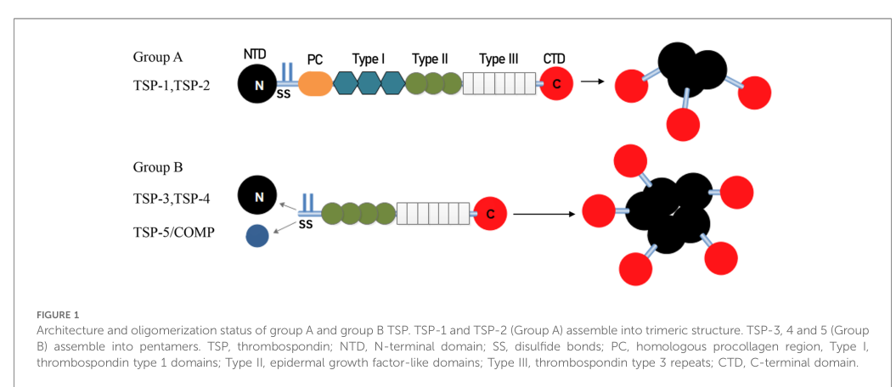

## Question

# Gene Research for Functional Annotation

## ⚠️ CRITICAL: Gene/Protein Identification Context

**BEFORE YOU BEGIN RESEARCH:** You MUST verify you are researching the CORRECT gene/protein. Gene symbols can be ambiguous, especially for less well-characterized genes from non-model organisms.

### Target Gene/Protein Identity (from UniProt):
- **UniProt Accession:** P07996
- **Protein Description:** RecName: Full=Thrombospondin-1; AltName: Full=Glycoprotein G {ECO:0000303|PubMed:6777381}; Flags: Precursor;
- **Gene Information:** Name=THBS1 {ECO:0000312|HGNC:HGNC:11785}; Synonyms=TSP, TSP1;
- **Organism (full):** Homo sapiens (Human).
- **Protein Family:** Belongs to the thrombospondin family. .
- **Key Domains:** ConA-like_dom_sf. (IPR013320); EGF-like_Ca-bd_dom. (IPR001881); EGF-like_dom. (IPR000742); Thrombospondin_3-like_rpt. (IPR003367); Thrombospondin_3_rpt. (IPR017897)

### MANDATORY VERIFICATION STEPS:

1. **Check if the gene symbol "THBS1" matches the protein description above**
2. **Verify the organism is correct:** Homo sapiens (Human).
3. **Check if protein family/domains align with what you find in literature**
4. **If you find literature for a DIFFERENT gene with the same or similar symbol, STOP**

### If Gene Symbol is Ambiguous or You Cannot Find Relevant Literature:

**DO NOT PROCEED WITH RESEARCH ON A DIFFERENT GENE.** Instead:
- State clearly: "The gene symbol 'THBS1' is ambiguous or literature is limited for this specific protein"
- Explain what you found (e.g., "Found extensive literature on a different gene with the same symbol in a different organism")
- Describe the protein based ONLY on the UniProt information provided above
- Suggest that the protein function can be inferred from domain/family information

### Research Target:

Please provide a comprehensive research report on the gene **THBS1** (gene ID: THBS1, UniProt: P07996) in human.

The research report should be a detailed narrative explaining the function, biological processes, and localization of the gene product. Citations should be given for all claims.

You should prioritize authoritative reviews and primary scientific literature when conducting research. You can supplement
this with annotations you find in gene/protein databases, but these can be outdated or inaccurate.

We are specifically interested in the primary function of the gene - for enzymes, what reaction is catalyzed, and what is the substrate specificity? For transporters, what is the substrate? For structural proteins or adapters, what is the broader structural role? For signaling molecules, what is the role in the pathway.

We are interested in where in or outside the cell the gene product carries out its function.

We are also interested in the signaling or biochemical pathways in which the gene functions. We are less interested in broad pleiotropic effects, except where these elucidate the precise role.

Include evidence where possible. We are interested in both experimental evidence as well as inference from structure, evolution, or bioinformatic analysis. Precise studies should be prioritized over high-throughput, where available.

## Output

Question: You are an expert researcher providing comprehensive, well-cited information.

Provide detailed information focusing on:
1. Key concepts and definitions with current understanding
2. Recent developments and latest research (prioritize 2023-2024 sources)
3. Current applications and real-world implementations
4. Expert opinions and analysis from authoritative sources
5. Relevant statistics and data from recent studies

Format as a comprehensive research report with proper citations. Include URLs and publication dates where available.
Always prioritize recent, authoritative sources and provide specific citations for all major claims.

# Gene Research for Functional Annotation

## ⚠️ CRITICAL: Gene/Protein Identification Context

**BEFORE YOU BEGIN RESEARCH:** You MUST verify you are researching the CORRECT gene/protein. Gene symbols can be ambiguous, especially for less well-characterized genes from non-model organisms.

### Target Gene/Protein Identity (from UniProt):
- **UniProt Accession:** P07996
- **Protein Description:** RecName: Full=Thrombospondin-1; AltName: Full=Glycoprotein G {ECO:0000303|PubMed:6777381}; Flags: Precursor;
- **Gene Information:** Name=THBS1 {ECO:0000312|HGNC:HGNC:11785}; Synonyms=TSP, TSP1;
- **Organism (full):** Homo sapiens (Human).
- **Protein Family:** Belongs to the thrombospondin family. .
- **Key Domains:** ConA-like_dom_sf. (IPR013320); EGF-like_Ca-bd_dom. (IPR001881); EGF-like_dom. (IPR000742); Thrombospondin_3-like_rpt. (IPR003367); Thrombospondin_3_rpt. (IPR017897)

### MANDATORY VERIFICATION STEPS:

1. **Check if the gene symbol "THBS1" matches the protein description above**
2. **Verify the organism is correct:** Homo sapiens (Human).
3. **Check if protein family/domains align with what you find in literature**
4. **If you find literature for a DIFFERENT gene with the same or similar symbol, STOP**

### If Gene Symbol is Ambiguous or You Cannot Find Relevant Literature:

**DO NOT PROCEED WITH RESEARCH ON A DIFFERENT GENE.** Instead:
- State clearly: "The gene symbol 'THBS1' is ambiguous or literature is limited for this specific protein"
- Explain what you found (e.g., "Found extensive literature on a different gene with the same symbol in a different organism")
- Describe the protein based ONLY on the UniProt information provided above
- Suggest that the protein function can be inferred from domain/family information

### Research Target:

Please provide a comprehensive research report on the gene **THBS1** (gene ID: THBS1, UniProt: P07996) in human.

The research report should be a detailed narrative explaining the function, biological processes, and localization of the gene product. Citations should be given for all claims.

You should prioritize authoritative reviews and primary scientific literature when conducting research. You can supplement
this with annotations you find in gene/protein databases, but these can be outdated or inaccurate.

We are specifically interested in the primary function of the gene - for enzymes, what reaction is catalyzed, and what is the substrate specificity? For transporters, what is the substrate? For structural proteins or adapters, what is the broader structural role? For signaling molecules, what is the role in the pathway.

We are interested in where in or outside the cell the gene product carries out its function.

We are also interested in the signaling or biochemical pathways in which the gene functions. We are less interested in broad pleiotropic effects, except where these elucidate the precise role.

Include evidence where possible. We are interested in both experimental evidence as well as inference from structure, evolution, or bioinformatic analysis. Precise studies should be prioritized over high-throughput, where available.

## Research report: Human **THBS1 / Thrombospondin‑1 (TSP‑1)** (UniProt **P07996**)

### 0) Mandatory target verification (gene/protein identity)
The target described (UniProt P07996) corresponds to **human thrombospondin‑1 (THBS1; TSP1)**, a **secreted matricellular (ECM-associated) glycoprotein** in the **Group A thrombospondin** subfamily that forms **trimers** in the extracellular space. (kaur2023whydohumans pages 3-4, pan2024themolecularmechanism pages 1-2)

### 1) Key concepts and definitions (current understanding)

#### 1.1 Matricellular protein concept
THBS1 encodes thrombospondin‑1, a prototypical **matricellular protein**: an extracellular protein that is not primarily structural but modulates **cell–matrix and cell–cell signaling** by binding receptors, growth factors, and ECM components. (kaur2023whydohumans pages 3-4, pan2024themolecularmechanism pages 1-2)

#### 1.2 Localization and where THBS1 acts
Recent cardiovascular-focused synthesis describes thrombospondins as **secreted extracellular** glycoproteins that are typically low at baseline and induced after tissue damage; THBS1 (TSP‑1) is a Group A thrombospondin acting at the **cell surface/ECM interface**. (pan2024themolecularmechanism pages 1-2)

#### 1.3 Domain architecture (annotation-relevant)
A 2024 review provides a domain-to-function map for Group A thrombospondins (TSP‑1/TSP‑2). The schematic and accompanying text define a canonical multi-domain architecture: **N-terminal domain (NTD)** → **procollagen-homology region (PC)** → **type I repeats (TSRs)** → **EGF-like/type II domains** → **type III repeats** → **C-terminal domain (CTD)**, where the **CTD contains a CD47-binding site** and **TSRs are necessary for binding latent TGF‑β and CD36**; NTD and EGF-like domains participate in **integrin interactions**. (pan2024themolecularmechanism media a02bfa76, pan2024themolecularmechanism pages 2-3)

**Figure evidence:** A schematic domain architecture indicating CTD–CD47 and TSR–TGF‑β/CD36 mapping is shown in Pan et al. 2024 (Figure 1). (pan2024themolecularmechanism media a02bfa76)

#### 1.4 Principal receptors/interaction partners (high-confidence)
Across recent sources, the best-supported receptor/ligand axis for core THBS1 signaling includes:
- **CD47**: THBS1 binds CD47 (via CTD) and triggers signaling that suppresses nitric oxide (NO) pathway effects. (kaur2023whydohumans pages 6-7, pan2024themolecularmechanism pages 2-3)
- **CD36**: THBS1 binds CD36 (via TSRs) and contributes to platelet and vascular effects; CD36 is also part of anti-angiogenic signaling. (kaur2023whydohumans pages 4-5, pan2024themolecularmechanism pages 2-3)
- **Integrins**: THBS1 binds multiple integrins; 2024 synthesis places integrin binding across NTD and EGF-like domains and highlights integrin involvement in endothelial migration/vascular remodeling. (pan2024themolecularmechanism pages 2-3)
- **Latent TGF‑β complex**: THBS1 is repeatedly described as a **major activator of latent TGF‑β1** in vivo, connecting THBS1 to canonical TGF‑β downstream signaling. (kaur2023whydohumans pages 6-7, pan2024themolecularmechanism pages 2-3)

### 2) Core molecular functions and pathways (functional annotation narrative)

#### 2.1 Activation of latent TGF‑β (primary biochemical role)
Multiple 2023–2024 sources characterize THBS1/TSP‑1 as a **major mediator/activator of latent TGF‑β**. This function positions THBS1 upstream of profibrotic and immunoregulatory programs (e.g., Smad signaling and downstream ECM remodeling). (kaur2023whydohumans pages 6-7, pan2024themolecularmechanism pages 2-3)

**Annotation-ready phrasing:** “Extracellular matricellular glycoprotein that binds the latent TGF‑β complex and promotes activation of TGF‑β signaling.” (kaur2023whydohumans pages 6-7, pan2024themolecularmechanism pages 2-3)

#### 2.2 CD47–NO–cGMP axis (vascular tone, stress physiology)
A 2023 expert review emphasizes that THBS1–CD47 signaling **antagonizes NO/cGMP-dependent signaling**, with consequences for vascular smooth muscle relaxation/vasodilation and ischemic survival. In this view, THBS1 contributes to cardiovascular stress responses by limiting NO’s vasodilatory and antithrombotic effects. (kaur2023whydohumans pages 6-7)

**Annotation-ready phrasing:** “Binds CD47 to inhibit NO-stimulated cGMP signaling in vascular cells, thereby modulating vascular tone and hemostatic responses.” (kaur2023whydohumans pages 6-7)

#### 2.3 Hemostasis/platelet biology
THBS1 is described as a major component of platelet α‑granules and is rapidly released at injury sites, supporting platelet activation, vasoconstriction, and thrombus formation (including via CD36 and via NO pathway suppression). (kaur2023whydohumans pages 3-4, kaur2023whydohumans pages 6-7)

#### 2.4 Cytoskeletal remodeling and epithelial restitution (Rho/Rac, focal adhesion dynamics)
A 2024 JCI Insight study in intestinal wound healing demonstrates THBS1-dependent epithelial restitution mechanisms and explicitly frames THBS1 effects on epithelial migration as dependent on both **CD47** and **TGF‑β1** signaling. The study assayed **SMAD2/3 phosphorylation** and used **RhoA and Rac1** pathway tools, consistent with THBS1 coordinating focal adhesion/cytoskeletal dynamics during restitution. (wilson2024criticalroleof pages 14-15, wilson2024criticalroleof pages 17-19)

#### 2.5 Pro-metastatic ECM signaling in cancer cells (TβRI–ITGAV complex)
A 2024 Oncogene study reports that in prostate cancer models, THBS1 is a prominent TGF‑β-induced secreted ECM protein and that THBS1 mediates migration/invasion by **interacting with integrin αV (ITGAV) and TGF‑β receptor I (TβRI)**; deletion of THBS1 or TβRI prevented migration and invasion in experimental systems. (mu2024thetβripromotes pages 1-2, mu2024thetβripromotes pages 10-11)

### 3) Recent developments and latest research (prioritize 2023–2024)

#### 3.1 Human genetics viewpoint: THBS1 as “loss-intolerant” and stress-response gene (2023)
Kaur & Roberts (2023) highlight that, despite viable Thbs1 knockout mice, human population genetics indicate THBS1 is **loss-intolerant**, and propose that THBS1’s essentiality in humans may reflect the need to survive **environmental stresses** encountered between birth and reproduction (e.g., injury and infection). (kaur2023whydohumans pages 1-3)

#### 3.2 Cardiovascular mechanistic synthesis (2024)
A 2024 cardiovascular review maps THBS1 domain architecture to receptor interactions (TSR–TGF‑β/CD36; CTD–CD47; integrin binding) and discusses downstream consequences including fibrosis-related signaling and stress pathways (e.g., ER stress/autophagy via PERK→ATF4, as reviewed). (pan2024themolecularmechanism pages 2-3)

#### 3.3 THBS1 in mucosal wound repair (2024)
Wilson et al. (2024) identify a **tissue-protective** role for epithelial THBS1 in intestinal mucosal wound repair, mechanistically coupled to CD47 and TGF‑β1 signaling and to cytoskeletal pathway interrogation (RhoA/Rac1; SMAD2/3). (wilson2024criticalroleof pages 14-15, wilson2024criticalroleof pages 17-19)

#### 3.4 THBS1 in obesity-associated diaphragm remodeling (2024)
Buras et al. (2024) interpret THBS1 as an obesity-associated matricellular mediator that promotes fibro-adipogenic stromal expansion and contractile dysfunction of the diaphragm, linking THBS1 to **TGF‑β-associated stromal remodeling**; Thbs1 loss was protective in their models. (buras2024thrombospondin1promotesfibroadipogenic pages 1-2)

### 4) Current applications and real-world implementations

#### 4.1 THBS1 as a circulating biomarker with prognostic performance (human cohort; 2024)
A 2024 BMC Medicine study in HBV-related acute-on-chronic liver failure (ACLF) presents THBS1 as a disease-severity-associated biomarker with clinically relevant prognostic performance.
- PBMC transcriptome study set drawn from **330 participants** (subset: ACLF=20; LC=10; CHB=10; NC=15) identified **THBS1 as the top differentially expressed gene** with marked upregulation in ACLF. (hassan2024thrombospondin1enhances pages 1-3)
- qPCR validation: ACLF=110; LC=60; CHB=60; NC=45. (hassan2024thrombospondin1enhances pages 1-3)
- Mortality prediction: **AUROC 0.8438 (28 days)** and **0.7778 (90 days)** (qPCR-based). (hassan2024thrombospondin1enhances pages 1-3)
- Plasma ELISA validation (expanded cohort: ACLF=198; LC=50; CHB=50; NC=50): correlation with ALT and γ-GT (**P=0.01**) and prognostic performance **AUROC 0.7445 (28 days)** and **0.7175 (90 days)**; an **optimal plasma THBS1 cut-off <28 µg/mL** was reported for identifying high-risk short-term mortality. (hassan2024thrombospondin1enhances pages 1-3)

These data support real-world implementation of THBS1 measurement as a risk-stratification biomarker in ACLF (pending external replication and clinical integration). (hassan2024thrombospondin1enhances pages 1-3)

#### 4.2 Therapeutic targeting concepts (preclinical-to-translational)
Multiple mechanistic frameworks imply tractable intervention points: blocking THBS1 interaction with **CD47**, **CD36**, integrins, or blocking **THBS1-mediated latent TGF‑β activation**. (kaur2023whydohumans pages 6-7, pan2024themolecularmechanism pages 2-3)

A patent landscape example includes inventions aiming to inhibit TGF‑β pathways (including THBS1-mediated activation as a target concept in this area), reflecting ongoing translational interest. (hassan2024thrombospondin1enhances pages 1-3)

ClinicalTrials.gov search results include historical trials of **ABT‑510** (a thrombospondin-1–derived anti-angiogenic peptidomimetic) in glioblastoma (Phase I; completed; NCT00584883), illustrating prior attempts to operationalize thrombospondin biology in oncology, although this is not specific to THBS1 inhibition and is not a current 2023–2024 development. (hassan2024thrombospondin1enhances pages 1-3)

### 5) Expert opinions and authoritative interpretation (2023–2024)
A key theme in recent authoritative synthesis is that THBS1 is **context-dependent**:
- **Protective/stress-response framing:** Human genetic loss-intolerance plus stress-challenge models support an interpretation that THBS1 contributes to survival under cardiovascular and immune stresses. (kaur2023whydohumans pages 1-3)
- **Pathogenic framing:** In multiple disease contexts, THBS1 can drive fibrosis-related signaling (via latent TGF‑β activation), pro-inflammatory signaling, or promote tumor cell invasion/migration in certain settings. (pan2024themolecularmechanism pages 2-3, mu2024thetβripromotes pages 10-11)
- **Tissue-specific functional framing:** THBS1 promotes epithelial restitution in intestinal injury models, underscoring that therapeutic targeting may require careful tissue and disease-context selection. (wilson2024criticalroleof pages 14-15)

### 6) Relevant statistics and data highlights (recent studies)
The strongest quantitative clinical dataset in the retrieved 2023–2024 literature is the ACLF biomarker study:
- AUROC values for mortality prediction (28-day and 90-day) from both PBMC expression and plasma levels, plus a plasma cutoff (<28 µg/mL), all with explicit cohort sizes. (hassan2024thrombospondin1enhances pages 1-3)

Additional quantitative sample-size evidence for mechanistic causality includes hepatocyte-specific Thbs1 knockout survival experiments (n=18/group) reported within the ACLF paper’s mechanistic validation. (hassan2024thrombospondin1enhances pages 11-14)

### 7) Practical functional-annotation summary (curated statements)
**Gene product:** Thrombospondin‑1 (THBS1; TSP‑1) is a secreted extracellular matricellular glycoprotein that forms trimers and contains TSR/type I repeats, EGF-like domains, and a C-terminal CD47-binding region. (pan2024themolecularmechanism pages 1-2, pan2024themolecularmechanism media a02bfa76, pan2024themolecularmechanism pages 2-3)

**Primary molecular functions (high-confidence):**
1. **Activates latent TGF‑β** (extracellular activation enabling downstream TGF‑β signaling). (kaur2023whydohumans pages 6-7, pan2024themolecularmechanism pages 2-3)
2. **Binds CD47** to suppress **NO/cGMP signaling** and modulate vascular responses and hemostasis. (kaur2023whydohumans pages 6-7)
3. **Binds CD36 and integrins** to regulate cell adhesion/migration and angiogenic responses (anti-angiogenic signaling is widely discussed). (kaur2023whydohumans pages 4-5, pan2024themolecularmechanism pages 2-3)

**Where it acts:** extracellular matrix/pericellular space, including sites of injury and tissue remodeling. (kaur2023whydohumans pages 3-4, pan2024themolecularmechanism pages 1-2)

### Evidence map (for quick review)
| Topic | Mechanism/claim | Key quantitative/statistical detail | System/disease context | Source (year; DOI/URL) |
|---|---|---|---|---|
| Identity, structure, receptors | THBS1/TSP1 is a secreted extracellular matricellular glycoprotein of the Group A thrombospondins that forms a trimer; key regions include N-terminal domain, procollagen-like region, type I/TSR repeats, EGF-like/type II domains, type III repeats, and a C-terminal domain with a CD47-binding site. TSRs bind latent TGF-β and CD36; N-terminus and EGF-like domains engage integrins. | Quantitative performance data not reported in the excerpt; structural summary is qualitative. | Core functional annotation / extracellular matrix signaling | Pan et al., 2024, Front Cardiovasc Med, doi:10.3389/fcvm.2024.1337586, https://doi.org/10.3389/fcvm.2024.1337586 (pan2024themolecularmechanism pages 2-3, pan2024themolecularmechanism pages 1-2, pan2024themolecularmechanism media a02bfa76) |
| CD47–NO/cGMP axis, hemostasis, stress response | THBS1 engages CD47 to inhibit nitric oxide/cGMP signaling, reducing vasodilation and supporting platelet activation/thrombus formation; CD36 also contributes to thrombus formation on collagen. Authors interpret THBS1 as important for surviving environmental stress, especially cardiovascular and immune challenges. | No explicit effect size given in the evidence snippet; mechanism emphasized as central to stress physiology. | Vascular homeostasis, ischemic stress, hemostasis | Kaur & Roberts, 2023, J Cell Commun Signal, doi:10.1007/s12079-023-00722-5, https://doi.org/10.1007/s12079-023-00722-5 (kaur2023whydohumans pages 3-4, kaur2023whydohumans pages 4-5, kaur2023whydohumans pages 6-7, kaur2023whydohumans pages 1-3) |
| Latent TGF-β activation / fibrosis signaling | THBS1 is a major activator of latent TGF-β in vivo; this links THBS1 to downstream Smad2/3 signaling, fibroblast activation, ECM remodeling, and fibrosis. | No single pooled statistic reported in the review excerpts. | Fibrosis, cardiovascular remodeling, immune regulation | Pan et al., 2024, Front Cardiovasc Med, doi:10.3389/fcvm.2024.1337586, https://doi.org/10.3389/fcvm.2024.1337586; Kaur & Roberts, 2023, doi:10.1007/s12079-023-00722-5, https://doi.org/10.1007/s12079-023-00722-5 (pan2024themolecularmechanism pages 4-6, kaur2023whydohumans pages 6-7) |
| Epithelial wound repair pathway | Exogenous THBS1 enhances intestinal epithelial migration in a CD47- and TGF-β1-dependent manner; the study assayed SMAD2/3 and RhoA/Rac1 signaling, supporting a mechanism involving focal adhesion and cytoskeletal remodeling during restitution. | Quantitative effect sizes were not included in the gathered snippets, but epithelial-specific loss of THBS1 impaired wound healing in vivo. | Intestinal mucosal wound repair | Wilson et al., 2024, JCI Insight, doi:10.1172/jci.insight.180608, https://doi.org/10.1172/jci.insight.180608 (wilson2024criticalroleof pages 14-15, wilson2024criticalroleof pages 17-19) |
| TGFβ receptor/integrin migratory complex | In prostate cancer cells, THBS1 is a major TGFβ-induced secreted ECM protein that interacts with ITGAV and TGFβ receptor I (TβRI); THBS1/ITGAV/TβRI colocalize at the leading edge and support migration, invasion, and metastasis. | No numerical hazard ratio or AUROC reported in the gathered snippets; qualitative mechanistic evidence from CRISPR/knockdown and xenograft experiments. | Prostate cancer metastasis | Mu et al., 2024, Oncogene, doi:10.1038/s41388-024-03165-3, https://doi.org/10.1038/s41388-024-03165-3 (mu2024thetβripromotes pages 5-7, mu2024thetβripromotes pages 1-2, mu2024thetβripromotes pages 10-11) |
| Biomarker performance in ACLF | THBS1 was the top significantly upregulated PBMC transcript in HBV-related ACLF and tracked disease severity, inflammation, and hepatocellular apoptosis; plasma THBS1 showed prognostic utility for short-term mortality. | Transcriptome subset: ACLF=20, LC=10, CHB=10, NC=15 within 330 COSSH participants. qPCR validation: ACLF=110, LC=60, CHB=60, NC=45. AUROC 0.8438 (28 d) and 0.7778 (90 d) for qPCR; plasma ELISA cohort ACLF=198, LC=50, CHB=50, NC=50 with AUROC 0.7445 (28 d) and 0.7175 (90 d); optimal plasma cutoff <28 µg/ml; correlation with ALT and γ-GT, P=0.01. | Acute-on-chronic liver failure (HBV-related) | Hassan et al., 2024, BMC Med, doi:10.1186/s12916-024-03318-x, https://doi.org/10.1186/s12916-024-03318-x (hassan2024thrombospondin1enhances pages 11-14, hassan2024thrombospondin1enhances pages 1-3) |
| Functional causality in liver failure model | Hepatocyte-specific THBS1 knockout improved survival and reduced inflammatory cytokines and hepatocyte apoptosis in experimental liver failure, supporting a pathogenic role for THBS1 in ACLF. | Survival study n=18/group over 48 h; serum/time-point analyses n=10 per time point; reported significance included ****P<0.0001 vs WT in the excerpt. | Experimental acute liver failure / ACLF mechanism | Hassan et al., 2024, BMC Med, doi:10.1186/s12916-024-03318-x, https://doi.org/10.1186/s12916-024-03318-x (hassan2024thrombospondin1enhances pages 11-14) |
| CKD-associated cardiac remodeling | THBS1 drives cardiac remodeling in CKD; murine CKD increased myocardial THBS1 with left ventricular hypertrophy, fibrosis, and dysfunction, while TSP1 knockout was protective. | Quantitative cohort or AUROC values were not provided in the gathered excerpt. | Chronic kidney disease–associated cardiovascular disease | Julovi et al., 2024, JACC Basic Transl Sci, doi:10.1016/j.jacbts.2024.01.010, https://doi.org/10.1016/j.jacbts.2024.01.010 (julovi2024thrombospondin1drivescardiac pages 1-2) |
| Obesity/fibro-adipogenic remodeling | THBS1 promotes fibro-adipogenic progenitor expansion and contractile dysfunction of the diaphragm in obesity through TGF-β-associated stromal remodeling; Thbs1 loss is protective. | No numeric effect size in the excerpt; authors describe THBS1 as a necessary mediator and potential therapeutic target. | Obesity-associated respiratory muscle dysfunction | Buras et al., 2024, JCI Insight, doi:10.1172/jci.insight.175047, https://doi.org/10.1172/jci.insight.175047 (buras2024thrombospondin1promotesfibroadipogenic pages 1-2) |

*Table: This table summarizes verified THBS1 mechanisms, receptors, and signaling pathways alongside the main 2024 quantitative findings available in the gathered evidence. It is useful as a compact evidence map linking annotation-relevant biology to translational and disease-focused data.*

### Key recent sources (with dates and URLs)
- Kaur S, Roberts DD. *Why do humans need thrombospondin‑1?* **Jan 2023**. J Cell Commun Signal. https://doi.org/10.1007/s12079-023-00722-5 (kaur2023whydohumans pages 3-4, kaur2023whydohumans pages 6-7, kaur2023whydohumans pages 1-3)
- Pan H, et al. *The molecular mechanism of thrombospondin family members in cardiovascular diseases.* **Mar 2024**. Front Cardiovasc Med. https://doi.org/10.3389/fcvm.2024.1337586 (pan2024themolecularmechanism pages 2-3, pan2024themolecularmechanism media a02bfa76)
- Wilson ZS, et al. *Critical role of thrombospondin‑1 in promoting intestinal mucosal wound repair.* **Jul 2024**. JCI Insight. https://doi.org/10.1172/jci.insight.180608 (wilson2024criticalroleof pages 14-15, wilson2024criticalroleof pages 17-19)
- Mu Y, et al. *The TβRI promotes migration and metastasis through thrombospondin 1 and ITGAV in prostate cancer cells.* **Sep 2024**. Oncogene. https://doi.org/10.1038/s41388-024-03165-3 (mu2024thetβripromotes pages 1-2, mu2024thetβripromotes pages 10-11)
- Hassan HMM, et al. *Thrombospondin 1 enhances systemic inflammation and disease severity in acute-on-chronic liver failure.* **Mar 2024**. BMC Medicine. https://doi.org/10.1186/s12916-024-03318-x (hassan2024thrombospondin1enhances pages 1-3, hassan2024thrombospondin1enhances pages 11-14)

### Limitations of the present retrieval
This report focuses on evidence captured by the current tool-retrieved corpus; several potentially relevant 2024 reviews (e.g., glioblastoma-focused) were flagged as unobtainable in the current run, and thus are not cited here. (hassan2024thrombospondin1enhances pages 1-3)

References

1. (kaur2023whydohumans pages 3-4): Sukhbir Kaur and David D. Roberts. Why do humans need thrombospondin-1? Journal of Cell Communication and Signaling, 17:485-493, Jan 2023. URL: https://doi.org/10.1007/s12079-023-00722-5, doi:10.1007/s12079-023-00722-5. This article has 21 citations and is from a peer-reviewed journal.

2. (pan2024themolecularmechanism pages 1-2): Heng Pan, Xiyi Lu, Di Ye, Yongqi Feng, Jun Wan, and Jing Ye. The molecular mechanism of thrombospondin family members in cardiovascular diseases. Frontiers in Cardiovascular Medicine, Mar 2024. URL: https://doi.org/10.3389/fcvm.2024.1337586, doi:10.3389/fcvm.2024.1337586. This article has 8 citations and is from a peer-reviewed journal.

3. (pan2024themolecularmechanism media a02bfa76): Heng Pan, Xiyi Lu, Di Ye, Yongqi Feng, Jun Wan, and Jing Ye. The molecular mechanism of thrombospondin family members in cardiovascular diseases. Frontiers in Cardiovascular Medicine, Mar 2024. URL: https://doi.org/10.3389/fcvm.2024.1337586, doi:10.3389/fcvm.2024.1337586. This article has 8 citations and is from a peer-reviewed journal.

4. (pan2024themolecularmechanism pages 2-3): Heng Pan, Xiyi Lu, Di Ye, Yongqi Feng, Jun Wan, and Jing Ye. The molecular mechanism of thrombospondin family members in cardiovascular diseases. Frontiers in Cardiovascular Medicine, Mar 2024. URL: https://doi.org/10.3389/fcvm.2024.1337586, doi:10.3389/fcvm.2024.1337586. This article has 8 citations and is from a peer-reviewed journal.

5. (kaur2023whydohumans pages 6-7): Sukhbir Kaur and David D. Roberts. Why do humans need thrombospondin-1? Journal of Cell Communication and Signaling, 17:485-493, Jan 2023. URL: https://doi.org/10.1007/s12079-023-00722-5, doi:10.1007/s12079-023-00722-5. This article has 21 citations and is from a peer-reviewed journal.

6. (kaur2023whydohumans pages 4-5): Sukhbir Kaur and David D. Roberts. Why do humans need thrombospondin-1? Journal of Cell Communication and Signaling, 17:485-493, Jan 2023. URL: https://doi.org/10.1007/s12079-023-00722-5, doi:10.1007/s12079-023-00722-5. This article has 21 citations and is from a peer-reviewed journal.

7. (wilson2024criticalroleof pages 14-15): Zachary S. Wilson, Arturo Raya-Sandino, Jael Miranda, Shuling Fan, Jennifer C. Brazil, Miguel Quiros, Vicky Garcia-Hernandez, Qingyang Liu, Chang H. Kim, Kurt D. Hankenson, Asma Nusrat, and Charles A. Parkos. Critical role of thrombospondin-1 in promoting intestinal mucosal wound repair. JCI Insight, Jul 2024. URL: https://doi.org/10.1172/jci.insight.180608, doi:10.1172/jci.insight.180608. This article has 19 citations and is from a domain leading peer-reviewed journal.

8. (wilson2024criticalroleof pages 17-19): Zachary S. Wilson, Arturo Raya-Sandino, Jael Miranda, Shuling Fan, Jennifer C. Brazil, Miguel Quiros, Vicky Garcia-Hernandez, Qingyang Liu, Chang H. Kim, Kurt D. Hankenson, Asma Nusrat, and Charles A. Parkos. Critical role of thrombospondin-1 in promoting intestinal mucosal wound repair. JCI Insight, Jul 2024. URL: https://doi.org/10.1172/jci.insight.180608, doi:10.1172/jci.insight.180608. This article has 19 citations and is from a domain leading peer-reviewed journal.

9. (mu2024thetβripromotes pages 1-2): Yabing Mu, Anders Wallenius, Guangxiang Zang, Shaochun Zhu, Stina Rudolfsson, Karthik Aripaka, Anders Bergh, André Mateus, and Maréne Landström. The tβri promotes migration and metastasis through thrombospondin 1 and itgav in prostate cancer cells. Oncogene, 43:3321-3334, Sep 2024. URL: https://doi.org/10.1038/s41388-024-03165-3, doi:10.1038/s41388-024-03165-3. This article has 13 citations and is from a domain leading peer-reviewed journal.

10. (mu2024thetβripromotes pages 10-11): Yabing Mu, Anders Wallenius, Guangxiang Zang, Shaochun Zhu, Stina Rudolfsson, Karthik Aripaka, Anders Bergh, André Mateus, and Maréne Landström. The tβri promotes migration and metastasis through thrombospondin 1 and itgav in prostate cancer cells. Oncogene, 43:3321-3334, Sep 2024. URL: https://doi.org/10.1038/s41388-024-03165-3, doi:10.1038/s41388-024-03165-3. This article has 13 citations and is from a domain leading peer-reviewed journal.

11. (kaur2023whydohumans pages 1-3): Sukhbir Kaur and David D. Roberts. Why do humans need thrombospondin-1? Journal of Cell Communication and Signaling, 17:485-493, Jan 2023. URL: https://doi.org/10.1007/s12079-023-00722-5, doi:10.1007/s12079-023-00722-5. This article has 21 citations and is from a peer-reviewed journal.

12. (buras2024thrombospondin1promotesfibroadipogenic pages 1-2): Eric D. Buras, Moon-Sook Woo, Romil Kaul Verma, Sri Harshita Kondisetti, Carol S. Davis, Dennis R. Claflin, Kimber Converso-Baran, Daniel E. Michele, Susan V. Brooks, and Tae-Hwa Chun. Thrombospondin-1 promotes fibro-adipogenic stromal expansion and contractile dysfunction of the diaphragm in obesity. JCI Insight, Jul 2024. URL: https://doi.org/10.1172/jci.insight.175047, doi:10.1172/jci.insight.175047. This article has 6 citations and is from a domain leading peer-reviewed journal.

13. (hassan2024thrombospondin1enhances pages 1-3): Hozeifa Mohamed Hassan, Xi Liang, Jiaojiao Xin, Yingyan Lu, Qun Cai, Dongyan Shi, Keke Ren, Jun Li, Qi Chen, Jiang Li, Peng Li, Beibei Guo, Hui Yang, Jinjin Luo, Heng Yao, Xingping Zhou, Wen Hu, Jing Jiang, and Jun Li. Thrombospondin 1 enhances systemic inflammation and disease severity in acute-on-chronic liver failure. BMC Medicine, Mar 2024. URL: https://doi.org/10.1186/s12916-024-03318-x, doi:10.1186/s12916-024-03318-x. This article has 27 citations and is from a domain leading peer-reviewed journal.

14. (hassan2024thrombospondin1enhances pages 11-14): Hozeifa Mohamed Hassan, Xi Liang, Jiaojiao Xin, Yingyan Lu, Qun Cai, Dongyan Shi, Keke Ren, Jun Li, Qi Chen, Jiang Li, Peng Li, Beibei Guo, Hui Yang, Jinjin Luo, Heng Yao, Xingping Zhou, Wen Hu, Jing Jiang, and Jun Li. Thrombospondin 1 enhances systemic inflammation and disease severity in acute-on-chronic liver failure. BMC Medicine, Mar 2024. URL: https://doi.org/10.1186/s12916-024-03318-x, doi:10.1186/s12916-024-03318-x. This article has 27 citations and is from a domain leading peer-reviewed journal.

15. (pan2024themolecularmechanism pages 4-6): Heng Pan, Xiyi Lu, Di Ye, Yongqi Feng, Jun Wan, and Jing Ye. The molecular mechanism of thrombospondin family members in cardiovascular diseases. Frontiers in Cardiovascular Medicine, Mar 2024. URL: https://doi.org/10.3389/fcvm.2024.1337586, doi:10.3389/fcvm.2024.1337586. This article has 8 citations and is from a peer-reviewed journal.

16. (mu2024thetβripromotes pages 5-7): Yabing Mu, Anders Wallenius, Guangxiang Zang, Shaochun Zhu, Stina Rudolfsson, Karthik Aripaka, Anders Bergh, André Mateus, and Maréne Landström. The tβri promotes migration and metastasis through thrombospondin 1 and itgav in prostate cancer cells. Oncogene, 43:3321-3334, Sep 2024. URL: https://doi.org/10.1038/s41388-024-03165-3, doi:10.1038/s41388-024-03165-3. This article has 13 citations and is from a domain leading peer-reviewed journal.

17. (julovi2024thrombospondin1drivescardiac pages 1-2): Sohel M. Julovi, Katie Trinh, Harry Robertson, Cuicui Xu, Nikita Minhas, Seethalakshmi Viswanathan, Ellis Patrick, John D. Horowitz, Daniel N. Meijles, and Natasha M. Rogers. Thrombospondin-1 drives cardiac remodeling in chronic kidney disease. May 2024. URL: https://doi.org/10.1016/j.jacbts.2024.01.010, doi:10.1016/j.jacbts.2024.01.010. This article has 20 citations.

## Artifacts

- [Edison artifact artifact-00](THBS1-deep-research-falcon_artifacts/artifact-00.md)

## Citations

1. pan2024themolecularmechanism pages 1-2
2. pan2024themolecularmechanism pages 2-3
3. kaur2023whydohumans pages 6-7
4. kaur2023whydohumans pages 1-3
5. wilson2024criticalroleof pages 14-15
6. kaur2023whydohumans pages 3-4
7. kaur2023whydohumans pages 4-5
8. wilson2024criticalroleof pages 17-19
9. pan2024themolecularmechanism pages 4-6
10. https://doi.org/10.3389/fcvm.2024.1337586
11. https://doi.org/10.1007/s12079-023-00722-5
12. https://doi.org/10.3389/fcvm.2024.1337586;
13. https://doi.org/10.1172/jci.insight.180608
14. https://doi.org/10.1038/s41388-024-03165-3
15. https://doi.org/10.1186/s12916-024-03318-x
16. https://doi.org/10.1016/j.jacbts.2024.01.010
17. https://doi.org/10.1172/jci.insight.175047
18. https://doi.org/10.1007/s12079-023-00722-5,
19. https://doi.org/10.3389/fcvm.2024.1337586,
20. https://doi.org/10.1172/jci.insight.180608,
21. https://doi.org/10.1038/s41388-024-03165-3,
22. https://doi.org/10.1172/jci.insight.175047,
23. https://doi.org/10.1186/s12916-024-03318-x,
24. https://doi.org/10.1016/j.jacbts.2024.01.010,