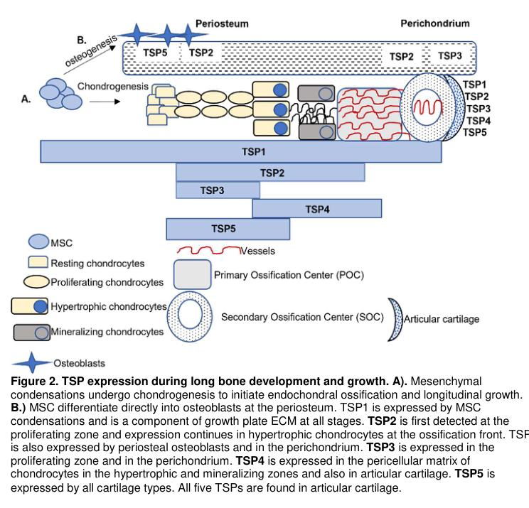

## Question

# Gene Research for Functional Annotation

## ⚠️ CRITICAL: Gene/Protein Identification Context

**BEFORE YOU BEGIN RESEARCH:** You MUST verify you are researching the CORRECT gene/protein. Gene symbols can be ambiguous, especially for less well-characterized genes from non-model organisms.

### Target Gene/Protein Identity (from UniProt):
- **UniProt Accession:** P49746
- **Protein Description:** RecName: Full=Thrombospondin-3; Flags: Precursor;
- **Gene Information:** Name=THBS3; Synonyms=TSP3;
- **Organism (full):** Homo sapiens (Human).
- **Protein Family:** Belongs to the thrombospondin family. .
- **Key Domains:** ConA-like_dom_sf. (IPR013320); EGF-like_Ca-bd_dom. (IPR001881); EGF-like_dom. (IPR000742); EGF_Ca-bd_CS. (IPR018097); NOTCH1_EGF-like. (IPR049883)

### MANDATORY VERIFICATION STEPS:

1. **Check if the gene symbol "THBS3" matches the protein description above**
2. **Verify the organism is correct:** Homo sapiens (Human).
3. **Check if protein family/domains align with what you find in literature**
4. **If you find literature for a DIFFERENT gene with the same or similar symbol, STOP**

### If Gene Symbol is Ambiguous or You Cannot Find Relevant Literature:

**DO NOT PROCEED WITH RESEARCH ON A DIFFERENT GENE.** Instead:
- State clearly: "The gene symbol 'THBS3' is ambiguous or literature is limited for this specific protein"
- Explain what you found (e.g., "Found extensive literature on a different gene with the same symbol in a different organism")
- Describe the protein based ONLY on the UniProt information provided above
- Suggest that the protein function can be inferred from domain/family information

### Research Target:

Please provide a comprehensive research report on the gene **THBS3** (gene ID: THBS3, UniProt: P49746) in human.

The research report should be a detailed narrative explaining the function, biological processes, and localization of the gene product. Citations should be given for all claims.

You should prioritize authoritative reviews and primary scientific literature when conducting research. You can supplement
this with annotations you find in gene/protein databases, but these can be outdated or inaccurate.

We are specifically interested in the primary function of the gene - for enzymes, what reaction is catalyzed, and what is the substrate specificity? For transporters, what is the substrate? For structural proteins or adapters, what is the broader structural role? For signaling molecules, what is the role in the pathway.

We are interested in where in or outside the cell the gene product carries out its function.

We are also interested in the signaling or biochemical pathways in which the gene functions. We are less interested in broad pleiotropic effects, except where these elucidate the precise role.

Include evidence where possible. We are interested in both experimental evidence as well as inference from structure, evolution, or bioinformatic analysis. Precise studies should be prioritized over high-throughput, where available.

## Output

Question: You are an expert researcher providing comprehensive, well-cited information.

Provide detailed information focusing on:
1. Key concepts and definitions with current understanding
2. Recent developments and latest research (prioritize 2023-2024 sources)
3. Current applications and real-world implementations
4. Expert opinions and analysis from authoritative sources
5. Relevant statistics and data from recent studies

Format as a comprehensive research report with proper citations. Include URLs and publication dates where available.
Always prioritize recent, authoritative sources and provide specific citations for all major claims.

# Gene Research for Functional Annotation

## ⚠️ CRITICAL: Gene/Protein Identification Context

**BEFORE YOU BEGIN RESEARCH:** You MUST verify you are researching the CORRECT gene/protein. Gene symbols can be ambiguous, especially for less well-characterized genes from non-model organisms.

### Target Gene/Protein Identity (from UniProt):
- **UniProt Accession:** P49746
- **Protein Description:** RecName: Full=Thrombospondin-3; Flags: Precursor;
- **Gene Information:** Name=THBS3; Synonyms=TSP3;
- **Organism (full):** Homo sapiens (Human).
- **Protein Family:** Belongs to the thrombospondin family. .
- **Key Domains:** ConA-like_dom_sf. (IPR013320); EGF-like_Ca-bd_dom. (IPR001881); EGF-like_dom. (IPR000742); EGF_Ca-bd_CS. (IPR018097); NOTCH1_EGF-like. (IPR049883)

### MANDATORY VERIFICATION STEPS:

1. **Check if the gene symbol "THBS3" matches the protein description above**
2. **Verify the organism is correct:** Homo sapiens (Human).
3. **Check if protein family/domains align with what you find in literature**
4. **If you find literature for a DIFFERENT gene with the same or similar symbol, STOP**

### If Gene Symbol is Ambiguous or You Cannot Find Relevant Literature:

**DO NOT PROCEED WITH RESEARCH ON A DIFFERENT GENE.** Instead:
- State clearly: "The gene symbol 'THBS3' is ambiguous or literature is limited for this specific protein"
- Explain what you found (e.g., "Found extensive literature on a different gene with the same symbol in a different organism")
- Describe the protein based ONLY on the UniProt information provided above
- Suggest that the protein function can be inferred from domain/family information

### Research Target:

Please provide a comprehensive research report on the gene **THBS3** (gene ID: THBS3, UniProt: P49746) in human.

The research report should be a detailed narrative explaining the function, biological processes, and localization of the gene product. Citations should be given for all claims.

You should prioritize authoritative reviews and primary scientific literature when conducting research. You can supplement
this with annotations you find in gene/protein databases, but these can be outdated or inaccurate.

We are specifically interested in the primary function of the gene - for enzymes, what reaction is catalyzed, and what is the substrate specificity? For transporters, what is the substrate? For structural proteins or adapters, what is the broader structural role? For signaling molecules, what is the role in the pathway.

We are interested in where in or outside the cell the gene product carries out its function.

We are also interested in the signaling or biochemical pathways in which the gene functions. We are less interested in broad pleiotropic effects, except where these elucidate the precise role.

Include evidence where possible. We are interested in both experimental evidence as well as inference from structure, evolution, or bioinformatic analysis. Precise studies should be prioritized over high-throughput, where available.

## Comprehensive Research Report: Human **THBS3** (Thrombospondin-3; UniProt **P49746**)

### Executive summary
**THBS3** encodes **thrombospondin‑3 (TSP3)**, a **secreted matricellular extracellular-matrix (ECM) glycoprotein** in the thrombospondin family, specifically the **pentameric (Group B) thrombospondins (TSP3/4/5)**. Current evidence supports roles in **skeletal/cartilage development and ECM organization**, with emerging mechanistic links to **osteoarthritis (OA) via TGF‑β/Smad signaling and cartilage vascularization/ossification coupling**. Beyond musculoskeletal biology, recent work implicates THBS3 in **virus entry** (as a coreceptor for pseudorabies virus in cell systems) and in **cardiovascular stress biology** (ER-stress/integrin signaling themes). Human genetics also indicates **THBS3 expression may be protective for gout risk** in a large Mendelian-randomization/SMR analysis. (alford2024thrombospondinsmodulatecell pages 4-5, pan2024themolecularmechanism pages 1-2, wang2024mendelianrandomizationanalysis pages 2-4)

---

## 1) Key concepts and definitions (current understanding)

### 1.1 Gene/protein identity verification (critical disambiguation)
The target is **human THBS3** encoding **thrombospondin‑3**, UniProt **P49746**. The sources synthesized here consistently refer to **TSP3/THBS3 as a thrombospondin-family ECM/matricellular protein** and situate it within the **pentameric thrombospondins (TSP3/4/5)**, matching the UniProt-provided identity and family context. (pan2024themolecularmechanism pages 1-2, alford2024thrombospondinsmodulatecell pages 1-4)

### 1.2 Thrombospondins and “matricellular” proteins
Thrombospondins are **multidomain, calcium-binding extracellular proteins** that operate at the **cell–matrix interface**, affecting **cell–ECM and cell–cell interactions** rather than serving as purely structural ECM scaffolds. A 2024 cardiovascular review describes the thrombospondin family as **extracellular matricellular proteins** that interact with **ECM components and cell-surface proteins** and are often **upregulated after tissue damage**. (pan2024themolecularmechanism pages 1-2)

### 1.3 Structural class and domain architecture (family-level)
**THBS3 is a Group B (pentameric) thrombospondin** (with THBS4 and THBS5/COMP). Group B thrombospondins are described as **pentameric extracellular proteins** with calcium-binding architecture that supports multivalent ECM/receptor interactions. (pan2024themolecularmechanism pages 1-2)

A highly cited structural review highlights that **Group B thrombospondins** differ from Group A thrombospondins by features including **absence of an N‑terminal module**, an **additional EGF-like repeat**, and specific differences in the **“wire” repeats** and C‑terminus, implying functional consequences through altered folding/allostery. (carlson2008thrombospondinsfromstructure pages 13-14)

A musculoskeletal review further notes that **TSP3 is a pentamer formed via amino‑terminal disulfide bonding** and contains a conserved **calcium-binding “signature” region** in the C‑terminus—consistent with being a secreted ECM/matricellular protein. (alford2024thrombospondinsmodulatecell pages 1-4)

### 1.4 Localization: extracellular matrix and skeletal niches
In developing bone, **TSP3 expression is localized to the growth plate proliferating zone and perichondrium**, and **all five thrombospondins are found in articular cartilage**. This places THBS3 activity primarily in the **extracellular/pericellular environment** of cartilage and developing skeletal tissue. (alford2024thrombospondinsmodulatecell pages 4-5, alford2024thrombospondinsmodulatecell media ee897cd1)

---

## 2) Recent developments and latest research (prioritizing 2023–2024)

### 2.1 Osteoarthritis: THBS3 as a mediator of cartilage catabolism and vascularization/ossification coupling (2024)
A 2024 Research Square preprint reports **THBS3 upregulation in human OA cartilage** and proposes a mechanistic role in **cartilage vascularization/bone coupling** through the **TGF‑β/Smad2/3 pathway**. In human cartilage samples (**n=10**), THBS3 was increased in OA vs healthy by **Western blot (p=0.0236)** and **RT‑qPCR (p=0.0002)**. (yan2024themechanismstudy pages 4-7)

In vitro, recombinant THBS3 increased **catabolic markers** (MMP‑13, ADAMTS‑5) and suppressed **Aggrecan**, consistent with ECM-degradative remodeling. THBS3 also promoted angiogenesis-relevant endothelial behaviors: **HUVEC migration** was increased (peak at 100 nM; **p=0.0040**) and **tube formation** increased at **50 nM (p=0.0036)** and **100 nM (p<0.0001)**. (yan2024themechanismstudy pages 4-7)

In a collagenase-induced OA mouse model, intra-articular **THBS3 siRNA** treatment reportedly reduced cartilage damage and improved histologic outcomes, supporting THBS3 as a candidate disease-modifying target in OA models. (yan2024themechanismstudy pages 7-10)

Mechanistically, the same study connects THBS3 to TGF‑β signaling: THBS3 increased chondrocyte **TGF‑β expression** (peak 6 h; **p=0.0353**) and pharmacologic **TGF‑β inhibition** blunted THBS3-induced increases in pro‑angiogenic/osteogenic factors (BMP‑2, FGF‑2, ANG‑2, VEGF‑A, PDGF‑B; **p ~0.0276–0.0052**). (yan2024themechanismstudy pages 7-10)

**Interpretation:** This 2024 work places THBS3 at the intersection of **ECM remodeling**, **angiogenesis**, and **endochondral ossification-like processes** in OA, aligning with broader thrombospondin biology as damage-responsive matricellular regulators. The study is a **preprint**, so conclusions require peer-reviewed confirmation and independent replication. (yan2024themechanismstudy pages 1-4, yan2024themechanismstudy pages 4-7)

### 2.2 Viral entry/coreceptor function: THBS3 in pseudorabies virus (PRV) attachment, fusion, and entry (2023)
A 2023 *Journal of Virology* primary study provides strong functional evidence that THBS3 can act as a **PRV coreceptor/host entry factor** in multiple cell systems. **siRNA knockdown** reduced PRV-GFP infection by **68.4% (PK15), 54.9% (ST), 62.8% (N2a)**; a second siRNA reduced infection by **71.7%**. THBS3 overexpression **nearly tripled** infection rates, and CRISPR knockout reduced infection by **~80%**. (pan2023associationofthbs3 pages 2-5)

Mechanistically, THBS3 **binds PRV glycoprotein D (gD)** (but not gB or gC) and the **N- and C-terminal regions of THBS3** mediate gD interaction. Soluble THBS3 neutralized infectivity (400 µg/mL yielding **~60% reduction**), and knockout reduced viral attachment by **~80%**. (pan2023associationofthbs3 pages 5-9, pan2023associationofthbs3 pages 2-5)

**Interpretation:** Although PRV is primarily a veterinary pathogen, these results position THBS3 as a **cell-surface/ECM-associated factor capable of mediating viral attachment/entry** in experimental systems, which may generalize conceptually to other herpesvirus receptor/cofactor paradigms. The study does not establish THBS3 as an entry factor for human herpesviruses. (pan2023associationofthbs3 pages 5-9)

### 2.3 Human genetics: THBS3 expression associated with reduced gout risk (2024)
A 2024 *Frontiers in Genetics* SMR (Summary-data-based Mendelian randomization) study integrating **eQTLGen blood cis-eQTLs (n=31,684)** with a large gout GWAS (**FinnGen_R10; n=272,412**) prioritized **THBS3** among top pleiotropic genes. The THBS3 signal reported **Beta = −0.202**, **P_SMR = 4.16 × 10−13**, **HEIDI P = 0.219**, **FDR = 2.92 × 10−9**, consistent with **higher THBS3 expression associated with lower gout risk**. (wang2024mendelianrandomizationanalysis pages 2-4)

**Interpretation:** This supports a potential systemic role for THBS3-linked biology in inflammatory/metabolic disease risk, but it does not specify causal tissue mechanisms (e.g., joint cartilage vs immune system). (wang2024mendelianrandomizationanalysis pages 2-4)

### 2.4 Cardiovascular mechanistic perspectives and biomarker work (2024)
A 2024 cardiovascular review reports THBS3 is **upregulated in cardiac disease** and can activate **ER stress** via binding **ATF6α**; unlike TSP4, TSP3 may worsen cardiac pathology by **inhibiting intracellular integrin signaling** and **disrupting myocardial membrane stability**. The same review notes gaps: THBS3 has not been implicated in NO signaling and its immune-cell roles in cardiovascular disease remain uncertain. (pan2024themolecularmechanism pages 6-7)

A 2024 *Journal of Proteome Research* study on **thoracic aortic aneurysm (TAA)** reports altered THBS3/“THSB3” abundance patterns in **bicuspid aortic valve (BAV)–associated TAA**, framing plasma THBS3 changes as part of a stress phenotype; the paper discusses THBS3 in the context of ER stress/protein homeostasis. The excerpted sections do not provide THBS3-specific fold-changes or diagnostic performance metrics. (martinblazquez2024analysisofvascular pages 1-2, martinblazquez2024analysisofvascular pages 8-9)

---

## 3) Current applications and real-world implementations

### 3.1 THBS3 as a potential therapeutic target in osteoarthritis (preclinical)
The OA preprint provides **in vivo and in vitro** evidence that THBS3 contributes to OA-like cartilage remodeling and vascularization/ossification coupling, and that **THBS3 siRNA** intervention can improve OA phenotypes in mice. This supports a plausible **disease-modifying OA target** hypothesis, though clinical translation is premature given the preprint status and need for validation. (yan2024themechanismstudy pages 7-10, yan2024themechanismstudy pages 4-7)

### 3.2 Antiviral entry-blocking concept (experimental)
The PRV study demonstrates that **anti-THBS3 antibodies** and **soluble THBS3** can block/neutralize infection in cell-based assays. This is not a clinical implementation, but provides a **proof-of-concept** that THBS3-mediated pathogen interactions could be disrupted therapeutically—at least for PRV models. (pan2023associationofthbs3 pages 5-9, pan2023associationofthbs3 pages 2-5)

### 3.3 Cardiovascular biomarker potential (proteomics-to-plasma translation)
The TAA proteomics study explicitly positions altered plasma proteins (including THBS3) as candidate **markers to monitor phenotype/therapy efficacy** in BAV vs TAV TAA contexts, though THBS3-specific diagnostic metrics are not provided in the excerpted text. (martinblazquez2024analysisofvascular pages 1-2, martinblazquez2024analysisofvascular pages 8-9)

---

## 4) Expert opinions and analysis (authoritative sources)

### 4.1 Skeleton-focused expert synthesis (2024)
A 2024 musculoskeletal review emphasizes that the **bouquet/pentameric structure** of TSP3/4/5 suggests they may simultaneously interact with **ECM proteins, cell-surface receptors, and growth factors**, and documents that TSP3 is expressed in key developmental cartilage niches and that **knockout phenotypes** reveal roles in ossification timing and bone biomechanics. (alford2024thrombospondinsmodulatecell pages 4-5, alford2024thrombospondinsmodulatecell pages 1-4)

### 4.2 Cardiovascular expert synthesis (2024)
The 2024 cardiovascular review proposes a mechanistic distinction between TSP3 and TSP4: **TSP3 may worsen cardiac pathology** by **inhibiting integrin signaling** and **destabilizing membranes**, despite being structurally similar to TSP4 and capable of engaging ER-stress pathways via ATF6α. The review highlights knowledge gaps in THBS3 biology (immune-cell effects; NO pathway involvement). (pan2024themolecularmechanism pages 6-7)

---

## 5) Statistics and data highlights (recent studies)

### Osteoarthritis (2024 preprint)
- Human cartilage THBS3 upregulation (OA vs healthy): **n=10**, WB **p=0.0236**, RT-qPCR **p=0.0002**. (yan2024themechanismstudy pages 4-7)
- Endothelial migration: max at 100 nM recombinant THBS3, **p=0.0040**. (yan2024themechanismstudy pages 4-7)
- Tube formation: 50 nM **p=0.0036**; 100 nM **p<0.0001**. (yan2024themechanismstudy pages 4-7)
- TGF‑β expression response: peak at 6 h, **p=0.0353**. (yan2024themechanismstudy pages 7-10)

### Viral entry (2023)
- THBS3 knockdown reduced PRV infection: **68.4%**, **54.9%**, **62.8%** (three cell types); second siRNA **71.7%** inhibition. (pan2023associationofthbs3 pages 2-5)
- THBS3 CRISPR knockout reduced PRV infection by **~80%**; overexpression nearly **3×** infection. (pan2023associationofthbs3 pages 2-5)
- Soluble THBS3: **400 µg/mL → ~60% reduction** infectivity. (pan2023associationofthbs3 pages 5-9)

### Human genetics (2024)
- SMR/HEIDI evidence for gout (blood expression → reduced risk): **Beta −0.202**, **P_SMR 4.16×10−13**, **FDR 2.92×10−9**, eQTLGen **n=31,684**, GWAS **n=272,412**. (wang2024mendelianrandomizationanalysis pages 2-4)

---

## Visual evidence (expression context)
Figure evidence for skeletal localization of TSP3 during long bone development:

(alford2024thrombospondinsmodulatecell media ee897cd1)

---

## Evidence map (citation-ready)
The following table summarizes the main evidence extracted in this run:

| Area | Key finding | Evidence type (review/primary/preprint) | Quantitative details (sample sizes, p-values, effect sizes) | Source (authors, journal, year) | URL |
|---|---|---|---|---|---|
| Protein identity/structure | Human THBS3 is a thrombospondin family matricellular/extracellular glycoprotein in Group B; Group B thrombospondins are pentameric extracellular calcium-binding proteins with multimeric architecture for ECM and cell-surface interactions. | Review | No THBS3-specific effect size reported in the cited snippet. (pan2024themolecularmechanism pages 1-2) | Pan et al., *Frontiers in Cardiovascular Medicine*, 2024 | https://doi.org/10.3389/fcvm.2024.1337586 |
| Protein identity/structure | TSP3 is a pentamer formed via amino-terminal disulfide bonding; its conserved C-terminal region contains a calcium-binding signature domain, consistent with ECM-localized matricellular function. (alford2024thrombospondinsmodulatecell pages 1-4) | Review | No quantitative statistics in the cited snippet. | Alford & Hankenson, *Seminars in Cell & Developmental Biology*, 2024 | https://doi.org/10.1016/j.semcdb.2023.06.011 |
| Protein identity/structure | Structural review evidence indicates Group B thrombospondins (including THBS3) differ from Group A by lacking an N-terminal module, adding an EGF-like repeat, lacking an N-glycosylation site in wire repeat 1C, and carrying insertions in wire repeat 11C/C-terminus. (carlson2008thrombospondinsfromstructure pages 13-14) | Review | No quantitative statistics in the cited snippet. | Carlson et al., *Cellular and Molecular Life Sciences*, 2008 | https://doi.org/10.1007/s00018-007-7484-1 |
| Skeletal/cartilage biology | In skeletal development, TSP3 expression is localized to the growth plate proliferating zone and perichondrium; all five TSPs are present in articular cartilage. (alford2024thrombospondinsmodulatecell pages 4-5, alford2024thrombospondinsmodulatecell media ee897cd1) | Review | No quantitative statistics in the cited snippets. | Alford & Hankenson, *Seminars in Cell & Developmental Biology*, 2024 | https://doi.org/10.1016/j.semcdb.2023.06.011 |
| Skeletal/cartilage biology | Mouse loss-of-function data summarized in review indicate TSP3 knockout causes accelerated ossification of the femoral head and transient increases in cortical moment of inertia that increase femur bending strength; combinatorial knockouts with TSP3 worsen growth plate disorganization and shorten limbs. (alford2024thrombospondinsmodulatecell pages 4-5) | Review | No p-values reported in the cited snippets. | Alford & Hankenson, *Seminars in Cell & Developmental Biology*, 2024 | https://doi.org/10.1016/j.semcdb.2023.06.011 |
| Osteoarthritis mechanism | THBS3 is upregulated in osteoarthritic cartilage and OA chondrocytes versus healthy controls. (yan2024themechanismstudy pages 1-4, yan2024themechanismstudy pages 4-7, yan2024themechanismstudy pages 10-15) | Preprint primary study | Human cartilage n=10; Western blot p=0.0236; RT-qPCR p=0.0002. (yan2024themechanismstudy pages 4-7) | Yan et al., Research Square preprint, 2024 | https://doi.org/10.21203/rs.3.rs-4167008/v1 |
| Osteoarthritis mechanism | Recombinant THBS3 increased catabolic enzymes (MMP-13, ADAMTS-5), suppressed Aggrecan, and promoted endothelial migration/tube formation relevant to cartilage vascularization/osteogenesis coupling in OA models. (yan2024themechanismstudy pages 4-7) | Preprint primary study | IL-1β induced THBS3 in normal chondrocytes: p=0.0138; THBS3 siRNA reduced THBS3: p<0.0001; HUVEC migration maximal at 100 nM: p=0.0040; tube formation at 50 nM: p=0.0036 and 100 nM: p<0.0001; mouse CIOA model n=18 total, groups of 6. | Yan et al., Research Square preprint, 2024 | https://doi.org/10.21203/rs.3.rs-4167008/v1 |
| Osteoarthritis mechanism | THBS3 was linked to TGF-β/Smad2/3 signaling in OA; THBS3 increased chondrocyte TGF-β expression and TGF-β pathway inhibition blunted THBS3-induced pro-angiogenic/pro-osteogenic factors. (yan2024themechanismstudy pages 7-10, yan2024themechanismstudy pages 10-15) | Preprint primary study | TGF-β expression peak at 6 h: p=0.0353; p-SMAD2/3 changes: p=0.0004 and p<0.0001; additional TGF-β inhibitor effect p=0.0070; inhibition of BMP-2/FGF-2/ANG-2/VEGF-A/PDGF-B induction p range 0.0276–0.0052. | Yan et al., Research Square preprint, 2024 | https://doi.org/10.21203/rs.3.rs-4167008/v1 |
| Viral entry/coreceptor | THBS3 functions as a pseudorabies virus (PRV) coreceptor/host factor; knockdown, knockout, antibody blocking, and soluble protein assays all reduced infection. (pan2023associationofthbs3 pages 2-5, pan2023associationofthbs3 pages 1-2) | Primary study | siRNA knockdown reduced PRV-GFP infection by 68.4% (PK15), 54.9% (ST), 62.8% (N2a); second siRNA inhibited infection by 71.7%; CRISPR knockout reduced infection by ~80%; overexpression nearly tripled infection; blocking antibody effective at 40 mg/mL. | Pan et al., *Journal of Virology*, 2023 | https://doi.org/10.1128/jvi.01871-22 |
| Viral entry/coreceptor | THBS3 directly binds PRV glycoprotein D through its N- and C-terminal regions and promotes binding/fusion/entry; soluble THBS3 neutralized infectivity in a dose-dependent manner. (pan2023associationofthbs3 pages 5-9, pan2023associationofthbs3 pages 9-11) | Primary study | Overexpression increased virus binding up to 7.16-fold in CHO-K1 cells; knockdown reduced binding by ~50%; knockout reduced attachment by ~80%; soluble THBS3 at 400 µg/mL reduced infectivity by 60%. | Pan et al., *Journal of Virology*, 2023 | https://doi.org/10.1128/jvi.01871-22 |
| Human genetics | SMR analysis prioritized THBS3 as a significant pleiotropic gene for gout; higher blood THBS3 expression was associated with reduced gout risk. (wang2024mendelianrandomizationanalysis pages 2-4) | Primary study | eQTLGen blood cis-eQTL n=31,684; FinnGen gout GWAS n=272,412; top SNP rs760077; Beta = -0.202; P_SMR = 4.16 × 10^-13; HEIDI P = 0.219; FDR = 2.92 × 10^-9. | Wang et al., *Frontiers in Genetics*, 2024 | https://doi.org/10.3389/fgene.2024.1426860 |
| Cardiovascular/proteomics biomarker | A 2024 cardiovascular review states TSP3 is structurally similar to TSP4, can bind ATF6α to activate ER stress, and may worsen cardiac pathology by inhibiting intracellular integrin signaling and disrupting myocardial membrane stability; its role in NO signaling and immune-cell actions remains unclear. (pan2024themolecularmechanism pages 6-7) | Review | No quantitative statistics in the cited snippet. | Pan et al., *Frontiers in Cardiovascular Medicine*, 2024 | https://doi.org/10.3389/fcvm.2024.1337586 |
| Cardiovascular/proteomics biomarker | In thoracic aortic aneurysm associated with bicuspid aortic valve, THBS3 was among proteins highlighted as altered in VSMCs/plasma and proposed as a stress-related plasma marker. (martinblazquez2024analysisofvascular pages 1-2, martinblazquez2024analysisofvascular pages 7-8, martinblazquez2024analysisofvascular pages 8-9) | Primary study | The cited snippets report altered abundance but do not provide THBS3-specific fold-changes, AUCs, or cutoffs. | Martin-Blazquez et al., *Journal of Proteome Research*, 2024 | https://doi.org/10.1021/acs.jproteome.3c00649 |

*Table: This table summarizes directly supported THBS3 findings gathered in this run, spanning protein identity, skeletal/cartilage biology, osteoarthritis, viral entry, human genetics, and cardiovascular biomarker evidence. It is useful as a citation-ready evidence map for building the full research report.*

---

## Limitations and evidence gaps (important for functional annotation)
1. **Human THBS3 biochemical mechanism in ECM**: While reviews establish extracellular/matricellular identity and structural class, the provided excerpts do not enumerate specific endogenous **human binding partners** (e.g., specific integrins, collagens) for THBS3 in musculoskeletal tissue; the strongest partner evidence captured here is **PRV gD binding** (pathogen interaction) and **ATF6α** binding (cardiac ER-stress context). (pan2023associationofthbs3 pages 2-5, pan2024themolecularmechanism pages 6-7)
2. **OA mechanism evidence is preprint**: The strongest THBS3-specific OA pathway data is from a **2024 preprint**; clinical confirmation and replication are required for definitive annotation. (yan2024themechanismstudy pages 4-7)
3. **Cardiovascular biomarker details**: The TAA proteomics study frames THBS3 as part of a plasma marker panel but the excerpts available here do not provide THBS3-specific fold-changes or AUC/sensitivity/specificity statistics. (martinblazquez2024analysisofvascular pages 8-9)

---

## Key references (URLs; publication dates)
- Alford AI, Hankenson KD. *Thrombospondins modulate cell function and tissue structure in the skeleton.* **Seminars in Cell & Developmental Biology**. Publication date: **Mar 2024**. https://doi.org/10.1016/j.semcdb.2023.06.011 (alford2024thrombospondinsmodulatecell pages 4-5, alford2024thrombospondinsmodulatecell pages 1-4)
- Pan H, Lu X, Ye D, et al. *The molecular mechanism of thrombospondin family members in cardiovascular diseases.* **Frontiers in Cardiovascular Medicine**. Publication date: **Mar 2024**. https://doi.org/10.3389/fcvm.2024.1337586 (pan2024themolecularmechanism pages 6-7)
- Yan J, Zhao Y, Zhu X, et al. *The mechanism study of THBS3 in regulating cartilage vascularization/bone coupling via the TGF‑β/Smad2/3 pathway in osteoarthritis.* **Research Square preprint**. Posted: **Apr 2024**. https://doi.org/10.21203/rs.3.rs-4167008/v1 (yan2024themechanismstudy pages 4-7, yan2024themechanismstudy pages 7-10)
- Pan Y, Guo L, Miao Q, et al. *Association of THBS3 with Glycoprotein D Promotes Pseudorabies Virus Attachment, Fusion, and Entry.* **Journal of Virology**. Publication date: **Feb 2023**. https://doi.org/10.1128/jvi.01871-22 (pan2023associationofthbs3 pages 2-5, pan2023associationofthbs3 pages 5-9)
- Wang Y, Chen J, Yao H, et al. *Mendelian randomization analysis identified potential genes pleiotropically associated with gout.* **Frontiers in Genetics**. Publication date: **Aug 2024**. https://doi.org/10.3389/fgene.2024.1426860 (wang2024mendelianrandomizationanalysis pages 2-4)
- Martin-Blazquez A, Martin-Lorenzo M, Santiago-Hernandez A, et al. *Analysis of Vascular Smooth Muscle Cells from Thoracic Aortic Aneurysms Reveals DNA Damage and Cell Cycle Arrest as Hallmarks in Bicuspid Aortic Valve Patients.* **Journal of Proteome Research**. Publication date: **Apr 10, 2024**. https://doi.org/10.1021/acs.jproteome.3c00649 (martinblazquez2024analysisofvascular pages 1-2, martinblazquez2024analysisofvascular pages 8-9)
- Carlson CB, Lawler J, Mosher DF. *Thrombospondins: from structure to therapeutics.* **Cellular and Molecular Life Sciences**. Publication date: **Mar 2008**. https://doi.org/10.1007/s00018-007-7484-1 (carlson2008thrombospondinsfromstructure pages 13-14)

References

1. (alford2024thrombospondinsmodulatecell pages 4-5): Andrea I. Alford and Kurt D. Hankenson. Thrombospondins modulate cell function and tissue structure in the skeleton. Mar 2024. URL: https://doi.org/10.1016/j.semcdb.2023.06.011, doi:10.1016/j.semcdb.2023.06.011. This article has 15 citations and is from a peer-reviewed journal.

2. (pan2024themolecularmechanism pages 1-2): Heng Pan, Xiyi Lu, Di Ye, Yongqi Feng, Jun Wan, and Jing Ye. The molecular mechanism of thrombospondin family members in cardiovascular diseases. Frontiers in Cardiovascular Medicine, Mar 2024. URL: https://doi.org/10.3389/fcvm.2024.1337586, doi:10.3389/fcvm.2024.1337586. This article has 8 citations and is from a peer-reviewed journal.

3. (wang2024mendelianrandomizationanalysis pages 2-4): Yu Wang, Jiahao Chen, Hang Yao, Yuxin Li, Xiaogang Xu, and Delin Zhang. Mendelian randomization analysis identified potential genes pleiotropically associated with gout. Frontiers in Genetics, Aug 2024. URL: https://doi.org/10.3389/fgene.2024.1426860, doi:10.3389/fgene.2024.1426860. This article has 5 citations and is from a peer-reviewed journal.

4. (alford2024thrombospondinsmodulatecell pages 1-4): Andrea I. Alford and Kurt D. Hankenson. Thrombospondins modulate cell function and tissue structure in the skeleton. Mar 2024. URL: https://doi.org/10.1016/j.semcdb.2023.06.011, doi:10.1016/j.semcdb.2023.06.011. This article has 15 citations and is from a peer-reviewed journal.

5. (carlson2008thrombospondinsfromstructure pages 13-14): C. B. Carlson, Jack Lawler, and Deane F. Mosher. Thrombospondins: from structure to therapeutics. Cellular and Molecular Life Sciences, 65:672-686, Mar 2008. URL: https://doi.org/10.1007/s00018-007-7484-1, doi:10.1007/s00018-007-7484-1. This article has 229 citations and is from a domain leading peer-reviewed journal.

6. (alford2024thrombospondinsmodulatecell media ee897cd1): Andrea I. Alford and Kurt D. Hankenson. Thrombospondins modulate cell function and tissue structure in the skeleton. Mar 2024. URL: https://doi.org/10.1016/j.semcdb.2023.06.011, doi:10.1016/j.semcdb.2023.06.011. This article has 15 citations and is from a peer-reviewed journal.

7. (yan2024themechanismstudy pages 4-7): Jingyao Yan, Yanping Zhao, Xiaoying Zhu, Hanya Lu, Yanli Wang, Shuya Wang, and Zhiyi Zhang. The mechanism study of thbs3 in regulating cartilage vascularization/bone coupling via the tgf-β/smad2/3 pathway in osteoarthritis. Unknown journal, Apr 2024. URL: https://doi.org/10.21203/rs.3.rs-4167008/v1, doi:10.21203/rs.3.rs-4167008/v1.

8. (yan2024themechanismstudy pages 7-10): Jingyao Yan, Yanping Zhao, Xiaoying Zhu, Hanya Lu, Yanli Wang, Shuya Wang, and Zhiyi Zhang. The mechanism study of thbs3 in regulating cartilage vascularization/bone coupling via the tgf-β/smad2/3 pathway in osteoarthritis. Unknown journal, Apr 2024. URL: https://doi.org/10.21203/rs.3.rs-4167008/v1, doi:10.21203/rs.3.rs-4167008/v1.

9. (yan2024themechanismstudy pages 1-4): Jingyao Yan, Yanping Zhao, Xiaoying Zhu, Hanya Lu, Yanli Wang, Shuya Wang, and Zhiyi Zhang. The mechanism study of thbs3 in regulating cartilage vascularization/bone coupling via the tgf-β/smad2/3 pathway in osteoarthritis. Unknown journal, Apr 2024. URL: https://doi.org/10.21203/rs.3.rs-4167008/v1, doi:10.21203/rs.3.rs-4167008/v1.

10. (pan2023associationofthbs3 pages 2-5): Yudi Pan, Longjun Guo, Qian Miao, Ling Wu, Zhaoyang Jing, Jin Tian, and Li Feng. Association of thbs3 with glycoprotein d promotes pseudorabies virus attachment, fusion, and entry. Journal of Virology, Feb 2023. URL: https://doi.org/10.1128/jvi.01871-22, doi:10.1128/jvi.01871-22. This article has 10 citations and is from a domain leading peer-reviewed journal.

11. (pan2023associationofthbs3 pages 5-9): Yudi Pan, Longjun Guo, Qian Miao, Ling Wu, Zhaoyang Jing, Jin Tian, and Li Feng. Association of thbs3 with glycoprotein d promotes pseudorabies virus attachment, fusion, and entry. Journal of Virology, Feb 2023. URL: https://doi.org/10.1128/jvi.01871-22, doi:10.1128/jvi.01871-22. This article has 10 citations and is from a domain leading peer-reviewed journal.

12. (pan2024themolecularmechanism pages 6-7): Heng Pan, Xiyi Lu, Di Ye, Yongqi Feng, Jun Wan, and Jing Ye. The molecular mechanism of thrombospondin family members in cardiovascular diseases. Frontiers in Cardiovascular Medicine, Mar 2024. URL: https://doi.org/10.3389/fcvm.2024.1337586, doi:10.3389/fcvm.2024.1337586. This article has 8 citations and is from a peer-reviewed journal.

13. (martinblazquez2024analysisofvascular pages 1-2): Ariadna Martin-Blazquez, Marta Martin-Lorenzo, Aranzazu Santiago-Hernandez, Angeles Heredero, Alicia Donado, Juan A Lopez, Miriam Anfaiha-Sanchez, Rocio Ruiz-Jimenez, Vanesa Esteban, Jesus Vazquez, Gonzalo Aldamiz-Echevarria, and Gloria Alvarez-Llamas. Analysis of vascular smooth muscle cells from thoracic aortic aneurysms reveals dna damage and cell cycle arrest as hallmarks in bicuspid aortic valve patients. Journal of Proteome Research, 23:3012-3024, Apr 2024. URL: https://doi.org/10.1021/acs.jproteome.3c00649, doi:10.1021/acs.jproteome.3c00649. This article has 9 citations and is from a peer-reviewed journal.

14. (martinblazquez2024analysisofvascular pages 8-9): Ariadna Martin-Blazquez, Marta Martin-Lorenzo, Aranzazu Santiago-Hernandez, Angeles Heredero, Alicia Donado, Juan A Lopez, Miriam Anfaiha-Sanchez, Rocio Ruiz-Jimenez, Vanesa Esteban, Jesus Vazquez, Gonzalo Aldamiz-Echevarria, and Gloria Alvarez-Llamas. Analysis of vascular smooth muscle cells from thoracic aortic aneurysms reveals dna damage and cell cycle arrest as hallmarks in bicuspid aortic valve patients. Journal of Proteome Research, 23:3012-3024, Apr 2024. URL: https://doi.org/10.1021/acs.jproteome.3c00649, doi:10.1021/acs.jproteome.3c00649. This article has 9 citations and is from a peer-reviewed journal.

15. (yan2024themechanismstudy pages 10-15): Jingyao Yan, Yanping Zhao, Xiaoying Zhu, Hanya Lu, Yanli Wang, Shuya Wang, and Zhiyi Zhang. The mechanism study of thbs3 in regulating cartilage vascularization/bone coupling via the tgf-β/smad2/3 pathway in osteoarthritis. Unknown journal, Apr 2024. URL: https://doi.org/10.21203/rs.3.rs-4167008/v1, doi:10.21203/rs.3.rs-4167008/v1.

16. (pan2023associationofthbs3 pages 1-2): Yudi Pan, Longjun Guo, Qian Miao, Ling Wu, Zhaoyang Jing, Jin Tian, and Li Feng. Association of thbs3 with glycoprotein d promotes pseudorabies virus attachment, fusion, and entry. Journal of Virology, Feb 2023. URL: https://doi.org/10.1128/jvi.01871-22, doi:10.1128/jvi.01871-22. This article has 10 citations and is from a domain leading peer-reviewed journal.

17. (pan2023associationofthbs3 pages 9-11): Yudi Pan, Longjun Guo, Qian Miao, Ling Wu, Zhaoyang Jing, Jin Tian, and Li Feng. Association of thbs3 with glycoprotein d promotes pseudorabies virus attachment, fusion, and entry. Journal of Virology, Feb 2023. URL: https://doi.org/10.1128/jvi.01871-22, doi:10.1128/jvi.01871-22. This article has 10 citations and is from a domain leading peer-reviewed journal.

18. (martinblazquez2024analysisofvascular pages 7-8): Ariadna Martin-Blazquez, Marta Martin-Lorenzo, Aranzazu Santiago-Hernandez, Angeles Heredero, Alicia Donado, Juan A Lopez, Miriam Anfaiha-Sanchez, Rocio Ruiz-Jimenez, Vanesa Esteban, Jesus Vazquez, Gonzalo Aldamiz-Echevarria, and Gloria Alvarez-Llamas. Analysis of vascular smooth muscle cells from thoracic aortic aneurysms reveals dna damage and cell cycle arrest as hallmarks in bicuspid aortic valve patients. Journal of Proteome Research, 23:3012-3024, Apr 2024. URL: https://doi.org/10.1021/acs.jproteome.3c00649, doi:10.1021/acs.jproteome.3c00649. This article has 9 citations and is from a peer-reviewed journal.

## Artifacts

- [Edison artifact artifact-00](THBS3-deep-research-falcon_artifacts/artifact-00.md)

## Citations

1. pan2024themolecularmechanism pages 1-2
2. carlson2008thrombospondinsfromstructure pages 13-14
3. alford2024thrombospondinsmodulatecell pages 1-4
4. yan2024themechanismstudy pages 4-7
5. yan2024themechanismstudy pages 7-10
6. wang2024mendelianrandomizationanalysis pages 2-4
7. pan2024themolecularmechanism pages 6-7
8. alford2024thrombospondinsmodulatecell pages 4-5
9. martinblazquez2024analysisofvascular pages 8-9
10. yan2024themechanismstudy pages 1-4
11. martinblazquez2024analysisofvascular pages 1-2
12. yan2024themechanismstudy pages 10-15
13. martinblazquez2024analysisofvascular pages 7-8
14. https://doi.org/10.3389/fcvm.2024.1337586
15. https://doi.org/10.1016/j.semcdb.2023.06.011
16. https://doi.org/10.1007/s00018-007-7484-1
17. https://doi.org/10.21203/rs.3.rs-4167008/v1
18. https://doi.org/10.1128/jvi.01871-22
19. https://doi.org/10.3389/fgene.2024.1426860
20. https://doi.org/10.1021/acs.jproteome.3c00649
21. https://doi.org/10.1016/j.semcdb.2023.06.011,
22. https://doi.org/10.3389/fcvm.2024.1337586,
23. https://doi.org/10.3389/fgene.2024.1426860,
24. https://doi.org/10.1007/s00018-007-7484-1,
25. https://doi.org/10.21203/rs.3.rs-4167008/v1,
26. https://doi.org/10.1128/jvi.01871-22,
27. https://doi.org/10.1021/acs.jproteome.3c00649,