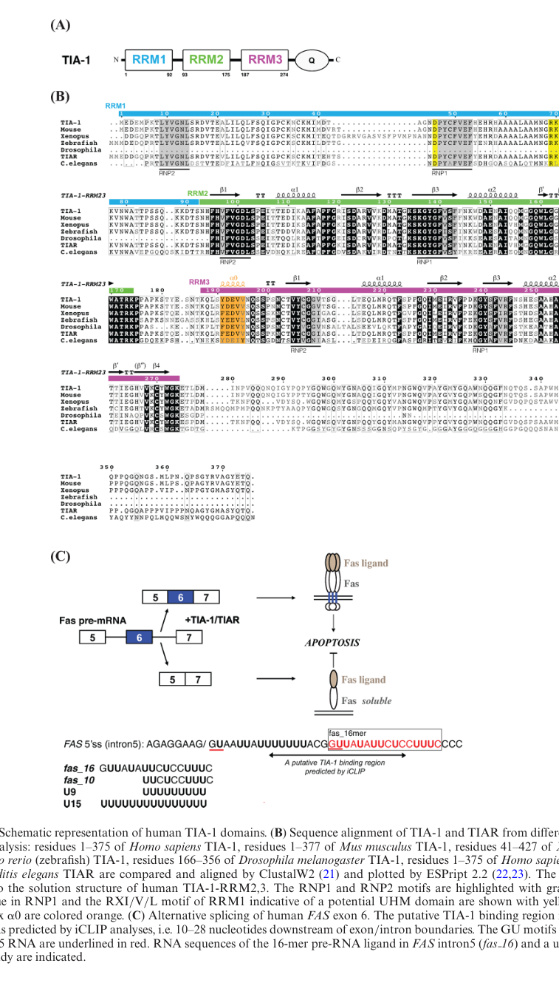

## Question

# Gene Research for Functional Annotation

## ⚠️ CRITICAL: Gene/Protein Identification Context

**BEFORE YOU BEGIN RESEARCH:** You MUST verify you are researching the CORRECT gene/protein. Gene symbols can be ambiguous, especially for less well-characterized genes from non-model organisms.

### Target Gene/Protein Identity (from UniProt):
- **UniProt Accession:** P31483
- **Protein Description:** RecName: Full=Cytotoxic granule associated RNA binding protein TIA1 {ECO:0000312|HGNC:HGNC:11802}; AltName: Full=Nucleolysin TIA-1 isoform p40 {ECO:0000305}; AltName: Full=RNA-binding protein TIA-1; AltName: Full=T-cell-restricted intracellular antigen-1; Short=TIA-1; AltName: Full=p40-TIA-1;
- **Gene Information:** Name=TIA1;
- **Organism (full):** Homo sapiens (Human).
- **Protein Family:** Not specified in UniProt
- **Key Domains:** Nucleotide-bd_a/b_plait_sf. (IPR012677); RBD_domain_sf. (IPR035979); RRM_dom. (IPR000504); RRM_dom_euk. (IPR003954); TIA-1_RRM1. (IPR034827)

### MANDATORY VERIFICATION STEPS:

1. **Check if the gene symbol "TIA1" matches the protein description above**
2. **Verify the organism is correct:** Homo sapiens (Human).
3. **Check if protein family/domains align with what you find in literature**
4. **If you find literature for a DIFFERENT gene with the same or similar symbol, STOP**

### If Gene Symbol is Ambiguous or You Cannot Find Relevant Literature:

**DO NOT PROCEED WITH RESEARCH ON A DIFFERENT GENE.** Instead:
- State clearly: "The gene symbol 'TIA1' is ambiguous or literature is limited for this specific protein"
- Explain what you found (e.g., "Found extensive literature on a different gene with the same symbol in a different organism")
- Describe the protein based ONLY on the UniProt information provided above
- Suggest that the protein function can be inferred from domain/family information

### Research Target:

Please provide a comprehensive research report on the gene **TIA1** (gene ID: TIA1, UniProt: P31483) in human.

The research report should be a detailed narrative explaining the function, biological processes, and localization of the gene product. Citations should be given for all claims.

You should prioritize authoritative reviews and primary scientific literature when conducting research. You can supplement
this with annotations you find in gene/protein databases, but these can be outdated or inaccurate.

We are specifically interested in the primary function of the gene - for enzymes, what reaction is catalyzed, and what is the substrate specificity? For transporters, what is the substrate? For structural proteins or adapters, what is the broader structural role? For signaling molecules, what is the role in the pathway.

We are interested in where in or outside the cell the gene product carries out its function.

We are also interested in the signaling or biochemical pathways in which the gene functions. We are less interested in broad pleiotropic effects, except where these elucidate the precise role.

Include evidence where possible. We are interested in both experimental evidence as well as inference from structure, evolution, or bioinformatic analysis. Precise studies should be prioritized over high-throughput, where available.

## Output

Question: You are an expert researcher providing comprehensive, well-cited information.

Provide detailed information focusing on:
1. Key concepts and definitions with current understanding
2. Recent developments and latest research (prioritize 2023-2024 sources)
3. Current applications and real-world implementations
4. Expert opinions and analysis from authoritative sources
5. Relevant statistics and data from recent studies

Format as a comprehensive research report with proper citations. Include URLs and publication dates where available.
Always prioritize recent, authoritative sources and provide specific citations for all major claims.

# Gene Research for Functional Annotation

## ⚠️ CRITICAL: Gene/Protein Identification Context

**BEFORE YOU BEGIN RESEARCH:** You MUST verify you are researching the CORRECT gene/protein. Gene symbols can be ambiguous, especially for less well-characterized genes from non-model organisms.

### Target Gene/Protein Identity (from UniProt):
- **UniProt Accession:** P31483
- **Protein Description:** RecName: Full=Cytotoxic granule associated RNA binding protein TIA1 {ECO:0000312|HGNC:HGNC:11802}; AltName: Full=Nucleolysin TIA-1 isoform p40 {ECO:0000305}; AltName: Full=RNA-binding protein TIA-1; AltName: Full=T-cell-restricted intracellular antigen-1; Short=TIA-1; AltName: Full=p40-TIA-1;
- **Gene Information:** Name=TIA1;
- **Organism (full):** Homo sapiens (Human).
- **Protein Family:** Not specified in UniProt
- **Key Domains:** Nucleotide-bd_a/b_plait_sf. (IPR012677); RBD_domain_sf. (IPR035979); RRM_dom. (IPR000504); RRM_dom_euk. (IPR003954); TIA-1_RRM1. (IPR034827)

### MANDATORY VERIFICATION STEPS:

1. **Check if the gene symbol "TIA1" matches the protein description above**
2. **Verify the organism is correct:** Homo sapiens (Human).
3. **Check if protein family/domains align with what you find in literature**
4. **If you find literature for a DIFFERENT gene with the same or similar symbol, STOP**

### If Gene Symbol is Ambiguous or You Cannot Find Relevant Literature:

**DO NOT PROCEED WITH RESEARCH ON A DIFFERENT GENE.** Instead:
- State clearly: "The gene symbol 'TIA1' is ambiguous or literature is limited for this specific protein"
- Explain what you found (e.g., "Found extensive literature on a different gene with the same symbol in a different organism")
- Describe the protein based ONLY on the UniProt information provided above
- Suggest that the protein function can be inferred from domain/family information

### Research Target:

Please provide a comprehensive research report on the gene **TIA1** (gene ID: TIA1, UniProt: P31483) in human.

The research report should be a detailed narrative explaining the function, biological processes, and localization of the gene product. Citations should be given for all claims.

You should prioritize authoritative reviews and primary scientific literature when conducting research. You can supplement
this with annotations you find in gene/protein databases, but these can be outdated or inaccurate.

We are specifically interested in the primary function of the gene - for enzymes, what reaction is catalyzed, and what is the substrate specificity? For transporters, what is the substrate? For structural proteins or adapters, what is the broader structural role? For signaling molecules, what is the role in the pathway.

We are interested in where in or outside the cell the gene product carries out its function.

We are also interested in the signaling or biochemical pathways in which the gene functions. We are less interested in broad pleiotropic effects, except where these elucidate the precise role.

Include evidence where possible. We are interested in both experimental evidence as well as inference from structure, evolution, or bioinformatic analysis. Precise studies should be prioritized over high-throughput, where available.

## Research Report: Human **TIA1** (T-cell-restricted intracellular antigen-1) Functional Annotation

### 0) Target verification (mandatory)
The literature summarized here is explicitly aligned to **human TIA1** matching the UniProt entry **P31483**, which is described as “cytotoxic granule associated RNA binding protein TIA1 / TIA-1”. A 2024 antibody-validation paper explicitly lists **UniProt ID P31483** as TIA1, confirming the identity for this report. (fotouhi2024aguideto pages 1-3)

### 1) Key concepts, definitions, and current understanding

#### 1.1 What TIA1 is (molecular identity)
**TIA1 is a multifunctional RNA-binding protein (RBP)** best understood as a *post-transcriptional regulator* that influences **alternative splicing** and **mRNA translation**, and as a core organizer of **stress granules (SGs)**. (ramosvelasco2024bibliometricoverviewon pages 1-2, alcalderey2024decodingthemolecular pages 1-2, fotouhi2024aguideto pages 1-3)

A central conceptual framework in the recent literature is that TIA1 couples **RNA recognition (via folded RRMs)** to **biomolecular condensation/phase separation (via low-complexity regions)**, enabling condition-dependent switching between nuclear RNA processing and cytoplasmic stress responses. (alcalderey2024decodingthemolecular pages 1-2, ramosvelasco2024bibliometricoverviewon pages 11-12)

#### 1.2 Domain architecture and how it maps to function
TIA1 is a **multi-domain** protein:
- **Three RNA recognition motifs (RRM1–RRM3)** provide modular RNA-binding surfaces.
- A **C-terminal glutamine-rich / low-complexity / prion-like domain (LCD/PrD)** supports protein–protein interactions and is strongly implicated in **SG nucleation and dynamics** (liquid–liquid phase separation, LLPS). (alcalderey2024decodingthemolecular pages 1-2, fuentesjimenez2023twopredictedαhelices pages 1-2, wang2014structuredynamicsand pages 1-2)

Structural/biophysical work emphasizes that the **RRMs behave as largely independent modules in the absence of RNA**, while RNA binding promotes a **more compact, cooperative arrangement**, consistent with avidity-driven recognition of pyrimidine-rich RNAs. (wang2014structuredynamicsand pages 1-1, wang2014structuredynamicsand pages 1-2, wang2014structuredynamicsand pages 13-15)

The TIA1 domain map and RRM RNA-binding surfaces (residue-level perturbations upon RNA binding) are visually summarized in the figures extracted from Wang et al. 2014 (NAR). (wang2014structuredynamicsand media beade28f, wang2014structuredynamicsand media 92111d2e)

#### 1.3 RNA-binding specificity (sequence/positional “rules”)
Across mechanistic and review sources, TIA1 shows preference for **uridine-rich / pyrimidine-rich RNA**:
- Binding to **3′ uridine-rich RNA sequences** in mRNAs is reported in a 2024 TIA1 methods/antibody study. (fotouhi2024aguideto pages 1-3)
- In the splicing context, TIA proteins preferentially act on **U-rich motifs in intronic regions downstream of 5′ splice sites**. (ramosvelasco2024bibliometricoverviewon pages 11-12)
- A transcriptome-wide iCLIP study and structural studies converge on the positional rule that TIA binding is commonly **~10–28 nucleotides downstream of exon–intron boundaries/5′ splice sites**, consistent with a role in 5′ splice-site definition. (wang2014structuredynamicsand pages 1-2, wang2010iclippredictsthe pages 1-2)

At the RRM level, a consistent model emerges:
- **RRM2** is the dominant high-affinity, sequence-specific RNA-binding domain.
- **RRM3** enhances/cooperates with RRM2.
- **RRM1** has little intrinsic RNA-binding affinity and contributes minimally to binding in several contexts, although it can modulate selectivity/architecture in some assays. (wang2014structuredynamicsand pages 1-1, wang2014structuredynamicsand pages 1-2, wang2010iclippredictsthe pages 1-2, bauer2012threernarecognition pages 1-2)

#### 1.4 Core mechanistic function in splicing: facilitating weak 5′ splice site recognition
A well-established mechanistic function of TIA1 is **enhancing recognition of weak 5′ splice sites** through binding to downstream U-rich sequences and recruitment/assistance of **U1 snRNP**, specifically via the **U1-C** protein.

The canonical example is **FAS** (apoptosis receptor) pre-mRNA:
- TIA1 recognizes poly-U/pyrimidine-rich sequences to facilitate **U1 snRNP-mediated splice-site recognition**, promoting inclusion of FAS exon 6 in particular regulatory contexts. (wang2014structuredynamicsand pages 1-1, wang2010iclippredictsthe pages 1-2)
- Biophysical studies show **RRM2–RRM3 binds pyrimidine-rich FAS pre-mRNA and poly-uridine RNA with nanomolar affinity**, with RNA binding inducing a compact arrangement of RRMs. (wang2014structuredynamicsand pages 1-1, wang2014structuredynamicsand pages 1-2)
- A structural organization model also emphasizes that the C-terminal Q-rich region contributes to recruiting spliceosomal factors (U1-C) without being required for RNA binding per se. (bauer2012threernarecognition pages 1-2)

A mechanistic schematic for cooperative RRM binding and spliceosomal recruitment is included in the extracted figure panels. (wang2014structuredynamicsand media 4b637f91)

#### 1.5 Stress granules (SGs), translational control, and LLPS
**Stress granules** are non-membranous cytoplasmic ribonucleoprotein assemblies enriched in translationally stalled mRNAs. TIA1 is described as a **canonical SG component** that can connect **eIF2α phosphorylation** to SG assembly and **translational repression/mRNA triage** during stress. (alcalderey2024decodingthemolecular pages 1-2, ramosvelasco2024bibliometricoverviewon pages 11-12)

Mechanistically:
- The **C-terminal low-complexity/prion-like domain** is a major determinant of condensation/LLPS and SG assembly. (alcalderey2024decodingthemolecular pages 1-2, fuentesjimenez2023twopredictedαhelices pages 1-2)
- Disease-linked mutations in this domain are proposed to alter phase behavior and SG dynamics, potentially shifting reversible SG assemblies toward more persistent/aberrant states. (fotouhi2024aguideto pages 1-3, fuentesjimenez2023twopredictedαhelices pages 1-2, alcalderey2024decodingthemolecular pages 1-2)

### 2) Recent developments and latest research (2023–2024 priority)

#### 2.1 2024: “Molecular grammar” of TIA1-dependent stress granules and disease mutation p.E384K
A 2024 Cells review/analysis frames TIA1 SG biology using a “molecular grammar” concept: how amino-acid features in low-complexity regions influence LLPS and SG assembly/disassembly, with explicit discussion of **Welander distal myopathy (WDM)** linked to **TIA1 p.E384K** and effects on SG dynamics under oxidative stress. (alcalderey2024decodingthemolecular pages 1-2, alcalderey2024decodingthemolecular pages 14-16)

#### 2.2 2024: Antibody benchmarking as an enabling technology for reproducible TIA1 research
A 2024 F1000Research resource systematically characterized **12 commercial anti-TIA1 antibodies** for **Western blot, immunoprecipitation, and immunofluorescence** using **TIA1 knockout** and isogenic controls. This is an important real-world implementation because reagent variability has been a major reproducibility bottleneck in RBP biology. (fotouhi2024aguideto pages 1-3)

#### 2.3 2023: TIA1/TIAL1 control germinal center selection by promoting Mcl1 translation
A 2023 Cellular & Molecular Immunology paper provides a detailed immune-system mechanism:
- **iCLIP identified 1,487 high-confidence TIA1/TIAL1 target genes** expressed in germinal center (GC) B cells.
- Loss of Tia1/Tial1 triggered extensive transcriptome remodeling with **1,162 differentially expressed genes in dark zone cells** (and 411 in light zone).
- Mechanistically, TIA1/TIAL1 directly bind **Mcl1 mRNA** and promote **MCL1 protein expression**, protecting GC B cells from apoptosis and enabling productive, high-affinity antibody responses. (osmagarcia2023thernabinding pages 10-11)

#### 2.4 2024: Post-transcriptional control of T cell quiescence (preprint)
A 2024 bioRxiv preprint reports that combined loss of **TIA1 and TIAL1** disrupts **T cell quiescence**, driving antigen-independent homeostatic proliferation and subsequent activation/exhaustion/cell death, and implicates post-transcriptional regulation of transcription factors such as **FOXP1, LEF1, and TCF1**. While preprints require cautious interpretation, this provides a current mechanistic hypothesis linking TIA proteins to T cell state control. (osmagarcia2024posttranscriptionalregulationby pages 1-4)

### 3) Current applications and real-world implementations

#### 3.1 Research/diagnostic implementations: TIA1 detection by antibodies (WB/IP/IF)
Reproducible quantification/localization of TIA1 (e.g., nuclear vs cytoplasmic; SG recruitment) is central to functional annotation studies. The 2024 antibody benchmarking work provides an applied guide for selecting antibodies validated against knockout controls for **Western blot**, **immunoprecipitation**, and **immunofluorescence**. (fotouhi2024aguideto pages 1-3)

#### 3.2 Cancer immunology: TIA1 as a marker of cytotoxic lymphocytes
TIA1 was originally identified in lymphocytes and is widely used in pathology as a marker associated with cytotoxic immune infiltrates. A 2024 review highlights TIA1 as a **potential immunological biomarker**, and cites its use as a tissue marker in multiple malignancy contexts (e.g., lymphomas) and in combination with other markers for prognosis. (ramosvelasco2024bibliometricoverviewon pages 9-11, ramosvelasco2024bibliometricoverviewon pages 12-13, ramosvelasco2024bibliometricoverviewon pages 13-14)

### 4) Expert opinions and analysis from authoritative sources (mechanistic framing)

#### 4.1 TIA1 as a “hub” integrating RNA processing and stress adaptation
Recent reviews emphasize a unifying view: TIA1/TIAR proteins integrate **RNA splicing choices**, **mRNA localization/stability**, and **translation control**, and these functions are deployed in distinct biological programs (development, inflammation, apoptosis, autophagy, viral responses). (ramosvelasco2024bibliometricoverviewon pages 1-2, ramosvelasco2024bibliometricoverviewon pages 11-12)

#### 4.2 Disease mechanism framing: aberrant condensate dynamics as a pathogenic intermediate
A recurring analysis is that perturbations of SG assembly/disassembly and phase properties (driven by low-complexity regions and mutations) may contribute to neurodegeneration/myopathy by altering RNA metabolism and proteostasis. The 2024 Cells paper explicitly situates WDM p.E384K within this LLPS/SG framework. (alcalderey2024decodingthemolecular pages 1-2, alcalderey2024decodingthemolecular pages 14-16)

### 5) Relevant statistics and quantitative data

#### 5.1 Abundance estimates (cellular concentration/copy number)
A 2024 review reports an estimate for **TIA1 abundance in HEK-293T cells** of approximately **630 nM** and **3.8×10^5 copies per cell** (with the paralog TIAR higher). (ramosvelasco2024bibliometricoverviewon pages 9-11)

#### 5.2 Quantitative immune-cell transcriptomic effects
In GC B cells, iCLIP and differential-expression analysis in TIA1/TIAL1-deficient settings yielded:
- **1,487 high-confidence target genes**.
- **1,162 differentially expressed genes** in dark zone knockout cells (411 in light zone), with directionality counts reported for increases/decreases. (osmagarcia2023thernabinding pages 10-11)

#### 5.3 Quantitative biophysics of RNA binding
Structural/biophysical work reports that **TIA1 RRM2–RRM3 binds poly-uridine and FAS-derived pyrimidine-rich RNA with nanomolar affinity**, and that RNA binding drives a more compact RRM arrangement (consistent with cooperative avidity). (wang2014structuredynamicsand pages 1-1, wang2014structuredynamicsand pages 1-2)

### Consolidated evidence map
The following table summarizes the core functional annotation, sources, and key evidence links.

| Category | Key points (1-2 sentences) | Key evidence citations | Key sources with year and URL |
|---|---|---|---|
| Identity/Domains | UniProt P31483 corresponds to human TIA1/TIA-1, a multifunctional RNA-binding protein with three N-terminal RRMs and a C-terminal glutamine-rich low-complexity/prion-like domain that supports protein-protein interactions and condensate formation. TIA1 shuttles between nucleus and cytoplasm, consistent with roles in splicing and stress responses. | (fotouhi2024aguideto pages 1-3, alcalderey2024decodingthemolecular pages 1-2, wang2014structuredynamicsand pages 1-2) | Fotouhi et al., 2024, https://doi.org/10.12688/f1000research.133645.2; Alcalde-Rey et al., 2024, https://doi.org/10.3390/cells13231961; Wang et al., 2014, https://doi.org/10.1093/nar/gku193 |
| RNA binding specificity | TIA1 preferentially recognizes uridine-rich/pyrimidine-rich RNA, including 3' U-rich elements and intronic U-rich motifs downstream of 5' splice sites. RRM2 is the principal sequence-specific RNA-binding domain, RRM3 enhances/cooperates with RRM2, and RRM1 contributes little intrinsic RNA affinity. | (fotouhi2024aguideto pages 1-3, ramosvelasco2024bibliometricoverviewon pages 11-12, wang2014structuredynamicsand pages 1-1, wang2010iclippredictsthe pages 1-2) | Fotouhi et al., 2024, https://doi.org/10.12688/f1000research.133645.2; Ramos-Velasco et al., 2024, https://doi.org/10.3390/biology13030195; Wang et al., 2014, https://doi.org/10.1093/nar/gku193; Wang et al., 2010, https://doi.org/10.1371/journal.pbio.1000530 |
| Splicing mechanism | TIA1 binds U-rich motifs typically 10-28 nt downstream of 5' splice sites and promotes exon inclusion by facilitating U1 snRNP/U1-C recognition of weak 5' splice sites, exemplified by FAS exon 6 regulation. Structural studies show RRMs are modular when free but form a compact cooperative RNA-bound complex. | (wang2014structuredynamicsand pages 1-1, wang2014structuredynamicsand pages 1-2, wang2010iclippredictsthe pages 1-2, bauer2012threernarecognition pages 1-2) | Wang et al., 2014, https://doi.org/10.1093/nar/gku193; Wang et al., 2010, https://doi.org/10.1371/journal.pbio.1000530; Bauer et al., 2012, https://doi.org/10.1016/j.jmb.2011.11.040 |
| Stress granules/LLPS | The C-terminal low-complexity/prion-like domain drives liquid-liquid phase separation and stress granule (SG) assembly, linking eIF2α-dependent translational arrest to cytoplasmic mRNA triage. TIA1 is a canonical SG component, and altered SG assembly/disassembly is a major mechanistic theme in TIA1-linked pathology. | (alcalderey2024decodingthemolecular pages 1-2, ramosvelasco2024bibliometricoverviewon pages 11-12, fuentesjimenez2023twopredictedαhelices pages 1-2, ramosvelasco2024bibliometricoverviewon pages 13-14) | Alcalde-Rey et al., 2024, https://doi.org/10.3390/cells13231961; Ramos-Velasco et al., 2024, https://doi.org/10.3390/biology13030195; Fuentes-Jiménez et al., 2023, https://doi.org/10.3389/fcell.2023.1265104 |
| Immune-cell functions | In immune cells, TIA1/TIAL1 help enforce T-cell quiescence and regulate GC B-cell survival and selection. A 2023 study identified 1,487 high-confidence TIA1/TIAL1 target genes in GC B cells and showed direct control of Mcl1 translation, with knockout causing increased apoptosis and defective high-affinity antibody responses. | (osmagarcia2023thernabinding pages 10-11, osmagarcia2023thernabinding pages 1-2, osmagarcia2024posttranscriptionalregulationby pages 1-4, ramosvelasco2024bibliometricoverviewon pages 12-13) | Osma-Garcia et al., 2023, https://doi.org/10.1038/s41423-023-01063-4; Osma-Garcia et al., 2024, https://doi.org/10.1101/2024.09.03.608755; Ramos-Velasco et al., 2024, https://doi.org/10.3390/biology13030195 |
| Disease links/variants | TIA1 variants are implicated in neurodegeneration (especially ALS/FTD spectrum) and Welander distal myopathy; disease-associated mutations in the low-complexity domain can delay SG disassembly or perturb phase behavior. The founder p.E384K variant is the best-established myopathy-linked example discussed in recent literature. | (fotouhi2024aguideto pages 1-3, alcalderey2024decodingthemolecular pages 1-2, fuentesjimenez2023twopredictedαhelices pages 1-2) | Fotouhi et al., 2024, https://doi.org/10.12688/f1000research.133645.2; Alcalde-Rey et al., 2024, https://doi.org/10.3390/cells13231961; Fuentes-Jiménez et al., 2023, https://doi.org/10.3389/fcell.2023.1265104 |
| Quantitative stats | Reported quantitative data include ~630 nM TIA1 and ~3.8×10^5 copies/cell in HEK-293T cells, plus low RNA-protein correlation in T cells (r² = 0.4). Structural work further shows RRM2,3 binds FAS-derived/U-rich RNA with nanomolar affinity, and RNA binding compacts the protein-RNA complex; GC B-cell iCLIP identified 1,487 high-confidence targets and 1,162 DE genes in dark-zone knockout cells. | (ramosvelasco2024bibliometricoverviewon pages 9-11, osmagarcia2024posttranscriptionalregulationby pages 1-4, wang2014structuredynamicsand pages 1-1, wang2014structuredynamicsand pages 13-15, osmagarcia2023thernabinding pages 10-11) | Ramos-Velasco et al., 2024, https://doi.org/10.3390/biology13030195; Osma-Garcia et al., 2024, https://doi.org/10.1101/2024.09.03.608755; Wang et al., 2014, https://doi.org/10.1093/nar/gku193; Osma-Garcia et al., 2023, https://doi.org/10.1038/s41423-023-01063-4 |
| Tools/applications | Practical uses include TIA1 immunohistochemistry as a biomarker of cytotoxic CD8+ tumor-infiltrating lymphocytes/prognosis in some cancers, and a 2024 validated antibody-selection resource for Western blot, immunoprecipitation, and immunofluorescence. Common experimental tools for TIA1 functional annotation include iCLIP/irCLIP, luciferase reporters, flow cytometry, ribosome-block assays, and stress-granule imaging. | (ramosvelasco2024bibliometricoverviewon pages 12-13, fotouhi2024aguideto pages 1-3, osmagarcia2023thernabinding pages 10-11, osmagarcia2024posttranscriptionalregulationby pages 28-30) | Ramos-Velasco et al., 2024, https://doi.org/10.3390/biology13030195; Fotouhi et al., 2024, https://doi.org/10.12688/f1000research.133645.2; Osma-Garcia et al., 2023, https://doi.org/10.1038/s41423-023-01063-4 |

*Table: This table summarizes the core functional annotation of human TIA1 (UniProt P31483), covering identity, RNA-binding and splicing mechanisms, stress granules, immune functions, disease associations, quantitative findings, and practical research applications. It is useful as a compact evidence map for the full report.*

### Figures supporting mechanistic claims
- Domain architecture and mapping of RRM RNA-binding perturbations: (wang2014structuredynamicsand media beade28f, wang2014structuredynamicsand media 92111d2e)
- Schematic model linking cooperative RNA binding and splice-site/U1 snRNP recruitment: (wang2014structuredynamicsand media 4b637f91)

### Conclusion (functional annotation summary)
Human **TIA1 (UniProt P31483)** is best annotated as a **uridine/pyrimidine-rich RNA-binding protein** whose **primary molecular functions** are (i) **position-dependent control of alternative splicing**—classically by binding U-rich elements downstream of weak **5′ splice sites** and promoting **U1 snRNP/U1-C** recognition (e.g., **FAS**)—and (ii) **context-dependent translational regulation**, especially during stress where its **low-complexity/prion-like domain** promotes **stress granule condensation via LLPS**, enabling reversible mRNA triage. These molecular functions are directly linked to **immune-cell fate and function**, including **germinal center selection via Mcl1 translation**, and are implicated in **human disease**, notably through mutations that perturb SG dynamics such as **WDM p.E384K** and variants associated with **ALS/FTD**. (wang2014structuredynamicsand pages 1-1, wang2010iclippredictsthe pages 1-2, alcalderey2024decodingthemolecular pages 1-2, osmagarcia2023thernabinding pages 10-11, fotouhi2024aguideto pages 1-3)

References

1. (fotouhi2024aguideto pages 1-3): Maryam Fotouhi, Donovan Worrall, Riham Ayoubi, Kathleen Southern, Peter S. McPherson, and Carl Laflamme. A guide to selecting high-performing antibodies for rna-binding protein tia1 for use in western blot, immunoprecipitation and immunofluorescence. F1000Research, 12:745, Apr 2024. URL: https://doi.org/10.12688/f1000research.133645.2, doi:10.12688/f1000research.133645.2. This article has 2 citations and is from a peer-reviewed journal.

2. (ramosvelasco2024bibliometricoverviewon pages 1-2): Beatriz Ramos-Velasco, Rocío Naranjo, and José-María Izquierdo. Bibliometric overview on t-cell intracellular antigens and their pathological implications. Biology, 13:195, Mar 2024. URL: https://doi.org/10.3390/biology13030195, doi:10.3390/biology13030195. This article has 2 citations.

3. (alcalderey2024decodingthemolecular pages 1-2): Isabel Alcalde-Rey, Beatriz Ramos Velasco, J. Alcalde, and José-María Izquierdo. Decoding the molecular grammar of tia1-dependent stress granules in proteostasis and welander distal myopathy under oxidative stress. Cells, 13:1961, Nov 2024. URL: https://doi.org/10.3390/cells13231961, doi:10.3390/cells13231961. This article has 2 citations.

4. (ramosvelasco2024bibliometricoverviewon pages 11-12): Beatriz Ramos-Velasco, Rocío Naranjo, and José-María Izquierdo. Bibliometric overview on t-cell intracellular antigens and their pathological implications. Biology, 13:195, Mar 2024. URL: https://doi.org/10.3390/biology13030195, doi:10.3390/biology13030195. This article has 2 citations.

5. (fuentesjimenez2023twopredictedαhelices pages 1-2): D. A. Fuentes-Jiménez, L. S. Salinas, E. Morales-Oliva, V. A. Ramírez-Ramírez, M. Arciniega, R. E. Navarro, Bo Huang, Luana Fioriti, and Mingxi Hu. Two predicted α-helices within the prion-like domain of tiar-1 play a crucial role in its association with stress granules in caenorhabditis elegans. Frontiers in Cell and Developmental Biology, Dec 2023. URL: https://doi.org/10.3389/fcell.2023.1265104, doi:10.3389/fcell.2023.1265104. This article has 4 citations.

6. (wang2014structuredynamicsand pages 1-2): Iren Wang, Janosch Hennig, Pravin Kumar Ankush Jagtap, Miriam Sonntag, Juan Valcárcel, and Michael Sattler. Structure, dynamics and rna binding of the multi-domain splicing factor tia-1. Nucleic Acids Research, 42:5949-5966, Mar 2014. URL: https://doi.org/10.1093/nar/gku193, doi:10.1093/nar/gku193. This article has 106 citations and is from a highest quality peer-reviewed journal.

7. (wang2014structuredynamicsand pages 1-1): Iren Wang, Janosch Hennig, Pravin Kumar Ankush Jagtap, Miriam Sonntag, Juan Valcárcel, and Michael Sattler. Structure, dynamics and rna binding of the multi-domain splicing factor tia-1. Nucleic Acids Research, 42:5949-5966, Mar 2014. URL: https://doi.org/10.1093/nar/gku193, doi:10.1093/nar/gku193. This article has 106 citations and is from a highest quality peer-reviewed journal.

8. (wang2014structuredynamicsand pages 13-15): Iren Wang, Janosch Hennig, Pravin Kumar Ankush Jagtap, Miriam Sonntag, Juan Valcárcel, and Michael Sattler. Structure, dynamics and rna binding of the multi-domain splicing factor tia-1. Nucleic Acids Research, 42:5949-5966, Mar 2014. URL: https://doi.org/10.1093/nar/gku193, doi:10.1093/nar/gku193. This article has 106 citations and is from a highest quality peer-reviewed journal.

9. (wang2014structuredynamicsand media beade28f): Iren Wang, Janosch Hennig, Pravin Kumar Ankush Jagtap, Miriam Sonntag, Juan Valcárcel, and Michael Sattler. Structure, dynamics and rna binding of the multi-domain splicing factor tia-1. Nucleic Acids Research, 42:5949-5966, Mar 2014. URL: https://doi.org/10.1093/nar/gku193, doi:10.1093/nar/gku193. This article has 106 citations and is from a highest quality peer-reviewed journal.

10. (wang2014structuredynamicsand media 92111d2e): Iren Wang, Janosch Hennig, Pravin Kumar Ankush Jagtap, Miriam Sonntag, Juan Valcárcel, and Michael Sattler. Structure, dynamics and rna binding of the multi-domain splicing factor tia-1. Nucleic Acids Research, 42:5949-5966, Mar 2014. URL: https://doi.org/10.1093/nar/gku193, doi:10.1093/nar/gku193. This article has 106 citations and is from a highest quality peer-reviewed journal.

11. (wang2010iclippredictsthe pages 1-2): Zhen Wang, Melis Kayikci, Michael Briese, Kathi Zarnack, Nicholas M. Luscombe, Gregor Rot, Blaž Zupan, Tomaž Curk, and Jernej Ule. Iclip predicts the dual splicing effects of tia-rna interactions. PLoS Biology, 8:e1000530, Oct 2010. URL: https://doi.org/10.1371/journal.pbio.1000530, doi:10.1371/journal.pbio.1000530. This article has 285 citations and is from a highest quality peer-reviewed journal.

12. (bauer2012threernarecognition pages 1-2): William J. Bauer, Jason Heath, Jermaine L. Jenkins, and Clara L. Kielkopf. Three rna recognition motifs participate in rna recognition and structural organization by the pro-apoptotic factor tia-1. Journal of molecular biology, 415 4:727-40, Jan 2012. URL: https://doi.org/10.1016/j.jmb.2011.11.040, doi:10.1016/j.jmb.2011.11.040. This article has 48 citations and is from a domain leading peer-reviewed journal.

13. (wang2014structuredynamicsand media 4b637f91): Iren Wang, Janosch Hennig, Pravin Kumar Ankush Jagtap, Miriam Sonntag, Juan Valcárcel, and Michael Sattler. Structure, dynamics and rna binding of the multi-domain splicing factor tia-1. Nucleic Acids Research, 42:5949-5966, Mar 2014. URL: https://doi.org/10.1093/nar/gku193, doi:10.1093/nar/gku193. This article has 106 citations and is from a highest quality peer-reviewed journal.

14. (alcalderey2024decodingthemolecular pages 14-16): Isabel Alcalde-Rey, Beatriz Ramos Velasco, J. Alcalde, and José-María Izquierdo. Decoding the molecular grammar of tia1-dependent stress granules in proteostasis and welander distal myopathy under oxidative stress. Cells, 13:1961, Nov 2024. URL: https://doi.org/10.3390/cells13231961, doi:10.3390/cells13231961. This article has 2 citations.

15. (osmagarcia2023thernabinding pages 10-11): Ines C. Osma-Garcia, Mailys Mouysset, Dunja Capitan-Sobrino, Yann Aubert, Martin Turner, and Manuel D. Diaz-Muñoz. The rna binding proteins tia1 and tial1 promote mcl1 mrna translation to protect germinal center responses from apoptosis. Cellular and Molecular Immunology, 20:1063-1076, Jul 2023. URL: https://doi.org/10.1038/s41423-023-01063-4, doi:10.1038/s41423-023-01063-4. This article has 24 citations and is from a peer-reviewed journal.

16. (osmagarcia2024posttranscriptionalregulationby pages 1-4): Ines C. Osma-Garcia, Orlane Maloudi, Mailys Mouysset, Dunja Capitan-Sobrino, Trang-My M. Nguyen, Yann Aubert, and Manuel D. Diaz-Muñoz. Post-transcriptional regulation by tia1 and tial1 controls the transcriptional program enforcing t cell quiescence. bioRxiv, Sep 2024. URL: https://doi.org/10.1101/2024.09.03.608755, doi:10.1101/2024.09.03.608755. This article has 2 citations.

17. (ramosvelasco2024bibliometricoverviewon pages 9-11): Beatriz Ramos-Velasco, Rocío Naranjo, and José-María Izquierdo. Bibliometric overview on t-cell intracellular antigens and their pathological implications. Biology, 13:195, Mar 2024. URL: https://doi.org/10.3390/biology13030195, doi:10.3390/biology13030195. This article has 2 citations.

18. (ramosvelasco2024bibliometricoverviewon pages 12-13): Beatriz Ramos-Velasco, Rocío Naranjo, and José-María Izquierdo. Bibliometric overview on t-cell intracellular antigens and their pathological implications. Biology, 13:195, Mar 2024. URL: https://doi.org/10.3390/biology13030195, doi:10.3390/biology13030195. This article has 2 citations.

19. (ramosvelasco2024bibliometricoverviewon pages 13-14): Beatriz Ramos-Velasco, Rocío Naranjo, and José-María Izquierdo. Bibliometric overview on t-cell intracellular antigens and their pathological implications. Biology, 13:195, Mar 2024. URL: https://doi.org/10.3390/biology13030195, doi:10.3390/biology13030195. This article has 2 citations.

20. (osmagarcia2023thernabinding pages 1-2): Ines C. Osma-Garcia, Mailys Mouysset, Dunja Capitan-Sobrino, Yann Aubert, Martin Turner, and Manuel D. Diaz-Muñoz. The rna binding proteins tia1 and tial1 promote mcl1 mrna translation to protect germinal center responses from apoptosis. Cellular and Molecular Immunology, 20:1063-1076, Jul 2023. URL: https://doi.org/10.1038/s41423-023-01063-4, doi:10.1038/s41423-023-01063-4. This article has 24 citations and is from a peer-reviewed journal.

21. (osmagarcia2024posttranscriptionalregulationby pages 28-30): Ines C. Osma-Garcia, Orlane Maloudi, Mailys Mouysset, Dunja Capitan-Sobrino, Trang-My M. Nguyen, Yann Aubert, and Manuel D. Diaz-Muñoz. Post-transcriptional regulation by tia1 and tial1 controls the transcriptional program enforcing t cell quiescence. bioRxiv, Sep 2024. URL: https://doi.org/10.1101/2024.09.03.608755, doi:10.1101/2024.09.03.608755. This article has 2 citations.

## Artifacts

- [Edison artifact artifact-00](TIA1-deep-research-falcon_artifacts/artifact-00.md)

## Citations

1. fotouhi2024aguideto pages 1-3
2. ramosvelasco2024bibliometricoverviewon pages 11-12
3. bauer2012threernarecognition pages 1-2
4. osmagarcia2023thernabinding pages 10-11
5. osmagarcia2024posttranscriptionalregulationby pages 1-4
6. ramosvelasco2024bibliometricoverviewon pages 9-11
7. ramosvelasco2024bibliometricoverviewon pages 1-2
8. alcalderey2024decodingthemolecular pages 1-2
9. wang2014structuredynamicsand pages 1-2
10. wang2014structuredynamicsand pages 1-1
11. wang2014structuredynamicsand pages 13-15
12. wang2010iclippredictsthe pages 1-2
13. alcalderey2024decodingthemolecular pages 14-16
14. ramosvelasco2024bibliometricoverviewon pages 12-13
15. ramosvelasco2024bibliometricoverviewon pages 13-14
16. osmagarcia2023thernabinding pages 1-2
17. osmagarcia2024posttranscriptionalregulationby pages 28-30
18. https://doi.org/10.12688/f1000research.133645.2;
19. https://doi.org/10.3390/cells13231961;
20. https://doi.org/10.1093/nar/gku193
21. https://doi.org/10.3390/biology13030195;
22. https://doi.org/10.1093/nar/gku193;
23. https://doi.org/10.1371/journal.pbio.1000530
24. https://doi.org/10.1371/journal.pbio.1000530;
25. https://doi.org/10.1016/j.jmb.2011.11.040
26. https://doi.org/10.3389/fcell.2023.1265104
27. https://doi.org/10.1038/s41423-023-01063-4;
28. https://doi.org/10.1101/2024.09.03.608755;
29. https://doi.org/10.3390/biology13030195
30. https://doi.org/10.1038/s41423-023-01063-4
31. https://doi.org/10.12688/f1000research.133645.2,
32. https://doi.org/10.3390/biology13030195,
33. https://doi.org/10.3390/cells13231961,
34. https://doi.org/10.3389/fcell.2023.1265104,
35. https://doi.org/10.1093/nar/gku193,
36. https://doi.org/10.1371/journal.pbio.1000530,
37. https://doi.org/10.1016/j.jmb.2011.11.040,
38. https://doi.org/10.1038/s41423-023-01063-4,
39. https://doi.org/10.1101/2024.09.03.608755,