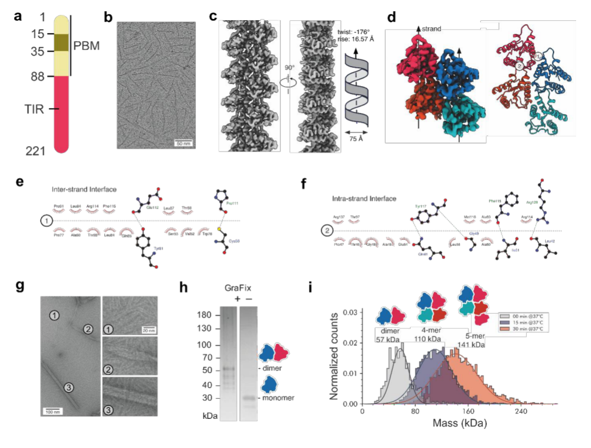
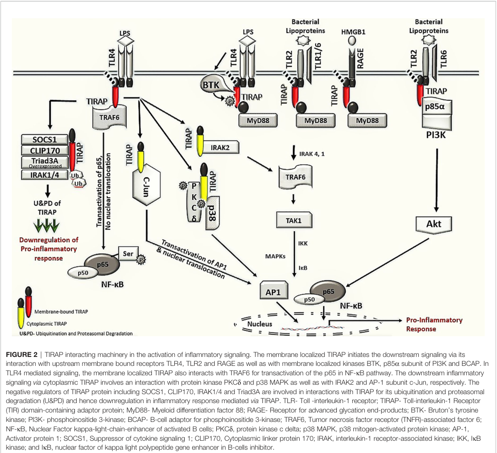

## Question

# Gene Research for Functional Annotation

## ⚠️ CRITICAL: Gene/Protein Identification Context

**BEFORE YOU BEGIN RESEARCH:** You MUST verify you are researching the CORRECT gene/protein. Gene symbols can be ambiguous, especially for less well-characterized genes from non-model organisms.

### Target Gene/Protein Identity (from UniProt):
- **UniProt Accession:** P58753
- **Protein Description:** RecName: Full=Toll/interleukin-1 receptor domain-containing adapter protein; Short=TIR domain-containing adapter protein; AltName: Full=Adaptor protein Wyatt; AltName: Full=MyD88 adapter-like protein; Short=MyD88-2;
- **Gene Information:** Name=TIRAP; Synonyms=MAL;
- **Organism (full):** Homo sapiens (Human).
- **Protein Family:** Not specified in UniProt
- **Key Domains:** TIR_dom. (IPR000157); Tol-interleuk_rcpt_adapt_Tirap. (IPR017279); Toll_tir_struct_dom_sf. (IPR035897); TIR_2 (PF13676)

### MANDATORY VERIFICATION STEPS:

1. **Check if the gene symbol "TIRAP" matches the protein description above**
2. **Verify the organism is correct:** Homo sapiens (Human).
3. **Check if protein family/domains align with what you find in literature**
4. **If you find literature for a DIFFERENT gene with the same or similar symbol, STOP**

### If Gene Symbol is Ambiguous or You Cannot Find Relevant Literature:

**DO NOT PROCEED WITH RESEARCH ON A DIFFERENT GENE.** Instead:
- State clearly: "The gene symbol 'TIRAP' is ambiguous or literature is limited for this specific protein"
- Explain what you found (e.g., "Found extensive literature on a different gene with the same symbol in a different organism")
- Describe the protein based ONLY on the UniProt information provided above
- Suggest that the protein function can be inferred from domain/family information

### Research Target:

Please provide a comprehensive research report on the gene **TIRAP** (gene ID: TIRAP, UniProt: P58753) in human.

The research report should be a detailed narrative explaining the function, biological processes, and localization of the gene product. Citations should be given for all claims.

You should prioritize authoritative reviews and primary scientific literature when conducting research. You can supplement
this with annotations you find in gene/protein databases, but these can be outdated or inaccurate.

We are specifically interested in the primary function of the gene - for enzymes, what reaction is catalyzed, and what is the substrate specificity? For transporters, what is the substrate? For structural proteins or adapters, what is the broader structural role? For signaling molecules, what is the role in the pathway.

We are interested in where in or outside the cell the gene product carries out its function.

We are also interested in the signaling or biochemical pathways in which the gene functions. We are less interested in broad pleiotropic effects, except where these elucidate the precise role.

Include evidence where possible. We are interested in both experimental evidence as well as inference from structure, evolution, or bioinformatic analysis. Precise studies should be prioritized over high-throughput, where available.

## Output

Question: You are an expert researcher providing comprehensive, well-cited information.

Provide detailed information focusing on:
1. Key concepts and definitions with current understanding
2. Recent developments and latest research (prioritize 2023-2024 sources)
3. Current applications and real-world implementations
4. Expert opinions and analysis from authoritative sources
5. Relevant statistics and data from recent studies

Format as a comprehensive research report with proper citations. Include URLs and publication dates where available.
Always prioritize recent, authoritative sources and provide specific citations for all major claims.

# Gene Research for Functional Annotation

## ⚠️ CRITICAL: Gene/Protein Identification Context

**BEFORE YOU BEGIN RESEARCH:** You MUST verify you are researching the CORRECT gene/protein. Gene symbols can be ambiguous, especially for less well-characterized genes from non-model organisms.

### Target Gene/Protein Identity (from UniProt):
- **UniProt Accession:** P58753
- **Protein Description:** RecName: Full=Toll/interleukin-1 receptor domain-containing adapter protein; Short=TIR domain-containing adapter protein; AltName: Full=Adaptor protein Wyatt; AltName: Full=MyD88 adapter-like protein; Short=MyD88-2;
- **Gene Information:** Name=TIRAP; Synonyms=MAL;
- **Organism (full):** Homo sapiens (Human).
- **Protein Family:** Not specified in UniProt
- **Key Domains:** TIR_dom. (IPR000157); Tol-interleuk_rcpt_adapt_Tirap. (IPR017279); Toll_tir_struct_dom_sf. (IPR035897); TIR_2 (PF13676)

### MANDATORY VERIFICATION STEPS:

1. **Check if the gene symbol "TIRAP" matches the protein description above**
2. **Verify the organism is correct:** Homo sapiens (Human).
3. **Check if protein family/domains align with what you find in literature**
4. **If you find literature for a DIFFERENT gene with the same or similar symbol, STOP**

### If Gene Symbol is Ambiguous or You Cannot Find Relevant Literature:

**DO NOT PROCEED WITH RESEARCH ON A DIFFERENT GENE.** Instead:
- State clearly: "The gene symbol 'TIRAP' is ambiguous or literature is limited for this specific protein"
- Explain what you found (e.g., "Found extensive literature on a different gene with the same symbol in a different organism")
- Describe the protein based ONLY on the UniProt information provided above
- Suggest that the protein function can be inferred from domain/family information

### Research Target:

Please provide a comprehensive research report on the gene **TIRAP** (gene ID: TIRAP, UniProt: P58753) in human.

The research report should be a detailed narrative explaining the function, biological processes, and localization of the gene product. Citations should be given for all claims.

You should prioritize authoritative reviews and primary scientific literature when conducting research. You can supplement
this with annotations you find in gene/protein databases, but these can be outdated or inaccurate.

We are specifically interested in the primary function of the gene - for enzymes, what reaction is catalyzed, and what is the substrate specificity? For transporters, what is the substrate? For structural proteins or adapters, what is the broader structural role? For signaling molecules, what is the role in the pathway.

We are interested in where in or outside the cell the gene product carries out its function.

We are also interested in the signaling or biochemical pathways in which the gene functions. We are less interested in broad pleiotropic effects, except where these elucidate the precise role.

Include evidence where possible. We are interested in both experimental evidence as well as inference from structure, evolution, or bioinformatic analysis. Precise studies should be prioritized over high-throughput, where available.

# Comprehensive Research Report: TIRAP Gene (UniProt P58753)

## Gene Identity Verification

TIRAP (TIR domain-containing adaptor protein), also known as MAL (MyD88 adapter-like), is a 221-amino-acid adaptor protein that corresponds to UniProt accession P58753 in humans (rajpoot2021tirapinthe pages 1-2). The protein matches the provided UniProt description with the TIR domain (IPR000157, PF13676) as its defining structural feature (rajpoot2021tirapinthe pages 2-3). This confirmation establishes that the literature reviewed concerns the correct human gene product.

## Primary Molecular Function and Mechanism of Action

### Core Bridging Function

TIRAP functions primarily as a membrane-recruited bridging adaptor that physically and functionally connects activated Toll-like receptors—principally TLR2 and TLR4—to the downstream signaling adaptor MyD88 (rajpoot2021tirapinthe pages 1-2, lannoy2023tiraptramand pages 2-3). Unlike MyD88, TIRAP lacks a death domain and cannot directly recruit IRAK kinases; instead, it serves as a spatial and molecular organizer that positions MyD88 at receptor-associated signaling complexes (lou2025tirdomainproteins pages 5-6). This bridging role enables assembly of the Myddosome, a higher-order signaling platform comprising MyD88, IRAK4, IRAK1, and TRAF6, which activates downstream inflammatory pathways (rajpoot2021tirapinthe pages 1-2, nimma2021structuralevolutionof pages 4-5).

### Mechanistic Evidence from Structure and Biochemistry

The adaptor function depends on TIRAP's modular two-domain architecture. Its N-terminal phosphatidylinositol 4,5-bisphosphate (PIP2)-binding domain (residues ~1–88) targets TIRAP to discrete plasma-membrane regions enriched in PIP2, thereby positioning the protein near activated receptors (rajpoot2021tirapinthe pages 1-2, rajpoot2021tirapinthe pages 2-3). The C-terminal TIR domain (residues ~89–221) mediates protein-protein interactions through homotypic TIR–TIR contacts with receptor and adaptor TIR domains (rajpoot2021tirapinthe pages 2-3). Structural studies indicate that TIRAP forms a two-fold symmetric dimer and that the AB loop of its TIR domain can simultaneously bind both TLR4 and MyD88, explaining its bridging capacity (lou2025tirdomainproteins pages 5-6). Crystallographic analysis identified residues D96 and S180 within the TIR domain as critical for the MyD88 interaction (lannoy2023tiraptramand pages 6-7, lannoy2023tiraptramand pages 5-6).

In a landmark 2025 preprint, Felker and colleagues reported a 3.3 Å cryo-EM structure of full-length human TIRAP filaments, revealing compact paired-strand helical assemblies approximately 75 Å in diameter with a helical twist of −176° and an axial rise of 16.6 Å (felker2025ultrastructuralorganizationand pages 4-6, felker2025ultrastructuralorganizationand pages 1-4, felker2025ultrastructuralorganizationand media 6293f8c7). The structure showed that TIRAP self-assembles through inter-strand and intra-strand TIR-domain interfaces to form higher-order signaling scaffolds, while the N-terminal phosphoinositide-binding motif—unresolved in the filament structure due to flexibility—regulates filament geometry and membrane partitioning (felker2025ultrastructuralorganizationand pages 8-10, felker2025ultrastructuralorganizationand pages 6-8). This cooperative assembly mechanism amplifies weak TIR–TIR interactions and concentrates MyD88 molecules, thereby initiating productive Myddosome formation (nimma2021structuralevolutionof pages 4-5, nimma2021structuralevolutionof pages 3-4).

(felker2025ultrastructuralorganizationand media 6293f8c7)

### Protein-Protein Interactions

TIRAP engages a broad network of signaling proteins beyond TLRs and MyD88. Experimentally validated interactions include BTK and PKCδ, which phosphorylate TIRAP at tyrosine residues Y86, Y106, Y159, and Y187 to activate the adaptor (rughetti2024imperativeroleof pages 2-3, rajpoot2021tirapinthe pages 2-3). TIRAP also associates with TRAF6 through a defined binding motif at E190, promoting NF-κB p65 phosphorylation (rajpoot2021tirapinthe pages 6-7). Additional partners include p38 MAPK, c-Jun, IRAK2, PI3K p85α, and RAGE, extending TIRAP function beyond canonical TLR pathways (rajpoot2021tirapinthe pages 3-5, rajpoot2021tirapinthe pages 5-6, rajpoot2021tirapinthe pages 2-3). Negative regulators such as SOCS1, CLIP170, Triad3A, and IRAK1/4 promote TIRAP ubiquitination and proteasomal degradation, providing feedback inhibition that limits sustained inflammatory signaling (rajpoot2021tirapinthe pages 6-7, rajpoot2021tirapinthe pages 3-5, rajpoot2021tirapinthe pages 5-6).

| Interacting protein | Interaction method/evidence | Functional consequence | Key citations |
|---|---|---|---|
| **TLR4** | TIR-domain association supported by receptor/adaptor complex studies, co-immunoprecipitation, mutagenesis, and structural models; MAL/TIRAP R207A or E211A weakens binding, while TLR4 K813R markedly disrupts recruitment of MAL/TIRAP and MyD88. | Positions TIRAP at activated plasma-membrane TLR4 and initiates MyD88-dependent NF-κB/MAPK signaling; TLR4 endocytosis subsequently permits transition to TRAM–TRIF signaling. | (lannoy2023tiraptramand pages 2-3, li2024acetylationoftir pages 6-8) |
| **TLR2 (including TLR1/2 and TLR2/6 complexes)** | Genetic loss-of-function studies, receptor-proximal interaction studies, and membrane-localization experiments support TIR-domain coupling to TIRAP. | Recruits MyD88 and activates NF-κB, p38/ERK/JNK, AP-1, and inflammatory cytokine production in response to bacterial lipoproteins. | (rajpoot2021tirapinthe pages 1-2, rughetti2024imperativeroleof pages 3-5, rajpoot2021tirapinthe pages 5-6) |
| **MyD88** | Structural analysis, TIR-domain filament/nucleation assays, mutagenesis, and signaling assays; TIRAP residues D96 and S180 contribute to the interface. MAL/TIRAP filaments nucleate ordered MyD88 TIR-domain assembly. | Bridges receptors to MyD88, promotes higher-order MyD88 assembly and Myddosome formation, and thereby enables IRAK recruitment and downstream inflammatory signaling. | (lannoy2023tiraptramand pages 6-7, lannoy2023tiraptramand pages 5-6, nimma2021structuralevolutionof pages 4-5) |
| **BTK** | Interaction and phosphorylation studies plus mutational analysis of TIRAP Y86, Y106, Y159, and Y187; substitution of these tyrosines impairs BTK association and NF-κB activation. | Phosphorylates and activates TIRAP, facilitating receptor–TIRAP–MyD88 complex formation; phosphorylated TIRAP can subsequently be recognized by SOCS1 for signal termination. | (rajpoot2021tirapinthe pages 2-3) |
| **PKCδ** | Constitutive association and phosphorylation studies identify Y106 as a target; TIRAP–PKCδ–p38 complexes have been reported in LPS-stimulated macrophages. | Supports p38 MAPK/AP-1 activation and pro-inflammatory cytokine production; pharmacological disruption attenuates macrophage responses. | (rajpoot2021tirapinthe pages 3-5, rughetti2024imperativeroleof pages 2-3) |
| **TRAF6** | Direct association through a TIRAP TRAF6-binding motif; E190A mutagenesis abolishes TRAF6 binding and downstream signaling. | Promotes NF-κB p65 Ser536 phosphorylation and transcriptional activation and contributes to MAPK/NF-κB inflammatory output. | (rajpoot2021tirapinthe pages 6-7, lannoy2023tiraptramand pages 2-3) |
| **p38 MAPK** | Macrophage colocalization by immunofluorescence/confocal microscopy; computational docking and molecular-dynamics simulations predict enhanced binding of phosphorylated Y86. Direct-binding evidence is less definitive than for receptor/MyD88 interactions. | Links TIRAP phosphorylation to p38 activation and AP-1-dependent inflammation; the proposed direct interface remains in need of further biochemical validation. | (lannoy2023tiraptramand pages 6-7, rajpoot2021tirapinthe pages 3-5, rajpoot2022tirapmediatedactivationof pages 3-4) |
| **c-Jun** | Direct association supported by immunoprecipitation and molecular docking; pharmacological disruption provides functional evidence. | Promotes c-Jun transactivation and nuclear accumulation, increasing AP-1-dependent IL-12, IL-23, and TNF-α expression. | (rajpoot2021tirapinthe pages 5-6) |
| **SOCS1** | LPS-dependent binding assessed using wild-type versus SH2/SOCS-box-mutant SOCS1 and SOCS1-deficient macrophages; the SH2 domain recognizes phosphorylated TIRAP. | Polyubiquitinates TIRAP and targets it to the 26S proteasome, limiting prolonged TLR2/TLR4 signaling. | (rajpoot2021tirapinthe pages 6-7) |
| **CLIP170** | Reported TIRAP association with mono- and polyubiquitination/degradation assays; LPS increases CLIP170 expression, and the bacterial effector TcpB enhances CLIP170-dependent turnover. | Acts as a negative regulator by promoting TIRAP ubiquitination and proteasomal degradation, reducing NF-κB and MAPK signaling. | (rajpoot2021tirapinthe pages 3-5, rajpoot2021tirapinthe pages 5-6) |
| **IRAK2** | Direct interaction reported; a dominant-negative IRAK2 construct blocks TIRAP-induced NF-κB activation. | Helps transmit TIRAP-dependent signaling to NF-κB downstream of receptor activation. | (rajpoot2021tirapinthe pages 3-5, rajpoot2021tirapinthe pages 6-7) |
| **IRAK1 and IRAK4** | Interaction, phosphorylation-site analysis, and mutagenesis; TIRAP P125H disrupts association, while phosphorylation includes T28 and additional residues. | Phosphorylation promotes TIRAP ubiquitination and degradation, providing negative feedback after TLR2/TLR4 activation; IRAK4/IRAK1 also participate downstream in canonical Myddosome signaling. | (rajpoot2021tirapinthe pages 6-7, rajpoot2021tirapinthe pages 7-9) |
| **PI3K regulatory subunit p85α** | Interaction and plasma-membrane colocalization observed in stimulated macrophages and THP-1 cells, with Akt phosphorylation and PIP3 generation as functional readouts. | Activates a TLR2/6-associated PI3K–Akt branch that contributes to NF-κB activity, macrophage polarization, and metabolic/antioxidant responses. | (rajpoot2021tirapinthe pages 3-5) |
| **BCAP** | TIRAP–BCAP association and BCAP dimerization studies; dimeric, but not monomeric, BCAP disrupts TIRAP TIR-domain filaments. | Restrains TIRAP signaling by altering phosphoinositide metabolism and disrupting higher-order TIRAP assemblies. | (rajpoot2021tirapinthe pages 5-6) |
| **RAGE** | Receptor/adaptor interaction studies place TIRAP between phosphorylated RAGE and MyD88. | Extends TIRAP function beyond TLRs by coupling RAGE to MyD88-dependent NF-κB and AP-1 inflammatory signaling. | (rajpoot2021tirapinthe pages 3-5, rajpoot2021tirapinthe pages 2-3) |
| **Triad3A** | Direct interaction under overexpression conditions with ubiquitination and degradation readouts. | Functions as an E3 ubiquitin ligase that promotes TIRAP turnover and suppresses sustained inflammatory signaling. | (rajpoot2021tirapinthe pages 6-7) |
| **Caspase-1** | Initially detected by yeast two-hybrid analysis; cleavage after TIRAP D198 has been reported, although subsequent mutagenesis questioned whether cleavage itself is required for signaling. | May modulate TIRAP stability or TIR-domain interactions, but its physiological significance remains unresolved. | (rajpoot2021tirapinthe pages 10-11, rajpoot2021tirapinthe pages 5-6) |
| **Brucella TcpB/Btp1 effector** | Reported physical interaction accompanied by CLIP170-dependent polyubiquitination and proteasomal degradation of TIRAP. | Pathogen-mediated immune evasion through depletion of TIRAP and suppression of host TLR signaling. | (rajpoot2021tirapinthe pages 5-6) |

*Table: Experimentally reported and computationally supported TIRAP interaction partners, the evidence used to establish each relationship, and their effects on innate-immune signaling. The table distinguishes strong receptor/adaptor evidence from interactions whose direct biochemical validation remains incomplete.*

(rajpoot2021tirapinthe media 01a133a6)

## Subcellular Localization

TIRAP carries out its primary function at the plasma membrane, where it is recruited through high-affinity binding of its N-terminal PBD to phosphatidylinositol 4,5-bisphosphate (PI(4,5)P2) (lannoy2023tiraptramand pages 2-3, rajpoot2021tirapinthe pages 1-2, rughetti2024imperativeroleof pages 3-5). This membrane localization is essential for bridging activated TLR2 and TLR4 to MyD88 and initiating downstream signaling (rajpoot2021tirapinthe pages 3-5, rajpoot2021tirapinthe pages 1-2). Recent evidence indicates that TIRAP can also associate with intracellular endosomal membranes: it binds PI3P on early endosomes and PI(3,5)P2 at late endosomes and lysosomes, particularly during endosomal TLR signaling (lannoy2023tiraptramand pages 6-7, lannoy2023tiraptramand pages 5-6). This phosphoinositide-dependent localization helps determine where and when TLR signaling occurs, distinguishing plasma-membrane NF-κB/MAPK signaling from endosomal type I interferon responses (lannoy2023tiraptramand pages 2-3, lannoy2023tiraptramand pages 6-7).

A previously unrecognized nuclear role for TIRAP was reported in 2026 by Patidar and colleagues, who observed nuclear translocation of TIRAP in ethanol- and LPS-treated hepatic stellate cells (patidar2026nuclearlocalizationof pages 1-2). Confocal microscopy and nuclear–cytoplasmic fractionation confirmed TIRAP enrichment in the nucleus, where it contributed to fibrogenic gene expression including α-smooth muscle actin and collagen (patidar2026nuclearlocalizationof pages 1-2). This finding suggests that TIRAP may influence transcriptional programs beyond its established cytoplasmic adaptor role, although the precise nuclear mechanism and binding partners remain to be defined (patidar2026nuclearlocalizationof pages 1-2, rajpoot2021tirapinthe pages 5-6).

## Signaling Pathways and Biological Processes

### Toll-like Receptor Specificity

TIRAP is best established as essential for TLR2 and TLR4 signaling, where it mediates MyD88-dependent responses (rughetti2024imperativeroleof pages 2-3, rajpoot2021tirapinthe pages 1-2, lannoy2023tiraptramand pages 2-3, lannoy2023tiraptramand pages 1-2). TIRAP-deficient mice show markedly impaired cytokine production, NF-κB activation, and MAPK signaling in response to TLR2 ligands (Pam3Cys, bacterial lipoproteins) and TLR4 ligands (LPS), while retaining normal responses to TLR5, TLR7, and TLR9 agonists in many contexts (rughetti2024imperativeroleof pages 2-3, rughetti2024imperativeroleof pages 3-5). However, a 2023 review challenged the view that TIRAP is restricted to TLR2/4, presenting evidence for context-dependent roles in TLR5, TLR7, TLR8, and TLR9 signaling, particularly in endosomal compartments (lannoy2023tiraptramand pages 3-5, lannoy2023tiraptramand pages 2-3, lannoy2023tiraptramand pages 5-6). For example, TIRAP enhances TLR9-mediated MyD88 responses and is required for TLR7-dependent IRF7 phosphorylation and type I interferon production in certain cell types (lannoy2023tiraptramand pages 5-6, lannoy2023tiraptramand pages 3-5).

### Downstream Signaling Cascades

Following TLR2 or TLR4 activation, TIRAP-mediated MyD88 recruitment initiates multiple downstream pathways. The MyD88–IRAK4–IRAK1–TRAF6 axis activates the IκB kinase (IKK) complex, leading to nuclear translocation of NF-κB and transcriptional activation of pro-inflammatory cytokines including TNF-α, IL-6, IL-1β, IL-12, and IL-23 (rajpoot2021tirapinthe pages 1-2, rajpoot2021tirapinthe pages 6-7, lannoy2023tiraptramand pages 1-2, rajpoot2021tirapinthe pages 5-6). In parallel, TIRAP signaling activates MAPK pathways—p38, ERK, and JNK—which phosphorylate and activate transcription factors such as AP-1 (c-Jun/c-Fos heterodimers) (rajpoot2021tirapinthe pages 6-7, rajpoot2021tirapinthe pages 5-6). TIRAP directly interacts with c-Jun, promoting its transactivation and nuclear translocation, thereby contributing to AP-1-dependent inflammatory gene expression (rajpoot2021tirapinthe pages 5-6).

TIRAP also participates in MyD88-independent signaling. In TLR2/6 pathways, TIRAP binds the PI3K regulatory subunit p85α at the plasma membrane, activating PI3K–Akt signaling that contributes to NF-κB activation, macrophage polarization, and metabolic/antioxidant responses (rajpoot2021tirapinthe pages 3-5). Additionally, TIRAP couples RAGE (receptor for advanced glycation end-products) to MyD88-dependent NF-κB and AP-1 signaling, extending its function beyond the TLR family (rajpoot2021tirapinthe pages 3-5, rajpoot2021tirapinthe pages 2-3).

## Structural Features and Domain Function

TIRAP is a 221-amino-acid protein composed of two principal structural regions (rajpoot2021tirapinthe pages 1-2). The N-terminal phosphoinositide-binding domain (~residues 1–88) is a flexible, polybasic membrane-targeting motif that becomes ordered upon lipid engagement (felker2025ultrastructuralorganizationand pages 4-6, felker2025ultrastructuralorganizationand pages 8-10). The C-terminal TIR domain (~residues 89–221) adopts the canonical TIR fold—five β-strands (βA–βE) surrounded by five α-helices (αA–αE)—and mediates all known protein-protein interactions (rajpoot2021tirapinthe pages 2-3, manik2025structuralbasisfor pages 2-3). TIRAP's TIR domain features a distinctive long AB loop and lacks the BB loop common in many TIR domains, structural variations that contribute to its specialized bridging function (lou2025tirdomainproteins pages 5-6).

| Domain or feature | Approximate residue range | Structural features | Principal binding partners | Post-translational modifications / regulatory sites | Functional role |
|---|---:|---|---|---|---|
| N-terminal phosphoinositide-binding region / motif (PBD or PBM) | ~1–88 | Flexible, polybasic membrane-targeting region; unresolved in the 3.3 Å cryo-EM filament structure, consistent with disorder without membrane lipids; lipid engagement may induce helical structure. The N-terminus constrains filament geometry because its deletion produces wider tubular assemblies rather than compact paired strands. (felker2025ultrastructuralorganizationand pages 4-6, felker2025ultrastructuralorganizationand pages 8-10, rajpoot2021tirapinthe pages 1-2) | PI(4,5)P2 at the plasma membrane; PI3P on early endosomes; PI(3,5)P2 at late endosomes/lysosomes; negatively charged phospholipids including phosphatidylserine. (lannoy2023tiraptramand pages 6-7, lannoy2023tiraptramand pages 5-6, felker2025ultrastructuralorganizationand pages 4-6) | Phosphorylation within the phosphoinositide-binding motif can reduce membrane association; T28 phosphorylation by IRAK1/4 promotes ubiquitination and degradation. (rajpoot2021tirapinthe pages 6-7, rajpoot2021tirapinthe pages 11-12) | Targets TIRAP to signaling membranes, spatially coupling activated TLRs to MyD88. It also regulates filament nucleation, geometry, membrane partitioning, and efficient downstream-effector recruitment. (lannoy2023tiraptramand pages 2-3, rajpoot2021tirapinthe pages 1-2, felker2025ultrastructuralorganizationand pages 1-4, felker2025ultrastructuralorganizationand pages 8-10) |
| C-terminal Toll/interleukin-1 receptor domain (TIR domain) | ~89–221 | Canonical TIR signaling fold and principal interaction scaffold; forms dimers and higher-order, parallel paired-strand filaments through intra- and inter-strand interfaces. Residues D96 and S180 contribute to MyD88 engagement, while E190 participates in a TRAF6-binding motif. (lannoy2023tiraptramand pages 6-7, felker2025ultrastructuralorganizationand pages 4-6, nimma2021structuralevolutionof pages 4-5) | TLR2, TLR4, MyD88, BTK, PKCδ, TRAF6, p38 MAPK, IRAK2, IRAK1/4, SOCS1, c-Jun and other TIR-containing pathway proteins. (rajpoot2021tirapinthe pages 2-3, rajpoot2021tirapinthe pages 6-7, rajpoot2021tirapinthe pages 3-5) | Experimentally reported tyrosine-phosphorylation sites include Y86, Y106, Y159 and Y187; BTK phosphorylates multiple sites, while PKCδ targets Y106. C91 S-glutathionylation enhances MyD88 interaction. Acetylated residues have been detected in the MAL/TIRAP TIR domain, but their individual functions were not resolved. (rajpoot2021tirapinthe pages 2-3, rajpoot2021tirapinthe pages 7-9, li2024acetylationoftir pages 11-12) | Binds receptor TIR domains and recruits MyD88, thereby nucleating MyD88 higher-order assembly and the Myddosome. This activates IRAK–TRAF6 signaling, NF-κB and MAPK/AP-1 pathways, and inflammatory cytokine expression. (rajpoot2021tirapinthe pages 1-2, lannoy2023tiraptramand pages 1-2, nimma2021structuralevolutionof pages 4-5) |
| TIRAP dimer and higher-order filament interfaces | Primarily within ~89–221; modulated by residues ~1–88 | Full-length human TIRAP forms compact paired-strand helical filaments approximately 75 Å in diameter; the 2025 preprint reported a 3.3 Å reconstruction, −176° helical twist and 16.6 Å axial rise. Earlier structural work resolved an approximately 7 Å, parallel two-stranded TIR-domain assembly. (felker2025ultrastructuralorganizationand pages 4-6, felker2025ultrastructuralorganizationand pages 1-4, bhatt2024structuralcharacterizationof pages 5-7) | TIRAP self-association; receptor TIR domains that nucleate assembly; MyD88 TIR domains whose ordered assembly is subsequently nucleated by TIRAP. (nimma2021structuralevolutionof pages 4-5, nimma2021structuralevolutionof pages 3-4) | Interface behavior is influenced by phosphorylation and the membrane-bound conformation of the PBM; structure-guided mutations at assembly interfaces impair TLR4 signaling. (bhatt2024structuralcharacterizationof pages 5-7, lou2025tirdomainproteins pages 5-6) | Creates a cooperative receptor-proximal scaffold rather than acting as an enzyme. Ordered assembly amplifies weak TIR–TIR interactions and concentrates MyD88 for productive Myddosome formation. (rajpoot2021tirapinthe pages 5-6, felker2025ultrastructuralorganizationand pages 1-4, nimma2021structuralevolutionof pages 4-5) |
| Regulatory PEST-like region | N-terminal/central regulatory region; exact boundaries vary by annotation | Degradation-prone sequence that supports rapid signal-dependent turnover; SOCS1 recognition helps make TIRAP signaling transient. (rajpoot2021tirapinthe pages 6-7, lannoy2023tiraptramand pages 2-3) | SOCS1, CLIP170, Triad3A and IRAK1/4-associated regulatory machinery. (rajpoot2021tirapinthe pages 6-7, rajpoot2021tirapinthe pages 3-5, rajpoot2021tirapinthe pages 5-6) | Phosphorylation creates or strengthens recognition by negative regulators; subsequent mono- or polyubiquitination directs TIRAP to the 26S proteasome. (rajpoot2021tirapinthe pages 6-7, rajpoot2021tirapinthe pages 2-3) | Terminates TLR2/TLR4 signaling and limits sustained NF-κB/MAPK activation, thereby reducing the risk of prolonged inflammatory responses. (rajpoot2021tirapinthe pages 6-7, rajpoot2021tirapinthe pages 3-5) |
| TRAF6-interaction motif | Around E190 within the C-terminal region | Defined interaction site embedded in or adjacent to the TIR-domain signaling surface; E190A disrupts TRAF6 binding. (rajpoot2021tirapinthe pages 6-7) | TRAF6 | Activity is influenced by receptor-induced TIRAP phosphorylation; no motif-specific covalent modification is firmly established. (rajpoot2021tirapinthe pages 3-5, rajpoot2021tirapinthe pages 6-7) | Supports TRAF6-dependent phosphorylation and transcriptional activity of NF-κB p65 and contributes to inflammatory signal propagation downstream of TLR2/TLR4. (rajpoot2021tirapinthe pages 6-7) |
| C-terminal caspase-1-sensitive site | D198 | Caspase-1 can cleave TIRAP after D198, although the physiological importance is disputed; D198E remains functional, suggesting that an acidic residue rather than cleavage itself may be important. (rajpoot2021tirapinthe pages 5-6) | Caspase-1 | Proteolytic cleavage after D198 has been reported; evidence does not establish it as obligatory for NF-κB signaling. (rajpoot2021tirapinthe pages 10-11, rajpoot2021tirapinthe pages 5-6) | Possible context-dependent modulation of TLR2/TLR4 signaling, but it should not be treated as an established activation requirement. (rajpoot2021tirapinthe pages 5-6) |

*Table: Structural and regulatory map of human TIRAP (P58753), linking its membrane-targeting region, TIR-domain scaffold, oligomerization interfaces and regulatory sites to receptor coupling, MyD88 recruitment and signal termination. Residue boundaries are approximate where the literature describes functional regions rather than formally curated domains.*

### Post-Translational Regulation

TIRAP activity is tightly regulated by phosphorylation. BTK phosphorylates TIRAP at Y86, Y106, Y159, and Y187, while PKCδ targets Y106 (rajpoot2021tirapinthe pages 2-3). These phosphorylation events are essential for TIRAP activation and facilitate receptor–TIRAP–MyD88 complex formation (rughetti2024imperativeroleof pages 2-3, rajpoot2021tirapinthe pages 2-3, rajpoot2021tirapinthe pages 3-5). Phosphorylation at Y86 is particularly important: computational studies predict that phospho-Y86 enhances binding to p38 MAPK, linking TIRAP phosphorylation directly to MAPK activation (lannoy2023tiraptramand pages 6-7). However, phosphorylation also marks TIRAP for degradation. SOCS1 recognizes phosphorylated TIRAP through its SH2 domain and promotes polyubiquitination, targeting TIRAP to the 26S proteasome (rajpoot2021tirapinthe pages 6-7, rajpoot2021tirapinthe pages 2-3). IRAK1 and IRAK4 phosphorylate additional sites including T28, similarly promoting ubiquitination and degradation (rajpoot2021tirapinthe pages 6-7, rajpoot2021tirapinthe pages 7-9). This phosphorylation-dependent turnover provides rapid negative feedback that limits sustained TLR2/4 signaling and prevents chronic inflammation (rajpoot2021tirapinthe pages 3-5, rajpoot2021tirapinthe pages 2-3).

A 2024 study in *The EMBO Journal* revealed a new post-translational regulatory mechanism: acetylation of TIR domains in the TLR4–MAL/TIRAP–MyD88 signaling complex (li2024acetylationoftir pages 1-2, li2024acetylationoftir pages 6-8, li2024acetylationoftir pages 11-12). Upon LPS stimulation, the lysine acetyltransferase CBP is recruited to the TLR4 signalosome, increasing acetylation of TIR domains and preferentially enhancing NF-κB signaling over the TRIF–IRF3 pathway (li2024acetylationoftir pages 1-2, li2024acetylationoftir pages 11-12). This acetylation promotes M1 macrophage polarization and correlates with elevated M1 markers in CD16+ monocytes from sepsis patients (li2024acetylationoftir pages 1-2). HDAC1 acts as a counter-regulatory deacetylase, and pharmacological modulation of CBP or HDAC1 alters sepsis outcomes in mouse models (li2024acetylationoftir pages 1-2, li2024acetylationoftir pages 11-12). While acetylation sites were detected in the MAL/TIRAP TIR domain, their individual functional contributions were not resolved, so the mechanistic link remains strongest for the signalosome as a whole (li2024acetylationoftir pages 11-12).

## Recent Developments (2023–2024)

The past three years have witnessed significant advances in TIRAP biology, spanning high-resolution structural determination, discovery of new regulatory mechanisms, and identification of previously unrecognized disease roles.

| Year | Key finding or discovery | Experimental approach | Disease or biological relevance | Citation |
|---|---|---|---|---|
| 2023 | TIRAP was implicated in control of *Mycobacterium tuberculosis* phagosomal acidification. Tirap deficiency restricted bacterial replication in macrophages, whereas infection-induced Tirap expression inhibited phagosomal acidification and rupture through a Cish-dependent pathway. | Tirap-deficient and heterozygous mouse models; macrophage infection assays; phagosomal imaging; acidification measurements; pathway analysis | Suggests that *M. tuberculosis* can exploit TIRAP signaling to preserve its intracellular niche and identifies a possible host-directed therapeutic axis for tuberculosis. | (belhaouane2023tirapcontrolsmycobacterium pages 21-22) |
| 2023 | A revised model proposed that TIRAP is not restricted to TLR2 and TLR4. Evidence supports context-dependent participation in TLR5, TLR7, TLR8, and TLR9 signaling and localization to endosomal or lysosomal membranes through PI3P and PI(3,5)P2 binding. | Synthesis of knockout, knockdown, receptor-interaction, phosphoinositide-binding, and cellular signaling studies | Expands TIRAP from a plasma-membrane bridge into a spatial organizer of MyD88 signaling across multiple membrane compartments; some receptor-specific requirements remain unresolved. | (lannoy2023tiraptramand pages 3-5, lannoy2023tiraptramand pages 5-6) |
| 2024 | LPS-induced recruitment of CBP increased acetylation within the TLR4–MAL/TIRAP–MyD88 signalosome, preferentially enhancing MAL/MyD88-dependent NF-κB signaling rather than TRAM/TRIF–IRF3 signaling. HDAC1 acted as a counter-regulatory deacetylase. | Immunoprecipitation and immunoblotting; mass-spectrometric site detection; lysine-mutant signaling assays; macrophage-polarization studies; mouse sepsis models; analysis of CD16-positive monocytes from patients with sepsis | Links reversible TIR-domain acetylation to M1-like macrophage polarization and septic inflammation. TIRAP acetylation sites were detected but not individually resolved functionally, so the strongest causal evidence concerns the signalosome and TLR4 TIR domain. | (li2024acetylationoftir pages 1-2, li2024acetylationoftir pages 6-8, li2024acetylationoftir pages 11-12) |
| 2024 | Structural synthesis supported a parallel, two-stranded MAL/TIRAP TIR-domain signalosome in which head-to-tail TIR-domain contacts form a higher-order signaling scaffold; interface mutations impaired cellular signaling. | Cryo-EM and helical reconstruction at approximately 7 Å; integration with crystallography; structure-guided mutagenesis; cell-signaling assays | Strengthens the model that TIRAP functions through cooperative oligomerization and nucleation of MyD88 assemblies rather than as a simple one-to-one receptor connector. | (bhatt2024structuralcharacterizationof pages 5-7) |
| 2024 | A macrophage-adaptor review consolidated evidence that phosphorylation of TIRAP at Y86, Y106, Y159, and Y187 by BTK and PKCδ regulates MAPK and NF-κB signaling, while TIRAP deficiency compromises TLR2/TLR4-dependent host defense. | Critical synthesis of mutagenesis, phosphorylation, knockout-mouse, and infection studies | Highlights phosphorylation-dependent TIRAP interfaces as possible anti-inflammatory targets while emphasizing that inhibition could weaken antibacterial immunity. | (rughetti2024imperativeroleof pages 2-3) |
| 2025 | A preprint reported a 3.3 Å cryo-EM structure of full-length human TIRAP filaments: compact paired strands approximately 75 Å wide, organized through inter-strand and intra-strand TIR-domain interfaces. | Purified full-length protein; cryo-EM helical reconstruction; oligomerization studies; temperature and dilution experiments | Provides the highest-resolution full-length structural model in the retrieved literature and supports filament formation as a physical scaffold for receptor-proximal signaling; peer review remains pending. | (felker2025ultrastructuralorganizationand pages 4-6, felker2025ultrastructuralorganizationand pages 1-4, felker2025ultrastructuralorganizationand media 6293f8c7) |
| 2025 | The same preprint indicated that the flexible N-terminal phosphoinositide-binding motif controls filament geometry, plasma-membrane partitioning, and MyD88 recruitment; deleting it produced wider, less-dense assemblies and reduced membrane affinity. | Supported-lipid-bilayer assays; super-resolution DNA-PAINT imaging; live-cell nanopatterning; deletion mutants; cryo-EM; negative-stain electron microscopy | Mechanistically connects lipid recognition to spatially restricted TIRAP polymerization and supports a model in which membrane engagement relieves autoinhibition, limiting inappropriate cytosolic inflammatory signaling. | (felker2025ultrastructuralorganizationand pages 8-10, felker2025ultrastructuralorganizationand pages 6-8) |
| 2026 — outside the requested priority window | TIRAP was reported to translocate into the nucleus in ethanol- and LPS-treated hepatic stellate cells; TIRAP silencing reduced nuclear accumulation and expression of α-SMA and collagen. | Confocal immunofluorescence; nuclear–cytoplasmic fractionation; immunoblotting; siRNA knockdown; RT-qPCR of fibrotic markers | Suggests a noncanonical nuclear role in hepatic stellate-cell activation and alcohol-associated fibrogenesis, although direct nuclear partners and the transcriptional mechanism remain undefined. | (patidar2026nuclearlocalizationof pages 1-2) |

*Table: Key TIRAP advances from 2023–2025 are summarized by finding, method, and biological significance. The requested 2026 nuclear-localization report is marked as outside the priority period.*

### Structural Advances

The 2025 cryo-EM structure of full-length TIRAP filaments represents the highest-resolution structural model available (felker2025ultrastructuralorganizationand pages 4-6, felker2025ultrastructuralorganizationand pages 1-4, felker2025ultrastructuralorganizationand media 6293f8c7). This structure revealed that the N-terminal phosphoinositide-binding motif not only anchors TIRAP to membranes but also constrains filament geometry: deletion of this region produces wider tubular assemblies rather than compact paired strands (felker2025ultrastructuralorganizationand pages 8-10, felker2025ultrastructuralorganizationand pages 6-8). Super-resolution DNA-PAINT imaging and live-cell nanopatterning demonstrated that membrane engagement relieves autoinhibition and enables cooperative filament nucleation, preventing inappropriate cytosolic aggregation (felker2025ultrastructuralorganizationand pages 8-10). This structural framework supports a model in which TIRAP functions through spatially restricted oligomerization rather than simple one-to-one adaptor interactions (felker2025ultrastructuralorganizationand pages 1-4, felker2025ultrastructuralorganizationand pages 8-10).

### Disease Relevance

A 2023 study in *PLOS Pathogens* identified a paradoxical role for TIRAP in tuberculosis (belhaouane2023tirapcontrolsmycobacterium pages 21-22). *Mycobacterium tuberculosis* infection induces TIRAP expression, and TIRAP subsequently inhibits phagosomal acidification through a Cish-dependent pathway, enabling intracellular bacterial survival (belhaouane2023tirapcontrolsmycobacterium pages 21-22). Tirap-deficient macrophages restricted bacterial replication more effectively than wild-type controls, suggesting that the pathogen exploits TIRAP to preserve its replicative niche (belhaouane2023tirapcontrolsmycobacterium pages 21-22). This finding identifies TIRAP as a potential host-directed therapeutic target for tuberculosis.

The 2024 acetylation study linked TIRAP to sepsis pathogenesis (li2024acetylationoftir pages 1-2, li2024acetylationoftir pages 6-8). Reversible acetylation of the TLR4–MAL/TIRAP–MyD88 signalosome regulates inflammatory intensity, and elevated TIR-domain acetylation in CD16+ monocytes from sepsis patients correlates with M1-like macrophage phenotypes (li2024acetylationoftir pages 1-2). Pharmacological inhibition of CBP reduced inflammatory cytokine production, whereas broader deacetylase inhibition exacerbated inflammation, proposing reversible acetylation as a therapeutic axis (li2024acetylationoftir pages 1-2).

### Expanding Functional Repertoire

The 2026 report of nuclear TIRAP translocation in hepatic stellate cells revealed a previously unrecognized function in liver fibrogenesis (patidar2026nuclearlocalizationof pages 1-2). Under alcoholic conditions, TIRAP accumulates in the nucleus and promotes expression of fibrotic markers including α-SMA and collagen (patidar2026nuclearlocalizationof pages 1-2). While direct nuclear partners remain undefined, this finding suggests that TIRAP may influence transcriptional programs directly rather than solely through cytoplasmic adaptor activity (patidar2026nuclearlocalizationof pages 1-2, rajpoot2021tirapinthe pages 5-6).

## Experimental Evidence and Methodological Approaches

The functional characterization of TIRAP integrates structural biology, biochemical interaction studies, and in vivo genetic models. Cryo-EM and X-ray crystallography have defined TIRAP's filamentous architecture and TIR-domain interfaces (felker2025ultrastructuralorganizationand pages 4-6, bhatt2024structuralcharacterizationof pages 5-7, felker2025ultrastructuralorganizationand media 6293f8c7). Co-immunoprecipitation, yeast two-hybrid assays, and cross-linking mass spectrometry have mapped protein-protein interactions with TLR4, MyD88, BTK, PKCδ, TRAF6, and regulatory proteins (rajpoot2021tirapinthe pages 2-3, rajpoot2021tirapinthe pages 6-7, fisch2026trampromotestolllikereceptorfree pages 18-19). Structure-guided mutagenesis—particularly of TIR-domain interface residues, phosphorylation sites, and the TRAF6-binding motif—has validated functional predictions in cellular signaling assays (li2024acetylationoftir pages 6-8, rajpoot2021tirapinthe pages 6-7, bhatt2024structuralcharacterizationof pages 5-7).

TIRAP-deficient mice have been instrumental in establishing receptor specificity. These animals show impaired responses to TLR2 and TLR4 ligands, reduced cytokine production, and defective NF-κB/MAPK activation, but retain responses to TLR5, TLR7, and TLR9 ligands in many contexts (rughetti2024imperativeroleof pages 2-3, rughetti2024imperativeroleof pages 3-5). Infection studies in TIRAP-deficient mice have revealed context-dependent roles: impaired antibacterial defense against *Bordetella pertussis* (rughetti2024imperativeroleof pages 2-3) contrasts with enhanced resistance to *Mycobacterium tuberculosis* due to improved phagosomal acidification (belhaouane2023tirapcontrolsmycobacterium pages 21-22). These findings highlight TIRAP's complex and sometimes paradoxical roles in host immunity.

Computational approaches, including molecular docking and molecular-dynamics simulations, have predicted TIRAP interactions with p38 MAPK and informed the design of small-molecule inhibitors targeting TIRAP–PKCδ or TIRAP–p38 MAPK interfaces (lannoy2023tiraptramand pages 6-7, rajpoot2022tirapmediatedactivationof pages 3-4). While these computational predictions require experimental validation, they offer promising avenues for therapeutic development (lannoy2023tiraptramand pages 6-7).

## Current Applications and Clinical Relevance

TIRAP polymorphisms have significant clinical associations. The S180L variant, which alters the MyD88-binding interface, exhibits frequency variation across populations and has been associated with protection from invasive pneumococcal disease, malaria, systemic lupus erythematosus, and chronic Chagas cardiomyopathy in heterozygotes, while homozygosity may increase susceptibility to pneumococcal disease (lannoy2023tiraptramand pages 5-6, lannoy2023tiraptramand pages 6-7). The D96N variant is a loss-of-function mutation (lannoy2023tiraptramand pages 5-6). These polymorphisms underscore TIRAP's role in infectious disease susceptibility and autoimmune regulation.

Therapeutically, TIRAP represents a potential target for modulating inflammation. Small-molecule inhibitors disrupting TIRAP–PKCδ interactions have shown promise in attenuating LPS-induced macrophage responses (rughetti2024imperativeroleof pages 2-3). The 2024 discovery that reversible acetylation of the TLR4–MAL/TIRAP–MyD88 complex regulates septic inflammation suggests that HDAC or acetyltransferase inhibitors could modulate inflammatory disease severity (li2024acetylationoftir pages 1-2). However, therapeutic inhibition must be balanced against the risk of compromising antibacterial immunity, as TIRAP-deficient mice show increased susceptibility to certain infections (rughetti2024imperativeroleof pages 2-3).

## Summary

TIRAP is a membrane-recruited bridging adaptor that connects activated TLR2 and TLR4 to MyD88-dependent inflammatory signaling. Its primary function is carried out at the plasma membrane, where a phosphoinositide-binding domain recruits TIRAP to receptor-associated signaling complexes and a TIR domain nucleates higher-order MyD88 assemblies, leading to NF-κB and MAPK activation and pro-inflammatory cytokine production. Recent structural, biochemical, and disease-oriented studies have revealed TIRAP as a highly regulated signaling hub whose activity is controlled by phosphorylation, acetylation, ubiquitination, and membrane localization. Emerging evidence extends TIRAP function to endosomal TLR signaling, nuclear transcriptional regulation, and pathogen manipulation, establishing it as a multifaceted innate immune regulator with significant therapeutic potential.

References

1. (rajpoot2021tirapinthe pages 1-2): Sajjan Rajpoot, Kishore K. Wary, Rachel Ibbott, Dongfang Liu, Uzma Saqib, Teresa L. M. Thurston, and Mirza S. Baig. Tirap in the mechanism of inflammation. Frontiers in Immunology, Jul 2021. URL: https://doi.org/10.3389/fimmu.2021.697588, doi:10.3389/fimmu.2021.697588. This article has 99 citations and is from a peer-reviewed journal.

2. (rajpoot2021tirapinthe pages 2-3): Sajjan Rajpoot, Kishore K. Wary, Rachel Ibbott, Dongfang Liu, Uzma Saqib, Teresa L. M. Thurston, and Mirza S. Baig. Tirap in the mechanism of inflammation. Frontiers in Immunology, Jul 2021. URL: https://doi.org/10.3389/fimmu.2021.697588, doi:10.3389/fimmu.2021.697588. This article has 99 citations and is from a peer-reviewed journal.

3. (lannoy2023tiraptramand pages 2-3): Valérie Lannoy, Anthony Côté-Biron, Claude Asselin, and Nathalie Rivard. Tirap, tram, and toll-like receptors: the untold story. Mediators of Inflammation, 2023:1-13, Mar 2023. URL: https://doi.org/10.1155/2023/2899271, doi:10.1155/2023/2899271. This article has 61 citations and is from a peer-reviewed journal.

4. (lou2025tirdomainproteins pages 5-6): Jiatian Lou, Chenlei Gong, Xiaotao Gao, Jiaren Zhou, Qiyuan Wu, Xiaoliang Zheng, and Liyan Cheng. Tir domain proteins: regulatory mechanisms in the tumor immune microenvironment, clinical translation strategies, and prospects for precision therapy applications. Frontiers in Immunology, Dec 2025. URL: https://doi.org/10.3389/fimmu.2025.1695754, doi:10.3389/fimmu.2025.1695754. This article has 4 citations and is from a peer-reviewed journal.

5. (nimma2021structuralevolutionof pages 4-5): Surekha Nimma, Weixi Gu, Natsumi Maruta, Yan Li, Mengqi Pan, Forhad Karim Saikot, Bryan Y. J. Lim, Helen Ying McGuinness, Zannati Ferdous Zaoti, Sulin Li, Sneha Desa, Mohammad Kawsar Manik, Jeffrey D. Nanson, and Bostjan Kobe. Structural evolution of tir-domain signalosomes. Frontiers in Immunology, Nov 2021. URL: https://doi.org/10.3389/fimmu.2021.784484, doi:10.3389/fimmu.2021.784484. This article has 70 citations and is from a peer-reviewed journal.

6. (lannoy2023tiraptramand pages 6-7): Valérie Lannoy, Anthony Côté-Biron, Claude Asselin, and Nathalie Rivard. Tirap, tram, and toll-like receptors: the untold story. Mediators of Inflammation, 2023:1-13, Mar 2023. URL: https://doi.org/10.1155/2023/2899271, doi:10.1155/2023/2899271. This article has 61 citations and is from a peer-reviewed journal.

7. (lannoy2023tiraptramand pages 5-6): Valérie Lannoy, Anthony Côté-Biron, Claude Asselin, and Nathalie Rivard. Tirap, tram, and toll-like receptors: the untold story. Mediators of Inflammation, 2023:1-13, Mar 2023. URL: https://doi.org/10.1155/2023/2899271, doi:10.1155/2023/2899271. This article has 61 citations and is from a peer-reviewed journal.

8. (felker2025ultrastructuralorganizationand pages 4-6): Arthur Felker, Jan-Hannes Schäfer, Kevin Tanzusch, Marvin Wortmann, Arne Moeller, and Jacob Piehler. Ultrastructural organization and dynamics of tirap filaments. bioRxiv, Dec 2025. URL: https://doi.org/10.64898/2025.12.13.693976, doi:10.64898/2025.12.13.693976. This article has 0 citations.

9. (felker2025ultrastructuralorganizationand pages 1-4): Arthur Felker, Jan-Hannes Schäfer, Kevin Tanzusch, Marvin Wortmann, Arne Moeller, and Jacob Piehler. Ultrastructural organization and dynamics of tirap filaments. bioRxiv, Dec 2025. URL: https://doi.org/10.64898/2025.12.13.693976, doi:10.64898/2025.12.13.693976. This article has 0 citations.

10. (felker2025ultrastructuralorganizationand media 6293f8c7): Arthur Felker, Jan-Hannes Schäfer, Kevin Tanzusch, Marvin Wortmann, Arne Moeller, and Jacob Piehler. Ultrastructural organization and dynamics of tirap filaments. bioRxiv, Dec 2025. URL: https://doi.org/10.64898/2025.12.13.693976, doi:10.64898/2025.12.13.693976. This article has 0 citations.

11. (felker2025ultrastructuralorganizationand pages 8-10): Arthur Felker, Jan-Hannes Schäfer, Kevin Tanzusch, Marvin Wortmann, Arne Moeller, and Jacob Piehler. Ultrastructural organization and dynamics of tirap filaments. bioRxiv, Dec 2025. URL: https://doi.org/10.64898/2025.12.13.693976, doi:10.64898/2025.12.13.693976. This article has 0 citations.

12. (felker2025ultrastructuralorganizationand pages 6-8): Arthur Felker, Jan-Hannes Schäfer, Kevin Tanzusch, Marvin Wortmann, Arne Moeller, and Jacob Piehler. Ultrastructural organization and dynamics of tirap filaments. bioRxiv, Dec 2025. URL: https://doi.org/10.64898/2025.12.13.693976, doi:10.64898/2025.12.13.693976. This article has 0 citations.

13. (nimma2021structuralevolutionof pages 3-4): Surekha Nimma, Weixi Gu, Natsumi Maruta, Yan Li, Mengqi Pan, Forhad Karim Saikot, Bryan Y. J. Lim, Helen Ying McGuinness, Zannati Ferdous Zaoti, Sulin Li, Sneha Desa, Mohammad Kawsar Manik, Jeffrey D. Nanson, and Bostjan Kobe. Structural evolution of tir-domain signalosomes. Frontiers in Immunology, Nov 2021. URL: https://doi.org/10.3389/fimmu.2021.784484, doi:10.3389/fimmu.2021.784484. This article has 70 citations and is from a peer-reviewed journal.

14. (rughetti2024imperativeroleof pages 2-3): Aurelia Rughetti, Shreya Bharti, Rajkumar Savai, Spyridoula Barmpoutsi, Andreas Weigert, Rajat Atre, Faaiza Siddiqi, Rahul Sharma, Rakhi Khabiya, Nik Hirani, and Mirza S Baig. Imperative role of adaptor proteins in macrophage toll-like receptor signaling pathways. Future science OA, 10 1:2387961, Sep 2024. URL: https://doi.org/10.1080/20565623.2024.2387961, doi:10.1080/20565623.2024.2387961. This article has 3 citations.

15. (rajpoot2021tirapinthe pages 6-7): Sajjan Rajpoot, Kishore K. Wary, Rachel Ibbott, Dongfang Liu, Uzma Saqib, Teresa L. M. Thurston, and Mirza S. Baig. Tirap in the mechanism of inflammation. Frontiers in Immunology, Jul 2021. URL: https://doi.org/10.3389/fimmu.2021.697588, doi:10.3389/fimmu.2021.697588. This article has 99 citations and is from a peer-reviewed journal.

16. (rajpoot2021tirapinthe pages 3-5): Sajjan Rajpoot, Kishore K. Wary, Rachel Ibbott, Dongfang Liu, Uzma Saqib, Teresa L. M. Thurston, and Mirza S. Baig. Tirap in the mechanism of inflammation. Frontiers in Immunology, Jul 2021. URL: https://doi.org/10.3389/fimmu.2021.697588, doi:10.3389/fimmu.2021.697588. This article has 99 citations and is from a peer-reviewed journal.

17. (rajpoot2021tirapinthe pages 5-6): Sajjan Rajpoot, Kishore K. Wary, Rachel Ibbott, Dongfang Liu, Uzma Saqib, Teresa L. M. Thurston, and Mirza S. Baig. Tirap in the mechanism of inflammation. Frontiers in Immunology, Jul 2021. URL: https://doi.org/10.3389/fimmu.2021.697588, doi:10.3389/fimmu.2021.697588. This article has 99 citations and is from a peer-reviewed journal.

18. (li2024acetylationoftir pages 6-8): Xue Li, Xiangrong Li, Pengpeng Huang, Facai Zhang, Juanjuan K Du, Ying Kong, Ziqiang Shao, Xinxing Wu, Weijiao Fan, Houquan Tao, Chuanzan Zhou, Yan Shao, Yanling Jin, Meihua Ye, Yan Chen, Jong Deng, Jimin Shao, Jicheng Yue, Xiaju Cheng, and Y Eugene Chinn. Acetylation of tir domains in the tlr4-mal-myd88 complex regulates immune responses in sepsis. The EMBO Journal, 43:4954-4983, Sep 2024. URL: https://doi.org/10.1038/s44318-024-00237-8, doi:10.1038/s44318-024-00237-8. This article has 43 citations.

19. (rughetti2024imperativeroleof pages 3-5): Aurelia Rughetti, Shreya Bharti, Rajkumar Savai, Spyridoula Barmpoutsi, Andreas Weigert, Rajat Atre, Faaiza Siddiqi, Rahul Sharma, Rakhi Khabiya, Nik Hirani, and Mirza S Baig. Imperative role of adaptor proteins in macrophage toll-like receptor signaling pathways. Future science OA, 10 1:2387961, Sep 2024. URL: https://doi.org/10.1080/20565623.2024.2387961, doi:10.1080/20565623.2024.2387961. This article has 3 citations.

20. (rajpoot2022tirapmediatedactivationof pages 3-4): Sajjan Rajpoot, Ashutosh Kumar, Kam Y. J. Zhang, Siew Hua Gan, and Mirza S. Baig. Tirap-mediated activation of p38 mapk in inflammatory signaling. Scientific Reports, Apr 2022. URL: https://doi.org/10.1038/s41598-022-09528-8, doi:10.1038/s41598-022-09528-8. This article has 31 citations and is from a peer-reviewed journal.

21. (rajpoot2021tirapinthe pages 7-9): Sajjan Rajpoot, Kishore K. Wary, Rachel Ibbott, Dongfang Liu, Uzma Saqib, Teresa L. M. Thurston, and Mirza S. Baig. Tirap in the mechanism of inflammation. Frontiers in Immunology, Jul 2021. URL: https://doi.org/10.3389/fimmu.2021.697588, doi:10.3389/fimmu.2021.697588. This article has 99 citations and is from a peer-reviewed journal.

22. (rajpoot2021tirapinthe pages 10-11): Sajjan Rajpoot, Kishore K. Wary, Rachel Ibbott, Dongfang Liu, Uzma Saqib, Teresa L. M. Thurston, and Mirza S. Baig. Tirap in the mechanism of inflammation. Frontiers in Immunology, Jul 2021. URL: https://doi.org/10.3389/fimmu.2021.697588, doi:10.3389/fimmu.2021.697588. This article has 99 citations and is from a peer-reviewed journal.

23. (rajpoot2021tirapinthe media 01a133a6): Sajjan Rajpoot, Kishore K. Wary, Rachel Ibbott, Dongfang Liu, Uzma Saqib, Teresa L. M. Thurston, and Mirza S. Baig. Tirap in the mechanism of inflammation. Frontiers in Immunology, Jul 2021. URL: https://doi.org/10.3389/fimmu.2021.697588, doi:10.3389/fimmu.2021.697588. This article has 99 citations and is from a peer-reviewed journal.

24. (patidar2026nuclearlocalizationof pages 1-2): Pramod Patidar, Rajat Atre, and Mirza S. Baig. Nuclear localization of toll/interleukin-1 receptor domain-containing adaptor protein reveals a previously unrecognized role in hepatic stellate cell activation. Frontiers in Immunology, Aug 2026. URL: https://doi.org/10.3389/fimmu.2026.1870084, doi:10.3389/fimmu.2026.1870084. This article has 1 citations and is from a peer-reviewed journal.

25. (lannoy2023tiraptramand pages 1-2): Valérie Lannoy, Anthony Côté-Biron, Claude Asselin, and Nathalie Rivard. Tirap, tram, and toll-like receptors: the untold story. Mediators of Inflammation, 2023:1-13, Mar 2023. URL: https://doi.org/10.1155/2023/2899271, doi:10.1155/2023/2899271. This article has 61 citations and is from a peer-reviewed journal.

26. (lannoy2023tiraptramand pages 3-5): Valérie Lannoy, Anthony Côté-Biron, Claude Asselin, and Nathalie Rivard. Tirap, tram, and toll-like receptors: the untold story. Mediators of Inflammation, 2023:1-13, Mar 2023. URL: https://doi.org/10.1155/2023/2899271, doi:10.1155/2023/2899271. This article has 61 citations and is from a peer-reviewed journal.

27. (manik2025structuralbasisfor pages 2-3): Mohammad K. Manik, Mengqi Pan, Le Xiao, Weixi Gu, Hyoyoung Kim, Sabrina Pospich, Andrew Hedger, Parimala R. Vajjhala, Morris Y. L. Lee, Xiaoqi Qian, Michael J. Landsberg, Thomas Ve, Jeffrey D. Nanson, Stefan Raunser, Katryn J. Stacey, Hao Wu, and Bostjan Kobe. Structural basis for tir domain–mediated innate immune signaling by toll-like receptor adaptors trif and tram. Proceedings of the National Academy of Sciences of the United States of America, Jan 2025. URL: https://doi.org/10.1073/pnas.2418988122, doi:10.1073/pnas.2418988122. This article has 22 citations and is from a highest quality peer-reviewed journal.

28. (rajpoot2021tirapinthe pages 11-12): Sajjan Rajpoot, Kishore K. Wary, Rachel Ibbott, Dongfang Liu, Uzma Saqib, Teresa L. M. Thurston, and Mirza S. Baig. Tirap in the mechanism of inflammation. Frontiers in Immunology, Jul 2021. URL: https://doi.org/10.3389/fimmu.2021.697588, doi:10.3389/fimmu.2021.697588. This article has 99 citations and is from a peer-reviewed journal.

29. (li2024acetylationoftir pages 11-12): Xue Li, Xiangrong Li, Pengpeng Huang, Facai Zhang, Juanjuan K Du, Ying Kong, Ziqiang Shao, Xinxing Wu, Weijiao Fan, Houquan Tao, Chuanzan Zhou, Yan Shao, Yanling Jin, Meihua Ye, Yan Chen, Jong Deng, Jimin Shao, Jicheng Yue, Xiaju Cheng, and Y Eugene Chinn. Acetylation of tir domains in the tlr4-mal-myd88 complex regulates immune responses in sepsis. The EMBO Journal, 43:4954-4983, Sep 2024. URL: https://doi.org/10.1038/s44318-024-00237-8, doi:10.1038/s44318-024-00237-8. This article has 43 citations.

30. (bhatt2024structuralcharacterizationof pages 5-7): Akansha Bhatt, Biswa P. Mishra, Weixi Gu, Mitchell Sorbello, Hongyi Xu, Thomas Ve, and Bostjan Kobe. Structural characterization of tir-domain signalosomes through a combination of structural biology approaches. IUCrJ, 11:695-707, Aug 2024. URL: https://doi.org/10.1107/s2052252524007693, doi:10.1107/s2052252524007693. This article has 15 citations and is from a peer-reviewed journal.

31. (li2024acetylationoftir pages 1-2): Xue Li, Xiangrong Li, Pengpeng Huang, Facai Zhang, Juanjuan K Du, Ying Kong, Ziqiang Shao, Xinxing Wu, Weijiao Fan, Houquan Tao, Chuanzan Zhou, Yan Shao, Yanling Jin, Meihua Ye, Yan Chen, Jong Deng, Jimin Shao, Jicheng Yue, Xiaju Cheng, and Y Eugene Chinn. Acetylation of tir domains in the tlr4-mal-myd88 complex regulates immune responses in sepsis. The EMBO Journal, 43:4954-4983, Sep 2024. URL: https://doi.org/10.1038/s44318-024-00237-8, doi:10.1038/s44318-024-00237-8. This article has 43 citations.

32. (belhaouane2023tirapcontrolsmycobacterium pages 21-22): Imène Belhaouane, Amine Pochet, Jonathan Chatagnon, Eik Hoffmann, Christophe J. Queval, Nathalie Deboosère, Céline Boidin-Wichlacz, Laleh Majlessi, Valentin Sencio, Séverine Heumel, Alexandre Vandeputte, Elisabeth Werkmeister, Laurence Fievez, Fabrice Bureau, Yves Rouillé, François Trottein, Mathias Chamaillard, Priscille Brodin, and Arnaud Machelart. Tirap controls mycobacterium tuberculosis phagosomal acidification. PLOS Pathogens, 19:e1011192, Mar 2023. URL: https://doi.org/10.1371/journal.ppat.1011192, doi:10.1371/journal.ppat.1011192. This article has 9 citations and is from a highest quality peer-reviewed journal.

33. (fisch2026trampromotestolllikereceptorfree pages 18-19): Daniel Fisch, Vaani Ohri, Eleni Anastasakou, Lucia J. Wesemann, Joon H. Choi, Katherine E. Lindblad, and Jonathan C. Kagan. Tram promotes toll-like-receptor-free myddosome signal transduction. Sep 2026. URL: https://doi.org/10.1038/s41586-026-11052-y, doi:10.1038/s41586-026-11052-y. This article has 0 citations and is from a highest quality peer-reviewed journal.

## Artifacts

- [Edison artifact artifact-00](TIRAP-deep-research-falcon_artifacts/artifact-00.md)
- [Edison artifact artifact-01](TIRAP-deep-research-falcon_artifacts/artifact-01.md)
- [Edison artifact artifact-02](TIRAP-deep-research-falcon_artifacts/artifact-02.md)

## Citations

1. rajpoot2021tirapinthe pages 1-2
2. rajpoot2021tirapinthe pages 2-3
3. lou2025tirdomainproteins pages 5-6
4. rajpoot2021tirapinthe pages 6-7
5. rajpoot2021tirapinthe pages 5-6
6. rajpoot2021tirapinthe pages 3-5
7. patidar2026nuclearlocalizationof pages 1-2
8. lannoy2023tiraptramand pages 6-7
9. li2024acetylationoftir pages 1-2
10. li2024acetylationoftir pages 11-12
11. belhaouane2023tirapcontrolsmycobacterium pages 21-22
12. bhatt2024structuralcharacterizationof pages 5-7
13. rughetti2024imperativeroleof pages 2-3
14. felker2025ultrastructuralorganizationand pages 8-10
15. lannoy2023tiraptramand pages 5-6
16. lannoy2023tiraptramand pages 2-3
17. nimma2021structuralevolutionof pages 4-5
18. felker2025ultrastructuralorganizationand pages 4-6
19. felker2025ultrastructuralorganizationand pages 1-4
20. felker2025ultrastructuralorganizationand pages 6-8
21. nimma2021structuralevolutionof pages 3-4
22. li2024acetylationoftir pages 6-8
23. rughetti2024imperativeroleof pages 3-5
24. rajpoot2022tirapmediatedactivationof pages 3-4
25. rajpoot2021tirapinthe pages 7-9
26. rajpoot2021tirapinthe pages 10-11
27. lannoy2023tiraptramand pages 1-2
28. lannoy2023tiraptramand pages 3-5
29. manik2025structuralbasisfor pages 2-3
30. rajpoot2021tirapinthe pages 11-12
31. fisch2026trampromotestolllikereceptorfree pages 18-19
32. https://doi.org/10.3389/fimmu.2021.697588,
33. https://doi.org/10.1155/2023/2899271,
34. https://doi.org/10.3389/fimmu.2025.1695754,
35. https://doi.org/10.3389/fimmu.2021.784484,
36. https://doi.org/10.64898/2025.12.13.693976,
37. https://doi.org/10.1080/20565623.2024.2387961,
38. https://doi.org/10.1038/s44318-024-00237-8,
39. https://doi.org/10.1038/s41598-022-09528-8,
40. https://doi.org/10.3389/fimmu.2026.1870084,
41. https://doi.org/10.1073/pnas.2418988122,
42. https://doi.org/10.1107/s2052252524007693,
43. https://doi.org/10.1371/journal.ppat.1011192,
44. https://doi.org/10.1038/s41586-026-11052-y,