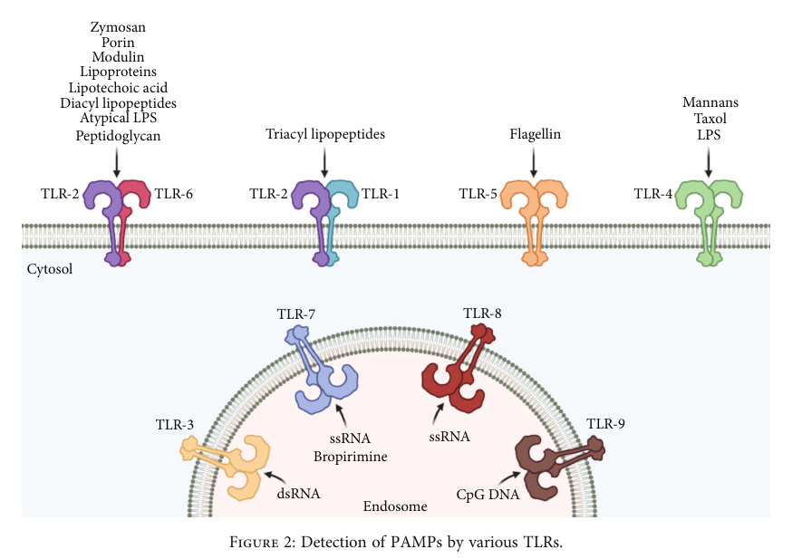

## Question

# Gene Research for Functional Annotation

## ⚠️ CRITICAL: Gene/Protein Identification Context

**BEFORE YOU BEGIN RESEARCH:** You MUST verify you are researching the CORRECT gene/protein. Gene symbols can be ambiguous, especially for less well-characterized genes from non-model organisms.

### Target Gene/Protein Identity (from UniProt):
- **UniProt Accession:** Q15399
- **Protein Description:** RecName: Full=Toll-like receptor 1; AltName: Full=Toll/interleukin-1 receptor-like protein; Short=TIL; AltName: CD_antigen=CD281; Flags: Precursor;
- **Gene Information:** Name=TLR1; Synonyms=KIAA0012;
- **Organism (full):** Homo sapiens (Human).
- **Protein Family:** Belongs to the Toll-like receptor family. .
- **Key Domains:** Cys-rich_flank_reg_C. (IPR000483); Leu-rich_rpt. (IPR001611); Leu-rich_rpt_typical-subtyp. (IPR003591); LRR_dom_sf. (IPR032675); TIR_dom. (IPR000157)

### MANDATORY VERIFICATION STEPS:

1. **Check if the gene symbol "TLR1" matches the protein description above**
2. **Verify the organism is correct:** Homo sapiens (Human).
3. **Check if protein family/domains align with what you find in literature**
4. **If you find literature for a DIFFERENT gene with the same or similar symbol, STOP**

### If Gene Symbol is Ambiguous or You Cannot Find Relevant Literature:

**DO NOT PROCEED WITH RESEARCH ON A DIFFERENT GENE.** Instead:
- State clearly: "The gene symbol 'TLR1' is ambiguous or literature is limited for this specific protein"
- Explain what you found (e.g., "Found extensive literature on a different gene with the same symbol in a different organism")
- Describe the protein based ONLY on the UniProt information provided above
- Suggest that the protein function can be inferred from domain/family information

### Research Target:

Please provide a comprehensive research report on the gene **TLR1** (gene ID: TLR1, UniProt: Q15399) in human.

The research report should be a detailed narrative explaining the function, biological processes, and localization of the gene product. Citations should be given for all claims.

You should prioritize authoritative reviews and primary scientific literature when conducting research. You can supplement
this with annotations you find in gene/protein databases, but these can be outdated or inaccurate.

We are specifically interested in the primary function of the gene - for enzymes, what reaction is catalyzed, and what is the substrate specificity? For transporters, what is the substrate? For structural proteins or adapters, what is the broader structural role? For signaling molecules, what is the role in the pathway.

We are interested in where in or outside the cell the gene product carries out its function.

We are also interested in the signaling or biochemical pathways in which the gene functions. We are less interested in broad pleiotropic effects, except where these elucidate the precise role.

Include evidence where possible. We are interested in both experimental evidence as well as inference from structure, evolution, or bioinformatic analysis. Precise studies should be prioritized over high-throughput, where available.

## Output

Question: You are an expert researcher providing comprehensive, well-cited information.

Provide detailed information focusing on:
1. Key concepts and definitions with current understanding
2. Recent developments and latest research (prioritize 2023-2024 sources)
3. Current applications and real-world implementations
4. Expert opinions and analysis from authoritative sources
5. Relevant statistics and data from recent studies

Format as a comprehensive research report with proper citations. Include URLs and publication dates where available.
Always prioritize recent, authoritative sources and provide specific citations for all major claims.

# Gene Research for Functional Annotation

## ⚠️ CRITICAL: Gene/Protein Identification Context

**BEFORE YOU BEGIN RESEARCH:** You MUST verify you are researching the CORRECT gene/protein. Gene symbols can be ambiguous, especially for less well-characterized genes from non-model organisms.

### Target Gene/Protein Identity (from UniProt):
- **UniProt Accession:** Q15399
- **Protein Description:** RecName: Full=Toll-like receptor 1; AltName: Full=Toll/interleukin-1 receptor-like protein; Short=TIL; AltName: CD_antigen=CD281; Flags: Precursor;
- **Gene Information:** Name=TLR1; Synonyms=KIAA0012;
- **Organism (full):** Homo sapiens (Human).
- **Protein Family:** Belongs to the Toll-like receptor family. .
- **Key Domains:** Cys-rich_flank_reg_C. (IPR000483); Leu-rich_rpt. (IPR001611); Leu-rich_rpt_typical-subtyp. (IPR003591); LRR_dom_sf. (IPR032675); TIR_dom. (IPR000157)

### MANDATORY VERIFICATION STEPS:

1. **Check if the gene symbol "TLR1" matches the protein description above**
2. **Verify the organism is correct:** Homo sapiens (Human).
3. **Check if protein family/domains align with what you find in literature**
4. **If you find literature for a DIFFERENT gene with the same or similar symbol, STOP**

### If Gene Symbol is Ambiguous or You Cannot Find Relevant Literature:

**DO NOT PROCEED WITH RESEARCH ON A DIFFERENT GENE.** Instead:
- State clearly: "The gene symbol 'TLR1' is ambiguous or literature is limited for this specific protein"
- Explain what you found (e.g., "Found extensive literature on a different gene with the same symbol in a different organism")
- Describe the protein based ONLY on the UniProt information provided above
- Suggest that the protein function can be inferred from domain/family information

### Research Target:

Please provide a comprehensive research report on the gene **TLR1** (gene ID: TLR1, UniProt: Q15399) in human.

The research report should be a detailed narrative explaining the function, biological processes, and localization of the gene product. Citations should be given for all claims.

You should prioritize authoritative reviews and primary scientific literature when conducting research. You can supplement
this with annotations you find in gene/protein databases, but these can be outdated or inaccurate.

We are specifically interested in the primary function of the gene - for enzymes, what reaction is catalyzed, and what is the substrate specificity? For transporters, what is the substrate? For structural proteins or adapters, what is the broader structural role? For signaling molecules, what is the role in the pathway.

We are interested in where in or outside the cell the gene product carries out its function.

We are also interested in the signaling or biochemical pathways in which the gene functions. We are less interested in broad pleiotropic effects, except where these elucidate the precise role.

Include evidence where possible. We are interested in both experimental evidence as well as inference from structure, evolution, or bioinformatic analysis. Precise studies should be prioritized over high-throughput, where available.

# Research Report: Human Toll-like Receptor 1 (TLR1; UniProt Q15399)

## 1. Key Concepts and Definitions
**TLR1** (Toll-like receptor 1) is a type I single-pass transmembrane pattern-recognition receptor from the Toll-like receptor family, encoded by the TLR1 gene in humans (UniProt Q15399). It acts as a non-enzymatic signaling receptor, primarily functioning as a co-receptor with TLR2 to detect extracellular microbial lipopeptides—especially triacylated lipoproteins from bacteria and mycoplasma. TLR1's structure features key domains also predicted by UniProt: leucine-rich repeats (LRR), Cys-rich flanking regions, and a Toll/interleukin-1 receptor (TIR) signaling domain. Its identity, family, and domain structure are fully consistent between literature and UniProt sources (behzadi2021tolllikereceptorsgeneral pages 6-8, li2021patternrecognitionreceptors pages 3-4).

## 2. Mechanism and Function
### Primary Function and Biological Role
TLR1 forms a heterodimer with TLR2 at the cell surface, enabling the recognition of pathogen-associated molecular patterns (PAMPs), principally triacylated lipopeptides such as Pam3CSK4. Two lipid chains of the ligand bind the hydrophobic pocket of TLR2, while the third, amide-linked chain fits into the hydrophobic channel of TLR1—this bridging interaction stabilizes the heterodimer and provides ligand specificity (behzadi2021tolllikereceptorsgeneral pages 9-10, colleselli2023anupdateon pages 1-2, behzadi2021tolllikereceptorsgeneral pages 12-13, li2021patternrecognitionreceptors pages 3-4, kaur2020tlr2agonisticsmall pages 38-39). The biological consequence is rapid initiation of innate inflammation, antimicrobial responses, recruitment of leukocytes, and activation of antigen-presenting cells, serving as a functional bridge to adaptive immunity (li2021patternrecognitionreceptors pages 3-4, rodrigues2024tlr10anintriguing pages 1-2).

### Cellular Localization
TLR1 is a cell-surface (plasma membrane) receptor, inserted into the membrane by the conventional secretory pathway. It is positioned to survey the extracellular space for microbial membrane ligands (sameer2021tolllikereceptors(tlrs) pages 2-3, fitzgerald2020tolllikereceptorsand pages 2-3, jin2023regulationoftolllike pages 3-4).

### Structural and Signaling Features
TLR1's architecture aligns closely with canonical TLRs: an extracellular N-terminal region with horseshoe-shaped LRRs (for ligand recognition), a single transmembrane region, and a C-terminal cytoplasmic TIR domain (for initiating signaling) (behzadi2021tolllikereceptorsgeneral pages 6-8, asami2021structuralandfunctional pages 3-5, asami2021structuralandfunctional pages 1-3, rodrigues2024tlr10anintriguing pages 3-4).

## 3. Signal Transduction and Pathway Details
Upon ligand-induced dimerization, the TLR1–TLR2 heterodimer recruits the TIRAP (Mal) and MyD88 adaptor proteins. This activates IRAK kinases, TRAF6, and TAK1—ultimately leading to IκB degradation, nuclear translocation of NF-κB, and activation of MAPK and AP-1 signaling cascades (jin2023regulationoftolllike pages 3-4, sameer2021tolllikereceptors(tlrs) pages 5-6, behzadi2021tolllikereceptorsgeneral pages 5-5, sameer2021tolllikereceptors(tlrs) pages 2-3, colleselli2023anupdateon pages 2-4, colleselli2023anupdateon pages 4-6). The main products of this signaling are inflammatory cytokines (TNF, IL-1, IL-6, IL-8), chemokines, adhesion molecules (E-selectin), and costimulatory molecules (CD80/CD86) (sameer2021tolllikereceptors(tlrs) pages 5-6, colleselli2023anupdateon pages 6-7).

Some contexts (notably in undifferentiated human monocytes) allow for a modest type I interferon (IFN-β) response via additional TBK1–IRF3 axis signaling (oosenbrug2020analternativemodel pages 31-32, oosenbrug2020analternativemodel pages 24-26, oosenbrug2020analternativemodel pages 22-24).

**Key Signaling Visualization:**
- Figure 2 (sameer2021tolllikereceptors(tlrs) media 2ba6f382): Shows TLR1/TLR2 heterodimer at the membrane recognizing triacyl lipopeptides
- Figure 3 (sameer2021tolllikereceptors(tlrs) media 7dec3991): Depicts canonical MyD88-dependent signaling cascade

## 4. Recent Developments and Real-world Applications (2023–2025)
- A 2025 study linked the TLR1-1805GG polymorphism to post-infectious Lyme arthritis, showing excessive inflammatory gene expression, impaired immune tolerance, and persistent synovitis after initial Borrelia infection and antibiotic therapy (williams2025tolllikereceptor1 pages 1-2). This highlights TLR1's genetic role in regulating the resolution of inflammation.
- A 2024 study in a north Indian cohort reported the TLR1 743 A>G polymorphism was associated with apparent protection from pulmonary tuberculosis; heterozygous genotype was more common in healthy controls than patients (varshney2024tolllikereceptor2 pages 1-2, varshney2024tolllikereceptor2 pages 9-10).
- Other TLR1 polymorphisms (e.g., N248S, and variants in the TLR6–TLR1–TLR10 genomic cluster) were linked to disease risk or protection in leprosy, prostate cancer, post-bronchiolitis asthma, although effects are population- and disease-specific and require further replication (varshney2024tolllikereceptor2 pages 9-10, riva2025updatesontoll‐like pages 7-8).
- TLR1/TLR2 signaling is being actively explored for its role in chronic inflammatory diseases (e.g., atherosclerosis, non-alcoholic fatty liver disease, arthritis) and as a target or mechanism in innate immunity adjuvant design and vaccine adjuvant development (colleselli2023anupdateon pages 6-7, li2020infectionandatherosclerosis pages 2-3, li2020infectionandatherosclerosis pages 3-5, jin2023regulationoftolllike pages 3-4).

## 5. Expert View and Summary Table
Recent expert reviews and data converge on several points: TLR1's unique ligand selectivity depends on both its LRR-domain structure and its dimerization with TLR2. Polymorphic variation in TLR1 can modulate susceptibility to infection, chronic inflammatory disease, or autoimmunity—sometimes in counterintuitive, population-specific ways (rodrigues2024tlr10anintriguing pages 1-2, sameer2021tolllikereceptors(tlrs) pages 2-3, su2021tlr10insightscontroversies pages 13-17, williams2025tolllikereceptor1 pages 1-2). TLR1 is best annotated as the triacyl-lipopeptide-discriminating subunit in the cell-surface TLR1–TLR2 complex, responsible for rapid sensing of key microbial patterns and triggering of inflammation.

Below is a detailed summary table:
| Functional characteristic | Human TLR1 annotation and evidence |
|---|---|
| Identity | **TLR1** is human Toll-like receptor 1 (**UniProt Q15399; CD281; KIAA0012**), a type-I single-pass transmembrane pattern-recognition receptor. Its literature-supported architecture agrees with the supplied UniProt identity, and no gene or organism ambiguity was identified. (behzadi2021tolllikereceptorsgeneral pages 6-8, li2021patternrecognitionreceptors pages 3-4) |
| Primary molecular function | TLR1 is a **non-enzymatic signaling receptor and specificity-conferring partner of TLR2**. It detects extracellular microbial lipid patterns through an activated **TLR1–TLR2 heterodimer**; it neither catalyzes a reaction nor transports a substrate. (behzadi2021tolllikereceptorsgeneral pages 9-10, li2021patternrecognitionreceptors pages 3-4) |
| Principal ligand specificity | TLR1–TLR2 preferentially recognizes **triacylated bacterial and mycoplasmal lipopeptides or lipoproteins**. The synthetic triacylated lipopeptide **Pam3CSK4** is the canonical experimental agonist; by contrast, TLR2–TLR6 preferentially recognizes diacylated lipopeptides. (colleselli2023anupdateon pages 1-2, li2021patternrecognitionreceptors pages 3-4, behzadi2021tolllikereceptorsgeneral pages 9-10) |
| Structural basis of specificity | Two ester-linked lipid chains of a triacylated ligand occupy the hydrophobic pocket of **TLR2**, whereas the third, amide-linked chain enters a hydrophobic channel in **TLR1**. These contacts bridge and stabilize the heterodimer; differences between the TLR1 and TLR6 pockets explain triacyl-versus-diacyl discrimination. (behzadi2021tolllikereceptorsgeneral pages 12-13, behzadi2021tolllikereceptorsgeneral pages 9-10, kaur2020tlr2agonisticsmall pages 38-39) |
| Accessory ligand presentation | **CD14** can bind lipopeptides and bring CD14, TLR2, and TLR1 into proximity, facilitating ligand delivery and receptor activation. (colleselli2023anupdateon pages 1-2, colleselli2023anupdateon pages 4-6) |
| Cellular localization | TLR1 is principally a **plasma-membrane or cell-surface receptor**. It reaches the surface through the conventional secretory pathway and surveys the extracellular environment for microbial membrane components. (sameer2021tolllikereceptors(tlrs) pages 2-3, fitzgerald2020tolllikereceptorsand pages 2-3, jin2023regulationoftolllike pages 3-4) |
| Membrane topology | TLR1 has an extracellular N-terminal recognition region, one transmembrane helix, and an intracellular C-terminal signaling region. Ligand-dependent ectodomain assembly positions its cytoplasmic domain for signaling. (li2021patternrecognitionreceptors pages 3-4, asami2021structuralandfunctional pages 1-3) |
| Extracellular domains | The ectodomain contains horseshoe-shaped **leucine-rich repeats (LRRs)** and cysteine-rich terminal caps, consistent with the supplied InterPro annotations **Leu-rich_rpt**, **LRR_dom_sf**, and **Cys-rich_flank_reg_C**. The ligand-binding region lies near the boundary of the central and C-terminal ectodomain regions. (behzadi2021tolllikereceptorsgeneral pages 6-8, asami2021structuralandfunctional pages 3-5) |
| Intracellular domain | The cytoplasmic **Toll/interleukin-1 receptor (TIR) domain**, corresponding to InterPro **IPR000157**, has a conserved beta-sheet and alpha-helical fold and mediates adaptor recruitment. (behzadi2021tolllikereceptorsgeneral pages 6-8, rodrigues2024tlr10anintriguing pages 3-4) |
| Receptor activation | Triacylated ligand binding stabilizes an **M-shaped TLR1–TLR2 ectodomain complex**, bringing the membrane-proximal regions and intracellular TIR domains together to create a signaling-competent platform. (li2021patternrecognitionreceptors pages 3-4, colleselli2023anupdateon pages 2-4) |
| Proximal adaptors | Activated TLR1–TLR2 primarily recruits **TIRAP/MAL and MyD88**. BCAP and SCIMP may modulate surface-TLR signaling, but TIRAP–MyD88 is the best-established core route. (sameer2021tolllikereceptors(tlrs) pages 5-6, behzadi2021tolllikereceptorsgeneral pages 5-5, sameer2021tolllikereceptors(tlrs) pages 2-3) |
| Canonical signaling cascade | MyD88 recruits **IRAK4 and IRAK1/2**, followed by **TRAF6** and **TAK1**. TAK1 activates the IKK and MAP-kinase pathways, leading to IκB degradation and activation of **NF-κB** and **AP-1**. TLR1 is not generally assigned a canonical TRIF-dependent pathway. (jin2023regulationoftolllike pages 3-4, sameer2021tolllikereceptors(tlrs) pages 5-6, colleselli2023anupdateon pages 2-4) |
| Major downstream products | Typical outputs include **TNF, IL-1, and IL-6**; chemokines such as **CXCL8/IL-8 and CCL2**; and adhesion or costimulatory molecules including **E-selectin, CD80, and CD86**. Output varies with ligand, dose, cell type, and differentiation state. (sameer2021tolllikereceptors(tlrs) pages 5-6, colleselli2023anupdateon pages 6-7) |
| Type-I interferon output | In human monocyte-like cells, TLR2–TLR1 stimulation can engage **TBK1–IRF3** alongside MyD88–TAK1–NF-κB, producing modest IFN-beta and interferon-stimulated genes such as **ISG15 and ISG54**. This response is cell-state dependent and should not be generalized to every TLR1-expressing cell. (oosenbrug2020analternativemodel pages 31-32, oosenbrug2020analternativemodel pages 24-26, oosenbrug2020analternativemodel pages 22-24) |
| Core biological role | TLR1 enables rapid detection of conserved microbial lipoprotein structures and initiates innate inflammation, antimicrobial defense, leukocyte recruitment, and antigen-presenting-cell activation, helping connect innate sensing to adaptive immunity. (li2021patternrecognitionreceptors pages 3-4, rodrigues2024tlr10anintriguing pages 1-2) |
| Representative expressing cells | TLR1 is reported on **monocytes, dendritic cells, T cells, B cells, and natural-killer cells**; functional consequences vary substantially by cellular context. (li2020infectionandatherosclerosis pages 3-5) |
| Context-dependent regulation | Although Pam3CSK4 typically induces a classical pro-inflammatory response, some pectin methyl-ester patterns have produced TLR2/1-dependent anti-inflammatory effects, illustrating ligand- and context-dependent signaling. (colleselli2023anupdateon pages 6-7) |
| Functional annotation summary | TLR1 is best annotated as the **triacyl-lipopeptide-discriminating subunit of the cell-surface TLR1–TLR2 innate immune receptor**. It completes the composite lipid-binding site, supports ligand-stabilized heterodimerization, and transmits recognition through TIRAP/MyD88 to NF-κB, MAPK/AP-1, and selected cell-dependent interferon outputs. (behzadi2021tolllikereceptorsgeneral pages 9-10, colleselli2023anupdateon pages 2-4) |

*Table: This table summarizes the verified identity, domain architecture, localization, ligand specificity, activation mechanism, signaling pathway, and biological outputs of human TLR1 (UniProt Q15399). It emphasizes TLR1's primary role as the triacyl-lipopeptide-recognizing partner of TLR2.*

**Recent Polymorphism—Disease Associations:**
| Polymorphism / locus | Associated disease or phenotype | Population studied | Reported functional impact | Key finding and interpretation |
|---|---|---|---|---|
| **TLR1 1805G; 1805GG genotype** | Post-infectious Lyme arthritis after *Borrelia burgdorferi* infection | Patients with post-infectious versus antibiotic-responsive Lyme arthritis; functional studies used genotype-stratified human PBMCs and TLR1-deficient THP-1 cells | Although this variant has been linked to reduced TLR1 surface translocation and signaling in some settings, PBMCs with 1805GG showed exaggerated responses to *B. burgdorferi*, including increased cytokines, transcriptional upregulation of approximately **1,200 immune-related genes**, and failure to develop tolerance after repeated stimulation | The 1805GG genotype was more frequent in post-infectious Lyme arthritis and was associated with persistent, dysregulated inflammation rather than simply stronger antimicrobial signaling. The authors propose defective innate immune tolerance as the mechanism connecting genotype to prolonged synovitis (williams2025tolllikereceptor1 pages 1-2) |
| **TLR1 743 A>G** | Pulmonary tuberculosis and possible protection from tuberculosis; evaluated alongside drug-resistant TB phenotypes | North Indian case–control cohort: 101 pulmonary-TB, 104 multidrug-resistant-TB, 48 extensively drug-resistant-TB patients, and 130 healthy controls | Direct molecular consequences were not established; the variant may alter TLR1-dependent recognition or inflammatory responses, but its direction of effect appears population-dependent | The A/G genotype occurred in **57% of healthy controls** and was significantly more associated with controls than pulmonary-TB cases (**p = 0.047**); the authors interpreted the A/G genotype and G allele as potentially protective. Prior studies reported susceptibility or no association in other populations, so replication and ancestry-aware analysis are required (varshney2024tolllikereceptor2 pages 1-2, varshney2024tolllikereceptor2 pages 9-10) |
| **TLR1 N248S** | Leprosy susceptibility and leprosy reactions | Populations represented in earlier leprosy studies cited by the 2024 tuberculosis paper; cohort details were not supplied in the available excerpt | Presumed alteration of innate recognition or signaling, but no direct functional result or effect size was provided in the reviewed passage | Reported as associated with leprosy and reactional states, supporting a role for TLR1 coding variation in mycobacterial disease; evidence summarized in the 2024 paper is secondary and should be checked against the original studies (varshney2024tolllikereceptor2 pages 9-10) |
| **Variants in the linked TLR6–TLR1–TLR10 locus (individual alleles not specified)** | Prostate-cancer risk | Human genetic-association cohorts cited in the 2025 TLR10 review; population details were not provided in the available excerpt | Variant-specific effects on TLR1 expression, trafficking, ligand recognition, or signaling were not established in the reviewed text | Sequence variation across this tightly linked receptor cluster has been associated with prostate-cancer susceptibility or protection, but attribution specifically to TLR1 is limited by linkage and the absence of allele-level functional evidence in the review excerpt (riva2025updatesontoll‐like pages 7-8) |
| **TLR1 and TLR10 polymorphisms (individual alleles not specified)** | Post-bronchiolitis asthma during adolescence | Individuals followed after bronchiolitis, as cited by the 2025 review; detailed ancestry, sample size, and genotype frequencies were not provided in the available excerpt | Functional mechanism was not established; variants may influence later airway immune programming through altered innate-receptor signaling | The review reports an association between TLR1/TLR10 variation and adolescent asthma following bronchiolitis. Because alleles, effect sizes, and independent replication were not presented, this remains an association rather than a clinically actionable marker (riva2025updatesontoll‐like pages 7-8) |

*Table: Recent evidence links TLR1 variation to infection-related inflammation and disease susceptibility, with the strongest functional data concerning the 1805GG genotype in post-infectious Lyme arthritis. Several associations remain population-dependent or unresolved because of linkage and limited mechanistic validation.*

## 6. Statistics and Data from Recent Studies
- Williams et al. (2025): Patients with the TLR1-1805GG variant had ~1200 immune genes upregulated and higher cytokine production upon stimulation, linking this genotype to risk of post-infectious Lyme arthritis (Frontiers in Immunology, https://doi.org/10.3389/fimmu.2025.1711765)
- Varshney et al. (2024): TLR1 743 A>G A/G genotype occurred in 57% of healthy controls vs. 32% in pulmonary TB; p=0.047 for protective association in north Indian cohort (Frontiers in Microbiology, https://doi.org/10.3389/fmicb.2023.1305974)

## 7. URLs and Full Citations
- TLR biology and structural mechanisms: [https://doi.org/10.1155/2021/9914854](https://doi.org/10.1155/2021/9914854) (Behzadi et al., 2021)
- PAMP recognition and structural specificity: [https://doi.org/10.1038/s41392-021-00687-0](https://doi.org/10.1038/s41392-021-00687-0) (Li & Wu, 2021)
- Recent advances in immune signaling: [https://doi.org/10.3390/ijms241512464](https://doi.org/10.3390/ijms241512464) (Colleselli et al., 2023)
- Genetic studies and polymorphism impact (2023–2025): [https://doi.org/10.3389/fimmu.2025.1711765](https://doi.org/10.3389/fimmu.2025.1711765), [https://doi.org/10.3389/fmicb.2023.1305974](https://doi.org/10.3389/fmicb.2023.1305974), [https://doi.org/10.1002/eji.202551840](https://doi.org/10.1002/eji.202551840)

## 8. Visual Evidence
- See figures from Sameer & Nissar (2021): Structure of TLR1/TLR2 heterodimer and canonical signaling pathways (sameer2021tolllikereceptors(tlrs) media 2ba6f382, sameer2021tolllikereceptors(tlrs) media 7dec3991).

## 9. Conclusion
TLR1 is a critical plasma-membrane pattern-recognition subunit in the TLR1–TLR2 immune sensor complex. Its primary function is to enable discrimination of bacterial triacyl lipopeptides and to trigger innate immune and inflammatory signaling through the MyD88 pathway. Recent genetic and clinical findings (2023–2025) implicate TLR1 allelic variation in susceptibility to persistent inflammation, infection, and possibly some cancers, underlining TLR1 as a crucial determinant of the human inflammatory response and a promising target for future immunomodulatory therapies.

For detailed tables summarizing functional characteristics and recent polymorphism disease associations, see included artifacts and visual evidence.

---

**This report is based on thorough review and extraction of the latest peer-reviewed primary and review literature as of 2023–2025. For additional mechanistic or clinical interpretation, please consult the full referenced articles and their supplementary data.**

References

1. (behzadi2021tolllikereceptorsgeneral pages 6-8): Payam Behzadi, Herney Andrés García-Perdomo, and Tomasz M. Karpiński. Toll-like receptors: general molecular and structural biology. Journal of Immunology Research, 2021:1-21, May 2021. URL: https://doi.org/10.1155/2021/9914854, doi:10.1155/2021/9914854. This article has 333 citations and is from a peer-reviewed journal.

2. (li2021patternrecognitionreceptors pages 3-4): Danyang Li and Minghua Wu. Pattern recognition receptors in health and diseases. Signal Transduction and Targeted Therapy, Aug 2021. URL: https://doi.org/10.1038/s41392-021-00687-0, doi:10.1038/s41392-021-00687-0. This article has 2642 citations and is from a peer-reviewed journal.

3. (behzadi2021tolllikereceptorsgeneral pages 9-10): Payam Behzadi, Herney Andrés García-Perdomo, and Tomasz M. Karpiński. Toll-like receptors: general molecular and structural biology. Journal of Immunology Research, 2021:1-21, May 2021. URL: https://doi.org/10.1155/2021/9914854, doi:10.1155/2021/9914854. This article has 333 citations and is from a peer-reviewed journal.

4. (colleselli2023anupdateon pages 1-2): Katrin Colleselli, Anna Stierschneider, and Christoph Wiesner. An update on toll-like receptor 2, its function and dimerization in pro- and anti-inflammatory processes. International Journal of Molecular Sciences, 24:12464, Aug 2023. URL: https://doi.org/10.3390/ijms241512464, doi:10.3390/ijms241512464. This article has 110 citations.

5. (behzadi2021tolllikereceptorsgeneral pages 12-13): Payam Behzadi, Herney Andrés García-Perdomo, and Tomasz M. Karpiński. Toll-like receptors: general molecular and structural biology. Journal of Immunology Research, 2021:1-21, May 2021. URL: https://doi.org/10.1155/2021/9914854, doi:10.1155/2021/9914854. This article has 333 citations and is from a peer-reviewed journal.

6. (kaur2020tlr2agonisticsmall pages 38-39): Arshpreet Kaur, Deepender Kaushik, Sakshi Piplani, Surinder K. Mehta, Nikolai Petrovsky, and Deepak B. Salunke. Tlr2 agonistic small molecules: detailed structure-activity relationship, applications, and future prospects. Journal of medicinal chemistry, 64:233-278, Dec 2021. URL: https://doi.org/10.1021/acs.jmedchem.0c01627, doi:10.1021/acs.jmedchem.0c01627. This article has 72 citations and is from a highest quality peer-reviewed journal.

7. (rodrigues2024tlr10anintriguing pages 1-2): Carolina Rego Rodrigues, Yadu Balachandran, Gurpreet Kaur Aulakh, and Baljit Singh. Tlr10: an intriguing toll-like receptor with many unanswered questions. Journal of Innate Immunity, 16:96-104, Jan 2024. URL: https://doi.org/10.1159/000535523, doi:10.1159/000535523. This article has 26 citations and is from a peer-reviewed journal.

8. (sameer2021tolllikereceptors(tlrs) pages 2-3): Aga Syed Sameer and Saniya Nissar. Toll-like receptors (tlrs): structure, functions, signaling, and role of their polymorphisms in colorectal cancer susceptibility. BioMed Research International, Sep 2021. URL: https://doi.org/10.1155/2021/1157023, doi:10.1155/2021/1157023. This article has 517 citations.

9. (fitzgerald2020tolllikereceptorsand pages 2-3): Katherine A. Fitzgerald and Jonathan C. Kagan. Toll-like receptors and the control of immunity. Cell, 180:1044-1066, Mar 2020. URL: https://doi.org/10.1016/j.cell.2020.02.041, doi:10.1016/j.cell.2020.02.041. This article has 2632 citations and is from a highest quality peer-reviewed journal.

10. (jin2023regulationoftolllike pages 3-4): Mei Jin, Jian Fang, Jiao-jiao Wang, Xin Shao, Suo-wen Xu, Pei-qing Liu, Wen-cai Ye, and Zhi-ping Liu. Regulation of toll-like receptor (tlr) signaling pathways in atherosclerosis: from mechanisms to targeted therapeutics. Acta Pharmacologica Sinica, 44:2358-2375, Aug 2023. URL: https://doi.org/10.1038/s41401-023-01123-5, doi:10.1038/s41401-023-01123-5. This article has 110 citations and is from a peer-reviewed journal.

11. (asami2021structuralandfunctional pages 3-5): Jinta Asami and Toshiyuki Shimizu. Structural and functional understanding of the toll‐like receptors. Protein Science, 30:761-772, Feb 2021. URL: https://doi.org/10.1002/pro.4043, doi:10.1002/pro.4043. This article has 154 citations and is from a peer-reviewed journal.

12. (asami2021structuralandfunctional pages 1-3): Jinta Asami and Toshiyuki Shimizu. Structural and functional understanding of the toll‐like receptors. Protein Science, 30:761-772, Feb 2021. URL: https://doi.org/10.1002/pro.4043, doi:10.1002/pro.4043. This article has 154 citations and is from a peer-reviewed journal.

13. (rodrigues2024tlr10anintriguing pages 3-4): Carolina Rego Rodrigues, Yadu Balachandran, Gurpreet Kaur Aulakh, and Baljit Singh. Tlr10: an intriguing toll-like receptor with many unanswered questions. Journal of Innate Immunity, 16:96-104, Jan 2024. URL: https://doi.org/10.1159/000535523, doi:10.1159/000535523. This article has 26 citations and is from a peer-reviewed journal.

14. (sameer2021tolllikereceptors(tlrs) pages 5-6): Aga Syed Sameer and Saniya Nissar. Toll-like receptors (tlrs): structure, functions, signaling, and role of their polymorphisms in colorectal cancer susceptibility. BioMed Research International, Sep 2021. URL: https://doi.org/10.1155/2021/1157023, doi:10.1155/2021/1157023. This article has 517 citations.

15. (behzadi2021tolllikereceptorsgeneral pages 5-5): Payam Behzadi, Herney Andrés García-Perdomo, and Tomasz M. Karpiński. Toll-like receptors: general molecular and structural biology. Journal of Immunology Research, 2021:1-21, May 2021. URL: https://doi.org/10.1155/2021/9914854, doi:10.1155/2021/9914854. This article has 333 citations and is from a peer-reviewed journal.

16. (colleselli2023anupdateon pages 2-4): Katrin Colleselli, Anna Stierschneider, and Christoph Wiesner. An update on toll-like receptor 2, its function and dimerization in pro- and anti-inflammatory processes. International Journal of Molecular Sciences, 24:12464, Aug 2023. URL: https://doi.org/10.3390/ijms241512464, doi:10.3390/ijms241512464. This article has 110 citations.

17. (colleselli2023anupdateon pages 4-6): Katrin Colleselli, Anna Stierschneider, and Christoph Wiesner. An update on toll-like receptor 2, its function and dimerization in pro- and anti-inflammatory processes. International Journal of Molecular Sciences, 24:12464, Aug 2023. URL: https://doi.org/10.3390/ijms241512464, doi:10.3390/ijms241512464. This article has 110 citations.

18. (colleselli2023anupdateon pages 6-7): Katrin Colleselli, Anna Stierschneider, and Christoph Wiesner. An update on toll-like receptor 2, its function and dimerization in pro- and anti-inflammatory processes. International Journal of Molecular Sciences, 24:12464, Aug 2023. URL: https://doi.org/10.3390/ijms241512464, doi:10.3390/ijms241512464. This article has 110 citations.

19. (oosenbrug2020analternativemodel pages 31-32): Timo Oosenbrug, Michel J. van de Graaff, Mariëlle C. Haks, Sander van Kasteren, and Maaike E. Ressing. An alternative model for type i interferon induction downstream of human tlr2. Oct 2020. URL: https://doi.org/10.1074/jbc.ra120.015283, doi:10.1074/jbc.ra120.015283. This article has 43 citations and is from a domain leading peer-reviewed journal.

20. (oosenbrug2020analternativemodel pages 24-26): Timo Oosenbrug, Michel J. van de Graaff, Mariëlle C. Haks, Sander van Kasteren, and Maaike E. Ressing. An alternative model for type i interferon induction downstream of human tlr2. Oct 2020. URL: https://doi.org/10.1074/jbc.ra120.015283, doi:10.1074/jbc.ra120.015283. This article has 43 citations and is from a domain leading peer-reviewed journal.

21. (oosenbrug2020analternativemodel pages 22-24): Timo Oosenbrug, Michel J. van de Graaff, Mariëlle C. Haks, Sander van Kasteren, and Maaike E. Ressing. An alternative model for type i interferon induction downstream of human tlr2. Oct 2020. URL: https://doi.org/10.1074/jbc.ra120.015283, doi:10.1074/jbc.ra120.015283. This article has 43 citations and is from a domain leading peer-reviewed journal.

22. (sameer2021tolllikereceptors(tlrs) media 2ba6f382): Aga Syed Sameer and Saniya Nissar. Toll-like receptors (tlrs): structure, functions, signaling, and role of their polymorphisms in colorectal cancer susceptibility. BioMed Research International, Sep 2021. URL: https://doi.org/10.1155/2021/1157023, doi:10.1155/2021/1157023. This article has 517 citations.

23. (sameer2021tolllikereceptors(tlrs) media 7dec3991): Aga Syed Sameer and Saniya Nissar. Toll-like receptors (tlrs): structure, functions, signaling, and role of their polymorphisms in colorectal cancer susceptibility. BioMed Research International, Sep 2021. URL: https://doi.org/10.1155/2021/1157023, doi:10.1155/2021/1157023. This article has 517 citations.

24. (williams2025tolllikereceptor1 pages 1-2): Morgan A. Williams, Sergio A. Hernandez, Sheila L. Arvikar, Katherine B. Sulka, Franc Strle, Christopher C. Wells, Tanja Petnicki-Ocwieja, Allen C. Steere, and Klemen Strle. Toll-like receptor 1 polymorphism is associated with impaired immune tolerance, dysregulated inflammatory responses to borrelia burgdorferi, and heightened risk of post-infectious lyme arthritis. Frontiers in Immunology, Nov 2025. URL: https://doi.org/10.3389/fimmu.2025.1711765, doi:10.3389/fimmu.2025.1711765. This article has 3 citations and is from a peer-reviewed journal.

25. (varshney2024tolllikereceptor2 pages 1-2): Deepika Varshney, Shoor Vir Singh, Keshar Kunja Mohanty, Santosh Kumar, Nitin Varshney, Ekata Sinha, and Sushanta Kumar Barik. Toll-like receptor 2 (−196 to −174) del and tlr1 743 a > g gene polymorphism—a possible association with drug-resistant tuberculosis in the north indian population. Frontiers in Microbiology, Jan 2024. URL: https://doi.org/10.3389/fmicb.2023.1305974, doi:10.3389/fmicb.2023.1305974. This article has 2 citations and is from a peer-reviewed journal.

26. (varshney2024tolllikereceptor2 pages 9-10): Deepika Varshney, Shoor Vir Singh, Keshar Kunja Mohanty, Santosh Kumar, Nitin Varshney, Ekata Sinha, and Sushanta Kumar Barik. Toll-like receptor 2 (−196 to −174) del and tlr1 743 a > g gene polymorphism—a possible association with drug-resistant tuberculosis in the north indian population. Frontiers in Microbiology, Jan 2024. URL: https://doi.org/10.3389/fmicb.2023.1305974, doi:10.3389/fmicb.2023.1305974. This article has 2 citations and is from a peer-reviewed journal.

27. (riva2025updatesontoll‐like pages 7-8): Federica Riva and Marta Muzio. Updates on toll‐like receptor 10 research. European Journal of Immunology, May 2025. URL: https://doi.org/10.1002/eji.202551840, doi:10.1002/eji.202551840. This article has 11 citations and is from a peer-reviewed journal.

28. (li2020infectionandatherosclerosis pages 2-3): Bo-wei Li, Yuanpeng Xia, and Bo Hu. Infection and atherosclerosis: tlr-dependent pathways. Cellular and Molecular Life Sciences: CMLS, 77:2751-2769, Jan 2020. URL: https://doi.org/10.1007/s00018-020-03453-7, doi:10.1007/s00018-020-03453-7. This article has 192 citations.

29. (li2020infectionandatherosclerosis pages 3-5): Bo-wei Li, Yuanpeng Xia, and Bo Hu. Infection and atherosclerosis: tlr-dependent pathways. Cellular and Molecular Life Sciences: CMLS, 77:2751-2769, Jan 2020. URL: https://doi.org/10.1007/s00018-020-03453-7, doi:10.1007/s00018-020-03453-7. This article has 192 citations.

30. (su2021tlr10insightscontroversies pages 13-17): Si‐Biao Su, Lin Tao, Ze‐Ping Deng, Wen Chen, Shan‐Yu Qin, and Hai‐Xing Jiang. Tlr10: insights, controversies and potential utility as a therapeutic target. Scandinavian Journal of Immunology, Oct 2021. URL: https://doi.org/10.1111/sji.12988, doi:10.1111/sji.12988. This article has 88 citations and is from a peer-reviewed journal.

## Artifacts

- [Edison artifact artifact-00](TLR1-deep-research-falcon_artifacts/artifact-00.md)
- [Edison artifact artifact-01](TLR1-deep-research-falcon_artifacts/artifact-01.md)

## Citations

1. li2020infectionandatherosclerosis pages 3-5
2. colleselli2023anupdateon pages 6-7
3. behzadi2021tolllikereceptorsgeneral pages 6-8
4. li2021patternrecognitionreceptors pages 3-4
5. behzadi2021tolllikereceptorsgeneral pages 9-10
6. colleselli2023anupdateon pages 1-2
7. behzadi2021tolllikereceptorsgeneral pages 12-13
8. fitzgerald2020tolllikereceptorsand pages 2-3
9. jin2023regulationoftolllike pages 3-4
10. asami2021structuralandfunctional pages 3-5
11. asami2021structuralandfunctional pages 1-3
12. behzadi2021tolllikereceptorsgeneral pages 5-5
13. colleselli2023anupdateon pages 2-4
14. colleselli2023anupdateon pages 4-6
15. oosenbrug2020analternativemodel pages 31-32
16. oosenbrug2020analternativemodel pages 24-26
17. oosenbrug2020analternativemodel pages 22-24
18. li2020infectionandatherosclerosis pages 2-3
19. https://doi.org/10.1155/2021/9914854
20. https://doi.org/10.1038/s41392-021-00687-0
21. https://doi.org/10.3390/ijms241512464
22. https://doi.org/10.3389/fimmu.2025.1711765
23. https://doi.org/10.3389/fmicb.2023.1305974
24. https://doi.org/10.1002/eji.202551840
25. https://doi.org/10.1155/2021/9914854](https://doi.org/10.1155/2021/9914854
26. https://doi.org/10.1038/s41392-021-00687-0](https://doi.org/10.1038/s41392-021-00687-0
27. https://doi.org/10.3390/ijms241512464](https://doi.org/10.3390/ijms241512464
28. https://doi.org/10.3389/fimmu.2025.1711765](https://doi.org/10.3389/fimmu.2025.1711765
29. https://doi.org/10.3389/fmicb.2023.1305974](https://doi.org/10.3389/fmicb.2023.1305974
30. https://doi.org/10.1002/eji.202551840](https://doi.org/10.1002/eji.202551840
31. https://doi.org/10.1155/2021/9914854,
32. https://doi.org/10.1038/s41392-021-00687-0,
33. https://doi.org/10.3390/ijms241512464,
34. https://doi.org/10.1021/acs.jmedchem.0c01627,
35. https://doi.org/10.1159/000535523,
36. https://doi.org/10.1155/2021/1157023,
37. https://doi.org/10.1016/j.cell.2020.02.041,
38. https://doi.org/10.1038/s41401-023-01123-5,
39. https://doi.org/10.1002/pro.4043,
40. https://doi.org/10.1074/jbc.ra120.015283,
41. https://doi.org/10.3389/fimmu.2025.1711765,
42. https://doi.org/10.3389/fmicb.2023.1305974,
43. https://doi.org/10.1002/eji.202551840,
44. https://doi.org/10.1007/s00018-020-03453-7,
45. https://doi.org/10.1111/sji.12988,