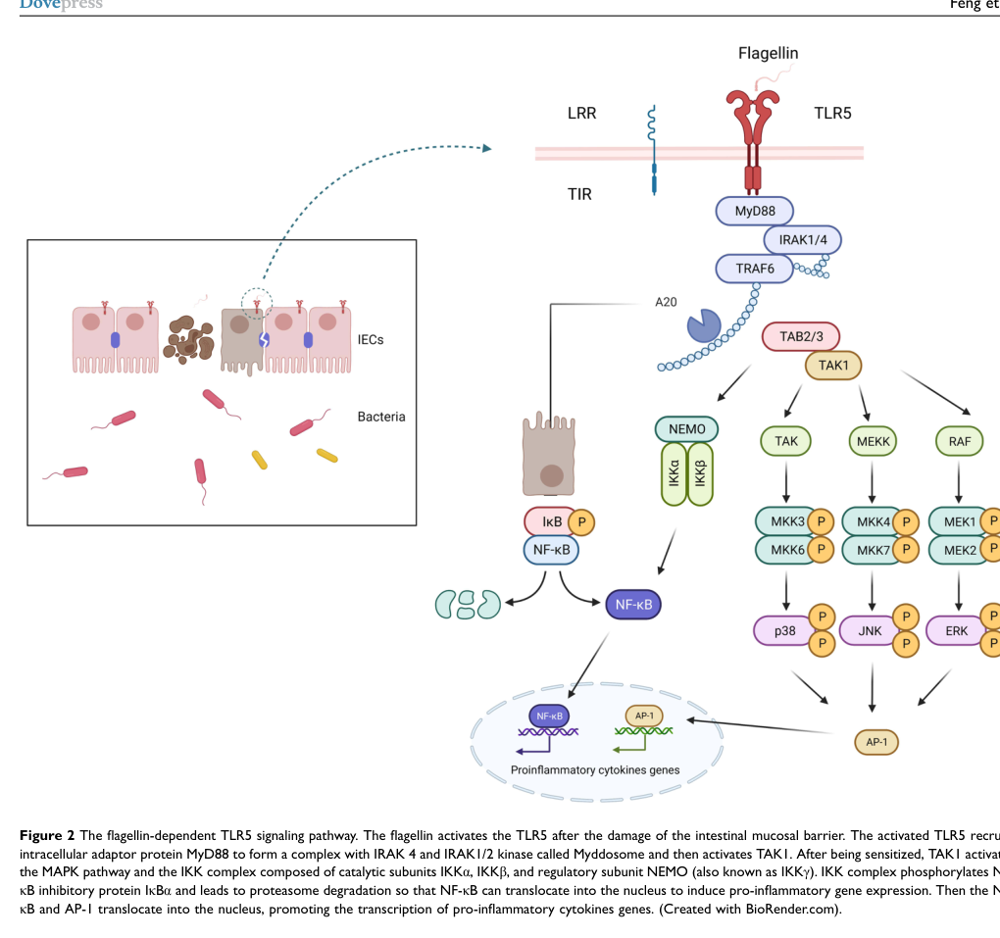

## Question

# Gene Research for Functional Annotation

## ⚠️ CRITICAL: Gene/Protein Identification Context

**BEFORE YOU BEGIN RESEARCH:** You MUST verify you are researching the CORRECT gene/protein. Gene symbols can be ambiguous, especially for less well-characterized genes from non-model organisms.

### Target Gene/Protein Identity (from UniProt):
- **UniProt Accession:** O60602
- **Protein Description:** RecName: Full=Toll-like receptor 5; AltName: Full=Toll/interleukin-1 receptor-like protein 3; Flags: Precursor;
- **Gene Information:** Name=TLR5; Synonyms=TIL3;
- **Organism (full):** Homo sapiens (Human).
- **Protein Family:** Belongs to the Toll-like receptor family. .
- **Key Domains:** Cys-rich_flank_reg_C. (IPR000483); Leu-rich_rpt. (IPR001611); Leu-rich_rpt_typical-subtyp. (IPR003591); LRR_dom_sf. (IPR032675); TIR_dom. (IPR000157)

### MANDATORY VERIFICATION STEPS:

1. **Check if the gene symbol "TLR5" matches the protein description above**
2. **Verify the organism is correct:** Homo sapiens (Human).
3. **Check if protein family/domains align with what you find in literature**
4. **If you find literature for a DIFFERENT gene with the same or similar symbol, STOP**

### If Gene Symbol is Ambiguous or You Cannot Find Relevant Literature:

**DO NOT PROCEED WITH RESEARCH ON A DIFFERENT GENE.** Instead:
- State clearly: "The gene symbol 'TLR5' is ambiguous or literature is limited for this specific protein"
- Explain what you found (e.g., "Found extensive literature on a different gene with the same symbol in a different organism")
- Describe the protein based ONLY on the UniProt information provided above
- Suggest that the protein function can be inferred from domain/family information

### Research Target:

Please provide a comprehensive research report on the gene **TLR5** (gene ID: TLR5, UniProt: O60602) in human.

The research report should be a detailed narrative explaining the function, biological processes, and localization of the gene product. Citations should be given for all claims.

You should prioritize authoritative reviews and primary scientific literature when conducting research. You can supplement
this with annotations you find in gene/protein databases, but these can be outdated or inaccurate.

We are specifically interested in the primary function of the gene - for enzymes, what reaction is catalyzed, and what is the substrate specificity? For transporters, what is the substrate? For structural proteins or adapters, what is the broader structural role? For signaling molecules, what is the role in the pathway.

We are interested in where in or outside the cell the gene product carries out its function.

We are also interested in the signaling or biochemical pathways in which the gene functions. We are less interested in broad pleiotropic effects, except where these elucidate the precise role.

Include evidence where possible. We are interested in both experimental evidence as well as inference from structure, evolution, or bioinformatic analysis. Precise studies should be prioritized over high-throughput, where available.

## Output

Question: You are an expert researcher providing comprehensive, well-cited information.

Provide detailed information focusing on:
1. Key concepts and definitions with current understanding
2. Recent developments and latest research (prioritize 2023-2024 sources)
3. Current applications and real-world implementations
4. Expert opinions and analysis from authoritative sources
5. Relevant statistics and data from recent studies

Format as a comprehensive research report with proper citations. Include URLs and publication dates where available.
Always prioritize recent, authoritative sources and provide specific citations for all major claims.

# Gene Research for Functional Annotation

## ⚠️ CRITICAL: Gene/Protein Identification Context

**BEFORE YOU BEGIN RESEARCH:** You MUST verify you are researching the CORRECT gene/protein. Gene symbols can be ambiguous, especially for less well-characterized genes from non-model organisms.

### Target Gene/Protein Identity (from UniProt):
- **UniProt Accession:** O60602
- **Protein Description:** RecName: Full=Toll-like receptor 5; AltName: Full=Toll/interleukin-1 receptor-like protein 3; Flags: Precursor;
- **Gene Information:** Name=TLR5; Synonyms=TIL3;
- **Organism (full):** Homo sapiens (Human).
- **Protein Family:** Belongs to the Toll-like receptor family. .
- **Key Domains:** Cys-rich_flank_reg_C. (IPR000483); Leu-rich_rpt. (IPR001611); Leu-rich_rpt_typical-subtyp. (IPR003591); LRR_dom_sf. (IPR032675); TIR_dom. (IPR000157)

### MANDATORY VERIFICATION STEPS:

1. **Check if the gene symbol "TLR5" matches the protein description above**
2. **Verify the organism is correct:** Homo sapiens (Human).
3. **Check if protein family/domains align with what you find in literature**
4. **If you find literature for a DIFFERENT gene with the same or similar symbol, STOP**

### If Gene Symbol is Ambiguous or You Cannot Find Relevant Literature:

**DO NOT PROCEED WITH RESEARCH ON A DIFFERENT GENE.** Instead:
- State clearly: "The gene symbol 'TLR5' is ambiguous or literature is limited for this specific protein"
- Explain what you found (e.g., "Found extensive literature on a different gene with the same symbol in a different organism")
- Describe the protein based ONLY on the UniProt information provided above
- Suggest that the protein function can be inferred from domain/family information

### Research Target:

Please provide a comprehensive research report on the gene **TLR5** (gene ID: TLR5, UniProt: O60602) in human.

The research report should be a detailed narrative explaining the function, biological processes, and localization of the gene product. Citations should be given for all claims.

You should prioritize authoritative reviews and primary scientific literature when conducting research. You can supplement
this with annotations you find in gene/protein databases, but these can be outdated or inaccurate.

We are specifically interested in the primary function of the gene - for enzymes, what reaction is catalyzed, and what is the substrate specificity? For transporters, what is the substrate? For structural proteins or adapters, what is the broader structural role? For signaling molecules, what is the role in the pathway.

We are interested in where in or outside the cell the gene product carries out its function.

We are also interested in the signaling or biochemical pathways in which the gene functions. We are less interested in broad pleiotropic effects, except where these elucidate the precise role.

Include evidence where possible. We are interested in both experimental evidence as well as inference from structure, evolution, or bioinformatic analysis. Precise studies should be prioritized over high-throughput, where available.

# Comprehensive Research Report: TLR5 (Toll-like Receptor 5)

## Gene and Protein Identity Verification

The gene TLR5 (UniProt accession O60602) encodes **Toll-like receptor 5** in *Homo sapiens*. This protein is a type I transmembrane pattern recognition receptor belonging to the Toll-like receptor family, consistent with the UniProt annotation describing it as a flagellin-binding innate immune receptor (fitzgerald2020tolllikereceptorsand pages 1-2, asami2021structuralandfunctional pages 1-3). The protein contains the characteristic domains identified in the UniProt record: leucine-rich repeats (LRR) for ligand recognition and a cytosolic Toll/interleukin-1 receptor (TIR) domain for signal transduction (behzadi2021tolllikereceptorsgeneral pages 6-8, behzadi2021tolllikereceptorsgeneral pages 5-6).

## Primary Molecular Function and Substrate Specificity

### Recognition of Bacterial Flagellin

TLR5 functions as a pattern recognition receptor whose primary and highly specific substrate is **bacterial flagellin**, the protein monomer that polymerizes to form bacterial flagella (feng2023tlr5signalingin pages 4-6, feng2023tlr5signalingin pages 1-2, xia2021researchprogresson pages 5-6). Unlike enzymes that catalyze chemical reactions or transporters that move molecules across membranes, TLR5 is a **signaling receptor** that detects the presence of flagellated bacteria and transduces this recognition into intracellular immune responses (feng2023tlr5signalingin pages 6-8).

The receptor exhibits exquisite specificity for conserved structural determinants within flagellin. Recognition primarily targets the flagellin D1 domain, particularly a consensus sequence around residues 88–98 (LQRIRELAVQA in many beta- and gamma-proteobacteria), with critical binding residues including R89, L93, and E113 (xia2021researchprogresson pages 6-8, nedeljkovic2021bacterialflagellarfilament pages 20-22). The D0 domain, while dispensable for initial binding, is required for efficient signal transduction (xia2021researchprogresson pages 5-6). Importantly, TLR5 preferentially recognizes soluble or exposed **flagellin monomers** rather than intact polymerized flagellar filaments, because the TLR5-binding epitope is buried within the assembled filament core (nedeljkovic2021bacterialflagellarfilament pages 20-22).

### Molecular Mechanism of Ligand Recognition

Structural studies, particularly of zebrafish TLR5 bound to *Salmonella* flagellin, reveal that flagellin binding forms a functional **2:2 flagellin–TLR5 complex** (nedeljkovic2021bacterialflagellarfilament pages 20-22). The C-terminal α-helix of the flagellin D1 domain contacts TLR5 leucine-rich repeats 1–6, while residues 89–96 of the D1 motif interact with LRRs 7–10. Two TLR5–flagellin heterodimers then associate through TLR5 LRRs 12–13 to produce the active signaling complex (nedeljkovic2021bacterialflagellarfilament pages 20-22, bell2024kineticandstructurebased pages 13-16).

## Protein Structure and Architecture

TLR5 exhibits the conserved three-domain architecture typical of Toll-like receptors (behzadi2021tolllikereceptorsgeneral pages 6-8, asami2021structuralandfunctional pages 1-3):

1. **Extracellular domain**: Contains an N-terminal LRR cap (LRR-NT), approximately 20 tandem leucine-rich repeat motifs forming a horseshoe-shaped solenoid, and a C-terminal LRR cap (LRR-CT). This ectodomain is responsible for flagellin recognition (nedeljkovic2021bacterialflagellarfilament pages 18-20, behzadi2021tolllikereceptorsgeneral pages 5-6).

2. **Transmembrane domain**: A single membrane-spanning segment that anchors the receptor to the plasma membrane (behzadi2021tolllikereceptorsgeneral pages 6-8).

3. **Intracellular TIR domain**: Contains five parallel β-strands (βA–βE) enclosed by five α-helices (αA–αE), connected by characteristic loops that mediate adaptor protein recruitment and downstream signaling (behzadi2021tolllikereceptorsgeneral pages 6-8).

## Subcellular Localization and Cellular Distribution

### Membrane Localization

TLR5 is localized to the **plasma membrane (cell surface)**, distinguishing it from the endosomal TLRs (TLR3, TLR7, TLR8, TLR9) that primarily recognize nucleic acids (layunta2021crosstalkbetweenintestinal pages 4-5, behzadi2021tolllikereceptorsgeneral pages 5-5, behzadi2021tolllikereceptorsgeneral pages 4-5). This cell-surface positioning enables TLR5 to detect extracellular flagellin from motile bacteria (jiang2020molecularcharacterizationand pages 15-16).

### Polarized Expression in Epithelial Cells

In intestinal epithelial cells (IECs), TLR5 exhibits strategic **basolateral localization** rather than uniform membrane distribution (feng2023tlr5signalingin pages 4-6). This polarized expression is functionally significant: by concentrating TLR5 on the basal and lateral surfaces, IECs can detect flagellin from bacteria that have crossed or breached the epithelial barrier, such as translocating *Salmonella*, while limiting responses to non-pathogenic commensal bacteria residing in the intestinal lumen (feng2023tlr5signalingin pages 4-6). This positioning represents an elegant mechanism for discriminating between harmless luminal flora and potentially invasive flagellated pathogens.

### Cellular Expression Pattern

TLR5 is expressed in multiple cell types with important roles in innate immunity (jiang2020molecularcharacterizationand pages 15-16, feng2023tlr5signalingin pages 2-4):

- **Immune cells**: Monocytes, immature dendritic cells, and in the intestinal mucosa, CD103⁺CD11b⁺ lamina propria dendritic cells (cDC2), which are principal TLR5-expressing antigen-presenting cells in the small intestine (feng2023tlr5signalingin pages 2-4, feng2023tlr5signalingin pages 6-8)
- **Epithelial cells**: Intestinal epithelial cells, respiratory epithelial cells, and prostate epithelial cells (feng2023tlr5signalingin pages 2-4, liang2023upregulationoftlr5 pages 4-6, xia2021researchprogresson pages 5-6)
- **Other tissues**: Expression has been reported in ovary, with functional activity demonstrated in various tissues including prostate and colorectum (jiang2020molecularcharacterizationand pages 15-16, liang2023upregulationoftlr5 pages 6-8)

## Signaling Pathways and Biochemical Mechanisms

### The TLR5-MyD88-Dependent Pathway

TLR5 signals exclusively through the **MyD88-dependent pathway**, unlike TLR3 which uses the TRIF-dependent route, or TLR4 which can utilize both (duan2022tolllikereceptorsignaling pages 2-3, xia2021researchprogresson pages 8-9, stierschneider2023sheddinglighton pages 2-4). The signaling cascade proceeds as follows:

**Figure 2** from Feng et al. (2023) illustrates the complete TLR5 signaling pathway (feng2023tlr5signalingin media fea2a839):

1. **Receptor activation**: Flagellin binding induces TLR5 dimerization and conformational changes in the intracellular TIR domains (feng2023tlr5signalingin pages 2-4).

2. **MyD88 recruitment and Myddosome assembly**: The cytosolic TIR domain recruits the adaptor protein MyD88 through TIR-TIR domain interactions. MyD88 then associates with IRAK4, IRAK1, and IRAK2 to form the Myddosome signaling complex (duan2022tolllikereceptorsignaling pages 2-3, feng2023tlr5signalingin pages 4-6).

3. **TRAF6 activation**: IRAK4 phosphorylates and activates IRAK1/2, which then recruit TRAF6. Together with ubiquitin-conjugating enzymes (Ubc13 and Uev1A), TRAF6 promotes K63-linked polyubiquitin chain formation (duan2022tolllikereceptorsignaling pages 2-3, stierschneider2023sheddinglighton pages 2-4).

4. **TAK1 complex activation**: The polyubiquitin chains recruit the TAK1 (TGF-β-activated kinase 1) complex containing TAB2/TAB3 adaptors, leading to TAK1 activation (feng2023tlr5signalingin pages 4-6, feng2023tlr5signalingin pages 2-4).

5. **Dual pathway branching**: TAK1 activates two parallel signaling branches:

   **a. NF-κB pathway**: TAK1 phosphorylates the IκB kinase (IKK) complex consisting of IKKα, IKKβ, and the regulatory scaffold NEMO (IKKγ). Activated IKK phosphorylates IκBα, marking it for proteasomal degradation. This releases NF-κB (p50/p65 heterodimer), which translocates to the nucleus to induce transcription of inflammatory genes (feng2023tlr5signalingin pages 4-6, feng2023tlr5signalingin pages 2-4, fitzgerald2020tolllikereceptorsand pages 8-9).

   **b. MAPK pathways**: TAK1 also activates multiple mitogen-activated protein kinase cascades, including the ERK1/2, JNK, and p38 MAPK pathways. These activate transcription factors such as AP-1 and CREB, which cooperate with NF-κB to regulate gene expression (duan2022tolllikereceptorsignaling pages 2-3, feng2023tlr5signalingin pages 2-4).

### Downstream Biological Outputs

TLR5 activation induces expression of numerous pro-inflammatory and antimicrobial mediators, including (feng2023tlr5signalingin pages 6-8, feng2023tlr5signalingin pages 4-6):

- **Chemokines**: IL-8/CXCL8, CXCL1, CXCL2, CXCL5, CXCL10, CCL2, CCL20 (recruiting neutrophils, monocytes, and T cells)
- **Cytokines**: TNF-α, IL-6, and in specific contexts, IL-23 (which stimulates ILC3-derived IL-22)
- **Antimicrobial peptides**: RegIIIγ and other bactericidal proteins
- **Barrier proteins**: Tight junction proteins and mucins that reinforce epithelial integrity

Importantly, TLR5 signaling outcomes are highly context-dependent. During homeostasis, TLR5 supports controlled immune tolerance, microbiota regulation, and barrier defense. However, excessive or dysregulated activation can increase intestinal permeability, promote bacterial translocation, and drive chronic inflammation (feng2023tlr5signalingin pages 4-6, chen2024interactionsbetweentoll‐like pages 2-4, feng2023tlr5signalingin pages 6-8).

## Recent Developments and Cutting-Edge Research (2023–2024)

### Silent Flagellins and Commensal Immune Evasion

One of the most significant recent discoveries concerns how commensal gut bacteria evade TLR5-mediated inflammatory responses. A comprehensive 2023 review and a December 2024 preprint have revealed that certain commensal-derived flagellins can bind TLR5 without triggering robust inflammatory signaling—a phenomenon termed "silent" recognition (bell2024kineticandstructurebased pages 6-9, feng2023tlr5signalingin pages 6-8).

> “Silent” flagellins from human gut commensals can bind the canonical D1-domain interface of TLR5 yet induce little signaling. Recent work indicates that silence reflects failure to form a sufficiently stable, productive receptor complex—not necessarily failure of initial recognition. A 2024 preprint found that commensal *Roseburia hominis* RhFlaB dissociates rapidly, depends strongly on the primary interface, and lacks the stabilizing secondary-interface and D0-mediated interactions used by stimulatory *Salmonella* flagellin. These altered interaction kinetics and interfaces allow commensals to preserve flagellar function while minimizing TLR5-driven inflammation; regulated flagellin expression and epithelial tolerance provide additional safeguards. The kinetic/structural findings remain provisional pending peer review. (bell2024kineticandstructurebased pages 6-9, feng2023tlr5signalingin pages 6-8, xia2021researchprogresson pages 6-8)

*Blockquote: Recent evidence suggests that commensal flagellins may bind TLR5 without productively stabilizing its active signaling complex, thereby limiting inflammation. The newest mechanistic evidence is a December 2024 preprint and should be interpreted cautiously.*

The 2024 structural and kinetic analysis by Bell et al. provides mechanistic insight: commensal *Roseburia hominis* flagellin (RhFlaB) binds the canonical TLR5 D1-domain interface but dissociates rapidly and depends heavily on the primary binding site without establishing stable secondary-interface interactions or D0-mediated contacts characteristic of stimulatory flagellins like *Salmonella* FliC (bell2024kineticandstructurebased pages 6-9). This altered binding kinetics prevents formation of a productive, long-lived signaling complex despite initial receptor engagement. The electrostatic properties of the secondary interface also differ between silent and stimulatory flagellins, with RhFlaB presenting a negatively charged surface that may disfavor stable interaction with the relatively neutral TLR5 surface (bell2024kineticandstructurebased pages 13-16, bell2024kineticandstructurebased pages 6-9).

Additional mechanisms of commensal evasion include sequestration of flagellin within stable periplasmic endoflagellae, downregulation of flagellin expression in response to TLR5 signaling, and bacterial heterogeneity in flagellar production (nedeljkovic2021bacterialflagellarfilament pages 20-22, feng2023tlr5signalingin pages 6-8, xia2021researchprogresson pages 6-8, holzapfel2020escapeoftlr5 pages 1-2).

### TLR5 in Intestinal Mucosal Immunity (2023 Findings)

A comprehensive 2023 review by Feng et al. highlighted TLR5's dual role in maintaining intestinal homeostasis and coordinating immune responses to pathogens (feng2023tlr5signalingin pages 6-8). Key findings include:

- TLR5 expression on CD103⁺CD11b⁺ lamina propria dendritic cells enables rapid IL-23 production, activating ILC3-derived IL-22 that supports epithelial recovery and antimicrobial peptide expression
- Commensal bacteria can reduce flagellin expression in response to TLR5 signaling, establishing a feedback mechanism
- In inflammatory bowel disease, TLR5 expression may decrease in active ulcerative colitis, indicating dynamic regulation rather than uniformly increased signaling
- TLR5 influences both pro-inflammatory responses (IL-17, IL-23) and tolerogenic pathways depending on the tissue context and immune cell populations involved

## Clinical Applications and Therapeutic Potential

### Cancer Biomarker and Prognostic Indicator

Recent studies have identified TLR5 as a prognostic biomarker in multiple cancers:

**Prostate cancer** (2023): High TLR5 expression in prostate cancer epithelial cells correlates with favorable prognosis in TCGA data from 494 specimens (liang2023upregulationoftlr5 pages 8-10, liang2023upregulationoftlr5 pages 6-8, liang2023upregulationoftlr5 pages 1-3). TLR5 is functionally active in prostate cancer cell lines (LNCaP, DU-145), where flagellin stimulation activates NF-κB and induces TNF-α and IL-6 production (liang2023upregulationoftlr5 pages 6-8).

**Colorectal cancer** (2021): In an 825-patient cohort, TLR5-positive tumors showed 5-year disease-specific survival of 61.9% compared to 55.9% for TLR5-negative tumors (p=0.011). Multivariate analysis confirmed TLR5 as an independent positive prognostic factor (HR 0.74, 95% CI 0.59–0.92, p=0.007) (artifact-01).

### Vaccine Adjuvant Development

Flagellin and flagellin-derived molecules have been extensively investigated as vaccine adjuvants due to TLR5's potent immune-stimulating properties (nedeljkovic2021bacterialflagellarfilament pages 22-23):

- **Preclinical vaccines**: Studies have explored flagellin-based vaccines against influenza, malaria, HIV/AIDS, tetanus, and leptospirosis, using either flagellin-antigen fusion proteins or co-administration strategies
- **Clinical development**: Flagellin-fusion influenza vaccines reached Phase III clinical trials, though none had received FDA approval as of 2021
- **Challenges**: Systemic adverse reactions, IL-6 release, and flagellin immunogenicity limit clinical application. Engineering approaches include deletion of variable regions and virus-like particle display to reduce reactogenicity while preserving adjuvant activity

### Cancer Immunotherapy

TLR5 agonists are being developed as cancer immunotherapeutics (duan2022tolllikereceptorsignaling pages 8-9, duan2022tolllikereceptorsignaling pages 9-10):

- **Entolimod**: A TLR5 agonist evaluated in Phase I trials (NCT01527136) for advanced or metastatic solid tumors. Preclinical studies showed that entolimod restrained liver metastases and promoted CD8⁺ T-cell memory in colon and mammary cancer models
- **Mobilan**: Investigated in Phase I trials (NCT02844699) for prostate cancer
- **Mechanism**: TLR5 activation enhances anti-tumor immunity by stimulating dendritic cells, cytotoxic T lymphocytes, and natural killer cells while promoting inflammatory cytokine expression in the tumor microenvironment

These applications remain investigational, and careful evaluation is needed because TLR signaling can have both anti-tumor and pro-tumor effects depending on cancer type and context (sameer2021tolllikereceptors(tlrs) pages 8-10, liang2023upregulationoftlr5 pages 10-11).

### Polymorphisms and Disease Susceptibility

TLR5 genetic variants, particularly rs2072493 and rs5744174, have been associated with colorectal cancer susceptibility and survival outcomes (sameer2021tolllikereceptors(tlrs) pages 8-10). The stop codon polymorphism rs5744174 reduces adaptive immune responses to flagellin and may influence inflammatory bowel disease risk.

## Summary of Key Findings

| Key concept/aspect | Evidence/key points | Citation/source (with URL) |
|---|---|---|
| Target identity | Human **TLR5** encodes Toll-like receptor 5, a type-I transmembrane pattern-recognition receptor. Its extracellular leucine-rich repeats, transmembrane segment, and intracellular TIR domain agree with UniProt **O60602**. | [Fitzgerald & Kagan, 2020](https://doi.org/10.1016/j.cell.2020.02.041); [Asami & Shimizu, 2021](https://doi.org/10.1002/pro.4043) (fitzgerald2020tolllikereceptorsand pages 1-2, asami2021structuralandfunctional pages 1-3) |
| Primary molecular function | TLR5 is a **signaling receptor, not an enzyme or transporter**. It detects extracellular bacterial flagellin and converts ligand recognition into innate immune and inflammatory signaling. | [Feng et al., 2023](https://doi.org/10.2147/JIR.S407521); [Xia et al., 2021](https://doi.org/10.1007/s00253-021-11406-8) (feng2023tlr5signalingin pages 4-6, xia2021researchprogresson pages 5-6) |
| Ligand specificity | Recognition targets conserved structural determinants in flagellin's D1 domain, particularly the region around residues 88–98; D0 also contributes to effective signaling, whereas hypervariable D2/D3 regions are generally dispensable. | [Nedeljković et al., 2021](https://doi.org/10.3390/ijms22147521); [Xia et al., 2021](https://doi.org/10.1007/s00253-021-11406-8) (xia2021researchprogresson pages 6-8, nedeljkovic2021bacterialflagellarfilament pages 20-22) |
| Monomer versus filament recognition | TLR5 preferentially detects soluble or exposed **flagellin monomers**. The principal stimulatory motif is buried within polymerized flagellar filaments, limiting recognition until flagellin is released or exposed. | [Nedeljković et al., 2021](https://doi.org/10.3390/ijms22147521) (nedeljkovic2021bacterialflagellarfilament pages 20-22) |
| Protein architecture | TLR5 comprises an extracellular horseshoe-shaped LRR ectodomain, one transmembrane helix, and a cytosolic Toll/interleukin-1 receptor domain. The ectodomain binds flagellin; the TIR domain engages intracellular signaling machinery. | [Behzadi et al., 2021](https://doi.org/10.1155/2021/9914854); [Asami & Shimizu, 2021](https://doi.org/10.1002/pro.4043) (behzadi2021tolllikereceptorsgeneral pages 6-8, asami2021structuralandfunctional pages 1-3) |
| Ligand–receptor complex | Structural evidence supports a functional **2:2 flagellin–TLR5 complex**. Flagellin D1 contacts N-terminal TLR5 LRRs, while secondary interfaces stabilize receptor dimerization and signaling. | [Nedeljković et al., 2021](https://doi.org/10.3390/ijms22147521) (nedeljkovic2021bacterialflagellarfilament pages 20-22) |
| Subcellular localization | Human TLR5 functions principally at the **plasma membrane**, unlike nucleic-acid-sensing TLRs that signal mainly from endosomes. | [Layunta et al., 2021](https://doi.org/10.3389/fendo.2021.748254); [Mielcarska et al., 2021](https://doi.org/10.3389/fimmu.2020.620972) (layunta2021crosstalkbetweenintestinal pages 4-5, mielcarska2021cellsurfaceexpression pages 6-7) |
| Polarized epithelial localization | In intestinal epithelial cells, TLR5 is enriched basally or basolaterally. This positioning favors detection of bacteria breaching the epithelial barrier while limiting continual activation by luminal commensals. | [Feng et al., 2023](https://doi.org/10.2147/JIR.S407521) (feng2023tlr5signalingin pages 4-6) |
| Cellular expression | Functionally relevant expression occurs in epithelial cells, monocytes, and dendritic cells. In the small intestine, CD103-positive CD11b-positive lamina-propria dendritic cells translate flagellin sensing into mucosal immune responses. | [Feng et al., 2023](https://doi.org/10.2147/JIR.S407521) (feng2023tlr5signalingin pages 2-4, feng2023tlr5signalingin pages 6-8) |
| Proximal signaling | Flagellin-induced activation recruits MyD88 and assembles a Myddosome containing IRAK4 and IRAK1/2. IRAK signaling engages TRAF6 and promotes ubiquitin-dependent TAK1 activation. | [Duan et al., 2022](https://doi.org/10.3389/fimmu.2022.812774); [Feng et al., 2023](https://doi.org/10.2147/JIR.S407521) (duan2022tolllikereceptorsignaling pages 2-3, feng2023tlr5signalingin pages 2-4) |
| NF-κB pathway | TAK1 activates the IKKα–IKKβ–NEMO complex, causing IκBα degradation. Released NF-κB enters the nucleus and induces inflammatory, chemotactic, and antimicrobial genes. | [Fitzgerald & Kagan, 2020](https://doi.org/10.1016/j.cell.2020.02.041); [Feng et al., 2023](https://doi.org/10.2147/JIR.S407521) (feng2023tlr5signalingin pages 4-6, fitzgerald2020tolllikereceptorsand pages 8-9) |
| MAPK pathway | TLR5 also activates ERK, JNK, and p38 MAPKs. Their downstream transcription factors, including AP-1 and CREB, cooperate with NF-κB to regulate cytokine and stress-response genes. | [Duan et al., 2022](https://doi.org/10.3389/fimmu.2022.812774) (duan2022tolllikereceptorsignaling pages 2-3) |
| Biological outputs | Reported outputs include IL-8/CXCL8, CXCL1, CXCL2, CXCL5, CCL2, CCL20, and CXCL10. At mucosal sites, signaling also supports RegIIIγ and IL-23–IL-22-dependent epithelial defense. | [Feng et al., 2023](https://doi.org/10.2147/JIR.S407521) (feng2023tlr5signalingin pages 6-8, feng2023tlr5signalingin pages 4-6) |
| Homeostasis versus pathology | Controlled signaling supports barrier defense, microbiota containment, and adaptive immunity; excessive or mistimed activation can increase inflammation and epithelial permeability. Effects are therefore highly context dependent. | [Feng et al., 2023](https://doi.org/10.2147/JIR.S407521); [Chen et al., 2024](https://doi.org/10.1002/iid3.1356) (feng2023tlr5signalingin pages 4-6, chen2024interactionsbetweentoll‐like pages 2-4) |
| Silent commensal flagellins | Some commensal flagellins bind TLR5 but signal weakly. A 2024 preprint proposes that rapid dissociation, weak secondary-interface stabilization, and altered D0/D1 contacts prevent formation of a stable signaling complex, showing that binding does not necessarily equal activation. | [Bell et al., preprint posted December 2024](https://doi.org/10.1101/2024.12.09.627598) (bell2024kineticandstructurebased pages 13-16, bell2024kineticandstructurebased pages 6-9) |
| Bacterial immune evasion | Bacteria can evade TLR5 through substitutions in conserved recognition motifs, sequestration of flagellin in intact or periplasmic filaments, reduced flagellin expression, or heterogeneous flagellar production. | [Holzapfel et al., 2020](https://doi.org/10.3389/fimmu.2020.02007); [Nedeljković et al., 2021](https://doi.org/10.3390/ijms22147521) (nedeljkovic2021bacterialflagellarfilament pages 20-22, holzapfel2020escapeoftlr5 pages 1-2) |
| Vaccine-adjuvant application | Flagellin derivatives have been investigated as vaccine adjuvants and antigen-fusion platforms. Development is constrained by systemic inflammation, immunogenicity, and cytokine-associated adverse effects. | [Nedeljković et al., 2021](https://doi.org/10.3390/ijms22147521) (nedeljkovic2021bacterialflagellarfilament pages 22-23) |
| Oncology applications | TLR5 agonists have entered early-phase oncology studies, including entolimod for advanced or metastatic solid tumors and Mobilan for prostate cancer. These remain investigational rather than approved standard treatments. | [Duan et al., 2022](https://doi.org/10.3389/fimmu.2022.812774) (duan2022tolllikereceptorsignaling pages 8-9, duan2022tolllikereceptorsignaling pages 9-10) |
| Prostate-cancer evidence | A 2023 study found functional TLR5 in prostate-cancer epithelial cells. In **494 TCGA specimens**, higher TLR5 expression was associated with better prognosis, supporting biomarker hypotheses that still require prospective validation. | [Liang et al., April 2023](https://doi.org/10.1002/pros.24545) (liang2023upregulationoftlr5 pages 8-10, liang2023upregulationoftlr5 pages 6-8) |
| Colorectal-cancer statistics | In an 825-patient cohort, five-year disease-specific survival was **61.9% for TLR5-positive versus 55.9% for TLR5-negative tumors**. Positive expression remained independently favorable after adjustment: **HR 0.74, 95% CI 0.59–0.92; p=0.007**. | [Beilmann-Lehtonen et al., June 2021](https://doi.org/10.1159/000516543) |

*Table: This table consolidates the verified identity, molecular function, localization, signaling pathway, recent research, and translational relevance of human TLR5 (UniProt O60602). It distinguishes established biology from emerging or investigational findings.*

## Conclusions

TLR5 (UniProt O60602) is a well-characterized cell-surface pattern recognition receptor that serves as the primary innate immune sensor for bacterial flagellin in humans. Its molecular function centers on specific recognition of conserved flagellin D1-domain motifs, leading to MyD88-dependent activation of NF-κB and MAPK pathways that induce pro-inflammatory and antimicrobial responses. The receptor's strategic basolateral localization in polarized epithelial cells enables discrimination between pathogenic and commensal bacteria, while recent 2024 discoveries reveal that commensal flagellins can bind TLR5 without triggering robust inflammation through altered binding kinetics and interface properties.

Current applications span vaccine adjuvant development, cancer immunotherapy, and prognostic biomarkers, though most therapeutic uses remain investigational. The 2023–2024 literature emphasizes TLR5's context-dependent regulation and its dual role in maintaining mucosal homeostasis while coordinating defense against pathogens, positioning it as both a fundamental component of innate immunity and a potential therapeutic target requiring careful, disease-specific evaluation.

---

**Note on Evidence Quality**: This report prioritizes authoritative peer-reviewed literature, with particular emphasis on recent 2023–2024 publications. The December 2024 preprint on silent flagellins (bell2024kineticandstructurebased pages 6-9) represents cutting-edge unpublished work that should be interpreted with appropriate caution pending peer review.

References

1. (fitzgerald2020tolllikereceptorsand pages 1-2): Katherine A. Fitzgerald and Jonathan C. Kagan. Toll-like receptors and the control of immunity. Cell, 180:1044-1066, Mar 2020. URL: https://doi.org/10.1016/j.cell.2020.02.041, doi:10.1016/j.cell.2020.02.041. This article has 2632 citations and is from a highest quality peer-reviewed journal.

2. (asami2021structuralandfunctional pages 1-3): Jinta Asami and Toshiyuki Shimizu. Structural and functional understanding of the toll‐like receptors. Protein Science, 30:761-772, Feb 2021. URL: https://doi.org/10.1002/pro.4043, doi:10.1002/pro.4043. This article has 154 citations and is from a peer-reviewed journal.

3. (behzadi2021tolllikereceptorsgeneral pages 6-8): Payam Behzadi, Herney Andrés García-Perdomo, and Tomasz M. Karpiński. Toll-like receptors: general molecular and structural biology. Journal of Immunology Research, 2021:1-21, May 2021. URL: https://doi.org/10.1155/2021/9914854, doi:10.1155/2021/9914854. This article has 333 citations and is from a peer-reviewed journal.

4. (behzadi2021tolllikereceptorsgeneral pages 5-6): Payam Behzadi, Herney Andrés García-Perdomo, and Tomasz M. Karpiński. Toll-like receptors: general molecular and structural biology. Journal of Immunology Research, 2021:1-21, May 2021. URL: https://doi.org/10.1155/2021/9914854, doi:10.1155/2021/9914854. This article has 333 citations and is from a peer-reviewed journal.

5. (feng2023tlr5signalingin pages 4-6): Shuyan Feng, Chi Zhang, Shanshan Chen, Ruonan He, Guanqun Chao, and Shuo Zhang. Tlr5 signaling in the regulation of intestinal mucosal immunity. Journal of Inflammation Research, 16:2491-2501, Jun 2023. URL: https://doi.org/10.2147/jir.s407521, doi:10.2147/jir.s407521. This article has 59 citations and is from a peer-reviewed journal.

6. (feng2023tlr5signalingin pages 1-2): Shuyan Feng, Chi Zhang, Shanshan Chen, Ruonan He, Guanqun Chao, and Shuo Zhang. Tlr5 signaling in the regulation of intestinal mucosal immunity. Journal of Inflammation Research, 16:2491-2501, Jun 2023. URL: https://doi.org/10.2147/jir.s407521, doi:10.2147/jir.s407521. This article has 59 citations and is from a peer-reviewed journal.

7. (xia2021researchprogresson pages 5-6): Pengpeng Xia, Yunping Wu, Siqi Lian, Li Yan, Xia Meng, Qiangde Duan, and Guoqiang Zhu. Research progress on toll-like receptor signal transduction and its roles in antimicrobial immune responses. Applied Microbiology and Biotechnology, 105:5341-5355, Jun 2021. URL: https://doi.org/10.1007/s00253-021-11406-8, doi:10.1007/s00253-021-11406-8. This article has 95 citations and is from a domain leading peer-reviewed journal.

8. (feng2023tlr5signalingin pages 6-8): Shuyan Feng, Chi Zhang, Shanshan Chen, Ruonan He, Guanqun Chao, and Shuo Zhang. Tlr5 signaling in the regulation of intestinal mucosal immunity. Journal of Inflammation Research, 16:2491-2501, Jun 2023. URL: https://doi.org/10.2147/jir.s407521, doi:10.2147/jir.s407521. This article has 59 citations and is from a peer-reviewed journal.

9. (xia2021researchprogresson pages 6-8): Pengpeng Xia, Yunping Wu, Siqi Lian, Li Yan, Xia Meng, Qiangde Duan, and Guoqiang Zhu. Research progress on toll-like receptor signal transduction and its roles in antimicrobial immune responses. Applied Microbiology and Biotechnology, 105:5341-5355, Jun 2021. URL: https://doi.org/10.1007/s00253-021-11406-8, doi:10.1007/s00253-021-11406-8. This article has 95 citations and is from a domain leading peer-reviewed journal.

10. (nedeljkovic2021bacterialflagellarfilament pages 20-22): Marko Nedeljković, Diego Sastre, and Eric Sundberg. Bacterial flagellar filament: a supramolecular multifunctional nanostructure. International Journal of Molecular Sciences, 22:7521, Jul 2021. URL: https://doi.org/10.3390/ijms22147521, doi:10.3390/ijms22147521. This article has 130 citations.

11. (bell2024kineticandstructurebased pages 13-16): Michael E. W. Bell, Miriam Haag, Sara J. Clasen, Marieke Böcker, Kateryna Maksymenko, Iris Koch, Katharina Hipp, Marcus D. Hartmann, John R. Weir, Felipe Merino, and Ruth. E. Ley. Kinetic and structure-based comparisons of silent and stimulatory flagellin interactions with tlr5. bioRxiv, Dec 2024. URL: https://doi.org/10.1101/2024.12.09.627598, doi:10.1101/2024.12.09.627598. This article has 1 citations.

12. (nedeljkovic2021bacterialflagellarfilament pages 18-20): Marko Nedeljković, Diego Sastre, and Eric Sundberg. Bacterial flagellar filament: a supramolecular multifunctional nanostructure. International Journal of Molecular Sciences, 22:7521, Jul 2021. URL: https://doi.org/10.3390/ijms22147521, doi:10.3390/ijms22147521. This article has 130 citations.

13. (layunta2021crosstalkbetweenintestinal pages 4-5): Elena Layunta, Berta Buey, Jose Emilio Mesonero, and Eva Latorre. Crosstalk between intestinal serotonergic system and pattern recognition receptors on the microbiota–gut–brain axis. Frontiers in Endocrinology, Nov 2021. URL: https://doi.org/10.3389/fendo.2021.748254, doi:10.3389/fendo.2021.748254. This article has 79 citations.

14. (behzadi2021tolllikereceptorsgeneral pages 5-5): Payam Behzadi, Herney Andrés García-Perdomo, and Tomasz M. Karpiński. Toll-like receptors: general molecular and structural biology. Journal of Immunology Research, 2021:1-21, May 2021. URL: https://doi.org/10.1155/2021/9914854, doi:10.1155/2021/9914854. This article has 333 citations and is from a peer-reviewed journal.

15. (behzadi2021tolllikereceptorsgeneral pages 4-5): Payam Behzadi, Herney Andrés García-Perdomo, and Tomasz M. Karpiński. Toll-like receptors: general molecular and structural biology. Journal of Immunology Research, 2021:1-21, May 2021. URL: https://doi.org/10.1155/2021/9914854, doi:10.1155/2021/9914854. This article has 333 citations and is from a peer-reviewed journal.

16. (jiang2020molecularcharacterizationand pages 15-16): Lihua Jiang, Liyi Pei, Ping Wang, Liqin Liu, Gong Li, Binjian Liu, Zhenming Lǚ, Tabata Hiromasa, Hao Pan, and Atsushi Ogura. Molecular characterization and evolution analysis of two forms of tlr5 and tlr13 genes base on larimichthys crocea genome data. International Journal of Genomics, 2020:1-17, Dec 2020. URL: https://doi.org/10.1155/2020/4895037, doi:10.1155/2020/4895037. This article has 13 citations.

17. (feng2023tlr5signalingin pages 2-4): Shuyan Feng, Chi Zhang, Shanshan Chen, Ruonan He, Guanqun Chao, and Shuo Zhang. Tlr5 signaling in the regulation of intestinal mucosal immunity. Journal of Inflammation Research, 16:2491-2501, Jun 2023. URL: https://doi.org/10.2147/jir.s407521, doi:10.2147/jir.s407521. This article has 59 citations and is from a peer-reviewed journal.

18. (liang2023upregulationoftlr5 pages 4-6): Hongbin Liang, Lin Zhang, Ziying Liu, Bettina Hoden, David DeRubeis, Yifan Zhang, Fen Wang, and Dekai Zhang. Upregulation of tlr5 indicates a favorable prognosis in prostate cancer. The Prostate, 83:1035-1045, Apr 2023. URL: https://doi.org/10.1002/pros.24545, doi:10.1002/pros.24545. This article has 8 citations.

19. (liang2023upregulationoftlr5 pages 6-8): Hongbin Liang, Lin Zhang, Ziying Liu, Bettina Hoden, David DeRubeis, Yifan Zhang, Fen Wang, and Dekai Zhang. Upregulation of tlr5 indicates a favorable prognosis in prostate cancer. The Prostate, 83:1035-1045, Apr 2023. URL: https://doi.org/10.1002/pros.24545, doi:10.1002/pros.24545. This article has 8 citations.

20. (duan2022tolllikereceptorsignaling pages 2-3): Tianhao Duan, Yang Du, Changsheng Xing, Helen Y. Wang, and Rong-Fu Wang. Toll-like receptor signaling and its role in cell-mediated immunity. Frontiers in Immunology, Mar 2022. URL: https://doi.org/10.3389/fimmu.2022.812774, doi:10.3389/fimmu.2022.812774. This article has 1297 citations and is from a peer-reviewed journal.

21. (xia2021researchprogresson pages 8-9): Pengpeng Xia, Yunping Wu, Siqi Lian, Li Yan, Xia Meng, Qiangde Duan, and Guoqiang Zhu. Research progress on toll-like receptor signal transduction and its roles in antimicrobial immune responses. Applied Microbiology and Biotechnology, 105:5341-5355, Jun 2021. URL: https://doi.org/10.1007/s00253-021-11406-8, doi:10.1007/s00253-021-11406-8. This article has 95 citations and is from a domain leading peer-reviewed journal.

22. (stierschneider2023sheddinglighton pages 2-4): Anna Stierschneider and Christoph Wiesner. Shedding light on the molecular and regulatory mechanisms of tlr4 signaling in endothelial cells under physiological and inflamed conditions. Frontiers in Immunology, Nov 2023. URL: https://doi.org/10.3389/fimmu.2023.1264889, doi:10.3389/fimmu.2023.1264889. This article has 79 citations and is from a peer-reviewed journal.

23. (feng2023tlr5signalingin media fea2a839): Shuyan Feng, Chi Zhang, Shanshan Chen, Ruonan He, Guanqun Chao, and Shuo Zhang. Tlr5 signaling in the regulation of intestinal mucosal immunity. Journal of Inflammation Research, 16:2491-2501, Jun 2023. URL: https://doi.org/10.2147/jir.s407521, doi:10.2147/jir.s407521. This article has 59 citations and is from a peer-reviewed journal.

24. (fitzgerald2020tolllikereceptorsand pages 8-9): Katherine A. Fitzgerald and Jonathan C. Kagan. Toll-like receptors and the control of immunity. Cell, 180:1044-1066, Mar 2020. URL: https://doi.org/10.1016/j.cell.2020.02.041, doi:10.1016/j.cell.2020.02.041. This article has 2632 citations and is from a highest quality peer-reviewed journal.

25. (chen2024interactionsbetweentoll‐like pages 2-4): Luping Chen, Linfang Zhang, Hua Hua, Li Liu, Yuejian Mao, and Rui-rui Wang. Interactions between toll‐like receptors signaling pathway and gut microbiota in host homeostasis. Immunity, Inflammation and Disease, Jul 2024. URL: https://doi.org/10.1002/iid3.1356, doi:10.1002/iid3.1356. This article has 118 citations and is from a peer-reviewed journal.

26. (bell2024kineticandstructurebased pages 6-9): Michael E. W. Bell, Miriam Haag, Sara J. Clasen, Marieke Böcker, Kateryna Maksymenko, Iris Koch, Katharina Hipp, Marcus D. Hartmann, John R. Weir, Felipe Merino, and Ruth. E. Ley. Kinetic and structure-based comparisons of silent and stimulatory flagellin interactions with tlr5. bioRxiv, Dec 2024. URL: https://doi.org/10.1101/2024.12.09.627598, doi:10.1101/2024.12.09.627598. This article has 1 citations.

27. (holzapfel2020escapeoftlr5 pages 1-2): Marion Holzapfel, Delphine Bonhomme, Julie Cagliero, Frédérique Vernel-Pauillac, Martine Fanton d’Andon, Sophia Bortolussi, Laurence Fiette, Cyrille Goarant, Elsio A. Wunder, Mathieu Picardeau, Albert I. Ko, Dirk Werling, Mariko Matsui, Ivo G. Boneca, and Catherine Werts. Escape of tlr5 recognition by leptospira spp.: a rationale for atypical endoflagella. Frontiers in Immunology, Aug 2020. URL: https://doi.org/10.3389/fimmu.2020.02007, doi:10.3389/fimmu.2020.02007. This article has 31 citations and is from a peer-reviewed journal.

28. (liang2023upregulationoftlr5 pages 8-10): Hongbin Liang, Lin Zhang, Ziying Liu, Bettina Hoden, David DeRubeis, Yifan Zhang, Fen Wang, and Dekai Zhang. Upregulation of tlr5 indicates a favorable prognosis in prostate cancer. The Prostate, 83:1035-1045, Apr 2023. URL: https://doi.org/10.1002/pros.24545, doi:10.1002/pros.24545. This article has 8 citations.

29. (liang2023upregulationoftlr5 pages 1-3): Hongbin Liang, Lin Zhang, Ziying Liu, Bettina Hoden, David DeRubeis, Yifan Zhang, Fen Wang, and Dekai Zhang. Upregulation of tlr5 indicates a favorable prognosis in prostate cancer. The Prostate, 83:1035-1045, Apr 2023. URL: https://doi.org/10.1002/pros.24545, doi:10.1002/pros.24545. This article has 8 citations.

30. (nedeljkovic2021bacterialflagellarfilament pages 22-23): Marko Nedeljković, Diego Sastre, and Eric Sundberg. Bacterial flagellar filament: a supramolecular multifunctional nanostructure. International Journal of Molecular Sciences, 22:7521, Jul 2021. URL: https://doi.org/10.3390/ijms22147521, doi:10.3390/ijms22147521. This article has 130 citations.

31. (duan2022tolllikereceptorsignaling pages 8-9): Tianhao Duan, Yang Du, Changsheng Xing, Helen Y. Wang, and Rong-Fu Wang. Toll-like receptor signaling and its role in cell-mediated immunity. Frontiers in Immunology, Mar 2022. URL: https://doi.org/10.3389/fimmu.2022.812774, doi:10.3389/fimmu.2022.812774. This article has 1297 citations and is from a peer-reviewed journal.

32. (duan2022tolllikereceptorsignaling pages 9-10): Tianhao Duan, Yang Du, Changsheng Xing, Helen Y. Wang, and Rong-Fu Wang. Toll-like receptor signaling and its role in cell-mediated immunity. Frontiers in Immunology, Mar 2022. URL: https://doi.org/10.3389/fimmu.2022.812774, doi:10.3389/fimmu.2022.812774. This article has 1297 citations and is from a peer-reviewed journal.

33. (sameer2021tolllikereceptors(tlrs) pages 8-10): Aga Syed Sameer and Saniya Nissar. Toll-like receptors (tlrs): structure, functions, signaling, and role of their polymorphisms in colorectal cancer susceptibility. BioMed Research International, Sep 2021. URL: https://doi.org/10.1155/2021/1157023, doi:10.1155/2021/1157023. This article has 517 citations.

34. (liang2023upregulationoftlr5 pages 10-11): Hongbin Liang, Lin Zhang, Ziying Liu, Bettina Hoden, David DeRubeis, Yifan Zhang, Fen Wang, and Dekai Zhang. Upregulation of tlr5 indicates a favorable prognosis in prostate cancer. The Prostate, 83:1035-1045, Apr 2023. URL: https://doi.org/10.1002/pros.24545, doi:10.1002/pros.24545. This article has 8 citations.

35. (mielcarska2021cellsurfaceexpression pages 6-7): Matylda Barbara Mielcarska, Magdalena Bossowska-Nowicka, and Felix Ngosa Toka. Cell surface expression of endosomal toll-like receptors—a necessity or a superfluous duplication? Frontiers in Immunology, Feb 2021. URL: https://doi.org/10.3389/fimmu.2020.620972, doi:10.3389/fimmu.2020.620972. This article has 81 citations and is from a peer-reviewed journal.

## Artifacts

- [Edison artifact artifact-00](TLR5-deep-research-falcon_artifacts/artifact-00.md)
- [Edison artifact artifact-01](TLR5-deep-research-falcon_artifacts/artifact-01.md)

## Citations

1. xia2021researchprogresson pages 5-6
2. nedeljkovic2021bacterialflagellarfilament pages 20-22
3. behzadi2021tolllikereceptorsgeneral pages 6-8
4. jiang2020molecularcharacterizationand pages 15-16
5. bell2024kineticandstructurebased pages 6-9
6. nedeljkovic2021bacterialflagellarfilament pages 22-23
7. duan2022tolllikereceptorsignaling pages 2-3
8. fitzgerald2020tolllikereceptorsand pages 1-2
9. asami2021structuralandfunctional pages 1-3
10. behzadi2021tolllikereceptorsgeneral pages 5-6
11. xia2021researchprogresson pages 6-8
12. bell2024kineticandstructurebased pages 13-16
13. nedeljkovic2021bacterialflagellarfilament pages 18-20
14. layunta2021crosstalkbetweenintestinal pages 4-5
15. behzadi2021tolllikereceptorsgeneral pages 5-5
16. behzadi2021tolllikereceptorsgeneral pages 4-5
17. xia2021researchprogresson pages 8-9
18. stierschneider2023sheddinglighton pages 2-4
19. fitzgerald2020tolllikereceptorsand pages 8-9
20. duan2022tolllikereceptorsignaling pages 8-9
21. duan2022tolllikereceptorsignaling pages 9-10
22. mielcarska2021cellsurfaceexpression pages 6-7
23. Fitzgerald & Kagan, 2020
24. Asami & Shimizu, 2021
25. Feng et al., 2023
26. Xia et al., 2021
27. Nedeljković et al., 2021
28. Behzadi et al., 2021
29. Layunta et al., 2021
30. Mielcarska et al., 2021
31. Duan et al., 2022
32. Chen et al., 2024
33. Bell et al., preprint posted December 2024
34. Holzapfel et al., 2020
35. Liang et al., April 2023
36. Beilmann-Lehtonen et al., June 2021
37. https://doi.org/10.1016/j.cell.2020.02.041
38. https://doi.org/10.1002/pro.4043
39. https://doi.org/10.2147/JIR.S407521
40. https://doi.org/10.1007/s00253-021-11406-8
41. https://doi.org/10.3390/ijms22147521
42. https://doi.org/10.1155/2021/9914854
43. https://doi.org/10.3389/fendo.2021.748254
44. https://doi.org/10.3389/fimmu.2020.620972
45. https://doi.org/10.3389/fimmu.2022.812774
46. https://doi.org/10.1002/iid3.1356
47. https://doi.org/10.1101/2024.12.09.627598
48. https://doi.org/10.3389/fimmu.2020.02007
49. https://doi.org/10.1002/pros.24545
50. https://doi.org/10.1159/000516543
51. https://doi.org/10.1016/j.cell.2020.02.041,
52. https://doi.org/10.1002/pro.4043,
53. https://doi.org/10.1155/2021/9914854,
54. https://doi.org/10.2147/jir.s407521,
55. https://doi.org/10.1007/s00253-021-11406-8,
56. https://doi.org/10.3390/ijms22147521,
57. https://doi.org/10.1101/2024.12.09.627598,
58. https://doi.org/10.3389/fendo.2021.748254,
59. https://doi.org/10.1155/2020/4895037,
60. https://doi.org/10.1002/pros.24545,
61. https://doi.org/10.3389/fimmu.2022.812774,
62. https://doi.org/10.3389/fimmu.2023.1264889,
63. https://doi.org/10.1002/iid3.1356,
64. https://doi.org/10.3389/fimmu.2020.02007,
65. https://doi.org/10.1155/2021/1157023,
66. https://doi.org/10.3389/fimmu.2020.620972,