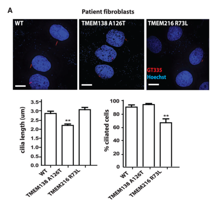

## Question

# Gene Research for Functional Annotation

## ⚠️ CRITICAL: Gene/Protein Identification Context

**BEFORE YOU BEGIN RESEARCH:** You MUST verify you are researching the CORRECT gene/protein. Gene symbols can be ambiguous, especially for less well-characterized genes from non-model organisms.

### Target Gene/Protein Identity (from UniProt):
- **UniProt Accession:** Q9P0N5
- **Protein Description:** RecName: Full=Transmembrane protein 216;
- **Gene Information:** Name=TMEM216; ORFNames=HSPC244;
- **Organism (full):** Homo sapiens (Human).
- **Protein Family:** Not specified in UniProt
- **Key Domains:** Uncharacterised_TM-17. (IPR019184); Transmemb_17 (PF09799)

### MANDATORY VERIFICATION STEPS:

1. **Check if the gene symbol "TMEM216" matches the protein description above**
2. **Verify the organism is correct:** Homo sapiens (Human).
3. **Check if protein family/domains align with what you find in literature**
4. **If you find literature for a DIFFERENT gene with the same or similar symbol, STOP**

### If Gene Symbol is Ambiguous or You Cannot Find Relevant Literature:

**DO NOT PROCEED WITH RESEARCH ON A DIFFERENT GENE.** Instead:
- State clearly: "The gene symbol 'TMEM216' is ambiguous or literature is limited for this specific protein"
- Explain what you found (e.g., "Found extensive literature on a different gene with the same symbol in a different organism")
- Describe the protein based ONLY on the UniProt information provided above
- Suggest that the protein function can be inferred from domain/family information

### Research Target:

Please provide a comprehensive research report on the gene **TMEM216** (gene ID: TMEM216, UniProt: Q9P0N5) in human.

The research report should be a detailed narrative explaining the function, biological processes, and localization of the gene product. Citations should be given for all claims.

You should prioritize authoritative reviews and primary scientific literature when conducting research. You can supplement
this with annotations you find in gene/protein databases, but these can be outdated or inaccurate.

We are specifically interested in the primary function of the gene - for enzymes, what reaction is catalyzed, and what is the substrate specificity? For transporters, what is the substrate? For structural proteins or adapters, what is the broader structural role? For signaling molecules, what is the role in the pathway.

We are interested in where in or outside the cell the gene product carries out its function.

We are also interested in the signaling or biochemical pathways in which the gene functions. We are less interested in broad pleiotropic effects, except where these elucidate the precise role.

Include evidence where possible. We are interested in both experimental evidence as well as inference from structure, evolution, or bioinformatic analysis. Precise studies should be prioritized over high-throughput, where available.

## Output

Question: You are an expert researcher providing comprehensive, well-cited information.

Provide detailed information focusing on:
1. Key concepts and definitions with current understanding
2. Recent developments and latest research (prioritize 2023-2024 sources)
3. Current applications and real-world implementations
4. Expert opinions and analysis from authoritative sources
5. Relevant statistics and data from recent studies

Format as a comprehensive research report with proper citations. Include URLs and publication dates where available.
Always prioritize recent, authoritative sources and provide specific citations for all major claims.

# Gene Research for Functional Annotation

## ⚠️ CRITICAL: Gene/Protein Identification Context

**BEFORE YOU BEGIN RESEARCH:** You MUST verify you are researching the CORRECT gene/protein. Gene symbols can be ambiguous, especially for less well-characterized genes from non-model organisms.

### Target Gene/Protein Identity (from UniProt):
- **UniProt Accession:** Q9P0N5
- **Protein Description:** RecName: Full=Transmembrane protein 216;
- **Gene Information:** Name=TMEM216; ORFNames=HSPC244;
- **Organism (full):** Homo sapiens (Human).
- **Protein Family:** Not specified in UniProt
- **Key Domains:** Uncharacterised_TM-17. (IPR019184); Transmemb_17 (PF09799)

### MANDATORY VERIFICATION STEPS:

1. **Check if the gene symbol "TMEM216" matches the protein description above**
2. **Verify the organism is correct:** Homo sapiens (Human).
3. **Check if protein family/domains align with what you find in literature**
4. **If you find literature for a DIFFERENT gene with the same or similar symbol, STOP**

### If Gene Symbol is Ambiguous or You Cannot Find Relevant Literature:

**DO NOT PROCEED WITH RESEARCH ON A DIFFERENT GENE.** Instead:
- State clearly: "The gene symbol 'TMEM216' is ambiguous or literature is limited for this specific protein"
- Explain what you found (e.g., "Found extensive literature on a different gene with the same symbol in a different organism")
- Describe the protein based ONLY on the UniProt information provided above
- Suggest that the protein function can be inferred from domain/family information

### Research Target:

Please provide a comprehensive research report on the gene **TMEM216** (gene ID: TMEM216, UniProt: Q9P0N5) in human.

The research report should be a detailed narrative explaining the function, biological processes, and localization of the gene product. Citations should be given for all claims.

You should prioritize authoritative reviews and primary scientific literature when conducting research. You can supplement
this with annotations you find in gene/protein databases, but these can be outdated or inaccurate.

We are specifically interested in the primary function of the gene - for enzymes, what reaction is catalyzed, and what is the substrate specificity? For transporters, what is the substrate? For structural proteins or adapters, what is the broader structural role? For signaling molecules, what is the role in the pathway.

We are interested in where in or outside the cell the gene product carries out its function.

We are also interested in the signaling or biochemical pathways in which the gene functions. We are less interested in broad pleiotropic effects, except where these elucidate the precise role.

Include evidence where possible. We are interested in both experimental evidence as well as inference from structure, evolution, or bioinformatic analysis. Precise studies should be prioritized over high-throughput, where available.

# Human TMEM216: functional annotation and evidence review

## Identity and principal function

**The target is human TMEM216, UniProt [Q9P0N5](https://www.uniprot.org/uniprotkb/Q9P0N5/entry), encoding transmembrane protein 216 (also called HSPC244).** Its supplied UniProt annotation identifies the Uncharacterised_TM-17/Transmemb_17 domain (InterPro IPR019184; Pfam PF09799). The domain name does **not** identify the gene as *TMEM17*. Likewise, adjacent *TMEM138* is a separate, nonhomologous gene: a primary genetic study distinguished its three-pass protein from four-pass TMEM216 and showed that the two have different cellular distributions despite coordinated expression. These distinctions are essential because experiments on other similarly named proteins do not establish TMEM216 function. (lee2012evolutionarilyassembledcisregulatory pages 3-4, lee2012evolutionarilyassembledcisregulatory pages 1-3, lee2012evolutionarilyassembledcisregulatory pages 6-9)

**Best-supported primary annotation:** TMEM216 is a small, predicted four-pass membrane protein that helps establish the primary cilium at its base. It participates in periciliary vesicle trafficking and is associated with the basal-body/transition-zone network that organizes ciliary assembly and membrane compartmentalization. It is **not established as an enzyme, an ion transporter, or a transporter with a defined substrate**; the domain annotation predicts membrane topology, not catalytic or substrate specificity. Its contribution to a selective ciliary *gate* is well motivated by its protein associations, but direct TMEM216-specific cargo-selectivity evidence is more limited than the evidence for its role in cilium formation and vesicle delivery. (lee2012evolutionarilyassembledcisregulatory pages 3-4, shoaib2020biochemicalandgeneticc pages 205-208, shoaib2020biochemicalandgenetica pages 64-68, moran2024transportandbarrier pages 14-15)

The evidence and its limits are summarized below.

| Topic | TMEM216-specific finding | Experimental basis / source | Evidence level and limitation |
|---|---|---|---|
| Identity and topology | Target is human **TMEM216 / HSPC244**, UniProt **Q9P0N5**, annotated with **Uncharacterised_TM-17 / PF09799 (Transmemb_17)** and predicted to be a four-pass membrane protein. “Transmemb_17” is a domain-family name—not the gene **TMEM17**. Lee et al. independently described TMEM216 as tetraspan and distinct from adjacent, nonhomologous TMEM138. | User-supplied UniProt record; Lee et al., *Science* (24 February 2012), [DOI](https://doi.org/10.1126/science.1213506) (lee2012evolutionarilyassembledcisregulatory pages 3-4, lee2012evolutionarilyassembledcisregulatory pages 1-3, lee2012evolutionarilyassembledcisregulatory pages 6-9) | **High** for identity and predicted topology; PF09799 is sequence annotation, not proof of a transporter, receptor, or catalytic activity. |
| Cellular localization | Endogenous TMEM216 localized primarily to **basal bodies** and to adjacent vesicles around the ciliary base in IMCD3 cells. Immuno-EM and live imaging additionally placed it on **Golgi/post-Golgi vesicles along microtubules**, with net vesicular movement toward the centrosome. | Immunofluorescence, immuno-EM, time-lapse imaging and FRAP; Lee et al. 2012, [DOI](https://doi.org/10.1126/science.1213506) (lee2012evolutionarilyassembledcisregulatory pages 3-4, lee2012evolutionarilyassembledcisregulatory pages 6-9, lee2012evolutionarilyassembledcisregulatory media ad67491e) | **High** for basal-body/periciliary-vesicle localization in the tested cells. “Transition-zone protein” is supported by the wider interaction network, but Lee’s strongest direct image places TMEM216 primarily at the basal body. |
| Requirement for ciliogenesis | Fibroblasts carrying **TMEM216 p.R73L** failed ciliogenesis after **48 h serum starvation**; cilia under 1 μm were scored, with **40–50 cells** analyzed and ANOVA/Bonferroni testing. | Patient fibroblasts; Lee et al. 2012, [DOI](https://doi.org/10.1126/science.1213506) (lee2012evolutionarilyassembledcisregulatory pages 3-4, lee2012evolutionarilyassembledcisregulatory pages 6-9, lee2012evolutionarilyassembledcisregulatory media ad67491e) | **Moderate–high** disease-linked cellular evidence. The short-cilium phenotype in the same figure belongs to **TMEM138 p.A126T**, whereas failure of ciliogenesis belongs to **TMEM216 p.R73L**; they must not be conflated. |
| Vesicle delivery and TRAPPII | TMEM216 and TMEM138 mark distinct, tethered vesicle pools. **TMEM216 knockdown disrupted TMEM138 and CEP290 trafficking**, whereas TMEM138 depletion did not notably alter TMEM216 movement. **TRAPPC9/TRAPPII** knockdown separated the vesicle pools, and myc-TRAPPC9 largely rescued tethering (**n = 90–110**). | siRNA, live-cell imaging and rescue; Lee et al. 2012, [DOI](https://doi.org/10.1126/science.1213506) (lee2012evolutionarilyassembledcisregulatory pages 3-4, lee2012evolutionarilyassembledcisregulatory pages 4-6, lee2012evolutionarilyassembledcisregulatory pages 6-9) | **High** for an upstream periciliary trafficking role. This is not equivalent to demonstrating that TMEM216 itself transports a molecular substrate across the ciliary membrane. |
| TCTN1/MKS-complex association and gate inference | TMEM216 **co-immunoprecipitated with TCTN1** but was absent from the corresponding mass-spectrometry set, consistent with a peripheral or sub-stoichiometric association with the MKS/Tectonic transition-zone complex. The complex-level model supports ciliary membrane gating. | Garcia-Gonzalo et al., *Nature Genetics* (July 2011), [DOI](https://doi.org/10.1038/ng.891) (shoaib2020biochemicalandgeneticc pages 205-208, shoaib2020biochemicalandgeneticb pages 205-208) | **Moderate** for biochemical association; **indirect** for TMEM216-specific gate activity. Cargo-localization effects involving ARL13B, AC3, SMO and PKD2 were demonstrated principally through perturbation of TCTN1 or other complex members, not a TMEM216-specific cargo-selectivity assay. |
| RhoA–actin and basal-body docking | Loss of TMEM216 in human fibroblasts or knockdown in zebrafish was reported to cause **RhoA hyperactivation**, hypothesized to disturb apical actin remodeling and thereby inhibit normal basal-body docking. | Kalot et al., *Frontiers in Nephrology* (5 January 2024), [DOI](https://doi.org/10.3389/fneph.2023.1331847), summarizing Valente et al. 2010 (kalot2024primaryciliaand pages 11-12) | **Moderate** because the 2024 source is a review of earlier experiments. The actin-to-docking causal chain is explicitly a mechanistic interpretation; do not substitute TMEM237- or TMEM67-specific RhoA assays as direct TMEM216 evidence. |
| Functional relationship with TMEM237 | Human TMEM216 mRNA significantly rescued zebrafish **tmem237** morphant phenotypes, and TMEM237 mRNA rescued **tmem216** suppression phenotypes comparably to TMEM216 mRNA. | Reciprocal mRNA/morpholino rescue; Huang et al., *American Journal of Human Genetics* (9 December 2011), [DOI](https://doi.org/10.1016/j.ajhg.2011.11.005) (huang2011tmem237ismutated pages 8-9, huang2011tmem237ismutated pages 9-11) | **Moderate** evidence of functional complementation in vivo. Reciprocal rescue does **not** by itself establish direct physical binding. RhoA and actin-stress-fiber experiments in that paper primarily tested **TMEM237**, not TMEM216. |
| Hedgehog signaling development (2024) | A 2024 report concluded that TMEM216 promotes primary ciliogenesis and Hedgehog signaling through the **SUFU–GLI2/GLI3 axis**. | Wang et al., *Science Signaling* 17(820):eabo0465 (January 2024), [DOI](https://doi.org/10.1126/scisignal.abo0465); identified through secondary citation because the original full text was unavailable (sun2025renalinsufficiencycaused pages 2-4) | **Promising but incompletely verified here**. Treat pathway direction as reported, but do not infer direct TMEM216–SUFU binding or numerical effect sizes without checking the primary article. |
| Noncoding retinal disease development (2024) | A homozygous single-nucleotide substitution upstream of **TMEM216** was reported to cause nonsyndromic retinitis pigmentosa and to be associated with reduced TMEM216 expression. | Malka et al., *American Journal of Human Genetics* 111:2012–2030 (September 2024), [DOI](https://doi.org/10.1016/j.ajhg.2024.07.020); primary text unavailable in this search | **Clinically important but indirectly assessed here**. The result supports dosage-sensitive retinal function, not a newly demonstrated biochemical activity or proof that every upstream TMEM216 variant is pathogenic. |
| Predominantly renal presentation (2025) | A 21-year-old man with proteinuria from age 15, bilateral renal cysts and progression to ESRD carried compound-heterozygous **c.253C>T (p.R85\*)** and **c.143T>C (p.L48P)** variants. p.R85\* met pathogenic criteria; p.L48P remained a **VUS** without functional validation. | Whole-exome sequencing and Sanger segregation; Sun et al., *Frontiers in Medicine* (29 April 2025), [DOI](https://doi.org/10.3389/fmed.2025.1579732) (sun2025renalinsufficiencycaused pages 4-5, sun2025renalinsufficiencycaused pages 1-2, sun2025renalinsufficiencycaused pages 5-7) | **Low–moderate** genotype–phenotype evidence because this is one case and one allele remains a VUS. It expands the possible phenotype but does not prove isolated TMEM216 nephropathy or establish a treatment. |

*Table: A source-graded matrix separating direct human TMEM216 evidence from complex-level inference, experiments on neighboring transition-zone proteins, and recent findings whose primary texts were unavailable.*

## Where TMEM216 acts and how it supports ciliogenesis

The **basal body** is the mother-centriole-derived structure at the base of a cilium; the adjoining **transition zone** lies between the basal body and ciliary axoneme and helps establish the cilium as a distinct membrane compartment. In mouse IMCD3 cells, antibody staining placed endogenous TMEM216 **primarily at basal bodies**, with additional adjacent vesicles near the ciliary base. Immunoelectron microscopy also detected TMEM216 on Golgi/post-Golgi vesicles along microtubules. Thus, “transition-zone-associated” is an appropriate network description, but it should not obscure the particularly strong direct evidence for **basal-body and periciliary-vesicle** localization. Lee and colleagues’ cropped localization and mutant-cell panels provide visual evidence for that distinction. (lee2012evolutionarilyassembledcisregulatory pages 3-4, lee2012evolutionarilyassembledcisregulatory pages 6-9, lee2012evolutionarilyassembledcisregulatory media ad78b7ce)

In live-cell imaging, TMEM216-positive vesicles showed **net movement toward the centrosome** and traveled alongside a distinct, tethered population marked by TMEM138. Depleting TMEM216 disrupted movement of TMEM138-associated vesicles and the ciliary protein CEP290; depleting TMEM138 did not comparably disrupt TMEM216-vesicle movement. Knockdown of **TRAPPC9**, a TRAPPII tethering-complex subunit, separated the vesicle populations, and TRAPPC9 re-expression largely restored tethering. This supports an **asymmetric, TMEM216-dependent delivery/tethering role upstream of cilium assembly**. It does not show that TMEM216 itself carries cargo through a membrane pore or directly binds every protein in the affected vesicles. (lee2012evolutionarilyassembledcisregulatory pages 3-4, lee2012evolutionarilyassembledcisregulatory pages 4-6, lee2012evolutionarilyassembledcisregulatory pages 6-9)

The cellular consequence is experimentally clear. After **48 hours of serum starvation**, fibroblasts carrying **TMEM216 p.R73L** showed failed ciliogenesis in Lee and colleagues’ assay, which scored cilia shorter than **1 μm**; the figure reports **40–50 cells** for its comparison. The *short-cilium* mutant shown alongside it was **TMEM138 p.A126T**, not TMEM216. TMEM216 depletion also impaired ciliogenesis in IMCD3 cells. In zebrafish, *tmem216* knockdown produced cilia-associated developmental phenotypes, including curved tails, cardiac edema and hydrocephalus; Lee and colleagues scored **more than 50 embryos per condition** for the illustrated comparison. These are functional tests, not simply localization-based predictions. (lee2012evolutionarilyassembledcisregulatory pages 3-4, lee2012evolutionarilyassembledcisregulatory pages 4-6, lee2012evolutionarilyassembledcisregulatory pages 6-9, lee2012evolutionarilyassembledcisregulatory media ad67491e)

TMEM216 also belongs functionally to the **Meckel/Joubert-associated transition-zone network**. In the Tectonic-complex study, TMEM216 associated with **TCTN1 by co-immunoprecipitation** but was not identified in the corresponding mass-spectrometry analysis; it was therefore considered a possible **peripheral or sub-stoichiometric** associate, not an established stoichiometric core subunit. The wider TCTN1 complex includes other ciliopathy proteins and controls ciliary assembly and membrane composition, but the published cargo-localization perturbations emphasized TCTN1 and other components. Their effects on ARL13B, adenylyl cyclase 3, Smoothened or PKD2 should **not** automatically be assigned to TMEM216 loss. Garcia-Gonzalo *et al.*, *Nature Genetics*, published July 2011: [doi:10.1038/ng.891](https://doi.org/10.1038/ng.891). (shoaib2020biochemicalandgeneticc pages 205-208, shoaib2020biochemicalandgeneticb pages 205-208)

A second line of evidence connects TMEM216 to **TMEM237 and transition-zone assembly**. Huang and colleagues found reciprocal functional rescue: human TMEM216 expression improved zebrafish *tmem237* knockdown phenotypes, while TMEM237 improved *tmem216* suppression phenotypes. Their *C. elegans* experiments likewise implicated the TMEM216 ortholog in a transition-zone interaction network. Functional rescue supports overlapping activity, **not proof of direct protein binding**. Notably, the prominent RhoA, actin-stress-fiber and Wnt assays in this paper tested **TMEM237-deficient** cells; those measurements are not TMEM216-loss effect sizes. Huang *et al.*, *American Journal of Human Genetics*, published 9 December 2011: [doi:10.1016/j.ajhg.2011.11.005](https://doi.org/10.1016/j.ajhg.2011.11.005). (huang2011tmem237ismutated pages 1-2, huang2011tmem237ismutated pages 8-9, huang2011tmem237ismutated pages 9-11)

## Signaling pathways: established effects versus mechanism inferred

**RhoA–actin and basal-body docking.** A 2024 review reports that TMEM216 loss in human fibroblasts or knockdown in zebrafish causes **RhoA hyperactivation**. The proposed explanation is that abnormal RhoA-dependent actin organization impedes centrosome/basal-body movement or docking at the apical membrane, thereby inhibiting ciliogenesis. This is a biologically coherent explanation of the docking defect, but the full causal sequence for TMEM216 is presented as a **hypothesis** rather than a demonstrated direct TMEM216–RhoA biochemical interaction. Kalot *et al.*, *Frontiers in Nephrology*, published January 2024: [doi:10.3389/fneph.2023.1331847](https://doi.org/10.3389/fneph.2023.1331847). (kalot2024primaryciliaand pages 11-12, shoaib2020biochemicalandgeneticc pages 64-68)

**Hedgehog signaling.** Cilia are sites of Hedgehog signal transduction, so loss of cilia or disruption of their organization can alter pathway output. A **2024 primary paper** specifically reports that TMEM216 promotes ciliogenesis and Hedgehog signaling through the **SUFU–GLI2/GLI3 axis**: Wang *et al.*, *Science Signaling* **17**(820):eabo0465, [doi:10.1126/scisignal.abo0465](https://doi.org/10.1126/scisignal.abo0465). The original paper’s full experimental text was **not retrievable in this review**; the TMEM216–SUFU–GLI finding is therefore noted as reported in the literature, without claiming a verified direct physical interaction, an exact signaling effect size or independence from the ciliogenesis defect. (sun2025renalinsufficiencycaused pages 2-4, moran2024transportandbarrier pages 14-15)

These pathways should not be collapsed into a single established molecular reaction. The most concrete TMEM216-specific mechanistic result remains **vesicle delivery/tethering toward the ciliary base**. Current expert discussion treats vesicular transport, transition-zone barriers and intraflagellar transport as interconnected but incompletely resolved processes; membership in a transition-zone complex alone does not identify which cargo TMEM216 selects or whether its principal action is at the mature gate. Moran *et al.*, *Nature Reviews Nephrology* **20**:83–100, published online October 2023 for the 2024 volume: [doi:10.1038/s41581-023-00773-2](https://doi.org/10.1038/s41581-023-00773-2). (lee2012evolutionarilyassembledcisregulatory pages 3-4, moran2024transportandbarrier pages 14-15)

## Human relevance and research applications

**Established disease association.** Biallelic TMEM216 disruption is implicated in the **Joubert–Meckel ciliopathy spectrum**. The biological link is unusually direct: disease-associated cells fail to assemble normal cilia, and the implicated cellular machinery is positioned at the ciliary base. Neurological, renal and retinal findings vary across this spectrum; phenotype alone should not be treated as a readout of a particular TMEM216 molecular activity. Lee *et al.*, *Science* **335**:966–969, published **24 February 2012**: [doi:10.1126/science.1213506](https://doi.org/10.1126/science.1213506). For clinical-spectrum context, see Van De Weghe *et al.*, *Annual Review of Genomics and Human Genetics* **23**:301–329, 2022: [doi:10.1146/annurev-genom-121321-093528](https://doi.org/10.1146/annurev-genom-121321-093528). (lee2012evolutionarilyassembledcisregulatory pages 1-3, shoaib2020biochemicalandgeneticc pages 64-68)

**Recent retinal genetics.** Malka *et al.* reported in *American Journal of Human Genetics* **111**:2012–2030, **September 2024**, that a **single noncoding nucleotide substitution upstream of TMEM216** causes nonsyndromic retinitis pigmentosa and is associated with reduced TMEM216 expression: [doi:10.1016/j.ajhg.2024.07.020](https://doi.org/10.1016/j.ajhg.2024.07.020). This is important for variant interpretation because coding-only searches can miss regulatory mechanisms. The primary article was **unavailable for detailed examination here**, so an exact patient count, expression change or experimentally resolved photoreceptor mechanism cannot be independently supplied. The finding should not be mistaken for the separate experimental work on photoreceptor **TMEM138**. (lee2012evolutionarilyassembledcisregulatory pages 1-3, lee2012evolutionarilyassembledcisregulatory pages 6-9)

**A recent renal case—and a necessary caution.** A report published **29 April 2025** describes one man with proteinuria beginning at **15 years**, bilateral kidney cysts and progression to end-stage renal disease by **21 years**. Exome sequencing and parental Sanger testing found TMEM216 **c.253C>T (p.R85\*)** inherited from his father and **c.143T>C (p.L48P)** from his mother. The authors classified p.R85\* as pathogenic, but **p.L48P remained a variant of uncertain significance without functional validation**. Accordingly, this is a clinically useful candidate diagnosis and illustrates the value of segregation testing in unexplained early-onset kidney disease; **one case does not prove** a distinct, isolated TMEM216 kidney disorder. Sun *et al.*, *Frontiers in Medicine* **12**:1579732: [doi:10.3389/fmed.2025.1579732](https://doi.org/10.3389/fmed.2025.1579732). (sun2025renalinsufficiencycaused pages 4-5, sun2025renalinsufficiencycaused pages 1-2, sun2025renalinsufficiencycaused pages 5-7)

**Practical interpretation.** TMEM216 is relevant to ciliopathy genetic testing, including evaluation of potentially causal **noncoding** variation, and to research assays measuring ciliogenesis, basal-body positioning, periciliary trafficking and pathway responses. The evidence reviewed here **does not establish a TMEM216-targeted treatment**. In particular, proposed actin-pathway interventions or therapies studied for other ciliopathy genes must not be presented as validated TMEM216-specific clinical applications. (kalot2024primaryciliaand pages 11-12, sun2025renalinsufficiencycaused pages 4-5, moran2024transportandbarrier pages 14-15)

**Overall assessment:** human TMEM216 is best annotated as a **cilium-assembly and basal-body/transition-zone-associated membrane factor, with direct evidence for TMEM216-dependent periciliary vesicle trafficking**. RhoA–actin dysregulation and Hedgehog abnormalities explain or extend its developmental impact, while its precise direct binding partners, mature-gate cargo specificity and any biochemical substrate remain unresolved. (lee2012evolutionarilyassembledcisregulatory pages 3-4, kalot2024primaryciliaand pages 11-12, shoaib2020biochemicalandgeneticc pages 205-208, moran2024transportandbarrier pages 14-15)

References

1. (lee2012evolutionarilyassembledcisregulatory pages 3-4): Jeong Ho Lee, Jennifer L. Silhavy, Ji Eun Lee, Lihadh Al-Gazali, Sophie Thomas, Erica E. Davis, Stephanie L. Bielas, Kiley J. Hill, Miriam Iannicelli, Francesco Brancati, Stacey B. Gabriel, Carsten Russ, Clare V. Logan, Saghira Malik Sharif, Christopher P. Bennett, Masumi Abe, Friedhelm Hildebrandt, Bill H. Diplas, Tania Attié-Bitach, Nicholas Katsanis, Anna Rajab, Roshan Koul, Laszlo Sztriha, Elizabeth R. Waters, Susan Ferro-Novick, C. Geoffrey Woods, Colin A. Johnson, Enza Maria Valente, Maha S. Zaki, and Joseph G. Gleeson. Evolutionarily assembled cis-regulatory module at a human ciliopathy locus. Science, 335:966-969, Feb 2012. URL: https://doi.org/10.1126/science.1213506, doi:10.1126/science.1213506. This article has 112 citations and is from a highest quality peer-reviewed journal.

2. (lee2012evolutionarilyassembledcisregulatory pages 1-3): Jeong Ho Lee, Jennifer L. Silhavy, Ji Eun Lee, Lihadh Al-Gazali, Sophie Thomas, Erica E. Davis, Stephanie L. Bielas, Kiley J. Hill, Miriam Iannicelli, Francesco Brancati, Stacey B. Gabriel, Carsten Russ, Clare V. Logan, Saghira Malik Sharif, Christopher P. Bennett, Masumi Abe, Friedhelm Hildebrandt, Bill H. Diplas, Tania Attié-Bitach, Nicholas Katsanis, Anna Rajab, Roshan Koul, Laszlo Sztriha, Elizabeth R. Waters, Susan Ferro-Novick, C. Geoffrey Woods, Colin A. Johnson, Enza Maria Valente, Maha S. Zaki, and Joseph G. Gleeson. Evolutionarily assembled cis-regulatory module at a human ciliopathy locus. Science, 335:966-969, Feb 2012. URL: https://doi.org/10.1126/science.1213506, doi:10.1126/science.1213506. This article has 112 citations and is from a highest quality peer-reviewed journal.

3. (lee2012evolutionarilyassembledcisregulatory pages 6-9): Jeong Ho Lee, Jennifer L. Silhavy, Ji Eun Lee, Lihadh Al-Gazali, Sophie Thomas, Erica E. Davis, Stephanie L. Bielas, Kiley J. Hill, Miriam Iannicelli, Francesco Brancati, Stacey B. Gabriel, Carsten Russ, Clare V. Logan, Saghira Malik Sharif, Christopher P. Bennett, Masumi Abe, Friedhelm Hildebrandt, Bill H. Diplas, Tania Attié-Bitach, Nicholas Katsanis, Anna Rajab, Roshan Koul, Laszlo Sztriha, Elizabeth R. Waters, Susan Ferro-Novick, C. Geoffrey Woods, Colin A. Johnson, Enza Maria Valente, Maha S. Zaki, and Joseph G. Gleeson. Evolutionarily assembled cis-regulatory module at a human ciliopathy locus. Science, 335:966-969, Feb 2012. URL: https://doi.org/10.1126/science.1213506, doi:10.1126/science.1213506. This article has 112 citations and is from a highest quality peer-reviewed journal.

4. (shoaib2020biochemicalandgeneticc pages 205-208): EA Shoaib. Biochemical and genetic characterisation of ciliary transition zone transmembrane proteins in cystic kidney disease and ciliopathies. Unknown journal, 2020.

5. (shoaib2020biochemicalandgenetica pages 64-68): EA Shoaib. Biochemical and genetic characterisation of ciliary transition zone transmembrane proteins in cystic kidney disease and ciliopathies. Unknown journal, 2020.

6. (moran2024transportandbarrier pages 14-15): Ailis L. Moran, Laura Louzao-Martinez, Dominic P. Norris, Dorien J. M. Peters, and Oliver E. Blacque. Transport and barrier mechanisms that regulate ciliary compartmentalization and ciliopathies. Nature Reviews Nephrology, 20:83-100, Oct 2024. URL: https://doi.org/10.1038/s41581-023-00773-2, doi:10.1038/s41581-023-00773-2. This article has 48 citations and is from a domain leading peer-reviewed journal.

7. (lee2012evolutionarilyassembledcisregulatory media ad67491e): Jeong Ho Lee, Jennifer L. Silhavy, Ji Eun Lee, Lihadh Al-Gazali, Sophie Thomas, Erica E. Davis, Stephanie L. Bielas, Kiley J. Hill, Miriam Iannicelli, Francesco Brancati, Stacey B. Gabriel, Carsten Russ, Clare V. Logan, Saghira Malik Sharif, Christopher P. Bennett, Masumi Abe, Friedhelm Hildebrandt, Bill H. Diplas, Tania Attié-Bitach, Nicholas Katsanis, Anna Rajab, Roshan Koul, Laszlo Sztriha, Elizabeth R. Waters, Susan Ferro-Novick, C. Geoffrey Woods, Colin A. Johnson, Enza Maria Valente, Maha S. Zaki, and Joseph G. Gleeson. Evolutionarily assembled cis-regulatory module at a human ciliopathy locus. Science, 335:966-969, Feb 2012. URL: https://doi.org/10.1126/science.1213506, doi:10.1126/science.1213506. This article has 112 citations and is from a highest quality peer-reviewed journal.

8. (lee2012evolutionarilyassembledcisregulatory pages 4-6): Jeong Ho Lee, Jennifer L. Silhavy, Ji Eun Lee, Lihadh Al-Gazali, Sophie Thomas, Erica E. Davis, Stephanie L. Bielas, Kiley J. Hill, Miriam Iannicelli, Francesco Brancati, Stacey B. Gabriel, Carsten Russ, Clare V. Logan, Saghira Malik Sharif, Christopher P. Bennett, Masumi Abe, Friedhelm Hildebrandt, Bill H. Diplas, Tania Attié-Bitach, Nicholas Katsanis, Anna Rajab, Roshan Koul, Laszlo Sztriha, Elizabeth R. Waters, Susan Ferro-Novick, C. Geoffrey Woods, Colin A. Johnson, Enza Maria Valente, Maha S. Zaki, and Joseph G. Gleeson. Evolutionarily assembled cis-regulatory module at a human ciliopathy locus. Science, 335:966-969, Feb 2012. URL: https://doi.org/10.1126/science.1213506, doi:10.1126/science.1213506. This article has 112 citations and is from a highest quality peer-reviewed journal.

9. (shoaib2020biochemicalandgeneticb pages 205-208): EA Shoaib. Biochemical and genetic characterisation of ciliary transition zone transmembrane proteins in cystic kidney disease and ciliopathies. Unknown journal, 2020.

10. (kalot2024primaryciliaand pages 11-12): Rita K. Kalot, Zachary T Sentell, Thomas M. Kitzler, and Elena Torban. Primary cilia and actin regulatory pathways in renal ciliopathies. Frontiers in Nephrology, Jan 2024. URL: https://doi.org/10.3389/fneph.2023.1331847, doi:10.3389/fneph.2023.1331847. This article has 14 citations.

11. (huang2011tmem237ismutated pages 8-9): Lijia Huang, Katarzyna Szymanska, Victor L. Jensen, Andreas R. Janecke, A. Micheil Innes, Erica E. Davis, Patrick Frosk, Chunmei Li, Jason R. Willer, Bernard N. Chodirker, Cheryl R. Greenberg, D. Ross McLeod, Francois P. Bernier, Albert E. Chudley, Thomas Müller, Mohammad Shboul, Clare V. Logan, Catrina M. Loucks, Chandree L. Beaulieu, Rachel V. Bowie, Sandra M. Bell, Jonathan Adkins, Freddi I. Zuniga, Kevin D. Ross, Jian Wang, Matthew R. Ban, Christian Becker, Peter Nürnberg, Stuart Douglas, Cheryl M. Craft, Marie-Andree Akimenko, Robert A. Hegele, Carole Ober, Gerd Utermann, Hanno J. Bolz, Dennis E. Bulman, Nicholas Katsanis, Oliver E. Blacque, Dan Doherty, Jillian S. Parboosingh, Michel R. Leroux, Colin A. Johnson, and Kym M. Boycott. Tmem237 is mutated in individuals with a joubert syndrome related disorder and expands the role of the tmem family at the ciliary transition zone. American journal of human genetics, 89 6:713-30, Dec 2011. URL: https://doi.org/10.1016/j.ajhg.2011.11.005, doi:10.1016/j.ajhg.2011.11.005. This article has 251 citations and is from a highest quality peer-reviewed journal.

12. (huang2011tmem237ismutated pages 9-11): Lijia Huang, Katarzyna Szymanska, Victor L. Jensen, Andreas R. Janecke, A. Micheil Innes, Erica E. Davis, Patrick Frosk, Chunmei Li, Jason R. Willer, Bernard N. Chodirker, Cheryl R. Greenberg, D. Ross McLeod, Francois P. Bernier, Albert E. Chudley, Thomas Müller, Mohammad Shboul, Clare V. Logan, Catrina M. Loucks, Chandree L. Beaulieu, Rachel V. Bowie, Sandra M. Bell, Jonathan Adkins, Freddi I. Zuniga, Kevin D. Ross, Jian Wang, Matthew R. Ban, Christian Becker, Peter Nürnberg, Stuart Douglas, Cheryl M. Craft, Marie-Andree Akimenko, Robert A. Hegele, Carole Ober, Gerd Utermann, Hanno J. Bolz, Dennis E. Bulman, Nicholas Katsanis, Oliver E. Blacque, Dan Doherty, Jillian S. Parboosingh, Michel R. Leroux, Colin A. Johnson, and Kym M. Boycott. Tmem237 is mutated in individuals with a joubert syndrome related disorder and expands the role of the tmem family at the ciliary transition zone. American journal of human genetics, 89 6:713-30, Dec 2011. URL: https://doi.org/10.1016/j.ajhg.2011.11.005, doi:10.1016/j.ajhg.2011.11.005. This article has 251 citations and is from a highest quality peer-reviewed journal.

13. (sun2025renalinsufficiencycaused pages 2-4): Lingjun Sun, Meiqi Xu, Xiaoying Deng, and Xiaoyan Liu. Renal insufficiency caused by tmem216 gene mutation: case report. Frontiers in Medicine, Apr 2025. URL: https://doi.org/10.3389/fmed.2025.1579732, doi:10.3389/fmed.2025.1579732. This article has 1 citations.

14. (sun2025renalinsufficiencycaused pages 4-5): Lingjun Sun, Meiqi Xu, Xiaoying Deng, and Xiaoyan Liu. Renal insufficiency caused by tmem216 gene mutation: case report. Frontiers in Medicine, Apr 2025. URL: https://doi.org/10.3389/fmed.2025.1579732, doi:10.3389/fmed.2025.1579732. This article has 1 citations.

15. (sun2025renalinsufficiencycaused pages 1-2): Lingjun Sun, Meiqi Xu, Xiaoying Deng, and Xiaoyan Liu. Renal insufficiency caused by tmem216 gene mutation: case report. Frontiers in Medicine, Apr 2025. URL: https://doi.org/10.3389/fmed.2025.1579732, doi:10.3389/fmed.2025.1579732. This article has 1 citations.

16. (sun2025renalinsufficiencycaused pages 5-7): Lingjun Sun, Meiqi Xu, Xiaoying Deng, and Xiaoyan Liu. Renal insufficiency caused by tmem216 gene mutation: case report. Frontiers in Medicine, Apr 2025. URL: https://doi.org/10.3389/fmed.2025.1579732, doi:10.3389/fmed.2025.1579732. This article has 1 citations.

17. (lee2012evolutionarilyassembledcisregulatory media ad78b7ce): Jeong Ho Lee, Jennifer L. Silhavy, Ji Eun Lee, Lihadh Al-Gazali, Sophie Thomas, Erica E. Davis, Stephanie L. Bielas, Kiley J. Hill, Miriam Iannicelli, Francesco Brancati, Stacey B. Gabriel, Carsten Russ, Clare V. Logan, Saghira Malik Sharif, Christopher P. Bennett, Masumi Abe, Friedhelm Hildebrandt, Bill H. Diplas, Tania Attié-Bitach, Nicholas Katsanis, Anna Rajab, Roshan Koul, Laszlo Sztriha, Elizabeth R. Waters, Susan Ferro-Novick, C. Geoffrey Woods, Colin A. Johnson, Enza Maria Valente, Maha S. Zaki, and Joseph G. Gleeson. Evolutionarily assembled cis-regulatory module at a human ciliopathy locus. Science, 335:966-969, Feb 2012. URL: https://doi.org/10.1126/science.1213506, doi:10.1126/science.1213506. This article has 112 citations and is from a highest quality peer-reviewed journal.

18. (huang2011tmem237ismutated pages 1-2): Lijia Huang, Katarzyna Szymanska, Victor L. Jensen, Andreas R. Janecke, A. Micheil Innes, Erica E. Davis, Patrick Frosk, Chunmei Li, Jason R. Willer, Bernard N. Chodirker, Cheryl R. Greenberg, D. Ross McLeod, Francois P. Bernier, Albert E. Chudley, Thomas Müller, Mohammad Shboul, Clare V. Logan, Catrina M. Loucks, Chandree L. Beaulieu, Rachel V. Bowie, Sandra M. Bell, Jonathan Adkins, Freddi I. Zuniga, Kevin D. Ross, Jian Wang, Matthew R. Ban, Christian Becker, Peter Nürnberg, Stuart Douglas, Cheryl M. Craft, Marie-Andree Akimenko, Robert A. Hegele, Carole Ober, Gerd Utermann, Hanno J. Bolz, Dennis E. Bulman, Nicholas Katsanis, Oliver E. Blacque, Dan Doherty, Jillian S. Parboosingh, Michel R. Leroux, Colin A. Johnson, and Kym M. Boycott. Tmem237 is mutated in individuals with a joubert syndrome related disorder and expands the role of the tmem family at the ciliary transition zone. American journal of human genetics, 89 6:713-30, Dec 2011. URL: https://doi.org/10.1016/j.ajhg.2011.11.005, doi:10.1016/j.ajhg.2011.11.005. This article has 251 citations and is from a highest quality peer-reviewed journal.

19. (shoaib2020biochemicalandgeneticc pages 64-68): EA Shoaib. Biochemical and genetic characterisation of ciliary transition zone transmembrane proteins in cystic kidney disease and ciliopathies. Unknown journal, 2020.

## Artifacts

- [Edison artifact artifact-00](TMEM216-deep-research-falcon_artifacts/artifact-00.md)

## Citations

1. kalot2024primaryciliaand pages 11-12
2. sun2025renalinsufficiencycaused pages 2-4
3. lee2012evolutionarilyassembledcisregulatory pages 3-4
4. lee2012evolutionarilyassembledcisregulatory pages 1-3
5. lee2012evolutionarilyassembledcisregulatory pages 6-9
6. shoaib2020biochemicalandgeneticc pages 205-208
7. shoaib2020biochemicalandgenetica pages 64-68
8. moran2024transportandbarrier pages 14-15
9. lee2012evolutionarilyassembledcisregulatory pages 4-6
10. shoaib2020biochemicalandgeneticb pages 205-208
11. sun2025renalinsufficiencycaused pages 4-5
12. sun2025renalinsufficiencycaused pages 1-2
13. sun2025renalinsufficiencycaused pages 5-7
14. shoaib2020biochemicalandgeneticc pages 64-68
15. Q9P0N5
16. DOI
17. doi:10.1038/ng.891
18. doi:10.1016/j.ajhg.2011.11.005
19. doi:10.3389/fneph.2023.1331847
20. doi:10.1126/scisignal.abo0465
21. doi:10.1038/s41581-023-00773-2
22. doi:10.1126/science.1213506
23. doi:10.1146/annurev-genom-121321-093528
24. doi:10.1016/j.ajhg.2024.07.020
25. doi:10.3389/fmed.2025.1579732
26. https://www.uniprot.org/uniprotkb/Q9P0N5/entry
27. https://doi.org/10.1126/science.1213506
28. https://doi.org/10.1038/ng.891
29. https://doi.org/10.3389/fneph.2023.1331847
30. https://doi.org/10.1016/j.ajhg.2011.11.005
31. https://doi.org/10.1126/scisignal.abo0465
32. https://doi.org/10.1016/j.ajhg.2024.07.020
33. https://doi.org/10.3389/fmed.2025.1579732
34. https://doi.org/10.1038/s41581-023-00773-2
35. https://doi.org/10.1146/annurev-genom-121321-093528
36. https://doi.org/10.1126/science.1213506,
37. https://doi.org/10.1038/s41581-023-00773-2,
38. https://doi.org/10.3389/fneph.2023.1331847,
39. https://doi.org/10.1016/j.ajhg.2011.11.005,
40. https://doi.org/10.3389/fmed.2025.1579732,