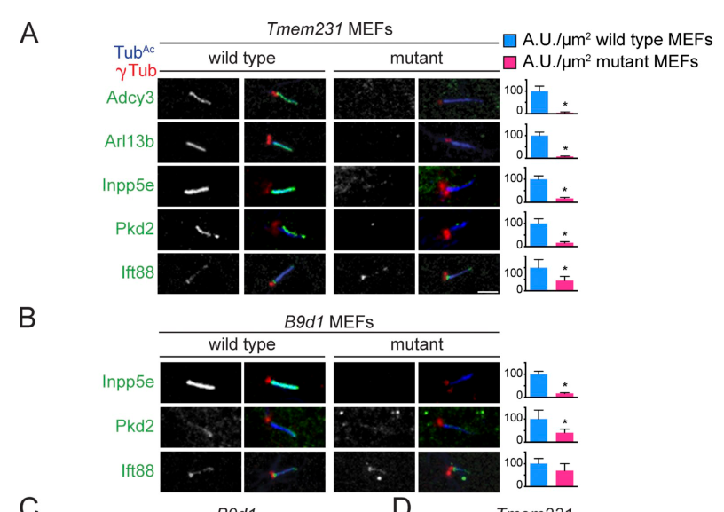

## Question

# Gene Research for Functional Annotation

## ⚠️ CRITICAL: Gene/Protein Identification Context

**BEFORE YOU BEGIN RESEARCH:** You MUST verify you are researching the CORRECT gene/protein. Gene symbols can be ambiguous, especially for less well-characterized genes from non-model organisms.

### Target Gene/Protein Identity (from UniProt):
- **UniProt Accession:** Q9H6L2
- **Protein Description:** RecName: Full=Transmembrane protein 231;
- **Gene Information:** Name=TMEM231; ORFNames=UNQ870/PRO1886;
- **Organism (full):** Homo sapiens (Human).
- **Protein Family:** Belongs to the TMEM231 family. .
- **Key Domains:** TMEM231. (IPR019306); TM231 (PF10149)

### MANDATORY VERIFICATION STEPS:

1. **Check if the gene symbol "TMEM231" matches the protein description above**
2. **Verify the organism is correct:** Homo sapiens (Human).
3. **Check if protein family/domains align with what you find in literature**
4. **If you find literature for a DIFFERENT gene with the same or similar symbol, STOP**

### If Gene Symbol is Ambiguous or You Cannot Find Relevant Literature:

**DO NOT PROCEED WITH RESEARCH ON A DIFFERENT GENE.** Instead:
- State clearly: "The gene symbol 'TMEM231' is ambiguous or literature is limited for this specific protein"
- Explain what you found (e.g., "Found extensive literature on a different gene with the same symbol in a different organism")
- Describe the protein based ONLY on the UniProt information provided above
- Suggest that the protein function can be inferred from domain/family information

### Research Target:

Please provide a comprehensive research report on the gene **TMEM231** (gene ID: TMEM231, UniProt: Q9H6L2) in human.

The research report should be a detailed narrative explaining the function, biological processes, and localization of the gene product. Citations should be given for all claims.

You should prioritize authoritative reviews and primary scientific literature when conducting research. You can supplement
this with annotations you find in gene/protein databases, but these can be outdated or inaccurate.

We are specifically interested in the primary function of the gene - for enzymes, what reaction is catalyzed, and what is the substrate specificity? For transporters, what is the substrate? For structural proteins or adapters, what is the broader structural role? For signaling molecules, what is the role in the pathway.

We are interested in where in or outside the cell the gene product carries out its function.

We are also interested in the signaling or biochemical pathways in which the gene functions. We are less interested in broad pleiotropic effects, except where these elucidate the precise role.

Include evidence where possible. We are interested in both experimental evidence as well as inference from structure, evolution, or bioinformatic analysis. Precise studies should be prioritized over high-throughput, where available.

## Output

Question: You are an expert researcher providing comprehensive, well-cited information.

Provide detailed information focusing on:
1. Key concepts and definitions with current understanding
2. Recent developments and latest research (prioritize 2023-2024 sources)
3. Current applications and real-world implementations
4. Expert opinions and analysis from authoritative sources
5. Relevant statistics and data from recent studies

Format as a comprehensive research report with proper citations. Include URLs and publication dates where available.
Always prioritize recent, authoritative sources and provide specific citations for all major claims.

# Gene Research for Functional Annotation

## ⚠️ CRITICAL: Gene/Protein Identification Context

**BEFORE YOU BEGIN RESEARCH:** You MUST verify you are researching the CORRECT gene/protein. Gene symbols can be ambiguous, especially for less well-characterized genes from non-model organisms.

### Target Gene/Protein Identity (from UniProt):
- **UniProt Accession:** Q9H6L2
- **Protein Description:** RecName: Full=Transmembrane protein 231;
- **Gene Information:** Name=TMEM231; ORFNames=UNQ870/PRO1886;
- **Organism (full):** Homo sapiens (Human).
- **Protein Family:** Belongs to the TMEM231 family. .
- **Key Domains:** TMEM231. (IPR019306); TM231 (PF10149)

### MANDATORY VERIFICATION STEPS:

1. **Check if the gene symbol "TMEM231" matches the protein description above**
2. **Verify the organism is correct:** Homo sapiens (Human).
3. **Check if protein family/domains align with what you find in literature**
4. **If you find literature for a DIFFERENT gene with the same or similar symbol, STOP**

### If Gene Symbol is Ambiguous or You Cannot Find Relevant Literature:

**DO NOT PROCEED WITH RESEARCH ON A DIFFERENT GENE.** Instead:
- State clearly: "The gene symbol 'TMEM231' is ambiguous or literature is limited for this specific protein"
- Explain what you found (e.g., "Found extensive literature on a different gene with the same symbol in a different organism")
- Describe the protein based ONLY on the UniProt information provided above
- Suggest that the protein function can be inferred from domain/family information

### Research Target:

Please provide a comprehensive research report on the gene **TMEM231** (gene ID: TMEM231, UniProt: Q9H6L2) in human.

The research report should be a detailed narrative explaining the function, biological processes, and localization of the gene product. Citations should be given for all claims.

You should prioritize authoritative reviews and primary scientific literature when conducting research. You can supplement
this with annotations you find in gene/protein databases, but these can be outdated or inaccurate.

We are specifically interested in the primary function of the gene - for enzymes, what reaction is catalyzed, and what is the substrate specificity? For transporters, what is the substrate? For structural proteins or adapters, what is the broader structural role? For signaling molecules, what is the role in the pathway.

We are interested in where in or outside the cell the gene product carries out its function.

We are also interested in the signaling or biochemical pathways in which the gene functions. We are less interested in broad pleiotropic effects, except where these elucidate the precise role.

Include evidence where possible. We are interested in both experimental evidence as well as inference from structure, evolution, or bioinformatic analysis. Precise studies should be prioritized over high-throughput, where available.

# Functional annotation of human TMEM231 (UniProt Q9H6L2)

## Identity and principal function

**Identity verified.** The requested human gene **TMEM231** encodes transmembrane protein 231, also designated UNQ870/PRO1886. Its supplied UniProt accession, TMEM231-family assignment and TMEM231/TM231 domain annotations are consistent with gene-specific studies of human TMEM231 and its mouse and *Caenorhabditis elegans* orthologues. These studies describe an approximately 36-kDa, **two-pass membrane protein**; TMEM216, TMEM218, TMEM237 and TMEM67 are different genes and should not be substituted for it. (roberson2015tmem231mutatedin pages 1-2, roberson2015tmem231mutatedin pages 2-3, zhang2023identificationofnovel pages 4-5)

**Best-supported annotation:** TMEM231 is a membrane-embedded **organizer of the Meckel-syndrome (MKS) protein module at the ciliary transition zone**. Its principal function is to help establish the selective boundary that maintains the protein composition of the primary cilium. It is **not established as an enzyme or a transporter**: the proteins whose ciliary abundance changes upon TMEM231 loss are functional readouts of gate organization, not demonstrated substrates transported or chemically modified by TMEM231. This conclusion is supported most directly by protein-complex purification, reciprocal loss-of-function experiments, ciliary-cargo localization and rescue with wild-type versus patient-associated alleles. (roberson2015tmem231mutatedin pages 2-3, roberson2015tmem231mutatedin pages 3-4, roberson2015tmem231mutatedin pages 9-10, roberson2015tmem231mutatedin pages 4-6)

## Where it works and how it organizes the gate

TMEM231 concentrates at the **transition zone immediately distal to the basal body**, at the proximal end of the ciliary axoneme. This location puts a transmembrane component between the cell-surface/periciliary membrane and the specialized ciliary membrane; it is not evidence that TMEM231 itself is a soluble axonemal transport motor. Imaging in mammalian cells and localization of the nematode orthologue support this assignment. The transition zone is the broader structural gateway through which ciliary proteins enter and exit, rather than a compartment consisting solely of TMEM231. (roberson2015tmem231mutatedin pages 1-2, roberson2015tmem231mutatedin pages 6-7, chih2012aciliopathycomplex pages 1-5, moran2024transportandbarrier pages 2-3)

In affinity-purification and co-immunoprecipitation studies, Tmem231 associated with **B9d1 and Mks1**, alongside other MKS-associated components including tectonics, Cc2d2a and Tmem17. Mouse embryonic fibroblasts lacking Tmem231 lost **B9d1, Mks1 and Tmem67** from the transition zone; conversely, B9d1 deficiency displaced Tmem231. Tctn1 was required for both proteins to localize there. **Rpgrip1l and Nphp1 remained transition-zone-localized** after Tmem231 loss, showing a selective MKS-module defect rather than destruction of the entire gateway. Reciprocal Tmem231–B9d1 localization requirements were also observed in mouse kidney, bile duct, pancreas, retina and trachea. These data establish interdependent assembly, but do not prove that TMEM231 alone initiates the complex. (roberson2015tmem231mutatedin pages 2-3, roberson2015tmem231mutatedin pages 9-10, roberson2015tmem231mutatedin pages 4-6)

The consequences for ciliary composition are selective. In **Tmem231-null mouse fibroblasts**, ciliary **ADCY3, ARL13B, INPP5E and PKD2** were lost or markedly depleted, whereas the proportion of cilia positive for the axonemal intraflagellar-transport protein **IFT88** was preserved despite reduced staining intensity. Loss of ciliary ARL13B was also observed across several mutant mouse tissues. The original study quantified at least **10 cilia per condition** for its displayed localization comparisons. The cropped original **Figure 3, panels A–B**, provides visual evidence for this membrane-cargo versus IFT88 distinction. Mutant fibroblasts had fewer ciliated cells but longer remaining cilia: TMEM231 supports normal ciliogenesis and composition, yet is not universally indispensable for producing a cilium. (roberson2015tmem231mutatedin pages 3-4, roberson2015tmem231mutatedin media 530eb06a)

A complementary **exclusion** experiment strengthens the gating interpretation: in *C. elegans*, loss of **TMEM-231** allowed the normally periciliary membrane protein **TRAM-1a** to enter cilia. This is direct evidence for a conserved role in restricting inappropriate ciliary access, **not** evidence that human TMEM231 binds or actively transports TRAM-1a. Evolutionary conservation of the orthologue and its transition-zone interactions supports the functional annotation without specifying an atomic mechanism. (roberson2015tmem231mutatedin pages 6-7, roberson2015tmem231mutatedin pages 4-6)

The following evidence map separates direct TMEM231 experiments from conclusions about the larger complex.

| Question / phenomenon | Direct TMEM231 observation (species; approach) | Interpretation / limits | Source, DOI URL, publication date |
|---|---|---|---|
| Identity and molecular class | Human TMEM231/Q9H6L2 corresponds to the conserved ~36-kDa, two-pass transmembrane protein studied with mouse Tmem231 and *C. elegans* TMEM-231. | Supports annotation as a membrane-embedded ciliary transition-zone organizer in the MKS module—not an enzyme or demonstrated solute transporter. | Roberson et al., *J. Cell Biol.*; [10.1083/jcb.201411087](https://doi.org/10.1083/jcb.201411087); 13 Apr 2015 (roberson2015tmem231mutatedin pages 1-2, roberson2015tmem231mutatedin pages 2-3) |
| MKS-complex assembly at the transition zone | **Mouse MEFs and tissues; knockout immunofluorescence:** Tmem231 and B9d1 were reciprocally required for transition-zone localization. Loss of either removed Mks1 and Tmem67; Rpgrip1l and Nphp1 remained, with increased Nphp1 accumulation. Tctn1 was required for Tmem231 and B9d1 localization. The dependencies were reproduced in kidney, bile duct, pancreas, retina and trachea. | Strong direct evidence that Tmem231 organizes a specific MKS-module subassembly rather than forming the entire transition zone. Recruitment is interdependent, so the data do not establish that TMEM231 alone initiates assembly. | Roberson et al., *J. Cell Biol.*; [10.1083/jcb.201411087](https://doi.org/10.1083/jcb.201411087); 13 Apr 2015 (roberson2015tmem231mutatedin pages 4-6) |
| Control of ciliary membrane composition | **Mouse Tmem231-null MEFs and tissues; immunofluorescence:** ciliary ADCY3, ARL13B, INPP5E and PKD2 were lost or strongly depleted, whereas axonemal IFT88 localization was largely retained. ARL13B loss was also observed in pancreatic, bile-duct, tracheal and kidney cilia. | Indicates selective control of ciliary membrane-associated cargo composition, not indiscriminate loss of all ciliary proteins. Mutants had fewer but longer cilia, so TMEM231 contributes to ciliogenesis in some contexts but is not absolutely required to build every cilium. | Roberson et al., *J. Cell Biol.*; [10.1083/jcb.201411087](https://doi.org/10.1083/jcb.201411087); 13 Apr 2015 (roberson2015tmem231mutatedin pages 3-4, roberson2015tmem231mutatedin media 530eb06a) |
| Exclusion of non-ciliary membrane proteins | ***C. elegans* tmem-231 mutant; fluorescent localization assay:** TRAM-1a, normally confined to the periciliary membrane, entered cilia. TMEM-17 failed to concentrate at the transition zone and MKS-2/TMEM216 shifted distally, whereas NPHP-1 and MKS-5 remained localized. | Direct evolutionary evidence for a transition-zone gating role. TRAM-1a is a nematode assay cargo; it is not a demonstrated human TMEM231 substrate, and TMEM231 itself was not shown to transport TRAM-1a. | Roberson et al., *J. Cell Biol.*; [10.1083/jcb.201411087](https://doi.org/10.1083/jcb.201411087); 13 Apr 2015 (roberson2015tmem231mutatedin pages 6-7, roberson2015tmem231mutatedin pages 4-6) |
| Functional effects of human disease-associated missense alleles | **Mouse Tmem231-null MEFs expressing disease-associated constructs:** p.Leu81Phe, p.Pro125Ala, p.Asn90Ile and p.Ala216Pro incompletely rescued ARL13B and B9d1 localization. All retained B9d1 co-immunoprecipitation, while p.Asn90Ile and p.Pro125Ala had reduced protein levels. | Supports hypomorphic loss of transition-zone organization rather than universal abolition of B9d1 binding. Expression in mouse cells is informative but does not reproduce every allele’s endogenous human expression or tissue context. | Roberson et al., *J. Cell Biol.*; [10.1083/jcb.201411087](https://doi.org/10.1083/jcb.201411087); 13 Apr 2015 (roberson2015tmem231mutatedin pages 9-10, roberson2015tmem231mutatedin pages 7-9) |
| Human genetic association with OFD3 and Meckel syndrome | **Human sequencing and segregation:** biallelic TMEM231 variants segregated with OFD3 or Meckel syndrome in multiple pedigrees; two recurrent alleles included p.Pro125Ala and c.664+4A>G. Variants were absent from 6,503 control exomes in the reported analysis. | Establishes recessive ciliopathy causation when combined with segregation and functional assays. The paper’s statement that TMEM231 might account for “>5%” of MKS lacked an explicit denominator in the cited excerpt and should not be treated as a modern population-frequency estimate. | Roberson et al., *J. Cell Biol.*; [10.1083/jcb.201411087](https://doi.org/10.1083/jcb.201411087); 13 Apr 2015 (roberson2015tmem231mutatedin pages 6-7, roberson2015tmem231mutatedin pages 9-10) |
| Newly characterized splice variants | **Human fetus and parental samples; WES, Sanger sequencing, cDNA cloning and qPCR:** compound-heterozygous c.583-1G>C and c.583-2_588delinsTCCTCCC variants each caused exon-5 skipping, an 82-bp deletion, p.Ile195Leufs*5 and a predicted 198-residue product. TMEM231 mRNA was significantly reduced; ARL13B staining and primary cilia were markedly reduced in renal tubules. | Strong variant-level splice evidence from one family with four affected pregnancies. Reduced ARL13B staining supports severe ciliary disruption but is not, by itself, proof that every cilium is structurally absent. The reported historical 12/15 truncating-case proportion is a small case-series observation, not disease prevalence. | Zhang et al., *Front. Genet.*; [10.3389/fgene.2023.1252873](https://doi.org/10.3389/fgene.2023.1252873); 6 Sep 2023 (zhang2023identificationofnovel pages 1-2, zhang2023identificationofnovel pages 4-5) |
| Physical diffusion-barrier mechanism in photoreceptors | **Not a direct TMEM231 test.** In mouse rods, photoreceptor-specific **Tctn1** ablation destabilized the broader tectonic/MKS complex; FRAP showed faster rhodopsin passage through the transition zone, while a barrier remained. | Supports the contemporary model that the tectonic/MKS module slows lateral membrane-protein diffusion. It cannot establish that TMEM231 alone produces the barrier or that rhodopsin is a TMEM231 substrate. | Truong et al., *Nat. Commun.*; [10.1038/s41467-023-41450-z](https://doi.org/10.1038/s41467-023-41450-z); Sep 2023 (truong2023thetectoniccomplex pages 2-3, truong2023thetectoniccomplex pages 6-7, truong2023thetectoniccomplex pages 7-8) |

*Table: Gene-specific evidence supporting human TMEM231/Q9H6L2 as a ciliary transition-zone MKS-module organizer, with direct findings separated from complex-level inference. The table also distinguishes functional variant evidence from prevalence claims and non-TMEM231 photoreceptor experiments.*

## Signaling and biological processes

TMEM231 acts **upstream of cilium-dependent signaling by controlling where signaling proteins reside**. In particular, loss of ciliary ARL13B and INPP5E links its gate-organizing role to ciliary signaling and membrane-lipid regulation; loss of ciliary PKD2 provides a plausible connection to kidney phenotypes. Mouse Tmem231 mutants have reported **Hedgehog-signaling defects**, neural-tube patterning abnormalities and polydactyly. These findings support an indirect role in Hedgehog signal competence, **not** a demonstrated function as a Hedgehog ligand receptor, kinase or GLI transcription factor. The evidence reviewed here does not establish a TMEM231-specific reaction, transported solute or direct ligand-binding specificity. (roberson2015tmem231mutatedin pages 1-2, roberson2015tmem231mutatedin pages 3-4, chih2012aciliopathycomplex pages 1-5)

The broader gate mechanism is still being resolved. An authoritative review describes the transition zone as containing MKS and nephronophthisis modules that restrict exchange of membrane-associated and soluble molecules, potentially through a protein “picket fence” and associated membrane specialization; it cautions against treating the gate as a universal, absolute molecular-weight cutoff. **These are models for the assembled transition zone, not proven molecular activities of isolated TMEM231.** Moran and colleagues, *Nature Reviews Nephrology* **20**, 83–100 (2024 issue; DOI record dated 2023), https://doi.org/10.1038/s41581-023-00773-2. (moran2024transportandbarrier pages 2-3, moran2024transportandbarrier pages 5-6)

## Human disease evidence and recent developments

**Established genetic relevance.** Recessive TMEM231 variants have been linked to **orofaciodigital syndrome type 3 (OFD3)** and **Meckel syndrome (MKS)**. In a 2015 study, two siblings with OFD3 carried **p.Leu81Phe/p.Pro125Ala**; additional MKS pedigrees carried recurrent **p.Pro125Ala** or splice-affecting **c.664+4A>G**, among other alleles. Four tested patient-associated missense constructs incompletely restored ARL13B ciliary localization and B9d1 transition-zone localization in Tmem231-null fibroblasts, although all four still co-immunoprecipitated B9d1. The results implicate impaired assembly or stability rather than a uniform loss of detectable B9d1 binding. Roberson and colleagues, *Journal of Cell Biology* **209**, 129–142, **13 April 2015**, https://doi.org/10.1083/jcb.201411087. (roberson2015tmem231mutatedin pages 6-7, roberson2015tmem231mutatedin pages 9-10, roberson2015tmem231mutatedin pages 7-9)

**Direct human-tissue evidence published in 2023.** Zhang and colleagues studied a family with **four affected pregnancies**, sequencing one fetal proband. The fetus carried the previously unreported compound-heterozygous splice-region variants **NM_001077418.2:c.583-1G>C** and **c.583-2_588delinsTCCTCCC**, with one inherited from each parent. cDNA cloning showed that **both caused exon 5 skipping**—an **82-base-pair deletion**, predicted **p.Ile195Leufs*5** and a **198-amino-acid truncated product**. Fetal tissues had reduced TMEM231 mRNA; affected renal tubules showed markedly reduced ARL13B staining and almost no detectable primary cilia. The proposed contribution of nonsense-mediated decay is plausible but was **not directly demonstrated**. This is compelling splice and histopathology evidence from **one pedigree**, not a general estimate of variant frequency or a direct measurement of TMEM231 protein abundance. Zhang and colleagues, *Frontiers in Genetics* **14**, 1252873, **6 September 2023**, https://doi.org/10.3389/fgene.2023.1252873. (zhang2023identificationofnovel pages 1-2, zhang2023identificationofnovel pages 4-5)

**A 2023 advance in mechanism—but not a TMEM231-knockout experiment.** In mouse rod photoreceptors, **Tctn1** deletion disrupted the associated tectonic/MKS complex. Live-cell measurements showed faster fluorescent-rhodopsin movement through the transition zone and eventual accumulation of inappropriate membrane proteins in the photoreceptor cilium; a residual diffusion barrier remained. This provides experimental support for the *complex-level* interpretation that transition-zone assemblies slow membrane-protein diffusion. **TMEM231 was not the deleted gene**, so the measured rhodopsin dynamics must not be assigned specifically to TMEM231. Truong and colleagues, *Nature Communications* **14**, **September 2023**, https://doi.org/10.1038/s41467-023-41450-z. (truong2023thetectoniccomplex pages 2-3, truong2023thetectoniccomplex pages 6-7, truong2023thetectoniccomplex pages 7-8)

## Applications, quantitative context and limitations

**Present application is chiefly molecular diagnosis and variant interpretation.** For an individual with MKS- or OFD-spectrum features, biallelic TMEM231 sequencing with segregation analysis can be supplemented, where samples permit, by **splice-product analysis** and research assays of **B9D1 transition-zone localization** and **ARL13B ciliary localization**. Wild-type-versus-variant rescue provides functional evidence, but these cell assays are not established standalone clinical diagnostic tests. In particular, diminished ARL13B staining can indicate defective ciliary *composition* and should not automatically be interpreted as structural absence of every cilium. (roberson2015tmem231mutatedin pages 9-10, roberson2015tmem231mutatedin pages 7-9, zhang2023identificationofnovel pages 1-2, zhang2023identificationofnovel pages 4-5)

Numbers require careful denominators. The 2015 investigation sequenced **1,056 people with nephronophthisis-related ciliopathies** and found recessively segregating TMEM231 variants in **nine pedigrees** described across its disease investigations; these figures are **not** a numerator and denominator for population MKS prevalence. Its proposed **“>5% of MKS cases”** contribution is a historical author estimate without a recoverable cohort denominator in the examined passage. The 2023 paper separately summarized **15 previously reported TMEM231-associated MKS cases**, **12/15 (80%)** described as having premature-stop-generating mutations. That fraction describes a small, selected published case set, **not the share of all MKS attributable to TMEM231**. (roberson2015tmem231mutatedin pages 6-7, roberson2015tmem231mutatedin pages 9-10, roberson2015tmem231mutatedin pages 4-6, zhang2023identificationofnovel pages 4-5)

**Overall assessment:** the highest-confidence gene-specific conclusion remains that TMEM231 is a **two-pass, ciliary transition-zone MKS-module organizer required for selective ciliary membrane composition**. Its direct binding interface, any isolated molecular permeability mechanism and precise human tissue-specific structure remain less defined than its genetic, localization and cellular phenotypes. Human observations and mouse/nematode experiments are mutually supportive, but findings from perturbing other MKS components should remain explicitly labeled as **complex-level inference**. (roberson2015tmem231mutatedin pages 2-3, roberson2015tmem231mutatedin pages 6-7, roberson2015tmem231mutatedin pages 9-10, zhang2023identificationofnovel pages 4-5, moran2024transportandbarrier pages 5-6)

References

1. (roberson2015tmem231mutatedin pages 1-2): Elle C. Roberson, William E. Dowdle, Aysegul Ozanturk, Francesc R. Garcia-Gonzalo, Chunmei Li, Jan Halbritter, Nadia Elkhartoufi, Jonathan D. Porath, Heidi Cope, Allison Ashley-Koch, Simon Gregory, Sophie Thomas, John A. Sayer, Sophie Saunier, Edgar A. Otto, Nicholas Katsanis, Erica E. Davis, Tania Attié-Bitach, Friedhelm Hildebrandt, Michel R. Leroux, and Jeremy F. Reiter. Tmem231, mutated in orofaciodigital and meckel syndromes, organizes the ciliary transition zone. Journal of Cell Biology, 209:129-142, Apr 2015. URL: https://doi.org/10.1083/jcb.201411087, doi:10.1083/jcb.201411087. This article has 135 citations and is from a highest quality peer-reviewed journal.

2. (roberson2015tmem231mutatedin pages 2-3): Elle C. Roberson, William E. Dowdle, Aysegul Ozanturk, Francesc R. Garcia-Gonzalo, Chunmei Li, Jan Halbritter, Nadia Elkhartoufi, Jonathan D. Porath, Heidi Cope, Allison Ashley-Koch, Simon Gregory, Sophie Thomas, John A. Sayer, Sophie Saunier, Edgar A. Otto, Nicholas Katsanis, Erica E. Davis, Tania Attié-Bitach, Friedhelm Hildebrandt, Michel R. Leroux, and Jeremy F. Reiter. Tmem231, mutated in orofaciodigital and meckel syndromes, organizes the ciliary transition zone. Journal of Cell Biology, 209:129-142, Apr 2015. URL: https://doi.org/10.1083/jcb.201411087, doi:10.1083/jcb.201411087. This article has 135 citations and is from a highest quality peer-reviewed journal.

3. (zhang2023identificationofnovel pages 4-5): Qian Zhang, Shuya Yang, Xin Chen, Hongdan Wang, Keyan Li, Chaonan Zhang, Shixiu Liao, Litao Qin, and Qiaofang Hou. Identification of novel tmem231 gene splice variants and pathological findings in a fetus with meckel syndrome. Frontiers in Genetics, Sep 2023. URL: https://doi.org/10.3389/fgene.2023.1252873, doi:10.3389/fgene.2023.1252873. This article has 1 citations and is from a peer-reviewed journal.

4. (roberson2015tmem231mutatedin pages 3-4): Elle C. Roberson, William E. Dowdle, Aysegul Ozanturk, Francesc R. Garcia-Gonzalo, Chunmei Li, Jan Halbritter, Nadia Elkhartoufi, Jonathan D. Porath, Heidi Cope, Allison Ashley-Koch, Simon Gregory, Sophie Thomas, John A. Sayer, Sophie Saunier, Edgar A. Otto, Nicholas Katsanis, Erica E. Davis, Tania Attié-Bitach, Friedhelm Hildebrandt, Michel R. Leroux, and Jeremy F. Reiter. Tmem231, mutated in orofaciodigital and meckel syndromes, organizes the ciliary transition zone. Journal of Cell Biology, 209:129-142, Apr 2015. URL: https://doi.org/10.1083/jcb.201411087, doi:10.1083/jcb.201411087. This article has 135 citations and is from a highest quality peer-reviewed journal.

5. (roberson2015tmem231mutatedin pages 9-10): Elle C. Roberson, William E. Dowdle, Aysegul Ozanturk, Francesc R. Garcia-Gonzalo, Chunmei Li, Jan Halbritter, Nadia Elkhartoufi, Jonathan D. Porath, Heidi Cope, Allison Ashley-Koch, Simon Gregory, Sophie Thomas, John A. Sayer, Sophie Saunier, Edgar A. Otto, Nicholas Katsanis, Erica E. Davis, Tania Attié-Bitach, Friedhelm Hildebrandt, Michel R. Leroux, and Jeremy F. Reiter. Tmem231, mutated in orofaciodigital and meckel syndromes, organizes the ciliary transition zone. Journal of Cell Biology, 209:129-142, Apr 2015. URL: https://doi.org/10.1083/jcb.201411087, doi:10.1083/jcb.201411087. This article has 135 citations and is from a highest quality peer-reviewed journal.

6. (roberson2015tmem231mutatedin pages 4-6): Elle C. Roberson, William E. Dowdle, Aysegul Ozanturk, Francesc R. Garcia-Gonzalo, Chunmei Li, Jan Halbritter, Nadia Elkhartoufi, Jonathan D. Porath, Heidi Cope, Allison Ashley-Koch, Simon Gregory, Sophie Thomas, John A. Sayer, Sophie Saunier, Edgar A. Otto, Nicholas Katsanis, Erica E. Davis, Tania Attié-Bitach, Friedhelm Hildebrandt, Michel R. Leroux, and Jeremy F. Reiter. Tmem231, mutated in orofaciodigital and meckel syndromes, organizes the ciliary transition zone. Journal of Cell Biology, 209:129-142, Apr 2015. URL: https://doi.org/10.1083/jcb.201411087, doi:10.1083/jcb.201411087. This article has 135 citations and is from a highest quality peer-reviewed journal.

7. (roberson2015tmem231mutatedin pages 6-7): Elle C. Roberson, William E. Dowdle, Aysegul Ozanturk, Francesc R. Garcia-Gonzalo, Chunmei Li, Jan Halbritter, Nadia Elkhartoufi, Jonathan D. Porath, Heidi Cope, Allison Ashley-Koch, Simon Gregory, Sophie Thomas, John A. Sayer, Sophie Saunier, Edgar A. Otto, Nicholas Katsanis, Erica E. Davis, Tania Attié-Bitach, Friedhelm Hildebrandt, Michel R. Leroux, and Jeremy F. Reiter. Tmem231, mutated in orofaciodigital and meckel syndromes, organizes the ciliary transition zone. Journal of Cell Biology, 209:129-142, Apr 2015. URL: https://doi.org/10.1083/jcb.201411087, doi:10.1083/jcb.201411087. This article has 135 citations and is from a highest quality peer-reviewed journal.

8. (chih2012aciliopathycomplex pages 1-5): Ben Chih, Peter Liu, Yvonne Chinn, Cecile Chalouni, Laszlo G. Komuves, Philip E. Hass, Wendy Sandoval, and Andrew S. Peterson. A ciliopathy complex at the transition zone protects the cilia as a privileged membrane domain. Nature Cell Biology, 14:61-72, Dec 2012. URL: https://doi.org/10.1038/ncb2410, doi:10.1038/ncb2410. This article has 480 citations and is from a highest quality peer-reviewed journal.

9. (moran2024transportandbarrier pages 2-3): Ailis L. Moran, Laura Louzao-Martinez, Dominic P. Norris, Dorien J. M. Peters, and Oliver E. Blacque. Transport and barrier mechanisms that regulate ciliary compartmentalization and ciliopathies. Nature Reviews Nephrology, 20:83-100, Oct 2024. URL: https://doi.org/10.1038/s41581-023-00773-2, doi:10.1038/s41581-023-00773-2. This article has 48 citations and is from a domain leading peer-reviewed journal.

10. (roberson2015tmem231mutatedin media 530eb06a): Elle C. Roberson, William E. Dowdle, Aysegul Ozanturk, Francesc R. Garcia-Gonzalo, Chunmei Li, Jan Halbritter, Nadia Elkhartoufi, Jonathan D. Porath, Heidi Cope, Allison Ashley-Koch, Simon Gregory, Sophie Thomas, John A. Sayer, Sophie Saunier, Edgar A. Otto, Nicholas Katsanis, Erica E. Davis, Tania Attié-Bitach, Friedhelm Hildebrandt, Michel R. Leroux, and Jeremy F. Reiter. Tmem231, mutated in orofaciodigital and meckel syndromes, organizes the ciliary transition zone. Journal of Cell Biology, 209:129-142, Apr 2015. URL: https://doi.org/10.1083/jcb.201411087, doi:10.1083/jcb.201411087. This article has 135 citations and is from a highest quality peer-reviewed journal.

11. (roberson2015tmem231mutatedin pages 7-9): Elle C. Roberson, William E. Dowdle, Aysegul Ozanturk, Francesc R. Garcia-Gonzalo, Chunmei Li, Jan Halbritter, Nadia Elkhartoufi, Jonathan D. Porath, Heidi Cope, Allison Ashley-Koch, Simon Gregory, Sophie Thomas, John A. Sayer, Sophie Saunier, Edgar A. Otto, Nicholas Katsanis, Erica E. Davis, Tania Attié-Bitach, Friedhelm Hildebrandt, Michel R. Leroux, and Jeremy F. Reiter. Tmem231, mutated in orofaciodigital and meckel syndromes, organizes the ciliary transition zone. Journal of Cell Biology, 209:129-142, Apr 2015. URL: https://doi.org/10.1083/jcb.201411087, doi:10.1083/jcb.201411087. This article has 135 citations and is from a highest quality peer-reviewed journal.

12. (zhang2023identificationofnovel pages 1-2): Qian Zhang, Shuya Yang, Xin Chen, Hongdan Wang, Keyan Li, Chaonan Zhang, Shixiu Liao, Litao Qin, and Qiaofang Hou. Identification of novel tmem231 gene splice variants and pathological findings in a fetus with meckel syndrome. Frontiers in Genetics, Sep 2023. URL: https://doi.org/10.3389/fgene.2023.1252873, doi:10.3389/fgene.2023.1252873. This article has 1 citations and is from a peer-reviewed journal.

13. (truong2023thetectoniccomplex pages 2-3): Hanh M. Truong, Kevin O. Cruz-Colón, Jorge Y. Martínez-Márquez, Jason R. Willer, Amanda M. Travis, Sondip K. Biswas, Woo-Kuen Lo, Hanno J. Bolz, and Jillian N. Pearring. The tectonic complex regulates membrane protein composition in the photoreceptor cilium. Nature Communications, Sep 2023. URL: https://doi.org/10.1038/s41467-023-41450-z, doi:10.1038/s41467-023-41450-z. This article has 14 citations and is from a highest quality peer-reviewed journal.

14. (truong2023thetectoniccomplex pages 6-7): Hanh M. Truong, Kevin O. Cruz-Colón, Jorge Y. Martínez-Márquez, Jason R. Willer, Amanda M. Travis, Sondip K. Biswas, Woo-Kuen Lo, Hanno J. Bolz, and Jillian N. Pearring. The tectonic complex regulates membrane protein composition in the photoreceptor cilium. Nature Communications, Sep 2023. URL: https://doi.org/10.1038/s41467-023-41450-z, doi:10.1038/s41467-023-41450-z. This article has 14 citations and is from a highest quality peer-reviewed journal.

15. (truong2023thetectoniccomplex pages 7-8): Hanh M. Truong, Kevin O. Cruz-Colón, Jorge Y. Martínez-Márquez, Jason R. Willer, Amanda M. Travis, Sondip K. Biswas, Woo-Kuen Lo, Hanno J. Bolz, and Jillian N. Pearring. The tectonic complex regulates membrane protein composition in the photoreceptor cilium. Nature Communications, Sep 2023. URL: https://doi.org/10.1038/s41467-023-41450-z, doi:10.1038/s41467-023-41450-z. This article has 14 citations and is from a highest quality peer-reviewed journal.

16. (moran2024transportandbarrier pages 5-6): Ailis L. Moran, Laura Louzao-Martinez, Dominic P. Norris, Dorien J. M. Peters, and Oliver E. Blacque. Transport and barrier mechanisms that regulate ciliary compartmentalization and ciliopathies. Nature Reviews Nephrology, 20:83-100, Oct 2024. URL: https://doi.org/10.1038/s41581-023-00773-2, doi:10.1038/s41581-023-00773-2. This article has 48 citations and is from a domain leading peer-reviewed journal.

## Artifacts

- [Edison artifact artifact-00](TMEM231-deep-research-falcon_artifacts/artifact-00.md)

## Citations

1. zhang2023identificationofnovel pages 4-5
2. chih2012aciliopathycomplex pages 1-5
3. moran2024transportandbarrier pages 2-3
4. zhang2023identificationofnovel pages 1-2
5. truong2023thetectoniccomplex pages 2-3
6. truong2023thetectoniccomplex pages 6-7
7. truong2023thetectoniccomplex pages 7-8
8. moran2024transportandbarrier pages 5-6
9. 10.1083/jcb.201411087
10. 10.3389/fgene.2023.1252873
11. 10.1038/s41467-023-41450-z
12. https://doi.org/10.1083/jcb.201411087
13. https://doi.org/10.3389/fgene.2023.1252873
14. https://doi.org/10.1038/s41467-023-41450-z
15. https://doi.org/10.1038/s41581-023-00773-2.
16. https://doi.org/10.1083/jcb.201411087.
17. https://doi.org/10.3389/fgene.2023.1252873.
18. https://doi.org/10.1038/s41467-023-41450-z.
19. https://doi.org/10.1083/jcb.201411087,
20. https://doi.org/10.3389/fgene.2023.1252873,
21. https://doi.org/10.1038/ncb2410,
22. https://doi.org/10.1038/s41581-023-00773-2,
23. https://doi.org/10.1038/s41467-023-41450-z,