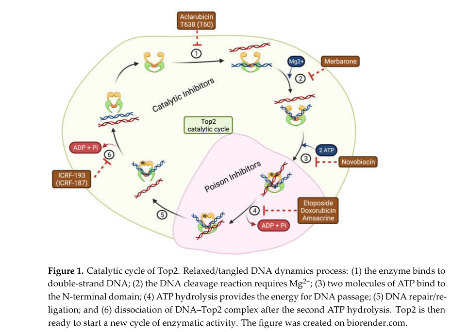

## Question

# Gene Research for Functional Annotation

## ⚠️ CRITICAL: Gene/Protein Identification Context

**BEFORE YOU BEGIN RESEARCH:** You MUST verify you are researching the CORRECT gene/protein. Gene symbols can be ambiguous, especially for less well-characterized genes from non-model organisms.

### Target Gene/Protein Identity (from UniProt):
- **UniProt Accession:** P11388
- **Protein Description:** RecName: Full=DNA topoisomerase 2-alpha; EC=5.6.2.2 {ECO:0000255|PROSITE-ProRule:PRU00995, ECO:0000269|PubMed:19222228, ECO:0000269|PubMed:19697956}; AltName: Full=DNA topoisomerase II, alpha isozyme;
- **Gene Information:** Name=TOP2A; Synonyms=TOP2;
- **Organism (full):** Homo sapiens (Human).
- **Protein Family:** Belongs to the type II topoisomerase family. .
- **Key Domains:** DNA_Topoisomerase_II. (IPR050634); DTHCT. (IPR012542); HATPase_C_sf. (IPR036890); Ribosomal_Su5_D2-typ_SF. (IPR020568); Ribsml_uS5_D2-typ_fold_subgr. (IPR014721)

### MANDATORY VERIFICATION STEPS:

1. **Check if the gene symbol "TOP2A" matches the protein description above**
2. **Verify the organism is correct:** Homo sapiens (Human).
3. **Check if protein family/domains align with what you find in literature**
4. **If you find literature for a DIFFERENT gene with the same or similar symbol, STOP**

### If Gene Symbol is Ambiguous or You Cannot Find Relevant Literature:

**DO NOT PROCEED WITH RESEARCH ON A DIFFERENT GENE.** Instead:
- State clearly: "The gene symbol 'TOP2A' is ambiguous or literature is limited for this specific protein"
- Explain what you found (e.g., "Found extensive literature on a different gene with the same symbol in a different organism")
- Describe the protein based ONLY on the UniProt information provided above
- Suggest that the protein function can be inferred from domain/family information

### Research Target:

Please provide a comprehensive research report on the gene **TOP2A** (gene ID: TOP2A, UniProt: P11388) in human.

The research report should be a detailed narrative explaining the function, biological processes, and localization of the gene product. Citations should be given for all claims.

You should prioritize authoritative reviews and primary scientific literature when conducting research. You can supplement
this with annotations you find in gene/protein databases, but these can be outdated or inaccurate.

We are specifically interested in the primary function of the gene - for enzymes, what reaction is catalyzed, and what is the substrate specificity? For transporters, what is the substrate? For structural proteins or adapters, what is the broader structural role? For signaling molecules, what is the role in the pathway.

We are interested in where in or outside the cell the gene product carries out its function.

We are also interested in the signaling or biochemical pathways in which the gene functions. We are less interested in broad pleiotropic effects, except where these elucidate the precise role.

Include evidence where possible. We are interested in both experimental evidence as well as inference from structure, evolution, or bioinformatic analysis. Precise studies should be prioritized over high-throughput, where available.

## Output

Question: You are an expert researcher providing comprehensive, well-cited information.

Provide detailed information focusing on:
1. Key concepts and definitions with current understanding
2. Recent developments and latest research (prioritize 2023-2024 sources)
3. Current applications and real-world implementations
4. Expert opinions and analysis from authoritative sources
5. Relevant statistics and data from recent studies

Format as a comprehensive research report with proper citations. Include URLs and publication dates where available.
Always prioritize recent, authoritative sources and provide specific citations for all major claims.

# Gene Research for Functional Annotation

## ⚠️ CRITICAL: Gene/Protein Identification Context

**BEFORE YOU BEGIN RESEARCH:** You MUST verify you are researching the CORRECT gene/protein. Gene symbols can be ambiguous, especially for less well-characterized genes from non-model organisms.

### Target Gene/Protein Identity (from UniProt):
- **UniProt Accession:** P11388
- **Protein Description:** RecName: Full=DNA topoisomerase 2-alpha; EC=5.6.2.2 {ECO:0000255|PROSITE-ProRule:PRU00995, ECO:0000269|PubMed:19222228, ECO:0000269|PubMed:19697956}; AltName: Full=DNA topoisomerase II, alpha isozyme;
- **Gene Information:** Name=TOP2A; Synonyms=TOP2;
- **Organism (full):** Homo sapiens (Human).
- **Protein Family:** Belongs to the type II topoisomerase family. .
- **Key Domains:** DNA_Topoisomerase_II. (IPR050634); DTHCT. (IPR012542); HATPase_C_sf. (IPR036890); Ribosomal_Su5_D2-typ_SF. (IPR020568); Ribsml_uS5_D2-typ_fold_subgr. (IPR014721)

### MANDATORY VERIFICATION STEPS:

1. **Check if the gene symbol "TOP2A" matches the protein description above**
2. **Verify the organism is correct:** Homo sapiens (Human).
3. **Check if protein family/domains align with what you find in literature**
4. **If you find literature for a DIFFERENT gene with the same or similar symbol, STOP**

### If Gene Symbol is Ambiguous or You Cannot Find Relevant Literature:

**DO NOT PROCEED WITH RESEARCH ON A DIFFERENT GENE.** Instead:
- State clearly: "The gene symbol 'TOP2A' is ambiguous or literature is limited for this specific protein"
- Explain what you found (e.g., "Found extensive literature on a different gene with the same symbol in a different organism")
- Describe the protein based ONLY on the UniProt information provided above
- Suggest that the protein function can be inferred from domain/family information

### Research Target:

Please provide a comprehensive research report on the gene **TOP2A** (gene ID: TOP2A, UniProt: P11388) in human.

The research report should be a detailed narrative explaining the function, biological processes, and localization of the gene product. Citations should be given for all claims.

You should prioritize authoritative reviews and primary scientific literature when conducting research. You can supplement
this with annotations you find in gene/protein databases, but these can be outdated or inaccurate.

We are specifically interested in the primary function of the gene - for enzymes, what reaction is catalyzed, and what is the substrate specificity? For transporters, what is the substrate? For structural proteins or adapters, what is the broader structural role? For signaling molecules, what is the role in the pathway.

We are interested in where in or outside the cell the gene product carries out its function.

We are also interested in the signaling or biochemical pathways in which the gene functions. We are less interested in broad pleiotropic effects, except where these elucidate the precise role.

Include evidence where possible. We are interested in both experimental evidence as well as inference from structure, evolution, or bioinformatic analysis. Precise studies should be prioritized over high-throughput, where available.

# Research Report: Human TOP2A (UniProt P11388) — Functional Annotation and Current Research (2023–2024 prioritized)

## 0) Target verification (mandatory)
The UniProt accession **P11388** corresponds to **human DNA topoisomerase 2-alpha (TOP2A; DNA topoisomerase IIα; EC 5.6.2.2)**, a **type IIA topoisomerase** that functions as a **homodimeric, ATP-dependent nuclear enzyme** involved in resolving DNA topological problems during replication and mitosis. Multiple recent reviews explicitly describe the enzyme’s ATP-driven strand-passage mechanism, covalent 5′-phosphotyrosyl DNA intermediate, and mitotic chromosome roles consistent with UniProt P11388 and a type II topoisomerase family member. (zhou2024advancesinresearch pages 2-4, matiasbarrios2023theimplicationof pages 2-4)

## 1) Key concepts and definitions (current understanding)

### 1.1 What TOP2A is and why it is essential
**DNA topoisomerase IIα (TOP2A)** is a type II topoisomerase that changes DNA topology by creating a **transient double-strand break (DSB)** in one DNA duplex segment and passing a second duplex segment through the break before **re-ligating** the cut DNA. This enables cells to resolve torsional stress and entanglements that arise during high-throughput DNA transactions. (zhou2024advancesinresearch pages 2-4, matiasbarrios2023theimplicationof pages 2-4)

TOP2A is particularly critical in **proliferating cells**, with expression and abundance peaking around **G2/M**, and with strong **mitotic chromosome association**, matching its primary cellular role in supporting chromosome condensation and segregation. (matiasbarrios2023theimplicationof pages 2-4, zhou2024advancesinresearch pages 2-4)

### 1.2 Catalytic reaction and mechanism (EC 5.6.2.2)
**Core reaction (strand passage / decatenation):** TOP2A catalyzes an **ATP-dependent duplex DNA strand-passage reaction**. Mechanistically, it binds a “gate” DNA segment (G-segment), cleaves both strands, transports a second duplex (T-segment) through the break, and then reseals the G-segment. (zhou2024advancesinresearch pages 2-4, matiasbarrios2023theimplicationof pages 2-4)

**Chemical mechanism:** A catalytic **tyrosine** performs a nucleophilic attack on the DNA phosphodiester backbone to form a **covalent 5′-phosphotyrosyl TOP2A–DNA intermediate** (a reversible cleavage complex) that protects the DNA ends during the cycle. (zhou2024advancesinresearch pages 2-4, matiasbarrios2023theimplicationof pages 2-4)

**Energy/cofactors:** The full catalytic cycle requires **ATP** (binding/hydrolysis drives conformational changes and completion of strand passage) and divalent metal ions such as **Mg2+** for DNA cleavage chemistry. (matiasbarrios2023theimplicationof pages 2-4, matiasbarrios2023theimplicationof media f3b15698)

A schematic of this catalytic cycle and inhibitor intervention points (poisons versus catalytic inhibitors) is shown in a recent review figure (matiasbarrios2023theimplicationof media f3b15698).

### 1.3 Substrates and “specificity”
TOP2A does not recognize a narrow DNA sequence substrate in the way many enzymes recognize small molecules. Its “specificity” is functional/structural: it targets **topological DNA substrates**, including:
- **DNA catenanes** (interlinked sister chromatids) requiring **decatenation** during mitosis. (benoit2025investigatingthemitotic pages 21-25, benoit2025investigatingthemitotic pages 25-28)
- **Positive and negative supercoils**, consistent with its role in resolving torsional stress during replication/transcription and structural maintenance of chromosomes. (benoit2025investigatingthemitotic pages 21-25, matiasbarrios2023theimplicationof pages 2-4)

### 1.4 TOP2A vs TOP2B (context)
TOP2A and TOP2B are two human type IIA topoisomerase isoforms with non-redundant biology. In mitosis, TOP2A is emphasized as the major chromosome-associated isoform required for proper chromosome individualization/segregation, while TOP2B is less tightly chromatin-associated in mitosis in the same discussions. (benoit2025investigatingthemitotic pages 25-28)

## 2) Subcellular localization and biological processes

### 2.1 Nuclear and mitotic chromosome association
TOP2A is **nuclear** and becomes strongly associated with mitotic chromosomes, including enrichment along chromosome axes/scaffold, consistent with a direct role in **mitotic chromosome condensation, individualization, and segregation**. (matiasbarrios2023theimplicationof pages 2-4, benoit2025investigatingthemitotic pages 25-28)

A mitochondrial role for TOP2 isoforms is not supported in the retrieved evidence: a systematic analysis of human topoisomerase localization/activity found **no evidence for TOP2 localization to mitochondria**. (benoit2025investigatingthemitotic pages 21-25)

### 2.2 Cell-cycle functions and checkpoints
TOP2A is tightly linked to late cell-cycle stages and mitotic progression: it is needed to remove persistent sister-chromatid entanglements to enable faithful chromosome segregation. Its activity is integrated with the **decatenation checkpoint**, and cellular outcomes after TOP2A inhibition depend on genetic context such as **p53 status**. (borella2024targetingtop2ain pages 2-4, zhou2024advancesinresearch pages 2-4)

## 3) Regulation: domains, CTD function, and post-translational control
TOP2A contains an N-terminal ATPase region and a central catalytic core (tyrosine-mediated cleavage), and an isoform-specific **C-terminal domain (CTD)** that contributes to **nuclear localization and chromatin tethering**, particularly important for mitotic chromosomal binding and sister chromatid separation. (zhou2024advancesinresearch pages 2-4, benoit2025investigatingthemitotic pages 21-25)

Recent review-level synthesis emphasizes that the CTD undergoes diverse **post-translational modifications (PTMs)** that modulate catalytic activity and protein interactions, supporting a view of TOP2A regulation as a combination of cell-cycle expression control and PTM-tuned chromatin engagement. (zhou2024advancesinresearch pages 2-4)

## 4) Recent developments (2023–2024 prioritized)

### 4.1 Mechanistic framing of TOP2A inhibitors and “topoisomerase poisons”
A 2023 review focused on synthetic-lethal strategies succinctly summarizes a key concept: many clinically used TOP2-targeting chemotherapies are **“poisons”** that stabilize the normally transient TOP2 cleavage complex, converting a controlled intermediate into persistent DNA damage that triggers cell-cycle arrest and cell death. (matiasbarrios2023theimplicationof pages 2-4, matiasbarrios2023theimplicationof media f3b15698)

A 2024 review focused on TOP2A in malignancy and targeted agents identifies TOP2A as a validated target of commonly used drugs including **etoposide** and **doxorubicin/adriamycin**, and distinguishes these poisons from catalytic inhibitors that can inhibit ATPase activity without stabilizing covalent TOP2A–DNA cleavage complexes. (zhou2024advancesinresearch pages 9-11)

**Figure evidence:** The inhibitor intervention points in the TOP2 catalytic cycle (including etoposide/doxorubicin/amsacrine as poisons) are illustrated in Figure 1 of Matias‑Barrios & Dong (2023). (matiasbarrios2023theimplicationof media f3b15698)

### 4.2 Genomic alterations and emerging mutation signatures
A 2024 review aggregates large-cohort genomic observations: across ~24,000 solid tumors, **~4%** show **TOP2A amplification**; in another cohort of **4,903** tumors, **129 (2.6%)** exhibited **TOP2A–HER2 co-amplification**, with some cancer types showing >40% co-amplification in subsets and up to ~10% of breast tumors exhibiting TOP2A amplification without HER2 amplification in the cited analyses. (zhou2024advancesinresearch pages 1-2)

The same synthesis highlights recurrent TOP2A variants (e.g., **p.K743N**) associated with a characteristic mutational signature and links specific somatic variants to altered enzyme function and genomic instability. (zhou2024advancesinresearch pages 1-2, zhou2024advancesinresearch pages 2-4)

## 5) Current applications and real-world implementations

### 5.1 Cancer therapeutics (clinical reality)
TOP2A is a central drug target in oncology because proliferating tumor cells are especially dependent on TOP2A function to manage replication/mitotic stress. Clinically used TOP2 poisons (e.g., anthracyclines and etoposide) exploit the cleavage complex mechanism to induce lethal DNA damage. (zhou2024advancesinresearch pages 9-11, matiasbarrios2023theimplicationof media f3b15698)

A major real-world limitation is toxicity driven by TOP2 interference in normal proliferative tissues: the 2024 review notes that TOP2A inhibition can induce DNA DSBs in bone marrow leading to **myelosuppression**, and TOP2 targeting is associated with **therapy-related leukemias** in clinical contexts. (zhou2024advancesinresearch pages 9-11)

### 5.2 Biomarker uses (pathology and genomics)
Because TOP2A expression peaks in dividing cells, TOP2A is commonly treated as a **proliferation-associated biomarker**. In cholangiocarcinoma, TOP2A immunohistochemical (H-score) stratification was used to define high vs low expressors, and high expression associated with significantly worse survival outcomes. (ong2023prognosticsignificanceof pages 1-2, ong2023prognosticsignificanceof pages 3-5)

In breast cancer endocrine therapy resistance profiling, TOP2A appeared among differentially expressed genes linked to recurrence during endocrine therapy, supporting ongoing use of TOP2A expression in multi-marker recurrence-risk contexts. (ong2023prognosticsignificanceof pages 3-5)

## 6) Expert synthesis and analysis (authoritative interpretations)

### 6.1 Consensus mechanism: transient DSB chemistry is essential but risky
Across recent reviews, a recurring expert interpretation is that TOP2A’s essentiality derives from its ability to solve otherwise intractable topological problems by transiently generating DSBs, but that this same chemistry creates an intrinsic hazard: if the normally reversible cleavage complex is stabilized (by drugs, DNA structures, or mutations), genome instability and cell death can follow. This is the conceptual basis for both anticancer efficacy (poisoning) and adverse outcomes (genotoxicity). (zhou2024advancesinresearch pages 2-4, matiasbarrios2023theimplicationof pages 2-4)

### 6.2 Modern view of regulation: chromatin engagement and CTD/PTMs matter
The 2024 malignancy-focused review highlights that TOP2A’s CTD provides key nuclear localization and chromatin tethering functions and is PTM-modulated, aligning with a contemporary view that catalytic core chemistry is not the full story—efficient, properly localized decatenation in mitosis depends on regulated chromatin engagement. (zhou2024advancesinresearch pages 2-4)

## 7) Recent statistics and data highlights (from recent studies)

### 7.1 Large-scale cancer genomics frequencies (review-synthesized)
- **~4% TOP2A amplification** across ~**24,000** solid tumors. (zhou2024advancesinresearch pages 1-2)
- **129/4,903 (2.6%)** tumors with **TOP2A–HER2 co-amplification** in one compiled analysis; co-amplification exceeded **40%** in some cancer-type subsets in that review’s cited analyses. (zhou2024advancesinresearch pages 1-2)

### 7.2 Cholangiocarcinoma prognosis dataset (primary study; 2023)
Ong et al. (publication date **Apr 2023**; URL https://doi.org/10.31083/j.fbl2804075) analyzed **182 intrahepatic cholangiocarcinoma (iCCA)** cases and reported that **high TOP2A expression** was significantly associated with worse **overall survival, disease-specific survival, and metastasis-free survival** (all **p < 0.0001** in the available text). (ong2023prognosticsignificanceof pages 1-2, ong2023prognosticsignificanceof pages 3-5)

### 7.3 NSCLC metastasis and EMT linkage (primary study; 2024)
Wu et al. (publication date **May 2024**; URL https://doi.org/10.1038/s41598-024-63055-2) report TOP2A is upregulated in NSCLC and functionally promotes **migration/invasion and EMT**, with mechanistic linkage to **Wnt/β-catenin signaling** (interaction with Wnt3a and suppression of TOP2A pro-metastatic effects by Wnt3a silencing). The excerpted evidence did not include numerical effect sizes, but the experimental toolkit included qRT-PCR, immunoblotting/IHC, migration/invasion assays, cytoskeletal staining, and apoptosis/cell-cycle assays. (wu2024expressionandpotential pages 1-2)

### 7.4 Endocrine therapy resistance-associated expression (primary study; 2025, included for quantitative effect size)
In an ER+ breast cancer endocrine-therapy resistance expression study, TOP2A was upregulated in the recurrence group with **log2 fold change 0.79** and **p = 0.0381** (median follow-up 68 months; recurrence in 14/79 patients). (ong2023prognosticsignificanceof pages 3-5)

## 8) Limitations of the retrieved evidence (transparency)
Some requested quantitative outputs (e.g., **hazard ratios and confidence intervals** for TOP2A survival associations in cholangiocarcinoma; numeric effect sizes in the NSCLC mechanistic paper; quantitative results from the ovarian AKT/mTOR paper; and more details from the endocrine-therapy resistance paper) were not present in the excerpted sections available to the evidence-gathering tool. The report therefore cites only quantitative values explicitly present in the retrieved text and flags where HRs/effect sizes are not available from the captured pages. (wu2024expressionandpotential pages 1-2, ong2023prognosticsignificanceof pages 3-5)

## 9) Summary table (functional annotation map)

| Topic | Key findings | Primary citation IDs |
|---|---|---|
| Identity | • UniProt P11388 corresponds to **human TOP2A / DNA topoisomerase IIα**, a type IIA topoisomerase. • Homodimeric, ATP-dependent nuclear enzyme with N-terminal ATPase, central catalytic core, and C-terminal regulatory/chromatin-tethering region. | (zhou2024advancesinresearch pages 2-4, matiasbarrios2023theimplicationof pages 2-4) |
| Catalytic reaction / mechanism | • Catalyzes **ATP-dependent double-strand passage**: binds a gate (G) DNA segment, cleaves both strands, passes a transported (T) duplex through, then religates DNA. • Uses an active-site **tyrosine** to form a covalent **5′-phosphotyrosyl TOP2A-DNA intermediate** during transient DSB formation. • Mg2+ and ATP hydrolysis drive conformational changes and completion of the catalytic cycle. | (zhou2024advancesinresearch pages 2-4, matiasbarrios2023theimplicationof pages 2-4, matiasbarrios2023theimplicationof media f3b15698) |
| Substrates / specificity | • Primary DNA-topology functions are **decatenation of intertwined sister DNAs** and **relaxation of positive/negative supercoils**. • Supports chromosome structural integrity and resolution of DNA entanglements generated during replication/mitosis rather than sequence-specific DNA recognition. | (benoit2025investigatingthemitotic pages 21-25, matiasbarrios2023theimplicationof pages 2-4, benoit2025investigatingthemitotic pages 25-28) |
| Localization / cell-cycle role | • Predominantly **nuclear**; enriched on mitotic chromosome axes/scaffold and required for chromosome condensation, individualization, and segregation. • Expression is **cell-cycle regulated**, peaking in **G2/M**, and TOP2A remains chromosome-associated during mitosis. • No evidence supports TOP2A as a mitochondrial topoisomerase in human cells. | (benoit2025investigatingthemitotic pages 21-25, matiasbarrios2023theimplicationof pages 2-4, benoit2025investigatingthemitotic pages 25-28) |
| Regulation / PTMs | • The **C-terminal domain (CTD)** contains nuclear localization information and a chromatin-tethering region important for mitotic chromosome binding. • CTD undergoes diverse **post-translational modifications** that modulate catalytic activity and protein interactions. • Function is linked to the **decatenation checkpoint** and influenced by **p53** status. | (zhou2024advancesinresearch pages 2-4, borella2024targetingtop2ain pages 2-4) |
| Drug targeting / poisons vs catalytic inhibitors | • **TOP2 poisons** (e.g., **etoposide, doxorubicin/adriamycin, amsacrine**) stabilize the cleavage complex after DNA breakage, increasing persistent DNA damage. • **Catalytic inhibitors** (e.g., **ICRF-193**, merbarone, ATPase-directed agents) inhibit cycle progression without necessarily stabilizing covalent TOP2A-DNA complexes. • Drug mechanism differences are central to efficacy, toxicity, and checkpoint responses. | (benoit2025investigatingthemitotic pages 21-25, zhou2024advancesinresearch pages 9-11, matiasbarrios2023theimplicationof media f3b15698) |
| Recent cancer genomics / prognostic statistics | • Review data across ~**24,000** solid tumors found **~4% TOP2A amplification**; among **4,903** tumors, **129 (2.6%)** showed **TOP2A-HER2 co-amplification**; >40% co-amplification reported in some breast/ovarian/gastroesophageal/pancreatic subsets. • In **182 iCCA** patients, high TOP2A expression associated with worse OS/DSS/MFS (**all p < 0.0001**). • Recurrent somatic variants such as **p.K743N** are linked to characteristic mutational signatures/genome instability. | (zhou2024advancesinresearch pages 1-2, ong2023prognosticsignificanceof pages 1-2, ong2023prognosticsignificanceof pages 3-5) |
| Recent mechanistic cancer findings | • In **NSCLC**, TOP2A upregulation promoted migration, invasion, EMT, and survival; knockdown reduced these phenotypes, with effects tied to **Wnt/β-catenin/Wnt3a** signaling. • In ovarian cancer, TOP2A knockdown caused **G1 arrest**, apoptosis, and reduced proliferation, with rescue implicating **AKT/mTOR** signaling. • In endocrine-therapy-resistant ER+ breast cancer, **TOP2A** was upregulated (**log2FC 0.79, p = 0.0381**) and correlated with proliferation-associated recurrence risk. | (wu2024expressionandpotential pages 1-2, ong2023prognosticsignificanceof pages 3-5) |

*Table: This table condenses the key functional annotation points for human TOP2A, covering its verified identity, enzymatic mechanism, localization, regulation, drug interactions, and recent cancer-related findings. It is useful as a compact evidence map linking core biology to clinically relevant research.*

## References (retrieved sources; publication date and URL)
- Matias‑Barrios VM, Dong X. **The Implication of Topoisomerase II Inhibitors in Synthetic Lethality for Cancer Therapy**. *Pharmaceuticals*. **Jan 2023**. https://doi.org/10.3390/ph16010094 (matiasbarrios2023theimplicationof pages 2-4, matiasbarrios2023theimplicationof media f3b15698)
- Ong KH et al. **Prognostic Significance of DNA Topoisomerase II Alpha (TOP2A) in Cholangiocarcinoma**. *Frontiers in Bioscience*. **Apr 2023**. https://doi.org/10.31083/j.fbl2804075 (ong2023prognosticsignificanceof pages 1-2, ong2023prognosticsignificanceof pages 3-5)
- Wu J et al. **Expression and potential molecular mechanism of TOP2A in metastasis of non-small cell lung cancer**. *Scientific Reports*. **May 2024**. https://doi.org/10.1038/s41598-024-63055-2 (wu2024expressionandpotential pages 1-2)
- Zhou T et al. **Advances in research on malignant tumors and targeted agents for TOP2A (Review)**. *Molecular Medicine Reports*. **Dec 2024**. https://doi.org/10.3892/mmr.2024.13415 (zhou2024advancesinresearch pages 1-2, zhou2024advancesinresearch pages 2-4, zhou2024advancesinresearch pages 9-11)
- Borella F et al. **Targeting TOP2A in Ovarian Cancer: Biological and Clinical Implications**. *Current Oncology*. **Dec 2024**. https://doi.org/10.3390/curroncol31120594 (borella2024targetingtop2ain pages 2-4)

References

1. (zhou2024advancesinresearch pages 2-4): Tao Zhou, Yiting Niu, and Yanjun Li. Advances in research on malignant tumors and targeted agents for top2a (review). Molecular Medicine Reports, Dec 2024. URL: https://doi.org/10.3892/mmr.2024.13415, doi:10.3892/mmr.2024.13415. This article has 11 citations and is from a peer-reviewed journal.

2. (matiasbarrios2023theimplicationof pages 2-4): Victor M. Matias-Barrios and Xuesen Dong. The implication of topoisomerase ii inhibitors in synthetic lethality for cancer therapy. Pharmaceuticals, 16:94, Jan 2023. URL: https://doi.org/10.3390/ph16010094, doi:10.3390/ph16010094. This article has 35 citations.

3. (matiasbarrios2023theimplicationof media f3b15698): Victor M. Matias-Barrios and Xuesen Dong. The implication of topoisomerase ii inhibitors in synthetic lethality for cancer therapy. Pharmaceuticals, 16:94, Jan 2023. URL: https://doi.org/10.3390/ph16010094, doi:10.3390/ph16010094. This article has 35 citations.

4. (benoit2025investigatingthemitotic pages 21-25): J Benoit. Investigating the mitotic roles of topoisomerase 2 alpha and topoisomerase 2 beta-binding protein 1 in the maintenance of chromosome structure and genome …. Unknown journal, 2025.

5. (benoit2025investigatingthemitotic pages 25-28): J Benoit. Investigating the mitotic roles of topoisomerase 2 alpha and topoisomerase 2 beta-binding protein 1 in the maintenance of chromosome structure and genome …. Unknown journal, 2025.

6. (borella2024targetingtop2ain pages 2-4): Fulvio Borella, Stefano Fucina, Ylenia Seminara, Pietro Denti, Domenico Ferraioli, Luca Bertero, Niccolò Gallio, Jessica Cusato, Giorgio Valabrega, Alberto Revelli, Luca Marozio, and Stefano Cosma. Targeting top2a in ovarian cancer: biological and clinical implications. Current Oncology, 31:8054-8074, Dec 2024. URL: https://doi.org/10.3390/curroncol31120594, doi:10.3390/curroncol31120594. This article has 8 citations.

7. (zhou2024advancesinresearch pages 9-11): Tao Zhou, Yiting Niu, and Yanjun Li. Advances in research on malignant tumors and targeted agents for top2a (review). Molecular Medicine Reports, Dec 2024. URL: https://doi.org/10.3892/mmr.2024.13415, doi:10.3892/mmr.2024.13415. This article has 11 citations and is from a peer-reviewed journal.

8. (zhou2024advancesinresearch pages 1-2): Tao Zhou, Yiting Niu, and Yanjun Li. Advances in research on malignant tumors and targeted agents for top2a (review). Molecular Medicine Reports, Dec 2024. URL: https://doi.org/10.3892/mmr.2024.13415, doi:10.3892/mmr.2024.13415. This article has 11 citations and is from a peer-reviewed journal.

9. (ong2023prognosticsignificanceof pages 1-2): Khaa Hoo Ong, Hong-Yue Lai, Ding-Ping Sun, Tzu-Ju Chen, Steven Kuan-Hua Huang, Yu-Feng Tian, Chia-Lin Chou, Yow-Ling Shiue, Ti-Chun Chan, Chien-Feng Li, and Yu-Hsuan Kuo. Prognostic significance of dna topoisomerase ii alpha (top2a) in cholangiocarcinoma. Frontiers in bioscience, 28 4:75, Apr 2023. URL: https://doi.org/10.31083/j.fbl2804075, doi:10.31083/j.fbl2804075. This article has 7 citations and is from a peer-reviewed journal.

10. (ong2023prognosticsignificanceof pages 3-5): Khaa Hoo Ong, Hong-Yue Lai, Ding-Ping Sun, Tzu-Ju Chen, Steven Kuan-Hua Huang, Yu-Feng Tian, Chia-Lin Chou, Yow-Ling Shiue, Ti-Chun Chan, Chien-Feng Li, and Yu-Hsuan Kuo. Prognostic significance of dna topoisomerase ii alpha (top2a) in cholangiocarcinoma. Frontiers in bioscience, 28 4:75, Apr 2023. URL: https://doi.org/10.31083/j.fbl2804075, doi:10.31083/j.fbl2804075. This article has 7 citations and is from a peer-reviewed journal.

11. (wu2024expressionandpotential pages 1-2): Jiatao Wu, Wenjuan Li, Xueying Zhang, Fan Shi, Qianhao Jia, Yufei Wang, Yuqi Shi, Shiwu Wu, and Xiaojing Wang. Expression and potential molecular mechanism of top2a in metastasis of non-small cell lung cancer. Scientific Reports, May 2024. URL: https://doi.org/10.1038/s41598-024-63055-2, doi:10.1038/s41598-024-63055-2. This article has 26 citations and is from a peer-reviewed journal.

## Artifacts

- [Edison artifact artifact-00](TOP2A-deep-research-falcon_artifacts/artifact-00.md)

## Citations

1. benoit2025investigatingthemitotic pages 25-28
2. benoit2025investigatingthemitotic pages 21-25
3. zhou2024advancesinresearch pages 2-4
4. zhou2024advancesinresearch pages 9-11
5. zhou2024advancesinresearch pages 1-2
6. ong2023prognosticsignificanceof pages 3-5
7. wu2024expressionandpotential pages 1-2
8. matiasbarrios2023theimplicationof pages 2-4
9. ong2023prognosticsignificanceof pages 1-2
10. https://doi.org/10.31083/j.fbl2804075
11. https://doi.org/10.1038/s41598-024-63055-2
12. https://doi.org/10.3390/ph16010094
13. https://doi.org/10.3892/mmr.2024.13415
14. https://doi.org/10.3390/curroncol31120594
15. https://doi.org/10.3892/mmr.2024.13415,
16. https://doi.org/10.3390/ph16010094,
17. https://doi.org/10.3390/curroncol31120594,
18. https://doi.org/10.31083/j.fbl2804075,
19. https://doi.org/10.1038/s41598-024-63055-2,